

<h3><a target="_blank" href="https://bit.ly/3asSXIA">请多传破网软件，使更多的人了解真相从而得救，这是给自己积福德。 https://bit.ly/3asSXIA </h3></a>

   

     
<h3 align="center"><b>免翻视频  https://bit.ly/3ezRQKo  (请收藏网址 https://git.io/swspip)</b></h3> 

<h3 align="center"><b>复制网址到谷歌或火狐浏览器打开。若出现 “提示” ，請点击“继续”访问即可。</b></h3> 

<h3 align=center><a href="https://github.com/gav01/Heart/blob/master/news1.md">● 看更多大紀元時事 ●</a></h3>

<a href=https://git.io/souye><h6 align="right">回首頁</h6></a>

<a name=top>
 
 
 
 
 
 <a href =#129>129.中共利用疫情进行虚假宣传 刻意打造信息战 
<a href =#128>128.制鞋龙头宝成湖北厂关闭 逾四千人失业 
<a href =#127>127.CIA报告：中共边囤口罩 边阻世卫发警报 
<a href =#126>126.加西卑诗政要恭贺法轮大法洪传28周年 
<a href =#125>125.中共病毒肆虐东北三省 沈阳再现确诊病例 
<a href =#124>124.【一线采访】武汉一小区封闭 上班族停工 
<a href =#123>123.湖南假奶粉再现 致儿童头骨畸形似大头娃娃 
<a href =#122>122.【拍案惊奇】中共火箭掠过纽约专家谈三峡溃坝 
<a href =#121>121.山东临沂人大副研究员吁民主 被关精神病院 
<a href =#120>120.日政府携400企业 促医疗物资生产撤出中国 
<a href =#119>119.邓炳强未正面回答“党员身份”引发热议 
<a href =#118>118.大陆民众赞法轮功 祝李洪志大师生日快乐 
<a href =#117>117.【独家】陕西政府文件泄中共GDP大造假 
<a href =#116>116.【一线采访】吉林爆疫情舒兰公安局关门 
<a href =#115>115.中共不配合病毒调查 美议员提严厉制裁法案 
<a href =#114>114.「眼见为实」的母亲亲历神迹 
<a href =#113>113.美国先知凯西 预言当今的中国与世界 
<a href =#112>112.上海东华大学实验室爆炸案 受伤学生起诉校方 
<a href =#111>111.【新闻看点】真把世界惹恼了 北京最怕什么？ 
<a href =#110>110.印度军方证实中印军队在边界爆发冲突 
<a href =#109>109.中共火箭失控 飞掠洛城和纽约 坠入大西洋 
<a href =#108>108.网曝广东虎门大桥异常抖动的另一原因 
<a href =#107>107.持有枪支弹药 内蒙公安厅高官之子获刑 
<a href =#106>106.回应中共瞒疫 川普拟禁联邦退休金投资中企 
<a href =#105>105.加拿大三级政要贺法轮大法洪传28周年（1） 
<a href =#104>104.粤千亿P2P平台退场 涉11万投资人百亿借贷 
<a href =#103>103.一名中国成功商人的传奇故事 
<a href =#102>102.母亲节抗争未休 港人因人性走出来 
<a href =#101>101.大陆各地频现火灾 车辆建筑古树突然起火 
<a href =#100>100.大陆失业者：去年如生活在地狱 今年更糟 
<a href =#99>99.【拍案惊奇】孙力军曾刺习？疫情下谁发横财 
<a href =#98>98.「六一零」的「秘密经费」 
<a href =#97>97.德国人权协会：中共应结束对法轮功的打压 
<a href =#96>96.广东交警队长儿子肇事逃逸一年多仍不被起诉 
<a href =#95>95.突爆多宗确诊病例 吉林舒兰进入战时状态 
<a href =#94>94.中共赖不过去的账谁来还？ 
<a href =#93>93.青年遭构陷関精神病院 自残就医险被摘器官 
<a href =#92>92.悉尼不同族裔同庆世界法轮大法日 
<a href =#91>91.澳洲“金刚狼”挫败中共“战狼” 
<a href =#90>90.一位澳洲大学生触怒了谁？ 御用大律师介入 
<a href =#89>89.多国领袖欲施压世卫 促独立调查病毒传播 
<a href =#88>88.FBI盯上了他 
<a href =#87>87.传十多个百亿富豪曾被扣北京 只想保命 
<a href =#86>86.美国务院指中共外交官用假账号发假消息 
<a href =#85>85.纽约73名儿童患“多系统炎症综合症” 1男童殁 
<a href =#84>84.印第安纳州警长代表全美警长起诉中共 
<a href =#83>83.中共内斗加剧 习近平政法系三大亲信浮出 
<a href =#82>82.瘟疫促供应链移出中国 印度拟吸引千家美企 
<a href =#81>81.澳洲人权活动家：感恩法轮大法创始人 
<a href =#80>80.【新闻看点】全球反共潮汹涌 北京做最坏打算？ 
<a href =#79>79.【最新疫情5·9】俄国再日增万例感染数近20万 
<a href =#78>78.飞上蓝天 
<a href =#77>77.【明慧特稿】二波瘟疫将起，又将定时定地？ 
<a href =#76>76.【独家】中共密件曝医院恐被债务压垮 
<a href =#75>75.美国务院：美挺台成联合国周边组织观察员 
<a href =#74>74.全球调查 专家：中共高层忧“世纪之罪”曝光 
<a href =#73>73.云南腐败重灾区女副市长被捕 丈夫年初被查 
<a href =#72>72.【新闻看点】中共鹰派突变调 承认攻台两大困境 
<a href =#71>71.中共火箭残骸坠贵州 巨响剧毒吓哭村民 
<a href =#70>70.中共长征五号升空 充气返回舱试验失败 
<a href =#69>69.报告揭秘：微信监控海外用户 助国内审查 
<a href =#68>68.迫害中，她失去了丈夫、儿子、父亲、弟弟 
<a href =#67>67.从司徒雷登到蓬佩奥谁说真话党骂谁   
<a href =#66>66.养猪不生猪瘟的秘诀 
<a href =#65>65.被点名有权邀台参与WHA 谭德塞又回避问题   
<a href =#64>64.反共潮高涨 《九评共产党》热卖 再版发行 
<a href =#63>63.中欧关系风向变 中共病毒改变了这一切    
<a href =#62>62.中共领导人长命之谜 靠的是什么？ 
<a href =#61>61.美B-1B轰炸机出动 中共少将为武统台湾降温   
<a href =#60>60.【十字路口】美领军索赔 万亿关税警告中共 
<a href =#59>59.港澳办发指令制造混乱 香港地下党浮出水面    
<a href =#58>58.纳瓦罗：美国人要懂“中共撒谎 人民死亡” 
<a href =#57>57.曝光甘肃武威监狱监狱长马占明的恶行 
<a href =#56>56.萧茗采访班农：你见了国内出逃科学家吗 
<a href =#55>55.迎513法轮大法日 台湾学员谈修炼受益故事 
<a href =#54>54.钟南山列4类无症状感染者 称定义不够准确 
<a href =#53>53.华裔病毒研究者遭枪杀 更多细节流出 
<a href =#52>52.地政署长离奇调职 港警黑幕调查遇阻 
<a href =#51>51.【内幕】监控百姓 大连政府保密合同曝光  
<a href =#50>50.外媒：金正恩“装死”为找叛徒 或清洗异己 
<a href =#49>49.【疫情最前线】青藏高原惊现28种未知病毒 
<a href =#48>48.【有冇搞错】中共元老被软禁？ 
<a href =#47>47.【纽约疫情5.5】地铁关闭 数百名警察将到场赶人 
<a href =#46>46.公安部整肃延烧香港 邓炳强涉僭建丑闻曝光 
<a href =#45>45.无尽感恩 台湾花莲宜兰学员庆祝法轮大法日 
<a href =#44>44.513世界法轮大法日 南加名校长表达感恩 
<a href =#43>43.【独家】早知疫情？中共频下生物安全通知 
<a href =#42>42.调查世卫和中共关系 川普手握一张王牌  
<a href =#41>41.世界新闻日 中共打压新闻自由殃及全球生命 
<a href =#40>40.大陆上市公司首季利润减53% 经济陷恶性循环  
<a href =#39>39.中共内部报告称面临六四后最恶劣国际形势 
<a href =#38>38.遭央视谩骂的第二个美国人 班农说了啥？  
<a href =#37>37.中共瞒疫被追责 专家与外交官不同调的背后 
<a href =#36>36.蓬佩奥：大量证据将病毒和武汉实验室相联  
<a href =#35>35.公安部洗牌 港警丑闻曝光 牵出国安级爆料 
<a href =#34>34.川普：中共犯了一个可怕错误 还不想承认  
<a href =#33>33.【一线采访】北京新规 房地产恐面临倒闭潮 
<a href =#32>32.【直播回放】5.4疫情追踪：中国南北爆疫情 
<a href =#31>31.美国加速与中共经济脱钩 建立新经济圈 
<a href =#30>30.【瘟疫与中共】死亡名单中党员占大多数  
<a href =#29>29.贵州孩子哭喊「我要爸爸妈妈」离世 
<a href =#28>28.高温来袭 河南荥阳郑州多市气温超40℃ 
<a href =#27>27.【一线采访】原材料价暴涨 陆口罩厂经营难 
<a href =#26>26.【翻墙必看】金正恩露面手腕惊现神秘疤痕 
<a href =#25>25.【新闻看点】美连6大动作 美中角力升级 
<a href =#24>24.【拍案惊奇】朝媒报金正恩现身 习家邓家对呛？ 
<a href =#23>23.四川宜宾大桥发生坠落事故 市民：太吓人了 
<a href =#22>22.【一线采访】武汉军运村变方舱 业主抗议 
<a href =#21>21.【内幕】不让公民回国 中共却优待俄国嫌犯 
<a href =#20>20.【瘟疫与中共】西非小国六位内阁部长染疫 
<a href =#19>19.疫期人流少 上海青浦区政府趁机强拆民房 
<a href =#18>18.朱同：中共“表演式”复工复产 
<a href =#17>17.刚卸任两天 张旅集团前董事长坠桥身亡 
<a href =#16>16.脱北韩国议员：99%确定金正恩上周已死 
<a href =#15>15.尼米兹号重返亚太 云峰试射成功 美台连盟抗共 
<a href =#14>14.遭央视连骂三天 蓬佩奥反在中国人气飙升 
<a href =#13>13.冉崇碧为女维权11年 揭中共打压访民真相 
<a href =#12>12.国际做空机构：陆企“跟谁学”40%客户不存在 
<a href =#11>11.英医疗界：中国产呼吸机可致病人于死地 
<a href =#10>10.大陆爆高传染性致死性“虾虹彩病毒”疫情 
<a href =#9>9.为何改变对习近平看法 川普首次详细说明 
<a href =#8>8.【有冇搞错】傅政华四千公安要挟 习近平失平衡 
<a href =#7>7.谢田：官媒“万里投毒”和“建设祖国”的诡谲 
<a href =#6>6.【十字路口】中共暗阻川普连任 蔡政府退订红媒 
<a href =#5>5.【独家】武汉同济医院文件曝活摘罪恶    
<a href =#4>4.【独家】疫情急 牡丹江康安医院或被接管 
<a href =#3>3.中共再祭影视战狼条款 港台艺人或动辄遭索赔   
<a href =#2>2.中共甘肃省长喊话：经济“十万火急” 
<a href =#1>1.【最新疫情5·1】川普：调查疫情爆发原因    
  
  
  
  
  
  
  
  
  
  
  
  
  
  
  
  
  
 
 
<a name=129>
<h1 align="center"><b>中共利用疫情进行虚假宣传 刻意打造信息战</b></h1>

一名研究人员表示，中共政府控制着成千上万的虚假社交媒体账户（或称为机器人账户），向外发布关于中共病毒和其它一些敏感话题的虚假消息。(GLENN CHAPMAN/AFP/Getty Images)

【大纪元2020年05月14日讯】（大纪元记者吴畏编译报导）一名研究人员表示，中共政府控制着成千上万的虚假社交媒体账户（或称为机器人账户），向外发布关于中共病毒和其它一些敏感话题的虚假消息，还对香港民主抗议活动发动攻击。

彭博社5月12日报导，专门分析社交媒体网站信息运作情况的本杰明·斯特里克（Benjamin Strick）称，这些账户被用来攻击那些批评中共政府的异见人士，并散布病毒起源美国的阴谋论。

<b>中共每天注册数百推特账号 传播假信息</b>

在4月25日至5月3日之间，斯特里克说，他在推特（Twitter）社交平台上发现了一千多个与传播中共虚假信息相关的账户，在脸书（Facebook）上也发现了五十多个不同的页面。他估计，作为中共媒体宣传的一部分，每天有300或400个新的虚假推特账户被注册。

“（中共的）社交媒体（宣传）网络已经形成了，并且在快速增长，”斯特里克在接受采访时说， “我相信这是一个由（中共）政府发起的社交媒体宣传战。”

报导说，斯特里克最新的研究结果表明，中共加大了与中共病毒相关的虚假信息传播，以开脱自己的罪责，并试图甩锅给他国。尽管许多人对这些虚假信息表示怀疑，或者要进一步搞清楚，但中共的宣传战还在加大力度。

<b>“精心打造的信息战”</b>

上周在调查网站Bellingcat时发表的研究报告中，斯特里克将中共这个宣传战描述为“精心打造的信息战”，以一种协调的方式开展虚假信息传播，“在陈述中以偷换命题为伎俩，塞入其歪理邪说。”

去年8月，推特公司发现的900个账户有几乎同样的内容和操作痕迹，这些账户被中共政府利用对香港抗议事件散布虚假信息。

Graphika公司的调查主管本尼莫（Ben Nimmo）表示，斯特里克查出的账户似乎与一个名为“ Spamouflage Dragon”的网络组织相关联，该组织先前被发现通过在YouTube、推特和脸书上使用被劫持和虚假账户来对香港抗议者发动攻击。

Graphika在2019年9月的一份报告中将Spamouflague Dragon网络组织描述为“一个活跃而多产的，但影响很小的跨平台政治垃圾邮件网络组织”，其目的是全方位替中共政府作宣传，并抹黑异见人士。

中共则对此予以否认。

推特公司发言人在一份声明中说，公司正在“主动监视”其平台内容，“查找任何试图操纵推特信息平台的行为，并将减少其影响。”

发言人说：“如果我们确定存在着任何国家或政府支持的信息宣传活动发生在推特平台，我们将予以披露。”

脸书没有回应置评请求。

<b>用中英文两种语言发布虚假内容</b>

斯特里克说，这些账户散布虚假信息，毫无根据地还将吸烟（vaping）与中共病毒联系在一起，并在“#新冠状病毒”和“#关于病毒的真相”标签下，宣传有关美国生物安全事件所引发大瘟疫的阴谋论。这些虚假账户还宣传了其它一些虚假消息，包括批评香港民主抗议人士。

斯特里克还说，推特上的许多账户都有中文名称，并以中英文两种语言发布内容，而该组织的其它账户则使用以西里尔字母书写的俄语账户名称，这可能是这些账户的归属地不在中国大陆。

5月8日，美国国务院全球参与中心说，已经在推特上发现了“一个新的虚假账户组织”，该组织声称是“旨在扩大中国（共）的宣传和信息战”。尚不清楚这些推特的账户是否与斯特里克发现的那些账户相同。

<a target="_blank" href=#top><h6 align="right">回上方</h6></a>
 
 
<a name=128>
<h1 align="center"><b>制鞋龙头宝成湖北厂关闭 逾四千人失业</b></h1>
   <h3 align="center"><b>中国面临史无前例失业潮</b></h3>

宝成湖北厂关闭，四千余人失业。图为资料照。(AFP)

【大纪元2020年05月14日讯】（大纪元记者刘毅报导）在中共病毒（武汉肺炎）冲击之下，全球制鞋龙头宝成集团位于中国湖北的工厂被关闭，失业人员多达四千余人。有大陆学者认为，中国在瘟疫冲击之下将面临有史以来最大的失业潮。

中共病毒肆虐全球，消费者需求大幅减少，国际知名品牌Nike、Adidas等陆续关闭了北美、欧洲的门店，再加上NBA也停止了剩余赛事，奥运会延期举行等，令市场需求减少，面对销量下滑，这些国际品牌也陷入了观望之中，为这些品牌加工的代工厂订单也大幅减少，一些工厂不得不裁员、给员工放无薪假，甚至关闭工厂以渡过难关。

<b>宝成湖北厂关闭 4000余人失业</b>

据《经济日报》5月13日消息，宝成集团的主要品牌客户第2季订单减少四到五成；更可怕的是，国际大厂第3季的预估单“仍不明朗”。有业界人士对此表示，国际品牌客户的订单通常在前一季就已拿到预估单，今年确实是前所未见。

面对困境，宝成集团关闭了湖北厂，该厂约有5,000名员工，其中台湾和大陆的干部已经被调往其它生产基地工作，四千余名基层员工经协商后于上周陆续解除劳动合同。

这是宝成集团日前决定高阶主管减薪及6月1日开始部分员工放无薪假后，再次传出裁员消息。

消息显示，受中共病毒冲击，宝成今年前四月合并营收比去年同期减少22.2%，创近六年来同期新低。

<b>大陆学者：中国面临史无前例失业潮</b>

面对经济下滑，内外需求疲弱，北京的政治经济评论家张林（Zhang Lin，音译）认为，中共瘟疫造成的失业潮远远大于上世纪九十年代末2500万国企工人的下岗潮，甚至比2008-2009年金融危机造成的2000万农民工返乡潮都要严重。

据自由亚洲电台消息，张林认为中国目前创造就业岗位的能力大幅减少，九十年代中国国企大幅裁员时，当时民营企业兴起吸收了大量员工，2008年金融危机时，中国的城市化催生了大批服务业岗位。但是现在，“增长放缓，城市化到了顶峰，私营经济在挣扎，”张林说。

华盛顿信息与战略研究所所长李恒青也认同这种观点，他表示，中国已不再具备当年的救市能力，本身经济结构不平衡，已经进入下行阶段，再加上2018年以后的中美贸易战、2020年的瘟疫打击，现在是雪上加霜，难以翻身。

<b>失业率惊人 中共以投资基建促就业无果</b>

中共官方数据显示，今年2月，中国官方城镇调查失业率升至6.2%，外出农民工减少超五千万。3月失业率为5.9%，失业率仍处高位。但是非官方的失业率远远高于这个数字。

中泰证券首席经济学家李迅雷4月26日在个人公众号发布《中国失业率有多高？》的测算，他认为中国的失业率约为20.5%，有7000万人失业。深圳望正资产管理公司首席经济学家刘陈杰则预计，瘟疫可能导致2.05亿工人遭遇“摩擦性失业”，失业率超过25%。

面对失业大军，中共近期推出了超过一万亿人民币、包含5G基建等七大领域的高新科技的“新基建”，希望以此解决企业复工复产、农民工和毕业生的就业问题。

但是，李恒青认为，新基建在各省市未来五十万亿基建投资中的比例大概小于百分之十，对于缓解农民工失业是杯水车薪，“六十多万座5G基站能用多少人来建？而且新能源、5G基站都需要很多专业技术，农民工教育和技术水平相对低一些，解决其就业问题不容易，还得靠旅游业、餐饮业这些服务性行业，（这些服务性行业）现在要么关，要么停。”

<a target="_blank" href=#top><h6 align="right">回上方</h6></a>
 

<a name=127>
<h1 align="center"><b>CIA报告：中共边囤口罩 边阻世卫发警报</b></h1>

美媒体报导，美国中央情报局（CIA）的最新报告说，中共在1月试图阻止世界卫生组织（WHO）对中共病毒（冠状病毒）发出警报的同时，也在从世界各地囤积医疗用品。(SAUL LOEB/AFP/Getty Images)

【大纪元2020年05月14日讯】（大纪元记者林燕编译报导）美国《新闻周刊》周二（5月12日）刊文说，美国中央情报局（CIA）认为，中共在1月试图阻止世界卫生组织（WHO）对中共病毒（冠状病毒）发出警报的同时，也在从世界各地囤积医疗用品。

美国两名情报官员已经确认了这份美国中央情报局的报告。报告说，中共威胁世卫，如果世卫宣布全球紧急情况，中方将停止与世卫的中共病毒（冠状病毒）调查合作。

中央情报局报告中的时间表被命名为“联合国-中国（中共）：世卫组织在意、但也不忠于中国（中共）”（U.N.-China: WHO Mindful But Not Beholden to China）。这是西方情报机构近期的第二份相关报告。

上周，德国《明镜周刊》报导了德国情报机构对世卫与中国的评估报告。这两份报告的一致之处是，都认为中共压制了一月的疫情信息，并借此从世界各地囤积医疗用品。不同之处在于，德国指责中国国家主席习近平于1月21日亲自对世卫总干事谭德塞施压；美国没有强调这一点。

世卫目前否认习近平亲自干预此事，但拒绝回答是否有中共官员力图推迟或改变世卫在宣布突发公共卫生事件（PHEIC）的决定。

世卫发言人克里斯蒂安·林德迈尔（Christian Lindmeier）回复《新闻周刊》说：“谭德塞没有在1月20日、21日或22日与习主席进行沟通；谭德塞及他的资深团队于1月28日在北京会见了习主席；没有在那次会议上提出PHEIC的问题。”

1月28日，世卫总干事谭德塞在中国人民大会堂获得中国国家主席习近平的接见。当时，世卫组织国际卫生条例委员会专家正在讨论是否建议世卫宣布新型冠状病毒（中共病毒）为国际关注的突发公共卫生事件，他们直到1月30日才正式宣布此事。

且在宣布当日，世卫竭尽全力为中共辩护，说中共没有做错任何事情；当中共病毒肆虐全球，世卫为中共说话的做法激起了多国的愤怒，并促使美国总统川普（特朗普）公开批评世卫以“中国（中共）为中心”，并在4月暂停美国对世卫的注资。

《新闻周刊》报导说，CIA的最新报告有可能进一步加剧美国和中国（中共）之间在大流行病上的紧张关系。目前，发源于武汉的中共病毒已导致全球至少28万人丧生，其中四分之一都是美国人。因中共官方素有瞒报嫌疑，中国国内因病毒致死人数的数目远超官方公布的统计数据。

根据中国海关总署的数据，北京在1月24日至2月29日期间进口了25亿件防疫个人防护设备（PPE），其中包括超过20亿个口罩。从海外采购医疗用品的做法，获得了中共驻海外使领馆的大力支持，与此同时，这个世界上人口最多的国家已经做好了应对日益严重的中共病毒疫情爆发的准备。

但随后这种疫情蔓延到中国境外，且几乎蔓延到地球上的每个国家，一些刚向中国出口个人防护装备的国家转眼也面临医护物资短缺的境况。

而北京旋即开展了一项宣传运动，包括向世界多国提供个人防护装备、医护人员和其它援助，甚至用援助物资胁迫受援国接受条件。

外界认为，中共力欲反转国际社会对其“病毒输出国”的负面印象，目前正软硬兼施、企图避免国际社会对其掩盖疫情进行追责。

美国白宫制造业和贸易顾问彼得·纳瓦罗（Peter Navarro）4月初接受福克斯新闻采访时说：“如果（中共囤积25亿件医护用品的）统计数字是在讲述一个故事——中国（中共）知道危险性而不告诉世界其它国家、它并走出来囤积世界市场上的个人防护用品。我认为这是一个重要的议题，至少在这一切结束之后，我们需要就此进行讨论，因为这是一个严肃的问题。”

<a target="_blank" href=#top><h6 align="right">回上方</h6></a> 
 
 
<a name=126>
<h1 align="center"><b>加西卑诗政要恭贺法轮大法洪传28周年</b></h1>

2020年5月13日是传世28周年，也是第21届“世界法轮大法日”，加拿大卑诗省国会议员及市长们纷纷祝贺法轮大法洪传28周年，并发出褒奖令。（大纪元合成图）

   
   【大纪元2020年05月13日讯】（大纪元温哥华记者站报导）2020年5月13日，是李洪志先生创立的法轮大法（也称法轮功）洪传于世28周年，也是第21届世界法轮大法日。加拿大卑诗省的多位国会议员和市长发出褒奖或贺信，表达他们对法轮大法的敬重，并坚定地支持法轮功学员为捍卫信仰而努力。另有四个城市把2020年5月13日确定为他们城市的法轮大法日。

发出贺信和褒奖的11名卑诗省国会议员和市长如下，按图片中排列顺序，从上至下，从左至右：

•温哥华都会区国会议员布拉德·维斯（Brad Vis）

•加拿大绿党领袖和国会议员伊丽莎白·梅（Elizabeth May）

•温哥华都会区国会议员塔玛拉·詹森（Tamara Jansen）

•温哥华都会区国会议员马克·道尔顿（Marc Dalton）

•温哥华都会区新西敏市长乔纳森·科特（Jonathan Coté）

•卑诗省苏克市（District of Sooke）市长玛雅·泰特（Maja Tait）

•温哥华都会区高贵林港市长布莱德·韦斯特（Brad West）

•温哥华都会区兰里镇区市长杰克·弗洛斯（Jack Froese）

•卑诗省基隆拿市长科林·巴士拉（Colin Basran）

•卑诗省纳内莫市长伦纳德·克罗格（Leonard Krog）

•温哥华都会区穆迪港市长罗布·瓦格拉莫夫（Rob Vagramov）

上述国会议员和市长们发出的贺信和褒奖详见如下：

<b>国会议员布拉德·维斯：法轮大法促进了人与人之间相互尊重和理解</b>

卑诗省米什-马兹奎-菲沙坎农（Mission-Matsqui-Fraser Canyon ）选区的国会议员布拉德·维斯（Brad Vis）在贺信中表示：

很荣幸地向所有参加“法轮大法日”庆祝活动的人们表示祝贺。

广阔的Mission-Matsqui-Fraser Canyon以拥有各种不同的文化背景、宗教和民族传统为豪。

在法轮大法学员们欢聚庆祝这个重要日子之际，愿我们的社区继续散发团结、热情和欢乐的讯息。

我要赞扬法轮大法协会为弘扬中国文化艺术，帮助建立一个健康、包容的社区所作出的努力。法轮大法修炼者们坚持不懈地弘扬真善忍，促进了我们社区人与人之间的相互尊重和理解。

尽管要保持社交距离，今年的庆祝活动会有所不同，但我们会与家人一起在网上庆祝法轮大法日。

送上我最衷心的祝愿：愿和平、健康和幸福相伴。

<b>加拿大绿党领袖和国会议员伊丽莎白·梅：坚定地支持你们</b>
   

加拿大绿党领袖和Saanich—Gulf Islands选区的国会议员伊丽莎白·梅（Elizabeth May）的贺信。

   
   伊丽莎白·梅（Elizabeth May）在贺信中说：在法轮大法日到来之际，作为加拿大绿党领袖和Saanich—Gulf Islands选区的国会议员，谨向你们的庆祝活动送上我最诚挚的祝福。

我非常敬重法轮大法所倡导的真善忍原则。我与你们站在一起，不仅是在此时的欢庆时刻，也在你们为捍卫信仰而努力之时，坚定地支持你们。

<b>国会议员塔玛拉·詹森：法轮大法受到尊重和颂扬</b>

  

温哥华地区Cloverdale-Langley City选区国会议员塔玛拉·詹森（Tamara Jansen）的贺信.

   
   温哥华地区Cloverdale-Langley City选区国会议员塔玛拉·詹森（Tamara Jansen）在贺信中写道：

我很高兴向所有庆祝法轮大法日的人们致以最热烈的问候。

尽管今年的庆祝活动以不同的方式进行，但法轮大法真、善、忍的原则仍继续受到尊重和颂扬。

加拿大在支持宗教自由、人权和法治方面有着良好的记录。我和我的同事们将永远为全球的这些自由而战。

请接受我最良好的祝愿，祝您节庆愉快。

<b>国会议员马克·道尔顿：同庆法轮大法日</b>

 

温哥华地区匹特草原-枫树岭（Pitt Meadows-Maple Ridge）选区国会议员马克·道尔顿（Marc Dalton）的贺信。

  
   
   温哥华地区匹特草原-枫树岭（Pitt Meadows-Maple Ridge）选区的国会议员马克·道尔顿（Marc Dalton）在贺信中写道：

在一年一度的法轮大法日到来之际，谨向你们表示祝贺。

在这个非常时期，能有这样的节日让人们同贺同庆，真是令人鼓舞。

在疫情全球大流行的当下，在这个多元化的国度，我们坚信的“真”是如此重要。我们必须坚守“善”与友爱，关心邻里，帮助那些比我们困难的人。我们展示和平与“忍”，共同面对困难时期，有时是黑暗的日子，相信这一切都是暂时的。当渡过难关后，我们会变得更强壮，注重人生更深层的意义。

与你们共同庆贺这个非常特别的日子。

<b>新西敏市长乔纳森·科特：真善忍是如此重要</b>

 

新西敏市长乔纳森·科特（Jonathan Coté）的贺信。

  
   
   温哥华都会区新西敏市长乔纳森·科特（Jonathan Coté）在贺信中写道：

在2020年5·13法轮大法日之际，谨代表新西敏市议会和市民向法轮大法协会表示最诚挚的问候。

法轮大法真善忍的原则与我们社区众多民众的价值观共鸣，特别在当前的困难时期，这些价值观尤其重要。

愿你们的庆祝活动盛大，且为所有参与者带来福祉和喜乐。

<b>卑诗省苏克区市长玛雅·泰特褒奖法轮大法日</b>

卑诗省苏克区（District of Sooke）市长玛雅·泰特（Maja Tait）发出的褒奖令，庆祝世界法轮大法日。

 
   
卑诗省苏克区（District of Sooke）市长玛雅·泰特（Maja Tait）发出褒奖，庆祝世界法轮大法日。褒奖令翻译如下：

鉴于，法轮大法修炼者在日常生活中遵循“真善忍”的修炼原则；

鉴于，法轮大法修炼者注重心性的提高，在任何环境、任何情况下都要求做一个更好的人；超越文化及种族的界限；

鉴于，法轮大法广度众生，没有年龄、职业及宗教信仰的区分；

鉴此，我，苏克地区市长玛雅·泰特（Maja Tait），特此宣布2020年5月13日为苏克地区“法轮大法日”。

<b>高贵林港市长布莱德·韦斯特赞赏法轮大法为社会带来祥和</b>

  

高贵林港市长布莱德·韦斯特（Brad West）的贺信。

   
   温哥华都会区高贵林港市长布莱德·韦斯特（Brad West）在贺信中写道：

卑诗省拥有引以为豪的多元文化，使我省得以发展壮大。我们由衷地赞赏法轮大法所倡导的真、善、忍原则，为社会带来一片祥和。

在当前的形式下，很高兴听到你们在保持社交距离下，今年仍以不同的方式庆祝法轮大法日，并继续提高人们的意识——加拿大所拥有的开放、包容、宗教和信仰自由的可贵。

诚挚地送上我们对这次庆祝活动——旨在为开创一个更美好的世界最美好的祝福。

愿你们的功法继续洪扬并产生积极的影响！

<b>兰里镇市长杰克·弗洛斯希望把大法的福音带给所有人</b>

  

兰里镇区（Township of Langley）市长杰克·弗洛斯（Jack Froese）的贺信。

 
 温哥华都会区兰里镇区（Township of Langley）市长杰克·弗洛斯（Jack Froese）在贺信中写道：

在庆祝2020年5月13日法轮大法日之际，谨代表兰里镇区议会，向法轮大法协会及支持者们致以最诚挚的问候。

一年一度的庆祝活动，这个中国传统的自我提升功法促进了社区的祥和与健康。人们通过打坐炼功，并按照“真、善、忍”的指导原则，得到了精神、道德的升华和身心的健康。

愿你们的庆祝活动成功，尤其是在当前的困难时期，希望你们把福音带给所有人。

<b>基隆拿市长科林·巴士拉褒奖庆祝世界法轮大法日</b>

卑诗省基隆拿市长科林·巴士拉（Colin Basran）颁发法轮大法褒奖令，翻译如下：

鉴于，法轮大法洪传28周年，是世界上最受欢迎的修炼功法之一；

鉴于，法轮大法是一个平和的自我提升功法，根植于中国传统文化，以“真善忍”为指导提高心性，辅以五套缓慢的炼功动作，包括打坐；

鉴于，法轮大法创始人李洪志先生，使世界上亿民众获得了健康的身体和道德的提升；通过修炼法轮大法，加深了他们对生命、人类及宇宙的认识；

鉴于，法轮大法自1992年在中国面向公众传出，有众多的加拿大人受益；至今，法轮大法已传遍世界114个国家，吸引了各行各业，不同年龄的人士修炼；个人或集体炼功均适宜；学功不收任何费用，由义工免费教功；

鉴此，我，基隆拿市长科林·巴士拉（Colin Basran），特此宣布2020年5月13日为基隆拿市“法轮大法日”。

<b>纳内莫市长伦纳德·克罗格褒奖庆祝法轮大法日</b>

 

卑诗省纳内莫市长伦纳德·克罗格（Leonard Krog）的褒奖令。

  
   
   卑诗省纳内莫市长伦纳德·克罗格（Leonard Krog）在法轮大法洪传28周年之际，发出褒奖令，庆祝大法洪传28周年。褒奖令翻译如下：

鉴于，法轮大法是一个古老的、以“真善忍”宇宙特性为指导的上乘性命双修功法；

鉴于，法轮大法修炼者在日常生活中遵循“真善忍”的修炼原则，在任何环境、任何情况下都要求做一个更好的人；

鉴于，当前在COVID-19（中共病毒，武汉肺炎）瘟疫大流行的困难时期，我们意识到这些价值观和准则对所有人来说都至关重要；

鉴于，自1992年5月13日法轮大法在中国面向公众传出后，为超过一百多个国家的上千万民众带来了身心的健康；

鉴于，法轮大法超越了文化和种族的界限，为建立一个更加和平、包容和富有同情心的社会带来贡献，

鉴此，我，纳内莫市长伦纳德·克罗格（Leonard Krog），特此宣布2020年5月13日为纳内莫市“法轮大法日”

<b>穆迪港市长罗布·瓦格拉莫夫祝法轮大法日快乐</b>

 

穆迪港市长罗布·瓦格拉莫夫（Rob Vagramov）的贺信。

 
   
   温哥华地区穆迪港（Port Moody）市长罗布·瓦格拉莫夫（Rob Vagramov）在贺信中写道：

谨代表穆迪港市，向所有参加2020年5·13法轮大法日庆祝活动的人们表达最诚挚的祝福。

作为移民，我非常感激且铭记加拿大这个拥有众多像穆迪港这样的多元文化城市的国家，而且成为来自世界各地人们的家园。法轮大法真善忍的指导原则通过这样的庆祝活动，给这里带来了欢庆的气氛，文化和传统的庆典使得我们的社区、省份和国家变得如此美好。尽管我们处在困难时期，要保持社交距离，不能用往年的方式庆祝法轮大法日，但无可置疑的是，我们颂赞这些价值观更凸显出其特别重大的意义。

在卑诗省及整个加拿大，我们很荣幸能够拥有开放、多元化和信仰自由的价值观。作为自豪的加拿大人，能够行使自己的权利和自由而心存感激。祝您们法轮大法日快乐。

穆迪港市议会在5月12日晚还通过决议褒奖法轮大法，把2020年5月13日确定为穆迪港市的“法轮大法日”。

穆迪港市议会在5月12日晚还通过决议褒奖法轮大法，把2020年5月13日确定为穆迪港市的“法轮大法日”。

  
   
   <a target="_blank" href=#top><h6 align="right">回上方</h6></a>
 
 
<a name=125>
<h1 align="center"><b>中共病毒肆虐东北三省 沈阳再现确诊病例</b></h1>

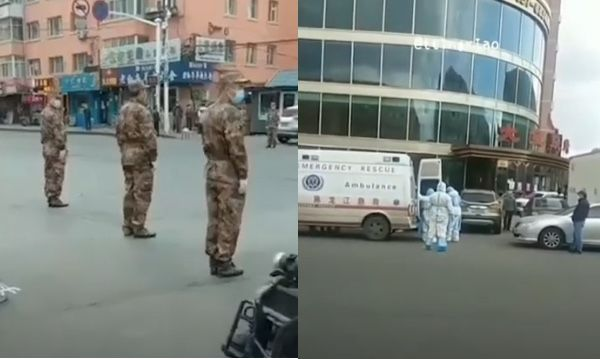

网传视频显示，黑龙江省哈尔滨市道外区草市街市场上，有军人直接在街头站岗。（视频截图／大纪元合成）

【大纪元2020年05月14日讯】（大纪元记者方晓报导）大陆东北三省的中共病毒（武汉肺炎）疫情近期再度复燃，不断出现聚集性疫情，确诊病例持续上升。

对于中共病毒的疫情，沈阳市疾控中心主任孙百军5月14日在新闻发布会上称，继5月10日沈阳市发生1例来自吉林市舒兰市的跨省病例后，又连续出现2例与该病例关联的确诊病例。

5月10日确诊的病例郝某某是从吉林市返沈人员，其父、堂兄、堂嫂均为确诊病例。4月30日，郝回吉林市探亲，5月5日晚返沈。5月10日被诊断为确诊病例。

病例孙某某与郝某某同寝室，5月10日作为密切接触者被集中隔离，5月11日诊断为无症状感染者，5月13日转为确诊病例。

病例吕某某与郝某某在同单位工作，上班期间与郝在吸烟室有过接触，5月12日因发热被急救车送至医院，5月13日被诊断为确诊病例。

目前沈阳当局排查出3例病例的密切接触者354人，其中在沈阳的220人，传外省市134人；排查出密切接触者的密切接触者366人，其中在沈阳331人，传外省市35人；排查出密切接触者的密切接触者的密切接触者542人。其中病例郝某某在沈阳密切接触者165人，病例孙某某在沈阳的密切接触者11人，病例吕某某的密切接触者44人。

由于中共惯于欺瞒，因此官方通报的疫情数据被外界普遍认为严重缩水。

最近一个月以来，继黑龙江哈尔滨出现聚集性疫情以后，吉林省舒兰市也发生聚集性疫情，且这两地的疫情均跨省传播到辽宁省。

自吉林市舒兰市5月7日爆发一例本地确诊病例，该市公安局一名洗衣工被确诊感染中共病毒，该洗衣工又传染给多人，并跨省传播至辽宁沈阳。

舒兰市5月10日宣布进入“战时状态”后，吉林省吉林市亦在5月13日发出封城通知，即乡镇、社区全面实行封闭管理，所有客运班线、旅游包车停运。全市所有室内景区、影剧院、歌舞厅、游艺厅、营业性演出场所、网吧、室内体育场馆、棋牌室、麻将馆、台球厅、浴池等人员聚集场所一律停止营业。

此外，城区药店、诊所停止销售退热、抗病毒、抗生素类药品，诊所禁止接诊发热病人。所有人员在进入公共场所，乘坐公交车、出租车、网约车等公共交通工具都必须戴口罩。

<a target="_blank" href=#top><h6 align="right">回上方</h6></a>
 
 
<a name=124>
<h1 align="center"><b>【一线采访】武汉一小区封闭 上班族停工</b></h1>

武汉街头、三民小区、商铺的景况。（网络图片大纪元合成）

   
   【大纪元2020年05月14日讯】（大纪元记者骆亚采访报导）近日，武汉东西湖三民小区出现多例中共病毒（武汉肺炎）确诊病例，小区实现全面封闭式管理，小区房屋的门都被铁板钉死。民间传又有十多例确诊，小区内原先的上班族也全部停工。

据当地官方的消息，武汉市东西湖区长青街三民小区5月9日、10日两天出现6名确诊病例。12日下午，三民小区实施全封闭管理，小区及周边地区已开展大规模核酸检测，检测总人数约7万人。

据中共官媒报导，6例确诊病患的密切接触者共120余人，已全部集中隔离。

官媒还称，该小区有二三十栋六层高的楼房及低矮平房，有东西两个出入口。片区内有制造企业、物流园区、居民区及学校。目前统计小区内共有870户、2105人。

但官方的数据与来自民间的数据不符。该小区居民披露的集中隔离密切接触者有三百多人，并且目前又新增了13例确诊病例，小区内所有上班族全部不能去上班了。

另有小区居民披露，全小区有四十多栋楼、一千多户家庭的近五千人居住，人员成分复杂，本地业主与外来租户共存。10日，社区广场上搭建了十几个雨阳棚，有中央、省、市、区、卫健委、医院医生、护士、公安、消毒、城管、交警等部门的人员组成的“联防联控”队伍进驻三民小区，分批对小区居民进行核酸检测、抽血化验。居民必须在家隔离14天。

当地的知情者告诉大纪元，“当地本来就不是零新增，这次三民小区的事情比较严重。现在这个小区的门都被用铁板钉死了，无法理解当局这种极端行为，沿街面的商铺也关闭了。”

<h4 align=center><a href="https://twitter.com/CrossstreamW/status/1260689315786457088?ref_src=twsrc%5Etfw%7Ctwcamp%5Etweetembed%7Ctwterm%5E1260689315786457088&ref_url=https%3A%2F%2Fwww.epochtimes.com%2Fgb%2F20%2F5%2F13%2Fn12104925.htm">武漢三民小區開始「坐監」了。(点击右键,另存新档）</a></h4> 

该知情者还表示，在她有限的接触范围之内，在这场疫情中离世的人比例还挺高的。“可以想像当时武汉这个医疗系统崩溃的状态，很多人在医院是因为这件事情吧，本身是正常人，但是因为医院早期防范不够，在医院被感染到肺炎（中共病毒，又称武汉肺炎），有的人没有办法进入到医院救治，就在家里隔离，然后去世了，这种情况非常非常多。甚至在外边倒在地上没有人来收尸，就等殡仪馆的车来把尸体拉走，这种情况很多。”

她说，现在武汉很多人的情绪非常紧张，“比如你和一个人讲话，仅仅是手里拿着手机都会引起对方的警觉。网上、手机上一些简单的讯息、非机密的讯息都会引起人们的恐惧。”

居住在武汉华南海鲜市场附近的吴先生向大纪元记者表示，这不是第二波爆发的问题，“我感觉可能是原本就没有消停，这回是捂不住了，所以曝光出来了。实际感染人数可能更多。”

此外，武汉的中通快递向客户发“告知书”说，接到湖北省委通知，武汉市部分区域（东西湖区、武昌区、汉阳区、江夏区、江岸区、洪山区、蔡甸区、青山区）从5月12日起，受新冠病毒（中共病毒）影响，全省部分区域暂停揽派业务。何时恢复，将另行通知。

另外，中共官媒也承认小区曾有20例确诊病例，这次的病因主要来源于既往社区感染。武汉还因此发布紧急通知，全市范围内开展全员核酸筛查工作，要求各区按十天作为期限，各区目前正在制定实施方案。

 <h4 align=center><a href="https://twitter.com/Onebtcer/status/1260543144229105664?ref_src=twsrc%5Etfw%7Ctwcamp%5Etweetembed%7Ctwterm%5E1260543144229105664&ref_url=https%3A%2F%2Fwww.epochtimes.com%2Fgb%2F20%2F5%2F13%2Fn12104925.htm">武汉全民检测进社区。(点击右键,另存新档）</a></h4>

但武汉当局的做法遭到民间质疑，有网民认为，这只是为中共两会“献礼”，“5月14日武汉疫情又起，全民核酸检测开始。市民冒雨排队等待检测！武汉本地加上流动人口约1100多万，按照要求，十天之内全员检测，这是什么概念？每天要检测100万左右，以现在的能力可能做到吗？这种检测跟医学已没太大关联了，这已是政治上的考量了。十天以后拿出漂亮的作假数据，好向两会献礼！”

有消息称，从5月15日开始，武汉天河机场要陆续接受海外回来的华侨及留学生5万多人，在武汉隔离。武汉又要紧张了。#

<a target="_blank" href=#top><h6 align="right">回上方</h6></a>
 
 
<a name=123>
<h1 align="center"><b>湖南假奶粉再现 致儿童头骨畸形似大头娃娃</b></h1>

【大纪元2020年05月13日讯】（大纪元记者方晓报导）湖南再现“假奶粉大头娃娃”事件，郴州市永兴县多名家长发现自己孩子食用“倍氨敏”的奶粉后，出现头骨畸形酷似“大头娃娃”等多种异常情况。而这种“奶粉”实为固体饮料。这已经是郴州市近期第二次发现“大头娃娃”假奶粉事件。

据湖南经视报导，近日，永兴县多名患者家长发现自己孩子身体出现湿疹，体重严重下降，头骨畸形酷似“大头娃娃”，还有不停拍头等异常情况。经媒体调查发现，这些患儿被医院确诊为“佝偻病”，且都食用了一款名为“倍氨敏”的“特医奶粉”。实际上，这款“奶粉”是一种固体饮料，并不具有特医奶粉资质。

<h4 align=center><a href="https://twitter.com/mywayne0511/status/1260510009802162176?ref_src=twsrc%5Etfw%7Ctwcamp%5Etweetembed%7Ctwterm%5E1260510009802162176&ref_url=https%3A%2F%2Fwww.epochtimes.com%2Fgb%2F20%2F5%2F13%2Fn12104118.htm">再爆一次，兒童是國家的未來，拿兒童來賺黑心錢，天理難容！(点击右键,另存新档）</a></h4>

据报导，5名受害儿童此前到医院体检时，被诊断为牛奶过敏，医生遂建议家长购买氨基酸奶粉给孩子食用。家长们随后到郴州爱婴坊母婴店买奶粉，经店员强烈推销，最终购买了“倍氨敏”。虽然有家长对产品包装标示“固体饮料”提出质疑，但店员声称倍氨敏是店里最好的奶粉，也是最畅销的，家长不知有诈。然而，孩子饮用“倍氨敏”后，出现异常情况，后被医院确诊患上佝偻病。

报道曝光事件后，引起舆论哄动。

永兴县委宣传部12日晚对外回应称，涉事母婴门店从湖南唯乐可健康产业有限公司购进的47件“倍氨敏”固体饮料已全部售出。

《新京报》5月13日报导，联系到涉事产品“倍氨敏”生产方湖南唯乐可健康产业有限公司。该公司官方客服表示，“倍氨敏”产品已在2019年年中停产，目前公司已经介入调查。

陆媒发现，此次已是郴州市在一年多来第2次发生“大头娃娃”假奶粉事件。

2018年10月，李女士的8个月大婴儿时出现腹泻，未见好转，并出现咳嗽发烧等症状，于是带孩子到医院求诊，发现孩子对牛奶高度过敏，当时医生就指改用现时饮用的奶粉，建议她买一款“舒儿呔氨基酸配方粉”奶粉，并要求饮完6个月后再复检。

但李女士指孩子饮完舒儿呔奶粉后，发现过敏症状一直都未有改善，而且身高体重的增加严重滞后。

另一名彭女士的5个多月婴儿在2018年2月，改用医生建议的“舒儿呔氨基酸配方粉”奶粉，6个月后再覆检，孩子饮完后，其睡眠和湿疹问题更加严重，身体腹部出现肤色不均现象，且身高体重的增加严重滞后。

此后至少有10多位家长联名指郴州儿童医院医生向患儿推销“舒儿呔氨基酸配方粉”，导致患儿头骨畸形等，并要求当地处理郴州假奶粉事件，

<a target="_blank" href=#top><h6 align="right">回上方</h6></a>
 
 
<a name=122>
<h1 align="center"><b>【拍案惊奇】中共火箭掠过纽约专家谈三峡溃坝</b></h1>

中共失控火箭掠过纽约，坠落大西洋。专家警告，三峡溃坝风险。（新唐人合成）

   
   【大纪元2020年05月13日讯】大家好，欢迎收看《新闻拍案惊奇》，我是大宇。

【中共失控火箭掠过纽约坠落大西洋】

我们在前一天节目的最后，提到5月5日，中共最大的火箭「长征五号B」已经失控，在5月11日的某一时刻，会坠落到地球表面，而且坠落过程也是不受控制的。这是1991年前苏联「礼炮7号」空间站之后，落回地面的最大的太空垃圾。

残骸长30米，直径是5米，当初起飞时，重量达到850吨，因而受到包括美军在内的多方关注。现在大家已经知道了这枚火箭残骸落在哪里。

5月11日当天，这枚残骸接连飞掠了美国西岸的洛杉矶和东岸的纽约市上空，甚至直直飞过纽约中央公园头顶170公里的天空，最终坠落到了西非海岸附近的大西洋海面。

一位哈佛大学的天文学家惊讶表示：从没见过落回地面的太空垃圾，会掠过如此多的人口稠密地区。中共这一次，实实在在地在全世界面前刷了一下存在感。
你说发生的这些破事，怎么都跟它有关呢？

并且，最近中共火箭发射连连失败，比如4月9日，中共的长征三号乙火箭，在升空后50秒爆炸。究其接连失败的原因，俄罗斯媒体认为，是中共的火箭发动机技术剽窃的是前苏联的，但是当中有一些问题至今没能解决。

【中共谋窃疫苗研发川普：它什么事做不出】

而中共剽窃外国技术据为己有，而后再跟外国拼高低的事，已经屡见不鲜。美国情报实力相当了得，经常听情报官汇报的美国总统们，更是对世界发生的许多大事，了然于胸，有些事可以公开说，有些事不便公开说。

但是中共的剽窃等不君子之行为，已经在如今染指中共病毒疫苗的研发，逼得美国总统川普说出了这样的感叹之语：

有什么事是中共做不出来的呢？一国之总统在公开回话中，把另一个政权说得如此不堪，背后一定是看尽了对方龌龊的真实，才会口出如此之语，宣泄气愤。

【遗失硬盘泄露千人计划美籍华裔专家被捕】

除了剽窃疫苗的指控，最近又有一名隐藏在美国的中共「千人计划」华裔专家，被挖了出来。他是现年63岁的阿肯色大学华裔工程学教授「洪思忠」。

美国司法部5月11日宣布，洪思忠已于5月8日周五被逮捕。2013年以来，他从美国NASA等机构，获得了超过500万美元的联邦补助，但是他却用研究所得，来参与「千人计划」。

这个「千人计划」很多观众是知道的，简单讲，就是中共利用世界各国的、参与计划的科技专家，获取各国敏感的技术知识，这样中共可以把别国多少年的研究成果，直接剽窃到手，实际上是卑劣的非法行为。

洪思忠露出狐狸尾巴从表面上看，是很背运的一件事。他有一次，将自己的一个硬盘落在了阿肯色大学的图书馆，有人把它交到失物招领处，工作人员检查内容，为了找到失主，但是却发现其中一封电子邮件存档。

洪思忠在上面写道，大意是：「由于政治氛围，最近对我来说有些事情变得非常困难，因为美国正在查『千人计划』参与者，没有多少人知道我是其中之一，如果我泄漏了，我在这里的工作将非常麻烦。」于是，这封电邮，真的最终把他交到了美国司法部的手里。

目前，他可能面临「电汇诈欺罪」指控，若定罪可最多坐牢20年，那估计他这余生，就要在牢中度过了。

【中共又要重谈贸易协议川普：够了！】

刚才是谈到中共剽窃技术说了这些，也提到了川普在记者会上，听闻中共剽窃疫苗技术指控的反应。其实在当场的同一名记者，又接着问了另一个问题，说他听说中共还要重谈贸易协议。这个事已经发生过不止一次了，反覆无常，换谁都够了。川普回答得也很直截了当。

从川普的种种回应来说，可以感到，他对中共所作所为的厌倦与气愤。我相信，这是因为他越来越看清对方的面孔，还有种种事件的真相。

【央视自报武汉研究室有人出逃传言再被坐实】

前一段时间，川普政府前最高策师班农，在自己节目中透露，有武汉病毒研究所的高级研究人员出逃。后来又有的消息说，出逃的不止一人，而且其中一位已经抵达美国纽约，将情资转交美国政府。这涉及，中共病毒起源的真相。

其实我们对是谁出逃，出逃的人所带出的情资有多么重要，并不是很清楚。但是大陆央视5月12日的一段新闻报导，却有一种「不打自招」的微妙。似乎是在告诉人们：出逃的人确有其事，而且曝光的材料，可能对中共伤害很大。

这段央视的新闻片段，被华人网友上传到推特，不少人跟贴留言说，本来对有人出逃的事还比较怀疑，现在不相信都难了。也有人说，中共大肆提及此事，是害怕的表现，等等。

其实现在，中共最该着急的，再也不是甩锅和补墙这些可以归类于「装修」的动作，所谓不治已病治未病，它们倒是该着急一下，自己面临的「未病」。比如瘟疫的继续蔓延等等。

【习近平山西「拜佛」 是危急中求免灾吗】

我们看到，习近平著急了，5月11日，去山西「拜佛」。

中共党官不让别人信神啊、拜佛啊，他们自己却是最相信这些事的一群人。但也不都是信神，据我所知，也有信鬼、拜鬼的。但是不管怎么说，习近平好像局势一紧张，他就经常跑到拜佛之所走访。

去年8月，贸易战和香港反送中等胶着之际，他突然去游览了敦煌莫高窟。如今，5月11日，他又跑到山西大同到「云岗石窟」。在他任内，延续了中共拆教堂、毁佛寺、摧道观、杀信众的灭绝政策，但是呢，他这次去云岗却说，云冈石窟「是人类文明瑰宝，要坚持保护第一」，这是新华社报导的大标题啊。

是不是在当前形势下，作为中共「一尊」，感受到了不仅共党岌岌可危，连自己前程也可能有危险的压力，所以在佛像前做点好事，想消灾解难呢？那怎么可能呢，谁能保佑罪大恶极的人或组织呢。

有的朋友会说，人家又没说是去拜佛。是，大陆公开报导没说，但这么紧张的时刻他去那里做什么呢？所以外界很多人就分析认为，那就是拜佛咯。除非有更进一步的真相被曝光出来，我们也会跟大家及时更新。

【2020中共厄运连连天灾人祸预示着什么】

但是，就像我们刚才说的，如果一个人或一个组织，罪大恶极，谁会去保护它呢？习近平自己拜佛没用，应该让更多人拥有信仰自由，有些不喜欢中共的网友会认为，习近平还不如学学戈尔巴乔夫来得痛快。

我们节目一开始说到，中共最大的一个长征火箭坠落，也是1991年前苏联太空站坠落后，最大的太空垃圾。那1991年后来发生什么了？前苏联解体了。这次又是一个载着中共满满希冀的「燃料桶」从天而降，不知今年会发生什么。

很多人，以前不承认，就年初的时候还不承认，还喜欢用中共灌输的进化论、排神的、人在天地间、在浩瀚宇宙间「孤立存在」的这个观点，去在这个格子里去看问题，却不愿意跳出这个「格子」，看看今年发生的到底是些什么事。

很多人以前不承认，2020年发生的这些事是「天警世人」也好，对中共还有它的信徒的「天谴」也好，现在有更多人在震惊之余，冷静下来，在想发生的这些事到底是怎么回事。把以前被「共产」的思想解放了出来，慢慢在变成自己的思想。而这个思想，却是充满人性、人道、善良、天意的。

我最近看了一篇长文，就是不在中共设定的框框里，来解读当今的这场瘟疫，我看后也是感觉震惊、感受到了警讯。但我们今天卖个关子，今天先不分享有关的文章，也许明天或之后的节目中，跟大家说。

【再谈三峡大坝汶川地震或因它死难者家属再遭维稳】

但是，今天可以跟大家聊聊有关的，另外一件事，就是「三峡大坝」。

大家今年，可能很多人看了迪士尼的动画新片《冰雪奇缘2》。里面身为国王的女主人公的祖父，为了夺人之地，在人家的地盘上修了一个大坝，美其名曰改善水利，结果大坝将让对方的土地失去灵性，产生了源源不断的问题，最后动画的结局是，大坝被摧毁，故事线索中，一切一切恩怨的那个死结，就这么被解开了。双方土地上的人民都开始了新的、更美好的生活。

这个动画片的情节刚一公开的时候，很多人就想到了中国大陆的「三峡大坝」。三峡大坝从建之前、到建成、到现在，一直是争议不断，而且它建成后，根据不同的一些专家的观点，造成了一系列的生态问题。

比如，今天是5月12日，12年前的这一天，四川汶川大地震，造成罕见的悲剧，这场地震就有专家说，跟三峡大坝造成的后患有关。

很多当时在上课的学生直接被倒塌的建筑物压死，如今很多死难学生的家属，聚集到一起悼念，这个画面拍到的，大约有上百名家长。他们都是在前去「维稳」的中共特警和便衣的监视之下，进行悼念。看到这我就在想，对中国人来说，谁是国？哪是国？你的国被人在维稳，你自己作为国的子民，也在被维稳。

此外，话说回来，三峡大坝建成后，长江中下游洪涝灾害加重，而且也造成了生物物种的劫难，例如，有观点认为，非常珍贵的鱼类中华白鲟，最近灭绝了，也是跟三峡有关。

【三峡下泄水力是普通洪水25倍今年泄洪已在提速】

前段时间，三峡还出现了变形。如果说三峡造成的生态问题，很严重，但是三峡一旦真的溃了，那造成的事件就不是问题严重来形容了，而是「中华浩劫」。《冰雪奇缘2》里，最后大坝溃了，Elsa用法力把汹涌的洪水挡住，避免了水淹城堡，救了人们的性命，可是现实中，人会这样幸运吗？

话说到这，为什么今天提到三峡了呢？因为最近有一个不算新闻的新闻，得到人们的热切议论，一些媒体也在报，所以我们也关注一下，它形成一个不大不小的热点了嘛。就是先后有两个不同领域的专家，对三峡再次提出警告。一方是科学家，一方是风水学家。

先来看科学家，海外《阿波罗新闻网》最近刊登三峡问题专家王维洛博士的观点，向中国人提出警告，说三峡不仅没有防洪的作用，反而是一种「洪水加压器」。喷水的胶皮管口，把它捏小，喷出的水柱不就更急更猛了嘛，三峡大坝一旦出问题，就会起到这样的加压作用。

王维洛说，三峡大坝上游的河段，宜昌到石首的这个区间，洪水总的传播时间，在三峡大坝建成后，缩短为6小时，而天然洪水是30小时，这将造成，三峡库区的洪水，速度将是天然洪水的5倍，而下泄洪水的破坏力是天然洪水的多少呢？是25倍！

举个例子，1975年8月，河南驻马店地区的板桥水库溃坝，洪水一泻千里，24万人死亡，火车的油罐车够重吧？被洪水冲出去几十公里，那当时的洪水最大流速是每秒三十多公里，而现在三峡泄洪时的水速是多少呢？每秒六十公里。注意哦，是有控制地泄洪，还不是溃坝，就达到这个速度。那要真是溃坝，真可以用「江」「泽」民这个词来形容了，这个大坝还真是他当政的时候修建的。

5月11日，大陆媒体还报导，长江三峡的主汛期6月10日才到，为了提前腾出库容防洪，三峡大坝已经释泄出大量江水。库内水位急降，速度比去年提前了8天。这也说明三峡泄洪的速度，已经提速。

【港风水师预言五六月8.3级地震危及三峡】

另外呢，就是一位名为「权朗」的香港风水师的观点。

她根据风水知识预测，今年的5月到6月，中国西南还要有重大的地震，强度至少是8.3级，将不比当年汶川地震轻微，而最令人关注的，是她提到，地震会直接危及三峡大坝，可令大坝决堤、倒塌。而这种事一旦出现，就是生灵涂炭。

当然，目前这是风水师的一个预测，我们希望大家都能平安无事。

但是三峡有事，武汉将又在射程之内。而现在，武汉还没有从瘟疫中脱身呢。

【上海物流公司「泄密」 武汉多区如重回封城状态】

5月12日，上海一家物流公司贴出告知书，通知客户，说他们接到了湖北省委的通知，武汉的部分区域，包括东西湖区、武昌、汉阳、江夏、江岸、洪山、蔡甸区还有青山区，受病毒瘟疫影响，将暂停相关快递业务，何时恢复另行通知。

也有人在聊天时，引用了这个物流公司的告知书，并透露她的姐姐在武汉某医院的传染科工作，人都住满了，情况挺严重。

在武汉市东西湖区的一个社区，当地政府要求所有人进行核酸检测，画面中，这些人排起长队，在武汉解封后，这样的景象也许并不多见，值得警惕。

而就在此刻，国外对中共隐瞒疫情的索赔问责，也一并跟进了。在浙江省军区的一个干休所，还特意为此给干休所住户发出通知。要他们一旦收到美国法院的相关疫情问责案件的判决书，不要签收，目的是「防止造成国际影响」。

【中共要渤海实弹演习三个月！美军近日战机军舰齐出】

内忧外患之际，中共再次出现可疑军事活动。

中共海事局5月11日发出一个在渤海的军事演习通告，宣称要在5月14日到7月31日这两个半月多的时间里，进行实弹演习。很多人怀疑，什么实弹演习，要搞这么长时间呢？到底目的是什么呢？

而在5月10日，美军这边也有动静，此前因为疫情受影响的军舰，不少都回来执行任务，包括杜鲁门号、里根号、林肯号等六艘航母，被称为是强势回归。5月11日，美国战略司令部也公布消息，指5月7日，美军一度派出6架B52和B2轰炸机，到印太地区和欧洲地区执行任务，外界分析，这是意在对中共和俄罗斯进行军事威慑。

好，如果您有爆料信息，可以给我们发邮件，我们的节目电邮是：xwpajq@gmail.com。有推特的朋友，也可以在推特上关注我，我的推特帐号是@xwpajq。

新唐人《新闻拍案惊奇》制作组

<a target="_blank" href=#top><h6 align="right">回上方</h6></a>
 
 
<a name=121>
<h1 align="center"><b>山东临沂人大副研究员吁民主 被关精神病院</b></h1>

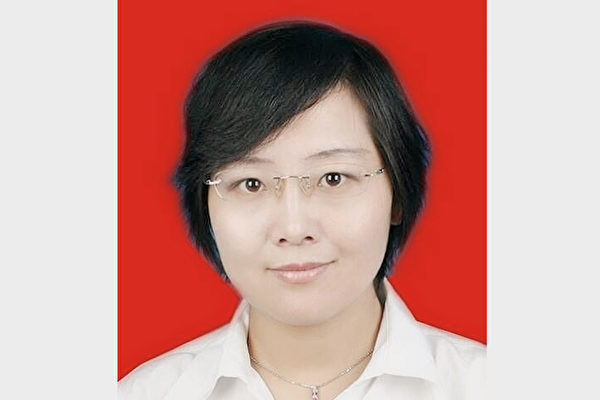

山东临沂市人大研究室副研究员丰晓燕到北京散发民主传单，被临沂警方带回，关入臭名昭著的临沂市第四人民医院（精神病院）。（受访人供图）

   
   【大纪元2020年05月13日讯】（大纪元记者张北采访报导）“宁愿站着死，绝不跪着活。真正的高贵不是这些诽谤侮辱迫害能决定的。”

山东临沂市人大研究室副研究员丰晓燕因散发民主传单，被当局以治疗“精神病”为名关入臭名昭著的临沂市第四人民医院，她的女儿杨清（化名）连日来四处奔走呼吁，才得以见到母亲。丰晓燕在见面时对女儿表明了自己不可改变的意志。

杨清对大纪元表示，母亲丰晓燕曾在89年去过天安门广场，很早就看清中共体制。自从公开表达对共产体制的不满，她就被禁考职称、不得升职，也被限制出国。在2003、2004年左右，临沂政府因对丰晓燕不满，找黑社会人员撞断她的腰，导致她落下腰椎盘突出的毛病。

2019年，丰晓燕提出退党退公职，临沂市人大却不批准。同年10月，她在所住小区里张贴海报，公开支持香港年轻人的抗争活动，遭到当地警方打压。

“可能这个火压着，最后就这次上王府井发传单。”杨清说。

今年4月28日，丰晓燕再到北京的王府井散发传单，要求促进民主改革，改选中国主席，反对社会不公。她遭王府井派出所拘留，并于4月29日被送回临沂。

在没进行任何精神方面检查的情况下，丰晓燕被二十多名警察强行送往临沂第四人民医院。杨清从体制内的父亲那得知，“上面的领导”称丰晓燕已经“碰触到底线，是精神病也要带到精神病院，不是精神病也要带到精神病院。”

在扭送过程中，警察为把母女二人分开掌掴她们的脸，裸露丰晓燕的身体，并将患有腰椎间盘突出的她在地上拖行。被关入病房后，警方勾结医生污蔑丰晓燕患精神分裂症，并强行给她服药。

原山东临沂市人大研究室副研究员丰晓燕旧照。（受访人供图）

   
母亲被抓后，杨清一直极力奔走，四处寻求帮助。她找了母亲这边的亲戚、市人大领导、市卫健委、市公安局、市委市政府，“他们通通都是对我采取敷衍了事的态度”，她说。

她也给中纪委、国家信访局等等单位写信，但得不到任何回应。

5月4日，杨清到医院探视母亲，但她们只能在角门隔着玻璃说话。丰晓燕告诉她，自己每天被逼吃一大堆药。“她说一日三食，每食都是一大把。”杨清说。丰晓燕还表示自服药以来无法入睡，难以思考，舌头肿胀，身体酸痛、沉重等。

但是，她无法拒绝服药。“里头的医生都采取暴力的手段，如果不吃就硬塞进去。”杨清说，“那里的医生素质很低，就跟打手一样的”，“就是（要）把一个正常人强制变成一个精神病。”

杨清在求助信中说，她探视母亲到一半的时候，两名医生粗鲁地阻止她记录，两三名保安冲上来抢夺她的手机，在未经许可的情况下翻看手机内容，删除图片，并威胁她不要把丰晓燕的事告诉任何人，也不要在网上发布。

此后，医院禁止杨清再去探望丰晓燕。“所有的路都堵死了，我就十分绝望。我就说那我就不活了，我当时真的想不活了。”杨清说。

5月6日晚10点到12点期间，杨清到医院门口说自己要跳河，这样才能出新闻，揭露医院的暴行。“他们当时听见了，但是也没说什么，还是不让见我母亲。”她说。

5月7日凌晨2、3点，杨清来到沂河边准备跳下去，被一名身份不明的男子拦下。天亮后，她又给医院打电话，主治医师潘虹联系了医院监督委员会的一个人，谈了半天后终于允许她在医生的“陪同”下见母亲一面。

杨清表示，丰晓燕在见面期间对她说：“宁愿站着死，绝不跪着活。真正的高贵不是这些诽谤侮辱迫害能决定的。”她的态度很明确，并永远不会改变主意。

杨清在求助信中写道：请帮助我们！共产党的罪行令人发指，已经到了不可原谅的地步！请尽快停止这种残暴行为！否则，我会有一个因强迫服药而精神病的母亲！

临沂第四人民医院一直被外界诟病。2006年1月，该院挂牌成立网络成瘾戒治中心，副院长杨永信兼任网戒中心主任，使用电刺激疗法对网瘾患者进行“治疗”。

自2008年被媒体曝光后，大量民众认为用电击虐待患者毫无人道，“让人生不如死”，此后，美国《科学》杂志、英国《卫报》等相继发文谴责该医院“摧残式戒网瘾”。

<a target="_blank" href=#top><h6 align="right">回上方</h6></a>
 

<a name=120>
<h1 align="center"><b>日政府携400企业 促医疗物资生产撤出中国</b></h1>

日本政府正着手与400企业合作本土生产医疗战略物资。图为2020年3月21日，日本戴着口罩的市民在东京上野公园，欣赏盛开的樱花。(Clive Rose/Getty Images)

【大纪元2020年05月13日讯】（大纪元记者张玉洁综合报导）日本政府一个多月前宣布资助企业离开中国后，“撤出中国”的呼声持续上涨。日本政府已经着手进行经济策略的改变，包括本土生产医疗战略物资，以及管制国防安全技术产品。

最近，日本政府计划与超过400家企业合作，促进医疗用品的国产化，降低对中国的依赖，旨在预防今后疫情扩散时能确保有充足的医疗用品。

日本官房长官菅义伟近日接受《日经新闻》采访时，再度强调日本依靠本土制造的必要性。他表示，日本口罩大约有70%至80%是中国制造，应该避免过度依赖特定国家的产品和材料，并应该将一些民生用品的生产线带回日本国内。

据悉，在疫情爆发前，日本70%至80%的外科口罩、30%的N95口罩、40%的口罩材料不织布、60%的医用纱布、100%防护服、90%的人工呼吸机等都依赖进口，而主要进口国都是中国。

疫情扩散后，日本这一弱点显现出来，几乎每一种医疗物资的进口国名单中都有中国，尽管日本吸引了夏普（Sharp）跨界生产口罩，但仍然高度短缺。

近日，夏普在其官方推特上发文说：“身为家电厂商的夏普，在107年的历史中，感觉口罩似乎已成为史上最畅销的商品，心情好复杂。”

此前4月份，日本首相安倍晋三宣布了一项日本历史上最大规模的紧急经济刺激方案——提供22亿美元帮助各类企业从中国移出，尽可能降低日本企业对中国的依赖，改变原有的生产体制。

日本这项政策得到美国的支持，美国方面表示“是时候摆脱中国，降低对中国的依赖性”。白宫经济顾问委员会主任拉里·库德洛也表示可以为美国企业提供离开中国的搬家费。

美国总统川普还表示，“任何时间都能向日本寄出呼吸机”，美国已开始批量生产且成功降低成本。

在日本首相宣布22亿美元刺激方案之后，日本国家安全保障会议（NSC）4月份成立了一个专门经济小组，负责起草今年的经济安全基础策略，并将与美国国安等机构进行合作。

这一专门经济小组除了将指定药品及医疗设备作为战略物资，促进日本国内生产之外，还将涉及技术安全内容。一位日本政府内部人士透露，日本未来主要探讨的事项之一可能是更严格地进行晶片出口管制。据悉，中国的晶片高度依赖进口。

近日，中共体制内人士也纷纷表示，此次疫情将令世界出现“去中化”。中共前外贸部副部长龙永图、中共社科院金融研究所所长李扬都表示，疫情将令已经持续一段时间的“去中化”进一步发展，并说“我们别无选择”。

<a target="_blank" href=#top><h6 align="right">回上方</h6></a>
  
 
<a name=119 >
<h3 align="center"><b>曾在多间培养共党高级政工干部最高学府培训</b></h3>   
<h1 align="center"><b>邓炳强未正面回答“党员身份”引发热议</b></h1>

香港警务处长邓炳强5月12日被问及是否是中共党员身份，邓炳强回答说：“我自己本人并非本地或海外任何政治团体的成员。”因未正面回答，越描越黑，引发热议。（宋碧龙／大纪元）

   
   【大纪元2020年05月13日讯】（大纪元记者林楚舟香港采访报导）5月12日，在元朗区议会会议上，出席的香港警务处处长邓炳强开场发言后，元朗区议会主席黄伟贤向其发问，求证邓炳强是否是中共党员。面对突如其来的意外问题，邓回应称：“我自己本人并非本地或海外任何政治团体的成员。”

邓炳强的回答，让在场人士颇感意外，因为人在面对一个始料所及的“Yes”或“No”的问题时，通常会条件反射地以最直接的“是”或者“不是”回答，邓炳强没有采用人们期待的方式回答，让人一头雾水，更让人怀疑，也很快在网上引来热议。

网民回应：“其实简单答是或者不是就可以，但他没这么做。他答‘非本港或海外’……而中国大陆既非‘本港’亦非‘海外’……”

“但是是国内的政治团体成员，变相承认了。”

“既非本港，亦不是海外，哦，即是支共啦！”意思是，不是香港的，也不是海外的，所以应该是中国的。

“相信全世界只得中国共产党员不肯对外承认自己是党员，情何以堪！又说自己爱党爱国？”

5月12日，元朗区议会主席黄伟贤质问邓炳强是否是中共党员。（宋碧龙／大纪元）

<b>邓炳强在中共党校“镀金”</b>

邓炳强是否是党员一事之所以受到关注，从他过去的学历和经历中可以知道缘由。邓炳强曾在海外及多所大陆院校受训，其中大部分时间在中国人民公安大学、中国浦东干部学院以及中共的中央党校受训。

中国浦东干部学院隶属中共中央组织部，是培养共产党高级政工干部的最高学府之一；中共中央党校，则是中共培养核心领导层的重要学府。故坊间流传，邓炳强早已是中共党员。

邓炳强出任香港警务处处长后，一名任职培养中共特警的高等学府的中共高级教官曾向本报爆料表示，他们内部都知道邓炳强是中共党员，是目前接受组织教育最全面的香港高级别官员，所以习近平2017年访港时的保安工作交给邓负责。

<b>或影响与国际警务合作</b>

邓炳强是否是党员一事之所以受到关注，另一方面是，欧美各国警方的对外警务合作和情报共享，都会考虑法治和政治背景等问题。如果香港警方主要负责人有红色背景，或会影响日后香港与海外的司法行政合作。

中国共产党作为一个政党，其影响力在香港无处不在，却坚持秘密会社和社团的地下运作模式，从不公开身份。而对共产党的敏感，也已成为香港社会深层焦虑的一个爆发点。

香港前特首梁振英，曾被前议员“长毛”梁国雄大声质问：“你是不是共产党？”梁振英当时未予回答。

不过随后，有关梁振英中共党员身份的问题却发生了一段颇为荒诞的事件。

梁振英在正式宣布参选特首的造势大会上，突然严正声明自己不是中国共产党员，话音一落，全场数百名支持者掌声雷动，经久不息。

掌声中包含了太多内涵，对梁振英的坦白，给予鼓励？为他不是党员，而感到放心？对公众长久的疑问，本人终于给出了一个回答？鉴于参与大会的多是亲中政商人物，这个掌声包含的内容，实在耐人寻味。

<b>警察暴力升级 殴打侮辱记者</b>

邓炳强上任后，警察的暴力越发公安化，5月10日晚上，香港警察在旺角截查和拘捕了200多名市民，有在现场报导的记者被警察殴打，并且遭到侮辱性对待。网媒“丘品创作”发声明表示，5月10日男性防暴警察冲入并封锁女厕，该机构的一名女记者被戴上手铐并押上警车，她头部受伤，公厕内血迹斑斑。

“香港01”一名摄影记者在场采访期间，遭一批防暴警察包围，向警员表达身份时亦遭对方喷射胡椒喷雾，摄记眼晴及身体多处中胡椒喷雾，全身痛楚及灼热，被勒令下跪，禁止采访和拍摄。

《明报》记者也遭到同样的境遇，《明报》编辑部发表声明，强烈谴责警方粗暴干预两名记者10日晚在旺角的合法采访，尤其是要求记者蹲下和指令停止拍摄。强调记者的采访权利受到法律保障，警方必须解释。

2020年5月10日，一批记者在旺角遭防暴警察包抄、喷射胡椒喷雾、命令蹲下甚至禁止摄录。(ISAAC LAWRENCE / AFP)

11日，香港记者协会、香港摄影记者协会、独立评论人协会等传媒工会发表联合声明，抗议警队一再践踏采访自由。声明指警队10日晚上进一步疯狂干扰、袭击新闻工作者，极尽羞辱之能事。政府及警方一再声称尊重传媒作为第四权，实际上却千方百计打压。

香港记者协会主席杨健兴11日表示，旺角10日晚上警民冲突期间，警察包抄记者，要求记者蹲下、向摄影机读出名字及机构后方可离开，是极尽羞辱之能事。（宋碧龙／大纪元）

三个媒体协会认为，香港的新闻自由已危如累卵，他们要求警务处处长紧急与传媒工会代表会面，立即遏止警队针对记者施袭的歪风，并将失控的警务人员停职调查，以免一错再错。

<b>网上发起把港警指定为恐怖组织连署活动</b>

针对港警滥暴，近日有人在美国白宫网站发起把“香港警察指定为恐怖组织”的连署签名。

连署活动指，自2019年6月起，香港警务处有政治目的地打压香港市民，侵犯其人权、自由，他们滥用权力、武力和武器，并进行任意或非法搜查，逮捕和闯入居民的住所。其野蛮行径符合联合国对恐怖主义的定义，要求把香港警察指定为恐怖组织。

截至美东时间5月12日17时，签名已达8万3377人，离10万目标人数还差1万6623人。

https://petitions.whitehouse.gov/petition/officially-designate-hong-kong-police-force-hkpf-terrorist-organization-and-immediately-enforce-hkhrda

<a target="_blank" href=#top><h6 align="right">回上方</h6></a>
 
 
<a name=118>
<h1 align="center"><b>大陆民众赞法轮功 祝李洪志大师生日快乐</b></h1>

黑龙江省佳木斯地区明真相民众感恩大法赐给人类的光明！恭祝李洪志大师华诞快乐！（来自明慧网）

   
   【大纪元2020年05月13日讯】（大纪元记者易如采访报导）5月13日是世界法轮大法日，也是法轮功创始人李洪志大师69岁华诞。大陆前媒体人士及工商人士希望通过大纪元表达对李洪志大师诚挚的敬意，并恭祝李大师生日快乐。

“今天是5月13日，在世界法轮大法日这个日子，我衷心地祝愿法轮大法创始人李洪志大师生日快乐，也祝愿所有的法轮功学员平安健康。”大陆前媒体人魏先生对大纪元表示。

魏先生说，他本人不是法轮功修炼者，但从内心里他非常认同法轮功“真、善、忍”的理念。他希望李洪志大师继续在海外把法轮功发扬光大的同时，也希望李洪志大师能回到大陆继续传法，希望法轮大法真正在大陆弘扬发展。

“希望这一天早日的到来，让中国大陆老百姓也能继续炼这么好的功法。”魏先生表示。

<b>大陆前媒体人：“真、善、忍”给整个世界带来光明</b>

魏先生说，法轮大法洪传至今已有28周年，全世界已有上亿人修炼，李大师倡导的“真、善、忍”给整个世界带来光明，“再好的制度都是靠人去实行的，如果人抱有真善忍的心，那对整个国家和社会就是一个好的向上的能量，有很多不好的事情就不会发生。”

他还说，“宗教是规范人的心灵的，真正的宗教是教人向善的。法轮功源自佛法，他是一个正教，法轮功倡导‘真、善、忍’，教人向善、真诚，而且忍让，也非常符合我们中国传统的文化。如果一个人没有真善忍，他做什么事情他都会违背自己的良心，他就会害己害人类。”

“特别是现在的中国，不光是制度要重建，更重要是道德要重建”，魏先生说，这么多年来，中国社会被中共的谎言搞得道德沦丧，中国最需要的就是“真、善、忍”道德的重建。

魏先生表示，中国的现况是法治和宗教自由都没有，“法律规范人的行为，宗教规范人的心灵。但在中国大陆，这两点都没有，所以才造成在人世间有很多悲惨的事情、完全违背道德良心的事情层出不穷。”

<b>大陆前媒体人：躲过瘟疫有良方</b>

魏先生认为，从有神论来讲，这次爆发瘟疫跟中共迫害法轮功有关，所以，要躲过瘟疫就要远离中共，践行“真、善、忍”。

他说，他周围很多的朋友、他所认识的人，只要是践行“真、善、忍”做善良的人，都没有感染这个病毒，“这说明心灵的境界很重要，一定要向善，那这个病毒就找不上你。”

“你看现在瘟疫这个病毒真的很奇怪，以前所有的病毒所没有的特征它都有，而且它的发展趋势也是很神奇的，跟（共产）党走的近的地方就特别的严重。所以，从这一点来讲，如果一个人真正能够践行‘真善忍’，就是如果一个人真的向善，他就有一定有免疫力，他感染病毒的概率就会很小，这一点我是很相信。”

魏先生也感到悲哀，“大家都知道，炼法轮功后有很多病都能够缓解或消失掉，能够治好，这么好一个功法，本来是可以给我们中国人强身健体，但是，在中共统治下，中国的老百姓却享受不到，现在瘟疫在全世界流行，中共对国内的打压反而更严重。”

<b>广东企业高管：希望法轮大法能够在中国公开修炼</b>

广东企业管理者陈先生表示，在5月13日这个特殊的日子里，“我在中国祝李洪志大师生日快乐、福如东海、寿比南山。”

陈先生表示，他对法轮功所倡导的“真、善、忍”也非常认同，“真善忍是做人的理念，也是做人的要求，人缺少真善忍就很难做人，就会勾心斗角。”

他还希望法轮大法能够在中国公开修炼。他说，现在国内越来越多的人都在关注法轮功，“很多人都在说，一些不会翻墙的人也在疑问，为什么法轮功可以在外国学，包括香港，全球那么多人都在学，为什么单单在发源地中国不允许，这是最大的问题。”

他说，法轮功不是中共宣传的那样，“全世界那么多人学，就没有看见有人去自杀自焚的，天安门自焚是中共拍戏拍出来，这些东西有点头脑的人都可以想得清楚的。”

陈先生说，现在很多人在明白真相。

<b>湖北私企老板：“真、善、忍”理念非常好</b>

“祝李洪志先生身体健康！法轮大法好！真善忍好！”湖北私企老板陈先生表示，希望藉大纪元表达对法轮功创始人李洪志大师诚挚的敬意。

陈先生说，“我们市场经常有法轮功学员发的小册子《法轮大法好》，还有《九评共产党》，我也特别喜欢看，里面写的很真实，而且不止我一个人喜欢，我身边还有很多人喜欢看这样的书。”

陈先生表示，法轮功提倡的“真、善、忍”理念非常好，“我认为在中国，作为一个普通百姓来说，信仰这个东西很好，人就是要做善良的人，真善忍是好的。”

“我也经常听法轮功的那些歌，我认为那些歌都是相当好听的，我本人不是一个法轮功学员，但我喜欢听那些歌。法轮功提倡的那些，我认为都是好的。我也经常看大纪元、新唐人电视节目，都搞得比较好。”陈先生说。

<a target="_blank" href=#top><h6 align="right">回上方</h6></a>
 
 
<a name=117>
<h1 align="center"><b>【独家】陕西政府文件泄中共GDP大造假</b></h1>

中共近期似乎试图制造中国企业复工摆脱疫情冲击的假象，但是专家说，全球都笼罩在中共病毒的阴影中。图为受疫情影响下的中国工厂。(NOEL CELISAFP via Getty Images)

   
  【大纪元2020年05月12日讯】（大纪元记者何坚报导）中共上月曾公布经济数据，一季度国内生产总值（GDP）同比负增长6.8%。尽管这是大陆自1992年有季度GDP数据以来首次出现负值，但大纪元独家获得的陕西省咸阳市政府文件，不但证实了国际社会多年来对中共GDP严重造假的指控，同时亦揭示出，中共病毒（新冠病毒，COVID-19）疫情对中国经济的冲击，远超中共公布的数据。

大纪元最近获得的中共陕西省咸阳市政府文件，虽然没有咸阳市统计部门的直接数据，但其中的咸阳市辖下各个县市《一季度经济运行情况汇报》文件，已经泄露了中共GDP数据严重造假。

<b>陕西咸阳多个县市一季度GDP大幅造假</b>

在中共体制下，各级政府内部的《经济运行情况汇报》，是发改局（或发改委）向本级政府汇报，同时亦会向上级政府上报的经济数据；但不一定是中共政府对外发布的官方数据。

大纪元获得的咸阳市多个县市的《一季度经济运行情况汇报》，就与咸阳市政府公开发布的“官方”经济数据，存在巨大的差异。 

   

中共咸阳市政府发布的2020年一季度GDP指标。 （中共咸阳统计局官网截图）

   
   例如，依据中共咸阳市政府发布的一季度主要经济指标（咸阳统计局官网链接），咸阳市辖下各个县市中，唯有长武县的一季度GDP是正增长，一季度完成生产总值23.1亿元人民币，同比增长0.3%。其余各县市的GDP都是负增长，增幅从-3.0%到-20.8%不等。

然而，中共政府内部统计出的经济数据，与对外公布的官方数据并不一致。

   

大纪元获得的咸阳市长武县政府文件，显示长武县政府预计一季度GDP同比下降4.8%，与咸阳市公布的同比增长0.3%不一致。（大纪元）

   
   大纪元获得的咸阳市长武县发改局《一季度经济运行情况》报告显示，一季度，“受疫情影响，预计全县生产总值完成20.14亿元，同比下降4.8%”。

这代表着，咸阳市政府将辖下长武县统计（预计）出的一季度GDP，从20.14亿元调至23.10亿元，人为调高了15%，从而将该县的经济由大衰退“反转”为正增长，用虚假的数据掩盖住衰败的现实

除了长武县之外，大纪元还获得了咸阳市辖下的三原县、旬邑县和淳化县的《2020年一季度经济运行情况》，文件披露，这三个县根据现有数据预计的GDP增幅分别为-40%、-20%和-27%。

而在咸阳市发布的“官方”经济指标中，三原县、旬邑县和淳化县的GDP增幅分别为-17.9%、-6.5%和-13.7%。

也就是说，这些县市统计出的GDP跌幅，是中共对外发布的官方数据的一倍以上。

   

大纪元获得的咸阳市三原县政府文件，预计一季度GDP完成17亿元，但咸阳市发布的官方数据，将三原县的17亿调高至37.13亿元。（大纪元）

   
   从大纪元获得的这些文件可知，咸阳市政府为了缩减GDP跌幅，大幅调高了辖下各县市统计出的GDP数值。

以三原县为例，三原县政府依据统计数据，预计一季度生产总值完成17亿元；而咸阳市发布的官方数据，将三原县一季度GDP调高至37.13亿元，直接翻了一番多。

虽然咸阳市只是中国300多个地级市区中的一个，但大纪元曝光的咸阳市GDP造假现象，却是中共各级政府的缩影，是中共独裁体制和GDP政绩考核机制的必然产物。

中共的GDP是用生产法来核算，将第一、第二和第三产业的总产出剔除生产过程中的投入，从而得到各行业的增加值，最后汇总核算出生产法GDP。依据中共统计局官网，中共发布的季度GDP等经济数据，是由基层单位向政府统计部门报送报表，然后层层汇总到国家统计局，由国家统计局计算得出。

因此，如果中共各级政府（包括统计部门）对经济数据造假的话，那中共的国家统计局无论怎么核算，都得不到真实数据。更何况，中共国家统计局每年发布的GDP等经济数据，都与中共高层预设的政治目标高度吻合，这本身也极大的消弱了国家统计局的可信度。

值得一提的是，中共统计局官网显示，国家统计局定期向联合国、国际货币基金组织、经济合作与发展组织、亚洲开发银行等国际组织提供中国GDP数据；而从90年代末起，世界银行等国际机构在中共的要求下，停止对中共官方GDP数据进行调整，改为直接采信中共官方数据。

<b>大纪元曝光中共文件 证实中国经济“十万火急”</b>

4月27日，中共甘肃省长唐仁健称甘肃经济到了“十万火急刻不容缓”的地步。尽管中共高调宣传已经复工复产，但甘肃省长的喊话泄露了中国经济的真相。

唐仁健披露说，在开工的企业中，52.1%的规下工业企业、62.4%的建筑业企业、54.9%的规下服务业企业在正常生产水平的50%以下；“很多企业开了门没有客或客很少”，中小微企业面临着严峻的生存危机。规下企业是规模以下企业的简称，通常是指主营业务收入2000万元以下的工业企业，或营业收入在一定标准之下的服务业企业。

大纪元这次获得的陕西咸阳市政府文件，佐证了“十万火急”的经济形势并非甘肃省一地的危局，而是疫情冲击下整个中国经济的真实写照。

   

旬邑县政府《2020年一季度经济运行情况汇报》披露，旬邑县恢复正常生产水平70%的“五上”企业不足4成。（大纪元）

   
   例如大纪元获得的旬邑县政府《2020年一季度经济运行情况汇报》披露，虽然全县50户“五上”企业复工率达到92%，但受疫情冲击，复工的46家企业中仅有18家达到正常生产水平的70%以上，还不足4成；而且第三产业受到很大影响，消费能力严重不足。“五上”企业是中共经济普查的主要对象，是指规模以上工业（主营业务收入2000万元及以上工业企业）、有资质的建筑业、全部房地产开发经营业、限额以上批发零售业和住宿餐饮业、规模以上服务业法人单位。
   
   

大纪元获得的长武县政府文件，披露“经济增长乏力”。（大纪元）

   
   长武县政府也在《一季度经济运行情况汇报》中披露了“经济增长乏力”，“受疫情影响，各规模工业企业虽已复工，但无法满负荷生产”，而且“全县零售、餐饮住宿等服务企业和个体户基本关店停业，对第三产业增长影响较大”。

三原县内部文件也显示，“受疫情影响，我县大部分规模以上企业1-2月处于停工状态”，“工业经济开工不足”，“第三产业企业几乎处于停滞状态”。

大纪元获得的这批中共内部文件证实了，在疫情重压下，多数企业难以恢复正常生产已是包括陕西咸阳在内的，全国各地普遍面临的经济困境，而中共仍试图用数据造假来掩盖真相。

<a target="_blank" href=#top><h6 align="right">回上方</h6></a>
 
 
<a name=116>
<h1 align="center"><b>【一线采访】吉林爆疫情舒兰公安局关门</b></h1>

吉林舒兰近期爆发疫情，邻近省市12日起对吉林旅居史排查。图为舒兰火车站。（视频截图）

【大纪元2020年05月13日讯】（大纪元记者韩露、林岑心采访报导）中共病毒（武汉肺炎）在吉林省扩散，舒兰市公安局一名洗衣工感染，又传染给16人，并传播到沈阳。舒兰公安局附近的居民告诉大纪元，舒兰现已封城，这名洗衣工的先生是公安局人员，目前当地公安局、教育局许多人员已被隔离。

黑龙江哈尔滨12日发布公告称，因舒兰市风险等级被调整为高风险区，严查4月28日以来有吉林市旅居史的人员。

<b>感染源成谜</b>

据官方资料显示，5月7日，一名45岁女性被确诊，为舒兰市公安局洗衣工。5月9日，当地再新增11例确诊病例，包括其先生、大姐、二姐、三姐、三姐夫等亲属。5月10日，吉林新增确诊病例3例，其中2例居住在吉林丰满区；同日，沈阳新增1例确诊病例，皆为此案的关联病例，说明此群聚感染已跨区跨省传播。

澎湃新闻12日刊发题为「舒兰公安局确诊病例，可能在洗衣过程中感染」的文章，中国疾控中心研究员吴尊友认为，一种可能是这名洗衣工是在洗公安制服的过程中感染的，另一种可能是有些病人的潜伏期比这洗衣工的潜伏期更长，潜伏期造成传染。

官方至今没有公布舒兰公安局这起感染事件的感染源。此外，吉林省疾控中心传染病控制所所长赵庆龙11日表示，「疫情呈现高度的家庭聚集性和集体单位聚集性」，但迟未对外说明「集体单位聚集性」所指单位。

吉林舒兰确诊中共病毒病例关联图。（网友提供）

黑龙江哈尔滨12日发布公告指出，吉林省将吉林市下辖舒兰市风险等级调整为高风险区，吉林市丰满区调整为中风险区。通告中称，4月28日以来有吉林市旅居史，须主动向所在街道（乡镇）、社区（村）报告，而且要求街道社区，需「排查到户、不落一人」。

外界注意到，相关措施显示，舒兰这起感染中共病毒的群聚感染案例，自4月28日起，即有扩散的可能。

<b>民众：舒兰封城公安局的人都被隔离了</b>

大纪元致电公安局附近某快递公司杨小姐。她说，舒兰市已经都封城了，「都封城了，封城不让走动了。」「买菜还可以，就是车辆，不能出城了。」「坐车你都出不去，乡下都去不了了。」「所有客车都停了。」

她还提到，小区只留一出口，进出都要扫码，「可以出人，但是一天只限一个人，没事都不让出来。」

对舒兰公安局这起感染事件的感染源，杨女士说，现在还不清楚，但洗衣工的先生是在公安局的，「她丈夫在公安局。整个公安局现在都没有人了，全部隔离了。」

<b>民众：小区都封无症状感染太吓人</b>

舒兰市公安局周边的一名餐馆刘小姐告诉大纪元说，「现在不外送，都得自己取，都是打包的，剩美团（外卖）。」刘小姐说，现不只是公安局，连教育局的人都被隔离了，「公安局、教育局都关了上，都隔离了。」

另一名超市员工也对大纪元说，「现在不送，只能叫外卖。」「我们卖货，客人都不让进屋，我们也不出去，就是有外卖，我把货品备好了，写好，扔在门口，他们在外面接着。」

她说，无症状感染令人太恐慌，「太吓人了。」「包含接触过的人必须隔离，教育局也隔离，（疑似感染者）是有当老师的。」

<a target="_blank" href=#top><h6 align="right">回上方</h6></a>
 
 
<a name=115>
<h1 align="center"><b>中共不配合病毒调查 美议员提严厉制裁法案</b></h1>
   <h2 align="center"><b>制裁包括资产冻结、旅行禁令、签证撤销和阻中资在美上市</b></h2>

美国国会资深共和党参议员林赛·格雷厄姆（图）周二（5月12日）公布一项法案，针对中共隐瞒疫情、在冠状病毒（中共病毒）爆发原因方面不配合调查等行为，施加严厉制裁。(MANDEL NGAN/AFP via Getty Images)

   
   【大纪元2020年05月13日讯】（大纪元记者夏雨综合报导）美国国会资深共和党参议员林赛·格雷厄姆（Lindsey Graham）周二（5月12日）公布一项法案，针对中共隐瞒疫情、在冠状病毒（中共病毒）爆发原因方面不配合调查等行为，施加严厉制裁。

因中共隐瞒疫情真相，导致中共病毒在超过180个国家肆虐，造成美国逾8万人死亡。对中共追责的呼声在美国朝野越来越强。目前美国有9个起诉中共的案件，18个州检察长呼吁国会调查中共在疫情方面的欺骗行为。

格雷厄姆也是参议院外交关系委员会成员。周二，他在一份声明中说：“我坚信，如果没有中国共产党的欺骗，这种病毒就不会在美国出现。”

他称这项举措是“严厉的立法措施”，并说议员们“必须确定病毒的起源，并采取措施，例如关闭野生动物市场，以确保不再发生类似事件”。

格雷厄姆说，中共拒绝让调查人员研究病毒爆发是如何开始的，他并在声明中补充说：“我坚信，除非迫使它们这样做，否则中国（中共）绝不会合作。”

他表示，这项严厉的立法将制裁中国（中共），直到它们与调查人员合作。

格雷厄姆说，他的“ COVID-19问责法”（COVID-19 Accountability Act）将要求总统在六十天内，向国会证明北京对由美国及其盟国或联合国附属机构（如世卫）领导的任何COVID-19调查，提供完整的、彻底的审计（accounting）。

他说，还需证明北京已经关闭了所有可能使人类面临健康风险的“湿市场”（野生动物市场），并释放在病毒大流行后镇压行动中被捕的所有香港民主倡导者。

该法案将授权总统实施一系列制裁措施，例如资产冻结、旅行禁令和签证撤销，以及美国金融机构对中国企业贷款的限制，并禁止中国公司在美国证券交易所上市。

该立法是由其他八位共和党参议员共同发起的，他们分别是：北卡罗来纳州的汤姆·提利斯（Thom Tillis）、密西西比州的辛迪·海德-史密斯（Cindy Hyde-Smith）、印第安纳州的迈克·布劳恩（Mike Braun）、佛罗里达州的里克·斯科特（Rick Scott）、蒙大拿州的史蒂夫·戴恩斯（Steve Daines）、印第安纳州的托德·扬（Todd Young）、俄克拉荷马州的吉姆·英霍夫（Jim Inhofe）和密西西比州的罗杰·威克（Roger Wicker）。

英霍夫在一份声明中说：“中共必须为它们在这场（瘟疫）大流行中所起的有害作用负责。”

“美国是强大的，我们将摆脱这场危机，但中国（中共）必须被迫面对现实，并对它们的行为负责。”声明说。

海德-史密斯说：“随着调查的开始，中国（中共）必须变得更加开放，我们将努力从这场灾难中吸取教训。”

“这项立法将向北京的共产主义政权表明，世界需要关于这种流行病如何开始，以及如何在全球范围内传播苦难的答案。”她说。

此举显示美国国会对调查中共越来越感兴趣，也是对中共在危机最初爆发时所采取行动进行惩罚的一部分。

根据约翰·霍普金斯大学的数据，全世界已有420万人被诊断出患有COVID-19。 289,349人死于中共病毒。

<a target="_blank" href=#top><h6 align="right">回上方</h6></a>
 
 
<a name=114>
<h1 align="center"><b>「眼见为实」的母亲亲历神迹</b></h1>

文: 浙江法轮功学员

   
   【明慧网二零二零年五月十三日】这是一个关于我母亲得法修炼的故事，那时我的母亲既顽固又身患了绝症。我之所以写下这个故事，是因为我和母亲亲身经历了那段神迹，绝对无神论的母亲亲身见证了法轮大法的神迹。
顽固如石，听信中共毁书谤法

我母亲今年六十三岁，十二年前，五十一岁的她一直是个重现实、好面子的女强人，她脾气暴躁，却善于经营人事，拉关系走后门，拥有着强势的外表和超高的情商，但对无利益的事情向来是不屑的。记得有一次我和她单位的一位财务科长闲聊，他告诉我：「你母亲啊，能干、彪悍，我看见她也是惧她三分的。」

我一九九六年开始修炼法轮大法时十五岁，上初二，真、善、忍的高德大法洗涤了我的身心。一九九八年，我第一次和母亲谈起了大法修炼，并希望她也好好看一看，既对身体有益，又可以改变一下她易怒的暴脾气。坚信无神论的她，一直认为气功这种东西都是假的，会走火入魔，所以当我向她介绍完后，她的眼神是不屑一顾，甚至是反对的。

可是由于我修炼后自身的变化很大，街坊邻居、学校老师和同学们都对我的人品赞不绝口，所以她也就没来干涉我。

一九九九年七月，中共对法轮功的迫害开始了。我知道大法是被冤枉的，二零零零年我独自去北京上访，后被遣送回家。当时六一零伙同公安给母亲的单位打电话，让母亲单位的领导一起陪同到家里抄家。母亲觉的这简直就是奇耻大辱！本来对我走入修炼她就不满意，如今政府和单位领导都出面了，她心中充满了愤怒，觉的我丢尽了她的脸面。

在我被拘留十五天回家后，她终于爆发出来了，并表示如果我继续修炼，她就要与我断绝母子关系，她的状态几乎是歇斯底里的。在她面前关于法轮大法的任何资讯，我是一个字都不能提及的，否则她就会和我吼叫。就这样，我们母子之间有了一道深深的隔阂，不能有任何的交流，因为她在心中已经认定，我是「中毒」太深了。

为了给我「解毒」，母亲开始和六一零以及街道合作，亲自出面，骗我去中共在劳教所办的洗脑班；又听信中共的谎言，配合着在报纸上信口开河，说她的儿子炼功后如何变痴变傻；甚至趁我不在，烧毁了我的大法书，并以死或者断绝母子关系为要挟……

我很难过！她是我的亲人，可是亲人之间没有信任、安慰和鼓励，只有不断施加的压力。我很难过，也很担心！因为我知道，她所做的这些事是有大罪业的。但更难过的是，面对误解的世人我可以去讲清真相，理智平静的沟通，慢慢改变世人对大法和大法弟子的误解，可是我却完全不知道该如何对我的母亲讲清真相！？因为只要我一开口，她就出口成脏，立即打断我，连说话的机会都不给，如同一块密不透风的顽石。

由于母亲认为我丢尽了她的脸面，她从内心看不起自己的儿子，认为儿子是被中共定义的「愚昧」人员，所以我们母子之间的沟通几乎为零，这种状态一直持续了八年。

说真的，那时我真的没有信心，我不知道该如何解开我们母子之间的心结，因为大法是对的，那是我亲身经历的，而中共在撒谎，在蒙蔽我的母亲。

癌症煎熬，母子长谈，神迹初显

二零零八年四月的一天晚上，母亲肚子部位痛的难受，去医院检查，当时医院只是开了一点止痛药。等到九月初的时候，母亲觉的症状加重了，于是换到妇保医院，做了全面的检查后，被医院确诊得了葡萄胎。在连续三个疗程的化疗无效后，癌细胞已经扩散到了肺部以及身体其它的一些部位。当医生把化疗结果告诉我们的时候，我见到强势的母亲躲在厕所偷偷流泪。

化疗的痛苦既难以描述又漫长而无望：母亲的头发一把一把的掉；虚弱的身体本来就需补充大量的营养，可是任何饭汤只要一接近，她就呕吐不止，于是吃饭也就变成了一场持久战，一顿饭总要喂上几个小时；她坐不了，也走不了，每次化疗完后回家，由于没有电梯，我得背她上七楼，还必须非常小心，因为她的骨头也痛……

在痛苦和绝望中，医生给的希望是一种还在临床试验阶段、化疗反应超强的一种药物。医生当时的意思是，如果这种药物没有效果的话，他们也没办法了，同时由于这种药物比之前用的化疗药物反应会更强，而且还在试验阶段，所以要使用的话，需要我们家属和病人同意，并签字自己承担一切后果。

我问母亲要不要做？她没有说话，只是轻轻点了点头。我知道，这是求生的欲望，其实她已经承受不了那样的痛苦了。看着她如此难受，我也很痛心，而我最大的痛心之处是──我明明知道大法可以救她，可即便如此，她都不许我谈论法轮功，我真的觉的她就是一块顽石！

签完字后，母亲还有一周的休息时间，我们坐车回家。一路上，我都在思考如何告诉她大法的真相，因为化疗的结果是无法预料的，​​更何况她现在的身体已经不堪负荷了，而在我身边，就有很多绝症病人在大法修炼中治愈的例子。过去沟通的难点在于没有一个合理的契机，而如今，医生的论断强烈刺激了母亲的求生欲。我心中不断的向师父祈求，祈求师父能给予母亲平心静气的心态。

我把母亲背到沙发上，她斜躺在那里。一天都没吃饭，我去煮了十个饺子，她吃了一个半就吃不下了。过了一会儿想吐，我扶她到厕所，吐完又斜躺在沙发上。

我坐在她旁边，和她说：「老娘，我想和你好好聊一聊。」她立刻回道：「聊什么？你不就那点东西吗？我不想听，越听越难受。」

我发自内心的说：「我是你儿子，我看见你那么难受，我心里也很痛苦！我希望你好起来，这一点，难道你也感受不到吗？刚才医生的论断你也听到了，我看到你哭了，因为你觉的看不到希望。现在，你的亲儿子打算告诉你重拾希望的办法，你为什么就不想试一试呢？到了这个阶段，我们母子之间连聊聊心里话都不行吗？」

这一个多月她是看着我的，我们虽然很少说话，但是从早到晚的陪护，她是看在眼里的。哎！中共的洗脑，让一对母子居然八年都说不上一句完整的话！她有点动容了，于是说：「那你说吧。」

我第一次和母亲如此的促膝长谈：从我亲眼看到的法轮大法治愈各种绝症的事例，到「天安门自焚」造谣案的真相，以及海外法轮功洪传的盛况，包括法轮大法能治愈疾病的法理，我们聊了一个多小时。聊的过程中，我细细观察，感觉她开始能接受大法了，而且在这个过程中，我发现她的状态开始精神起来了。

然后我给她看了二零零八年的神韵演出。看完后，真的就是一瞬间，她说肚子饿了，然后我把八个半饺子热了一下，她一口气吃完，接着她就去床上睡觉了。这一个半月来，我第一次看她睡得这么香。晚上，她的妹妹来给她做饭，她吃完了一小碗饭，没有任何呕吐的反应，她说：「这倒是有点神奇了！」

师恩浩荡，静听大法，痛苦瞬消

当然我想劝母亲修大法，因为我坚信只有大法可以救她。虽然她现在的状态是好一点了，可是人的观念又哪里是那么轻易就会改变的呢？何况她之前是那么的反对，做了那么多毁书谤法的事。母亲是从来不信神佛的，所以她一直不肯在炼功上表态。

又到了要去化疗的日子了。我给母亲录了个MP3，里面是李洪志师父在广州的讲法。我把MP3给母亲，我说：「你下午要化疗，难受的时候，就听一听吧。」她收下了，但是我不知道她会不会听。

早上我去公司上班，心里却想着母亲下午的化疗，不知道会怎样难受。一下班，我就从公司赶到医院，已经是下午五点了，她的化疗应该刚结束。我一进入病房，就看到她坐在床上，听着MP3。母亲看到我来了，显得有点激动，摘下耳机，她连连对我说：「太神了！太神了！这次回去，我一定和你一起炼功！」我也很惊讶！母亲到底经历了什么？让她瞬间改变了自己的观念。

她说：「化疗大概十五分钟左右，全身连骨头都开始痛。实在忍不住了，想起来你早上给我的MP3，于是拿起来听，听着听着，那种痛苦一瞬间居然就消失了，我越听越觉的有道理，而且身上一点难受的感觉都没有了！这真是太不可思议了！太神奇了！」

我当时也感动的眼眶湿润，要知道我的母亲是从来不相信无利益的事的，她之所以站在中共的立场看待大法，除了面子和压力，就是对强权利益的崇拜。师父太慈悲了，不放弃任何一个可救度的生命。就像我的母亲，在这一瞬间，当她转变了一点观念，师父就把母亲所有的痛苦都去掉了。要知道，这可是比之前化疗的药物更厉害的毒药啊！

接下来连续五天的化疗，母亲和之前完全不一样了，甚至已经不像是个病人了。其实从听法这一天开始，她就胃口大开。化疗结束后五点，家里的亲人就会送饭过来，然后她就盘着腿，一个人坐在病床上大口大口的吃饭，而她同室的两个化疗病友就躲到门外去了。她自己也感觉浑身有劲，就不麻烦亲人送饭了，而是一到饭点，就和我散步去医院的住院部下面，在饭馆点菜吃饭，一扫之前连路都走不动的病态。

化疗一共有四个疗程，每一疗程的中间有两周的休息时间，母亲就开始和我回家学法炼功。母亲的身体越来越健康，看她光着头坐在我的对面，一刹那，我觉的这才是母亲本来慈祥的真面目。

师父也一直慈悲的看护着我母亲。一直到我母亲连续做完三个疗程，在这个过程当中，虽然一直在化疗，但是她一点痛苦的感觉都没有。我都觉的奇怪，这些挂进去的毒素去哪里了呢？有一天，她的主治医生来查房时，再次看到她一个人坐在病床上大口吃着饭，主治医生连连惊叹道：「你可真是个奇迹啊！我治了这么多病人，没有见过一个像你这样的！而且你连白细胞都不补，这哪里像个病人啊！」

医生的话提醒了母亲，于是她决定第四个疗程不做了，她终于开始坚信大法了。随着学法炼功，后来再去医院检查，所有指标一切正常，葡萄胎也消失了。

母亲的神奇经历，也改变了家里很多亲人的观念，他们都见证了母亲身上发生的神迹。母亲自己也经常在思考：每天三个小时有毒的化疗药物进了身体，为什么一听法，就一点难受的感觉都没有了？真是比灵丹妙药还神。我跟母亲说，因为法轮大法是佛法修炼，这个世界上真的是有佛道神的。

结语

母亲所经历的故事，我们一直都是在用口传的方式告诉身边的亲朋好友，之前一直没有写出来，是因为在大法洪传的二十八年中，这样的神迹数不胜数，母亲的这段经历在修炼人看来其实都算是「平常」的。

人是相信眼见为实的，就像母亲后来也说，如果不是亲身经历这次的神迹，她也不会相信法轮大法是如此的超常。后来她还经历了四次惊心动魄的灾难，由于做了「三退」，认清了中共，同时又把自己当作一个修炼人，在师父的保护下，我母亲的身体恢复都是出奇的快，在短短的一两天内就完全好了，这里我就不细说了。

从二零零八年算来，母亲已经修炼十二年了。她如今脾气也改了，遇事向内找，每天学法炼功，坚持不怠……

我把这个故事写出来，在疫情泛滥、天灾人祸不断的今天，希望眼见为实的人们，无论你之前持何种观点，在困难和黑暗来临的时候，也能像我母亲一样，转变一下观念，法轮大法的神迹也会在你的身上体现。

<a target="_blank" href=#top><h6 align="right">回上方</h6></a>
 
 
<a name=113>
<h1 align="center"><b>美国先知凯西 预言当今的中国与世界</b></h1>

美国先知爱德加．凯西的预言准确率极高，受到当代重视，尤其是关于现今在中国发生的大预言，更引人关注。(pixabay)

   
   美国人爱德加．凯西（Edgar Cayce，1877 －1945）人称美国先知，他从二十世纪开始一直到离世，将近半个世纪中，免费为人解读病因、提供治疗建议––即“超自然解读”。凯西的解读都是在睡着的状态（催眠）下完成的，同时他也留下了一些预言，预言涉及他身后百年甚至更多年后的时事。他的预言包罗万象，准确率极高，受到当代重视，尤其是关于现今在中国发生的大预言，更引人关注。
   
<b>“美国先知”——爱德加．凯西</b>

美国先知凯西有一个广为人知的称号──睡着的预言家，他在睡眠状态下的解读案件，保留下来的有一万四千多例（保存在维吉妮亚海滨市的凯西基金会和探索和研究协会），为世人了解生命的奥秘与因果轮回打开了一扇跨时空的门。他为人解读都是出于帮助他人的善心，都是免费之举，而且准确性很高。曾有商人为了寻找商机，要他提供解读，只要是有提供金钱的状况，那凯西的解读往往就不灵了。凯西在这一点也有很高的悟性，他从一开始就是义务帮助别人，并且严格要求自己。

美国先知爱德加．凯西（Edgar Cayce），摄于1910年10月。（公有领域）

<b>获得功能的神迹</b>

凯西出生在美国肯塔基的乡村，是一位农家子。他小时候就与众不同，可以看见已故的祖父并与其对话，也可以跟另外空间肉眼看不见的朋友一起玩。凯西从十岁开始读圣经，一生都保持虔诚的信仰。1889年5月份的一天，12岁的凯西在树林里读了一天圣经，并且祈祷请上帝指导他如何才能全心全力为上帝和别人服务。那天夜里，凯西在明亮的光芒中醒来，他看到了一个天使在光芒中，天使告诉他祈祷已经得到回应，让他保持信心，对自己诚实，帮助病患。凯西感到全身心受到洗涤般的净化，世界的一切都非常美好。

第二天，不寻常的事情发生了，凯西有了特异功能。一夜无眠又心情激动的凯西拼字拼不出来，被老师留下来罚写。父亲得知后，就在晚饭后亲自考一考他。结果恍惚了一天的凯西连原来记得的都忘了，父亲盛怒下抽了他几次耳光，其中一次让他从椅子上跌了下来。快11点了，凯西带了哭腔要求父亲让他休息五分钟。就这样当他枕在拼写课本上一觉醒来后，书的内容都跑到他脑中了，他可以复述书中的所有内容。从此以后，凯西在班上一直名列前茅；他还有一年中连跳三级到六年级的纪录。15岁时，老师赞美他是班上最好的学生，记忆力超强。凯西告诉老师，自己可以看到书里每一页的影像。往后，他人生中为人进行病情或事情解读时，都是在催眠中进行的，然而醒来后，他自己毫无记忆。

《美国奇人：爱德加．凯西》一书提到，凯西有一世曾经是埃及最高祭司──拉塔（Ra-Ta）；凯西说自己是“一个卑微的、不足取的通道”，他一生的愿望就是利用这一通道，为别人提供问题的答案。凯西死于1945年1月，他生前对二十世纪后叶到二十一世纪人类命运和文明的预言，尤其是针对中国的预言，关联人类文明的发展演变，成了今天历史的重要核心。

<b>预言为助人 洞见轮回与报应</b>

在长达半世纪的时间，睡眠中的凯西能看到另外空间的能力不断展现出来，能够解读的领域和深度也越来越扩大。在帮助人诊断疾病和提供治疗方法时，他触及了生命轮回的神秘领域，串连了过去世、现在世，洞察了元神不灭，发现了疾病与累世的业力息息相关，善恶有报报应不爽。这些超前的洞察与概念受到当时医学、心理学和大众的质疑，但同时也得到许多当事人的验证。也有不少当代的名人非常相信凯西的洞察力，例如：美国总统伍德罗．威尔逊（Woodrow Wilson）、发明家汤姆斯．阿尔瓦．爱迪生（Thomas Alva Edison）、魔术师哈利．胡迪尼（Harry Houdini）等等。

发明家汤姆斯．阿尔瓦．爱迪生（Thomas Alva Edison）非常相信凯西的洞察力。（公有领域）

凯西的功能不限于个人的问题，发明家米奇尔．赫斯廷斯（Mitchell Hastings ）把调频收音机的发明归功于凯西，还有，世界上的大医院和机场大多都在使用凯西在催眠状态下设计出的创新电子技术。 最有意义的是他当时对未来人类文明和命运的重大预言，有些预言的时间轴延伸到他死后百年。

<b>预言中国  对神的信仰醒觉中国</b>

凯西准确预言了多件二十世纪的大事，包含了1929年华尔街股市崩盘、希特勒的崛起和死路、二次世界大战爆发和结束的时间、1931年日本出兵入侵中国满洲想成为“支配力量”、印度独立、以色列建国、1968年亚特兰提斯古文明遗迹被世人发现、俄联抛弃共产主义，他还预言了世界的重心将转到东方的中国。

凯西的解读中多次提及中国和中国人民巨大又积极的信仰潜力。凯西有关中国的预言，当时让西方世界感到震惊。这是从上世纪后期到二十一世纪还一直在发生中的大事，最后的结果也会让今天的人类感到震惊，尤其是其中一个重大的、超凡的预言：

有一天，中国将成为孕育救世主信仰（Christianity）的摇篮，同时人们会在生活中努力实践这信仰。是的，这对人来说很遥远，但在神的心中仅是一天的功夫——明天，中国将醒来！

原话：Yea, there in China one day will be the cradle of Christianity, as applied in the lives of men。It is far off, as man counts tune, but only a day in the heart of God. For tomorrow China will awake。

先来解译一下“Christianity”这个字。 在现代英语中，Christianity的字面意思是指基督教或是基督教的信仰，但是基督教早已诞生，所以凯西的预言就不是指基督教，而且“摇篮”比喻新生，意指将有一种新的信仰从中国的土地上诞生而且广传。

解析一下“Christianity”的字根、字源，寻绎其义涵。Christianity的字根Christ（基督）来源于希伯来文的mashiach（弥赛亚），英文是 Messiah，意为“救世主”，是对拯救人类出浩劫之神的称号。Christian最早的意思是指追随救世主的信仰、组织，从而衍生出的“Christianity”，可以理解为信仰救世主的修炼文化。

1996年湖北武汉法轮功学员集体炼功，组成法轮图形。（明慧网）

<b>对中国的预言  已经在实现中</b>

1949年共产党占领中国，举起无神论邪说红旗利用暴力和谎言宰制了那里的人的思想，使得原来的神传文化古国沦为没有神的信仰的国度。而凯西在这事发生之前就超前预言了中国将醒来“成为孕育救世主信仰（Christianity）的摇篮”，凯西还有“救世主将再临”的预言。综言之，意味着“救世主”来到人间，而且是从中国传出救世的教导真言，传播到世界。事实上，从上世纪1992年以来一直到今天，人们可以客观地观察到，凯西的预言已经在实现中。

图为一九九八年北京法轮大法学员一次大炼功场景，约两千人参加。

在1992年5月，法轮功这种佛家修炼大法在中国由李洪志大师传出，传出后数年的时间已经使得中国近一亿人醒悟生命的真谛，感到生命得到救赎重生的喜悦而走上信神修佛的修炼路；如今，法轮大法已经洪传全世界百多国，不分种族的许许多多人士沐浴在“真、善、忍”宇宙大法的佛光慈晖下，走上返本归真的大道。

法轮功即法轮大法，以宇宙最根本的、最高的特性“真、善、忍”指导人日常生活，提升修炼人的道德品质，同时修炼人通过五套功法祛病健身、养生长生，达到性命双修效果。不少人，一开始修炼法轮功就“见证奇迹解开生命奥秘”。

大法洪传二十八年来，世界各国不分种族、阶层行业的人士，在大法修炼中袪病健身的例子比比皆是、数不胜数，精神境界心性提高、生命与人生起了钜大转变，还有神奇事迹更是遍布全球。法轮大法起于中国而后洪传全世界，修炼者在生活中提高道德层次的实修，应合了凯西预言的“中国将成为孕育救世主信仰的摇篮”──这一天已经来到了！

<h4 align=center><a href="https://www.epochtimes.com/gb/20/3/31/n11992930.htm">双肺75%化脓坏死，呼吸已经极度的困难，他已没有任何的抵抗力，医学已经没有回天之力，人生的路似乎走到了尽头，生死存亡间，他诚心敬念：“法轮大法好！真善忍好！”Joseph绝处逢生，躲过了这一大劫。让我们听听他的人生经历。（新唐人）(点击右键,另存新档）</a></h4>

尽管，从1999年7月20日以来一直至今，中国的法轮功学员一直遭受中共邪党残酷的迫害，甚至遭到“活摘器官”的虐杀 ，然而真信实修的修炼人，在艰苦中更加卓越，信仰的神性更加焕发！他们面对名誉、经济、生命的威胁打击剥夺而不转变修炼的意志，他们面临残酷迫害压顶而不改变修炼的本色，这也是凯西预言的（修炼的）“人们会在生活中努力实践这信仰”的真实印证。凯西也说过“那些物质角度的幻象变化对灵魂没有影响”的解读！

<b>凯西预言 进一步印证</b>

马克．休斯顿（Mark Thueston）先生是凯西预言的研究专家，在他的《凯西预言21世纪》（Cayce’s Prediction for the 21th Century）中提到九个当时还未得到验证的预言。从现在这时点来看，其中几个和上述新的信仰的修炼文化有关的预言，也渐渐显露蛛丝马迹得到实证和科学验证：

＊一种新的医疗方法将会出现——基于灵性和身体能量系统的流动与转换。

＊元神不死、生命轮回将被大众普遍接受。

＊直觉和超能力会普遍出现，许多人可以直接与另外空间沟通。

＊宇宙“太一”（one mind 即创世主）的真理会成为人类所有活动开展所遵循的依据（科学也在其中），新信仰是宇宙之光。

＊救世主将再临。

凯西预言说，等“调整期结束后”“义将永驻地球”。现在中共的领地上还发生着迫害修炼人、残酷活摘器官的罪恶，而近年科学发现星座与天象正在发生著有史以来未曾有的巨变，《圣经》预言说人类将面临大审判，这一切都可以对应到凯西所说的“调整期”。这场善恶之战的审判之后，调整期宣告结束，留下来的行善积德的人将全面迎来新信仰的新纪元。

<a target="_blank" href=#top><h6 align="right">回上方</h6></a>

 
 
<a name=112>
<h1 align="center"><b>上海东华大学实验室爆炸案 受伤学生起诉校方</b></h1>

【大纪元2020年05月12日讯】上海市东华大学化学化工与生物工程学院实验室爆炸案，导致研究生郭宏振眼睛受伤，脸部严重毁损，经治疗后左眼视力仅恢复至0.01左右，右眼完全失明。由于校方未按承诺继续支付医疗费用，郭宏振将东华大学诉至法院并索赔。法院近日二次开庭审理，但仍未宣判。

5月11日，郭宏振表示，他还在接受治疗，因身体原因造成找工作受阻，他要求学校赔偿医疗费、误工费等合计170万余元。目前，案件下次开庭时间尚未确定。

2016年9月21日，东华大学化学化工与生物工程学院一实验室发生爆炸，导致3名研究生受伤，其中研二学生郭宏振眼部受伤，面部严重毁损。据他回忆，当时导师安排他帮助2名研一学生做实验，过程中，他帮忙向容器内加入高锰酸钾后就发生了爆炸。“我的眼睛瞬间失明了，那两个学生也有不同程度的受伤。”

郭宏振后来被送往上海瑞金医院，虽挽回一命，但视力大减，全身灼伤且毁容。经治疗后，他的左眼视力仅恢复至0.01左右，右眼仍失明“无视力”。

当时校方向郭宏振承诺，将承担他的医药费、交通和生活必需品等相关费用，并表示会负责到底。

郭宏振表示，但校方只提供在上海治疗的费用，而根据他的伤情，他需要到北京、郑州等外地医院治疗，校方却拒绝提供费用。他因受伤，直至去年7月才正式毕业，但却未能找到工作。为了得到补偿，加上他认为校方未落实实验室使用规范，2019年8月，郭宏振将东华大学诉至法院。

案件于今年4月29日在上海市长宁区法院首次开庭，庭审中，双方承认事故未经第三方调查，初步结论是由学校保卫科负责，结果显示，3名研究生当时均未戴护目镜，除郭宏振外，其余2名研究生甚至未经培训。

校方代理律师声称，该次实验危险性高，导师已要求实验在通风橱中进行，并拉下安全门、戴护目镜等防护设备，但校方说法遭到郭宏振否认，指实验室根本没护目镜，只有一双橡胶手套，且3个通风橱均无法使用，导师当时也没指正。

5月9日，该案一审二次开庭，主要针对郭宏振的治疗费用进行核算，未当庭宣判。

近年来，高校实验室安全事故时有发生。2016年东华大学化学化工与生物工程学院一实验室发生爆炸事故后，华东理工大学的一名教授认为，从现在的高校实验室的安全事故来看，除了对于危险化学品使用可能造成的危害认识不足，操作不规范等。如何对危险化学品、生物危害物及废弃物进行规范的处理和监测显得尤其重要。

<a target="_blank" href=#top><h6 align="right">回上方</h6></a>

  
<a name=111>
<h1 align="center"><b>【新闻看点】真把世界惹恼了 北京最怕什么？</b></h1>

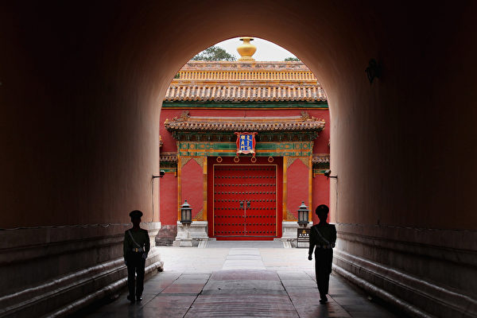

图为北京的警察在故宫内巡逻。 (Getty images)

【大纪元2020年05月12日讯】大家好，欢迎关注新闻看点，我是李沐阳。

跟大家分享一个段子，网上有个帖子说，“一天到晚不是‘亮剑’就是‘亮武’，不是‘亮枪’就是‘亮炮’，亮完导弹航母，就剩吓唬百姓那点本事了，世界压根就没把你当回事。什么时候能亮亮先进文明，亮亮道德良知，亮亮民主自由，亮亮公平公正，亮亮给人民造了多少福祉；哪怕亮亮官员财产，官员子女国籍也算牛”。

这个帖子说的是谁，应该是不言自明的，指的就是中共。四处挑衅，欺软怕硬，镇压民众等等，这些恶行让世界忍无可忍。整个世界都被它惹恼了，而且它最怕的一件事恐怕要来了。我们一件一件地说。

<b>中共应赔偿</b>

先说两个最新的消息。

白宫贸易顾问纳瓦罗在CNBC和福克斯新闻节目中说，“必须向中国（中共）发出账单（bill）。这不是惩罚它们的问题，而是要追究中国（中共）的责任——中国共产党的责任。”

纳瓦罗表示，中共在疫情期间缺乏透明度，对美国和世界造成伤害，它将承担应有的经济后果。

知情人向《华尔街日报》透露，美国FBI和国土安全部将指控北京，通过黑客入侵和其它非法手段，从美国机构窃取与中共病毒疫苗和治疗方法有关的知识产权和卫生信息。这个警告将在未来几天发布，《纽约时报》昨天也报导了这个消息。

中共驻澳大使成竞业今天可能收到了澳洲国会的传唤通知，要求他出席在8月份举行的调查听证会，并提供证词。目的是调查中共对澳洲的经济渗透和经济威胁，并且向澳洲政府提出应对政策的建议。

种种迹象显示，国际对中共已经真的无法再容忍了。我们接下来先从国内说起。

<b>社区疫情小爆发</b>

从中共的对外通报的数字看，疫情已经趋于缓和。但是黑龙江和吉林两省先后爆发了疫情，然后传播到了辽宁沈阳。其中黑龙江的疫情，曾被习近平、李克强在政治局会议上点名。

今天（11日），武汉通报称，东西湖区委长青街工委书记张宇新被免职了。大陆媒体报导，原因是武汉东西湖区长青街三民小区封控管理不力，连续出现新增本土确诊病例。

看来这个张宇新成了又一个替罪羊。

昨天（10天）发现的5个病例，和前天发现了1名确诊本土病例，都居住在三民小区。这意味着当局打造的35天零新增确诊病例已经被打破了。

另有网友视频爆料，在汉口六渡桥某酒店，近20人被抬上车，装满了3辆救护车。但是当局并没有通报这个情况，网友表示，武汉地方当局为了官帽还在继续掩盖，这是准备再次封城吗？

吉林今天（11日）通报，昨天新增3例本土确诊病例，都是与舒兰市确诊病例密切接触者。

昨天（10日）舒兰市的疫情风险已经调升到了高级，而且封城了。除了运输农用物资和生活物资外，其它车辆和人员严格限行。所有社区、村（屯）实行封闭管理，对市内所有人员地毯式排查。

此外，已经复课的高三和初三学生再次终止了返校上课，又恢复到网络授课的模式。

社区疫情小爆发，又增加了民众质疑，中共到底隐瞒到什么时候？

<b>反送中回来了</b>

大陆民众质疑，而香港人压根就不相信中共。

昨天（10日）香港各区都出现了示威和公众集会，继续提出五大诉求，要求港府做出回应。在反送中运动届满一周年之际，人们看到，因为中共病毒（武汉肺炎、冠状肺炎、COVID-19）而一度中断的反送中和平抗争又回来了。

事先有网民呼吁，在母亲节（10日）“和你Sing”。下午，在尖沙咀海港城，警察多次驱散聚集人群，并带走一名13岁的学生记者。

下午3点，荃湾广场多个楼层出现黑衣市民。有人喊口号，有人拿着反送中和香港独立等标语、旗帜。商场外警方紧张戒备，如临大敌。但商场内顾客没受影响，仍在正常消费。

晚上9点多，旺角弥敦道和山东街出现示威者，高喊反修例口号。在山东街，有人点燃了横放在马路上的垃圾桶，随即大批防暴警到场，至少制服其中一人。

在旺角新世纪广场，有人向警察投掷杂物。警察则释放胡椒球弹进行还击，并拘捕了多人。自由亚洲引述消息说，警方在旺角这里拘捕了100多人。

在场警察拉起封锁线，用强光灯照射人群。随后警方又制服多人，并进行搜查。在场人士则继续指骂黑警，高呼口号。

香港《明报》职工协会发声明，指多名记者在旺角遭到警方的包抄、攻击、挑衅和侮辱，包括近距离“行刑式”向耳朵喷射胡椒喷雾等等。《苹果日报》一名记者被制服后，遭警察箍颈20秒，一度休克需送医院。

晚上10点多，有人在西洋菜南街焚烧杂物，被多名防暴警驱散。（元朗区议会北朗选区区议员）邝俊宇到场后，被警方推倒在地，指控他公众地方行为不检。但民主党在社交网站表示，邝俊宇到场后，仅仅是要求警察冷静。

<b>去中共化加速</b>

和香港比，美国没有激烈的动作。但是美国采取的措施，可能对中共的打击更大。

昨天（10日）外媒引述密苏里、佛罗里达、印第安纳和马萨诸塞州等州长的说法，从中国或其它国家购买医疗用品确实比较便宜。但是这次疫情教训太重，需要自给自足，即使本州自制的价格比较贵，也是值得的。

报导称美国多个州正计划在本州扩大生产医疗设备与防护用品，以减少对中国的依赖，确保有可靠的长期库存。

上周，美国食药监管局（FDA）已经撤销了60多家中国厂商向美国输出N95口罩的许可，占去总数的8成。有白宫幕僚表示，美国医疗用品供应过于依赖中国，总统已经下令，联邦机构要增加采购美国商品。

前天（9日）中科院学部委员李扬表示，这次疫情或明或暗地加剧了“去中国（中共）化”的倾向。他警告说，在国家上无论在实体经济还是金融领域，一个排斥人民币、排斥中国（中共）的同盟正在形成。

作为国家金融与发展实验室理事长，李扬表示，这场危机刚开始时，世界出现了美元荒，“这是非常可怕的事情”。因为历史上每次出现美元荒，都强化了美元的国际储备货币地位。

而在美元荒不久，9个央行签署货币互换协议。其中有两件值得关注的事：一是没有中共央行，而是这个网里没有人民币。他认为这就是“去中国（中共）化”。

<b>川普与拜登 比谁对中共更强硬</b>

去中共化已经形成趋势，而美国第59届总统之争，却是以“谁对中共更强硬”开始了比拼。

今年是美国大选之年，虽然距投票还有半年之久，但两位候选人已经开启了广告大战。

民主党候选人拜登早前是力主和中共拉近关系，但这次疫情成了美中关系恶化的催化剂。他揶揄川普“没有让中国（中共）负上责任”，还批评川普针对中国的旅行禁令有漏洞等等。

而川普火力更猛，批评拜登在1月反对向中国实施入境禁令，指他“不会站起来对抗中国（中共）”。川普在1分钟的竞选广告中，引用拜登在去年5月的言论称，“中国（中共）会吃掉我们的午餐？得了吧”、“中国（中共）不是美国的竞争对手”。

北大教授王缉思最近撰文表示，今年的美国大选，中共将是一个比过去更显眼的议题，两国关系在疫情下正变得更坏。

专栏作家程凯在《苹果日报》撰文表示，川普把中共病毒疫情与911恐袭和偷袭珍珠港相提并论，已经是近乎对中共宣战。

而在一周前，范畴撰文表示，川普可能在4周内出重拳。他指出川普即将出重拳，有3个直接迹象。首先是他在白宫记者会上亲口说出已经看到病毒出在武汉实验室的证据；其次是对路透社直接表示，已经准备与中国脱钩；第三是拜登已经把中共议题列为主打议题，要和川普比较谁对中共更硬。

<b>军事走火？中印边界爆冲突</b>

川普近乎宣战但并未战，而印度没有宣战却已在边境爆发冲突。

昨天（10日），中共军队与印度士兵发生了肢体冲突，报导称共有150多人涉入其中。冲突中中方有7人受伤，印方有5人受伤。

印度官员表示，双方几十名士兵在印度东北部锡金邦（Sikkim）的纳库拉（Naku La）地区发生对峙。两方士兵进行了激烈的言辞交锋和肢体冲突。在双方军队领导人干预后，已经各自撤离。

印度军方表示，由于边界问题尚未解决，两方部队之间确实会发生暂时和短暂的对峙。

这次摩擦凸显了中印之间的互不信任。就这块领土主权问题，中印从2003年以来，举行过十几轮谈判，都没有和解。1962年还曾为此发生了一场战争。

虽然没有引发武装冲突，但这次摩擦会使两国关系加深裂痕。分析师认为，武装部队遭遇的增加，可能会导致意外升级。

也就是说，很容易发生擦枪走火，可能引发更大的冲突。

其实对北京有戒心的不只印度，许多邻国都有担心。因为北京的态度日益强硬，尤其在领土问题上。《华尔街日报》指出，南中国海周边国家，都对中共武装争议海域提高了警觉。

<b>中共战狼外交激反弹</b>

引起国际警觉和反感的，不仅是北京扩张野心，还有中共的战狼外交。

前天（9日）中共官媒发万言长文，一一反驳病毒源自武汉、病毒不是武汉病毒等等。报导针对中共瞒报疫情、掩盖信息的指责进行狡辩，自称中共信息发布“公开透明”。批评美国对中方“攻击抹黑”，表示“中国才是假消息的受害者”等等。

8日，《环时》总编胡锡进称，应该把核弹头数量扩大到1000枚，还要有100枚东风-41战略导弹等等。

胡锡进发出狂论，立刻被网友群殴打脸。网友斥骂“老胡每隔一阵一定要抽一次风”，也有的说“这个世界最大的墙国唯一的利器——打嘴炮”。

还有一位网友嘲讽：“发射核弹不像孩子们打弹弓，有膀子力气就能扔出去。发射核弹需要制导系统，需要导航系统，需要扫描、瞄准系统等等，而这一切都离不开电子系统。现在电子系统都联网，而主根服务器只有一个在美国。可以说尼国的网络数据都在人家的掌握之中，假如美国给尼国掐断网络，你家的核弹留着腌咸菜吗？”

法国《观点周刊》网站文章表示，疫情以来，没有一天不会听到中共在网络上引起波澜。文章引述香港浸会大学政治学者高敬文的观点指出，这些战狼式外交官的出轨表现，暴露出中共在国际舞台上“极其幼稚”。

前法国驻华大使让-莫里斯·里普特（Jean-Maurice Ripert）表示，中共非常“笨拙”，战狼外交“尤其显得不聪明”。

里普特指出，习近平时代又走回了中共的老路，缺乏谈判外交。而各个外交官相互攀比，“看谁更出色”，最终目的是都是想博高层领导欢心？惊人一举后，就可以升官。

这些战狼外交官在2017年底中共19大之后登场。2019年被任命为驻法大使的卢沙野从驻加拿大大使2019年转任驻法大使，提升到了副部级，被认为因抨击加拿大拘捕孟晚舟而提升。

<b>北京最怕的是这个？</b>

其实中共被骂“幼稚”也好，与印度发生边境摩擦也好，还是美国及全球去中共化也好，这些对北京来说，都是很挠头的事。但国际追责责骂，可能不会直接导致中共崩溃；但来自内部的追责，可能会加速中共的解体。所以内部追责才是北京当局最害怕的。

前天（9日），中共召开了党外人士座谈会，政协也召开了网络协商会。这是中共在两会召开前的“传统动作”，自称是听取各方意见。但实际这是中共在进行最后的摸底，看看各界是否忠心，防止两会期间出现意外或不和谐音。

同一天，中共对35个中央机关单位展开了第五轮巡视。这个意味，中共官场的人都懂，这是北京举起了杀威棒，对所有人进行震慑。

8日，中共免去了孙力军公安部副部长的职务。在两会前处理中共的特务头子，显示内部的叛乱已经被搞定，中共的特务系统已经掌握在习近平的手中。

7日，中共召开了政治局常委会议。中共官媒报导，会议讨论了抗疫胜利和复产成功等，此外“还研究了其它事项”。从报导中看，对国际形势和外交策略等是只字不提。

时事评论员钟原撰文表示，中共高层担心两会出问题，但是又急于召开两会。目的是制造党内和谐，打消官员们的疑虑，希望以此展示高层牢牢掌控权力的形象。

但北京很清楚，内部的议论猜测一直没断。前段时间就闹出了“挺习倒习”不同版本的公开信风波，很可能是中共不同派系在酝酿内部追责。

这种情况下，北京大幅缩短了会期，从原来的10天缩短为一周。这更突显出北京的矛盾心理。希望借两会树威，却又怕内部追责。

一旦内部追责的苗头出现，那是很难阻挡的。所以当局急需把各种追责的声音消灭在萌芽状态。绝不能让各派势力利用追责，掀起什么风浪。

但是钟原表示质疑，中共大小官员还会乖乖听话吗？各个派系会轻易放弃这个夺权的良机吗？中共内部想摆平，老百姓会答应吗？

在会员区，我们会说倒爷的自述下半部分：如何面对国际买家？

大纪元《新闻看点》制作组

<a target="_blank" href=#top><h6 align="right">回上方</h6></a>

 
<a name=110>
<h1 align="center"><b>印度军方证实中印军队在边界爆发冲突</b></h1>

中国和印度士兵近日再度爆发冲突。图为中印边境的印度士兵。(AFP)

【大纪元2020年05月11日讯】印度军方周日（10日）表示，印度士兵在锡金北部边界与中方军队发生长时间的紧张对峙，双方都有“攻击性行为和轻微受伤”。

在此之前，《印度时报》引述印方2名军官消息指，印度士兵当日巡逻期间遇上中方士兵，突然爆发激烈冲突，互相拳打脚踢。

《印度斯坦时报》报导，互相以拳脚攻击对方，受伤人数为11人，其中印度士兵4名、中国士兵7名。

除此之外，中印军队上周二（5日）晚些时候／周三早些时候还在拉达克进行了一场“肉搏战”。一名知情人士说，混战发生在控制线（LAC）印度的一侧。

中印双方上次重大对峙发生在2017年的洞朗地区（印度称都克兰），当时两军对峙了73天，其后双方决定撤退，令两国关系缓和。

印度军方周日发表的声明还表示，“边界没有解决，就会出现暂时、短暂的对峙。”

中印边界争端涵盖了长达3488公里的实际控制线。双方已经举行了多次会谈，但尚未取得任何结果。

近期，全球追究中共隐瞒疫情之际，中共官媒高调叫嚣战争的同时，也接连在南海、东海、台湾海峡频繁活动。近日，中共海警船连续三天逗留钓鱼岛附近，并且一度追逐日本渔船，令场面一度紧张。

中共官媒和军方媒体近日高调宣讲“武统”台湾的触发条件及战争准备，叫嚣“丢掉幻想准备打仗”。

4月15日，中共国台办旗下官网刊发了题为“说透了！‘武统’台湾什么时候开始？解放军专家权威解读”的政论文章，重新开始炒作武力统一台湾的话题。

就在同一天，中共军队东部战区陆军微信公众号也发表了一篇题为“丢掉幻想，准备打仗”的文章，炒作武力统一台湾的话题。

中共左派喉舌《环球时报》总编辑胡锡进再出狂言，当局需快速扩大核弹头和导弹数量，引发关注。

近期，中共军机、舰船频繁在台湾周边行动，加剧了台海局势紧张。为此，美国军方多次派出轰炸机、航母战斗群到台湾海峡巡航。

分析认为，中共意在转嫁其当前所承受的国际追责压力，同时也转移国内民众关注疫情真相的视线。

<a target="_blank" href=#top><h6 align="right">回上方</h6></a>

<a name=109>
<h1 align="center"><b>中共火箭失控 飞掠洛城和纽约 坠入大西洋</b></h1>

5月5日，长征5B火箭发射了一个类似“龙飞船2号”（SpaceX Crew Dragon）的载人舱进行测试。该火箭在返回时失控。(Photo by STR/AFP via Getty Images)

   
  【大纪元2020年05月12日讯】（大纪元记者徐简综合报导）在接下来的几个小时内，一枚失控的中共火箭将成为几十年来跌落的最大型太空垃圾，它不受控制地飞掠洛杉矶和纽约中央公园，最终降落在大西洋上。美国军方一直在紧盯这枚火箭的坠落动态。

中共的最大火箭“长征五号B”5月5日进行了首次发射任务，但是在返回过程中出现异常，正以不受控的方式坠毁，预测在北京时间12日凌晨0点37分前后7小时会“再入”大气层。

5月5日，长征5B火箭发射了一个类似“龙飞船2号”（SpaceX Crew Dragon）的载人舱进行测试。在绕地球一周运行之后，这枚大型火箭的核心与大气层相撞，其下降过程中火箭将焚毁，剩余部分将会坠落地球。

美国哈佛天体物理学家乔纳森·麦克道威尔（Jonathan McDowell）在推特上写道：“这是自1991年39吨重的礼炮七号（Salyut-7，注：苏联礼炮计划中最后一个太空站）以来，重入大气的最大失控物质。”

<h4 align=center><a href="https://twitter.com/planet4589/status/1259861653514043392?ref_src=twsrc%5Etfw%7Ctwcamp%5Etweetembed%7Ctwterm%5E1259861653514043392&ref_url=https%3A%2F%2Fwww.epochtimes.com%2Fgb%2F20%2F5%2F11%2Fn12099864.htm">At 11:21 Eastern time the CZ-5B rocket is predicted to pass 170 km directly above Central Park, New York. I've never seen a major reentry pass directly over so many major conurbations!(点击右键,另存新档）</a></h4>

美国军方、私人航空航天公司和其它公司一直在追踪该物体，有预测显示这枚37,000磅重的火箭可能会进入大气层，并随时开始燃烧。

据大陆媒体报导，“长征五号B”全长约53.7公尺，起飞重量约849吨，5日发射完成任务后，原定测试“柔性充气式货物试验舱”返回功能，但在返回过程中发生异常，开始以椭圆轨道绕地球飞行并下坠。

就在上个月9日，中共的长征三号乙火箭运送卫星升空，但在升空后不久就爆炸坠落。

“长征五号B”比中共的“天宫一号”空间站质量更大，后者在2018年坠落回地球（可能降落在海洋中的某个地方）。

大多数火箭会在降落时燃烧，但小块碎片可能落到地球表面。当它划过天空、嘶嘶作响燃烧到生命尽头时，人们能用肉眼在天空中看见。

由于火箭以每小时数千英里的速度移动，因此它的重新进入时间很难预测。当它破裂时，掉落到地面的碎屑会散布到数百或数千英里。

但可以肯定的是，火箭将重新进入大气层并开始分解。这意味着其碎片可能落在该范围内的某个位置，此前根据推算，这枚时刻火箭会落到北到纽约、南到澳大利亚以及介于两者之间的地区。

不过不用担心的是，迄今为止还没有太空垃圾伤害或杀害人类的记录，因为太空垃圾通常落在海洋或偏远地区。

<a target="_blank" href=#top><h6 align="right">回上方</h6></a>

 
<a name=108>
<h1 align="center"><b>网曝广东虎门大桥异常抖动的另一原因</b></h1>

近日，广东虎门大桥发生异常抖动。（视频截图合成）

   
【大纪元2020年05月10日讯】近日，广东虎门大桥接连发生波浪般剧烈抖动后，网传大桥抖动的另一原因是：上游侧38号吊索钢丝绳断裂。

5月10日，网民在微博上发帖称，虎门大桥发生异常抖动的检测结果出来了，除了“水马”之外，上游侧38号吊索钢丝绳断裂！发生于钢箱梁内侧锚头处，旧索从内面外发生锈蚀。此外，主缆跨中位置附近主缆顶、底面腐蚀严重，中跨和入东锚口处主缆位置均有3-4层腐蚀严重的钢索！

网传虎门大桥上游侧38号吊索钢丝绳断裂。（网络图片）

同天，中共交通报社前记者“高铁见闻”也披露，38号吊索钢丝绳断裂，是大桥起伏波动的主要原因。断裂发生于钢箱梁内侧锚头处，旧索从内面外发生锈蚀，目前已经拆除吊索，又发现多根出现锈蚀。

高铁见闻爆料，虎门大桥38号吊索钢丝绳断裂。（网页截图）

   
   另一网民称，据一位当时虎门大桥工程师说，两条主钢索，从广州往虎门方向，左边的是国产的钢索，右边的是德国进口的钢索，而吊索全部是国产的，还有桥体的钢箱体，全部都是广船制造的。

有网民质疑，一根吊索的钢丝绳断了就晃？感觉这解释也有点急于求成啊。

但有不少网民认为：“可能是晃断了吧”，“不是说一年一检嘛！咋出了这么多问题”，“钢索都这样了！能不晃悠吗？”

5月5日下午，虎门大桥部分桥面上下起伏，如波浪般剧烈抖动，吓坏“五一”长假返程的民众。随后虎门大桥双向封闭。

当日，中共专家组初步判断，振动主要原因是由于沿桥跨边护栏连续设置水马，改变了钢箱梁的气动外形，在特定风环境条件下，产生了桥梁涡振现象。

5月6日，广东交通集团发通报称，虎门大桥本次发生抖动的主要原因，是沿桥跨边护栏连续设置水马，改变了钢箱梁的气动外形，在特定的风环境条件下，产生的桥梁涡振现象，对桥梁安全无影响。

但移走护栏旁的水马后，虎门大桥6日、7日仍出现抖动现象，透过肉眼可以看到桥面出现晃动。

《漯河晚报》5月9日报导指，截至5月7日上午11时许，监控画面显示桥面仍有轻微振动。

虎门大桥于1997年6月9日正式通车，是连接京珠高速公路和广深高速公路的重要交通枢纽。虎门大桥及其连接线工程全长15.6公里，其中主桥全长4.6公里。

<a target="_blank" href=#top><h6 align="right">回上方</h6></a> 
 

<a name=107>
<h1 align="center"><b>持有枪支弹药 内蒙公安厅高官之子获刑</b></h1>

【大纪元2020年05月12日讯】中共内蒙古公安厅前党委委员、副厅长孟建伟的次子孟根达来利用父亲的影响力受贿并非法持枪被判刑4年。

孟根达来曾在包头市公安、检察系统工作，2016年3月出任包头市纪委副县级检查员，2018年9月任包头市纪委监委驻市政协机关纪检监察组副县级检查员。

近日，中国裁判文书网发布的孟根达一审刑事判决书显示，孟根达来利用父亲孟建伟担任包头市公安局局长、政法委书记，内蒙古自治区公安厅副厅长的职务之便，为多位请托人谋取不正当利益，收受他人钱财195万余元，并非法持有枪支、弹药。

孟建伟在退休近一年后的2018年10月31日被查。孟建伟落马2天后，他的妻子、包头市公安局交警支队前主任科员刘丽萍、次子孟根达来被调查。

2019年12月，孟根达来犯有“利用影响力受贿罪，犯非法持有枪支、弹药罪”被判刑4年，并处罚金30万元。

判决书显示，孟根达来被查后，他位于包头市住所及车库被搜查出疑似枪支5支、疑似气枪铅弹3盒共1096发、疑似小口径子弹256发。

一名接近内蒙古政法委的知情者梁小华（化名）曾对《中国新闻周刊》透露，孟建伟的长子孟银柱也同时被抓。“孟银柱开设赌场，并利用其父的影响力成为很多赌场老板的靠山，并多次捞人。”孟建伟的小舅子亦被查，“他垄断包头炸药市场。开矿离不开炸药，他靠高价卖炸药，赚钱数以亿计。”

2019年9月19日，孟建伟涉嫌“受贿罪、巨额财产来源不明罪、非法持有枪支、弹药罪”被起诉。

内蒙古官方曾发文称，孟建伟亲自为黑恶势力充当“保护伞”。他不仅自己亲自充当“保护伞”，还培植出多把“警伞”，为黑社会头目郭全生（包头万号国际酒店法定代表人）保驾护航。

多位知情者说，郭全生是包头最大的黑社会头目，他的“保护伞”阵容强大：除了孟建伟，自治区政府前副主席白向群、自治区人大常委会前副主任邢云、包头市前副市长路智、包头市公安局前局长杜宝君、包头市文化局前局长洪涛等人皆被其“收编”。

孟建伟在内蒙古公安系统任职23年。他曾积极迫害法轮功，被海外“追查迫害法轮功国际组织”列入追查名单。

据明慧网报导，孟建伟任包头公安局长、内蒙古公安厅副厅长等职期间，对当地法轮功学员大肆绑架、关押、办洗脑班、劳教、判刑，罪恶累累，罄竹难书。

<a target="_blank" href=#top><h6 align="right">回上方</h6></a> 
 

<a name=106>
<h1 align="center"><b>回应中共瞒疫 川普拟禁联邦退休金投资中企</b></h1>

福克斯商业新闻（FOX Business）获悉，川普（特朗普）总统正在切断美国联邦退休基金和中国股票之间的投资关系，且此举和川普政府不满中共处理病毒疫情方式有关。(MANDEL NGAN / AFP)

【大纪元2020年05月12日讯】（大纪元记者苏静好综合报导）福克斯商业新闻（FOX Business）获悉，川普（特朗普）总统正在切断美国联邦退休基金和中国股票之间的投资关系，且此举和川普政府不满中共处理病毒疫情方式有关。

周一（5月11日），福克斯商业新闻独家获得国家安全顾问罗伯特‧奥布赖恩（Robert O’Brien）和国家经济委员会主席拉里‧库德洛（Larry Kudlow）写给美国劳工部长尤金‧斯卡利亚（Eugene Scalia）的一封信。信中指出白宫不希望节俭储蓄计划（Thrift Savings Plan，简称TSP）的资金投资于中国股票。

根据公开资料，联邦退休节俭储蓄投资委员会（Federal Retirement Thrift Investment Board）管理提供给联邦政府雇员和军方人员的节俭储蓄计划，类似于美国私人部门的401(k)退休储蓄计划，参与该计划的人士可以选择将一部分工资投资退休储蓄计划提供的基金产品。

信中说，联邦退休储蓄投资委员会偏离了委员会为国际股票投资基金设立的指数，现在选定的跟踪指数包含中国公司，是有风险和错误的。

<b>不满中共对疫情处理 美拟撤回联邦退休基金</b>

信中还直接表示，中国（中共）对COVID-19（中共病毒引发的肺炎，中共肺炎）的处理是美国不应该对中国公司进行投资的原因之一。

中共隐瞒疫情，导致中共病毒蔓延180多个国家，令川普不得不关闭美国经济，造成数万美国人染疫死亡；川普政府和国会多名议员多次公开谴责中共处理疫情的不透明做法，并表示要对中共追责和要求赔偿损失。

川普总统也多次强调原本疫情应该可以控制在中国以内，但因中共政府无能或刻意为之，导致病毒全球肆虐。

福克斯商业新闻5月11日报导说，在第二封信中，斯卡利亚写信给联邦退休储蓄投资委员会主席迈克尔‧肯尼迪（Michael Kennedy），分享库德洛/奥布莱恩的信，指出这两名白宫官员“出于对投资风险和国家安全的考虑，而对（联邦退休金投资）计划中的投资表示严重关切”。

信的结论是，将资产移出某个基金是“在川普总统的指导下”。

斯卡利亚希望联邦退休储蓄投资委员会主席在周三前作出回应。

<b>联邦退休基金和中国股票之间的投资关系</b>

早在2017年，联邦退休储蓄投资委员会聘请的外部咨询公司怡安休伊特（Aon Hewitt）就建议，将投资转到包括新兴市场公司股票的基金上。

继而，该投资委员会2019年做出决定，从2020年开始，将节俭储蓄计划的国际基金指数（International Fund Index）转投入MSCI除美国外所有国家世界可投资市场指数（MSCI All Country World ex-US Investable Market Index）中。

MSCI（明晟）是全球最大的股指编制公司之一，有数万亿美元的资金追踪其编制的指数。旗下的除美国外所有国家世界可投资市场指数涵盖99%的国际证券市场，其中中国公司权重占11%，还包括受美国制裁的部分中国公司。

<b>撤资将导致美中关系进一步紧张</b>

若川普政府重新改投400亿美元的美国联邦退休金去处，相当于中共当局少了400亿美元的资金流入，这一数额是贸易战之前美国对华所有进口商品加征近10%的关税总和。

报导说，此举很可能会加剧美中之间，以及履行第一阶段贸易协议条款的紧张关系。

在周一的疫情新闻发布会上，川普总统表示，他对就美中第一阶段贸易协议重新谈判不感兴趣。

川普在新闻发布会上被问及，中共媒体报导说，中方希望重新谈判获得一份对其更有利的第一阶段贸易协议，他是否接受。川普说：“不，一点也不，甚至一点点（兴趣也没有）。”

“我没兴趣。我们签署了协议。我也听说过——它们想重新开始贸易谈判，以使（协议）对它们来说更好。”川普说。

<a target="_blank" href=#top><h6 align="right">回上方</h6></a>
 
 
<a name=105>
<h1 align="center"><b>加拿大三级政要贺法轮大法洪传28周年（1）</b></h1>

2020年5月13日第21届“世界法轮大法日”，加拿大联邦、省、市议员纷纷向法轮大法学会发来贺信、嘉奖令和褒奖。（大纪元合成图）

   
  【大纪元2020年05月09日讯】（大纪元记者滕冬育多伦多报导）2020年5月13日是法轮功（也称法轮大法）开传28周年纪念日、第21届“世界法轮大法日”，也是法轮功创始人李洪志先生69岁的华诞。在此普天同庆的日子，加拿大联邦、省、市议员纷纷向法轮大法学会发来贺信、嘉奖令和褒奖。

在今年的贺信中，政要们表示，法轮大法让全世界亿万民众身心受益，他们支持大法修炼者，敬重大法修炼者，会捍卫修炼者信仰的自由，与修炼者一起反对迫害；政要们赞扬“真、善、忍”理念是所有信仰的楷模；赞扬法轮大法冲破阻力造福民众；祝愿法轮大法利国利民的正面作用继续在全世界发光。

在中共隐瞒疫情导致中共病毒肆虐全球、加拿大民众深受其害之际，多位加国政要表示，法轮大法“真、善、忍”准则在艰难中更显其重要性，更具意义；加拿大民众应将“真、善、忍”融入日常生活中；同时大瘟疫也提醒着加拿大民众，法轮大法修炼者在中国所遭受的巨大魔难。

法轮功自1992年传出，修炼者通过同化宇宙特性“真、善、忍”，从而达到人心向善、身体健康、返本归真的高层境界。学炼者普遍身强体健、心性道德提升。迄今，法轮功洪传一百多个国家和地区，使全世界超过一亿人身心受益，深受各族裔人士喜爱，法轮功书籍已被翻译成四十多种文字。

<b>联邦反对党领袖：赞扬法轮大法学会的努力 </b>
   
   

加拿大联邦反对党领袖、保守党国会议员安德鲁·熙尔（Andrew Scheer）

   
   加拿大联邦反对党领袖、保守党国会议员安德鲁·熙尔（Andrew Scheer）向法轮大法学会发出贺信表示：“我非常高兴能向庆祝法轮大法洪传于世28周年的每一位表达我最诚挚的祝福。”

熙尔在贺信中说，法轮大法传世周年的庆典活动，正是认可和表彰法轮大法的好时机，“通过推广‘真、善、忍’宇宙特性，这个传统的中国功法在全世界修者日众。”

“加拿大人很幸运，我们生活的国家尊重人权和他人的信仰。加拿大一直是宗教自由的灯塔，为不同文化背景、信仰的人们提供着庇护。”

贺信中熙尔承诺，加拿大保守党一直非常关注和支持因为信仰受到迫害的群体，维护人权一直会是保守党的一大要务。

“我非常高兴能借此机会赞扬加拿大法轮大法学会，赞扬他们在与加拿大人分享这个利于他人的功法中所付出的努力。”

“请接受我最真挚的祝福，祝愿你们有一个快乐的庆祝活动。”

 <b>萨斯喀彻温省省督：病毒肆虐之时 “真、善、忍”与我们更加息息相关 </b>
 
   

萨斯喀彻温省省督罗素·莫瑞斯蒂（Russell Mirasty）

   
   萨斯喀彻温省省督罗素·莫瑞斯蒂（Russell Mirasty）在贺信中写道：“在庆贺法轮大法传世28周年之际，谨代表加拿大女王——伊丽莎白二世，我非常荣幸能向加拿大法轮大法学会的成员送上祝福。”

贺信中写道，能生活在加拿大，这个保护人权和自由的国家，非常幸运，“（加拿大）鼓励我们庆祝自己的传统，并与他人分享。”

在中共病毒肆虐加拿大之时，很多人都感到紧张和不安，“（法轮大法）的美好理念‘真、善、忍’，比以往任何时候都（与我们）更加息息相关。谢谢你们在全世界推广平和。”

贺信最后写道：“在你们庆贺周年之际，请接受我的祝贺，祝愿未来一切顺利！”

<b>联邦参议员：法轮大法冲破阻力 造福民众</b>

   

联邦参议员吴蓝海（Ngo Thanh Hai）。

   
   联邦参议员吴蓝海（Thanh Hai Ngo）发来贺信表示，今年Covid-19病毒（中共病毒）大流行带来的前所未有的特殊情况，我们无法在国会山举办庆祝活动，“但是我仍然想要表达我对加拿大法轮大法学会一如既往的、全心全意的支持。感谢你们对社会所作出的积极贡献。”

吴蓝海说：“我要对加拿大法轮大法学会于2020年5月13日举办的法轮大法洪传世界28周年庆典，送上我最热烈的祝贺。”

贺信中写道，法轮大法这个古老的修炼功法，冲破重重阻力和障碍，让不同阶层的民众受益，“法轮大法的教导帮助了全世界的民众，提升他们的精神和身体健康。”

“在加拿大，我们有幸拥有开放、多元文化以及信仰自由的价值观。秉持同样理念，法轮大法日——欢迎所有参与者了解法轮大法的益处和传统，并立志将这些价值观推广到全球。”

吴蓝海表示，非常荣幸能有机会帮助加拿大法轮大法学会组织这场年度的庆典，有机会能帮助（修炼者）完成推广平和、容忍和人类尊严等更大的使命。

<b>前联邦移民部长：自由党成员和你们站在一起</b>

 

曾任联邦移民部长、自由党国会议员多年的朱迪‧思格若（Judy Sgro）。

   
   前自由党联邦移民部部长，资深国会议员朱迪•思格若（Judy Sgro）在贺信中写道：“值此法轮大法洪传28周年之际，作为法轮大法国会之友组织的共同主席，我很高兴再次加入你们支持者的行列。”

思格若女士写道：“此时，100多个国家和地区的和平的法轮功修炼者共同庆祝大法日。你们坚持不懈努力，在加拿大和全世界推崇包容、信仰自由、宗教自由等价值观，我很荣幸对你们的这些努力给予支持和肯定。”

贺信中写道：“在加拿大，法轮大法的修炼者有权力在和平安全的氛围中追寻他们的信仰。不幸的是，并非世界上的每一个角落都享有同样的信仰自由。当我们庆贺法轮大法传世28周年之际，我们必须再次提醒自己，我们有义务帮助世界上每一个国家的民众获得这样的权利。

“让人伤心的是，太多虔诚的、非暴力的修炼人依然生活在黑暗之中，随时面临迫害，甚至是失去生命的危险。作为加拿大人，我们有责任尽我们所能，推动改变，以结束这场极其不公正的迫害。”

贺信最后说：“今天，当我们再次为开放、宽容、宗教和信仰自由发出共同的呼声，请记住我们这些自由党的成员和你们站在一起。”

<b>联邦自由党副议长：法轮功修者愈众 世界愈光明</b>

   

联邦自由党副议长、温尼伯国会议员凯文·拉穆勒（Kevin Lamoureux）

   
   联邦自由党副议长、温尼伯国会议员凯文·拉穆勒（Kevin Lamoureux）在贺信中说：“在2020年5月13日这个非常特殊的日子，在全世界法轮大法修炼者共贺‘真、善、忍’普世价值之际，我要致以衷心的祝愿。”

“如果更多的人修炼法轮功，那么世界历史的呈现定会更加光明。”

拉穆勒表示，相信法轮功对世界的积极影响，想到法轮大法修炼者在未来对社区的贡献，他倍感鼓舞。

<b>反对党影子内阁部长：加拿大人与你们站在一起 必须对中共施暴者实施制裁</b>

   

国会议员、反对党影子内阁国防部部长 James Bezan

   
   资深联邦保守党国会议员，反对党影子内阁国防部部长詹姆斯·贝赞（James Bezan）在贺信中向所有庆祝法轮大法传世28周年的修炼者表达祝贺。

贝赞表示，虽然大家目前不能欢聚一堂庆祝这个特别的日子， 但我们不应忘记，世界各地那些和平的群体，不得不时刻躲避抓捕，“中共当局对法轮功的迫害让所有追求和平、自由和正义的人们无法容忍 。”

2017年，贝赞曾在加拿大国会推动了加拿大的《马格尼茨基人权追责法》，对严重侵犯人权者进行经济制裁，贺信中说：“中共对成千上万的法轮大法修炼者的迫害，当今最严重的侵犯人权行为之一， 包括监禁、摘取器官和谋杀其成员。 ”

“中共对法轮大法群体和其它和平团体的迫害，损害整个世界，全世界都应该站出来，呼吁中共当局对其大规模侵犯本国人权的行为负责。”

贺信中写道：“我们非常幸运地生活在加拿大这个民主国家，在这里我们可以享受宗教自由和言论自由。我们为那些生活在暴政下，不得不掩饰自己信仰，只能在家中进行信仰活动的人们祈祷。”

“ 希望有一天，所有中国民众都能自由、公开地表达自己的信仰。但这还不够，我还希望，包括加拿大在内的世界各国领导人，还必须对中共那些施暴者实施制裁，追责他们对法轮大法——这个非暴力和平组织的残酷迫害 。 ”

“在这个吉祥幸运的日子，加拿大人与你们站在一起，反对专制、压迫、独裁！”

<b>反对党副党鞭：法轮大法已获各级政府的认同</b>

   

联邦反对党副党鞭、联邦国会议员约翰·布拉萨德(John Brassard)

   
   联邦反对党副党鞭、国会议员约翰·布拉萨德(John Brassard)发出贺信，恭祝2020年5月13日法轮大法传世28周年，“因推广平和、容忍和善良，法轮大法已经获得加拿大各级政府的认同。”

贺信中写道：“法轮大法提升人们精神和身体健康的实例有目共睹。”

“我要向在加拿大和Barrie-Innisfil地区庆祝法轮大法传世28周年的法轮大法成员们，表达我最热情的问候。”

<b>国会议员：疫情下 中国应更珍视“真、善、忍”理念</b>
   
   

国会议员埃里克·邓肯（Eric Duncan）

     
 保守党国会议员埃里克·邓肯（Eric Duncan）在贺信中说：“我非常高兴能向所有庆祝法轮大法洪传28周年的大法学员致以我最诚挚的问候。 ”

贺信中写道：“28年来，全世界的法轮大法修炼者尽心尽力向全世界民众传播‘真、善、忍’普世价值。蓬勃发展的加拿大法轮大法群体，让加拿大成为一个更好的实践宗教信仰自由和保持传统的地方。”

邓肯议员说：“我支持你们、敬重你们，会捍卫你们信仰的自由。”“在新冠病毒（中共病毒）世界大流行之际，全世界，尤其是中国应该更加珍视和认可‘真、善、忍’这个重要的理念。”

“谨代表Stormont-Dundas-South Glengarry选区，我要真诚地感谢你们为我们这个多元化国家的谐和、和平所作出的贡献。我希望所有法轮大法追随者，在新的一年心灵提升和身体健康。”

<b>国会议员：祝愿法轮大法益国益民的正面作用 继续在世界发光 </b> 

大多伦多宾顿市国会议员凯尔·塞贝克（Kyle Seeback）

   
  大多地区保守党国会议员凯尔·塞贝克（Kyle Seeback）在贺信中写道：“作为Dufferin-Caledon 选区的国会议员，在法轮大法洪传28周年纪念日即将到来之际，我要向多伦多法轮大法学会表示热烈祝贺！”

“对于加拿大追求‘真、善、忍’的法轮大法修炼者，这是一个伟大的日子。‘真、善、忍’是我们所有加拿大人追求的普世价值，亦是对加拿大民主制度的奉献。”

贺信中说：“法轮大法日对法轮大法团体来说，是一个意义非凡的重要节日。面对仍然蔓延的COVID-19（中共肺炎）大流行的挑战，加拿大更需要勇敢坚强、团结一致。这场健康危机也提醒着人们，法轮大法‘真、善、忍’的重要性，以及你们28年来的坚持，和所遭受的巨大磨难。”

贺信最后写道：“请接受我衷心的祝愿。祝愿千千万万法轮大法学员普天同庆，让法轮大法益国益民的正面作用，继续在加拿大和世界各地发光。”

 <b> 国会议员：法轮大法让亿万人受益  </b> 
 
   

国会议员凯文·沃（Kevin Waugh）

 
 国会议员凯文·沃（Kevin Waugh）发来贺信恭祝法轮大法传世28周年，“我要向加拿大法轮大法学会表达我最真心的祝贺。”

贺信中说：“法轮大法弘扬容忍和平和，大法的准则‘真、善、忍’已让全世界亿万人受益，让所有人都感受到启迪。”

“我祝愿法轮大法日庆祝活动平和并能启悟人心。”

<b> 国会议员：法轮大法弘扬善良 成效斐然</b> 

   

联邦国会议员厄斯金．史密斯（Nathaniel Erskine-Smith）

   
   国会议员厄斯金·史密斯（Nathaniel Erskine-Smith）在贺信中写道：“请接受我对法轮大法传世28周年纪念的祝贺及问候！”

“冬去春来，法轮大法一如既往地帮助人们提升身体、精神、心灵健康，在社区中弘扬谐和与善良， 在全球各地致力和平， 成效斐然。”

“作为Beaches-East York选区的国会议员， 我支持并感谢所有法轮大法修炼者、支持者、亲朋好友，以及所有推广并参与庆祝活动的朋友们。”

<b>国会议员：我将与你们站在一起 无论庆典还是声援</b>

   

国会议员珍妮卡·阿特温（Jenica Atwin）

   
   大西洋省份绿党国会议员珍妮卡·阿特温（Jenica Atwin）在贺信中写道：“作为Fredericton选区的国会议员，我很高兴能向法轮大法团体，表达我对法轮大法日最诚挚的祝愿。 ”

“法轮大法对‘真、善、忍’的坚守，为全世界亿万修炼者带来平和，（修炼者）对容忍的实践不断启迪着他人。”

“在今天和未来的每一天，我将与你们站在一起，无论庆典还是声援。”

<b> 国会议员：“真、善、忍”是所有加拿大人推崇的价值观</b> 

   

国会议员泰德·福克（Ted Falk）

   
  <b>  国会议员：今时今日我们更需实践“真、善、忍”</b> 
  
国会议员桑格哈(Ramesh Sangha)发出邮件恭贺法轮大法日：“法轮大法‘真、善、忍’的理念也是加拿大的价值观，它们基于人权，基于我们宪法中人人互助的原则，尤其在今时今日我们更需要实践这些理念。”

“如果人们能全身心实践这些理念，必将弘扬和平，谐和与善意，并将有助于在全球范围内创造出一个个高度文明的社会。”

<h4 align=center><a href="https://www.epochtimes.com/gb/20/5/9/n12095472.htm">原文出处：網址(点击右键,另存新档）</a></h4>

<a target="_blank" href=#top><h6 align="right">回上方</h6></a>
 

<a name=104>
<h1 align="center"><b>粤千亿P2P平台退场 涉11万投资人百亿借贷</b></h1>

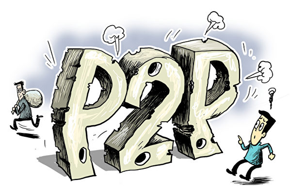

被称为广东“P2P四巨头”之一的小牛在线5月9日宣布退出网贷行业，其出借人数超过11万人，借贷余额超过百亿元人民币。（大纪元资料室）

   
   【大纪元2020年05月11日讯】（大纪元记者张玉洁综合报导）被称为广东“P2P四巨头”之一的小牛在线，5月9日在其微信公众号发布公告宣布退出网贷行业，逾百亿借贷款成悬念。近日来，疫情对大陆个人和企业造成重创，本已岌岌可危的P2P平台又有更多退场。

截至目前，小牛在线平台涉及的出借人数超过11万人，借贷余额超过百亿元人民币。

小牛在线成立于2013年6月，总部位于深圳，其官网显示累计成交额超过1171亿元人民币，母公司是小牛资本管理集团。

小牛在线的退场公告称，自公告发布之日起，“平台将停止发布任何新标及停止计息，并关闭出借人开户、充值、投标等功能；同时，自公告发布之日起，暂缓兑付，待兑付方案经全体出借人公开投票表决通过以后，按照兑付方案启动兑付工作。”

对于退场原因，公告中称，一方面网贷行业近两年经营环境恶化，出借人的投资风险及平台的经营风险增大；另一方面疫情增加了未来的不确定性，各大网贷平台都陆续退出。所以小牛在线也决定退出网贷行业，逐步结清存量网贷业务。

尽管此次公告称是“良性退出”，但11万多投资人是否能拿回借款，仍然引发担忧。小牛在线在2018年6月曾发生逾期兑付，此后的一年多时间，仍然有很多投资者一直没有拿到兑付款。2019年有投资者表示，“现在它死也死不了，活也不还钱，让人特难受。”

而就在小牛在线宣布退场之前，大陆媒体在4月下旬和5月初还至少两次高调宣称小牛在线是优质平台，称其“在大量劣质平台被清退之时，仍然‘前行’”。5月6日更提及小牛在线2019年曾获得iTrust（互联网诚信联盟）“互联网诚信创建示范单位”。

据悉，P2P平台通常将投资人的钱借给企业或个人，但作为投资人，无从得知自己资金的借款对象和用途，也无从得知对方是否有偿还能力。

在面临兑付风险的情况下，大陆的投资人通常进退两难。一方面希望给P2P平台施加压力，让其尽快还款，但同时又担心引发“维稳”问题，到时情况更糟。

尤其在疫情下，业界已经表示，对于早已摇摇欲坠的大陆P2P行业，疫情就是压倒这一行业的最后一根稻草。有网贷平台表示，疫情影响大陆各个行业，经济下滑，借款人的还款能力和意愿都下降，投资人的信心、投资能力和意愿也受到冲击。

疫情爆发后，已经有很多P2P网贷平台宣布退场，比如深圳两家百亿车贷平台“投哪网”和“人人聚财”、北京掌众财富、微贷网等。投哪网表示，由于催收难、逾期不断增长，压降过程资金消耗量巨大，股东的投资损失惨重，基本血本无归。

<a target="_blank" href=#top><h6 align="right">回上方</h6></a> 
 
 
<a name=103>
<h1 align="center"><b>一名中国成功商人的传奇故事</b></h1>

法轮功学员王志勇。（王志勇提供）

   
   【大纪元2020年05月10日讯】（大纪元记者易如采访报导）“当初让我下决心修炼的一件事情是，我几乎失明的右眼，在修炼法轮功以后完全恢复了视力，这让我见证了目前的科学治疗效果根本无法与法轮功祛病健身的神奇效果相比。”法轮功学员王志勇说，“这也是之后，无论遭受中共怎样的迫害，我都不放弃修炼法轮功的原因之一。”

<b>修炼后失明的眼睛复明</b>

1996年的一天，26岁的王志勇骑着自行车下班回家，但却不由自主的改道进了市内的音乐广场，在那里，他看到很多人在炼法轮功，“我觉得挺好，就跟在人群后面炼。那天以后，我开始走上了修炼的路。”王志勇回忆道。

不久，发生了一件事情。有人告诉王志勇，他年迈的母亲在市场上被人欺负。他急忙赶到市场，对那人还没来得及动手，却被对方用酒瓶砸向脑袋，在躲闪的时候，酒瓶砸中了他的右眼，“当时眼睛疼痛难忍。上医院检查，眼角膜破裂，眼底有瘀血，无视力。手术后，只感到有光，图像模糊。出院时，做手术的大夫说，保持好了能维持现状，保持不好晶体萎缩。”那时候王志勇还没有成家，“我心情非常沉重，谁愿意嫁给一个缺一只眼睛的人。”

不过，王志勇没有忘记每天的炼功，“每次炼完功，都会从眼睛里淌出一些泪水来，眼睛就不那么肿胀疼痛。之后还发现，眼睛里还有东西在转，像电风扇一样不停地转，有时候像是几个风扇在转，层层叠叠的（其实这是法轮在帮我修补）。这样，眼睛慢慢有了视力，也不那么怕光了。再后来，医生诊断，失明的眼睛复明了，我还去考了驾驶证。修炼确实太神奇了。”王志勇说。

<b>按“真善忍”做好人 生意越来越好</b>

修炼法轮功之前，王志勇在大连已是一家鞋店的老板，作为商人，当然利益在先，总是想方设法从顾客处多赚钱。然而，尽管卖的都是外贸出口的名品鞋，可顾客却越来越少，甚至有时一天也卖不出一双鞋，昂贵的租金和货物成本，把他急得捶胸顿足。

修炼法轮功后，经营情况发生了变化，“我转变了经营观念，站在顾客的角度上想问题，明码实价，多买有折扣价，新鞋子包换包退，鞋子免费维修。”王志勇说。

一天，一个顾客拿着一双坏了的鞋来找王志勇换新鞋，他发现坏掉的地方是被故意弄开线的，就不给那个人换，那人就找来工商所，所长为了维护商场名誉叫他给那人换一双，结果那人拿到新鞋后，又把旧鞋同时也拿走了。“我愣在那里，心想这是来要账的吧，那就把以前欠的都还给他吧。”

王志勇说，他按照大法“真善忍”的要求做个好人的时候，生意越来越好，“买鞋的顾客越来越多，有的人一次就买两三双，甚至买四五双的都有，有的人看见我家店里聚的人多，也过来看看，最后也买一双，慢慢回头客也多了，还有的店家长期来我这里批发。”顾客都评价说“买他的货放心”。很快王志勇又开了两家新店。

<b>为法轮功讲公道话 遭奴役般迫害</b>

1999年7月20日，中共开始全面打压法轮功。作为在大法中亲身受益的王志勇三次去北京上访，讲述法轮功的真相。2000年5月，他却被以“非法聚集罪”关押到大连看守所。

“这已经是第三次的关押。我绝食反对关押迫害，狱警张某就强行灌食，我反抗，他就拿来给死刑犯戴的手铐、脚镣给我戴上，并且给我固定在床板的铁环上，让四个犯人看着我，不让上厕所，大小便也不给打开手铐脚镣。”

40多天的迫害，王志勇身上长满虱子，虱子多得眼睛都能看到从内衣里往外爬，奇痒难忍，手搔到的地方皮肤都被抓破，直到当局要送他去教养院劳教的时候才解除他的刑具。那时的他已瘦得皮包骨头，有气无力，站都站不起来了。

之后，在大连教养院王志勇被分到一大队的砖厂，砖厂的机器24小时开个不停，要不断的往砖窑里送煤矸石，“白班要送150车，夜班要送120车，不管风吹日晒，电闪雷鸣，道路怎样泥泞，都要跑步行进。我虚弱的身体再也支撑不住了，倒在地上大口的喘着气，淌下的汗水在身上结成无数白色的盐粒。教养院的干部却没好气地说我‘你真顽固’。原来他们是想用这种方法让我们放弃修炼。”王志勇说。

<b>酷刑折磨中不屈的灵魂</b>

2001年3月19日，大连教养院为达到“转化”法轮功学员的目的，制造了酷刑强制转化的“三一九事件”。当天，劳教所里的警察集中了全部电棍和手铐，在大连司法局长郝宝坤、教养院院长郝文帅的幕后指挥、副院长张宝林现场指挥下，全体狱警加普犯对集中到劳教大楼的150名男法轮功学员实施暴力强制转化。

狱警闯进王志勇所在的二楼五六班教室，第一个把他拉出教室，“在走廊里，张宝林从腰间掏出一个高压小电棍，电击我的脖子，鲜血马上从鼻子里喷出，接着一群狱警把我拉到大队部，扒光衣服按倒在地，用脚踩着我的头、胳膊和腿，多根电棍同时持续不断的电击后背、脖子、肛门、脚心，我只感到浑身疼痛难忍，从头到脚都在剧痛中颤抖，我不由自主发出惨烈地喊叫，拚命地挣扎，可恶警的脚却把我踩得更狠，一直到我喊叫的声音弱了，没有挣扎了。”

这时，王志勇听到一声“行了”，接着一名王姓恶警上来叫王志勇起来撅着（头朝下，双手向后，劳教所被称为“开飞机”），王志勇没有顺从，就又被拉回教室里，当着其他法轮功学员的面，被用鞋底抽脸及用脚踢腿，试图想让他跪下，王姓恶警边打边说这就是对抗政府的下场。之后，再次用电棍电击王志勇后背，王志勇仍然没有屈服，气急败坏的恶警下死手折磨，直到王志勇倒下不动才停止，之后，王志勇被戴上手铐抬上三楼。

而此时，教养院整个大楼充斥着电棍的啪啪声，恶警的吼叫声、法轮功学员痛苦的惨叫声。被摧残过的学员横七竖八地倒在走廊里，惨不忍睹，“躺在我身边的同修曲辉不停呻吟着，‘帮我翻翻身，帮我翻翻身’，他的颈椎已经被恶警打断，自己没法翻身，瘫痪十三年后含冤离世。”王志勇说，还有的法轮功学员还遭到老虎凳上刑，老虎凳的皮带都崩裂断了，但是，“不管是被活活打死，或是被打残疾，这些都动摇不了大法弟子坚定修炼之心。”

<b>因越狱再招狱警酷刑迫害</b>

“我想出去把这里发生的邪恶暴力转化、迫害法轮功学员的事情曝光。”4月初的一天，经历酷刑后的王志勇这样想着。一次到楼下晾衣服的时候，他向教养院的大门冲去，可是刚好被上班的狱警堵住，被抓了回来毒打。

“恶警用手铐把我吊扣在铁窗上，脚下的凳子一撤，身体就悬空了，手铐立刻嵌进肉里去，疼的我惨叫。然后它们把我放下来，用凳子骑在我身上，用电棍电击我全身，看我不行了，用水把我浇醒又接着电我，这是最痛苦的。直到8点钟，另一个恶警上班听说我逃跑，进来就用力扇我嘴巴，手表都扇飞出去了，于是脱下鞋，用鞋底子继续抽我的脸，直打得脸都肿了，他也打累了，然后把我关进小号一个月，加期半年。”

王志勇从小号回到教室后，发现原来的教室变成了“严管”班。每个人要干搓二极体的活（把弯曲的二极体搓直），“每天从早晨干到晚上十点、十一点不等，一台录音机整天还播放污蔑师父和大法的话。后来恶警听说我炼功，又把我关回小号。”王志勇说。

<b>被秘密转移到有死亡名额的地方</b>

10月份的一天，王志勇被从小号提出来，和其他二十名法轮功学员一起被押进一辆大客车，大客车很快离开了大连教养院，不知去向何方，王志勇说，“（当时）生死未卜，因为在大连教养院恶警扬言，不转化就别想活着出去，所以我从未想过我能不能活着出去。”

大客车翻山越岭，经过了五六个小时的颠簸来到了地处荒郊野岭的关山教养院（也叫关山子劳教所，属省级劳教所，这里收留了省内各劳教所的所谓的“反改造”人员，如，不服从管理的、酷刑都无法使这个人屈服的、逃跑的都集中在这里，这里被认为是鬼门关和纳粹死亡集中营的代名词）。开始关山教养院并不接收他们，是大连教养院以每人倒贴五百元、半车白面、两台彩电为代价，关山教养院才接受。“关山教养院原先是个监狱，院子里长满了野草，墙上架着铁网和岗楼，环境阴森可怕。”

为什么把我们转到关山？“因为劳教所里没有死亡名额，打死人他们怕担责任，这里是有死亡名额的地方，就是转化不成如果把你打死了，可以算在意外死亡的名额里。”

在关山教养院，狱警强制法轮功学员读洗脑教科书《爱国主义》，每天要去走正步，还要看它们播放的电视节目，“用它们的话讲就是不让我们脑子闲着，从精神上摧残你，要你放弃修炼。我没有按它们的要求读，被恶警用电棍电击了一下午，并关入小号。”

关山子的小号一米多宽，三、四米长，三面墙下方离地20厘米高处有一圈铁环，押在小号里的人被用手铐固定在铁环上，24小时都铐在上面。铁门是大拇指粗钢筋焊成的，缝隙非常密集，方孔中能插进一个手指。铁门下边是大小便的臭水沟。小号外边的木门，包括门窗是开着的，所以外边是什么温度，小号里就是什么温度，往往都是零下20多度，下雪天就更冷了。每天两顿饭，每顿饭只给一个窝头、三四块咸菜。

王志勇说，冬天夜里没有被子，只有几块破棉絮围在身上，四周不时有成群的老鼠窜过，“有一天睡觉时，一只老鼠把我的耳朵都咬出了血。这样，一关就是四十多天”。而“因炼功，被进关隔壁小号的同修刘洪友，半夜被拉出去电刑，15万伏高压电棍将他摧残了一个晚上，嘴被电出水泡，肿得不能说话，出去后不久就离世了。”

<b>出狱后仍受到中共监控迫害</b>

2002年5月，被非法关押2年多的王志勇获释回到家中，修养一段时间后他就到商场上班了。但中共仍对他实行严密监控，“在那几年中，家里电话，手机都是被定位监听，无论人走到哪里，都被国安特务跟踪，连跟人讲话，便衣都会来到我跟前亮出警证说，‘不许胡说八道，再胡说就不用在这里做买卖了’。”

“我还几次搬家，他们照样找到。最后一次我搬回自己的家（五楼），他们居然在对面的六楼租了套房子，24小时对我进行监控，我想把房子卖掉，他们居然出面，把来看房子的人撵走，说‘这个房子不卖’。我真搞不明白，我一个草民，为什么中共要花这么大的人力、物力、财力对我进行监控迫害，这是为了什么？”

<b>逃离中国 加拿大送报继续讲真相</b>

为了摆脱中共无休止的骚扰与迫害，2013年2月，王志勇和妻子成功逃离了中国，2015年11月，辗转来到加拿大。

王志勇说，他到加拿大后参加了分送《大纪元时报》的工作，“这个工作很重要，刚开始送报时，很多报箱被人塞满垃圾或者把报纸偷走，因为大纪元报纸能让人了解法轮功在中国被迫害的真相，了解香港学生被打压的真相，中共就想方设法进行破坏。”

现在随着真相的传播，看报纸的人也越来越多了，“有时候出报晚了，民众就在那等着，有的人拿不到报纸就打电话要；有的坐几站车来拿一份大纪元报纸；有的人拿几份报纸分给单位的同事看。”

“特别是在疫情期间，大纪元订户增加了很多，一些读者都在门口等着，看见我们就说非常感谢，还说，大纪元报的内容很好，别家都看不到这么好的内容。”王志勇说。

王志勇表示，“现在能生活在一个没有恐惧的环境中，感到很幸福。”

<a target="_blank" href=#top><h6 align="right">回上方</h6></a>
 
 
<a name=102>
<h1 align="center"><b>母亲节抗争未休 港人因人性走出来</b></h1>
   <h3 align="center"><b>“共党将流氓手段带来香港 港警大陆化了”</b></h3>

5月10日香港各大商场都有市民响应号召“全港和你Sing”继续抗争。（ISAAC LAWRENCE/AFP via Getty Images）

   
   【大纪元2020年05月11日讯】（香港大纪元记者梁珍、张晓慧采访报导）香港市民从去年6月开始一直在抗争，去年底爆发中共病毒（武汉肺炎）疫情，加上“限聚令”，抗争活动从1月初停顿至今。原订5月10日下午举行的“母亲节九龙大游行”，遭警方以“限聚令”为理由反对。不过，香港人抗争的心没有冷却下来，10日再走出来以“全港和你Sing”的方式继续抗争，尖沙咀13岁小记者被捕后获释，旺角有议员及逾百市民被拘。

连登5月9日贴文“行动Post”，呼吁市民到全香港多个商场发动“全港和你Sing－抗争前奏曲”，指出即使原定的游行被取消，都可以给大家一个机会出来抗争，做好准备。活动地区全港都有，找各自住家的附近就最好。

贴文说：“背景不多讲了，好明白昨日（8日）大家都好愤怒，好需要发泄出无力感，但无奈港共政府藉武汉肺炎，以599G借故打压示威活动，令我们没办法游行以表愤怒。”

5月8日立法会内务委员会的特别会议爆发混乱，人民力量陈志全议员被工联会郭伟强议员从后扯其衣领向后拖行数米，并掷落地下。另，民主党尹兆坚议员称被民建联黄定光议员及亲共何君尧议员袭击，令他心口几处瘀伤。两人均需送院治疗。

因应疫情，两条保持社交距离措施规例，分别为规管饮食业业务和其它处所的香港法例第599F章，以及禁止群组聚集的香港法例第599G章，将延长14天，至5月21日。

连登的贴文建议市民母亲节前往尖沙咀行街，引起警方的大反应，下午2时起，大批防暴警察在尖沙咀各处巡逻，并截查行人，多名市民被搜身。广东道有不少警车和大量警察。

在天星码头，警方拉起封锁线，不断警告在场人士尽快离开，否则会根据599G《预防及控制疾病（禁止群组聚集）规例》发出告票，以及使用武力驱散。

<b>市民揶揄警察 高呼毒犯 要“食刨冰”</b>

针对最近有4名警察因为贩毒被拘捕，10日市民展示的标语和口号都与此有关，揶揄警察。有市民展示标语“唔使呃（不用骗）OT（超时工作补贴），贩毒好揾（赚）D”。不时有市民高声询问警察“食唔食刨冰（冰毒）呀？”

5月10日“全港和你Sing”活动，尖沙咀海港城不时有市民高声揶揄警察：“食唔食刨冰（冰毒）呀？”（宋碧龙／大纪元）

   
   接近下午5时许，警察在尖沙咀海港城以大声公广播，要求现场的市民立即散去，反被市民喝倒彩，更有大批市民朝警察高呼“毒犯！毒犯！”有警车陆续驶走，围观市民一度高叫“我要买冰”。

<b>13岁小记者被捕后获释</b>

下午5时许，有防暴警察杀入尖沙咀海港城驱散，深学媒体（Student Depth Media）一名13岁学生记者一度遭警察恐吓及搜身。小记者姓陆，今年读中一，他在海港城手持智能手机和脚架拍摄报导时，遭多名防暴警察包围并质问他的年龄。陆同学报称13岁时，警察质疑他是否非法童工，并叫他“死返屋企”，同时有警察做出度高的手势，嘲讽陆同学的身高。

下午约6时，警方带走陆同学及另一名女学生记者，又阻止社工陪同被捕的少年及少女到警署落案。

一个多小时后，陆同学被释放。他对媒体说不断被警察询问是否非法童工，警察称他的记者证不是记者协会发出的。

陆同学对警察说，他没有收受金钱，是义务学生记者。他质疑警察歧视和滥权，说香港没有记者登记制度，“我做着记者做的事就是记者”。

陆同学对媒体表示，今次是第二次到前线采访，并认为采访工作很重要。他说，自己虽然只是中一，但都想为市民报导事实真相。他强调，面对警察的质问并不会畏惧，“他执法，我工作，无所谓，大家都温柔一点”。

陆同学“眼湿湿”（眼泛泪光）地说，会考虑是否再出来报导。警察向陆同学表示若再见到他在现场出现会票控其母亲。他指其母不反对他出来采访，认为可以令他成长。

<b>因爱港 为人性 良知站出来</b>

一名中年女市民Shelly在广东道上举起“割席暴力建制踢走伤人建制”的标语。她批评政府用“限聚令”打压市民的游行集会自由，警察可以在街上聚集，市民就不可以集会，“假防疫，真打压”。

Shelly说，自己看不过建制派的暴力、无耻，“站出来是因为爱香港”，“我想多一个市民出来，学生就安全一些”。她又对记者说：“我见到学生站出来，感到很伤心。见到记者站出来，我很喜欢你们记者，很开心，多谢你们。”

一名女市民Jenny说，共产党是不讲人性的，而众多香港市民是因为人性而走出来。“有很多市民，虽然读的书不是很多，但是他们讲良心，甚至一个字都不识，也有人性。”

她看到，在母亲节这天有很多母亲也走上街头，“她们关心年轻人，以母亲的身份爱护下一代。”她提到，有些母亲以前是蓝丝、浅蓝，但是受到儿女的影响，或是渐渐看到政府隐藏的秘密，如今也走出来与年轻人站在一起。

Jenny说自己并不因暴政而恐惧，因为她是有信仰的人：“从小到大都信耶稣，我们有信仰，死去就是回天堂，有什么所谓？我一定要讲真话，让这个世界知道。”

<b>长者：共党犯众怒必灭亡</b>

热心社会运动的长者梁志洪也来到广东道。他表示自己已经入禀高等法院，对限聚令提出司法复核。他说：“林郑傀儡的限聚令是一个政治打压的手法。这条法例根本就是违反《基本法》，违法违宪的。限聚令与《基本法》第三章第27条、28条是有抵触的。”

梁志洪还说，经过中共肺炎疫情，“共产党的邪恶得罪了全世界”。“以美国为代表的文明进步力量会与它死战”。他相信天灭中共即将到来，“传统智慧告诉我们，众怒难犯，犯众憎是一定灭亡的”。

<b>北京人：香港人不好欺负</b>

来自北京的陈先生（化名）看到新唐人电视台标志，高兴地对记者说，他在北京经常通过卫星电视收看新唐人，称赞道：“你们是说真话的。”他还赞扬大纪元系列社论《九评共产党》“特别厉害，写得相当好”。他说：“大陆的电视都是骗人的，中央台是一帮骗子，女广播员是贪官的后宫。”

他怒斥共产党是流氓，又将流氓手段带来香港。他说：“现在香港警察都大陆化了，学大陆的流氓那一套，现在管他们叫黑警。”

对于香港人的抗争运动，陈先生说：“香港人不是那么好欺负的。你看香港的老一辈是怎么来香港的？都是躲共产党来的。大部分97以后生的年轻人都起来造反，他们的父辈跟他们讲过共产党到底是什么东西。”

<b>附近居民：市民很和平 警察全副武装 官逼民反</b>

穿着跑鞋、运动裤、黄色运动衫的Gary说，自己住在尖沙咀，看电视得知有情况而下楼看看。他说：“我看到市民都和平，可是这么多绿色制服的人士（指防暴警察），全副武装，带着盾牌，我觉得很奇怪。但我也不奇怪，因为每个人都有做错事，选择错误的时候，就像最近我在电视上看到有警务人员打仔被捕，有警务人员贩毒被捕，可能表面上看是好人，其实是作奸犯科的。”

有一位穿着“光复香港时代革命”黑色T恤衫的老婆婆向记者展示她在雨伞运动时拍的照片。Gary有感而发，说他也曾在铜锣湾留守数晚，“我亲眼见到他们多么和平，多么理性，多么令人肃然起敬。他们为了香港，为了社会，牺牲自己的前途，为香港争取一些未必争取得到的公义。”雨伞运动过去五年了，香港的社会运动曾一度沉寂。Gary说，因为政府“官逼民反”，如今市民不得不继续走上街头。

<b>旺角有议员及逾百市民被拘</b>

旺角也是10日抗争活动焦点。下午4时许，在旺角MOKO新世纪广场有配备盾牌的便衣警察及防暴警察持长盾牌组成防线，广场内店铺相继关闭。

有防暴警察以胡椒球枪指向上层市民，另有防暴警察登上扶手电梯。期后一间餐厅内有市民被警察查问。至少三名男子被警察包围，有人脸上疑似有伤痕。其中一男子疑似被捕。

5月10日，一名男子在旺角遭一名便衣警察暴力抓捕。（ISAAC LAWRENCE/AFP via Getty Images）

   
 约下午5时，据指，MOKO food court有八女一男（小朋友）被带走。有巿民问被捕人士叫什么名字时，一班警察冲向拍摄影片的市民，对着镜头喷胡椒喷剂。

约5时半，防暴警察突然冲去下层记者所在位置，并以现场不安全为由驱赶记者，阻止拍摄。早前一人被制伏，地上遗下一部相机。

入夜后，警察继续驱赶抗争者，防暴警察曾经发射胡椒喷剂，有人被拘捕。香港立法会议员许智峯及邝俊宇先后到场视察情况，邝俊宇被压倒地上，其后被带走。

10日旺角入夜后，警察继续驱赶抗争者。香港立法会议员邝俊宇议员到场了解，被警察暴力压倒在地上，面部等处有明显伤痕，其后被带走。（网媒PSHK图片）

   
  <b>消息指，警方晚上在旺角至少拘捕100人。</b>

10日下午大批市民还在沙田的新城市广场和屯门市广场等商场“和你Sing”，期间都有警察进入商场内。有便衣警察多次以599G限聚令警告在场市民离开。也有便衣警察向市民发出违反限聚令告票，辩称指自己在执行职务，并与在场市民理论。

下午4时半左右，在荃湾广场内，多名记者被警察要求出示身份证明文件，并驱赶荃湾广场内逛街的市民。另在九龙塘的又一城，有记者指曾有便衣警察一度进入商场，但已回复平静。观塘apm商场也有警察曾进入商场中庭。

中国事务评论员季达表示，掌管香港的中共势力欲以香港警察做镇压工具；以“群众斗群众”方式，低成本高效率，企图尽快全面掌控香港。不过，香港人抗争的意志很坚定，要吞下香港这颗东方之珠并不容易。 

<a target="_blank" href=#top><h6 align="right">回上方</h6></a>
 

<a name=101>
<h1 align="center"><b>大陆各地频现火灾 车辆建筑古树突然起火</b></h1>

大陆4月末至5月初发生多起车辆、建筑、厂房、古树等突然起火的事件，被指诡异。图为大陆一些地区近日火灾现场。（大纪元合成图）

   
   【大纪元2020年05月11日讯】（大纪元记者张玉洁综合报导）近日，大陆各地连续发生火灾，4月末至5月初发生多起车辆、建筑、厂房、古树等突然起火的事件，被指诡异，有网民发推文表示，“怎么突然这么多火灾？”“有点蹊跷。”

5月10日，河北省石家庄市一铁路油库中转站发生火灾。火光冲天，滚滚黑烟直冲云霄，尽管现场有几名消防人员，但似乎无济于事。

5月8日被报出一天内发生三起火灾。当天上午，湖南长沙市一辆电动车在正常行驶的过程中，引擎舱突然冒烟，然后着火。该车型是去年12月份交付的“理想ONE”。

随后，理想汽车官方微博进行了回应，但未提起火，只称“5月8日11点30分左右，湖南长沙一台理想ONE发生了前机舱‘冒烟’的情况，经过现场检测，车辆电池系统没有出现问题。目前车辆已经移到安全区域进行检测，有后续调查结果会及时发布。”

从现场照片可见，车前部冒出大量浓烟并有起火现象，明火被熄灭后，车辆前部几乎全部被烧毁。

5月8日湖南长沙一辆电动车突然冒烟起火。（微博截图）

   
当天下午，山东省青岛开发区齐长城路与海尔大道附近东侧一处厂房发生火灾。   

5月4日，山东省青岛开发区齐长城路与海尔大道附近东侧一处厂房发生火灾。（推特截图）

   
   同日，广东东莞塘厦一辆正在充电的电动车突然起火，火势蔓延至旁边车辆。
   
<h4 align=center><a href="https://twitter.com/0wB8PI2cn8f2tG3/status/1259452658362048513?ref_src=twsrc%5Etfw%7Ctwcamp%5Etweetembed%7Ctwterm%5E1259452658362048513&ref_url=https%3A%2F%2Fwww.epochtimes.com%2Fgb%2F20%2F5%2F10%2Fn12097706.htm">5月8日下午，广东东莞塘厦一辆电动汽车在充电桩处充电时突然自燃 ，看你们以后谁还敢买电动汽车(点击右键,另存新档）</a></h4>

同样的情况也发生在4月28日凌晨的深圳塘尾某新能源汽车充电站，一辆新能源车起火爆炸，致使现场5辆新能源车受到不同程度的损坏，4台充电桩被烧毁。

杭州在4月30日至5月4日这5天内，至少发生11起汽车突然起火事故。其中5月4日，一辆新能源车起火后，车被烧得只剩一个空壳。车主表示，该车购于2019年底，开在路上时突然冒烟。

5月4日同一天还发生不同地区的建筑物、山林突然起火。

5月4日，广西桂平市商贸城附近一建筑物起火。（推特截图）

   

5月4日中午，东莞寮步发生山火（推特截图）

   
   5月初，江西省鹰潭市一棵百年古树突然着火，引发围观。陕西榆林市一街道路边植被突然燃烧，随后的5月8日榆林市府谷县发生2.6级地震。

<h4 align=center><a href="https://twitter.com/blue500000/status/1256484539074883587?ref_src=twsrc%5Etfw%7Ctwcamp%5Etweetembed%7Ctwterm%5E1256484539074883587&ref_url=https%3A%2F%2Fwww.epochtimes.com%2Fgb%2F20%2F5%2F10%2Fn12097706.htm">鹰潭。几百年古木自燃，受当地香火拜祭的菩萨树，神树。(点击右键,另存新档）</a></h4>

<h4 align=center><a href="https://twitter.com/doudoulong5181/status/1258608455905972224?ref_src=twsrc%5Etfw%7Ctwcamp%5Etweetembed%7Ctwterm%5E1258608455905972224&ref_url=https%3A%2F%2Fwww.epochtimes.com%2Fgb%2F20%2F5%2F10%2Fn12097706.htm">5月初榆林街道绿化带出现自燃现象。今日5月8日在陕西榆林市府谷县(塌陷)发生2.6级地震。(点击右键,另存新档）</a></h4>

4月30日早上5时左右，在G22青兰高速1586KM处，一辆重型厢式货车突然起火，车厢内的快递包裹被烧毁大半。

4月28日，广东饶平县钱东镇突发山火，官方报导是因为一辆货车在高速路上行驶过程中起火，受大风影响，火势自砚山山脚蔓延上山。

4月28日，广东饶平县钱东镇突发山火。（视频截图）

   
 大陆火灾频发引发民众关注，有网友质疑，“怎么突然这么多火灾？”“诡异！”“有点蹊跷。”对于上述百年古树燃烧事件，有网友留言说，“上天有眼。”
 
<a target="_blank" href=#top><h6 align="right">回上方</h6></a>
 
 
<a name=100>
<h1 align="center"><b>大陆失业者：去年如生活在地狱 今年更糟</b></h1>
   <h3 align="center"><b>中共病毒冲击中国就业市场：八千万或失业 近九百万争工作</b></h3>

因中共病毒在武汉爆发后，中共封城封路、阻断交通、阻断人流，同时也阻断了中国的经济命脉，一时无法修复，曾经奔波的人们现在汇成失业大军，或正引发社会动荡。图为示意图。(Getty Images)

【大纪元2020年05月11日讯】（大纪元记者吴馨综合报导）中共目前面临内忧外患的局面。在海外，因其隐瞒疫情，北京导致全球追责索赔；在国内，因中共病毒在武汉爆发后，中共封城封路、阻断交通、阻断人流，同时也阻断了中国的经济命脉，一时无法修复，曾经奔波的人们现在汇成失业大军，或正引发社会动荡。

一名不愿透露名字的中国科技工作者王先生就是失业大军中的一员，他十分困惑，因为失去工作已经三个多月了。2019年，王先生从一家初创公司跳到另一家初创公司，体验到了就业市场的不稳定，但当他一月份失去一家互联网公司的工作时，根本没想到事情会变得如此糟糕。

他在接受美国有线电视新闻网商业频道（CNN Business）电话采访时说：“去年已经感觉就像生活在地狱中一样，但是2020年更糟，中共病毒就像是当头一棒。”

<b>中共数据不透明 失业率飙升 情况严重</b>

中共肺炎疫情导致中国多省市关闭了数周之久，这对中国经济造成严重破坏，并导致数百万人失业。

由于中共数据不透明，目前中国到底有多少人失业无从得知，而且官方的失业率，向来只追踪城市的失业人数。

但尽管如此，官方的数据也开始出现飙升。中共官方三月份的失业率为5.9％，略低于二月创的6.2%。根据CNN使用中共政府数据进行的计算，这将意味着有超过2700万人失业。

但有专家表示，失业率可能被低估，因为中共愿意报导这个不好的数据不寻常。

<b>实际失业人数或达八千万</b>

美国CNN报导认为，北京的数据不包括农村人口，也不包括2.9亿从事建筑、制造和其它低薪行业的农民工。中国社科院世经所全球宏观经济研究室主任张斌四月在一篇合著的文章中说，如果把农民工包括在内，三月底或有多达8000万人没在工作。

其他专家说，8000万这一数字很可能接近现实。法国兴业银行（SociétéGénérale）的经济学家认为，这个数字令人不安，因为这意味着有近10%应该就业的中国人实际上处于失业状态。

但是北京在接下来的几个月中将承受着更多的痛苦，因为今年有大量的大学毕业生毕业，北京方面预计，人数将有870万人，这将给就业市场带来更大的压力。

求职者感到无助 “情况正在恶化”
在科技领域工作的王先生已经对找到工作不报希望，他认为，现在每个人都生活得很艰难。他告诉CNN记者：“我感到很痛苦，对此我无能为力。”

有证据表明，找到工作变得越来越困难。中国就业研究所和中国最大就业网站之一招聘网最近进行的一项调查显示，与去年第四季度相比，2020年前三个月的职位空缺下降了28%。与此同时，竞争变得更加激烈：调查显示，第一季度的求职者人数跃升了近9%。

陆媒财新传媒和调查公司Markit于5月7日发布的调查数据显示，4月份，占中国所有工作近一半的服务业以创纪录的速度裁员。

32岁的易峰（化名，音译：Yi Feng）在3月份失去了在上海一家物流公司的工作，他对CNN说：“我认为就业市场正在迅速萎缩。现在很难找到工作，因为大多数公司自3月底以来已经冻结了招聘。”

北京中国传媒大学22岁的毕业生姚安觉（音译：Andrea Yao）对CNN表示，她联系了61家公司找工作，但只有五家公司要求她提供简历。

她说：“最近我乘地铁时，当我想到自己没有找到工作的事实时，我突然感到内心焦虑。”

李翠玉（音译：Li Cuiyu）将从北京中国农业大学毕业，获硕士学位。她表示自己想当公务员，以便在中国首都获得令人垂涎的“户口”。但是由于疫情爆发，这项工作所需的年度考试被推迟了。当她试图在北京的外企碰碰运气时，她发现已经没有机会了。

她说：“那里根本没有招聘广告，而且一些外国公司已经在裁员了。”

<b>社保不足应对 重返岗位面临更多挑战</b>

失业大潮来势汹汹，中共将拿什么来应对呢？

资本经济公司（Capital Economics）首席亚洲经济学家马克‧威廉姆斯（Mark Williams）在最近一份研究报告中写道：“特别令人担忧的是，社保网无法帮助最脆弱的人群。”

中共法律要求中国所有雇主提供失业保险。根据中共人事和社保部门的数据，到去年年底，该失业保险计划覆盖了仅仅不到一半的城市劳动力。包括法国兴业银行（SociétéGénérale）经济学家在内的专家都指出，该计划无以应对大量增加的失业人口。

威廉姆斯补充说，中共政府似乎已经意识到了这些问题，因为它最近承诺帮助那些没有工作的人获得保险。

但是其他专家指出，北京在试图促使其公民重返工作岗位时还面临着其它挑战。

香港城市大学的民主活动家、政治学退休教授郑宇硕（Joseph Cheng）认为，中国已经在不断增加的债务中挣扎，这使得很难在可能创造更多就业机会的基础设施项目上花费更多。中共官方媒体最近暗示，地方政府可以在道路、机场和其它项目上投资1.1万亿美元，但这些资金实际上尚未拨出，目前尚不清楚是否可以实现这些目标。

<b>中共头疼：失业大军或成社会动荡前奏</b>

美国CNN报导认为，来自（中共）官员的最新消息清楚表明，失业是一个大问题。

近几个月来，增加经济实力和防止失业率急剧上升变得越来越关键。中共官媒新华社报导，四月份，中共中央政治局要求所有政府官员将就业保障和社会稳定放在首位。

保障人民的工作和基本生活现在被认为是中共执政合法性的基础。现在在中国各地已经爆发了小规模的抗议活动：店主要求减租；建筑工人抗议未拿到工资；出租车司机要求暂停租赁费，以及那些被官媒宣传为英雄的医院工作人员，要求政府支付延迟数月的工资和承诺的补贴。

专家认为，就业很重要，部分原因是中共担心失业潮会导致社会动荡，造成严重政治问题。

<a target="_blank" href=#top><h6 align="right">回上方</h6></a>
 
 
 
<a name=99>
<h1 align="center"><b>【拍案惊奇】孙力军曾刺习？疫情下谁发横财</b></h1>

孙力军曾刺习近平？法国媒体曝武汉病毒密封问题。（大纪元合成）

   
 【大纪元2020年05月09日讯】大家好，欢迎收看《新闻拍案惊奇》，我是大宇。

【武汉人似恢复生活 专家预言只是“中场休息”】

今天我收到一份录影，显示的是中国武汉最近的街景。当地人似乎已经恢复以往的生活，在武昌的乐天成商城，在一起吃饭的人，每张桌子有三三两两的人，屋子中的人很多，而且大多都没戴口罩。

在武汉百瑞景社区文化节上，画面中聚集的人群虽然不多，但人们分别成双成对坐在桌边，一旁走过的人，连同坐着的人，也都没有戴口罩。

看过这两段视频，人们会觉得，武汉好像情况比当初好很多。但是，仍有海外华裔专家提出警告。

在美国安德森癌症中心工作的华裔终身教授“张玉娇”，在5月4日警告说，中国大陆，很可能在今年下半年，迎来第二波疫情爆发的高峰。她提到，美国科学界的普遍看法是，因为感染者中，有大约50%的人属于无症状，而且病毒高发地区的特异性抗体检测，阳性指数正从个位数的百分比，上升到大约30%。

这些数据所指向的严峻问题，就是中国下半年可能迎来的第二波爆发高峰，而且不知道会有多惨烈，目前，张玉娇认为，只是短暂的中场休息。

【纽约惊人发现：多数人家中感染 香港连17天无本土新增】

目前，中共病毒还在不断变异，根据大陆浙江大学医学院的研究，现在最致命的病毒突变种类，在四个地方被发现，分别是中国浙江、美国纽约、西班牙和意大利。

这种最毒毒株所含的病毒数量，是一般温和毒株的270倍。而最温和的毒株，在美国除纽约以外的地区比较多。

需要提到的是，美国纽约州长库默在5月6日提到，一项调查显示，当地新增住院的人数中，有66%的人，是遵守了居家隔离令的人，这与外界普遍认为的，社交隔离可以防止瘟疫扩散的观点，是背道而驰的，库默说，这一点令他相当震惊。

相应地，同样令人们感到惊奇的是，紧邻中国大陆的香港，截至今日，已经至少连续17天没有出现本地的新增感染病例。

病毒如此诡异，这与我们先前认识的很多病毒，都不一样。

而对病毒起源的调查，仍在进行之中，且受到多国关注。

【援建中共P4 法国内曾激烈争论 法媒提密封问题】

5月3日，法国《费加罗报》引述防务战略专家“拉塞尔”的调查报告，报导说：2004年开始，当时的法国当局，准备向中共转移P4实验室项目，支持者认为要帮助刚走出SARS疫情的中国大陆，反对的一方，包括法国国防部和“外部情报局”，还有外交部，都因为担心中共利用P4去制造细菌武器，而反对转移技术给中共。

而北京当时可能计划修建5或7间P4实验室，其中两个将作为军事用途。一间法国智库表示，当年法国科学界决定向中共支援P4技术的，一个公开的理由是，希望中共向资本主义开放，变成一个正常的国家。但是科学家们的幻想很快幻灭。

2017年，武汉P4的落成典礼上，法国人都被赶出这个实验室，原本需要法国科学家给中方提供培训和活动监控的计划，从来没有真正实施过。还有就像我们此前报导过的，就实验室的建设，中方可能也没有完全遵照法国图纸，所用建筑公司也是大陆自己的、具有军方背景的施工企业。

而法国《费加罗报》也根据自己所得到的消息指出，2019年12月，中方在国际市场购买“抗凝剂”，或许可以佐证彼时的武汉实验室，出现了密封问题。

【美国直指中共瞒报责任 白宫掌握多少证据？】

近日，美国国务卿蓬佩奥在一场记者会上直言不讳地指出：零号病人在哪里的详细情况，是从哪里开始的，这只有中国共产党才知道。相当清楚的是，中共在一开始误导了世界。蓬佩奥并进一步说明：与共产主义政权，不存在真正的“双赢”。

美国总统川普，对中共瞒报造成的严重后果，非常不满，他在近日的一场记者会说了段这样的话。

在另一个场合，川普透露，有关病毒起源的报告，就快完成了，不过是否公布给媒体，暂时不得而知。但川普的谈话，似乎说明，他对中共造成病毒蔓延全球，是深信不疑的。

最近新上任的白宫发言人麦克纳妮，在记者会上，把川普恼火的一部分具体原因，讲了出来。

【武汉死者家属被逼成上访户 郝海东挺方方说真话】

在武汉当地，瞒报也给武汉市民带去了无尽的悲哀。不少家庭失去亲人，而那些死者家属，却并没有见到当局痛改前非，当局反而变本加厉地监控，试图让这些死者家属也闭嘴，逼使他们平添了“上访户”的角色。

网名为“雪在手中”的武汉张先生，他的父亲感染瘟疫离世，张先生坚持追究当局责任，于是他成了公安关照的对象。

张先生透露，根据他所亲历的事实，中共不但对瘟疫死者的丧葬事宜，进行全程的监视，而且对坚持发声的死者家属，进行全方位监控。

张先生提到，警察亲口对他说，公安会严密监控死者家属的微信，而且一旦有5名相关家属一起联系，要向当局追责，公安就会抓人。

有关“说真话”的议题，在武汉疫情爆发后，就不断被人提及。近日，又有一名大陆球迷都很熟悉的人加入了支持“说真话”的队伍。他是前中国国脚“郝海东”。

5月2日，他在个人微博转发一篇介绍林昭的文章。林昭因为勇敢讲真话，揭露中共，上世纪60年代在上海被当局枪杀，在那样的红左年代，林昭作为一个女孩，直接用“极权”二字来形容中共政权，需要极大的胆力。

郝海东当时转发有关林昭的文章，还评论说：一个民族、一个国家、一个社会，连说真话都要“敢于”了，是悲哀。此举被认为是借古讽今，暗挺正处在大陆变相政治批判风波中的武汉作家方方。

到了5月7日，郝海东又转发一则微博，直指方方等人因为讲真话被架在火上烤，但被认为助中共隐瞒疫情的武汉市中心医院党委书记“蔡莉”等人，却没被调查，以此质问小粉红的爱国情怀，去哪了？

【广州隔离酒店污秽不堪 入住者身起红疹】

同时，疫情下，即使有人向大陆当局说出自己的亲身遭遇，也常常是无果而终。

5月4日，一名从海外返回广州的中国留学生，因为回程飞机上被指有疑似病例，因此所有机上相关人员，都要到指定酒店自费隔离14天。

这名学生被安排入住的是花都区的“东方景观酒店”。根据《自由亚洲》的报导，花都区被征用隔离的酒店，有至少十几家，每人每天大约300元，包括吃住。

就这样并不便宜的价位，这名留学生得到的服务却是极差的。他们入住的酒店，床上肮脏有不明液体，被褥也没有消毒，甚至连吃的东西也不干净，里面能发现头发，已经有多个学生在入住后，皮肤出现过敏，长出了一颗颗红色的小疙瘩。

有关学生向政府部门求助，但是却遭遇扯皮，也就是踢皮球。比如，打去给A部门，A部门说B负责，再打去给B，B又说A应该负责。这样互相推诿一轮后，没有任何问题解决。

投诉者要么忍气吞声，要么就会把动静，闹得更大。因此，这些留学生想到了媒体，把他们的遭遇讲给了媒体，希望获得关注。

【疫情催生灾难经济 隔离发横财 强制捐红会】

事情曝光后，人们不仅了解到有关隔离点的卫生条件差，也知道了“隔离行业”的腐败情况。

广州的酒店业者向媒体透露，在广州市区的一些地方，比如“芳村”，隔离酒店每天收费一百六十多块钱，相比之下，花都区的隔离酒店，每天要300块，而且条件不好，实际成本一定很低，那收走的那么多钱，都去了哪里呢？

在中国大陆，每每灾难发生后，总会催生一些奇妙的开销。

例如，现居美国的一名原天津市重点小学的英语教师，今天给我写信说。自己虽然来美国，但是原单位的关系没有完全解除，所以那边有什么事，还会通知她，比如，捐款。

最近她收到小学发来的微信，要她捐2,100元人民币，其中的1,500元可以换代金券，购买指定商品，注意啊，是指定商品，等于安排你自己手里的钱，必须去买哪些商品。

那还有另外600元捐款，必须是现金，而且要捐给的对象，是红十字会。她说自己原来所在学校约200名教职员工，每个人都要捐，那等于是仅这个学校，要捐给红十字会的钱就是12万。

实际上，天津和平区的教育系统都被强制捐款，也不排除医疗、政府、法律等相关的企事业单位，都会被要求捐款。

但是她作为重点学校的教师，2017年在国内的工资是每月八九千元，去除各种保险等杂费。每月能拿到手里的就是四五千元，这次要求每人捐2,100元，相当于是一个人一个月工资的一半。而且现在疫情仍在，经济不景气，这对一个普通家庭来说，绝不是一笔小钱。

【大陆提前恢复收费路 并大幅涨价】

同时，想必大家都知道了，最近，正是民众需要钱的时候，但是有一些消费项目的价格，却反而提高了。就比如高速公路收费。

5月6日，山东省一段仅95公里长的高速路，收费就要94元，当地人透露，这比原先涨价约70%。有网友晒出了去年12月同一段路的高速路收费记录，显示当时只要55元。而且当局是计划6月30日恢复高速公路收费，但是突然提前到了5月6日。

在中国大陆，收费公路总长十几万公里，是全球第一，占世界收费路70%，收费站点占全球90%。可见，这一项的收入，也是十分可观，但是比较奇怪的是，根据官方说法，大陆的收费路每年还在巨额亏损。令一些网友感到费解。

也有观众给我们写信，他没有写自己是哪里人。但是说当地的高速路收费也涨价了，人工付费由原来的5元变成8元，电子支付价钱也上涨了。而且在他们当地，警察疯狂罚款，有人送快递，车坏在路边，罚200元；有人稍稍压到斑马线，罚200元；而在深圳，有消息说警察对骑电瓶车的人，罚款数额惊人，都要上千元。

以上这些事件，都被人怀疑有“割韭菜”的嫌疑。而在欧美一些国家，政府直接给民众发钱，拉动消费。可是这些涉嫌“割韭菜”的行为，却是反其道而行之。

而这些行为都是在民生维艰的情况下发生的。

【武汉广州商户被迫退租 横店影视演员送外卖谋生】

在武汉，光谷的商户，因为没钱交租给隶属于党国的物业公司，物业公司又不愿降租，因此不少租户退租，偌大个商场，冷冷清清。

自由亚洲并报导说，广东省已经复工，但是商场内实际的经营，却是毫不景气，大量商家闭门不开，其中不乏关门结业的商户。

即便是曾经资金密集的中国影视业，如今也是深陷寒冬。例如大陆的“横店影视基地”，当中的很多群众演员已经无戏可拍，那以什么谋生呢？根据大陆订餐平台“饿了么”5月7日公布的数据，横店当地注册外卖送餐的人数暴增，当中7成的新增，是横店影视基地的群众演员。

而中共病毒肆虐之后，根据“每经网”的不完全统计，大陆有约60个剧组停拍，约100个项目延迟，还有六千多家影视机构注销。这实际的数字，可能更高。

【美派B-1B轰炸机至台海 分析指有备战考量】

经济惨淡下，外界同时关注的，就是中共会不会利用挑起其它局势紧张，来转移国际注意力。比如我们时常提到的台海。中共的专家近日自己说，武统台湾，现在还不具备条件，但是国际上已经对中共的潜在军事扰动，做出一定应对准备。比如，5月4日，美军派出两架B-1B超音速轰战机，从关岛起飞直达中共东海，并飞掠台湾海域。经济学家吴嘉隆认为，美军此举有几层潜台词。

其中一个是，B-1B轰炸机携带24枚空对地导弹，射程900公里，覆盖整个台湾海峡，甚至更广，续航能力也很强。这种轰炸机可以帮助切断共军攻台的后援力量，比如可以瞄准在福建、浙江的军事调度。

当然，真正的战争复杂得多，我想这只是从战机性能上做出的分析。

【孙力军落马前 两次刺杀习？】

其实，作为中共领导人，在这个政治系统中，自己的安危，在现在这种乱世里，也是要朝夕警觉。

根据自媒体人蒋冈正的爆料，4月中旬正式落马的孙力军，曾计划在3月习近平视察武汉期间，进行暗杀任务，但提前败露，而暗杀的幕后操手就是江派人马。

此外，北京消息人士赵先生也对《希望之声》透露，根据他得到的消息，孙力军也曾在大约3月份的时候，受曾庆红指使，朝习近平座驾开枪。当然我们现在完全可以说，当时的行动是没得手。不过这个开枪的消息，尚需证实。

【朝鲜边境开枪案是意外？枪口时刻对准韩国】

节目最后，我们关注一下朝鲜的消息，媒体《每日朝鲜》近日报导，5月3日朝鲜军人向韩国边境哨所突然开了4枪，这是一场“意外”，是军人缺乏经验造成的。但是为什么偏偏打中韩国哨所呢？有消息人士解释，说是因为在边境的朝鲜军人哨所，必须把枪口对着韩国方面的物体。不过，虽说这个报导说事件可能是意外，但并不能完全释除外界对此案的疑虑。

如果您有爆料信息，可以给我们发邮件，我们的节目电邮是：xwpajq@gmail.com。有推特的朋友，也可以在推特上关注我，我的推特账号是@xwpajq。

新唐人《新闻拍案惊奇》制作组  

<a target="_blank" href=#top><h6 align="right">回上方</h6></a>

 
 
<a name=98>
<h1 align="center"><b>「六一零」的「秘密经费」</b></h1>

【明慧网二零二零年五月十一日】在武汉肺炎疫情之中，封锁舆论、控制民众，中共都摆在明面上，并不忌讳外界获知。然而，在庞大的维稳人员公安、派出所的身后，却隐藏着一个「附体」，不挂牌、不对外、不公开──这就是政法委之下的「610」办公室。
无论疫情多么严重，这个已经存在了二十余年的迫害法轮功学员的秘密警察机构，还在为虎作伥。百姓遭受瘟疫的苦难，中共却对疫灾中不畏生死传递「真、善、忍」福音的法轮功学员，持续不断的残酷迫害。

据明慧网信息统计，2020年1月至4月，有89名法轮功学员被非法判刑。其中，1月份判刑42人，2月份判刑18人，3月份判刑16人，4月份判刑13人。

<b>一份内部文件透露出的「秘密经费」</b>

最近，一份北京市房山区政法委的《2018年项目执行情况表》内部文件被传至海外，披露了它在2018年执行了哪些项目。

该项目的列表显示，房山区政法委利用北京市和房山区的财政拨款，在2018年花费金额总计2916.70万元。值得一提的是，这些项目主要投入「610」办公室的维稳费用，并不见诸于房山区政法委的公开预算，是一笔「秘密经费」。换言之，这些都是中共政法委实施的不能见光的项目。

北京房山区政法委《2018年项目执行情况表》显示：

1、雪亮工程──监控系统；

2、铁路联防──监控铁路客运；

3、「综治（综合治理）」（610办公室）；

政法委为了诬蔑和迫害法轮功而专门「制作宣传水杯，调料罐，笔袋、围裙、横幅标语等，并发放到24个乡镇街道、燕山工委及4个街道」，来推行污蔑法轮功的洗脑宣传。

房山「610」的加拿大「境外斗争」项目显示，主要是房山「610」赴加拿大蒙特利尔、多伦多、渥太华三地的工作经费。比如，向海外华人灌输中共诬蔑法轮功的洗脑宣传的社区居民座谈会，以及与加拿大《华侨时报》合作出版周刊、印发40万张宣传页等等。

4、防范上访；

5、「610」法制教育学校；

中共的所谓「法制教育学校」，隶属于「610」办公室，是中共对法轮功学员实施强制（暴力）洗脑迫害的黑监狱。

6、媒体宣传。

房山区政法委《2018年项目执行情况表》中，前两项「雪亮工程」、「铁路联防」、「群防群治」等这些「维稳」项目，目标都包括迫害法轮功，尤其是打压、阻止法轮功学员向中国民众传播真相。

这印证了，政法委每年的实际开销远远超出了中共公布的预算支出金额，而且其执行的多数项目都见不得光，不能在公开预算中被暴露，这也就是中共所谓的两会「预算」通报，每年都是大而化之，不了了之，一笔带过的原因之一。

然而，政法委的预算开支只不过是中共庞大的维稳机器中一个协调部门的开销而已，只是中共巨额维稳支出中的沧海一粟，公安、法院、检察院、各企事业单位、街道、村镇，又需要多少的「维稳」经费？

2018年、2019年中共发布的预算数据显示，「中央级」公共安全开支约2000亿人民币左右。公共安全开支俗称「维稳费」。长期追踪中共维稳费的香港学者吕秉权指，2018年、2019年维稳真实开支逾万亿，已连续多年来超过了国防支出。这些用于监控民众、迫害佛法修炼人的国家巨资，如果划拨于疫情检测的研究，何至于检测盒准确率只有30%，被进口的其他国家频频退货？

<b>「死亡职位」的超级待遇</b>

从1999年中共以及江泽民集团开始对法轮功学员的残酷迫害以来，在「610」职位上为中共卖命的中共「党徒」，纷纷得到恶报，从中共「610」负责人李东升的锒铛入狱，到最近中共公安部「610」负责人孙力军被抓，「610」办公室已成为名副其实的「死亡职位」。

在中共体制之内，「610」办公室早已是人尽皆知的非法机构，除了极少数权利熏心的无知之辈，还在干这样伤天害理的差事，更多的人能不干就不干。这样的情况下，中共只能以高工资诱惑、招揽「610」人员。

一份中共「610」内部文件显示，曝光了哈尔滨610人员的工资和奖金、津贴细节。揭示出在贫困的中国东北地区，「610」人员拿到的工资和奖金津贴，是当地人均收入的7~14倍。

哈尔滨「610」办公室2018年的工资和津贴、奖金统计表显示，哈尔滨「610」人均年收入高达20万元左右，而黑龙江省人均年收入仅为1.4万元~2.9万元。也就是说，哈尔滨「610办公室」2018年的人均薪资收入，约是全省城镇居民人均收入的7倍，是农村居民人均收入的14倍。

即便是在中共的公务员编制内，「610」人员的薪资都远超同僚。2018年中国大陆网民总结了各省公务员平均薪资，其中，哈尔滨市公务员的平均薪资约为月薪5,700元、换算为年薪6.8万元。而当年哈尔滨市「610」人均年薪资近20万元，几乎是哈尔滨公务员平均薪资的3倍。

「610」人员薪资水平远超中国民众人均收入，在中共体制下并非哈尔滨一地的特例，而是普遍现象。据中共云南省大理州州委「610办公室」的2018年度部门决算公开报告，其中，州委610的人员经费支出为166.7万元，即人均收入27.8万元。而2018年大理州的城镇居民人均收入3.4万元，农村居民人均收入1.1万元。

也就是说，主要靠全国其它地区纳税人缴税来维持政权的大理州，给「610」人员开出的薪资，是居民收入的8倍，是农民收入的24.5倍。

<b>二十年前开始的抽血民资</b>

从国家财政、税收中强行划拨钱款，是1999年「720」江泽民发动迫害法轮功，开始的「抽血」行为。

从2000年开始，距离中共权力核心北京周边省份，山东、河北、辽宁、黑龙江、吉林、北京，成为迫害法轮功最为严重的六个省市，政府在人力、物力、财力上不遗余力，侵蚀民财。

在江泽民眼皮底下的北京，首当其冲从公共财政中大肆抽血： 根据北京1998年至2002年官方财政数据，2001、2002年北京基本建设的财政预算急剧下降，农业和教育支出也于2002年开始回落，而政法支出增长率的排名，却从1998年的倒数第二跃升至2002年的第一，增长幅度（37%）大于其它所有各项投资预算。而1999年这个分水岭，恰恰是江氏集团大规模打压法轮功的开始。

抽血民资、维持高压，以牺牲整个社会其它各方面的资金需求的增长为代价，是江泽民集团在发动对法轮功迫害之后，用强权高压、官位允诺、利益输送，造成的荒唐局面。

中共用于迫害法轮功的维稳费用逐年上涨，而在另一方面，社保、养老金却连年出现亏空。祸根是江泽民从2000年开始埋下的，作为「一把手」工程，江亲自出面，直接调动行政、公检法、财政、教育、外交等全社会资源迫害法轮功，冠冕堂皇地称之为「维稳」，正是这个「维稳」，让老百姓赖以养老、生存的资金变得「不稳」。

中共对于法轮功的迫害一天不停止，其杀鸡取卵、豪取民资的「怪圈」就一天也难以摆脱。

<a target="_blank" href=#top><h6 align="right">回上方</h6></a>

 
 
<a name=97>
<h1 align="center"><b>德国人权协会：中共应结束对法轮功的打压</b></h1>
   
  【明慧网二零二零年五月一日】（明慧记者德祥德国综合报导）二十一年前的四月二十五日，上万法轮功学员到北京国务院信访办公室上访。学员要求当局释放在天津被当地警察暴力抓捕的四十五名法轮功学员，要求当局允许法轮功的书籍合法出版，并给予法轮功修炼民众一个合法的炼功环境。这一天，因为上万名法轮功学员表现的和平理性和维护正义良知的道德勇气，在当时震惊了中外媒体，成为历史上永久的丰碑。
  
二十一年过去了，人们依然感到「四‧二五」的力量。二零二零年四月二十四日，德国人权组织「保护受威胁民族」协会（GfbV）发表题为「二十一年前法轮功大规模请愿，中共持续迫害法轮功」的新闻稿。文中回顾了中共对法轮功修炼学员的迫害，这种迫害一直延续到今天。二十一年前，一九九九年四月二十五日，万名法轮功学员的请愿活动，却遭到中国地方官媒对法轮功的诽谤。「保护受威胁民族」协会认为中共应该结束对法轮功的打压。

新闻稿中提到，最初当时的总理朱镕基曾表现出愿意进行对话。三个月之后，到了一九九九年七月二十日，这个专制独裁的国家开始以大规模逮捕来进行打击（法轮功）。两天后，时任中国国家主席的江泽民以所谓的涉嫌威胁「社会秩序」为由，开始正式迫害法轮功。估计当时在中国有七千万法轮功学员。

协会的预防种族灭绝和负责保护的顾问赛德勒（Hanno Schedler）在文章中说：「从那之后，估计至少有四千三百法轮功学员死于警察拘留所、劳教所或监狱。」「很多成员多次被逮捕。」法轮功越来越成为非法摘取器官的重要牺牲品。「中共政府应该结束对法轮功的打压，保证其宪法制定的宗教自由。」

赛德勒还表示，即使在德国，法轮功也是中国国家迫害的受害者：这个国家（德国）十八所孔子学院的员工不能是法轮功学员。德国的政策绝不能允许中共政府在我们的土地上继续进行宗教迫害。

报导中还提到：共产党把这个法轮功精神运动定为×教，因此法轮功（在中国）无法作为正常的宗教组织存在。即使只是为法轮功学员辩护的人，也会受到中国（共）政府的迫害：高智晟，中国最重要的人权律师之一，曾多次为基督教信徒和法轮功学员辩护。从二零一七年开始，这位诺贝尔和平奖两次提名者，完全失踪了。 
   

<a target="_blank" href=#top><h6 align="right">回上方</h6></a>

 
<a name=96>
<h1 align="center"><b>广东交警队长儿子肇事逃逸一年多仍不被起诉</b></h1>

【大纪元2020年05月10日讯】近日，网传广东省广宁县交警队长之子梁某勇驾车肇事逃逸，广宁县当局发通报指去年发生此事后梁某勇与受害者家属达成和解，所以不起诉。然而，受害者5月3日死亡。网民对官方的和解说不买账，并说肇事逃逸触犯刑法，不能不追究责任。

5月10日，中共广东省肇庆市广宁县委宣传部表示，梁某勇为广宁县交警大队综合中队长的儿子，去年1月11日晚上8时许驾车撞倒过马路的行人程某群后逃逸。警方次日上午才找到梁某勇，并进行酒精检测，结果酒精含量为0mg/100ml。

梁某勇因肇事逃逸被认定承担事故全部责任，又因程某群为重伤一级，所以梁某勇案被递交检察院审查起诉。但检察院称，梁某勇认罪认罚，也已赔偿受害者医疗等费用，且获受害人家属谅解并出具谅解书，所以不进行起诉。

网民对于此通报表示非常不满并质疑两点。首先是警方为何是次日才找到梁某勇进行检测？

“逃逸了十几个小时，酒精代谢了！难道交通肇事逃逸罪都不用追究了吗？”

“逃逸差不多一天，酒精差不多都代谢完了，而且他们交警的案自己查，疑点太多了！”

其次，网民对于检察院的不起诉表示质疑。

“说实际，疑点太多，而且逃逸问题，是否可以免起诉？酒驾嫌疑未摆脱。这个如果是积极赔偿，可减轻，但是不应当是免起诉吧？”

“获得谅解，检察院就放弃公诉了？撞人逃逸很大条的！这不是个好头。”“获取被害人谅解后，刑事责任就不用追责？”

“撞人重伤，还逃逸，属于刑事案件了吧？刑事案件为公诉案件，能免于起诉吗？”

上述通报中还指2020年5月3日，受害者程某群因白血病恶化死亡。

对此，网民更是质疑。“这事现在曝出来，就证明绝没有那么简单。”

<a target="_blank" href=#top><h6 align="right">回上方</h6></a>
 
 
<a name=95>
<h1 align="center"><b>突爆多宗确诊病例 吉林舒兰进入战时状态</b></h1>

图为哈尔滨小区被封资料图。（视频截图）

【大纪元2020年05月10日讯】大陆中共病毒（武汉肺炎）疫情持续反复。5月10日，吉林官方通报了该省舒兰市新增10多例本地确诊病例，且新增病例感染源还是谜。当地上午宣布提高风险等级。下午该省委书记巴音朝鲁称，舒兰市必须进入战时状态。可见当地疫情的严重性。

吉林官方5月10日上午发消息称，吉林舒兰市新增本地确诊病例11例，官方将舒兰市风险等级由中风险调整为高风险。 ​​​​

有关病例无省外居住史、活动史，暂时未发现境外、重点省方返吉人员接触史，病例究竟如何感染仍是谜。

10日一早，吉林省卫生健康委发布通告称，自5月9日起，在全市实施严格管控措施，城区各小区原则上封闭管控，每个小区仅保留一个出入通道，每户家庭可每天指派1名家庭成员外出采购生活物资，其他人员原则上不得外出。

据通告，全市将暂时关停所有公共服务及娱乐场所，具体主要包括：室内体育场馆、景区景点、旅行社、电影院、游乐场、图书馆、网吧、酒吧、KTV、棋牌室、麻将馆等。此外，全市城区、各乡镇（街道）和村屯（社区）内原则上要停止一切聚集活动。全市的餐饮单位亦原则上禁止堂食，禁止任何单位和个人举办任何形式的聚餐活动，但可提供外卖服务。

与此同时，舒兰市自10日起所有巴士停运，所有出租车亦不准出城营运，舒兰方向火车亦停运。

10日下午，当地媒体报导称，吉林高层就疫情问题开会。会上，省委书记巴音朝鲁称，目前，舒兰市的疫情形势非常严峻，必须按照高风险等级防控要求，迅速进入战时状态。

巴音朝鲁要求全面加强社会面管控，加强舆论引导，并对疫情防控中不作为不落实、造成不良影响或严重后果的单位和个人进行查处。

吉林再爆严重疫情，引起网民议论纷纷，有网民透露，吉林舒兰的新增病例是由聚餐导致的一人传染11人。

“第一次知道舒兰竟是因为疫情！”“感觉像个小武汉 舒兰人表示很慌。”“又一次封城！东北人真的不容易啊！”

<a target="_blank" href=#top><h6 align="right">回上方</h6></a>
 
 
<a name=94>
<h1 align="center"><b>中共赖不过去的账谁来还？</b></h1>

【明慧网二零二零年五月十日】若干年前，国内经济学专业学生制造了一个具有「专业高度」的、寻求利益最大化的所谓消费故事：
一群大学生下馆子，要了一桌菜。其中一道宫爆鸡丁，有人不爱吃，刚端上来就让服务员给退掉了，换了一道葱爆羊肉。结账时，学生拿着账单，对服务员说：「你这葱爆羊肉怎么还收钱啊？」服务员解释说：「这菜给您上了，您也吃了，当然要收费啊。」学生说：「可这葱爆羊肉我是拿宫爆鸡丁跟你换的呀？」服务员说：「您宫爆鸡丁也没付钱啊？」学生说：「当然不能付宫爆鸡丁钱，我们不是退给你了，没吃吗？」服务员一时语塞……

确切的说，这不是消费故事，是一个赖帐故事，党文化式的搅浑水赖帐。相信西方国家主流社会的人士没有这样的想法，哪怕是开玩笑也不会这么想。

赖帐不同于抢劫。构成抢劫罪行的客观方面条件是通过暴力实施对他人财物的占有。但赖帐和抢劫所造成的债务效果却是一致的，即非法占有了他人财产或物质利益。

上述是自然人行为。但中共非自然人，在人间是以非法政权形式面世，在微观层面是恶龙邪灵。中共政权实质是魔鬼在人间的代理人。魔鬼要抢劫、要赖起账来，非同一般，自有一套娴熟、凶残与险恶的手法。

<b>一、用「阶级论」明抢</b>

孟子讲：「民无恒产者无恒心。」传统文化认为人一生中的财富是由人的德行、前生或祖辈积德而得到的，提倡人要积德行善，达则兼善天下，穷则独善其身。中共完全反其道行之，宣扬革命是一个阶级对另一个阶级的暴动。

比如「地主阶级」。中共把合法的经营土地收益说成是残酷的剥削，于是发动群众运动杀掉地主，霸占其妻女，把别人家一代人甚至几代人的动产和不动全部「共产」。

1948年1月26日的中共《东北日报》上有着这样的报导：「二十余万贫雇农冲破屯、村、区界，向封建势力展开歼灭性总攻击，同一日内有千股扫荡队乘数以千计的爬犁，……村村不漏、屯屯不漏……。使他们跑也无处跑，藏也无处藏。若干地富纷纷自投贫雇农团俯首请罪。」

「红军第一叛将」龚楚将军在其回忆录中写道：「党中央指示『要杀绝地主，烧毁其房屋，以赤色恐怖对付白色恐怖』。……眼见到这种违反人道的行为，我内心觉得很难过，并使我陷于极端苦闷之中。」

1935年5月2日，中共湘粤桂三省军政「最高长官」龚楚将军毅然脱共，他在一份给政治部何主任声明中写道：「中国共产党已不是一个为广大人民谋福利的真正革命党了，它已经变成了一个在苏俄役使下的卖国党。它走向毁灭国家、毁灭人民以及毁灭世界人类文化的道路。」

任何有恒产的阶级都是中共想剥夺的对像，为了把人家的财产据为己有、对其子女家人「肉体消灭」，共产党又高调贩卖血统论（出身论）。1966年，北京青年遇罗克发表《出身论》一文，批判中共「老子英雄儿好汉，老子反动儿混蛋」的血统论观点。1967年，遇罗克继续在《中学文革报》上发表此类文章，第二年，被以「组织反革命小集团」等罪名被捕；1970年3月5日，被枪决。执行中，遇罗克被活摘器官与眼角膜，移植给了一位所谓中共「劳模」。

<b>二、用「改革开放」暗抢</b>

中共「改革开放」后，给中国人的感觉是不再讲阶级斗争了，不管是谁，只要你有本事，都可以挣到钱了，用的是邓小平的所谓黑白猫论。

中共党内第一支笔胡乔木曾对邓小平改革开放理论做过这样的注脚：邓小平理论是二论，第一论是「开放论」，第二论是「开抢论」，「开抢」就是开始抢钱。

中共一党独大的天下，谁最能抢到钱？谁能先富起来？八九年六四后，东欧与前苏联共产体制瓦解，中共深感危机重重，党内二号人物陈云提出「还是自家的孩子靠得住」，让红二代接班，同时实行「一家两制」的权力世袭法则，即中共红色家庭子女中，一人当官，一人经商。至今，中共权贵阶层利用政治资源攫取资本，已经成为中共腐败经济特色了。据信，周永康腐败资产达900亿，而江泽民家族贪腐的资产，仅海外就高达5000亿美元。

北京大学2016年关于中国家庭追踪调查的系列专题报告《中国民生发展报告2015》数据显示：顶端1%的家庭占有全国约三分之一的财产，底端25%的家庭拥有的财产总量仅在1%左右。这一贫富差距在居民杠杆率飙升的今天，只能是上升。

2018年10月份，普华永道和瑞银集团在普华永道官网发布了一份《2018年亿万富豪报告─愿景家和中国世纪》的报告显示，截至2017年数据，中国共有373名亿万富豪。这些富豪们大多来自科技以及零售行业，并拥有1.12万亿美元的资产。外界分析，这些富豪无外乎是具有中共官方背景的官富二代。

而普通的中国民众，上不起学、看不起病、买不起房的大有人在。

<b>三、党国不分，国产即党产</b>

目前，仍然有部份国人，对中共抱有幻想，把中共混同于中国。

2019年中美贸易战期间，国内社会经济下滑，中共对民营企业割韭菜、剪羊毛，重回计划经济的迹象曾一度抬头。河南某地的工人们上街游行，代表们公开演讲，大意是现在的民营企业生产资料不在工人阶级手里，在企业主手里，这是导致工人贫穷的根本原因。一大群下岗工人们对毛泽东时代的计划经济恋恋不舍。

《共产党宣言》中宣称党的最高理想是「消灭私有制」，这句口号的确迷惑了不少人。认为私有制就是自私的制度，公有制就是无私的制度。事实上恰恰相反，奥地利经济学家哈耶克认为：「哪里没有财产权，哪里就没有正义。」也因此，他认为社会主义是通往奴役之路。

上个世纪50年代末，北京一位小有名气的经济学者叫孟氧，他曾被打成右派，1967年因反对毛泽东打倒「刘邓路线」而被中共判死刑，缓期两年执行，被收监。孟氧在狱中，每天在便桶旁边刻苦攻读马恩著作，因为监室的夜灯挂在便桶上方，时间长了，鼻子分不出香臭味。他坚称自己是马克思主义者，不认罪，女儿孟小灯长年坚持为他申诉。1979年8月，北京市高级人民法院驳回孟氧申诉，维持原判。

1980年孟氧出狱不久，留下了一本《马克思传》编写提纲就病逝了。他在狱中和法官面前经常说的最引以自豪的一句话就是：「共产党人可以把他们的全部理论概括为一句话：『消灭私有制』!」 这位学者致死也没有明白他毕生热爱着的正是杀害自己的元凶，因为共产邪恶理论的毒害，他分辨善恶的心智嗅觉模糊了。

当代经济学家茅于轼曾论述：「公有制实际上是分享他人财产的制度，是用各种似是而非的道理分享别人的财产，明抢暗夺他人财产的制度。」传统文化告诫人们有德才能有财富。不择手段致富，就是以经济绑架道德、以金钱物欲惑乱人心。

中共近年来急速左转，强调党领导一切，党管一切。中共窃政六十年国殇日前后，网上流传党内右派元老万里的一篇「万里谈话」文中坦言：「过去那么多年的折腾，没有不起因于我们党自身的折腾的。这让我痛心，我们党的折腾殃及了国家，殃及了老百姓。这么多年了，我们告诉老百姓说，这个国家没有共产党的话，就会大乱的，老百姓真是怕折腾怕到极点了，他们对稳定的盼望，就成了我们党再单独执政下去的『民意』，这一循环什么时候能够打破呢？」

指望党从良就只能是幻想，中共的目的就是要附体中华民族，吸血中国人。

<b>四、对武汉追责者维稳打压</b>

不择手段赖帐是党强权执政的另一手法。

目前国内武汉肺炎疫情处于暂缓阶段，中共文宣打造战疫功绩，看上去好似国内民众对万分党感恩戴德。而武汉受害者们对中共的追责则被中共完全消音。中共对民众的欠债，向来只有一个手法──维稳。

据自由亚洲报导，武汉人张海的父亲张立发是爱国老兵，1962年在青海海晏参加中共第一个绝密核武器工程，1964年，中共第一个原子弹在那里试爆成功。张立发曾受到核辐射落下终身损伤。2020年2月1日，张立发因武汉肺炎并发症在武汉一家医院离世，终年76岁。张海提出追究地方政府瞒报责任、武汉政府正式道歉及经济赔偿等三个诉求，但他的微博、微信、电话和社交媒体被中共警察全面监控，本人也受到无尽骚扰。

刘沛恩父亲刘偶清曾任武汉市粮食局书记，2020年1月29日去世，死亡原因是「疑似武汉肺炎」。刘沛恩保留了中共政府早期瞒报信息多篇媒体报导和视频铁证，欲追责中共。警察和社区的人上门威胁他要考虑11岁女儿的求学和生计。

中共为了把自己装扮成现代法制国家，不断扩充警权却只是强化维稳手段。对于向中共追责的民众，轻者训诫警告，重者以颠覆国家政权罪打压，甚至直接使当事人人间蒸发，对待自己的民众又像秋风草落叶的对待阶级敌人一样。

2015年，20万法轮功修炼者及家属依法向中共两高控告江泽民，两高将所有诉状推到国家信访局。很多国内诉江学员被中共警察骚扰，有的被诬判。1999年425、720前后，法轮功学员为了向国家说句「法轮大法好」的真话，去各级信访局上访，结果被转到派出所、劳教所、监狱关押。

中共的信访局是党的维稳机构，是用来配合中共打压民众的。

<b>五、绑架14亿民众民意，向国际赖帐</b>

武汉疫情期间，为武汉人舍命奔波的志愿者们，因为接触了疫情期间的现场和掌握一手资料，目前均被中共打压和严控。多家自发搜集武汉肺炎患者和逝者名单的民间组织，如「jilufeiyan」、「wuhancrisis」、「新冠病毒：未被记录的Ta们」等目前处于失联状态。

香港执业大律师、支联会副主席邹幸彤认为，中共最不能容忍志愿者所掌握的信息在民间自由流通：「中国政府在用尽一切办法控制关于疫情的议论，斗争的长臂不仅是国内，还要控制国际怎么理解疫情。它的控制角度是关于疫情的资料、信息，如果民间有它控制不了的人，哪怕仅仅是记录，也不能容忍。」

针对中共掩盖疫情而导致的这场世纪大瘟疫，美国、五眼联盟及欧洲诸国，甚至非洲小国都对中共提起追责诉求，要求中共经济赔偿。中共为了逃避国际追责，对内煽动民众仇恨美国，嫁祸美国带来病毒。无论是外交部、驻外使节，还是党媒、央视，动辄把14亿中国人挂在嘴上，强行绑架民意，向国际赖帐。此时的14亿人在中共的论调中变成了爱国炮阵。

5月初，英国BBC主持人视频采访中共驻英大使张晓明，就中共打压李文亮、掩盖疫情问题发问，张晓明避重就轻，说李文亮不是最早发布疫情消息的人，新华医院呼吸内科主任张继先更早汇报，主持人追问张晓明中共为何打压李文亮，张晓明说，李文亮被追认为烈士。当主持人引用美国主流媒体针对中共隐瞒疫情发问时，这位大使却不满主持人为什么不采信WHO的发言，而听信美国媒体的……

大使始终岔开话题，用一种似是而非的逻辑去掩盖对方期待答案的问题。这种搅混水外交辞令是中共外交部和大外宣的特色，其逻辑一如文首的那位饭店里白吃东西想赖帐的学生逻辑，胡搅蛮缠。只可惜，国内尚有一批民众被中共的这种脱罪而顾显无辜的论调欺骗了，根本不去关注事实真相，一味的发泄着对美国的仇恨。

中共从不患贫富不均，却患债务不均。贪腐民脂民膏按血统分赃；国际追债时，要拉14亿中国人坐垫背，按人头摊债，绑架民意赖帐。

<b>六、唾弃中共，中国人才能真正免债免难</b>

中共赖不过去的账，谁来还？

当然是中共来还，但是，谁认同中共，谁将承担中共债务的一份。

因此，中国人需要理性区分中共不是中国，西方政界及主流社会在武汉疫情追责过程中已经很明确的将这两个概念区分开来。他们一再肯定了中国人民在此次疫情中的伟大表现，同时也对中共迫害中国人表达了深深的担忧。

美国及西方世界追责，不是追中国人的责，而是追中共的责，中国人也应该在这样的背景下向中共追责，可以利用各种法律手段，依据掌握的证据起诉中共及各级渎职人员。

美国前白宫战略顾问班农表示，美国可以采取冻结中共领导人在美资产的方式向中共追债，这样的方式既彰显正义，又不会给中国人民带来伤害与损失。

但是在这历史巨变的关头，中国人如果不能够自觉觉悟，仍把自己视为中共的一份子，或者把中共认同为中国，这对中国人来说是万分危险的。即便西方世界不追债到中国民众个人头上，在道义上，国人如果受中共欺骗认同中共，中共历史上欠下的八千万人命，迫害法轮功共正心信仰所犯下的滔天大罪，这种生命与精神的双重业债，如不切割，就会连带自身，而定会遭到神灵的追债。当天惩再次来临，瘟神驱马杀回的时候，站在中共一边的生命就将在天灭中共的洪势中被历史彻底淘汰了。

唾弃中共，中国人才能在即将来临的大劫难中真正免除债与难。

<a target="_blank" href=#top><h6 align="right">回上方</h6></a>
 
 
<a name=93>
<h1 align="center"><b>青年遭构陷関精神病院 自残就医险被摘器官</b></h1>

辽阳青年李鑫解除强制医疗后（左）曝辽阳康宁医院配合公安整人，他被迫吞钉子自残后送医治疗。（受访者提供）

   
   【大纪元2020年05月10日讯】（大纪元记者李慧采访报导）辽阳县唐马寨镇蚂蜂泡村青年李鑫，因要求更正户口得罪派出所，公安与精神病院串谋把他整成精神病。李鑫在痛不欲生中，吞铁钉自杀，偶然听到派出所和医院要摘取他的器官，在家属强烈要求更换医院的情况下，才躲过活摘器官。

李鑫2014年因实际年龄比户口显示的年龄小2岁，要求更正户口，派出所挑拨他与他母亲的关系，设计圈套让他烧自家房子，并诱骗他做了精神病假笔录。李鑫将此冤情在网路公布后，遭当局打击报复，强制送往精神病院扎针、灌药。派出所要他死在医院，幸亏家属的坚持躲过一劫。目前，李鑫在解除强制医疗、有家归不得的情况下，向大纪元投诉案情。

<b>涉户籍和低保纠纷 派出所威胁做精神病假笔录</b>

李鑫说，2014年他17岁，因户口上年龄出错，要求派出所修改，经过层层反映，却被唐马寨派出所刁难，当时的派出所教导员王长峰以武力打压、暴力恐吓，不给更正户口。李鑫再因村里低保评选不公等问题上访，王长峰伙同村党支部书记安学俊威胁他不许上访。

  

2015年5月李鑫因纵火罪被拘留。（受访者提供）

   
   在警方的设计陷害中，李鑫和母亲发生口角、放火烧自己的房子，警方以纵火罪名逮捕他。审讯时，警方施刑逼供，往他身上泼辣椒水，书垫在肚子上，用棍子敲打，用筷子夹手指，要他承认自己有精神病，“没办法，受不了，就说了假话，就做了假笔录。”其后警方又要他做精神病鉴定，“他们说我拿到这个鉴定，就可以把我放回去。”

鉴定过程中，警察还带他到村里头，搞假证人配合、要母亲同一口径说他有精神病，他就可以被放回，最后沈阳精神卫生中心鉴定他有精神分裂症。

<b>精神病康复中心配合公安 施以药物虐待</b>

李鑫2015年8月初被释放后，因上网发微博举报派出所要他做假笔录，8月14日被送进辽阳市康宁医院（辽阳市精神病康复防治中心），然后警方逼他母亲同意施以强制医疗，“关在那里，不让我会见家属，不让我吃饭，一直给我下药、扎针、灌药。”

他说，“工作人员把我绑在床上用铁器划脖子，说我发病自杀，把我绑在床上疯狂掌掴。实际上，他们就是虐待我，想置我于死地。”

在被迫害得生不如死的情况下，李鑫吞钉子自残，王长峰得知消息后说，不许让李鑫治病，要让他死在精神病医院，在家属强烈要求送医下，辽阳市康宁医院要送他出来时，“精神病院长高野，他以为我睡着了，就对旁边的人说，派出所的人要害死他。”

  

李鑫吞钉子自残被送医缝14针。（受访者提供）

   
 <b> 送入乡级医院 险遭摘取器官</b>

高野先把李鑫送回唐马寨派出所，派出所和精神病院相互推责，不确定往哪送。李鑫母亲和姐姐向辽阳市公安局指挥中心报警，“他们（公安）怕这件事捅到上级，才同意治病，把我送到乡级人民医院。”即辽阳县穆家镇卫生院（穆家医院）。

到辽阳县穆家医院后，一名女性工作人员，背地里跟原来康宁院长打电话问，“这孩子是怎么样（的情况）？”“那个女的在打电话的时候，管那个人（对方）叫院长，说这孩子到我这个医院来了，你想摘他哪个器官，就这么说的，说，‘你是不是想让他死在我这医院？’就这么问的。对方（精神病院院长）说的什么，我没有听到。”他说，“医院的那个工作人员说，‘那咱就准备。’”

医院借手术治疗，企图对李鑫进行活摘器官，“医院不让办出院，说必须在医院住院开刀，他们要活摘我的器官。”李鑫说，“一位亲戚意识到要出事了，不让开刀，一直阻止。 ”亲戚说，“如果要转院的话，只能往上（一级医院）转，不能往下转，不然就告。”

李鑫说，“那个（穆家）医院的工作人员，具体什么职位我不知道。她是给康宁医院的院长打电话，这个院长现在被抓进去（关）了，因为他涉及贪污腐败案，给判刑了。”

经过家属多方坚持，医院妥协，把李鑫送到辽阳县中心医院进行手术，“后来把我送到辽阳县中心医院，住院开刀缝了14针。”

<b>不服判决持续上访维权 遭公安报复</b>

吞钉子事件后，李鑫被送到辽阳市第四人民医院（辽阳市精神病医院）强制医疗，期间李鑫不服，不断上诉，“派出所的教导员王长峰和书记知道我上诉，就逼着我撤诉。”“我到哪告他们都不受理，我只好到微博发帖，在这个过程中遭到攻击和打压，其中一个叫吴彦辉（所长），他非法公布我的档案。” 

唐马派出所教导员王长峰（左）和所长吴彦辉（右）。（受访者提供）

   
李鑫说，新任的唐马派出所所长吴彦辉为了升迁，用各种办法阻止李鑫上访维权，伙同村书记设计陷害他。

李鑫把受害的情况印传单到县城首山镇散发引起上级关注。他说，“辽阳县领导批示查这个案子，辽阳市中级人民法院、辽县人大、纪检委查后，说这是一起错案，就是法院判错了。但是纪检委说，这类的案子太多了，他们管这个案子阻力很大。”

解除强制医疗后，李鑫仍处处受到公安的迫害，“公安机关开始制造伪案污陷我。我现在受到迫害，不敢光明正大地回家，怕他们抓我。”“他们给我照相了，还给我发布到网上。我走到哪，都被认为是精神病人，处处受限制。”

吴彦辉系前辽宁省辽阳县柳壕镇派出所所长，现任唐马派出所所长。2013年12月5日即被追查迫害法轮功国际组织立案通告，通告指吴彦辉和柳壕镇教导员李启兹等人，绑架柳壕镇法轮功学员梁永贺，非法抄走梁永贺的书籍资料等，被海外组织立案追查。   

<a target="_blank" href=#top><h6 align="right">回上方</h6></a>
 
 
<a name=92>
<h1 align="center"><b>悉尼不同族裔同庆世界法轮大法日</b></h1>
 <h3 align="center"><b>法轮功学员喜迎5.13 倾诉感恩心声</b></h3>  
 

每年的5月13日前后，世界各地的法轮功学员都会庆祝“世界法轮大法日”。图为2019年5月9日，悉尼法轮功学员为庆祝世界法轮大法日举行盛大游行后的合影。（沈科／大纪元）

   
 【大纪元2020年05月08日讯】（大纪元记者文清扬悉尼采访报导）地处南半球的澳大利亚以多元文化著称，在这片760万平方公里的土地上，人们使用着二百余种语言。在其最大的城市悉尼，有这样一群人，他们拥有不同的肤色、不同的文化背景、不同的人生经历，看似完全不会有交集的他们在遇到一个来自东方的信仰后有了相似之处——寻获到人生中最大的财富。也因此，每一年他们都会在5月13日这天共庆同一个节日——“世界法轮大法日”。
 
<b>节日由来</b>

1992年5月13日，李洪志先生在长春首次公开举办法轮功传授班。这个来自中国的精神信仰，仅十几年时间就传播到了全世界一百多个国家和地区，吸引各个民族、各种肤色的人修炼法轮大法。法轮大法在海内外获得了超过三千多项的褒奖，其最主要书籍《转法轮》已被翻译成三十多种语言。

2000年4月27日，欧美法轮大法学员倡议将5月13日定为“世界法轮大法日”，让世界上更多的人看到法轮大法给人们的健康状况和精神境界带来的巨大变化，让更多的人分享法轮大法给人类带来的精神财富和根本希望。

在今年世界法轮大法日到来之际，悉尼不同族裔的法轮功学员纷纷感恩李洪志先生传给他们“真、善、忍”宇宙大法，并分享他们遇到法轮大法后的人生转变。

<b>澳洲大学生：学《转法轮》弃恶习 获新生</b>

在大学攻读心理学专业的澳洲小伙，斯托克斯（Flinders Stokes）在学炼法轮大法后有了两个巨大的改变。（本人提供）

   
  在大学攻读心理学专业的澳洲小伙，斯托克斯（Flinders Stokes）生在澳洲，长在澳洲，却对东方古老文化情有独钟。他自学过道家某派的气功，探索过不同的信仰体系，尝试过不同的冥想方法，还参加过短期佛教静修会。 即使如此，他仍然感到人生有一种说不出的缺失，内心常常感到空虚。年纪轻轻的他吸大麻成瘾，纵情声色。

直到三年前的11月，斯托克斯的人生发生了翻天覆地的改变。他的朋友看他喜欢冥想，就推荐他尝试修炼法轮大法。

“我看了（法轮大法）相关信息，马上意识到这正是我一直在寻找的东西。” 他说，“我开始学炼五套功法，后来开始读《转法轮》。以前，我从未从头到尾完整读过一本书，但我完整读了三遍《转法轮》之后，我再也放不下这本书了。”

针对以往百思不得其解的疑惑，斯托克斯从《转法轮》中找到了完整的答案。

“法轮大法彻底改变了我，带给我人生两个巨大的变化。”他说道。

第一个令他难以想像的改变就是他成功地戒掉了毒瘾。 斯托克斯吸了7年的大麻。以前，他多次尝试戒毒，但都不成功。修炼后，他尝试了一段时间就戒掉了。他的朋友看到他的变化非常惊讶，都称赞他的改变让他自己和周围人都受益。

法轮大法带给他的第二个改变就是他不再放纵色欲。 他说：“我好像走过了生死。现在回想起以前的行为，让我感到难以启齿。”修炼后，他明白了放纵色欲，是让人与道德背道而驰。

修炼后的斯托克斯完全开启了新的人生篇章。他内心充实，喜悦，大学毕业后他希望成为一名心理医生。

在5.13世界法轮大法日到来之际，他希望告诉更多人法轮大法的真相，更重要的是他想对李洪志先生道一声： “谢谢您，师父”。说道这，他感恩落泪。

<b>越南大学生：大法教我化解积怨 明白人生意义 </b>
   
  

在澳洲的大学学习新闻专业的越南裔学员尼娜（Nina Nguyen）由于学习法轮大法化解了对父亲多年的积怨。（本人提供）

   
   尼娜（Nina Nguyen）是一年多前走入法轮功的新学员。她还在越南读高中时， 亲眼看到曾得重病的母亲在学炼法轮功后奇迹般地恢复了健康。但那时她因为年龄小，再加上父亲认为她应该以博取功名为重，阻拦她了解法轮功，就这样，她错过了在越南学法轮功的机会。

18岁的她来到澳洲后，在文化差异、学业、现实生活的压力下，她感到非常压抑，内心倍感空虚，半夜里会哭着问自己为什么要来澳洲，自己的人生要去向哪里？她尝试用购物、学习、工作来填补内心的空虚，但都无济于事。

她说：“ 我孤身一人来到澳洲，面对矛盾和压力，没有人教我该怎么办？该怎么和别人相处？周围没有父母、老师或朋友可以回答我对人生的疑问。”

一天，她忽然想起临行时母亲悄悄地把《转法轮》这本书放到了她的行李中，嘱咐她说或许有一天她需要这本书。就这样，她打开了改变她人生的这本宝书。

“她（《转法轮》）带给了我希望、安全感，让我内心感到温暖。我觉得在当今社会，这是唯一美好的事物，唯一一生可以陪伴我的东西。”她说道。

她明白了名誉、美丽、成绩都是过眼烟云，不会永远持续下去。唯一长存的是善良、真实。开始修炼后的她内心感到非常平静，身心开始发生变化，同时化解了心中对父亲多年的怨恨。

“我与父亲的关系很糟，他望女成凤心切，经常打我。我真的很讨厌他，我曾发誓永远不会原谅他。”她说。

在修炼法轮大法后，她意识到要忍耐，要有善心。她开始改变自己， 学会包容，宽容他人，多看他人的好。 两个月前，她回到越南度假时，她的改变令父母和亲朋好友感到非常惊讶。

“我相信，一旦我变得富有同情心，那可以将任何坏事变成好事。我觉得无论别人对你有多不好，你都应该对他们保持友善。”她说。

随着时间的流逝，她不再对父亲感到不满，而且人生第一次，她觉得她可以原谅父亲了。

这次假期中，她看到父亲因为照顾癌症晚期的祖父，身心疲惫。

“有一天，他从医院回来，我看到他很累，就主动关心他，帮他洗衣服。”她说，“当我父亲对我说谢谢时，我告诉他，‘如果你要感谢，就感谢法轮大法吧！’”

<b>意大利裔澳人： 按照真善忍生活 是我人生最大收获</b>

2012年10月走入法轮大法修炼的意大利裔学员约翰（John Sciroli）身心发生了巨大变化。他曾迷失于名利，身体不太好，精神经常处于紧张，焦虑状态。

修炼后，他按照“真、善、忍”原则对待生活和工作，每当工作或家庭生活出现不公平或矛盾时，他都会先看自己的不足，问自己为什么令家人和同事对他不满意，并时刻用善意对待指责他的同事与家人。他表示修炼后，他遵循“真、善、忍”指导自己的人生，这是他生命中最大的收获。

在5.13即将来临之际，他感慨地说：“对每位法轮功学员而言，都有两个重要日子：一个是我们幸遇大法的日子，另一个是5月13日。因为这一天，李洪志先生开始传播宇宙大法，使上亿人身心受益。5月13日也是世界法轮大法日，是个感恩的日子。尽管语言无法表达我的感恩，我还是想对李洪志先生说，‘感谢您给我机会在法轮大法中修炼，感谢您将大法的美好带给我们，让世风日下的社会重拾良知，提升道德，复兴传统。’”

  

意大利裔澳洲人约翰（John Sciroli）与华裔工程师Max（右）在悉尼中国城的真相点前。（文清扬／大纪元）

    
  <b>华裔工程师： 感谢大法带给我健康 让我成为更好的好人</b>

华裔学员Max Sha退休前是一名机械工程师。2005年某一天，他在中央火车站接到了一份《大纪元时报》。在阅读报纸时偶然看到一位美国印度裔法轮功学员回去家乡弘扬法轮大法的故事。这位印度裔法轮功学员在当地报纸登了法轮功免费教功学习班的广告，有人竟从千里迢迢之外的地方赶来学功。这个故事吸引了Max。

那时，Max患有胃病，过敏症， 更让他痛苦不堪的是他腰背疼痛，站立时间不能超过10分钟。他寻遍中西医，都无法解决他的病痛。

他按照大纪元报纸上登的法轮功网站，上网查询了法轮功相关信息，了解到很多人亲身体会过法轮功的健身奇效。于是他抱着试试的心态，开始自己在家炼功。不可思议的是炼功几个月后，他所有的病痛不翼而飞。修炼后，他不仅身体变好了，脾气也改善了，看到他的巨大变化，他的太太也修炼法轮功了。

身心受益后的他于2010年开始在悉尼中国城向各地民众，特别是向中国来的游客讲述法轮功的真相，分享修炼法轮功带给他的健康和道德升华。 直到疫情限制措施实行之前，他每个周末都在中国城义务讲真相， 风雨无阻，至今已经坚持10年了。

在5.13即将来临之际，他衷心感谢李洪志先生弘传宇宙大法：“感谢法轮大法，给了我健康，让我成为更好的好人。”

<b>南斯拉夫裔大学老师：真善忍让全世界变得更美好</b>

大学任教的南斯拉夫裔学员艾尔玛（Irma Basu）认为，真善忍会让全世界变得更好！（大纪元）

   
 在大学任教的南斯拉夫裔学员艾尔玛（Irma Basu）13年前开始修炼法轮功。修炼不久后， 她就体会到了法轮功祛病健身的奇效，困扰她多年的偏头痛不知不觉地消失了，她还戒掉了吸烟的毛病。更重要的是，修炼后的她无论在工作，还是在家庭生活中，凡事都按照法轮大法的法理“真、善、忍”要求自己，处处考虑别人。对她来说， 这是最有意义的变化。

她说：“我一直热爱自己的教学工作，不同的是，修炼后我不再试图匆忙地完成工作，而是更有责任感，以更好的质量地完成工作。在日常生活中， 我的脾气不好时， 我可以迅速意识到自己的问题，看自己的不足，下次做得好。”

在法轮大法弘传28周年和世界法轮大日21届之际，她衷心感谢李洪志先生向世界传授法轮大法，感谢李洪志先生的慈悲和智慧。

“法轮大法是一种超越年龄，民族和语言的功法。对我来说，世界法轮大法日具有很深的纪念意义，是值得庆祝的一天，因为法轮大法提升了上亿人的身心健康。尤其在当近充满不确定性的时代，‘真、善、忍’会让全世界变得更好！”她说。

<b>澳洲人： 法轮大法是我人生最大的财富</b>

澳洲法轮功学员乔伊（Joy Gibb）认为遇到法轮大法是她人生中最大的财富。（本人提供）

   
 2008年，澳洲学员乔伊（Joy Gibb）从学炼法轮功的室友那里第一次听到了法轮功三个字，一种美好和快乐的感觉在她的内心油然而生。

“我去过世界很多地方，在日本教过英语，在台湾生活过，在欧洲旅游过。我的生活好像《转法轮》书中描写出家人的四处云游。”她说道。

学炼法轮功后，她体会到神奇的健康效果，多年的失眠症消失了，腿上一个鼓起来的大伤疤奇迹般地变平了，身体变得轻盈。更重要的是她内心变得越来越平静。

她说：“无论发生什么， 都不会让我沮丧或让我气愤。 我按照‘真、善、忍’原则行事，我的生活变得更加轻松，我感到非常幸福。”

在世界法轮大法日这一天，她内心充满感激地说道：“感谢李洪志先生的慈悲。走上修炼这条路，既是我最大的荣幸，也是我最大的财富。”  
   

<a target="_blank" href=#top><h6 align="right">回上方</h6></a>
 
 
<a name=91>
<h1 align="center"><b>澳洲“金刚狼”挫败中共“战狼”</b></h1>

一群越来越关注中共在澳洲渗透的跨党派联邦议员组成了一个名为“金刚狼”（Wolverine）的团体。图为澳洲国会大厦。(BLACKWOOD/AFP via Getty Images)

   
   【大纪元2020年05月03日讯】（大纪元记者何蔚悉尼综合报导）澳洲首都堪培拉国会大厦内一些办公室的窗户上出现了一些秘密图标——印有“四指的狼爪印”的贴纸。一群日益关注中共在澳渗透的跨党派联邦议员组成了一个名为“金刚狼”（Wolverine）的团体。该团体已成为直接回击中共“战狼”的中坚力量，在近期中共驻澳使馆使出经济威胁，并违反国际外交惯例等一系列手段对付澳洲时，“金刚狼”都用强有力且坚定的声音予以回击。

“金刚狼”成员们认为他们的宗旨在于坚定地抵制中共在澳洲日益严重的扩张，且维护澳洲的价值与利益。

据《悉尼晨锋报》报导，在最近一周中共驻澳使馆和领馆发起的连串“战狼”外交挑战中，金刚狼团体中的一位议员表示，“我们将不会允许（中共的攻击），我们将对中共大使的每次进攻做出有力的和直接的回应。”其中六位议员在他们办公室的门上贴了印有金刚狼爪图标。

中共驻澳洲使领馆在过去一周内对澳外交部进行的言辞激烈、行为极端的攻击手法，是中共在大瘟疫期间使用“战狼”外交手段的又一实例。

随着国际社会就中共病毒（武汉肺炎）蔓延造成的灾难性后果，对中共的问责声越来越强烈，近期中共驻外的大多数使馆基本上都采用了“战狼”外交的手法，升级对所在国政府和外交部的攻势。在非洲和欧洲，中共的大使们对当地政府都发起了言辞激烈的攻击，以及使用经济制裁的言论相威胁。

消息说，中共使馆和领馆所用攻击之词，是中共统一策划的蓄意言辞，其目的在于编织并散布中共病毒起源于美国的谎言，极力推动中共病毒不是从中国开始的说法，试图以此消除国际的谴责声音，维护中共政权在全球的地位，使其可以继续其全球扩展的计划。

澳洲政府意在国际上发起独立国际调查，找出源自中国的大瘟疫的传播情况，并找出控制该病毒的方法的提议另中共政府极为恼怒。

西澳联邦自由党议员哈斯蒂（Andrew Hastie ）在他的公开信中说：“中共在澳洲采取积极的行动，通过经济和外交渠道进行政治挑战。”

他说：“周一，中共大使扬言（对澳洲）实行经济胁迫，如果澳洲继续推动对疫情的独立调查。周二，中国大使馆传播歪曲了的中共大使与澳外交官之间的电话谈话。然后在周三，他们设法破坏了一个联邦的新闻发布会，并由一名据报导是前网络间谍头目（的墨尔本中共领事）散布虚假的（有关中共病毒来源的）陈述。”

近期，从总理莫里森（Scott Morrison）、外长佩恩（Marise Payne）到内政部长达顿（Peter Dutton）、外贸部长伯明翰（Simon Birmingham）以及联邦议员帕特森（James Paterson）、议员威尔森（Tim Wilson）以及议员哈斯蒂等人在对待中共的挑战时，都坚定地拒绝了中共的威胁，明确澳洲不会退让，将尽力推动独立国际调查，因为这不仅符合澳洲的利益，符合了国际社会的利益，其实也符合了中国民众的利益。

对于中共大使成竟业的经济制裁威胁，堪培拉的国立大学在上周发表了一份研究报告，该报告研究分析了20年来的信息数据，发现澳中双边的经济贸易并不受中澳政治冲突的影响。

数据显示，即便澳中两国在20年内发生过军事冲突，包括对南中国海的争议，澳洲禁止华为参与澳洲5G的任何投标项目，以及设立外国干涉法抵制中共的对澳渗透，对澳中的经济贸易影响很小。在争端发生的三个月内，贸易额的下降幅度只为1.6%，之后就恢复正常。这证明，澳中的经济贸易是依据了自然的供求规律，并不受政治影响。

<a target="_blank" href=#top><h6 align="right">回上方</h6></a> 
  
 
<a name=90>
<h1 align="center"><b>一位澳洲大学生触怒了谁？ 御用大律师介入</b></h1>

在御用大律师Anthony Morris的帮助下，昆士兰大学原定于4月27日就是否开除帕夫洛的听证会延期至5月18日。图为2020年1月11日下午，帕夫洛在昆州议会大楼前发起集会，要求中共释放维吾尔人，停止对维吾尔人的大屠杀。（杨裔飞／大纪元）

   
 【大纪元2020年05月03日讯】（大纪元记者杨裔飞澳洲布里斯本报导）澳洲有着百年历史的昆士兰大学日前的一个举动，引爆国内国际舆论。

20岁的哲学系学生帕夫洛（Drew Pavlou）近期收到校方对他长达186页11项指控的文件，称他违反学校纪律条例，将依据有关规定开除他。消息曝光后，引发澳洲及国外媒体一片哗然。著名御用大律师Anthony Morris表示将无偿代表帕夫洛与校方交涉。

校方开除学生原本是件平常无奇的事，但为什么会引发舆论聚焦？中共党媒《环球时报》也来凑热闹，称帕夫洛为“反华暴徒”。这让人们不禁想问：帕夫洛到底做了什么会被校方开除？他触怒了谁？

<b>关于校方的指控</b>

昆大否认处理帕夫洛是试图惩罚他表达政治信仰的陈述。

御用大律师Anthony Morris是少数看过186页涉及11项对帕夫洛指控文件的人之一。他对澳广表示，他认为昆士兰大学用无理又微不足道的一些事情来掩盖他们的政治目的。

同样看过该文件的昆士兰科技大学学生会主席布里姆（Olivia Brumm）对澳广表示，她“读过几百份对学生行为不端的指控材料”，但对帕夫洛这份指控材料是“荒唐的”、“歇斯底里的”，是昆大向自己的学生“泄私愤”。

在御用大律师Anthony Morris的帮助下，原定于4月27日的校方就是否开除帕夫洛的听证会延期至5月18日。

<b>帕夫洛做了什么？</b>

2019年11月22日，帕夫洛起诉中共驻布里斯本总领事徐杰一案在昆州地方法院开庭。徐杰本人未出庭，亦未指派法律代表到场。法庭送达了传票。原本该案定于今年4月24日再次开庭，但由于疫情延后审理。

帕夫洛起诉徐杰是由于2019年7月24日，他参与了数十名香港留学生在昆士兰大学举行的声援“反送中”静坐活动，受到大陆留学生两次暴力袭击。徐杰第二天在领事馆网站上发文力撑留学生。同日，党媒《环球时报》发表文章，并点名帕夫洛是所谓“反华活动”组织者之一。之后，帕夫洛的社交媒体充斥着语言暴力的评论，并收到死亡威胁 。

除此之外，帕夫洛也坚定地反对孔子学院。今年疫情爆发后，他曾穿着生化服在昆大孔子学院门口表示，已封锁该生化危害区域。他此前曾多次组织活动，反对昆大设立孔子学院，并质疑该校校长霍伊（Peter Høj）与中共政府的联系。也因为此曾被昆大禁止注册及取消参加学生理事会的选举资格。

帕夫洛状告一位外国人，反对外国机构进入自己的学校，是昆大的“欲加之罪”吗？

帕夫洛向本报记者表示，“相信昆大威胁开除我，仅仅因为我批评（昆士兰）大学与中共紧密关系的政治活动。”他说，“我是批评中共的响亮声音。”

Morris律师亦对澳洲媒体表示，他相信此事与言论自由相关， “大学不是为支撑外国集权主义政府而存在。”

<b>事件背后的信息</b>

《无声的入侵》一书作者、查尔斯特大学公共伦理学教授汉密尔顿（Clive Hamilton）曾在2019年一次演讲中指出：“昆大与中共的关系众所周知。”

究竟昆大与中共有着什么样的关系？那就从校方的公开资讯、中共政府的报导中开始梳理。

昆大是一所成立于1909年的百年老校，是澳洲八大院校联盟成员之一，亦是世界U21大学联盟成员。

<b>1 聘中共领事任教授</b>

2019年7月12日，昆大授予中共驻布里斯本总领事徐杰为昆大语言和文化客座教授。校长霍伊向徐杰颁发聘书。

<b>2 与中共紧密合作</b>

在昆大官网上有这样的描述：“昆大在学生流动性、合作研究和商业化方面与中国有更多的伙伴关系，超过几乎其它任何一个国家。”下面的数据证实了昆大所言。

   昆大录取的中国学生人数：11,117
   
   昆大与中国联合刊发成果：1,269
    
   在中国出生的从事学术的员工人数：208
    
   合作研究项目：54
    
   在中国的校友人数：14,278
    
   与97个官方合作伙伴签订的合约数：180

网站同时列出有合作关系的中国政府部门和行业：中国科学院、宝钢、国家自然科学基金委员会。

中共工业和信息化部在其网站上公布，时任政协主席贾庆林连同宝钢董事长和昆大校长共同为宝钢-洲联合研发中心揭牌，并说这是宝钢在海外设立的第一个联合研发中心。

该研发中心2016-2017年报说：“宝钢自（中心）2011年成立以来，已承诺投入了近2,600万澳元，以服务形式投入超过3,400万澳元。”

澳洲战略研究所分析员周安澜（Alex Joske）去年披露，昆士兰大学教授申恒涛于2014年被北京聘任为千人计划学者，同年在中国电子科技大学得到一个职务，担任其未来媒体中心主任。” 申恒涛成立的“考拉悠然”人工智能公司所生产的监控设备被中共用于监视维吾尔人。

昆大告诉《澳大利亚人》报，申恒涛是昆大聘请的“受薪教授”，自2004年至2017年在该大学信息技术和电子工程学校工作，现在仍是昆大的荣誉教授。

以上无论是合作项目或是学术交流仅是昆大与中共紧密合作中的一例。

帕夫洛曾发推文说：“考虑到昆大与中共国的关系价值为每年1.5亿澳元，那麽昆大会不会思考一下这一事实：当决定我的这一个案时，是中国政府要求开除我的吧？”

<b>3 与孔子学院的关系</b>

昆大孔子学院成立于2009年，2010年在昆大举行揭牌仪式，时任昆大校长格林菲德、副校长逯高清、孔子学院院长陈平和昆士兰州州长代表华莱士等嘉宾出席了揭牌仪式。

近年来，全世界各个国家逐步认识到孔子学院是中共宣扬中共、渗透西方民主国家的一套做法，开始关闭孔子学院。

在这样的大环境下，在学校内以及澳大利亚反对中共渗透的呼声越来越高时，今年三月，昆大反其道而行之，与孔子学院续签了五年合同。

帕夫洛与现任昆大校长Peter Høj教授同为昆大校参议院成员。帕夫洛表示，22名参议员中，自己是会上唯一一个对续约质疑的人。昆大最后与汉办、天津大学续签了五年孔子学院的合同。

帕夫洛在推特上发文说：“晚宴上，昆大校长Peter Høj沾沾自喜，嘲笑我。他大笑说：‘Drew，你的活动干得漂亮。我们再一次同意了它（续签合同）。’”

昆大官网还刊登了时任中共副总理刘延东与Peter Høj教授的合影，刘向Høj颁发了“2015年度优秀个人奖”，认可他对“孔子学院全球网络的贡献”。Peter Høj曾是中共汉办16名高级顾问之一，以及大洋洲顾问。他2019年辞去了该职位。

中共官媒人民日报说：“（昆大孔子学院）不仅竭尽全力推动澳大利亚与中国的交流与合作，而且把科技作为交流和合作的实质内容，为此还获得‘科技孔子学院’之称。”

昆大政治学教授、在昆大执教40多年的邱垂亮先生在其专栏中有《夜路走多了见鬼——孔子学院》中有这样的评价：孔子学院是“卖毒的黑店”，“一点也不光明正大，白天见不得人，只能半夜走黑路。”

汉密尔顿教授在昆大演讲时说了这么一段话， 事实上，高等教育领域的公司化以及对来自中国（中共）收入的极度依赖，加上持续的、极其有效的针对大学高层管理层的游说活动，意味着许多澳洲大学已经遗忘了学术自由。

“大众尚未看见有任何一间澳洲大学明确表明立场说愿意尽力保卫校内里的学术自由和言论自由。相反的是，我们只听到美妙的没有任何承诺的空话。如果我们不愿做出牺牲去捍卫原则，那麽这个原则就一文不值。”

截至发稿，在Change.org上发起征签阻止昆大噤声帕夫洛的人已近2.5万人。  

<a target="_blank" href=#top><h6 align="right">回上方</h6></a> 
  
 
<a name=89>
<h1 align="center"><b>多国领袖欲施压世卫 促独立调查病毒传播</b></h1>

被称为“先行者”的八个国家的成员5月7日商议后，计划在世界卫生大会上敦促确立一个独立的国际性调查。图为2004年在日内瓦召开的第57届世界卫生大会。 (JEAN-PIERRE CLATOT/AFP via Getty Images)

【大纪元2020年05月10日讯】（大纪元记者何蔚悉尼综合报导）被称为“先行者”的八国领袖，计划向五月中旬举行的世界卫生大会（World Health Assembly）施压，以推动对中共病毒（武汉肺炎）传播的独立调查。

据悉尼晨锋报报导，澳洲总理莫里森（Scott Morrison）5月7日晚会见了 “先行者”国家的成员，期望采取一致行动，在世界卫生大会上敦促确立一个独立的国际性调查。

这八个“先行者”国家包括澳洲，丹麦，挪威，奥地利，捷克共和国，希腊，以色列和新加坡。

报导还说，独立调查很可能由英国主持的世界卫生大会委员会进行独立监督或制定健康监管计划。作为世卫组织（WHO）成员国的中国将被要求遵从配合。

报导提到，澳洲将支持欧盟的一项动议案，该提案要求从疫情流行危机中学到的教训，用于世界卫生大会将开展的对中共病毒传播的调查。

莫里森5月8日表示，世界卫生大会可以采纳欧盟提出的建议，以此作为一个很好的开端。

“你不能让此事冷下来。” 他说，“而且我认为澳洲，美国，英国以及世界各国都想知道（中共病毒）发生的原因，因为我们不想看到它再次发生。”

莫里森目前已获得英国和美国的支持，一起推动G20各国领袖游说中国接受独立调查。

澳洲在推动独立调查的同时，也在推动国际社会为野生动物市场引入新的法规和标准。

据澳洲广播公司报导，现任世界动物卫生组织主席、澳洲首席兽医官马克·希普（Mark Schipp）最近写信给该组织的182位同行，敦促他们改革所有野生动植物市场，以确保它们不会成为疾病的媒介。

他告诉澳广，他打算就野生动植物市场的一系列国际标准进行修订，并在得到世界动物卫生组织的认可后，在全球范围内实施。

<a target="_blank" href=#top><h6 align="right">回上方</h6></a> 
  

<a name=88>
<h1 align="center"><b>FBI盯上了他</b></h1>

李建中。（新唐人电视台）

   
中共不惜下大力气，耗费巨资，人力物力，通过中领馆，并试图发展线人，在美国建立特务网络，包括渗透和收买政客，华人社团，学生组织等。对于所需要的情报，或者偷窃，或者套取，或者打入内部，或者利用线人获得……

他同其他的海外学子一样出国留学，开始也抱着苦读书，毕业后能找到好工作的愿望，可是后来他却选择了另外一条路。

主持人宇欣：“观众朋友大家好！我们今天节目为你请到的嘉宾是李建中。”

“李建中他是美国加州理工学院华人联谊会的前任主席，而且曾经任中华团体工商联合会的常务理事，还有很多的头衔等。他和许多的海外留学生一样，抱着一个远大的理想和抱负，只身来到美国这块自由的土地上来发展，可是在他担任这些头衔的同时，据建中他自己讲，他曾经受到了美国联邦调查局的关注，这究竟是怎么一回事呢？接下来就请建中给我们讲他的故事，建中你好。”

李建中：“你好，主持人你好。”

主持人宇欣：“建中，你是什么时候来美国读书的呢？”

李建中：“我是1988年。”

主持人宇欣：“1988年就来美国了，是属于公派呢还是自费留学呢？”

李建中：“我是自费又是公派。”

主持人宇欣：“这怎么解释呢？”

李建中：“我是通过考试获得了美国学校的这个资助，而不是拿的国家的钱，但是我所有的出国手续又是由我当时工作的单位和工业部给我发的公派护照。”

主持人宇欣：“你在加州理工学院读书的时候，担任学生会的主席，另外还有一个头衔就是中华团体工商联合会的常务理事，你自己介绍一下。”

李建中：“对，那个时候我不仅担任了我们学校的联谊会主席，同时也担任了我们加州理工学院的企业家协会主席，还有在社会上当时洛杉矶的这个侨界，几乎附属在一个组织叫作“华人团体工商联合会”。那么下属有200来个侨团，其中这个学界的代表就是由我来担任，当时在南加州有很多大学，每个大学都有自己的中国学生会，当时就是由我来统一代表这个南加州各个学校的学生、华人这些个学者。”

李建中时任加州理工学院企业家协会主席。（新唐人电视台）

主持人宇欣：“满重要的这样一个人物了，就是负责整个学生，还不是一个学校的。”

李建中：“不是一个学校。我那时候目的非常明确，就是想通过自己的努力在社会上得到一种认可，那时候我还同时担任天津海外联谊会的副主席。”

“学校的这些都是民选上的，华人团体工商联合会的常务理事，是由当时的主席熊德龙，当时他在洛杉矶可能很多人都不知道，他在洛杉矶当时是第一侨领，几乎每年新年晚会上大家都会看到他。那时他担任主席，他就选择了一个他认为能够代表学界的，就是在各个学生会中威信最高的，所以就选择了我来作为华人团体工商联合会常务理事。还有一个原因，之前，其实洛杉矶的中领馆已经是让我担任，很多像这些大型的学生活动都是由我来统一协调，当时还有另外一个大学同学我们两人在那负责、统调。跟社会上的侨界这方面主要就是由我来负责。”

主持人宇欣：“你怎么当时那么有名气，那是来美国几年了？”

李建中：“我当时来了已经8年了。”

主持人宇欣：“你前面也在讲，为了自己能够有所作为有所造就，然后就一直在努力想出人头地，然后得到了中国领事馆对你非常的器重，这是怎么样的一个过程？”

李建中：“他器重倒不是因为我成绩如何，关键是他发现我在这个同学当中威信比较高，比较有社会能力、社会组织能力，所以他就希望找一个学生能够代表着各个学校。”

主持人宇欣：“一个学生的领导人、一个学生的领袖。他是一个在学校当中这样的一个团体，为什么会得到中国领事馆的这样的关注呢？他会注意到你呢？”

李建中：“一个是从中领馆的角度它总希望在学生当中发展他自己的亲信，来统一管理这些学生。那么从我个人来讲我有我的目的，我也希望借助总领馆这种关心吧，能够跟其他的洛杉矶的这些侨界，尤其是大家都知道在中国大陆有很多中资企业都是在洛杉矶设的总部，那么我很希望跟这些中资企业一起做些大的生意，所以对我来讲，能够跟总领馆保持一个很好的关系，是我这个生意上的优势吧。”

主持人宇欣：“会吗？是怎么样一个渠道？为什么要跟中领馆保持关系就会在侨界得到别人的推举和重视呢？”

李建中：“因为中领馆会经常有些活动，那么去参加活动的都是各个企业的负责人，一般都是比较有财力或者有一定实力的，他才邀请你去，那作为一个穷学生来讲，他没有那么大的实力，但是他作为一个学生代表，他也能够跟他们坐在一起。所以我那时候通过总领馆，我结识了几乎大部分洛杉矶侨界的领袖和企业领袖。”

主持人宇欣：“那怎么样？实没实现你这个美好的理想呢?”

李建中：“刚一开始确实你会感觉到做起生意来啊，到哪去一跟人讲，你是谁是谁，大家很容易就会给你介绍一些个伙伴啊或者是什么的。但是，其实说白了也没有太大的作用，因为后来我发现，很多事实跟我想像的是不一样的，真正做大生意的人不往中领馆跑，因为他怕中领馆总找他要钱。而整天往总领馆跑的人都是跟我抱有同样的目标，想借这个中领馆的名声来创一番事业，其实他自己还没有创立成，所以后来我就发现在某种角度让你的名气可能大了一些，但是在生意上真正的实惠没有。”

“中领馆办活动都是让侨界来捐款嘛，那么侨界也是通过自己捐款的多少来决定谁来担任主席，谁来担任什么位置。”

“什么海鲜多吃了一些，作为一个穷学生来讲很难的，那时候因为大家都很穷，确实是国内经常来一些代表团，他们经常会请一些学界的代表一起来吃饭啊，确实对我来讲，能够和国内很多想要在国外发展的一些个企业也建立了一些个联系。”

在中领馆的选拔与引荐下，李建中在侨界的名气逐渐大了起来，甚至有一段时间他说他都不想上学了，然而这究竟是福还是祸呢？

胸怀大志来美留学，他同其他的海外学子一样出国留学，开始时也抱着苦读书，希望毕业后能找个好工作，可是后来他却选择了另外一条路。

主持人宇欣：“虽然担任了那么多的头衔，也曾经辉煌过。可是在那个期间你却得了到美国FBI对你的关注，也曾经找你谈过话，这是怎么的一段经历呢？”

李建中：“首先第一点，其实所谓的辉煌，就是一种内心的一种愧疚吧，待会我再说。那么再说这个FBI这事情，1997年香港回归，作为一个海外华人来讲，那真是感觉到好像是雪了100年的国耻，一种好像中国人终于扬眉吐气的感觉。所以那个时候，我们在洛杉矶曾经有一个上万人的庆祝活动，整个安全保卫的工作，我是担任副总指挥。主要的安全都是由学生来负责，因为在中领馆的眼里，他跟我们讲，他最相信学生，侨界的人，他不知道谁是双面间谍，所以他们早就跟我讲，这里边有很多是双面间谍，所以他们谁都不相信。”

多名曾在美欧各大学中国学生学者联谊会担任主席的人士站出来，指证中共操控海外学生会，将其沦为特务机构。 （大纪元）

主持人宇欣：“相信学生，一个是学生比较单纯；另外一个是学生他没有背后经济力量的支持。

李建中：“一个就是说他到美国时间比较短；还有他们家人都在中国。”

主持人宇欣：“就是很多地方都要依靠中领馆。

李建中：“对，那个时候我记得我在跟FBI负责安全的那些人在打交道的时候，他们也都知道了我，但那个时候我只是还觉得：哦！这些是FBI，没有想到他们会跟我有什么打交道。直到后来大概是1998年的时候，有一天FBI突然给我打电话说想见我，我当时就觉得很奇怪，我说他见我干嘛，有什么事情，当时就有点犯嘀咕，到底是福？是祸？”

主持人宇欣：“到底是怎么回事？”

李建中：“对啊，一般人都不会跟这种秘密警察打交道嘛，当时我记得在一个餐馆吃饭的时候他第一句话就说：怎么这一年多没见到你了？我就很奇怪他怎么会知道我这一年多好像消失了，我没有想到他们其实已经盯上我，就是我的很多活动他们都知道，而且不仅盯上我，见面之后他问我一些情况，我才发现我们当时的学生会主席，还有一些个侨领，都已经被他们盯住了。”

主持人宇欣：“为什么要盯住您呢？”

李建中：“就是因为我那时候太活跃了吧，我在这个侨界当中非常非常活跃。”

我想你如果在美国这样一个反共国家当中为共产党做事，我想FBI不会不去关注你的，我当时因为做的很多事情都是为中领馆做事，可能就是这个原因吧。”

比如说像他们这种安全保卫的这些​​事情，本来是中领馆的活动，我们学生却去作安全保卫，那他就觉得你这个人是受中领馆信任的人，那你这个人可能就是最起码你跟他们有某种关系，就包括我后面的学生会主席，他们名字什么的，他们都知道，唉哟！我当时真傻眼了。”

当时我想了想说，如果我没有退，就是自己从这个侨界消失了一年，他们可能都不会找我，他们可能还是只是把我放在他们的名单上继续关注，他们之所以找到我是因为发现我突然消失了一年。”

主持人宇欣：“按照这个常理说，当选为华人联谊会学生领袖，这都是一件非常好的事情，为大家谋福利，去帮助海外的学生，有什么困难，帮助这些海外的华人，真正的做一些事情，那实际你们有没有做？”

李建中：“首先这些学生会主席也有想要为学生做事情的那个愿望，但是也有自己的个人的利益，想要通过做这些事情来提高自己的威望，为自己将来作某种打算吧！”

据我所知，有很多学生会成员为了能够成为下一届学生会主席，他们就操纵这个选举，有很多学生会是这样操纵选举。”

主持人宇欣：“实际有一大部分的学生没有真正的参与到这个选举当中来。”

李建中：“没有。当时我知道都是总领馆控制的。”

主持人宇欣：“那你当时是选举出来的，还是任命下来的呢？”

李建中：“我们学校是比较特殊，我们学校这个学生会他不是CSSA，就是中国学生学者联谊会，当时就是因为加州理工学院的同学对中领馆这样所作所为感到非常愤慨，所以我们就跟加州理工学院的香港学生会、台湾学生会，我们共同形成了叫‘华人联谊会’。”

当时我们曾经由香港同学来担任学生会主席，也由台湾同学作为学生会主席，所以大家不管你是来自哪个地方，还有新加坡的，大家到了这里，大家认同的是一个中华传统文化，而不是说你是大陆来的，我是台湾来的，是在那么一个共同的文化基础上成立了那么一个会。”

主持人宇欣：“那这样子的话，中领馆他不是很生气吗？”

李建中：“中领馆非常非常生气，所以他多少年来一直想打入到我们加州理工学院这个学生会里面。”

主持人宇欣：“那后来您是被中领馆看中的了？”

李建中：“后来看中的。”

主持人宇欣：“你前面说为学生做事情，为海外的华人做事情，实际主要是达到自己能够提升自己的名利这样一个目的，那有没有为学生做一些事情？”

李建中：“有，比如说吧，会安排一些旅行，大家一起出去打球，搞一些比赛，还有比如新的同学来了之后安排去迎接新生，到飞机场去接他们，还有中秋晚会，中国新年晚会，我觉得都是些比较好的活动。”

但是我发现这种活动渐渐通过中领馆的控制，就加入了很多政治色彩，比如中领馆就要求我们在反对民运方面做出一些努力。”

当时我们说实在也受了很多共产党的洗脑，后来出来的时间越长，我们发现，唉呀！这些事果然就是事实，所以我就感觉到时间越长，你越会珍惜美国给我们提供的这种自由的环境，你对事实了解的也越多，你也就越能做出自己独立的判断。”

主持人宇欣：“你前面提到，非常后悔当时在学生会的时候做了一些不应该做的事情，这主要指的是哪方面的？

李建中：“就像我刚才说的这些，就是领馆让我们做的一些事情，从我个人来讲，当时就是出于个人的目的吧，也算是跟着领馆一起走。”

我发现，现在很多中国学生好像就在走我们当初的路，现在我都明白了，现在很多事情事实说明，中共在历次政治运动都是这样。它从来都是在利用一批人来打击另一批人，我觉得整个中国人民都是被他们利用着，来做着这种很无意义的所谓‘政治斗争’，在种族当中来建立这种仇恨。”

主持人宇欣：“观众朋友，听了李建中先生给我们讲述他个人的一些经历，今天先告一个段落，因为今天节目时间到了。对于金钱和利益的诱惑，这种诱饵对于出国创业的海外学子，还有海外的华人，那也许可以说是一个诱惑。那么你是希望自己生活在有一个影子跟随着你，还是说你想获得真正的身心的自由这个选择，全靠你自己了。

主持人与李建中。（新唐人电视台）

经过一番努力做到了学生会的领袖、侨界的头领等多个头衔。然而却感到背后多了许多双眼睛，其中有一双眼睛更令人心惊胆战。

主持人宇欣：“您觉得中领馆这样控制海外的华人、海外的学生，控制海外的华人团体，主要的是为了什么样的目的呢？”

李建中：“我到现在为止，一直感到挺内疚的，就是有点对不起我那些同学的那种感觉。他们对我的帮助是很感激，但是他们却不知道我在利用他们的一面。比如我记得很清楚，有时候领馆会要求我们学生会发表一个某某声明，其实是我个人就签了字了。”

反正很多方面的政治活动它都要求我们学生会来参加，比如当时我记得对台湾的一些反对意见。我们学生会其实有好几部分，有大陆来的、有台湾来的、有香港来的，所以当时如果有台湾的活动，就是反对台湾政治的一些声明，或者参加其他社团的共同声明。我应该先征求同学的意见，我相信我那些台湾同学并不同意的，但是我却利用学生主席的名义代表学生会就签了字了。”

其实你要看到我们真正的章程，我是没有被授权做这些事情的，只是没有人去追究，现在我看到很多学生会一直还在做着这样的事情。他们不管是到媒体发表声明也好，是跟着某些侨团一起签字，其实他们并没有得到学生会同学的授权，只不过他们利用学生会的同学。”

主持人宇欣：“在学生会当中这是一个普遍现象吗？

李建中：“是一个普遍现象。”

主持人宇欣：“那么为什么不征求学生的意见，就自己独自这样做呢？

李建中：“因为你在上面签了字了，你在里面就有一定的政治影响，你就变成一个，最起码领馆给你的待遇很好，你在社区当中也会比较有名，但是你打的旗号，就比如说你代表我们某某学校的500~600中国学生，其实大家都知道我们根本不能代表他们。”

李建中：“最上面就是中领馆在控制。”

主持人宇欣：“他们就让你这样去做吗？”

李建中：“对啊！我一签名他就说加州理工学院跟我们共同组织的，共同举办的某某活动。”

主持人宇欣：“当这些学生知道了，根本不是我们同意的，那怎么办呢？”

李建中：“中国同学跟美国人不一样，他的选择就是我不参加了，我自己干别的去了，一般都是比较沉默。”

主持人宇欣：“为什么会这样呢？在民主国家是不会有这样的事情发生的。”

李建中：“像美国人他肯定不干，他会喊起来的，最起码到学校去告你，去追究这件事情，因为他知道很多在学生会主席签了字后面，是中领馆授权这样做的。”

主持人宇欣：“很多学生虽然是来到海外读书，在他翅膀还没有硬的时候，整个是受中领馆控制的。”

李建中：“不仅受到控制，而且我觉得他们很多人思想就是属于服从，他自己觉得我到海外来，我的组织就是中领馆，他不认为美国政府就是他的政府，他认为中领馆就是他的政府，不仅学生，还有很多中资企业，像洛杉矶有很多中资企业像中国银行、东航，他们的总部都在洛杉矶。像这些中资企业也是。领馆让他出点钱，他必须得去筹钱，像侨胞也是这样的。我记得我们当时要办什么活动，需要用侨胞的礼堂的时候，根本不用去跟他们商量的，就说我想用，那就是我们的。”

中领馆对海外华人的学生会、海外华人侨团、中资公司，大陆来海外公司的控制，早已不是什么秘密了。那么拿中领馆的钱，做的是违背美国的有关法律和自由民主精神的事，去伤害其他团体，难怪FBI会盯上他们。

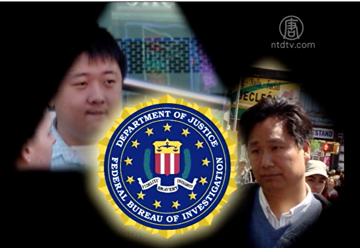

拿中领馆的钱，做的是违背美国的有关法律和自由民主精神的事，去伤害其他团体，难怪FBI会盯上他们 。（新唐人电视台）

主持人宇欣：“说到这儿，就联想到之前我们新唐人电视台举办的舞蹈大赛，纽约的学生会NYU就发表了这么一篇文章，说反对舞蹈大赛，这是一件事情；另外法拉盛事情也是同样的，这些华人突然间，他们跟法轮功平时可以说是无仇无恨。您有这样的前车之鉴、这样的经验，可以跟我们讲一讲。”

李建中：“我看到纽约这儿的学生会，我注意到两个学校，一个是纽约大学，还有哥伦比亚大学，他们的学生会很明显，完全跟着中领馆跑，完全被中领馆控制了。做一些个完全偏离了作为一个学生会的职权范围，做了很多事情都违反了学校的校规。”

像我们洛杉矶以前一般做这样的事情都是中领馆底下给学生会主席打一下电话：你们去支持一下！学生会主席会在底下找一些学生，学生很穷，领馆会安排另外一个出钱来租大巴士的人，他们一起过来搞这种活动，来抗议一下，给的钱不多，我们以前是一个人20块，领馆还会安排大家吃顿饭，来表表功，就是这样的情况。其实受益的可能是学生会主席，他在社区当中就更加有影响力，但是学生的利益就很少，其实就是20块钱。”

我当时到了法拉盛，我很惊讶出现了这些事情，所以我也跟一些当事人谈了谈，我就说你们到底为什么要反对法轮功？因为洛杉矶的侨界，大家都认同法轮功是被冤枉的。”

在纽约法拉盛这个地方，会有人反对法轮功，我觉得很奇怪，所以就问了一下他们几个所谓的当事人吧！”

他们后来跟我讲其实也不是反对法轮功，但是他们也不能够排除中领馆在背后起到的作用，还有一个，他们也都承认说，并没有看到天灭中国这个牌子，他们说他们从来没有看到过天灭中国的牌子。”

主持人宇欣：“为什么这个中文媒体，像在这个纽约的几家像侨报、民报等等，都要这样去登载说什么法轮功打着是天灭中国这样的旗号，举这样的牌子呢？”

法轮功打出的标语：天灭中共 。（新唐人电视台）

李建中：所以我就觉得这是一个非常不负责任的报导，而且我觉得这种报导对新华社在全中国进行了转载之后，造成了非常恶劣的影响。我觉得谁做的那么一个非常恶劣的报导，应该主动出来作一个澄清，我见到的这几个都是属于反对法轮功的组织者，因为当时在场的人，他们都说我们没有看到天灭中国的牌子。”

主持人宇欣：“就是说在场的人他们也都讲实话。”

李建中：“现在的媒体有那么几部分，一部分像侨报也好，像星岛日报也好，这些个等于是完全被中共收买的，还有一部分是他自己老板在中国有很多投资的，所以他要听中共的。”

一名负责监控中共间谍的美国FBI官员透露：美国很关注目前亲共侨团，各大学留学生会的这些特别举动，而且如果你们有迫害人权的纪录，在美国不管你是申请永久居民，还是入籍成为美国公民，对在西方社会找工作和生活的前途非常不利。

＊＊＊

主持人宇欣：“观众朋友大家好，今天我们的节目继续请到的还是前加州理工学院华人联谊会的主席，当时还担当了很多华人社区的重要角色。在职期间，他跟我们讲他完全是在中国领事馆控制之下，他做了一些使他很后悔的事情。今天继续由李建中先生给我们讲述他的故事。建中先生您好！”

主持人宇欣：“那么在这个华人社团当中，所谓现在像在纽约也有很多这样的华人社团，他们这个团体当中都是怎么样的。”

李建中：“勾心斗角，跟中国大陆很相像，就比如说，像我们洛杉矶来讲，以前我们是一个叫天津同乡会，为了争夺这个会长的位置，大家就是打得不可开交，投井下石，都在那干，就是只要有一个人哪点没做好，那其他几个人恨不得就在后面踹他几脚，给他踹下去，所以人前一面，人后一面，在侨界当中是非常非常复杂。”

主持人宇欣：“在共产党教育体系下的这样的一些人。”

李建中：“没有道德，不是按照自己的良心去做事情，所以我就觉得这次纽约中领馆做的这件事情，其实是在美国大众面前把我们中国人的形像给毁了，让人真的就觉得你们这些人竟然在美国一个自由的国土，对一个受迫害的一个团体来施行这种暴劣的行动，我真的不可理解。”

所以我就觉得这里边谁在背后支持，我想应该是跟江泽民、周永康这帮人，就是江泽民留下的几个棋子搞的。”

主持人宇欣：“像纽约法拉盛这件事情，两个议员，我想你也在报纸上看到了这件消息，你怎么看待这件事情。”

李建中：“在美国作为一个议员来讲，首先他做出任何一个决定之前，他应该是跟双方去了解一下，绝对不会说在没有跟另一方去说话之前，先站到一方去讲话的，除非他有某种利益的趋势。”

现在法拉盛来自中国大陆的人越来越多，而且中国大陆也给很多的这种想要在政治上，权力上有所发展的人，用某种方式来提供资助，就像当年熊德隆提供资助给克林顿一样，还有给高尔都提供这些个资助，当然已经都被FBI通缉的这些人，现在的做法就越来越隐蔽了，但是很多议员可能是为了个人的目的，会做出一些个不符合常理的事情，我觉得这是很蠢的。”

因为他没有看到更长远的，我觉得一个人你按照道义去走，按照真理去走的话，哪怕你说你钱不多，哪怕你今天会受到某种邪恶势力的打击，但是你知道每个人的人心，不管他是好人还是坏人，他都有一个良知，所以我觉得这些议员好好的想一想，不要总谈利益，要谈的是真正的一个道德。”

前国安部谍报官李凤智曝光中共渗透西方政客手段时就表示，中共花钜资在美国等西方国家经营特务网络，对于部分华裔政客尤其盯得紧，而对于那些本身就不正，并且还主动的明显的向中共谄媚，献殷勤的“臭鸡蛋”，中共更是不会放过，稍一露出苗头，中共就会盯上，甚至在华裔政客身边长期安插了国安特务，对方都不知道，对于具体华裔议员中共实施收买计划的开始时间，长期打算，大致思路都差不多，结论也不难判断。

前国安部谍报官爆中共渗透西方政客手段。 （新唐人电视台）

主持人宇欣：“您觉得这个刘议员，这样下去的话，前景会怎么样？”

李建中：这样来讲吧！他们只能是中共利用的棋子，他们还没有看到这一点，中共从来不可能真正相信他们的。中共绝对不可能，完完全全的相信一个由海外民选出来的官员。他只是他们今天所利用的一个棋子，通过他们来扩大中共的影响，来选出它们自己真正所信任的。”

主持人宇欣：“从您的谈话中，你是觉得中共现在还不是真正在信任他。”

李建中：“没有，他只是它们的一个棋子。他从台湾来的，不是大陆来的。当时我在洛杉矶中领馆的时候，他们绝对不敢完全相信侨界的。像刘醇逸是在美国长大的，他们这样做是抱着某种利益。所以今天，他们虽然是在利益上跟中共会有一定的合作，但是早晚他会被中共给踢出去的。所以我觉得，如果他自己为了眼前的利益，而失去他的道义的话，今后他的路是越走越窄。”

前国安部谍报官李凤智，曝中共渗透西方政客手段时又说，从中共直接、间接帮助谁竞选，从某人身边的人的来源等等，都可以很容易的看出究竟来。在如此信息发达的社会，很多事情是藏不住的，相信私底下的勾当、具体内幕会被不断揭发出来。被中共利用的华裔政客，非常可悲。这些人都是不幸被中共选中的棋子，不仅没有未来，甚至连眼前的政治前途都会丧失。

西方国家的普世价值、立国之本、为政之道、选民之心，这些才是政治前途的根本依靠。如果跟着越来越不得人心，正被全球唾弃的中共，那就是走邪路、逆潮流，路真的会越走越窄。妄想以依靠中共来加政治分，某种程度上是走上了政治的不归路，最后只有死路一条。

主持人宇欣：“您以过来人的身份，要不要对海外的学生会的这些领袖，还有侨界的一些侨领，和一些还在海外为中共效力的这些官员，讲一些话呢？

李建中：“这些年我走了很多的路，就是自己从96年担任学生会的主席，后来到洛杉矶侨界担任侨领这些，十多年的路，我看到了多少人起起伏伏，我也看到了中领馆来了一部分人，走了一部分人，其实他们都是相互的在利用。”

我觉得人生，不是只是来为获取利益而活着的，人生来这应有更大的目的，和更大的使命。我希望每一个人多想一想，多为整个社会，多为大家去考虑一下。我觉得如果我们在海外，都不能够去为我们今天的自由，和那么一个和平的环境，而去努力保护他的话，我们做的很多事情，可能会对不起我们的子孙。”

我希望我们每一个人，当他的生命走到他最后的一刻的时候，他会说：我学会了我应该做什么事情，我改正了我的错误，我重新做了一个人。”

主持人宇欣：“谢谢建中。”

李建中：“谢谢。”

在美国，不管你是申请永久居民，还是入籍成为美国公民，美国的移民法首先要实行背景调查。背景调查由FBI进行，就是调查你有没有犯罪，有没有危害国家安全，有没有替别国政府当代理人，或者损害其他百姓的利益等等。如果你做的是违背美国自由民主精神，和有关法律去伤害其他团体的事，以后对你都是非常的不利。

主持人宇欣：“在这里对海外的学子，还有海外的华人说几句。海外的留学生，您们的父母把你们送到海外，辛辛苦苦的培养你们，希望您们有出人头地的一天。千万不要为了眼前的利益，而毁了自己的前程，这样会伤了父母的心。”

还有海外的华人，也不要为了这个眼前的利益，而断送了自己的前程，出国很不容易，也不要盲目的去随从。

<a target="_blank" href=#top><h6 align="right">回上方</h6></a>  
  
  
<a name=87>
<h1 align="center"><b>传十多个百亿富豪曾被扣北京 只想保命</b></h1>

北京普华商学院创始人崔山鹰在演讲。（视频截图）

   
  【大纪元2020年05月09日讯】（大纪元记者梁义报导）北京普华商学院创始人崔山鹰两年前的一段视频近日在网上曝光。他在视频的演讲中透露：当时北京十几个拥有上百亿资产的富翁，被北京市公安局和安全局下令禁止出京。

这段视频画面显示：崔山鹰在普华商学院做题为“新技术，科技助推超级商机的诞生”的演讲。

崔山鹰在演讲中说，一个领导在饭桌上告诉他，北京最早做数字货币的一大批人，每个人最少都有上百亿的资产，在北京都有十几个这样的人。

崔山鹰说，这些大佬的交易所一天的交易量就有一两百亿，每个人每一天的收入就有两千万到五千万。但现在所有人想的问题只有一个，“所有的钱都可以全给国家，（目的只有）两个字——保命。”

崔山鹰还透露，这些大佬现在没有人出得去北京，更不要谈出国，全部被北京市公安局、安全局同时下令“禁止出境”，随时等待中央派指定机构进行调查和审核。“所有的钱都动不了，只要国内的钱全部被冻结。”

崔山鹰还说，尽管这些人在网上还发朋友圈，发博客，他们真实的想法只有一个就是“保命”，没有人说这些钱有什么用。

大纪元搜索发现，普华商学院的演讲发生在2018年5月，但视频中崔山鹰没有透露这些富翁的详细信息。

公开资料显示，“普华商学院”是“普华众鑫文化传播有限公司”的教育产品，并非真正意义上的“学院”，并不是事业单位，目的是培养商业人才。崔山鹰是这个学院的创始人。

2018年中国大陆金融市场发生动荡。在此之前的2017年9月，因担忧虚拟货币成为大陆资金外流的渠道，中共央行先是叫停比特币ICO（首次代币发行），紧接着宣布关闭以比特币为首的多个加密货币交易平台。

这也导致比特币价格暴跌20%。比特币在2017年底一度飙涨到20,000美元，但2018年两度腰斩到逼近3,000美元，堪称金融史上的“另类奇迹”。

此外，2018年中国金融市场也频频爆雷。从P2P爆雷，到公司债、私募基金爆雷，中国金融变成“炸药桶”。

<a target="_blank" href=#top><h6 align="right">回上方</h6></a>
  

<a name=86>
<h1 align="center"><b>美国务院指中共外交官用假账号发假消息</b></h1>

美国国务院5月8日表示，中共在加速推卸其造成全球大流行病的责任，通过假的社交媒体账号宣传病毒来源的阴谋论、转嫁责任给他国。图为美国国务院。（Samira Bouaou／大纪元）

【大纪元2020年05月09日讯】（大纪元记者林燕综合报导）美国国务院周五（5月8日）表示，中共在加速推卸其造成全球大流行病的责任，通过假的社交媒体账号宣传病毒来源的阴谋论、转嫁责任给他国。

美国国务院全球参与中心的分析师发现了共产党活动的新证据，其驻外大使和外交部官员在海外开设的社交媒体账户每天都会新增数百名粉丝，但许多都疑似自动机器人生成的新账户。

全球参与中心的协调员莉亚·加布里埃尔（Lea Gabrielle）周五告诉媒体，有证据表明“一个人工网络在尾随并放大中国（中共）外交官和外交部官员发出的信息”。

她说，这些活动是中共希望“让世界将中国（中共）视为应对疫情的全球领导者而不是大流行病根源”的一部分。

她表示，这些活动是中共日益复杂和广泛努力的一部分，中共正在效仿2016年美国总统大选期间被曝光的俄罗斯干预战术。

加布里埃尔拒绝透露俄罗斯和中共之间的协调程度，但她说，两者的叙述出现合并、并“相互呼应”。

加布里埃尔3月初在国会作证说，俄罗斯正在传播与病毒有关的消息，以从中牟利。3月晚些时候，加布里埃尔告诉媒体，中共正在散布不实说法，说病毒起源于美国以及中共在应对疫情上“至高无上”。

美国智库新美国安全中心在5月7日发布的一份报告中警告说，俄罗斯和中共试图散布削弱自由民主国家和联盟的虚假信息时，它们之间呈现“松散的战术分工”。

美国国务院发言人摩根·奥塔格斯（Morgan Ortagus）日前接受英文大纪元采访时说，是中国共产党自己首先指病毒来自武汉，他们指病毒源头在武汉，这是事实；而现在中共政府试图把中共病毒说成是中共与美国的对抗，这不是事实。

她表示，国务卿蓬佩奥是第一个早在2月份就敲响警钟、说中共一定会推卸疫情责任的官员。“他当时就说，中共政府不公开和不透明，比如对我们需要的（疫情）相关数据、需要确认究竟发生了什么问题（都得不到应有的回应）。”

中共外交部发言人近期不断在推特上针对美国发布疫情假信息、撕裂美国社会和故意吹捧中共的“伟光正”领导。

奥塔格斯也多次在推特上直接回应这些不实推文。她4月底接受“美国之音”采访时说：“过去我们遇到假信息时，我们通常会说这还没到需要国务卿或我（发言人）去回应的程度，不值得去回应；不过我们看到的一些共产党官员发的假信息令人震惊，我们认为有必要反击。这就是为什么你看到我们更加积极主动（回应）。”

<a target="_blank" href=#top><h6 align="right">回上方</h6></a>  
  
 
<a name=85>
<h1 align="center"><b>纽约73名儿童患“多系统炎症综合症” 1男童殁</b></h1>

纽约州库默表示，全州已有73名孩童出现多系统炎症综合症。 (州府办公室提供)

   
   【大纪元2020年05月09日讯】（大纪元记者黄小堂纽约报导）纽约州长库默（Andrew Cuomo）8日表示，州内有73例儿童罹患“多系统炎症综合症”（Multi-system inflammatory syndrome）的病例，医院掌握证据皆与COVID-19（中共病毒）有关；其中更有一名5岁男童7日在纽约市医院不治身亡。
   
  

2020年5月7日纽约州疫情图。（记者黄小堂制图）

 
   

纽约州府公布家中孩子如果有以上症状，请马上联络医生安排问诊。（州府办公室提供）

   
库默说，目前尚不清楚该儿童是否曾接受炎症综合症的治疗，并表示州府正在调查其它几起儿童的死亡病例，“我们没有想到孩子们会因此而受害。这是我们现在必须认真考虑的事情”。

州卫生厅表示，这些孩子的病症与川崎病（Kawasaki Disease）或中毒性休克综合症（Toxic Shock-like Syndrome）类似。这些病症可能在感染病毒后，数天到数周内发生。

库默提醒家长，若孩子出现持续五天以上的发烧、皮疹、难以进食、腹部痛、呕吐、皮肤颜色出现变化、难以呼吸或急促、心跳加速和胸痛、小便频率下降、昏睡等症状，应马上联系医生。

据医生表示，医学人员仍在研究病症与COVID-19（中共病毒）的关联性，提醒家长应特别注意孩子的卫生习惯。

由于小孩子容易不自觉摸嘴巴和鼻子、揉眼睛，如果手沾有病毒就可能感染，医生提醒父母要注意孩子的清洁，经常洗手（超过20秒）。外出也应给孩子戴口罩和保持社交距离。

纽约州已要求各医疗单位，如果有病人出现相关症状要立即通报，目前已经有数十例有潜在病例；根据该州的公布的最新数据，在超过21,000人的死亡人数中，有3名10岁以下的儿童染疫身亡。

州卫生厅厅长扎克（Howard Zucker）日前表示，“大多数患有COVID-19的儿童只经历了轻微的症状，但在一些儿童中，可能会出现危险的炎症综合症。”◇

<a target="_blank" href=#top><h6 align="right">回上方</h6></a> 
  
 
<a name=84>
<h1 align="center"><b>印第安纳州警长代表全美警长起诉中共</b></h1>

印第安纳州丹吉帕阿教区警长丹尼尔·爱德华兹（Daniel Edwards）5月8日代表全美国警长起诉中共。（大纪元制图）

【大纪元2020年05月09日讯】（大纪元记者关山综合报导）因中共病毒（冠状病毒）造成的经济损失，印第安纳州丹吉帕阿教区警长丹尼尔·爱德华兹（Daniel Edwards）5月8日代表全美国警长起诉中共。

福克斯报导说，爱德华兹是路易斯安纳州州长约翰·爱德华兹（John Edwards）的弟弟。他在诉状中称，中共病毒是从中国武汉一家实验室泄露的。

该诉讼也将中共和几家政府机构列为被告，包括中国疾控中心。

美国政府正在调查，中共病毒是否是从武汉病毒实验室泄露。源自武汉的这场瘟疫导致全世界多个国家史无前例的封城，导致全球经济瘫痪。

美国国务卿蓬佩奥说，美国要求中共允许国际专家进入武汉实验室进行检查，以确保类似于的危险病原体没有意外泄露。但是中共拒绝。

爱德华兹“代表美国所有警长”提交诉状，称单单他的警长办公室就蒙受70万美元损失，更有“其它未知损失”。

比如，警方不得不增加成本，以将囚犯分开关押；警方不得不加强卫生措施；警员不得不加班；还有政府税收下降。这些都是丹吉帕阿教区警长办公室遭遇的损失。

诉状指出，中国疾控中心下属的一家实验室位于武汉，距离海鲜市场仅仅2.6英里。实验室如果有中共病毒意外泄露，病毒再传播到野生动物密集的市场，可能演化成对人致病的病毒。

诉状列举了中共政府在这场瘟疫当中的错误行为。比如在2020年1月3日，国家卫生委命令各研究所不可发布任何有关中共肺炎（武汉肺炎）的信息，下令各实验室将任何中共肺炎病人样本转移到指定研究所，或者摧毁它们。

在2020年1月5日，复旦大学张永珍教授就告诉国家卫生委，中共病毒（冠状病毒）可以通过呼吸道传播。1月11日，张教授团队在公共数据库Virological.org和GenBank首发该病毒基因序列。

然而在1月11日，武汉市卫生委说，没有证据显示人传人。

在2020年1月14日，国家卫生委主任马晓伟跟各省卫生官员举行电话会议，却警告说，中共病毒可能演变成重大公共卫生事件；人传人有可能；传染风险高。

然而在1月15日，中国疾控中心主任李群在中共国家电视台上仍说，人传人的风险低。

<a target="_blank" href=#top><h6 align="right">回上方</h6></a> 
  
  
<a name=83>
<h1 align="center"><b>中共内斗加剧 习近平政法系三大亲信浮出</b></h1>

中共病毒（武汉肺炎）肆虐全球之际，中共当局因隐瞒疫情遭受国内的谴责，同时反习派也乘机反击。近日，习近平再次开始清洗江派政法系人马。(Getty Images)

   
   【大纪元2020年05月07日讯】（大纪元记者张顿报导）中共政法系统掌管着中共的公、检、法、司等核心职能部门。随着中共高层权斗加剧，当局清洗江派人马的同时，习近平在政法系统安插的三大亲信也浮出水面。
   
<b>当局持续清洗江派政法系人马</b>

受隐瞒疫情影响，中共当局正处于内忧外患的被动局面——不仅受到国际社会的普遍谴责，而且还受到国内反对派的攻击与搅局，甚至传出有人要暗杀习近平的事件。

4月19日，中共公安部党委委员、副部长孙力军被调查。孙力军是中共十八大以来，公安部第5名被查的副部级高官，前4人分别是副部长李东生、杨焕宁、孟宏伟，公安部政治部主任夏崇源。

孙力军是江派前政法委书记孟建柱的秘书，李东生、杨焕宁、孟宏伟被指是中共前政法委书记周永康的人马。

4月29日，中共司法部部长易人，傅政华不再担任司法部长，其职位由唐一军接替。

傅政华被指是周永康的人马，但中共十八大后，他曾倒戈，投向了习近平。而唐一军是习近平浙江旧部，属于其“之江新军”的人马。

至此，习近平在持续清洗江派政法系人马的同时，他的三名旧部在政法系统内分别担任了要职。

过去，中共政法委先后被江派人马罗干、周永康、孟建柱、郭声琨把持。但中共十八大后，习近平利用反腐“打虎”运动，拿下了周永康，并对政法系统进行大面积的清洗。

北京时局观察员华颇近日对大纪元记者表示，现在体制内部经过习近平历次清洗之后，体制内的反对派已经偃旗息鼓，表面上不可能再公开跳出来跟习近平对决，但是因为人还在心未死，玩暗地里的动作、玩一些高级黑。

<b>习近平的浙江旧部唐一军</b>

现年59岁的唐一军，是习近平的浙江旧部。唐一军在浙江工作逾40年，2002年6月任浙江省纪委常委、秘书长；同年10月，习近平调任浙江省代省长，11月担任浙江省委书记。

在习近平任内，唐一军2005年6月升任宁波市委副书记、纪委书记。但习近平被调离后，唐一军2011年2月担任宁波市政协主席。直到习近平上台后，被闲置5年之久的唐一军才开始被重用。

唐一军2016年5月任宁波代市长，同年8月升任浙江省委常委、宁波市委书记。2017年5月，唐一军任中共浙江省委副书记，同年10月“当选”中共中央委员会候补委员。

唐一军2017年10月转任辽宁省委副书记、代省长，2018年1月升任省长。

<b>公安部常务副部长王小洪</b>

4月24日，北京市公安局副局长亓延军，被任命为北京市副市长、市公安局局长；王小洪不再兼任北京市公安局长。

亓延军是被王小洪提拔起来的人马。他们曾在河南省公安系统共事，随后亓延军被调任公安部消防局防火监督处处长，王小洪于2015年3月调任北京市公安局局长。

王小洪任北京市公安局局长期间，亓延军2016年5月被调任北京市公安消防总队总队长，2019年1月任市公安局党委副书记、副局长，2019年4月任常务副局长。

而王小洪2016年5月升任中共公安部副部长、党委委员，但仍兼任北京市公安局局长。2018年1月，王小洪不再兼任北京市副市长。

2018年3月，王小洪升任公安部党委副书记、常务副部长（正部长级），成为公安部“二把手”，权力仅次于公安部部长赵克志。

王小洪是习近平的福建旧部。习近平任福州市委书记时，王小洪任福州市公安局副局长，负责习近平的安保工作。据报，当时王小洪就住在习近平的楼下，习近平出差期间经常让女儿习明泽寄住在王小洪家中。

习近平在中共十八大上台后，王小洪2013年8月调任河南省公安厅厅长，2014年12月升任河南省副省长，并兼任省公安厅厅长、党委书记。

外界认为，王小洪是习近平在政法系统内最倚重的人马之一，他可能在不久的将来会接替赵克志的职位。

<b>政法委秘书长陈一新</b>

中共中央政法委秘书长陈一新，是习近平又一个倚重的政法人员。

4月8日，中共中央政法委秘书长、中共全国扫黑办主任陈一新，主持召开了全国扫黑办第9次主任会议，这是2020年首场全国扫黑办主任会议。

上述消息显示，担任“中央指导组副组长” 的陈一新已从武汉返回到北京。

中共病毒（武汉肺炎）去年12月1日爆发后，中共因隐瞒疫情、抓捕传播疫情真相的医生及民众，并宣称疫情“可防可控”、没有“人传人”等虚假信息，致使疫情在武汉、全国、全球大爆发。

2月8日，陈一新以中共中央指导组副组长的身份抵达武汉。

现年60岁的陈一新，也是习近平的浙江旧部。习近平任浙江省委书记期间，陈一新任省委办公厅副主任，并在习的任内于2003年7月被提拔为省委副秘书长，2006年6月兼任省委政策研究室主任。

习近平上台后，陈一新被迅速提拔。他2013年6月被提拔为温州市委书记，2015年12月被调入京城、任中央全面深化改革领导小组办公室专职副主任，成为该小组组长习近平的副手，2017年1月调任湖北省委副书记、武汉市委书记。

2018年3月，陈一新调任中共中央政法委秘书长。外界认为，陈一新出任该职后，成为习近平监控江派政法委书记郭声琨的“监军”。

<a target="_blank" href=#top><h6 align="right">回上方</h6></a>
  
 
<a name=82>
<h1 align="center"><b>瘟疫促供应链移出中国 印度拟吸引千家美企</b></h1>

在美中贸易战和中共肺炎大流行的新形势下，无论中国大陆有多大吸引力，全球电子制造商都在积极寻求供应链的多样化，并减少对某个国家的依赖。(STR/AFP)

   
   【大纪元2020年05月09日讯】（大纪元记者吴畏编译报导）中共病毒（俗称武汉病毒、新冠病毒）危机促使世界各地公司将重组其供应链，以减少对中国的依赖。印度正试图吸引那些希望迁离中国大陆的美国企业，包括医疗器械巨头雅培公司，搬到印度去。

在全球瘟疫危机中，制药业、农业和能源等许多领域都承受着压力，原因是它们对中国经济体的依赖以及对国际物流的依赖。

著名投资者麦朴思（Mark Mobius）、Mobius Capital Partners创始人的麦朴思4月21日在CNBC的“欧洲路标”节目上说，大瘟疫已经促使各企业考虑供应链的重组，以避免供应链将来遭受类似大规模的冲击。

彭博社5月7日报导。据不愿透露姓名的印度官员称，印度政府在4月份与1,000多家寻求迁出中国大陆的美国制造厂商进行接触，并通过海外代表团为厂家提供激励措施。官员们还说，在洽谈的550多家厂商中，印度政府将优先考虑医疗设备供应商、食品加工部门、纺织品、皮革产品和汽车零配件制造商。

日本已拨款22亿美元帮助日本厂商从中国转移出来，在东盟国家打造另一套供应链；而欧盟成员国计划减少对中国大陆供应链的依赖。

芝加哥大学副教授保罗·斯坦尼兰德（Paul Staniland）说：“印度有机会在全球供应链中占据一席之地，但这将需要在基础设施和国家治理方面进行大量投资。”“印度面临来自南亚和东南亚国家和地区的激烈竞争。”

印度官员们告诉这些想迁移的公司，印度政府将考虑（境外公司提出的）某些具体要求而修改劳工法，这些具体要求已成为境外公司迁入的绊脚石。印度政府正在考虑电子商务公司的要求，推迟印度今年刚刚引入的网上交易税收法。

<b>美拟推动建立信赖合作伙伴的“经济繁荣圈”</b>

一名印度官员说，印度贸易部已寻求美国公司的详细反馈，解决如何让印度的税法和劳工法更有利于公司。这位官员补充说，莫迪联邦政府正在与各州合作，以提出长期的解决方案，其中包括建立土地储备机制以确保各个公司能够快速启动落脚工程。

一位官员说，印度有望赢得美国医疗保健品和设备生产公司，并正在与美敦力公司（Medtronic Plc ）和雅培制药公司（Abbott）进行协商，讨论如何将其设备迁至印度。美敦力公司的发言人本·佩托克（Ben Petok）和雅培制药公司的发言人达西·罗斯（Darcy Ross）并未立即回复彭博社寻求评论的电子邮件。

一位官员说，美敦力公司和雅培公司都在印度设有分公司，这可能使他们更容易将中国的供应链转移到印度。他们通过孟买金融中心，正在与印度大型医院集团合作。

美中贸易战之后，许多公司选择像越南，而不是印度，作为转移目地，莫迪政府正在试图通过削减税务来支持美国公司的投资并赢得公司的信任。

莫迪与川普两人在休斯敦和印度举行的两次大规模公众集会上见面，同时签署了一份向美国购买30亿美元武器的国防协议。

美国国务卿迈克尔·蓬佩奥（Michael Pompeo）上个月表示，美国正在与印度、澳大利亚、日本、新西兰、韩国和越南合作，探讨如何“重组这些供应链，以防止类似情况再次发生”。路透社本周报导说，美国政府正在努力推动一项加速从中国大陆撤走全球供应链的倡议，一位官员说，他正在推动建立一个值得信赖合作伙伴的“经济繁荣圈”。

<b>寻求在印度和越南打造全球供应链基地</b>

“我所看到的是，如果不是开玩笑，人们正在寻求将印度和越南取代中国成为全球的供应链基地。”总部位于华盛顿的兰德（ RAND ）公司的研究员德里克·格罗斯曼说，他曾在美国情报界任职十多年。

“就取代中国庞大的制造能力而言，这个代替是一个粗略的计算。但也许美国对印度和越南寄予厚望，希望这两个国家能够迅速提高到至少与中国大陆相等的产能。”格罗斯曼说。

在川普的要求下，印度在4月份部分解除了对羟氯喹和扑热息痛的出口禁令。印度政府还批准了价值1300亿卢比（17亿美元）的投资，以生产更多的散装药品和医疗设备，同时提高制造药物的半原材料和活性药物成分的生产，以减少对中国大陆产品的依赖。

印度出口商联合会首席执行官阿贾伊·沙海（Ajay Sahai）表示：“印度比越南或柬埔寨的市场更大，因此，对于希望将生产转移出中国大陆的投资者来说，印度应该是更具有吸引力。”“但是除了帮助移入公司解决土地、水和污水的问题，印度政府需要做出的最重要保证就是政府不会出台追溯性税法修正案。”

包括马哈拉施特拉邦在内的一些州已经表示，在控制中共病毒传播的封锁时期，确保外国制造商的供应链厂家继续运转。南部的泰米尔纳德邦和北部的北方邦等其它城市也计划为迁入的境外公司提供更优惠条件。

“美国有丰富的剩余资本，而且正在寻找境外的投资机会，我们可以看到印度在向它们在招手。”位于华盛顿的美国—印度战略与伙伴关系论坛主席穆克什·阿吉（Mukesh Aghi）说。“许多公司意识到，尽管在中国大陆建立庞大的供应链可能很经济，但没有理由将所有鸡蛋都放在一个篮子里。”

<a target="_blank" href=#top><h6 align="right">回上方</h6></a> 
  
  
<a name=81>
<h1 align="center"><b>澳洲人权活动家：感恩法轮大法创始人</b></h1>

2015年10月3日，墨尔本部分法轮功学员在市中心城市广场举办诉江集会。图为布什（Andrew Bush）在集会现场发言。（陈明／大纪元）

   
   【大纪元2020年05月08日讯】（大纪元记者李奕澳洲墨尔本采访报导）“感谢李洪志先生所做的一切，法轮大法将功法动作和精神内涵、生命的本质结合在一起，鼓励人们关注、思索生命的理念。”

在第21届“5‧13世界法轮大法日”来临之际，澳大利亚人权活动家、前资深治安法官（JP）、澳洲听障协会主席、自由党资深党员安德鲁·布什（Andrew Bush）对法轮功创始人李洪志先生表示感激，感谢他令千百万法轮功修炼者品德高尚，并使自己有幸与善良的民众一起伸张正义。

“对我而言，面对中国境内发生的严重的侵犯人权行径，感谢有这个机会使我能够参与并呼吁反迫害。”布什希望中共立刻停止对法轮功修炼者的迫害。

<b>七旬长者四处奔走 声援法轮功反迫害</b>

   

2019年9月18日，来自全澳的数百名法轮功学员在首都国会前举行新闻发布会。图为布什（Andrew Bush）在现场发言。（安平雅／大纪元）

   
   布什曾在新州担任了50年的治安法官（Justice of the Peace），在维州担任了8年的治安法官和保释官（Bail Justices）。他致力于为弱势群体争取人权保障，也曾为教会、社会服务和福利机构提供大量无私帮助。

在过去的六年里，这位身形高大、刚正不阿的人权活动家经常四处奔走，参加澳洲各地的法轮功反迫害活动，声援法轮功。在澳洲首都堪培拉国会山庄前的系列请愿活动中、在各地7·20反迫害集会上、在揭露中共活体摘除法轮功学员器官的真相纪录片放映会上，都可以见到他的身影。

2014年，布什在悉尼的奥林匹克公园（Olympic Park）初识法轮功。当时他了解到，十几年来，法轮功在中国大陆受到了残酷打压，中共剥夺修炼人信仰自由的手段令他感到震惊，“我认为这是严重的侵犯人权。”

作为一名资深自由党党员，布什曾写信给每一位联邦议员，并联络澳洲驻美、驻联合国大使，呼吁澳洲政府制止中共迫害信仰人士。

“法轮大法学员所遭遇的（迫害），特别是在中国，是错误的。”他说，“正如我们所看见的，（中共进行）迫害、拘捕或是折磨，实实在在发生的还有活摘器官、杀害良心犯，这是一系列邪恶的、错误的侵犯人权的行径。”

布什认为，一个政府存在的意义应该是满足人民的需要、服务于人民，而不是去控制人民。“但中共只是对强权感兴趣，”“他想要控制人们可以做什么、应该成为什么样的人等等。”

他表示，中共不想担负自己的责任，只想一味滥用权力，它“强制人民什么可以做、什么不可以做，特别是将重点放在了人们不能做的事情上。”“它试图说服所有人、甚至包括它自己：它做的是对的，而实际上它是错的，”布什认为，“它错在没有受到人民意愿的约束。”

“强权的另一个弊端在于它分化人民。若想建立强权，它就必须接受一部分人，同时拒绝一部分人，排外而不是包容。”

布什说：“只要不对他人造成伤害，人们应该拥有自由，按照自己选择的方式去生活。”

虽已年过七旬，布什表示，他愿意继续声援法轮功反迫害。“我很高兴、也愿意做更多的事情。”

<b>法轮功学员仁义谦逊 努力实践“真、善、忍”</b>

   

2019年7月20日，墨尔本部分法轮功学员在市中心州立图书馆前举行7‧20反迫害集会。图为布什（Andrew Bush）在集会现场发言。（陈明／大纪元）

   
   “我遇到的法轮功学员，能够证明的是，他们是非常非常好的人，”布什说，“他们关心别人，有人需要帮助时他们会尽心竭力，推己及人、同等地对待自己和身边的人。”

“令我惊讶的是，他们以帮助别人为骄傲，却不是为了获得任何人的称赞，只是安静地做正确的事情。”“安静地做正确的事，在我们的社会中十分罕见。”

法轮功学员所展现的“善”让布什领会到了更高尚的内涵，即用宽容的心善待所有人，哪怕是对自己施加迫害的人。“他们承受着暴力，却没有使用暴力对抗中共的所作所为。”

“你能从真实生活中、真实行为中看到（法轮功）‘真、善、忍’的道德准则，他们（学员们）虔诚、善良，努力实践着这些品质。”

在二十载风雨中，为了传递真相，法轮功学员义务举办集体炼功、反迫害游行、集会、征签、劝“三退”、分发真相资料等活动，以平和、理性的风貌向世界呼唤正义。

学员们“仁义”、“谦逊”的美德打动着布什。“这是美好品质的另一种体现，对谁都报以善意。”“这是一个严肃的话题，值得我们所有人学习。”

布什认为，无声的力量往往“恒久不变”，因此才更加强大。“这个过程让人们变得更加坚强、获得自我提升。”

布什尤其喜爱《大纪元时报》等独立媒体，“如果有可能的话，我愿意让每一位议员每周都读大纪元报纸，倘若我能够支付得起所有人的订阅费（笑），我就会这样做，因为它告诉你真实的（信息）。”

<b>生命需要信仰 法轮功意义深远</b>

   

2015年2月13日晚，布什（Andrew Bush）在悉尼帝苑剧院观看了神韵演出。（骆亚／大纪元）

   
   布什相信，精神信仰是生命不可或缺的部分，意义深远的道德准则和精神内涵能够帮助人们更加了解自己、及时归正自身，“这将会使人得到提升。”

布什认识到，法轮功蕴含的哲理意义深远。“哲理意味着生命的意义和生活的方式，启发人们做正确的事情，依照正确的方式生活。”

在现实生活中，人们常常着眼于物质而忽视了精神，“（法轮功）功法将物质和精神合二为一。人在打坐或是站桩的时候接近静止，可以领悟生命、净化思想。”

精神信仰是中国传统文化的一部分，迄今，上亿的修炼者在推动着恢复传统文化，布什感谢法轮功学员以丰富的形式将华夏古国的辉煌文明展现给西方社会。

布什表示，“虽然我不赞同中共用暴力手段对人民进行绝对掌控，但我热爱中国人民、中国文化。”

作为神韵艺术团的忠实粉丝，布什还说：“神韵敞开了一扇窗，让人看到了五千年前人们所秉承的丰富而玄妙的中国传统文化。”

“演员身上散发着传统精神，我想正因如此，他们才能以饱满的热情，达到如此专业的水平，”他说，“希望每一个澳大利亚人都能至少观看一次神韵演出。”

<a target="_blank" href=#top><h6 align="right">回上方</h6></a>
  
 
<a name=80>
<h1 align="center"><b>【新闻看点】全球反共潮汹涌 北京做最坏打算？</b></h1>

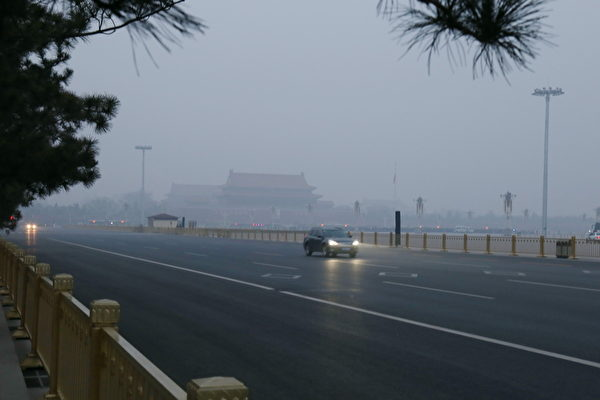

全球追责声汹涌 北京做最坏打算？图为北京天安门广场。（大纪元资料室）

【大纪元2020年05月08日讯】大家好，欢迎关注新闻看点，我是李沐阳。

今天是5月7日星期四，截止到早上6点，大纪元统计的数据显示，全球187个国家感染中共病毒（武汉肺炎、冠状肺炎、COVID-19）的总人数达到了382万2989人，死亡26万5083人，死亡率6.93%。而美国确诊感染的人数已经高达126万3183人，死亡高达7万4807人。

川普昨天表示，这是美国“有史以来受到的最严重的袭击，比珍珠港更糟，也超过世贸中心（的恐袭）”。国务卿蓬佩奥也强调了为什么要做到疫情透明，他批评中共隐匿疫情造成了数十万人死亡。

与此同时，美国议员们频频推出各种制裁中共的法案，英国和欧盟也在针对中共采取各种措施。全球反共已呈汹涌之势，中共外交气氛出现空前紧张状况。而面对全球追责的声浪，北京似乎已经作出了最坏的打算。

<b>中共拒绝WHO赴华调查病毒源头</b>

世卫组织在今天（7日）表示，正在与北京协商，派代表团到中国，就各方质疑的病毒源头进行调查。

话音刚落，中共常驻联合国日内瓦代表陈旭就表示，在抗疫取得最终胜利前，中方不会邀请国际专家调查病毒源头。他说针对中共“充满政治动机的指控、污蔑及毁谤，已经令气氛恶化”。

很明显，中共是指西方国家要求对病毒源头的调查。目前外界的普遍看法是，病毒不是人工合成，但不排除是武汉某个病毒实验室发生泄漏。有的认为与P4实验室有关，有的怀疑可能是距离华南海鲜市场很近的P3实验室发生了泄漏。

<b>武毒所偷删资料曝光</b>

有这种怀疑，是因为美国大使史威哲（Rick Switzer）在2年前曾经访问过P4实验室。法广表示，史威哲当时发现了安全问题，并向美国政府发出了警报。有法国专家也对这座实验室的安全管理存有疑义。

此外，P3实验室曾发生过蝙蝠病毒感染事件。华南理工大学教授肖波涛曾在SCRIBD网站发表英文报告，指出这个实验室的研究人员曾被蝙蝠的血液和尿液溅到，受影响的人员曾自我隔离14天。不过这篇论文后来被撤掉了。

最近英国媒体挖出了一些被武汉病毒所删掉的资料及照片，包括研究人员在处理样本时，几乎是“零安全防护”。《每日邮报》（Daily Mail）5月3日报导，从上个月开始，武毒所就在官网开始系统性地偷偷删除资料，其中包括部分研究人员以前的工作照，也包括史威哲到访研究所的相关内容。

其中照片显示，工作人员进山抓蝙蝠时，全身没有任何防护，有的只戴着普通手套，有的连普通手套都没有。

还有一张照片显示，研究人员在一个普通房间内对抓到的蝙蝠取样，而只有其中的一部分人戴着手套和口罩。照片中的人物，包括引起极大争议的“蝙蝠女郎”、P4实验室负责人石正丽和免疫课题组长周鹏。

莫非这些人已经被练成了“蛊”，这些毒素对他们不起作用吗？也许他们自身有抗体，没有得病。但是他们都可能是病毒携带者，如果把病毒带到社会上，会不会感染普通民众呢？

<b>有中共病毒感染史在美国“禁止入伍”</b>

最近在推特上流传一份美军入伍事务司令部的备忘录，上面显示，有中共病毒感染史的人，“永久丧失（入伍）资格”。目前这个事得到了五角大楼的证实。

美国《军事时报》（Military Times）援引国防部发言人麦克斯威尔（Jessica Maxwell）的说法，所有感染了中共病毒的人，都将被标记为“不合格”，将终身被禁止入伍。

麦克斯威尔没有解释其中的原因是什么。《新闻周刊》（Newsweek）分析认为，可能是因为目前对中共病毒的研究还有很多的不确定性。

是有这样的可能，目前科学家还没有完全掌握病毒的情况。但因为没有掌握完全的情况，就终身禁止入伍，是否过于严厉了？是不是美国已经掌握这种病毒的一些特殊情况呢？这相当令人怀疑。

<b>北京何不“没病走两步”呢？</b>

时事评论员袁斌质疑，武毒所为什么要系统性地偷偷删除资料呢？是不是这些资料涉及到中共想要掩盖的秘密？特别是与中共病毒起源有关的秘密？如果不是心中有鬼，为什么在当下这么敏感的时候有这种反常行为呢？

其实包括美国国务卿蓬佩奥在内，多数人并不认为病毒是被“故意”释放的。但因为安全管理引发的泄漏是不能排除的。

既然中共深信不存在任何泄漏，那就让国际专家去调查好了，这不是北京彻底洗白自己的机会吗？

如果中共没有病，站起来“走两步”试试看。越不让调查，不是越增加人们的怀疑吗？既对北京自己不利，也是对科学研究不利。

<b>世界反共浪潮高涨</b>

面对外界指责越来越多，北京不是趁机把一切澄清，反而派出中共外交部发言人和外交官四处出击。歪曲事实，散布虚假信息，频频发起战狼外交。当然中共也招来了越来越多欧美国家的反感和不信任。

过去几个星期，从法国、哈萨克到非洲联盟，至少有7名中共大使被驻在国召见。与此同时，欧美反共的动作越来越频，反共声浪空前高涨，连与中共走得比较近的意大利，也开始向中共索赔了。

意大利议会昨天（6日）举行听证会，北方联盟党要求政府澄清与北京过度亲近的立场。同时意大利疫情重灾区已经提出，向中共索赔200亿欧元。

前天（5日），美国新闻网“政治”（Politico）刊登了英国下议院国防委员会主席埃伍德（Tobias Ellwood）的采访。他表示英国政府的对华政策正在发生“思维转变”。中共应对疫情的措施，使英国在贸易等问题上正在反省，是否对中国过度依赖。

与此同时，欧盟推出了一份决议草案，支持尽快评估国际社会对中共病毒大流行的应对情况。

国际社会针对中共的举措越来越多，反共声浪一波接着一波。而声音最强烈的就是美国。

<b>川普：对美国最严重的袭击</b>

既然是把中共看作了敌人，那么很可能不只限于贸易上的制裁。

昨天（6日），川普抨击中共隐瞒疫情真相造成全球危机。他说这次疫情是美国遭受的最严重的袭击，严重程度超过日本偷袭珍珠港和恐怖分子发动的911事件。

前面的节目中我们说过，日本偷袭珍珠港后，美国给长崎、广岛扔下了两颗原子弹；本·拉登发动911恐袭后，被美军击毙，摧毁了基地组织。

如今川普明言这是美国遭受的最严重的袭击。就是说，美国是把这次疫情等同于一场战争来看待的。那么美国人将来会怎么做呢？

在昨天的国务院新闻发布会上，近期一直遭受中共谩骂的国务卿蓬佩奥再度剑指中共。他批评中共的打压和隐瞒，导致了全球几十万人被夺走生命。

蓬佩奥说，“与一个共产党政权没有真正的双赢”。“本可以避免全世界数十万人死亡，本可以避免世界陷入全球经济萎靡”，“但是中国（中共）掩盖了武汉的疫情爆发”。

蓬佩奥指出，“重要的是，这可能再次发生，这就是风险。这就是为什么需要透明，共享疫情信息。”

<b>美国“制裁法案”频出</b>

白宫发言人凯莉·麦克纳尼（Kayleigh McEnany）指出，目前美中关系“令人失望与懊恼”。在昨天（6日）的白宫记者会上，她引用川普的话表示，北京采取的“一些决定让美国人的生命置于险境”。

南卡州参议员格雷厄姆直言，中共是这次全球大流行的“最大赞助国（the largest state sponsor）”。在今天推出新的制裁措施前，他对福克斯新闻表示，百分之百确信，“如果中共没有欺骗的话，病毒不会传到美国来”。

他同时表示，百分百确信中共“绝不会跟我们合作，除非我们（美国）逼他们这么做”。他说推出新的制裁措施，“制裁中国（中共）到底”，“现在是时候要顶回中国了”。

截止到中午发稿，我们还没看到格雷厄姆的新制裁内容。但在他之前，已经有多名议员推出了各种追责制裁法案。

其中包括德州参议员克鲁兹（Sen. Ted Cruz, R-TX）推出的《终结中国（中共）审查和掩盖医学信息法》，阿肯色州参议员科顿（Sen. Tom Cotton, R-AR）与德州众议员克伦肖（Rep. Dan Crenshaw, R-TX）联合推出的允许美国人起诉中共的法案，密苏里州参议员霍利（Sen. Josh Hawley, R-MO）推出的剥夺中共主权豁免权的《为新冠病毒（中共病毒）受害者追求正义法》，以及田纳西州参议员布莱克伯恩（Sen. Marsha Blackburn, R-TN）和众议员班克斯（Rep. Jim Banks, R-IN）共同推出的《中国2019新冠病毒（中共病毒）决议》等等。

克鲁兹议员认为，这场大流行病的最严重后果就是“从根本上重新评估美中关系”。

<b>美议员：中共是敌人 停止购买它的东西</b>

有英国媒体引述消息报导，美国正在考虑采取实际、甚至更有攻击性的经济制裁，以“惩罚”中共，其中包括抑制供应链和投资流动。

前财政部官员、战略与国际研究中心高级研究员西格尔（Stephanie Segal）表示，美中关系紧张在疫情之前就存在，但“疫情起到了加速器的作用”。

事实上，川普已经向北京发出了警告，如果不能兑现购买美国商品计划，有可能放弃第一阶段贸易协议，重新对中国进口商品征收更高的关税。

而参议员斯科特（Rick Scott）昨天对福克斯新闻表示，美国人最大的反击方法就是“拒绝与这个共产党政权进行贸易”。

斯科特指出，共产党“是反美的，它们想要统治世界。它们不是竞争对手，现在是敌人”。他说“我们能做的最大的事情就是停止购买它们的东西”。

<b>美计划增加亚太战斧导弹部署</b>

在美国的最新军备战略中，有一项新的计划：缩短导弹攻击中国的距离。路透社报导指出，包括在亚太地区部署陆基发射的远程战斧巡航导弹，以此遏制中共军队在区域内的优势。

报导表示，中共在过去几十年不断扩大军力，美国大多时候是“袖手旁观”。但川普政府正在改变这种态度。

在去年退出《中导条约》后，美军加快了500到5500公里之间的陆基弹道导弹和巡航导弹的发展，并在12月试射了射程达1600公里的战斧巡航导弹。值得一提的是，这次试射是陆地发射，改变了以往由海军舰艇发射的模式。

美国国防部的财政预算显示，美国陆战队已经要求明年增加1亿2500万美元，购买48枚陆基战斧巡航导弹。

美军陆战队司令伯格（David Berger）上将上月在参议院作证时表示，装备战斧导弹，可以帮助海军夺取制海权，尤其是西太平洋地区的制海权。

路透社的文章表示，在中国面对的岛链部署陆基导弹，能够对在南中国海和东中国等海域的中国军舰构成威胁。新型导弹的数量尽管不能改变亚太地区的导弹力量平衡，但是可以发出更为强烈的政治信号。

华盛顿战略与预算评估中心研究员巴贝奇（Ross Babbage）说，“美国人强势回归”，“到2024或2025年，中共军队会面临严重的威胁，他们的军事发展将会过时”。

就是说，美国针对中共，加强了军事部署，更有针对性，更有制约力。可以想像一下，如果中共不兑现贸易协议中的承诺，美国可能会再次抡起关税大棒。如果中共还不服打，下一步是什么呢？

<b>北京做了最坏打算？</b>

面对世界反共汹涌的浪潮，中共也加紧了国内的舆论导向，鼓动民间的反美情绪。甚至中共国安智库向北京当局提醒，要做好与美国开战的最坏打算。

4日，有知情人向路透社独家披露，中国现代国际关系研究院上个月向习近平提交了报告，警告疫情肆虐全球，使中共面临着1989年天安门事件以来最高的反共情绪，呼吁北京做好最坏准备，美中可能会爆发冲突。

民主人士王军涛认为，中共国安部现在放出所谓的内部报告，透露了中共党内的三个态度。他对自由亚洲表示，第一是为习近平考虑，替习提前做出一个美中关系的判断。告诉习以美国为中心的自由世界，要向习政权发难。

第二是中共党内给习敲警钟，警告他“个人独断不要走太远”。万一引发内部斗争和与美国的冲突，习肯定抵抗不住。

第三是通过这个报告泄密，加强渲染美中冲突，引发倒习效应。

时事评论员蓝述认为，根据中共的暴力倾向和自不量力，特别是它命令各个战狼四处出击挑衅，北京可能是做了最坏打算。因为中共不可能兑现贸易协议，更不可能赔偿世界各国的索赔，它也赔不起。所以中共与世界、特别是与美国的摩擦，可能越来越频繁。

蓝述表示，如果美中出现军事上的摩擦，很可能会出现擦枪走火的情况。一旦双方都不能控制，难免引发更大的冲突。一旦发生了战争，那就是中共的死期到了。

***
<b>虎门大桥“忽悠”内幕</b>

这两天很多人在关注广东虎门大桥的情况。前天（5日）下午2点，这座连接广州南沙区和东莞虎门镇的跨海大桥突然发生异常晃动。从视频中看上去，桥面像是波浪一样，上下起伏。

出现这种情况，中共专家查看后表示，大桥晃动的主要原因，是桥梁跨边护栏设置了很多“水马”（就是充水护栏），改变了钢箱梁的气动外形。所以在特定封环境条件下，产生了桥梁“涡振”，但不影响桥梁结构安全。

“专家”出面了，这解释看似挺合理的，很多人也就相信了。地方政府马上派人，把水马都撤走了。哎，这个晃动在当晚6点左右，还真的停了下来。

但是2个小时之后，大桥又出现了晃动，忽忽悠悠的。虽然比白天幅度小一点，但是这种现象一直持续到昨天（6日）。

“专家”又说了，“水马”清理后，大桥振幅已经小了不少。现在的晃动“可能是惯性”，要时间“慢慢消除”。

对“专家”的“惯性”之说，民众当然不敢完全放心。好好的一座桥，怎么突然间上下忽悠呢？另一位专家的解释，听起来似乎更合理，让人容易接受一些。

资深土木工程师黎广德向《苹果日报》表示，设计桥梁时，都会计算抖动幅度。但一般是不太被人感知的，如果能够感觉到抖动，“这已经很不正常了”。

他分析认为。桥面出现不寻常抖动，有两种可能性。包括地震或风力节奏和桥面吻合，从而产生共振频率，导致桥面出现摇摆。

但也有网上爆料，桥面忽悠不定不关风和水马的事，很可能是桥磐出了问题。网友说“是海底原地面板块流失，基础架空了，整个基础、墩身、梁，都属于悬空状态”。网友还表示，“要不是拉锁和桥面铺装的钢筋混凝土链接，都飞出去了”。“这桥别想过了”，“等着吧”。

1997年建成通车的虎门大桥，刚刚23年，质量问题已经非常明显了。有不少网友说这是“豆腐渣工程”。就是说工程质量非常差，像豆腐渣一样禁不住风吹草动。

其实质量差的问题，在很多方面都有体现。比如近期频频被曝光的口罩问题，连这种与人生命安全息息相关的产品，都不能让人放心。

<b>人命相关产品 口罩频爆不合格</b>

近期国外频频发现中国生产的口罩有各种问题，纷纷取消了订单。网友爆料，安徽省安庆市的一家口罩厂倒闭了，滞销的口罩堆了满满一个院子。

视频中可以看到，院子里有很多纸箱，地面上还有白花花的散落一地的口罩，还有很多身穿白大褂的人在做着什么。

不知道这家口罩厂倒闭的真实原因是什么，网友没有说清楚。但是这很容易让人联想到口罩质量问题。如果是因为口罩质量问题而滞销，造成企业倒闭，这就是自食其果了。

<b>疫情下 都活得不容易</b>

前两天知乎上有一个帖子，2020年找工作为什么这么难？其中有一个回答是这样的：“做不了毕业生了，上知乎刷到这个问题想哭。”

帖子中写道，因为家里经济原因，突然上不起大学了。今年疫情期间，家中的出口企业因为没有订单破产，家里的三套房子四台车全都卖了。但是还没有还清债务，还欠了很多钱，现在每天被债主催着还债。住在出租屋里，惶惶不可终日，快要疯了。

发帖人说，现在自己已经辍学了，在家里等死，根本找不到工作，太痛苦了。别说生活费和学费，手机费现在都不舍得充值。估计用不了多久，就缴不起网费了，连手机也要卖掉。

最后帖子中写道：“绝望，痛苦，凭什么，是我们家⋯⋯”

其实这次疫情，给每一个人都造成了大大小小的影响。只不过有的人感受强烈一些，有的人不太明显。

恰好看到这样一个网友的帖子，挺发人深省：医生不容易，护士不容易，记者不容易，作家不容易，警察不容易，城管不容易，小贩不容易，穷人不容易，富人不容易，领导不容易，老百姓也不容易⋯⋯大家都不容易，那到底为什么都不容易呢？

以上就是今天公共区的节目内容。在今天的会员区，我们会从印度神童的最新预言说起，聊聊躲避瘟疫的奇招。

感谢您的收看，再会。

大纪元《新闻看点》制作组

<a target="_blank" href=#top><h6 align="right">回上方</h6></a> 
  
 
<a name=79>
<h1 align="center"><b>【最新疫情5·9】俄国再日增万例感染数近20万</b></h1>

俄罗斯再度日增万例，总感染逼近20万人。图为一名俄国医护人员，穿戴防护装备，从一名男子的唾液中采取样本。(VASILY MAXIMOV/AFP via Getty Images)

   
   【大纪元2020年05月09日讯】（大纪元记者陈霆、张婷、林燕综合报导）5月9日全球中共病毒（武汉肺炎）疫情最新情况：
   
   根据约翰‧霍普金斯大学（Johns Hopkins University）的数据，截至美东时间5月8日晚上9点，全球确诊感染中共病毒（武汉肺炎）的人数超过390万，死亡人数超过27.4万（注：因中共和伊朗隐瞒疫情数据，真实数据比统计的要高）。美国确诊病例超过128万，死亡超过7.7万。

全球追责中共的风潮下，美国警长加入集体诉讼的行列。丹尼尔·爱德华兹是路易斯安那州警长，同时也是路易斯安那州州长的兄弟，他将以中共病毒造成「经济损失」为由，代表全美警长向中共提告。

美国各州也在逐步迈向开放，除了允许沙龙与餐馆在有条件下营业，北达科他州也解除了国内旅行的隔离禁令，在跨州旅游后，将可不必隔离14天。

美国副总统彭斯的新闻秘书证实染疫，白宫紧急对接触者进行追踪。结果，所有接触者目前病毒检测皆为阴性。

=======================

以下是最新疫情实时更新：

<b>菲律宾增8死总死亡数破700</b>

菲律宾卫生部今报告，该国新增147例，累计感染人数达到10,610例。

同时，增加了8起死亡病例，使总死亡数上升至704例。

菲律宾首都和主要城市的检疫措施，将一直持续到5月中旬。

<b>俄罗斯再度日增万例感染人数近20万</b>

俄罗斯当局周六表示，新通报了10,817例新确诊病例，使全国的总感染人数达到198,676例。同时，有104人死亡，使全国死亡人数达到1827。

本周，俄国的确诊病例已超过了法国和德国，感染人口成为世界第五。

<b>韩国病例增所有夜店勒令关闭</b>

一名居住在京畿道龙仁市的韩国人确诊后，韩国政府发现该患者逗留过的夜店，不断传出确诊病例，决定向全国娱乐设施下达暂停营业的行政命令，为期一个月。

中央灾难安全对策本部战略企划组长孙映莱解释，室内体育馆、补习班等其它设施，在转入生活防疫阶段后，仍能遵守防疫规定，但夜店等密闭场所很难做到，下达行政命令后可处罚不遵守规定的行为。

迄今查明该确诊病例已致14人感染，其中夜店感染12人。由于夜店人员密集、空间密闭，加上大部分顾客都没戴口罩，防疫部门认为后续还有人员将确诊感染。

<b>疫情延烧到明年东京奥运将取消</b>

国际奥委会协调会主席约翰·科茨（John Coates）说，如果中共病毒大流行持续到明年，东京奥运会将被取消。

科茨说：「不存在再次推迟奥运会，或类似的B计划。」

出生于悉尼的科茨（Coates）负责国际奥委会东京奥运会的筹划工作，他在周六的AOC年度股东大会上表示，他希望东京将取代悉尼，成为有史以来最好的一届奥运会。

因为疫情爆发，国际奥委会和日本政府已将2020东京奥运，推迟到2021年的7月。

「国际奥委会已经在日本设立了一个特别工作组，这是一项艰巨的任务，现在我们正在努力建立43个场馆。」科茨说。

科茨相信，东京奥运若能举办，将是有史以来最盛大的奥运会之一。

此前，东京奥运筹委会主席森喜朗（Yoshiro Mori）也说，东京奥运将不会再度延期。

「过去，奥运会因战争之类的问题而取消。我们现在正在与一个看不见的敌人作战。」森喜朗说。
他说：「如果我们能在赢得这场战斗之后继续前进，奥运会将比过去任何奥运会，都具有更大的价值。」

国际奥委会协调会主席约翰·科茨说，如果病毒流行持续到明年，东京奥运会将取消。图为东京台场区海上看到的奥运五环。(Behrouz MEHRI / AFP / Getty Images)

   
   <b>埃及总统以控制疫情为由扩大权力</b>
   
埃及总统塞西（Abdel-Fattah el-Sissi）周六批准了对一系列紧急法修正案，赋予他和安全机构更多的权力，政府表示，这对控制疫情是必要的。但是，国际人权组织谴责了这些修正案。认为修正案实际上是在掩护新的镇压权力，可能假公共秩序之名行钳制人权之实。

新的修正案允许总统暂停学校和大学的课程，并隔离那些从国外返回的人，并禁止公开和私人会议、抗议、庆祝活动和其他形式的集会。还可限制某些产品的贸易，可将学校、青年中心和其他公共设施转成野战医院等。

<b>走出疫情阴霾台湾职棒开放球迷入场</b>

周五，台湾职业棒球联盟首次开放球迷进场，让「中华职棒」不仅成为全球最早开打的职棒赛事，也率先开放观众入场。

昨晚一千名球迷被允许参加新北市的新庄棒球场的比赛。台湾疫情指挥中心指挥官陈时中，还穿着「0」号球衣，期待台湾能持续零确诊。

为了维护观众安全，球场做出特殊规定，球迷必须量测体温、戴上口罩，根据社会疏散准则，坐在指定的座位上。比赛期间贩卖部完全不营业，观众也不能携带食物，除了饮水之外禁止一切饮食。

中华职棒8日起开放球迷现场观战，富邦悍将队晚间在新庄棒球场与统一狮队交手，球迷在场边卖力应援，球员也终于盼到球迷进场为他们加油打气。（中央社）

<b>美国FDA局长将自行隔离14天</b>

美国FDA 局长斯蒂芬·哈恩（Stephen Hahn）在与确诊者接触后，接下来14天将进行自我检疫。

FDA表示，哈恩立即接受了病毒测试，确认为阴性。但按照CDC 指南，接下来的两周将处于自我检疫。

尽管FDA未透露与哈恩接触者的姓名，但媒体揣测，可能是跟美国副总统彭斯的新闻秘书凯蒂·米勒（Katie Miller）有接触。

由于哈恩也隶属于白宫的病毒特别工作组，目前尚不清楚，小组中的其他人是否也将被隔离。

<b>泰国新增四例周日起放宽限制</b>

泰国今日报告了四例新确诊病例，使通报的感染总数达到3004例，并确认了一名新的死亡案例，让泰国的死亡人数增为56人。

泰国周日开始，将放宽锁定措施，将允许理发店、宠物美容店和户外市场在内的一些企业重新营业。禁酒令也将解除，尽管晚上10点后，仍实行宵禁。

<b>美国收紧中国记者签证规定</b>

美国周五发布了一项新规定，将收紧对中国记者的签证，并表示这是对瘟疫大流行时，美国记者在中国待遇的回应。

美国国土安全部在周五发布新规定时，引述了中共「制止独立新闻」的行为。

该规定将于下周一生效，将限制中国记者签证期限为90天，但可以选择延长。此前，这类签证通常是不限成员名额的，也不需要延期，除非申请者跳槽到其它公司或媒体。

美国国土安全部一名高级官员要求匿名讨论此事，他对路透社说，新规定将使美国商务部可以更频繁审查中国记者签证申请，并有可能减少在美国的中国记者总数。

这位官员说：「这将创造更大（范围）的国家安全保护。」

<b>德国新增1251例103人亡</b>

据罗伯特·科赫传染病研究所的数据，德国今日又通报了1,251例，使德国的累计病例达到168,551例。这个欧洲最大的经济体，还报告了另外103人死亡，使死亡总数达到7,369人。

<b>FDA批准使用在家采集唾液样本进行病毒测试</b>

美国食品和药物管理局（FDA）周五公布，已批准了可使用在家采集的唾液样本，进行COVID-19测试。

FDA表示，已向罗格斯大学（Rutgers University）的临床基因组学实验室颁发了紧急授权（EUA）。

「授权其他诊断测试，以及在家中收集样本的选择，将增加患者获得病毒测试的机会」，FDA局长斯蒂芬·哈恩（Stephen M. Hahn）博士说，「这是在公共卫生紧急情况下，诊断测试的重要进步。」

在此之前，Covid-19的测试通常涉及鼻子或喉咙拭子样本。

透过家庭收集的唾液样本，可以检测那些被隔离、没有运输工具或不敢出门的人。

<b>洛杉矶失业率已达24％</b>

洛杉矶市长埃里克·加塞蒂（Eric Garcetti）周五表示，根据该市的估计，洛杉矶的失业率已从2月的4.7％上升至4月的24％以上。

加塞蒂在谈到病毒对经济的影响时说：「这些不仅仅是数字，而是生活和生计。」

洛杉矶报告了30296起确诊病例，其中有1468人死亡。

市长表示，洛杉矶每天能够测试20,000人，达到了重新开放后，专家所建议的每日测试量。

洛杉矶市统计，该市的失业率已高达24％。

<b>著名魔术师罗伊·霍恩染疫身亡</b>

知名魔术师罗伊·霍恩（Roy Horn）曾是著名魔术拍档「Siegfried & Roy」的成员，在拉斯维加斯以与狮子和老虎的合作而闻名。霍恩在四月下旬检测出染疫，本周五死于中共病毒，时年75岁。

<b>加州一监狱逾800人确诊</b>

周五，联邦监狱局（BOP）的数据显示，加州圣塔芭芭拉县的隆波克联邦综合监狱（Lompoc Federal Correctional Complex）中，共有823名囚犯和25名工作人员确诊中共病毒。

加州隆波克的综合监狱由两个设施组成：一是隆波克教化所（FCI Lompoc），这是一个低安全性的惩教所，可容纳1,162名犯人。隆波克监狱（USP Lompoc）是一个中等安全的美国监狱，可容纳1,542名犯人。

根据最新的BOP数据，确诊病例大多出现在FCI Lompoc设施中。1,162名囚犯中的792名（约占该设施总囚犯人数的68％）已经确诊。

联邦监狱局表示，有两名囚犯死于中共病毒所引起的并发症。

目前当局已暂停所有探访活动，直至另行通知。为了避免病毒流通，即日起至5月18日，犯人将暂停使用电话和电子邮件站，以确保囚犯和工作人员的安全。

<b>传美国第一千金助理染疫已数周未与伊万卡接触</b>

一位知情人士告诉CNN，美国总统千金伊万卡·川普（Ivanka Trump）私人助理的病毒检测呈阳性。

这位助手已好几周没有与伊万卡接触。消息人士指出，伊万卡已从事近两个月的远程工作，并且经过了测试。

知情人士表示，伊万卡和她的丈夫贾里德·库什纳（Jared Kushner）都没有症状，在周五的检测均呈阴性。

美国总统川普的大女儿伊万卡。(Clemens Bilan – Pool /Getty Images)

<b>美外交委员会致信近60国支持台湾入世卫</b>

美国外交委员会的领导人们，已致信近60国，要求他们支持台湾加入世界卫生组织（WHO），以最大的努力来对抗病毒流行。

由于中共的外交压力，台湾被排除在世界卫生组织之外。

这份信函，由美国参议院外交委员会主席里施（Jim Risch）、众议院外交委员会民主党主席恩格尔（Eliot Engel）以及共和党首席议员麦考尔（Michael McCaul）等人代表签署。被发送到被认为对台湾友善的国家，包括：加拿大、泰国、日本、德国、英国、沙特阿拉伯和澳大利亚等。

美国国会议员在信中说，台湾的资源和专业知识，是全世界对抗大流行的有益资产。

信中写道：「疾病无国界。我们敦促贵国政府与我们一起解决将台湾纳入全球健康与安全组织的紧迫问题。鉴于世界因COVID-19遭受的苦难，联合国会员国共同坚持要求，台湾应受邀参加即将于2020年5月举行的虚拟世界卫生大会，这是正确的起点。」

<b>路易斯安那州警长起诉中共造成经济损失</b>

周五，路易斯安那州坦吉帕霍阿郡（Tangipahoa Parish）警长丹尼尔·爱德华兹（Daniel Edwards），以中共病毒造成的「经济损失」为由，对中共提起了集体诉讼。

警长爱德华兹是路易斯安那州州长约翰·贝尔·爱德华兹（John Bel Edwards）的兄弟，在诉讼中称病毒是从中国武汉的一家实验室释放的。

该诉讼也同时提告包含中国疾病预防控制中心在内的数个政府机构。

爱德华兹「代表美国的所有警长提起了诉讼」，并称仅他的警长办公室，就已承受了大约70万美元的损失以及「其它未知的损失」。

该州警长办公室遭受的损害，包括确保囚犯分开的成本、适当的卫生习惯和官员加班，以及税收减少等。

<b>彭斯新闻秘书接触者为阴性</b>

彭斯新闻秘书证实感染中共病毒后，检测人员在白宫对接触者进行了追踪。

白宫高级官员说，在副总统彭斯（Mike Pence）的新闻秘书凯蒂·米勒（Katie Miller）病毒检测呈阳性后，在白宫内部进行了联系追踪。

米勒接触过的每个人都被测试为阴性，包括她的丈夫、总统高级顾问斯蒂芬·米勒（Stephen Miller）。

这位官员还表示，整个西翼区的清洁工作越来越频繁。这位官员说，「这还不是完美的」，但他们正在努力提高防护措施，使其成为全国企业如何应对该病毒的榜样。

白宫确保员工在住所戴口罩。在整个西翼，病毒测试和体温检查都得到了加强。

<b>美国死亡人数超过77,000人</b>

根据约翰·霍普金斯大学的病例统计，美国至少有1,283,846例中共病毒病例，至少77,178人死亡。

总数包括来自所有50个州、哥伦比亚特区和其它美国领土，以及撤侨案例。

美国首例与中共病毒相关的死亡病例，是92天前的2月6日。

<b>美国卫院试验瑞德西韦的合并疗法</b>

美国国卫院（NIH）的一项新研究，开始观察在合并瑞德西韦（Remdesivir）和抗炎药，可否帮助中共病毒患者更快康复。

瑞德西韦已获得FDA的紧急授权，美国国立卫生研究院（NIH）赞助的一项试验显示，该药将病程缩短了几天。研究人员希望，添加另一种药物帮助患者更快改善病情。

目前，研究人员将希望寄托于「Baricitinib（商品名为Olumiant）」，这是一种用于治疗成年人的类风湿性关节炎的药物，可避免人体的免疫系统反应过度，导致严重的炎症。在严重的Covid-19病例中，炎症会导致一些器官损伤和衰竭。

美国首席防疫专家安东尼·福奇（Fauci）博士说：「我们现在有可靠的数据显示，瑞德西韦缩短COVID-19住院患者康复的时间。」 「（这项研究）将检查在瑞德西韦疗法中，添加抗炎药是否可以为患者带来更多益处，包括改善死亡率。」

该机构表示，预计将在美国和国际上招募一千多人参加双盲研究。

<b>香港研究合并三种药物可助患者快速恢复</b>

香港大学微生物学系教授袁国勇领导的一项最新研究显示，为中共病毒患者使用「鸡尾酒疗法」后，可加速患者恢复，治疗开始后平均7日内，患者的鼻咽拭子样本已再无检测出病毒，抑制病毒的效果较单独用蛋白酶抑制剂患者的平均12日更快。

袁国勇指出鸡尾酒疗法，即是将干扰素、蛋白酶抑制剂及利巴韦林三种抗病毒药物混合使用，可缩短病毒传播期，更快纾缓病人症状，住院时间亦减少了5.5日。

港大微生物系教授袁国勇，将干扰素、蛋白酶抑制剂及利巴韦林三种抗病毒药物混合使用，可缩短病毒传播期，更快纾缓病人症状，住院时间亦减少了5.5日。图为大纪元资料照。（宋碧龙/大纪元）

他们说，该方法需要更多测试，但它可能为Covid-19（中共病毒）患者提供另一种治疗可能性。目前唯一授权的治疗方法是实验药物瑞德西韦，它可以缩短病程。

香港团队测试了利托那韦（ritonavir）和洛帕那韦（lopanivir）的混合蛋白酶抑制剂，该药物组合通常用来治疗爱滋病（HIV），以及普通抗病毒药物利巴韦林（ribavirin）和一种称为β干扰素的多发性硬化症药物。

所有患者均具有轻度至中度症状。

采用鸡尾酒疗法的患者平均7天后，测试病毒测试呈阴性。研究成果已刊登在《柳叶刀》医学杂志上。

<b>众议院监督小组要求五企业归还PPP贷款</b>

美国众议院监督委员会新成立的冠状病毒监督小组，周五向五家不同的公司致信，要求它们归还从大流行期间设立的「薪水保护计划」（Paycheck Protection Program，简称PPP）中获得的贷款，以帮助陷入困境的小型企业。

信中要求每家公司「立即归还」该计划下的贷款，「以便这些资金可用于支持在冠状病毒危机中真正艰难生存的小型企业。」

此举是监督小组成立后，采取的第一个正式行动。

收到信件的公司包括MiMedx集团、EVO运输和能源服务、通用不锈钢及合金产品（Universal Stainless & Alloy Products）、昆腾公司（Quantum Corp.）和海湾岛制造公司（Gulf Island Fabrication）。

信件中写道：「不幸的是，许多大公司能够利用此计划并获得了旨在供小型企业使用的PPP贷款。一些公司在公众表达愤慨之情后归还了这些资金。但是，包括您在内的其它公司，仍然还没有退还这些资金。」

小组要求每个公司在周一前回覆是否会退还资金。如果公司选择不还款，则小组将要求该公司出具与贷款有关的文件和通讯。

<b>美国多州准备开放进入过渡阶段</b>

全美各州都在逐步取消病毒大流行所采取的主要限制措施。

周五，德州的发廊可以开始营业，只要保持六英尺的社交距离。

周六，内华达州将进入重启计划的第一阶段，其居家隔离命令将于5月15日到期。

周一开始，阿肯色州和阿拉巴马州都将允许在一定限制下在餐厅用餐。

康涅狄格州还希望，夏令营可以在6月29日根据社会隔离准则开放，其中包括将团体限制为10个孩子。

华盛顿州允许其39个县中的5个县，进入重新开放计划的第二阶段。

哥伦比亚、加菲尔德、林肯、费里和庞多雷县的企业，将允许提供店内零售服务。餐厅也将被允许为就餐顾客提供服务，但其用餐人数不得超过正常人数的一半。沙龙和宠物美容师也可以经营。

尽管华盛顿州是美国中共病毒爆发中的一个热点，但这五个县的确诊病例较少，也没有死亡记录。华盛顿州长杰伊·英斯利（Jay Inslee）说，他正在考虑其它三个县的要求。

<b>北达科他州解除国内旅行的隔离禁令</b>

北达科他州州长道格·伯古姆（Doug Burgum）周五说，现在，北达科他州人被允许前往其它州，而不必在回家后隔离两周。

该州卫生官员周五修改了先前发布的命令，该命令要求任何返回北达科他州的人都需隔离14天。

根据命令，那些从事基本工作或基本用品和服务旅行的人将继续受到豁免。

<b>加州州长表示总统大选民众可邮寄投票</b>

疫情充满变数，美国多州正在考虑该如何进行年底的总统大选，才能让选民免于感染病毒的风险。

加州州长加文·纽瑟姆（Gavin Newsom）签署了一项行政命令，允许该州所有注册选民今年11月使用邮寄投票。

纽瑟姆说：「我签署了一项行政命令，这将使加州的每个选民都能收到邮寄的选票。」

纽瑟姆在新闻发布会上宣布了这一措施，并表示人们仍可在投票中心亲手投票。他说：「邮寄投票很重要，但不能代替现场投票。」

<b>A-Rod 希望美国职棒大联盟于七月回归</b>

前洋基球星「A-Rod」罗德里格斯（Alex Rodriguez）表示，尽管病毒正在流行，他希望美国职棒大联盟（MLB）在7月回归。

罗德里格斯在接受CNN采访时说：「我知道美国职棒大联盟的官员全天候工作。」「我认为他们会遵循科学的指引。」

这位前洋基队球星，仍对美国职业棒球大联盟将在夏季回归感到乐观，但他表示，官员们不仅需要在赛季开始前考虑这些球员，还有超过65岁的教练、有裁判员，有些孩子患有哮喘。因此，有很多变量和因素尚未被真正讨论。但他仍然充满希望和乐观。

他说，目前还在讨论许多重大问题，希望各种协议达成后，七月份大联盟能够回归。

目前，台湾球迷正依照社交距离，分开观赏台湾职棒，韩国职棒则进行着无观众的棒球比赛。当被问及这位前大联盟球星，是否可以想像没有球迷的比赛时，罗德里格斯说：「不。」

罗德里格斯说：「这场比赛全是关于球迷的。他们是股东。他们实际上是我们比赛的所有者。就我而言，我们现在有幸参加、管理或转播，但球迷是其中的重要组成部分。」
   

<a target="_blank" href=#top><h6 align="right">回上方</h6></a> 
  
 
<a name=78>
<h1 align="center"><b>飞上蓝天</b></h1>
   
文: 北京大法弟子丹

【明慧网二零二零年五月九日】

<b>迷失</b>

我今年三十八岁。我曾经是个问题少年，十二岁学会抽烟、喝酒，只会欺负弱小同学，如混混一般，父母很头疼；在中学时代，就开始谈恋爱；走向社会后，更是五毒俱全，吃、喝、玩、乐，追求物质享受，是我那几年的生活写照。

职高毕业后，我不顾家人反对，去学弹吉他，玩音乐，还留起长头发。年轻的我看上去没有精神，整个人生活在颓废中，难以自拔。虽然通过玩音乐也能谋生，但是生活来源很不稳定，经常需要伸手问父母要钱过活。

一九九六年学音乐的时候，跟同学学会了吸食大麻，一吸就是十年。根本没有专心学习音乐，而是在吸食大麻过程中，找那种虚无缥缈的感觉，寻求精神刺激，依靠大麻找所谓的创作灵感，实际上那种创作完全没有内涵。

吸食大麻对我的身心造成了很大的伤害，我出现了幻觉、妄想和类偏执状态，伴有思维紊乱、自我意识障碍，出现双重人格。我每天都要靠大麻提精神，吸食过程中好像变了一个人，现在知道那不是自己，是主意识被其它乱七八糟的低级生命控制了。后期，到每次要吸之前，脑袋特别疼，头疼变成了后遗症。有一天晚上，吸完大麻躺在床上，我有一种莫名的恐惧，身体特别不舒服，好像有个声音告诉我不能再这样下去了！我快哭了，内心非常痛苦。

我一米八的个儿，体重却没有超过一百二十斤，脸蜡黄，二十几岁的人，看起来像三十岁。家人和朋友都好心地劝说我，都快三十岁了，不能再这样混了。但我不理会家人的感受，还是执意地我行我素，后来家人已经放弃我了，觉的我整个人都废掉了，就这样吧，有口饭吃就行了！

除了吸食大麻，我还经常出入夜店，酗酒，甚至带不三不四的人回家过夜，整个生活用「糜烂」一词来形容都不为过。

<b>重生</b>

幸运的是，在迷失中，我遇到了法轮大法！从此，我获得了新生。

记得二零零六年十月的一天，我在清理抽屉里的物品，无意间发现了一张白色的光盘。那是三个月前，去一个朋友家做客，敲门的时候，在他家门缝里发现的，当时出于好奇，我随手把这张光盘放进了包里。

光盘上印着一朵莲花，我心里一动，就打开来看，里面有个视频《风雨天地行》，还有一本电子书──《转法轮》，当时只觉的好奇就一直看了下去。没想到第一次看，就被里面的内容吸引住了，里面讲的是如何做一个好人，如何为别人着想，不与人争斗，孝敬父母……更让我明白了人活着的意义，即当人是为了返本归真，这道理一下子打到了我的灵魂深处。

不到一周的时间，我就把这本书全部看完了，看完后，我说了一句话：「这就是我要找的！」看了《转法轮》这本书，就再也放不下了。就这样，我走上了修炼的道路。三个月后，我的烟酒全部戒掉了。学法之前，我接触过藏传佛教，还给「活佛」磕头、念经、烧香、捐钱，但还是抽烟喝酒吸大麻，没有任何改变。

得法后三个月，所有那些坏习惯全部戒掉了，以前满嘴脏话，也全都消失了。师父给我清理了身体，身体开始排那些不好的物质，也没有了那些不舒服的感觉。我把长发和胡子全部剪掉，人变的精神了，生活里有了阳光。

是师父把我从万丈深渊中解救出来，从内心深处把这些污浊清洗掉，给了我一个新的生命。

<b>坚持</b>

身边朋友都看到了我的改变。父母刚开始反对我学，让家里其他亲戚来劝我放弃修炼大法。有一天晚上，家人冲进我的屋里，打骂我，想让我放弃修炼。当天晚上，我哭了，为家人不知道真相而哭泣，脑子里浮现出一首歌：

「飞飞飞上蓝天，天天天空湛蓝。」

这歌词好像是在鼓励我。我家里是部队的，受邪党迷惑很深，他们接受不了我炼法轮功，不是打就是骂，我给他们讲真相，他们也不听，一味地排斥。这也是我的魔难，这么大的压力，看我能否走过来。现在这个打和骂的阶段过去了，我坚持下来了。

我知道过去自己的所作所为对家人是非常不负责任的，不应该再这样了。当时，父母为了我玩音乐和常有朋友来找我聚会，就让我住大屋，他们和小姪子住在五平米的小屋。修炼大法之后，我把我住的十五平米的大屋让了出来，还经常帮父母干些力所能及的家务。人也变的温良和善了，做事情多为别人着想，不再那么自私了。

<b>吃苦行善</b>

接下来我要找工作，不能再靠家人了。朋友给我介绍了一个酒吧的工作，工资一千元，我想钱再少也要去。就这样，我每天在酒吧里干杂活，卖门票，帮客人存衣服，收拾桌子上的空酒瓶，搬啤酒……哪个地方需要人，我就去干，也不挑。酒吧里充斥着烟、酒、毒品，虽然我每天在嘈杂的环境中工作，穿梭其中，但是我的心是宁静、祥和的。

每天都是下午三点上班，凌晨四点才下班。由于酒吧离我家有二十多公里，晚上打车很贵，夏天我就骑车上下班，也不觉的累。冬天下班后，就等早班地铁回家。有时候早班地铁还没开门，我就在门口等着。有时候在车上睡过了站，到家已经是早上七八点了。每天虽然很累，但是到家后，打坐一个小时，马上疲劳就消失了。工作虽然很辛苦，但是有大法在，我的心不觉的苦。因为师父告诉我：「吃苦当成乐」[1]。

曾经是我打别人，但是修大法后，完全转变了。在酒吧工作的时候，有一次遇到无理的客人，不给钱，就想进去看演出，我当时拒绝了，他伸手就要打我，把我逼到墙角……最后被同事拦住了。要搁以前，我早就跟人打起来了。但是现在我明白，要做到「打不还手，骂不还口」[2]，并且得为酒吧考虑，不能招惹是非，给老板带来麻烦。

后来换了新的工作，老板很信任我，库管、销售、财务，所有的事情都交给我。在工作中，我按照大法的要求去做，不贪图利益，为客人着想。慢慢的，我的工作越来越好，工资也越来越高，身边的朋友也越来越多。大家都很信任我，跟我接触没有距离感，因为我的思想里没有坏的念头。可这都是源于法轮大法，修炼大法带给我的是一个祥和慈悲的场，我也把这份善的力量传递给别人。

<b>福报</b>

再后来，结婚，买房，买车，生孩子，每一件事都非常顺利，家里人也说我这几年非常顺。而且夫妻和睦，相敬如宾。其实这都是大法带来的福报。谁会想到当年那个颓废的我会有如今这般改变？

前几天，妻子还问我：你记得我们吵过架吗？我怎么想不起来了？是啊！我们几乎都没拌过嘴。因为学了大法之后，在生活中，我都是以真、善、忍为标准，事事都为别人着想，在家里，帮太太做家务，说话前，想想是否会伤害到对方，所以才有了家庭的和睦。

要说的事情太多了，自修炼后，八年来，我没有吃一粒药，没有病，省了很多医药费，身体非常健康！

<b>感恩</b>

感恩慈悲伟大的师尊！给我了新的生命，把我从道德堕落的泥潭中捞了出来，让我知道了做人的道理，从做好人做起，还要做更好的人；是师父的慈悲救度，使我明白了此生为何而活，使我看透了这纷繁复杂的人生，不再彷徨、迷惑……

<a target="_blank" href=#top><h6 align="right">回上方</h6></a> 
  
  
<a name=77>
<h1 align="center"><b>【明慧特稿】二波瘟疫将起，又将定时定地？</b></h1>
   
   【明慧网二零二零年五月八日】第一波新冠疫情即将过去了。2020年5月中旬，土木双星运行的拐点（见图1时刻）将至，世界疫情回落。重症和死亡人数，在中国大陆的早已陡降，海外也在下降，表面上看，增加的基本是轻症和无症状感染者。人类在庆幸劫后余生的时候，各怀异梦，殊不知下一轮大爆发，已经箭在弦上，很可能又将定时、定约、定地、定向地扫荡人间。
   
下面就从这次新冠瘟疫的困惑开始，讲讲下一轮大疫的因由。

图1：2019～2020年天象图，两大福星开始行天罚，拐点回落之后高潮至，疫情再起的时间，都指向2020年9月。

   
   

图2：芬兰科学家模拟新冠病毒随空气传播（气溶胶），一个喷嚏5分钟内把病毒弥漫在整个超市。

   
   <b>1. 过90%的人已被感染，能检测出的大部份是轻症，绝大部份检测不出来，等待下一轮激发。</b>

图2，芬兰科学家模拟新冠病毒随空气传播现实：患者打一个喷嚏，病毒微团1分钟扩散整个通道，5分钟扩散至整个超市通道，6分钟后浓度降低──实质上，更小的病毒团，在空气中漂浮时间更长。超市中的人即使戴N95口罩，也只是95%的防护率，能挡住大粒子团，剩下5%、包括含病毒少的小干核团，同样挡不住。

其实，在高层空间看人间，世界各国所有参与防治瘟疫的医护及其他人员，都被感染了，只是体内病毒水平低、无症状，低到试剂都不足以检测出来──这不是耸人听闻，理论上可解释，等在实践中证实的时候，人类就彻底茫然了。

如何解释人们才可以理解？咨询了有关专家，这样举例说明：人小时候感染水痘会自愈，体内再也检测不到水痘病毒，但是个别人会在成年之后，患「带状疱疹」。以前认为这是两种病，认为得水痘后会终身免疫，后来发现「水痘」和「带状疱疹」是同一种病毒，叫做「水痘-带状疱疹病毒」。人得水痘痊愈后，体内再也检测不到水痘病毒，是因为它含量太低，试剂不足以检测到，它在人体内潜伏休眠、缓慢繁殖，一直不死，等待外界因素的触发，会突然激活，再次使人患病，免疫防线无效。

现在医学界宣布的：治好了一例艾滋病，发明了对丙肝病毒的特效药等，都是这样把病毒压到休眠状态而已，检测不到了，它们还在体内潜伏着，等待外界因素的触发，就会爆发。

既然N95口罩无效，医护人员防护无效，那么，人间的一切防护措施都无用。

<b>2. 台湾日本不禁足时，为何抗疫效果更好？</b>

台湾和日本，不禁足、不强制戴口罩，不学中国大陆「封楼封村封城、口罩禁足禁行」那一套，防疫反而更有效。台湾的人口密度很大，日本东京人口密度更大，坐地铁都要往里推塞──疫情期间依然如此，却完全没有造成中国专家预计的大爆发。

许多事实已表明，疫情的控制和「中共的这些措施」无关，真实原因，在明慧网《台湾不禁足抗疫成绩显著关键点何在？》和《日本疫情令专家费解日本到底做对了什么？》两文中，已经讲出。【编注﹕当然，文中说「1.5米社交距离」作为台湾的防疫经验，也只是设想有效而已，微风拂过，这个距离也没用。现在日本政府也和许多其他国家一样，变相采用了中共的「封城」措施，其实并非实质上的有效举措。该感染的人已经感染了，在隔离中也已经感染了。不该感染的人，即便接触了病人也不会感染。】

医疗手段，不能给人延天寿；人的办法，什么时候也逃不过天劫。就像那句古话：「在劫难逃」。瘟疫的劫数中，该被病毒潜伏的，一定会被潜伏；该成为无症状感染者的，一定会无症状传疫；该得轻症的，一定是一度轻症；该重症的一定轻不了；该感染致死的，一定救不活；不该死的重症一定能救过来或者挺过来──但常人有了病症一定要医治，否则会有个别的意外死亡。

<b>3. 瘟疫是温和的战争，为什么在武汉大爆发？</b>

【疫情与战争，实质等同】

瘟疫和战争，在天象上一致，在人间的表现也一致的，都是在大范围杀人，但是，瘟疫表现的，比刀剑枪炮要温和得多，是一种温和的战争。战争因为场面太暴烈，会造成意外，大量不在劫者，会有偶然死伤的情况。但是瘟疫基本不会出意外，《瘟疫的眼睛》一文可以看出：瘟疫定向杀人，从古到今都是。前面也说过：该在劫的、该重症的、该轻症的、该无症状的、该潜伏的，上天之判，都是公平的。

行星守斗宿，有屠城之像[1]，斗宿的分野在吴越。976年木、火两星双守斗，宋太祖赵匡胤的大将曹翰在江州（今江西省九江）屠城；1937年水星顺逆双守斗，南京屠城（大屠杀）。

2019年9月18日，土星顺行守斗、逆行守斗。天象是预言，提前预警是常态，年末，瘟疫在武汉爆发。

【武汉到底死了多少人？】

图3：中国疾控中心文件，通告中国每年流感导致呼吸道疾病致死一项，超额（比预期多）死亡8.8万人。

   
   对比普通流感，上图文件的数字，是被中共媒体极力掩盖的。上述8.8万人，是中国流感的超额死亡，就是超出预计的死亡数，而不是流感每年的的总死亡人数。相比美国去年流感死亡的1万多人，这样悬殊的对比，对于根本防不住的新冠瘟疫，中国的疫死人数怎么可能比美国低、比世界其它各国都低呢？

别忘了，世卫组织曾称：新冠的死亡率是流感的10倍。

新冠瘟疫在武汉屠城，到底杀了多少人？真象中共官方订正过的只有3869例？只有中共的五毛大军（特约网络评论员）在奉命说谎，全中国人，全世界人，都知道中共在掩盖。基本每个中国人都知道中共造假，只是不知道到底掩盖了多少。

而今，有人从武汉清明节前12天，武汉各殡仪馆每天集中发放500骨灰盒，8个殡仪馆约发出4.8万骨灰盒，这是武汉疫情期间死亡人数。以0.7%的正常死亡率计算，武汉1100万人外逃500万，封城76天正常死亡约为8745人，那么，肺炎死亡近4万人！

其实，计算的8745正常死亡者也感染了新冠病毒，因为防护措施无效，体制差就会加重病情而死。按西方国家的标准，这些人也是染疫致死。只是中共不做检测而已。

一个武汉市尚且如此，当时的疫区可不止武汉一市啊，是整个湖北省。全国各省市都在瞒报，销毁疫情数字，因为疫情数字直接关系到官位，高了直接撤职。

图4：40个移动焚烧炉驰援武汉，实际也是用来焚尸的，有些学者用「满负荷、连轴转的武汉各火葬场的工作量」，来估算疫死人数，却略了上图每个日焚5吨的焚烧炉。中共掩盖的数字，绝不止10倍。

中国制造的试剂灵敏度低、次品率高达50%～70%，这本身就决定了在中国检出的阳性率低。还搞双重标准，2020年2月6日，《第四版》标准就把「无症状感染者」剔除在「确诊人数」之外，在国际「吹哨媒体」和国人的强烈谴责下，才开始关注「无症状感染者」，但是仍不计入「确诊人数」──就这样统计出的缩水数字，还要被中共再次缩水掩盖。

【为什么武汉在劫？】

在《瘟疫的眼睛》一文已经阐明。这场瘟疫，是针对人类古今最大的罪恶──灭佛之最、迫害末劫救世的法轮佛法而来，武汉是推动这场罪恶的急先锋，武汉电视台台长赵致真制作的诬陷栽赃法轮功的「纪录片」成了迫害的原始推手和媒体榜样。为迫害而打造的谎言欺骗了全中国乃至全世界，受谎言毒害者被带动站到了中共迫害的一边，摊上了灭佛的天大罪业从而在劫。所以，识破谎言、明白真相、不再被中共欺骗和利用，成了唯一的自救救赎方式。

所以，把新冠病毒叫做「中共病毒」是十分贴切的：思想上先被中共迫害的谎言污染了，身体上才会被中共病毒感染；最终思想上不能扭转，就将在中共的劫数里随着一同淘汰。

台湾旗帜鲜明地反对中共，台湾和日本都站在反对中共迫害的一边，末世救人的神韵2019年巡回演出在台湾、日本受到热烈欢迎，这是它们防疫成功的根本原因──凡是和中共关系密切的国家，疫情都重，这种奇特现象，已经把瘟疫的根源展现出来──美国是例外？绝不是！

<b>4. 美国被中共严重渗透、养虎为患</b>

【政客们为中共解围，财阀们为中共提供资金】

1989年，大学生在全国搞民主运动，反对中共腐败和独裁，6月4日在天安门遭到中共军队的大屠杀。「六四事件」震惊世界，虽然以美国为首的西方制裁了中共，但是以基辛格为首的美国政客，在世界发表《天安门事件是内政问题》和《美国不能放弃中国》等文章，公然为迫害站台，努力之下很快给中共解了围。

此后美国对中国表面压制实际扶植，不断投资，不停给予关税优惠，以贸易顺差方式，常年给中共提供巨额资金，一边自己挣钱（利用中国廉价的劳动力），一边事实上养肥了中共。

【纵容迫害，违背国本立国之本】
   

图5：白宫前首席战略家班农抨击美国前国务卿基辛格（Henry Kissinger），揭露过去50年来以基辛格为首的政坛菁英和华尔街财团，为了利益而屈从中共。
「你们知道中共迫害法轮功、活摘器官，你们也知道中共迫害维吾尔人、迫害达赖喇嘛和藏传佛教，还有天主教、基督教，你们也知道（六四）天安门事件。」班农说，「 （这些人）手上沾满了鲜血」，因为他们很清楚知道每一个在中共暴政下为自由而战的人遭遇的苦难，但是他们却还屈从中共独裁政权。

美国国父华盛顿建立美国的同时，也奠定了美国的立国之本：为自由而战。在过去的旧运程中，为了保证美国能完成使命，上天安排了以上图班农为代表的很多菁英，在中国、在美国锤炼，但是最后的历史大戏开场的时候，很多人都迷失了。「为自由而战」这个美国立国的根本信念，被政客和商贾严重出卖。造成了现实中，美国几十年来，主要精力放在了和中共做生意赚钱，大量投资中国大陆。

美国是天然的国际警察，担负着阻止中共迫害人权、迫害信仰的使命。当出现中共迫害法轮功的迫害时，美国出面强力制裁，责无旁贷。然而在过去的几十年里，美国实质上实践的不再是美国的立国之本，而是前英国首相的信条：「没有永远的敌人，也没有永远的朋友，只有永远的利益。」

也就是说，美国事实上反而扶植了中共，在经济上被中共绑架了，被迫对中共迫害法轮功视而不见、自我噤声。

养肥了中共就等于养虎为患，所以此次瘟疫感染情况相当严重，从数字上看，仅次于中国大陆。

【川普新政，本可以更有效减轻疫情】

川普当选总统后，开始改变美国的走向，改变美国「经济上推动中共强大」的实质。在神的眼里，这是美国回归使命的举措。从修炼界看，如果没有川普的努力归正，美国疫情会更深重。只是，改变尚且有限，川普也曾经一度被中共迷惑、被中共粉饰太平的谎言所迷惑、把中共国和其他正常国家一样当作贸易伙伴。加重疫情的实质因素在这里，而不在「疏于防范」，因为防不胜防。中共的流氓加魔鬼骗术，举世无双。

同时，在修炼界的眼里，美国因纽约连续发布的禁足和社交距离措施，取消了几十场神韵演出，对纽约的疫情也有相当大的影响。这是川普新政至今为止的一个遗憾，但还有机会弥补。

具体说一下神韵演出。在后来成为疫情重灾区的纽约州和新泽西州，2020年上半年的演出全部取消了。其中，三月十二日下午，神韵艺术团已经在林肯艺术中心准备好当晚的演出，却临时收到通知，不得不取消演出，打道回府。林肯中心三月份的后一半演出也同时取消。新泽西州四月份的八场演出全部取消, 纽约五月份的二十场演出也全部取消。这件事会对疫情的轻重有影响吗？有。修炼界认为有。

事实证明，神韵演出的纯正能量，能强有力地洗涤人的身心，很多观众出来后都说不顺利的事没有了、身心舒畅了，等等，那种深刻的感受难以用语言形容。（更深原因的探讨要讲缘份和悟性，恕本文不展开论述。）可是因为「社交距离」措施，纽约和新泽西的大批人士却失去了观赏神韵、享受神韵洗涤心灵神奇效果的机会。

值得注意的是，到目前为止，并无科学数据能够令人信服地支持「社交距离」和「自我隔离」的有效性。然而，目前除了台湾和瑞典之外，似乎所有的国家都在搞类似中共搞的「防疫措施」，让国际社会在这场疫情中雪上加霜。从这个角度也可以看到，中共对世界的影响力仍在持续，这是疫情发生后的一个不幸。

如果说疫情的发源和传播完全是中共造成的，那么疫情发生后的许多损失，有些部份却是自己迷信科学、迷信无神论，因此未能制订更好的抗议对策所导致的。这是疫情发生后的又一个不幸。

当然，疫情爆发后也发生了一件大幸事，那就是，这个世界终于睁开眼睛，开始看清中共的真实面目、开始与中共绝交了。瑞典「清零」孔子学院，很多城市切断和中共的「姐妹」绑架，全球追责中共声浪日高，美国班农等人公开地、犀利地揭露中共本质，支持法轮功反迫害，这些都能对减少疫情损失起到有力作用。所以说是不幸之中的幸事。

<b>5. 疫情随着瘟神的脚步，何时回头？</b>

中西传统文化都知道，瘟疫随着瘟神走。中世纪的黑死病大疫表现最为典型，疫情随着瘟神的脚步，在欧洲此起彼伏。

明慧网《看见瘟神》一文的作者看到，中国疫情爆发初期，有瘟神在大陆布疫；二月下旬五位瘟神离开时，一位瘟神说：「我还会再来的。」随着他们离开大陆到海外布疫阵，大陆疫情开始回落，海外的疫情开始波浪迭荡，特别是美国。按计划，再有3个月，全球疫阵布完、超过90%的人类身体里埋完病毒之后，瘟神就该回大陆了。

其实来人间的瘟神可不只这五位，还有很多，不同层次的都有，最高是一位主宰瘟神，所以此次新冠病毒的基因变化会很多，但是万变不离其宗，都是那位主宰瘟神管控的。

世界各国疫情的起伏，反映出瘟神们的行迹。注意，这不是神仇恨人类，而是人类中了中共的招，时间太长，犯下的错太大太多，天法无情。

根据星像图，瘟神们还会回来。那么，他们何时会回到中国呢？

[1] 《乙巳占》中有述，如：「火入斗，若守之，所守之国当诛。木（星）同。」「木入南斗，若留守十日，所居之国当诛。」
   

圖7：2020年熒惑守婁奎，涵蓋人間五災：兵疫水叛飢，加重了本年土木二星預警的劫數

   
  我们通过木星、土星天象的轨迹，展示了武汉新冠肺炎第一波疫情的起落，和第二波疫情回归中国的时刻。第二波疫情远远超过了人类的承受能力，8亿多人在劫。因缘何在？如果真的那样发生，我们该怎么办？
  
 <b> 六、福星变罚问根源，朝共灭佛极逆天</b>

五行中，土星和木星是福星，运行到哪里，会给哪个星宿的分野赐福。但是如果人间悖逆天理，做出大恶，福星会变为罚星，改行天罚。

《乙巳占》中讲：「人君暴怒，丧失理性逆天而为，木星会怒，降下战争（包括瘟疫这种文战）天罚。」

   

图8：2019年4月10日木星守尾，朝鲜本有天福，却开始灭佛迫害大法，逆天大罪改变天象与人间的对应，土木二福星变为天罚，开启了新冠瘟疫的两波天劫。

 
<b> 1、徘徊二十年，朝共终逆天</b>

前面讲过，在天象上看，朝鲜不是独立的国家，是中国的一个诸侯国，在中华天象文化上，有明确涵盖朝鲜的分野。《乙巳占》中讲：「尾、箕二宿是古燕地的分野，包括朝鲜，属古幽州。」

看上图：2019年4月10日，木星顺行守尾，在尾宿留守回旋，木星是福星，在给尾宿的分野朝鲜赐福。此前，2016～2018年，土星四次回旋（留守）在尾、箕二宿的星区，一直在给朝鲜赐福。在旧运程中，如果朝鲜顺天而为，放弃核武、改革开放，朝鲜就会得天福：在美国的帮助下，摆脱中共、孤立中共，迅速走向繁荣。那个阶段，朝共和美国政府多次会晤，金正恩也做出了放弃核武的承诺和行动。在一些多维空间（可以理解为平行世界）里，已经安排好了朝鲜欣欣向荣的未来走向。当时，不少中国富人赌「朝鲜会改革开放」，跑到中朝边境城市去炒房地产，丹东等地的房价大起。

可是，朝共却在中共的利诱下，最终选择了继续做中共的马前卒，趁美国无暇顾及之际，再启核武，对外向美国叫板。朝鲜逆天的最毁的一部，就是在2019年4月木星守尾的赐福天象下，开始迫害法轮佛法──开启了人类历史上，仅次于中共灭佛的第二大罪恶。（明慧网曾在二零一九年五月二十日发表文章《RFA：尽管受到打压法轮功在北朝鲜传播》）

<b>2、朝共灭佛，世界冷漠，福祸因果</b>

1999年，中共灭佛迫害法轮佛法，开启了人类亘古绝今的天大罪恶，不久就遭到了世界各国在人权、信仰、反迫害角度的谴责。但是20年后，朝鲜灭佛迫害法轮佛法，罪恶仅次于中共的灭佛，世界对此的反应依然是冷漠和沉默。

抵制邪恶，方显人间的正义。对邪恶麻木、漠然，放纵，是给邪恶开绿灯，是对正义的戕害，也是在跟邪恶站队。2019年4月朝共灭佛逆天，世界如此的反应同样违背正义，同样是逆天。

世界对中共灭佛迫害正信的抵制本来就不够，前文已经讲过了，没有担起自己的历史角色，辜负了上天的安排，那么这一次，对朝鲜的放纵就成了逆天的最后一根稻草──土木两大福星因此变为天罚，人间看不到福星，末世全人类的大灾劫来了。朝鲜的天福被撤、变为天谴，世界各国未来的历史，也就此改变。

<b>3、根源在中共，天罚由此生</b>

因为在天道上看，朝鲜是中共的诸侯国，如果朝鲜不追随中共灭佛，就是朝鲜的大功德。中共1999年迫害法轮功后，20年来，法轮功在朝鲜传播，朝共并没做多少干涉，这是功德，由此上天赐福于朝鲜是必然的。可是朝共最终在中共的利诱、影响下，效法中共逆天灭佛，这个逆天大罪，虽然是朝共犯下的，但是在天象上看，作为朝鲜宗主国的中共，还是根源，所以天谴的根源，还是中共。

所以，瘟疫天罚之源，将在中共灭佛、迫害罪业最大的地方出现。

上图2019年9月18日，土星逆行守斗，斗牛二宿的分野都在吴越。天象预警至2019年末，吴越的边地武汉应劫，瘟疫在武汉爆发、屠城。由武汉传染全国、殃及全世界。中国和朝鲜的疫情都相当重，只是这两个共产党政区掩盖真相，伪装无大恙而已。

可能有人会问：武汉不是楚文化的发祥地么？应该像《滕王阁序》写的「星分翼轸」，怎么会划到了斗宿的分野吴越地区了？错位了？

天道精微。如今的武汉市横跨长江两岸，地域广大。这一地区在古代是荆楚与吴越的交界地，一部份属于荆楚，对应的星宿是翼、轸；一部份属于吴越，对应的星宿是斗、牛。三国时期，孙权的吴国屯兵于今天武汉市的长江东南（江东地区），对岸就是刘备借的荆州。天人合一，对应的精妙，完全超出了人类的智慧。

<b>七、瘟疫定时再起，8亿面临死劫</b>

上图土星、木星的轨迹，至2020年5月中旬，相继回旋（顺行留守转向），传到全球的疫情舒缓回落，世界解封、庆幸之余，殊不知第二波疫情即将大起。木、土二星，将再次逼近瘟疫爆发的天区（2020年1月20日的位点），2020年9月回旋、留守的时刻（上图拐点），是天象的最凶险的时刻，瘟神将回归中国，二次爆发。

土木两大福星陡变为天罚，大大加重了本年火、金、水这三大罚星的劫数，天谴很难再推延了，特别是1921～2020，中共百年大限已至。

12月21日，土木两星重合，预示人间大战最凶险的时刻，当是第二波疫情的峰值。

《鉴古明今参考：如何启迪今人渡过人祸（一）》讲过末劫第一次瘟疫劫，2003年非典SARS，上合天象如期而至；《鉴古明今参考：如何启迪今人渡过人祸（二）》，讲述第二次瘟疫之劫，被创世主推延15年，挤了第三次大疫的位置，所以，新冠瘟疫虽然也表现为定时、定地、定向、定约而来，却和《刘伯温碑记》预言的中国90%死亡率[注2]对不上号，这个90%死亡率，将在第二波疫情中展现。

第二波疫情要死多少人？若以旧运程定下的90%的死亡率计算，中国大陆14亿人，减去被救的（已经公开化名退出中共党团队，即三退者）3.56亿，再减去尚未有机缘三退，但是认同法轮功、自觉抵制中共迫害的正义人士、小孩、没有上过学的人（约1.5亿），再乘以90%的死亡率，是8亿多！就算创世主再慈悲、再分担消减，也是人类的空前浩劫！

<b>八、三星天罚，七灾俱下</b>

<b>1、火星五劫，兵疫叛饥水</b>

   

图7：2020年荧惑守娄奎，涵盖人间五灾：兵疫水叛饥，加重了本年土木二星预警的劫数。

   
   2020年火星顺行守娄、逆行守奎。《乙巳占》中讲：「火星守娄，兵大起；收成差，多地民大饥；多疾疫。」
「火逆守奎，不出一年，大兵起，臣谋将，军为乱。天下大水，民多死。」

<b>2、金星三劫，疾疫、大战君败、国易政</b>

   

图9：2020年金星守觜、参右肩，预示三劫：疾疫、大战天子兵败、国易政。

   
   2020年金星顺行守觜宿，守参宿。《乙巳占》：「金守参宿右肩，有大战，天子军败，大臣为乱；金守觜，90日内有兵乱，天子出逃国易政，大臣顶劫；多疾疫，万物不成，人民相谋。」

<b>3、水星两劫，大水、边兵</b>

   

图10：2020年水星逆守角，预示民间大水灾，边境有战，刑罚急迫。

   
   2020年水星逆行守角宿，《乙巳占》：「水守角，王者刑罚急。大水滂滂，人民往来，舟船相望。水星留守两角间，边戎阻塞，关梁阻塞，有军兴国。」

疾疫、大水、大兵、民饥、兵败、叛乱、易政，七劫难逃，究竟会对应哪些事？

<b>九、三峡坝溃？震毁？炸毁？</b>

著名的《刘伯温金陵塔碑文》预言：「繁华市，变汪洋。高楼阁，变坭岗。」因为黄河多年断流、水资源匮乏，这段预言多被解读为三峡大坝崩塌的大灾，宜昌以下一片汪洋。

现在人类已经越来越认识到水坝的生态灾难，美国已经拆除了1500多座水坝，生态效益极好，但是中共仍在大力修建大坝发电。中共是一个逆天的另类，一直在吃祖宗饭、断子孙路，它不会自己拆除大坝打自己的脸。中共大坝造成大水灾已经不止一次，但都被掩盖了。这样说来，中共不崩，三峡必崩；三峡一崩，天怒人怨，中共将崩。

<b>1、三峡大坝崩于地震？</b>

今年有很多易学大师算出：「2020年大地震，三峡大坝坍塌，」先行预警。

这个说法，确实有天象之应，《乙巳占》中讲：「土逆行守斗宿，人间的应验之一是地震，著名的江河有漫堤溃坝；不然，会有崩坝、大水灾。」

见图8上半图，土星2020年5月11日顺守回旋、9月30日逆守回转，按古代天象学的分野方法，这个范围都是斗宿的​​分野──但是我们没有沿用古人的分野，因为那样解不透天象的奥秘，我们的分野只是在两星宿中间简单划分，却能展现诸多精妙的天人合一。但是，大师们预测2020年的大地震（特别有人指出5月），是和古代天象学吻合的，那确实是一层天数的安排，当然，还有另一层天数──战争炸毁。

<b>2、一层旧运程：中共偷袭台湾，三峡大坝被炸，中共崩解</b>

   

图11：2017年云南火流星爆炸，强烈的天象预示人间的大战和大疫，提前三年预警。

   
   大家可曾记得2017年中秋夜的奇特天象：云南火流星爆炸，坠落在迪庆州？对于目视为主的天象学，火流星爆炸是很强的天象，与当日的「金火犯太微西上将」叠加，意义更强。在《天象：流星炸北斗，大战乱神州》一文中，笔者解读为中共偷袭台湾。

「期三年」，提前三年预警，是天象的常态，在《乙巳占》中多次出现。2017年这个天象出现后，习近平更是念念不忘武统台湾，非要在掌权之年留下「丰功伟绩」。今年的美国疫情，他认为是天赐良机，当今，习近平正在暗中力推「打下台湾」，朝野一片反对，他仍不罢休，独裁的劲头不亚于当年的江泽民。

在一层天数的旧运程，就是这样的定数：习趁着疫情偷袭台湾，混乱间三峡大坝被炸，大水灾下，全国民怨爆发，中共崩解，新政建立。上一节三星天罚里不是有：大兵、大水、大战君败、国易政么？正应于此。

<b>十、逆天而为痛悔迟，顺天而行辉煌至</b>

天道多次警示人间：宁可违背天象，不可违背天理。如果天象旧运程安排一件坏事、恶果，顺着天象去做也是罪业，留给历史的只是教训，而逆此天象做，不做坏、只做好，按天理行事，则是大功德一件，铸造历史的辉煌。

显然，习近平一门心思武统台湾，祸国殃民，事与愿违，只是旧天数安排的一次教训。

<b>1、偃武修文，顺天应人</b>

如何顺天应人？最简单的就是按照《推背图》的正解去做。

   

图12：金批本《推背图》47像，「偃武修文」，指明放弃武力战争，才能顺天迎福。

   
   金批本《推背图》47像：「偃武修文，指明放弃武力战争，是当今的天道，所以，武统台湾是逆天的，必败。

「紫微星明」，一层涵义预示当今，中华文化失传的瑰宝天象文化，重见天日，大放异彩。另一层含义，帝星由昏暗变明亮，天子迷途知返，该顺天而行，铸造辉煌了──确实高层有一层天数这样安排的，不然我们就不这样努力了。

也许有人质疑：这一像明显预言未来的元首，与习近平没有关系，怎能张冠李戴？

其实天机早已道破，习近平如果一直按照《推背图》指引的天道去做，台湾自然回归，未来天子的辉煌就是他的。但是很难，因为中共的魁首，思维被赤龙恶灵干扰、控制得非常厉害，厉害到让他视而不见。那么，谁能看懂谁做，谁做谁得。这是顺天应命、人的大功德，有护法天助，谁做谁就能成就未来的辉煌。

<b>2、救难于未发，功德最大</b>

天大的功德，先做者先得，在历史上早有先例。宋太祖赵匡胤命中灭佛，由弟弟宋太宗改为兴佛。但宋太祖一改前朝灭佛的国策，不但平反还大兴佛法，延寿9年，辉煌无限。这样改变历史的大变局，可不止一次。

等战争打起来再施救，等三峡大坝崩了再救人，等到疫情复起再挽救，不如治病于未然，救大难于未患──唐太宗的天大功德，就是这样来的。唐太宗阻挡了李渊「佛道齐灭」的圣旨，挽救了大唐因灭佛而灭国的浩劫，救万民于倒悬；天大的功德，是开创盛世伟业的深层根本──因为没有发生「倒悬的大灾」，所以唐太宗的这个天大的功德，人间一直都不知道，但却刻在了天象之上。

也许有人问：如果天定中共动武后崩解，你们泄漏天机，帮中共渡过一劫，岂不干了大坏事？

其实未必。天定中共亡，不打仗也亡。中共大限已至，不打仗还减少百姓的意外死亡。如果习近平明白天道，会停止准备战争、解散中共；如果习近平放弃战争只是为给中共延命，那么因为中共大限已至、历史清算在即，所以谁想延也延不了。

讲出这些，是阻止习近平逆天动武、给中华民族带来浩劫。当今台湾民众觉醒，拒绝中共，中程导弹实射成功；美国觉醒，拒绝认同中共，疫情回落（重症、死亡回落）；特别是中国人民的觉醒，都是阻止习近平蛮干的因素。

<b>十一、疫起何处？天定印度

1、天象预警，指向印度</b>

第二波疫情起于何地？见图8，2017年流星炸北斗的天象，在丽江看，流星炸北斗的方位在西北。其实，2018年6月1日，云南西双版纳景洪市，还有一次火流星，由东向西偏北方向隆隆划过，照亮夜空，但没有爆炸。两颗火流星的方向，共同指向印度（包括印度实际控制的、在中国版图内的藏南地区）。

2020年4月，印度染疫人数，增长了40倍；至5月8日，确诊人数超过5.6万。再过3个月瘟神在海外布疫布阵完成之后，瘟疫将从印度传回中国，人将再次防不胜防。

<b>2、古代最大的罪恶，印度灭佛</b>

我们多次讲过，灭佛滅道、迫害正信，是人类历史上最大的罪恶。中国历史上「三武一宗」灭佛，灭佛者身死甚至国灭，祸及子孙，可是佛教之后都复兴了；西方有杀害耶稣，迫害基督徒300年，基督教在反迫害中兴起。但是，印度灭佛，是连根灭除，所以，是古代人类罪恶之最。印度后来不但灭国，还沦为殖民地，近代人民贫穷多战乱，都是祖先灭佛的罪业所致，至今偿还不完，还得遭受大疫之劫……

这个古代最大的罪恶，和当代中共、朝共是无法相比的。印度灭佛，灭的不是正法时期的佛教，是不太纯正的像法时期的佛教，而当今中共和朝共迫害法轮佛法，要灭的是纯正不败、末世救人的大法，这个罪业远大于古印度灭佛。

当然，创世主改变了旧势力的安排。洪传正法是大功德，大法如果能在印度广传，就足以抵消掉印度的历史性罪业。但是，如今传播范围远远不够。笔者看到，印度当今揭露中共隐瞒疫情，也只是引导印度人易于接受大法真相而已。真正的救赎是明白大法真相。

在过去的旧安排中，新冠病毒疫情会在印度大起；在印度变异的病毒传回中国大陆，就是触发中国疫情总爆发的导火索，激发瘟神在中国人体内布下的、休眠中的新冠病毒（两者重组为更变异的病毒，这样说也许人类能理解，实质还不是这样，就是外界的触发因素到了，瘟神号令之下，潜伏在人体内的病毒定向变异），人类就彻底茫然了──《刘伯温碑记》预言的90%的死亡率，那时候就将应验了，一切防治无效、来不及。

由此看来，人类历史上的福祸兴衰，都是围绕着护法和灭佛展开，中共成为古今天大灭佛罪业的总根源，天灭中共、对中共历史清算，会将中共的罪业降给中共天子、众臣、兵卒，及其认同中共迫害谎言的群众，包括海外的亲共者，没有这些人，中共无法强大、更无法肆意妄为。

<b>十二、疫苗祈祷皆无用，救赎之路已指明</b>

明慧网5月5日的《疫苗和救赎之路》一文，从科学的角度，辨析了新冠RNA病毒特点。DNA疫苗容易做，也有效。而对RNA病毒，或因病毒分型亚型太多，按下葫芦起了瓢，疫苗难以奏效；或因病毒直接攻击免疫系统，让人体免疫系统无法识别（免疫逃逸），无法产生抗体，所以疫苗也很难有效。「新冠病毒SARS-Cov-2（世卫组织称为COVID-19），新发，变异快、变异多，几乎攻击人的所有脏器，还攻击人体免疫系统，上面RNA病毒疫苗无效的两种情况，全占了。所以，针对新冠病毒的疫苗，比艾滋病毒疫苗还难做。」

抗新冠病毒SARS-Cov-2的疫苗比抗艾滋病的疫苗还难做，即使再给二十年，做出的疫苗也必然没有实效，因为病毒重组变异太快。何况，时间根本来不及。

明慧网5月2日的《瘟疫祈祷的无效与奇效》一文，结合三千多年的历史教训，冷静地揭示：当今向任何神祈祷，已经失去了昔日的效力。李洪志先生的诗歌集《洪吟五》中，有一首题为〈别把人世当故乡〉的歌。歌词中有这样一句：「无神论进化论用意背后藏现代意识行为在把恶果尝」。仔细研究一下，不难发现，无神论、进化论带来的后果，绝不仅仅是理论、潮流和个人喜好那么简单。说到底，史上哪个人能令人信服的证明世上的一切人和事都是偶然发生的？哪个人又能令人信服的证明自己是猴子变的呢？

疫苗，这个人类自救的最后一个希望破灭了；过去的各种祈祷也不管用了。而今的科学再先进，也无力应对天象和古代预言注定的第二波疫情。「人定胜天」是无神论者的谎言。天象注定的劫数，人类自己是逃不出去的。唯一获救的有效方式，就是主动走上「明白真相，认清中共谎言迫害」的自救之路，向当今正在救赎人间的创世主悔过，弥补直接、间接接受中共谎言所带来的过失和罪责。

这类声明悔过的实例，在明慧网上已有很多，对愿意敞开心扉的人来说，不难看懂。

救赎的机缘公平展现，中共封网、断送中国大陆民众看到救赎的真相，每一个封网者的罪恶都不可赦。

看看天象图上铭刻的节点，警哨再次吹响，警示每一个人；当然，也包括迷惑于中共谎言参与迫害的人，还包括在中共迫害压力下，走入基督教的、佛教、其它现代宗教的昔日法徒。最后关头，再不迷途知返，人间执迷的一切都将成为幻影泡沫，成为历史的惨痛教训，作为未来人的警醒。

在生死攸关的大事面前，鉴于第一波疫情的惨痛教训，我们每个人都应避免想当然和感情用事。理性的、严肃的思考一下人生的价值和意义在哪里，对于隔离在家的人们来说，只会有益，不会损失。

大法修炼者的个人体悟，谨供参考。

[注2]《刘伯温碑记》：贫者一万留一千，富者一万留二三」。贫者留10%，富者留0.02%到0.03%。

<a target="_blank" href=#top><h6 align="right">回上方</h6></a>
  
  
<a name=76>
<h1 align="center"><b>【独家】中共密件曝医院恐被债务压垮</b></h1>

河北卫健委4月24日的保密文件，《关于进一步做好重大风险防范化解工作的通知》截图。（大纪元）

   
   【大纪元2020年05月07日讯】（大纪元记者何坚报导）大纪元近期获得一批中共卫健委的内部文件，文件曝光了，中共病毒（新冠病毒，COVID-19）疫情正在令中共的经济痼疾——债务危机加剧恶化，甚至医疗领域也飞出“黑天鹅”。
   
<b>卫健委文件披露 重大风险包括“公立医院隐形债务”</b>

大纪元最近获得中共河北省卫健委2020年4月24日的一份保密文件，文件披露了，当前的重大风险除了重大传染病等疫病风险之外，还包括了公立医院隐形债务风险。
   
 

河北卫健委4月24日的保密文件，《关于进一步做好重大风险防范化解工作的通知》截图。（大纪元）

   
   河北省卫生健康委办公室在印发的《关于进一步做好重大风险防范化解工作的通知》中，要求省内各地卫健委“针对重大传染病、突发性急性传染病、群发职业病、群体信访和政府隐性债务等风险”，做好防范化解工作。通知要求“各地制定细化本地重大风险隐患防范化解工作方案、预案和工作台帐，于5月8日前报省卫生健康委”。
   
   

河北卫健委4月24日的保密文件泄露公立医院的重大债务风险，意味公立医院早已债台高筑，随时可能关门。图为文件截图。（大纪元）

   
   河北卫健委的通知，披露了公立医院的重大债务风险。卫健委在通知附带的《卫生健康系统公立医院政府隐性债务风险应急预案》中指出，公立医院的债务风险在于：1. 公立医院业务收入下降导致无法按时偿还债务；2. 公立医院为偿还债务导致自身正常运转受到影响。

卫健委披露的风险，意味着公立医院的债务风险越来越大，医院随时可能被压垮，无法正常运营。

   

河北卫健委4月24日的保密文件提出的债务风险防控措施，泄露了中共政府隐性债务危机正在加剧恶化。图为文件截图。（大纪元）

   
   该通知要求按照“谁举债、谁负责、谁偿还”的原则，分级负责。具体应急防控措施包括，加强公立医院政府隐性债务风险源头管控，严禁一切违规担保，严禁以政府投资基金、资本合作、购买服务等名义变相举债，严禁通过融资平台变相举债，严禁超财力安排建设项目。同时还要求，建立监测机制，争取各方政策保障，加大追责等。

卫健委提出的这些防控措施，变相揭示了，公立医院的债务主要就是源自地方政府违规担保，或者党政官员以政府基金、资本合作、购买服务或融资平台等名义来变相举债，利用各种政绩工程和建设项目来中饱私囊。

另外，河北卫健委提出的这些措施，都是中共施行了十多年的治理地方债的老套路，既无新意、更无实效，多年来中共地方债也是越治越多。

因此，卫健委的保密文件相当于暴露出，中共政权的隐性债务危机已经严重到，公立医院随时都可能被负债压垮的地步，而且中共并无有效应对手段。

事实上，这并非河北公立医院独有的困境，在中共体制下，各地公立医院都被债务大山压得摇摇欲坠。

2019年7月，河南省汝州市（县级市）国有医院职工被强迫集资的新闻就曾引起外界关注。

据陆媒报导，汝州当地中医院医护人员被要求每人投资10万元至20万元，购买当地政府融资平台的非公开可转换公司债券。另一家汝州妇幼保健医院医护人员被告知必须投资6万至10万元。院方表示是执行“市里的要求”、“国资委文件”。《纽约时报》跟进报导称，汝州市的案例显示出，中国医护人员被要求为当地政府债务危机挺身而出。

在中共的专制和滥权体制下，公立医院和中共政府或其它国企一样，官员们受政绩和贪腐利益驱动而盲目举债，推动隐性债务膨胀为中共政权和金融系统中的债务黑洞。

据《中国医院院长杂志》2017年报导，中国公立医院负债规模从2005年开始，以年均20.5%的债务复合增长率急速上升，“截至2014年末，公立医院的债务规模已经达到上万亿元”。报导指，全国90%的县级医院都在负债经营，高负债率不仅增大了公立医院的财务风险，也促使医院为了还债、增加收费、提涨药价，成为“看病贵”的推手。

纽约时报去年曾报导，尽管中共称地方隐形债务约为2.5万亿美元，但研究公司荣鼎咨询（Rhodium Group）估计，这个数字可能超过了8万亿美元。

<b>大陆医护遭冲击 收入断崖式下降</b>

随着公立医院债务危机的恶化，医护人员的收入也开始下跌。

大纪元获得的这批卫健委文件，收录了新浪网卫生专栏“八点健闻”4月30日的一篇文章《两会定时、北京解禁，原卫生部长高强：不适当的隔离措施该调整了》。文章引用广州艾力彼的调查数据称，“疫情期间，约九成医务人员的收入下降，在下降幅度上，36.4%的医务人员表示收入下降了30～50%。”

更多陆媒报导显示，绝大部分医院业务疫情期间遭遇重创，“疫情后收入断崖式下降”。

例如财新网5月报导称，河南省罗山县人民医院院长王俊表示，疫情期间医院收入受到很大影响，尤其是定点救治医院。王俊认为，诊疗量下降包括如下几个原因：一是群众普遍有恐惧心理，减少或者不来医院；二是城乡社区封堵，群众出行不便，看病受影响；三是作为定点医院，医院要抽调近300名医护人员参与疫情防治，正常业务开展困难；四是部分病区全部腾出用做留观区，没法收治病人。

<b>陆媒披露 抗疫医护“流血又流泪”</b>

除了收入大跌外，大陆医护人员还可能面临更糟糕的情况，那就是冒着生命危险参与抗疫后，反被公立医院“过河拆桥”。

据陆媒4月报导，咸阳市卫计局直属公立医院——陕西咸阳妇幼保健院，将40余名医护人员以“人才优化”为名裁员，而绝大部分被裁人员刚刚参加过一线抗疫。

消息被曝光后，保健院发表声明，态度强硬地指控媒体报导不实、意图煽动民众制造社会问题、恐遭“国外敌对势力”利用云云。

虽然在舆论压力下，当地卫健委介入调查后，咸阳妇幼保健院被裁医护人员突接通知回去上班，但外界普遍怀疑此举是保健院的权宜之计。

保健院医护人员的遭遇，引发中国网民热议，被视为中共治下中国社会的缩影——民如草芥、弃之敝屣。

其实从3月起，陆媒就开始披露医护人员“流血又流泪”的遭遇。例如兰州市西固区人民医院员工收到的补助被院方通知退回；江西一线确诊医护工作人员补贴被回收；武汉市第五医院行政岗位拿到的补助高于一线医护，陕西安康市中心医院领导到手的补助是支援湖北医护的两倍。

微信公号丁香园3月底披露，支援湖北的55%的医务人员仍未收到补助，而全国未收到补助的医务人员超八成。

外界相信，参与抗疫的医护人员少拿、被扣，甚至被追回补贴的众多案例，应该与中共“缺钱”和公立医院的债务危机有关。
中共文件自爆今年医疗领域恐现“灰犀牛”“黑天鹅”事件

大纪元这次获得的卫健委文件中，还包括一份《2020年医疗领域可能发生的“灰犀牛”或“黑天鹅”事件》。“灰犀牛”比喻大概率且影响巨大的潜在危机；“黑天鹅”比喻小概率而影响巨大的事件。

大纪元获得的中共卫健委系统《2020年医疗领域可能发生的“灰犀牛”或“黑天鹅”事件》文件截图（大纪元）

   
   该文件显示，中共卫健委系统对于今年医疗领域可能发生的危机，进行了分析和预判，列出了11大类、合计31种风险。

其中首当其冲的，是所谓的“意识形态”问题，包括了：

1. “针对在疫情防治医疗救治工作中存在的医疗资源不足、医疗资源调配失灵等问题的舆论风险”；

2. “新媒体舆论可控性的难度加大”；

3. “医疗领域重大舆情导致的信任危机传导到政治领域”；

4. “因医改进一步深化利益受损方不满可能引起的重大负面舆情”；

5. “外部势力对中国防疫工作的谣言、质疑引发国人的负面情绪和重大舆情”。

中共预判的“意识形态”风险泄露出，中共对于隐瞒疫情会引发中国民众以及国际社会的愤怒，早有准备。

值得一提的是，该文件表明，中共卫健委早先预估的医疗“灰犀牛”或“黑天鹅”，并不包括经济（债务）风险。

这可能反映出，中共肺炎（武汉肺炎，新冠肺炎）疫情加剧了中共的经济危机，致使债务风险的增长远超中共预想，公立医院的隐性债务已突变为医疗领域的“黑天鹅”。

<a target="_blank" href=#top><h6 align="right">回上方</h6></a>
  
  
<a name=75>
<h1 align="center"><b>美国务院：美挺台成联合国周边组织观察员</b></h1>

图为美国国务院发言人摩根·奥特加斯。(Alex Wong/Getty Images)

【大纪元2020年05月08日讯】美国国务卿蓬佩奥这个星期说，支持台湾作为观察员参与世界卫生大会和其它联合国相关组织的活动。美国国务院发言人说，美国不怕为台湾的权益挺身而出，也希望欧洲国家跟进。

据美国之音报导，美国国务卿蓬佩奥呼吁所有国家支持台湾以观察员的身份，不仅参与世界卫生大会，也参加其它联合国相关组织的活动。

蓬佩奥5月6日说：“今天，我要呼吁包括欧洲在内的所有国家支持台湾作为观察员参加世界卫生大会和联合国其它有关活动。 我还呼吁世卫组织总干事谭德塞特邀请台湾观察本月举行的世界卫生大会。因为他有权这样做，而且他的前任也曾经多次这么做。”

这是多年来美国首席外交官第一次公开在国务院简报室中明确表述。美国国务院发言人摩根·奥特加斯进一步提出说明说：“我认为国务卿所指的是联合国系统内的周边组织。我们认为台湾的观察员地位有附加价值。我们希望全世界都知道：我们不怕为台湾以及他们的权益挺身而出。”

奥特加斯说：“我们认为，他们（台湾）有权在联合国周边国际组织享有观察员的地位，世界卫生组织就是一个开始。我们希望世界卫生组织所执行的改革应该包括像支持台湾这样的行为。我们认为现在是欧洲盟国鼓起勇气，争取台湾获得这一地位挺身而出的时候了。”

世卫组织在中共的压力下，禁止台湾记者和媒体参加采访活动，无国界记者组织曾经呼吁世卫组织：停止排斥台湾媒体参加相关活动，此举违反普世价值，也削弱了国际社会抵抗新冠病毒（中共病毒）疫情的努力。除了世卫组织，川普（特朗普）政府也支持台湾参与国际民航组织。

另一方面， 中共的“战狼外交”俨然正式成为中共的宣传政策。奥特加斯也就中共官员有意传播不实信息作出评论。

奥特加斯说：“我也是自己政府的发言人，我当然理解世界各国政府发言人的角色。我们都非常保护我们的领导人和政府，这是我们的工作。我们的工作是代表我们的政府传达政策。不幸的是，我认为在许多中共官员身上正在发生的情况是：他们转而从事虚假宣传和有意传播不实信息的危险游戏。”

她还说：“这就是可怕的地方。我们已经看到诸如推广可怕的阴谋论、撒谎之类的事情，中方宣称美军是传播新冠病毒（中共病毒）的幕后黑手。因此，尽管我当然理解你的意图是想要捍卫你的国家、解释你的政府的对外政策，但重要是作为发言人，我们必须认真对待工作，不要像我们看到的许多中共官员所作的那样，散布虚假信息或从事政治宣传。”

中共病毒疫情爆发之后，中共“战狼”外交官的做法增加了世界对中共的反感。中共外交部发言人赵立坚3月份指责可能是美军带来了病毒，引发美国朝野对中共的愤怒，导致川普改称新冠病毒为“中国（中共）病毒”。

<a target="_blank" href=#top><h6 align="right">回上方</h6></a>
  

<a name=74>
<h1 align="center"><b>全球调查 专家：中共高层忧“世纪之罪”曝光</b></h1>

中国问题专家章家敦表示，中共政府非常担心，它们在处理冠状病毒方面的不当行为和无能可能被曝光。（大纪元制图）

   
  【大纪元2020年05月07日讯】（大纪元记者张婷综合报导）美国著名中国问题专家章家敦（Gordon Chang）周二（5月5日）表示，中共高层担心，全球冠状病毒（中共病毒）调查将“暴露”一个“世纪之罪”（crime of the century）。

章家敦周二接受福克斯新闻节目采访时表示，中共政府非常担心，它们在处理冠状病毒方面的不当行为和无能可能被曝光。

“它们（中共）知道，有什么坏事将要被暴露出来。”章家敦告诉福克斯新闻主播肖恩‧汉尼提（Sean Hannity），“它们的行为是恶意的，故意采取行动，使病毒必然会在中国境外传播，所以这是世纪之罪。”

前美国众议院议长金里奇（Newt Gingrich）5月3日在福克斯新闻上发表文章说：“回顾一月和二月的早期，我对中国（中共）的一些如此奇怪的行为感到震惊。”

他说，中共做出了一个奇怪的决定，切断武汉到中国其它地区的航班，但不切断武汉到其它国家的航班。

美国联邦参议员汤姆·科顿（Tom Cotton）表示，允许国际航空旅行在（去年）12月和（今年）1月间继续进行，结果将原本可能是当地的公共卫生突发事件变成了全球大流行。

德国、瑞典、澳大利亚和美国等国议员都呼吁对中共病毒（武汉肺炎）起源进行调查。欧盟委员会主席乌尔苏拉·冯德莱恩（Ursula von der Leyen）4月30日表示，她支持调查，并敦促中国（中共）应配合参与调查。

周二早些时候，欧盟表示，其成员国将共同发起一项决议，要求对COVID-19的起源和传播进行独立调查。章家敦说，国际社会的这种声明将使中共领导人感到“走投无路”。

“中国（中共）高层……知道他们没啥可辩护的，因此他们表现得好战。”章家敦说，“这是一个非常危险的时期。”

参议员科顿告诉福克斯新闻主播汉尼提，欧盟宣布的这个国际调查的呼吁，澳大利亚也做了，但中共将对这些充耳不闻。

科顿建议，现在可以做的一些事情，比如修改主权豁免法，以确保美国人可以起诉应对这一大流行承担责任的中共官员。另外的一些举措就是将制造业带回美国，停止让中共夺走美国的就业岗位或盗窃美国的知识产权。“我认为，这将是未来几个月国会回应的一个主要部分。”

汉尼提问章家敦武汉市及周边地区的真正死亡人数是多少，章家敦回答说：“仅在武汉，大概就有49,000，也许是50,000人死亡。”“我敢肯定，重庆有很多人死亡。”

章家敦表示，中国的各地都有中共肺炎群。我们正在看到第二波。他表示，具体数字真的很难知道，中共特别擅长掩盖所有这些数字。 

<a target="_blank" href=#top><h6 align="right">回上方</h6></a>
 

<a name=73>
<h1 align="center"><b>云南腐败重灾区女副市长被捕 丈夫年初被查</b></h1>
   
【大纪元2020年05月08日讯】5月7日，云南省保山市原副市长、隆阳区委原书记耿梅（女）涉嫌滥用职权、受贿案被审查起诉。中共官方对耿梅作出逮捕决定。耿梅的丈夫曾任云南玉溪市副市长。他们任职的地区均为云南腐败重灾区。

2019年10月，时任云南省保山市副市长、隆阳区委书记的耿梅落马。4个月后的2020年2月25日，耿梅的丈夫、云南玉溪市副市长蔡四宏被调查。

据陆媒报导，耿梅与蔡四宏曾是“云南政坛令人瞩目的一对夫妻档明星官员”。

耿梅是保山当地人，1968年9月出生，比蔡四宏小一岁。

1989年7月，毕业于云南大学中文系新闻专业的耿梅，在保山日报社、保山地委活水杂志社工作。此后，耿梅历任保山市政府副秘书长、保山市昌宁县委书记、保山市隆阳区委书记等职，2013年起任保山市政府党组成员、副市长、隆阳区委书记。耿梅近30年的仕途生涯均在保山一地。

蔡四宏则是云南德宏州人，德宏州与保山市是滇西两个相邻州市。

1993年，蔡四宏任德宏州工商联副秘书长。两年后，耿梅从一名普通新闻编辑被提升为保山地委宣传部办公室副主任；2009年蔡四宏任德宏傣族景颇族自治州州府所在地潞西市委书记（潞西市2010年更名为芒市），耿梅紧跟其后，于次年上任昌宁县委书记。

2013年，这对夫妻双双晋升为副厅级。当年耿梅晋升保山市副市长，蔡四宏任瑞丽国家重点开发开放试验区党委副书记，2015年蔡四宏调任滇中玉溪市，任副市长。

蔡、耿二人履职的德宏、保山两地，均是云南腐败重灾区。

2018年5月3日，保山市委原副书记、市长段跃庆被查。2018年10月26日，保山市环境保护局原调研员刘学严被查。

刘学严被指对抗审查；违反规定经商办企业；与他人发生不正当性关系；涉嫌受贿犯罪。媒体报导，刘学严有一个小他25岁的情人，两人还婚外生下双胞胎儿子。

2014年3月，云南省原副省长、党组成员，普洱市委原书记沈培平被查。沈培平曾在保山任职二十余年，任过保山地委副秘书长、保山市委常委等职。中纪委通报称，沈培平利用职务上的便利为他人谋取利益，收受巨额贿赂；与他人通奸。

沈培平被通报接受调查两个月后，与沈培平有过交集的孔垂柱辞职。孔垂柱曾任保山地委书记5年，在其任保山地委书记期间，沈培平任过保山地区施甸县委办公室主任、保山地委副秘书长、保山地区腾冲县委书记。

2014年1月7日，云南省德宏州政协主席杨跃国被调查；2015年3月5日，德宏州政协原主席孟必光（原州长）落马；2018年2月6日，德宏州政协原副主席刘新光被审查；2018年9月6日，云南省德宏州人大常委会原主任余麻约被调查；2019年11月，云南省委财经委员会办公室副主任王俊强（德宏州委原书记）落马。

云南官场与江派有密切的关系。王立军闯美领馆事件后，2012年2月上旬，江派核心人物、时任重庆市委书记的薄熙来到昆明14军“考察”时，时任云南省委书记秦光荣曾一路陪同。

沈培平落马后，云南官场持续地震，前省委书记白恩培、前省委副书记仇和、前昆明市委书记高劲松、张田欣等官员相继落马。同时，省委书记秦光荣被调离云南。

白恩培、秦光荣都被指是周永康的人马。据报，秦光荣、白恩培及沈培平均涉嫌向周永康家族输送了巨额利益。

去年5月，秦光荣主动投案被调查，随后，其妻、其子及小舅子也被抓。10月秦光荣案被移送起诉，并被逮捕。

<a target="_blank" href=#top><h6 align="right">回上方</h6></a> 
  

<a name=72>
<h1 align="center"><b>【新闻看点】中共鹰派突变调 承认攻台两大困境</b></h1>

美力挺台湾入世卫，中共鹰派承认：台湾问题不是内政！关键在美中实力对比。（大纪元合成）

【大纪元2020年05月06日讯】大家好，欢迎关注新闻看点，我是李沐阳。

因为中共隐瞒真相而导致全球爆发的中共病毒（武汉肺炎、冠状病毒、COVID-19）疫情，重创了包括美国在内的西方医疗强大的国家。但是中国近邻台湾却成功抵御了病毒的侵袭，堪称典范。

台湾防疫成功，被世界所瞩目，呼吁台湾加入世卫组织的呼声越来越高。特别是邻近世界卫生大会（WHA）召开，美国更是力挺台湾参加。

美国的一系列举动令中共相当不满，又是抗议又是反对。甚至有五毛发出“战狼”言论，趁美国军力收缩之际，攻下台湾。不过被视为中共军方鹰派代表人物的退役少将乔良前天（5月4日）突然转调了，承认台湾问题本质是美中问题，美国有干涉的实力不可轻率“武统”。

<b>美启动“为台湾发推”</b>

昨天（5日），美国国务院发言人奥特加斯（Morgan Ortagus）表示，台湾是一个民主成功的故事，是世界上一股良善的力量，他们是可靠的盟友。

在接受美国之音采访中，奥特加斯表示，美方将继续与台湾紧密合作。美国“非常仔细地研究了他们如何应对新冠病毒（中共病毒）大流行”。

奥特加斯指出，他们（台湾）很早就知道要小心谨慎，对世界卫生组织和中共的信息持怀疑态度，所以他们很早就采取了行动。当台湾决定重新开放时，我们也密切关注，向他们学习对这种大流行的最佳做法。

她说，“这是朋友和合作伙伴会做的事。我们也继续呼吁，让台湾有意义地参与世界卫生组织”，“世卫组织应该让台湾有意义地参与和允许台湾的观察员地位”，“世卫组织不应该忽视台湾”。

奥特加斯说出了台湾成功抗疫的实质，就是出于对世界卫生组织和中共的不相信，促使他们不得不格外小心应对。台湾在第一时间关闭了与大陆往来的交通运输，避免了病毒输入。

整个疫情期间，台湾没有封锁城市，商业和学校一直在开放，体育比赛也是照常在进行。但是台湾仅有429人感染中共病毒，其中6人死亡。到目前为止，台湾已经连续20天没有发现新增本土病例。自己成功防疫的同时，台湾还向世界其它国家赠送了1700万片口罩。

这样的成绩，让西方国家都感到心悦诚服。进入5月，美国频繁发推，加大支持台湾的力度，并且加上了“为台湾发推”、“台湾模式”的标签。美国驻联合国代表团也转推了相关推文。

美国国务院国际组织事务局推文表示，“假如我们为台湾发推，让台湾参加即将来临的世界卫生大会，分享打击新冠病毒（中共病毒）疫情的非凡专业。全世界需要台湾来一同对抗新冠（中共）病毒疫情！告诉世界卫生组织，现在是台湾的声音被听见的时候了。”

另一则推文说，让台湾被允许与世界各国分享他们的专业知识以及他们的承诺，难道是过分的要求？这个世界会屈服于中共的压力和威胁吗？

昨天（5日），台湾外交部发言人欧江安表示，目前还没有收到世卫大会的邀请，但会继续努力争取。她重申台海两岸“互不隶属”，是事实，也是现状。中共从未统治过台湾，“只有民选的台湾政府才能在国际社会代表台湾人民”。

她呼吁世卫摆脱中共政府的控制，让台湾全面参与对抗中共病毒疫情。不要让中共的不当干预成为全球团结抗疫的阻碍。

消息人士前天（4日）对福克斯新闻透露，川普政府正在传阅一份计划草案。内容是支持台湾参与世卫会议，限缩中共的影响力，同时对世卫组织进行惩罚。

<b>中共鹰派承认：攻台存在两大困境</b>

美国挺台湾的力度越来越大，这使中共非常不爽。中共外交部发言人耿爽表示，台湾事务属于中国内政，不容任何外部势力干涉。

中共官媒接连多天谩骂美国官员，不少小粉红和五毛也跟着起哄，纷纷发出“武统”台湾的论调。网上有一种说法，在疫情之下，美国已经手忙脚乱了，军力正在收缩，现在就是武力统一台湾的短暂视窗期。

不过中共军方鹰派代表人物、曾与人合著《超限战》的退役少将乔良一改过去的强硬论调，前天（4日）首次公开承认台湾问题不只是中国的内政，而是美中关系问题。

他说，“不管中国怎么强调台湾问题属于内政，但本质上仍然是中美问题。”解决台湾问题的关键，不在于怎么解决台独势力，而是要先解决中美实力对比。因为台湾问题的解决不取决于两岸，而是取决于美中关系的变化。

乔良表示，疫情之下，美国的军力收缩，貌似出现了“武统”台湾的短暂空窗期。但是“除非美国因为疫情就此倒地不起，否则抓住一个战术视窗，还不足以解决日后面对的战略困境”。

在乔良看来，中方存在着两大困境。

困境之一是美军有干预并解决台湾问题的实力。如果攻打台湾，美国可能不会武力直接干预，但间接干预肯定会有。美国可能会联合西方国家封锁制裁大陆，利用它海陆空的优势，掐断大陆海上生命线，使大陆制造业所需资源无法输入，所产商品无法输出。同时通过纽约和伦敦两大金融中心，掐断大陆的资本链。

困境之二是，两岸一旦开战，资金会全部撤空，企业也会全部关门。就算是武统了台湾，中共将注入多少资金重振经济？将投入多少人力去管理社会？代价和成本，可能会拖垮复兴大业。他表示“一切必须给（复兴）大业让路，包括台湾问题的解决”。

作为中共强硬派的代表人物，乔良的这番话似乎透着无奈，不过他也说了一段“充满杀气”的话。他表示，“在不正确时间做正确的事也是错误的。在美中角力分出高下之前，就算等到猴年马月也得等。”

他表示，一旦有了实力、美国没法介入，“收复台湾如探囊取物”，“试看谁敢做绊脚石！？”

乔良最后这段话，表明中共仍然野心不死。

<b>中共攻台自毁的三大因素</b>

不过中共真要硬攻台湾，三大因素，将决定它会把自己毁掉。

<b>三大因素之一：美国频频挺台</b>

昨天（5日），美国核动力航母“里根号”证实出海了。这是自去年11月返港，时隔半年重返太平洋。这意味着因为官兵染疫形成的军事收缩已经过去，西太平洋仍然恢复两艘航母并驾齐驱的局面。

昨天（5日），美国国防部长埃斯珀在记者会上表示，中共趁世界聚焦疫情之机，采取了损害他国利益的行为。为此美国海军上周在南中国海两度实施航行自由行动，这是为了向北京“发出一个明确信号”。

他说，“一方面中共加强散布虚假信息，试图嫁祸于人，提升自己的形象。另一方面，中共军队在南中国海气势汹汹，包括威胁菲律宾一艘军舰，撞沉一艘越南渔船，威胁其它国家不要从事海上石油与天然气开采。”

一天前，国防部长还说，针对中共军队的南中国海举动，美军印太司令部加强了应对的力度、加快了美军在南中国海行动的节奏，包括在水上、水下和空中的行动。

埃斯珀说美军加强了应对力度和节奏，应该包括2架B-1B飞临台湾外围这次行动。

前天（4日），美国两架B-1B超音速战略轰炸机长途奔袭，从美国本土空军基地直飞台湾外围。这个举动，外界普遍认为战略象征意义非同寻常。

这是B-1B超音速战略轰炸机第一次出现在台湾外围。说是台湾外围，其实对中共来说，这是B-1B在中共的家门口溜达，胜似闲庭信步。

美国的这个动作等于是在警告中共，不要轻举妄动，美国保护台湾的决心非常坚定。只要攻打台湾，美国就会有相应动作。

B-1B到家门口来示威的同一天，乔良恰好说出了上面那段话，如果要武统台湾，美国肯定会干预。这是巧合吗？还是在美国的武力威慑下不得不放软？

<b>三大因素之二：面临全球调查</b>

昨天（5日），川普飞到了亚利桑那州参观一家口罩工厂。这是疫情爆发后的几周当中，川普第一次离开白宫。

临行前川普表示，“他们生产的口罩很好”。他还表示，美国的工厂“不会生产没有用的口罩，像一些人从某些国家那里得到的那些口罩”。

只要最近经常关注新闻的朋友应该都清楚，川普对口罩的评论是有所指的。之前有很多国家从中国大陆采购了各种口罩，但是其中很多不合格，没办法使用。此外，多个国家也从中国采购了核酸试剂盒，但合格率非常低。

救命医用物资出现这么多问题，不能不让西方国家产生怀疑，中共是否别有用心？更让西方国家严重质疑的是，中共对疫情的隐瞒，等同于是有意让病毒扩散到世界。中共的目的是什么呢？

讲个笑话，前不久，马云捐赠了2万个试剂给坦桑尼亚。但是路透社3日报了一个消息，坦桑尼亚总统马古富力对试剂提出了质疑。他让人随即抽取了几份非人类样本，包括从一个木瓜、一只山羊和一只绵羊上采样，并且标上了相关资讯。检测结果是，山羊和木瓜都被检测出阳性。这个消息是中共官媒环球网报的。

这一切问题，中共都在面临着国际调查。

对于病毒来源，美国三大情报结构正在进行调查。川普政府也频频向中方喊话，要求允许国际独立调查病毒来源。

继美国之后，欧盟和澳大利亚也开始向中共施压。

昨天（5日），欧盟工业委员布雷东（Thierry Breton）表示，欧盟没有轻信中共有关疫情信息，“绝不幼稚”。

上周，外交政策负责人博雷尔（Josep Borrell）表示，需要对这个问题“进行独立调查”。

德国外长马斯（Heiko Maas）前天表示，“全世界都希望弄清这种病毒的确切来源。”

据报导，澳洲总理莫里森已经写信给20国集团，要求评估中共病毒源头和有关政府处理疫情的方法。并且表示澳洲会与美国合作，一起调查病毒来源。

英国首相约翰逊的发言人前天表示，关于病毒的起源和传播，中国需要进行回答。

<b>三大因素之三：战狼状态惹众怒</b>

今天，中共外交部发言人华春莹回应了美国副国安顾问博明（Matthew Pottinger）前天的演讲。她批评博明不懂“五四精神”，对中国抱有强烈的偏见。并且指责美国想在疫情问题上向中国甩锅，霸凌中国等等。

这次疫情，从开始到现在，中共不断变化宣传模式。各个战狼主动出击，打起了具有攻击性的信息战。

从元旦训诫8名包括李文亮在内的“散布谣言者”，到3月赵立坚造谣美国军人把病毒带到武汉，再到驱逐了3家美国主流媒体的驻华记者。从最初的对内虚假宣传，渐渐变成了对外散布疫情虚假信息。

长期以来，国际社会对中共大外宣的印象通常是唱赞歌，竭力宣扬中共模式的优越性和中共领导人的决策英明等等。但是这次疫情，让西方社会意识到了中共的大外宣具有攻击性。

美国企业研究所研究员扎克·库珀（Zach Cooper）在昨天的研讨会上表示，中共大外宣正在发生巨大转变，不光是为自己塑造正面形象，而且开始抹黑其它国家和制度了。

他指出，从去年攻击支持反送中的美国居民，影响舆论导向，到今年疫情的大肆散布虚假信息，中共的攻击性越来越明显。目前已有十几位中共大使在社交媒体上传播病毒起源的阴谋论，包括美军播毒、美国和意大利疫情早于中国等等。

台湾国防部前副部长林中斌对自由亚洲表示。中共国防大学的戴旭前几天曾说到“四个没想到”，其中一个没想到就是在这次疫情之下，“没有一个国家站出来表示同情和支持中国”。而且在疫情之下，连瑞典、捷克都跟中共关系恶化，已经说明整个世界都在反感中共。

时事评论员蓝述表示，中共在这次疫情中的表现，以及台湾在这次成功防疫中的表现和对世界的贡献，整个世界都是有目共睹。人们看到了台湾的良善，也看到了中共的邪恶。

蓝述认为，现在整个世界在逐渐形成一种共识，都在远离中共。如果中共强行攻打台湾，到时候恐怕不只是美国要出手，很可能还会有其它国家与美国一起护卫台湾。那个时候，中共就是与整个世界为敌，就是它在自毁。

看到一个笑话，跟大家分享一下：有一个男人，整天在外面胡吃海喝，有钱就给外面结交的狐朋狗友！也不管父母儿女。孩子上不起学、家里断油少粮、父母看不起病，他不管不问。

父母儿女劝导他，轻则遭到辱骂，重则拳打脚踢。他说：不给外面那些狐朋狗友花钱，他就没法在道上混！

现在他日子难捱了，那些狐朋狗友就落井下石、群起攻之了。

这说的是谁呢？

以上就是今天公共区的节目内容。在今天的会员区，我们分享一位大陆朋友的来信呢，同时也借助他的问题，来说说中国大陆的疫情情况，看看大陆的疫情是不是过去了。感谢您的收看，再会。

大纪元《新闻看点》制作组

<a target="_blank" href=#top><h6 align="right">回上方</h6></a>
  

<a name=71>
<h1 align="center"><b>中共火箭残骸坠贵州 巨响剧毒吓哭村民</b></h1>

日前，长征火箭将法国泰雷兹阿莱尼亚宇航公司制造的“亚太7号”通信卫星送入预定轨道后，卫星发射器一块残骸坠落贵州尚寨土家族乡，巨响剧毒吓哭村民。（网络图片）

   
  【大纪元2012年04月05日讯】（大纪元记者方晓综合报导）日前，中共在西昌卫星发射中心用“长征三号乙”运载火箭，将法国泰雷兹阿莱尼亚宇航公司制造的“亚太7号”通信卫星送入预定轨道后，卫星发射器一残骸坠落贵州尚寨土家族乡，伴有爆炸声，有剧毒的黄烟弥漫。当地村民被惊吓。且“亚太7号”卫星的两片整流罩掉落在江西省遂川县左安镇。

<b>长征火箭残骸坠落　吓哭村民</b>

4月5日，重庆晨报报导，北京时间3月31日18时27分，中共在西昌卫星发射中心发射“亚太7号”通信卫星，卫星发射器一块残骸坠落贵州尚寨土家族乡。

31日18点34分左右，尚寨上空冒出白烟，随后传来几声爆炸声，一块银白色物体越落越大、越落越近，最后坠入尚寨土家族乡蜂子坳组旁边。

一声巨响，庞然大物落在蜂子坳组小溪旁边，刺鼻的黄烟把整个小溪全部覆盖，慢慢向四面扩散去。小溪沟有剧毒的黄烟弥漫，刺鼻难受，看不清物体。当地村民反映，看到物体直奔他们而来，有的村民已被惊吓得哭起来，有的抱起小孩直跑。尽量远离落体。

卫星发射器残骸坠入小溪沟斜坡断为四大块，两块嵌入土壤斜卧在斜坡上，两大块滚入稻田一直冒出缕缕黄烟。

而在3月31日，即火箭发射的当天，官方媒体皆以“中国成功发射亚太7号通信卫星”为题进行报导。未提及任何事故。

<b>“亚太7号”两片整流罩坠落江西</b>

《中新网》报导，3月31日晚间18时27分，在西昌卫星发射中心，用“长征三号乙”运载火箭，将“亚太7号”通信卫星送入预定轨道。火箭发射升空约1小时后，“亚太7号”卫星的两片整流罩掉落在江西省遂川县左安镇。

左安镇民兵在现场寻找，两片卫星整流罩分别在该镇石窝村和望月村被发现。其中一块仰面摔在望月村离村民房子较近茶林山坡上，另一块掉落在石窝村茂密的松树林中，所幸未有人员伤亡。

“亚太7号”卫星是法国泰雷兹阿莱尼亚宇航公司为香港亚太通信卫星有限公司研制的大功率广播通信卫星，卫星载有C波段和Ku波段转发器各28路，设计寿命超过16年。

用于这次发射的“长征三号乙”运载火箭由中国航天科技集团公司所属中国运载火箭技术研究院研制，是大陆地球同步转移轨道运载能力最大的运载火箭。这次发射是长征系列运载火箭的第159次飞行，也是长征三号甲系列运载火箭第50次发射。

长征系列运载火箭是中国自行研制的航天运载工具，长征火箭从1965年开始研制，1970年“长征一号”运载火箭首次发射“东方红一号”卫星。

<a target="_blank" href=#top><h6 align="right">回上方</h6></a>
  
  
<a name=70>
<h1 align="center"><b>中共长征五号升空 充气返回舱试验失败</b></h1>

4月9日，中共在四川省西昌卫星发射中心，使用长征三号乙火箭发射失败。（视频截图）

【大纪元2020年05月07日讯】中共长征五号B运载火箭日前首飞成功。不过，原定昨日（5月6日）首先返回地球的充气式返回舱试验失败。

中共官媒报导，5月5日，长征五号B运载火箭在海南文昌首飞成功。其搭载的货物返回舱试验舱及新一代载人飞船试验船，原计划分别于昨日和明日返回东风着陆场。

中国载人航天工程办公室5月6日消息称，长征五号B运载火箭搭载进行首次试验验证的柔性充气式货物返回舱试验舱，6日在返回过程中出现异常，专家正在对相关数据进行分析。但未透露进一步的详情。

据悉，这次试验失败的充气式返回舱，是一个小型的太空货物运输器，直径1米、高1.5米；用于返回地球时减慢下降速度的充气物（空气热盾）展开后，直径3米。

外界关注随长征五号B上太空的另一项关键试验品，今天中午1时半能否如期返回地球。

今年3月16日21时34分，中共海南文昌航天发射场进行长征七号改中型运载火箭首次飞行任务。结果，火箭飞行出现异常，发射任务失败。

4月9日晚间7点46分，中共在四川省西昌卫星发射中心，使用长征三号乙火箭运送卫星升空，但在升空后不久就爆炸坠落，此次发射失败。

2019年12月27日晚，中共长征五号运载火箭进行第三次发射，中共官方首度公开2017年第二次发射失败的影片。长征五号先后在2016年、2017年和2019年执行发射任务，前2次均失败，第3次发射才成功。

台湾的国家政策研究基金会副研究员、军事专家李正修曾对海外自由亚洲电台表示，由于中国的火箭发展，都是依赖美国的晶片，中美贸易战爆发后，美国限制出口晶片到中国，因而影响了中国军事技术方面的发展，导致中国发射火箭的失败率急升。

李正修说，这些晶片的技术，还是以美国最为前端。中国要自己研发晶片，其质量与美国一样，现时很难做到，因为在中国的科技未够成熟下，是很难发展出有质数的晶片，所以中国东风系列核导弹发射暂时是不会成功的，如果中国再不断尝试发射火箭等这些军事武器，会造成严重的后果。

<a target="_blank" href=#top><h6 align="right">回上方</h6></a>
  
  
<a name=69>
<h1 align="center"><b>报告揭秘：微信监控海外用户 助国内审查</b></h1>

周四（5月7日），一份新的报告显示，微信正在对其国际用户进行监视，以此来加强控制中国境内用户的审查机制。（大纪元资料室）

 
 【大纪元2020年05月08日讯】（大纪元记者夏雨编译报导）微信应用程序在全球拥有超过十亿用户，周四（5月7日），一份新的报告显示，微信正在对其国际用户进行监视，以此来加强控制中国境内用户的审查机制。

微信是中国人日常生活使用最多的应用程序之一，人们通过微信与朋友聊天、订购食物、兑换货币，甚至支付账单。

《华尔街日报》和加拿大广播公司CBC报导，与中国所有社交媒体平台一样，微信需确保通过应用程序传递的所有内容都符合中共政府的要求。众所周知，该应用程序国内版本使用自动审查和人工审查相结合的方式，以识别和消除对政治人物以及在中国被视为禁忌的其它内容的批评言论。

多伦多大学安全研究小组“公民实验室”（Citizen Lab）在周四发布的一份报告中，展示了微信如何密切监视在中国大陆以外用户的活动。

公民实验室的研究发现，当在中国境外注册的微信用户之间发送的文件和图像，被发送给中国境内用户时，便会触发审查制度。

<b>微信利用海外用户数据加强国内审查算法</b>

Citizen Lab的研究人员发现，虽然国际用户并没有像中国大陆用户那样受到同样审查，但微信程序仍会分析他们通过微信发送的图像和文档是否有禁忌内容。根据周四发布的报告，如果发现内容敏感，该应用程序会将其添加到其内部黑名单中，以便可以对中国用户进行实时审查。

微信的内容分析通常需要几秒钟时间，足以让被禁止的内容暂时消失。Citizen Lab报告称，将监控应用到国际用户，可以使该应用程序显着提高其在中国境内的审查效率。该报告的研究范围目前针对群聊中发送的图像和文档。

Citizen Lab主管罗恩·迪伯特（Ron Deibert）说：“该公司实际上是对一部分用户进行政治监视，这些用户正在中国大陆以外使用其国际版本的（微信）应用程序。”

“这些数据被用来训练算法，以便更好地对中国大陆用户进行审查和监视。这真令人震惊。”迪伯特。

在2019年11月至2020年1月的三个月内进行了一系列测试之后，Citizen Lab得出上述结论。

迪伯特说：“这里存在一个道德问题。在使用此应用程序的范围内，您实际上还提供了免费的劳动力，来完善中国内部的数字压制（审查）机器。” 。

运营微信的腾讯控股有限公司未回复《华日》和加拿大广播公司CBC发出的置评请求。

<b>微信海外账户传送的图片 是如何进行监控的</b>

报导说，为了确定海外微信用户的活动是否受到跟踪，Citizen Lab的研究人员使用新创建的微信账户建立两个群聊组，一个群聊组使用中国境外电话号码注册的账户，另一个群聊组中包括一个中国境内电话号码的注册账户。以测量在图像和文档首先发送到国际账户时，审查制度是如何进行的。

根据Citizen Lab的说法，微信会扫描通过该应用发送的文件和图像以获取MD5值（哈希值），本质上是图像的数字指纹。公民实验室小组对两个不同的图像进行了相同的哈希处理，一个图像是政治异见者的照片，另一个图像确定为不敏感且一般不会被审查。

“我们会在国际用户中发送具有政治敏感性的图像。然后，在一分钟后，我们将具有相同哈希值的良性（不敏感）图像发送给中国用户，然后发现该图像被审查。”公民实验室的研究助理杰弗里·纳诺克尔（Jeffrey Knockel）说。

“除非在国际用户中进行政治监视，否则就没有办法解释为何要审查这种良性（不敏感）图像。”

研究人员还使用文档进行测试，发现敏感文档在非中文账户之间发送后，中文账户会受到审查。

同样，在海外账户之间分享包含法轮功内容的文本文件，也会帮助微信对中国国内用户实时审查该文件。

研究人员警告说，尚不知道是否对微信上发送的短信使用了相同的监控。

<b>“一个应用程序，两个系统”是一种误解</b>

这份新报告引发有关中国应用程序审查和监视的新担忧，美国政府方面已经对一些中国产应用程序进行了审查。去年11月，参议员担心TikTok（抖音）有审查内容以安抚北京之嫌，美国对流行的视频共享应用TikTok进行了国家安全审查。

去年3月，美国官员还下令北京昆仑科技公司出售其应用程序Grindr，理由是中共政府可能利用其搜集的个人数据来勒索具有安全许可的人员。

数字版权组织电子前沿基金会（Electronic Frontier Foundation）网络安全总监伊娃·加珀林（Eva Galperin）对《华日》表示，该报告的发现表明，在敏感地区开展工作的组织应该对使用微信要三思。

她表示，例如美国政府，或者被中国（中共）企业间谍活动盯上的大公司，需要谨慎行事。

Citizen Lab主任迪伯特（Ron Deibert）对《华日》说：“海外人可能会误以为我们称之为‘一个应用程序，两个系统’的方法，在某种程度上不受中国（中共）信息控制的影响”。迪伯特先生指的是中共针对香港的“一国两制”框架，该框架赋予香港居民获得内地未见的公民自由，但许多人对“一国两制”已经缺乏信心。

研究小组表示，Citizen Lab发送给腾讯在新加坡数据保护办公室，索求有关数据共享信息的信函，未得答复。

<a target="_blank" href=#top><h6 align="right">回上方</h6></a>
  
 
<a name=68>
<h1 align="center"><b>迫害中，她失去了丈夫、儿子、父亲、弟弟</b></h1>
   
   【明慧网二零二零年五月八日】（明慧网通讯员综合报导）四川省邻水县延胜乡五十八岁的曹雪琴女士，全家修炼法轮功，按照「真、善、忍」做好人。在中共江泽民集团发动的这场对法轮功的残酷迫害中，她一家六人被非法判刑或劳教，丈夫、儿子、父亲及弟弟先后被迫害致死，她本人与母亲也被劳教、判刑迫害。在劳教所，她不但遭酷刑迫害，还经历了被强行检查身体全部器官的恐怖一幕。
   

大弟弟曹平被迫害致死

   
在修炼法轮功前，曹雪琴女士患美尔氏综合症、甲瘤、前庭大腺囊肿和妇科病等多种疾病，每年大量的医药费，旧病没好又添新病。她亲眼目睹父母修炼法轮功后，按照「真、善、忍」要求自己，多种疾病好了，道德提升了，也于一九九八年七月走入大法修炼。炼功四、五天后，曹雪琴女士吐了许多像黑泥浆一样的东西，几天后，所有折磨她多年的疾病、难受、痛苦全消失了，全身从未有过的轻松、舒服。

曹雪琴女士身体好了，也有精力管孩子和料理家务了。丈夫张吉安看她修炼法轮功后的美好变化，也走入修炼法轮功。他是搞安装工程的，修炼法轮功后，在工作中处处用「真、善、忍」标准要求自己。九九年做完重庆长虹塑料厂的两千个平方左右的铝合金门窗，工程验收完只等甲方付钱，甲方老板因事逃之夭夭。工人们要不到工钱，他主动垫支工人工资三万多。后找重庆长虹塑料厂要钱，但厂方始终推责任不给。因修炼后对利益看得很淡，放弃了为钱而争斗的心。

大弟弟曹平，一九六三年十二月生，家住邻水县棉麻公司家属院3楼1号，一九九八年修炼法轮功，身体健康，心性也升华了，内向的性格变得开朗了，做蔬菜生意从不扣人家秤，又肯帮助别人，处处按照真、善、忍标准做好人。他回乡下父母老家，在路上碰到两个在邻中读书的学生钱丢掉了，没钱买车票回学校，百多里路他们准备步行，曹平知道后，把身上自己仅有的钱给了两位学生。自己步行一百多里路回家。

二弟曹继光是转业军人， 一九八九年在部队抗洪救灾荣立三等功，转业回家后，他了解、看清了电视报纸等对法轮功的所有宣传全是造假，也看到自己的家人修炼大法后的身心变化，也开始炼法轮功。修炼后，他改掉一切不良恶习，努力做个好人。

<b>一、丈夫遭重庆劳教所药物迫害、含冤离世</b>

丈夫张吉安二零零一年年初因不放弃对「真善忍」的信仰，被邻水610、邻水公安局非法通缉，被迫流离失所。

二零零二年一月，张吉安在重庆遭沙坪坝公安局绑架，被绑架时沙坪坝公安局一洪姓警察从他身上抢走一万四千多元钱（是他不久前在重庆收回的原来做的业务款），没给收条。之后被重庆公安局非法劳教两年。

张吉安被劫持到重庆西山坪劳教所迫害。为达到强制洗脑「转化」目的，警察唆使犯人对张吉安进行殴打、逼供。张吉安遭受多种酷刑迫害，并被强行拖去注射不明针药。

二零零四年一月出劳教所回家时，张吉安整个人的身体、面目呆笨，手脚不灵，跟从前大不一样，后来发展得越来越严重。他告诉家人在劳教所打的针可能是破坏中枢神经的药物，打了针后人就全身不对劲。

为了谋生，张吉安拖着不听使唤的身体，到重庆去打工挣钱要养家糊口。可到重庆不多长时间，就被邻水610、公安局唆使九龙镇长李兵、信用社干部张军、齐心大队村干部刘风明、公安局恶警昌克庆等多人到重庆四处找他，对其恐吓、威胁，强行逼写所谓的「保证书」。

中共邪党各级人员搞的他没过一天安宁的日子、更加快了对思想神经、经济生活多方面的迫害，致使其身体、手、脚等病状更严重，终于二零零八年年初含冤离世，年仅49岁。

在张吉安离世后的二零零八年四月，公安局、六一零为了所谓确保北京奥运，还在追问张吉安，图谋绑架他。

<b>二、迫害中，儿子英年早逝</b>

曹雪琴女士被非法关押，丈夫被逼流离失所，两个孩子大的十五岁，小的十一岁，无人照管，只好弟媳收留。弟媳也有两个孩子，大的十岁，小的才八岁。

那时弟弟也被逼流离失所，弟媳靠卖菜生意，艰难照顾四个孩子。她家很少开电灯，很少买肉吃，做饭煤气开得很小。国保警察、「610」人员经常白天晚上上门搜查，经常三更半夜闯进家门骚扰，恐吓弟媳和孩子们。

一天晚上，国保警察李吉良、胡渝、林建明闯进家把弟媳抓到派出所，要她报告家里几个流离失所的情况。国安、「610」人员还不时到孩子学校恐吓孩子，孩子感到非常恐惧。

曹雪琴的儿子张配在邻水二完校及三中读书时，经常被国安洪英等人到学校诱骗恐吓。在二中读书时，儿子因向同学们讲了法轮功被迫害真相，父母，外公外婆及两个舅舅被非法判刑迫害，国安警察威逼学校强迫儿子写检讨，还在同学中羞辱他、孤立他，不要他上课，被学校开除学籍。

二零零六年，国安大队长李吉良等人闯到曹雪琴母亲家非法抄家，儿子张配因保护外公外婆，被李吉良几个警察按到地下，双手反背，对他施暴。

长期的高压迫害，使儿子张配身心受到极大伤害，年仅二十一岁便含冤离世。

<b>三、大弟曹平手脚被打断、被德阳监狱折磨致死</b>

大弟曹平二零零零年七月为法轮功去北京上访，在天安门广场炼功，高呼「法轮大法好」、「真善忍好」，被北京警察劫持、非法关押，后被四川邻水县610恶警劫持到邻水县看守所非法关押15天。

二零零零年十月，因本地出现法轮功真相传单，610警察怀疑曹平参与散发法轮功真相传单，企图抓捕他。曹平被非法通缉，被迫流离失所。期间，他露宿街头和郊外，很长一段时间每天只吃一顿饭。

为了让当地人更加明白法轮功的真相，二零零一年五月二十八日曹平回到邻水，在邻水县北门姚家坝被恶人举报，被六一零恶警李吉良、胡俞、赵勇以及当时的城北派出所杨所长共七、八个警察当场绑架毒打，膝盖骨被打碎，内脏严重受伤，后送医经石膏包扎后，被扔到邻水看守所潮湿的地板上，热天不给处理伤口，石膏里长满了虱子也不管。

三个月后，曹平伤势仍未痊愈，县国保大队队长李吉良和恶警赵勇等人在看守所提讯时，把曹平吊起来，残忍地用棍棒拳头毒打曹的全身，这次又将曹的左手打断。这两次恶人不仅把曹的手脚打断，还造成曹的内脏严重损伤，曹平经常感到内脏疼痛，身体明显消瘦下来。

二零零二年五月八日，曹平被邻水法院非法判刑四年，六月二十五日劫持到四川德阳监狱。在德阳监狱，曹平遭酷刑「转化」迫害。恶警就对曹平施以各种酷刑，在炎热高温天气，他们罚曹在烈日下举着双手站立，手脚还不准动，曝晒下，曹经常晕倒在地，稍不如意，恶警便指使刑事犯对曹毒打，不仅如此，他们克扣曹的饭菜，每顿饭都是食不果腹。

就这样长期的酷刑，曹平已经被折磨得没有人样，到二零零三年五月，家属见到他时，他已经只剩皮包骨头了。

二零零三年六月二十八日，曹平被折磨的奄奄一息送回邻水家中，警察谎称是肝硬化。家人都快认不出他了，原来曹的体重130斤，身高170厘米，可现在只有60斤！全身看见的只有皮和骨头。邻水中医院检查结果不是肝硬化，家人问是不是被打的？医生说有可能。

曹平回家后，不想吃东西，便血，周身疼痛，内脏剧痛，呻吟不止，不能入睡，走几步路都很艰难。邻水「610」和国安人员还经常到家里威胁恐吓。

回家仅十来天，曹平七月七日晚上十时肛门处出血不止，经医院抢救无效，含冤离世，年仅三十九岁，留下两个孩子，一个十四岁，一个十一岁。

<b>四、父亲遭非法判刑、拷打含冤去世</b>

父亲曹志荣，一九九七年开始修炼法轮功，修心向善，身心健康。二零零零年七月依宪法上北京上访，被邻水国安胡渝等押回邻水看守所非法关押15天，还被公安局去他单位棉麻公司盗领工资三千元。

二零零零年十月，七十岁的曹志荣被迫在外到处漂泊，经常风餐露宿，很长一段时间每天只吃一顿。

二零零一年三月，曹志荣在长寿天然气公司发放法轮功真相资料时被警察绑架，被非法关押在看守所。邻水国保警察李吉良、昌克庆追到长寿看守所对曹志荣进行拷打，迫害致生命垂危了才送到重庆大坪三院抢救。

曹志荣被长寿法院非法判三年，被折磨得奄奄一息后由亲人领回家，监外执行。他回家后还经常受到骚扰，国安李吉良、洪英多次到他家恐吓威胁，致使曹志荣身心难以恢复，于二零一二年含冤去世，年79岁。

<b>五、母亲冤狱四年闻儿去世不许哭</b>

母亲唐素兰一九九七年修炼法轮功，一九九九年十月依照法律赋予的权力上北京上访，为法轮功说句公道话，被北京警察绑架，被邻水610押送邻水看守所关押，被邻水公安警察五花大绑挂上牌子在邻水满城游街侮辱。

二零零零年七月，唐素兰因贴法轮功真相传单被邻水「610」、国安警察李吉良等人闯进家绑架并抄家。唐素兰被邻水法院非法判刑四年，在四川简阳养马河监狱受尽凌辱和精神与肉体折磨。

二零零四年，唐素兰冤狱期满，但警察不让回家，而是将她拉到鼎屏镇派出所。第二天又把她劫持到广安华蓥市洗脑班。唐素兰在被拉到鼎屏镇派出所时，国安警察洪英告诉她大儿子曹平被迫害离世的消息，唐素兰忍不住失声痛哭，派出所警察还不准她哭。

唐素兰被洗脑班关押迫害一个多月后才放回家。回家不长时间，国安大队长李吉良、恶警赵勇、洪英等带领多个警察，多次闯入家搜查、骚扰、偷拍照片、掠走私人财物等。

二零一四年七月二十五日，邻水政法委、「610」、国安、城区各派出所警察对邻水法轮功学员实施大规模绑架。唐素兰正在家过生日时，被邻水国安队长林建明等绑架并抄家，非法关押在广安华蓥市看守所。

<b>六、二弟被非法判刑五年遭酷刑折磨</b>

二零零零年六月，邻水国保大队长李吉良等十多个警察来抄家并要绑架母亲，二弟曹继光因制止抄家，当即被国安警察绑架到看守所非法拘​​留十五天。二零零零年十月被邻水610、邻水公安局非法通缉而流离失所。

二零零一年五月二十九日，曹继光在重庆一家饭店吃饭时，被警察绑架，强迫他交代在哪些地方发过传单，与哪些法轮功学员认识等等，被曹继光一一拒绝后，恶警就开始对他拳打脚踢，用铁丝将其捆住吊打三天三夜，对他拳打脚踢。当时曹继光心平气和地问：「我们炼法轮功按『真、善、忍』的要求做好人没错，你们凭什么这样迫害我，还想把我置于死地？」恶警说：「这是江泽民的指示，打死了算自杀」。

三天后，恶警用麻布口袋将他的头和上身包住捆紧押送到重庆李子坝看守所，曹继光在里面绝食21天以示抗议。关押在此的几个月中，恶警仍然强迫他交代在哪里发过法轮功真相传单、每天的行动情况等等，在曹继光拒绝恶警的非法要求时，这些歹徒就对他严刑拷打。

二零零二年二月曹继光被邻水国保警察劫持到邻水县看守所，期间因不喊报告被警察残酷殴打。在邻水县看守所非法关押的半年中，610一伙要他交待二零零零年十月到二零零一年五月二十九日这段时间邻水县到处出现的法轮功传单标语是谁干的，还认识哪些法轮功学员，这些都被曹继光拒绝，中共恶徒们就对曹拳打脚踢，曹经常被打昏，然后歹徒用冷水冲醒，又继续毒打。

二零零二年五月八日他拒绝喊报告，被看守所所长毒打，用电警棍猛击全身，几个恶警打累了，又叫来武警再次对曹毒打，然后恶警搬出死刑床，强行将曹继光的四肢固定在床上，曹为了摆脱邪恶的残酷迫害，绝食四天，恶警怕他死在死刑床上担负法律责任，在第五天将其放下来。五月二十八日未喊报告，被看守所所长一伙一顿暴打后又铐在死刑床上以同样方式折磨。

二零零二年七月十七日，曹继光和其他法轮功学员被非法判刑，曹被判五年，送往四川德阳监狱。刚被劫持到德阳监狱二大队的时候，在监区大门一个郑姓队长要曹继光打罪犯报告，在听到了「大法弟子曹继光在此」的回答后，恼羞成怒的打了曹继光两耳光，就叫犯人把曹继光拖进了严管室。在严管室曹继光坚决抵制对他的迫害，绝食了几次昏死了几次。

在德阳监狱的九个月中，曹继光长期被关小间，恶警利用普通刑事犯对他进行24小时轮流迫害，对他强行洗脑，逼迫写转化书。曹继光告诉那些恶人他原本患有乙肝，修炼法轮大法后肝炎痊愈，身体强壮了，思想行为也变得高尚了，要想让他不修炼那是绝不可能的事。就这样，曹继光无论大小便、吐痰，抓痒等等都要受到控制，稍有不从就是毒打。

曹继光经常被打得撕心裂肺的惨叫而昏死过去，曹绝食抗议，恶警便将其拖去强行灌食，狱医配合恶警用橡胶管从曹的鼻孔插入气管，抽出后再插入，如此反覆，故意折磨曹继光，恶警又用开口器进行灌食，将开口器放入曹的口腔内开到最大限度，使曹的口腔受到严重伤害。以后恶警又对其进行「饥饿疗法」，扣取曹一半的食粮，曹的身体一天天消瘦下去，经常昏迷。

二零零三年五月二十、二十一日中共四川省委副书记李崇喜先后到四川省女子监狱和德阳监狱，对迫害法轮功的活动作了安排。二十三日中午。德阳监狱出动了武装警察秘密将12名法轮功学员转监。曹继光被转到四川广元监狱。从进去的那一天开始，他就被关在小牢里，四、五个普通犯人看守监视他，经常对他施以酷刑，残酷折磨，一度被迫害的生命危急。

二零零三年八月曹继光扯下悬挂在广元监狱内诬蔑大法的横幅，监狱邪党人员极度恐慌，疯狂的报复，两天后在监狱内召开了所谓的批斗大会，在会上竟然当众用警棍殴打曹继光，参与殴打的警察有苟姓干事和苗姓干事。

曹继光因抗议非法关押被禁食二十二天，期间被强迫睡死刑床，戴死刑架，关禁闭，长期严管，对其身体和精神严重摧残。

<b>七、曹雪琴遭绑架、劳教、酷刑、强行检查器官</b>

一九九九年七月二十日中共恶首江泽民发动对法轮功的迫害。曹雪琴女士于二零零零年六月进京为法轮功鸣冤，因在火车上看手抄本《洪吟》，被列车员向乘警报告，遂被绑架，先后被非法关押在新乡看守所、邻水看守所共三十多天。警察并扣原单位麻纺厂二千元钱。

曹雪琴，二零零零年十月，因被邻水610非法通缉，被迫流离失所。二零零一年七月，曹雪琴女士在重庆巴南区向民众讲述法轮功被迫害真相时被绑架，在重庆巴南公安分局遭刑讯逼供，被非法关押在西南区看守所，受尽酷刑和毒打，现在身上还留有后遗症。二零零一年八月被邻水国安大队恶警昌克庆、林建明劫持回邻水看守所。

二零零二年八月，曹雪琴女士被邻水公安局几个警察昌克庆等强行抬上车，劫持到四川资中楠木寺女子劳教所非法劳教三年。

在劳教所，曹雪琴女士亲身经历和目睹了劳教所惨无人道的迫害手段：警察唆使吸毒犯人白天夜晚轮流折磨暴打，用封口胶封住嘴暴打，用打火机烧阴毛、烧乳头，用牙「唰唰」下身，衣服裤子脱光用绳子捆住双手悬吊起来，电棍电，七、八个吸毒人员同时暴打、强行灌洗拖把的水、尿水……各种残暴手段折磨。她绝食抵制迫害，被拖到操场、按倒在地，恶徒们用开口器把她的嘴绷到最极限，强行灌食，撕心裂肺的疼，他们还用胶皮管插入鼻中强行灌食。

由于长时间的精神和肉体的摧残，曹雪琴女士站不直也蹲不下了， 一百三十斤的体重被迫害得只有六十多斤。

二零零三年五月，十多个男女警察用面包车强行把曹雪琴女士拖上车，开出劳教所后走了一段路驶向一家医院，到医院后对她整个身体器官全部强制检查，后把她铐在床上，第二天副队长尹丹找她说，曹雪琴你转不「转化」，她说不，她说你就等着开刀。曹雪琴说你们不能这样，她说不由你。第二天跟去的一位包夹曹洁梅来对她说，曹雪琴你转不「转化」，曹雪琴说不，她说那这一刀是你自找的。第三天狱警杨正荣又找她说，曹雪琴那你「转化」了吗？「转化」了我们就拉你回中队，曹雪琴坚持说不，她说那没办法。

大概第四天，曹雪琴女士看到一位穿白大褂的医生，进来对看管她的警察说着什么，听不见，不一会，因体验不合格，她们通知了曹雪琴女士么妹和女儿来，通知当地「610」，第二天把她送回了家。

回家后，曹雪琴女士还经常遭到当地派出所、国安、「610」人员上门恐吓、威胁，没过几天安宁日子。二零零四年七月又被邻水「610」、国安和鼎屏镇派出所绑架，强制送往广安华蓥市洗脑班关押迫害一个月。

二零一一年，曹雪琴女婿廖军在广州白云旅游管理学院和曹雪琴女儿电话中提到法轮功三个字，被广州白云区公安警察监听到，立即闯到学校绑架，廖军被非法关押了一个月，还被非法抄家。

根据明慧网的信息来源，从一九九九年七月二十日到二零一九年七月十日，这二十年来，在中国大陆里被中共抓捕的法轮功学员总人次（一人多次被抓算多次）至少为250万到300万。其中主要涵盖四种情况：第一、滥用「治安管理处罚法」；第二、非法设立各类洗脑班，以法制教育为名剥夺人身自由、强制精神改造；第三、极度滥用劳教所的所谓「劳动教养」（被废止）；第四、滥用刑事诉讼法（包括拘役、有期徒刑，在看守所、监狱遭迫害；司法拘留，关在拘留所遭迫害）。

截止二零一九年七月十日，明慧网突破中共的层层封锁收集和核实的法轮功学员被迫害致死案例有4322件。这远远不是实际发生的迫害致死案例的全部，只是实际发生案例的冰山一角。太多的案例仍然被掩盖，尤其是大量的活摘器官的案例，因为中共焚尸灭迹，仍然没有被揭露出来。在明慧网已查证的案例中，截止到2019年7月10日，有86050人被绑架，28143人被非法劳教，17963人被非法判刑，18838人被绑架关入洗脑班，809人被绑架进精神病院，各种酷刑迫害的总人次518940。这些数据远低于实际发生的迫害案例。   

<a target="_blank" href=#top><h6 align="right">回上方</h6></a> 
  
  
<a name=67>
<h1 align="center"><b>从司徒雷登到蓬佩奥谁说真话党骂谁</b></h1>
   
【明慧网二零二零年五月八日】近日，中共开动官宣对美国国务卿蓬佩奥展开轮番谩骂。谩骂有别于批判，后者需要逻辑与证据，而前者只需要与文明相敌对的无耻与流氓精神即可。说谎有时还是需要智商的，但谩骂全凭放大音量耍泼骂街。
上个世纪五十年代至八十年代，司徒雷登是大陆几乎家喻户晓的人物。这源于毛泽东1949年八九月间连续发表五篇攻击美国政府的文章，其中一篇的标题叫《别了，司徒雷登》。毛党魁在这五篇新华社社论里把当时的美国驻中华民国大使司徒雷登骂成「滚蛋大使」。从此，司徒雷登在中国人的眼里就成了美帝侵略中国的爪牙，中国人民的敌人。

真相却截然相反。

<b>司徒雷登：共产主义是一种恶魔的制度</b>

司徒雷登1876年出生于中国杭州，父母是传教士。他在中国生活的时间超过半个世纪，他曾描述自己：「我更像一个中国人而不是美国人。」

在中国年长者们的记忆中，司徒雷登是一位杰出的教育家。1918年他受邀国民政府，成为燕京大学首任校长。这位中西合璧的教育家的理想，是要把燕京大学打造成中国的哈佛耶鲁。在燕京大学33年的校史中，培养出了许多大师级的学术人物，如钱穆、杨绛、费孝通等。1952年，随着燕京大学被中共拆解合并到北大、清华、中财大等院校，其「因真理，得自由，以服务」的校训亦魂散未名湖。

司徒雷登是基督徒，同时也从小熟读四书五经。他对中国传统神传文化有着独到的认识。在《司徒雷登回忆录──在华五十年》中他曾这样描述：「中国传统的文学的核心指出了人要与宇宙道德秩序的相互和谐，长期的阅读除了加深我对中华文化的敬重外，也陶冶了我的性格，并让我对神的信仰更加坚定。」

对于神的笃信，使他对共产主义有着比同时代的人更为清醒的认识。他在回忆录中有着极为精辟的论断：「共产主义是一种恶魔的制度，它们否定神的存在，也否定人有灵魂。它们宣布一切事物都是物质，一切的行动都是唯物主义。它们强迫全人类接受它们，并运用武力及欺骗手段达成其目的。共产主义要吞噬一切以达成自己的生存，它的欲望永无满足之日，任何善意与温情都不可能改变它的态度，对于这个扰乱世界的恶魔我们必须全力阻止。」

司徒雷登对于中共非中国，窃政后的中共奴役中国人的恶行，同样有着惊人的认知：「中共政权是苏俄共产集团的一部份，它们将中国的民众关押在铁幕中并将之成为赤化世界的帮凶，以侵略者的姿态侵犯了一个个邻国。」

对于二战后雅尔达会谈与波茨坦公告中美国政府向共产主义妥协而达成的对中华民国不利的结果，司徒雷登十分失望。他曾建议美国对华外交政策是要坚持对中华民国政府的承认，而不是对中共的承认，并警告美国政府，「任何外交政策切莫受到利益交换以及虚伪不实的承诺，一切政策应当建立在我们的立国基础及精神。」因为「这是神给我们国家的使命。」

司徒雷登对中共清醒的认识，影响了美国国务卿艾奇逊主导编写的《美国与中国的关系──关于1944～1949年时期》（简称《美中关系白皮书》）观点基调。艾奇逊说：「今后美国必将不再支持大陆上的政权。」

这就是为什么毛泽东要亲笔连写五篇反美檄文，且把谩骂司徒雷登为「滚蛋大使」的真正原因。《别了，司徒雷登》后来成为大陆中学语文教材的重点教学内容。一代杰出的教育家、外交家，神的信徒在整个半个世纪的中国人眼里变成了「反动典型」、「人民公敌」。

</=b>中共的谩骂是为了煽动仇恨，是党的斗争方式</b>

通常骂人是出于气愤，但中共骂人是为了挑起气愤，煽动仇恨。中共的骂从来都是只有文革式的口号与标语，没有原因与理由，只有扣帽子、打棍子的定论，没有任何站得住脚的逻辑与推导。因为它的目的不是为了让人明白被批判者的错误与荒谬，而是要让人服从批判者──党的意志，因为中共就是真正的谎言、错误与荒谬的制造者，仇恨的煽动者。

所谓咬住仇、咬住恨，仇恨发芽要生根。谁跟着中共骂的最泼最狠，最痛哭流涕与咬牙切齿，谁就最革命、最爱党爱国。

这种举国体制性的骂戏、哭戏，中共演了几十年了。骂反动派蒋介石，也骂革命功臣刘少奇，骂敌对势力美国，也骂苏修共产国际。骂今人，也骂古圣贤，骂孔子、骂武训。骂天骂地骂神佛，骂完爹后又骂娘，党把谁放在了眼里？什么「发动派」、「万恶的资本主义」、「万恶的旧社会」、「资产阶级的孝子贤孙」、「臭老九」、「工贼」、「黑五类」、「反党反社会主义」、「大毒草」、「人民公敌」、「暴徒」、「邪教分子」、「人类公敌」，五花八门，应有尽有。

骂变成了向党表忠、站队表态的一种方式，骂讲阶级性，不讲伦理与人性。骂甚至成为入不入罪的标准。中共在迫害法轮功信仰的过程中，很多地方的派出所警察、610官员强迫法轮功学员骂师父、骂法轮大法，不骂就判刑。在劳教所和监狱中不骂法轮大法的就加刑。法轮功学员无论男女老少都遵循「真善忍」，说话就礼貌，待人和蔼，洗脑班因此而逼学员们讲脏话、骂人，否则就是没有达到洗脑标准，要送进监狱继续改造。

<b>蓬佩奥与班农戳穿魔鬼的画皮</b>

中共近期在央视三次用野蛮的攻击性语言谩骂美国国务卿蓬佩奥：「背负四宗罪」，「突破做人底线」，并定义他为「人类公敌」。法广称「自中美八零年代建交以来，蓬佩奥可能是第一个如此遭遇『文革模式』抨击的美国国务卿，为何？有分析认为这与这位国务卿毫不犹豫地担当特朗普总统的鹰派，揭露北京『隐瞒新冠疫情真相』一马当先有重大关系。」

4月29日，蓬佩奥在接受美国福克斯新闻采访时表示，「中国共产党现在有义务向世界说明，这一大流行病如何从中国蔓延到全世界的，对全球性经济造成破坏。」中共现在仍在「继续进行掩饰和迷惑。它们持续向世界发出威胁，而我们要把事实查个水落石出，不仅仅是为了当前（疫情），还是为了将来这种事情不再发生」。

5月3日，蓬佩奥在接受ABC的「This Week」节目采访时说，「我可以告诉你，有大量证据表明这（病毒）来自武汉的实验室。」蓬佩奥还向该媒体揭露了中共掩盖疫情的手法：「我们已经看到他们把记者赶出去的事实。我们还看到这样一个事实，就是那些试图报导此事的人，中国的医疗专业人士，被噤声……这些威权政权所做的一切事情，共产党的运作方式。这是一个经典的共产主义虚假宣传。」

无独有偶，5月3日，中共央视锐评又向前白宫首席策略师班农开火谩骂，称班农为「顽固反华分子」。中共的手法还是那一套，只公布「罪名」，不敢向国内展示「罪证」。

中共不敢向国内民众公布的是，蓬佩奥与班农都是能正确区分中共与中国的人，他们的观点代表了美国的精英阶层。美国无论左右两派目前在反共的问题上是一致的。就连亲共的基辛格早在2019年也不得不沮丧的告诉中共：「中美关系再也回不到从前了。」

班农近日在America』s Voice News Network直播节目「War Room」中，冻结中共领导人在美国的数百亿资产，用以赔偿这场全球瘟疫的死难者。

班农说：「我一直都在说，中共才是我们的敌人。中国人民不是（敌人），中国也不是（敌人），而是中国共产党！它们就是一个黑社会，尽管看起来精明。」

中共附体了中国人和中华民族，借掩盖武汉肺炎疫情而祸害了全世界，却被蓬佩奥与班农公开揭露，剥了画皮，中共能不急吗？

<b>谩骂能让中共逃避追责吗？</b>

七十年前，毛党魁写完《别了，司徒雷登》之后，又提笔写下了《丢掉幻想，准备斗争》。谩骂是为战斗埋伏笔，一直斗了七十年，八千万中国人为此而丧生。如今，中共从「厉害了我的国」到「大国战疫」，再到战狼外交和近期的一路谩骂，中共的流氓匪态惊醒了世界。

美国之音5月4日发表《面对国际追责压力中国实行咒骂外交》一文指出，「在世界许多国家有意就中国共产党当局隐瞒新型冠状病毒疫情导致疫情在中国大爆发祸害全世界的问题追究中共当局责任并寻求赔偿之际，中共控制下的中国媒体近几个星期来展开咒骂外交。」

文章同时揭露中共新华社制作《病毒往事》（Once Upon a Virus）短动画视频，洗白中共当局对疫情的隐瞒，同时指责美国政府无能造成疫情严重。但文章最后指出：「中共当局推出的疫情叙事在国际间大都起到适得其反的效果，当局以文艺方式推出的叙事则成为笑话。」

在国际社会，有学者据此次武汉疫情所造成的损失与给全球政治经济带来的混乱与重创，将全球疫情比作是第三次世界大战，目前世界各国正在对中共掩瞒疫情而造成的全球武汉肺炎爆发启动追责程序。

中共百年恶贯满盈，武汉肺炎添新债，天灭中共无悬念。谩骂救不了中共的命。

<a target="_blank" href=#top><h6 align="right">回上方</h6></a>
  
 
<a name=66>
<h1 align="center"><b>养猪不生猪瘟的秘诀</b></h1>
   
【明慧网二零二零年五月七日】〔中国大陆来稿〕二零一九年，中国大陆各地非洲猪瘟泛滥，给养猪专业户和农民造成巨大损失。在四川省遂宁市的一个小镇上，却出现了另一种现象。
有一家养猪场老板养了1300多头猪，分别养在两个养猪场，一个养猪场900头，另一个养猪场400多头。正常情况下，900多头这个养猪场的猪每天要吃70包猪饲料。突然有一天，这个养猪场的猪开始出现猪瘟症状，饲料吃的越来越少，到后来只吃30包，养猪场老板万分着急。情急之下，他给一个家住遂宁市的炼法轮功的亲戚打电话，希望亲戚出个主意、想个办法。这个亲戚告诉他去找同样修炼法轮大法的大伯，说大伯有办法，又离养猪场近。

于是养猪场老板给大伯打电话，说了情况。大伯很快赶到养猪场，了解情况后，就和养猪场老板的爸爸（也是法轮功学员）一起，非常虔诚的向法轮大法师父祈求：「法轮大法师父，这家人都明白了大法真相，全部退出了中共的党、团、队组织，相信法轮大法好，请求大法师父一定要把这些猪保下来……」养猪场老板家里的其他人也在心里反覆诚心默念「法轮大法好」 。几天后，这些猪的状况开始好转，饲料吃的多一些了，再后来所有的猪全都正常了。养猪场老板为了表达对大法和大法师父的感谢，卖完猪后，拿出几百元钱给大法弟子做真相资料，他说：希望更多的世人明白大法真相，得到大法的护佑！

镇上有一个农妇，人很憨厚。一年前，她遇到一个法轮功学员，告诉了她养猪猪不瘟、养鸡鸡不瘟的方法，就是诚心敬念：「法轮大法好，真善忍好」。这个农妇非常相信大法弟子说的，并认真照办。果然，在非洲猪瘟出现这一年，她养的猪一头也没死。

这个镇上有一个人是个杀猪的屠夫。在非洲猪瘟泛滥时他养的猪也没死。问他秘诀是什么？他说，钱上写的清清楚楚：「诚念法轮大法好、真善忍好，大难来时命能保」。

他明白也相信法轮大法好，大法是救命的，他经常诚心敬念：「法轮大法好，真善忍好」，所以家里事事顺利，猪瘟也不入他的猪圈。

在这个镇下属的一个村里有两个社，非洲猪瘟期间一头猪没死。老百姓觉的奇怪：周围的猪都在死，为什么他们的猪不死？原来是这里有一位法轮功学员，社里的很多人都听过法轮功学员讲法轮大法真相，不少人还做了「三退」，即退出了中共邪党的党、团、队，相信法轮大法好，所以他们养的猪不得猪瘟。

以上这些真实的故事告诉我们：相信「法轮大法好」，养的猪都不得猪瘟。相信「法轮大法好」并诚心敬念「法轮大法好，真善忍好」的人，就会得到法轮大法的护佑。那么同样，在武汉肺炎这个大瘟疫面前，谁相信法轮大法好，敬念「九字真言」，肺炎病毒就一定不敢来找你。这还有什么可怀疑的呢？况且在无数人身上已经证明了这是无可争辩的事实。

<a target="_blank" href=#top><h6 align="right">回上方</h6></a> 
  
  
<a name=65>
<h1 align="center"><b>被点名有权邀台参与WHA 谭德塞又回避问题</b></h1>

图为世卫总干事谭德塞。 ( FABRICE COFFRINI/AFP via Getty Images)

【大纪元2020年05月07日讯】美国国务卿蓬佩奥5月6日指世界卫生组织（WHO）秘书长谭德塞有权邀请台湾参与世界卫生大会（WHA），但谭德塞面对记者相关问题时直接转头不愿回答，由法律顾问上场代答称非WHO决定。

据中央社报导，第73届WHA年会将在5月18日至19日以视讯形式举行，迄今WHO未发函邀请台湾参与。美国国务卿蓬佩奥（Mike Pompeo）6日呼吁各国支持台湾以观察员身份参与WHA及其他相关联合国活动，并说谭德塞（Tedros Adhanom Ghebreyesus）有权力发邀请函，蓬佩奥强调：“前任官员过去多次这么做过。”

《华尔街日报》6日在WHO记者会上询问谭德塞，WHA年会即将举行，台湾会否受邀参加？谭德塞是否鼓励会员国特别是中国，允许邀请台湾以观察员身份参加？如果中共持续反对，“但我知道你有邀请权力”，是否邀请台湾？

谭德塞听到台湾参与WHA问题，依旧避谈不发一语，立刻把脸转向一旁，由法律顾问华尔顿（Derek Walton）上场代答。

华尔顿矮化台湾称呼为“中国（中共）台湾”，说今年WHA将在5月18及19日以视讯会议召开，焦点是讨论2019冠状病毒（中共病毒）疾病全球大流行，台湾是否参加是由WHO的194会员国决定。但他说，如过往WHA开会时皆讨论台湾参与问题，今年WHO也已经收到相关提案。

他进一步表示，不管是否邀请“中国（中共）台湾”以观察员身份参与WHA，WHO都有安排台湾专家们参与技术事项参与讨论，例如去年台湾曾参加WHO的8次专家会议，另有6次非正式会议，今年台湾专家也参与疫情的关键小组会议。

华尔顿说，今年台湾参与问题是由会员国提案并在WHA会议上讨论，不是由WHO秘书处提出。

国际支持台湾声浪高涨，WHO日内瓦记者会上陆续有媒体询问关于是否邀请台湾参与WHA问题，6日是WHO法律顾问在过去一个月内第4度在记者会上回答，内容都是一再表示台湾参与问题需由会员国决定。

不过，谭德塞对拥有权力邀请台湾参与问题并不否认，只是依旧避谈。

中华民国外交部5月5日曾表示，依议事规则及过往惯例，WHO秘书长有权裁量是否邀请观察员出席WHA。

<a target="_blank" href=#top><h6 align="right">回上方</h6></a>
  
 
<a name=64>
<h1 align="center"><b>反共潮高涨 《九评共产党》热卖 再版发行</b></h1>

长销书《九评共产党》热卖，再版发行助民众认清中共。（博大出版社提供）

   
   【大纪元2020年05月06日讯】（大纪元记者钟元台北报导）16年前大纪元发表系列社论《九评共产党》，首先提出“天灭中共”，并引发退党大潮。博大出版社社长洪月秀表示，市场反映长销书《九评》热卖，她认为全球反共潮高涨，“促使世人想明白真相，且都在找答案；为满足读者需求决定再版发行，因此书将共产党本质是‘邪灵’讲得非常清楚”。

2004年11月19日，《九评共产党》（简称《九评》）横空出世，至今引发逾3.5亿中国人“三退”（退出中共党、团、队组织）。《九评》被称为近年来流传最广的中共禁书，在许多国家出版上市，已翻译成英、日、德、法、韩、俄、西班牙、越南及意大利等二十多种语言文字。经销商表示，《九评》是长销书；而据了解，《九评》也是网拍的热门商品。

长销书是指历时多年依然有人阅读、受到欢迎的书。

洪月秀表示，《九评》出版发行后，2005年卖出十几刷，2014年出版精装十周年纪念版也都售完。近期台湾经销商反映说，《九评》这段时间买气不错，希望博大出版社再版。经销商表示，《九评》目前在市场销售，有7成是网路书店，3成是实体书店。大都是大通路或连锁书店卖出较多，其中在高雄卖的最多，尤其最近疫情期间，卖得较好。

“中共病毒（武汉肺炎）肆虐全球遭殃。”洪月秀跟经销商说，有人说这次瘟疫严重的地方，都是跟中共走的近的国家，有些人也意识到了，所以想了解共产党的本质。她说：“如果现在天象是正邪大战，那共产党代表的势力就是负面的邪恶势力，现在想明白真相的人会买《九评》在找答案”。反共潮高涨 《九评共产党》热卖 再版发行

洪月秀说，博大出版社在《九评》发表16年之际再版发行平装本，希望能让世人更加认清中共本质，从精神上肃清共产党的流毒，从心理上摆脱共产邪灵的控制，迎向新的纪元，新的未来！

<b>朱婉琪：广传《九评》让人认清中共 解体中共人人有责！</b>

参与全球退党服务中心亚洲工作的朱婉琪律师表示，2020的今天，中共已不仅仅是以政治力渗透全球，掠夺资源，侵犯民主国家的自由法治；中共隐匿病毒疫情更造成无数生命财产的巨大损失。

人们为什么一而再，再而三怠忽纵容这个世界的乱源肆意猖獗？她说，归根究底，国际社会长期停留在“认识中共，而非认清中共”的阶段，并没有彻底了解中共反天反人的邪恶本质。

参与全球退党服务中心亚洲工作的朱婉琪律师，资料照。（陈柏州／大纪元）

朱婉琪说，国际社会长期的迷思，就是误以为经济发达后的中国大陆会在中共改革开放下走向民主法治，却事与愿违。中共从建政至今欺骗人民、欺骗世界，拥有更多经济及技术资源的中共更有能力去迫害人权法治，破坏国际社会秩序，其邪恶本质不变。此时，人们开始冷静思考“中国共产党到底是个什么政权，该如何对付？”

“欧美各国近年来发现中共的侵门踏户，已经危及世界的安全。”她说，为了保家卫国，民主国家开始制定反制中共的法律，全方位地防堵红色渗透；再加上中共隐匿疫情，各国更密集地联合声讨中共政权的国际法责任。推动本世纪灭共去共的历史浪潮正在如火如荼地展开。

她指出，在抗共去共的运动中最受到国际瞩目的莫过于在2004年《九评共产党》问世后的退党精神觉醒运动。中国人经由《九评》认清了中共，退出党团队后摆脱了中共的红毒，获得精神的新生；《九评》助人从历史事实中去了解中国共产党的起源及其所有倒行逆施的思想及行动根源，庖丁解牛地剖析共产党的本质。

《九评共产党》自2004年11月在《大纪元时报》上公开连载，距今已近16年，促使超过3亿5千万的中国人勇敢退出中共党、团、队组织免受中共牵连。（大纪元）

“这16年来，超过3亿5千万的中国人勇敢地选择了历史正确的一边，中共面对国内外排山倒海的压力已惶惶不可终日。”朱婉琪说。

朱婉琪表示，在海外享有民主自由的华人，尤其台港日韩等地的退党义工持续投入大量时间精力将《九评》广传给被中共欺瞒的中国人，推动和平解体中国历史上最恶的不正常政权，协助中国人从精神上脱离魔鬼政权的附身，免于在中共倾覆时陪葬。

她强调，不可否认，世上还有许多人被中共蒙骗，欣闻《九评》16年后再版，广传《九评》，让人认清中共，解体这个世界最大的乱源，人人有责！
刘秉华：三退义工及各界民众广传《九评》，力促中国人三退

全球退党服务中心台湾志工代表刘秉华表示，2005年2月，“全球退党服务中心”成立，这是协助中国民众退出中共的大平台。自此，遍布世界各地的以法轮功学员为主体的三退义工及各界民众广传《九评》，力促三退。

全球退党服务中心台湾志工代表刘秉华，资料照。（陈柏州／大纪元）

刘秉华说，台湾的退党志工来自不同的阶层、不同的年龄、性别，他们不辞辛劳、不谓艰苦地通过各种不同的方式，例如：打电话、写信以及在台湾和香港景点面对面跟中国民众讲清真相，帮助他们退出中共邪恶的组织，其中志工在进行劝退的过程中，有非常多感人的例子。

他举例，有陆客常说有景点的地方，就有法轮功学员的身影；如果迷路了找法轮功学员准没错呀。不管是严寒还是酷暑，不论是刮风还是下雨，“景点的志工除了协助退党外，还帮陆客拍照、指引路况，同时还帮忙打扫附近的环境，做个真正为别人着想的好人。”

海外声援中国民众退出中共党、团、队，图为游行中的“退党是福”等标语。（大纪元）

刘秉华说，学员坚持跟中国人讲真相的过程中，接到很多来自大陆民众的反馈。“有希望代为办理退党的，有希望获得翻墙软件的，有谢谢我们坚持的付出……等等”。

此外，疫情扩散蔓延的今天，九字真言不间断涌向中国大陆，为的就是希望中国民众在危难来时，真心诚挚地念着“法轮大法好 真善忍好”九字真言，渡过劫难保平安。

在打电话讲真相方面，他说，志工从2004年9月开始拨打大陆律师的电话，跟他们讲真相，很多明白真相的正义律师愿意帮助大陆法轮功学员做无罪辩护。

刘秉华表示，很多中国律师、法官及检察官的人员，“听完台湾志工讲真相或三退后，愿意跟我们站在一起，还说要怎么帮助我们，有些人甚至还跟志工说想跟我们一起学炼法轮功”。

他说，从2005年9月开始，到目前为止，这15年来台湾的退党志工们（保守估计）共劝退了600多万人。“我们并不寂寞，有很多明白真相的正义人士也站在我们这边”。

此外，他说，有一次陆客指着志工说有领工资才来的，“旁边的导游马上说如果劝退的钱这么好赚我早就来了，还要做导游吗？”那些志工都是自己掏腰包来的，你们要多听、多看、多退呀！他表示，“不管志工多么辛苦，当看到这些退党脸孔微笑时，是我们最高兴及欣慰的。涓滴成河，众志成城，退党志工一直会做到最后，不懈不怠，直到中共解体，天放光明的那一天为止”。

现场中英对照的标语“天灭中共”、“九评神威”以及“天要灭中共，退党保平安”在艳阳天下分外醒目。 （大纪元图片）

<b>大纪元三退网站郑重声明</b>

2005年1月12日，大纪元三退网站郑重声明，中共邪党（魔教）在历史上对众生、对神佛犯下滔天大罪，神一定要清算这个恶魔。

“如果有一天，神指使人类的谁对共产党清算时，也一定不会放过那些所谓坚定的邪恶党徒。我们郑重声明：所有参加过共产党与共产党其它组织的（被邪恶打上兽的印记的）人，赶快退出，抹去邪恶的印记。一旦谁对这个魔教清算时，大纪元储存的记录可以为声明退出共产党和共产党其它组织的人作证。”

大纪元三退网站： https://tuidang.epochtimes.com/

<a target="_blank" href=#top><h6 align="right">回上方</h6></a> 
  
  
<a name=63>
<h1 align="center"><b>中欧关系风向变 中共病毒改变了这一切</b></h1>

图为位于比利时布鲁塞尔的欧盟总部大楼。(Mark Renders/Getty Images)

【大纪元2020年05月06日讯】（大纪元记者张婷综合报导）在中共病毒（武汉肺炎）肆虐全球之前，2020年对于欧盟和中国来说原本是加强经济和战略关系至关重要的一年，美国媒体表示，但这场大瘟疫的到来改变了这一切。

CNN资深制片人卢克·麦吉（Luke McGee）5月5日发文分析称，原计划在今年9月召开的峰会期间，欧中双方将在经济和战略关系上迈出重要的一步。至少原来的计划是这样。但中共对COVID-19（中共病毒引发的肺炎疾病）的回应在欧洲官员的口中留下了苦涩的味道。从中共对其本国公民严酷的打压到在欧洲散布虚假信息，这场危机提醒人们，与中共进行更密切的接触会带来风险。

按计划，德国总理默克尔将于9月14日在德国城市莱比锡（Leipzig）主持峰会，欧盟领导人和中国国家主席习近平将参加。德国外交官说，选择这个地点是因为前东德与中国的历史关系。他们说，德国作为欧盟轮值主席国，默克尔将在其总理生涯中最后一次主持这次峰会，并致力于峰会的成功。

<b>病毒大流行让欧洲人重新思考中共</b>

麦吉表示，的确，拉近中共与欧洲在人权、气候变化和多边主义方面的价值观是欧盟领导人所期望的；然而，在布鲁塞尔，有一种真实的感觉就是，这场病毒大流行已经让欧洲人重置对中国（中共）的看法。

欧洲政策研究中心欧盟外交政策负责人史蒂芬·布洛克曼斯（teven Blockmans）说：“我认为，冠状病毒（中共病毒）一直是对许多欧盟国家的必要提醒：无论中国（中共）的钱看起来多么具有诱惑力，但它也是一个系统性对手。”

布洛克曼斯指的是欧盟委员会在2019年3月发布的一份公报，其中将中共描述为“一个推动替代性治理模式的系统性对手”。

一位处理外部事务的欧盟官员表示，这无非是看哪种（政治）体制更适合处理这个病毒。是一个允许个人自由的体制，还是一个一党专制体制？

麦吉说，这种对中共缺乏信任的现象似乎在整个布鲁塞尔（欧盟总部所在地）蔓延。上周末，欧盟外交事务专员约瑟夫·博雷尔（Josep Borrell）在接受法国《周日新闻报》（Le Journal du Dimanche）采访时表示，欧盟过去在与中国（中共）打交道时一直是“天真的”。他承认，中共对国际秩序有不同的理解。

这一切分歧，很难让人相信，欧盟和中共今年会达成共识。几乎很少人相信，9月份在德国莱比锡召开的峰会将会像默克尔或其他人最初打算的那样。

奥地利欧洲与安全政策研究所所长维利纳·查卡洛娃（Velina Tchakarova）预测：“中国（中共）在COVID-19期间及之后的行动将导致欧洲国家内部就如何解决与北京的关系出现进一步分歧和分裂。”

她表示，欧盟内部就是否允许中企建设5G网络，以及谁能和谁不能在成员国投资等问题上存在分歧。

麦吉说，由于这些原因以及更多的原因，大多数人认为莱比锡峰会将被冠状病毒（中共病毒）完全蒙上一层阴影。

尽管欧盟的供应链在一定程度上依赖中国，但并不能表明欧盟不能对中共施压。一位德国外交官表示：“中国（中共）的影响力在上升，但这不是单方面的。显然，中国（中共）也需要欧洲。”布鲁塞尔官员希望，这意味着，可以在人权等方面施压中共。

对于欧盟来说，与中国（中共）的接触不仅仅是金钱。布洛克曼斯说：“加强与中国的接触使欧盟有机会在其战略优先事项上加倍努力。”

然而，欧盟对病毒大流行期间中共透明度的担忧尖锐地提醒人们，与中共的接触实际意味着什么。

<b>中欧关系变风向</b>

麦吉表示，在冠状病毒（中共病毒）的大背景下，中国（中共）治理模式令欧盟官员表示担忧。

上个月，欧盟的一份内部报告指责中共散布疫情“虚假讯息”获取战略利益。美国媒体“政治”（Politico）在其报导中披露了欧盟这份内部报告的节选内容。报告指出，有证据表明，北京方面使用“公开和隐蔽的手段”进行一场“全球虚假信息宣传运动”，以逃避外界将病毒大流行的责任归咎到北京身上，并力图改善其国际形象。

麦吉说，很明显，欧盟中的一些人对中共的行为表示非常担忧。

麦吉认为，一方面，欧盟不希望在中美两个大国之间的角力中被挤压；另一方面，近期的历史表明，中共是一个不可靠的伙伴，北京在欧盟成员国中制造分歧。

法国国际广播电台4月19日的一篇文章表示，这一小小的看不见的病毒，正在深刻地改变着欧中关系。

法国总统马克龙总统不久前对《金融时报》说，不要天真地以为中国（中共）控制疫情好得多，中共显然有许多事不为人知。

德国呼吁对中共病毒的起源展开调查。总理默克尔在4月20日的新闻发布会上呼吁，中方要用透明的态度面对病毒源头的问题。她说，“中国（中共）对病毒源头的问题愈透明，对这个地球上的每个人来说就越好。”

彭博社4月21日发文说，今年本应该是中欧外交年；但相反，欧洲正在警告双方关系恐出现破坏性裂痕。

“这几个月来，中国（中共）已经失去了欧洲。”德国绿党议员、欧洲议会对中国关系代表团团长包瑞翰（Reinhard Bütikofer）说，从中共在疫情爆发初期的“真相管理”，到中共外交部的“极端激进”立场，再到宣扬共产党统治高于民主的“强硬路线宣传”，都令人担忧。

虽然美国川普政府重新开始批评中共，但欧盟官员传统上不太愿意公开批评，部分原因是担心遭到中共的报复。但是现在柏林、巴黎、伦敦和布鲁塞尔的政界人士，都对北京就中共病毒事件上的说法不满，这意味着更深层次的不满，其后果将是巨大的。

一些欧盟成员国已经在谋求一些政策，以减少其对中共的依赖，并遏制潜在的掠夺性投资，这些防御性措施有可能伤害到去年价值近7,500亿美元的中欧贸易。

法国国际广播电台指出，欧盟与北京关系发生如此变化，新冠病毒（中共病毒）蔓延暴露出许多事情，更起到了一种加速器的作用。其实，一段时间以来，欧盟已经主张对中共采取更加现实的战略。法国中国及东亚战略专家戈德蒙特表示，“十二三年前关于欧中可能存在共识和互信的幻觉消失了”。

报导说，让欧盟更为担心的是中共外交官的行事姿态，他们在联合国培植影响力，填补了美国留下的空白，或直接或间接夺取越来越重要的岗位，世卫组织和粮农组织就是明显的例子。

在今年2月的一场国家安全及防卫讲话中，马克龙把中国（中共）视为“战略主题”，他把重新推动欧洲整合作为自己外交的优先任务，对北京通过组建17加1来分裂欧洲很不满意。

<a target="_blank" href=#top><h6 align="right">回上方</h6></a>
  
  
<a name=62>
<h1 align="center"><b>中共领导人长命之谜 靠的是什么？</b></h1>

中共领导人普遍长寿，是因为有特权，吃喝讲究，吃特供，享有很高的医疗待遇。中共甚至为了让其领导人活命，活摘国人的器官。(Getty Images)

   
   【大纪元2020年05月06日讯】中共领导人活到超过90岁的人比比皆是，超过百岁的也大有人在。那么他们长命的秘密是什么呢？

4月6日，前中共政府副主席高岗的遗孀李力群去世，终年满99周岁。4月29日，中共前外交官、联合国前副秘书长冀朝铸去世，终年91岁。

2019年7月31日，中共前政治局常委宋平的妻子陈舜瑶去世，终年102岁。2019年7月22日，中共前总理李鹏病逝，终年91岁。2019年2月16日，毛泽东前秘书李锐去世，终年102岁。

此前中共高官活过百岁的也大有人在，如军方将领吕正操、全国人大前副委员长雷洁琼更活到106岁；军方将领陈锐霆、吴西都活到105岁；还有中央书记处前书记邓力群（100岁）、中央前副主席汪东兴（100岁）、前国务委员张劲夫（101岁）、中央军委前副主席张震（101岁）。

同时，现在世的超过90岁的中共领导人有：103岁的宋平，101岁的王光英，94岁的江泽民，91岁的田纪云，91岁的迟浩田，90岁的姜春云，94岁的邹家华，91岁的胡启立等。

中共领导人长命的秘诀是什么呢？

<b>吃喝很讲究 每天吃25种食物</b>

中共官媒人民网2014年10月刊发的《中央领导们的一日食谱》文章披露，中共领导人每天吃够25种食物，而不是25道菜，讲究的是“少食多餐的原则”；食物种类够“杂”，营养均衡。

中共领导人吃的肉，讲究的是“四条腿（猪、牛、羊）的不如两条腿的（鸡、鹅），两条腿的不如一条腿的（菌类），一条腿的不如没有腿的（鱼）”。烹饪方法以“蒸、煮、焖、拌、汆为主”；两餐之间要加零食；秋冬季还有进行“热补”；多吃健脑、养心食物；此外，还要多吃黑色食物，如黑芝麻、黑米、紫菜、木耳等等。

<b>特供：食品、空气、医疗</b>

《苹果日报》2018年5月报导，中共有特供制度，专门向中南海供应由“特供基地”提供的食物。中共国务院属下有一个“中央国家机关食品特供中心”，专为各个部委高官提供优质有机食品。

中南海的空气也是“特供”的。2011年11月，中国远大公司曾发文称，该公司的空气净化机进驻中南海，为国家领导人净化空气。

亲共港媒东网曾刊发评论文章称，中共领导人真正的长命的原因是，中共“不惜任何代价”把他们养着。副部级以上高干，可以成年累月住在专门医院或高干病房里，享受无微不至的医护，用世界上最先进、最贵的药，每天花个几千上万元不在话下。

<b>为了长寿 “杀人换器官”</b>

还有的内幕显示，中共系统性地移植健康器官，供高官续命。逃亡美国的中国富商郭文贵曾曝光，中共高官为何得了癌症还活着呢？因为他们可以任意换器官。

美国非盈利组织人口研究所总裁、中国问题专家毛思迪（Steven Mosher），2019年6月接受英文大纪元记者采访时披露，六十年代，中共高官就（通过）输入年轻人的血（延年），这真的有延长寿命的作用。到八十年代，他们转向了器官移植。而在中国，器官移植的最初意图是为那些中共领导人更新器官以延长寿命。

自由亚洲电台2020年5月6日报导指，外界一直有人指控中共“活摘器官”。有人因此得出结论：有“器官功能再生”一项，当然“冇（无）得输”。难怪中共吹嘘“981首长健康工程”，要把中共领导人的寿命延长至150岁作为目标。

<a target="_blank" href=#top><h6 align="right">回上方</h6></a>
  
  
<a name=61>
<h1 align="center"><b>美B-1B轰炸机出动 中共少将为武统台湾降温</b></h1>

美军派出有“死亡天鹅”之称的两架B-1B战略轰炸机飞经台湾东北海域。图B-1B轰炸机。（DeffiSK~commonswiki/Wikimedia commons）

   
   【大纪元2020年05月06日讯】台海局势进一步升温后，日前美军两架B-1B超音速轰炸机首次飞掠台湾东北海域。就在同天，中共鹰派少将乔良刊文，为中共“武统”台湾降温，还称解决台湾问题不能无视美国的作用。

5月4日，美军两架B-1B超音速战略轰炸机飞在关岛起飞，在东海执行任务，掠过台湾东北海域。这是B-1B首次出现在台湾外围海域。

武汉肺炎（中共病毒）爆发后，中共因隐瞒疫情导致疫情在全球大流行后，中共军机开始频繁绕台飞行，令台湾海峡局势升温。中共的军事行动，引发美军的关注与回应。

5月4日，中共退休少将乔良在“中美印象”网上刊发题为“台湾问题攸关国运 不可轻率急进”的文章。他说，疫情之下，美国军力收缩，的确貌似出现中共“武力解决台湾问题的短暂视窗期”。但是，除非美国因为此疫情就此倒地不起，否则紧抓住一个战术视窗，还不足以解决日后面对的战略困境。

乔良称，武统台湾开始后，美国可能不会以武力直接干预，但间接干预是肯定的。美方会联合西方国家进行封锁、制裁，特别是用其海空优势，掐断大陆海上生命线，使大陆制造业所需资源无法输入，所产商品无法输出；同时，还通过纽约、伦敦两大金融中心，掐断大陆的资本链。

他承认，中共武统台湾代价很高。因为解决台湾问题的关键不在于如何解决所谓的“台独势力”，而在于中美实力的对比。

他称，武统台湾不能“只凭决心或信心（更多的是头脑发热）就拍脑袋做决策的主张，名曰爱国，实为害国”。

台湾国防部前副部长林中斌对自由亚洲电台表示，前一阵子中共“武统”台湾声浪很大，这一阵子又消退下来。

林中斌认为，中共现在因为疫情问题，连瑞典、捷克都跟中共关系恶化。全世界西方国家在围剿中共，在此情况下，乔良才站出来这样说。

淡江大学国际事务与战略研究所教授兼所长翁明贤对自由亚洲电台表示，“武统”声音一直存在，但目前中共不但要面对国内问题，同时更要面对美国联合世界要究责中共的责任，要求其赔偿的声浪。

<a target="_blank" href=#top><h6 align="right">回上方</h6></a>
  
  
<a name=60>
<h1 align="center"><b>【十字路口】美领军索赔 万亿关税警告中共</b></h1>

美国领军向中共索赔。图为4月30日川普记者会。 (MANDEL NGAN / AFP)

【大纪元2020年05月05日讯】大家好，我是唐浩，今天都好吗？

首先要提醒大家，我们下次会员直播的时间是在本周三的10点（中港台时间晚上10点，美东上午10点），各位朋友如果有问题想探讨，可以先提问给我们，也欢迎大家加入我们的会员。

顺便说一件事，不知道大家有没有注意到，我们的订阅人数一直停留在24万多，涨不上去，已经一个月了，几乎是被冻结的状态。同时，到现在还是有不少朋友跟我们反映，他们被“自动退订”了。

这些订阅异常的情况，我们一直在注意着。如果我们频道真的被动了手脚，没关系，这不会动摇我们说真话的决心。只是可能要劳烦各位朋友帮忙口耳相传，把我们频道多介绍给您的亲朋好友了。

今天，我们要跟大家聊几个重点话题：

重点一：金正恩“死去活来” 玩什么把戏？

重点二：美国领军向中共索赔 能否成功？

重点三：川普准备万亿关税 贸易战卷土重来？

好，马上来看第一个重点话题。

<b>重点一：金正恩“死去活来” 玩什么把戏？</b>

众所瞩目的金正恩生死之谜，在5月2日出现了初步答案。金正恩现身肥料厂的完工仪式，结束了20天的隐身。

不过，这次出来的金正恩是真身，还是替身？也引发各界的广泛质疑，就连妹妹金与正的模样，也跟以往看起来大相径庭。

不过，截至目前为止，包括英、美、日等国的情报系统，还没有对金正恩的真假发表意见。美国总统川普也说，“很高兴见到他回来，而且身体健康”。

同时，也有眼尖的专家发现，金正恩手臂上出现一个过去没有的疤痕，疑似是接受心血管手术留下的痕迹。

好，到目前为止，这次出面的金正恩是真是假，我们还无法判定。不过值得我们注意的是，为什么金正恩要在这段时间里“搞失踪”？

当然，不能排除一个主因，就是他的健康真的出问题，接受治疗，一度行动不便。不过，还有三种可能性值得我们注意。

<b>可能一：金正恩装死 追查内部反抗势力</b>

这项说法我们无法证实，毕竟朝鲜内部高度封闭。不过，在共产体制社会里，这类“装死测试叛徒”的手法确实屡见不鲜，因此不能排除这类可能。

特别是在媒体报导金正恩露面后隔天，在两韩边境随即传出朝鲜军方向韩国哨所开枪的事件。

韩国军方研判，这起枪击事件并非挑衅。美国国务卿蓬佩奥也说“那是意外”。或许，不能排除金正恩想利用这起事件，对海内外证实自己依然掌握军权实力。

<b>可能二：争取国际重视 要求美方松绑经济制裁</b>

今年朝鲜已经多次试射导弹，即便在疫情期间，朝鲜依然不忘记发射“高空烟火”，目的是要暗示美方尽快松绑经济制裁，不然朝鲜就要“捣蛋”。

不过川普政府一直低调冷处理，集中精力应对国内疫情与对中共的究责。而国际媒体似乎也司空见惯了，关注朝鲜的篇幅也越来越少。

如今，金正恩出了一招“诈死”，或者利用开刀动手术之际“搞失踪”，结果成功吸引国际社会关注，几乎每天都登上国际媒体的重要版面。白宫方面也几乎天天被追问金正恩的下落。

现在，金正恩现身了，而且成功吸引国际聚焦，对他来说，可能有利于在美国年底大选前，向川普政府进行谈判协商，争取美方松绑制裁，缓解经济压力。

<b>可能三：中共藉金正恩失踪 转移疫情焦点</b>

这个可能性恐怕不能排除。因为中共与朝鲜向来是“大哥与小弟”的亲密关系，中共老大哥一直对朝鲜小老弟拥有高度影响力。虽然金正恩一度想摆脱北京当局、自立门户，但后来还是选择与北京靠拢。

而中共近期来，因为隐瞒疫情而被全球穷追猛打、追讨赔偿，如果中朝之间依然保有默契与合作，不能排除北京想通过“金正恩失踪”来转移舆论焦点，分散国际社会对疫情究责的关注、分散对中共病毒（俗称武汉肺炎）的关注。

这几种可能性，哪一个才是对的？还需要继续观察。不过，我们要记住，朝鲜不是最大的威胁，朝鲜背后的中共老大哥才是目前全球最大的共同威胁。

过去几十年来，中共经常通过强调朝鲜的“威胁”与“恐吓”，来吸引自由国家对朝鲜的提防与围堵，从而松懈、分散了对中共威胁的警戒与防范。某种程度来说，朝鲜就像中共的掩护伞。

所以请大家保持这一点警觉。

<b>重点二：美国领军向中共索赔 能否成功？</b>

这个问题，是很多朋友关心的话题，我们在上周三的会员直播里也初步聊过。

特别是上周末，“五眼联盟”传出了一份内部调查报告，披露中共早就知道疫情会“人传人”，中共在去年底就已经开始隐瞒、销毁相关的疫情证据。

我先解释一下，我们有些新朋友可能不知道。“五眼联盟”是指美国、英国、加拿大、澳洲、新西兰（纽西兰）组成的国际情报共享联盟，重要性非同小可。

除了五眼联盟的文件外，美国国土安全部的最新报告也指出，中共从1月就开始隐匿疫情、淡化疫情严重性，并且刻意地在官方手上囤积医疗防护用品。后来，也因此造成各国与中国民间的防疫物资普遍不足。

大家知道，中共后来趁着疫情蔓延世界，开始对外捐赠或卖出物资，发展“口罩外交”，趁机扩展中共对海外国家的影响力与控制力，但也同时牺牲了中国人民的生命健康。

因此，这些报告出炉之后，可能会让这股“向中共究责”、“向中共索赔”的国际趋势加速升温。

目前在美方的积极领头下，表态要向中共究责索赔的国家，已经涵盖欧、亚、美、非各洲，形成越来越庞大的“国际起诉中共”联盟。但是，这些起诉工作，真的能让中共认罪赔偿吗？

<b>如何通过国际司法机制起诉中共</b>

我们来看，如果要通过现有的国际司法机制来起诉中共的话，主要有三个：

机制一：国际法院。

位于荷兰海牙的国际法院在1945年成立，主要是针对各国提交的案件进行民事裁判工作。然而，美国在1985年就已经退出国际法院，所以美方不能通过国际法院起诉中共。

而且，即便其它国家联合起诉中共，但目前国际法院副主席是来自中国的法官薛捍勤，加上中共很可能选择耍赖、不出庭应讯，来拖延官司。因此，想通过国际法院向中国索赔，难度相当高。

机制二：国际刑事法院。

国际刑事法院也位于荷兰海牙，它是依据2002年生效的《国际刑事法院罗马规约》而成立，而且只针对四种国际罪行进行管辖，包括种族灭绝罪、战争罪、侵略罪和反人类罪。

不过，中共很清楚，种族灭绝罪和反人类罪都是中共自己涉及的重罪，所以中共一开始就没有加入这项规约，所以国际刑事法院也就无权管辖中共。

机制三：联合国特设刑事法庭。

特设刑事法庭需要联合国安理会同意后才能设立，对特定对象进行审理。但是，中共不但自己就是安理会成员，还是联合国常任理事国，拥有“否决权”，所以中共可以轻易地否决这项机制。

其实，许多美国律师也知道，现有的国际司法机制很难约束中共，因此想要直接在美国境内起诉中共。不过美国有一项《外国主权豁免法》的法律，让外国政府可以豁免，很难被起诉。

不过，现在已经有律师与议员在努力突破这项限制，准备订立新法规，剥夺中方的“主权豁免权”。

只是，即便真的在美国法院起诉成功、并且获得胜诉，但依照中共的惯性，恐怕北京还是会耍赖装死，不会支付半毛钱。

而且北京当局绝对不希望像120年前的清朝那样，向八国联军签下“庚子赔款”，留下丧权辱国的罪名。

<b>全球起诉中共行动的重要作用</b>

这样，听起来好像很悲观，好像没办法让中共对这次疫情认罪负责？还不是的。我认为，这次全球起诉中共的行动，非常重要，不管最后能不能够拿到赔款，但很可能会带来几个重要作用：

作用一：世界重新认清中共 摆脱欺骗控制

过去许多国家、政客或企业，为了利益而一再对中共卑躬屈膝，或者对中共涂脂抹粉。

但这次疫情和起诉行动，不但让各国人民看清中共政权的厚颜无耻、阴险狡猾，也明白了反对中共的力量并不孤单。

简单说，这是一次在全世界凝聚反共能量、逐步甩脱中共欺骗与控制的契机。

作用二：各国孤立中共 脱钩中国

过去中共口口声声说自己是“负责任的大国”，但这次疫情的言行不一、不负责任，让中共自毁长城，毁灭了自己过去营造的“伟、光、正”假形象。

倘若中共真的逃避躲闪、不愿赔偿或认错，必然会促使许多国家相继与中共切断往来或者减少往来，渐渐形成“孤立中共”、“脱钩中国”的国际局势，只是各国的脱钩程度不一。

到时候，中国不但可能会遭遇严重的经济损失，甚至粮食供应问题也可能出现严重短缺。遗憾的是，十多亿中国百姓也会因为被中共连累而受害。

作用三：外企外资加速撤离 中国经济危机扩大

从美中贸易战到这次疫情，已经促使大批外资与外企相继撤离中国，因为对外资来说，中国的劳动力成本上升，已经不再适合“大量制造”。留在中国生产，也有技术被窃取、知识产权缺乏保障的风险。

更重要的是，这次疫情与起诉行动，让各界更清楚，中国的风险资讯高度不透明，不论是疫情风险、经济风险或政治风险，都因为中共的极权体制而处处封锁，导致企业风险太大、成本过高，难以有效地评估预防。

所以，疫情过后，还会有更多外企、外资撤出中国避险，也将对中国带来更大的经济冲击与失业问题。这一点也要请中国的朋友们留意。

<b>重点三：川普准备万亿关税 贸易战卷土重来？</b>

刚刚我们看到，即便国际社会起诉中共、要求赔偿，但实际结果可能很难乐观。

不过，要注意的是，美方已经准备启动其它策略来施压中共，达成向中共究责、索赔的效果。至少有四项压力策略已经箭在弦上：

<b>策略一：加征关税 贸易战2.0版登场</b>

川普5月1日表示，他可能会通过加征关税的方法，惩罚中共瞒报疫情，索讨的金额可能高达一万亿美元。

美国总统 川普（2020.5.1）：“我们等着看会发生什么，很多与中国有关的事都在发生。很显然，我们对现在的状况很不高兴。情况很糟糕，全世界182个国家的情况都很糟糕。对此，我们还有很多事想说。对中方加关税当然是一种选择。约翰，当然是一种选择。”

3日，川普又强调，如果中共当局没有依照第一阶段的贸易协议落实2000亿美元的采购，那么他将终止贸易协议。

换句话说，中共已经在疫情上说谎隐瞒、欺骗海内外，造成严重伤亡；如果继续在贸易协议上说谎，不愿履约，那么川普就会再次祭出高关税，让贸易战进入“2.0版”。

我们要提醒大家，川普是商人，他跟一般政治人物有个最大的区别是，他非常懂得用“关税”与经济力量作为兵器，发动“无烟硝的战争”。

去年6月6日，川普就曾经公开说过，用关税施压对手，对他来说有两项作用。第一，是迫使对手回到谈判桌上对话；第二，是促使海外美国企业回到美国生产、制造。

如今，由于前两年的贸易战与这次疫情，已经促使大批外企撤离中国或转移产能到外地了，甚至美国、日本政府都要出钱帮助企业搬家回国。

如果美方真的再次祭出高关税、打贸易战，势必加速外企产业链撤离出中国，中国的经济、就业、贸易等方方面面，都会雪上加霜。

<b>策略二：限制美资流入中国 限制中资投资美国</b>

日前爆发的中国瑞幸咖啡财务造假，引发国际哗然。因为瑞幸曾在华尔街上市，募得5亿美元资金，结果一夕之间崩倒，随时可能破产，也造成美国投资人巨额损失。

如今，加上中共瞒报疫情，美方已经开始提出新法案，准备加强审查中国企业到美国的投资、募资与购并行为，限制美国资金流入中国，避免再次遭到中方欺诈。

事实上，包括德国、印度等国家，都已经展开行动，准备阻止中共趁疫情之危，来收购本国企业，扩大中共对本国的渗透与介入。因此，如果美方跟进立法，并不让人意外。

<b>策略三：扩大限制技术输出 中共军事与科技发展受挫</b>

美国商务部已经在4月28日宣布新的出口限制，将加强管制半导体、飞机零部件、雷达、电信设备等科技产品向中国输出。

如果美国企业要向中国出售这些相关产品，必须先获得美国商务部的许可才能出口，以避免这些高科技敏感技术，以民用产品的名义流入中国，再被中共将技术交给军方使用。

这项政策如果继续扩大与延长，不但将影响中共军方的军事科技发展，就连“中国制造2025”的高科技产业转型计划也会严重受挫。

而当中国产业无法实现高科技转型，低端制造业又大量流失、撤离到海外，很可能会让中国的失业问题持续扩大，让中共领导人宣称的“稳就业”、“保就业”更加不稳、不保。

<b>策略四：制裁中共官员与机构 冻结海外资产</b>

制裁中共官员，冻结海外资产，对美国已经不是新鲜事。

现在，美方正在调查这起疫情的真相，美方高度质疑病毒是从武汉病毒研究所外泄出来。

美国总统 川普：“我认为他们犯了可怕错误，他们不想承认。我们想进入（中国），他们不想让我们进入，世卫组织也想进入（中国调查）。”

“我的观点是他们犯了错误，他们试图掩盖错误，他们试图扑灭（疫情）。”

目前，已经有重量级参议员准备提出新法案，要制裁打压中国医护人员的中共官员，对他们实施资产冻结、拒发入境签证等制裁。

如果美方调查结果出炉，确定中共方面必须承担疫情责任，而中共又继续躲闪回避，美方势必扩大锁定中共官员与机构发动制裁。

<b>美方追惩中共政府 而非中国人民</b>

当然，有一点我们必须留意。当国际社会积极向中共追讨赔偿，可能会促使中共借机煽动民族主义情绪，向中国人民宣称“外国要羞辱我们中国人”，说一些诸如此类的话，从而促使中国人民更加支持中共当局。

大家都知道，打民族主义牌，一向是中共惯用的“保命丹”，并不让人意外。中共为了巩固党国体制、深入控制人民，几十年来一直向人民灌输“爱党就是爱国”、“忠党爱国”之类的假概念，用来混淆视听，让人民党国不分。

不过，我们要强调的是，川普政府从上任以来，就不断强调他们反对的是中国共产党的极权体制与不正当作为，不是反对中国人民。中国不等于中共。

美国国务卿 蓬佩奥（2019.10.30）“今天的中国共产党不等同于中国人民。”

“这是一种列宁主义的统治（制度），每个人必须按照共产党上层的意愿，来思考和行动。这不是中国人民想要的未来，热爱自由的所有中国民众都不想要这样的模式。”

“这是非常重要的变化，把中国人的基本的政治要求、经济要求、文化要求，和共产党、共产主义完全区隔开来。””

这个概念其实很简单，就像共和党或民主党，谁都不能代表整个美国人民；民进党与国民党，谁也不能代表整体台湾民众，是同一个道理。所以中国共产党，自然也不能代表全体中国人民，不是吗？

好，我们再重复一次，虽然美方可能很难通过国际诉讼向中方要求负责赔偿，但是美方可能会通过几项策略来施压中共、惩罚中共：

策略一：加征关税 贸易战2.0版登场

策略二：限制美资流入中国 限制中资投资美国

策略三：扩大限制技术输出 中共军事与科技发展受挫

策略四：制裁中共官员与机构 冻结海外资产

大纪元《世界十字路口》制作组

<a target="_blank" href=#top><h6 align="right">回上方</h6></a>
  

<a name=59>
   <h3 align="center"><b>北京政法委出事 港澳办加快夺权</b></h3>
<h1 align="center"><b>港澳办发指令制造混乱 香港地下党浮出水面</b></h1>

5月5日至6日，掌管香港的中共势力号召动员地下党员采取行动，在香港全面制造混乱。图为5月1日一批市民和平参与“沙田新城市和你唱”活动，遭大批防暴警镇压，现场警察比抗争者及行街市民还要多。(Anthony Kwan/Getty Images)

   
 【大纪元2020年05月07日讯】（香港大纪元记者李靖综合报导）由中共全国政协副主席董建华和梁振英牵头的“香港再出发大联盟”5月5日举行成立典礼。6日中共港澳办发表新闻稿，呼吁香港社会各界要以实际行动对待“黑暴”、“揽炒”。中国问题专家季达分析指，掌管香港的中共势力连续两天的动作前后互相呼应，号召动员埋藏在香港社会各阶层的地下党员采取行动，在香港全面制造混乱，趁大陆政法委系统分崩离析之际，抢夺香港控制权。
 
<b>港澳办及大联盟联手夺权</b>

大联盟两个领军人物——董建华和梁振英，在5日成立典礼上发言。董建华说，香港面临的局面非常严峻……香港正面对疫情、经济及政治三大危机……“不会让你们成功”。梁振英则说，香港陷入困局，现在暴力事件减少、肺炎疫情暂缓，是部署、推动“香港再出发”的好时机。

梁振英道出的时间契机：暴力事件减少、肺炎疫情暂缓，反映掌管香港的中共势力的担心——香港连续十多天没有新增确诊个案，所以现时用来抑制、打压民众活动的“限聚令”很快就没有借口再用。而更重要的是大陆掌管公安系统（包括香港警察）的政法委系统，正处于分崩离析之际。

最先出事的是中共公安部副部长孙力军，4月19日被部门的纪律审查和监察调查。

4月29日，据中共官方新华社报导，辽宁省长唐一军转任司法部部长，原司法部长傅政华满65岁，届龄卸任。傅政华“届龄卸任”的表述方式，在中共官场很少见。一般只是宣布某某卸任某个职位，不会说原因，很有“此地无银三百两”的感觉。

<b>大后台孟建柱传被带走</b>

孙力军、傅政华同属政法委系统，也是香港警务处处长邓炳强背后的北京力量。而接替中共政法委前头目周永康的前任政法委书记孟建柱，最近也传出了要出事的前奏。

首先，网红蒋罔正5月5日在自媒体爆料称：“可靠消息：孟建柱2020年5月3号下午13点被抓！上海多处房产被抄家！一张纸片都不剩。孟建柱是由中央警卫局的中央警卫团政委邹石龙带走。”

消息还没得到证实。不过，大陆《新京报》4月14日报导，国家信访局局长日前调整，舒晓琴卸任。

2001年4月孟建柱到江西任省委书记，同年12月舒晓琴从景德镇的市委书记，提拔为中共江西省委常委、政法委书记；2007年10月孟建柱任公安部长，2013年4月舒晓琴进京任国家信访办主任、国务院副秘书长。

2017年9月1日，流亡海外的大陆富商郭文贵爆料，舒晓琴与孟建柱为情人关系，其升迁与此有关。也因两人关系，舒晓琴的卸任从侧面说明，孟建柱处境可能不妙。

<b>时评员：地下党浮出水面</b>

中国时事评论员季达指出，“香港再出发大联盟”的成立就是配合掌管香港的中共势力，号召香港各阶层地下党势力，在社会制造全面混乱。大联盟成员中包括地下党员，用铁杆班底去执行任务。他说，这样一来，在香港谁是地下党力量都浮出水面了。

6日举行的中西区区议会政制及保安事务委员会会议受到该区民政事务处阻挠。民政处在5日晚电邮通知区议员，以该委员会职权范围不属于区议会职能为由，拒绝提供会议场地及会议支援，又称政府官员也不会出席。

中西区区议会原定6日举行会议，但遭民政事务专员阻挠。图为民主派区议员和委员会主席杨浩然朗读声明，谴责专员所为。（宋碧龙／大纪元）

6日下午，民主派区议员前往中西区民政事务专员黄何咏诗办公室要求解释，但黄何咏诗没有开门。民主派区议员在上锁的会议室外的走廊召开了会议。

季达说，这正是在社会制造全面混乱上打出的头一炮。它就是耍流氓，以一个荒谬的借口，把原有的社会秩序和制度打乱、瘫痪。

<b>港澳办网站现诡异标题</b>

值得一提的是，进去国务院港澳事务办公室网站，有一个抢眼的红色大标题写着“习近平：止暴制乱 恢复秩序是香港当前最紧迫的任务”，还有中共党魁习近平的图片。不过，点进去发现，文章是去年11月14日的。如果在香港这一波反“黑暴势力”行动中上下有沟通，习近平也应该有“新鲜料”，有个发言或动作之类的来配合，然而现在网站这样的处理方式，只令人感觉诡异。

进入港澳办网站可看到“止暴制乱”大标题，内容却是去年11月14日的旧稿。（港澳办网站）

官方条列孙力军涉嫌干犯的罪名包括：将自己凌驾于党组织之上，妄自尊大，一个人说了算，在其分管领域搞“自留地”，任人唯亲、任人唯利、拉帮结派、搞小团伙小圈子，或工作中的大情况、重大问题、重大信息，个人和家庭重要事项，没有如实向党组织报告等等。细看这些罪名，掌管香港的中共势力似乎被整肃。

时事评论员晨钟则指出，掌管香港的中共势力看来很紧张，不容有半点出错。这可以从香港最近连续两次更换官员事件看到。

首先是港府于4月18至19日就中联办、港澳办是否属于《基本法》第22条中关于中央所属各部门的查询后，两度修改新闻稿。时任香港政务官、现任政制及内地事务局局长聂德权于4月20日深夜突然发布一份声明，帮政府解释（多次）发稿原因。

中共国务院于4月22日将聂德权调去做公务员事务局局长，还牵连到四位司长被换人。

4月29日，警务处助理处长陶辉（Rupert Dover）被媒体揭发疑非法入住“牌照屋”及违规经营民宿。地政总署于5月4日到陶辉家调查，同日晚上，公务员事务局公布地政总署署长陈松青将于5月5日被调到食物及卫生局。公务员事务局宣称此乃正常调动。

香港作家兼时事评论员潘东凯不同意政府的说法，“政府的电话簿都没有改，如果是4月27日或之前已经有新职位给他，哪会这样乱阵脚？！”  

<a target="_blank" href=#top><h6 align="right">回上方</h6></a>  
  
  
<a name=58>
<h1 align="center"><b>纳瓦罗：美国人要懂“中共撒谎 人民死亡”</b></h1>

图为美国白宫贸易与产业顾问彼得·纳瓦罗（Peter Navarro）。(Samira Bouaou/The Epoch Times)

   
【大纪元2020年05月06日讯】（大纪元记者吴畏编译报导）周一（5月4日），白宫贸易与生产制造政策办公室主任彼得·纳瓦罗（Peter Navarro）表示，中共疫情谎言所带来的影响，可能要比“有或没有贸易协议”所带来的问题更大。并说美国人要弄懂此话“中共一撒谎，人民就死亡”。

在福克斯新闻的“美国新闻室”节目里，纳瓦罗对主持人桑德拉·史密斯（Sandra Smith）的问题作出回应，主持人问他是否看到有任何迹象，表明中国（共）将无法兑现其在美中第一阶段贸易协议中，购买价值2000亿美元美国商品的承诺。

纳瓦罗回答说：“没有。”但他也指出自己在关注供应链情况，并未对中国购买情况进行特殊关注。他补充说，美国贸易代表罗伯特·莱特希泽（Robert Lighthizer）和农业部长桑尼·珀杜（Sonny Perdue）在密切关注这些事态的发展。

今年1月，美中签署了具有里程碑意义的贸易协定，其中北京承诺：制止知识产权盗窃，不操纵货币，在金融服务方面进行合作以及在未来两年内购买额外2,000亿美元美国产品。

在回答史密斯的问题时，纳瓦罗表示，他认为对美国人来说，很重要的一点是要弄懂这句口号：“中共一撒谎，人民就死亡”，这是绝对正确的。

“更大的问题是：中国（共）（从实验室）泄露出了中共病毒，并且将其（疫情）隐瞒了大约六个星期，这使该病毒得以跑出武汉市并感染全世界。在这段时间内，中国（共）囤积了大量个人防护装备。”他继续说，“他们基本上跑遍了全世界，狂扫了超过20亿个口罩。”

纳瓦罗强调说：“我确实认为，中共这些与病毒相关的举动，要比有没有美中贸易协议问题大得多。”

川普4月30日在白宫告诉媒体记者：“现在，与习近平达成的贸易协议，相对于中国（中共）如何应对这个病毒的方式，已经是次要的了。”

川普总统上周对记者表示，他已经看到中共病毒来自武汉病毒研究所的证据，但他没有提供细节。

上周四，情报官员向福克斯新闻社证实，调查人员正在研究和确认瘟疫大流行是否源于武汉病毒研究所的泄露事故，这与此前说法中共病毒来源于武汉华南海鲜市场不一致。

总统此前曾猜测中共政府在误导全世界之前，就早已知道中共病毒引起了瘟疫，而且中共还一直隐瞒着疫情。

“中共政府知道吗？它们什么时候知道的？中共彻底消毒和洗刷了华南海鲜市场，它们是要隐藏什么吗？它们使一些在武汉病毒研究所的科学家消失是为了掩盖什么吗？”纳瓦罗解释说，他认为“这些问题更大”。

周一，纳瓦罗还强调了将供应链迁回美国本土的重要性。

纳瓦罗以通用汽车公司为例，他说：“这场危机所展示的好事之一，是联邦政府的职能与私营企业生产能力的结合。”

通用汽车在印第安纳州一家原来生产电子汽车零部件工厂，现在生产Ventec Life Systems公司设计的呼吸机。

“我们看到的是，通用汽车利用其工程和制造能力来复制和生产Ventec呼吸机，并且扩大规模，更重要的是，这些生产包括呼吸机用的700个零部件。通用汽车几乎复制了整个供应链，使这些呼吸机成为美国制造的产品。”纳瓦罗说。

他说：“我们需要对药品行业等做同样事情，对口罩等医疗用品也要做同样事情。”

他指出，从中共病毒危机中学到的一件事是“现在有75个国家对我们需要的产品或零部件设置了出口限制，所以我们需要在美国本土生产这些东西”。

纳瓦罗指出：“我相信，因此在不久之后，‘购买美国制造’将成为法律。”   

<a target="_blank" href=#top><h6 align="right">回上方</h6></a>
  
  
<a name=57>
<h1 align="center"><b>曝光甘肃武威监狱监狱长马占明的恶行</b></h1>

马占明

   
   【明慧网二零二零年五月五日】（明慧网通讯员甘肃报导）现任甘肃武威监狱监狱长马占明，曾于二零零三年至二零一六年担任酒泉监狱副监狱长、政委，之前其是主管禁闭室的狱政科长。酒泉监狱所有迫害法轮功学员的恶行，特别是关禁闭室、酷刑折磨法轮功学员，都是由马占明主管、签字、指使，所有迫害法轮功的会议都是马占明主讲或主持。
酒泉监狱是甘肃省迫害法轮功学员的黑窝，马占明对被非法关押在那里的法轮功学员的残酷迫害负有不可推卸的责任。

马占明、韩全利多次开会动员布置，层层承包落实，转化率和奖金挂钩。酒泉市中共政法委书记张克勤也多次到监狱召开大会，替狱警制造恐怖气氛，马占明疯狂叫嚣：「别的地方转化率百分之八十，我这里要百分之百。」

酒泉监狱由监狱长梁秋明直接操纵，副监狱长马占明具体分管迫害。监狱还设立了专门迫害法轮功的邪教科，由狱警韩雪松为头目实施迫害。在狱警头目的指使教唆下，有的狱警迫害期间搬到监狱住宿，公然叫嚣：「法轮功不转化，决不回家。」这些狱警为了强迫法轮功学员写所谓「五书」来邀功请赏，挖空心思、不择手段地迫害法轮功学员。

二零零五年十二月一日，甘肃武威监狱将二十几名拒绝「转化」的法轮功学员秘密押送到酒泉监狱。被劫持的法轮功学员有胡尚学、樊永成、张延荣（已被迫害致死）、管真元（已被迫害致死）、王泽兴（被迫害致精神失常）、安占峰、刘永春（已被迫害致死）、张永龙、马志刚、张勇、高吉银、王会中、齐家祥、任玉年、支万朝、张登春（被迫害致瘫痪）、陈延祥等23人。法轮功学员为了抗议邪恶迫害，每到村镇和人多的路口，就高喊：「法轮大法好！真善忍好！」响声震彻原野。

整个冬天，酒泉监狱掀起迫害法轮功学员的高潮。期间，由中共邪党党委牵头，马占明直接负责，科长韩雪松具体根据监狱局秘密命令，制定了详细的迫害步骤、迫害措施、迫害制度、考核验收的迫害标准，以及对参与迫害的警察、服刑者的奖惩措施。

法轮功学员被分别关在各小号，全部隔离起来。每人由四个刑事犯人包夹，完全失去自由，不准和任何人说话，连上厕所也有人在厕所包夹。同时有十二个刑事犯人，二十四小时三班倒，白天黑夜不停的连续播放诽谤大法、诽谤大法师父的邪恶谎言。不准法轮功学员睡觉、不准坐着。恶警在幕后指挥，利用恶习满身、道德低下的刑事犯，粗暴辱骂，拳打脚踢，打嘴巴，炉条抽，轮番折磨法轮功学员。法轮功学员经常被打的满脸鲜血、满头青包，身上更是青一块、紫一块，不「转化」，就一直不让睡觉。

中共酷刑示意圖：「倒掛」

酷刑演示：暴打

二监区迫害法轮功学员的手段：不让睡觉。二十个人，两人一组，一组两个小时，轮番给法轮功学员读诽谤大法的书，强迫看诽谤大法的录像，持续几天。期间，上厕所时也是四个包夹人将法轮功学员围在中间，目的是防止法轮功学员精神被折磨的崩溃时撞墙。到最后还让专人将法轮功学员的眼皮撑着，不让闭上。恶警叫嚣：「我们有的是时间，有的是人，熬死你们！」

六监区是一个农业监区，地点在城郊酒泉至金塔公路三公里处，是迫害法轮功学员最邪恶的监区，六监区监区长方向、教导员马文相是迫害法轮功学员的首恶。其它监区坚定不转化、不写「五书」的法轮功学员，都被秘密转移到六监区实行迫害。参与迫害的还有赵福英、杨浩军、于学明等恶警。

在六监区受到迫害的法轮功学员有郝俊、王文忠、任玉年、齐加祥、申世勇、石进祥、赵文成。

六监区迫害法轮功学员的邪恶手段：不准睡觉，每天二十四小时「反省」。有的甚至被秘密带到猪圈、羊圈、打麦场等没人的地方毒打。恶警指使犯人对法轮功学员任意辱骂、任意拳打脚踢、多人围攻暴打、「倒挂」、挖眼睛、烟头烫、打火机烧、开水烫、炉钩子烫、炉钩子打、棍子打、绳子勒、捂鼻子捂嘴巴不让喘气、嘴里塞袜子塞鞋垫不让出声音喊口号。

另外，还有耸人听闻的「108道菜」，如「冰糖肘子」（用胳膊肘猛击前胸后背）、「爆炒腰花」（在腰子部位用拳头或胳膊肘暴打）、「穿心饺子」 （用脚在胸口部位猛踏）、「手抓羊肉」（在大腿软肉上用手猛抓猛捏）……能报出「108道菜」菜名、具体下毒手迫害法轮功学员的是最邪恶、最狠毒的叫王锋的犯人。迫害手段狠毒的犯人还有程平华、陈二勇、郑力、谭龙、李冠伟、许生军等。

二零零七年八月十五日，法轮功学员张延荣被迫害致死，当明慧网把酒泉监狱的罪恶行径曝光在互联网上之后，马占明在监狱几千人的大会上，当着台下受迫害的法轮功学员，指称明慧网造谣诽谤。叫嚣：「对明慧网非常气愤。」说明慧网曝光的迫害法轮功学员的七种手段纯属捏造。恶警刘建明在大会上，当着几天前刚打完法轮功学员的十几个包夹说：「谁看见我打人了，我没打过人。」台下的法轮功学员人人被两个包夹看着，不让人说话。这就是马占明等恶徒极力掩盖的迫害真相。

后期，因为明慧网曝光他们的恶行后，他们采用就「软办法」继续迫害，马占明躲到幕后去了。但是，只要马占明等说一句话，下一道命令，那些恶徒就会又开始迫害法轮功学员。

<a target="_blank" href=#top><h6 align="right">回上方</h6></a>
  
 
<a name=56>
<h1 align="center"><b>萧茗采访班农：你见了国内出逃科学家吗</b></h1>

新唐人《世事关心》节目记者萧茗采访前白宫首席策略师史蒂夫·班农。（视频截图）

【大纪元2020年05月06日讯】近日，前白宫首席策略师史蒂夫·班农（Stephen Bannon）在海内外华人圈颇引发关注。首先是中共央视发表专门的“国际锐评”猛烈抨击班农，再就是传闻班农见到了传闻中从武汉病毒所出逃的研究人员，针对这些传闻，新唐人《世事关心》节目记者萧茗采访了班农。

武汉病毒研究所P4实验室连日来成为中美舆论争端的焦点。美国国务卿蓬佩奥日前表示，有“大量证据”显示，目前肆虐全球的中共病毒大流行疫情源起中国武汉的实验室（p4实验室）。

近日，流亡美国的富豪郭文贵，以及路德自媒体介绍，一位科学家从武汉病毒所出逃，并带出了里面大量文件。一度传言该名研究员即是研究所副主任石正丽。但很快石正丽通过官媒否认出逃。

郭文贵在2日指出，去到欧洲、逃往美国的不是石正丽，而是一个比石正丽更为关键的“高级别人物”带着机密文件来到美国；他透露，前白宫首席策略长班农曾和该人物见过面。

路德自媒体还爆料，郭文贵和班农还接到了中美两国情报系统的警告，不让他们把这件调查进行下去，否则有生命危险。

针对围绕武汉病毒所的一系列悬疑，萧茗采访了史蒂夫·班农，并在5月5日的自媒体“萧茗看世界”节目中分享她的访谈精华。

萧茗问到中共央视为何会针对他，是否是“提前打预防针”，为的是把他的名声搞臭，从而不再相信他说的。班农回答称是因为他做作战室那个节目，直接揭露中共，让他们恼羞成怒。

当被问到是否受到威胁，班农说，自己一直以来都受到中国人的威胁。他不知道这些人是否是中共官员，但起码是代表中共的人，对他进行威胁。这也是为什么他有保镖的原因。

萧茗继续追问他最近有没有受到威胁。班农没有承认也没有否认。

针对最近网上传出的消息，武汉实验室科学家出逃美国，并和他见面的消息。班农表示，他不想针对网上的传闻回应。但他有表示，“我可以告诉你，中国国内有很多正直的人对目前发生的一切非常愤怒。他们希望成为吹哨人运动的一部分。所以中国大陆的人、香港人，都在和这些吹哨人联系，要把国内的真实情况传递出来。”

对于这段没有明确回答是和不是的答复，萧茗自己的解读是，“他在暗示这件事是真的。有人从武汉实验室跑出来，和班农见了面。”

而针对路德自媒体的爆料，说郭文贵和班农都接到了来自中共和美国两边情报机构的警告，甚至威胁。让他们停下来。萧茗自己的解读是，中共的威胁是很好理解，因为他们肯定会这么做。

而针对美国情报机构是否也会威胁他们，萧茗认为，美国情报机构可能不是威胁他们，而是提醒和警告他们。“说你们要是现在做这件事，公布谈话内容等，你们就会有危险，中共可能会对你们下手。”

另一方面就是，萧茗分析是，美国政府这边可能没有做好准备。包括传闻中的爆料是否和他们其它情报来源的信息能对得上，是否真实准确。

“在这些功课没有做完之前，美国情报机构不会希望过早地把信息曝光出来。引起公众舆论向一边倒。或者是导致信息混乱，人们无所适从。如果万一情报不准确，那就很难收拾了。也会对真正对中共的追责带来阻碍。”

萧茗还表示，如果美国情报部门真的不想让这件事现在曝光，可能还有一层意思。中共病毒这件事真的可能让中共倒台。而中共倒台，不仅对中国人是一件大事，对美国、对全世界都是一件大事。美国和中国的联系这么密切，经济融合这么紧密。如果中共倒台了，对美国到底有多大冲击。美国政府和各方利益集团，是否对此做好了准备，是否希望看到中共马上倒台。这其实是一个未知数。

萧茗在节目中说，“这位科学家如果真的带出了对中共杀伤力极强的信息，在美国内部可能也有人不愿意让其曝光。还有一部分人可能希望，能够掌握中共倒台的节奏，这样给美国带来的冲击最小。”

而针对美国政府是否做好了中共倒台的准备，班农则表示，这件事情是美国人民说了算，而不是那些政治人物说了算。而美国的民意对中共是什么态度现在非常明确。还有，中共倒台，并不意味着中国经济崩溃。中国会有一段艰难的日子，但是会马上恢复。

节目中还介绍，班农内心里其实对中国人民有特别质朴的感情。他打中共是为了美国，也是为了中国人有更好的未来。

班农在采访里说，他18岁的时候加入美国海军，一直都特别想进太平洋第七舰队。原因就是进了第七舰队，就能到西太平洋，就能到中国。他特别想去中国。因为他从小就对中国和亚洲有一种特殊的情感。他看了很多关于中国的书。后来他从海军退役，还真的到中国开公司。也被高盛派到中国去。

班农说他第一次去香港的时候，就爱上那个地方。爱上那里的人民。他喜欢中国人、中国的文化、中国的食物。他最喜欢的是北京烤鸭。

<a target="_blank" href=#top><h6 align="right">回上方</h6></a>
   
  
<a name=55>
<h1 align="center"><b>迎513法轮大法日 台湾学员谈修炼受益故事</b></h1>

台湾新竹地区部分法轮功学员近二百人，2020年5月2日，在新竹市赤土崎公园，整齐美观的大炼功空拍照。 （249AirFatory提供）

   
   【大纪元2020年05月03日讯】（大纪元记者林倩玉、赖月贵台湾新竹报导）为迎接“5.13世界法轮大法日”的来临，台湾新竹地区部分法轮功学员近二百人，5月2日在新竹市赤土崎公园，以炼功形式恭祝法轮功创始人李洪志师父生日快乐，有些学员并分享修炼心得，期盼更多人能认识此性命双修的上乘功法。
   
   

台湾新竹地区部分法轮功学员近二百人，2020年5月2日，在新竹市赤土崎公园，炼静功。（赖月贵／大纪元）

 

台湾新竹地区部分法轮功学员近二百人，2020年5月2日，在新竹市赤土崎公园，炼动功。（林倩玉／大纪元）

   
  <b> 湿疹奇痒夜难眠 炼功获奇效</b>

法轮功学员董岱灵任职于科技公司，曾患有严重的湿疹，奇痒无比经常夜不成眠，工作也受到影响，幸得同事介绍接触了法轮功，从此有了重大的改变。

法轮功学员董岱灵分享身心受益的修炼心得

董岱灵回忆第一次学炼第二套功法“法轮桩法”，当天晚上就睡得非常好，让她感受到大法的神奇。修炼后心性也提高了，与家人的感情变好了，工作也有了突破。她说，法轮功的五套功法简单容易炼，可以让身心灵都得到健康，增强免疫力，希望大家赶快来学炼。

<b>小孩子心地纯净 悟性好</b>

蔡欣桦和女儿郑珮廷都是法轮功学员，蔡欣桦表示16年来自己的脾气改很多，不再喜欢抱怨他人，提起女儿和法轮大法的缘分更是神奇。

蔡欣桦说，女儿珮廷一岁多时半夜经常哭闹，必须家人轮流陪着才能入睡，常常让她很困扰。有一天，欣桦试着念《转法轮》给女儿听，神奇的是女儿从此半夜不再哭闹，乖乖地睡觉。

《洪吟》是李洪志师父的著作之一，以诗词的方式呈现，字句简短但意义深远，许多学员都经常背诵，有一次，蔡欣桦背《洪吟》到一半背不出来，珮廷突然接着背，她才发现原来自己平日在背书时，女儿都在默默地听也记住了。珮廷四岁时，有一次跟其他小朋友在抢玩具，奶奶一句“你是修炼人哦”，年纪小小的珮廷立刻放手，不再争了。看到修炼法轮大法为母女俩带来的改变，蔡欣桦的丈夫和婆婆后来也相继走入修炼。

<b>老年学员告诉医师：“我没事了 不用回诊了”</b>

72岁的黄秀春精神饱满，很开心地分享自己得法修炼的心得，黄秀春说，儿子送给她《转法轮》一书她很珍惜，每天都会拿出来读，刚开始也读不太懂，慢慢越读头脑越清晰，人变聪明了、脾气也变好了，法轮功师父说的“真善忍”都牢记在心里。

除了读书之外，黄秀春也很认真炼功，每天4点50分一定要到炼功点参加集体炼功，5年多来，五套功法一步到位，天天不间断。

黄秀春原本体弱多病，是妇科和肝胆肠胃科的老病号，也有膝关节退化的毛病，早期健保卡人工时代，都换到C卡了，炼法轮功后许多毛病不药而愈，曾做肝脏肿瘤的电针疗法，后续必须追踪回诊，炼功后她开心地告诉医师“我没事了，不用回诊了”，也很自信的和医师介绍法轮功，那种神采让人为之动容。

<b>修大法全家受益、其乐融融</b>

住在新竹县湖口乡的郑舜仁和妻子陈小娟带着双胞胎儿子郑淞允、郑淞译，一家四口一起来参加庆祝活动，全家幸福洋溢、其乐融融，谈到修炼心得，双胞胎兄弟腼腆中带有着喜悦。
郑舜仁和妻子陈小娟带着双胞胎儿子郑淞允、郑淞译，一家4口一起参加庆祝活动，全家幸福洋溢、其乐融融。

郑淞译说以前脾气不好，会和同学吵架，自从修炼法轮大法后，和同学相处得很愉快，妈妈陈小娟也说两个小男生很皮，常常吵翻天让她很头痛，老师的联络簿也三天两头的写一些孩子在校不乖的话，得法修炼后，被写的次数变少了，她看见了大法的力量在孩子身上的潜移默化，感到很欣慰。

郑淞允说，有一次学校要举办万圣节庆祝活动，他和班上同学吵架，闹得很不开心，老师说要将活动取消，郑淞允觉得很难过，回家后想起法轮功师父说的“真善忍”，自己并没有做到，真后悔，又想起“向内找”是法宝，于是写了一张自我反省的单子，第二天交给老师，老师被他的行为感动，答应不取消活动了。

<b>戒掉二十年烟瘾</b>

郑舜仁也分享得法因缘，他说自己与法轮大法是二次缘分，早在2011年就得到《转法轮》一书，由于工作忙碌，读了两三遍后就放下没再接触，直到2017年，有一天他发生车祸，在碰撞的那一瞬间，他突然想起“法轮大法好、真善忍好”九个字，心里请求“师父救我”，他感受到大法的超常，竟然毫发无伤，接下来的双方法院和解也进行得很顺利，同事都说太神奇了。

郑舜仁说修炼大法后最大的改变是戒掉了20年的烟瘾，心肺功能也变好了，身体变得很健康，不抽烟之后也才发现烟味真的很呛，很惭愧自己制造的二手烟污染了别人20年。以前喜欢钓鱼的习惯也改掉了，因为他体悟到《转法轮》里说的“不能无故杀害生灵”。

法轮功洪传世界一百多个国家，在台湾也有数十万人修炼，喜得大法、如获至宝，法轮功学员都衷心期盼更多人来学炼法轮大法，不只身心受益，更是奇妙无穷言语难以尽诉，非一般气功所能比，但要亲自实修体会才能得。

<a target="_blank" href=#top><h6 align="right">回上方</h6></a>
  
  
<a name=54>
<h1 align="center"><b>钟南山列4类无症状感染者 称定义不够准确</b></h1>

【大纪元2020年05月06日讯】无症状感染者是否可能导致新一轮疫情爆发？在外界关注下，中国专家钟南山5月4日晚列举中共肺炎（武汉肺炎）无症状感染者主要有4种类型，并称这些人需要隔离。

5日晚上8时，钟南山在与海外留学生视讯连线时，有留学生提问，针对无症状感染者如何防护，钟南山回答时承认，无症状感染者这个词不见得是非常准确。

钟南山列举了4类无症状感染者，其中有的已经有轻微症状。

钟南山称，4类无症状感染者主要是：一、处于前驱期、潜伏期的无症状感染者，一般是3到7天，这个时间内，他没有症状，但是他已经感染了，过了3到7天以后出现发烧、咳嗽。

二、患者自己已有一些不舒服，经病毒检测核酸呈阳性，属于症状非常轻的感染者。这种类型要特别注意自己的感受，例如，近期不见得很高烧，但是特别疲劳，想睡觉，肌肉酸痛，鼻子咽喉也不太好，这就是症状。

三、检测出来呈阳性，经过一段时间以后还是没有症状。这在大陆一般还是要做隔离，要到定点医院去随访。另外，还要做血清的抗体，用两个共同检测。假如第2次检测变成阴性，做了抗体也是阴性，那就不是。假如做了第2次还是阳性，这就是无症状感染者。

四、有非常少数的无症状感染者，检测出来的核酸都呈阳性，有的做了一个月都是阳性，没有产生抗体，这种称为“病毒携带者”，实际上可能并未感染，但携带病毒。

钟南山称，对无症状感染者，对他们要适当隔离，保持一定的距离。因为肺疫病毒得了症状前5天和后5天，是病毒最容易传染人的时候。

中共在4月1日突然提出统计无症状感染者。有专家分析，此举是为随时可能到来的第二次疫情爆发寻找借口。

武汉4月初的通报中，一个无症状感染者变成确诊病例，只有3天时间。

世界顶尖学术期刊《自然》（Nature）发表的文章说，轻症或者无症状感染者可能占所有新冠病毒（中共病毒）感染者人数的60%。

一项由香港大学牵头的新研究显示，中共病毒感染者在发病前的潜伏期，传播病毒能力比发病后更强，且在发病前的约17小时，传播病毒能力最强。

《中华流行病学杂志》2020年第41卷刊登的一篇论文指，无症状感染者的密切接触感染率与确诊者并无差异。

《自然》的文章指，这类隐性感染者传播病毒的能力并不弱，可能会引发新一轮的疫情大爆发。

<a target="_blank" href=#top><h6 align="right">回上方</h6></a>
  
  
<a name=53>
<h1 align="center"><b>华裔病毒研究者遭枪杀 更多细节流出</b></h1>

匹兹堡大学医学院助理教授，华裔科学家刘彬（Bing Liu，音译）日前在家遇害，身中数枪。（匹兹堡大学官网）

   
  【大纪元2020年05月06日讯】（大纪元记者林燕综合报导）美国媒体报导，宾州一名华裔医学研究人员刘兵（Bing Liu，音译）上周六（5月2日）午间被发现遭枪杀，陈尸家中。他工作的匹兹堡大学医学院（University of Pittsburgh School of Medicine）称，刘兵参与的对中共病毒（冠状病毒）研究接近取得“非常重大的发现”。

宾州当地媒体post-gazette.com和wtae.com报导，37岁的刘兵在宾州罗斯镇（Ross Township）家中遇害，头部、颈部和躯体都有多处致命枪伤。

在距离刘兵被害现场100码处，有另一位华裔男子在车内自杀身亡。随后，当地阿勒格尼县医学检查官办公室认定该名男子系46岁的顾浩（Hao Gu，音译）。

法医的初步鉴定结果是顾浩先开枪杀死刘兵、随后在车内自杀。

警方拒绝透露本次凶杀的可能动机，但他们说，刘兵居住的联排别墅没有被盗，也没有强行进入的痕迹。

当地警长布莱恩·科赫普（Brian Kohlhepp）说，被害人和凶手彼此认识；上周六天气晴朗，刘兵被杀时，其联排别墅的前后露台门都开着；当时，他的妻子不在家。

但科赫普未透露更多具体内容，他也拒绝评论本次凶案的可能动机。他说，没有其他嫌疑人在逃的迹象。

刘兵工作的匹兹堡大学医学院计算和系统生物学系主任艾维·巴哈尔（Ivet Bahar）告诉当地媒体：“刘兵是一个非常有才华的人，绝顶聪明，而且工作努力。”

她表示，他们在得知刘兵遇害后，都感到震惊。

该系发出的一份声明中称，刘兵是一名杰出而多产的研究员以及一名出色的导师。刘兵过去在知名期刊上发表多篇学术论文，是匹兹堡医学院的研究助理教授。

声明指：“刘兵在解构冠状病毒（SARS-CoV-2，中共病毒）感染的细胞机制以及并发症的细胞基础研究方面，接近取得非常重大发现的阶段。我们将努力完成他开始的工作，以向他的科学成就致敬。”

巴哈尔介绍说，她的实验室使用计算机模拟模型来模拟生物过程，以预测这些过程如何在分子和细胞层面进行以及如何进行干预以设计出疗法。

她证实，刘兵刚刚开始研究这种源自中国武汉的新型冠状病毒（中共病毒）。

“他刚刚开始获得有趣的（实验）结果。”巴哈尔说，“他有与我们分享，试图了解（病毒）感染机制，因此我们希望继续他现在的工作。”

巴哈尔，在这次病毒大流行期间，实验室里的人员一直在家工作，刘兵每天都会跟她进行工作联系。她在周末给刘兵发了几封工作相关的电子邮件，但没有收到回复。通常，刘兵都会迅速回复。

巴哈尔说，刘兵从来没有告诉过她担心自己有安全问题。

巴哈尔说，她在周末与刘兵的妻子通过话，证实刘兵遇害。这对夫妻没有孩子，刘兵是独子。刘的父母都住在中国。

根据刘兵的公开简历，他于2012年在新加坡大学获得博士学位；然后来到美国卡耐基梅隆大学（Carnegie Mellon University）从事博士后研究，跟随著名的计算机科学家埃德蒙·克拉克（Edmund M. Clarke）。

大约六年前，刘兵搬到了匹兹堡。

据刘兵的邻居说，刘兵夫妇大部分时间都很安静，不怎么跟外界交往。至少两位邻居告诉当地媒体，他们不认识刘兵，事发当天也没听到枪声或其它声音。 
   
<a target="_blank" href=#top><h6 align="right">回上方</h6></a>
  
  
<a name=52>
<h1 align="center"><b>地政署长离奇调职 港警黑幕调查遇阻</b></h1>

香港警务处处长邓炳强后台是中共政法委系统，涉水很深，邓炳强丑闻曝光，不排除是“中共内部的清理讯号”。图为邓炳强曾租住的豪宅天台存在违法僭建物。（宋碧龙／大纪元）

   
   【大纪元2020年05月06日讯】（大纪元记者梁珍香港采访报导）近日香港警队丑闻连爆，警务处助理处长陶辉的牌照房被查，警务处长邓炳强卷入僭建风波，英籍警官也被指控警暴“要犯”，香港警队和内地公安关系紧密，密集的港警丑闻曝光被认为涉及中共内斗。就在香港地政署派员调查陶辉“牌照屋”的节骨眼上，地政署署长陈松青4日晚上突然被调职。虽然特首林郑月娥5日解释称属“平常调动”，但外界难释疑。

星期一（4日）傍晚由传媒爆出陈松青被调职消息后，公务员事务局当晚11时许回应证实，5日起陈松青将调任食物及卫生局，出任主任（卫生）特别职务一职，协助抗疫工作。

陈松青原为地政总署署长，突被调任食卫局主任。（地政总署网页）

   
   特首林郑月娥5日上午出席行政会议时，被问到陈松青调任一事，她表示陈松青调职是政府内部政务主任职系的平常事，而且已酝酿一段时间，与近日发生的事完全无关。

被问到地政总署一直没处理陶辉涉嫌违规入住“牌照屋”及霸占官地等事件是否敷衍塞责甚至互相包庇时，她声称政府部门依法依规办事，不会理会涉事人身份，又称不可能评论每个个案，有关部门调查有结果后会开诚布公。

<b>潘东凯料调职因得罪权贵</b>

对于陈松青调职一事，有与政府关系友好的传媒，5日再引述消息人士指，有关任命早在4月24日已公布，又形容陈松青属林郑月娥“爱将”，平级调动目的是为了谋求升职。

不过，时事评论员潘东凯5日接受本报《珍言真语》专访时称，林郑和官方的说词是“欲盖弥彰，无中生有”，因为所谓的主任（卫生）特别职务一职“闻所未闻”，“还惨过曾荫权的清洁大队长”。另外，政府电话簿网页早前显示，地政总署的人事资料显示，陈松青为地政总署署长，直到前晚间9时才改为主任（卫生）特别职务，“（4月24日）连电话本都没有改到。这种任命方法，破坏一国两制”。

他分析，陈松青突被调职，“很有可能是得罪权贵，避免警队黑幕曝光”。那谁在阻止港警黑幕曝光呢？他认为最大的可能就是中共刀把子系统，即中共政法委。

他指，现今香港是“三套马车”管治班子，最弱的是林郑特区政府，其它则是中共文官、武官系统掌控香港，文官系统是林郑的太上皇，即中联办主任骆惠宁，武官系统则是中共刀把子，即中共公安部长赵克志等，为警务处长邓炳强的顶头上司。

<b>警队内部不满声浪大 港府管治团队军心溃散</b>

此次港警高层丑闻曝光，潘东凯分析，这是因为公务员队伍也汇聚不少不满的声音，“因为港警不断破坏我们的制度，崩坏我们的价值”，去年“反送中”运动，也有大量的警务人员辞职，“顶不顺，透不过气，去到某一个临界点就会离开”。

潘东凯指，去年反送中运动，有大量警务人员因“顶不顺，透不过气辞职”。图为警方日以继夜出动水炮车及狂放催泪弹等强攻理工大学（上图）及中文大学（下图）的激烈场面。（大纪元）

碍于民意沸腾，地政署按规定办事，最终要搞到署长被突然调职，潘东凯担心香港公务员良好的管治系统，将因此被进一步破坏，同时港府管治班子会进一步军心涣散，一盘散沙。

对于港警高层会否有人因此被祭旗，潘东凯认为，中共出于自保，肯定要力保铁腕镇压的港警，港人要有心理准备，不要盲目乐观。目前最重要的是广传真相，打国际线，呼吁国际社会制裁香港涉案的警察高层和政府官员，让正义得到彰显。

<b>公安部清洗讯号 波及香港</b>

近期中共政法系统“大地震”，主管港澳事务的中共公安部副部长孙力军，突然在4月19日被查。有暂未确证的消息指，中共前政法委书记、政治局委员孟建柱被拘捕，中共大批公安受牵连被带走。此前，中共司法部长傅政华已低调下台。

前立法会议员梁国雄分析，香港警务处处长邓炳强后台是中共政法委系统，涉水很深。早在2013年涉黑的元朗流浮山“小桃园饭局”就有邓炳强的身影，去年7月21日元朗黑社会白衣人恐袭市民事件，警队变真空，外界怀疑曾担任元朗区指挥官的邓炳强有份包庇和策划事件。故梁国雄认为，邓炳强等丑闻曝光，不排除是“中共内部的清理讯号”。

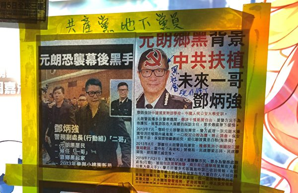

去年7月21日元朗黑社会白衣人恐袭市民事件，警队变真空，外界怀疑曾担任元朗区指挥官的邓炳强参与包庇和策划事件。图为2019年8月中环遮打花园附近有市民贴出告示，指元朗背后有中共扶植，点名邓炳强。（叶依帆／大纪元）

<b>桑普：可见这些硕鼠贪腐到什么程度</b>

时事评论员桑普认为，警队高层黑幕不断曝光，此次卷入“住所门”的警务处助理处长陶辉、新界北总区警司韦华高及速龙小队总指挥总警司庄定贤，都是破坏香港人权的外籍官员。其中陶辉与去年6月12日警察开枪射击抗争者事件有不可推卸的责任，正说明中共爪牙的贪腐恶行，“《诗经》说：硕鼠硕鼠，无食我黍。现在可以看到这些硕鼠，可以做到什么程度。”

他认为，此次警队高层黑幕曝光，与中南海搏击也有密切关系。习近平藉疫情扩权，令好多非习人物“人人自危”，从孙力军、傅政华到孟建柱相继被整肃，也正说明此点。

桑普分析，中共目前面临内忧外患，对内经济极差，对外则面临国际针对中共病毒（武汉肺炎）疫情扩散的索偿潮，故认为5月底举行的两会，重点将是一个向党效忠的会议，“它告诉世界我会一硬到底，战狼外交持续、打压人权持续，清洗官场持续、超限战持续，超限战就是说不断渗透和攻击不同国家的东西。我是相当担心，这不止是新冷战的升格，而是热战的前兆，因为一个国家如果超限战太深、太广的时候，你唯一能够解决这个问题的方式可能是一种猎头式、手术式的一个斩首，而这样东西中国将面临相当严峻的后果。”

他认为，从美国和五眼联盟（由美国、英国、加拿大、澳洲及新西兰组成）两方面去看，美国总统川普早前都讲得好清楚，看过证据证明武汉肺炎那些病毒证据是来自武汉一个实验室，而且他会追讨这个赔偿责任。

桑普估计美国将重点立法针对中共，“将中国获得主权豁免的特权在美国司法体系里面剔除”。另一方面，大额追索赔偿，据统计，现在美国是承受着6万亿美金的损害，估计继续另有5万亿美元，加起来有11万亿美金的损害，“怪不得川普最近说，这是个终极的惩罚。”
   
<a target="_blank" href=#top><h6 align="right">回上方</h6></a>  
  

<a name=51>
<h1 align="center"><b>【内幕】监控百姓 大连政府保密合同曝光</b></h1>
   <h3 align="center"><b>防民甚于防疫 大连政法委四大黑手</b></h3>

大纪元获得的大连市各级政府与外界签订的保密合同显示，中共当局拨出巨额款项，打造“雪亮工程”。（大纪元）

   
 【大纪元2020年05月04日讯】（大纪元记者古清儿报导）近日，大纪元获得中共大连市各级政府的内部文件，揭示了中共借防疫为名制定防民措施，如用网格化、雪亮工程、大数据等手段，加强对中国民众的监视和控制。同时，大纪元获得的大连市各级政府与外界签订的保密合同显示，中共当局拨出巨额款项，打造“雪亮工程”。
 
<b>内部文件泄中共在疫情下监控及防民措施</b>

近日，大纪元获得的中共《大连市发挥基层综治中心和网格员作用加强疫情防控工作情况报告》的内部文件，泄露了中共在疫情下的监控及防民措施。

文件中有一条要求“坚决维护社会大局稳定”，具体内容为：强化涉稳信息报送，组织政法各部门、街道实行日报告和零报告制度，加强对重要涉稳信息的搜集、分析和研判。

文件还有另一个“处置网络舆情”的要求。在文件中，中共要求，区委政法委会同宣传、公安等部门，处置、舆论引导和社会面管控工作，持续开展24小时网上巡查，重点发现、处置涉疫情谣言及各类不当言论贴文，防止负面舆情炒作升级。

近日，大纪元获得的中共大连市当局的内部文件，泄露了中共在疫情下的监控及防民措施。（大纪元）

文件还提到区委政法委加强与区政法各部门、卫健部门及各街道的协调联动，加强群防群控，全面强化社会面巡逻防控等。

以上这几条措施，都与中共监控、恐吓百姓相关。

近日，大纪元获得的中共大连市当局的内部文件，泄露了中共在疫情下的监控及防民措施。（大纪元）

这份文件是大连市委政法委按照中央政法委、辽宁省委政法委《关于进一步发挥基层综治中心和网格员作用筑牢疫情防控第一道防线的通知》而下发的通知，并要求对全市各级党委政法委和乡镇（街道）执行。

这份更高层级的《通知》称，要充分运用“综治中心＋网格化＋信息化”体系，“服务疫情防控整体工作。”

中共综治委（办）起自江泽民掌权时期，是一个非常设机构，成立于1991年3月21日。2018年3月，中共中央综治办、维稳办和防范办（610办公室）相关职能归入政法委及公安部来承担。各地的三大机构，其职能也相应归入各地的政法委及公安部门。

这三大机构都是中共迫害民众，尤其法轮功的重要机构。

<b>大连政法委实施防民措施的四大黑手</b>

近日，大纪元获得的多份中共内部文件显示，大连政法委实施防民措施主要靠四大黑手：综治中心、综治信息化、网格控制、雪亮工程。

一份名为“加快推进新时代大连市市域社会治理现代化（市委政法委）”文件提到，大连建立“互联网＋”平安志愿者招募和工作机制，全市近30万志愿者活跃在城市乡村。

<b>黑手之一和二：综治中心及综治信息化</b>

目前大连市已建成区级综治中心13个，街道（乡镇）级综治中心158个，社区（村）级综治中心1387个，综治中心整体覆盖率达80%。

内部文件《基层综治中心规范化建设标准》称，综治中心下设科技信息部（3人）、指导协调部（4人）、分析研判部（4人）、考核督查部（3人）。

协作部门包括公安、维稳、防范、司法行政、民政、人社、信访、法院、国土资源、住房和城乡建设、环境保护、妇联和安监、人大法工委、教育、共青团、铁路等单位。这些部门均各可派人进驻，获取第一手业务数据。

（大纪元）

   
大连市综治办公室2018年1月8日发布的《关于全面推进综治中心建设情况的报告》提到，将提升综治中心信息化水平，及时将已建成联网的“雪亮工程”视频与市级综治中心对接，整合接入公共视频和公安视频资源2.5万路，依托综治信息平台建立基础数据库，录入基础数据1700万条。

<b>黑手之三：监控人民 中共拨巨款打造的“雪亮工程”</b>

中共监控民众的手段越来越多，如大数据、天网工程、人脸识别、雪亮工程等等，美其名曰是“降低犯罪率”，其真正的目的是为了管控、监控民众。

“十八大”后，中共加强对全社会的监控，从2016年起推出“雪亮工程”和“平安乡村”。2018年中央政法委推动“雪亮工程”，以确保2020年基本实现“全域覆盖、全网共享、全时可用、全程可控”的目标。

“雪亮工程”被舆论称为是大陆城市影像监控系统“天网工程”农村版，也是臭名昭著的中共监控系统“金盾工程”的最新升级版。

2018年大连市财政投资近5亿元，在全市新增公共安全视频监控点位3.2万（其中一类1.2万，二类2.0万），完成近10万路公共视频监控的联通共享，全市“雪亮工程”综治共享分平台已联通覆盖到13个区市县，160多个街道，90多个社区（村）。

大纪元获得的大连市多个地方政府与各信息公司签订的合同资料显示，中共当局拨出巨额款项，打造实施监控的“雪亮工程”。

如长海县大长山岛镇政府与上海望海大数据信息有限公司2018年签订了“长海县大长山岛镇海陆一体化安全信息管控平台建设信息服务采购”合同书显示，合同价款为人民币14,259,968.31元。

大纪元获得的大连市多个地方政府与各信息公司签订的合同资料显示，中共当局拨出巨额款项，打造实施监控的“雪亮工程”。（大纪元）

长海县小长山岛镇政府与上海望海大数据信息有限公司2018年签订“长海县小长山岛镇海陆一体化安全信息管控平台建设信息服务采购”合同书显示，合同价款为9852803.86元。

大纪元获得的大连市多个地方政府与各信息公司签订的合同资料显示，中共当局拨出巨额款项，打造实施监控的“雪亮工程”。（大纪元）

长海县广鹿岛镇政府与上海望海大数据信息有限公司2018年签订“长海县广鹿岛镇海陆一体化安全信息管控平台建设信息服务采购”合同显示，合同价款为 12,568,937.902元。

大纪元获得的大连市多个地方政府与各信息公司签订的合同资料显示，中共当局拨出巨额款项，打造实施监控的“雪亮工程”。（大纪元）

长海县獐子岛镇政府与大连望海大数据信息有限公司2018年5月签订了“长海县獐子岛镇海陆一体化安全信息管控平台（一期）建设信息服务采购”合同书显示，甲方购买乙方服务的合同价款为49.8万元/年，合同期为3年。

大纪元获得的大连市多个地方政府与各信息公司签订的合同资料显示，中共当局拨出巨额款项，打造实施监控的“雪亮工程”。（大纪元）

长海县海洋乡政府与大连世想海洋科技有限公司2016年签订“长海县海洋乡海陆一体化安全信息管控平台采购”合同书显示，甲方购买乙方服务的合同价款为48万元/年，合同期限为10年。

大纪元获得的大连市多个地方政府与各信息公司签订的合同资料显示，中共当局拨出巨额款项，打造实施监控的“雪亮工程”。（大纪元）

仅从以上长海县建设“雪亮工程”的各种款项，及大纪元获得该县与其它网络公司签署的各项通信监控业务合同（不一一列举），粗略计算就高达四千多万元。目前，大连市有六个市辖区，三个县级市，一个县。

此外大连市各区的街道遍布高清监控摄像头。

如金普新区马桥子街道装了283个高清监控摄像头，其中，主要路口高清摄像头90个，高空瞭望摄像头2个。

大连市旅顺口区先后投入260多万元铺设31条，累计60多公里光纤专线，设置45个1200万像素、20倍变焦、最远可视直径15公里高空瞭望摄像探头。从区公安机关1400个“天网”监控视频中选取382个平面卡口视频监控探头。

大连市甘井子区兴华街道综治办2018年11月27日下发的《兴华街道全覆盖无死角建设雪亮工程》文件提到，“雪亮工程”中建设的公安系统“天网”的33个视频探头、320个“微视频”探头全部接入中心。同时，甘井子区公安分局权限下的1200个“天网”高清探头在兴华街道综治中心的指挥调度室都可以应用。

此外大连市各区的街道遍布高清监控摄像头。（大纪元）

据报，中国有1.76 亿个监控摄像头遍布各地，14亿公民的一举一动都处于中共的监视之下。甚至还下令民众出租房屋前必须在室内安装监视器。

浙江省杭州市一位租户向《寒冬》杂志大吐苦水说：“从装了监视器后，我在家也得穿得整整齐齐，夫妻说点悄悄话也怪怪的，回到家随时被监控，简直像在监狱一样。”他随后更质疑当局，“这哪是防小偷，根本就是贴身监控”。

<b>黑手之四：划分网格 中共严密监视人民</b>

此外，自2000年以来，中共逐渐扩大了“网格化管理”制度，将社区以二三百户家庭为单元进行划分，每个单元都有一个网格管理员负责，搜集每个家庭的信息。

网格管理员，最主要的工作就是监控和维稳。中共要求他们不仅要全面掌握网格内情况，采集讯息，及时上报，还不得泄露自己的工作秘密。其中访民、中国宗教信徒、法轮功等，都是中共重点监控对象。

大纪元获得的大连综治办下发的“关于印发《大连市网格化服务管理事项清单》的通知”显示，“网格化管理”内容，包括基础信息采集、社情民意收集等24个工作事项。

自2000年以来，中共逐渐扩大了“网格化管理”制度，利用网格管理员搜集每个家庭的信息。（大纪元）

如市综治办负责基础信息采集及社情民意收集，前者内容包括综合采集社区、村屯网格内“人、地、物、事、组织”等基础信息，录入综治信息平台或网格化服务管理系统。

市防范办负责反X教活动，其内容包括清除清缴宣传品；了解、监控辖区X教人员活动动向；协助开展教育转化、重点人防控工作；对公民进行反X教警示教育。

自2000年以来，中共逐渐扩大了“网格化管理”制度，利用网格管理员搜集每个家庭的信息。（大纪元）

从《中山区社会治安综治网格员信息表》的内容显示，该区有239名网格员，并详细列出每个网格员负责街道、社区、责任网格、职务、姓名、手机号、用户名、结构性编号。

如海军广场街道有35个网格员负责，共负责9个社区，编号1的网格员刘X鹰负责华乐社区，用户名为HLSQD1WG01，结构性编号为A1010101。

《加快推进新时代大连市市域社会治理现代化（市委政法委）》文件提到，大连已经划分了1.6万个网格，招有3.4万名兼职网格员。

中共内部文件提到，大连已经划分了1.6万个网格，招有3.4万名兼职网格员。（大纪元）

大连还打造“全科网格”，一个网格配备至少一名专责网格员，“一村（社区）一警一辅警”100%全覆盖。

早在2012年，中共利用“网格化”迫害民众就已有报导。

海外明慧网上2012年8月21日的一则《长春南关区成立社会服务管理局 实为迫害机构》的报导，称“南关区的社区都叫网格，每个社区主任不叫主任，叫网格长，而且，每个网格长都配一台GPS定位手机，每台手机24小时开机，政府每月存电话费70元，这个手机和社区电脑及区控制中心的电脑联网，还有一个工作QQ群。”

有网民表示，政府在各地设置网格管理员，增加纳税人负担；纳税人交钱，还要去维稳纳税人。而且这更是政府对普通公民的生存和生活秩序的严重干扰。

北京学者查建国表示，这说明当局对民众的监控更细致：“管理得更细了，划分得更细了。这样对下面信息掌握得更快，控制得更严。”  

<a target="_blank" href=#top><h6 align="right">回上方</h6></a>  
  
  
<a name=50>
<h1 align="center"><b>外媒：金正恩“装死”为找叛徒 或清洗异己</b></h1>

有分析认为，金正恩的失踪，是为了找出叛徒。图为2018年4月27日金正恩参加板门店的首脑会议。(Korea Summit Press Pool/Getty Images)

   
   【大纪元2020年05月04日讯】（大纪元记者徐简综合报导）朝鲜领导人金正恩“死而复生”，外界对此议论纷纷，西方媒体的资深记者和专家分析，金正恩这次故意伪造自己的死亡，目的是揭露其党派内部的叛徒。
   
<b>澳媒记者：金正恩诈死是为了找出叛徒</b>

上周五（5月1日），失踪了20天的金正恩突然现身，参加了一个化肥厂的开工仪式并剪彩。此前外界对于金的健康状况猜测纷纷，很多报导认为他已经死亡或者残疾。

上周五流出的照片显示，在仪式上现身的金正恩满面笑容，与助手交谈，并参观了工厂。外界报导，金正恩重新露面的地点——平安南道顺天市新建的“肥料厂”可能是一个核项目工厂。

澳大利亚天空新闻台的记者、Outsiders节目主持人詹姆斯·莫罗（James Morrow）声称，这个朝鲜暴君伪造了自己的死亡，为的是了解朝鲜的精英将如何对此做出反应。

莫罗认为，这将使金正恩能够找到“叛徒”，并将此举形容为这是模仿斯大林的作法。苏联独裁者约瑟夫·斯大林（Joseph Stalin）像恶魔一样可怕地控制着他的人民，以至于他去世后几天，没有人能鼓起勇气进入他的房间。

詹姆斯说，外界对他‘死讯’的报导太夸大其辞了，“他决定这样做（装死），默默观看权力方面的争夺战，找出谁在他去世时试图掌权。”
“朝鲜或面临政治清洗”

金在朝鲜官媒发布的照片上，在他的前臂上似乎显示出一个神秘的针痕，因此有人认为金正恩接受了心脏手术。但据福克斯新闻报导，一名知情的韩国官员表示，没有迹象表明金正恩在消失期间接受过手术。

在金失踪期间，很多媒体纷纷猜测，谁会继续领导朝鲜，他们提到了许多潜在的领导者，包括金的妹妹金与正。

詹姆斯预言，金正恩这次“复出后”，将对任何抵抗他统治行为的人进行更加严厉的镇压。“也许我们很快就会看到，朝鲜清洗（反对人士）。”他说。

埃塞克斯大学的纳塔莎·林德斯塔特（Natasha Lindstaedt）教授也同意这一观点，她认为金正恩可能会发动一波可怕的公共处决，来镇压异议人士。

星期六，朝鲜和韩国军队在两国边界沿线的非军事区交火，朝鲜部队向这个坚固的边界沿线的韩国守卫哨所开枪射击，发射了多发子弹。韩国在发出警告广播后开了两枪作为回应。事件没有造成韩方人员伤亡或装备受损。

<a target="_blank" href=#top><h6 align="right">回上方</h6></a>
  
  
<a name=49>
<h1 align="center"><b>【疫情最前线】青藏高原惊现28种未知病毒</b></h1>

“阴滋病”杀入中国IT圈；川普：将对中共终极制裁；郭文贵：比石正丽更高级官员逃美；冰川融化，西藏惊现28种未知病毒！（大纪元香港新闻中心）

   
   【大纪元2020年05月06日讯】（大纪元香港新闻中心报导）5月1日网传“阴滋病”杀入中国IT圈，而科学界的腐败和卫健委的隐瞒必将酿成大祸；5月3日，美国总统川普最近指责中共“犯了一个可怕的错误”，美国将采取“终极制裁”；流亡美国的中国富豪郭文贵5月2日爆料：比石正丽更高级官员逃美，所携文件惊呆欧洲元首；冰川融化，西藏惊现28种未知病毒！

<b>可怕阴滋病进入中国IT圈</b>

艾滋病，上世纪八十年代开始，成为全球人类最害怕的疾病。到上世纪末，中国已成为世界艾滋病增长最快的国家之一。

最近，一名大陆IT公司高管透露，中国出现了一种叫做“阴滋病”的传染性疾病。

所谓阴滋病，是一种病症类似艾滋病，但病毒检测却呈阴性的疾病。因此被称为HIV阴性感染，即“阴性艾滋病”，简称“阴滋病”。也有人将这种疾病称为“恐艾症”。

有医生认为，“恐艾症”，顾名思义，就是由恐惧艾滋病而引发的心理疾病，但也有专家认为：此定论过于牵强，大面积的心理疾病不太可能，很有可能是未知病毒。

目前，这种疾病正在中国迅速蔓延。有报导说，阴滋病的严重性绝不亚于癌症、艾滋病、萨斯、H1N1这些传染性疾病，甚至更为可怕，因为其传播范围已经蔓延到中国的每一个省份，而其传播形式——隐性无形和具有高度的传染性，其治愈率更是零。

5月1日，自媒体作家曾铮，报导了一名来自大陆IT高管的投稿，作者认为此病已经非常严重，许多IT高管已经被感染，而科学界的腐败和卫健委的隐瞒必将酿成大祸。

文章称这种传染性很强的阴滋病，不会马上导致死亡，但感染者由于免疫系统缺陷导致各种炎症并发各种慢性病，最终导致死亡，有病友们称这个病是“会飞的艾滋病”。

来稿还说，阴滋病已经进入中国IT高管圈，通过日常会议、吃饭、工作快速传播，已经多名高管出现一些症状。他还认为，未来2至3年会有很多中国IT业界高管和普通员工出现阴滋病症状，或者出现癌症。

<h4 align=center><a href="https://twitter.com/jenniferatntd/status/1256394763932180480?ref_src=twsrc%5Etfw%7Ctwcamp%5Etweetembed%7Ctwterm%5E1256394763932180480&ref_url=https%3A%2F%2Fwww.epochtimes.com%2Fgb%2F20%2F5%2F5%2Fn12085629.htm">阴滋病进入中国IT圈. 卫健委隐瞒传染病必将酿成大祸,新冠COVID19已经充分暴露科学与政治挂钩后的危害。 阴滋病更是一个科学与政治挂钩， 最终会酿成大祸的传染病，這也是科学腐败帶來的问题。(点击右键,另存新档）</a></h4>

目前，大部分中国医疗专家都拒绝承认这是一种病毒感染疾病。中国疾控中心首席专家曾光，写了7封信说明阴滋病是心理疾病，不会传染，但众多患者和部分专家认为这是刻意误导。

<b>川普：将对中共终极制裁 绝不玩跳棋游戏</b>

美国总统川普最近指责中共“犯了一个可怕的错误”，美国将采取“终极制裁”。他表示，美中之间正在进行复杂的博弈游戏，但绝不是跳棋。

5月3日，川普在华盛顿DC林肯纪念堂，参加福克斯新闻主办的市民大会，发誓找出中共病毒流传全球的真正原因。

川普说：“我们的国家发生了一件可怕的事情。它来自中国。它本来可以被阻止的，本来可以被阻止在当地的。他们没有选择这么做，或者发生了某件事，不是无能，就是他们出于某种原因而没有这样做。而我们必须要找出究竟是什么原因。”

福克斯男主持人问川普：“你会以征收关税的方式制裁它们（中共）吗？”

川普回答：“我现在就可以告诉你，那将是终极制裁！但我（现在）不想告诉你将会怎么做，我们（美中）正在进行一个复杂的博弈游戏……，我可以告诉你，那绝不是跳棋游戏。”

<b>郭文贵：比石正丽更高级官员逃美 文件惊呆欧洲元首</b>

流亡美国的中国富豪郭文贵，5月2日爆料说，逃出中国的，是比石正丽更高级别的人物，已经抵美。目前已有欧洲元首看过携出的文件，全都吓呆了。

5月2日，郭文贵在直播中说，在武汉P4实验室发生状况后，他们本该守本分地防止病毒传染，反而却威胁做实验的人不许说话。

郭文贵说，去到欧洲后又逃往美国的，不是武汉病毒研究所副主任石正丽，而是比石正丽更为关键的“高级别人物”，他带着机密文件来到美国。此人已经和欧洲一位现任元首、一位卸任元首进行了视讯会议，“两个元首看到文件就吓傻了”。

郭还提到，前白宫首席策略长兼美国总统顾问班农（Stephen Bannon）已经和该人会谈过，世卫组织接获情资，知道有高级别人物带着文件抵达美国，因此呼吁中共接受调查病毒起源，但现在谁都不信世卫了。

<b>中方故伎重施 再将病毒源头引向法国</b>

总部位于巴黎的巴斯德研究所（Institut Pasteur）的多位科学家早前发布论文，指出法国疫情的传播与无症状感染者有很大关系。但中共官媒《人民日报》则偷换概念，歪曲法国科学家论文的原意，称这家研究所的结果，是法国疫情来自法国本土流传的病毒株。有关人士斥中共官媒造假。

中共喉舌《人民日报》5月3日报导宣称，法国巴斯德研究所4月28日发表新闻公告说，该所一项研究显示，法国的疫情是由一种在本地流传但来源未明的病毒毒株所引发。4日，中国网再次发布英文稿，直接指称巴斯德研究所认为法国疫情的爆发不是从中国进口的病例引起。

报导还宣称，巴斯德研究所核糖核酸病毒进化基因组学负责人艾蒂安·西蒙-洛里埃（Etienne Simon-Lorière）得出的结论是“关于病毒地理起源的推论并不可靠”。

自由亚洲电台查阅了巴斯德研究所多位科学家于4月24日预存于美国冷泉港实验室创办的BioRxiv生物科学网上存储库中的论文，发现其结论是说第一批欧洲病例采样IDF0372和IDF0373在2020年1月24日的来自法兰西岛，不是直接从中国湖北输入的；另外IDF0515对应的是来自中国湖北的旅客。

论文的联合作者、巴斯德研究所的国家呼吸道感染病毒参考中心主任西尔维·范·德维尔（Pr Sylvie Van der Werf）表示，首例有症状的输入病例在法国并未引起广泛的传播；艾蒂安·西蒙-洛里埃则表示，根据早前观察，在法国病毒的传播与无症状病例有关。

法国学者杜波伊丝（Marni Dubois）向自由亚洲电台指出，巴斯德研究所指出的是有症状的输入型病例在法国被很好地隔离和控制，而那些无症状的感染者导致了大规模的传播，但这并不意味着研究所否认了病毒来源于中国。

她很气愤中共官媒杜撰出来的非常具有欺骗性的内容，并将责任推到深受病毒危害的法国人身上，作为法国公民，她呼吁法国政府要求中共公示真相和进行问责。

法国时评人王龙蒙也表示，近期世界各国纷纷进行病毒溯源，中共因此大为紧张，以致采取颠倒黑白的手法以图掩饰本身的罪责。他呼吁国际社会继续对中共进行调查。

王龙蒙说，其实五眼联盟国家的调查结果已经呼之欲出，中共当局现在真的急了，所以不惜使用这些完全颠倒黑白的做法，来掩盖病毒来源真相。他们出动大外宣、中共官媒和外交集团作战混淆真相、甩锅的手法恰恰自证病毒是从实验室中流出，更大的可能是中共的生物战试验，否则它们完全可以开放国际调查。

疫情发生后，美国疾病控制与预防中心（CDC）多次提出派遣科学家到中国，援助应对中共肺炎疫情，但屡次被拒绝。

对于中方再将病毒源头引向法国的甩锅手法，有评论认为：“没错，中共病毒的源头确实是法国。共产党就是靠流氓起家的，没有巴黎公社，也就没有共产主义在全球的泛滥。”

<b>美国会：中共及世卫均违反了世卫规则</b>

美国“真清晰政治”（Real Clear Politics）网站5月4日报导说，在中共病毒爆发的最初几周，中共政府的虚假宣传活动已基本成型。

报导指出，中共掩盖疫情的行为激起国际追责声，并加深华盛顿与北京之间的政治分歧；同时，中共的掩盖行为还推翻了美国总统川普曾希望的美中贸易冲突缓和，并正促使人们对中共与全球关系进行认真反思。

众议院外交事务委员会排名最高的共和党众议员迈克·麦考尔（Mike McCaul）表示，在整个去年12月至今年1月的第一周，中共官员都在蔑视世界卫生组织的规定，直接导致病毒传遍全球。

英国南安普顿大学进行的一项研究发现，如果中共当局早日采取行动，就可以使病毒传播率降低95%。麦考尔也认为，应要求世卫承担责任，因为世卫帮助中共掩盖中共病毒（SARS-CoV-2）危机的关键性信息。

他说，世卫忽略其自身的规则，这些规则要求它必须对收到的任何类似SARS病例的非官方报告进行调查。

而台湾在去年12月31日就向世卫提供了有关中国SARS病例的信息，但世卫对此却不予理会。

川普4月宣布冻结美国向世卫提供的数亿美元资金，同时要求审查世卫在中共病毒疫情期间是否“管理不当”。

“2003年，中国共产党（CCP）没有适当警告全世界注意预防萨斯，结果导致了大流行。作为回应，全世界齐力执行新规，包括严格按照要求向世卫报告、避免未来的大流行病发生。”麦考尔在给“真清晰政治”的一份声明中说，“在2019年再次面临即将到来的大流行时，中共无视这些规则，让冠状病毒（中共病毒）传播开来，杀死数十万人，并摧毁全球经济。”

麦考尔说，更令人不安的是，世卫“盲目跟随中共，拖延全球保护民众的必要行动”。

“为了防止来自中国的另一场大流行蔓延到我们（国家）海岸，我们必须要求中共和世卫总干事谭德塞担责。”

<b>全球将有大灾难？青藏高原惊现28种未知病毒</b>

最近，美国俄亥俄州立大学科学家发表在bioRxiv的论文称，随着全球气候变暖，冰封于冰层和永久冻土之下，长达数世纪的长期蛰伏的细菌和病毒开始复苏。

该研究表明，在青藏高原冰核样本中发现古老病毒存在证据，其中28种是新病毒。全球变暖导致世界各地冰川缩小，并可能释放被冰封了数万乃至数十万年的微生物和病毒。

报导说，“未知古老病毒”这几个字眼，很多人觉得这意味着有可怕的事情发生。其实，这个结果并不令人惊讶。

过往研究表明，冰川冰芯样品里微生物数量大概为每毫升100至1万个细胞，而深海里，每毫升含微生物数量在1万至100万个，比冰川里多得多。如果是更小的病毒，整体的数量级还要更高。

而且，科学家已经多次从冰川中发现古老病毒。

整体来说，该领域目前还处于研究的初期。在没弄清楚病毒毒性前，对未知病毒的风险需要谨慎考量。

还是有很多人慨叹，“坏消息扎堆出现，地球真是越来越危险了。”

<a target="_blank" href=#top><h6 align="right">回上方</h6></a>
  
  
<a name=48>
   <h3 align="center"><b>“邓朴方”战“习远平” 两封信的对质</b></h3>
<h1 align="center"><b>【有冇搞错】中共元老被软禁？--石山</b></h1>

【有冇搞错】号称“邓朴方公开信”中，透露当局软禁了“一批老同志”，这个内容最为惊人。前后事对照，其真实性极大，北京权斗将激化，习近平会采走新路线吗？（大纪元香港新闻中心）

   
   【大纪元2020年05月05日讯】《有冇搞错》。5月4日。

最近两天，网络上流传出两封信。一封是邓小平长子邓朴方的，一封是习近平弟弟、习仲勋的小儿子习远平的。

咱们先介绍一下这两个人。邓朴方是邓小平的长子，文革的时候，他是北京大学学生，因为邓小平被打倒，他也被批斗，要求揭发他父亲的修正主义罪行，把他关在一个楼里。后来爬窗想逃出去，失手摔到楼下，受重伤。当时中国很混乱，邓小平又已经倒台了，所以一直没有医治，最后成了终身残疾。

邓小平掌权之后，邓朴方创建了残疾人联合会，当主席。他还办了一个康华公司，当时在中国影响非常大，很多人不满，认为是官倒公司，就是官方借助权力做生意的公司。后来八九民运期间，这个问题成为学生批评最多的一件事情。

九十年代，康华公司取消了。邓朴方继续担任残联主席，后来他进了政协，2008年还担任了政协副主席，成了党和国家领导人了，当然是没有真正实际权力的领导人。

习远平，是习近平的弟弟。1955年出生，文化大革命期间，习仲勋早就被打倒了，习远平随母亲下放到河南，在那里上中学，后来回北京，在机械厂当工人。1977年，22岁时，考入解放军洛阳外国语学院，毕业后曾在军队工作几年，再到政府机构工作。后来他到香港住，还有澳大利亚的绿卡。

习远平现任国际节能环保协会会长，这是一个声称是“致力维护节能与环保建设”的全球性组织，总部位于北京。习远平比较低调，平时很少露面。

好了，咱们看看这两封信。首先说明，两封信，没有办法证实真伪。我只是以个人经验判断，信是真的可能性很高，纯粹是个人判断。

首先看邓朴方这封信，信是写给人大政协两会代表的，信里面首先说已经退休，不问政事，但有些话想说。主要提出了15个问题。这15个问题，可以说都是针对中共最高层的严厉的质问，我们来看一下。

<b>邓朴方的信

1. 作为两会代表，是保护国家和人民的利益重要，还是保护某个专权者的权位重要？

2. 宪法明确规定，两会代表有权监督和纠正中央政府的各种错误决定，可前几年，中央推出了“妄议罪”，今年又推出了“不知敬畏罪”。在这种情况下，大家认为两会代表存在的意义是什么？

3. 当权者要定于一尊。请问代表们，我国的一尊究竟是皇家世袭的皇帝？还是民选的总统？还是党内公投产生的总书记？既然都不是，哪他又是谁的一尊呢？

4. 面对中央屡次出现重大错误，党员提意见是“妄议中央”，民众提意见叫“煽颠”。请问代表们，我们的国家又究竟是谁的国家？

5. 武汉肺炎已蔓延到全世界，中央是否拖延了防控时间？又是否向公众隐瞒了疫情真相？我们该不该给全世界人民有个交待？谁又该对这次疫情失控负主要责任？

6. 中美关系持续紧张恶化，中央主要领导人又该承担什么责任？

7. 香港动荡已持续近一年了，究竟是谁破坏了香港一国两制的大好局面？中央主要领导人对此又该承担什么责任？

8. “一带一路”无理性投入，不经过全国人大批准，不顾国计民生，中央主要领导人仅凭个人好恶对外四处大撒币，这是一种什么行为？如今项目要流产了，这个责任该由谁来承担？

9. 不经过全国人大批准，也不经过专家论证，中央主要领导仅凭几个人的建议就拍脑袋决定投资上万亿建一个雄安新区，这是一种什么行为？如今项目流产了，这个责任该由谁来承担？

10. 台湾与大陆为何会渐行渐远？中央对此又该承担什么责任？

11. 大批外企撤离中国，大量民企倒闭，大量工人失业，这与中央的错误决策有没有关系？如果有，这个责任该由谁来承担？

12. 现任领导借助手中权力为自己修宪取消任期制，这是一种什么行为？如果谁有权就可以为自己立法，国家宪法又有何用？

13. 中央已作出决定，准备重拾早已被世界所淘汰的计划经济模式，这究竟是为了稳固个人政权？还是出于对国家和人民利益考虑？</b>

<b>14. 近几年来，中国的国际形象一落千丈，国家信用荡然无存，这个责任应该由谁来承担？</b>

14个问题，政治、经济、外交、香港、台湾、武汉肺炎疫情，体制和结构，可以说全都点到了，面面俱全，基本上没什么遗漏。不但有质疑，有批评，还有警告。

邓朴方信中的说话，大部分是大白话，不用太多解释。但其中有一点，值得研究分析中国的人非常留意。这就是最后一点。

<b>15. 为了阻止老同志提出召开政治局扩大会议的集体动议，中央居然动用军警把一批老同志和现任党政军大员都加以“特殊保护”，名为“特殊保护”，实际上是限止通讯、限止行动自由、限止客人到访，这是一种什么行为？又是谁给了他这种权力？</b>

这是邓朴方信的最后一点，我认为是披露了两件非常重要的情况。

第一，党内有老同志，提出召开政治局扩大会议的集体动议。

在中共历史上，一旦召开中央政治局扩大会议，或者中央扩大会议，就基本上是一个党内政变。上一次的政治局扩大会议，是89年，邓小平召开的，那个会议推翻了赵紫阳。再往前，就是1980年，也是邓小平，推翻了华国锋。再前，就是毛泽东了。

文革中，毛开过中央扩大会议，因为文革中大部分中央委员都被打倒了，所以要开会，就只能扩大了。

文革之前，中共也开过扩大会议，包括政治局扩大会议，前委扩大会议（就是军事指挥部的扩大会议）等等，通常这种会会发生权力变更。比如毛泽东本人，就是中共长征时，在遵义开中央和军委扩大会议，被确定为三人小组成员，负责军事指挥，成为了中共最高领导之一。

所谓扩大会议，政治局22个人，我再扩大到所有前政治局成员参加，江泽民时代，加上胡锦涛时代，可能有近百人，这个会可以形成一个决议，推翻现任领导人的意见，甚至推翻现任领导人本人。

所谓邓朴方这个信，其实是呼应了前一段时间，也有太子党背景的阳光集团主席陈平转发的那个，要求召开扩大会议的信。

第二点，是中央动用军警，对这些有资格开扩大会议的老同志，和一些现任党政军大员，都采取限制通讯、行动自由，限制客人到访，其实就是采取某种程度的软禁。

也就是说，北京对局势已经接近失控了，不但对国内老百姓采取完全控制严厉打击，对党内也已经实行了军管了。也就是说，在党外，或许大家感觉上中国局势正在接近文革，有点恐怖，但在党内，实际上严厉打击严厉控制已经展开，而且根本不管你什么立场态度。当然，可能会反对现当局的，应该会受到更紧密的软禁。

我们以前提到过专制体制最大的体质性特点，就是最大危险，永远来自于内部，尤其是那些可能获得最高权力的圈子，在政权出现危机的时候，是最危险的一群人。

和这封号称是来自邓朴方的信比起来，习远平的那个信，其实谈不上是什么信，看起来，更像是一个回复朋友的手机短信，一个Message。我们也看一下这个内容。

<b>习远平的信

我不想为哥哥辩解，只想让你们理解管理这么大一个国家多么不容易。他夙夜在公日夜操劳，没有任何私心私利，包括最受诟病的更改国家主席任期制，都不是为了个人考虑，只是为了国家的长治久安。

以前搞九龙治水，结果政令不出中南海，现在他吸取教训，集中领导多了一些，又有什么不对？

哥哥曾经私下说过，当中共的最高领导人，必须先大左才能再大右，因为大左才能在党内立足，立足了才能启动彻底的政治改革，早期的胡与赵都是不懂这个道理才半途而废的。他在复杂的党内斗争中上任，每一步路都不能走错，否则必万劫不复。

有些惹起公议的事情，并不是他的旨意，完全是下面有人高级黑故意让他难堪，目前对政法口几个人的处理，正是对这些杂碎的大清算，这还只是开场好戏还在后头。

我一直跟朋友们讲，我们是习仲勋的儿子，是中共最大的开明派之一的后代，我们不会辜负父亲的教诲。哥哥的历史定位，不光靠以前他所做的，更要靠以后他将要做的，风物长宜放眼量。

这次疫情重创了经济，但会是政改启动的机会，以后新闻舆论开放，市县普选，司法半独立，都会陆续展开。目前他最头疼的事并不是国内，而是西方群起围攻中国。武汉病毒所泄露病毒的事情，不但制造了公共卫生危机，也制造了充满风险的外交环境。无论如何，他会驾驭好中国这艘大船，当好这个舵手，对此我深信不疑。</b>

哇，这封信，也透露了很多内容啊。

第一个透露的，是风物长宜放眼量，这是毛泽东的诗，意思是眼光放长远一些，习近平以后做的事情，才是最重要的。因为他要先左倾，抓牢中共的权力，然后才启动彻底的政治改革，因为习近平是中国最大开明派习仲勋的儿子。

这是真的吗？欲擒故纵，欲右先左？在政治上，这行得通吗？我非常怀疑，因为这种体制这种东西，说是最高掌权人负责，实际上最后是体制本身控制当权者。

中国专制体制尤其如此，最早是皇帝控制体制，后期根本是体制控制皇帝。不管你多么英明神武，多么勤俭刻苦，体制烂掉的时候，谁也无力回天。历史上发生过很多次了。所以我不相信习近平能用中共本身左的政治力量，去实行一个向右倾的政治体制的民主化和自由化改革。所谓南辕北辙，此之谓也。

第二点比第一点，可能更加真实。就是他要对那些高级黑的人进行处理，特别提到对政法口（就是政法系统）的处理，是对这些杂碎的大清算，还提到这只是开场，好戏还在后头。

这个和现在孙力军、傅政华的落马和卸职，还有传闻，公安部二十多人被抓，如果是真的，估计官职都不小，以及前中央政法委书记孟建柱被抓，等等，大概都是信里面说的开场，好戏是什么呢？我们大家等着看，反正我是已经搬好了板凳了。

两封信，感觉上，是邓朴方发出公开信，有人问习远平，然后习远平一气呵成回了一个Message，就成了他的信。这么看，是不是比较合情合理啊。

不管是真是假，习家兄弟的想法，可能是真的，也许是真情流露，但专制体制中的政治这个东西，玩到这个份上，最不可靠的可能就是那些保证，以前被人迫害，现在照样可能去迫害别人，媳妇熬成婆，可能比婆婆更厉害。习近平要做什么，可能已经没有多少时间了，如果要去共，现在不做，以后恐怕再也不会有机会了。

但北京的权力斗争是真实的，未来会反映在中国政治、经济各个方面。香港的事情，一定会有所变化的。

<a target="_blank" href=#top><h6 align="right">回上方</h6></a>
  
  
<a name=47>
<h1 align="center"><b>【纽约疫情5.5】地铁关闭 数百名警察将到场赶人</b></h1>

2020年5月4日，大都会运输署（MTA）清洁人员在消毒地铁车厢。（Stephanie Keith/Getty Images）

   
  【大纪元2020年05月05日讯】（大纪元纽约记者站报导）5月5日，美国纽约州中共病毒（武汉肺炎、冠状病毒、COVID-19、中共肺炎）疫情的最新情况：
  
  <b>地铁凌晨关闭 数百名警察将到场赶人</b>

纽约市警察局长德莫特·谢伊（Dermot Shea）表示，地铁凌晨关闭期间，将部署数百名警员到地铁站疏散乘客及游民，帮助清洁工作如期进行。

谢伊在周二的新闻发布会上说：“我们从来没有真正开展过如此大规模的任务，我预计第一晚的情况会是不稳定的，我们将从今晚的工作中吸取教训，努力开发出高效的系统，以最少的警力完成工作。”

谢伊表示，警察大军将负责清理每晚在地铁上睡觉的约2000名无家可归者。

纽约市无家可归服务部发言人麦金宁（Isaac McGinn）表示，该部门将于周二晚至周三上午，在30个“高优先级车站”派出100名外展人员和其他工作人员，在车站内为游民提供庇护所和医疗服务。

麦金宁在声明中说，“我们正在调整和应对，以前所未有的规模和速度来满足当前的需求。”“我们打算通过一周7天、24小时全天候的外联工作，不断地取得突破。”

市长白思豪则表示，这次地铁关闭是解决长期以来流浪汉问题的一个机会。

他说：“这将打乱几十年来无家可归者整夜呆在地铁上的旧模式。”“我们想打破这种模式，我们想让他们得到帮助，我们希望能够在那里提供外展服务，让他们得到庇护。”

<b>6月底 五分之一的工作者或失业</b>

纽约市主计长斯科特·斯静格（Scott Stringer）5日在新财政报告中预测，到下个月底，纽约市每5名工作者中就有1人会因为中共肺炎（冠状病毒）而失去工作。他的预测值几乎是市长白思豪预测的两倍。

报告称，本季度纽约市失业率将达到22%，失业人数将达到90万；为该市战后历史上最高。市长此前曾预测，50万纽约人将失业。

“这是我们有生以来从未见过的事情。我们的经济已经从数字意义上来说已经关闭了。”斯静格周二在线上新闻发布会上说。

主计长预估今年的失业率将为12%，最大的失业行业是食品、住宿业以及零售业。他指出，今年夏天经济有可能出现反弹。

<b>二战老式飞机在纽约上空写下感谢信</b>

一支由二战时期的老式飞机组成的机队GEICO Skytypers，周二（5月5日）在纽约上空写下巨大的感谢和希望的信息，向医院人员、急救人员、必要工作者和所有受疫情影响的人表示敬意。

这些飞机在中午前飞过纽约市五大区，以及长岛和韦斯特切斯特县的上空。他们用飞机划下的巨型信息跨越5-10英里，在方圆15英里的范围内都能看到。

GEICO Skytypers表示，鉴于目前的全球中共病毒疫情，他们希望借此提振人们的精神。

机队指挥官和团队飞行负责人拉里·阿肯（Larry Arken）说：“我们想不出更好的方式来感谢所有纽约人对健康和安全的行动，特别是那些在前线的人，我们将在这个前所未有的时代，向城市传递希望和感恩的信息。”

<b>尸体放不下 布碌崙启用长期停尸房</b>

纽约市布碌崙设立了长期停尸房，以减轻当地不堪重负的殡葬业的压力。

纽约市首席法医办公室（OCME）表示，位于布碌崙39街码头的长期停尸房已经开始投入使用。殡仪馆主任、宗教领袖、停尸房经营者、公墓经营者、公墓经营者周一（5月4日）都参加了OCME的电话会议。

OCME概述了最近的三项政策变化，如下：

1. 在39号码头设立了一个存放遗体的地点，以减轻殡仪馆的负担，并延长遗体下葬时间。
2. 将向公墓工作人员和殡仪馆工作人员发放个人防护用品（PPE）。
3. 39号码头每天开放至晚上10点30分。

布碌崙区长里克·亚当斯（Eric Adams）说，“即使是如此严重的公共卫生危机，也不应该妨碍对待死者的基本尊严。”

纽约州殡仪协会执行董事迈克·拉诺特（Michael Lanotte）说：“增加停尸房的营业时间将为殡仪馆业主们提供晚上的转场时间，因为他们白天的大部分时间都是在处理葬礼、安排葬礼、接听家属的电话，所以对他们来说是有帮助的。”

2020年5月5日，停放在布碌崙地39街码头的长期停尸间。（Stephanie Keith/Getty Images）

<b>养老院未披露的死亡病例 超过1600起</b>

纽约州疗养院的中共病毒（冠状病毒）危机比外界想像的更加严重。

根据州卫生厅发布的新数据，截至5月3日，养老院有1600多人被推测死于中共病毒，但没有得到确诊。总计有4813人在疗养院中死于该病毒。该数据不包括在医院死亡的养老院居民。

4月28日，养老院居民在养老院或医院死亡的人数为3025人。

4月29日至5月2日，另有约100人在养老院死亡。

州卫生厅发言人加里·霍姆斯（Gary Holmes）说，针对数据统计问题，该州已经修改了收集和评估养老院数据的系统。“我们在这场危机中的反应还在继续进行，我们向公众提供的数据量和具体信息也会随着它的发展而继续。”

在纽约州，即使加上新的死亡人数，养老院的死亡人数也只占到全州死亡人数的25%左右。数据显示，受影响最严重的是纽约市及其郊区。

在皇后区的养老院，有358人感疫死亡，另有476人可能是感染病毒而死。在布朗士，有215例是确诊死亡，446例疑似因染疫而死。

但哈佛大学疗养院研究员大卫·格拉波夫斯基（David C. Grabowski）预估，养老院的病死力可能会占到全州死亡人数的一半，正如现在马萨诸塞州和宾夕法尼亚州等地。

<b>州长：“重新开放的速度越快，生命成本越高”</b>

有关返工方面，州长说：“如果重新开放的速度越快，生命成本越高。”

库默表示，重新开放的需要在保持关闭的经济成本和重新开放的人命成本之间取得平衡。他说，任何州重新开放的速度越快，“人的成本就越高”。

州长指出，白宫经常引用的病毒模型预测显示，美国将有13.4万人死于中共病毒（冠状病毒），该数字几乎是其之前预测的两倍（第一波预测或有6万人死亡）。专家认为，这种急剧增加与美国社交距离的放松和流动性增加有关。

库默在他的每日新闻发布会上说：“我们没有阐明的根本问题是，一个人的生命值多少钱？让我们坦诚相待，开诚布公。”“人的生命是无价的。”

他重申说，所有的事实都在考虑之中，他认为日前发布的12个步骤和其它相关措施，能适当决定出地区的重启时间。

由于学校延期开放，州长也谈到了如何用虚拟和互联网来重塑学校上课模式。

他说，他希望看到学校教育比开放前做得更好，并表示他正在与比尔·盖茨及梅林达·盖茨基金会合作，重塑纽约的教育环境。

<b>中共肺炎单日病死数略升</b>

纽约州长安德鲁·库默（Andrew M. Cuomo）周二（5月5日）在疫情发布会表示，该州的冠状病毒死亡人数略有上升，昨天（4日）至少230人病死，比前一天增加了4人；有203人在医院死亡，27人在养老院。但纽约州的住院人数和ICU患者都在下降。

州长说，“我们正在往下降低。”

以下是纽约州过去一周的死亡人数：

4月28日：330

4月29日：306

4月30日：289

5月1日：299

5月2日：280

5月3日：226

5月4日：230

<b>今夜过后 地铁全面通宵停运消毒</b>

周三（5月6日）凌晨1点，纽约市的地铁将做至少50年来从没有做过的事情——通宵停运。

州长库默在每日疫情发布会上说：“今晚我们将关闭地铁，这在历史上是第一次。”他指出，今天晚上纽约市将开始关闭整个地铁系统数小时，连夜对列车进行消毒。

今晚过后，纽约市的地铁系统将从6日凌晨1点到5点关闭，以便对列车进行消毒，而那些在车厢的无家可归者将被移出，当局称，他们将入住避难所，并检查他们是否感染中共病毒（冠状病毒）。

最近几周，每晚只有约11,000人在凌晨1点到5点之间使用地铁。自州长在3月份下达在家防疫命令后，地铁的乘客量顿时下降了90%以上，地铁也就此成为基本工人上下班的交通工具。

为了满足停驶时的交通需求，大都会运输署（MTA）增加了免费公车服务，在61条不同的线路上加开300辆公车、一美元货车等通勤方式，并提供基本工人每晚一次免费乘坐出租车的机会。

<b>分析师：纽约温娣汉堡“没牛肉了”！</b>

全国性的肉类短缺对快餐业者造成不小的影响，一位分析师说，每五家温娣汉堡（Wendy’s）中就有一家餐厅缺牛肉。

温娣汉堡在美国有5,500家餐厅，其中约有1,000家，即18%的餐厅已不提供汉堡包或其它肉类食品。

根据金融公司Stephens对每家餐厅线上菜单的分析，与其它竞争对手相比，温娣快餐“更容易受到冠状病毒造成的肉类短缺影响”，因为该公司对新鲜牛肉的依赖性较强。

分析师詹姆斯·卢瑟福（James Rutherford）说，短缺取决于加工厂关闭的地域性，一些肉类供应商因为工人感染病毒已经暂时关闭了工厂，导致在俄亥俄州、密歇根州和纽约等州，约有30%的温娣公司缺货；其他州，如亚利桑那州、内华达州和路易斯安那州等州没有受到影响。

卢瑟福发现，受影响店家的线上菜单转向推销鸡肉三明治，如果牛肉短缺问题很快得到解决，预计牛肉短缺不会对温迪的利润产生影响。他还表示，温娣新推出的早餐菜单利润很高。

温娣汉堡发言人在声明中表示，“众所周知，北美各地的牛肉供应商目前正面临生产挑战。”“我们正在努力工作，尽量减少对客户和餐厅的影响，并继续与供应商合作，密切关注此事。”

发言人说，虽然肉品对店家配送的时间表保持不变，但在目前的环境下，他们的一些菜单项目可能会暂时受到限制。该公司将于周三公布第一季度财报。

麦当劳和汉堡王没有立即回应是否遇到肉品短缺的问题。

<b>纽约市儿童健康亮警报</b>

纽约市市长白思豪（Bill de Blasio）5日对新的儿童健康警报发表了评论。昨天（4日）该市总共有15名2～15岁的患者被检测出一种炎症综合征状，他们其中4人的中共病毒检测呈阳性反应，另外6名患者有抗体。

市长在记者会上说：“这些病例引起了人们的关注，我们想让所有的纽约人都知道这个问题。”

这15名患者患者都有发烧，超过一半的患者出现皮疹、腹痛、呕吐或腹泻等征状。这些患者中不到一半的人有呼吸道症状。他们有的症状还包括血管发炎，包括冠状动脉的炎症。

有这些症状的儿科医生被指示联系小儿传染病、风湿病学和或重症监护以及卫生部门的专家。

<b>15名儿童出现炎性综合症 或与中共肺炎有关</b>

纽约市卫生局周一（5月4日）晚间发布的健康警告说，纽约市已有15名儿童住院，其症状与多系统炎性综合症相符，可能与Covid-19（中共病毒）有关。

这些孩子的年龄介于2～15岁之间，于4月17日至5月1日住院，他们多数人经中共病毒检测后呈阳性反应。这15名儿童还出现了一些类似川崎病的特征或中毒性休克综合症的特征。

市卫生局长奥克西里斯·巴博特（Oxiris Barbot）表示，“这种综合症状与Covid-19的关系尚未确定，根据目前案例，不是所有这些病例的DNA检测或血清学检测均呈阳性。但从这种病毒的临床性质来看，我们要求所有的医疗机构如果看到符合我们所列举的标准的患者，请立即与我们联系。”

她呼吁家长们如果孩子出现发烧、皮疹、腹痛或呕吐等症状，应立即联系医生。

川崎病会引起动脉壁炎症，是一种罕见的儿童疾病，并可能限制血液流向心脏，或者引发冠状动脉在内的血管发炎。它通常是可以治疗的，大多数儿童康复时不会出现严重问题，但可能致命。

上月底，英国儿科专家也警告，少数出现中毒性休克综合症混合川崎病症状的儿童，可能与中共病毒有关。

在意大利、西班牙、美国斯坦福儿童医院中，都发现了类似的病例。

<b>逾32万例确诊 近2.5万人死亡</b>

根据《大纪元时报》的统计数据，截至美东时间5月5日早上7:00，全美确诊数达到1,212,900例，69,921人死亡，188,068人康复；纽约州确诊病例为327,374例，24,944人死亡，死亡率7.62%。其中纽约市有175,651例确诊，13,207人死亡。

<b>眼见疫情减缓太慢 美网考虑移师西岸</b>

美国网球公开赛今年排定在8月31日至9月13日在皇后区法拉盛草原公园举行，但美国网协的执行总监迈克尔‧道斯（Michael Dowse）表示，如果中共肺炎疫情减缓太慢，比赛可能移师到西岸的加州印第安泉网球花园进行，开赛时间延后到11月。

美国网球协会比莉‧珍‧金网球中心（USTA Billie Jean King National Tennis Center）美国网球公开赛的主场馆，现有两个场馆作为临时医院和医疗仓储中心。

据了解，四大公开赛的法网从5月24日两度延期，目前定于9月27日开打。如果美网延期到11月，四大赛将回复到原本的顺序：澳网、法网、温网、美网。

<b>纽约州分四阶段开放各大行业及学校</b>

继之前讨论过的第一阶段——建筑业和制造业将优先重新开放后，纽约州长库默4日再宣布三类企业将依次重新开放。

第二阶段将包括专业服务、零售和房地产。第三阶段则是餐饮业和酒店。第四阶段为学校、艺术类和娱乐业。

与此同时，库默呼吁各地方政府可以根据对事实的分析，开始计划在5月15日重新开放。他敦促各地方政府官员，现在就开始规划返工，并考虑一些因素。

<b>两游民死在地铁上 病毒测试结果呈阴性</b>

上周末，两名游民被陆续发现死在纽约市的地铁车厢中。社会服务部专员史蒂夫‧班克斯（Steve Banks）周一（4日）对此表示，两名死者的中共病毒测试呈阴性。

专员班克斯在与纽约市长白思豪（Bill de Blasio）的联合简报会上透露，市外展人员曾试图劝说这两位游民接受庇护未果。两名死者分别是56岁的德韦恩‧希尔（Dwayne Hill）和61岁的罗伯特‧曼瓜尔（Robert Mangual）。

市长白思豪和班克斯均表示，病毒没有在游民中广泛传播。白思豪强调，“我们一直不断地为游民提供病毒测试，实际情况是，游民的病毒感染率很低。”

纽约警方表示，周五（1日）晚7点30分，MTA员工在C线的曼哈顿华盛顿高地（Washington Heights）168街站检查车厢时，发现56岁的游民希尔死在车厢中。死因初步调查是自然死亡。

第二天早上8点30分，61岁的曼瓜尔被MTA员工发现昏迷在4号线地铁上，急救人员随后宣布他不治。

<a target="_blank" href=#top><h6 align="right">回上方</h6></a>
  
  
<a name=46>
<h1 align="center"><b>公安部整肃延烧香港 邓炳强涉僭建丑闻曝光</b></h1>
 <h3 align="center"><b>拿港警祭旗？范国威：僭建资料只有身边很接近人才可掌握</b></h3>

香港警队“一哥”邓炳强曾租住的九龙塘广播道老牌豪宅宝能阁高层复式单位，相连的天台一直存在违法僭建物。（大纪元）

   
   【大纪元2020年05月05日讯】（香港大纪元记者李靖综合报导）中共公安部主管港澳工作的副部长孙力军突然被逮捕后，整肃之火已延烧至香港，香港警界被揭系列丑闻事件，目标指向警务处处长邓炳强。

最近警队先后有三位外籍警官被揭不合法入住牌照屋、僭建、占用官地等，5月4日再传出另一起僭建重磅丑闻：警务处处长邓炳强曾租住的九龙塘广播道复式豪宅，天台一直存在违法僭建物，但邓炳强对屋宇署发出的清拆令，一直视若无睹。

<b>无视僭建 享用豪装天台</b>

据《苹果日报》调查发现指，邓炳强曾租住的九龙塘广播道老牌豪宅宝能阁高层复式单位，相连的天台一直存在违法僭建物。2017年初屋宇署已向业主发出清拆令，不过，去年才迁出上址的邓炳强，对单位的僭建问题一直视若无睹，租住期间一直享用400平方英尺非法豪装天台。

据报导，僭建物于2018年已存在至今，邓炳强于2019年迁出，该僭建物的存在应横跨了其居住的时间。

警方回应称，邓炳强曾于2016年租住九龙塘广播道一个单位，其后于2017年接获屋宇署通知，指该单位天台有僭建物，须即时清拆。邓炳强随即通知业主有关清拆令，并要求处理，但业主一直没有履行清拆令，邓炳强于去年6月迁出该单位，并表示对相关媒体的失实报导表示遗憾。

律师兼九龙城区区议员黄国桐接受《苹果日报》采访时指出，清拆僭建物在法律上是业主的责任，租客虽然不需要负责清除，但邓炳强作为执法人员不可能不清楚该单位有疑似僭建物。他认为，若有执法人员选择性对此视而不见，享受非法僭建带来的好处，观感上可谓十分糟糕及不检点。

“僭建”问题看似不大，不过，却是香港官员的“魔咒”。这类丑闻被视为来自中南海国安局级爆料。

<b>特首高官僭建丑闻频传</b>

2012年特首选举期间，因2月6日发生王立军出逃事件致令江泽民派系势力改变计划“弃唐取梁”，抛弃当时胜算高、关键时料会偏向香港人的唐英年，转为支持投机主义者梁振英。同年2月13日，竞选特首选举的前政务司司长唐英年，被《明报》揭发位于九龙塘约道5号的大宅涉嫌隐瞒在游泳池僭建玻璃洞，7号的大宅亦被揭发僭建地库。梁振英在竞选期间曾向对手唐英年揶揄说：“你的僭建问题不是单纯的僭建问题，而是公开地向市民讲大话、隐瞒你的僭建问题。”

接着同年6月21日，《明报》揭发梁振英在山顶贝璐道4号裕熙园的居所僭建面积约110平方英尺的三边密封玻璃棚。梁曾解释说：“我当时是没有隐瞒的，我当时的认知是认为僭建的部分已经处理了，僭建部分就不存在。”

唐英年位于九龙塘约道的5号大宅泳池僭建玻璃洞，7号大宅僭建地库，面积共2,250平方英尺。（大纪元合成图）

梁振英位于山顶贝璐道4号的裕熙园，僭建面积110平方英尺三边密封玻璃棚。（大纪元合成图）

郑若骅位于屯门大榄乐翠街的海诗别墅4号，僭建地库、天台屋、改建围栏和外墙，花园加建水池等；3号屋僭建天台屋、玻璃阳台、水池、地库。（大纪元合成图）

   
   郑若骅2018年1月接替请辞的袁国强担任律政司司长，在履新之日，2018年1月6日，《苹果日报》及《明报》先后报导其位于屯门大榄乐翠街海诗别墅4号有多处怀疑违规僭建，包括地库、天台屋、改建围栏和外墙，花园加建水池等。

其夫前工程师学会会长潘乐陶则为邻座3号屋屋主，两屋花园有一暗门互通。其夫的独立屋同样有多处怀疑违规僭建，包括：天台屋、玻璃阳台、水池、地库。

2018年1月24日，郑若骅首次以司长身份出席立法会大会，回应议员有关律政司长职能的口头质询。民主派议员追击郑的僭建丑闻，批评她“大话连篇、毫无诚信、知法犯法”。郑反驳说：“我不接受我是一个没有诚信的人。”

事隔快一年，律政司决定起诉潘乐陶涉嫌僭建，郑若骅则避过一劫。

而在大陆，整肃官员下台通常以贪污罪来处理，因为在国内贪腐实在是太普遍。未知道“僭建”问题在香港官场是否普遍现象，但每次香港官员被爆“僭建”问题，都与中共党内势力动向有密切关系。

2012年特首选举期间发生“弃唐取梁”环节时，时任立法会议员梁国雄曾说：“我不认为是香港传媒做的（爆僭建丑闻），应该是国安局做的。如果国安局的丑闻可以互相扔来扔去的话，也表示了中共的介入已非一般的介入，而是两个集团（江泽民派系及习近平阵营）趁王立军引起的危机在香港争夺。香港特首的争夺是反映中共内斗加剧。”

<b>范国威：北京收紧同时找人承担政治责任</b>

现在三位外籍警官短短几天内先后被揭疑有“僭建”问题，紧随着邓炳强也被揭曾入住涉“僭建”的单位。这些香港警队丑闻的曝光，可能也是大陆国安喂料给港媒的，而针对范围也在扩大。

对于最近警队接连出现爆出丑闻事件，西贡运亨区区议员范国威在接受大纪元《珍言真语》访问时说，（警务处外籍助理处长）陶辉夫妇霸占官地，特别是违规出租牌照屋做民宿，而且是发生在过去比较久的时间了，这些资料只有身边很接近人才可以掌握得到，“我们怀疑在这个时刻爆料，是不是警察内部有人要做代罪羔羊？特区政府是不是要找人祭旗？”

5月4日，香港西贡区议员范国威（左一）等人赴廉署举报陶辉涉霸占官地及公职人员行为失当。（宋碧龙／大纪元）

   
   范国威认为，反送中运动期间，香港警队犯下滔天大罪，“警察做了林郑的特卫军、党卫军去打压示威者，打压年轻人，是很严重失误。定会追究下去，而且还不限于香港，还有国际社会，确实造成很多人道灾难，看他们如何攻入理大、中大，很残忍！”

他怀疑警队内有人是不是觉得避不了，现在要在警队内找一些“腐败分子”；那些违反香港法律的，现在让他们得到处罚，让他们离开警队，日后香港真有独立调查委员会或国际社会追究香港警队警暴的政治责任，将责任卸给如陶辉这类曾经很深入地参与打压抗争者，施以警暴的人身上。

中共党内公安部门高层震动，孙力军下马，范国威不排除震动会延伸到香港。“过去两年时间看到北京政府，西环（中联办）伸手干预香港内部事务越来越深，习近平安插骆惠宁等人士在中联办，港澳办的人士调动，确实想执行它的全面管治，大力打压香港的公民社会，甚至政治环境不断在收窄。共产党那套管治文化，共产党如何对待自己人，继续收紧同时又去找人承担政治责任，就他们一些施政失误背黑锅，我怀疑陶辉事件有类似情况。”

面对国际社会压力避不开，香港人“五大诉求，缺一不可”的政治理念坚定不放弃，甚至9月立法会选举民主派有机会收获过半议席，发挥立法机关充分制衡行政机关宪制上权力，西环（中联办）、北京政府、习近平都很着急。不断收紧的同时，有一些压力回避不了就要找人出来祭旗，是共产党的一贯做法。

<a target="_blank" href=#top><h6 align="right">回上方</h6></a>
  
  
<a name=45>
<h1 align="center"><b>无尽感恩 台湾花莲宜兰学员庆祝法轮大法日</b></h1>

2020年5月2日，台湾花莲法轮功学员庆祝21届“世界法轮大法日”，并恭祝李洪志师父生日快乐。（明慧网）

   
 【大纪元2020年05月04日讯】今年5月13日是法轮功（也称法轮大法）开传28周年纪念日、第21届“世界法轮大法日”，也是法轮功创始人李洪志师父69岁的华诞。5月2日、3日，台湾宜兰县和花莲的部分法轮功学员分别在宜兰运动公园和花莲海岸北滨公园集体炼功，并为师父祝寿。

明慧网报导，在悠扬的音乐声中，法轮功学员们精神抖擞地演炼了五套功法，展示法轮大法的祥和美好，每个人心底深觉温暖，沐浴在“真、善、忍”的慈悲法光中。

法轮大法（又称法轮功）洪传世界已逾28年，而中共迫害信仰“真、善、忍”的法轮功学员也长达21年之久。宜兰和花莲的法轮功学员和世界各地的法轮功学员一样，走入社区将法轮大法的真相送给千家万户，特别是告诉中国游客“法轮大法好、真善忍好”，让我们共同制止中共迫害法轮功。

每逢师父生日，宜兰和花莲的法轮功学员都会各自齐聚一堂，向师父表达他们真诚的谢意，并高声齐颂“恭祝师尊生日快乐”、“法轮大法好、真善忍好”。  

台湾花莲法轮功学员集体炼功，庆祝法轮大法日。（明慧网）

   
  <b> 谢师恩</b>

家住宜兰龙潭的美发师陈瑾萤原本罹患多种疾病，每天靠药物控制，患有15年的肾脏出血、2公分的子宫肿瘤，头痛不能吹风、膝盖骨质疏松、坐骨神经痛、扁桃腺炎，可谓百病缠身。她每两天需打一次针，几乎每天吃消炎药，一停药就发烧；甚至长达30年不能食用海鲜，日复一日，艰辛至极。

陈瑾萤修炼法轮功以后，短时间内这些痼疾都消失无踪，体会到全身轻松、身心愉悦。

三星乡法轮功学员吴庆钟表示，刚开始，他父亲反对他修大法，后来看到他变得身心健康，也走入修炼行列。

2年前，他父亲肝脏出现约五公分的肿瘤，医生诊断是肝癌3～4期。他父亲没有做手术，而是回家持续学法（学习法轮功著作）、炼功，每天抄写《转法轮》（法轮功主要著作）不辍。神奇的事发生了，他的黄疸、腹胀和食欲不振等典型症状消失了。

半年后，他父亲的身体就恢复了健康，其后1年多来，再无任何症状或身体不适的感觉，今年84岁的父亲依然精神奕奕。法轮大法的超常，真切地在他父亲身上得到了印证，全家人都非常感念师父的救度洪恩。

学校退休的花莲法轮功学员翠榕修炼17年，炼功学法以后，不仅精力充沛、身体健康，而且还提高了自己的心性，看淡名利、身心自在，努力做一个更好的人。

她在以前上班时，以“真、善、忍”的法理教导学生，希望在学生心中种下善良、助人的种子，帮助他们成就更善良美好的未来。

花莲的翠榕说：“武汉肺炎疫情延烧至今，每天有那么多人陷入恐慌与危难之中，希望有更多人能知道大法的美好和法轮功受中共迫害的真相，也期许自己听师父的话，更加精进以谢师恩。”

花莲的秀芬是第一次来参加5·13的庆祝活动。她表示，她身边的亲人都一个个地离世了，因而感到人生苦短，名利如云烟。获得健康、寻觅到人生方向才是她要寻找的。她说，参加交流会后，她获得了一种安定感，她会更加精进地修炼。
   
<a target="_blank" href=#top><h6 align="right">回上方</h6></a>
  
  
<a name=44>
<h1 align="center"><b>513世界法轮大法日 南加名校长表达感恩</b></h1>

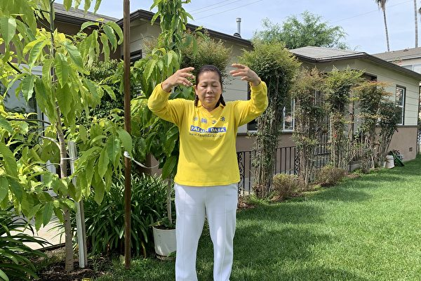

周美丽在自家院中炼法轮功第二套功法。（姜琳达／大纪元）

【大纪元2020年05月05日讯】（大纪元记者姜琳达洛杉矶报导）她——是来自台湾的名门望族后代，却为母则刚，独自在异国他乡为孩子们撑起一片天；她——是别人眼中叱咤风云的女强人，却因一个心愿，坦然放弃自己一手打下的江山。

时隔多年，当培名学院（Premier Academy）的前校长周美丽回顾起自己当时惊人的决定时，她坚定而感恩地说了一句：“无悔，因为我现在是在为自己而活。”

正在阅读法轮功主要著作《转法轮》的周美丽。（姜琳达／大纪元）

一如其名，周美丽有着让人羡慕的身世背景。她来自台湾的大家族，是北宋五子之一、宋朝儒家理学思想开山鼻祖周敦颐的后代。身为家中最小的孩子，她自小也是备受8个哥哥姐姐的眷顾。然而12岁那年母亲的猝然离世，让她深受打击。

“我的母亲，我没有办法留住她。到时候她就离开这个世界，那是不是哪天我也要离开这个世界，我去哪里呢？我就一直有个很大的疑问在心中：人为什么来在这个世上？又为什么要走？这是无解的。我的内心很孤单。我看了很多书，甚至找了很多佛学的书，都没有找到答案。”

但较真的周美丽没有就此放弃，既然台湾找不到，她就萌生了到世界各地寻找的念头。因此在完成学业后，在一次偶然的机会下，她就到了一间航空公司应聘。

1981年，风华正茂的周美丽由于英文流利、身体条件好，从五六百名竞争者中脱颖而出，被选为韩国航空公司几乎是“百里挑一”的空姐。

“一次在飞机上，有个韩国和尚突然走过来问我，‘你知道你从哪里来吗？’当下我竟脱口而出的是：‘我不知道我从哪里来，但我很想回去我来的地方。’和尚听后笑笑的就走了。”就这样一段看似突兀的对话，让周美丽记忆深刻，也让她心中的疑惑变得越来越大。

<b>婚变后独自扛下生活重担</b>

1984年，周美丽与当时在外交部工作的先生移民美国，落脚洛杉矶，并在8年的时间里，生下两儿、两女。

可相夫教子的幸福婚姻，并没有落在周美丽的身上。相反就在她的小女儿出生不久，她的先生就突然说要到中国大陆发展，自此失联半年时间。回来后不久就离开了，又是了无音讯的一年，一天她先生回来了，但带回来的竟是一份离婚协议书，周美丽说：“我当时就签字了，没有一点品质的婚姻，就离了吧。”而那时，她最大的儿子才9岁，小女儿只有2岁。

面对婚姻突变的苦，周美丽并没有被拖垮，她毅然扛下独自扶养4个孩子的重担，于同年（1995年）开始创办课后辅导学校。

回忆起创业时“公私两忙”的那段历程，周美丽说真的是分秒必争。“那时的日子真的叫一个艰苦。如果谁愿意做我，别说两个月，两个礼拜就好，都会逃之夭夭。”

“因为我必须操办4个孩子的一切，例如在美国，孩子上学，都有一个First Day Package，很厚的，我每次碰到，4个孩子的我就要写4份，从晚上一直写到天亮。”

这还不算什么，由于那时学校刚刚起步，距离家又有近一个小时的车程，要来回奔波，周美丽说，“一进到办公室，老师、家长、学生都会蜂拥而来。”那时候一周工作六整天，“剩下的一天我除了打扫家里，就是要去采购。所以我从来不觉得采购是很好玩、很享受的事情，这么多年来，我看到什么抓起来就走。”

可这些苦，要强的周美丽并没有跟台湾的家人诉说。“慢慢的我已经不觉得辛苦了，就是忙。我一定要把孩子带好，让他们接受好的教育。那是我的责任。”

在日复一日的紧綳和忙碌中，她已经渐渐忘却了正常的生活是什么样，好像只是为了责任而活。“我也会自己给自己抱怨，我怎么就没有自己的时间呢？只是偶然间，我还会回想起自己从小的疑惑时，会更加迷茫，人为什么来在世上？”
名利双收 却难掩心中的失落

虽然心中有遗憾，但日子还是一天天的过，就在周美丽的用心经营下，她的补习学校规模逐步扩大，从一所学校发展到三所。成就了许多进入哈佛、麻省理工、普林斯顿、耶鲁、斯坦福等名校的学子。

她说：“连续许多年，我们95%的学生被UC系统大学录取。”“还有几乎你所有知道的，在美国Top 20的大学，每年都有好几位学生进去。”

由于学生太多，她请了七个助理，几十位名校毕业的老师，那时候一提起“培名学院”，在南加家长圈中相当知名，极具口碑。可名利双收的成功，并没有让周美丽因此感到快乐，长期劳累工作也让她身体不堪负荷。

“在美国的生活，我没有时间照顾自己，都没有机会坐月子。我的身体因为太忙碌，不能说垮掉，可是只要我一超时工作，我的腰就很难受，就一定要逼我停下来，躺下来休息2、3个小时才可以恢复，但总是这样反复。但我又不得不这样拼，因为这是我的责任。”

<b>不惑之年终于找到答案</b>

直到2004年暑假，周美丽自1998年就开始修炼法轮大法的二哥，亲自从台湾飞到美国，只为了让妹妹能好好阅读法轮大法主要著作《转法轮》一书。

“我二哥是家中唯一会与我探讨人生深奥问题的。他1998年起就托我二姐给我送来了《转法轮》，当时觉得很好，可没有时间，我只是简单翻看。这次我听他的建议，真的认真地读了一遍《转法轮》。”

虽然当时暑假学校学生非常多，忙得脚都不着地了，但晚上回家，她仍坚持拜读《转法轮》。没想到认真读完一遍后，她感到豁然开朗，几十年困惑自己的答案，都在《转法轮》中得到了解答。

“生活是非常苦的，但学了法，有时吃点苦我也不再是以前那种默默忍受的委屈心态。我明白了人都有业力，如果吃了苦，消了业力，智慧就长上来了。我觉得我正走在这个路上啊。”

周美丽说，“师父有很多经书，内容非常深奥，看后好像一直在更新自己，容量也在扩大，智慧也在提升。我真的觉得自己很幸运，有的时候还会躲在被窝里偷偷笑。”她说，自己漂浮了几十年的心终究安定了下来。

<b>心态的转变 体验大自在</b>

自从修炼后，周美丽通过学法炼功，发现一直困扰自己的腰疼问题不见了，身体恢复了健康。而在工作中，她也以“真、善、忍”的原则为人处世。她说：“我不会用分数来压制孩子的成长，也不会因为你（家长）给我多少学费，我就给你孩子多少付出，不是这样的，我会尽全力付出。除了分数，还要教导孩子怎么做人。”

每到中国的传统节日以及美国的国庆、圣诞节、感恩节等节日时，她还会亲自将学校整个环境都布置、装饰得很漂亮，教孩子们认识传统文化和历史。

也正因为周美丽用足够的善心和耐心，让很多孩子都愿意与她说出心里话，听她的建议。例如一位学生曾与她抱怨自己的AP 老师待她不公，不分青红皂白给她0分，关系闹得很僵。

“修炼后，我不是一味地站在学生的角度，帮着学生去指责老师的无理。完全替学生和老师着想。我就劝她好好跟老师说明原因，跟老师道歉。她听了我的话。”她说，结果后来“老师发现这个孩子怎么有这么高的素质，给她写了一份非常好的推荐信，申请私立大学都需要推荐信。最后这个学生考进了麻省理工学院。”

还有一位学生，原本在学校里不是特别的出色，“愿意听我的建议，修了很多AP课程，最后进了哈佛。”作为教育者，让周美丽最欣慰的是，每当节假日时，都有大批考入各个大学的学生开心地回来探望她。

“我把师父教的‘真、善、忍’，教给学生们，家长也赞同。我们很重视学生的谦逊、忍让，所以在我的学校，也没有太大的冲突或矛盾，打架的孩子没有。”

又或者因为学校越来越出名，学生越来越多，也会有人眼红妒嫉她。但每当听到什么突如其来的挖苦，她说自己心里都很平淡，微笑对人，也不会去计较，事情就过去了。

<b>修炼后心态转变 工作轻松</b>

一人分饰多个角色，周美丽成为学生们敬仰的知心“朋友”、家长信任佩服的校长、儿女心中开明了不起的母亲。而修炼后心态转变的她，也可以没有牵挂地驾驭忙碌工作，不被别的东西所击败。她感到以往的一切苦都像是过往烟云，释怀后，整个人都轻松了，真的是大自在的感觉。

回忆起当初事业、家庭两头忙的那段时间，周美丽说，她仍十分注重教导自己的孩子明白什么是对与错，善与恶，毫不含糊。

她说：“4个孩子的学习也都非常好，这点倒是让我很安慰，没有让我操心。我也没有苛求他们一定要上什么名校，按照自己的兴趣。他们也觉得妈妈很民主。”

辛勤的付出总是有回报，她的大儿子获UC Irvine全额奖学金，攻下双学位，现已成家立业，有着很好的工作；二女儿设计学院毕业后，曾在迪士尼、Sanrio工作多年，也有了美满的家庭。小儿子和小女儿也都已大学毕业，有了很好的工作。

2009年，周美丽决定将一手经营起来的三所学校卖掉。“当自己的半生都在为别人、为责任而活时，在看到孩子们都陆续大学毕业了后，我就想，应该是时候放手了，去做我想做的事情。我的孩子也很尊重我的想法，他们也觉得妈妈辛苦了这么多年了，也会问我还要继续工作吗？对我来说，人生要往哪里去是最重要的。”

<b>分享修炼的美好</b>

周美丽说，自己之前的人生就是每天重复着、围着工作转，从没有为自己活过，如果一直那样下去，才会留下遗憾。2013年，她将三所学校全都转让出去后，就开始过起了退休生活。不过她的退休生活并不是游山玩水、栽花种草，而是走上好莱坞街头、到机场去讲真相。

周美丽好莱坞讲真相。（本人提供）

法轮功自1992年在中国传出后，短短七年里修炼者达上亿人，“真、善、忍”根植于人们心中。然而1999年，中共江泽民集团出于嫉妒，对法轮功发动了灭绝人性的迫害。数以万计的法轮功学员被抓、被酷刑折磨，甚至被迫害致死。

“师父和大法蒙冤，在中国发生的自焚伪案，对信仰‘真、善、忍’的人的打压，我一定要讲清楚。”“ 其实中国人都被中共一言堂的谎言误导得很厉害，黑白颠倒，善恶不分，这样很危险的。”周美丽说，“我就觉得迫害真的断了人修炼的路了，是很可悲的。”

所以，讲真相过程中即便有时候受了冷眼对待，她依然坚持。“就像我师父说的，每个人都是非常珍贵的。有可能现在对我们有所误解，但我还是想把美好告诉他们。”“因为我在大法中非常受益，人都有这种同理心，当你发现美好的事物，都想分享给亲朋好友。我也希望别人有这个机会来了解法轮大法，能够找到回家的路，这是最重要的。”

周美丽好莱坞讲真相。（本人提供）

<b>表达对师父的无限感恩</b>

每年的5月13日，世界各地的法轮功学员都会庆祝“世界法轮大法日”，各国政要也都会发来贺词、感谢信、褒奖令或决议案，与法轮功学员共同庆祝。

周美丽说：“今年的世界法轮大法日，也是师父69岁华诞。在这个感恩的日子，真的非常感谢师父一路的带领，一路的熔炼。得法不容易，修炼也不容易，因为有师父的守护、呵护，一路走来虽然磕磕绊绊，但我心里充满了感恩，无限的感恩。”

她说自己现在每天都活在感激中，“就是觉得自己很幸运，虽然在人生中吃了一点小苦，但是我觉得终于找到了我人生要找的答案，真的不容易。我记得我得法的时候，我都46岁了，所以很珍惜”。◇#

<a target="_blank" href=#top><h6 align="right">回上方</h6></a>
  
  
<a name=43>
<h1 align="center"><b>【独家】早知疫情？中共频下生物安全通知</b></h1>

近日，大纪元获得多份中共内部文件显示，中共在1月20日承认疫情“人传人”之前，就已频频下发生物安全相关通知，引发中共故意隐瞒疫情的质疑。（大纪元）

【大纪元2020年05月02日讯】（大纪元记者古清儿报导）中共病毒（武汉肺炎）疫情已经蔓延全球给世界带来巨大灾难。近日，大纪元获得多份中共内部文件显示，中共在1月20日承认疫情“人传人”之前，就已频频下发生物安全相关通知，引发中共故意隐瞒疫情的质疑。

<b>独家：公布疫情人传人之前 北京频下生物安全通知</b>

1月20日，中共专家钟南山出面承认武汉肺炎“人传人”。但有证据显示，1月20日之前的一段时间内，中共已经下发了一系列与生物安全相关的通知，被质疑已知道疫情会“人传人”。

早在1月3日，中共国家卫生健康委员会办公厅下发了“不予公开”的《国家卫生健康委办公厅关于在重大突发传染病防控工作中加强生物样本资源及相关科研活动管理工作的通知》。

这个通知内，已经定义了“生物样本”为：病人和疑似病人及其密切接触者的血液、咽拭子、痰液、气管吸取液或支气管灌洗液、尿液、粪便等等。同时要求任何机构和个人不得擅自对外发布有关病原检测及实验活动结果等信息。

（大纪元）

  

美联社获得的中共政府内部文件显示，中共国家卫健委主任马晓伟在1月14日与省级卫生官员进行了秘密视频会议，评估疫情。根据一份相关备忘录显示，会上谈到“病例成群的出现”，显示人传人的情况可能存在，并称“（当下）传染病的情况仍然复杂严峻，是自2003年非典疫情以来最大的挑战”。

大纪元独家获得了自1月14日起，1月20日之前，北京下发的多份有关实验室生物安全的通知。

1月14日，北京市昌平区卫健委下发了“不予公开”的《关于开展病原微生物实验室生物安全专项监督检查工作的通知》。通知要求，要做好对病例生物样本资源采集、运输、使用及科研活动管理等工作。通知称，1月15日至16日，对辖区内一级、二级及三级生物安全实验室开展自查，区、市级卫健委监督检查。

（大纪元）

另一份《昌平区病原微生物实验室生物安全监督检查表》的内部文件显示，相关单位对病毒的接收、储藏都明确了一套程序。

该检查表内容显示，有菌（毒）种和样本的管理制度，至少包括接收、使用、处置（贮存、销毁和转运）等重要内容；包括自查与监查形式、频次、主要项目、责任人等重要内容。

（大纪元）

1月16日，北京市医院管理中心科研学科教育处下发了《关于开展市属医院实验室生物安全互查工作的紧急通知》。该通知显示，北京市医院管理中心突然定于1月17至21日对市属22家医院实验室组织生物安全互查工作。

（大纪元）

1月16日，北京市卫健委科技教育处下发了《北京市卫生健康委员会关于举办实验室生物安全培训的通知》。

（大纪元）

1月16日，中共国家卫生健康委办公厅下发了《国家卫生健康委办公厅关于印发新型冠状病毒实验室生物安全指南的通知》。该通知标明“特急”、“不予公开”，还强调了“供内部工作使用，不得在互联网传播”。

通知还对如何使用病毒培养物提取核酸、动物感染实验、未经培养的感染性材料的操作等，均做出细致的规定。

（大纪元）

时政评论员李林一表示，从这些内部文件看到，尤其是北京大医院都开展这类自查、互查，说明中共知道这个病毒大流行可能不可避免，也说明中共知道这个病毒的传染性，所以要加强各大医院在核酸检测过程中的安全防护。但是这些通知都是内部下发的，换句话说，中共仍然在对民众隐瞒疫情。

<b>中共相关通知更早的可以追溯到去年年底</b>

其实，根据中共医学专家的论文，最早的武汉肺炎确诊病例可以追溯到2019年12月1日。

而内蒙古在去年底就下发过类似的生物安全通知。

大纪元独家获得的内蒙古卫健委去年12月31日下发的《内蒙古自治区卫生健康委员会办公室关于切实加强人间传染的病原微生物实验室生物安全管理工作的紧急通知》的文件，当时该通知标明“特急”。

通知提到，各级卫生健康行政部门及相关单位要切实提高“政治站位”。各级卫生健康行政部门要做好隐患排查、督促整改等工作，对可能发生的突发事件，做到及早发现、立即核实、迅速报告、妥善处置。

通知称，各盟市卫生健康委要重点加强辖区内一、二级病原微生物实验室备案工作，定期组织对已备案的生物安全实验室进行系统梳理，重点清理不符合备案要求、非实验场地扩大备案、扩大范围开展实验活动等问题。

<b>中共对外隐瞒疫情</b>

由上述文件可知，去年12月初中共肺炎疫情爆发，中共内部早知此次疫情的严重性。但中共官方在12月底到1月20日之前仍宣称，“未发现明显人传人证据”、“疫情可防可控”。

中共国家卫健委1月14日开了秘密会议，向省级官员警告疫情可能大爆发，但它向公众隐瞒不报。

1月29日，中国疾控中心、湖北省疾控中心、香港大学等合作完成的论文发表在《新英格兰医学杂志》。论文披露，早至2019年12月中旬，中共病毒在密切接触者之间已发生人际传播，也就是所谓的“人传人”。此外在2020年1月11日前，有7例武汉医护人员感染发病；1月11日～1月22日又有8位医务人员感染发病。

但武汉卫健委的通报曾在2019年12月31日、2020年1月5日和1月11日三次称“调查未发现明显人传人现象”；在2020年1月5日和1月11日两次称“未发现医务人员感染，未发现明确的人传人证据”。

早至2019年12月中旬，中共病毒在密切接触者之间已发生人际传播，也就是所谓的“人传人”。（网络截图）

1月15日凌晨，武汉卫健委继续称目前肺炎疫情尚未发现明确“人传人”证据，不能排除有限人传人的可能，但持续人传人的风险较低。

直至1月20日，中共利用工程院院士钟南山在央视首次披露中共肺炎会“人传人”，但此时疫情已完全失控，并造成病毒向世界扩散。

<b>中共将生物安全法提高到“国家安全”级别的背后</b>

就在中共隐瞒疫情导致失控的时候，中共当局大幅修改《生物安全法草案》，并将该法案提高到“国家安全”级别。

4月26日至29日，在北京举行的中共全国人大常委会会议上，讨论《生物安全法草案》等。

2月14日，习近平主持中共中央“深改”会议时，更连提五次“生物安全”，并要求“把生物安全纳入国家安全体系，尽快推动出台《生物安全法》”。

李林一认为，一旦《生物安全法》出台，中共就更有理由隐瞒疫情，因为这属于“党的机密”。

<b>国际启动追查</b>

尽管中共官方现在不承认中共病毒起源于武汉，但美国情报界正在研究武汉P4实验室与这个病毒的关系，同时也在调查中共对外隐瞒疫情的责任。

福克斯新闻4月17日报导，多个消息人士说，美国情报人员已启动调查，搜集武汉市一个实验室和中共病毒（武汉肺炎）爆发的信息，情报分析师正在整理目前所知道时间轴中的事件，以“准确地拼凑所发生的事”。

就在世界各国对中共隐瞒疫情追责时，美国总统川普4月30日对媒体表示，他亲眼看过病毒与武汉实验室之间相关的证据，但不愿透露详情。◇

<a target="_blank" href=#top><h6 align="right">回上方</h6></a>
  
  
<a name=42>
<h1 align="center"><b>调查世卫和中共关系 川普手握一张王牌</b></h1>

世界卫生组织（WHO）图标( Getty Images)

【大纪元2020年05月03日讯】（大纪元记者李辰综合报导）美国总统川普下令调查中共和世界卫生组织（WHO）之间关系，调查两者是否掩盖了中共病毒（武汉肺炎，COVID-19）在初期爆发的疫情。澳大利亚、瑞典等国也纷纷表态支持、加入这一行动。

截至5月2日，全球确诊感染病毒人数逾340万，病亡人数逾24万人；美国确诊人数逾115万，死亡人数近7万。

英国保守党人权委员会的联合创始人兼副主席本尼迪克特‧罗杰斯（Benedict Rogers）表示，国际社会要对中共追责，就不能忽视中共的另一罪责。

罗杰斯近日在网站UCANEWS发表文章提出：“如果人们要使中共对其在瘟疫大流行中的（掩盖行为）承担责任，就不应该忽视另一个与医疗相关的暴行，那就是（中共）从良心犯身上摘取器官的报导。”

加拿大著名人权律师大卫·麦塔斯表示，中共强摘器官是“这个星球上从未有过的邪恶”。北美明慧网评论认为，活摘人体器官是中共的死穴。

外界注意到，包括世界卫生组织（WHO）总干事谭德塞在内的多位负责人，屡屡在此敏感议题上公开为中共站台。大纪元评论员乔松评论说，如果川普政府调查中共强摘器官，这很可能将成为调查世卫和中共之间关系的一张王牌。

中共病毒爆发后，世卫组织受到各国指责。特别是谭德塞，多次为中共背书，被指误导世界。图为谭德塞和中共外交部长王毅。（大纪元合成）

<b>中共活摘器官 世卫多次助其洗白</b>
   
   

第26届国际器官移植协会（TTS）大会于2016年8月18日至23日在香港会展中心举行。（Bill Cox／大纪元）

2016年香港器官移植大会期间，时任国际器官移植协会主席奥康纳（Philip J. O’Connell）向媒体否认，中国的器官移植获得了国际器官移植协会的认可。

奥康纳表示，他告诉大陆医生：“重要的是你们要明白，中国大陆过去的一贯做法，在国际社会是骇人听闻的。”“正是因为中国大陆移植中心的这些做法，令针对中国政府的强烈反对声音高涨。”

奥康纳向记者表示，没有人能够把他对中国代表所讲的话，解读为TTS已经真正认可了中国的器官移植系统。“他们可以自说自话，但那不是真相。”

然而，在国际社会纷纷谴责中共强摘人体器官的背景之下，世界卫生组织多次为中共站台。

2016年8月22日，中共器官移植领域的发言人、中共卫生部原副部长黄洁夫在香港器官移植大会上就器官移植为主题发表演讲。

在此会议上，世界卫生组织（WHO）器官移植项目负责人何塞·努涅斯，为中共活摘器官漂白，声称中国（中共）将成为全球器官移植领域的领袖。

2018年5月24日，世界卫生大会期间，日内瓦万国宫举行了一次所谓的器官移植边会（即非主场会议）。

在这个边会上，黄洁夫做题为“实现‘一带一路’倡议的中国器官移植事业”的发言。

中共官媒新华网报导，世卫组织总干事谭德塞在会后交流时，用中文对黄洁夫说“谢谢中国”；世卫组织总部服务提供和安全司司长爱德华·凯利会后接受采访时声称，中国（中共）是器官移植领域的全球典范。

2019年12月7日，中国器官捐献与移植发展研讨会在云南昆明举行。

陆媒报导，世界卫生组织的器官移植项目主任何塞·努涅斯发言声称，“中国经验可以作为整个亚洲地区乃至全球的示范。”

世界卫生组织的器官移植特别工作委员会主席弗朗西斯·德尔莫尼科（Francis L. Delmonico）在会上声称，“中国确实是做得非常好。”“器官移植中国经验的最大特点是中国政府（中共）的强力支持，是许多国家应该参照的典范。”

世界卫生组织的器官移植特别工作委员会，是在中共的提议下成立的。作为该机构的主席，德尔莫尼科则提议：黄洁夫担任委员会名誉主席。

弗朗西斯·德尔莫尼科本人，2016年出席美国国会听证时，承认他去中国的旅行费用是由一个基金会资助的。德尔莫尼科所指的基金会是指中国器官移植发展基金会。该基金会的主管部门为中共国家卫生和计划生育委员会 。中共前卫生部副部长黄洁夫担任其理事长和法人代表。

弗朗西斯·德尔莫尼科（Francis L. Delmonico）2016年在美国国会听证会上。（李莎/大纪元）

<b>最新文件再曝活摘器官罪恶</b>

蔓延到全球的中共病毒疫情首先在武汉爆发，使得武汉成为世界焦点。大纪元近期获得武汉医院内部文件，显示武汉一直高度涉入中共的活摘器官罪恶。

中共卫生部原副部长黄洁夫曾称，“没有湖北、没有武汉，就没有中国的器官移植。”武汉同济医院的肾移植数量是中国第一，心脏移植数量是中国第三，肝移植数量是中国第五。

大纪元获得的武汉同济医院内部文件显示，该医院DCD（心死亡器官捐献）肾移植例数在2015年、2016年、2017年连续3年全国第一。

另一个内部文件显示，同济医院的肾移植数量惊人，在2016年成为中国首家肾移植案例累计数突破6,000例的移植中心。

移植数量巨大不禁让人产生一个疑问：移植所需的大量器官，来自哪里？

2015年10月，“追查国际”调查员对同济医院心胸外科的宫医生，进行了电话调查。宫医生承认用过法轮功学员的器官做移植，到监狱、到劳教所取器官，“我们有一个专门的，我们科魏主任，有一个专门的搞这个，以朱教授为首的，知道吧。这都是朱教授在负责。”

宫医生还披露，心脏移植有时候一个星期做五台手术，甚至一晚上做两台。

“追查国际”负责人汪志远接受大纪元采访时表示，“在我们的调查中，同济医院的医生护士就明确地承认他们用法轮功学员器官，我们有录音证据证明。”

法轮功是以“真、善、忍”为指导原则的性命双修功法，1992年在中国长春传出，广受欢迎。官方统计数字显示，法轮功学员超过了共产党党员人数。1999年7月20日，江泽民下令对其发动灭绝性的迫害。

全面镇压后，法轮功学员到北京上访2000年是高峰期。当时有上百万法轮功学员上访，其中很多再也没有回来，家人再也没有了他们的消息。

2000年，中国器官移植数量激增，这个时间点和中共迫害法轮功的时间点有契合之处。

大陆中山医院副院长何晓顺在接受《南方周末》记者采访时表示，“2000年是中国器官移植的分水岭。2000年全国的肝移植比1999年翻了十倍，2005年又翻了三倍。”

疫情之下，大陆近期接连传出为中共病毒患者做双肺移植，再次引发外界担忧其器官来自何方。

<b>中共肺炎患者接连双肺移植 引发担忧</b>

2020年2月29日，中国江苏无锡市一家医院对一名59岁的男性中共肺炎（武汉肺炎）重症患者，进行了双肺移植手术。病患在该医院的手术等待时间仅为五天；主刀医生陈静瑜。

一天之后的3月1日，中国浙江一家医院对一名女性中共肺炎患者，进行双肺移植手术。主刀医生韩威力。

3月10日，陈静瑜再次主刀，对一名73岁的男性中共肺炎患者，施行双肺移植手术。手术等待时间不到五天。

华府“共产主义受难者基金会（VOC）”3月10日在美国国会山发布一份最新中共强摘人体器官研究报告。终止中国滥用移植国际联盟（ETAC）执行主任休斯（Susie Hughes），受邀参加了这一活动。她表示，近日，中共肺炎患者接连快速双肺移植，令人担忧其器官来源。

终止中共移植滥用国际联盟执行主任苏西·休斯（Susie Hughes）。（Samira Bouaou／大纪元）

休斯在发言中说，“最近发生在中国的双肺移植，令人担忧；重要的是，如此快速获得这些肺，并且是完美的（器官）匹配。”

“这是令人忧心的，尤其是所有的证据（显示）——在中国发生了强摘人体器官（的罪行），而（中国的）器官捐献率非常低。”

“他们如何能够使用肺移植来治疗中共肺炎？”

“你马上会想到，他们从哪里获得的器官？这个时机非常令人关注。”

“我认为，（中共肺炎疫情下，）肺移植的发生是中国器官移植系统不透明的另一个例证……是一个警钟。（中共）没有明确的迹象显示，这些器官来自何处。”

休斯引用2019年6月英国独立人民法庭就中共强摘人体器官的指控所做出的判决说，“人民法庭做出的结论包括：大规模强摘人体器官，在中国已经存在多年；法轮功学员是一个，并可能是主要的器官来源。”

<b>英国独立人民法庭：中共持续强摘良心犯器官</b>

英国独立人民法庭由英国御用大律师尼斯爵士（Sir Geoffrey Nice QC）主持，他曾主导国际刑事法庭对前南斯拉夫总统米洛舍维奇（Slobodan Milosevic）的起诉。

这个独立法庭由来自不同司法管辖区的七名成员组成小组，其中包括四名经验丰富的律师、一位著名的医学专家、一位学者和一名商人。此前，他们没有参与过有关强摘器官的事宜，只有一名中国问题专家，所以没人可以指责他们是竞选活动家，激进主义者或是诋毁中国的人。

2018年12月，人民法庭发布了一项临时判决，根据他们收到的证据，他们“肯定地、一致地、毫无疑问地证明在中国，强摘良心犯器官的做法已持续很长时间，涉及大量受害者”。

在发布临时判决时，独立人民法庭给予中共政府提起诉讼的机会，请他们提出相反的证据，但该邀请以及其它五项要求北京进行调查的请求，都没有得到任何回应。

英国独立“人民法庭”于6月17日在伦敦宣判结果，判定中国（中共）活摘良心犯器官的行为仍然存在，法轮功学员是器官供应的最主要来源。（冠奇／大纪元）

2019年6月，独立人民法庭发布最后判决，判决书重申了中共犯下强摘器官罪行结论，“构成反人类罪”。判决认为，那些与中国共产党政权打交道的人，必须知道他们是在“与一个犯罪国家互动”。

判决书还引用了秘密调查电话的内容，指出中共前总书记江泽民发布了书面命令，专门从法轮大法修炼者身上摘取器官，在电话中，中国领先的器官移植医院的医生近乎承认法轮功学员的器官可用。

<b>呼吁美国调查中共强摘器官</b>

美国国务院多次在其年度国别人权报告中，引述第三方报吿，指中共大规模强摘良心犯器官，不过，尚未宣布开启正式调查。

终止中国滥用移植国际联盟（ETAC）执行主任休斯（Susie Hughes）表示，虽然美国国会通过了343号决议案，欧盟也通过类似的议案要求制止中共强摘器官的行径，但是她认为，“在制止（中共）强摘器官方面，人们显然还没有采取足够的行动。”

她提出两点建议：

一、建议美国立法，禁止器官移植旅游。

二、建议成立调查委员会，对中共强摘器官行径进行调查。

针对英国独立人民法庭的判决，美国“应对中共当前危险委员会” （Committee on the Present Danger: China）的副主席盖夫尼（Frank Gaffney）在接受采访时也建议，美国政府应对中共强摘法轮功学员等良心犯器官的行径展开正式的官方调查。

盖夫尼说， “我想，针对（中共）这一令人难以置信的野蛮的强摘器官的行径，现在正是美国政府正式和官方展开调查的时候。 ”

<a target="_blank" href=#top><h6 align="right">回上方</h6></a>
  
  
<a name=41>
<h1 align="center"><b>世界新闻日 中共打压新闻自由殃及全球生命</b></h1>

各国2020年新闻自由指数（2020 Press Freedom Index）颜色呈现。其中中国以褚红色显示其新闻自由为全球最差。（NordNordWest／维基百科）

【大纪元2020年05月03日讯】（大纪元记者张顿综合报导）今年的世界新闻自由日，正值中共病毒（武汉肺炎，新冠病毒）在全球肆虐。国际社会已普遍意识到，中共打压新闻自由并不是中共的内政问题，它会殃及全球的生命安全及财产损失。

<b>世界新闻自由日 三名中国人获言论自由奖</b>

5月3日是世界新闻自由日。今年的世界新闻自由日到来之时，正是中共病毒从中国传播到世界各地的时候，而今年世界新闻自由日的主题正是“无畏无私的新闻”。

5月3日，德国之声给来自14个国家的17名记者颁发了“言论自由奖”，表彰他们为捍卫人权和言论自由而做出的杰出贡献。17名记者都因为报导疫情而被消失、被逮捕或者遭到威胁，其中包括三名中国的公民记者陈秋实、方斌、李泽华。

中共病毒去年12月1日在武汉爆发后，中共当局一直隐瞒疫情，抓捕了李文亮等8名传播疫情真相的医生，同时宣称“可防可控”、没有“人传人”等虚假信息。

当疫情泛滥后，中共当局1月23日对武汉封城后，中共官媒又被当局封口、统一口径，但三名公民记者陈秋实、方斌、李泽华因为探访了武汉多家医院、殡仪馆、居民小区，采访市民的心声，用镜头记录当地悲惨实况，而先后被抓捕。

<b>“所有形式的审查都可能导致生命代价”</b>

德国之声台长林堡（Peter Limbourg）在柏林公布获奖者名单时说：“在全球遭遇健康危机的时刻，新闻媒体具有关键作用，每一名记者都肩负重大责任。”

“各国公民有权获得具有事实依据的信息以及关键情报。所有形式的审查都可能导致生命代价！将涉及当前形势的报导定性为犯罪，明显是伤害言论自由的行为。”林堡说。

联合国人权事务专员巴切莱特（Michelle Bachelet）在致获奖者的视频中表示，记者因为报导疫情而遭到攻击、威胁、逮捕，并以虚假罪行遭到起诉，甚至“被消失”，这令人震惊。

<b>欧盟暗批中共以疫情为借口 限制新闻自由</b>

5月2日，欧盟外交与安全政策高级代表博雷尔（Josep Borrell）以欧盟27国的名义发表声明说：“令人担忧的是，一些国家以新冠疫情为借口，对新闻自由进行非法限制。”

博雷尔指，这场危机表明新闻工作者的工作是多么重要。在不确定的时期，可靠且经过事实检验以及不会产生不当影响的信息是不可或缺。

博雷尔说：“不可以干扰记者的工作。” 新闻自由是民主社会的基石。

<b>美国国会及行政当局关注中国新闻自由</b>

5月1日，美国国会及行政当局中国委员会（CECC）两位主席、众议员詹姆斯·麦高文和参议员马可·鲁比奥，致信总统川普（特朗普），表达对中共政府在新闻自由和言论自由上“日益严厉”限制的关注，要求释放被不公正监禁的新闻工作者、博客作者和言论自由倡导者。

信件指，5月3日是世界新闻自由日，被中共当局拘留的新闻记者和博客作者，比世界任何地方都多。这些人包括伊力哈木·土赫提，黄琦，吕耿松，古丽米拉·伊明和桂民海等人。

他们要求川普总统向习近平提出以上个案，并指出，更多的人因为中共政府违反保障言论自由和保障新闻自由的国际人权准则，而受到拘押。

他们还要求川普总统继续利用一切外交手段，使今年3月17日被中共驱逐出境的《纽约时报》、《华尔街日报》和《华盛顿邮报》的记者复任。

他们敦促总统，让未经审查的新闻和信息自由流通，成为“中美关系向前发展的先决条件”，因为“新闻自由，无论是印刷还是在线新闻，在制止全球流行病、禁止强迫劳动生产的商品进入美国市场、并为投资者和企业提供可靠的经济数据方面，都不可或缺。”

<b>中共打压新闻自由 令全球遭殃</b>

国际社会已经意识到，自新疫情爆发以来，中共政府高压打压吹哨者、严格控制新闻及言论自由，在中共官媒一言堂的报导下，疯狂传播的疫情真相被严重掩盖、扭曲，致使国际社会疏于防范，从而导致病毒在全球泛滥。

截至5月3日，全球已有逾344.5万人感染，逾24.5万人死亡，这还不包括中共、伊朗等专制国家隐瞒疫情的数字。

美国之音报导指，中共压制国内言论，惩罚吹哨者，致使疫情扩散至世界各地，这个影响代表的是更多的人染病隔离，更多的生命因病死亡，全球的经济，工作与生活蒙受更大的损失。“失去新闻与言论自由的影响有多大？”

无国界记者组织东亚办事处执行长艾玮昂（Cédric Alviani）说，这次疫情显示出，中共打压新闻及言论自由，已经不单是中国国内的问题。

“在这次大流行病之后，世界上没有人能说中国的新闻及言论审查影响的只是中国人民，世界上任何威权国家新闻及言论的审查问题，甚至是地球上任何民主体制内的审查制度都会变成全球问题，成为国际社会必须一起处理的问题。” 艾玮昂说。

报导援引人权人士的话指，如果这次疫情让世界汲取了一些经验教训，其中一课应该是牺牲新闻及言论自由，将会付出更惨痛的生命、生活与经济代价。

<a target="_blank" href=#top><h6 align="right">回上方</h6></a>
  
  
<a name=40>
<h1 align="center"><b>大陆上市公司首季利润减53% 经济陷恶性循环</b></h1>

大陆沪深两市上市公司第一季度净利润同比减少53%，70%企业亏损或利润下滑。(Peter PARKS/AFP)

【大纪元2020年05月05日讯】（大纪元记者张玉洁综合报导）大陆沪深两市上市公司2020年第一季度净利润同比减少53%，70%企业亏损或利润下滑。中共肺炎疫情导致企业和个人财务受困，内需大幅下滑，整体经济正陷入恶性循环之中。

日经中文网5月4日报导，4月末前发布一季度业绩的沪深两市上市企业有3725家，涉及石油、汽车、航空、零售等多行业。

以汽车企业为例，大陆最大汽车企业上海汽车集团一季度的销量同比下滑56%。该公司3月中旬在旗下部分子公司实施了减薪，但未能挽回销量下滑的趋势，净利润同比大减86%。

中型车企，包括汽车零部件在内的汽车领域企业，大约180家中有超过八成的企业利润下降。

另外，包括零售业在内的商业与贸易行业企业有超过7成利润下滑，家电行业企业近5成利润减少。

另据中共交通部的数据，铁路和高速公路、航空等旅客流量同比去年减少近六成。4月份以来，疫情对经济的影响依然存在。

台湾科技新报5月4日报导，中共肺炎疫情正令大陆经济陷入恶性循环——企业停工，复工后运营不佳，就业人员工资下降或失业，内需外需不足。

中国褐皮书近日发布报告表示，在接受调查的500多家大陆公司中，91%已在4月下旬重新开业，但只有42%的产能达到一半以上。大陆企业对商品和服务的需求直线下降，外国订单的减少速度是大陆订单的两倍以上。

接受调查的公司有81%经营者担心未来3个月内疫情加剧；69%对未来不乐观，表示4月缓慢复苏的经济活动可能是接下来几个月中表现最好的了。

很多受访者表示，由于经济不景气，他们仍然担心工作安全和潜在减薪。目前大陆的零售额每月都在下降，住宿、文化、体育和娱乐以及居民服务业的活动仍在萎缩。

麦肯锡（McKinsey）最近的一项调查显示，大陆20%至30%的受访者表示将继续保持谨慎态度，减少消费。

香港《经济日报》5月4日引述经济学人智库（EIU）预测，直到2021年大陆的消费都难以恢复增长。瑞银集团预计，线上支出增长不足以抵消线下消费的下滑。

一位上海投资基金的工作人员表示，原本计划要在今年换车，但现在已经改变主意，“当你不断听闻从经济到股市的负面消息，很难再升起消费冲动，握有现金让我感觉更安全。”

另一位上海市民也改变了支出优先次序。她任职的教育初创公司2月份关门，因此失去了一半收入。她说：“这场疫情迫使我去思考，什么对生活来说真正重要，拥有LV包不能保护你免于病毒感染。”

<a target="_blank" href=#top><h6 align="right">回上方</h6></a>
  
  
<a name=39>
<h1 align="center"><b>中共内部报告称面临六四后最恶劣国际形势</b></h1>

1989年6月2日，北京，学生聚集在天安门前广场。(CATHERINE HENRIETTE/AFP/Getty Images)

   
   【大纪元2020年05月05日讯】（大纪元记者凌云综合报导）继2003年隐瞒萨斯疫情，中共再度隐瞒疫情导致中共肺炎（武汉肺炎）全球大流行，国际上对中共的追责和索赔声浪前所未有。中共一份内部报告称，中共正面临1989年六四大屠杀之后的最恶劣的国际形势。但有分析认为，现在中共面临的情况，比六四之后更恶劣。

路透社星期一（5月4日）援引几个消息来源披露了这份中共当局的内部报告。报告警告，因为中共肺炎大流行，全球出现反华（反共）浪潮，这也是中共1989年镇压天安门运动以来的最恶劣的国际形势。

该报告是由中共情报机构国安部下属的中国现代国际关系研究院（CICIR）撰写，上个月上旬由国安部提交给了包括习近平在内的中共最高领导层。

这份报告还强调，美国将中共的扩张视为经济和国家安全的威胁，并称美国在这一起反共潮中起了引领作用，还提醒当局为中美之间的武装对抗做好准备。

一位知情者称，中共情报界有人认为这是中共版的“诺维科夫电报”。

1946年苏联驻美大使诺维科夫撰写了一份题为“战后美国外交政策”的报告，强调美国在战后的外交政策是争夺世界霸权， 颠覆潜在的社会主义对手。

路透社报导说，因没有看到那份情况报告，而是通过知道该报告结论的人士转述，无法断定这份报告在多大程度上反映了中共领导人的立场，以及在多大程度上这份报告会影响中共的政策。

不过中共央视连续多日对美国国务卿蓬佩奥等人进行了文革式谩骂。蓬佩奥近期曾多次批评中共在疫情问题上撒谎，不仅害了中国人，也害了全球，并对全球性经济造成破坏。

早些时候，蓬佩奥还呼吁就疫情在中国的发生、发展并传遍世界各国的问题进行独立调查。欧洲联盟委员会主席也公开表示支持对中共病毒疫情起源问题进行调查。

5月3日，蓬佩奥在美国广播公司（ABC）节目中表示，有大量证据表明中共病毒源自武汉一个实验室（P4实验室）。其言论再激起中共喉舌的新一轮谩骂。

中共央视5月3日也同样咒骂前白宫首席策略师史蒂夫‧班农是“顽固反华分子”。5月4日，中共喉舌新华社又将白宫国家贸易办公室主任纳瓦罗同蓬佩奥一起称作“哼哈二将”。

大纪元时事评论员李林一表示，中共这份报告其实是在撒谎。报告的一个作用还是把责任推给美国等西方国家，认为他们“亡共”之心不死，造成了现在的局面。

他说，报告认为现在是六四以来最严峻的时期，也是在撒谎。现在中共面临的情况，比六四之后更恶劣。六四并没给中共带来倒台的麻烦，而且美国当时也没想真的制裁中共。但现在中共是四面楚歌，可能很快出现实质性倒台。

目前，中共正遭遇越来越多批评家的强烈反对，他们呼吁要中共为大瘟疫的流行负责。

澳媒近日援引一份由美、英、澳、加、新五国组成的“五眼联盟”的情报机构内部档案文件，强烈批评了中共处理疫情的做法。该内部档案包括有中共掩盖疫情的记录，还指出位于首先爆发疫情的武汉市的病毒研究所进行过高风险研究工作。

除了美国，澳大利亚总理莫里森日前也呼吁对此次中共病毒疫情展开全球调查。新西兰副总理彼得斯（Winston Peters）3日也说，“很难想像，世界上会有一个国家，包括最早发现病毒的国家，没有任何意愿要进行调查而找出真相。”

德国外长马斯近日呼吁中共政府和世界合作，调查中共病毒的来源问题。

追责声中，英、美、印度、土耳其和埃及等国家国会议员、智库和律师等团体，3月中旬起陆续发起向中共索赔诉讼，诉讼金额可能多达数十万亿美元。

<a target="_blank" href=#top><h6 align="right">回上方</h6></a>
  
  
<a name=38>
<h1 align="center"><b>遭央视谩骂的第二个美国人 班农说了啥？</b></h1>

继美国国务卿之后，前白宫首席策略师班农又成为中共喉舌针对的对象。(ALBERTO PIZZOLI/AFP via Getty Images)

【大纪元2020年05月04日讯】（大纪元记者凌云综合报导）继美国国务卿之后，前白宫首席策略师史蒂夫‧班农（Steve Bannon）又成为中共喉舌针对的对象。央视锐评指责班农向中共追责索赔，“毫无道德廉耻”，但除了谩骂，对于班农的讲话内容只字不提，也成为大陆网友想知道的问题。

日前，中共央视锐评连续三天点名谩骂美国国务卿蓬佩奥是“人类公敌”“突破做人底线”等，但网民翻出蓬佩奥年轻时优异的学习成绩以及帮妻子做家务等照片，却令蓬佩奥在大陆人气急升，引发热议。

不过，中共的泼妇式骂街并未打住。5月3日，中共央视锐评又把焦点对准了前白宫首席策略师班农，狠批班农是“顽固反华分子”，“诋毁中国（中共）抗“疫”模式”，对中国（中共）追责索赔。“强行“甩锅”中国，毫无道德廉耻”。还要美国人民不要被班农“带偏方向、带错节奏”。

同蓬佩奥被骂所起到的反效果一样，不少网友追问班农说了什么：“为啥骂班农？他干了啥，给发个影片呗….”；“班农到底说了啥，墙太高了，我真不知道。”

还有网友说：“前几天，央视猛烈批评美国国务卿蓬佩奥，现在又集中火力轰击前白宫首席战略顾问班农。好奇得很，蓬佩奥和班农到底都说了些什么，怎么惹得央视主持人那么大的火气。这两个家伙是在哪家媒体上公开说我们坏话的，为啥央视记者能知道，我们就不知道？难道人人平等不包括信息知情权？因此我深刻怀疑，是不是央视记者听信了谣言？ ”

（微博截图）

有知情网友发帖称：“班农，蓬佩奥，纳瓦罗，包括川普，他们都一直说爱中国人民，班农一直称赞中国人民是大地之盐salt of the earth，指的是中坚力量，精英，高尚权的人，最好的人，真正勤劳善有良知的中国人是配的上这个称号的，班农爱中国人民，中国人民爱班农 。”

也有人斥中共喉舌：“他们没（从）来没说过反华，那狗东西却老是把中国人和它（中共）绑在一起”。

公开资料显示，班农毕业于维吉尼亚理工大学，在哈佛大学取得工商管理硕士学位。曾在美国海军担任军官七年。服兵役后，他在高盛担任投资银行家，并离任副总裁。在20世纪90年代，他成为好莱坞的执行制片人。2007年，他共同创立了右翼网站——布莱巴特新闻网。川普胜选后曾担任美国白宫首席策略长兼美国总统顾问。

那么班农到底说了哪些让中共如此恼羞成怒的话呢？班农一向以对中共强硬态度著称，甚至把中共与纳粹相提并论，但又明确指出“中国”和“中国人民”不同于“中共”，同情善良的中国人民几十年来经历的苦难，更是号召推翻中共。

<b>班农：推翻中共的最后一根稻草</b>

班农近日接受新唐人电视台专访时说，这场蔓延至全球的病毒迫使全球、迫使金融界、商业界、媒体界、政界看清中共的真面目。

班农指，多年以来，这些人对中共活摘器官视而不见、对中共迫害法轮功，对藏传佛教徒，地下教会，新疆维吾尔人受到的迫害视而不见、但现在不能再装着看不见了。原因就是这个源自中共的病毒在世界各地蔓延，“不管你是不是亿万富翁、拥有多少财富、何等政治地位，这个病毒都在向你袭来。”

班农说，在人们看清了中共，就算假设这个病毒是自然产生的，中共仍撒了谎、掩盖了真相的传播、并且不允许世界组织和专家真正介入。

“现在他们已将这场危机强加给了全人类。现在人们真正了解到那些值得尊敬的、善良的中国人民几十年来经历的苦难。现在这种白色恐怖正入侵全球。所以是时候了，这个病毒将成为推翻中共的最后一根稻草。”

<b>班农怒斥比尔·盖茨“和魔鬼站在一起”</b>

班农近日还怒呛微软创办人比尔·盖茨“和魔鬼站在一起”，针对的是比尔·盖茨帮中共说话。

比尔·盖茨4月26日接受《CNN》访问，针对全球不断向中国（中共政府）究责，声称“现在不是指责中国（中共政府）的时候”。当主持人问到“有声音指责中国掩盖事实应为疫情负责”，比尔·盖茨则说“现在怪罪中国是不正确、不公平，这样做只是想分散注意力”。

比尔·盖兹有意为中共卸责，被班农怒呛：吹哨人李文亮医生去年12月发出警告，台湾发现警告后向WHO发送电子邮件，暗示病毒可以人传人，然而，班农批评“这些警告中国视而不见、比尔·盖茨也视而不见”。班农还斥比尔·盖兹“和魔鬼站在一起”。

<b>炮轰华尔街和基辛格为中共站台</b>

班农于2020年4月在War Room节目里痛批基辛格和华尔街频频为中共站台发声。

基辛格日前在《华尔街日报》发文，谈中共肺炎如何改变世界秩序，谈“必须有一个有效率、有远见的政府来克服前所未有的困难”。要美国“各方面力量”在国内政治和外交中“都必须把控制疫情置于首要地位”，强调“要维护当前自由流动的世界秩序”，但却只字不提中共。由于契合了中共的期望，特别被中共喉舌人民网专文介绍。

班农则在节目中痛斥基辛格，指他再也不想听基辛格说的所谓“自由世界秩序”，直指基辛格对这次疫情也“有罪”，称基辛格从一开始就是中共的代言人，几十年来从中共那里拿到了沾满鲜血的钱。

班农还表示，“这些真相都会被揭开，所有这些华尔街和中共做生意的人，所有这些大公司和中共做生意的人，所有和中共合作的智囊团，你们都拿了沾满鲜血的钱，这些事实马上会真相大白，整个世界都会对你们进行审判。”

班农还说：“你们知道中共迫害法轮功，非法器官移植，迫害维吾尔人，你们也知道中共迫害达赖喇嘛和藏传佛教，迫害天主教和基督教，你们也知道中共制造了天安门大屠杀，你们知道每一个在中共残暴统治下为自由而战的人，但是你们仍然跪舔中共独裁政权，你们手上同样沾满了鲜血。”

班农还表示：“相信我，直到我生命的最后一刻，我都会和你们战斗到底揭露真相。”“我们会为中国人民的自由而战，这不是种族主义，中国人民在中共恶魔的残暴统治下的首当其冲。”

<b>一旦中国人获得自由 将推翻中共</b>

4月25日，班农在福克斯新闻节目中表示，中共是一个极权主义政权，与1930年代的纳粹分子一样残酷，冷血。

班农指中共在12月下旬知道病毒已在人与人之间传播，但却隐瞒下来。班农还指责中共囤积个人防护装备（PPE），并在大流行期间利用囤货来渗透和影响其它国家。

班农还呼吁美国人面对来自中共的挑战，必须战胜它（中共）。他还暗示，病毒大流行是全世界摆脱该政权（中共）的独特化时代的机会。

班农还表示，这也是争取中国人民的自由，打破防火墙的新战斗。一旦中国人获得自由，他们将推翻这种独裁统治。

<b>向中共追责隐瞒疫情</b>

班农也多次提到就疫情给全球造成的伤害对中共将进行索赔。就在中共发动对他的攻击前，周四（4月30日），班农又在CNBC的“Squawk Box”节目上指责中共在疫情爆发当初故意发出误导性信息，而世界将让中共受到审判。中共欠了（世界）数万亿，甚至数十万亿美元的债务。

班农近日还表示，已经有从中国P4实验室逃脱的高级研究员，将在未来揭露中共P4实验室的黑幕。

<a target="_blank" href=#top><h6 align="right">回上方</h6></a>
  
  
<a name=37>
<h1 align="center"><b>中共瞒疫被追责 专家与外交官不同调的背后</b></h1>

中共因掩盖疫情，致使疫情全球泛滥。图为美国纽约布碌崙医务人员在医院外搬运尸体。 (Stephanie Keith/Getty Images)

【大纪元2020年05月02日讯】（大纪元记者张顿报导）截至5月2日，全球已有逾340万感染中共病毒，逾24.4万人死亡，这还不包括中共、伊朗等极权国家隐瞒的数字。西方国家对中共隐瞒疫情的行径非常不满，各国不断发出向中共追责、索赔的声音。

中共外交官员虽然在国际上不承认中共曾经隐瞒疫情，但近期中共医学专家曾光在一个演讲中却承认，早期在明确疫情“人传人”遇到了困难，部分原因在于地方隐瞒。分析认为，在国际追责之际，中共专家此言的目的或是要造成中共高层并非主动隐瞒疫情，而是被底层官员欺骗的假象。

<b>中共专家曾光公开将瞒疫责任推给地方</b>

中共国家卫健委高级别专家组成员、疾控中心流行病学首席科学家曾光，4月10日在网上“莫干山大学堂”公开演讲时称，疫情在早期明确“人传人”遇到了困难，部分原因是“地方保护主义”，“有人不希望这些问题公开，不希望中央知道，怕影响城市的荣誉，怕影响卫生城市，怕这怕那，希望自己悄悄解决。”

曾光说，他1月8日晚上接到中共国家卫健委的指令，1月9日到武汉后，当时是武汉市卫健委做工作介绍，“给我们的印象是这个病没有那么严重，主要是华南海鲜市场的问题。而且隔离了几百个密切接触者没有二代病例。而且他们说病情的严重性，也跟季节性病毒肺炎差不多，说他们省里很权威的临床专家做出来的判断。”

曾光还介绍，武汉“没有公开让有经验的流行病专家去研判，而是一种行政主导的研判。行政主导，往往是不希望地方出大事，特别是在武汉刚开完世界军运会以后，武汉以此为荣，又出现了这样的问题。可能他们是想关起门来自己解决，这样的事是过去常有的。”

曾光是中共国家卫健委派往武汉的第二和第三批专家组成员，第一批专家组2019年12月31日曾到武汉调查疫情，没得出“人传人”的结论，直到第三批专家组1月18日到武汉后，专家组组长钟南山1月20日才公开病毒“人传人”的信息，并承认已有14名医护人员感染。

对于外界指责中共隐瞒疫情的问题，曾光此前也多次将责任推到地方头上。

曾光3月24日接受官媒采访时抱怨，这次疫情发生时，当时他们到武汉，没有见到省、市主要领导，专家组的建议又没有及时被听到，“这是遗憾”。

1月29日，曾光接受官媒采访时，批评武汉此次面对疫情行动“有些慢”；政府官员考虑问题并不单纯是科学的视角，他们还要“考虑政治视角”、“维稳的问题”、“经济的问题”等问题。

据公开资料，习近平在1月7日的政治局常委会，对防控疫情提出要求。此后直到1月20日，习才公开对疫情发表看法，两者之间相差了13天。

时事评论员李林一说，曾光的话未触及到中共高层隐瞒疫情的责任问题。在国际上开始追问中共瞒疫责任的时候，曾光的目的或是要“丢卒保习”，造成中共高层并非主动隐瞒疫情，而是被底层官员欺骗的假象。

<b>中共外交官与专家不同调</b>

虽然曾光公开将瞒疫责任推给地方，但是在国际上，中共外交官们始终否认中共曾经隐瞒疫情。

4月28日，中共驻英大使刘晓明接受BBC在线专访，继续谎称中共在疫情问题上“完全不存在所谓掩盖事实”。

同日，外交部发言人耿爽也在记者发布会上被问到“美国总统川普称中方隐瞒疫情导致病毒蔓延至全世界”的问题，耿爽再度矢口否认中共瞒疫。

其他外交部发言人如华春莹等，也多次在中共瞒疫这个问题上采取不承认的策略。

<b>高福透露内部会议结论的背后</b>

除了曾光外，另一名引发争议的中共疾控中心主任高福近期也在媒体露面。

4月21日，高福接受官媒CGTN专访时，替自己开脱责任。他表示，自己从没有说过病毒不存在“人传人”的现象；同时，他还替中共专家组辩解称，卫健委第三批专家组到武汉后，1月19日专家们在内部会议中就认识到病毒不仅仅是“人传人”，而且是“非常有效的人传人”。

1月20日，中共卫健委专家组成员钟南山和李兰娟参加了国务院的会议之后，在当天晚上的记者会上，钟南山公开承认武汉肺炎存在“人传人”。

李林一认为，像高福这类专家们即便在19日确定了“人传人”，但仍要向中共高层汇报，并获得批准后，才能公开疫情。现在中共不承认隐瞒疫情的说法漏洞百出，仅凭高福的话，就可得出披露疫情“人传人”至少被延误一天的结论。

<b>传高福以发论文方式预警中共高层</b>

1月29日在《新英格兰医学杂志》发表的名为《新型冠状病毒感染肺炎在中国武汉的初期传播动力学》的论文，作者来自中共疾控中心、湖北省疾控中心、武汉疾控中心等机构，共同作者也包括高福。

论文称，早在2019年12月中旬，病毒已在“人际传播”；1月11日前，就有7名武汉医护人员感染；1月11日至1月22日，又有8名医务人员感染；1月23日，共有425例确诊病例。

但是武汉卫健委直到1月11日还宣称“未发现明显人传人现象”，“未发现医务人员感染”。

该文发表后引起轩然大波。浙江大学神经生物学教授王立铭发微博称，“我已经出离愤怒，不知道说什么好了”。他质疑到，中共疾控中心早在1月的头几天就已掌握明确的“人传人”证据，但消息被掩盖三星期之久。

1月31日，中共疾控中心公开回应，宣称上述研究是基于回顾性推论，但并没有回应疾控中心是否以及何时掌握了“人传人”信息与医务人员感染的相关情况。

京城消息人士2月17日曾对《明报》披露，1月6日，高福要求启动中共疾病控制预防中心二级应急响应；这是高充分利用其权限调动了预警机制。但当时中国新年即将来临，未引起武汉、湖北及中共当局的重视，包括高福等专家采取在国际期刊发表论文的预警方式。

《纽约时报》4月报导，元旦前后，高福向美国CDC主任Redfield通报病毒严重性的情况，打了很长时间电话。几天后，高福再次和美方通话，突然哭了出来（Burst into tears）。

<b>中共国家卫健委及高层在瞒疫上存在责任</b>

美联社4月15日报导，依据获得的中共政府内部文件显示，中共国家卫健委主任马晓伟在1月14日与省级卫生官员进行了秘密视频会议，会上谈到“病例成群的出现建议人传人的情况可能存在”。

会上还提到病毒可能已散播到国外，随着春运的到来，“（病毒）传播和扩散的风险较高”，要求各地必须为应对疫情爆发做好准备。

但中共卫健委1月15日仍表示，疫情“人传人”的风险依然很低，是“有限度人传人”。

大纪元近期获得的内蒙古卫健委多份秘密文件也显示，中共国家卫健委早在1月15日之前，就已经制定了中共肺炎“诊疗和防控等方案”，并向各省市传达。

内部下发的文件显示，1月15日，中共国家卫健委召开全国肺炎医疗救治工作视频培训会，大陆各省（市、区）卫健委都设有主会场，市、县卫健委设有分会场。随后，地方层层召开视频会议，并培训相关医疗人员如何应对疫情。

1月15日，中共卫健委系统召开秘密会议，图为中共国家卫健委召开会议。（大纪元）

尽管中共在内部如雪片般下发文件、并做准备，但它对国人及世界仍然隐瞒不报。直到1月20日中共国家主席习近平才首次公开对疫情发声，同天晚钟南山才首次公开承认“人传人”的现象。

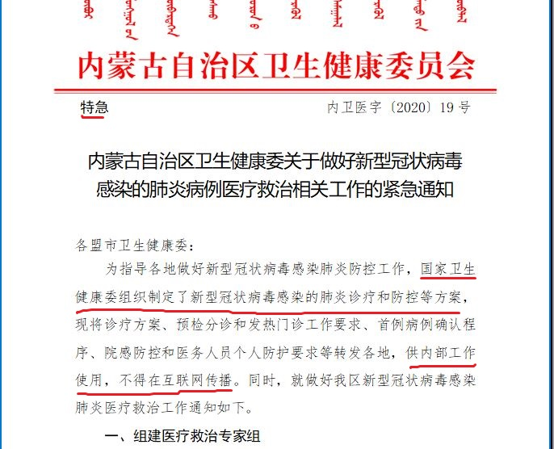

1月15日，内蒙古卫健委印发的《关于做好新型冠状病毒感染的肺炎病例医疗救治相关工作的紧急通知》截图。（大纪元）

即使到了1月24日的团拜会上，疫情已在大陆全面爆发，武汉也因此于1月23日封城，但习近平在当天讲话中只字未提武汉及疫情。

武汉市长周先旺1月27日在接受中共央视访问时，曾把隐瞒疫情的责任推给中共高层。他说：“披露的不及时，这一点大家要理解，因为它是传染病，传染病有传染病防治法，它必须依法披露。作为地方政府，我获得这个资讯以后，授权以后，我才能披露，所以这一点在当时有很多不理解。”

中共病毒去年12月在武汉爆发后，中共从上到下一直隐瞒疫情，打压传播疫情真相的李文亮等8名医生及民众，宣传疫情“可防可控”、没有“人传人”等虚假信息，误导民众，并导致疫情在全球泛滥。

<a target="_blank" href=#top><h6 align="right">回上方</h6></a>
  
  
<a name=36>
<h1 align="center"><b>蓬佩奥：大量证据将病毒和武汉实验室相联</b></h1>

5月3日，美国国务卿蓬佩奥接受媒体采访时表示，有大量证据表明病毒来自武汉实验室。图为蓬佩奥资料照。(NICHOLAS KAMM / POOL / AFP)

【大纪元2020年05月04日讯】（大纪元记者张婷综合报导）美国国务卿迈克·蓬佩奥（Michael Pompeo）周日（5月3日）接受媒体采访时表示，“大量证据”表明，新型冠状病毒（中共病毒）的爆发始于中国武汉的一个实验室。他还表示，中共对疫情的回应是一个经典的共产主义虚假宣传。

“我可以告诉你，有大量证据表明这（病毒）来自武汉的实验室。”蓬佩奥周日在接受ABC的“This Week”节目采访时说。

“要记住，中国（共）有感染全球的历史，它们有运行不合标准实验室的历史。这也不是第一次全球因为中国实验室的失误而暴露在病毒之中。”

蓬佩奥表示，他认同国家情报总监办公室的一份报告。该报告排除了病毒是基因改造或人造的。

“我已经看过了它们的分析。我已经看过了对外发布的概要。我目前没有理由质疑报告的准确性。”

该病毒的起源已成为这次大瘟疫的一个关注点，加剧了中美之间的紧张关系。美国总统川普（特朗普）及多位政府官员和美国议员都表示，中共应该为这场肆虐全球的大瘟疫承担责任。

蓬佩奥4月23日接受保守派电台主持人欧康纳（Larry O’Connor）采访时表示，美国一直在努力评估包括中国在内、世界各地的进行病毒研究或病原体研究的高级设施。“中国内部也有许多这样的实验室，我们一直担心它们没有足够的技能、能力、流程和协议，来保护世界免遭潜在病毒泄漏之苦。”他说。

美国一直要求让国际团队进入武汉病毒实验室进行调查，但遭到中共当局拒绝。

<b>蓬佩奥：中共阻止美国科学家获得病毒样本</b>

当被“This Week”主播玛莎·拉达兹（Martha RADDATZ）问及中共是否故意释放出这种病毒时，蓬佩奥说，“对于这一点我没有任何置评。”

“我认为，仍然有很多事情需要去了解。但我可以说，我们已经尽力去回答所有的这些问题。我们试图派一个团队去那里，世卫组织试图派一个团队去那里，他们失败了。没有人被允许进入这个实验室（武汉病毒研究所）或任何其它实验室。中国国内有很多实验室。风险仍然存在。这是一个持续的挑战。”

他还说，中共继续阻止世界卫生组织的卫生专家以及美国科学家获取研究所需的病毒样本。

“我们仍然需要进入那里（武汉）。我们仍然没有我们需要的病毒样本。这是一个持续的威胁，一个持续的大流行。”蓬佩奥说，“中国共产党继续阻止西方世界和全球最好的科学家介入，以弄清到底发生了什么。”

蓬佩奥4月23日的采访时也提到，美国仍在尝试从中方获取该病毒的原始样本。中共只提供了分解后的样本。

“我们仍然需要每个国家保持透明，共享其数据，共享所有这些信息，以便世界上最好的流行病学家、科学家和实验室专家可以开始开发治疗方法和疫苗，最终降低疫情风险。总统非常重视经济恢复发展，但重要的是我们对病毒要有透明度，才可使我们能够做到这一点。”蓬佩奥说。

<b>中共原本有机会阻止病毒全球大流行</b>

川普总统及其助手上周对北京提出尖锐的批评，要求北京对病毒的起源做出答复。

蓬佩奥周日在“This Week”节目中说：“重要的是，中国共产党原本有机会防止这场灾难传到全球。”

他表示，中国共产党散布虚假信息，掩盖真实信息，导致了这场巨大的危机。他认为，如果事情首先发生在美国，科学家将会解决问题。他们将会进行想法交流，“我们也将能迅速确定需要做出哪些事情进行回应。”

“相反，中国（共）像威权政权一样行事，试图隐瞒，隐藏和（制造）混淆。”蓬佩奥说，“它（中共）‘雇用’了世界卫生组织作为工具来做到这一点。这些事情现在已经构成全球范围内的巨大危机，巨大生命损失和巨大经济损失。”

“澳大利亚人认同这一点。你听到欧洲人也在说同样的事情。我认为，针对中国（共）将病毒带到全球这一点上，全球的理解是统一的。”他说。

<b>一个经典的共产主义虚假宣传</b>

“This Week”主播拉达兹说，情报官员称中共政府故意在1月初向国际社会隐瞒了疫情的严重性，与此同时囤积医疗设备。您可能认为，他们故意这样做是要为他们自己保留越多的口罩越好。

蓬佩奥回答说，你说的这些事实是对的。“我们可以证实，中国共产党尽一切所能来确保全球不会及时了解正在发生的事情。”

“有大量的相关证据。一些证据，你可以在公共场合看到。”

蓬佩奥还列举了中共企图掩盖疫情真相所采取的措施。“我们已经看到他们把记者赶出去的事实。我们还看到这样一个事实，就是那些试图报导此事的人，中国的医疗专业人士，被噤声……这些威权政权所做的一切事情，共产党的运作方式。这是一个经典的共产主义虚假宣传。”

蓬佩奥说，中共政权的这种作法给全球带来了巨大的风险。无数人受到伤害。川普总统非常明确，我们将追究责任者的责任，我们将按照自己的时间表去做。

<a target="_blank" href=#top><h6 align="right">回上方</h6></a>
  
  
<a name=35>
<h1 align="center"><b>公安部洗牌 港警丑闻曝光 牵出国安级爆料</b></h1>

香港警队丑闻曝光，疑北京国安喂料，邓炳强的强硬蛮横与他背后的政治力量激烈博弈相关，同时，北京有人想“修理”邓炳强了。图为邓炳强去年平安夜现身尖沙咀海港城，随后防暴警察狂射催泪弹及橡胶子弹攻击抗争人群。（宋碧龙／大纪元）

   
  【大纪元2020年05月04日讯】（香港大纪元记者方天亮综合报导）4月下旬以来，有关香港警队及中共公安部异动消息频传，看似杂乱，却有内在联系。4月30日警务处处长“一哥”邓炳强强制取消长洲太平清醮的抗疫送神仪式被非议；警务处助理处长陶辉因违规入住“牌照房”被查，5月2日再被指涉嫌霸占官地，僭建民宿招租；4月29日包括陶辉在内的英籍警官被指控是警暴“要犯”，港警后台北京政法系统正被整肃。
  

4月18日邓炳强拘捕了15名民主人士，19日邓炳强后台、中共公安部副部长孙力军被查，20日孙力军的主管傅政华，卸任兼职的司法部党组副书记职务，21日葵涌警署警长涉嫌教唆并诬陷学生使用汽油弹，被新界北总区拘捕，26日中共全国人大会议宣布将修订《人民武装警察法》，29日傅政华卸任司法部部长。

5月1日，署名习近平弟弟“习远平”的一封公开信在网络上热传。习远平在信中替哥哥解释道：“有些惹起公议的事情，并不是他的旨意，完全是下面有人高级黑故意让他难题，目前对政法口几个人的处理，正是对这些杂碎的大清算。这还只是开场，好戏还在后头。”

中共政法委系统正被清洗，负责香港铜锣湾书店捉人事件、公安部搞的“电视认罪”、“网络警察严控”的主脑、前中共公安部副部长、中共公安部港澳小组负责人孙力军已被捕，中共政法委“610办公室”主任、香港青关会背后的主脑傅政华火速卸任。接下来谁会下台惹关注。

<b>邓炳强强行取消 太平清醮驱瘟疫仪式</b>

然而，虽然后台孙力军倒了，但邓炳强并没有收敛，反而加大力度压制香港的自由。4月27日，邓炳强向教育大学校长张仁良发信，要求跟进该校讲师蔡俊威去年在香港电台节目《左右红蓝绿》上有关警方围攻理工大学的言论。蔡俊威说的是事实，而邓炳强却违背“公务员中立”的原则，威胁校方，要求处理蔡俊威。

“高教公民”发文称，邓炳强公然侵犯学术自由和院校自主，公民社会必须坚决抵抗。因此发起“一人一信 支持蔡俊威”行动，要求张仁良公正处理蔡俊威的个案，守护学术自由和院校自主，又呼吁全香港巿民参与联署。

4月30日长洲太平清醮送神仪式遭邓炳强强行取消。仪式改由各街坊会自行安排。（陈仲明／大纪元）

4月30日，邓炳强现身长洲，当日（黄历四月初八浴佛节）一年一度的太平清醮活动，除了飘色巡游外，原定的送神仪式，也因警方反对而取消。在中共病毒（武汉肺炎）肆虐下，本来这个驱邪驱瘟疫的传统活动，对港人有利，却被邓炳强取消了。

<b>陶辉办无牌民宿 疑霸官地僭建</b>

5月2日，香港媒体大量报导邓炳强的助手、警务处助理处长、英籍警官陶辉（Rupert Dover），涉嫌违规入住西贡清水湾碧水新村1号“牌照屋”及涉嫌僭建后，他及警长妻子再被指涉嫌违规将同村61A号牌照屋包装成民宿，在网上社交平台招租。

陶輝夫婦違規居住的「牌照房」，花園加裝了屋蓋，疑屬違規僭建。（宋碧龍／大紀元）

民政事务总署证实，61A号屋未领取旅馆牌照，地政总署也证实，61A号屋只限储物用途。有建筑师指，61A号屋亦涉嫌霸占官地。

据香港《旅馆业条例》，无牌经营旅馆属刑事罪行，一经定罪，可罚款20万元和监禁2年。
三英警官是警暴“要犯” 人权成员促英政府追究

继陶辉被揭霸占官地、私营民宿后，传媒再揭更多警队高层丑闻，指警察机动部队校长庄定贤（David Jordan）和新界北总区警司韦华高（Vasco Gareth Llewellyn Williams）的住宅同样涉嫌僭建，前者更涉嫌霸占官地和盗取警方用作阻隔、俗称“雪榚筒”的交通锥。

被点名为警暴“要犯”的英籍警官（左起）庄定贤、陶辉及薛镇廷。（网络图片／大纪元合成图）

另一名英籍警司，薛镇廷（Justin Shave）去年7月被揭在6.12“反送中”运动清场期间“使用过度武力”。

4月29日，一向关注香港人权状况的英国保守党人权委员会委员德普尔福德（Luke de Pulford）在推特（Twitter）发文，促请英国政府调查英国国民在香港涉及警暴问题，点名陶辉、庄定贤及6.12指挥官薛镇廷为警暴“要犯”（key prepetrators），又透露正就事件构思法律行动，呼吁港人提供相关的警暴证据。

去年10月27日反送中期间，英籍署理新界南总区指挥官陶辉（Rupert Dover）作为高阶警官在现场更高调走入人群中巡视，亲自捉人，刺激暴力情绪。（宋碧龙／大纪元）

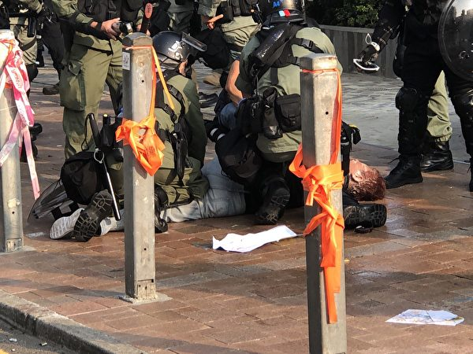

2019年10月27日，市民从尖沙咀梳士巴利花园游行，追究警方使用暴力。图为多位警察围殴一名抗争者至昏迷。当日陶辉负责指挥。（大纪元）

香港众志秘书长黄之锋亦于脸书（FB）转发德普尔福德的帖文，吁港人向他提供三位警官违法证据。

德普尔福德去年11月来港观察区议会选举，对摆街站（街头宣传）的何君尧议员说“我有份DQ你”，获网民大赞。德普尔福德参与促成英国安格利亚鲁斯金大学褫夺何君尧名誉博士学位。

<b>唐英年选特首 黑材料流出 形势逆转</b>

为何在这敏感时刻，邓炳强数名助手的丑闻突被曝光？

谈到僭建，令人联想到2012年香港特首选举期间闹出很多僭建案。

2012年特首选举，是梁振英与唐英年的“猪狼之争”。在之前一年9月便辞任政务司司长的唐英年，一直被视为中央属意人选，获商界高调支持，梁振英只是陪跑。

但选举前一个月，唐英年突在2月13日被揭住宅僭建重磅丑闻，之后选情急转直下；当年提名唐英年的政商界人士亦慌忙转向“弃唐取梁”，最终令梁振英以689票上台。

中国问题专家季达分析，在特首选举投票前的2012年2月6日，发生王立军逃入成都美国领事馆事件，曝出薄熙来勾结周永康等密谋在“十八大”后，从习近平手中篡夺中共最高权力政变计划。王立军叛逃导致江泽民派系陷入危局。

长期主管香港事务的中共前国家副主席曾庆红评估形势认为，需在香港部署铁杆人马；指唐英年关键时还会偏向香港人，梁振英则是投机主义者，于是临时决定换人。

当时针对唐的黑材料，就被指有曾庆红国安系统背后操作。消息人士透露，当年梁振英上台，是分别透过董建华及曾庆红秘书施芝鸿向习近平推荐促成的。

<b>国安材料恐与邓炳强有关</b>

当时大纪元发文称“中共内斗延烧到香港”，指出唐英年的丑闻爆料，疑是中共国安局提供的黑材料。

立法会议员梁国雄当时表示，他也观察到自从王立军事件发生后，香港的特首选举出现越来越多的丑闻。

他说：“我不认为这是香港传媒做的，应是大陆北京国安局做的。如果国安局的丑闻可以互相扔来扔去的话，也表示中共的介入已非一般介入，而是两个集团趁王立军引起的危机在香港争夺。所以香港特首争夺反映了中共内斗加剧。”

回到八年后的今天，香港警队丑闻曝光，疑北京国安喂料，邓炳强的强硬蛮横与他背后的政治力量激烈博弈相关，同时，北京有人想“修理”邓炳强了。 

<a target="_blank" href=#top><h6 align="right">回上方</h6></a>
  
  
<a name=34>
<h1 align="center"><b>川普：中共犯了一个可怕错误 还不想承认</b></h1>

美国总统川普（特朗普）周日（5月3日）表示，他认为中国（中共）犯的一个“错误”，是冠状病毒（中共病毒）大流行蔓延的原因。(JIM WATSON / AFP)

   
   【大纪元2020年05月04日讯】（大纪元记者苏静好综合报导）美国总统川普（特朗普）周日（5月3日）表示，他认为中国（中共）犯的一个“错误”，是新冠病毒（中共病毒）大流行蔓延的原因。

美东时间周日晚上7点到9点，川普在华盛顿DC林肯纪念堂参加福克斯新闻（Fox News）举办的公众对话会（town hall），他说：“我认为它们（中共）犯了一个可怕的错误，还不想承认这一点（admit it）。”

“我的意见是它们（中共）犯了一个错误。它们试图掩盖，试图将其压下去。这就像一场大火。”川普说， “你知道，这真的就像扑灭大火。它们无法灭火。”

<b>川普：中共在疫情上误导全球毋庸置疑</b>

有民众提问：“是否有足够证据表明中国（中共）在这种冠状病毒（中共病毒）方面误导了国际社会？如果是这样，国际社会应如何应对？”

川普回答说：在一点（中共误导全球）上是毋庸置疑的，“在（疫情）早期，我们想进去（中国武汉调查），它们（中共）不让我们进去。”

总统还指出：“别忘了，中国（中共）试图将（疫情大流行）归咎于我们的一些士兵，而且不仅仅如此。”川普说，中国（中共）随后试图将其归咎于欧洲，因为意大利“在人均方面，遭受的痛苦可能超过任何人”。

川普还提到西班牙和法国，均颁布了封城令，这已经成为一场灾难。

川普还说，它们（中共）不让人们进入中国，但它们允许人们去美国和全球各地。“你可以从武汉（实验室所在地）搭机出行，去世界不同的地方；但不允许去北京或中国其它地方。”

“这说明什么，说明它们（中共）知道它们出了问题。”他说。

<b>川普：世卫是一场灾难</b>

川普周日晚继续批评世界卫生组织，他说：“世界卫生组织是一场灾难。”

总统说，世卫组织传递的“错误”信息是以中国（中共）为中心的。他指出，美国“愚蠢地”一直在向该集团支付4.5亿美元，而中国（中共）每年一直支付3800万美元。

川普说：“但是，（世卫组织）比我们以前的所有领导人都更具政治性。”“世卫组织做了什么，他们错过了每一个电话。”

<b>美国政府在整理武汉实验室的报告</b>

当主持人提出武汉实验室的问题时，川普说，政府正在整理一份报告，该报告将“非常有说服力”。

4月30日，对于中共病毒是否来自武汉病毒研究所，川普说：“我们正在调查它的确切来源以及为何爆发疫情，很多科学家及情报人员正在调查，很快会有答案。”

5月3日下午，国务卿迈克‧蓬佩奥（Michael Pompeo）接受ABC的“This Week”节目采访时表示，“大量证据”表明，冠状病毒（中共病毒）的爆发始于中国武汉的一个实验室。他还表示，中共对疫情的回应是一个经典的共产主义虚假宣传。

“我可以告诉你，有大量证据表明这（病毒）来自武汉的实验室。”蓬佩奥说。

“要记住，中国（共）有感染全球的历史，它们有运行不合标准实验室的历史。这也不是第一次全球因为中国实验室的失误而暴露在病毒之中。”

蓬佩奥表示，他认同国家情报总监办公室的一份报告。该报告排除了病毒是基因改造或人造的。

美国最高间谍机构上周四表示，已经确定病毒不是人工造成的，但仍在调查该病毒是否是由“武汉一家实验室的事故引起的”。

蓬佩奥表示，美国仍在尝试从中方获取该病毒的原始样本。中共只提供了分解后的样本。

中共则否认有关该病毒从武汉实验室泄漏的说法。

中共一直隐瞒疫情，包括中共病毒资料，并且恐吓、威胁和拘留披露疫情的吹哨人。中共官方首度承认出现病例是在去年12月31日，当时武汉有关当局才通报不明肺炎病例，随后中共继续隐瞒疫情，放手让500万武汉人旅行到世界各地，最终使得疫情演变为全球大流行病。

<a target="_blank" href=#top><h6 align="right">回上方</h6></a>
  
  
<a name=33>
<h1 align="center"><b>
【一线采访】北京新规 房地产恐面临倒闭潮</b></h1>

中国经济受瘟疫冲击，当局开始实施相关规定，要求不能拖欠农民工工资。图为示意照。 (AFP)

   
  【大纪元2020年05月03日讯】（大纪元记者骆亚、张顿采访报导）中共当局5月1日开始实施《保障农民工工资支付条例》，要求建设单位与施工总承包单位拨付人工费用周期不得超过1个月。大陆前30名房地产的一名中层管理表示，该条例可能会使更多的房地产公司面临倒闭。
  
<b>房企中管：新规对小房企雪上加霜</b>

中共官媒《人民日报》、《工人日报》等多家媒体从人社部获悉，《保障农民工工资支付条例》（简称条例）5月1日起正式施行。《条例》1月7日首次公布，目的是解决长期存在拖欠农民工工资等问题。

《条例》规定，建设单位与施工总承包单位应订立书面工程施工合同，约定工程款计量周期、工程款进度结算办法及人工费用拨付周期，并按要求约定人工费用。“人工费用拨付周期不得超过1个月。”

大陆一家前30名地产公司中管郝伦（化名）对大纪元记者表示，大陆很多中小型的房地产公司可能要倒闭，因为房地产公司一倒，意味着包工头就逃了。为了防止发生影响到农民工工资，中共当局出台了支付人工费用周期不超过一个月的规定。

“对小的房地产公司就是雪上加霜呀。因为小的房地产公司没有达到AAA级别，它本来资金面就已经出现很多问题了，钱也贷不到。那么这种情况下，它本身就是银根很紧的，本来可以拖欠包工头工资。你现在这个法令一出，岂不是它不可以再拖欠这一笔钱，整个人工费用它没办法拖欠，只能按月支付。”

郝伦表示，一个项目当中要不少农民工，这笔钱不小。房地产公司本来可以三个月付钱的。比如说，卖好房子或者是第二笔钱到了，它把前一笔钱拆东墙补西墙付工资。可是现在这个条例一出，不能拖欠了，它每28天到每30天就要准备好这笔钱给工人工资。

<b>垫资进场 房企倒了 包工头会潜逃</b>

郝伦介绍了他们此前房地产公司的运作模式：他们房地产公司最需要用资金、钱最缺的时间段就是拿地时间段，拿地的话就要开始调资金。拿好地之后，公司就可以向银行贷款。包括那些房地产的那种包工头，他们也都是代垫资进场，所谓的垫资进场就是自己垫资金先进场，到时结算的时候就要多出钱。

“那么这些包工头就会跟工人说，因为我是垫的，钱还没拿到，所以你们过来先帮我干。我包你吃包你住，你帮我白干，这样先白干，或者说我工资可能不是一个月付给你，我可能是三个月付给你，他们就会这么去干。”

但是如果房地产公司倒了，包工头就拿不到钱，他们就会逃。“他们潜逃了，有50%可能是房地产倒了。”郝伦说，“第二种可能就是他们自己的问题逃了，这不算。可是为了要避免这50%，国务院出了这个条例。”

它出台这个政策的原因就是，它已经发现这个问题很严重。“国务院签署，并于5月1日执行，这个级别很高耶。”

<b>房企中管：大批房企会倒闭</b>

郝伦表示，房地产一直占中国GDP很高比例，现在疫情这种情况下，中共当局要最快恢复经济，最快的办法是房地产行业。金融上面是钱滚钱才能够获得更大的利润，那些闲钱投资房地产的话，都会找大型的、信誉比较好的3A级别的房地产公司，小的房地产公司不可能达到3A级别。

那么这些小的房地产公司就滚动不起来，因为它们没有钱，这是一个问题。第二个问题就是，这些小的房地产公司，前两年已借了好多钱，那么银行没有办法把低息优惠的钱给这些小公司，因为它们的级别没有达到A，导致它们没有新钱还旧债，这些公司最后项目就会被吃掉或倒闭。

“中国房地产公司前100强能达到3A级别的没有多少”，郝伦说，“第一名到第十名的利润跟后面50名是天壤之别，意味着那些小房企不算，你100强当中就要淘汰一半，那有多少房企要倒？”

郝伦表示，中国房企的数量非常多，还不包括政府下面的那些城投公司。就是城市建设投资有限公司这样的平台，它们也是经营房产，它们如果收不到钱，直接就影响到政府会有外债，影响到政府的信用。

郝伦还介绍，中国的房企负债率很高。上海一家公司的负债是三千多亿元（人民币），负债率是82%，这已经是属于房地产公司健康的。同样，排名前面的这些房企，“它们的负债率也是80～90%，它怎么可以停止开发，它一不开发，它整个盘都崩。”

“现在能够撑得下去的是3A。”郝伦说，“从2019年6月13日统计来看，排名30的房地产，3A评级只有24家通过。所以这是非常恐怖的一件事。” 

<a target="_blank" href=#top><h6 align="right">回上方</h6></a>
  
  
<a name=32>
<h1 align="center"><b>【直播回放】5.4疫情追踪：中国南北爆疫情</b></h1>
 <h3 align="center"><b>中国南北爆疫情 美拟惩罚中共掩盖疫情</b></h3>  
   

欢迎收看新唐人、大纪元5月4日的“中共病毒追踪”每日联合直播节目。（大纪元合成）

   
 【大纪元2020年05月04日讯】大家好，欢迎收看新唐人、大纪元的“中共病毒追踪”联合直播节目，我是婷婷，我是秦鹏。好的，现在是中港台时间2020年5月4号晚上9点（美东时间上午9点）。

全球确诊感染中共病毒的人数逾358万人，死亡人数近25万人。美国确诊病例超过118万，死亡超过6.8万。

西班牙确诊病例逾24.7万，2.5万人死亡；意大利确诊病例超过21万，2.8万人死亡；英国确诊病例超过18.7万，2.8万人死亡；法国则是逾16.8万确诊病例，2.48万人死亡。

在过去24小时内，美国病例增加2.3%，低于前一周的每日平均水平。由于住院率下降，纽约州新增死亡人数是一个多月来最少的。俄罗斯则报告了一万多起新病例，是疫情爆发以来增长最多的一天。

周日晚上，川普在华盛顿DC林肯纪念堂参加公众对话会，他说：“我认为它们（中共）犯了一个可怕的错误，还不想承认这一点。”

“它们试图掩盖，试图将其压下去。这就像一场大火。”川普说，“你知道，这真的就像扑灭大火。它们无法灭火。”

川普再次批评世界卫生组织，说该组织带来一场灾难，它们说的都是错的。

美国国务卿蓬佩奥5月3日表示，“大量证据”表明，新型冠状病毒（中共病毒）的爆发始于中国武汉的一个实验室。他还表示，中共对疫情回应是一个典型的共产主义虚假宣传。

中共隐瞒疫情，给世界带来巨大的生命和经济损失。路透社引述美国多名知情官员的话透露，美国政府正强力推动一项倡议，欲将全球工业供应链撤离中国，并推动建立一个联盟。美方还正考虑实施新关税措施，惩罚中共对疫情的处理。

中共近来不断宣称抗疫“取得阶段性胜利”，危机暂时缓解。但中国媒体惊爆除北部黑龙江省是目前疫情最严重的地区外，位于南部的广东省广州市近日发现多起病例，广州市增城区已发生群聚感染，更出现了“跨市和跨省”状况。

我们今天还有很多的内容，和大家一起探讨。
网络收看方式：

大纪元新闻网：https://www.epochtimes.com/gb/nf1334917.htm
大纪元YouTube直播：https://www.youtube.com/c/djynews
大纪元脸书直播：facebook.com/djy.news

【支持】为真相护航 为沉默发声，就在今天，支持大纪元
https://donate.epochtimes.com  

新唐人大纪元《直播节目》制作组

<a target="_blank" href=#top><h6 align="right">回上方</h6></a>
  
  
<a name=31>
<h1 align="center"><b>美国加速与中共经济脱钩 建立新经济圈</b></h1>

美国官员透露，川普（特朗普）政府正在进行“全面加速”的计划，将美国工业供应链从中国撤出。图为示意图。(Justin Sullivan/Getty Images)

   
   【大纪元2020年05月04日讯】（大纪元记者徐简综合报导）美国官员透露，川普（特朗普）政府正在进行“全面加速”的计划，将美国工业供应链从中国撤出。据悉川普总统的计划包括：对中国商品课征新关税、对美国回流公司进行税收激励措施、与台湾建立更紧密的关系等。
   
<b>美国政府全面推动脱离中共供应链</b>

路透社5月4日报导，美国总统川普早就承诺将制造业从海外迁回，他近日加大了这方面的施政力度。

多位美国现任和前任的高级官员表示，中共病毒（武汉病毒、新冠状病毒）对美国经济造成巨大破坏，这正推动美国加速脱离对中国产品供应链的依赖，并考虑将供应链迁移到对美国更友好的国家。

美国国务院经济增长、能源与环境局副局长Keith Krach告诉路透社，“在过去几年中，美国一直在减少对中国供应链的依赖，但现在我们正以‘全面加速’（turbo-charging）的速度将供应链迁出。”

Keith Krach说，了解美国供应链中的关键领域及其迁移瓶颈，对美国安全来说十分重要，政府可能很快宣布新的行​​动。
增加新关税、制裁官员或实体、加强美台关系

美国总统川普近期密集批评中共政权，并在四天内三度提及对中国商品增加新关税。川普还表示，如果北京不购买美国商品，美国将终止第一阶段贸易协议。

美国政府目前对3,700亿美元的中国商品加征最高25%的关税，这已经导致很多美国公司负担急增，尤其是疫情导致绝大多数公司销售直线下降，如果川普再加新的关税，会更增加这些美国公司回迁的决心。

美国官员们还说，除了关税，美国惩罚中共的其它方式可能包括对中共官员或公司的制裁，以及与台湾发展更紧密的关系。

路透社评论说，对于川普政府而言，从中国移出供应链的讨论是具体、稳健的、多边的，也是不同寻常的举措。

<b>美国正在建立“经济繁荣圈”新联盟</b>

美国官员说，美国正在推动建立一个被称为“经济繁荣圈”（Economic Prosperity Network）”的“可信赖的伙伴”联盟。他说，参与的各国需要在数码商业、能源和基础设施到研究、贸易、教育和商业等所有领域遵循相同的标准。

美国国务卿蓬佩奥（Mike Pompeo）4月29日表示，美国政府正在与澳大利亚、印度、日本、新西兰、韩国和越南合作，以“推动全球经济向前发展”。蓬佩奥说，这些讨论包括“我们如何重组供应链，以防止类似当前的事情再次发生”。

美国也在跟拉丁美洲合作，哥伦比亚大使弗朗西斯科‧桑托斯（Francisco Santos）上个月表示，他正在与白宫、国家安全委员会、美国财政部和美国商会进行讨论，以帮助美国公司将一些供应链移出中国并离美国更近。

<b>中共病毒促使美中加速脱钩</b>

美国官员表示，美国商务部和其它机构正在寻找方法，推动公司将采购和制造业从中国转移出去。政府考虑的鼓励措施，包括税收激励措施和潜在的回国生产补贴。

一位政府官员说：“政府对此（产业回流）进行了全面推动。”代理商正在调查哪些制造业应被视为“必需领域”，以及如何在中国境外生产这些商品。

“这种流行病，使人们对与中共做生意的种种担忧变得更加清晰。”一位美国高级官员说，“人们以前认为通过与中共交易可以赚到钱，但是现在病毒造成的经济损失比那（转到的钱）多很多倍。”

中共病毒的大流行还突显了美国的很多医药产品都依赖中国制造，比如美国的仿制药供应链在中国，而仿制药（Generic Drug）占美国处方药的大部分。疫情也显示了中国在热像仪等产品中所占的主导地位，这些热像仪是测试发烧的必要工具，也在食品供应中具有重要作用。

联合国的数据显示，中国在2010年超越美国成为全球最大的制造国，并在2018年占全球总产量的28%。美中贸易委员会发言人巴里（Doug Barry）表示：“鉴于大流行暴露出来的风险程度，应该采取多元化经济和裁减一些供应链。”#

<a target="_blank" href=#top><h6 align="right">回上方</h6></a>
  
  
<a name=30>
<h1 align="center"><b>【瘟疫与中共】死亡名单中党员占大多数--文：何坚</b></h1>

图为美国疾病预防控制中心绘出新冠病毒的效果图。（CDC）

   
  【大纪元2020年05月03日讯】2019年底从武汉传出的中共病毒（新冠病毒，COVID-19），在中共的隐瞒下，如今已扩散至世界各国，演变为席卷全球的大瘟疫。无数人被病毒感染、病亡，给家庭和社会带来深重的创伤和恐慌。不过，从中国大陆传出在疫情中死亡的名单，揭示出了中共病毒的真正“靶点”，给深陷危机的各国民众带来警示。

截至5月2日，根据各国公开数据，中共病毒（COVID-19）已经扩散至全球217个国家和地区，总确诊病例数量逾320万，病亡数逾23万，致死率逾7%。其中，还有疫情最严重的两个国家——中国大陆和伊朗隐瞒了真实疫情；据多国专家、机构的研究以及大纪元的调查，中国实际感染与死难者数字可能是中共公布的数十倍。
陆媒“殉职”死亡名单 三分之二是党员

据大陆网民发布的一份死亡名单、对陆媒“抗疫典型”报导的不完全统计，截至4月30日，在这次疫情中“因公殉职”的人员至少有498人，其中，中共党员331人，占比三分之二（约66.5%）。

大陆网民发布的一份死亡名单，对陆媒“抗疫典型”报道进行不完全统计，截至4月30日，殉职498人，其中中共党员331人，占比三分之二。图为死亡名单截图。（网络截图）

这些人的职业包括公务员、村干部、警察、医生、护士、保安、城管、志愿者等等。他们“殉职”的缘由，除了极少数是参与一线医务工作，其他都是在执行党的维稳抗疫措施。所以准确地说，绝大多数病亡者并非是“殉职”，而是“殉党”，以身殉党。

图中的42号死者就是被外界称为吹哨人的李文亮医生，他的死因标注为“肺炎”，其实就是中共肺炎。另外23号“何辉”也是死于中共肺炎。 （网络截图）

更关键的是，他们的死因，值得推敲。

除了少数意外死亡、被谋杀或死因未说明外（合计54例），其他多被冠以“过劳病逝”或死于“突发疾病”，合计有412人。而死因标注为“肺炎”的只有32人，该死亡名单中的“肺炎”，实际就是指中共肺炎（武汉肺炎，COVID-19）。例如大陆知名的吹哨人李文亮医生和武汉志愿者何辉，都是感染中共肺炎病亡，而他们在死亡名单中的死因标注的是“肺炎”。

至于说死因“过劳病逝”或“突发疾病”，一般都被外界解读为是死于中共肺炎。这是因为中共蓄意瞒报染疫和死亡人数，而那些被登报宣传的“先进典型”，如果被公布了真正死因，就会撞破中共谎言。所以陆媒报导的“殉职”典型，死亡原因往往被党篡改为含糊不清的“过劳病逝”或“突发疾病”。

而在这些应该是死于中共肺炎的人群（412+32）中，党员人数为296人，占比依然是三分之二（约66.7%）。

也就是说，仅据对陆媒“抗疫典型”报导的不完全统计，染疫而亡的人群中约有67%是党员。

<b>党员病亡占比是其人口比例的十倍</b>

另据维基百科信息，截至2018年末，中国人口14亿，中共党员人数9059.4万，党员在中国人口中占比6.4%。

而在中国大陆的各类职业中，除了警察（非技术岗位）有党员的入职要求外，其它职业一般并不要求是党员。这代表着，在参与抗疫的各类从业人员中，整体上党员比例并不会偏高。

因此，对比上述两个比率可知，中共党员在中共肺炎病亡者中的比例，可能是党员在中国人口中占比的十倍以上。

换言之，通过对中共陆媒“抗疫典型”死亡报导和中国人口统计的粗略分析，可以发现一个显着特征，那就是中共党员染疫身亡的可能性，远远大过没有加入共产党的中国人。

<b>民政部死亡名单 曝光党员高病亡率</b>

尽管中共从未公布病亡者的政治面貌等信息，令外界无法对党员和中共病毒死亡率之间的关系进行进一步的分析。但中共却发布了一个可以佐证党员染疫高死亡率的官方数据。

中共民政部称，截至3月8日，53名社区工作者殉职，其中党员占92.5%。（网络截图）

3月9日，中共民政部在国务院联防联控机制新闻发布会上说，“截至3月8日，全国城乡社区工作者已有53名在疫情防控中因公殉职，其中党员占92.5%。”

虽然民政部并未公布“殉职”人员的具体死因，但大纪元分析了同时期的陆媒报导后发现，绝大多数都被报导为过劳病逝或突发病逝，实际上都是感染中共肺炎病亡。

而且，在中国大陆，社区工作者也没有党员的硬性入职要求，所以这一职业中，党员比例也不会显着偏高。

由此可见，中共官方发布的社区工作者中党员92.5%的死亡占比，充分暴露了党员在大疫中的高死亡率。

<b>找到中共病毒的真正“靶点”</b>

尽管中共将党员的高死亡率，作为党“先进性”和“冲锋在一线”的证据来宣传。然而，中共却没想到这会曝光一个显而易见的事实：在全民都被卷入的这场大疫中，党员高病亡率代表不了党的先进，只反映出中共党员对中共病毒缺乏“免疫力”，是真正的“易感人群”。

中共党员高病亡率，并非政治意义上的宣传，而是被中共官方和中国民间都验证了的事实，更是以无数人命为代价拉响的警报，警示中共党员相较于中共组织之外的人群，更有可能染疫身亡。

换个角度看，这个冰冷的事实未尝不是揭开了中共病毒的秘密，它揭示出了中共病毒的真正“靶点”。

所谓“靶点”，在生物学上，是指位于生物体内，能够被其它物质识别或结合的结构。在现代医学中，事先确定药物在人体内起作用的靶点，例如基因位点、受体、酶、离子通道、核酸等生物大分子，就能研发出针对特定疾病的有效治疗药物。

中共病毒，被世卫组织命名为COVID-19，从病原学上看，是β属冠状病毒，与SARS冠状病毒高度同源。

现代医学将冠状病毒入侵细胞后，为了大量复制所需要的核心物质——RNA聚合酶，视为最重要的药物靶点之一。目前备受关注的瑞德西韦（Remdesivir），就是以RNA聚合酶为靶点；其机制是当药物进入人体后，靶向并破坏RNA聚合酶，最终达到阻止病毒复制的效果。

然而现实中，全世界的科学家在巨大的压力面前，对中共病毒全力攻关，却未能获得突破性进展。中共病毒的神秘特性，导致现有科技难以从分子层面上找到它的真正靶点，进而研发出真正有效的药物和疫苗。

不过，中共肺炎沿着亲共国家一路蔓延的扩散趋势，尤其是中国大陆的死亡名单，都清楚地表明，中共病毒确实存在靶点。但那并非生物学上的靶点，而是更加微观的，存在于意识形态中的社会学“靶点”——思想中的共产党因素。

党员（或其它中共组织）的政治身份，遭中共洗脑，或党国不分而产生对党的认同感等思想，都成了中共肺炎更为微观且精准有效的“靶点”，使得中共病毒能够锁定并攻击带有共产党因素的个人，最终带来高死亡率的可悲结果。

<b>主动清除病毒靶点 免疫有良方</b>

其实，就如同科学家找准了药物靶点、就能研发出有效药物一样，一旦人们找到了中共肺炎真正的靶点，认清了招致病毒攻击甚至死亡的真正原因，就能主动地清除生命和思想中的致病因素，转危为安，对中共病毒产生免疫力。

剖析共产主义本质的划时代巨著——《九评共产党》早已指出，中共就是一个邪灵，是共产邪灵。共产党的第一份纲领文件《共产党宣言》也公开宣称：“一个幽灵，共产主义的幽灵，在欧洲游荡。”

而中共的入党誓词更是明言，要入党者“为共产主义奋斗终身，随时准备为党和人民牺牲一切”。这种誓词，完全不同于任何正常人类政党的誓词，它根本就是一个向中共邪灵献祭生命的毒誓。

入党宣誓，党员身份，加入中共党团队组织，被蒙蔽而党国不分、甚至认同中共等等，都相当于被中共邪灵在人的生命和思想中烙下一个致命靶点。

最近媒体报导了一些中共病毒感染者谴责中共后奇迹康复的例子。例如西班牙第三大党的党魁、秘书长等多位领袖不久前都感染上了中共肺炎，但在他们认清并谴责了中共后，肺炎消失了。

大纪元特稿《越亲中共疫情越重 防疫有良方》也指出，对中共的认识和态度，直接影响到对中共病毒的“免疫力”——拒绝中共、谴责中共，是免疫中共病毒的良方。 

<a target="_blank" href=#top><h6 align="right">回上方</h6></a>
  
  
<a name=29>
<h1 align="center"><b>贵州孩子哭喊「我要爸爸妈妈」离世</b></h1>
   
   【明慧网二零二零年五月三日】（明慧网通讯员综合报导）二零零八年三月十一日，在开学第二天，为省钱（学校每份饭要三元），贵州盘水市盘县柏果镇十二岁的徐定国跑回旧学校门口，买了两元钱的食物吃，当晚呕吐、发烧，次日全身长红斑，在「我要爸爸、妈妈！」的呼喊声中凄惨离世。临终前连父母的最后一面也没能见到。
听到噩耗的师生和乡邻无不悲痛，四个兄妹更是哭成了泪人。徐定国的妈妈陈玉梅二零零七年二月被非法抓捕，后被送到贵州中八劳教所劳教；爸爸徐启华于二零零七年九月被贵阳国安特务绑架，后被关押在百花山看守所，遭到法院秘密在贵阳市司法警察医院进行所谓的「开庭审判」，被非法判刑四年。徐定国的大伯徐广道，二零零一年在进京上访时被北京公安毒打而死，留下三个孩子，由徐启华抚养。

徐杏、徐定国、徐定府（左至右）
   
徐圆圆、徐佛莲（左至右）

徐广道的遗孤：徐定府、徐杏、徐佛莲

徐启华的孩子：徐定国、徐圆圆

   
   在徐定国下葬前，贵州女子劳教所仍旧不让其妈妈陈玉梅回家看一眼，贵阳国安特务和市公安恶警及其云岩区检察院、百花山看守所等相关人员同样也不让其父亲徐启华回家看儿子的遗体一眼。

徐定国自幼就在不断的惊吓、恐怖，苦难中挣扎，兄妹俩和三个堂兄妹自幼与爷爷、奶奶相依为命。二零零零年元月，徐定国随爸爸、妈妈等九人进京上访，大伯徐广道被北京公安毒打致死，大伯母迫于恶党株连政策，抛下五岁儿子、三岁及一岁的两个女儿，离家出走。爷爷、奶奶被非法关押，接着爸爸、妈妈被抓，姑父又被绑架劳教；还有随时突然降临的，没完没了的骚扰、监控、抄家、被欺侮。

<b>一、大伯徐广道在北京东城区看守所被打死</b>

贵州许多地方原本贫困，许多被中共恶党迫害的一贫如洗的法轮功学员，出于善良，依法上访，纷纷去北京，想把自己因为修炼大法后身心受益的情况反映给政府，多次从贵州步行到北京上访，数不清走烂了多少双鞋，磨破了多少双脚，饿了拣路边被人丢弃的食物，累了睡在大山上，然而面临他们的却是关押迫害。

二零零零年初，徐广道、徐启华及其亲友十一人（还有两个才五、六岁的孩子）到北京说明法轮大法好，徐广道被北京恶警迫害致死，其余人员身无分文，从北京步行回到家。

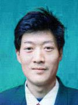

徐广道生前照片

   
   据一名知情者在明慧网披露：徐广道因为法轮大法鸣冤，被抓进东城区看守所2筒4所。后因绝食请愿炼功，被多次毒打，扎电针。一次毒打后被犯人抬回，即不能翻身、上便所，并且开始吐血，晚上去世，时间是二零零一年二月。东城看守所为掩盖真相，将同所犯人调出统一口径，并给各所牢头开会，定为病死。有人当时就怀疑，后来听到一牢头说漏了嘴才知道真情：徐广道被打死，凶手为东城看守所政委、郭副所长及另一管教三人。

徐广道、徐启华的父亲进京寻找儿子徐广道，被北京恶警用不明药物毒害，回来后就间断性失忆，意识朦胧、精神恍惚，现出门不知归路，要专人照顾。

迫于共产党的株连迫害，徐广道的妻子抛下五岁儿子、三岁及一岁的两个女儿，离家出走。徐广道三名幼小遗孤由其弟弟一家照顾抚养。

从此徐启华挑起了三个家庭的重担，既要抚养自己的两个小孩和哥哥留下的三个小孩，还要照顾年迈的老人。

<b>二、妈妈陈玉梅被绑架劳教、爸爸徐启华被迫流离失所</b>

对于这样一个承受着巨大痛苦和压力的苦难家庭，中共人员仍然不放过。在二零零七年一月中共恶徒对盘县法轮功学员的抓捕迫害中，徐定国的爸爸徐启华被迫害流离失所，妈妈陈玉梅被绑架劳教。家中五个年幼的孩子只能和年迈的祖父母相依为命。

二零零六年底、二零零七年初，六盘水市副市长叶文帮（音）到盘县柏果镇视察，看到镇内到处都悬挂着真相条幅，非常生气，找到他的叔叔盘县柏果镇东升村村长叶尤柏（音），密谋迫害法轮功学员。

二零零七年元月十日，贵阳国安公安、贵州省「610」的一些恶人突然窜到盘县土城（即柏果镇），与六盘水市、盘县公安、国安、「610」相互勾结，驻扎在柏果大酒店，对当地法轮功学员进行监视、跟踪、布控。元月二十二日晚十一点后，在盘县土城（即柏果镇）、松河、三脚树、月亮田等地，恶警按照预谋，利用蹲坑、跟踪、电话监控等手段，前后非法抓捕法轮功学员30多人（其中还有一个16岁的孩子和一个不修炼的家属）。参与绑架的除省、市610人员外，有盘县公安局副局长黄河松、盘县公安局一科（政保科、国保大队）科长骆金序（音）、柏果镇派出所所长张洪等。陈玉梅于元月二十九日被绑架，徐启华被迫流离失所。徐启华的妹夫谭广万虽未修炼法轮功，也被绑架。

由于家人坚持要人，部份学员被放出。其余人员被非法送往盘县（现为城关镇）公安局洗脑班非法关押迫害，后被非法关押在盘县看守所、红果看守所，他们是陈玉梅、谭广万、肖云会、陈忠秀（音）、蒲恩福、缪强志，陈明赛、王云龙、卜恩福、何芳、胡彩云、唐小云、苗老大、王秀梅、张世芬。

徐定国的妈妈陈玉梅被非法劳教，从看守所劫持到贵州女子劳教所；徐启华的妹夫谭广万原本不是大法修炼者，只因为不配合邪恶，也被非法劳教两年，送贵州中八劳教所五大队。法轮功学员王秀梅被非法劳教一年零九个月，这是她第二次被送劳教迫害。被非法送劳教的人还有：何方三年，肖云惠的档案中写非法劳教两年，实际按两年半执行。被非法判刑的有：蒲恩福、王云龙被非法判刑五年，陈明赛被非法判刑四年，张石芬、廖强志被非法判刑三年。

在贵州农村，只有安「锅盖」才接收到电视，盘县派出所恶警到徐家将线拔掉，使老人、小孩无法看电视。警察还在其住房前安有两个监控器，同时盘县土城派出所恶警雇用徐启华家附近的住户敖成恭、杨龙祥、李学成等监视他家。

<b>三、孩子离世前哭喊「我要爸爸妈妈」</b>

徐家大儿子被迫害致死，二儿子被迫流离失所，二儿媳被劳教迫害，祖孙七口人的生活，仅靠白发苍苍的爷爷和奶奶种点玉米换大米、种点小菜维持，还得供五个孙子上学。

本来就贫寒的家庭还遭受当地政府部门的无理盘剥：徐家种水稻的田，被当地政府强行征用建火车站，原定的微薄的补偿费23000多元被盘县柏果镇东升村政府非法扣压未给。两家的长孙，已转居民人口，应享受国家「低保」，但因家长修炼法轮功而被扣。

徐家五个孩子，常常背着大人偷偷哭泣，尤其是，每当看见同学拉着爸妈的手欢跳时、每当有人问起：你想不想爸妈时，孩子几乎是呼喊着回答：做梦都想、想得不得了！同时，这样苦的环境使孩子们，从小也养成吃苦耐劳、勤俭朴实的性格，也特别懂事，尊老爱幼。

徐定国在学校里，每当看见别的同学无钱买饭吃，就毫不犹豫，把奶奶给的两元饭钱，给同学买饭充饥，情愿自己饿着，有时姑姑给点零花钱，也拿去资助比自己困难的同学。放学后，三步并两步，跑回家，赶快把作业完成，如爷爷奶奶在地里干活未回，就先把饭煮好，然后，背着小箩筐，到菜地里，折回白菜，煮好菜汤，等大人回来吃饭。

这么乖的孩子，二零零八年三月十一日，在开学第二天，因嫌新学校饭贵（每份饭要三元），为省钱，跑回旧学校门口，买了两元钱的食物，食后，当晚呕吐、发烧。次日还硬挺着上学，但已撑不住，全身长红斑；在送往医院途中，在凄惨的喊「我要爸爸、妈妈」的呼喊声中离世，死时全身发黑。

噩耗传出，几个孩子更是哭成了泪人，全家上下，一片惨状。学校师生、乡里乡邻纷纷登门看望、慰问。徐家要求让被非法关押的徐定国的父母回家看一眼儿子的遗体，恶警都不允许，甚至死讯都不让徐启华夫妇知道。

<b>四、爸爸徐启华被绑架、非法判刑四年</b>

徐定国的妈妈被绑架后，爸爸徐启华被迫害流离失所。二零零七年九月下旬，徐启华被贵阳国安怀疑为他人安装「锅盖」而绑架。国安为了邀功，对徐启华和同时被绑架的几个法轮功学员李东洪、贾立安实施了酷刑折磨，猖狂迫害。徐启华被国安折磨不成人样。

徐启华被非法关押在贵阳云岩区百花山看守所。二零零八年三月儿子食物中毒去世，贵阳国安特务和市公安恶警及云岩区检察院、百花山看守所等相关人员也不让徐启华回家看儿子的尸首一眼。中共邪党人员非法构陷徐启华、李东洪、贾立安，所谓的审判时间一度从三月二十八日改成四月一日，后来改期到四月十日。

徐启华的母亲何美仙忍痛撇下不能自理的丈夫及四个需要她照顾的年幼孙子，怀着刚失去12岁孙子的痛苦，赶到省城贵阳，含泪向610办及公检法办案人员，诉说冤情，希望他们尽快把徐启华放回家，全家生计靠他去操劳。

二零零八年四月十日早上十点半至十二点半左右，贵阳市云岩区邪党法院非法审判法轮功学员李东洪、贾立安、徐启华。法轮功学员贾立安已绝食半年，被非法关押在贵阳市司法警察医院，身体被迫害得极其虚弱，他坚决抵制非法审判。贵阳市云岩区法院将法轮功学员李东洪、徐启华秘密转移至贵阳市司法警察医院进行非法开庭审判，不允许家属旁听。

徐启华被非法迫害判刑四年；贾立安被非法迫害判刑七年；李东洪被非法迫害判刑五年。

二零零八年四月二十八日，徐启华、李东洪的家人去贵阳市中级法院要人。中院有关人员躲避推脱，称此事主要是区院主办，说不上几句话就跑掉。

法轮功学员徐启华、李东洪、贾立安被劫持在都匀监狱（位于贵州省黔南布依族苗族自治州首府都匀市内）。都匀监狱对外称「都匀剑江水泥厂」，在监狱长侯立德、监狱政委赵贵平、原教育科科长王华川、恶警钟山等的指使下，监狱恶警和受其指使的犯人一直在凶残的迫害被非法关押的法轮功学员。恶人竟然把对法轮功学员酷刑折磨的手段编成「菜单」，折磨这些修心向善的好人。例如，「夹心饼干」：用双肘猛击被害人的背部，用膝盖顶击其胸口，肘膝同时用；「敲核桃」：手握半拳，遍敲被打人头部；「拔韭菜」 ，就是用手捉住鬓角处的一小绺头发往上提。

<b>五、奶奶何美仙也被绑架、骚扰</b>

徐定国的奶奶何美仙，涉千山万水，赶到省城贵阳诉说冤情，要求释放儿子徐启华。谁知，中共公检法人员不但不放徐启华，还阴毒谋划跟踪、蹲坑、绑架。

二零零八年五月八日，暂住在贵阳二桥菜场附近的何美仙被市公安局和头桥派出所恶警绑架、抄抢。和她同住的习水法轮功学员苏雪莉来省城找工作也被公安疯狂毒打后绑架。八日和九日去看望何美仙老人的法轮功学员，包括宋帮福、李东红的弟弟李洪宇、刘义安等至少八人，都被蹲坑绑架。

据围观百姓说，这个小个子法轮功学员（宋帮福）当场就已经被打的脸都变了形，身上到处是伤。法轮功学员宋帮福乐意助人、心地善良，是大家公认的好小伙。五月初就在四川大地震之前，宋帮福听说贵州省盘县发生了地震，想到何美仙老人一家这些年来被中共恶党已经迫害的家破人亡，为了看望和慰问老人，五月八号傍晚拉着刚刚进的一批新MP4路过二桥，下车前去探望何美仙老人，被蹲坑的恶警季麟、申玉林等人绑架群殴。

宋帮福被头桥派出所恶警和贵阳市公安一处七、八个恶警毒打后拖走，他的皮带被抽出反绑在他的双手上，手上除了皮带还绑了绳子，铐着手铐，手铐深深陷进肉里，流出血来。身材高大的恶警季麟把宋帮福反捆后竟然双脚踩在他的背上蹲着。后来宋帮福的裤子被他们打掉在腿上，公安一边拖着他走一边毒打他。宋高喊着「法轮大法好」，善劝参与迫害的警察不要做恶，恶警不但不听，把他扔上警车后，还在警车上一直毒打。

当时围观的百姓有上百名，有的人指着警察说：「把人都打成这样了还不放过，这么小个个子，手还被他们捆着拖上警车，还不放过、还打。」恶警拿着从宋帮福那里抢来的汽车钥匙，公开在街上叫嚷着：「到处找他（宋帮福）的车，把他的车弄走。」围观的百姓连连摇头：「土匪啊，抢人了！」宋帮福被市公安及市610恶徒昼夜逼供，被折磨得不成样子，之后由市烂泥沟看守所转押到贵阳太慈桥公安医院。大概时间在六月中旬，宋帮福被非法劳教两年。宋帮福全家经历中共几十年历次整人运动，吃尽无数难以想像的苦难。宋帮福的母亲八十多岁了需要人照顾，其哥哥一只手是残废没有养家糊口的能力。此次宋帮福被绑架，给全家带来沉重的打击。

二零一五年十月二十九日下午，盘县柏果派出所张红（音）等三人闯入何美仙家，当天，柏果派出所的人打电话将谬祥志骗至柏果派出所，此前二十八日下午，张红、蒋宁等七人闯入何素芳家。以上人员分别对三名法轮功学员询问，谁叫你们诉江的，你为什么要诉江，谁帮你写的打印的、寄的，遭到拒绝后，又要求抽血、滚指纹，并强迫按放弃法轮功修炼的手印后方离去。。

二零一五年五月以来，中国大陆法轮功学员发起了控告江泽民的大潮，各地法轮功修炼者和家人纷纷把控告元凶江泽民的刑事控告状邮寄给中国最高检察院，要求最高检察院向最高法院对江泽民提出公诉，把这个反人类的首恶绳之以法。法轮功学员控告江泽民，不仅是作为受害者讨还公道，也是在匡扶社会正义，维护所有中国人的做好人的权利。

江泽民迫害以「真善忍」为行为准则的法轮功学员，其实质就是针对每个中国人的迫害，把中华民族推向万劫不复的深渊。众所周知，当今中国社会的假药、假酒、地沟油、有毒添加剂、毒食品、环境的恶化、人与人之间关系紧张、社会各种矛盾激化，这一切问题的根源就是人心。江泽民出于私利故意迫害、诬陷以「真善忍」为准则的法轮功就是有针对性的对人类道德底线的破坏，他打击和毁灭的是整个中国社会的道德良知底线。

从二零一五年五月底到二零一五年十二月三十一日，明慧网已收到逾二十万法轮功学员及家属递交给中国最高检察院、法院的实名诉讼状副本。控告状来自地区涵盖中国大陆所有33个省级行政区；333个地级行政区（地级市、地区、自治州、盟，全国共334个地级行政区）；1948个县级行政区（县、自治县、旗、自治旗、县级市、市辖区、林区、特区）。

法轮功学员和家属只控告江泽民这个无可救药的元凶，而对于追随江泽民迫害法轮功的各级610、公检法人员，法轮功学员认为他们也是被江泽民欺骗和胁迫，也是受害者，法轮功学员不但没有怨恨，还耐心的给他们讲真相，希望他们悔罪改过，弥补罪错，给自己的未来留点福德，不至于被老天爷淘汰。法轮功学员心中没有仇恨，只有善良。

<a target="_blank" href=#top><h6 align="right">回上方</h6></a>
  
  
<a name=28>
<h1 align="center"><b>高温来袭 河南荥阳郑州多市气温超40℃</b></h1>

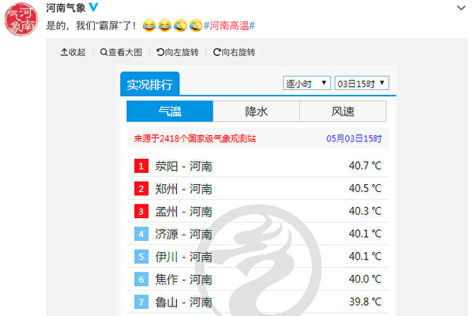

5月3日，河南郑州、荥阳、孟洲、济源、伊川温度均超过40℃。（河南气象官方微博截图）

   
【大纪元2020年05月03日讯】5月3日，河南郑州发布今年首个高温预警，称3日下午郑州市区最高气温达40℃以上。实际情况显示，不仅郑州高温，河南荥阳、孟洲、济源、伊川亦超过40℃。

5月3日上午10时20分，郑州市气象台发布上述高温红色预警信号。此预警比2019年的6月2日早了一个月，比2018年的7月20日早了两个多月。

3日下午近16时，河南气象官方微博发高温统计图，显示3日15时，河南荥阳市温度高达40.7℃，郑州高达40.5℃，孟洲市高达40.3℃，济源市、洛阳伊川县均为40.1℃，焦作市40℃。

当地网民说：“别说了，快化了。”“热晕。”“我已经热糊了，靠风扇不停的吹，救命。”

还有洛阳市、新乡的网民表示当地温度也已经高达40℃。   

<a target="_blank" href=#top><h6 align="right">回上方</h6></a>
  
  
<a name=27>
<h1 align="center"><b>【一线采访】原材料价暴涨 陆口罩厂经营难</b></h1>

因大陆原材料紧俏和大幅涨价等问题，导致不少厂家运营艰难。图为示意图。（中央社）

【大纪元2020年05月03日讯】（大纪元记者顾晓华、张北采访报导）中共病毒（武汉肺炎）疫情延烧全球，各国对口罩的需求陡增，大量口罩生产厂家也在中国应运而生。虽然出口销路好、利润可观，但是原材料紧俏和大幅涨价等问题，导致不少厂家运营艰难。

李迪（化名）是浙江义乌一家卫生用品股份公司的股东。该公司已成立七八年，拥有数百名员工，原本以生产儿童纸尿裤为主。由于今年口罩行情好，工厂车间又适合生产口罩，公司在二月份申请了执照，投入三千万人民币买了两条生产线，还另招了几十名员工。因为当时政府支持，执照很快在三月份批下来，工厂也开始投入生产。

据李迪介绍，他们生产的口罩大部分出口到海外六国。一般来说，买家先下订单、提供样品，公司再按照订单大小和不同的要求标准报价；谈妥价格签合同后，买家预付50%订金，然后工厂开始生产。截止目前，公司已经分批出口了二千多万片口罩。

李迪说，按照正规渠道每天不停地做收入很可观，公司不但可以在今年收回成本，还能赚钱。他说，“口罩一个钱赚的不多，但是批量大，都是千万千万的下单，这就不一样了，我们现在口罩的利润就是两角三角之间吧。”

此外，公司还有纸尿裤生产线，如果口罩的生意没那么好，员工可以生产纸尿裤。纸尿裤也能赚钱，但是销量没有那么大，利润也赶不上口罩。

<b>熔喷布稀缺 价格畸高</b>

然而，口罩关键原材料熔喷布的极度稀缺导致工厂生产困难。如果买不到熔喷布，工厂只能停产。

李迪表示，正规的熔喷布只有中石化和液化公司能生产，其它公司做的都是假的。但是正规出品的熔喷布都已被有门路的中间商收购，普通渠道根本买不到。“熔喷布不好买，有些供应商，那些二道贩子买了收藏起来了，暗地里卖。”他说，“就是那些跟中石化有关系的人，朋友啊，亲戚啊，只有这些人能拿到货。”

但是，这些人都以高价转卖，且不出具任何交易票据。“你只能当时看这个货可以你就付款，不行你就不会付款，但是你要他们给你开什么收据他们是没有的。”李迪说。

现在，熔喷布暴涨到70万元一吨，公司还要到外面去找才可能找到。“买不到熔喷布就做不了，我们熔喷布不达标是不做的。”李迪说，“熔喷布现在手头有个七百公斤，很紧张。这个也就能生产一天多，能生产一百多万枚口罩。”

<b>无纺布厂家违约涨价 拒不出货</b>

李迪的公司在购买另一个关键原材料——无纺布时也困难重重。经过四处打听，他们找到温州的雨泽科技公司，向其订了17吨无纺布，每吨一万五，签合同后给了三十万元定金。但是出了四吨货后，雨泽就不再发货。

“他说涨价了，要我们加价，不加不给我们货。”李迪说，“一吨涨到三万，涨一半，我们采购不同意，就跟他们谈，但是谈不成。”

由于没有无纺布工厂停工，公司的几十位股东在4月30日南下温州，到雨泽的厂里要货。但是，雨泽不但不给货，还找当地的社会人员阻止他们进厂。“最后我们没办法，我们用车把门给堵死了，他没办法打110报警，派出所过来都处理不下来，协调没协调好。”李迪说，“当地派出所是维护当地，不会在我们这一边。”

最终，当地的市场监管局也被叫到现场，双方以每吨加五千元的价格达成协议。

李迪说，因为没有原材料，工厂经常性停工；虽然政府声称严查高价原材料，但高价现象一直存在。“因为现在的关系网太大了，有些东西管控不了的。”他说。

<b>原材料价高 企业维持不易</b>

据李迪介绍，义乌做口罩的工厂不是很多，成规模的正规企业更少；小规模的、家庭作坊式的很多，但他们没能力购买高价熔喷布，只能用劣质的，因此产品达不到生产许可标准，也不能出口。这些厂家既没有许可证也没有营业执照，它们的口罩都在中国的网上或实体店以较便宜的价格出售。

像他们这样各种证件齐全的正规公司主要负责出口，但是生意也越来越难做。“订单生意现在还是有，但是没有以前那么多了，因为材料都涨，我们这边做不起。”李迪说，“那就只有高价卖，但是订单就很难接，价高了别人接受不了。”

此外，政府管控越来越严，企业办理出口手续不容易，还要每天接受检查。李迪透露，一定要认识政府部门的人，不然办不下资质，非但赚不到钱还要亏钱。“现在外贸、进出口都不好办了，好多小企业都放假了，但是没有全部停产。生意不好的就精减人数，年岁大的或者来晚的就不要了，因为没有事做了。”

李迪表示，办企业也是不容易，要冒很大的风险。他们公司的高管为生产口罩投资三千万，他本人投了几十万，到时候分股利。对于行业前景，他说：“现在是能做多久就做多久，将来怎么样不好说”。

<a target="_blank" href=#top><h6 align="right">回上方</h6></a>
  
  
<a name=26>
<h1 align="center"><b>【翻墙必看】金正恩露面手腕惊现神秘疤痕</b></h1>

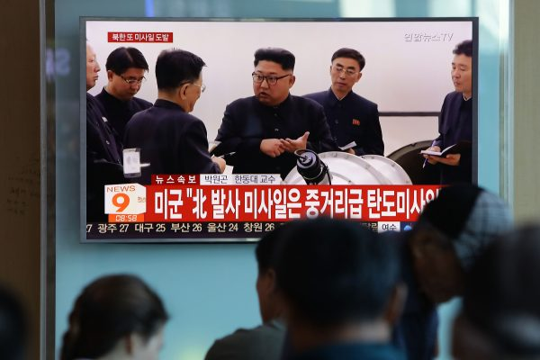

根据朝鲜官媒发布5月1日的视频，金正恩的右手腕上出现一个新疤痕，医学专家判断，可能做了心脏手术。图中为金正恩。 (Chung Sung-Jun/Getty Images)

   
   【大纪元2020年05月03日讯】（大纪元记者吴英报导）根据朝鲜官媒发布5月1日的视频，金正恩的右手腕上出现一个新疤痕，医学专家判断，可能做了心脏手术。

金正恩“人间蒸发”20天后，5月1日出席了平安南道顺天市一座新肥料厂的竣工典礼，总部位于首尔的朝鲜新闻网（NK News）5月2日报导说，仔细检查朝中社公布的录像后发现，金正恩右手腕上似乎有一个针头大小的疤痕。

医学专家说，根据那个疤痕大小，看起来金正恩可能接受了“心血管手术”。

 朝鲜新闻进行比对后报导说，金正恩4月11日出席劳动党中央政治局会议时，右手腕并没有这个疤痕。

现年36岁的金正恩4月11日后就未公开露面，即使4月15日太阳节庆祝活动以及4月25日朝鲜创建军队的纪念日等两个重要的活动，金正恩也没有在媒体上露脸。
一位在美国接受过培训的医学专家告诉朝鲜新闻，这个伤痕看起来像是“右动脑穿刺……（这是）常被用来通过冠状动脉置入支架的手术”。

“（疤痕）看起来大约一个星期了，”他补充说，“从照片很难看出来，⋯⋯，这应该不是静脉注射，因为它不会留下这样的伤痕。”

一名韩国外科医师告诉朝鲜新闻，金正恩手臂上的伤痕“看起来更像是与心脏问题相关的医疗程序或检查，所留下来的疤痕”。

美国总统川普（特朗普）5月1日在得知金正恩现身公开场合后表示，他还不想对此发表评论，会在适当的时候对此发表评论。

5月2日，川普发推文说：“我很高兴看到他回来了，很好！”

川普上周被问及有关金正恩去向的问题时表示，他确实知道金正恩的近况，但是“现在不能谈论它，只能祝福他们”。

<h4 align=center><a href="https://twitter.com/alistaircoleman/status/1256560979900616704?ref_src=twsrc%5Etfw%7Ctwcamp%5Etweetembed%7Ctwterm%5E1256560979900616704&ref_url=https%3A%2F%2Fwww.epochtimes.com%2Fgb%2F20%2F5%2F3%2Fn12078979.htm">个伤痕看起来像是“右动脑穿刺……（这是）常被用来通过冠状动脉置入支架的手术”(点击右键,另存新档）</a></h4>

<a target="_blank" href=#top><h6 align="right">回上方</h6></a>
  
  
<a name=25>
<h1 align="center"><b>【新闻看点】美连6大动作 美中角力升级</b></h1>

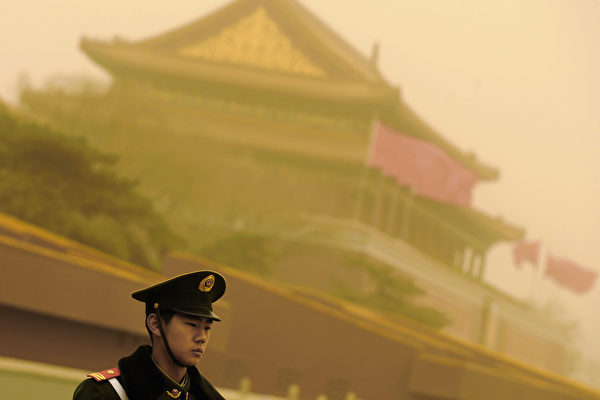

美近日6大动作指向中共，北京战狼式四处出击输世界？ 图为资料图。(LIU JIN/AFP)

【大纪元2020年05月02日讯】大家好，欢迎关注新闻看点，我是李沐阳。

先说一点金正恩的消息。今天是五一劳动节，金正恩发了一份感谢词。朝鲜官媒《劳动新闻》说，金正恩在感谢词中向朝鲜的多个行业表达感谢。

但是一直到中午，金正恩始终没有露面。这个金胖胖到底是不是还活着呢？如果不露面，光是打这种空响炮，压不住人们的猜测啊……

今天已经美东时间的周五了，中港台的时间已经是周六了。但是我们仍然没有看到朝鲜方面有什么宣布。

再说另一个事。看到这么一段视频，是发生在前几天的事。画面中这位穿红色风衣的姑娘，是一位护士。4月25日，是她的生日。因为要保持社交距离，所以她的朋友们只能用这样的方式来为她庆祝。这里面既有朋友的情谊，也有一份敬意和谢意。

其实，每天晚上7点，在纽约的医院附近都会传出掌声。人们都是用自己选择的方式，发出各种声音，向抢救生命的医护人员表达心中的感谢。

但是在大陆，有这么一个情况，曾经前往湖北支援抗疫的四十多名医护人员，被医院给辞退了。涉事的陕西咸阳妇幼保健院今天作出了回应，说去年11月就已经推出了“优化方案”，只是受疫情影响，才推迟了。

这医院不但不给上一线抗疫的补助，还直接把人给解雇。这桥拆得也太快了吧？

<b>全球感染324万  美考虑对中共制裁</b>

截止到早上6点，全球感染中共病毒的总人数已经高达324万3300多人，死亡23万零56人。这两个数字都不包括中共通报的中国大陆情况。美国仍然是最严重的国家，确诊病例是109万7300多人，死亡63,913人。无论是染病还是死亡数，都远远高于其它国家。

这场疫情发展到这种地步，中共的责任显而易见。而中共趁着疫情扩散的时机，增加地缘政治影响力，已经引起了各国的警觉。特别是中共战狼轮番上阵，又是甩锅又是谩骂，结果招来了美国连番大动作反击。

昨天（4月30日），川普政府匿名官员向《华盛顿邮报》透露，美方正在考虑对中共采取报复措施，让中共对中共病毒疫情的全球大爆发进行赔偿。

这位匿名官员表示，昨天有多个政府机构的高级官员专门为此开会，进行讨论，情报机构的官员也参加了这个会议。

另有4名政府资深官员表示，他们正在寻找惩治或者向中共求偿的方案。他们向《华盛顿邮报》透露了，川普除了责怪北京隐匿疫情之外，与幕僚们也讨论了应对中共施行激进措施的方案。

曾经担任川普政府高阶行政人员的索里尔（George Sorial）也表示，川普和白宫正在检视各种方法。

目前还没有更多关于这个专门会议的消息，但是可以确定的是，美国可能已经决定要出手还击了。

<b>中共跳脚，战狼连出击</b>

美方的追责调查，很可能击中了中共的软肋，反应激烈。

昨天（30日）中共外交部发言人耿爽表示，中方也是病毒受害者，不是病毒同谋。受害者同命相连，应该团结协作。还说“拆别人的台，最终也将拆自己的台”。

表现更激烈的是中共央视，罕见地连续三天批评美国国务卿蓬佩奥，措辞相当严厉，几乎是泼妇骂街。说他散播“政治病毒”、“背负四宗罪”等等，叫骂声在近些年很罕见，甚至已经不是外交战了。
美国六大动作反击

不过中共越像战狼一样出击，遭到的反击越大。总的来说，美国近日六个大动作，对中共的反击是比较明显的。

<b>六大动作之一：取消中共“主权豁免”</b>

前面提到的那位美国匿名官员表示，高级官员们讨论的内容之一，就是剥夺或者限制中共的“主权豁免权（sovereign immunity）”。就这个问题，川普和助手们私下里已经先行进行了一些讨论。目的是方便美国政府或者疫情受害人向中共提起诉讼，要求赔偿。

什么是“主权豁免权”呢？这是美国国会在1976年通过的一项法律，主权国家一般不受另一个主权国家法院的管辖。通俗地说，当外国对中共进行起诉，它如果有“主权豁免权”，那么控方是打不赢官司的。

而如今美国已经就中共的“主权豁免权”问题专门进行讨论，说明川普政府很可能是要进行实质性的对中共追责，必须要对中共进行实质性的报复。

那位匿名官员还透露，美国还有一个选项，就是取消中共持有的美国国债。不过他表示，目前不清楚川普总统是不是支持这样做。

但是取消中共持有的美国国债问题，被白宫首席经济顾问库德洛（Larry Kudlow）否定了。他昨天对路透社表示，白宫并没有考虑消除中共持有的美国国债。他说，“美国债务责任所拥有的充分信任和信誉是神圣不可侵犯的。其它就不用说了。”

<b>六大动作之二：调查病毒源自武毒所？</b>

与商讨是否取消中共“主权豁免权”相比，对病毒来源的调查，时间要稍早一些。目前，美国可能已经掌握了初步的证据，显示病毒来源就是武汉病毒研究所。

昨天（30日）同时传出2个重磅消息，先说第一个。美国国家情报总监办公室发出声明，表示情报界已经取得一个广泛的科学共识：病毒不是人造的，也不是经过基因改造的。

这个声明基本上推翻了此前人们的各种猜测。比如病毒是人工合成的，再比如病毒与中共的生化武器有关等等。

不过声明也表示，情报界还会继续严格审查新的信息和情报，以确定是不是因为武汉某实验室的意外事故引起的。

声明没有直接说武汉病毒研究所，但是也基本可以断定，这里指的就是武毒所。

第二个重磅消息是川普讲出来的。他在回答记者提问时说，他看到了中共病毒与武汉病毒研究所的有关证据。

记者问他，目前有没有看到任何证据让他高度相信武汉病毒研究所是中共病毒的来源。川普的回答简单明了：“有。我看到过。”

然后记者追问究竟看到了什么证据，川普说，“我不能告诉你这点。我不被准许告诉你们这点。”

从情报总监办公室的声明和川普肯定的回答当中，大家已经可以得出一个结论。在美国三大情报部门的调查下，对于病毒来源，美国很可能已经掌握了证据。

其实病毒是不是源自武汉病毒所，法国《世界报》4月25日的长篇调查，与美国情报界的调查结果是相互佐证的。报导中表示，武毒所P4实验室病毒传染中心负责人石正丽在疫情爆发后，陷入了焦虑和害怕中。

文章引述石正丽自己的说法，“好几夜没合眼，反复回想自己的每一项研究，不停问自己病毒是不是从我们那些实验室泄漏的？”她说，“的确使我头脑乱了，闭不上眼睛。”

从石正丽的讲述和担心状况来判断，P4实验室很可能有这种病毒。所以在外界纷纷猜测之下，她才产生压力，担心是实验室泄漏的病毒。

同样是昨天（30日），德国朝野也发出了独立调查病毒源头的呼声，要求向北京施压。《奥格斯堡汇报》在线文章说，执政的基民盟和在野的自民党都认为，调查应该尽快展开，才能找到证据。“中国（中共）如果没什么好隐瞒的，就没有反对的理由”。

<b>六大动作之三：美国军机单月13次现身台海，8月环太平洋军演</b>

今天（1日），记录军事飞行器动态的“飞机守望”（Aircraft Spots）推文披露，美军两架B-1B战略轰炸机从美国南达科他州空军基地起飞后，进行了长达32小时的远航飞行训练，于30日在南海上空进行了飞行。

昨天（4月30日）下午，美军EP-3E侦察机又一次接近台海中线最尾端。这是美国军机在4月份第13次现身台湾外围空域，飞经巴士海峡、菲律宾巴坦群岛以西，随后接近台湾海峡西南方空域，并在外围空域绕飞多次。

军事专家王臻明表示，美军机在台湾西南外海“台湾浅堆”附近以三角形航线徘徊不去。这是“典型的侦搜作业飞行模式”，“摆明了就是监看什么东西”。

他对《自由时报》表示，“台湾浅堆”因为水浅而得名，最近中共军方一直在这里偷偷抽砂。但可能不只盗采这么简单，可能是要抽出一条水道，让潜艇可以伏击台湾的水面舰艇。

如果王臻明分析是对的，那么美国军机在这里飞行，就是在针对中共的企图，进行相应的遏制行动。

另外前天（29日），美国太平洋舰队司令部透露，8月17日到31日，要举行环太平洋军事演习。包括多国联合反潜作战、海上拦截、实弹射击等。各国将评估演训状况，即时调度，保持灵活性。

太平舰队司令阿奎利诺（John Aquilino）说：“在当今这个充满挑战的时代，保护重要的航道并确保通过国际水域时的航行自由，海上部队共同努力比以往更为重要。”

<b>六大动作之四：优先监察中共盗窃知识产权</b>

前天（4月29日），美国贸易代表办公室（USTR）发布了年度“特别301报告”。其中显示，中共被列在10个侵犯知识产权“优先监察国”的第一位。

贸易代表办公室发布“特别301报告”，目的是分析美国在全球的贸易伙伴对知识产权的侵犯情况，同时公布臭名昭著的假冒和盗版市场的审查结果。

报告中指出，中共采取了一系列不公平及有害的行为、政策和做法，强迫美国企业技术转让，或者从美国公司的电脑网络盗窃未经授权的创新技术等等。

报告要求北京进行根本性的结构改革，对知识产权保护措施进行最新修订。履行今年1月签署的协议承诺。

八九学运学生领袖之一周锋锁对自由亚洲表示，中国前几十年的经济奇迹，就是通过开放体系窃取国际社会最优先的知识产权的结果。这就像一个癌症的肌体从健康的肌体拿到营养，但是最后它是要害死健康的肌体。美国这是亡羊补牢了，必须要对等、脱钩、对抗。

<b>六大动作之五：限制敏感技术产品出口</b>

4月28日，美国商务部宣布了一项新规定，限制某些敏感技术产品出口到在中国的终端用户，以防止这些技术被中共武装部队使用。

商务部长罗斯（Wilbur Ross）表示，有些国家有将从美国公司购买的商品用于军事用途的历史，考虑到这一点很重要。

新规定取消了对某些集成电路、电信设备、雷达和高端电脑在内的民用产品的豁免。美国之音引述分析认为，新规定下，美国放宽了对军事用途和采购者的定义，任何可能被军方使用的产品都将受到审查。

美国的这个新规定，无疑对中共的军事成长有很大影响。

同样是28日，看到这样一则推文：“让我向各位介绍，地表最强匿踪航母——辽宁号。”配图是海面上黑烟滚滚，从烟雾的动向来看，可能是有船舰在行进。网友还用特别标准嘲讽：“烧的劈柴吗？”

<b>六大动作之六：香港一些官员将被列入美方黑名单</b>

五一前夕，香港保安局局长李家超对《南华早报》表示，不排除把香港的恐袭风险级别提到最高。他说必要时会封锁高风险地点，使用《联合国（反恐怖主义措施）条例》打击当地的“恐怖分子”。

无庸置疑，李家超口中的“恐怖分子”，指的是香港的和平抗争民众。我们已经看到了港府港警镇压香港人民的残忍暴力，不知道他们还会升级到什么程度。

不过，香港的局势一直在美国的关注范围，国务卿蓬佩奥在两周内两次评论香港的情况。

前天（29日），国务卿蓬佩奥再一次评论了香港的情况。他说任何在香港实施严厉国家安全立法（即《基本法》23条立法）的努力，都不符合北京对一国两制的承诺，也影响美国在香港的利益。他表示，美国要继续监察及加强关注北京增加干预香港的管治。

蓬佩奥的说法，明显表示出中共港府对香港人的打压是有目共睹的。尽管疫情很严重，但是美方的关注度并没有削减。

有消息透露，美国国务院将在5月底公布第一份对香港自治情况的评估报告。此时密集就香港问题发表评论，很明显是在发出警示，警告中共不要轻举妄动。

香港城市大学退休教授郑宇硕对自由亚洲表示，美中之间对抗不断升级，从抗疫已经反映出不同的意识形态之争。而香港也成了双方对抗的一部分战场。

郑宇硕认为，估计国务院的报告措辞会相当强硬。或许美国暂时不会取消香港的独立关税地位，但把一些官员列入到黑名单的可能性很大。

不过我们仍然要向香港同胞们提醒，邪恶越到最后越疯狂，一定要更加小心防范，不要遭到中共港共的毒手。

<b>越是像战狼一样四处出击，越失去世界</b>

时事评论员蓝述表示，中共在疫情期间的表现，已经让世界都看到了它的邪恶。它越折腾，美国的反制力度越大。越是像战狼一样四处出击，它就越失去整个世界。

以上是公共区的节目。如果您喜欢新闻看点，请别忘记订阅和点赞，同时推荐给您的朋友。在会员区要说两个问题，当局在给李文亮评定为烈士后，又向他颁奖了。但是对改变中国社会有帮助吗？然后会说说川习友谊翻船的原因，川普亲自说话了。

大纪元《新闻看点》制作组

<a target="_blank" href=#top><h6 align="right">回上方</h6></a>
  
  
<a name=24>
<h1 align="center"><b>【拍案惊奇】朝媒报金正恩现身 习家邓家对呛？</b></h1>

朝媒报金正恩现身，习家邓家对呛？（新唐人合成）

【大纪元2020年05月02日讯】大家好，欢迎收看《新闻拍案惊奇》，我是大宇。

说来有趣。今天，其实我已经录影完毕，剪辑师正在帮助我剪辑。我还是习惯性打开新闻，看看最新消息，忽然发现一个必须更新的内容，所以赶快录了一段，插在开头。

朝鲜当地时间5月2日，官媒朝中社发消息，说金正恩5月1日出席了平安南道一个化肥厂的竣工仪式，一开始跟前几天有关金正恩的消息一样，没有照片，对于金正恩的生死来讲，不足为凭。

可偏偏在我们今天节目录制后，朝鲜媒体《劳动新闻》补发了一批照片，显示金正恩在现场剪彩，而且特别有一张照片，完整显示金正恩所坐的台子后面的幕板上，贴着2020年5月1日的日期。

就在这批照片发出前不久，外界还有不同版本的消息流传，一会儿金正恩活了，一会儿金正恩又死了。当然，韩国政府方面，一直是说金正恩身体健康。那这批照片，如果没有问题，就印证了韩国政府的情报。只是我们在录制这段内容的时候，相关照片刚刚出来。还有人在怀疑照片的真实性，例如是不是替身啊、是不是旧的照片拿来PS的啊，等等。

我想呢，这方面的疑虑，等稍后一定会有更多权威人士出来指证。也不能怪大家怀疑，因为不少人，看上去也是很权威的消息人士，不断放料说金正恩的死讯，所以他这么突然一出现，难免让大家猜测，会不会是其中有诈。现在尘埃方起，我们继续观察。

那这段插播结束后，就是今天稍早录制的节目了，其中还会提到金正恩生死之谜的问题，那是朝鲜媒体还没有发出照片之前录制的。

好，插播的最新消息，就说到这。

【“习远平”发信撑习 提炼三大关键词】

前一天，我看到一则消息，当时在犹豫讲不讲，所以昨天节目里就没提。因为这封信是在给一个比较有争议的人物说好话。直到今天我看有别的媒体引用，所以我想，那我也在节目中分享一下好了，凑凑热闹，因为我本人对这封信的内容也是存有相当疑虑。

这个人物不是别人，正是习近平。发这个料的人，是推特网友“老灯”，但他自己也说无法辨别信的真伪，只是发出来参考。

这则爆料推文，引用的是自称习近平胞弟“习远平”的一封信。想必一些朋友已经看过内容，我们也没必要全文阅读，只取其中三个关键词。

第一个关键词是“政治局约束”，文中说习近平修改国家主席任期制，是为了摆脱政治局约束，改善政令不出中南海的问题；

第二个关键词是“大左才能大右”，表示习近平是要走极端左翼的路线，以便在中共党内站稳脚，然后再彻底政治改革，包括新闻舆论开放、市县普选，等等，还说自己兄弟两个是中共党内大开明派习仲勋的儿子；

第三个关键词是“高级黑”，说之前一些惹起公议的事，是习近平下面的一些人，对习进行高级黑故意“难堪”，目前对几个政法口几个人的处理，正是一种清算。

我们就提炼这三个关键词，暂且不说第一个关键词“政治局约束”，还有第三个关键词“高级黑”。因为说习近平要摆脱政治局约束、挣脱对他的高级黑，这一定程度是可以理解的，虽然说有时被黑，可能也怪不得别人，比如他在本次疫情初期，就公开说自己“亲自部署、亲自指挥”，主动背锅，政治谋略令人着急啊。

【习近平先大左再大右？实为舍近求远 多此一举】

但是说到第二个关键词“大左才能大右”，这个是最让人疑惑的了。我记得有高人讲过，大意是，如果习近平今天说我们不要中共了，那中国共产党立即解体，一刻都不会存在。

因为呢，这是现在的人心所向，天意所在。可搞“大左”恰恰是逆其道而行之，一味强化中共领导，甚至近些年一直对外渗透、扩张，一带一路、中国制造2025、千人计划啊，这都引起西方国家警觉，如果说“大左”仅仅是为了巩固党内地位，完全不需要做这些吧。

所以习的姿态，给人感觉并不是为了巩固地位在搞“大左”，在外界看来，他更像是在持续维护，甚至强化中共这个体制。在重要的大政方针上，不说远的，就说近的，对台湾的文攻武吓、对香港反送中的处理、在内部对中国人不断强化的大数据监控，等等。

这些事，就算有其它因素的参与，但可都是在他的任内发生的，能不承担责任吗。搞“大左”搞得越久，欠下的债务就会越多，失的人心也就越多，自己也可能被政敌利用内外局势的紧张之机反扑，地位岌岌可危。

所以说，这封信说习要“大左才能大右”，这一点很难让人信服，说轻一点是没看清形势，说重一点，是愚，是逆历史潮流而动，逆天而行。这个逆潮流而动的后果，孙中山早就警告过了。

【“习远平”信中提政改：好戏在后面】

另外，这封信中，虽然替习说好话，提到了所谓“政改”，提到开放舆论、甚至选举，但是却忽略了很重要的一点，正是因为忽略了这一点，所以我严重怀疑这封信是不是这么核心的红二代“习远平”所写的，因为没有提到的这一点很重要。

我们说，只要开放舆论，是不是媒体可以畅所欲言呢？是不是网络防火墙要被推倒呢？那么中共做的那些事，是不是就都公开了，六四镇压、迫害法轮功、镇压少数民族、各种被他们维稳掉的消息，是不是都可以被所有中国人看到，那么中国人还会让这个政权继续存在吗？

如果舆论不开放到这个程度，那还叫开放吗？选举也一样，你不用大陆开放市县选举，先让香港实现真普选，顺水推舟的事，你看中共让不让。对于腐败，我们都听过一句话，叫不反腐亡国、反腐亡党。其实其它的事，开放舆论啊、选举啊，对中共的意义是一样的。

所以，很多海外的分析人士会这样认为：对中共这个体制来说，没有改革，只有下台。

有关这个所谓的习远平的信，我们就聊这些。当然了，这封信中也提到一句，说“好戏在后头”，如果真有这事，那我们也是好奇，想知道今后这好戏，是什么样的戏。

【“邓朴方”致信两会代表问责习 称中共老人被习限制自由】

但是好戏没看到，现在威胁习的信号已经越来越多。网络媒体“新高地”5月1日公开了一封“邓小平”长子邓朴方的一封公开信，早有海外熟悉中共内情的投资人士说，邓家正参与倒习。这封信尚没有被第二方证实，如果是真的，那也许也印证了此前的传闻。

这封新高地发出的邓朴方公开信，是写给定于5月下旬在北京召开的两会代表们。

信中提到，这些代表在这个特殊时期去北京参加两会，是战战兢兢的。邓朴方说，因为身体原因，近10年不怎么过问政事，但如今再没有人出来讲话，今后可能再也没有机会出来说。他在信中提出了15点问题，都更像是反问句，包括：两会代表是维护人民还是某个专权者的权位？中央近年推出“不知敬畏罪”和“妄议罪”，两会代表存在还有什么意义？当权者定于一尊是谁的一尊？本次疫情中央是否隐瞒，谁该负责？中美关系恶化、外资大批撤离、香港动荡、台湾渐行渐远、一带一路无理性投入等，谁该负责？为阻止中共老领导们发出集体动议，中央用军警把大批老领导和现任党政军大员加以“特殊保护”，实为限制自由，这是谁给“他”的权力？

在发出一系列反问后，信的结尾说这些代表，不要为某个当权者负责，不然将成为千古罪人。

这封信中所针锋相对的对象，很明显就是习近平。有人对这封信提出质疑，比如邓朴方作为体制内的人，为何把瘟疫也叫成了“武汉肺炎”等等。但是最近一个多月，有关要向习近平问责的消息不断传出，还有其它一些实例，我们都报导过，这些都显示出，中共高层对习近平的不满，极可能不是空穴来风。

【川普改变对习看法 直指中共造成瘟疫流行】

就连外国都是。美国总统川普啊，以前在公开场合、或自己的推文上，说自己跟习近平是朋友，私交很好。但是现在，口风也变了。

4月30日，川普在白宫回答记者说，因为中共病毒瘟疫，自己对习近平的看法极大地改变。川普的意思是，中共隐瞒瘟疫真实情况的事情，令他极大改变了对习近平的看法。这场瘟疫，川普当天说已经让一百八十多个国家蒙难，美国也在瞬息之间，关停了蒸蒸日上的经济，关闭了国家。

川普认为，实际发生的情况表明，中共要么是选择不去有效遏制疫情，也就是说让中共病毒传播和失控，使瘟疫在世界流行，而要么呢，就是中共没有能力这样做。川普还说：病毒原本可以在中国就被抑制，但是它传出来了。

而川普指责说，当初疫情爆发的时候，中共允许国际航班飞往意大利、飞往别的国家，这都造成了瘟疫在世界范围的传播。

他也点名世界卫生组织，说世卫应该为自己的行为感到“羞耻”，因为它替中共宣传，跟中共沆瀣一气，而且至今还在替自己当初的不作为找借口。

【川普或以万亿新关税索赔 专家：冻结官员财产更具威慑】

如今，川普表示，他已经把对中共在瘟疫问题上的追责，摆到了原本的贸易协议之上，他提到，可能通过征收更多关税来向索赔，大约是一万亿美元。

也有海外时政评论人士唐靖远认为，制裁或者索赔的最好方式，也许是冻结中共官员在美的财产，并将相关人员和家属，列入永远禁止入境的黑名单上。

【川普称看到病毒来自武汉实验室的证据】

目前，各国由于瘟疫而向中共索赔的理据，多是基于中共的隐瞒。而现在中共在造成瘟疫世界流行的另一个，更关键的责任也越来越浮出水面，那就是，病毒的来源，越来越指向于武汉的病毒研究所。

在4月30日答记者问的时候，川普说：自己已经看到了有关证据，只是没有透露详情。

大家还记得，我们上周报导过，有人爆料说，有武汉病毒实验室的高级研究员上周成功出逃到欧洲，说会公开说出自己掌握的信息，只是至今还没有露面。

【传武汉出逃研究员正是石正丽 孙力军协助外逃？】

但是同样在4月30日，推特账号“号角”发消息说：武汉病毒所出逃的研究员，竟是“石正丽”本人，说她携带全家和近千份秘密文件，在驻法国的美国大使馆申请庇护，甚至提到，帮助石正丽出逃的是前些日子落马的公安部副部长孙力军。

这个信息因为极具戏剧性，很多网友，我看留言，是不相信的。也的确有疑点，因为有消息说，孙力军其实3月底4月初就已经被当局控制，更早的时候，就已经在被调查之中，他帮石正丽，按理讲也应该是4月以前的事情，但是上周才传出有研究室人员出逃的事件，这个时间点有点儿对不上。

而且恶贯满盈的孙力军，为什么要做这件事呢？他自己带着材料出逃不好吗。当然了，这个爆料是真是假，只有等到那名研究员，真正公布自己的身份后，答案自然揭晓。如果真是石正丽，那就热闹了。

【美国教育部调查德州大学与武汉病毒所关系】

美国《华尔街日报》并在5月1日报导，美国德州的大学系统，也成为了调查目标之一。美国教育部已经要求，德州大学系统提交与中共方面往来的大量文件。包括华为、中石油、视频软件zoom等二十多家中国大学和企业，其中还包括武汉病毒研究所。

美国教育部想让德州大学提交，有关它与武汉病毒研究所及其研究员石正丽之间的馈赠及合约。这说明很重要的一点是，美国针对武汉病毒研究所及石正丽的调查，是实实在在地在进行中，而且规模不小。

那么，接下来，我们再关注一下金正恩的消息。

【时隔20天金正恩终露面？新政令书写有异常】

当地时间5月2日，朝鲜官媒朝中社报导，已经有大约20天没有露面的金正恩，再次出席了一场活动，是5月1日在朝鲜平安南道出席“顺天磷肥工厂”的竣工仪式。而上一次露面，还是在4月11日的朝鲜劳动党政治局会议上。

最近类似的信息还有，4月30日，《每日朝鲜》引述消息人士的话说，4月29日，在金正恩消失这么久后，朝鲜政府首次发布金正恩亲笔签字的政令，唯独格式和口吻上跟以前不一样。

往往，金正恩每周都至少下发一次政令，这次罕见隔了这么久。而且一般金正恩的政令会包含至少7项具体指示，但这次只有3个，而且说法笼统，说的事也都不新鲜。同时，信的格式没有遵照旧例。

通过以上两个消息看，发布金正恩的消息，可却没有金的身影，还出现了很多与以前不一致的地方。说是辟谣，不如说是像在给外界放风，说金正恩真的出问题了。

【有脱北者仍坚信金正恩已死 金与正崔龙海掌权？】

目前在韩国的脱北者池成浩对媒体表示，99%确定金正恩已经死亡。而金正恩确实接受了心血管手术，手术后一开始不怎么清醒，但后来就挂了。他认为朝鲜领导层内已经相当混乱。

《自由亚洲》的另一篇报导，没有再提金正恩的妹妹金与正与叔叔金平日共同掌权，新的消息是，根据一名消息人士朱立熙的话说，他没有认为金正恩已死，而是一直卧床，他比较倾向于相信金与正掌控大局，但是对金正恩叔叔金平日掌控军权有疑问，因为他并非金正恩身边的政治红人，朱立熙认为，是金正恩身边的另一个二号人物“崔龙海”，更有可能掌控军队，与金与正一起掌握局面。

与此同时，美国军队这边，最近也有一些动作。

【美国B-1B轰炸机从本土直飞南海 在暗示什么？】

美国先进的B-1B隐形轰炸机，曾经为了威慑金正恩政权，出现在朝鲜半岛区域。而如今，也许是为了因应中共近期在南海的活动，4月30日，美军派出两架B-1B隐形轰炸机，从美国南达科他州的一处军事基地起飞，直接飞到另一个半球的南海，最后又返回在美国相同的基地。绕了地球大半圈，前后用时一共32小时。这一方面是为了彰显美国的全球打击能力，另一方面，也是在南海问题上作出的一种回应。

目前，中共因为疫情控制不力而被各方追债，外界担心，中共可能在危机中，采取一些非常手段，因此，最近各国的军事行动，也备受关注。

今天我们暂时跟大家分享这些，下期节目咱们继续聊。

如果您有爆料信息，可以给我们发邮件，我们的节目电邮是：xwpajq@gmail.com。有推特的朋友，也可以在推特上关注我，我的推特账号是@xwpajq。

新唐人《新闻拍案惊奇》制作组

<a target="_blank" href=#top><h6 align="right">回上方</h6></a>
  
  
<a name=23>
<h1 align="center"><b>四川宜宾大桥发生坠落事故 市民：太吓人了</b></h1>

【大纪元2020年05月03日讯】5月2日下午，四川宜宾市，G85渝昆高速叙州区柏溪段跨金沙江大桥下方悬挂的金属附属设施突发坠落事故。有目击者表示，坠落物差点就打到人，太吓人了！据悉，该桥长1712米，目前尚无法确定是否有人员伤亡。

据上传到网上的现场视频显示，金属附属物从宜宾市叙州区柏溪镇江凹口开始，沿金沙江大桥至叙州区普安镇。

现场一名目击者表示：“刚刚我的车子慢一秒都要遭殃。”另一位市民也惊呼：“好吓人哦，差点点就打到人了！”

四川高速川南公司科长万代国向陆媒记者称，垮塌的是“环保径流系统”，这座桥是2018年10月份竣工的，具体情况还在排查中。

5月2日晚，当地政府发布通报称，当天傍晚6点10分，G85银昆高速公路叙州区金沙江特大桥径流排污管道发生垮塌，事件导致叙州区柏溪街道江霞路和赵场街道马小路断道，金沙江封航。

目前，事故仍在处理中，尚无法确定是否有人员伤亡。

此事在网络上引起了民众热议。有民众质疑：“18年竣工，用了2年出问题？”

“才用两年，这又不刮风又不下雨的，大晴天咋就掉了呢？豆腐渣工程吗？”

“莫惊慌，豆腐渣而已。”

“没有大货车经过，没办法甩锅了。”

还有民众问：“环保径流系统是个啥？”有网民答道：“径流收集系统（用于收集桥面污水的管道），麻烦写稿的人别拿专业术语显摆，读者看不懂还是看不懂。”

“说的复杂一点，吃瓜群众看不懂就不骂了！说实话四川这两天出事还挺多！”

<a target="_blank" href=#top><h6 align="right">回上方</h6></a>
  
  
<a name=22>
<h1 align="center"><b>【一线采访】武汉军运村变方舱 业主抗议</b></h1>

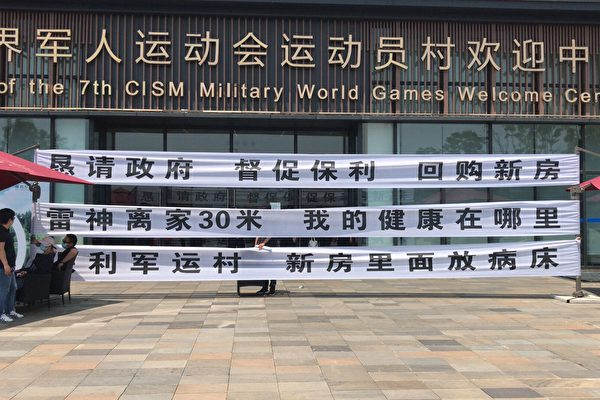

5月2日，湖北武汉市保利军运村数百名业主在售楼部打横幅，抗议在未被告知情况下，购买的新房在疫情期间变“方舱”，要求退房。（受访者提供）

   
   【大纪元2020年05月03日讯】（大纪元记者顾晓华采访报导）5月2日，湖北武汉市保利军运村数百名业主在售楼部打横幅，抗议在未被告知情况下，购买的新房在疫情期间变“方舱”，要求退房。现场与警察发生冲突，10人被抓。

去年10月下旬，武汉举行的世界军人运动会（简称军运会）让军运村声名大噪，军运会结束后，运动员居住的房子由武汉保利金夏房地产开发有限公司承接销售，由于军运村位于黄家湖湖岸公园旁，优越的地理位置环境吸引着武汉民众，特别是老年人在这里购房度晚年，虽然价格高达每平方米16,500元，但是购房者趋之若鹜。

但是中共病毒（武汉肺炎）的大爆发，让业主们购房初衷的美梦彻底破灭。

军运村的业主李女士向大纪元记者透露，在疫情封城期间，部分业主通过新闻媒体报导与其它渠道了解到自己购买的楼房距离雷神山医院仅有二三十米，不仅如此，开发商与政府更是征用业主购买的新房设置3000张病床，作为支援武汉外省医务人员以及从方舱医院出院的病人后期隔离点，并且以每天100元的价格租给疫情期间滞留在武汉的外地人。

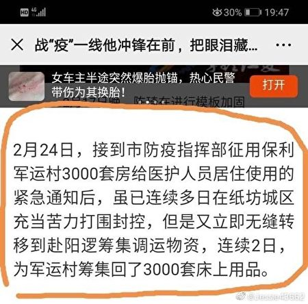

业主购买的新房设置3000张病床的媒体报导。（网络图片）

“我们当时看重的就是大品牌，又是军运村，但是出现了让人不可思议的结果，首先你建雷神山医院，离居民区只有20米的地方，保利没有告知业主，我们是在新闻上面才知道。”李女士说。

“然后马上没过多久，保利又安置病床，到我们的新房里面，这样所有买房的业主肯定接受不了，而且保利没有任何人出面给我们沟通这件事情。”

业主们知道此事以后不停地给售楼部拨打电话，“我们很早开始想跟保利沟通，包括打给他们的官方，但是电话也打不通，没有任何途径，然后我们自发的就来了。大家也不愿意维权，如果不是（被）逼得太狠。”李女士说。

据李女士介绍，5月2日军运村售楼部前来了200多名业主，他们打横幅，喊口号，同时现场来了四五十名警察，期间发生肢体冲突。

参与维权的业主包括老人、孕妇，以及刚刚做完心脏搭桥手术的病人等。2日天气炎热，许多老年业主在门前站了一上午，支撑不住，想进入售楼部休息，或者上厕所，结果遭到阻拦，进而与警察发生肢体冲突。

李女士说：“抓了十个左右，有一个是被120拉走了，我们也不知道伤势。还有一个老人也被抓走了，有一个刚做完心脏搭桥手术病人也被抓走了，我们很担心他们，希望（他们）尽快被放出来。”

业主维权一直持续至傍晚，但是被抓的业主还未获释。保利方面声称15日以后给予答复。

“我们的诉求目前就是和保利解除签的商品房买卖合同，因为现在疫情的出现，房子旁边建了雷神山医院，我们的健康权和生命权受到威胁，因为我们现在对这个病毒是一种恐慌的状态。”

李女士还向记者表示，一直听说此病毒在11月份还会卷土重来，雷神山医院到时还将会重新启动。

业主们掌握的新房变隔离点的证据。（网络图片）

李女士继续说道：“最主要是保利那边没给一个沟通平台，只有置业顾问不断地催让我们交尾款，然后说要收我们滞纳金（有业主分三期付款）。”

“如果保利按照合同给我们执行，我们觉得对业主有失公平，疫情是不可抗力，很多业主确实因为这个失去了收入来源，我觉得起码应该有个沟通协商的平台，保利就是冷冰冰地来收滞纳金。”

“反正现在武汉的街道和以前不能相比了，现在每个人包括上班的时候，一直戴口罩。当然很多交通工具大家也是一种很恐惧的心理，都不敢坐，很多人上班现在倾向于买电动车，骑自行车，其实大家内心对这个事情还是有恐惧感的。”

目前开发商拒绝承认业主们购买的新房被征用做隔离点，也拒绝提供任何未被征用的证据，但是业主们表示，他们已掌握了新房变隔离点的证据，而且在疫情封城期间，军运村许多房间晚间都亮着灯。

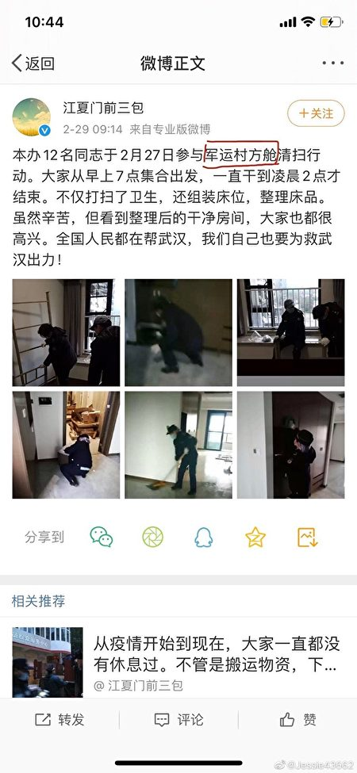

业主们掌握的新房变隔离点的证据。（网络图片）

<a target="_blank" href=#top><h6 align="right">回上方</h6></a>
  

<a name=21>
<h1 align="center"><b>【内幕】不让公民回国 中共却优待俄国嫌犯</b></h1>

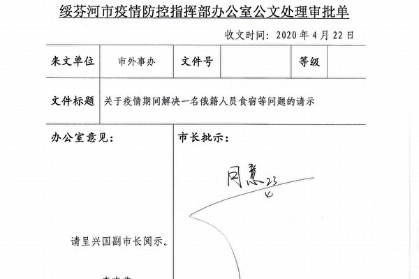

“绥芬河市疫情防控指挥部办公室公文处理审批单”4月22日对“黑龙江省政府绥芬河市外事处”的请示审批文件。（大纪元资料室）

   
   【大纪元2020年05月02日讯】（大纪元记者方晓报导）中共病毒（武汉肺炎，新冠病毒）疫情爆发后，中共欺瞒全世界、漠视海内外民众的生命，导致目前全球至少有22万多人感染病毒身亡。近日大纪元获得的中共内部文件显示，中共对俄罗斯犯罪分子却格外优待。与之形成强烈对比的是，在俄华人遭俄方遣返时，中共不但否认这一事实，还不许在俄中国公民回国。
   
<b>黑龙江为俄罗斯嫌疑犯解决食宿 免费做核酸检测</b>

大纪元获得的“黑龙江省政府绥芬河市外事处”4月21日的红头文件显示，该外事处就解决一名俄罗斯籍人员食宿等问题向“绥芬河市疫情防控指挥部”请示：俄籍人员阿尔曼，因涉嫌走私被绥芬河海关缉私局调查，于2019年10月8日被取保候审。今年4月8日解除取保候审。目前暂住中国熟人家中（该人目前因工作原因处于隔离状态）。由于阿尔曼无法回俄国，请求“绥芬河市疫情防控指挥部”解决其食宿问题。

文件内容显示：“黑龙江省政府绥芬河市办事处”已经请示黑龙江省外办，黑龙江省外办答复由当地做好安抚，妥善解决。为此，特请求“绥芬河市疫情防控指挥部”协助解决该名俄罗斯人的食宿问题。另外，为确保安全，建议为其做一次免费核酸检测。

据“绥芬河市疫情防控指挥部办公室公文处理审批单”4月22日对“黑龙江省政府绥芬河市外事处”的请示审批文件显示，绥芬河市市长批示“同意”；分管的副市长对这名俄罗斯嫌犯的核酸检测和食宿问题作出具体批示。

中共黑龙江省政府绥芬河市外事处内部红头文件。（大纪元资料室）

<b>中国人的隔离、核酸检测等费用全部自理</b>

然而中共对“境外人员入境”的中国人则不提供免费核酸测试及隔离期间食宿免费的待遇。

今年3月中共病毒疫情蔓延全球，在中共大外宣的忽悠下，国外一些中国人选择回国。他们回国后首先被集中隔离14天，其中有些人被检测出感染中共病毒，这也被中共称为“境外输入”病例。而回国人员在隔离（观察）期间的食宿等费用全部自理。

3月22日，《黑龙江日报》刊发“入境怎么隔离？费用谁出？黑龙江明确了”的文章，称“所有入境我省人员，其集中隔离医学观察期间所产生的费用自理（含相关医学检查费用）。”

近期，中共官方通报和来自民间的消息都显示，中共肺炎疫情在黑龙江省二次爆发。另有中共官方文件显示，哈市疫情再度爆发并已失控。市民的不安情绪再次扩大。

据中共官媒新华社报导，4月21日召开的黑龙江省政府新闻发布会上，黑龙江卫生健康委医政医管处二级调研员赵昱辉称，“当前，黑龙江省疫情出现一定程度反弹。快速进行核酸检测、早发现风险人群，对于控制疫情意义重大。”赵昱辉还声称，“倡导群众自愿自费进行核酸检测”。

<b>俄罗斯驱逐在俄中国公民</b>

俄罗斯的中共病毒疫情爆发后，俄罗斯对当地的中国人采取了最严厉的“隔离”措施，且不断遣返当地华人。

中共满洲里出入境边防检查站3月31日下发的内部文件显示，自2019年1月1日至2020年3月30日，经全国各口岸出境至俄罗斯的中国籍未归人员超过15万人。这个数字不包括2019年1月1日之前的数字，尤其不包括那些非法进入俄罗斯的中国公民。若算上非法移民，在俄中国公民数量预计将远超15万人。

4月初网上曾流传“大批在俄华人被驱逐出境，未来几天，将有大约150万华人分别从绥芬河、黑河、抚远三个口岸陆续回国”的消息。网上出现多段影片，显示在俄的中国人一车车地返回国。

俄罗斯卫星通讯社4月10日报导称，莫斯科市长索比亚宁（Sergey Sobyanin）表示，数十名中国公民因违反隔离规定而被驱逐出境。

而中共官媒却不报导这种排华事件，国内看不到一点俄罗斯驱逐中国公民事件的相关新闻，在各大社交平台都看不到相关留言。

<b>中共不让在俄中国公民回国</b>

随着俄罗斯疫情不断恶化，俄罗斯排华情况加剧，在俄华人回国是必然选择，然而中共不但切断俄中陆路交通、限飞航线，而且还用各种奖励鼓励举报“偷越边境”的人员，阻止华人回国。

4月13日，中共黑龙江省政府发通知，鼓励民众举报“非法”进入黑龙江省的人员，并称对越境线索一经查实，将给举报人3,000元（人民币）奖励；如边民自行抓获并交由有关部门处置的，一次性奖励5,000元。

俄罗斯的疫情在近期快速恶化，4月中旬从俄入境中国被检测出中共病毒的病例数已超过500例。这些感染者主要是在俄罗斯经商的中国商户。

莫斯科当地的华商对BBC说，很多中国商户聚集居住在莫斯科两个主要市场的旅馆内，一个房间甚至会住七到八个人，这引发了疫情在这个群体间快速流行。

陆媒“八点健闻”4月14日报导，4月10日好不容易返回国的华商说，她离开俄罗斯前所住的友谊宾馆刚刚确诊了两个病例，“目前宾馆封锁了，所有人的护照被收走了，就地隔离14天，住在里面的华商想离开都不行。”

中共驻俄罗斯大使张汉晖承认，截至4月17日，共有300多名华商进行了中共病毒的检测，96人的检测结果呈阳性。

4月17日，张汉晖与在俄华人代表在线交流时，痛批有国人在绥芬河口岸封关后，仍然“闯关”回国导致病毒输入：“他们为了逃脱责任，声称是‘俄罗斯不让我们待了’。这种做法令人不齿！吃着中俄合作的饭，砸了中俄关系的锅，没有道德底线。”

此外，针对引发网民关注的俄罗斯当局大规模驱逐中国人的传言，张汉晖予以否认。

从莫斯科至北京的国航CA910航班，在抵达第一入境点西安咸阳国际机场落地后，航班全部人员需进行海关检疫、核酸检测、隔离等管理措施。近期陕西卫健委不断通报，查出这趟航班上多名中共病毒确诊者。

据财新网报导，4月26日国航CA910航班再次查出多名病例。

中共驻俄罗斯使馆称，中国国际航空公司自5月起对莫斯科-北京航班实施乘客登机前核酸检测证明制度，所有搭乘该公司航班的乘客须出示俄罗斯当地医疗机构出具的72小时内核酸检测阴性证明材料，方可登机。

报导说，一些将在5月份乘坐CA910航班回国的乘客表示，在俄罗斯当地获得核酸阴性报告并不容易。张莉（化名）和同学一起买了5月10日从莫斯科回国的机票，本以为可以顺利回国，但看到大使馆要求核酸检测的通知后，她感到回国“困难重重”。

<a target="_blank" href=#top><h6 align="right">回上方</h6></a>  
  
  
<a name=20>
<h1 align="center"><b>【瘟疫与中共】西非小国六位内阁部长染疫--李明祥</b></h1>

西非只有两千万人口的布吉纳法索目前疫情严重，六位内阁部长染疫。(Adam63/Wikimedia commons)

【大纪元2020年04月23日讯】中共病毒（武汉肺炎）肆虐全球，一个远在西非内陆的“君子之国”也没能摆脱厄运，该国23位内阁成员中已至少有6位内阁部长确诊，这在全球也是独一无二的。

“布吉纳法索”（Burkina Faso）是西非内陆国家，面积27万平方公里，2019年联合国估计其人口为两千万，曾为法国殖民地，官方语言是法语。“Burkina”指“君子”或“正直的人”，“Faso”则是“祖国”的意思。

<b>六位内阁部长染疫</b>

根据Worldometers的最新数据，截至美东时间4月22日中午，布吉纳法索已有609个确诊病例，39人死亡。

据新人道主义新闻社（The New Humanitarian）报导，该国23位内阁成员中已至少有六位内阁部长确诊，其中包括外交部长、商务部长、教育部长、内政部长等重要阁员。而其首例死亡病人证实是萝丝·玛瑞·康波芮（Rose Marie Compaore），她是该国国民议会的副主席。

别看确诊和死亡的绝对数量不多，要知道其总人口也只有两千万，而死亡数量已居南撒哈拉地区首位。虽然大部分确诊病例位于首都瓦加杜古，但已经向其它城市和郊区蔓延开来。

目前在该国的世卫组织官员杰瑞-乔纳斯·姆巴莎（Jerry-Jonas Mbasha）表示，确诊病例只是“冰山一角”。因为该国唯一一个可以测试中共肺炎的实验室位于第二大城市博博迪乌拉索（Bobo-Dioulasso），离首都有5小时车程。这意味着来自全国的疑似病例如果得到确诊，至少需要等待12个小时以上。

<b>即将到来的公共卫生灾难</b>

目前布吉纳法索只有一个500个床位的医院和一个小诊所被指定接纳中共肺炎患者，医院里的呼吸机也屈指可数。该国政府曾想在首都瓦加杜古建立一个新的测试实验室，但发现却找不到有资质的人组装设备。

在过去一年里，伊斯兰圣战组织和其它武装力量几乎每天进行的武装袭击已使得近80万人离开家园，135家健康中心被迫关闭。武装暴动已经极大程度上削弱了卫生保健系统。

联合国难民署4月7日在日内瓦召开的新闻发布会上警告称，布吉纳法索中部地区有几十万难民被迫露天过夜，长期的物质短缺本来就可能导致一场人道主义灾难，而中共肺炎更是加剧了这一危机。

联合国难民署发言人巴布尔·巴拉克（Babar Baloch）表示，难民署已经给5万难民提供了住所，但还有大约35万难民生活在类似沙漠的环境中，急需住所和水。他表示，“我们正在和时间赛跑”。

布吉纳法索本身就缺水严重，而缺水导致对抗中共肺炎的一些基本措施，如洗手和个人清洁卫生，对很多人来说几乎是不可能的。对于5到10人挤在一间帐篷里的难民来说，保持社交距离或隔离也是无法做到的。

当地的国际红十字会负责人劳伦特·索兹（Laurent Saugy）表示，在目前这种情况下，中共肺炎“带来的威胁让人不寒而栗”。

<b>拥抱中共的沉重教训</b>

在“瘟疫与中共”的系列报导中，一个个实例让我们看到，正如大纪元特稿所说，病毒针对共产党而来，“它循着与中共关系密切的国家、城市、组织和个人一路蔓延。”遗憾的是，布吉纳法索也不例外。

2018年5月24日，布吉纳法索宣布与台湾当局“断交”，两天后，其外交部长巴里（现已染疫）在北京与中共外交部长王毅签署恢复外交关系的联合公报，恢复大使级外交关系。

当月双方即建立经贸联委会机制，此后双方贸易快速发展，高层互访不断。2018年9月，总统卡波雷对华进行国事访问并出席中非合作论坛北京峰会。2019年1月，中共国务委员兼外交部长王毅的非洲四国之行中就包括布吉纳法索。2019年4月布方国民议会议长和外交部长又对华进行正式访问。

根据中共驻布大使李健公开发表的文章，2019年7月，中国农业部副部长屈冬玉当选粮农组织总干事时，得到了布吉纳法索的“坚定支持”，所以外交部长王毅说，“从今以后，联合国的国际机构中又多了一位非洲的好朋友”。

2019年联合国人权理事会上，当二十多个西方国家对中国大规模拘押维吾尔人进行公开谴责时，有五十多个国家也集体发表了一份共同声明表示对中共的支持，这五十多个国家除了俄罗斯、委内瑞拉、朝鲜、缅甸、柬埔寨等本身就存在人权问题的国家外，布吉纳法索和埃及、沙特、阿尔及利亚等国家也在其中。

非洲国家绝大多数是发展中国家，这里是中共长期“耕耘”的重点，中共主要以“利诱”的方式，如大量经济援助、援建、投资、贸易等，影响并左右了多数国家。目前非洲中共肺炎确诊数量最多的几个国家，如埃及、南非、摩洛哥、阿尔及利亚等，无一不是与中共有着密切的政治、经贸关系。而非洲唯一一个没有与中共建交的国家斯威士兰（台湾称为“史瓦帝尼”），受中共肺炎的影响却非常轻微，至今只有31例确诊病例，1个死亡病例。

其实，在当今的国际环境下，与中共建交、贸易密切不足为奇，这也不起决定性作用，关键是能否认清中共意识形态背后的邪恶本质、对中共迫害人权的行为采取什么样的态度。

最明显的两个例子是香港与台湾，两地紧邻大陆，贸易往来密切、人员往来频繁，香港3月23日“封关”之前每天都有大量人员从大陆入境。可这两地的确诊数量和死亡数量都非常低，成为全球对抗中共肺炎的典范。现代科学也很难解释这个现象。

为什么会这样？我们曾报导过，香港民众以“反修例”的方式明确地对中共说“不”，台湾则公开支持香港民主，采取民主选举方式，顺民意而远离中共，自然针对中共而来的这个病毒，也就发挥不了大作用了。而远在非洲内陆、仅仅与中共复交还不到两年的布吉纳法索，却带给了人们一个异常沉重的教训。

<a target="_blank" href=#top><h6 align="right">回上方</h6></a>
  
  
<a name=19>
<h1 align="center"><b>疫期人流少 上海青浦区政府趁机强拆民房</b></h1>

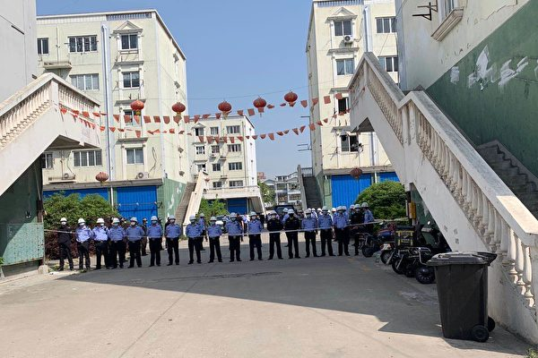

4月30日，政府贴出告示的同一天，强拆队进入小区强拆民房。（受访人供图）

   
   【大纪元2020年05月03日讯】（大纪元记者张北采访报导）4月30日，上海青浦区警察和拆迁队将推土机开进位于徐泾镇松泽大道558弄的一小区，小区3号楼随后被轰然推倒。知情人表示，当地政府想征用这块土地已有两年，但碍于周边国际人员流动量大，迟迟无法动手。目前因疫期人少，他们就“抓住了时机”。
   
<b>黄金地段的“钉子户”</b>

2014年12月31日，上海国家会展中心竣工，成为世界最大的会展中心。此后，上海车展（2015年起）和中国国际进口博览会（2018年起）等大型展会均在此举办，国内和国际人员络绎不绝，附近地段的房价也水涨船高。

被强拆的小区就位于会展中心的北面（下图红点处），该小区建于2000年初，有11栋楼，共900多户。陈妮可告诉大纪元，她舅舅住在这个小区里，他们知道当地政府在两年前就想征走这块地重新开发。

（受访人供图）

“因为对面是会展中心，建筑物非常现代，国际人员流动量非常大”，陈妮可说，但因当时没谈拢赔偿价格，业主都不愿意搬迁。于是政府清理了小区的租户和一楼店面的商家，把清空的房子都贴上封条，还砌了好看的围墙把整个小区包围起来。目前，小区里仅住着100来户业主。

据悉，附近的小区都拆得差不多了，只剩这个最关键地段的小区还僵持着不动，成了黄金地段的“钉子户”。

<b>开发商出面 解除房屋买卖协议</b>

陈妮可说，这块地最初批的是工业用地，后来开发商将其建成了底楼商铺、上面住宅的形式，政府也批了，消防等手续齐全。但是这些房子属于小产权房，业主跟开发商签约买的房子，一直没拿到房产证。

于是，政府又绕过业主私下找开发商协议。4月11日，开发商“上海乐联日用品有限公司”突然贴出一张告示，称业主与其就此处建设项目签订的《加盟协议书》“违反法律法规的强制性规定”，因此决定解除协议。业主被要求在2020年5月20日前办理解除协议并腾退房屋，逾期公司视业主自愿放弃屋内设施的所有权，将自行处置房屋。

同时贴出的还有加盟户腾退标准，其中平层每平米退还6,200元，类复式每平米退还9,200元，类门面每平米退还9,200到10,000元不等。

开发商贴出的告示。（受访人供图）

陈妮可表示，她的舅舅咨询律师后得知，中国的产权非常复杂。“小产权房也属于中国产权房的一种，按法律规定单价赔也要赔周边房价的80%左右。 假如周边的均价是5万，80%他要赔4万每平米。”陈妮可说，“现在政府就有点抓住你的小辫子，说这个是小产权房，以前批的是工业用地，没有住宅，他想抓这个小辫子压低你的（赔偿）价格。”

按照律师的分析，只要法律没说无效，业主和开发商签的协议就是合法合规的。“当时你愿意卖，我愿意买，大家签了协议。我付了钱，你收到了钱，这是完成了的，现在没理由你要强买回去，我就得按你出的价格卖。”陈妮可说。

<b>突然强拆  </b>

4月30日，青浦区徐泾镇政府贴出“告知书”，称其已在4月3日和该处土地房屋的权利人，即开发商签订了土地征收补偿协议，并已办理土地房屋移交手续。镇政府可“依法”拆除房屋。

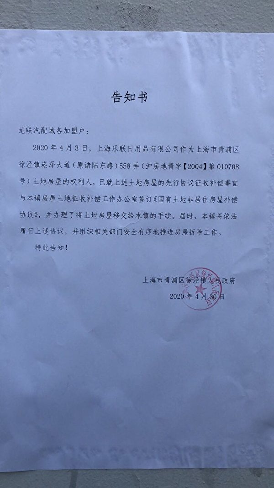

4月30日，青浦区徐泾镇政府贴出“告知书”。（受访人供图）

同一天，强拆队进入小区。“他们来了300—400人，第三方拆迁公司，也有一些警察在那边维持秩序。”陈妮可说，被推倒的3号楼里还住着一户人家，“他就把这个人叫出来，东西帮你搬到一个地方，把这个人强行带到附近一个小屋子里面关起来，然后推土机就进去，屋子就拆掉了。”“当天贴当天拆的，所以大家全都吓到了。”

政府贴出告示的同一天，强拆队进入小区强拆民房。（受访人供图）

陈妮可认为，政府这种做法是为了在精神上打击业主。“他就是这么霸道啊，我觉得他们的战术就是先把你推倒，情感上面很多人都被吓到了，就等于是一种恐吓的手段。他想逼迫业主接受他们的协议。”

至于选在4月30日强拆，陈妮可猜测一方面是因为会展中心在“五一”期间关闭，附近人少，另一方面是受疫情影响，附近国际人员流动变少。“（政府）往年也都不敢，他们抓住这个时机，4月30日就过来推你一栋。”

按照正常程序，政府征地要贴公告，告知被征土地用途和赔偿等相关信息。但是青浦区徐泾镇政府既没有公告，也没有公布其与开发商签订了何种协议。

目前，业主已聘请北京的专业拆迁律师，希望通过法院禁令来阻止政府的进一步强拆行为。

<a target="_blank" href=#top><h6 align="right">回上方</h6></a>
  
  
<a name=18>
<h1 align="center"><b>朱同：中共“表演式”复工复产</b></h1>

官方宣传武汉复工，但实际街上商店多关闭。图为4月11日武汉街道。(Getty Images)

【大纪元2020年05月02日讯】中共各级领导来了几十次，实惠没落地，复产企业还要配合演戏；中国西南某项目现场，中共领导宣布项目启动，机械立马开动起来，可干部前脚走，机械后脚就“马放南山”……近日，中共媒体曝光了一批中共病毒下形式主义新表现，因重面子轻里子的“戏”份过浓，被国内网友戏谑地称为“表演式”形式主义。

从媒体报导来看，“表演式”形式主义可谓形式主义的升级版，不少发生在经济发展领域。参与其中的各类企业、中共各级领导干部不仅要走过场，还要“心甘情愿”当演员，把这场“戏”演得“精彩生动”。花大价钱费大力气，“演”出面子上的虚假繁荣景象，只为博得中共某领导喝彩，而不顾对企业和群众是否有意义。

根据记者报道，特别是疫情发生以来，在不同地方和场合都存在“表演式”形式主义，主要有三种表现形态：

其一，下级演给上级看。工作干得好不好，“表演水平”很关键。在一些地方和干部眼里，虚报复工复产率似乎已成“公开的秘密”。有中共干部坦言，一开始报80%，看到别的地方都报超过90%，担心被批评，索性报接近100%。在“你虚报、我也虚报”的攀比心理作用下，复工复产率正变得“没有最高，只有更高”。

其二，政企“联手”演给公众看。有中共干部反映一个疫后怪现象，有些原来已签约过的招商项目，有关部门会重新组织方案再签一次。有的是省里签了市里签，市里签了县里签，层层签约、人人“演戏”。有的企业不堪其扰，也有的乐此不疲。一位企业负责人说，“我觉得挺好！可以造势，还能多跟领导接触！”细品这句话，道出了“演戏”双方“周瑜打黄盖，一个愿打一个愿挨”的心态，有公众拍手叫好就算大功告成了。

其三，干部演给群众看。有的中共领导表面上“积极”下乡调研，“深入”企业“体察民情”，而且对基层反映的问题，表态时听上去都很好，有的还当面承诺一定要办好，最终企业负责人和群众等来的大多是“空头支票”，到头来在镜头前“说几句”，到处合影“摆拍”留念之后，“竹篮打水一场空”。

“表演式”形式主义的种种场景，是中共的传统之一，是“只关心领导满意却让群众失望的蠢事”。这种形式主义具有很强的传染性，这种“病毒”不断蔓延扩散，一贯影响中共各项政策真正落实。

中共一贯鼓吹“党的领导”，“制度优势”，中共党内教育经常强调“以上率下”，以“关键少数”示范带动“绝大多数”，精心组织谋划、推动落实责任，做到了一贯到底、落实落地。
表面上“伟光正”，实际上在党的领导下坏事做绝，比如活摘器官；比如至今还在迫害法轮功；比如打压香港同胞；比如隐瞒肺炎疫情真相；比如抓捕吹哨人……中共“以上帅下”践踏人权；践踏法律；践踏信仰；抢劫民财；贪污腐败；栽赃陷害；行贿受贿；各种淫乱匪夷所思……

因为中共的隐瞒拖延，中共病毒传播全世界，又一次祸害了全世界人民。目前不少国家索赔中共，证明世界人民已经开始觉醒，认清中共邪恶。在天灭中共的大势之下，中共无论如何自救都是垂死挣扎！

<a target="_blank" href=#top><h6 align="right">回上方</h6></a>
  
  
<a name=17>
<h1 align="center"><b>刚卸任两天 张旅集团前董事长坠桥身亡</b></h1>

【大纪元2020年05月02日讯】5月1日，张家界旅游集团股份有限公司（以下简称张旅集团）前董事长、湖南省张家界市广播电视大学校长戴名清坠桥身亡。

澎湃新闻引述知情人称，事发前几天，戴名清才从张旅集团调至张家界广播电视大学任校长，同样为正处级实职，“目前没有消息显示纪委找他谈过话或进行调查。”

2日，广播电视大学两名工作人员证实，戴名清刚上任，上班才几天，上周调令已送到该校，具体情况将由市委发布。

张家界市委工作人员称，由于事发突然，具体情况待司法部门认定后，再发布通告。

另据《红星新闻》报导，戴名清身边的多位好友说，“之前没有任何征兆，他是在张家界境内的邢大公路堕崖身亡的，我们听到这个消息的时候，也很震惊。”“他的尸体已送到殡仪馆了。”

张家界金山陵园工作人员也证实：“戴名清的尸体是今天（2日）凌晨5点左右送过来的，今天开始摆设灵堂，追悼会具体时间待定。”

2日，张家界集团发布公告，称已于4月29日收到董事长戴名清的书面辞职报告。戴名清“因工作变动原因，申请辞去公司第十届董事会董事长、董事及董事会战略委员会主任、提名委员会委员等职务。”

不过东方财富显示，工商信息还未发生变化，戴名清还是张家界集团的董事长、法人代表。

公开资料显示， 戴名清曾任张家界永定区政法委书记，张家界旅游集团股份有限公司法定代表人、董事长。天眼查数据显示，张旅集团注册资本4亿元人民币，是独家经营湖南张家界景区的上市公司，下设武陵源分公司和四家子公司，属于旅游服务业。

此外，戴名清还曾任张家界市公共资源交易中心党组书记、张家界市物价局党组副书记、副局长、张家界市物价局党组副书记、张家界市委办公室纪检组长等职务。

<a target="_blank" href=#top><h6 align="right">回上方</h6></a>
  
  
<a name=16>
<h1 align="center"><b>脱北韩国议员：99%确定金正恩上周已死</b></h1>

金正恩资料照。（大纪元资料室）

   
  【大纪元2020年05月01日讯】（大纪元记者李言编译报导）最近，朝鲜领导人金正恩的健康及生死问题引发人们更多猜测。一名最近在韩国成为议员的脱北者说，他有“99％”的把握确定金正恩已死。

在本届韩国国会选举中当选议员的脱北者池成镐（Ji Seong-ho）认为，平壤可能会在本周末宣布独裁者去世的消息。而继任者也已选出，可能是金正恩的妹妹金与正（Kim Yo-jong）。

他补充说，朝鲜推迟确认金正恩去世的消息，是因为“正在解决一个棘手的继承问题”。

金正恩自从4月11日参加政治局会议以来，就一直没有在公开场合露面，甚至罕见缺席4月15日金日成诞辰108周年纪念活动，引发各界猜测。

未经证实的说法包括：金正恩在接受心脏手术后已经死亡，处于植物人状态，“重病”或正在康复等等。池成镐表示，他得知金正恩在接受心血管手术后于上周末死亡。金正恩据称于4月12日接受了心血管手术。

池成镐在4月15日的韩国大选中赢得比例制代表席位。这名脱北者对韩联社说：“我就怀疑他在心血管手术后能撑多久。有人告诉我说，金正恩上周末去世。”

“不是100％确定，但我可以说，可能性是99％，朝鲜据信正在努力解决棘手的继位问题。”他说，这个周末可能会宣布接班人，或许是金正恩的妹妹金与正。

不过，池成镐没有透露信息来源，他的说法也无法通过管道进行确认。

<b>金正恩“接班人”仍扑朔迷离</b>

金正恩“失踪”后，韩国政府一直坚称，没有发现朝鲜有任何“异常”迹象。

上周，总部位于美国的朝鲜监测项目“38 North”发表一份报告说，卫星图像显示，金正恩专列停在沿海度假胜地元山的“领袖站”已经一周多，这表明金可能在他位于此地的别墅里。

也有人说，金正恩可能离开平壤，前去避瘟，以免中共病毒（武汉肺炎）上身，因为与他亲近的人染疫。他其实“活得好好的”。

有迹象表明，金正恩近期没有再做出领导决策，朝鲜也已经不再封杀关于他已死的传闻。而且，朝鲜有过延后报丧的先例。

平壤之前仅有的两个领导人——金正恩的祖父金日成（Kim Il-sung）及其父亲金正日（Kim Jong-il）去世后两天，官方媒体才宣布消息。

金正恩32岁的妹妹金与正、65岁的叔叔金平日（Kim Pyong-il，或译金平一）和朝鲜“二号人物”崔龙海（Choe Ryong Hae）被认为有可能在现任领导人去世或失能后继任。

立法智囊团韩国国民议会研究服务局表示，金正恩的妹妹最近在平壤的影响力越来越大。

不过，一些观察家认为，朝鲜精英层拒绝接受金与正继任，因为她是“女性”

现年36岁的金正恩据说有三个孩子，但他们都很小，无法治理国家。# 

<a target="_blank" href=#top><h6 align="right">回上方</h6></a>
  
  
<a name=15>
<h1 align="center"><b>尼米兹号重返亚太 云峰试射成功 美台连盟抗共</b></h1>

美国核动力航母“尼米兹号”（USS Nimitz）于4月27日离开母港，展开整合战力演训后即前往西太平洋地区部署，填补“罗斯福号”等舰队因官兵染疫而出现的战力真空。图为尼米兹级航母（左一），与随行的战斗支援舰和驱逐舰。（US Navy Photo) 

   
   【大纪元2020年04月30日讯】(大纪元记者程木兰报导）美国“尼米兹号”航空母舰强势重返西太平洋，填补“罗斯福号”等舰队因官兵染疫而出现的战力真空。中共“辽宁号”随即撤离太平洋，4月28日穿越宫古海峡驶返东海。台湾“云峰飞弹”试射成功，据信即将量产，射程覆盖中国北上广深和中共特定的军事基地。北京5月下旬召开两会之际，美台也将形成更加巩固的军事同盟。
   
<b>“尼米兹号”前往太平洋地区</b>

据美国海军消息，核动力航空母舰“尼米兹号”（USS Nimitz）于4月27日离开母港华盛顿州基察普（Kitsap）海军基地，展开整合战力演训后，即前往太平洋地区部署。

此前美军因太平洋舰队“罗斯福号”、“雷根号”航母相继传出官兵染疫而在太平洋出现31天的战力真空。此行前尼米兹号官兵已经完成海上防疫隔离。

中共“辽宁号”航空母舰编队趁隙于4月10日航经宫古海峡，穿越“第一岛链”南下西太平洋，之后折入南海，做了多项演训动作，23日又穿出巴士海峡进入西太平洋。

28日，日本防卫省侦测到辽宁号等共6艘船舰，自太平洋通过冲绳本岛与宫古岛之间的海域，朝东海方向返航。这期间，美国一艘“美利坚号”两栖突击舰(USS America)一路跟监。

<b>台湾密集试射各式中程飞弹</b>

与此同时，台湾中山科学研究院(简称中科院)位于屏东的九鹏湾基地密集试射各式中程飞弹，其中最受瞩目的是“云峰巡弋飞弹”，射程可覆盖北京、天津、上海、武汉、重庆、三峡大坝等重要据点。

据报导， 4月12日、13日台湾“镇海火箭系统”实弹演练，最长射程10公里，14日、15日试射“云峰飞弹”，射程1,500公里至2,000公里。这段时间，中共“辽宁号”正穿过宫古海峡绕行台湾东部太平洋海域，进入第一岛链，再经由巴士海峡转入南海从事各项操演。

台湾中科院方对于云峰试射未置评论，只表示4月14日、15日东部外海射击属例行研发测试。中科院亦公布5月14日、15日排定试射“雄二E飞弹”，平均射程1,200公里。

《汉和防务评论》军事杂志总编辑平可夫曾于2018年有关“雄二E”的报导指出，以1,000公里射程计算，包括福建、浙江、上海、广东、江西全境、江苏、广西、湖南、湖北、安徽一部分的战略目标，都在“雄二E”射程内。

<b>台湾云峰飞弹、雄二E飞弹将进入量产</b>

台湾云峰飞弹、雄二E飞弹目前已试射成功，据信都将进入量产阶段。2019年美国相继通过《2020年国防授权法案》、《台北法案》等法律，积极将台湾纳入亚太防卫联盟成员。

台湾智库学者董立文4月28日在政论节目“年代向钱看”中表示，云峰飞弹从李登辉时代开始发展到今天，凭借台湾享有科技岛的声誉早就可以做出来。

根据公开资料，云峰飞弹直径90公分、长度9公尺、3马赫的飞行速度，涂有隐形涂料，飞行高度50公里到70公里，具备长程攻击、精确打击的能力，特点是难测、难抓、难打。

董立文强调，台湾的国家安全战略是确保台海安全。蔡英文总统今年1月接受BBC采访时说道，中共若武力犯台，会付出极大代价。

董举例“雄二E飞弹”攻击距离600公里到1,500公里：以台湾为中心画一个圈周，依过去经验的推断，将威胁到经济发达的长三角和珠三角，这是中国的企业、制造和金融中心。

<b>云峰飞弹“攻击中共战区 瘫痪共军作战节奏”</b>

台湾国防安全研究院资源与产业研究所所长苏紫云向媒体表示，云峰导弹目标“不是杀伤敌人，而是剥夺敌人的作战能力”，主要是攻击敌人机场、港口、指挥中心等重要目标。

而按外界推测云峰射程达1,500公里（预定目标2,000公里），可直攻至中国的中部战区，让中共解放军失去作战节奏。

苏紫云说道，像云峰及其它对地巡航导弹，也是台海战场重要的不对称作战工具。而对台湾威胁最大的是中共空军，攻击目标应是对方空军基地。

<b>尼米兹号舰队8,000官兵完成防疫隔离</b>

美国尼米兹号在太平洋舰队中，虽编制在负责镇守东太平洋（美洲端）的第三舰队之下，但在1996年的3月台海飞弹危机中，尼米兹号曾奉派至台湾海峡巡逻，以宣示美国反对中共动武的立场; 该舰2017年也进入西太平洋朝鲜半岛海域，威慑朝鲜金正恩政权。

美国海军消息指出，此次尼米兹号航舰在内的整个打击群，还包括一艘“提康德罗加级”巡洋舰(Ticonderoga-class cruiser)、三艘“伯克级”驱逐舰（Arleigh Burke class destroyer），加上第17舰载机联队，整个舰队加起来有8,000名官兵之多。4月初已经执行海上隔离，离岸有一个月时间，将染疫的风险降到最低。

尼米兹号航舰预计5月中下旬进入亚太海域。届时台湾有5.20总统就职仪式，蔡英文将发表演讲，北京5月21日、22日则有两会召开。#

<a target="_blank" href=#top><h6 align="right">回上方</h6></a>  

  
<a name=14>
<h1 align="center"><b>遭央视连骂三天 蓬佩奥反在中国人气飙升</b></h1>

中共央视连续三天对美国国务卿蓬佩奥进行泼妇式骂街，遭外界耻笑。大陆坊间大量流出蓬佩奥年轻时优异的学习成绩以及做家务等照片，反倒在大陆人气急升。（微博图片）

   
   【大纪元2020年05月02日讯】（大纪元记者洪宁综合报导）中共央视连续三天对美国国务卿蓬佩奥进行泼妇式骂街，遭外界耻笑。坊间大量流出蓬佩奥年轻时优异的学习成绩以及做家务等照片，蓬佩奥在大陆人气急升。

中共病毒（武汉肺炎）至少去年12月1日就爆发，但中共一直隐瞒疫情，打压传播疫情真相的医生和民众，并宣称疫情“可防可控”、没有“人传人”等虚假信息，致使世界各国疏于防范，导致疫情在全球大流行。

美国国务卿蓬佩奥连续多次批评中共隐瞒疫情。4月29日，蓬佩奥还在接受美国福克斯新闻采访时说，中共现在仍在“继续进行掩饰和迷惑。它们持续向世界发出威胁，而我们要把事实查个水落石出，不仅仅是为了当前（疫情），还是为了将来这种事情不再发生”。

蓬佩奥表示，中国共产党（在疫情上）撒谎，害了中国人，也害了全球。“中国共产党现在有义务向世界说明，这一大流行病如何从中国蔓延到全世界的，对全球性经济造成破坏。”“美国需要追究它们的责任。”

蓬佩奥的话刺痛了中共的心虚之处，中共喉舌央视随即在30日的新闻联播再次点名谩骂蓬佩奥“政治偏见、冷战思维”，“肆意推行单边主义的刁蛮嘴脸和霸权本质”。这是新闻联播连续第四天播发“国际锐评”的评论文章，其中有三篇都直接点名谩骂蓬佩奥，更称其为“人类公敌”。

而大陆民间却流出蓬佩奥年轻时就读西点军校时的照片和西点第一的优异成绩，还有蓬佩奥在家做家务，妻子一旁玩牌的照片，竟成为热门话题。

<h4 align=center><a href="https://twitter.com/Tinaphoto1/status/1255046036176941056?ref_src=twsrc%5Etfw%7Ctwcamp%5Etweetembed%7Ctwterm%5E1255046036176941056&ref_url=https%3A%2F%2Fwww.epochtimes.com%2Fgb%2F20%2F5%2F2%2Fn12077776.htm">蓬佩奥年轻的时候这么帅的，又是爱干家务的好男人，怎么就被央视新闻给说成人类公敌了，这可是个大帽子。(点击右键,另存新档）</a></h4>

尽管有众多五毛跟随者喉舌宣传对蓬佩奥进行谩骂式攻击。但仍有不少网民暗中讽刺中共喉舌的作法，对蓬佩奥表示支持：

北-：蓬佩奥年轻的时候这么帅！

湘–：人类公敌？央视代表全人类了？！

Z刘–：他们有什么资格把一个人定义为“人类公敌”，连定义普通人都不可以，更何况人家还在一个国家政府里任职，唉……很显然他们以为自己可以代表全人类，行使对任何人的定义权，我就想知道他们哪里来的勇气？竟可以狂妄自大到如此的地步！

咖喱–：我语文学的不好，但人民公敌好像慢慢变成了褒义词。

华盛–：世界公害，人民公敌，这个是某些喉舌的自我定位。

波大–：喔，训斥李文亮的平台，现在竟代表了人类和公义。

小小–：彭胖显然很享受洗碗的工作！看看他发自内心的笑容，哪怕远隔千山万水，都能感受得到。

蓬佩奥还得到大陆知识界的声援。

作家刘水对自由亚洲表示，蓬佩奥表现出了一个传统的美国精英清醒的头脑，以及不向独裁政治妥协的原则，因此得到了很多具有思考能力的中国知识分子的认同和声援。

刘先生说，民间传的挖他的背景这些东西，有正常判断力的人，能看得出来，那是很正派的很正直的一个精英人物。

资深教育家杨先生说，大家借机表达自己的意见，并反讽官媒和官员们，本身就是对官方隐瞒新冠疫情（中共病毒）的做法表达不满。他还指出，不少中国人都支持蓬佩奥要求调查疫情起源并追究责任。

艺术家王藏认为，中共官媒之所以对蓬佩奥进行文革大字报模式和朝鲜模式的谩骂，显示蓬佩奥戳到中共的痛处或心虚处；中共官媒的用意是“企图煽动爱国主义、民族主义情绪为（中共）自身站台、推责”。

<a target="_blank" href=#top><h6 align="right">回上方</h6></a>
  
  
<a name=13>
<h1 align="center"><b>冉崇碧为女维权11年 揭中共打压访民真相</b></h1>

冉崇碧被判刑入狱3年半，手持释放证明书。（受访者提供）

【大纪元2020年05月02日讯】（大纪元记者李慧采访报导）重庆云阳县妇女冉崇碧于2008年在广东省东莞市打工时，她4岁的女儿被人强暴，而法院轻判强奸人，令她从此走上艰辛的维权之路。

当年，强奸她女儿的男子覃立原仅被东莞市法院判刑7年，民事赔偿2000元。冉崇碧认为，法院终审判决量刑过轻，11年来不断上访，控诉司法不公、政府腐败滥权。她没有得到公正，反而被当局刑事行政拘留、关押、判刑几十次，还被重庆市云阳县法院以“寻衅滋事罪”判处有期徒刑3年6个月。

多年来，冉崇碧女儿也倍受歧视，基本的受教育的权利被剥夺，痛苦中多次自杀。冉崇碧说：“政府从没关心过我的孩子，只想把我关押，维稳就没事了。”

她说，孩子是无辜的，想到孩子多次自杀，她心痛不已，更令她不放弃为孩子讨公道。

她也十分感谢在她服刑期间，替她照顾女儿的善心维权人士。她说：“他们生活也很困难，但在难中依然伸出援手给予温暖，这是人性的光辉，非常珍贵。”

冉崇碧于2020年3月12日刑满释放后，因生活困难，沦落街头，沿街乞讨。期间在维权人士及亲友的帮助下，才偶有栖身之所。

“我母女如何生活？坐牢时精神被压迫、身心、身体严重被摧残，眼睛也有问题。”3月29日，冉崇碧向盘石政府信访办官员蔡主任反映问题，但蔡不理睬，她只能继续找渠道，维护母女的合法权益。

<b>中共官员打着维稳旗号 其实贪腐涉黑</b>

多年上访，让冉崇碧看尽政府官员贪腐涉黑、官官相护的丑态；自身的不幸，让她看到更多的社会不公。

冉崇碧多年来为女儿上访喊冤。（受访者提供）

“他们（政府官员）真的是欺人太甚。也把赔偿金给贪污了。他们真不是人！”她说，“他们太黑了，利用我们案件的名义，打着维稳的旗号，跟民政部、财政部申请维稳救急款拨款，把钱贪污了，他们饱中私囊，享受这些利益，勾结黑社会打击我们。”“你要投诉他，他就不让你活下去。”

她表示，这些政府官员结合黑社会，将受害上访的民众纷纷判刑，“在中国得不到人身安全， 得不到尊重，享受不到法院的保护， 现在很多人（访的访民）都被判刑了。”

冉崇碧说，现在上访的主要诉求是，“铲除腐败官员的行为，严厉打击黑恶势力，依法维护人民群众的合法权益。”

<b>访民被判刑投监狱 遭酷刑威胁</b>

冉崇碧2017年2月到北京上访，被云阳信访办人员劫持到重庆驻京办，随后被关到黑监狱里，遭到毒打，私人财物被抢劫，最后被送回云阳信访办。

回到云阳的冉崇碧于3月1日找县长反映相关人员滥用职权程序的违法行为，结果被以所谓“寻衅滋事罪”行政拘留15日，关进万州看守所。

冉崇碧说，在拘留期间，她被关在单间禁闭室300多天，“给我戴15斤的脚铐、手铐，（遭遇）酷刑、体罚。禁闭室面积直行两块半砖，床、厕所横行三块半砖。（他们）虐待我，天气特别热，（温度）40℃，不让吹风扇。他意思就是打压你，不叫你吿他们。”

冉崇碧因持续上访，被以“寻衅滋事罪”判刑3年6个月。（受访者提供）

2018年7月5日，冉崇碧接到云阳法院判决，被判刑3年6个月。她上诉到重庆市第二中级法院，法院维持原判。同年10月22日，她被万州看守所送到重庆女子监狱服刑。

“我在监狱里面站几天几夜，（被）戳电棒都戳多少次了。”她说：“他们越打压我，我就要越坚强，坚持到最后，不向恶势力低头。”

她认为，“中共法律就是维护有权有势的人，那些没权没势的弱势群体，他们就把你抓去坐牢，用暴力打压你，惩罚你，迫害你，让你不敢告他们 。”

“我见证到他们许多的谎言、贪污、腐败、暴力，如果我们胆小不揭发的话，我们的人身随时遭到残害，随时被他们弄死。所以，不管他们怎么暴力我们，残害我们， 我们就要用坚强的一口气，坚持下去，坚强地活着走出了监狱，因为我就是他们贪污腐败犯罪的见证。”她说。

<b>政府与黑社会勾结 民众抱团维权坚持下去</b>

多年的上访维权，让冉崇碧结识了很多有类似遭遇的人。4月11日冉崇碧偕同重庆各区县的访民三十多人，在重庆市政府信访办大门口集会，共同表达继续上访的决心。

冉崇碧说：“如果我们不抱团（群体维权）的话，随时会被他们谋杀，把你弄到没人的地方去谋杀。”

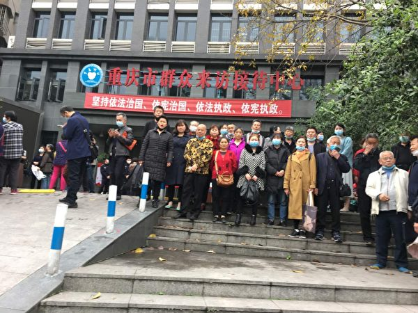

4月11日重庆访民三十多人，在重庆市政府信访办大门口誓师合影。（网路图片）

“如果不公开的话，随时都有生命的危险，遭他们的残害，不知道怎么死的。”她说，“这几年走在维权路上，我了解的太多了，政府雇黑社会的人，把访民丢到河里面的、毒打的、下毒的、关黑监狱的，还有儿童被害死的，太多了。”

她告诉记者，“说白了，都是政府造成的，政府没人性，他们打的是政府为人民服务旗号，但其实就是欺骗人民、欺骗群众。”

“他们一直禁止我们抱团，不让我们团结，他们官官相护。不论他们怎么禁止，我们也要告他，我们抱团的目的就是保护自己的人身安全。”她说。

<a target="_blank" href=#top><h6 align="right">回上方</h6></a>
  
  
<a name=12>
<h1 align="center"><b>国际做空机构：陆企“跟谁学”40%客户不存在</b></h1>

图为2010年12月到美国上市的中国企业优酷(Youku)人员，在纽约证交所庆祝IPO拍照留念。(图片摄影 Spencer Platt/Getty Images)

【大纪元2020年05月02日讯】（大纪元记者刘毅报导）北京时间5月1日凌晨，国际知名做空机构香橼发布报告表示，在美国上市的陆企“跟谁学”2019年注册用户中有40%是假的。香橼表示，期待着向美国证券交易委员会提供跟谁学的欺诈证据。

新浪科技的消息说，1日凌晨，香橼发布报告表示，“跟谁学”公司中的一名员工称公司2019注册用户中有40%是假的。同时，“跟谁学”存在多个未披露的关联方，这些关联方用来捏造其财务状况，为刷单提供便利。

腾讯证券的消息也显示，香橼的报告说，“跟谁学”雇佣刷单公司为其刷单，其旗下“跟谁学”和“高途课堂”两个产品上刷单，虚增学生比例为40%，目前受瘟疫影响已停止刷单。香橼有给“跟谁学”刷单公司工作员工的录音为证。

香橼表示，每个人都知道这是一个骗局，而香椽正获得更多信息，以证明它是下一个瑞幸咖啡。

香橼说，期待着向美国证券交易委员会提供“跟谁学”的欺诈证据。

在此之前的4月14日，香橼发布第一份“跟谁学”的做空报告。报告披露，该公司“高达70%的营收是虚构的”，应当暂停“跟谁学”股票交易、并进行调查。

网民“风语者”对此表示：“难怪跟谁学年后到处推广免费5节课，结果是套取学员信息啊。”

网民“smile”认为：“何时大陆的资本市场也引入第三方做空机构，以便真正清理掉欺诈上市、虚假信息、财务造假的垃圾公司及老板！”

近来，在美国上市的大陆公司陆续传出财务造假的消息，有的已经被坐实。

4月2日，瑞幸咖啡承认公司在2019年二季度至四季度期间虚增了22亿人民币的交易额，相关的费用和支出也相应虚增。消息传出后，该公司的财务和经营状况均遭到投资机构质疑。

4月7日，在美国上市的概念股爱奇艺被美国调查机构揭露财务造假欺诈。

随后，中国补习机构好未来教育、跟谁学也曝出造假丑闻。

4月30日，拼多多的一名员工涉嫌收受开域集团一名经理的贿赂，并已经有公安参与调查的消息被媒体披露。

有网民对此表示：“在国内骗习惯了，跑到国际上去骗。”

对于大陆在美国上市公司不断被揭露财务造假，美东时间4月22日，美国证券交易委员会（SEC）主席杰伊‧克莱顿（Jay Clayton）提醒投资者近期在调整仓位时，因为大陆在美国上市的公司信息披露不透明，不要将资金投入在美国上市的中国公司股票。

在克莱顿接受采访的前一天，克莱顿和美国上市公司会计监督委员会（PCAOB）主席William Duhnke III以及SEC首席会计师Sagar Teotia、SEC公司财务部总监William Hinman、SEC投资管理部总监Dalia Blass等多位官员联合署名发布了一份公开声明。

声明提醒投资者：因PCAOB无法检查中国公司审计文件问题导致的高风险问题，中国公司披露不完全或具有误导性的风险很大，并且在投资者受到伤害的情况下，获得追索权的机会将大大减少。

早在2018年12月，SEC和PCAOB就曾发布联合声明，由于法律制度等原因，监管机构在监督美国上市的中概股的财务报告方面面临重大难题。

有业界人士认为，近来不断被揭发的中概股造假事件，会影响大陆公司到美国上市。一旦大陆公司不能在美国上市，等于掐断了大陆公司在美国的融资之路。

<a target="_blank" href=#top><h6 align="right">回上方</h6></a>
  
  
<a name=11>
<h1 align="center"><b>英医疗界：中国产呼吸机可致病人于死地</b></h1>

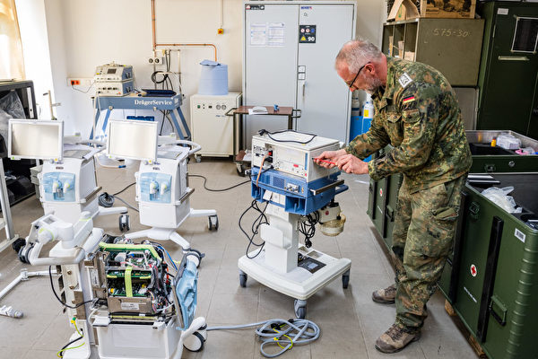

英国医疗界警告，中国产呼吸机可使病人“遭到重大伤害，包括致死”。图为呼吸机示意图。(JENS SCHLUETER / AFP) 

【大纪元2020年04月30日讯】（大纪元记者徐简综合报导）4月初，饱受国内选民指责的英国内阁大臣们兴奋的宣布，他们从中国购买了300台呼吸机！但是过了一周多，英国医疗界就发出严厉警告，因为这些中国产呼吸机可使病人“遭到重大伤害，包括致死”。

4月4日，英国政府从中国运来了300台呼吸机，在一个军事基地卸货。

然而9天之后，一批英国高级医生和医疗管理人员发出严重警告，他们的城市收到了250台呼吸机，这批呼吸机是由北京谊安（Aeonmed）医疗系统股份有限公司生产的香格里拉510型，该公司是中国领先的手术室、ICU设备研发制造厂商之一。

NBC4月30日报导，一名资深的麻醉和重症监护医生代表伯明翰（英国第二大城，也是英国的重灾区之一）及周边地区的临床医生和高管人员，写了给政府高级官员的这封信。

医生们说，这些机器的供氧系统有问题，无法正常清洗，并且不是欧式设计，使用说明书也很混乱，而且这是救护车上的呼吸机而不是医院中使用的呼吸机。

信中说，“我们认为，如果使用（这些呼吸机）的话，很可能会对患者造成重大伤害，包括致人死亡。”NBC新闻看到的4月13日这封信的内容说，“我们希望停用这些呼吸机，为重症患者更换更好的提供呼吸的设备。”

医生们说，中国产呼吸机的供氧量 “不稳定、不可靠”，其构造质量 “非常基本”。其织物外壳无法正常清洗—-在对抗高传染性病毒时，经常清洗是必不可少的，而且这些呼吸机的氧气连接管 “不符合欧盟规格”。

除了这些对呼吸机质量的严重担忧之外，英国医生还说，他们对这些设备不熟悉，不适合在当前的危机中使用。

最关键的是，这种机器完全是错误的：根据说明书中所述，这台机器是为救护车内的病人而不是医院病床上的病人设计的。医生们说，他们不得不用医院的手推车为该设备搭建了一个临时支架，模仿救护车中的情形。

负责监督NHS和从国外购买呼吸机的英国“卫生和社会关怀部”在给NBC新闻的电子邮件中表示，他们已经得知了医生的反馈，并已向中国制造商提出问题。

但该部门拒绝回答信中的几个详细问题，包括总共买了多少台这个型号的呼吸机，为什么选择这种型号，以及是否事先征求了一线医生的意见等。不过该部门说，目前这些台呼吸机没有投入使用。

<b>中国产品质量堪忧 全球退货</b>

NBC分析说，英国的案例并非个案，随着中共病毒在全球范围内蔓延，从中国采购来的商品让许多国家非常头痛。

自3月以来，许多国家争相购买更多的医疗设备以弥补物资巨大缺口，而这些设备大部分来自中国。但是不少设备出现了质量问题或不适用。

3月下旬，荷兰卫生部发现从中国购买的60万个口罩不符合标准后，荷兰被迫从医生手中召回了从中国购买的60万个口罩。

本月早些时候，芬兰紧急医疗供应机构负责人花了数百万欧元从中国购买口罩，结果发现不合格，负责人被迫辞职。

不仅仅是口罩的问题。西班牙政府表示，它不得不召回并退回来自中国的5万个病毒检测试剂盒，因为它们的准确率只有30%。英国订购了350万个中国产检测试剂盒，但发现没有一个有效，不能广泛使用。英国政府表示正在向供应商寻求退款。#

<a target="_blank" href=#top><h6 align="right">回上方</h6></a>
  
  
<a name=10>
<h1 align="center"><b>大陆爆高传染性致死性“虾虹彩病毒”疫情</b></h1>

中共肺炎（武汉肺炎）正在大陆各地肆虐之时，至少11个沿海省市的养殖场又爆出高致死性甲壳类病毒。（网络图片）

【大纪元2020年05月02日讯】中共肺炎（武汉肺炎）正在大陆各地肆虐之时，至少11个沿海省市的养殖场又爆发高致死性甲壳类病毒疫情。

据《水产前沿杂志》4月12日报导，疫情尤以华南珠三角、汕尾、饶平（广东省潮州市辖县）、福建等地严重，养殖排塘出现连片发病的状况，且发病率高达6成，检测结果都指向与“虾虹彩病毒”高度相关。

当虾感染这种病毒时，会出现偷死、变红、空肠胃、黑脚等症状，死亡率非常高。目前，病毒在大陆主要的虾类养殖地区广泛传播，状况紧急，且没有特效药。

报导称，这种病毒2014年在大陆被发现，国际病毒分类委员会2019年正式将该病毒命名为十足目虹彩病毒１(DIV１)。它是一种高传染性的病毒，不仅杀死虾，还会杀死龙虾和螃蟹等动物。

报导说，从往年疫情监测情况看，广东、浙江、河北等省份流行率较高。从调查情况看，广东珠三角地区影响较为严重。

2017年春季，在湛江、阳江、粤东和福建的漳浦、长乐等地发生过高密度养殖的南美白对虾出现爆发性死亡，怀疑是由“虾虹彩病毒”引起的。

日本《周刊邮报》报导，这种病毒会在几天内扩散到整个养殖池。如果不将附近的池塘一并清除、抽干，病毒传播的速度非常快速。这种病毒目前不会传染人，但仍需严防其突变。

<a target="_blank" href=#top><h6 align="right">回上方</h6></a>
  
  
<a name=9>
<h1 align="center"><b>为何改变对习近平看法 川普首次详细说明</b></h1>

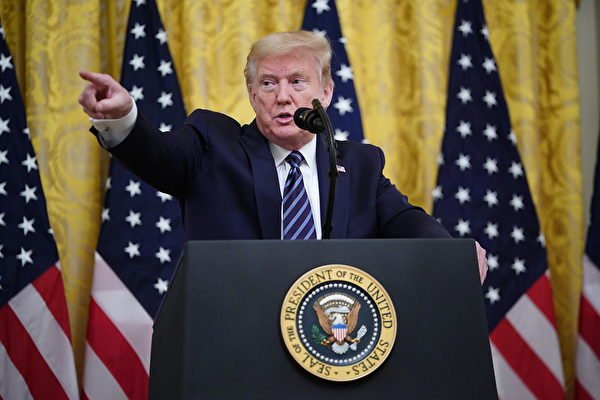

美国总统川普（特朗普，如图）周四（4月30日）在白宫表示，这场疫情极大地改变了他对习近平的看法。(MANDEL NGAN/AFP)

【大纪元2020年05月01日讯】（大纪元记者吴英报导）美国总统川普（特朗普）周四（4月30日）在白宫表示，这场疫情极大地改变了他对习近平的看法。

<b>川普：中共瞒报疫情 极大地改变对习的看法</b>

美东时间周四下午4点，川普在白宫宣布照顾长者的计划，对于记者问及为何现在改变对中国国家主席习近平应对疫情的看法时表示，这场疫情确实改变了他对习近平的看法。

川普说，一月中旬美中签署了第一阶段贸易协议，解决了长期以来的美中贸易逆差问题，中方承诺加购数千亿美国商品，美方则仍维持对2,500亿美元中国商品加征的25%的惩罚性关税，大家都很满意。

“然后，突然之间，（中共）病毒来了，而且发生了令人无法接受的事（意指中共瞒报）⋯⋯这件事极大地改变了我（对习近平）的看法，因为整件事已迥然不同了。”川普说。

“在一个半月或两个月前，我们拥有史上也是全球最强大的经济，接着瞬息之间，我必须关闭我们的经济，必须关闭我们的国家。”他说。

“这件事必须要处理，”川普补充说，“因为我们看到了大量的死亡，令人痛彻心扉的悲伤，前所未见的灾难。另外的184个国家同样承受了巨大的苦难。”

路透社报导，周三（4月29日），一位不愿透露姓名的川普政府高级官员表示，今年3月下旬川普与习近平在通话中基本达成非正式的口水战“休战”共识，现在这个共识似乎已不存在。

<b>川普：中共要么选择不应对疫情 要么没能力</b>

“中国（中共）是一个非常老练的国家，它们（中共）本可以遏制它（疫情），但是它们要么选择不这样做，要么是没能力这么做，”川普说，“总之，它们让它传播了或者失控了。”

他提醒在场的记者，当时北京虽然在国内采取封城措施，禁止国内航线，但是“它们并没有阻止飞机飞往国外”，导致很多人从中国去了意大利等国家，这些国家遭到中共病毒的重击。

“我们非常幸运，因为我在很早的时候，一月份就实施了中国旅行禁令。”川普说。

<b>相对于美中贸易协议 川普：调查中共如何应对疫情更重要</b>

“现在，与习近平达成的贸易协议，相对于中国（中共）如何应对这个病毒的方式，已经是次要的了。”

稍后，川普在回答另一名记者问及是否要习近平负责时说：“我不想这么说，但是可以肯定的是，它（病毒）原本可以（在中国）被遏制，但是它从中国出来了，我希望它们（中共）可以遏制它。”

对于向中共追偿的金额，川普总统表示，他可以做不同的事情，或者做同样的事情，通过加征关税向中共收取更多的钱，大约一万亿美元。

<b>没有人比我更难过 川普：美国明年会更强大</b>

当天，川普还说：“对于所失去的生命，以及那些没有必要的伤害，我不认为有人会比我更难过，也没有人比我更想要将这件事情处理好。”

“没有人比我考虑得更深入，比我花更多的时间在这件事情上，”川普说，“我常在深夜想着，我们国家为何在如此短的时间内遭遇了这些事。”

“我们要让我们的国家重新开放，按部就班地逐步开放我们国家，我相信明年我们国家会更繁荣。”他说。

<b>病毒起源及疫情爆发原因 川普：正在调查</b>

对于中共隐瞒、病毒起源以及疫情为何爆发等问题，川普说：“目前有3到4种说法⋯⋯在不久的将来，我会给各位答案。”

对于中共病毒是否来自武汉病毒研究所，川普说：“我们正在调查它的确切来源以及为何爆发疫情，很多科学家及情报人员正在调查，很快会有答案。”

“到目前为止，我认为中国（中共）正在努力……对我们有些透明，但我们将找出答案，”川普说，“这是一件可怕的事情，无论是它们犯了一个错误，还是从一个错误开始，然后又犯了另一个错误，或者有人故意做某件事。”

<b>川普：世卫应感到羞耻</b>

川普还指出，世卫组织（WHO）应该要为自己的行为“感到羞耻”，因为他们和中共沆瀣一气，像是中共的宣传机构。美国每年对他们供款将近5亿美元，北京每年给他们3,800万美元。

他强调，无论多少（钱）并不是重点，但是当他们犯下可怕的错误，尤其是导致全球数十万人死亡的错误时，他们仍然在找借口。

<a target="_blank" href=#top><h6 align="right">回上方</h6></a>
  
  
<a name=8>
<h1 align="center"><b>【有冇搞错】傅政华四千公安要挟 习近平失平衡--石山</b></h1>

【有冇搞错】4月29日被卸职司法部长，傅政华曾操作四千公安辞职，要挟中央，习近平的政治平衡因此被扭转。（大纪元香港新闻中心）

【大纪元2020年05月01日讯】《有冇搞错》。4月30日。

昨天，就是4月29日，中国13届全国人大常委会第17次会议在北京开会，做出一个决定，任命唐一军为司法部长，原司法部长傅政华满65岁，届龄卸任。

我们前几天，曾经谈过这位傅政华，也简单谈了一下，傅政华过去几年在中国政坛中的一些作用。傅政华曾任北京市公安局长、公安部常务副部长、610办公室主任和司法部长。过去几年，中国很多政治上的问题，其实与这位傅部长关系重大，今天和大家详细说一下其中的事情。

傅政华，1955年出生，文革期间上山下乡，就是知青。推荐上大学，在北京大学一个分校，学了法律，之后1970年，回到北京当公安警察，从基层干警做起，一直升到北京市公安局二处副处长，1998年调到公安部，做到刑侦局副局长，2005年，又调回北京市公安局任党委副书记、副局长。

有人说，傅政华搞刑侦有一套，而且敢吃苦，下手狠，很照顾手下。

2010年，担任北京市公安局党委书记和局长。一上任，就搞了一件大案，查抄了据说有军方背景的北京天上人间夜总会。其实他也在背后支持一些人物，据说北京有的会所，就有他的支撑。

其实香港记者吃过他的苦头。傅政华卷入过一起经济纠纷案件，一个受害者逃到香港，拿了很多证据，还在香港告过傅政华和其他相关人。香港《明报》对这个案子有兴趣，最少有两个记者曾经进行过调查。其中一个记者，后来去北京出差，被公安直接抓走，关在一个黑监狱，扒光衣服，打了三天三夜，直到他写保证不再调查写文章。

另外一个，就是（《明报》前总编辑）刘进图，他在当驻京记者的时候，接触过和这个案子有关的当事人，手上也有不少资料。傅政华曾经带队到香港，想要处理这些事情。

后来刘进图被人斩，是否和这个事情有关系，我不知道。

2012年，北京发生了很多事情，薄熙来3月15日下台，和薄熙来关系极为密切的周永康，成了非常敏感的人物。傅政华在公安部冒升，和周永康的扶植很有关系。3月18日，当时胡锦涛的主要助手、中央办公厅主任令计划的儿子令谷，在北京发生法拉利车祸，令谷死亡，车上两个美女重伤。令计划为了掩盖这个交通事故，通过周永康达成默契。傅政华把周永康给他的一个手令，交给了胡锦涛和温家宝。有消息说，他同时把周永康和薄熙来的许多秘密计划，也告知了胡锦涛。

这件事情，直接导致周永康后来的落马。傅政华因此被胡锦涛重视，还加入了公安部的专案组。

这个专案组，后来主要处理周永康的问题。到了2013年8月，那时习近平已经正式上任了，傅政华以北京市公安局长的职位，兼任公安部副部长。

2013年下半年，中国展开2013年集中打击整治网络违法犯罪专项行动。8月下旬，这场行动变得非常猛烈。这时的著名案件包括秦火火造谣集团一案，薛蛮子因嫖娼被抓案，都是这场行动的一部分。和傅政华新进兼任公安部副部长有关。

2012年7月，傅政华在北京的一个会议上，曾经做出部署，要对网络政治谣言，和所谓攻击党和国家领导人及现行体制的大V，进行严厉打击。

看一下习近平上任之后的一系列作为。首先是中共18大三中全会，推出了改革60条，就是“关于深化推进改革若干重大问题的决定”，提出了很多改革措施，包括经济方面的，也包括社会管理方面的措施，对党内自由派来说，算是好消息。

不过，习近平采取的是左右两边都打击的策略。薄熙来、周永康，和下面一些比较左的政策和相关人物被打击，但右派，也就是自由派也被打击。包括南方报系、北京的《炎黄春秋》等等，都被严厉整肃。

在政法系统上，一方面，中国政法委系统被降级，中央政法委书记不再是政治局常委，各个地方的政法委书记，也不再由地方公安局的首脑出任。但习近平也对社会上的自由派进行严厉压制，比如2015年709事件，数百名维权律师和维权人士被捕，成为中国司法退步的一大事件。

不过，北京为了突显政治清明，展开了一系列的平反冤案行动。

2014年11月，内蒙古高院宣布18年前被判杀人罪成立并已经处决的呼格吉勒图无罪，12月判决给呼格的父母赔偿200万人民币的国家赔偿。

呼格案我想多说几句，呼格是呼和浩特的一个工人，1996年，因为一件奸杀案被抓，很快判死刑，然后处决了。呼格本人一直没有认罪，他的父母也一直为他申冤。关键是，几年后，杀人真凶因另一个案件被抓，呼格的那个案是他做的，而且交代了详细的情况。

按照道理，呼格就应该被平反了吧。但在中国就有这种怪事，公安局不承认。在这个真凶案件的庭审上，还出现了世界奇观，被告人和他的律师拚命证明被告杀了人，而检查方则拚命证明他没有杀人。

这个案其实明白清楚，但拖了18年后，才正式被平反。

冤案当然不止呼格案。2014年8月22日，福建高级法院对“念斌投毒案”作出终审判决，被关押了8年、四次宣判死刑的念斌被宣布无罪。

2015年7月17日，安徽省高院公开宣判，被判杀人罪的张云、张虎、张达发、许文海、吴敬新等五人无罪。

2015年12月，云南省高级人民法院，宣判因投毒罪被判无期徒刑的钱仁凤无罪，当庭释放。

2016年12月2日，最高人民法院第二巡回法庭于对1995年已被执行死刑的聂树斌公开宣判，宣告撤销原审死刑判决，改判无罪。

两年，中国大概平反了十多个重罪案件。大家知道，中国公安办案，基本上是怀疑一个人，抓起来严刑拷打，取得口供之后直接交法院定罪。其它什么证物、证据等等都可以不管的。

因为中国没有司法独立，共产党有一个政法委，管所有和司法有关的事情，包括公检法司。通常，这个政法委的书记，就是公安局的书记，而且常常他是兼任公安局长。所以等于是公安局领导法院，那当然，法院没可能独立审案判案。

这也是习近平上台之初，整顿清理政法委，不让公安局长当政法委书记的原因。他希望借着平反冤假错案，来争取一些民心。

在这个期间，傅政华在公安部主持周永康专案组，当然也就一直在升官。2013年，傅政华当了公安部副部长；15年1月，兼任中共中央政法委员会委员、中央六一零副组长；16年，升了公安部常务副部长。

2016年5月，北京发生了雷洋案件。

简单介绍一下，雷洋是中国人民大学的硕士毕业生，在北京一个环保组织工作。2016年5月7日晚，住在昌平区的雷洋离开家，去机场接一个朋友，半个小时后就死了。他在家附近，被昌平区公安分局东小口派出所的便衣警察抓了，怀疑有嫖娼行为，在拘捕过程中，雷洋逃脱后被再次拘捕，警方的说法，是在押解途中，雷洋犯病死亡。

因为雷洋算是高级知识分子，而且是人大刚毕业的硕士，所以很多他的朋友和同学开始质疑。第二天，这个事件就在网络大爆，引起了舆论的广泛关注。当然，网路舆论的矛头，直接对准了北京的警察。

中国公安的说法，和官方媒体的解释，引起了更多的疑问。其实这个很简单，一个人出去接朋友，十多分钟之后，就嫖娼被抓，原本身体健康的一个年青人，然后就这么死了。

CCTV还找到一个妓女证人，已经被警方抓了，在看守所里面接受采访，指证雷洋接受了服务。附近商店的视频也不见了，警方说的东西变来变去。

很快，习近平对这个案子做了指示，要严查公安局。这个和前面那些，争取民心的措施，是连贯的。

很快，东小口派出所的几个警察被带走调查，包括一个副所长。

几天后，副所长的太太发了一封公开信，为丈夫叫屈，也提出了好几个质疑，包括她丈夫被带走的法律程序上的问题等。这封信很煽情，引起了公安警察内部的轰动。

北京的公安警察，有四千多人联署写信，要辞职不干了。而且据说大部分都是些中层的警官。大家想一下，习近平上台后整顿政法委，公安局办案被纠正，平反，不少警察被追究。所以当时警察的士气受到严重打击。

北京的四千多警官不干了。这对北京治安有什么影响？所有发生在北京的政治阴谋，如果有的话，最早发现蛛丝马迹的，都是这些治安警察。所以要在北京坐稳，北京市公安局是不能不顾的。

北京最高层所以妥协了。整个事件发生了逆转，所有被抓的警察都放回去，不追究刑事责任，只给警告处分，所有为雷洋请愿发文章的，都受到警告。雷洋的妻子，收到了1200万人民币的抚恤金，也就不再出声了。

北京警察集体抗议，这个事件的背后主导，就是傅政华。

傅政华没有被追究，但他在公安部的地位开始下降，不再当中央政法委委员，卸任北京市公安局长，到2018年，转去做司法部长。我们说过，政法系统，公检法司，司法部是实权最小的部门。

但是，雷洋事件却成了中国政治的一个转折点。体制下的既得利益者，对习近平当局抵抗，取得了成效。从此，中共内部的各种势力，都开始用差不多的方法，开始了自己的动作。

原来，习近平既打左，也打右，从这个事件以后，就基本上只打右，不再打左了。

因为左是中共的基础，而右可能威胁到中共。

这种不平衡，一直延续到现在。

现在，傅政华被卸去了司法部长的职务，没有再上一层楼，比如中央政法委什么的，当然是因为这件事，最高层对他不信任了，或者从某种意义上看，也是一种秋后算账，慢慢地报复。

不过，傅政华代表了中共内部很普遍的一种人，现在这些人，正在中国大陆掌握实权。他们多是在文革中形成自己为人处事风格和特点的，所以没有任何底线，没有任何原则，手段残忍，心狠手辣，见风使舵，好的时候八面圆滑，脸皮很厚，但闹翻之后也敢斗敢干，撕破脸六亲不认等等。

说实话，最近五六年，中共内部官员越来越多这种人物，却可能决定了天下大事的走向。尤其是专制体制，没有任何制约，没有任何大家都可以秉持的原则，这种人物常常会特别得势。想一想，可能真的很可怕。

<a target="_blank" href=#top><h6 align="right">回上方</h6></a>
  
  
<a name=7>
<h1 align="center"><b>谢田：官媒“万里投毒”和“建设祖国”的诡谲</b></h1>

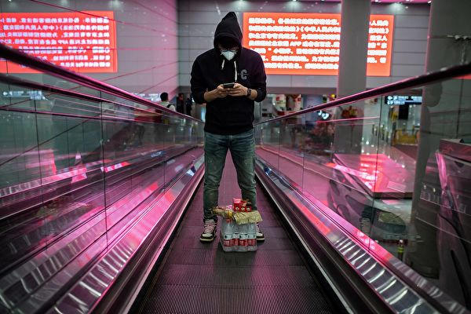

中共的宣传用语，“祖国建设你不在、万里投毒你最快”，其实非常阴险，是邪灵本质的体现。图为今年4月13日一名旅客抵达北京的首都国际机场。 （NICOLAS ASFOURI/AFP via Getty Images)。

【大纪元2020年05月01日讯】中共媒体在最近的内外宣传中，用了一个充满恶意、居心叵测的词句，就是“祖国建设你不在、万里投毒你最快。”这个类似打油诗之类的用语，是他们在公开讥笑和嘲讽那些在海外疫情严重之际、返回中国大陆的侨民；说他们在危难之际回国，还带回了瘟疫的病毒，不但不“贡献”于祖国的建设，还造成了新的麻烦，甚至恶意地“投毒”。如果从大众心理、语言文字、宣传鼓动、文化习俗的角度，从利用人们的妒忌心、猜忌心的用心来看这中共的这两句宣传用语，可以发现其用意真是非常的阴险毒辣，充满了小人的得意、邪恶的暗示、和公开的离间，是中共反人类本质的又一体现。

这些回去的人们，一些是在海外有居留权的华裔，他们相信了中共的宣传，认为中国疫情结束、病毒传染得到控制，中国最为“安全”，而海外充满了风险。他们也错误地以为，回去可以得到免费的检测和治疗，而不必在美国支付昂贵的费用。但回去之后，他们发现免费医疗的谎言破灭，还被冷嘲热讽，先被隔离两个星期，住在脏乱的、设施简陋的酒店，还要付高昂的价钱。

最初看到这些蜂拥回国的人群的时候，海外的华裔美国人都不免错愕，不知道发生了什么事，怎么突然间美国机场就挤满了穿着防护服、口罩遮的严严实实的人群？其场景格外的怪异而滑稽。后来人们才发现，其实最终回去的人们，大多数是中国在海外的留学生，从小留学生到大学生、研究生，因为美国学校关闭，不能住学生宿舍，他们也不愿花钱在校外租房住，再加上家人的呼唤，就每人花上3万元人民币的天价，从领事馆买到高价机票、防护服、和口罩，在美国机场上演了这样一出闹剧。当然，中共媒体不会放过这个他们自己制造的机会，机场内惊悚的一幕，成为向中国民众蛊惑宣传的最佳材料！

说“祖国建设你不在、万里投毒你最快”，中共宣传机器在利用这样一个民谣似的、押韵的、有些朗朗上口、也易懂易记的俗语，来一箭双雕，甚至一箭数雕，来丑化海外华人，美化中共统治，分散对中共防疫不力的指控，营造华裔回国揩油的印象，暗示美国是病毒之源，并离间海外华人和大陆民众的关系，从而让中共在人们的猜忌、排斥、妒忌、和防范中，从中渔利、得以塑造自身的形象。

中共试图渲染一种海外华侨是寄生虫、占便宜者、和机会主义者的印象。他们需要华裔和华侨时，盗用孙中山先生的“华侨是革命之母”，经济困顿时引诱华侨回国投资，灾难来临时骗取华侨捐款。在海外游子回归时，他们开始谴责他们“祖国建设你不在”? 许多移居海外的华人，其实在中国大陆都工作了一辈子，所拿到的退休金从3,000元人民币起跳，只折合美元500元，连在美国一般的生活还不够，还必须得到美国政府的支持。他们为中国建设贡献了一辈子，居然到老的时候，要受到这样的指责？没有一个国家的政府，胆敢这样的攻击自己的侨民！

中共说“万里投毒你最快”的时候，言辞间充满了小人式的得意和奸诈。他们除了欺骗中国民众，虚构海外疫情严重、中国一片大好的假象，还为中国的新病例都是“输入型”的谎言进行铺垫。中共的谎言工作者熟谙心理学的暗示，也善于利用市井的言辞、俚语、和习惯用语，作为其宣传、煽动的利器。他们善于利用人们的妒忌心理，让大陆人民觉得这些富有的海外华人如今要分自己的一杯羹，从而排斥他们。中共在成功的离间华侨和大陆人之际，把中共自己塑造成了公正和超然的形象，作为一个具有深度见解和洞察入微的保护者，为自己摇摇欲坠的统治合法性添砖加瓦。

“祖国建设你不在、万里投毒你最快”所暗示的，还有中国社会很好，中共领导人很忙、很辛苦，工作卓有成效，所以中国没有疫情，中国人民很幸福，中共国一片形势大好，而外国到处是水深火热，这样一幅虚假的图景。

清醒的人们，很容易就能看穿中共的欺骗宣传。中共既然声称病毒不是从中国开始，为何又极力阻止世界各国找真相、开始调查？中共不怕真相，为何要勒令销毁检测的样品？美国国务卿蓬佩奥只是坚持要调查武汉瘟疫真相，就引来央视女主播的连番痛骂，在国家媒体上公开称蓬佩奥是“世界人民的公敌”，“病毒的帮凶”？显然，中共“成功的”在利用瘟疫消减的机会，进行反攻倒算，借机反扑，试图摆脱世界的追责和自己的罪责。

善良的人们，真的需要清醒了。武汉瘟疫悄无声息地来，又无声无息地走，给世界留下一片残骸、一片死伤、一片迷茫。人们可能永远不会知道怎样防范，但应该知道这是上天的警告、上苍的惩罚。面对青天，如果人们继续执迷，继续接受红朝的宣传，置警告于不顾，恐怕会招致后祸会更快地到来。#

（谢田博士是美国南卡罗莱纳大学艾肯商学院的讲席教授）

<a target="_blank" href=#top><h6 align="right">回上方</h6></a>
  
  
<a name=6>
<h1 align="center"><b>【十字路口】中共暗阻川普连任 蔡政府退订红媒</b></h1>

阻止川普连任 中共使出哪些暗招？退订中时，蔡政府反击红媒？金正恩密令超诡异。（大纪元合成）

【大纪元2020年05月01日讯】大家好，我是唐浩，今天都好吗？

今天是5月1日，中国的“五一”假期已经开始，我们想提醒中国各地的朋友们，不管您是要外出度假还是在家休息，都别忘了做好个人的健康防护工作。

我们之前不论是在节目里或者是会员直播，都反复强调，中国的疫情并没有“病毒清零”，只是被中共“政治清零”，因此疫情还会卷土重来。

现在，黑龙江、辽宁、内蒙古、北京、广州等地都出现疫情反弹的现象。特别是黑龙江疫情快速反弹蔓延，被认为可能变成“下一个湖北”。

牡丹江市的医院因为疫情严重，也传出可能被中央接管。哈尔滨也频频爆发聚集性感染，已经封闭许多小区与街道，等于是变相封城了。

加上这次疫情，有许多病患是“无症状感染者”，连自己都不知道感染病毒。因此，在五一假期期间，可能会有许多无症状感染者四处走动，提高病毒散播、疫情复发的风险。

所以我们要请中国各地的朋友，务必做好个人的防护工作。

好，今天我们要跟大家聊几个重点话题：

重点一：金正恩发布新命令？四大疑点更引质疑

重点二：阻止川普连任 中共使出哪些暗招？

重点三：蔡英文政府退订《中国时报》 红色媒体拉警报？

马上来看今天的第一个重点。

<b>重点一：金正恩发布新命令？四大疑点更引质疑</b>

金正恩的生死行踪，至今依然成谜，让全世界相当关注。我们也在前天的会员直播里，跟大家分析过金正恩的现况以及未来朝鲜政权有几种可能发展情节。

现在，在我们发稿前的最新消息是，台湾国安局长邱国正透露，根据他们掌握到的情报资料，金正恩确实“有病”，但金正恩目前是否能恢复、是生是死，邱国正没有答复。

值得注意的是，韩国媒体《每日朝鲜》披露，朝鲜当局在4月29日发布了金正恩亲笔签署的新命令，似乎要对外营造金正恩还健在的气氛。

不过，这次发布的新命令，有几个疑点很不寻常：

第一，这次命令发布的新指示太少。以往金正恩每周发布的命令，都会有至少7项具体指示，像4月9日发布的命令，就有10项指示。但这次的命令只有3项。

第二，发布的命令内容太笼统，而且主题不新。这次命令提到的支援平壤综合医院建设、激励军人与百姓活动、要农民及时播种等等，都是老调重弹，内容平淡无奇。

第三，命令并没有依照金正恩过去惯用的格式来书写。以前金正恩用口头交代的命令，会在文件上写下口头命令交付的日期，但这次的命令文件里并没有这项写法。

第四，这次的命令里，没有任何对政府机构提案的回应批示。过去金正恩的命令当中，最重要的就是对各单位的批示，所以这次的命令显得相当异常。

这次朝鲜当局发布的新命令，疑点重重，反而是越描越黑；加上金正恩在过去两周始终没有露面，官媒也没有针对金正恩的种种传言进行反驳。

从这些迹象来看，应该相当符合我们之前的推测：1）金正恩还活着；2）金正恩无法行动；3）金正恩能否康复，或者还能活多久，外界不得而知。那么，金正恩究竟遭遇什么问题呢？

根据自由亚洲电台29日披露，金正恩在日前出现脑血管破裂的现象，紧急送医院抢救，虽然暂时脱离险境，但病情依然严重。消息人士说，金正恩“虽然意识清醒，但言语困难”。

巧的是，曾经在日本外务省，也就是外交部，担任主任分析官的佐藤优，28日在媒体上透露，他从亚洲与中东等地取得的情报显示，金正恩的病况恐怕相当严重，甚至可能已经脑死。这一点，和自由亚洲电台得到的信息，是高度相似的。

此外，美国总统川普在27日也对外表示，他清楚金正恩的情况，并且“希望他一切都好”。川普的语气里，透露出金正恩的情况相当不妙。

如果金正恩真的是因为脑出血而住院，而且病况严重，或许正好可以说明了为什么金正恩迟迟没有现身，朝鲜官媒也不否认驳斥，但各国政府单位又都暗示金正恩还“活着”，而且川普还表达出深切担忧。

所以，金正恩真的可以说是“命悬一线”。只是，他能否康复，或者能活多久，依然是未知数。

不过，朝鲜目前除了政权不稳之外，还面临一个重要危机：饥荒。根据路透社披露，本周朝鲜将派出代表团前往北京，商讨粮食供应与贸易。这表示，朝鲜的粮食供应已经出了问题，要去跟中共讨粮。

在1990年代，朝鲜曾经爆发大规模饥荒，但由于朝鲜封闭、信息不透明，关于饥荒的死亡人数推测，从24万到350万人都有。

即便到近年，朝鲜的粮食危机依然相当严重，甚至还不时传出人民因为饥饿而吃人的可怕事件。

现在，朝鲜不但有政权不稳的问题，还有肺炎疫情的压力，朝鲜的粮食危机恐怕只会更加严重。至于粮食危机会不会动摇朝鲜政权？有待后续观察。

<b>重点二：阻止川普连任 中共使出哪些暗招？</b>

川普日前接受路透社专访时，他公开表示中共方面希望他在年底的总统大选落败。特别是北京在这次疫情的处理上，就是中共“尽其所能”地要让他败选的证据。

为什么北京希望川普败选？川普说，他相信北京希望民主党候选人拜登胜出，这样就可以减少川普在贸易战和其它问题上对中共施加的压力。

事实上，川普此前就已经多次提到，前副总统拜登是中共最属意的“梦想候选人”

尽管中共外交部对外回应表示，中方无意介入美国大选。但事实上，在我来看，中共对这次美国大选的介入已经积极展开，台面上至少已经有三种介选手段：

<b>介选一：疫情战</b>

疫情爆发后，中共虽然向美方回报信息，但是并没有回报正确的疫情实况，也没有提供病毒样本。

中共还通过谭德塞控制世卫，淡化中国疫情，为中共掩护，同时向全球散播错误的疫情资讯，导致美国与世界各国误判局势，防疫失败，让病毒肆虐全球。

美国境内的确诊人数，目前已经突破100万人，并且有超过6万人死亡。

疫情在美国境内造成重大灾情，不但人民伤亡惨重，生活与经济停摆，并造成超过3000万人失业。美国第一季度的经济产值也衰退了4.8%。

大家知道，川普上任以来，最自豪的成就就是改善美国经济。现在，疫情造成美国全面瘫痪，经济下滑，也就等于是打击了川普的连任资本。

<b>介选二：媒体宣传战</b>

美国智库“自由之家”在今年初，曾经发表一份叫做《北京的全球扩音器》报告。报告估计，中共每年约费100亿美元的经费，用来扩大中共党媒在海外各地的影响力。

远的不说，就说近的。中共在美国的大外宣之一《中国日报》（China Daily），花钱在美国主流媒体买版面，或者做夹报，发布宣传中共、批评川普当局的文章。

中共另一个大外宣中国环球电视网（CGTN），除了不断报导“中共正面、美国负面”的消息外，最近还发起了一项特殊的报导工作。

CGTN在推特上发出信息，问美国民众说，“你是否曾经因为没有健康保险，被美国拒绝了武汉肺炎的医疗照护？中国环球电视网北美分台想把你的遭遇告诉世界。请写信给我们。”

你觉得，这是中共党媒热心关切美国民众的生活与健康吗？当然不是。这项征求受访者的举措，实际上就是想利用在这次疫情里感到不满的美国民众，制造攻击美国政府的新闻论述。

这种报导手段，其实是新闻界里心照不宣的“武器”。中共一方面是要借此对美国政府发动舆论攻击、削弱川普的民意基础；另方面，是表面上用假装关心美国人民的姿态，暗中挑拨美国社会的矛盾对立，促使内部分化裂解。

<b>介选三：假信息战</b>

假信息，我们在会员直播里说过，这是中共目前最普遍使用的作战武器。为什么？因为假信息的作战成本最低、风险也最低，同时又可以达到扰乱对手民心士气、混乱对手视听的“心理战”效果。

事实上，在这次疫情里，中共早已经对美国实施假信息战。比方说，中共外交部发言人赵立坚日前在推特上公开宣称，病毒是美军带到武汉，但指控毫无证据，成为目前官方最高级别的假新闻。

此外，3月中，有一则消息通过网络与手机短信在全美各地流传，宣称川普即将封锁全美国，马上引起广泛瞩目。

美国国家安全委员会随即出面澄清，“封锁全美国”是假消息。

稍后，纽约时报引述6位官员的说法披露，这次的“锁国”假消息，背后是中共特务人员参与操作，目的是要制造美国社会的严重恐慌。

让美方官员惊讶的是，中共这次的假信息攻击，还大规模地发送到美国人民的手机上，这和过去侧重在社交媒体散播谣言的作法相当不同。

的确，要针对美国3亿多人民的手机大规模发送短信，如果没有大量资金、或者没有高级的骇客队伍在幕后操作，是做不到。换句话说，这场假信息战背后，必定是有国家级的力量在背后支持。

不过，要强调一点，我们不是要帮川普或谁说话，只是要分析给大家看，中共用哪些手法介入美国大选。不管谁执政，只要中共认为对它不利，一样都会设法介入选举。

而且，中共介选的手段不会只有这三项，还有其它我们暂时无法取得明确证据的手段，比方说对美国政客的政治献金、利诱合作，对华人选民的渗透灌输、引导投票等等。接下来，随着选举的逼近，我们还会看到更多的介选手段。

<b>重点三：蔡英文政府退订《中国时报》 红色媒体拉警报？</b>

根据台湾媒体报导，蔡英文主政的总统府，已经下令退订《中国时报》，而且总统府一口气退订四十几份，惊动了中时的高层。中时的记者多次找总统府高层进行沟通，但最后还无功而返。

大家知道，中国时报的母集团是旺旺中时集团，堪称是台湾最亲近中共的媒体集团，而且与国台办关系非常密切。

而且，旺中集团底下还有一个备受争议的中天新闻台，不但在总统大选期间倾尽全力吹捧亲共候选人，旗下的主持人也屡屡发表亲共言论，引发高度争议。

现在，总统府退订《中国时报》，也让外界关注，中天新闻台即将在年底申请更换电视台执照，会不会有可能也换照失败呢？对于这件事情，我有几点看法。

第一，蔡政府对红色媒体进行反击，相信多少有助于遏制中共对台湾的“红色渗透”，不论是深红媒体、粉红媒体，都可能因此收到警惕，不得不有所收敛。

虽然红色媒体们势必会纷纷出动，盗用“言论自由”、“新闻自由”的旗号来为自己掩饰护航。但是，只要蔡政府能够坚定不动摇，加上民意给予强力支持，甚至民间再次推出“反红媒游行”活动，势必将对中共与红色媒体带来有力的反击与吓阻。

第二，蔡政府选在5月20日就职典礼前退订中时，某种程度也向中共释出“反渗透”信号，借此反击中共对台湾长年的舆论战与假信息战。

虽然目前中共假信息战的火力，已经大量转移到了脸书、LINE、PTT等社交网络平台，但是报纸、电视等传统媒体的平台，还是中共目前对台湾舆论战的主战场，特别是统战50岁以上的中老年族群。

所以，这次的退报行动，甚至如果中天新闻台在年底换照失败，势必重挫中共对台湾的舆论战略。

第三，这次退报行动，如果能持续扩大，将有助于台湾阻挡红色媒体将中共那套“战狼风格”与“霸凌论述”引进台湾社会，阻止未来发生更多的媒体霸凌事件。

比方说，中天某几位主持人不但言论偏颇、态度凶恶，多次引发社会质疑与争议，甚至就连立法委员召开记者会，质疑旺旺集团的产品时，中时的记者霸道地现场踢馆叫嚣。

这些举措不但违反新闻人该有的中立、客观等专业规范与操守，反而让媒体变成了财团底下的政治打手或保镖，为了财团的政商利益而恣意妄为，甚至恐吓人民、恐吓其它不同立场的政治人物。

如果长此放任下去，势必会让中共食髓知味，继续操控红色媒体钻空子，利用台湾的“民主自由来破坏民主自由”，造成台湾内部乌烟瘴气、矛盾对立。

所以，这次总统府的退报行动，可以说是相当有指标性的一次反制中共媒体统战的举措。但能否持续下去，还有待蔡政府与台湾人民的后续努力。

不过，要强调一点，拒买、拒看红色媒体，并不是限制言论自由，反而是保护言论自由不被中共渗透滥用，避免言论自由被霸凌、被变相噤声。

红色媒体被反制之后，下一步，就是红色政客了。

大纪元《世界十字路口》制作组
 
<a target="_blank" href=#top><h6 align="right">回上方</h6></a>
  

<a name=5>
<h1 align="center"><b>【独家】武汉同济医院文件曝活摘罪恶</b></h1>

大纪元最近获得的同济医院内部文件揭示该医院惊人的移植量。（大纪元制图）

   
 【大纪元2020年04月20日讯】（大纪元记者章洪报导）中共肺炎（武汉肺炎，COVID-19）疫情首先在武汉爆发，随后蔓延全球，使武汉成为世界的焦点。大纪元近期获得武汉医院内部文件，显示武汉一直高度涉入中共的活摘器官罪恶。

武汉不但是中共肺炎疫情发源地，同时也是中国器官移植的发源地。2015年中共卫生部原副部长黄洁夫在武汉召开的中国器官移植大会上称，“没有湖北、没有武汉，就没有中国的器官移植。”位于武汉的同济医院在中国器官移植方面一直处于“领先”地位；其肾移植数量是中国第一，肝移植数量是中国第五，心脏移植数量是中国第三。

大纪元最近获得的同济医院内部文件，曝光了该医院惊人的移植量，并衍生出一个疑问——同济医院移植所需的大量器官，来自哪里？

<b>同济医院移植量惊人 可预约“按需移植”</b>

《湖北日报》2019年4月10日报导说，武汉地区的心脏和肾脏移植量在中国领先。其中同济医院平均每天至少有一台移植手术。据同济医院的官网介绍，到目前为止，同济医院累计实施肾脏移植超过6000例，肝脏移植近两千例，心脏移植二百余例，胰肾联合移植近二百例。

图1：大纪元获得的同济医院内部资料：同济医院DCD（心死亡器官捐献）移植连年为大陆第一。（大纪元）

   
大纪元获得的内部文件（图1）显示，同济医院DCD（心死亡器官捐献）肾移植例数在2015年、2016年、2017年连续3年全国第一。

大纪元获得同济医院的另一个内部文件（图2）显示，同济医院的肾移植数量惊人，在2016年成为中国首家肾移植例数突破6000例的移植中心。

其中，2015年、2016年、2017年的肾移植量暴增。2015年肾移植数量接近350例，比前一年增加约100例。2016年肾移植数量达到一个高峰，约460例。

图2：大纪元获得的同济医院内部资料：全国首家肾移植例数突破6000例的移植中心。（大纪元）

同济医院还为器官移植设置了网上预约挂号，显示其有充足的器官供给。

更不可思议的是，“追查国际”组织证实了，同济医院还可以“按需移植”。

2019年12月25日，同济医院肝移植主任魏来教授回应“追查国际”的暗访调查电话时表示，肝移植至少需要六十万元人民币，“所有的问题当面来具体说”。

<b>同济医院移植器官从何而来</b>

同济医院大量移植所需的器官从何而来？

同济医院的内部文件（图2）显示，同济医院的肾脏移植有三类器官来源，其中最主要的是传统来源和捐献。传统来源按中共官方的公开报导，是来自死刑犯。

2006年3月9日和17日，两名证人先后通过《大纪元时报》曝光中国辽宁省沈阳市苏家屯区秘密集中营摘取法轮功学员器官的真相，自此中共活摘器官的罪恶在国际社会被曝光。国际社会也一直要求中共公开移植器官来源。

在国际社会压力下，2014年中共公开承认系统地用死刑犯的器官做移植，而且是在囚犯及家属不知道的情况下；2015年中共宣称公民自愿捐献成为器官移植来源的唯一合法途径。中共前卫生部副部长、移植专家黄洁夫说，没有公民捐献出来，“你怎么藏也藏不住”。

2014年3月11日，黄洁夫在港媒上透露，没有公民捐献出来，你怎么藏也藏不住。（网页截图）

不过，根据中共公开的数据，无论是死刑犯、还是所谓的器官捐献，都填不满同济医院完成的巨大移植手术量。

2015年中共宣布停用死刑犯器官后，武汉仍是移植大户。同济医院内部文件（图3）显示，2014年，DCD肾移植154例，DCD肝移植73例；2015年，DCD肾移植291例，DCD肝移植101例；2016年，DCD肾移植356例，DCD肝移植111例。

图3：大纪元获得的同济医院内部资料：同济医院7年DCD（心死亡）移植例数。（大纪元）

然而，无论是湖北武汉、还是全国，器官自愿捐献（遗体捐献）的数量极其有限。

据《湖北日报》2019年4月10日报导，武汉市每年需要1600具遗体，其中仅同济医院就需要500具，而武汉市每年遗体捐献总共才300具，缺口巨大。中共卫健委显示，2015、2016年全国器官捐献也分别只有2766、4080例。

武汉市每年需要1600具遗体，而武汉市每年遗体捐献总共才300具，缺口巨大。（网页截图）

也就是说，中共公开的资讯就已经证明，包括同济医院在内的中国器官移植行业，所使用的器官绝大多数都不可能是合法的自愿捐献。例如法新社2015年3月曾报导，国际医学界人士质疑并警告，死刑犯的身体部位可能仅仅被重新归类为“捐献”而继续使用。

外界质疑，在同济医院的器官来源中，有多少人被贴上“自愿捐献”的标签而遭杀戮？又有多少“假亲属”移植？

<b>同济医院医生参与活摘器官</b>

“追查国际”负责人汪志远早前在接受大纪元采访时表示，“在我们的调查中，同济医院的医生护士就明确地承认他们用法轮功学员器官，我们有录音证据证明。”

2006年，“追查国际”曾打电话向武汉同济医院器官移植研究所询问能否搞到法轮功学员的供体，对方回复说：“没问题，请来医院面谈。”

2015年10月12日“追查国际”调查员对华中医科大学同济医院心胸外科二病区宫医生进行了电话调查。宫医生承认用过法轮功学员的器官做移植，到监狱、到劳教所取器官，“我们有一个专门的，我们科魏主任，有一个专门的搞这个，以朱教授为首的，知道吧。这都是朱教授在负责。”

宫医生还披露，心脏移植移植有时候一个星期做5台手术，甚至一晚上做2台。

<b>调查录音：华中医科大学同济医院心胸外科二病区宫医生</b>

2017年6月7日武汉同济医院移植科毛医生在回应调查电话时说，“上一年做了一百多例肝移植，四五百肾移植。我们肾移植数量上全国第一。等待时间大概也得要个把月。供体具体其它的方面，我们不了解，这个信息也是保密的。”

在同济医院所在地武汉不断曝出警察“摘你器官”的恐吓。武汉市法轮功学员张苏遭警察威胁道：“公检法是一家，都归政法委管，打死你就像拍死一个苍蝇，明天拉出去枪毙也没有人知道，割下你的器官说你自杀，谁知道？”

据明慧网2019年5月27日报导，2018年12月26日，在武汉洪山区中北路姚家岭站东湖熙园物业，正在上班的法轮功学员张波等六人被数十名公安和特警绑架到余家头派出所。六人被非法审问后，又被迫做体检，除抽走几百毫升血外，还检查了他们的肝、肾、心、肺等功能，甚至做了眼科检查，检查眼角膜。被绑架的学员都是年轻男性，他们通常被视为“优质供体”。

中共对“活摘器官”一直讳莫如深。1999年中共江泽民集团给全国各地的政法委系统下达“打死法轮功学员算自杀”的命令之后，中国器官移植数量急剧上升。

2016年6月，加拿大前亚太国务卿大卫‧乔高（David Kilgour）、资深调查记者伊森‧葛特曼（Ethan Gutmann）和加拿大人权律师大卫‧麦塔斯（David Matas），在美国国家记者俱乐部联合发布中共强摘人体器官的调查报告。报告基于对中国数百家移植医院的调查，发现中国移植行业可以“按需移植”，而且，数百家被调查的中国器官移植机构中，仅几家医院每年完成的移植手术量就超过了中共官方所说的每年1万－1.5万例；过去十年来，器官移植数量惊人，器官最主要来源是法轮功学员。  

欢迎读者爆料：editor@epochtimes.com

<a target="_blank" href=#top><h6 align="right">回上方</h6></a>
  
  
<a name=4>
<h1 align="center"><b>【独家】疫情急 牡丹江康安医院或被接管</b></h1>

近期，大纪元获得的中共内部文件显示，牡丹江市康安医院出现群聚感染，或被接管。（大纪元）

   
 【大纪元2020年04月30日讯】（大纪元记者古清儿报导）近期，大纪元获得的中共内部文件显示，牡丹江市康安医院出现群聚感染，或被接管。与此同时，黑龙江疫情持续加剧，其中哈尔滨的中共肺炎（武汉肺炎）疫情失控，现在的传染链已扩大到至少89人。哈尔滨当地两所大医院发热门诊先后暂停。
 
<b>牡丹江康安医院、红旗医院被接管的背后</b>

近期，大纪元获得的4月15日、19日“黑龙省应对中共肺炎疫情工作领导小组指挥部专题会议纪要（第八次、第九次）”（下称，《纪要》）提到，哈尔滨市出现比较严重的聚集性疫情局部反弹爆发态势，“内防反弹”工作不力，还存在明显漏洞和问题。

其中第九次会议的《纪要》承认，近期该省确诊病例持续上升，面临着“外防输出”的巨大压力和艰巨任务。绥芬河境外输入病例急剧增加；哈尔滨确诊病例呈现聚集性和医院内交叉感染，且疫情扩散快的特点；境外关联性病例存在管理漏洞，个别病例已出现跨省传播。

这次会议的《纪要》提到，要在中共国家卫健委支援绥芬河工作组指导下，研究提出由援鄂医疗队整建制接管牡丹江、绥芬河市定点医院的意见。

这意味着，未来牡丹江市武汉肺炎的定点医院如康安医院等，可能会被接管。

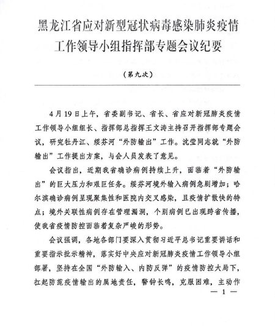

中共黑龙江内部文件提到，哈尔滨市出现比较严重的聚集性疫情局部反弹爆发态势等问题。（大纪元）

这次会议的《纪要》提到，要在中共国家卫健委支援绥芬河工作组指导下，研究提出由援鄂医疗队整建制接管牡丹江、绥芬河市定点医院的意见。（大纪元）

而近期大纪元获得的另一份内部通知也证实了这一点。

这份由中共牡丹江市委员会4月17日下发的《关于成立牡丹江医学院附属红旗医院和牡丹江市康安医院临时党委的通知》，决定成立牡丹江医学院附属红旗医院和牡丹江市康安医院临时党委。

文件显示，牡丹江市康安医院临时党委的成员组成名单:

书记：赵荣国 牡丹江市委常委、政府副市长，市新冠肺炎（武汉肺炎）疫情防控指挥部常务副总指挥

副书记：刘颖 牡丹江市卫健委主任、党组书记

贾富祥 牡丹江市康安医院党委书记、院长

委 员：张泽国 牡丹江市康安医院党委副书记、副院长等。

牡丹江市康安医院是牡丹江本地传染病医院，也是牡丹江武汉肺炎患者定点隔离治疗医院。

中共牡丹江市委员会4月17日下发关于决定成立牡丹江医学院附属红旗医院和牡丹江市康安医院临时党委的通知。（大纪元）

时政评论员李林一表示，从这个临时党委名单可知，牡丹江市康安医院原先就有党委，比如贾富祥，此人现在是临时党委的副书记，但他的头衔还包括康安医院党委书记。现在组建的临时党委实际是让掌控权落在了更大官阶的官员手中，应该是为后续接管、资源调度做铺垫。

在4月17日牡丹江康安医院成立临时党委后的第二天，该院就爆发了确诊病例疫情。

据黑龙江卫健委4月19日通报，65岁的龚某在3月20日至4月5日因肝病在牡丹江康安医院住院治疗，期间一直住单人间，也没出过病房，4月5日转到一家二级医院，其丈夫王某全程陪同。18日，龚某被确诊。之后王某也确诊。

4月23日，与龚某相关的武汉肺炎感染者又增加7例，算上龚某本人，这已是一场涉及14人的院内感染聚集性病例，其中包括两名医护。

牡丹江市卫健委疾控科科长纪树贵在新闻发布会上称，截至4月24日，牡丹江已筛查657人，并对3月20日至4月7日期间康安医院住院患者及陪护156人进行重点筛查，全部实行隔离管控。

蹊跷的是，同样在4月17日成立了临时党委的牡丹江医学院附属红旗医院，至今没有院内感染疫情的公开报导。

4月29日，习近平在中共政治局常委会议上点名黑龙江省，要完善和加强疫情防控工作措施，特别是加强医院感染防控。这是习近平在疫情发生后，首度公开点名黑龙江省要加强防疫。

<b>两次内部会议相隔4天 《纪要》显示中共措施不断升级</b>

从上述只相隔4天举行的第八次、第九次中共内部会议《纪要》显示，由于疫情失控，当地防疫措施不断升级。

两次会议关键点的比较：

第九次会议要求黑龙江全省三级综合医院、传染病专科医院全部建立检测实验室，并进一步扩展到县级医院。第八次会议提到，哈尔滨市要率先鼓励更多人自费做核酸检测；三级综合医院做到应检尽检。

中共黑龙江内部文件提到，哈尔滨市出现比较严重的聚集性疫情局部反弹暴发态势等问题。（大纪元）

从4月20日牡丹江市疫情防控指挥部办公室转发的《关于加快提升全省医疗机构核酸检测能力的通知》及4月23日《牡丹江市政府办公室关于召开全市核酸检测能力建设工作视频会议的通知》也显示了中共内部对此的运作。

（大纪元）

第九次会议要求把防止医院内交叉感染放在首位。研究提出由援鄂医疗队整建制接管牡丹江、绥芬河市定点医院的意见。要腾空定点医院，并标准化改建和验收“红区”、“缓冲区”等。

相比之下，第八次会议仅要求切实做好医院防护，防止院内交叉感染。

为此，牡丹江市疫情防控指挥部办公室在4月20日至少下发了两个文件：转发《开展医疗机构新冠肺炎防控和医疗救治专项督导检查的通知》及转发《加强医疗机构就诊患者新冠肺炎排查持续做好院感防控工作的通知》。

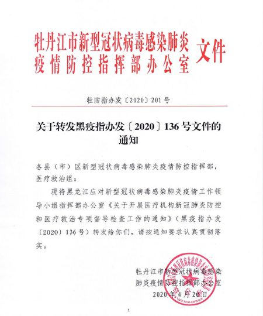

（大纪元）

第九次会议要求对隔离点服务人员实行集中居住或“两点一线”式管理。第八次会议未提及这部分。

第九次会议还要求对入境人员开始长达35天隔离。之前，对入境人员要求的隔离时间只有14天。

第九次会议还要求停运牡丹江至北京航班和列车。第八次会议未提及这部分。

<b>哈尔滨爆院内感染1传89人 黑龙江疫情升温</b>

近日，除了牡丹江之外，哈尔滨的两所医院，医科大学附属第一医院（下称“哈医大一院”）和哈尔滨市第二医院（下称“市二院”），也发生武汉肺炎感染。

4月28日，哈医大一院发布通告称，即日起，该院发热门诊暂时停诊一周，重新开诊时间另行通知。此前的20日，另一家也发生院内聚集感染的市二院已发布了“停诊公告”。这两家医院是哈尔滨最大的两所三甲医院。

87岁老人陈某君被认为是超级传播者，他先后在上述两家医院住院，致使两院同病区多名患者、陪护人员及7名护士1名医生被感染。至今，疫情还在蔓延中。

截至4月27日24时，已至少有89个感染者（68例确诊病例、21例无症状感染者），均为关联病例。此次疫情还“跨省传播”，内蒙古鄂温克、辽宁抚顺、沈阳各确诊1人，患者曾在同时期出入哈医大一院。

<b>内部文件曝哈尔滨疫情失控</b>

近日，大纪元获得一份内部文件。在文件中，中共承认哈尔滨疫情失控。文件还列举哈尔滨市在防疫问题上的四个“重大失误”。

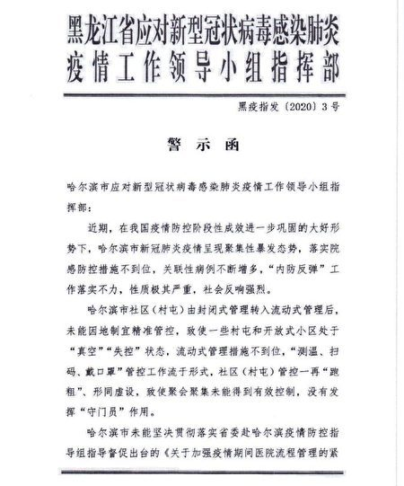

近日大纪元获得的中共内部文件显示哈尔滨疫情失控。（大纪元）

近日大纪元获得的中共内部文件显示哈尔滨疫情失控。（大纪元）

因疫情防控不利，哈尔滨副市长、卫健委主任和多家医院领导近日接连遭受处分；部分市民爆料，医院急诊数千人排队、哈市二次封城；内蒙古根河市，日前全面封闭与黑龙江边界的交通。

大纪元获得的中共内部文件更揭示出，哈尔滨疫情被严重瞒报，仅一个行政区单日检测出的确诊人数，就是中共公布的全市现有确诊病例数的十多倍。  

<a target="_blank" href=#top><h6 align="right">回上方</h6></a>
   

<a name=3>
<h1 align="center"><b>中共再祭影视战狼条款 港台艺人或动辄遭索赔</b></h1>

浙江东阳，横店春秋战国城影视拍摄基地内景。（大纪元资料室）

【大纪元2020年04月29日讯】（大纪元记者佟亦加综合报导）“中共病毒”（武汉肺炎）肆虐全球，经济和生命损失惨重。面对全世界几十个国家的追责和索赔，中共对言论和思想的管控变本加厉，日前传出大陆各大影音平台及影视公司对只要没有表态“爱国”、保证十年“政治正确”的港台艺人就不启用。引发舆论哗然。

香港《苹果日报》日前引述知情人士的消息披露，中共官方已口头通知大陆各大影片平台及影视公司，只要不是无可取替的香港、台湾幕前幕后人员，如果没有表态“爱国”，就尽量不启用。而被启用的港台艺人须作出10年保证不会因政治取向遭大陆官方封杀，如果制作方违约，影片平台有权追讨损失。

北京一间制作公司的高层人士梁小姐受访时透露，“最近我的公司拍好一部网络大电影，送检时因其中一位演员来自香港，电影局就要求我们公司出一份声明，保证这位演员是爱国爱港、不是港独分子。此外，这位香港演员也要写一份声明，即政治立场保证书，才能在大陆发展。”

梁小姐感慨：“坦白地说，官方对启用港台艺人加了如此多的关卡，只会令我们为了省却麻烦，就尽量不找港台艺人拍戏。”

不过，她透露，大陆制作公司对具有一定票房号召力的一线演员，如刘德华、甄子丹、周润发、梁朝伟、古天乐和赵又廷、陈乔恩和霍建华等依然乐于选用。当然，前提是艺人必须保证“政治正确”，就如中共广电总局文件中“战狼条款”：“对党（中共）离心离德的演员坚决不用。”

梁小姐举例说，最近有一间制作公司准备开拍一出古装电视剧，男女主角已确定用国内演员，而当男二号女二号准备启用港台艺人的计划书交到影片平台时，结果签订合约时增加了新条款：制作方在主创人员方面启用了港台艺人或工作人员，须保证他们10年内“政治正确”，不会因此遭大陆官方封杀，如果制作方违约，影片平台有权向制作方索赔。而制作方当然最终“株连”向艺人索赔。

在梁小姐看来，以前影片平台只不过口头警告，制作方已经不敢启用港台艺人，而现在要白纸黑字写在合约上，作出10年保证，她说：“试问一线以下的港台艺人还会有出路吗？不管他们爱不爱国，能不用的我们肯定尽量不用，何必自找麻烦。要我们保证一位艺人10年‘不出事’，怎样保证啊？！”

香港电影工作者总会会长田启文对《苹果日报》表示，“若消息属实，会令部分港台艺人失去工作。”他相信类似的条款，未必是中共官方授意，他怀疑是“有人揣摸上意”。

事实上，大陆网络稍早前流传的一份文件显示：“一、有过污点或造成网络舆论的艺人不得选用；二、港澳台有过不当言论的艺人不得选用；三、外籍艺人不得选用。”

当时，大家关注的焦点放在“限籍令”上，以为文件针对的是在娱乐圈发展的“外籍”艺人。虽然所传文件中并未列出演员的名字，但有“爱国”网民统计出了一份详细的名单，其中包括刘亦菲、吴亦凡、张铁林等在内，“外籍”艺人多达24位。

而当时的背景是，“中共病毒”（武汉肺炎）在中共的掩盖中蔓延到全球，生命与经济损失惨重，中共为了转移被追责的焦点，暗中抛出“病毒是美国投放”的阴谋论在网上流传，给民众洗脑，不断激发中国人“反美”、“反外”的民族主义情绪，甚至煽动民众对外籍演员的仇恨。

中共广电总局不仅针对演艺圈祭出“限薪令”、“限古令”、“限集令”、“限籍令”等重重限制令，而且对支持香港雨伞运动、“反送中”运动以及台湾“太阳花”学运的港台艺人长期进行打压和封杀。

此次中共再祭影视战狼条款，许多网友表示：“有良知的艺人是不会妥协的！”更有香港网友留言：“香港艺人北上这条路越来越难走下去，正好可以戒掉中共这个大病毒！”

<a target="_blank" href=#top><h6 align="right">回上方</h6></a> 
   
 
<a name=2>
<h1 align="center"><b>中共甘肃省长喊话：经济“十万火急”</b></h1>

因为受中共病毒影响，大陆经济陷入停顿，第一季度GDP大幅下降6.8%，这是大陆自1992年有季度GDP资料以来首次出现负值。图为受疫情影响下的中国工厂。(NOEL CELISAFP via Getty Images)

【大纪元2020年04月30日讯】（大纪元记者许梦儿综合报导）中共肺炎（武汉肺炎）疫情对中国经济所造成的冲击的后果已开始浮现。日前，中共甘肃省长唐仁健罕见喊话称，甘肃的经济到了“十万火急刻不容缓”的地步。虽然中共宣传复工复产“形势大好”，但唐仁健的讲话却透露出中国的经济已出现危急状态。

4月27日，唐仁健在甘肃省中小微企业发展推进会上发表讲话。中共官媒以题为“十万火急 刻不容缓，要让他们活下去！”发表。标题中的“他们”指的是当地的中小微企业。
廣告

唐仁健称，一旦中小微企业，还有个体工商户如果撑不过去这次疫情的冲击，出现大面积关门倒闭的现象，那么“皮之不存，毛将焉附”。

中共当局在疫情下力推复工。但唐仁健表示，“很多企业开了门没有客或客很少”，还远没有达到正常的生产经营水平，尤其是规下工业、住宿餐饮、文化旅游等行业疲弱不振，“个别企业甚至命悬一线”。在开工的企业中，52.1%的规下工业企业、62.4%的建筑业企业、54.9%的规下服务业企业在正常生产水平的50%以下，20.2%的规下工业企业、12.5%的限下住宿餐饮企业、18.5%的规下服务业企业预计二季度营业收入下降50%以上，再加上还需要负担税费、房租、社保、工资等各项刚性支出，有不少中小微企业面临着严峻的生存危机。

据预测，今年全省游客人数和收入可能比去年下降20%左右。唐仁健表示，一季度全省市场主体倒闭或关门的并不多，但是大家一点也不要乐观，因为倒闭或关门中间还有很多手续和过程，疫情的影响还远远没有反映出来。

对于中小微企业的生存危机，他表示，“帮助中小微企业渡过难关不是一般之急，而是十万火急”。“目前全省有176.5万户市场主体，这背后的从业人员数以千万计。“如果过不了这个‘坎’，它所带来的风险绝对会是一种‘蝴蝶效应’，引发银行坏帐、群众失业、合同违约那是肯定的，经济大循环的不畅乃至梗阻也是大概率的事情。更严重的是，很可能演化衍生为民生问题，甚至社会政治领域的风险。”

“一些政策效应的预期与企业的实际感受还是有不小的落差，很多企业反映的政策看得见、够不着……造成一些政策‘空转’‘悬置’的现象还是存在的。”

现年58岁的唐仁健于2017年空降甘肃任省长，他调任甘肃前任中财办副主任，曾是前中财办主任刘鹤的副手。

时政评论员李林一表示，在中共肺炎疫情的影响下，经济活动停顿了几个月，导致大陆各行业经济严重受创，目前，各种经济受损后果正在逐渐出现。唐仁健这番话，也道出了中国经济的真实状况，所以他才喊出“十万火急”，应该大陆其它省份的情况也是很糟糕。

最近，大陆一季度经济数据已公布，30省份的GDP均出现同比负增长，尤其广东等外向型大省以及东北等能源和重化工业省份受疫情冲击较大。

中共国家统计局此前公布了今年一季度GDP同比下降6.8%，其中，工业、投资、消费均为负增长。

今年3月，市场分析公司CBB International LLC发布的名为“中国褐皮书”（China Beige Book）的经济调查报告显示，在中共肺炎疫情影响下，中国企业状况比投资人预期的更差。

美国财经媒体巴隆周刊（Barron’s）和市场观察（Market Watch）的报导提到，这场危机最可怕的不是短期经济损失，而是对供应链的长期破坏。其中，中国汽车制造业和化工厂关闭的数量远超过其它行业。

英文大纪元专栏作家詹姆斯‧戈里（James Gorrie）于本月初撰文表示，中国正处于经济的急流当中，大规模的企业破产、失业正在从可能变成现实。经济噩耗频频传来，中共执政的合法性也将面临挑战。

<a target="_blank" href=#top><h6 align="right">回上方</h6></a>

<a name=1>
<h1 align="center"><b>【最新疫情5·1】川普：调查疫情爆发原因</b></h1>

4月30日下午，川普在保护美国老年人记者会上再次提到世界卫生组织。他说：“我认为世界卫生组织应该为其感到羞耻，因为他们就像中国（中共）的公共关系机构一样。”(MANDEL NGAN/AFP)

   
   【大纪元2020年05月01日讯】(大纪元记者夏雨、徐简、戴芙若、李言综合报导）5月1日全球中共病毒（武汉肺炎）疫情最新情况：
   
   根据约翰‧霍普金斯大学（Johns Hopkins University）的数据，截至美东时间4月30日晚上10点，全球确诊感染中共病毒（武汉肺炎）的人数超过320万，死亡人数超过23万（注：因中共和伊朗隐瞒疫情数据，真实数据比统计的要高），美国确诊人数超过100万，死亡人数超过6.3万。周四，纽约医院的病毒患者人数连续第17天下降。

目前美国一些州开始采取行动重新开放经济。美参议院多数党领袖米奇·麦康奈尔（Mitch McConnell）宣布下周重启参议院。

追责中共、让中共赔偿仍是美国政界的讨论话题。川普（特朗普）政府高级官员表示，相关部门正在制定一项长期对华战略以及惩罚中共的方式。4月30日，对于向中共追偿的金额，川普总统表示，他可以做不同的事情，或者做同样的事情，通过加征关税向中共收取更多的钱。

川普还表示，正在调查病毒起源和疫情爆发原因；他再次批评世卫应该对自己的所为、成为中共公关机构感到羞耻。

<b>伦敦希思罗机场扩建至少要推迟两年</b>

因为中共病毒对航空业产生了严重影响，希思罗机场表示，机场的扩建计划（包括第三条跑道）将至少推迟两年，

希思罗首席执行官约翰·霍兰德·凯伊（John Holland-Kaye）在被问及扩建计划时，对《天空新闻》说：“这是我眼中的最后一件事。” 他还说当航班恢复后，机场可能会进行新的健康检查。

该机场表示，由于与瘟疫大流行有关的旅行限制，预计4月份的旅客数量将下降97％。

<b>俄罗斯7,933例确诊 再创新高</b>

根据俄罗斯中共病毒的统计数据，该国周五确诊了7,933例病例，再次刷新单日最大增幅，使得患者总数达到114,431例，死亡1,169例。

前一天，俄罗斯总理米舒斯汀（Mikhail Mishustin）说，自己的病毒的测试呈阳性。米舒斯京提议在他居家隔离期间，由第一副总理别洛乌索夫代为执行总理职责。

<b>英国非洲裔的死亡率比白人高3.7倍</b>

英国财政研究所（IFS）的一项新分析强调，中共病毒对不同种族的攻击性具有“鲜明的不平等”现象。英国非洲裔黑人住院后的死亡率比英国白人高3.7倍。

IFS的研究还发现，除去年龄和地理位置的影响后，孟加拉国人的医院死亡人数是英国白人的两倍，而巴基斯坦的死亡率是英国白人的2.9倍。

<b>英国首相：英国已经过了疫情高峰期</b>

英国首相鲍里斯·约翰逊（Boris Johnson）周四表示，英国已经超过了中共病毒感染的高峰期。 他说，政府将在下周制定一项“路线图”，以放松全国的封锁限制。

<b>马来西亚下周将重新开放大多数企业</b>

马来西亚首相慕尤丁（Muhyiddin Yassin）今天宣布，马来西亚将允许大多数企业在下周一重新营业。

“我们准备执行第三种方法，即以可控和谨慎的方式在全国范围内重新开展经济活动。 因此，政府现在将执行《有条件运动控制令》（CMCO）。”

政府于三月制定了《全国运动控制令》（MCO），禁止马来西亚人出国旅行、社交、宗教和教育聚会等活动。

下周一，夜总会和斋月集市等大多数可能产生近距离接触的企业将保持关闭。 餐馆可以重新营业，但人们必须保持距离。

<b>瑞安航空削减3,000个工作岗位</b>

廉价航空公司瑞安航空（Ryanair）宣布计划削减3,000个工作岗位，在周五发布的市场更新中，该公司表示，预计本季度运营的航班量将不到其预定航班的1％。

该公司说：“瑞安航空现在预计客运需求和价格，如果恢复（至2019年的水平）至少需要两年，也就是直到2022年夏季。”

该航空公司表示，它将很快通知工会有关将于7月开始的重组和失业计划。

<b>美海军对2艘染疫船只的所有船员进行了测试</b>

美国海军已经对“罗斯福号”和“纪德号”(USS Kidd)船上的所有船员进行了中共病毒测试。

美国海军当地时间4月30日通报说，“罗斯福号”航空母舰和“基德号”驱逐舰上新冠病毒感染病例继续增加。根据两艘军舰的全员检测结果，“罗斯福号”上病例升至1,102例，“基德号”上病例升至78例。

目前，“罗斯福号”停靠在关岛，“基德号”停靠在加州圣达戈市的一处美国海军基地。

<b>印度首富宣布放弃薪水 直到疫情缓解</b>

印度首富穆克什·安巴尼（Mukesh Ambani）周四表示，在中共病毒大流行的到缓解之前，他不会拿任何薪水。

在疫情的影响下，穆克什·安巴尼经营的庞大的炼油、制造和电信集团信实工业公司（Reliance Industries）业绩很差，令人沮丧。

截至3月底的三个月，他的公司净利润下滑逾37％至650亿卢比（8.5亿美元）。

<b>澳洲政府将于下周五开会 考虑提前放宽限制措施</b>

澳大利亚总理莫里森（Scott Morrison）在周五新闻发布会上表示，澳大利亚将考虑提前放宽社交限制。莫里森在政府内阁会议后宣布了这一消息。

莫里森表示，政府内阁将于下周五召开会议讨论此事。

“澳大利亚人值得为其做出的努力而提前被获得肯定”，莫里森说，“我们需要重新启动我们的经济，我们需要重新启动我们的社会。”

莫里森还宣布了澳大利亚在处理COVID-19疫情方面取得的成功，目前全澳约1000个病例仍处阳性状态。

根据约翰-霍普金斯大学的数据，目前全澳确诊病例总数为6766人，死亡有93人。

澳洲首席医学官布伦丹·墨菲（Brendan Murphy）教授表示，澳大利亚最近每天的新增病例数保持在20以下。

澳大利亚如何拉平其中共病毒疫情发展曲线的？

在疫情方面，南澳大利亚现在被认为是世界上最安全的地方之一。

这也是澳洲卫生官员在本周发出放宽限制信息的理由，澳大利亚大部分地区开始逐步放宽限制措施过程。

许多澳大利亚人现在发现自己在全球处于如此令人羡慕的地位，仅在一个月前是不可想像的。之有全澳每日感染率已达到三位数。但是从上周五，全澳仅报告了16个新病例，比3月28日的460个新病例的高峰急剧下降。

在澳洲某些州，疫情发展曲线已完全趋于平坦：自本周一以来，昆士兰州没有任何新病例的报告，南澳州超过一个星期没有新的感染病例。

南澳大利亚州首席公共卫生官尼古拉·斯普里耶尔（Nicola Spurrier）在周三的新闻发布会上笑容灿烂地说：“南澳大利亚不再有新病例。这对我们来说是一个里程碑。”

澳洲总理莫里森宣布，澳洲将考虑提前放松社交距离限制。图为澳洲总理莫里森资料照。(DAVID GRAY/AFP via Getty Images)

<b>不需联邦救助 波音公司自筹资金250亿美元</b>

波音公司终究不需要联邦政府救助了。这家陷入困境的飞机制造商周四表示，公司正在通过发行债券筹集250亿美元。波音公司称，这将使其不必再于从联邦政府的《CARES Act》法案中获取巨大的资金支持。

美国立法者在3月份通过了2万亿美元的应对疫情的经济救助计划，其中包括帮助航空公司和其它受中共病毒疫情伤害的企业条款。波音公司有资格通过该法案获得政府贷款。

波音公司在一份声明中说：“我们对今天债券发行的反应感到高兴，这是为我们的业务和我们行业供应链中的17,000家公司保持流动资金而采取的若干步骤之一。”

波音表示，它也不认为在债券发行后将需要在资本市场上筹集更多的资金，而这些债券的发行期限为3年至40年不等。

波音公司为这次遭受疫情重创的企业之一。周三该公司公布了17亿美元的运营亏损，并宣布将通过自愿和非自愿裁员的方式裁掉1.6万个工作岗位。随着中共病毒肆虐全球，该公司受到航空旅行需求的崩溃而损失惨重。

需求的不足促使航空公司取消或推迟了波音公司及其欧洲竞争对手空客公司的新飞机订单。

<b>美国周四录得29,515个新病例</b>

据美国约翰·霍普金斯大学周四报告，当日美国有29,515个新病例和2040个死亡病例。

根据约翰·霍普金斯大学的数据，目前美国已录得至少有1,069,664例中共病毒病例和63,006例与病毒相关的死亡病例。

随着各州开始将“可能（因此病毒）死亡人数”纳入统计范围，包括约翰·霍普金斯大学的数据。这显示统计方法的变化，在接下来的时间里，数字可能会激增。

<b>川普周五前往戴维营 1个多月来首次离开白宫</b>

川普总统周五（5月1日）前往戴维营，这是他一个多月以来第一次离开白宫。

川普周四晚在总统日程中宣布了这次旅行，而川普恢复旅行，是白宫重新开放美国战略的一部分。

川普普在两周前宣布了有关各州重新开放企业和日常生活的准则。总统的“减慢扩散30天”策略将于周四午夜到期。

目前尚不清楚川普在马里兰州戴维营停留多长时间。他最后一次离开白宫是在3月28日，当时他前往弗吉尼亚，送海军舒适号医院船前往纽约。

川普下周将前往亚利桑那州，这是一个至关重要的摇摆州。他计划在那儿访问霍尼韦尔国际公司的一家生产医疗用品工厂，以表示支持抗击中共病毒大流行。
川普周四晚在总统日程中宣布了这次旅行，而川普恢复旅行，是白宫重新开放美国战略的一部分。图为4月30日川普签署美国老年人月公告。(Photo by MANDEL NGAN / AFP)

<b>川普：在调查疫情爆发原因</b>

4月30日下午，川普在保护美国老年人记者会上，对于中共是否在疫情爆发前就知道中共病毒但隐瞒下来，以及病毒起源和疫情为何爆发等问题，川普说：“到目前为止，我认为中方正在努力……对我们有些透明，但我们将找出答案。”

“这是一件可怕的事情。无论它们犯了一个错误，还是从一个错误开始，然后又犯了一个错误，还是有人故意做某件事。”川普说。

川普说：“目前有3到4种说法⋯⋯在不久的将来，我会给各位答案。”

对于中共病毒是否来自武汉病毒研究所，川普说：“我们正在调查它的确切来源以及为何爆发疫情，很多科学家及情报人员正在调查，很快会有答案。”

总统说：“我们应该在不久的将来得到答案，这将在很大程度上决定我对中方的看法。”

中共拒绝了美国的要求，即允许检查人员进入武汉实验室。

美国国家情报局代理局长理查德·格伦内尔（Richard Grenell）周四在一份声明中说，情报界同意广泛的科学共识，即COVID-19病毒不是人为造成的或转基因的。

“情报中心将继续严格审查新的信息和情报，以确定疫情是通过接触受感染动物开始，或是武汉一家实验室的事故造成。”他补充说。

消息人士说，美国川普（特朗普）政府已正式启动调查，探究中共病毒的起源以及爆发原因，以作为向中共究责的基础。

<b>驻韩美军17病患康复</b>

美国国防军发布消息称，有17名与美国驻韩部队有关的中共病毒患者已经康复。其中包括驻韩美军第一个确诊病例及第一个现役军人病例。其他病患还包括平民、承包商和家属。

在保持无症状7天，不服药情况下不发烧，连续两次通过阴性结果测试后，所有17个人均解除隔离，并被医疗人员获准出院。

周三，韩国自2月18日以来首次报告本地病例为零。

周四，该国有1例本地传播病例和8例进口病例。

<b>美国主要航空公司要求乘客搭机戴口罩</b>

美国A4A航空协会（Airlines for America）宣布，美国主要航空公司将开始要求乘客和雇员在整个飞行过程中都戴口罩或面罩。 声明说，包括登机、在飞行上和下飞机这个行程。

该协会代表美国最大航空公司。该协会表示：“在乘飞机旅行时戴上布面罩，只是航空公司在整个危机期间努力保护乘客和员工的方式之一。”

“（航空）承运商全天候工作，使用CDC认可的消毒剂为座舱、机舱和关键接触点（如托盘桌，扶手，安全带，纽扣，通风口，把手和盥洗室）进行消毒。”声明说。

该协会成员包括阿拉斯加航空，美国航空，阿特拉斯航空，达美航空，捷蓝航空，西南航空和联合航空。

<b>美死亡人数超过63,000</b>

截至美东时间周四晚10点，根据约翰·霍普金斯大学（JHU）的数据，在美国至少记录了1,069,534例中共病毒病例，包括63,001例死亡。

周四，JHU报告在美国至少有29,625例新病例和2,035例死亡。

<b>澳大利亚计划如何重启体育活动</b>

路透社援引两名熟悉情况的消息来源报导，由于澳大利亚每日病例减少，澳大利亚政府将在周五开会讨论体育活动如何重新开始。

一名消息人士说：“议程包括体育和其它娱乐活动的原则。”

路透社报导，澳大利亚国家橄榄球联盟表示将在5月28日恢复20轮比赛，但仍需获得政府的许可才能重启。

该国卫生部说，截至当地时间周五上午6点，有16例新病例。澳大利亚共有6762例病例，有92人死亡。

<b>IDC：智能手机出货量同比下降幅度史上最大</b>

国际数据公司（IDC）公布的初步数据显示，2020年前三个月，全球智能手机出货量同比下降11.7%。本季度，手机制造商出货了2.758亿部智能手机。

IDC表示，虽然第一季度的出货量通常会出现“连续（季度环比）下降”，但这是有史以来最大的同比下降。

中国是该季度最大的地区跌幅，出货量同比下降了20.3%。IDC表示：全球对中国智能手机供应链的依赖也引起了重大问题。

研究公司Counterpoint表示，其分析显示，一季度全球智能手机市场同比下降了13%。

<b>疫情破坏供应链 全球蔬果和鲜花面临腐烂</b>

由于封城和行动限制，全球农民正努力解决产品供应过剩的问题。

比利时人被要求吃更多的薯条，因为有超过75万吨马铃薯被扔掉。印度农民正在喂牛草莓，这通常是为游客和冰淇淋生产商准备的。而荷兰的公司正在购买鲜花以送给员工。

专家表示，这是对全球运输和供应链的破坏，导致某些地区出现罕见短缺现象，而另一些地区则出现了供应过剩的现象。

<b>因中共处理疫情不当 “世界正遭受巨大痛苦”</b>

周四在谈到中国共对疫情的回应时，川普说：“世界正遭受巨大痛苦”。

他说：“这（疫情）本来可以控制在起始位置的，我认为可以相对容易控制在其中。”“它们（中共）要么做不到，要么选择不做。”

川普说，“总之，它们（中共）让它（病毒）传播了或者失控了。”

他还说，“现在，与习近平达成的贸易协议，相对于中国（中共）如何应对这个病毒的方式，已经是次要的了。”

<b>川普：世卫像中共公关机构</b>

4月30日下午，川普在保护美国老年人记者会上再次提到世界卫生组织。他说：“我认为世界卫生组织应该为其感到羞耻，因为他们就像中国（中共）的公共关系机构一样。”

“这个国家（美国）每年要付给他们（WHO）近5亿美元，而中国（中共）每年只付给他们3,800万美元。”他说。

川普接着说：“这笔钱是多还是少都没有关系。当人们犯下可怕的错误，尤其是导致世界各地成千上万人死亡的错误时，他们不应该再找借口。”

“我认为世界卫生组织应该为自己感到羞耻。”他说。

<b>澳洲政府支持台湾重返世界卫生组织</b>

澳洲主流媒体引述官方消息指出，澳洲政府支持台湾重返世界卫生组织（WHO），并支持台湾参与WHO的事务。

《悉尼晨驱报》（Sydney Morning Herald）及墨尔本的《世纪报》（The Age）5月1日同时刊登报导，标题为“澳洲支持台湾重返世界卫生组织”（Australia to back Taiwan’s return to the WHO）。

报导指出，澳洲外交暨贸易部（DFAT）一位不具名的发言人在接受访问时表示，澳洲政府支持台湾参与WHO的事务。

发言人指出：“ 冠状病毒疾病（中共肺炎）所带来的挑战，需要一套果断的、涉及全球的应变措施。因此WHO与所有国家的卫生部门之间，必须维持一套紧密运作关系。”

<b>仍有五百多游客滞留马尔代夫</b>

马尔代夫旅游部长阿里·瓦希德（Ali Waheed）告诉CNN，仍有五百多名游客滞留在马尔代夫。

他说，其中约有100人最终被困在机场。 政府正在帮助负担不起继续入住度假村的人们。

<b>意大利患者康复数量创纪录</b>

意大利民事保护局4月30日公布的数据显示，意大利报告Covid-19新患者康复数量创下历史新高。

从该病毒中恢复的人数现在为75,945，创历史新高。 该机构表示，星期三报告了4,693例康复。

意大利还记录了285例新死亡病例，是过去四天中死亡人数增长最低的一天。

<b>美第四阶段刺激计划向各州提供资金？</b>

周四，川普被记者问到是否会支持向各州和各地区提供总计1万亿美元资金，众议院议长佩洛西（Nancy Pelosi）提出了这一数字。川普说，民主党人希望以纾困的形式帮助各州。他还说，是有民主党州长的州提出这个要求。

他表示，碰巧是民主党的州希望联邦资助，加利福尼亚、纽约州、伊利诺伊州，从这三个州开始。共和党的州处于强大状态。“共和党的州运行状态良好。”他说。

川普表示，这件事稍后再看。

佩洛西表示，下一个刺激计划将包括州和地方资金。

4月30日，被记者问到是否会支持向各州和各地区提供总计1万亿美元资金，川普说，民主党人希望以纾困的形式帮助各州。 (MANDEL NGAN / AFP)

<b>美国确诊数量增长变缓</b>

截至美东时间4月30日下午4点，根据约翰·霍普金斯大学和彭博新闻社的数据，美国中共病毒病例比前一天增加了1.2%，达到104万。低于过去一周平均每日3%的增长，以及周三2.7%的增长。

新泽西州州长菲尔·墨菲（Phil Murphy）称，新泽西州周三报告了460例新死亡，单日增长创历史新高。死亡人数总计7,228。

加州报告病例上升5.3%，达到48,917，是新病例单日最大的跃升。加州周四有95人死亡，为8天内最多。住院数量较前一天保持稳定。

根据该州卫生部门的数据，佛罗里达州报告了33,690例病例，比前一天增加了1.5%。死亡人数增加4.1%至1,268。州长罗恩·德桑蒂斯（Ron DeSantis）计划于5月4日开始重新开放。

内布拉斯加州病例日增幅最大，达到9.1%，总数达到3,851例。

<b>美航、达美和美联航将要求乘客戴口罩</b>

美国航空、达美航空和联合航空周四分别表示，将要求乘客搭机时戴上口罩。

达美和美联航这个政策于下周一生效，美国航空将于5月11日那一周生效。

此前，捷蓝航空和边疆航空公司已经发布类似公告。

<b>美国一半的州放宽居家令限制</b>

周四（4月30日），美国有一半的州推进放宽居家令限制，放宽对餐馆、零售和其它企业的限制，以希望恢复遭受中共病毒袭击的商业。

随着经济痛苦的增长达到历史性程度，人们开始采取各种行动，来放松居家令和对工作场所的强制性限制，特别是在中共病毒扩散正在减弱的地区。

两周来第二次，包括武装民兵组织成员在内的数百名抗议者聚集在密西根州兰辛市的州议会大厦前，要求结束州长格蕾琴·惠特默的“留在家中”命令。

<b>FDA以“闪电般”速度审查瑞德西韦</b>

FDA专员史蒂芬·哈恩（Stephen Hahn）4月30日表示，在美国一项重要试验得出令人鼓舞的结果后，美国食品药品监督管理局（FDA）正在以“闪电般的速度”，审查吉利德科学公司（Gilead Sciences Inc.）的Covid-19实验性药物瑞德西韦（Remdesivir）的数据。

彭博社报导，哈恩在接受采访时说：“我们正在与公司合作，强调（审查）速度的必要性，同时了解数据。”

“将有许多因素影响所有监管决策。我们希望查看所有数据，以确保瑞德西韦可使用在正确的患者身上。”他说。

美国国家过敏和传染病研究所所长安东尼·福西（Anthony Fauci）周三分享了早期试验结果，结果表明瑞德西韦在治疗中共肺炎方面具有重要作用。 福西说，平均而言，接受这种药物治疗的患者在11天内康复，而接受安慰剂的患者则在15天内康复。

吉利德科学公司（Gilead Sciences）的抗病毒药物瑞德西韦（Remdesivir，如图）的实验取得了初步进展。(Ulrich Perrey / POOL / AFP)

<b>武汉解封 居民：二次疫情来袭只是时间问题</b>

CNN报导，虽然武汉于4月8日放宽出行限制，但居民和当地企业很快就知道，城市的实际重新开放将非常缓慢。

许多商店仍关闭，餐馆仅允许外卖，即使市民外出时，仍戴着防护装备并试图避开对方。

一些小企业主向CNN表示，他们担心任何政府援助都可能为时已晚，无法挽救他们的小商店和餐馆，导致永远关闭经营。

值得注意的是，健身中心和电影院仍关闭，暂时没有重新开放的计划。

服务业恢复到100%生产率的速度非常缓慢。专家表示，服务业在大多数经济体中占据最大份额。

最糟糕的是，一些当地公民和企业主告CNN，他们认为，第二波中共病毒感染将席卷整个城市，第二次封城，对经济造成另一冲击只是时间问题。

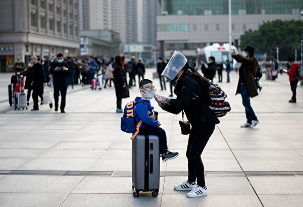

4月8日武汉火车站。(NOEL CELIS/AFP via Getty Images)

<b>美肉类现货或短缺 USDA：肉厂很快复工</b>

过去一周，美国屠宰场处理的牛、猪和绵羊比去年同期少了近一百万，这是一个新低点，专家们表示，这可能会导致一些杂货店“现货”肉类短缺。

普渡大学农业经济学系主任杰森·卢斯克（Jayson Lusk）说：“我不会说食品体系正在崩溃，但至少肉类行业目前处于严重的严峻状况。”

根据《今日美国》和中西部调查报告中心（Midwest Center for Investigative Reporting）的数据，最近几周，中共病毒的爆发导致美国肉类包装设施关闭，在80家工厂中，至少有4,400名工人病倒，导致28家工厂关闭至少一天。

根据美国农业部的数据，上周肉类产量与去年同期相比下降了约25%，本周三的产量比去年同期低了整整42%。

被屠宰的生猪数量减少推动了这一数据下降。该数字周三降至283,000，低于三月中旬的逾500,000。

美国农业部长桑尼·珀杜（Sonny Perdue）周三表示，他预计在川普总统的行政命令下，肉类工厂将在“几天而不是几周”内重新开放，以保持其运转。珀杜预计肉类产量短缺约达20%至30%，在一周至10天内缩小到“10%至15%”。

珀杜在电话采访中说，他希望屠宰场的工人立即开始接受防护装备，并接受中共病毒测试。

<b>Costco计划营业恢复正常 但有个条件</b>

Costco计划将营业恢复到中共病毒大流行前的正常状态，但有个条件：您必须戴口罩。

“今日美国”报导，从5月4日开始，大多数Costco卖场和加油站将恢复正常运营时间，具体时间因地点而异。但是客户和员工都必须戴口罩或面罩。

根据Costco的声明，此要求不适用于2岁以下儿童，或因医疗状况而不能戴口罩或面罩的人。

此外，该公司还更新了60岁以上会员的特殊营业时间。从下周一开始，部分Costco仓库将于周一至周五上午9点至上午10点期间，专门开放给60岁及以上的会员，以及残疾人士。其他客人将不被接纳。

Costco在声明中写道：“不应将口罩或面部遮盖物视为替代社交疏离的手段。”“请在Costco场所继续遵守有关适当距离的规定。”

美国Costco仓储店还对每个会员卡实行两人购物的限制。该政策不适用于El Paso、德克萨斯州和波多黎各的商店。

<b>梅西百货CEO：下周一或开放部分门店</b>

梅西百货公司首席执行官在接受采访时说，梅西百货公司计划在已经取消限制的州重新开设一些商店。

据《华尔街日报》报导，这家零售业巨头计划在下周一开放68家门店，而首席执行官杰夫·吉内特（Jeff Gennette）表示，如果中共病毒传播率下降并且获得政府批准，他预计梅西百货所有门店将在六周内重新开业。

吉内特在接受采访时说：“我们不知道消费者会如何回应。”

报导说，零售商将对购物体验进行几项重大改变，包括美容部门“非接触式”咨询服务，以及更少的试衣间。 还将鼓励购物者保持社交疏离的习惯。

“今日美国”无法获得梅西百货公司的立即置评。

<b>乔治亚州核发临时驾照 暂停路试</b>

在州长取消路试要求之后，直到中共病毒大流行紧急状态解除，乔治亚州的司机将能够在接下来几周内获得临时驾照。

根据临时规则，允许青少年申请驾照者提供父母、监护人或驾驶教练的证词，证明他们已经完成了40个小时路上监督驾驶，从而升级为获得临时驾照。还需要至少一年零一天的干净驾驶记录。

该州驾驶员服务部专员斯宾塞·摩尔（Spencer Moore）告诉WSB-TV，社交疏离准则导致目前无法进行面对面路试， 30,000驾照申请积压；在关闭路试之前，每周平均有5,000名青少年参加路试。

摩尔说，路测的首次通过率通常超过80%。

乔治亚州紧急状态定于5月13日到期，但州长可根据情况延长。

<b>专家：近期不太可能买到消毒剂和消毒湿巾</b>

当中共病毒开始大流行后，消毒湿巾、清洁喷雾剂和其它消毒类商品从商店货架被抢购一空。

CNN报导，可能还需要几个月时间，消费者才能再次在商店中轻松地买到消毒湿巾和喷雾剂等物品。

研究公司尼尔森（Nielsen）数据显示，3月和4月，气溶胶消毒剂销量比去年同期增长了230.5%，多功能清洁剂销量增长了109.1%。

锡拉丘兹大学（Syracuse University）供应链管理教授帕特里克‧彭菲尔德（Patrick Penfield）告诉CNN，他希望美国能够在7月底前，将货架上摆满消毒和清洁产品，同时要注意，到今年夏天，中共病毒病例将减少。

他说，消毒湿巾的问题是“需求延长”。

同时，宾州州立大学供应链研究中心执行主任史蒂夫‧特雷西（Steve Tracey）告诉CNN，我们无法确定何时可以看到这些物品回到货架。

特蕾西在接受CNN采访时说：“这是不可预测的。”“这不是一个‘是否（有货）’的问题，而是一个‘何时（有货）’的问题。很难预测什么时候。”

<b>荷兰郁金香农场给游客的特别信息</b>

每年，各国游客都会来到荷兰，陶醉在明亮多彩的郁金香园中。今年由于中共病毒大流行，使得很多人放弃了旅行计划，今年来荷兰观赏郁金香的游客特别少。

荷兰家庭花卉农场、旅游博客“荷兰水仙”为那些错过观赏郁金香的人发送了一条特别信息。荷兰水仙（Dutchodaffils）在Facebook帖子中写道：“由于Covid-19，旅行计划已更改。你们中的许多人都计划前往荷兰，看看盛开的花田。不幸的是，今年不可能了。你们中的许多人都看不到盛开的花田。”

“本周，荷兰水仙花家庭和荷兰郁金香家庭联手为所有想去荷兰旅行的人创造了一些东西。您可能会想念荷兰，但我们也想念您！”

荷兰水仙在Facebook帖子张贴的图片显示，花田中有“明年见你”的字迹和一颗心。“我们希望这能使您的生活更加美好，并希望明年见到您！真挚的爱！”

 

根据约翰‧霍普金斯大学的数据，荷兰有超过38,000例确诊中共病毒病例。

自病毒爆发以来，旅游业受到重大影响，因为许多国家在这段时间内禁止接纳访问者。结果，许多旅馆和其它与旅游业相关的产业遭受损失。

<a target="_blank" href=#top><h6 align="right">回上方</h6></a>
   
   
   
