

<h3><a target="_blank" href="https://bit.ly/3asSXIA">请多传破网软件，使更多的人了解真相从而得救，这是给自己积福德。 https://bit.ly/3asSXIA </h3></a>

   

     
<h3 align="center"><b>免翻视频  https://bit.ly/3ezRQKo  (请收藏网址 https://git.io/swspip)</b></h3> 

<h3 align="center"><b>复制网址到谷歌或火狐浏览器打开。若出现 “提示” ，請点击“继续”访问即可。</b></h3> 

<h3 align=center><a href="https://github.com/gav01/Heart/blob/master/news1.md">● 看更多大紀元時事 ●</a></h3>

<a href=https://git.io/souye><h6 align="right">回首頁</h6></a>

<a name=top>
 
 
 <a href =#272>272.38军退伍老兵游历阴曹地府 见到阎王爷 
<a href =#271>271.借美明州事件挑衅 华春莹被网民集体打脸  
<a href =#270>270.美国政府正在出售香港豪宅区一处物业 
<a href =#269>269.中印边境再冲突 中共军人遭拳打脚踢被带走  
<a href =#268>268.G7将变G11 川普围剿中共 重塑世界格局 
<a href =#267>267.京城路面也塌陷 广渠路现3米深大坑 
<a href =#266>266.华为噩梦连连 5G计划或破产 求生存难 
<a href =#265>265.【翻墙必看】分析：中共最恐惧的几件事  
<a href =#264>264.各国拒中共劣质口罩 大陆熔喷布价暴跌 
<a href =#263>263.川普签署法案 让子孙后代了解大屠杀历史  
<a href =#262>262.黑龙江安达市看守所酷刑折磨人的手段 

<a name=272>
<h1 align="center"><b>38军退伍老兵游历阴曹地府 见到阎王爷</b></h1>

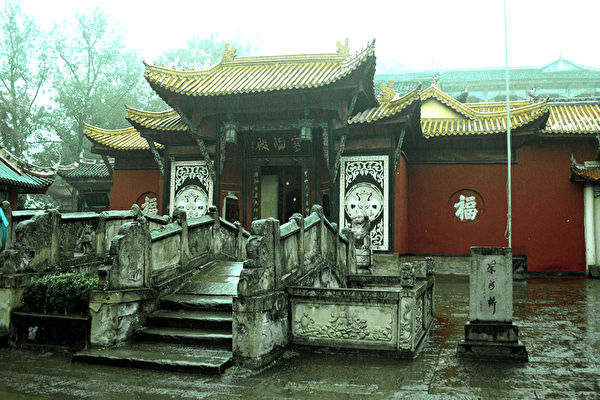

重庆酆都鬼城奈何桥（Gisling／维基百科）

   
   【大纪元2020年05月31日讯】坐在客车上，他突然感觉有人拧着他的肩膀在空中飞，一会儿就来到一座高大巍峨的宫殿，在确信见到阎王后，他知道自己已身处阴曹地府。

两个差役架着他过了奈何桥，这是送人转世投胎必经地，桥下是万丈深渊。

再往前走，他看到大池子里被鳄鱼、毒蛇、狮子等猛兽撕咬的人们，凄惨的哀嚎声让人毛骨悚然，还有在各类恐怖刑具上受刑的人，旁边是施刑的鬼役，尽管人们不断的痛悔求饶，但无济于事……

这听起来犹如聊斋志异的神话传说，不过它确是发生在现代人身上的真实故事，3月7日，在重庆市垫江公安局审讯室内，退伍军人成德富向绑架和审讯他的警察们讲述了以上他亲身经历的神奇事。

警察听了都觉得很震惊。一拨警察听完走了，又来一拨，说：“我们还没听到呢，快再给我们讲一下”。就这样，成德富一直讲到了晚上。

明慧网报导，重庆市垫江县桂溪镇，曾在38军当兵的73岁退伍老军人成德富，因传阅几份国家文件，2020年3月7日，他被垫江县“610”和国保大队的警察一伙人闯进家中绑架，遭遇抢劫和殴打。

成德富传阅的文件包括：国务院新闻出版署50号有关废除出版法轮功书籍的禁令、宪法关于信仰自由和言论自由等公民权利条款的摘录、公务员法关于执行上级错误命令的追责条款以及国务院公安部认定的十四种邪教并不包括法轮功。

此后，73岁的成德富被带到了垫江公安局，遭警察多次殴打和侮辱，老人被打掉2颗牙齿。

成德富对殴打他警察说：“我都73岁了，一个和你爷爷差不多大的白发苍苍的老人，你也打，你良心在哪里？”

一个穿便衣的男警察还把在成德富家抄家抢来的法轮功书籍踩在脚下，把法轮功师父的像坐在身下，成德富难过的老泪纵横，告诉他，你这样会遭报应的。

随后，成德富还是本着善心告诉警察为啥要修炼法轮功的原因。

成德富曾在38军当兵。当年，他在大冬天只穿内裤、光着身子疏浚天津河道时患上了多种严重疾病。他开始修炼法轮功后，只听了李洪志师父的一讲讲法录像，身患疾病的他就完全康复了，几十年来胸口像石板一样压着的感觉也不翼而飞。

他不但得到了一个健康的身体，法轮功真、善、忍的修炼原则还让他得到了心灵的净化和心性提高，为人处事时能替别人考虑。

成德富因修炼受益，他不但讲述法轮功的真相还道出了一段神奇的经历。

2011年7月，天正热，他因一个朋友卷了他的几万元钱跑掉了，急得几天吃不下饭。在寻人的路上，他坐在客车上突然感到胸口心脏部位被拍了一下，然后感觉两个人拧着他的肩膀在空中飞，一会儿就来到一座高大巍峨的宫殿。只听得一个声音说：“王爷，您要的人我们给您带来了。”

那个王爷叫成德富抬起头来。成德富看他头上戴着古时候皇帝戴的前后都挂着成串的珠子那种帽子（书面名称叫冕冠或旒冕），心想：既然穿着皇帝的服饰却被称为王爷，大概是阎王爷吧。

成德富问：“你是不是阎王？”他回答道：“对，我就是你们阳间所说的阎王。你们阳间不是不相信有阎王、地狱吗？现在你已经到了阴曹地府，我就是阎王。”

阴间为了防止抓错人也是要核对身份、验明正身的。阎王问成德富：“你叫什么名字？”成德富说我叫成德富。阎王翻了一下案桌上的一个大本子（大概就是生死簿吧），说：“嗯，有这个人。”阎王又问成德富：“你多大岁数了？”成德富说：“64岁了。”阎王“咦”了一下，嘀咕了一声：“不对。”

成德富赶紧说：“我这个‘成’是成都的‘成’哦。”阎王说：“错了错了，抓错了。那个该抓之人叫陈德富，四十多岁，罪大恶极，阳寿已到，该抓的是他。”

阎王马上吩咐其他差役去捉拿那个和成德富名字几乎相同的人。

阎王翻开另外一个本子，说：“你不属于我们管。”

成德富问：“我不属于你们管，那属于哪个管？”

阎王说：“你属于上面管，天上管。你看你的名字都已经注销了。”

成德富一看，果然名字被一笔勾销了。

成德富这才想起法轮功师父说过：“早期我就对你们讲过，我把大法弟子每个人都在地狱里除了名了，常人人人都在那里的名册中有名。大法弟子以前在地狱名册中的名字我都给你们勾销、叫地狱除名，那里面没有你们的名。”[1]

阎王又对成德富说：“你知道吗？你是有任务的，你的任务就是多做好事多救人。”阎王又说：“你既然来都来了，不妨参观一下再回去。”吩咐抓成德富来的那两个差役当他的导游。

来到奈何桥前，看到桥下万丈深渊，成德富不敢过。两个差役架着他才过了奈何桥。

差役说：“因为你是我们王爷的客人，我们才这样客气对你。如果是真正犯了罪，阳寿到了的，哪管你怕不怕，铁链子套上一拉就过来了。”

过了奈何桥，就看到一个一望无际的大池子，里面全是人，被血水泡着，人们被鳄鱼、毒蛇、狮子等各种食肉动物撕咬着，到处是残肢断腿，凄厉悲惨的哀嚎声让人毛骨悚然。尽管他们不断的痛悔求饶，但无济于事。

过了这个池子，是一个极其宽敞的广场，广场上摆着各种各样的刑具，每个刑具上都有人在受刑，刑具旁边是施刑的鬼役。

参观的第一个刑具是一男一女被一个长铁杆像穿糖葫芦一样穿在一起，两个的脸都是上半部被割了，耷拉下来盖住下半部分，相当吓人。

陪同的差役解说道：“这两个是在阳间乱搞男女关系的，通奸。既然不要脸，就把脸盖起来。”

第二处是一个人的舌头被一个铁钩子钩住吊着。差役说这个人是在阳间爱嚼舌头、到处挑拨是非、唯恐天下不乱的人。

第三处是一个人被用小刀一片一片的割肉。差役说：“这个人在阳间爱占小便宜，做生意缺斤少两。他占多少便宜，割多少肉。”成德富问：“他一生要占多少啊，还得清吗？”差役说：“还得清，还得清。还完为止。”

第四处是一个大胖子，肉被一坨一坨的宰下来，差役说这是个贪官。成德富心想：他在阳间贪钱的时候那百元大票子一捆一捆的，受刑的时候就一坨坨的宰。

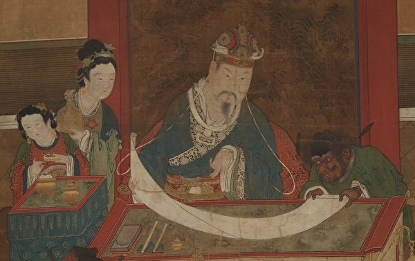

图为明代《地狱十王图》之一，哈佛大学赛克勒博物馆藏。（公有领域）

正要参观下一处时，阎王说：“时间到了，该回去了。再不回去，就来不及了。”

阎王又问成德富：“我刚才给你说的，你记住了吗？”成德富说：“我记住了。”阎王说：“那你重复一遍。”成德富说：“要回去多救人。”

于是，阎王叫那两个差役快把成德富送回去。两个差役提着成德富往上一扔，成德富心里一惊，大叫一声。叫声刚停，就听到耳边有人问：“你喊什么？”

成德富定睛一看，原来躺在县医院的重症监护室里，病床边坐着司机和售票员。

售票员说：“看到你晕倒后，我们以最快的速度把你送到垫江县人民医院来，才把车开到车站下客。下完客，我们立刻就过来守着你。你输液也输不进，输氧也输不进。呼吸和脉搏都感觉不到，医生都准备宣布死亡了。我们觉得你还有点体温，就让医生再等会。你再不醒过来，医生就要把你推进停尸房了。你看从6点到现在，都10点了。”

经过这次地狱经历后，作为信仰神佛，敬畏天地的法轮功学员，成德富在修炼上也逐渐更精进起来。他希望自己的经历能惊醒那些不信善恶有报，还在迫害法轮功的无神论者。

<a target="_blank" href=#top><h6 align="right">回上方</h6></a>

<a name=271>
<h1 align="center"><b>借美明州事件挑衅 华春莹被网民集体打脸</b></h1>

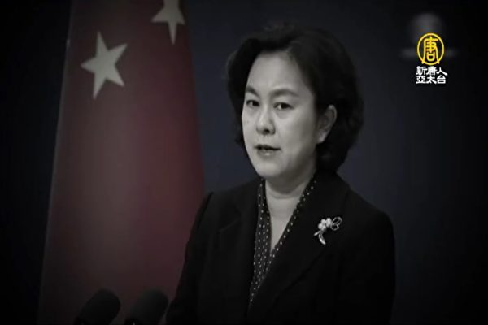

中共外交部发言人华春莹。（新唐人电视台授权影片截图）

   
 【大纪元2020年05月31日讯】（大纪元记者林燕综合报导）中共外交部发言人华春莹周六（5月30日）在社交媒体推特上借明州事件挑衅美国国务院发言人，结果再被中外网民集体打脸。

美国国务院发言人摩根·奥塔格斯（Morgan Ortagus）周六早上就中共强推“港版国安法”问题接受美国CNN采访，随后她在推特上贴出采访视频，并推文说：“这是世界的关键时刻。它会载入历史。世界各地热爱自由的人民必须遵守法治，并追究中国共产党的责任，中国共产党公然违背了其对香港人的承诺。”

 2小时后，中共外交部发言人华春莹回复奥塔格斯说：“‘我不能呼吸’（I can’t breathe）。”

华春莹故意用这句话隐射美国国内正在爆发的示威活动。因一名黑人男子25日被警员制服期间死亡，明州爆发示威和暴力冲突，并席卷到全美各地，目前进入第五天。

死者是46岁的乔治·弗洛伊德（George Floyd），有影片显示他伏在地上，被一名白人警员用膝部压颈，难以呼吸。

随后明州开除四名涉事警员，压住弗洛伊德的警员德雷克·肖文（Derek Chauvin）被控三级谋杀罪，并将于下周一（6月1日）首次出庭。

明州州长沃尔兹（Tim Waltz）30日表示，目前的抗议局势已经偏离初衷，与抗议弗洛伊德被警察膝盖锁压颈项致死已经没有关联。明州多处发生示威者焚烧和抢掠的现象。

不过，华春莹是想帮那名黑人死者说话吗？华春莹的这则推文，受到中英文、中外网民辣评的集体打脸。

知名的国家安全记者、中国通贝书颖（Bethany Allen Ebrahimian）辛辣回复华春莹的推文说：“我欢迎中共对美国种族正义的支持。

“当然，外交部对此发表的评论可能不是出自真心。许多中共支持者都真的相信美国对香港抗议活动的支持是愤世嫉俗，因此他们认为像华这样的推文证明了某些内容。

“另外，这些天我们美国国内的环境是有点奇怪（编注：暗示推特对美国总统以及白宫官方账号推文进行虚假标注，却不标注中共这些宣传账号），所以我觉得我必须重申，外国政府官员公开对有争议的美国内政发表看法并不是一种政治干预形式。

“（中共宣传的）此类公众评论也应与众所周知的苏联战略区别开来，苏联战略是通过暗中散布虚假信息或为某些特定群体提供物质支持、煽动国外的种族紧张局势。”

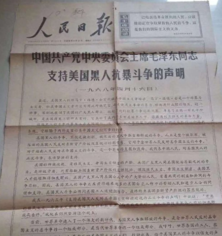

图为中共党媒《人民日报》1968年4月16日发表的头版文章，中共党魁毛泽东“支持美国黑人抗暴斗争的声明”。（网络来源）

   
  有网民说，但凡了解一点中共的历史背景就知道为什么它会对美国的示威活动表示支持。

有中文网民对比美国弗洛伊德案与北京雷洋案、回复华春莹说：“美国警方在弗洛伊德案件中一错再错。首先执法过程居然可以录视频，连手机都不先抢走。其次不知道给老黑栽赃一个嫖娼罪名，先从道德上批倒批臭；不及时撇清关系，搬出一个临时工顶锅；不删帖不控评、不发动网络评论员引导舆论。最关键的是，中国（中共）政府处理雷洋案件的标准模版摆在那里，连抄作业都不会。”

还有网民将中共指使香港警察暴力对待抗议者致死案跟美国正在发生的弗洛伊德案对比，反驳华春莹根本是在搅浑水。网民解释说，左边看似代表公权力，实则个别人或部分人的行为；右边看似个案，实则是党国故意的行为。 

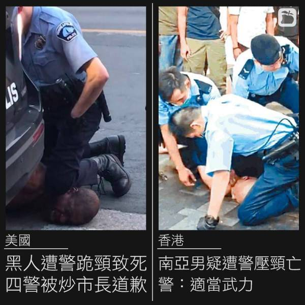

<a target="_blank" href=#top><h6 align="right">回上方</h6></a>

<a name=270>
<h1 align="center"><b>美国政府正在出售香港豪宅区一处物业</b></h1>

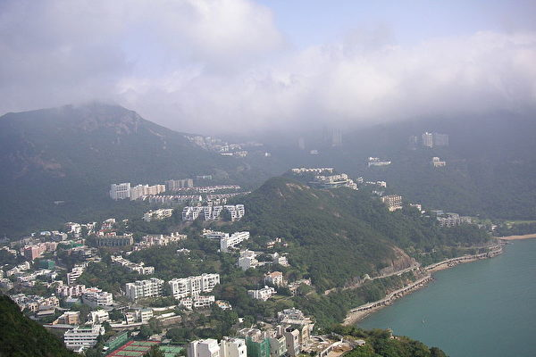

美国国务院代表在一封电子邮件中表示，美国政府正在出售在香港的房产，该房产位于香港最豪华的社区之一。图为香港寿臣山。（ HenryLi/WikiMedia Commons ）

   
【大纪元2020年05月31日讯】（大纪元记者夏雨综合报导）彭博社5月30日报导，美国国务院代表在一封电子邮件中表示，美国政府正在出售在香港的一处房产，该房产位于香港最豪华的社区之一。

这位国务院代表说：“作为其全球再投资计划的一部分，国务院海外建筑物运营局会定期审查美国政府在海外持有的房地产。”

电邮还说，国务院还投资改善了美国政府在香港拥有的其它房产，包括美国总领事馆办公大楼。

路透社也报导，美国政府表示将出售其在香港的一处主要物业，是一栋价值高达50亿港元（6.4509亿美元）的豪华住宅综合体。

美国驻香港领事馆发言人告诉路透社，这是美国政府全球再投资计划的一部分，该计划通过在其它领域的再投资，“加强美国政府在香港的存在”。

不过，率先报导美国政府出售香港房产的新闻网站香港01报导说，美国正在出售的物业有数栋豪宅，位于香港岛南部寿臣山（Shouson Hill），价值100亿港元（合13亿美元）。香港的一些最富有大亨在该区拥有房产。

土地注册处的记录显示，美国政府于1948年购买了该物业，当时地皮建有6栋洋房，这些地方的业主为“THE UNITED STATES OF AMERICA”，用作美国驻港总领事馆员工宿舍。

美国政府作出这一决定之际，时值中共强推港版国安法，再次引发香港的民主抗议活动。1997年香港回归中国时，北京承诺“一国两制”模式下赋予香港高度自治权，但抗议者却表示，中共正在对香港的自治和自由进行深度侵犯。他们说，未来几周计划举行更多抗议活动。

5月29日，美国总统川普（特朗普）在白宫玫瑰园召开中国主题新闻会，他宣布，中共承诺香港“一国两制”，但现在香港变成了“一国一制”，他将开始采取步骤，撤销美国对香港的特别贸易待遇，以回应中共人大刚通过的备受争议的“港版国安法”。

总统表示，撤销香港特殊待遇涉及与香港所有协议的全部范围，从引渡到出口管制，再到双重用途技术等，几无例外。

美国对香港特殊待遇的转变将影响这个前英国殖民地与美国关系的数个方面。这意味着美国将收回之前给予香港的、不同于大陆省份的关税、技术、出口、旅行、金融等方面的特殊待遇。

川普说，中共本周对香港安全实行的控制，“完全违反了北京在1984年跟英国签署的声明以及香港《基本法》中的明确规定义务”。

<a target="_blank" href=#top><h6 align="right">回上方</h6></a>

<a name=269>
<h1 align="center"><b>中印边境再冲突 中共军人遭拳打脚踢被带走</b></h1>

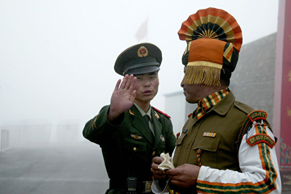

中共与印度的边境问题由来已久。图为示意图。（Getty Images）

   
   【大纪元2020年05月31日讯】中共战狼外交在全球各处挑衅，最近又在中印边境剑拔弩张。5月31日在推特（Twitter）广传的视频显示，中共军人与印度军人在中印边境地区发生冲突，一名中共军人被对方拳打脚踢并被“俘获”。中印双方至今未有作出回应。

5月31日，美媒《纽约时报》报道，中共军人日前在边境与印度军人对峙，双方没有开火，只是使用石头、木棍和拳脚，数名印军受伤，由直升机运走救治，而中共军人也有受伤。

当日，推特上流传的视频显示，多名印度军人在存在主权争议的班公错（Pangong Tso）湖边路上，猛烈砸烂侦察车，将一名疑似中共军人按倒在地，拳打脚踢，而从士兵所穿的迷彩服来看，可以确定是一名中共士兵。期间疑有人用普通话大叫“救命”。该名躺在地上的士兵头破血流，被印度军人带走。

<h4 align=center><a href="https://twitter.com/Sister_Jing/status/1267005890772766720?ref_src=twsrc%5Etfw%7Ctwcamp%5Etweetembed%7Ctwterm%5E1267005890772766720&ref_url=https%3A%2F%2Fwww.epochtimes.com%2Fgb%2F20%2F5%2F31%2Fn12149757.htm">美国的骚乱在中国被刷屏了，但是中国士兵被印度人活捉，军车被印度人砸烂了的新闻却在墙国消声灭迹。。。。(点击右键,另存新档）</a></h4>

《苹果日报》报导，军事评论员黄东表示，视频看来真确性相当高，被击退的“东风猛士”多用途越野车属中共军方所有，中共立国后从未见过这种中印出动海陆空装备的对峙场面。

黄东认为，如果中共士兵被俘，这是否会成为中方以此为借口开战的导火线，还需继续观察。

而中共军人被印军“俘获”后的结果如何，中印双方至今仍未作出回应。

看视频：

1、中共军方是7-8两东风猛士军用越野，山寨悍马，有装甲能防弹，曾获国家科技进步一等奖，浪费

2、一个排的军人，被石头、棍棒和拳头搞这么惨，共军现在的战力，呵呵

3、一个共军被印度边防警察用盾牌护在胯下，已经头破血流，印度人边打边骂：婊子养的

<h4 align=center><a href="https://twitter.com/stanleynordic/status/1267011379791376386">看视频：(点击右键,另存新档）</a></h4>

上周，中印在边境拉达克地区冲突频频。外界报导，两国均增加驻军人数。中共外交部发言人赵立坚5月27日在记者会上未正面回应，但声称中印边境地区目前局势总体稳定且可控。

微博认证为大V的军事博客“Ifx160219”转载印度《The Wolrd is One News》节目中印证最近确实出现中印士兵武装对峙的画面。

也有不少网民嘲讽中共及中共军队：“这下尴尬了， 中央军委怎么办？南有南海争端，西有印度边界争端，还有美军虎视眈眈？”

“解放军：怎么能让我们去边界与印度对峙呢？我们是对付老百姓的啊。”

<a target="_blank" href=#top><h6 align="right">回上方</h6></a>

<a name=268>
<h1 align="center"><b>G7将变G11 川普围剿中共 重塑世界格局</b></h1>

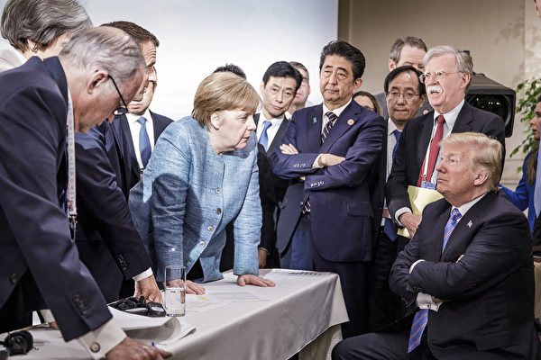

图为2019年G7峰会。(Jesco Denzel /Bundesregierung via Getty Images)

【大纪元2020年05月31日讯】（大纪元记者徐简综合报导）美国总统川普（特朗普）决定将七国集团（G7）峰会推迟到夏季之后，并承诺邀请俄罗斯和其他几个国家来参加会议，因为他认为目前的G7格局已经“非常过时”了。白宫发言人透露，总统想召集一些盟友和疫情的“受害国”，一起向中共施压。

金融时报报导，川普原计划下个月在白宫召开G7峰会，邀请成员国德国、法国、加拿大、日本、意大利和英国来参加，但是德国总理默克尔称鉴于“疫情愿意”拒绝亲自来参加会议，川普推迟了会议。

在从佛罗里达州（SpaceX）火箭发射回来的空军一号（Air Force One）上，川普对记者说，G7论坛的格局代表不了当今世界上“正在发生的事情”。他说：“这是一个非常过时的国家集团（组合）”。

川普表示，他想邀请俄罗斯、印度、澳大利亚和韩国的领导人参加这次会议，而开会时间建议可能订在9月份，或者可能在11月的总统选举后举行。

“也许在选举后我会做（召开会议），但我认为大选之前将是一个好时机。”川普在谈到这次活动时，把这次会议称为G10和G11。之所以称为G11，是因为俄罗斯的参与具有不确定性。

白宫战略传播总监艾丽莎•法拉（Alyssa Farah）表示，川普总统希望邀请美国的一些传统盟友以及受到中共病毒影响的那些国家，大家汇聚一堂讨论未来如何对付中国（中共）的未来。川普上周五宣布了针对中共的制裁，包括停止香港特惠地位、制裁香港和中国官员等。

上周英国《泰晤士报》报导，英国政府有意推动全球10个民主国家，组成“D10”科技联盟，作为5G设备与其他技术的替代供应来源，排挤中共。据了解，“D10”将是G7国家加上澳洲、南韩与印度。而这次川普拟邀请的国家对象，恰好就是D10加上俄罗斯。

外界认为俄罗斯的加入可能会有些困难，因为俄罗斯从乌克兰吞并克里米亚地区之后，在2014年被驱逐出原来的八国集团。鉴于莫斯科在全球战略的重要性，川普曾几次建议邀俄罗斯加入峰会，但遭到某些国家反对。

韩国政府的一位官员周日对路透社表示，韩国已经意识到川普总统的邀请，并将与美国讨论此事。

<a target="_blank" href=#top><h6 align="right">回上方</h6></a>

<a name=267>
<h1 align="center"><b>京城路面也塌陷 广渠路现3米深大坑</b></h1>

【大纪元2020年05月31日讯】（大纪元记者萧律生报导）继广州、西宁路面塌陷后，5月31日上午，北京市通州区广渠路段突然塌陷，出现一个约3米深的大坑。

中共交通广播微信公众号5月31日消息，上午一场急雨过后，北京市通州区广渠路东延至运河西大街与玉桥东路交叉口路南侧路面突然塌陷，出现一个跨度约5米、深约3米的大坑。

消息指，工作人员说，大坑可能与管路漏水冲刷地下土壤有关。目前官方未给出具体原因。报导指初步了解，此次路面塌陷未造成人员伤亡。

不过，网民对雨水冲刷的理由表示质疑。“路面下水泥截面干净齐整，不可能是雨水冲刷泥土形成，应该与此处设计施工相关，附近可能还有类似险段，有关部门严查啊！”“才下多大雨。”

“这工程质量真可以，该好好查查吧。”“京城路塌豆腐渣。”

大纪元记者查询，北京市通州区广渠路段此前还发生过至少两次塌陷。

2014年6月21日，北京市通州区广渠路现2米大坑，当时网民说或：“这片地方塌了不是一次两次了，北京这一年有些地方都踏了多少次了？不过可别跟深圳那个那么恐怖。十多米深，走在路上还没反应突然塌陷，把那保安兄弟给坑害了。现在哪都那么恐怖。”

2014年4月4日晚,北京广渠路大郊亭桥西侧800米位置东向西辅路路面发生塌陷，出现一个直径约12米、深约10米的大坑。

除了北京，近半年大陆多地发生塌陷事故。

5月29日，南京市扬子江大道一施工工地发生塌陷。

3月31日早上6时左右，广东省广州市海珠区东晓南路北往南方向近昌岗街道办事处路段发生塌陷。

1月13日傍晚5时左右，青海省西宁市红十字医院门口发生地面塌陷，一辆搭载多人的公交车掉进大坑里。截至14日22点30分，央视新闻称，官方已证实9人死亡、10人失踪、17人受伤。

2019年12月1日，广州市区发生地面塌陷，3人被埋，当局直接往坑中填水泥，借口是避免塌陷区域扩大，34天后，只挖出一具遗体。

<a target="_blank" href=#top><h6 align="right">回上方</h6></a>

<a name=266>
   
<h1 align="center"><b>华为噩梦连连 5G计划或破产 求生存难</b></h1>

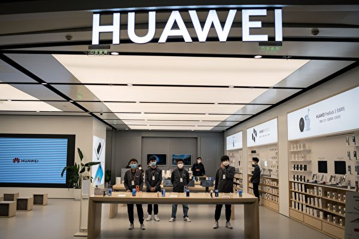

美国最新出台的对华为的新规定将很快打击华为，随之而来的安全问题将让华为面临更大困境。 (NICOLAS ASFOURI/AFP via Getty Images)

【大纪元2020年05月30日讯】（大纪元记者吴馨综合报导）美国商务部继去年将华为列入黑名单后，最近再推新规，限制美国以外含美国技术的芯片对华为出口。这将改写各国与华为合作策略，影响华为5G网络建设，并让华为在求生中挣扎。

扎克·多夫曼（Zak Doffman）是“数字屏障”（Digital Barriers）的创始人兼首席执行官，“数字屏障”为国防、国家安全和反恐开发先进的监视解决方案。5月24日，福布斯网站发表了多夫曼的文章《华为恶梦周将更糟》（Huawei’s Nightmare Week Is About To Get Much Worse），他在文章中指出，美国最新出台的对华为的新规定将很快打击华为，随之而来的安全问题将让华为面临更大困境。
</b>美国新规补漏 华为几近山穷水尽</b>

在美国将华为列入黑名单，即实体清单（Entity List）一周年之际，美国商务部工业与安全局（Bureau of Industry and Security，下简称BIS）5月15日发布新的公告，宣布对华为扩大制裁范围。该公告明确指出，自2019年华为及其114个相关机构被列入美国黑名单后，华为继续通过委托海外制造商使用美国设备进行生产，并继续使用美国软件和技术来设计半导体，从而破坏了美国黑名单的国家安全和外交政策的目的。新禁令要求在美国以外的厂商，在向华为出口使用了美方技术的半导体芯片时，必须申请出口许可证。

美国商务部长威尔伯·罗斯（Wilbur Ross）说：“这不是负责任的全球企业的举止。我们必须修改被华为和海思（HiSilicon）利用的规则，并防止利用美国技术破坏美国国家安全和外交政策利益的邪恶活动。”

多夫曼指出，这对华为来说将是一个严重打击，这不仅仅是华为智能手机失去谷歌功能的问题，而是其大多数产品及其未来战略将失去依赖美国技术的芯片。虽然华为自己的芯片子公司海思是华为最初防御黑名单的核心，即对其供应链进行“去美国化”，但是海思自制芯片在设计过程中仍然依赖美国技术，而实际加工芯片的制造厂也使用美国技术。现在这一切都将终止。

多夫曼分析认为，华为可以简单地在市场上寻找不会违反新规的现有芯片，但这会立即让华为产品降级，从旗舰产品降为仿制品。多夫曼认为，这对于一家模仿苹果已经到了管理新产品发布阶段的公司而言，那种情况会更糟。华为在国内有许多较小的竞争对手。这些功能强大的芯片是华为与众不同的关键部分。

按照新规，海思访问美国技术的两个关键渠道将被切断：包括Cadence Design Systems Inc和Synopsys Inc等美国公司的芯片设计软件；以及由台积电（Taiwan Semiconductor Manufacturing Co Ltd）领导的“晶圆代工”制造能力。台积电是全球最大合同芯片制造商，海思设计出的芯片实际是由该公司制造。

虽然华为可以利用中共投资来加速发展国内技术，以填补技术缺口，但是，多夫曼认为，问题在于这将需要数年时间，而这是华为根本没有的时间。华为在智能手机方面已经落后了一年，去年秋天的Mate 30和今年春天的P40，由于缺少谷歌软件，在中国以外地区表现平平。

而切断华为芯片供应链会影响到华为业务的所有领域，也包括那些已经将赌注押出的未来领域。数百万来之不易的中国境外消费者将会流失。

路透社报导，新规可能成为美国对这家中国公司最致命的一击。华为轮值董事长郭平（Guo Ping）承认受到冲击，他在5月18日的华为年度全球分析师峰会上说：“求生是我们现在的关键词。”

<b>5G风暴眼聚焦伦敦 英国三年后清除华为</b>

美国新的出口管制规定让全球看到与华为合作的风险。多夫曼认为，华为在去年美国黑名单制裁下获得的最大胜利莫过于其赢得的年度旗舰合同，但现在看起来这些合同将无法执行了。美国去年出台黑名单旨在减少华为向美国全球盟友出售5G网络设备，理由是华为缺乏透明度，以及与北京政府和机构的关系，这带来了安全隐患。尽管美国进行了游说，但世界上多个国家仍不愿削减华为合同。

这场华为5G风暴眼聚焦伦敦。英国在今年1月确认，将允许华为参与英国的5G网络建设，尽管比例限制为35%，且仅限于边缘设备。多夫曼指出，英国本是美国最亲密的安全盟友，其与华为的合作不仅破坏了美国的努力，而且还向世界其它地方传达了一个信息，即华为可能不如美国声称的那样糟糕，否则伦敦为什么还要同意将其保留下来？

随着新规定的出台，英国似乎准备重新考虑该决定。《卫报》25日报导，英国政府发言人说：“在美国宣布对华为实施进一步制裁之后，英国国家网络安全中心（NCSC）正在仔细研究它们可能对英国网络造成的影响。”

报导指出，NCSC的审查旨在为唐宁街争取在2023年之前彻底消除英国电话网络中的华为设备铺平道路，并平息保守派议员们反对华为的声音。

多夫曼认为，随着针对中共虚假信息的反对日益增强，特别是在中共病毒（武汉病毒、新冠病毒）大流行早期，来自美国和英国保守派的压力加剧了，据报导，英国首相约翰逊已要求官员制定计划，以减少在关键技术和设备方面对中国的依赖。

多夫曼指出，英国做出逆转的原因比较简单，即缺乏美国技术，而依靠不太安全的中国国内替代品，华为的安全性可能会改变。但是华为产品被英国淘汰将使华为技术面临更大风险，这破坏了华为的网络安全认证，对华为来说是一个更大的问题。这将阻碍华为赢得5G合同，以及与其它主要竞争对手在中国以外竞争的能力，从而造成真正的损失。

<b>170多个网络受影响 华为5G计划或破产</b>

与华为合作的损失已经开始出现。CNBC记者山姆·谢德（Sam Shead）在5月26日发表的一篇文章中表示，英国是华为的主要市场，如果英国政府禁止使用该技术，那么对英国的某些移动运营商将产生重大影响，因为他们已经投资了华为的5G设备。

另外，华为的损失也可预见。多夫曼表示，在美国新禁令之前，华为有一个宏伟的计划，一个类似苹果的由消费设备、人工智能和云平台，甚至包括汽车在内构成的生态系统，都融合在该通用芯片组和现在的跨平台操作系统上。还增加了监视、智能城市自动化及其5G设备。现在，该策略需要重新考虑。

多夫曼指出，为了努力摆脱对外国技术的依赖，华为已经投入了数十亿美元的研发资金，以建立具有专利创新技术的生态系统。但美国的新规定将使这数十亿的投资支出变得毫无价值。

英国市场研究公司“阿雷特研究”（Arete Research）的高级分析师布雷特﮲辛普森（Brett Simpson）告诉美国全国公共广播电台（NPR）说：“即使你购买了人才和教授，也无法购买设备。你得使用美国软件设计芯片，然后使用美国设备进行生产。这就是底线。”

华为自己承认，美国的新规定将对其造成巨大冲击。华为在一份声明中说：“这项新规定将影响到我们已经在170多个国家和地区推出的价值数千亿美元网络扩展、维护和持续运营。”

据NPR报导，当前欧洲4G移动网络基础设施中多达40%来自华为，而5G升级中的大部分将依赖于此。美国新的出口管制措施可能会切断为现有4G基站提供服务的新零件的采购，因此与华为合作将危及未来5G网络的建设。

多夫曼认为，华为问题才刚刚开始，并将持续数月之久，因为华为的芯片库存可能一年后才用完，然后才能完全更换设备。

<a target="_blank" href=#top><h6 align="right">回上方</h6></a>

<a name=265>
<h1 align="center"><b>川普政府外部顾问：中共最怕三件事</b></h1>

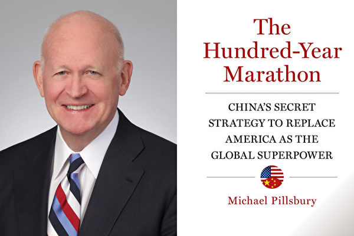

美国前五角大楼中国问题专家白邦瑞以及他的新书《百年马拉松》。（大纪元合成图）

   
   【大纪元2020年05月29日讯】（大纪元记者王祥编译报导）美国智库哈德逊研究所中国战略主任白邦瑞（Michael Pillsbury）周四（5月28日）接受福克斯采访时表示，中共最害怕三件事：垮台、被围剿和川普（特朗普）连任。

白邦瑞是川普政府的对华贸易问题外部顾问。他说，中共害怕的第一件事是“他们担心中国共产党会成为目标、走苏联共产党那条路，他们就此写了很多文章。他们有时幻想香港是这一行动的滩头堡，这就是为什么他们要镇压香港。”

中共害怕的第二件事是被围剿（encirclement）。

“他们认为，他们的邻国加在一起的军事力量和经济力量远超过中国，但目前还没有针对中国（中共）的联盟。”白邦瑞说。

中共的第三种担心是川普连任。白邦瑞说，中共梦想民主党总统候选人、前副总统乔·拜登（Joe Biden）能在11月美国大选后接管白宫，但他认为，中共的这一梦想会烟消云散。

福克斯主持人又提问，做什么可加速共产党解体。

“这已经成为一个目标，就像里根总统那样，中国共产党对中国人不好，他们拥有内部派系；坦率地说，他们可能分裂为两党，反对派以及改革派。我认为，那将是一件好事，但现在还没有看到（这种趋势）。”白邦瑞回答说。

在被问到川普政府的对华政策是否已确定这一目标，白邦瑞回答说：“你得核对，它必须成为美国对华官方政策的目标，但上周白宫公布的16页文档（指《《美国对中华人民共和国的战略方针》）中没有。”

对中共最害怕的第二件事，白邦瑞表示，对中共的围剿也需要跟中共的周边邻国讨论协调措施。“最基本的，我们需要建立印度洋地区的秘书处和联盟协议，但这些结构尚未开始。”他说，“我想，如果拜登不能在中国（中共）的帮助下入主白宫的话，总统（川普）会考虑做这件事。”

白邦瑞表示，所以川普连任也是中共害怕的第三件事。

他说：“有一个非常重要的问题，你得发现川普的交易艺术，他在他过去的房地产交易中对此进行过很多讨论。你得知道对方最想要啥、他们最怕啥，这就是你进行谈判的基础。”

<h4 align=center><a href="https://twitter.com/LouDobbs/status/1266493001741803520?ref_src=twsrc%5Etfw%7Ctwcamp%5Etweetembed%7Ctwterm%5E1266493001741803520&ref_url=https%3A%2F%2Fwww.epochtimes.com%2Fgb%2F20%2F5%2F29%2Fn12146836.htm">川普连任也是中共害怕的第三件事(点击右键,另存新档）</a></h4>

<b>川普白宫对华新闻会 释放强烈信号</b>

就中共强推“港版国安法”，美国总统川普周五（5月29日）在白宫召开中国主题新闻发布会，抨击中共违背《中英联合声明》，破坏香港自治。

虽然新闻会不到10分钟，但川普宣布的几项重要政策调整已对中共释放强烈信号。

“与那些前任（美国总统）不同，我的行政当局（跟中共）进行了谈判和抗争，为求得正义。这叫做公平与对等待遇。”川普说。

具体看，

第一，宣布撤销香港的海关/旅行特惠地位，等于切断中共借道香港购买美国受管制科技的通道；

第二，终止美国与世界卫生组织的关系，相当于“成人之美”、拱手让中共当世卫的第一大金主；

第三，禁止跟中共“军民融合”项目有关、在中国军方大学学习过、研究过、工作过的中国学生获取F或J签证，进入美国进行研究生以上的学习或工作。此举出于切断中共企图借助非传统途径盗窃美国军事技术、发展军事的可能。

第四，宣布将制裁某些迫害香港自治的中共和香港官员。此举相当于精准打击、对中共和香港官员的心理震慑力甚过现实损失。

第五，下令白宫经济小组调查在美上市的中国企业的行为，要求中企遵守美国的审计规则行事、不得享有豁免。此举可能在一定程度上切断中共高官借助企业从海外捞钱的渠道。

国家利益中心高级主管、亚洲问题专家哈里·卡齐亚尼斯（Harry J. Kazianis）表示，川普的发言代表一场超级大国摊牌正在酝酿之中，有可能为未来十年或更长时间的美国外交政策指明方向。

<a target="_blank" href=#top><h6 align="right">回上方</h6></a>

<a name=264>
<h1 align="center"><b>各国拒中共劣质口罩 大陆熔喷布价暴跌</b></h1>

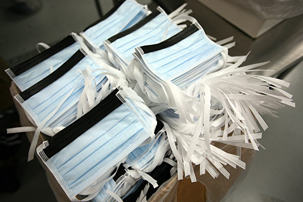

全球疫情大流行后，中共企图“提升国际形象”，频频向海外输出口罩，但其伪劣产品被各国要求退货。(Tom Pennington/Getty Images)

   
【大纪元2020年05月31日讯】（大纪元记者周心鉴综合报导）全球疫情大流行后，中共企图“提升国际形象”，频频向海外输出口罩，但其伪劣产品被各国要求退货。因海外订单减少，之前热销的口罩原材料熔喷布价格暴跌，从每吨45万元（人民币，下同）跌到2000元。
熔喷布每吨45万元暴跌到2000元

综合陆媒报导，湖南口罩生产企业人士透露，原材料熔喷布价格从年前的1.8万元/吨，一路上涨。不论什么质量水平的熔喷布都可以卖到40万元/吨以上，最疯狂的时候，市场上的熔喷布一小时一个价。

江苏扬中市投资口罩生产的徐女士表示，当时生产熔喷布的机器，价格也水涨船高。疫情之前每台1.2万元，发生后每台达到3万元，最贵时涨到15万元。据了解，整个扬中市生产熔喷布的机器一度达到五千多台。

但疯狂情况在4月15日戛然而止，全市所有熔喷布生产经营企业全面停产整顿。最高卖到每吨45万元的熔喷布，突然跌到最低2000元！
每台15万的设备如今“像垃圾”

与此同时，用于生产熔喷布的机器，也突然无人接手，每台15万的设备，“就像垃圾一样，只能当废铁卖。”徐女士说，“整个扬中据说有5000台机器，现在几乎都没有了。”

公开资料显示，熔喷布用料有25g和50g之分，过滤效率有92%、95%和99%等几个档位，就是平时所说的90级、95级和99级，分别代表可以过滤90%、95%和99%的非油性颗粒物，正常的合乎标准产品应该95级以上，80级以下熔喷布基本是废品。

一名企业负责人表示，现在80级以下的只能当作角料来卖，但即使几千元就能买到，仍没有订单；至于90级以下的价格亦大降，因民用口罩出口要求愈加严格，厂家没有订单只能降价，加上比亚迪、格力、五菱等大企业转产口罩，拿走政府采购及出口大单，小厂生存空间进一步被压缩。

此前，浙江义乌一家卫生用品股份公司的股东李迪（化名）曾对大纪元记者表示，他们公司生产的口罩大部分出口到海外六国。后来企业办理出口手续趋严，一定要认识政府部门的人才行，否则办不下资质，非但赚不到钱还要亏钱。
中共“口罩外交”失败

有分析认为，造成大陆熔喷布价格暴跌的原因，是中共病毒（武汉肺炎）疫情爆发以来，中共大搞所谓的“口罩外交”，向各国出口大批医疗用品，多个国家反映从中国进口的口罩不合格，之后纷纷拒绝。以下举部分事例：

美国食品和药物管理局5月7日表示，撤销约60家中国制造商在美国销售N95口罩的许可，理由是这些制造商生产的口罩无法针对中共病毒提供足够的防护。

德国卫生部发言人5月说，自疫情爆发以来，德国政府为医院及诊所从中国购买了超过1亿只口罩，“大约有20%的口罩不符合标准”。

4月25日，加拿大政府表示，大约100万只购自中国的KN95口罩不符合标准，无法使用。

4月24日，欧盟消费保护机制接连对中国制四项口罩产品发布“严重警示”通报，强调过滤能力不足，除了不符合欧盟标准之外，还存在感染的风险。

4月8日，芬兰政府表示，向北京购买的200万个防护口罩“都不合格”，无法在医院使用。

4月，澳大利亚边境局官员扣押了从北京购买的大约80万个有缺陷的口罩，价值760万美元。

荷兰卫生部3月28日发表声明，21日收到130万片中国制口罩，标明“KN95”等级，但经两次测试，发现口罩未能紧贴脸部及过滤病毒功能不合格。

<a target="_blank" href=#top><h6 align="right">回上方</h6></a>

<a name=263>
<h1 align="center"><b>川普签署法案 让子孙后代了解大屠杀历史</b></h1>

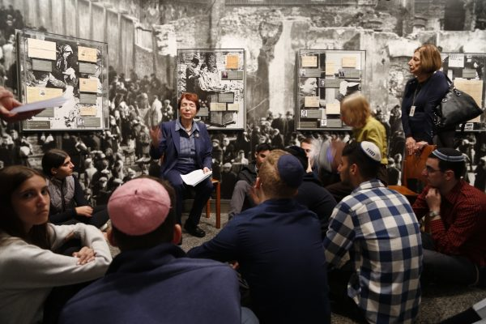

现居纽约市的大屠杀幸存者给学生们讲述亲身经历。 (施萍／大纪元。)

【大纪元2020年05月31日讯】（大纪元记者林南综合报导）美国总统川普（特朗普）周五（5月29日）签署了一项法案，让子孙后代了解并记住大屠杀的悲惨历史。

这项名为《永远不再教育法案》（Never Again Education Act）由纽约联邦众议员卡罗琳·马洛尼（Carolyn Maloney）于2019年1月31日提出。旨在授权美国大屠杀纪念馆研发有关大屠杀的教育材料，为教师和教育工作者提供教育资源，同时也授权开展各种大屠杀教育计划活动，提高人们对大屠杀的认识和了解。

第二次世界大战期间，德国纳粹及其帮凶共杀害了大约六百万名犹太人。这种有组织的、官僚的、国家支持的迫害和谋杀活动被称为大屠杀。自德国颁布种族歧视法开始，纳粹便对全欧洲的犹太人进行大屠杀。

《永远不再教育法案》于今年1月27日在众议院获得通过，5月13日在参议院过关，5月29日，由川普总统签署后成为法律。

“这项法律将有助于确保子孙后代了解并记住大屠杀的悲惨历史，准确地反映出邪恶和偏狭排斥如何短暂地压制了人性，而美国领导的强有力进军，如何跨越整个欧洲结束了针对犹太人的种族灭绝。”白宫新闻发言人凯里·麦肯尼（Kayleigh McEnany）说。

麦肯尼还说：“与这项法案的名称一致，美国不会支持大屠杀期间的大规模迫害和大规模谋杀。”

“本届政府将始终致力于确保子孙后代永远不会忘记大屠杀，他们谴责各种种族仇恨，并始终致力于保护所有人做礼拜的自由。”麦肯尼说。

2018年5月，一个为纳粹受害者寻求补偿的组织公布一项调查结果说，美国人对纳粹政权及其帮凶在国家支持下有组织地迫害和谋杀六百万犹太人的大屠杀缺乏了解。同一项调查还发现，超过90％的人认为学校应该让孩子们了解这一历史。

<a target="_blank" href=#top><h6 align="right">回上方</h6></a>

<a name=262>
<h1 align="center"><b>黑龙江安达市看守所酷刑折磨人的手段</b></h1>

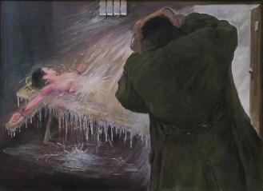

绘画：中共酷刑示意图：浇冷水。（明慧网）

   
  【大纪元2020年05月29日讯】宋红伟因不背监规，牢头又开始一盆一盆地往她身上浇凉水。她浑身上下被浇透了，冻得发抖。牢头不停地浇，水从她鼻子呛进去，她快要窒息了。

零下十多度，王清被放在水泥地上挨冻。狱警又端来两盆凉水从她头顶泼到脚，她身上的棉衣全部湿透，她昏死过去。

黑龙江安达市看守所非法关押法轮功学员，在生活上虐待她们，并实施酷刑折磨，如浇冷水、老虎凳、上大镣、关小号、棒打、踩踢等，企图令她们放弃信仰。

<b>监室阴暗、污浊</b>

黑龙江省安达市看守所环境、条件十分恶劣。二十多人拥挤在一个牢房里，牢房中还有一个蹲便。二十多人在室内上厕所，冬天不开窗，臭气弥漫，令人作呕、喘不过气来。

牢房里，窗户很窄小，只是普通窗户上面一层的大小，平时见不着阳光，24小时灯光照明，晚上也不闭灯。

监室内阴暗、潮湿，不通风，洗的衣服放在屋里地上铺着晾干，偶尔让拿出去晒。潮湿导致大部分人身上长了疥疮。

<b>伙食差 变相勒索</b>

安达看守所伙食很差，早饭是一个馒头、一碗汤，所说的汤，其实就是盐水加几片大头菜叶子；午饭是一碗大碴粥和用大头菜做的很咸的咸菜；晚饭是一个窝窝头、一碗汤，在汤里有时还发现有苍蝇、虫子和泥。即使这样也不能说出来，否则会更糟糕。每周三中午，大碴粥换成大米粥，常年如此。

这里在押人员吃不饱，缺乏营养，家里给存一些钱，但东西的价格很昂贵，食物比外面的价格高出几倍，如：一只小鸡60元，在外面卖18元；在外面卖20元的鸭子，在这里卖60元。狱警变相勒索钱财。

甚至牢头也强制其他在押犯给他订猪头肉等，不订，在押犯就挨打挨骂。有人找律师向看守所反映此情况，后来牢头知道了，还对反映情况的人报复打击，又打又骂。牢头不但没收敛，反而更嚣张了。

法轮功学员在被转送到监狱之前，看守所让家属来接见一次，但家属要想见到人，必须交500元钱，才能接见，否则不让见。法轮功学员杨传厚的弟弟、妹妹来看他和他的妻子时，被强迫交了1,000元。

<b>恐惧训练</b>

上级部门经常来看守所检查，看有没有违纪的情况，经常抽查，看看衣服里藏没藏什么东西，造成人人恐惧，长期处于高度紧张状态。还时不时的有恐惧、造假、威胁训练。

管房的牢头说上面要来检查，问能不能吃饱，只能回答说“能吃饱”；问生活用品贵不贵，回答说“不贵、平价”。牢头还经常说看守所有死亡指标，意思就是说看守所可以随便打死人。

看守所还搞株连，只要有一个人违反监规，全监室的人受罚。如果在押犯的家里不给存钱的，就受歧视，罚拖地、刷厕所、洗抹布，要多干活，还得挨打挨骂。

<b>法轮功学员遭迫害案例</b>

<b>教师王芳被戴脚镣一个月</b>

王芳是绥化市北林区尚志小学的教师，2018年10月3日，与杨传厚、白霞、王福华、赵婷婷四名绥化法轮功学员去兰西县北安村发送法轮功真相资料时，被兰西县公安国保和北安镇派出所警察绑架，先关在兰西县拘留所，后转到安达看守所。

2019年6月29日，王芳因在监室炼功，被看守所警察戴上沉重的脚镣，长达一个月左右。每天从早到晚都戴，睡觉都不给她打开。施暴人是安达市看守所于义达、赵会刚、吴学明、沈国兴。

王芳多年担任班主任工作，差班交给她，她毫无怨言，真诚对待学生，一视同仁，言传身教。家长送来的钱物，王芳从不收受，都婉言谢绝，或放学后让学生带回去，或她亲自上门说清，自己是按“真、善、忍”的要求去做，所做一切都是应该的，家长们都很感动。

这样的好老师却屡遭绑架。2007年王芳被绥化北林区“610”（专门迫害法轮功的非法机构）绑架、非法关押，此事当时在社会上引起了很大反响。家长们不愿失去好老师，自动组织起来，到学校及市教委要人，强烈要求王芳回来给孩子上课。有些家长还通过关系到公检法要人。家长们说：“好老师天底下难找，太冤枉了！什么世道？！”

王芳于2019年5月被安达市法院非法庭审并判刑2年，处罚金1万元，后送到黑龙江省女子监狱迫害，至今仍被非法关押在那里。

<b>宋红伟被绑架到看守所</b>

宋红伟的丈夫杨传厚去兰西县发法轮功真相资料，被非法关在兰西拘留所，2018年10月10日，宋红伟和法轮功学员高锦淑、吴景华去兰西送衣物及了解情况时，兰西国保张涛叫来了主管国保的丁局长、公安局法制办人员，还有四五个特警及摄像人员。

丁局长故意诱导宋红伟说，你说的没有念的好，看你包里有啥，就拿出来念吧。在宋红伟念《给警察的一封信》时，警察给她录像，作为后来给她们定罪（到公安局宣传）判刑的所谓“证据”。

宋红伟没念几分钟，警察就不容分说把她们三人绑架，当时高锦淑背包里还有2,600元钱，宋红伟有1,000元钱，也都被抢走。国保张涛等人让宋红伟上车，她拒绝，国保就把她强制拖着塞进车里，并用手铐反铐着。

到医院检查身体时，宋红伟不配合，国保荣力（女）连推带搡强制要给她检查。在场的医生看到荣力这样凶，对她说：“姐，别这样。”

在非法审讯时，兰西国保张涛等还强迫宋红伟、高锦淑、吴景华坐铁椅子（老虎凳）。一次审讯后，一个绥化的警察对高锦淑说：“你们说我们摘器官，今天我就把你的心、肝、肺摘下来。”

法轮功学员跟荣力讲真相，荣力说：“你别讲了，这么多年我都送走（指判刑劳教等）20个了。2018年10月15日，宋红伟等六人被送到安达市看守所非法关押。

<b>宋红伟在安达看守所被迫害</b>

刚到安达看守所的第一天，狱警让宋红伟照像，她不照，四个狱警就把她抬到监室。管房的牢头把她拽到厕所，往她身上一盆一盆地浇凉水，从头往下浇。10月的东北，天气很冷，屋里还没给暖气，冰得她全身打颤；同时牢头对她拳脚相加，拽头发，打得宋红伟脸肿胀变形。也不知过了多久，作恶者才住手。

第二天，全监室人员出去放风时狱警让报数，说宋红伟声音小，因此株连全体，取消了集体放风，其实是找茬继续迫害她。

牢头把宋红伟又拽到厕所，拳打脚踢，并开始浇凉水，重复头一天的迫害。还不时地骂她，打骂声很大，外面狱警听得真真切切，无人制止，很显然牢头是在狱警的唆使下干的。宋红伟被打得遍体鳞伤。

在这种情况下，牢头还让她刷厕所，宋红伟不刷，牢头对着她的下巴就是一拳。由于宋红伟的丈夫也被非法关押，家里没给她存钱，牢头对她歧视和凌辱，还让她长期刷厕所，洗抹布，时常打骂她。

一次，宋红伟不背监规，牢头又开始一盆一盆地浇凉水。宋红伟浑身上下被浇透了，冻得她发抖。牢头不停地浇，使她喘不过气来。水从鼻子呛进去，人快窒息了，她用力捏住鼻子，半天才透过气来。

当天宋红伟被迫害得脖子都抬不起来了，刚抬起来，“吧嗒”一下就落下去，只能低着头，脖子、头都支撑不起来。监室的人都吓得够呛，怕她残废了。在这种情况下，牢头还对宋红伟特别恶。

<b>赵婷婷、王福华等遭毒打</b>

绥化法轮功学员赵婷婷在监室炼功，牢头不让她炼，就从床上把她使劲拽到地上，赵婷婷差点跌倒。牢头说：“全看守所都知道，我是一个恶魔！”

一天，赵婷婷、王福华、宋红伟不穿号服马夹，并打坐炼功，被牢头看见，她们又遭一顿打。牢头往赵婷婷、宋红伟前胸用拳头狠狠地打，把赵婷婷的前胸打青了。赵婷婷是90后，幼师，二十多岁，未婚，牢头毫不留情地对她下狠手！

看守所强制给王福华、宋红伟天天量血压，血压不高也强迫她们吃药。如果她们不量血压、不吃药，就被打骂；不管她们的血压正不正常，她们都得吃药。王福华不吃，牢头穷凶极恶地一拳把她的喝水杠子打到蹲便里去。

一次，宋红伟不吃药，牢头又让她刷厕所。宋红伟由于缺乏营养，几次晕倒，牢头说她是装的。同监室的人要给宋红伟点东西吃，牢头不让给，并让人轮番“转化”（放弃修炼法轮功）、吓唬她，说不转化就判她10年，她还要遭受掰手指盖等种种酷刑。在安达看守所，宋红伟身心受到了极大的摧残。

在安达看守所1年零半个月的时间里，宋红伟的体重由100斤降到79斤，人已瘦成皮包骨。由于阴暗潮湿，她浑身长了疥疮，很痒，天天晚上痒得睡不着觉；腿部神经痛，经常刚睡着就疼醒，半夜坐起来捶腿，疼痛难忍；脑袋也不好使，过去的事都想不起来了，呈失意的状态。

一天，一个男狱警看到宋红伟时吓了一跳，说没见过这么瘦的人。同监室人都为她担心。牢头说她简直像个骷髅头！宋红伟因身体极度虚弱，晕过去三四次，走路都走不了，心跳加快。她能活着走出安达看守所是死里逃生。

<b>肇东市王清被迫害离世</b>

肇东市法轮功学员王清是在监狱里开始修炼法轮功的。2016年2月26日下午3点钟左右，王清和肇东法轮功学员高景云、杨淑君、黄丽华在肇东市尚家镇四合村讲法轮功真相时，被不明真相的人构陷，被肇东“610”绑架。

王清、黄丽华被关押到安达看守所。当天安达多名狱警把她俩毒打致伤。王清被多名警察同时狠命地毒打，被用脚踢、踹，用手掐，用电棍电等，王清被打得内脏疼痛、呼吸困难。

在零下十多度的情况下，她被放在水泥地上挨冻，狱警又端来两盆凉水从她的头上泼到脚。王清身上的棉衣全部湿透，她昏死过去。狱警又用凉水将她泼醒后，把她抬到屋里关进“小号”，又绑在铁椅子上继续迫害，直到她生命垂危。

监狱怕担责任，让王清的家人将她接回家，后来王清含冤离世。 

<a target="_blank" href=#top><h6 align="right">回上方</h6></a>
