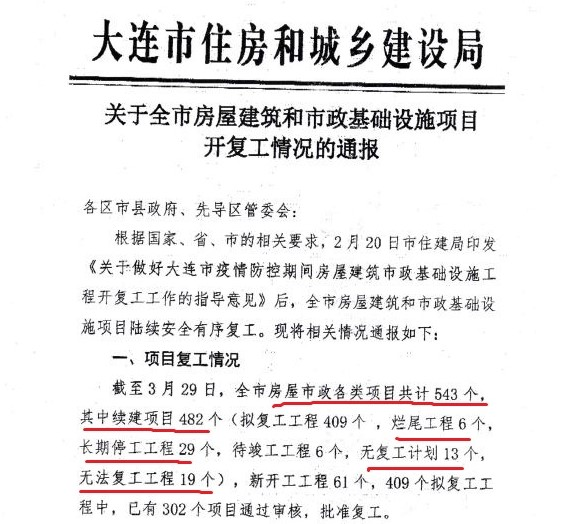
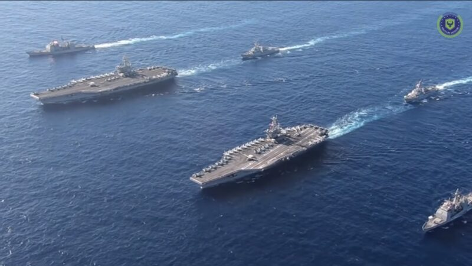
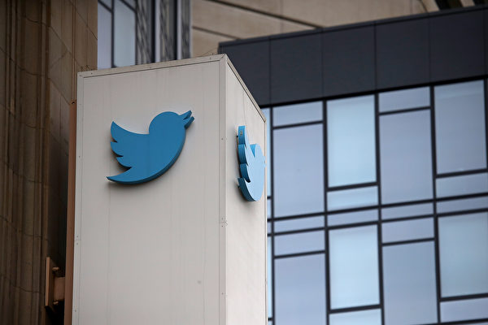
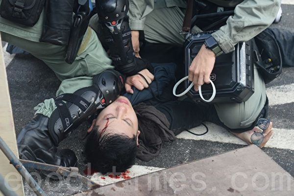
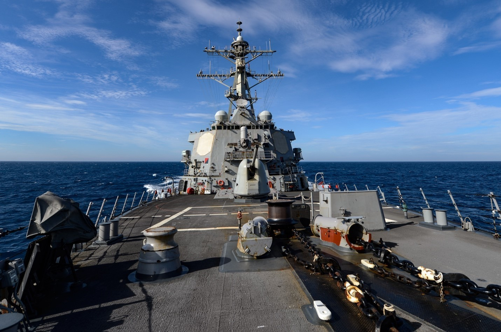
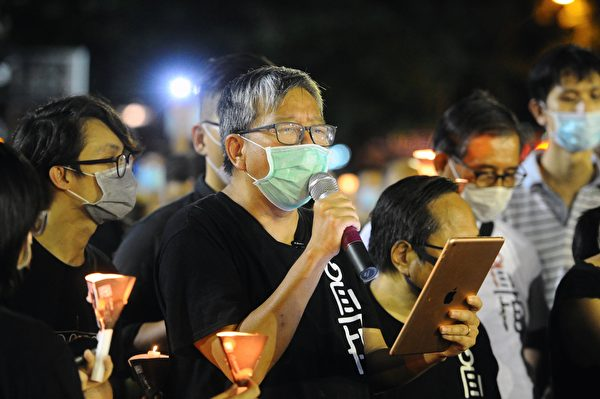
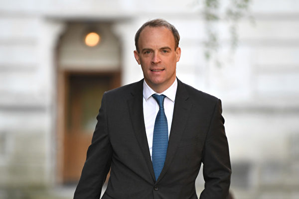

<h3><a target="_blank" href="https://bit.ly/3asSXIA">请多传破网软件，使更多的人了解真相从而得救，这是给自己积福德。 https://bit.ly/3asSXIA </h3></a>

   

     
<h3 align="center"><b>免翻视频  https://bit.ly/3ezRQKo  (请收藏网址 https://git.io/swspip)</b></h3> 

<h3 align="center"><b>复制网址到谷歌或火狐浏览器打开。若出现 “提示” ，請点击“继续”访问即可。</b></h3> 

<h3 align=center><a href="https://github.com/gav01/Heart/blob/master/news1.md">● 看更多大紀元時事 ●</a></h3>

<a href=https://git.io/souye><h6 align="right">回首頁</h6></a>

<a name=top>

<a href="https://github.com/gav01/Heart/blob/master/ls-02.md"><b>往142 ~ ~ 247 新闻</b></a> 

<a href =#141>141.【最新疫情6.16】美国会指中共违反国际条例 
<a href =#140>140.疫情中同学真的觉醒了 
<a href =#139>139.美好青春葬冤狱哈尔滨好医生再遭绑架 
<a href =#138>138.受尽折磨 哈尔滨法轮功学员万云龙含冤离世 
<a href =#137>137.【内幕】习李内部连批示 两会后事故频发 
<a href =#136>136.【思想领袖】投资家：香港银行危机将至 
<a href =#135>135.【独家】大连陷财政困境 借维稳金发工资 
<a href =#134>134.【现场视频】新发地万余人被隔离 公交车现长龙 
<a href =#133>133.美NIH调查结果：54学者涉千人计划遭开除 
<a href =#132>132.台找出中医抗疫药方 最快8天清病毒 防肺纤维化 
<a href =#131>131.撒切尔夫人前助理：英国将彻底甩掉华为 
<a href =#130>130.杨威：中共再度迅速抛弃派美间谍 
<a href =#129>129.疑因作文不合老师观点 江苏一小学女生坠亡 
<a href =#128>128.逾1300中国医疗厂商在美共用一家假代理 
<a href =#127>127.浙江油罐车大爆炸 致200多人死伤 现场惨烈x 
<a href =#126>126.中共令大陆网店交三年刷单税款 店主忧破产 
<a href =#125>125.最高补贴800万 中共补贴买房买车以刺激经济 
<a href =#124>124.【最新疫情6.14】北京处非常时期 疫情扩至辽宁 
<a href =#123>123.他们身体温热时被中共毁「尸」灭迹 
<a href =#122>122.震慑中共！美军机罕见入台 3航母战斗群齐聚印太 
<a href =#121>121.哈工大等校被禁用MATLAB 大陆业界忧虑 
<a href =#120>120.大陆山寨台湾口罩流入菲律宾 现共产党标志 
<a href =#119>119.【新闻看点】四面树敌 中共做蠢事惹怒世界 
<a href =#118>118.中共再施人质外交 澳籍被告遭重判死刑 
<a href =#117>117.北京“菜篮子”新发地爆发疫情 武警进驻 
<a href =#116>116.为大纪元挡刀港青：不怕被捅死 怕人心冷却 
<a href =#115>115.管控你的钱包？中共试行“大额现金管理” 
<a href =#114>114.应对供应链风险 跨国制造业开始迁出中国 
<a href =#113>113.武汉政法高官夏建中落马 曾被美点名制裁 
<a href =#112>112.中共“一带一路”项目在东欧接连遇挫 
<a href =#111>111.【一线采访】水库泄洪 荔浦村民目睹人被冲走 
<a href =#110>110.中共对港人抗争定性变调 疑为镇压铺路 
<a href =#109>109.姆钦：美国考虑限制进出香港资金流动 
<a href =#108>108.【最新疫情6·12】推特删17万挺中共的账号 
<a href =#107>107.被派当志愿者稳控 重庆小伙失去人身自由 
<a href =#106>106.中共“610办公室”几任高层的末路 
<a href =#105>105.儿子遭解约 郝海东夫妇谈反共心路历程 
<a href =#104>104.中共争夺推特话语权 四千多水军露马脚 
<a href =#103>103.Zoom助中共言论审查 关闭维权人士美国账号 
<a href =#102>102.美国会报告：香港问题 最高可制裁韩正 
<a href =#101>101.山东大学女学伴曝内幕 校方威逼利诱女生就范 
<a href =#100>100.广东夫妻生3胎罚32万 黑人生娃获粤官慰问 
<a href =#99>99.赴京上访遭绑架 湖南访民郑新元绝食抗议 
<a href =#98>98.【独家】深圳盐田看守所被清空 或用于关押港人 
<a href =#97>97.亲共非洲国家布隆迪总统突死 其妻确诊染疫 
<a href =#96>96.美国务院2019国际宗教自由报告关注法轮功 
<a href =#95>95.德国多特蒙德民众谴责中共暴行 
<a href =#94>94.四问问倒马列老师 
<a href =#93>93.中共发赴澳留学预警 留澳学生：没受到歧视 
<a href =#92>92.保守派非裔勇敢说“不”遭报复 筹款网页被关 
<a href =#91>91.【新闻第一现场】卧底秘密拍摄揭Antifa残暴 
<a href =#90>90.中共吹捧数字人民币 学者：消费将无隐私 
<a href =#89>89.中共多架苏恺30战机入侵 台湾空军驱离 
<a href =#88>88.中共强化高校政治教育 学生：从小学听到大学 
<a href =#87>87.何韵诗赴台撑港遭泼漆 统促党等11人被起诉 
<a href =#86>86.大陆消费者“被开通”5G网络 想退出难 
<a href =#85>85.美司法部长：将制定武力使用标准 培训警察 
<a href =#84>84.朝鲜切断与韩国联系 称其冒犯“最高尊严” 
<a href =#83>83.【直播】白宫简报会 川普：不会给警察撤资 
<a href =#82>82.作恶太多 康生曹轶欧夫妇生前遭索命 
<a href =#81>81.【内幕】连踩政治地雷 牡丹江书记下台 
<a href =#80>80.【直播】反修例一周年 港人继续抗争 
<a href =#79>79.广西学校被水淹 湖南贵州46县市发生洪涝 
<a href =#78>78.美议员：证据显示中共试图阻止西方疫苗开发 
<a href =#77>77.美海关查获一批中国制假钞 总值35.1万美元 
<a href =#76>76.TikTok、抖音如何被中共武器化？（下） 
<a href =#75>75.TikTok、抖音如何被中共武器化？ 
<a href =#74>74.美中展开新冷战 吴嘉隆：中共不倒冷战不会停 
<a href =#73>73.【一线采访】郑州夜市涨租 地摊难救经济 
<a href =#72>72.反送中一周年 海外港人探讨出路 
<a href =#71>71.美非裔活动家: 弗洛伊德不该被英雄化 
<a href =#70>70.美海关截获1万未经批准中国产KN95口罩 
<a href =#69>69.“六四”敏感日 美国接连五大动作打击中共 
<a href =#68>68.大陆4名未满14岁学生强奸女孩未立案 
<a href =#67>67.瑞幸咖啡董事长参与造假 面临诉讼 
<a href =#66>66.风向突变 中宣部急为“地摊经济”降温 
<a href =#65>65.反共翻墙会洛杉矶中领馆前送“中共病毒”回家 
<a href =#64>64.【最新疫情6·7】巴西总统扬言退出世卫 
<a href =#63>63.杨威：中共慌神 盲目推出海南自由港 
<a href =#62>62.刘志庚旧部 东莞市委前常委黄少文被查 
<a href =#61>61.杨威：华为陷芯片荒 寻供应商无着 
<a href =#60>60.中共被国际孤立 日本欧盟推迟习近平访问 
<a href =#59>59.蓬佩奥吁全球证交所对上市中企收紧监管 
<a href =#58>58.美司法部长：Antifa劫持抗议 外来因素卷入 
<a href =#57>57.趁火打劫还炫耀战利品 小粉红留学生被举报 
<a href =#56>56.【一线采访】被逼回国自首 留学生亮相反共 
<a href =#55>55.杨威：美国5月新增就业251万 神在赐福 
<a href =#54>54.烟台银行前行长被查 前三任董事已落马 
<a href =#53>53.中共民航出台“熔断”新规 引发网民恶评 
<a href =#52>52.钟原：专家不领会高层“讲话精神” 党媒尴尬 
<a href =#51>51.【十字路口】五大溃点来袭 中共政权陷危机 
<a href =#50>50.世卫调查亲善大使周柳建成 百余组织促罢免 
<a href =#49>49.围剿中共 美英日澳等国政治家形成多国联盟 
<a href =#48>48.山东费县中学生发生集体腹泻呕吐 
<a href =#47>47.白宫六四发声明 吁北京履行对人权和香港承诺 
<a href =#46>46.上海浙江江西福建等11省市将有大暴雨 
<a href =#45>45.面对国际咎责 专家：中共策划“港版金融风暴” 
<a href =#44>44.20年前一条全国假新闻 看中共如何炮制的 
<a href =#43>43.广西旺甫镇小学发生砍人事件 至少40伤 
<a href =#42>42.人身不死 烛光不灭 中共最怕人民力量 
<a href =#41>41.1月至5月 至少27名法轮功学员被迫害致死 
<a href =#40>40.疫情下 大陆P2P平台开启快速清零模式 
<a href =#39>39.【有冇搞错】网传李克强检讨信 习李之争表面化-石山 
<a href =#38>38.名单惊现三位已故巨星 成龙挺恶法联署数造假 
<a href =#37>37.专管掠走命外之财的冥府武官  文／宗家秀 
<a href =#36>36.【拍案惊奇】六四更多细节 中共特工乱美国曝光 
<a href =#35>35.六四线上纪念会2度遭骇 疑中共背后捣乱 
<a href =#34>34.郝海东宣布推翻共产党 成立新中国联邦 
<a href =#33>33.【直播】6.4疫情追踪：郝海东吓坏共产党 
<a href =#32>32.王藏被抓已5天 家属遭威胁和监视 
<a href =#31>31.川普签行政令 将国际宗教自由纳入美国外交 
<a href =#30>30.陆中小银行资本不足坏帐升 加速发行永续债 
<a href =#29>29.大陆城管电话招商 小商贩疑惑：该不会骗我吧 
<a href =#28>28.川普要禁航 中共立刻放宽国际航班限制 
<a href =#27>27.回击中共 川普政府禁中国客机往返美国 
<a href =#26>26.台老妇捡旧铁柜惊见150万大金块 送还失主 
<a href =#25>25.英外长：为保护港人 不惜牺牲中英贸易协定 
<a href =#24>24.【翻墙必看】大陆现断供潮 房地产将崩盘？ 
<a href =#23>23.大陆经济学者：中国奇迹是彻头彻尾的谎言 
<a href =#22>22.年发4.5亿条假信息 中共五毛遭起底    
<a href =#21>21.宣传照被抓包 两会武警倒看报 官媒急删 
<a href =#20>20.【新闻看点】美国制裁出手 李克强戳破中国梦 
<a href =#19>19.川普手握圣经 誓言结束骚乱 
<a href =#18>18.【快讯】孟晚舟双重犯罪成立 未能获释 
<a href =#17>17.加拿大贝尔等三大电信巨头放弃华为5G 
<a href =#16>16.立即行动制止暴力 川普：将为保护你们而战 
<a href =#15>15.柏林人的心声：德国不能与中共为伍 
<a href =#14>14.时隔15年地摊经济再复活 李克强推动？ 
<a href =#13>13.【纪元播报】美国骚乱 川普剑指幕后煽动者 
<a href =#12>12.程晓容：美国骚乱 党媒叫好 中共回避了什么 
<a href =#11>11.【拍案惊奇】美左派骑劫抗议 中共遭重拳有悔？ 
<a href =#10>10.谭德塞转弯大赞美国 世卫私下怨中共瞒疫 
<a href =#9>9.中共红通犯乔建军从瑞典被引渡到美国受审 
<a href =#8>8.【最新疫情6‧1】避歧视 逾200非洲人离华 
<a href =#7>7.李正宽：中共一意孤行毁香港 天灭中共在兑现 
<a href =#6>6.程晓容：中共绑架中国人 强推港版国安法 
<a href =#5>5.千载云：美国总统讲话 “四大招”剑指中共 
<a href =#4>4.中共利用美非裔之死抹黑美国 蓬佩奥回应 
<a href =#3>3.【世事关心】班农：暴政即将崩溃 
<a href =#2>2.成龙挺港版国安法 联署声明惊现死者名字 
<a href =#1>1.微博疯传美国暴动照现中共党旗 造假被拆穿 

<a name=141>
<h1 align="center"><b>【最新疫情6.16】美国会指中共违反国际条例</b></h1>

美国众议院外交事务委员会首席共和党成员麦考尔（Michael McCaul）为众议院中国工作组主席。他所率领的调查小组星期一（6月15日）发表了《关于Covid-19全球大流行病起源包括中共与世卫组织角色问题的少数党中期报告》（The Interim Minority Report on Origins of COVID-19 Global Pandemic including the Roles of the CCP and WHO）。 （Tasos Katopodis/Getty Images) 

   
 【大纪元2020年06月16日讯】（大纪元记者林南、徐简、戴芙若、林燕综合报导）6月16日全球中共病毒（武汉肺炎）疫情最新情况：  
 
 根据约翰‧霍普金斯大学（Johns Hopkins University）的数据，截至美东时间6月15日晚上8点，全球确诊感染中共病毒（武汉肺炎）的人数超过720万，死亡人数超过41.2万（注：因中共和伊朗隐瞒疫情数据，真实数据比统计的要高）。美国确诊病例超过210万例，死亡超过11.6万人。

尽管美国最新死亡人数一直在下降，但该病毒仍在全美范围内广泛传播。随着各州已经部分重启经济，每天仍然发生成千上万的新病例，真正的常态化仍然遥遥无期。周一截至美东时间下午5点，约翰·霍普金斯大学报告了13,574例新病例，其中297例死亡。

在中共病毒爆发地的中国，第二波疫情入侵北京市及周边省份。北京市的新染疫人数不断在增加。4天内，北京新确诊的本土病例已达到79人（真实数据可能比统计的要高）。中国媒体报导称，在北方省份河北、辽宁以及西南的四川均出现了与北京确诊患者相关联的病例。

继欧盟委员会6月9日发表一份报告，谴责北京当局为了隐瞒其控制疫情失败而散布虚假信息后，美国国会6月15日公布阶段性的初步调查报告。最新报告披露了中共如何在爆发过程中隐匿疫情，报告还呼吁对中共早期隐瞒疫情的行为展开国际调查。

=======================

<b>以下是最新疫情实时更新：

北京新确诊案例持续增加</b>

图为6月14日北京新发地批发市场已被关闭。（AFP/Getty Images）

   
 中共国家卫生委员会周一报告了40例新病例，其中27例在北京，北京市的新染疫人数不断在增加。由于中共公布的疫情数据不合常理，外界普遍认为中共隐瞒疫情数据，其真实数据比统计的要高。

北京的新感染案例与新发地农产品批发市场有关。该市开始再次施加限制，例如关闭学校和运动场，并命令人们接受中共病毒检测。

另外，外界大都以为中国首例病毒感染最初发生于12月在中国武汉市的华南海鲜批发市场。然而，美国国会报告说，中共当局隐瞒的最早病例可追溯至2019年11月17日。

<b>美国会报告指中共违反国际卫生条例</b>

美国国会众议院外交事务委员会首席共和党成员麦考尔（Michael McCaul）率领的调查小组，星期一（6月15日）发表了《关于Covid-19全球大流行病起源包括中共与世卫组织角色问题的少数党中期报告》（The Interim Minority Report on Origins of COVID-19 Global Pandemic including the Roles of the CCP and WHO）。

这是针对中共病毒起源及爆发过程，公布阶段性的初步调查报告。报告呼吁对中共早期隐瞒疫情的行为展开国际调查，并要求世卫组织总干事谭德塞辞职。

报告内容按照时间线详细列举自2019年底以来有关中共病毒疫情的重要事件，并说明中国共产党政府如何隐匿中共病毒疾病（Covid-19，中共病毒）信息以及世界卫生组织在其中所扮演的角色和功能。

这项初步调查结果可被视为是美国议员们呼吁就中共病毒疫情大流行病展开调查以来，由国会方面出台的首份官方报告。

报告首先提到，中国（中共）当局确认的最早病例可追溯至2019年11月17日，随后几周，每天都出现1至5例的新病例报告。 2019年12月16日，一名65岁男子因发烧和肺部感染被送往武汉市中心医院，在使用抗生素和抗流感药物后，这名男子的病情没有出现好转。后来发现这名男子在武汉华南海鲜市场工作。

报告说，在接下来的数天内，武汉各地医院开始出现数十例类似症状的疾病。截止12月20日为止，感染人数达到至少60人，其中包括在华南海鲜市场工作人员的家属，这些亲属与市场工作的人有密切接触但本身并未直接接触市场。报告指出，这显示为病毒人传人的早期迹象。

12月25日为止，武汉两间不同医院的医护人员在感染病毒后接受隔离治疗。报告提到，这是病毒人传人的第二个明确迹象。

报告指出，12月27日，武汉的医院和卫生官员收到当地一家处理病患样本的实验室通知，称这种疾病是由一种新的冠状病毒株所引起的，而这种病毒的基因与导致2003年SARS大流行的病毒株相似度高达87%。

报告接着说，三天后，武汉市中心医院急诊科医生艾芬收到了实验室的检测结果，确认为“SARS冠状病毒”。于是艾芬医生通知医院主管，并将报告结果提供给医院的公共卫生部。

报告说，在同一家医院任职的李文亮医生得知消息后，在微信群组中告知友人“华南水果海鲜市场确诊了7例SARS。”

12月31日，中国媒体关于爆发非典肺炎的报导开始出现在网上。其中一篇报导的机器翻译被全球电子新兴传染病疫情通报系​​统Pro-MED侦测到。

报告指出，根据世卫组织紧急项目执行主任瑞恩医生（Dr. Michael Ryan）的说法，这则出现在全球电子新兴传染病疫情通报系​​统Pro-MED的通知是世界卫生组织得知武汉疫情爆发的信息来源。世卫组织日内瓦总部随后指示该组织中国办事处寻求中国政府协助对有关信息进行核实。

报告继续指出，尽管中国（中共））公开声称有向世卫组织及时通报了疫情，但中国（中共）政府实际上从未正式向世界卫生组织通报武汉爆发的疫情，也未在疫情初期向世卫组织提供相关信息，这已违反了世卫组织的《国际卫生条例》。

根据《国际卫生条例》，各国必须向世卫组织报告本国内新出现的疾病。

<b>不戴口罩？联合航空：暂时禁载</b>

图为在旧金山国际机场上的一架美联航747客机。 (Photo by Justin Sullivan/Getty Images)

联合航空公司表示，从周四（6月18日）开始，乘客在飞行中若拒绝佩戴口罩，该航空公司将（至少暂时）禁载这名乘客，进行“全面事故审查”。例外情况除外。

空姐会警告不遵守规定的乘客，并给他们口罩戴。如果进一步劝告失败，空姐将在航班到达目的地后提交报告。经过审查，该乘客可能被置于“内部旅行限制名单”上，而无法“在待确定的时间内”飞行。

联合航空周一晚上向员工发出了一份内部备忘录，列出了新的指导方针。该航空公司最初的政策，是拒绝让不戴口罩的乘客登机，空姐“强烈鼓励”乘客在飞行中戴口罩。

这家全球第三大航空公司说，乘客在进食或饮水时不必戴口罩，患有某些疾病或幼童乘客都不需要戴口罩。

<b>巴西确诊病例超过88万例</b>

巴西卫生部周一报告了至少20,647个新病例，使该国的染疫总数达到至少888,271例。

截至6月15日，巴西累积确诊病例超过88万例。(Photo by MICHAEL DANTAS/AFP via Getty Images)

据卫生部称，在过去的24小时内，巴西还确诊了至少627例新的中共病毒（Covid-19）死亡病例，使该国的死亡人数至少达到了43,959例。

巴西没有卫生部长，已经有一个月了。尼尔森 ·蒂希（Nelson Teich）于5月15日辞职。巴西总统贾尔·博尔索纳罗（Jair Bolsonaro）于6月2日签署了一项法令，宣布陆军上将、前卫生部执行秘书爱德华多·帕祖洛（Eduardo Pazuello）担任临时部长。

<b>美联储撑盘 美股扭转大跌颓势</b>

中央社报导，美股15日剧烈震荡，在疫情回温引发忧虑气氛中，道琼指数早盘一度大跌逾760点。美联储（Fed）宣布购债措施细节后，大盘发动反攻，道琼指数终场上涨157点，拉出连2红涨势。

美中等地中共病毒疾病（COVID-19，武汉肺炎）疫情拉警报，原本因经济重启而看好前景的投资人信心遭受打击，导致美股开盘跳空重挫，盘初触底后虽出现逢低承接买盘，三大指数仍在平盘以下游走。

美联储（Fed）在美股午盘期间公布，16日起将依一项公司债券指数打造的投资组合，开始收购具高投资评等的公司债券。即使并非新增救市措施，美联储声明发布仍促使美股由黑翻红。

<b>德国病毒预警软件16日激活</b>

德国政府委托开发的中共病毒（武汉肺炎）预警软件（APP）16日起进行展示和激活。公民可自行选择是否使用该软件。政府官员表示，开发该应用程序的成本约为2000万欧元。

据《周日世界报》报导，该程序将在几天之内放到苹果和谷歌应用商店，供用户下载使用。该应用程序使用蓝牙信号来蒐寻其他用户是否在附近。如果有用户感染了病毒，则在应用程序中输入其状态，从而通过该程序警告其他用户。

联邦数据保护专员凯尔伯（Ulrich Kelber）对该应用程序表示肯定。他表示，“对于我来说，特别重要的是，在启动应用程序时，准备好有关数据保护的相关文档。”

<b>前FDA局长：部分地区疫情可能迅速失控</b>

前美国食品暨药物管理局（FDA）局长戈特利布（Scott Gottlieb）接受财经媒体CNBC访问时警告，部分地区疫情可能“迅速失控”。

近日，加州、佛罗里达州、北卡罗来纳州等地单日新增中共病毒疾病确诊病例曲线攀升，德州连日新增住院病例更是达到新高。

戈特利布说，像亚利桑那州，德克萨斯州和佛罗里达州这样的确诊病例激增以及住院高峰的州，在某些情况下应该进行积极的接触者追踪。当受过培训的人员接触受感染的个人，以查明他们被感染的位置并追踪可能被暴露的其他人时，就可进行接触追踪。

“今年夏天我们将无法再次关闭。” 戈特利布在CNBC的节目上说：“我们可能不会在今年秋天再次关闭美国。” “因此，我们将需要尝试隔离这些爆发的来源并采取有针对性的步骤。 如果我们不能做到这一点，这些（地区）将失控。”

不受疫情阻碍 美网公开赛今年料照常举行

在中共病毒疫情肆虐下，美国网球协会（USTA）今年仍将举办美国网球公开赛，只是场内将无人观战。某些一流选手已表示，对在疫情下参赛有疑虑。

《纽约时报》引述消息人士的话报导，美网协会本周将公布，今年8月31日至9月13日将在男女职业网球协会ATP和WTA支持下，于纽约市举行美国网球公开赛。

体育频道ESPN报导，协会方面现正等候地方与州政府卫生官员同意。

<b>纽约州疫情降至近3个月来最低水平</b>

纽约州州长安德鲁·库默（Andrew Cuomo）周一表示，从疫情开始迄今，该州3天的平均住院人数和死亡人数达到了最低水平。

从上周五到周日，平均有27人死于中共病毒，全州的住院总人数为1608人，是3月20日以来的最低值。

库默说，“这是我们从疫情开始以来的最低数字，该州大部分地区的数字都很好。”“我们很想看到这个数字为零。”“纽约正走在正确的轨道上。”

州长表示，“我们的感染率曾是美国最高的。但今天，我们的感染率是全美最低的。”

纽约市周日的病毒传染率为1.3%，长岛为0.09%，威彻斯特县为1.0%。

纽约州疫情虽降温，但大量民众投诉餐饮业违反防疫规定，州长库默扬言，违规的餐厅与酒吧可能会失去贩酒执照。

<b>纽约司法部长吁苹果和谷歌阻第三方收集用户数据</b>

纽约司法部长詹乐霞（Letitia James）。(Spencer Platt/Getty Images)

纽约司法部长詹乐霞（Letitia James）周一呼吁苹果和谷歌禁止第三方联系人追踪应用程序收集其用户的数据。

詹乐霞在致两家公司的信中说，由第三方创建的联系人跟踪应用程序，似乎没有跟苹果和谷歌的相关应用程序遵循相同的标准，后者有其严格的规范。

詹乐霞写道：“必须由公共卫生机构开发使用敏感健康信息的应用程序，以确保适当的保护措施并提供问责制。”

詹乐霞敦促两家公司采取具体步骤来保护第三方联系人跟踪应用程序收集的数据，包括要求应用程序公开其是否参与曝光通知程序并禁止其使用定向广告。

<a target="_blank" href=#top><h6 align="right">回上方</h6></a>

<a name=140>
<h1 align="center"><b>疫情中同学真的觉醒了</b></h1>
   
【明慧网二零二零年六月十五日】

〔中国大陆来稿〕我有一个同学，他很早就已经在翻墙，也退出了中共党、团组织。他当时退党、退团，是因为中共的某种制度对他不公，出于对中共的恨，他才退出。后来他碰到了我，我跟他讲了法轮功真相，并讲了为什么要「三退」，当时他并不相信是天要灭共产邪党，不太相信神的存在。

今年年前，我们有机会又在一起，我又跟他说，要他帮他家人也退出党、团、队组织，因他家人全是党员。我说：「现在是末法时期，人类道德十分低下，在这个时候人类就会发生灾难，因共产（邪）党是无神论组织，现在是天在淘汰人，只有退出这个无神论组织，才能得到神的保护，躲过劫难，平安度过劫难。」他只是笑了笑，还是不太相信。后来我就去了深圳过年。

我从深圳回来后，有一天，他打电话给我，问我回来了没有，说有件事急着要和我面淡。见面后，他就急着说：「通过这次疫情，我彻底明白了你年前说的那番话，我整整思考了一个月，现在才觉醒。你说的全都对，这次疫情不是病毒是瘟疫，是天在淘汰人。」

接着他又说：「我明白后就把我儿子儿媳叫回来，跟他们说：『有件事我想告诉你们，我不说出来是我对你们不负责任，我会后悔的，把你们的党、团、队都退了吧。』开始他们并不接受，我就把你说的那番话讲给了他们听，后来他们听明白了，才答应退出，真得谢谢你们法轮功。」

是啊，通过这次疫情，很多世人都在觉醒。

<b>转业兵：「我想让他们听枪响就行了」</b>

〔中国大陆来稿〕在一次出门打的的时候，司机是个转业兵。我和他讲法轮功真相，说起「六四」学潮，我刚提「六四」事件，他说：这事我太清楚了，我也参加了，我是连长，到那以后，上边下令开枪，我一看这不是害人吗？我举枪向天上放，我想让他们听枪响就行了。「六四」大学生死的可惨了，血流成河呀！

我又讲了法轮功真相，他说我信，然后做了「三退」，他说共产（邪）党就是害人的党。

<b>党员数字掺水有多少</b>

〔中国大陆来稿〕二零零零年，我在儿媳的娘家玩，我儿子单位来了一男一女到儿媳的娘家搞「政审」。之后，儿子说，因单位书记看我儿子年轻、技术好，叫他入党，我儿子没反应。书记代劳写申请书、填表，一切手续全是书记代劳办理。

后来，我儿子给我说了一件更使我奇怪的事，他单位还到我单位去查档案，回来对我儿子说：你妈也是党员。我从没有入过邪党，他们这简直就是无中生有。

可见，中共邪党公布的所谓有多少多少党员，数字中掺有多少水？《九评共产党》全面揭示了中共的邪恶本质，仅就「党员」人数这点，也看到中共在造假欺骗民众去信邪教啊。
<a target="_blank" href=#top><h6 align="right">回上方</h6></a>

<a name=139>
<h1 align="center"><b>美好青春葬冤狱哈尔滨好医生再遭绑架</b></h1>
   
【明慧网二零二零年六月十五日】（明慧网通讯员黑龙江报导）二零二零年四月八日下午，哈尔滨市法轮功学员李力壮在珠江路与农电街「365生鲜超市」侧门处被大庆警察蹲坑绑架，现被非法关押在大庆肇州看守所

李力壮

 
 今年47岁的李力壮，外表清瘦，温文尔雅；朴实善良，博学多才。他曾是哈尔滨医科大学附属第一医院骨外科主治医生，当年是一位难得的好医生。曾因坚持信仰「真善忍」和为法轮功和平上访，遭多次非法关押、抄家，两次非法劳教、一次非法判刑，经受了各种酷刑折磨，精神、肉体遭受了巨大的创痛，大好青春有六年半是在非法囚禁中度过的。多年的迫害使其头发花白、失去工作，靠经营小生意维持生计。

一九九五年，李力壮毕业于哈尔滨医科大学，同年开始修炼法轮功。修炼之后身心受益，他明白了人为什么有病、怎样做一个高尚的人、以及提升人的道德品质对自身及人类有多么重要等许许多多道理。从此，他自觉按法轮功教导的「真、善、忍」原则做人做事，严守职业道德，在努力提高医术水平的同时，尽自己的能力帮助别人。

当时，医生收红包已经是普遍现象，可是他从来都不收患者的红包，哪怕是患者真心向他表达谢意的红包他也都拒绝。不仅如此，他还自费为患者做手术。有一位家境贫困的农村患者，没钱配血做手术。为不耽误治疗，当年每月只开三百多元工资的李力壮无偿拿出一千多元为患者配血做手术，这件事成为医院的佳话。

李力壮业务好，人品佳。正当二十七岁的他通过了硕士学位的考试，准备继续攻读职骨外科硕士学位，用自己一身所学回报社会的时候，灾难降临了。

一九九九年七月，江泽民政治流氓集团发动了对法轮功善良群众的残酷迫害，李力壮的工作、生活从此不再宁静，承受着方方面面的巨大压力。父亲被迫来到他的工作单位整天看着他，单位领导多次找他谈话，要他放弃信仰。媒体、电台报纸铺天盖地的造谣宣传，还制作了「天安门自焚」等污蔑法轮功的电视新闻，毒害不明真相的民众。

作为一名外科医生，李力壮一眼就看穿了所谓「天安门自焚」的骗人把戏。他曾做过气管切开手术，当然知道切开气管以后，因为漏气，没有气流冲击，声带是不能正常发音的，更不可能唱歌。中央电视台制作的《焦点访谈》节目中，自焚的小姑娘刘思影，全身裹着纱布，做完气管切开手术接受采访时，竟然能说话唱歌，且声音清脆。这不符合医学常识啊！可是这天大的谎言却毒害了无数众生，邪党在把人往地狱里推。李力壮开始了向世人讲清真相，走出去证实大法。但是却因此受到邪党的疯狂打压。

<b>李力壮遭迫害的恐怖经历</b>

二零零一年五月，李力壮被哈尔滨市香坊分局警察绑架，在派出所和看守所遭到酷刑：毒打，上背铐，坐铁椅子，一个星期，不让睡觉，一合眼就会遭到犯罪嫌疑人毒打，被狠毒的用脚踹头撞墙，用拳头打，脸肿起来都变形了，眼睛只剩了一条缝，腿部严重水肿增粗。后被非法批两年劳教送到哈尔滨长林子劳教所。

中共酷刑示意图：背铐

   
二零零二年四月，李力壮在哈尔滨长林子劳教所遭到吊铐、电棍电击、毒打、坐铁椅子、关小号酷刑迫害，长达二个月之久。在一次劳教人员会议上，李力壮当众揭露了劳教所迫害信仰者的非法性及殴打虐待法轮功学员的执法犯法性质，被当时是所长的石昌敬和队长王占起打击报复，以减刑为条件，指使干警胁迫引诱被监管人作伪证，以李力壮是绝食的组织者为由将李力壮非法批捕，二零零二年七月三十日，李力壮从劳教所被劫持到哈尔滨市太平区看守所。

中共酷刑示意图：吊铐

二零零二年九月二十八日，李力壮被哈尔滨市太平区法院非法判刑四年，随后又被非法投入哈尔滨新建监狱。在新建监狱，李力壮遭受到了惨无人道的酷刑折磨。在集训队，监狱指使犯人头用直径约二～三厘米、一米多长的白色硬塑料管子（他们叫小白龙）抽打李力壮的头部和身体，剧痛无比。折磨数月后，因为「没转化」（新建监狱怕影响「政绩」）又被转到大庆监狱。

在大庆监狱，监狱指使和授意犯人对李力壮进行惨无人道的毒打折磨。当时是冬天，在零下二十摄氏度的天气里，犯人们扒光李力壮的衣服，将他拖到厕所，打开窗户，让冷风吹进来冻他，再把一个大塑料桶中灌满冷水（塑料桶高约1.2米，直径0.9米），四、五个犯人把他扔到冷水桶里，一冻就是半个多小时。同时，用水管子不断往头上浇冷水并强行把他按到冷水里蹲下，又把他整个头部按到凉水里浸，还用力往下拽小便，用狠劲捏睪丸（后遗疼痛约十年） 。然后把脏抹布用力塞到他嘴里，几乎被塞的背过气去。他们看到要不行了，才把冻得抖成一团的李力壮拖出水桶，由两名犯人架着赤身裸体在大厅里溜达，然后再一次把他扔到凉水桶里。更令人发指的是，一名犯人竟用冒着水的黑色胶皮粗水管子（直径有三～四厘米）插入李力壮肛门里放水，紧接着再用牙刷插，口出污言秽语，人性全无。犯人们还用过去监狱中用的「推」、「掰」、「划船」等残忍手段折磨李力壮，目的是让他放弃对「真善忍」的信仰，逼迫他写谩骂法轮功创始人的话。

酷刑演示：溺水

李力壮不只一次向副监区长叶文辉及其他干警反映被折磨迫害的情况，可得到的答覆是：「我也不能二十四小时陪着你」或「我们说了也不算」等等。其实，行凶的犯人正是在监狱领导的诱骗指示下才得以如此猖狂。

酷刑演示：毒打

李力壮被毒打导致右侧第三根肋骨骨折，同时左侧额头被打出血、腰部软组织损伤、右眼巩膜被打出一个大约0.3cm×0.5cm大小的出血瘀斑，约二个月才下去。左眼后遗数块阴影在眼前晃动。在这期间赶上黑龙江省司法局来监狱检查，监区狱警把李力壮提前藏起来，直到检查的人走了，才让他回监舍。那段时间监狱怕丑事败露，剥夺李力壮的会见权，连续三～四个月不准家人会见。

从冤狱回来后，李力壮失去了工作。从二零零一年初，哈尔滨医科大学附属第一医院单方面停发工资达十五年之久，拖欠工资合计约四十一万元。因没有经济来源，李力壮多次到单位找院领导要求恢复工作和补发工资，单位一直拖着不给解决。二零零零年被迫害前，他已晋级骨外科主治医师，可是主治医生证一直没发到手中，执业医师证也没给注册。本是事业有成回报患者和社会的时候，却无法正常从事医疗方面的工作。在经济迫害之下，他到早市摆摊卖衣服维持生活。李力壮虽然没有做过生意，但因人品好，交易公平，许多顾客都爱买他的衣服，批发商也愿意和他合作。日子虽清苦，却心态平和，无怨无恨。

二零零八年三月一日，李力壮在公共汽车上向一位年轻人讲述央视所谓「天安门自焚」伪案和法轮功真相，再次被非法判劳教一年，将其劫持到哈尔滨长林子劳教所，又一次遭受各种非人的折磨。其中有一很恐怖的酷刑：先把他铐到铁椅子上，然后把他连铁椅子一起抬到一个小黑屋里，用一种细绳子（恶警说是「约束带」），专门找痛苦的姿势固定下来捆绑，长时间不松开，令人痛不欲生。晚上一闭上眼睛就会被毒打，八天的时间，分分秒秒都忍受着巨大的痛苦。到了晚上，两个恶警值班，又开始新一轮酷刑。他们把李力壮的嘴缠上胶带，套上塑料袋，闷得令人窒息，再用烟熏……各种阴毒手段轮番使用，完全失去人性的他们把人遭受酷刑折磨后的痛苦当成了取乐的方式。他们的目的就是不许法轮功学员炼功，不许拒绝超时奴役劳动。

酷刑演示：塑料袋套头

那些年，李力壮的家人也痛彻心扉。年迈的父母顶着来自各方的压力，几乎每月往返于劳教所或监狱，为儿子背送食物、生活用品。怕儿子挨打，怕儿子挨饿，精神承受已超过极限。父亲因此得了抑郁症，很长时间才治好。后来因为长期精神压力过大，加之背送东西过重，又添了腰椎病，现在仍后遗腿疼和抽筋。李力壮的母亲原来一百五十多斤的体重，数月之内降了四十多斤，夜不安寝，食不甘味，多少个年节都是流着眼泪度过的；晚上经常失眠，要吃四片安眠药才能勉强入睡。头发迅速变白，又患上了高血压症。迫害的惨烈，骨肉分离的悲痛……，母亲难以接受这残酷的现实，多次悲痛的晕倒。可她内心的苦楚又向谁诉说呢？

曾经引以为骄傲的儿子被残酷迫害回来后形像大变，判若两人。原本英俊潇洒的他过早的头发花白，再加上被剥夺工作权利，经济窘迫，父母为他以后的生活一筹莫展，经常唉声叹气。回来后这些年，李力壮不愿意花父母的钱，自己做生意赚钱。因为他心地善良，把钱财看得极淡，不计得失，习惯为别人着想，总是能得到他人的信任，自己也能自食其力了，并尽自己所能孝敬父母，经常陪伴老人，这一切多少给老人带来几许欣慰。即便这样，迫害的阴影一直笼罩着父母，母亲经常为儿子担惊受怕，不知道什么时候迫害结束，盼望全家人堂堂堂正正的活着。

而今，不幸的事情又发生了。二零二零年四月八日下午，李力壮在街上又被警察非法绑架。而且不通知家人，又一次上演了迫害好人的人间悲剧。

试想，二十年前，李力壮──当年风华正茂、业务精湛、不收红包的好医生，如果一直留在工作岗位上，能救治多少人的病痛？他的职业操守、高尚的品德能感化多少被利益羁绊已经麻木了的世人？如果有更多这样的好人，我们的社会道德会是今天这个样子吗？李力壮，一个当年才华横溢的男青年，从踏上社会起，就没有也从来不想伤害任何人，对名利无欲无求，只想本本分分的做一个好人，做一名救死扶伤的好医生，仅仅因为坚持「真善忍」信仰，就无端被迫害这么多年，而且迫害之惨烈世间罕见。今天迫害又在继续，天理何在，良知何在？

在此呼吁善良的人们关注此事，营救被非法关押在大庆肇州看守所的法轮功学员李力壮。法轮大法是上乘佛家修炼大法，以宇宙特性「真善忍」为指导，祛病健身效果神奇而洪传世界至少一百多个国家。诚挚的希望世人，能够支持正义，选择善良。

善恶有报终有头，瘟神有眼大难近；法网恢恢无遗漏，跟随红魔遭天谴。在此也呼吁参与迫害者，不要为了眼前利益把良心出卖给中共邪党，迫害佛法修炼之人罪孽深重。从人间的法律来看，迫害法轮功是靠行政指令，是完全违法的，各级执行者，特别是直接执行者，一定要承担各自的法律责任，这是难以逃脱的。请看中共自己制定的《公务员法》第九章第五十四条规定：「公务员执行明显违法的决定或者命令的，应当依法承担相应的责任。」其实，中共江泽民集团早已为其犯罪找好了替罪羊，所有跟随中共迫害法轮功的人从一开始就被中共及其江氏集团出卖了：参与迫害者必须自己承担责任。就是中共自身也正在面临着解体和灭亡的命运，所有为了眼前利益跟随中共作恶、妄想最后得到中共保护的人，最终都要自食恶果。跟随中共一条路走到黑的人，只能是自己害自己，成为中共的牺牲品和陪葬品。

网址转载：
http://big5.minghui.org/mh/articles/2020/6/15/美好青春葬冤獄-哈爾濱好醫生再遭綁架-407714.html

<a target="_blank" href=#top><h6 align="right">回上方</h6></a>

<a name=138>
<h1 align="center"><b>受尽折磨 哈尔滨法轮功学员万云龙含冤离世</b></h1>

华盛顿纪念碑下，海外法轮功学员悼念在大陆被迫害致死的法轮功修炼者。（大纪元）

   
   【大纪元2020年06月12日讯】万云龙，哈尔滨双城区人，曾多种疾病缠身，心脏偷停、癫痫、胃溃疡、冠心病等。他37岁那年，医生遗憾地对其家人说，回家准备后事吧。

万般无奈中，经人介绍他尝试了一种功法——法轮功。奇迹出现了，他的所有病竟消失了。从此法轮功伴随着他的人生，走过了21年。

然而，他仅为修炼法轮功被多次绑架、关押，受尽折磨，63岁的他于今年5月20日含冤离世。

早在2006年，万云龙的妻子，48岁的王丽群也因修炼法轮功被双城第二看守所夺走了生命。

21年期间，他们只是千千万万遭受迫害的法轮功学员中的两例。

1999年7月20日，中共江泽民集团对法轮功发动了骇人听闻的迫害，强制法轮功学员放弃信仰，不计其数的修炼者遭到惨无人道的迫害，甚至失去生命。

<b>到广州参加学习班</b>

1995年，万云龙听人说，法轮功治病效果神奇，就想，反正也别无它路了，只是死马当成活马医吧。他拔掉了吊瓶，坐飞机到了广州，参加那里最后一期法轮功学习班，时间是1995年5月10日。那也是李洪志先生在中国大陆举办的最后一期讲法班。

回到家后，只炼了半个月，他简直脱胎换骨地变了一个人。脸色好看了，人渐渐胖了，心脏、胃等都没了问题；而且他的性格也判若两人，之前因久病而易怒、暴躁的他，现在变得和善、平易近人了。他的巨变让周围人无不为之震惊和欣喜。

<b>风云突变</b>

1999年7月20日，中共开始迫害法轮功。他和当地许多法轮功学员一样，到黑龙江省政府和平上访。回到家后，他就被绑架了。他是当地法轮功义务辅导员。

当时双城市委书记朱清文，公安局副局长、“610”（专门迫害法轮功的非法机构）头子张国富把他作为重点迫害对象，关到看守所6个月，再非法劳教2年，后劫持到黑龙江省一面坡劳教所。

<b>采石场里的惨叫声</b>

劳教所里有个个采石场，在押人员要往火车上装石头。背上装满百斤重石头的铁筐，走上三节撬板，扛到火车上去。

万云龙肩膀上的肉皮磨破了，露出了骨头，超强的体力劳动摧残着他。

期间，他的家属托人去劳教所看他。狱警偷偷透露说：“这万云龙的嘴可真硬，刑具都用遍了还说炼。”

2000年4月29日下午，狱警让他扛土毛子，比扛石头要轻一点。他站在站台下用背去接框。

两个打手用手挡住他脸的两侧，不让他去看筐。三个普教人员把装满两筐大石头的筐摞在一起，从站台上砸向他的背部。

“啊！———”他发出了惨叫声。

大队长刘明江听人报告后，却对万云龙说：“不是他们砸你，是你不会接筐。”

6月天里，穿着背心干活，因为吃不饱他两侧的肋骨清晰可见。狱警只让他干活不准喝水；让他扛最大的石筐，装上最大的石块；他走慢了，就对他拳打脚踢。

2001年5月，九死一生的万云龙回到了家。

他通过炼功、读法轮功著作，身体很快恢复了健康。

<b>在长春劳教所里奄奄一息</b>

2001年10月，万云龙坐火车去白城，因没有身份证被蒐身。警察发现了他随身携带的法轮功的经文，抢走了他身上带的5,000元钱，把他关进长春劳教所半年。

在劳教所他因绝食抗议被三次插管灌浓盐水，还被上大挂、铐进铁椅子、拳打脚踢、禁止上厕所等。

中共酷刑示意图：上大挂。（明慧网）

因坚持不放弃信仰，他再次被非法劳教3年。

2003年，正置萨斯（SARS）爆发期间，万云龙被迫害得喘不过气来，已不能说话。

劳教所怕担责任，打电话命令他的家人2小时内必须将他接走：“人死了，我们不负责任。”

家人来接他时，劳教所的门卫说：“条件不好了，就别抢救了。之前出去的那个人，花了2万的抢救费，也没活，白花钱。”

奄奄一息的万云龙被接到亲戚家调养，他躺着听法轮功师父的讲法录音，慢慢地开始炼功……3个月后，他又一次奇迹般地生还了。

<b>女儿被审 妻子含冤离世</b>

2006年9月29日下午，双城公安局、国保大队等一伙人绑架双城法轮功学员贾俊杰。

贾俊杰不慎从二楼滑下摔伤，贾俊杰的母亲被绑架，正到那儿访友的万云龙的妻子王丽群和女儿万美佳也一同被绑架至双城第二看守所迫害。

一个女警告诉王丽群：“你女儿的学业，一辈子都会毁在这里。”

看守所里有一间封闭式的提审室，没有窗子，万美佳被关在里面的一个铁笼子里。房间里没开灯，只亮着四根蜡烛，阴森恐怖。他们让小姑娘按说的签字，否则，就给她安个罪名。

提审长达4个小时，王丽群整个下午坐立不安、精神极度紧张，看到女儿被押回来后才长出一口气。

紧接着她身体出现不适症状，不能说话。一个小时后狱医才来，掐仁中、掐腋下，20分钟后把人送往医院。小姑娘想跟着去，被一个女警一把推了回去。

王丽群就这样离世了，她的女儿在第二天再次被提审。他们让她在写好的笔录上签字，承认狱警、狱警对她妈妈处理得即时。小姑娘拒绝，他们就拽着她的手按上了手印。

国保大队说：“我们能放你，就能再抓你！”

他们极力封锁消息，同时逼迫王丽群的家属尽快火化遗体。

火化的那天，巡警队一名副队长带领四辆装满警察的微型面包车现场执勤。

据一位参与此事的警察说：“这次事办砸了，如果没有一个跳楼的、一个死的，我们能得1万元奖金。”

<b>绑架 被戴上黑头套</b>

2016年5月6日下午，十几个警察给万云龙戴上黑头套，将他劫持到双城区拘留所，七天后被转押在双城区看守所。

他的家人到处去找他，派出所、国保大队、拘留所都说没有这个人。

后来家人得知，万云龙在看守所迫害得胸闷、不能正常喘气，被送到医院连打九天针急救，期间没人通知家人。

家属请律师接见当事人并找到看守所所长。所长说：“他差点死了”。

双城国保大队长肖继田不答应放人，说要找省公安厅国保副处长杨波。万云龙的家人找到杨的单位，门卫接通了电话，对方谎称自己不是杨波，还要门卫不要再给家属通话。

万云龙曾说，在双城被关押期间，肖继田与杨波都曾亲自提审过他，对他的不配合非常不满意，还恐吓他，再不配合，就要殃及他的家人。

<b>流离失所 离世</b>

经家属亲人多方周旋，万云龙最终被接回了家。长期的迫害给他带来恐惧和阴影，他不敢待在当地，只得背井离乡、过着居无定所的生活。

他的母亲长期因为儿子遭到迫害而担忧，精神承受到极限而离世。

他的妹妹万云凤因修炼法轮功于2011年11月被劫持到黑龙江省前进劳教所；2016年，被迫害离世。

2020年5月20日，瘦成皮包骨的万云龙撒手人寰，抛下了近90岁高龄的老父亲。

<a target="_blank" href=#top><h6 align="right">回上方</h6></a>

<a name=137>
<h1 align="center"><b>【内幕】习李内部连批示 两会后事故频发</b></h1>

中共两会后事故频发，使习近平、李克强对安全生产的指示与批示落空。图为大纪元近日获得了一份《国务院安全生产委员会全体会议纪要》。 （大纪元）

   
   【大纪元2020年06月15日讯】（大纪元记者周田报导）6月9日，中共国务院安全生产委员会（简称安委会）召开了安全生产和消防工作考核巡查动员部署会，安委会副主任、国务委员王勇出席。之后，至少16个考核巡查组，赴全国各地巡查，中共各地党媒也相继报导，各省、市党政主管，接待了来自中央的考核巡查组。

这次突如其来的考核巡查，发生在5月29日云南水电站“疑似爆炸”后。事发当天，新华社短篇报导，“云南省应急管理厅29日通报，云南省普洱市墨江县泗南江水电站发生疑似爆炸事故。共造成6人死亡、5人受伤”。前一天的5月28日，中共两会刚刚闭幕。

6月9日，安委会召开会议称，派出考核巡查组，目的是“推动各地各部门加快从根本上消除事故隐患，坚决防范遏制各类重特大事故发生”。国务委员王勇出席还专门提到，“将各地区学习贯彻习近平总书记关于安全生产和消防工作重要指示精神摆在考核巡查首要位置。”

就在考核巡查组相继到达各地期间，6月13日，浙江省温岭发生了油罐车爆炸事故。

<b>温岭油罐车爆炸事故惨烈 应急部副部长赶场</b>

6月13日16:40左右，浙江省温岭市大溪镇良山村附近高速公路上，一辆槽罐车发生爆炸，现场惨烈。 截至6月14日，中共官方称，事故已造成19人遇难，当地6家医院陆续收治189人。

官方初步勘查，爆炸车辆为浙CM9535号—浙CM138号槽罐车，运输液化气从宁波到温州瑞安，从高速公路出来走104国道时，在匝道发生爆炸。炸飞的槽罐车砸塌路侧的一间厂房并发生了二次爆炸。

根据现场视频显示，爆炸瞬间发出巨响和震动，火光冲天，宛如战场。疑似爆炸槽罐的罐体，落入居民家中。有目击者说，爆炸瞬间听到轰的一声，房子玻璃都被炸碎了，他的头部也被玻璃碎片弄伤。当局表示，爆炸事故造成周边两百多间民房受损，爆炸后现场黑烟滚滚，草皮被烧焦。

《苹果日报》报导，当时半空升起淡黄色蘑菇云，强大的爆炸威力令周边数十车辆起火，民居及厂房倒塌，有附近汽车的行车纪录仪拍下爆炸瞬间，见一辆私家车被炸飞，部分车体越过数条行车线至旁边四层高民房屋顶。

被毁的部分车体随着震波越过数条行车线至旁边四层高民房屋顶。(视频截图)

值得一提的是，6月9日，国务院安委会的巡查组刚刚开始到各地巡查。安委会副主任王勇强调贯彻习近平重要指示的话音刚落，6月13日，浙江省温岭市就发生了油罐车爆炸事故。这次事故与5月29日的云南省普洱市水电站疑似爆炸事故，相隔不过十几天。

6月13日晚间官方称，应急部副部长孙华山赶赴现场。值得注意的是，孙华山在6月9日刚刚进驻上海，准备开始对上海的安全生产和消防工作考核巡查。

<b>独家：中共国务院安全委员会内部纪要泄漏的信息</b>

大纪元近日获得了一份落款为2020年3月23日的《国务院安全生产委员会全体会议纪要》（下称：《纪要》）。《纪要》显示，3月20日下午，国务院安委会召开会议，分别传达了习、李的相关指示与批示。《纪要》还显示，安委会主任刘鹤、 副主任王勇、赵克志出席，并提及一个有关安全生产的“专项整治三年行动”。

大纪元近日获得了一份《国务院安全生产委员会全体会议纪要》。 （大纪元）

今年6月，天津市常务副市长马顺清透露，这个“专项整治三年行动”是习批示及部署的行动。 行动从今年4月启动，至2022年12月结束。

4月10日，中共又召开“全国安全生产电视电话会议”，再次传达习、李要求。5月下旬的“两会”前，中共地方再次下达各类安全生产相关的通知。

但就在这个行动启动一个多月后，5月29日，云南省普洱市墨江县泗南江水电站发生疑似爆炸事故。 6月9日，国务院安委会又派出了16个考核巡查组赴各地巡查。 6月13日，浙江省温岭市大溪镇良山村发生了油罐车爆炸事故。

以上的发生的事故，使习近平、李克强对安全生产的指示与批示落空。

辽宁省安委会关于转发《国务院安全生产委员会全体会议纪要》的通知。 （大纪元）

   

辽宁省大连市安委会关于转发《国务院安全生产委员会全体会议纪要》的通知。 （大纪元）

   
   

（大纪元）

<b>云南普洱水电站“疑似”爆炸事故 细节被曝光</b>

5月29日19:18，云南省委宣传部官微“云南发布”发布消息称：“墨江县泗南江水电站是在5月29日上午对大坝通风洞（电站泄洪道前端）开展清淤作业过程中，发生疑似爆炸事故。”事故致6人死亡，5人受伤。

对于该起“疑似”爆炸事故，中国经营报《等深线》近日报导了部分细节，周边居民、检测人员等均称，这是一场声响惊人、痕迹明显的爆炸，且认为其爆炸量非常大。

检测人员说，通风洞实则是一个深260米、内呈“U”形的通道。其出口外重近2吨的钢筋混凝土板飞出四十多米，洞口附近车辆受爆炸冲击波损坏严重。

据称，该水电站现场负责人已在事故中死亡，一位水电公司主要负责人死亡。两名电站工作的人士说，此前该通风洞的洞口由钢质盖板封堵，重达1至2吨，本次事故的冲击波将钢质盖板冲到洞口对面35米的山体上，并将树木及草坪铲掉了一大片。洞口外，2辆汽车损坏。一辆五十铃（ISUZU）双排白色小货车，其左侧车门严重扭曲变形。另一辆丰田车的驾驶室车门同样被折损至120度左右。

泗南江水库周边人烟稀少，1公里处玛娘新砦的2户人家描述说，“爆炸的声音非常大，像打雷一样响，我们还以为是地震了”。事发时正在该水库干涸的库底放牛的一位村民说，“声音太大了，很吓人，比打雷的声音还大。”爆炸声响之后，他向西边的大坝方向望去，大坝的东侧升腾起一股爆炸产生的烟雾及粉尘，呈灰黑色的烟雾高达周边山体的一半，推测烟尘高度为400米至800米左右。

事故的调查仍在进行。对于该大坝的最终安全性，一些现场工作人员认为，目前该水库接近死库容，可能要等到今年10月满库容时检验，才可判断。

<b>近期大陆安全事故频发</b>

6月5日，据《新京报》报导，浙江绍兴袍江工业区一家生产有机硅公司成品库着火，现场火光熊熊并伴有滚滚浓烟。消防和应急管理部门已在现场处置，据查起火物品为硅油、硅树脂（非危化品），所幸现场无人员被困、无人员伤亡。

6月6日，中共山东省淄博市临淄区委宣传部官方微博消息， 3时左右，淄博济维泽化工有限公司一液氯储罐管道破裂，导致液氯泄漏至少9小时。官方称未有人员伤亡。据网上视频显示，氯气弥漫整个城区，能见度极低。

6月8日，据河南省三门峡市高速交警支队通报，川E43891号重型半挂牵引车（装载有32吨汽油）由东向西行驶至连霍高速K820+400时发生侧翻，装载的汽油着火，车上驾驶员、押运员两人死亡。

6月9日，武汉市城乡建设局披露，9日上午9时30分许，华夏幸福武汉长江中心项目施工现场，一履带式塔吊在起吊钢筋笼时发生侧翻，砸中路边两辆车，导致2人受伤。据网上视频显示，一辆黑色小轿车被砸中，一名年轻女子双腿被压，另外还有一名男子受伤。

6月10日，《新京报》称，河南虞城家长告知，该县多个学校百余名学生出现食物中毒的情况。家长说，疑似学生中午吃了炒面之类的食物所致，而这些饭菜是一个餐饮公司提供的。中共虞城县卫健委的工作人员说，此事故涉及杜集、黄冢等多个乡镇的上百学生。据网上视频显示，医院大厅里全是输液的学生，有的学生手捂肚子，表情很痛苦；还有很多学生在排队等待就医。从视频判断，这些学生多是小学生。

6月11日，据《新京报》报导，20时30分许，陕西省渭南市公安局突发火灾。现场火势较大，火苗从楼顶烧到了楼底。

<a target="_blank" href=#top><h6 align="right">回上方</h6></a>

<a name=136>
<h1 align="center"><b>【思想领袖】投资家：香港银行危机将至</b></h1>

目前大瘟疫会对经济造成什么样的影响？有什么证据能证明中共应当为瘟疫负责？瘟疫过后，美国、中国和香港的经济会发生什么？为什么香港的局势格外凶险？这里是对冲基金海曼基金的创始人和首席投资官凯尔·巴斯（Kyle Bass）的分析。（大纪元）

   
   【大纪元2020年05月17日讯】（英文大纪元资深记者杨杰凯（Jan Jekielek）采访报导）

<b>巴斯</b>：“他们的经济萎缩在去年第三和第四季度相当于香港GDP的10%以上。第四季度末，损失大概是香港GDP的15%。对于非经济学者来说，GDP萎缩10%不是衰退，而是萧条。香港是全世界杠杆比例最高的经济体。他们的银行业贷款是GDP和资产的8.5倍。

“回顾2013年欧洲债务危机，你会想到冰岛、爱尔兰和塞浦路斯。还记得这些多米诺骨牌是如何倒下的吗？它们是按照银行贷款规模大小依次倒下的。这些银行系统规模庞大，不受监管。因此，一旦出现亏损迹象，整个主权债务都被引爆。现在正在发生的是香港最糟糕的情形。”

全世界都进入了封城状态。武汉瘟疫或中共瘟疫会对经济造成什么样的影响？有什么证据能证明中共应当为瘟疫负责？瘟疫过后，美国、中国和香港的经济会发生什么？为什么香港的局势格外凶险？

在本集中，我们将访问总部设在达拉斯的对冲基金海曼基金（Hayman Capital Management）的创始人和首席投资官凯尔·巴斯（Kyle Bass）。他还是“应对中国（中共）威胁委员会”（The Committee on the Present Danger: China）的联合创始人以及“法治基金”（Rule of Law Foundation）的监事会主席。

这里是《美国思想领袖节目》，我是杨杰凯（Jan Jekielek）。

**************************

<b>杨杰凯</b>：凯尔·巴斯，欢迎您再次做客《美国思想领袖》节目。

<b>巴斯</b>：谢谢。很高兴来到这里。

<b>杨杰凯</b>：您一直强烈主张中国必须对此次病毒爆发承担罪责。我们将讨论各种与经济有关的话题，因为您是这方面的专家，大家都想听一听您的观点。我想给你一个机会谈论这个（瘟疫），因为我看得出，这是我们谈论的所有话题中你最重视的。

<b>巴斯</b>：我认为重要的是媒体和世界都应该认真地思考瘟疫发生的时间线，而不是因为中国不允许我们入境、不允许我们的科研人员追踪零号病人和病毒的来源，就去搞阴谋论。事实上，你可能已经看到最近中共发给其实验室的文件，实验室的实验结果必须接受中共审查，与武汉病毒有关的任何内容在获得中共批准之前不能对外公开。显然，他们对这个话题非常敏感。这是第一点。

第二，如果你回顾（瘟疫的）时间线并且理解发生了什么，中国（中共）的罪责巨大。实际上他们要负法律责任，还有经济责任。我不知道你是否看到过去几天美国议员们接受的各种采访，不仅仅是愤慨情绪的大潮正在形成，美国和英国的立法者也纷纷加入进来，现在已经波及澳大利亚和加拿大。他们开始说我们需要诉诸法治，美国的法治、英国的普通法，并且开始讨论赔偿，让中共政府为其邪恶的行为付出代价。

我觉得指出这一点很重要：去年12月31日，武汉已经有了104人确诊，19人死亡。武汉的科研人员、那些首次发现这种陌生新型肺炎正在武汉肆意传播的英雄们，不仅被逮捕、被处罚、被迫撤回他们在微信上发布的信息，你知道，而且其中一名医生不久以后死于武汉病毒，年仅33岁。

此外，所有这些都发生在去年12月。12月31日，台湾政府向世界卫生组织递交了白皮书，解释说他们有完整的证据证明存在人传人，将出现一场新的全球性瘟疫。如果你还记得，1月14日，世卫总干事谭德塞通过推特向全世界宣布这不是一场全球瘟疫，他说已经与习近平和中方进行了协商，没有发现人传人的证据。这是在1月14日。随后在1月23日，习近平停飞了所有从武汉到全国各地的航班，但是允许从武汉到世界各地的航班正常运行。

本质上讲，习近平故意让全世界受到感染，他的意思是：“我死，也不能让你好活着。”这不是一个负责任的人，中共政府也不是在意识形态上与其它西方世界一致的政府。这是一个掩盖真相的政府。我们都知道他们掩盖了事实。

尼尔·弗格森（Neil Ferguson，英国流行病学家）在《波士顿环球报》（The Boston Globe）的文章发表后，中共外交部在2月2日声称对中国人关闭边境是排外行为，不应该有任何旅行限制。习近平本人于1月23日封锁了武汉，到了2月2日，他们竟然对全世界这样说。

他们是这个世界上最会撒谎、恃强凌弱和惯于操纵他人的政府，你和我都知道，早在这个邪恶的病毒爆发之前，他们就已经犯下了最大的反人类罪。只有上帝知道这个病毒是从哪儿来的——在武汉华南海鲜市场和马路对过的中国疾控中心实验室之间，或者可能来自位于市区以北32公里的一个生物安全等级P4的实验室。但是底线是，这个病毒被传播到了全世界，而且是故意为之，因此我才表现得如此愤怒。

我想你可能已经看到英国的杰克逊基金会（Jackson Foundation）和美国哈佛大学教授正在建立一个法律框架，研究中国违反了哪几条国际法并确立中国（中共）经济责任的事实。你还记得，中国国有企业在西方所有各种市场都有业务、财产、股票。我们有办法向它们追责并扣押其资产。

今天早上联邦参议院共和党领袖米奇·麦康奈尔在接受福克斯商业台玛丽亚·巴提洛莫（Maria Bartiromo）的采访时说，中国拥有一万亿美元的美国国债，而且都是记账式国债。我们可以把它收回来，拒绝偿还，相当于取消债务。美国政府可以做很多事情让中国（中共）为其行为付出代价。这样做的最大好处是完成一件我们很难完成的事情：西方永远不会下流到中共的程度。

我们不会在撒谎、欺骗和偷盗上胜过中共——在这些方面他们是世界第一。我们能做的就是利用我们国家建国的基石、我们的法制。我们要运用我们的法律对他们的违法行为进行制裁。这就是我们的策略。在对待这样一个暴虐、撒谎成性的国家时，这就是我们确保双方公平竞争的方式。

<b>杨杰凯</b>：通过你的叙述，我也看到了全部这些事实。罪责很明显，对不对？那些扭曲真相的人必须得格外疯狂才能试图鼓噪：“不对！中国才是英雄。中共把一切都处理得井井有条，全世界的人，你们应该为此感谢我们。”

<b>巴斯</b>：我想习近平太狂妄了。说出这种话，看到赵立坚声称美军把病毒带到了武汉，他们的反击论点如此荒谬，让他们看起来很愚蠢。我想我们今天的局势，实际上我们可以和中国打四种战争，其中三种已经在进行。

一是资讯／宣传战（Narrative war，注：此处含有以某种方式对特定情境或过程进行描述，以反映或符合某种目标或价值观，类似常见的“带风向”做法），他们每一天都在跟我们以及西方世界打。

二是网路战，在过去的20年里他们一直在打，每天都在打——他们在网路战上一直处于进攻状态。

三是经济战。第四才是军队交火。我们正在和中国打三种或者四种战争。可以说，这个新战场、二十一世纪的战场，将没有飞机、坦克、军舰。战争的三大前线将是经济、网路和宣传。

推特上有七十多个中国官方的大V账户，用户要么是中共驻外大使，要么是政府部级发言人。推特在中国是被禁止的，我们为什么允许中共官员使用？我们为什么不在他们的每一条推文上加上一条红色斜线标注为宣传？我们竟然允许中共的官方推特账户运行，而不是像对待《环球时报》、新华社等形形色色伪装成媒体的中共宣传机构那样将其标注为宣传，这太疯狂了。有很多事情我们可以做，而且很容易做。

<b>杨杰凯</b>：如果说形势如此糟糕、全世界正在遭受痛苦时还有什么积极意义的话，您和我都知道这个觉醒是经过很长时间才发生的。如您所说，这些（中共）活动并不是新事物。

<b>巴斯</b>：是的。中国通过这个病毒给世界带来的苦难真正曝光了全球产业链依赖中国的危害。想一想：西方民主国家竟然完全依赖一个极权共产主义国家的供应链。这样直白说出来，简直就是疯狂，对不对？我们应该去找公司的董事会，问“这真的是你们干的吗？也许你们没能考虑产业链连结性的其它潜在管道。”

关于你的观点，积极意义是有的。首先，你和我都知道医疗改革倡导者罗丝玛丽·吉布森（Rosemary Gibson.）在2018年写了一本书，讲述了美国在处方药甚至于非处方药方面如何过度依赖中国。美国抗生素所需的90%的原料药在中国生产。我们竟然允许这种现象发生，这简直是疯狂。在微晶片方面在具有战略竞争意义的关键科技领域，我们相当有戒心，但是我们彻底忽视了制药业，这是一个国家安全问题。

好消息是，我们不会继续忽视了。我们开始着手解决。我们将用立法让药品在美国生产，不允许任何共产党政权决定我们军队——和人民——是否能得到他们需要的药物。看看眼下的现实吧：我们的降血压药100%产自中国，100%。全美国有70万人需要每天服用降血压药，我们的库存仅供维持13天。这太疯狂了，这种状况必须改变。所以积极意义就是，这种状况将会改变。

<b>杨杰凯</b>：关于中共在降血压药一个问题上拥有的优势，已经令人震惊。请您再谈一谈全球经济形势。我刚刚看到一个头条新闻：国际货币基金组织出来说，这次全球封城——不知这个用法是否妥当——的冲击将比2008年全球金融危机还要严重。

<b>巴斯</b>：我给它起名叫“邪恶的武汉病毒封城”，怎么样？国际机构全都被中国政府渗透了。他们称病毒为COVID-19，你称之为冠状病毒，就是武汉病毒，它就是从那里来的。几百年来人们就按照这个方式给病毒命名；我们应该继续这样做。实事求是不是种族主义。

我觉得从国际货币基金组织和经济的角度看，仅美国一国就失去了一千六百万个就业机会。我们认为上星期又有四到五百万人登记失业，所以到今天我们已经失去了二千万个工作机会，美国一国的失业率高达16%。

美国三亿人口的大部分今天都处在隔离和居家状态，全球经济停止了。因此，你让美国这样23万亿美元的经济体中断60到90天，损失将达到6万亿美元。今年我们全年的财政赤字将至少达到国内生产总值（GDP）的15%或者16%，我个人认为还要更高一些，明年将超过10%，大约是11%或12%。

在全球金融危机期间，我们的财政赤字也从未超过GDP的10%。因此，国际货币基金组织的数字是对的。问题在于，一旦我们找到了疫苗和治疗方法，放松社交疏离之后，经济会不会迅速反弹？我想实际情况比此刻市场隐含的期望稍微困难一些。

<b>杨杰凯</b>：这很引人关注。我敢肯定您的投资商们都在问你这样的问题：这个事件将怎样发展？经济复苏会是什么样子？是V字形的？还是U字形的？经济反弹的速度有多快？此刻您有什么感觉？

<b>巴斯</b>：我的观点——也是我们公司的观点——是经济复苏是W形，既不是U形也不是V形或者L形。我认为人们被限制在公寓中、家中，不能去上班，饭店也关门，整个服务业都停止了。一旦限制开始松动，人们走出家门，开始返回工作，经济的“动物本能”就会像变戏法一样积极而不是消极地恢复。我们将看到人们充满热情，充满乐观，因为作为美国人，我们每天起床后都很乐观，我们拥有全世界最好的知识产权、最好的教育机构。我想我们的经济会迅猛发展。

（对于病毒）我害怕、感到非常危险，因为我读了一些白皮书，我不是任何意义上的病毒学家——但是在我看来，我们有70种疫苗目前正处于研发和审核中。我相信，由于对此事的强烈关注，世界将在某个时候研制成功一种针对这个邪恶武汉病毒的疫苗。

我想这可能要等到年底。我不知道国际旅行将如何恢复，因为我可以告诉你，在病毒被消灭前我是不会上飞机的，对不对？没有疫苗之前我绝不会飞越大西洋。因此我认为你不会看到商务活动马上恢复到以往水准。所以我说这是一种W形恢复，因为我想我们会有一个初期的经济激增，随后的问题是，秋天流感季节到来，这个武汉病毒还会不会出现？

正如我们在新加坡和香港看到的，存在二次感染。在那些被认为已经产生了抗体、并且已经康复了的人中也发生了二次感染。因此这场疫情不会很快就过去。我觉得我们预期一种W形恢复。

我记得，希望没错，梅琳达·盖茨在几天前的一次访谈中说：“我们认为我们会在未来的18个月中研制出疫苗。”如果这18个月是从现在算起，那就真是一个问题。如果我们不能在接下来的45到60天让人们回去工作，我们将会遭受无法挽回的损失，而且是持续时间长的损失，还会伤害所有经济参与者的心理。

如果你还记得，那些经历过1929年大萧条的人的脾气秉性都曾发生过深刻的变化。你或许从你父亲、爷爷那里听说过，人们憎恶举债，因为当时举债让他们倾家荡产。大萧条不仅影响了20年代、30年代、40年代出生的人，而且影响了这几代人的孩子——婴儿潮一代，不是吗？因此，有整整两代人受到了那场可怕金融危机的冲击。我认为从人们今后如何生活的角度来看，此次瘟疫和大萧条类似。人们的生活不会再回到从前了。

<b>杨杰凯</b>：我们最近采访了一位心理卫生专家、精神病学家、药理学家，谈到封城对自杀率的影响以及各种各样的“副作用”。它们真的不能算是“副作用”，而是瘟疫的直接结果，但是我们还没有看到其冲击。您提到了来自新加坡和香港的统计数据。我不禁想起您在最近有关中共数据的一篇推文，说中共可能“推迟报告”真实数字。类推一下，看起来他们还“推迟报告”了天安门屠杀的真实数字。因此我想您并不相信中共的数字。这意味着什么？

<b>巴斯</b>：我愿意跟你打个赌。如果你在美国对10万人进行调查，涵盖每一个社会经济群体，你问他们：你相信中国政府的数字吗？我今天愿意跟你打个赌，至少85%的受访人会说“不相信”。从病毒爆发开始，中国的14亿人口中没有任何人死于病毒，而病毒已经传遍每一个大陆，全球已有几百万病例？他们说：“官方公布今天没有人死亡。”

我想起从前，他们到现在也未曾正式报导过天安门广场事件的死亡人数，这或许就是“报导上的延迟”。人们挖苦说：“我们怎么可能相信中国政府呢？”1月份的时候他们就对全世界撒谎，把一切都掩盖起来，结果导致全球灾难，可是他们竟然想让我们相信华为是救世主，因为华为给纽约市和华府的医院运去了口罩。

这是他们的花招，他们的软外交——“软”是因为他们运去了口罩——他们的动机、想干什么都很清楚，贼喊捉贼。这种做法很阴险。我想在美国，甚至普通人（Joe six-pack），那种喝六罐啤酒看NASCAR赛车的普通人都知道中国政府不值得信任，他们（中共）不是我们的朋友，只能把他们当作我们的死敌。在将来华尔街的观点也将不得不改变，我想这已经开始发生。

<b>杨杰凯</b>：我们刚才谈到制药业把几乎一切产品都外包给了中国。我也在思考我们近来聼到的“购买美国产品”的总统令，千呼万唤始出来。我们有嘉宾猜测说，川普政府内部对此事有很多争论等。就像你说的，把关键药品生产转移回美国，不用想也知道。那么为什么这一进程正在被拖延或者减速？

<b>巴斯</b>：我想你一定听说了中共做出决定：任何人想要把生产线搬出中国都需要许可才能离开。我不知道你上几个星期听说过没有。但是在过去的三年里，从2016年的第四季度开始，中国政府完全禁止普通中国人以任何形式直接对外投资，甚至包括政府投资。如果你还记得，他们关闭大门，因为他们遭遇了严重的货币贬值问题。

从2016年第四季度开始，在中国做生意的公司，无论是英特尔还是索尼，或者宝马，或者雪佛龙，这些公司都无法把他们的钱、他们的美元利润转移出中国。我知道他们中的一些人雇用了我的朋友、美国政府的一些前官员，他们与王岐山、习近平、中共有私交，想要把钱撤出来。四年了，他们还是无法把钱撤出来。现如今我们正在被告知供应链也无法撤出中国。

你可能已经看到了，日本首相安倍晋三设立了一个22.5亿美元的计划，用于支付日本公司把生产线从中国搬回日本的费用。你或许已经听说了，甚至美国国家经济委员会主任拉里·库德洛都讲，“我认为那是一个好主意，我们也应该那样做。”我完全支持设立专门基金并且通过立法帮助我们的公司离开中国。我认为这是一种道德上的责任，我认为我们应该离开那里。

与他们每年从我们那里盗走知识产权的价值相比，我们从中国购买的廉价网球鞋、T恤衫、各种小玩意儿实在不值一提。人们说，“如果我们和中国脱钩，我们的GDP会损失2～2.5%。”我的回答是：他们每年偷窃知识产权从我们这里偷走了2%的GDP，他们还从中牟利。我们不再跟他们做生意，实际上对我们更有利。我知道这听起来很夸张，但却是事实。

<b>杨杰凯</b>：您一直积极主张与中国脱钩——把经济带出中国。您的观点和主张是不是随着新情况的出现而有所改变？

<b>巴斯</b>：我觉得这场可怕病毒带来的积极意义在于，它将加速我们与中国脱钩。从国家战略的角度，比如说从我们的政府角度，我们将强行脱钩。我想很多西方国家政府也将与中国强行脱钩。你将会看到公司董事会被迫立即重新规划整个产业链。

人们再也不会说，“我们明年再说吧，我们有三年、五年计划，我们正在考虑在越南、柬埔寨、墨西哥等以及中国的其它竞争对手那里开办下一个工厂。”如今，每个人都被迫马上行动，太好了。这一切都在加速进行，都是应该过去完成的东西，但是过去人们一直在拖延。

<b>杨杰凯</b>：您是否能预见这样一个情形：中共说“对不起，我们这里的一切都归我们”。他们已经几次这样做过，比如把某些工厂等收归国有。

<b>巴斯</b>：是的，我知道一家公司，我不想说出它的名字，一家大型上市公司，每年资产负债表上的现金达1百亿美元。其中15亿美元在中国，四年多了一直取不出来，我真不知道他们怎么才能把钱取出来。因此，这就是我为什么担心我们的养老金以及中国通过强迫明晟指数（MSCI）、和其它指数制定者、被动式指数基金提高中国资产权重而聚敛的钱。

在明晟亚洲指数中，如果包括在美国上市的美国存托凭证，中国资金占其指数的48%，对不对？中国占全球GDP的15%，但是跨境结算中人民币的使用量不到0.9%。这就是一个金玉其外、败絮其中的波将金村（Potemkin Village，自欺欺人的政治门面工程）。

因为我们按照当前美元汇率将其美元化，我们对这种经济信以为真。想想这个：他们声称是全球第二大经济体，但是他们的资本账户是封闭的。这不是一个真正意义上的国家，他们在意识形态方面与西方发达国家截然不同。在经济方面，你看一下他们的资本账户就会发现他们封闭到了极致。

他们把资本账户开放到能购买他们迫切需要的必需品。他们不得不购买粮食、能源、基本原料、普通金属。他们需要从世界其它地方购买那些东西，需要花美元。他们需要给中共毒瘤输血，这血就是美元。

他们所做的一切，他们的一带一路、诱骗指数制定者想方设法把美元弄到中国的全部动机，是因为他们需要美元买东西。没有人会接受中国大富翁游戏币似的货币，因为没有人相信中国政府。令人欣慰的是，一旦我们政府能真的明白这一点，我们把握了所有的牌——美国政府掌握着所有的牌。

<b>杨杰凯</b>：我想请您谈谈中国经济和香港经济的现实。在我们讨论前，好几个高调在美国上市的中国公司在被发现造假后股票几乎跌成废纸。这意味着什么？这是否是某种趋势的开端？你有何种观察？

<b>巴斯</b>：我想这让很多人大吃一惊。如果我们对美国人口进行调查，问“你是否认为在美国股票交易所上市的中国公司像美国公司一样接受审计？”他们很可能会说“是”，但是实际情况不是这样。他们并没有像美国公司那样遵守多德—弗兰克（Dodd-Frank）合规条款。

我们放了中国一马，对不对？尼克森、基辛格对中国的全部看法就是对这个极权、专制政权开放，让他们尝一尝西方资本主义的风味。让我们用美元结算的方式把财富注入他们的国家，这样会让他们变得开放和更民主，在意识形态方面在全球扮演一个负责任的角色。对于任何好奇这一套是否奏效的人，我想你已经看到了，中共的做法与我们的期待完全相反。

如果你听过习近平在中共十九大上的讲话，他的全部计划就是建设一个社会主义制度，他们称之为具有中国特色的社会主义，或者马克思、列宁式的社会主义。他们想建立一个社会主义制度的根本目的是向世界展示这种制度优越于西方资本主义制度。这是他在中共十九大上所讲的。

他不想与西方相向而行，而是试图在鸦片战争、香港以及大英帝国发动的各种战争、经历百年屈辱之后给西方一个教训。我觉得重要的是要记住，他们没有西化与西方相向而行的打算。这不是权力之争，而就是两个截然不同的文化和政府施政方式之间的尖锐意识形态对立。我真的认为这种冲突无法调和，这种关系无法解决。

现在我们要谈论金融领域，这是中共宣传机器最有效的领域。很多人不知道，在中国，每一个与美国或者欧洲金融公司的合资企业，其首席亚洲经济师必须是中共党员。因此当你想到高盛集团亚洲首席经济师必须是中共党员这一事实，还有巴克莱亚洲银行、中国中信，甚至于中国的投资银行。所有关于中国金融系统的文字都是通过中共的视角去完成的，通过向世界输出舆论的中共宣传机构的视角。

我们像是喝醉了一样，善意地去对待他们。我们说，“他们拥有一个13万亿美元的经济体，占全球GDP的15%。”他们是全球第二大经济体。如果你使用购买力平价，很多经济学者就会说中国已经比美国更富裕。这是一派胡言，但是我们通过美元汇率善意地去对待他们，而他们无时无刻不在操纵美元-人民币汇率，每天都在外汇市场支撑他们的货币，加之他们的资本账户是封闭的。全球交易中使用人民币结算的不足1%。这就是纸牌屋。

如果他们开放他们的资本账户，你认为多少有钱的中国人会迫不及待地在中国购买房地产，把他们的孩子送到中国上学？他们都想把他们的孩子送回西方接受真正的教育，想在西方购买在我们的法治下不会被抢走的房地产。因此，他们的资本账户一旦开放就会崩盘。

他们的货币会贬值50%到60%。想一想他们的GDP会怎么样。那就不会再是13万亿美元，而是7万亿或者6万亿美元，对不对？所以了解这一点很重要：是因为我们的善意，他们的经济规模才会如此庞大。它很大，是的；他们在一定程度上影响力很大，但是远远没有他们说的那么大。再强调一下，他们需要美元才能运转。

<b>杨杰凯</b>：您谈到所有这些银行和金融机构的亚洲首席经济师都是中共党员。我觉得这个中共病毒造成的瘟疫表明，该党的政治前景和存亡是他们的最高考量，超越人类生命。发布真实金融数据什么也不算。

<b>巴斯</b>：的确如此。你看一下马克思—列宁的社会主义制度，或者具有中国特色的社会主义，其目的永远是为党服务。为达到这一目的，他们可以践踏人权和个人的基本权利，从不含糊。我们知道他们在中国西北的新疆如何迫害维吾尔族人，我们知道他们在西藏的所作所为，我们知道他们对法轮功学员和基督徒的迫害。

他们对任何不把习主席、习书记放在他们的神之上的人进行宗教迫害。他们的所作所为非常疯狂。但我们却无所作为。你能想像你跟一个人解释你和一个目前关押着上百万的良心犯、每天都在活摘政治犯器官的政权做交易吗？

可是像黑石集团这样的公司迫不及待地向中国投资，像谢尔登·阿德尔森（Sheldon Adelson，拉斯维加斯金沙集团的董事长以及CEO）那样的人仍然迫不及待地在澳门开设另一家赌场。你知道为什么吗？他们完全被金钱迷住了眼，完全看不到这个地球上最大的暴政赤裸裸地践踏人权。这简直是疯了。

<b>杨杰凯</b>：我在思考香港最坚定的亲民主派人士之一梁家杰说过的一句话。他说在香港流传着这样一句话：“如果我们葬身火海，你们也跑不了”，意思是如果香港完了，那么中国也完了。您最近给我看了您关于香港的第一季度报告，坦率地说，我非常惊讶，我感到了那种恐惧。您能否从经济的角度谈谈香港和中国目前的现实？我们来讨论这个话题。

<b>巴斯</b>：我觉得香港情况极其严酷。香港一直在试图维持其在英国普通法之下的自主主权地位。在70年代末、80年代初邓小平与玛格丽特·撒契尔会谈时，有关1997年7月把主权移交给中国是秘密进行的。当这一消息传到香港和东南亚，它们通行英国普通法，基本上就是英国的飞地，真正尊重自治和人权以及当时让香港美好的一切；当消息传来中国将染指香港，发生了什么？港币崩盘了。

1980到1983年，港币对美元和英镑各贬值50%。这催生了香港金管局将港币与美元挂钩，因为当时有头版新闻称香港是一个香蕉共和国，将会移交给中共，没有人知道中共会对香港怎么办。那场危机催生了港币与美元挂钩。

36年之后的今天，你想一想，1997年7月1日香港被移交给中国。就在第二天，7月2日泰铢和美元脱钩，暴跌60%。这不是偶然的。如果你还记得亚洲金融危机发生在1997～1998香港移交期间，亚洲国家突然间借了大量的美元，导致它们的货币对美元贬值，很多国家陷入混乱。这都是因为对香港主权移交成为既成事实的恐惧。

因此，有关移交的会谈促成了一场危机。移交又造成了另一场危机。1984年签署的《中英联合声明》，中方同意维持香港现状和自治至少到2047年。计划是从1997年到2047年。他们约定香港制度50年不变。那麽到了2047年，香港将成为中国的另一座城市，但有一个50年的宽限期。

2019年，中国政府决定要通过一个表面上正当的《逃犯条例》，任何中国政府认定在香港犯罪的香港人都可能被抓起来引渡到中国，也就是说，在香港司法管辖权以外剥夺香港人的个人自由。这一政策引发了抗议。议案于2019年2月在香港立法会提出，6月1日香港民众开始大规模抗议。

所以你已经看到香港人正在起义。你看到去年夏天开始大量香港人走上街头，和平抗议。你还看到了什么？他们的经济萎缩在去年第三和第四季度相当于香港GDP的10%以上。第四季度末，损失大概是香港GDP的15%。对于非经济学者来说，GDP萎缩10%不是衰退，而是萧条。

香港是全世界杠杆比例最高的经济体。他们的银行业贷款是GDP和资产的8.5倍。回顾2013年欧洲债务危机，你会想到冰岛、爱尔兰和塞浦路斯。还记得这些多米诺骨牌是如何倒下的吗？它们是按照银行贷款规模大小依次倒下的。这些银行系统规模庞大，不受监管。因此，一旦出现亏损迹象，整个主权债务都被引爆。

现在正在发生的是香港最糟糕的情形。香港特首林郑月娥是一个失败的领导人。她的支持率只有14%。我在我的办公室讲这个笑话并大笑，我说我的门把手也能获得14%的支持率，任何事情都可以很容易地获得14%的支持率。这是一个政治领袖能获得的最低支持率。

她完蛋了，不久就会被替换掉。香港警队已经失去了人民的信任，人民不再相信警察。他们不相信香港政府。商店货架空了，人们处于全面隔离状态，香港已经失败了。在武汉病毒爆发前他们的GDP萎缩了15%。他们的银行业全世界杠杆比例最高，并且正在进入全面萧条。

所以你将看到，所谓的“一国两制”的概念将彻底失败，因为从意识形态上讲两种制度无法共存。它们是相互排斥的，要么下重手、实施法制，要么实行人人尊重、每个人的自主性和自由得到尊重、财产所有权得到保障的法治。

而这一切都将被中共剥夺。我不知道你是否已经看到，但是昨天我和你谈话的时候我提到过一个刚刚就任的新人物，名叫骆惠宁，他是屠杀西藏人的屠夫，中共派他担任中联办主任。骆惠宁甚至不会说广东话，但是主管香港事务。那么你认为接下来会发生什么？

香港就是两种无法共存制度的奇特熔炉，最终结果是激烈碰撞。局势不会奇迹般地好转，信任不会恢复，香港不会回到我们所知道的一年前的香港。想一想去年1月份，当时一切都还不错，再看看我们今天的情况。顺便说一下，从因病毒爆发封城开始，我们没能获得任何经济数据。你不能把一个银行业贷款是GDP 8.5倍的经济体关掉，但这一切正在发生。

<b>杨杰凯</b>：我跟香港的一些朋友讨论过这个问题。人们都深感忧虑，包括美国议员在内。西方社会给予香港大量的支援，但是在目前情况下如何帮助香港？这在人们心中是一个大问号。我经常说这样一句话：我的心和香港人以及中国人在一起。看到了你的报告后，我很惊讶。你认为西方的政策制定者能做些什么来帮助香港？有任何办法吗？

<b>巴斯</b>：木已成舟，大局已定。他们的杠杆比例太高。香港两家最大的银行都是英国银行，但是基本上没有英国储户，他们的远端子公司在香港。我认为大局已定，你的经济不能有这么高的杠杆率，你不能让房地产都卖天价，然后突然间把这个经济关闭。

你知道接下来会发生什么，人人都知道。不需要天才就能知道他们即将经历一场最凶险、在全世界任何国家都未曾发生过的金融危机。今年就会发生。就算我们在未来的几个月里能从武汉病毒中恢复过来，可是香港已经完了。

因此，虽然善良的香港人曾经全力战斗，那些能离开香港的人，我觉得他们应该走。我想你和我都知道，中共的监控将审查全部抗议录像，把那些抗议者全部抓起来并剥夺他们的自由。香港将成为中国境内又一个失败的城市。这种事情将会发生，而且会比预想提前27年。我们了解那些执行政策的人。我知道这是一种悲观的观点，但是对于香港的未来我看不到其它可能。八万五千美国公民和二十万英国公民住在香港。你可以确信今年夏天他们都将离开。

<b>杨杰凯</b>：“悲观”的确可用于你的预测。无论从哪个角度分析，局势都非常艰难。上次我们谈话时，你提到过香港也是外国直接投资进入中国的通道，因此让我们把视野再放宽一点。我们看一下中国的经济及其走势。各种指数对中国的经济反应如何？

<b>巴斯</b>：指数制定者们宣称他们在行使言论自由，和评级机构在美国遭遇金融危机时的做法很类似。全球金融危机过后，评级机构受到了监管。但是那些美国的指数制定者，譬如明晟指数和富时指数（FTSE），以及其它一些西方指数，在美国没受到监管，而在欧洲受到监管。也许美国应该仿效欧洲的合规监管，因为他们是很好的榜样。

这些指数决定了成百上亿的美元投资去向，他们基本上起到的是受托人的作用，但是却不承担受托人的风险责任。我觉得这样下去指数制定者们会遇到真正的麻烦。我相信（投入那些指数的）钱是回不来了。我相信，如你所说，投资的大部分钱会卡在中国，美中关系将来只能变得越来越糟糕。

<b>杨杰凯</b>：中国经济现状如何？他们说经济和以往一样，每个人都回去工作了。我们当然不会相信中国的数据。我们知道这一点。但是肯定会有一定的恢复。现在情况如何？

<b>巴斯</b>：中国两个最大的贸易伙伴是美国和欧洲。美国和欧洲都出了问题。我们関闭了，人都待在家里，我们的失业率正在以两位数的速率暴增。我们的企业关门了。我很想知道中国现在把东西卖给了谁。假如他们的经济还可以，只是降低了几个百分点，说“这儿没什么好看的”，那就是绝对的胡扯。他们的银行业贷款是他们GDP的3.5倍，他们的杠杆率也很高。在中国的一线和二线城市，他们银行的房地产贷款杠杆率非常大。他们将遇到和我们一样的危机。中国内部的危机和海外危机的区别在于，在中国中共控制着一切。这样的话你听到过几次？他们就是中国，他们可以为所欲为。

在中国内部，他们印刷人民币的数量超过世界上任何国家印刷货币的数量。他们控制着印刷厂、警察、舆论和政府。因此，在内部，他们可以靠大量印刷纸币解决问题。从而，这让他们的货币在、如果可能兑换成美元、欧元、日元或者英镑时，大幅贬值。

我想重要的是，他们杠杆率非常高。他们有巨额财政赤字。在瘟疫爆发之前，他们的财政赤字几乎是GDP的14%。瘟疫发生后他们的经常性账户开始出现赤字。如今整个世界都脱轨了。国际货币基金组织说全球GDP将下降3.5%，而不是2%到3%。

这是全球GDP的一次重大变动。如果我们回去工作，如果我们在接下来的30到45天重开我们的经济，我们的GDP将下降10%或者11%。这是我的想法，我们数据的估算。假如在接下来的45到60天我们不能回去工作，我们的GDP会下降更多，就会出现真正的问题。所以想像一下，我们银行的贷款额和我们GDP一样多。

如果把房地美和房利美包括到资产负债表里来，大约是1.3倍。中国的杠杆率是3.5倍；香港是8.5倍。想像一下这两种情况的负凸性，他们穷于应付。他们（如果玩杂技一样）有太多转盘，一旦其中之一倒下，其它的盘子都会倒下。

<b>杨杰凯</b>：请跟我详细解释一下。是什么造成了这种一触即燃的状态？

<b>巴斯</b>：你只需要回顾一下冰岛、爱尔兰，或者塞浦路斯。举例说，一个国家的GDP是一千亿美元，但该国银行里有一万亿美元的银行贷款。想像一下，你的GDP是一千亿美元。假如说你有一百亿美元的外汇储备，和一万亿美元的银行贷款，其中5%或者10%无法偿还。

但愿这不会发生，当你进入经济衰退，10%的贷款变成坏帐。你将要损失一千亿美元。想一想，这是你的经济总量，是你即将损失的外汇储备的10倍。这就是为什么如果你让你的银行系统肆意发展，你就会遇到大麻烦，而这正是香港所做的。

<b>杨杰凯</b>：根据你描述的情况，您是否期待按照指数指导他们投资的大型基金改变他们的投资方式，比如像加州公务员退休基金（CalPERS）？

<b>巴斯</b>：提到CalPERS，这就打开了一个新的潘多拉魔盒。想必你知道，他们的首席投资官实际上是中共党员，是中国外汇管理局的前副局长。在中国，如果你不是中共权贵，你无法获得管理层排名前五位的工作。

他在中国国家外汇管理局任职期间管理着中共的全部外汇储备，如今他像黄鼠狼似的摇身一变，成了美国最大退休基金的首席投资官，把大量的美元输送到中国。这本身就值得全面调查。他已经承认自己是“千人计划”的一部分，我想你的观众都知道那是什么。

7万名中共党员按照指令渗透到其它经济体、窃取知识产权、商业方式等各类机密，然后向中共汇报。事实上，他们每年都给最佳的偷盗案例颁奖，奖金75万至100万美元以及一块牌匾。CalPERS首席投资官孟宇是“千人计划”的成员，也是中共党员。

我就想问：你作为受托人对谁负责？理论上讲，如果你是中共党员，习近平是你的最高领导，甚至超过不管你崇拜的任何神。但你作为一个大型退休金的首席投资官，你必须对加州的教师承担作为受托人的责任。我不知道他到底效忠于谁。实际上，我非常清楚他效忠于谁，因此这个情况糟糕透了。我们的国家怎么会发生这种事？我不知道，但是这种局面需要改变。

<b>杨杰凯</b>：其它基金怎么样，譬如军人储蓄基金？这种基金想必不会遭遇你刚才描述的那类挑战，但是同样要根据指数做投资决策。您是否听说决策机制会有改变？

<b>巴斯</b>：有一个解决办法。假设我被任命为美国证券交易委员会主席，我可以挥挥手就可以解决这个问题。实际上非常简单。首先，任何想要在美国上市的公司，无论你是来自中国，还是来自世界的任何地方，你必须和美国公司一样接受严格的审计，必须接受美国上市公司的同样标准。我们要创造公平竞争的环境。这不是为了惩罚谁，也不是歧视外国人，只是让每个人遵守相同的规则，让每个人都能依照相同的法律生活。

如果我们做到了这一点，95%、也许是99%的中国公司就无法在美国上市。我曾在华府和一些众议院金融服务委员会、参议院金融委员会的成员开会。其中一位议员告诉我，“你知道吗？昨天坐在你的位置上的那个人说中国公司不必像美国公司那样遵守相同的标准。你知道他是谁吗？”我问“是谁？”他说那人是中国证监会主席，而中国证监会则是中国版的美国联邦通信委员会（FCC）。

他去美国国会议员的办公室游说他们，跟他们解释说作为国家机密，任何一家中国国企的每一个人的每一笔账都是国家机密，因此是不能审计的。对此一位国会议员说到：“我们有诺斯洛普·格鲁曼公司、雷神公司等与国防有关、拥有巨量机密的公司，由我们的审计机构审计，我们并没有接触他们的机密。”中国监管人对此无言以对。他还是斯坦福大学的教授。

他们已经渗透到了我们的政府、我们的监管体系的任何一个方面。你可能会问：为什么他们的公司不能遵守和我们一样的标准？这对我来说无法想像。你不用时间就能解决这个问题，这种事情必须做。很多人不知道，当中国人投资我们市场的时候，他们做风险投资、做股票投资，比如说他们投资优步（Uber）并获利50亿美元。

你知道他们对这项投资交多少税吗？零，一分钱也不付。他们不用交一毛钱的美国资本利得税，无论是短期的还是长期的。有多少《大纪元时报》的读者知道这个事实？这事情太简单了。沙特阿拉伯向美国公司投资的时候，利用我们的司法体系来纠正他们认为受到的损害。他们交了多少税？零！我们的体制必须得改革，这些只是一些我们可以改革的简单事情。

<b>杨杰凯</b>：您的基本意思就是让规则对每个人都公平公正。

<b>巴斯</b>：为什么不让每个人遵守相同的规则，同样纳税呢？如果你想享受美国的法治，美国地产的永久所有权，享受伟大的西方民主，并把你的孩子送到这里接受教育，你就应该像美国人一样纳税。这样行不行？如果你想让你的公司在这里上市，你就应该像美国公司一样接受相同的监管手续和审计。这觉得听起来很夸张、很疯狂吗？一点也不。

<b>杨杰凯</b>：您谈到这一切的主题就好像一部恐怖片，片中中共在美国和世界各地按照它自己的方式为所欲为。您描绘的情形对中共的经济也似乎构成了威胁。我采访的一些人物也谈到了这一点。我想听听您的观点，然后我们结束访谈。

<b>巴斯</b>：邓小平提出走向“伟大复兴”的路线被邓以后的继任者继承了下来，无论是胡锦涛还是江泽民。但是如今，习没有按照邓说的那样韬光养晦。习行事高调，但在全世界处于危难的时刻表现得气焰嚣张则不够明智。

我从我在中国的联系人以及从每天接触的人那里聼说，邓小平一派与其家族，也就是广东帮，正在蠢蠢欲动、呼吁改革，他们认为习书记过于自信，手段低劣。我认为经济问题越严重，中国的失业问题就会越严重，经济萧条可能带来饥荒、疾病等等问题，都可能轻易把习近平赶下“终身皇帝”的宝座。如果我的经济思想还有些道理，那么我想他的日子屈指可数了。

<b>杨杰凯</b>：您认为他们会拿习近平当替罪羊吗？

<b>巴斯</b>：这就像是一场军事政变。正如我们在土耳其见过的那样，政变只有两种结果：要么你获胜，要么你被处死或者被关入监狱。我认为某些人推翻习近平这个概念在中国对这些人是非常危险的。我想每个人都知道这一点。我已经听到了政变的骚动，能否有成果我们拭目以待。

<b>杨杰凯</b>：我之所以这么问是因为更换党魁并不意味着中共的本质发生了改变。对不对？

<b>巴斯</b>：对。实际上，今天的中共喜欢吹嘘1949年。我的天，看看1949年以来的杀戮和毁灭，用他们的人口进行了多少恐怖的试验。这个所谓有中国特色社会主义的优越性只是一个封闭资本账户的幌子。他们对美元的疯狂需求将向全世界证明那就是一个幌子。我觉得从长远来看这是一件好事。

因为我认为西方民主制是保护天赋人权和伟大国家的权力的最佳制度。想一想，我们参与的每一场大战都是捍卫自由。中国人没有自由。我简直无法想像这两种不同的意识形态能以某种和平的方式共处。

我们正在和他们在三或者四场战争中交锋。我们希望不要发生军事冲突，但是局势糟透了。在舆论战、经济战和网路战中我们和中国人的较量已经无比艰难。我们每天都在与他们作战，尽了全力。问题在于，我们用宽容的方式和一个绝不宽容的敌手交手。除非我们改变我们的指导思想和交手的方式，否则我们就只能甘拜下风，已经很长时间了。我感到我们的宣传方式和作战计划正在变化。

这场可怕的瘟疫会迫使我们加速改变。对于成百上千的人来说这是一件坏事，我相信最终死亡人数可能会达到几百万，因为中国有人在处理这个病毒时渎职。但是终究有一天，这次瘟疫会改变我们与这个可恶专制政权打交道的方式。

<b>杨杰凯</b>：巴斯，谢谢您再次接受采访。

<b>巴斯</b>：很高兴见到你。

<a target="_blank" href=#top><h6 align="right">回上方</h6></a>

<a name=135>
<h1 align="center"><b>【独家】大连陷财政困境 借维稳金发工资</b></h1>

中共大连市普兰店区政府住建局，5月21日向区政府请示借支160万元维稳资金，来缴纳职工的五险一金。（大纪元）

   
   【大纪元2020年06月14日讯】（大纪元记者何坚报导）延烧至今的中共病毒（新冠病毒，COVID-19）疫情，令本已内外交困的中共政权雪上加霜。大纪元近期独家获得中共辽宁省大连市系列财经文件，文件泄露了中共的财政困境，曝光了大连市的区政府，甚至开始挪用维稳经费来支付职工的五险一金。
独家曝光：大连区政府借维稳资金缴五险一金

近期，大纪元获得了中共大连市普兰店区住建局向区政府申请，借维稳资金缴纳职工五险一金的请示公文。

大连普兰店区住房和城乡建设局，在2020年5月21日的公文中提出，“特请示区政府同意2020年5月起至2020年12月，从区信访维稳资金中借支160万元维稳资金给市政公司，用于支付市政公司职工五险一金。”

需要说明的是，住房和城乡建设局（住建局），是中共政权中的实权部门，负责住房、建筑和城市基础建设事务。根据《中共辽宁省委办公厅 辽宁省人民政府办公厅关于印发大连市县（市、区）机构改革方案的通知》文件（普兰店区政府网站链接），大连市普兰店区住建局还兼管城管事务。市政公司一般是住建局下属或有关联的基建施工单位。

“五险一金”是中国大陆的社保福利，包括养老保险、医疗保险、失业保险、工伤保险和生育保险，及住房公积金。而“维稳资金”，是中共从财政中拨款，专门用于镇压民众、维护政权稳定的经费。

这份请示公文透露了一个关键点，区政府实权部门——住建局，现在不得不借用中共最为看重的维稳专款，来缴纳职工的五险一金。

这反映出，中共地方政府的财政已经出了大问题。
疫情下的中共财政困境

普兰店区住建局虽然在公文中承诺“及时归还借支的维稳资金”，但提出了两个还钱的前提：第一，法院要解封市政公司的账户，第二是财政要拨付市政养护费。这凸显了普兰店区政府的财政困局。

事实上，今年爆发的疫情对中共财政造成了极大的冲击，中共财政收入自2008年金融危机以来首次出现同比负增长，前4个月财政和税收收入同时出现两位数的降幅。

大连市政府至今虽未发布今年的财政数据，但从其发布的1-4月大连规上工企利润下降62.1%来估算，今年大连市财税收入至少也是两位数的跌幅。
内部文件曝光 大连14%续建工程烂尾

虽然中共一直隐瞒疫情，并掩盖大疫对其的冲击，但大纪元获得的内部文件，泄露了大连市政建设遭疫情重创的真相。

大纪元最近获得了，大连市住建局3月31日向全市印发的《关于全市房屋建筑和市政基础设施项目开复工情况的通报》。

大连住建局在通报中称，根据国家、省、市的疫情复工要求，截至3月29日，全市房屋市政项目409个拟复工工程中，已有302个项目通过审核。依据该通报，大连市的房屋市政项目开复工率为（302+61）/（409+61）=77%，看似复工情况良好。

然而，大纪元曝光的这份文件，泄露了靓丽复工数据背后的窘况。

大连市住建局3月31日的复工通报显示，全市14%的续建房屋市政项目，都沦为了烂尾工程。图为通报截图。（大纪元）

   
   通报揭示，截至3月29日，全市房屋市政各类项目共计543个，其中61个是新开工的工程，另外482个是续建工程。

而在这些续建项目中，能够复工的其实只有409个。剩余的要么烂尾（6个），要么长期停工（29个），还有无计划复工（13个），以及无法复工（19个）；合计有67个市政项目实际已被废弃。

也就是说，在大连市政府已经启动的房屋市政项目中，有14%（67/482）已经半途而废，数以亿元计的公帑被政府浪费掉。

而在当前，导致市政工程烂尾，先期巨额投资打水漂的主要原因，不是缺钱，就是缺人。

大连市住建局3月31日的复工通报显示，全市有8个地区通过“点对点方式”，接回了2365名工人。（大纪元）

   
   大连住建局在复工通报中也提到了，全市有8个地区通过“点对点方式”，接运了2365名工人返回大连。换言之，如果不通过“点对点”接人，很多项目或无法开工。

这一点从侧面反映出，各地外松内紧的防疫政策严重阻碍了劳工市场和国民经济的复苏。

由此可见，疫情已使大连市政建设的资金和人力都陷入短缺，大量市政工程因此烂尾。
大连市内部文件揭示 经济指标纷告急

疫情对大连市的冲击，远不止令政府财政濒临“断粮”。大纪元获得的大连市系列经济文件，披露了商贸流通等各行业遭致命打击的实况。

大连市商务局3月17日的《2019年大连市社会消费品零售总额及相关指标完成情况通报》文件截图 （大纪元）

   
   商务局在通报中承认，“开年以来一场突如其来的新冠肺炎疫情，对全市商贸流通行业产生致命性打击”。

商务局对经贸前景也相当悲观，通报称“疫情发展仍不明朗，外部经济环境动荡，企业发展受租金、人工、物流制约更加突出”

大连市政府办公室5月22日的《关于2020年1-4月全市各地区实际利用外资情况的通报》截图（大纪元）

   
   大纪元还获得大连市政府办公室5月22日的《关于2020年1-4月全市各地区实际利用外资情况的通报》。该通报披露说，今年大连市引入的外资骤减，1-4月实际利用外资金额同比暴跌56.8%。
   
   

大纪元获得的普兰店区税务局《税务专报》揭示，今年企业出口形势不容乐观。（大纪元）

另外，大纪元获得大连市普兰店区税务局的一系列《税务专报》，专报揭示，普兰店区的企业出口和政府税收都遭疫情重创。

文件披露，“2月份受疫情影响，我区出口企业货物劳务报关出口额”“同比减少2399万美元，下降37.26%”；而且出口企业普遍认为今年出口形势不容乐观。

在对财政收入主要来源——企业所得税的分析上，普兰店区税务局“深入了解企业复工复产情况”后，发现今年一季度普兰店区的制造业和建筑业“受此次疫情影响较为严重”，“一季度收入大幅度下降”，预计同比降幅超过70%。而这两个行业是普兰店区税务局最主要的税收来源，在预缴税额中的占比近90%。

大纪元获得的普兰店区税务局《税务专报》揭示，一季度预缴税额同比暴跌逾70%。（大纪元）

   
  区税务局进一步研究了，疫情下，复工复产对企业和税收的影响。

税务局调研了该区15家重点税源企业，发现企业复工复产占比虽达到73.33%，但这15家企业今年几乎全线转亏；一季度仅4家有盈利，而且只有2家的利润和申报税款同比增加。

根据《税务专报》数据，15户重点税源企业今年一季度预缴税款，同比暴跌80%（3631/{891+3631}×100%）。

大纪元曝光的大连市系列内部文件表明，中共对复工复产的宣传，难以掩盖中共财政和经济指标全面告急的真相。 

<a target="_blank" href=#top><h6 align="right">回上方</h6></a>

<a name=134>
<h1 align="center"><b>【现场视频】新发地万余人被隔离 公交车现长龙</b></h1>

有网传视频显示，北京新发地市场经过核酸检测的大批民众，一车一车地被拉走隔离。（视频截图合成）

   
  【大纪元2020年06月15日讯】（大纪元记者萧律生报导）最新情况，北京市所有的社区都进入“战时状态”。有网传视频显示，北京新发地市场大批民众经过核酸检测后，一车一车地被拉走隔离。现场停靠很多公交车，一眼望不到尽头。

视频中，很多民众已经搭上公交车，拍摄者说：“一车接一车，看公交车，全部带走，新发地的全部带走了，全部带走。”

另一视频显示，长长的队伍长龙中，传出中共当局工作人员的喊声：“别往前跑，回去。有身份证的往前走，没身份证的回家拿身份证。”

即使是晚间，仍然还有大批量的民众被公交车带走隔离，中共当局工作人员喊：“往前走，往前走，排成一队，排起来排起来。”

有知情网民说，“人数众多，几乎拉了一天。 场面粗暴如同鬼子进村。”

视频拍摄者说：“还有一些人还在排队，没有做核酸检测的。这些大巴车（载走的）都新发地的人、做完核酸检测，然后拉走隔离的。”

百度百科“新发地”词条显示，新发地市场现有固定摊位5526个、定点客户8000多家，日均车流量3万多辆（次）、客流量5万多人（次）。其中蔬菜、果品两大项的供应量占全北京市总需求量的近70%以上，是北京市“大菜篮子”、“大果盘子”。

最近，网传消息指，北京新发地出现疫情后，支付宝和微信通过提供交易数据及其它相关数据显示，帮助北京防疫部门锁定去过该市场的人员约35万人。 

<a target="_blank" href=#top><h6 align="right">回上方</h6></a>

<a name=133>
<h1 align="center"><b>美NIH调查结果：54学者涉千人计划遭开除</b></h1>

美国国立卫生研究院（NIH）在一项调查中发现，许多科学家涉嫌隐瞒与外国机构的联系，并私下收取资金。这些隐瞒的资金，有93％来自中国机构。图为马里兰州的NIH临床研究中心。(NIH Flickr)

   
  【大纪元2020年06月15日讯】（大纪元记者陈霆综合报导）美国国立卫生研究院（NIH）在一项调查中发现，许多科学家涉嫌隐瞒与外国机构的联系，并私下收取资金。这些隐瞒的资金，有93%来自中国机构。

在这项调查中，NIH审查了87个机构中189位科学家。结果发现，约有70％（133名）研究人员没有向NIH报告外国资金收入，54%隐瞒参与外国的“人才计划”。此外，有9％的人隐瞒了与外国公司的关系，4％的人拥有未公开的外国专利。约5％的人，涉及违反NIH的同行评审制度。

因为这项调查，到目前为止NIH已取消了77名研究者的补助或赞助资格，并有54位获得NIH研究补助的科学家遭到开除。

NIH院外研究副主任迈克尔·劳尔（Michael Lauer）在6月12日的演讲中透露了这些数字。

自2018年8月以来，NIH一直在进行相关的调查，并警告全国各地的大学，一些外国机构已将NIH研究人员作为目标，企图窃取机密信息，复制美国的研究成果，这也是当局抵制中共对美国学术界渗透的一部分。

数年来，中共积极地以“千人计划”等人才计划，招募美国研究人员，借此盗取敏感技术的知识产权，并送回中国复制类似研究。

劳尔表示，接受调查者有超过80%的人是亚洲人，这也反映出中共的主要目标是华裔研究人员。

NIH的调查，导致一些研究人员遭到司法部起诉。根据劳尔的说明，在这189位科学家中，有三分之一已引起联邦调查局（FBI）的关注。

遭到起诉的著名案例，包括哈佛大学生化学家查尔斯·利伯（Charles Lieber）、埃默里大学（Emory University）教授李晓江、癌症研究员郑早松（Zaosong Zheng，音译）、机器人学研究员叶延庆（Yanqing Ye，音译）等人。

去年12月美国司法部也起诉了范安德研究中心（Van Andel Research Institute）。因为该研究中心未向美国政府申报来自中国的资金，对联邦政府做出虚假陈述。最终，范安德研究中心同意支付550万美元和解。 

<a target="_blank" href=#top><h6 align="right">回上方</h6></a>

<a name=132>
<h1 align="center"><b>台找出中医抗疫药方 最快8天清病毒 防肺纤维化   文／李杭哲</b></h1>

台湾团队找出抗中共病毒（武汉肺炎）中药配方，研究发现可在8到10天内清病毒，并预防重症和肺纤维化。(Shutterstock)

   
   治疗中共肺炎（武汉肺炎）除了西药外，中医也试图找出帮助感染者恢复的药方。台湾研究团队沿用SARS治疗经验，找出独门中药配方。研究发现，这一药方可以在8到10天内清除体内病毒，目前争取纳入治疗指引。

目前全台共有21名个案接受中医药治疗，从用药到解除隔离约经过8天，即三采阴性出院。研究团队发现，这些中药可以避免肺炎朝重症发展，并减少痊愈的时间，同时能够预防复阳与肺纤维化的发生。

中医药属于个体治疗，针对不同的状况、不同的病程给予病人不同的药方，并不如瑞德西韦或奎宁等西药一般，同一种药一体适用。“但当有大量的病患出现的时候，任何一个医疗系统都是用共同的大准则去面对问题。”国家中医药研究所所长苏奕彰表示。

因此，苏奕彰带领的研究团队，比照SARS的治疗经验，并查阅国际期刊，针对处于中共肺炎轻症、重症、危重症以及恢复期等4个不同时期的患者分别给予不同的药方。

在这些药方中，用到了板蓝根、鱼腥草、桑叶、全瓜蒌、苍术、附子、茵陈蒿等中药。

台湾最新研发的中共肺炎药方中，用到了板蓝根、鱼腥草、桑叶、全瓜蒌、苍术、附子、茵陈蒿等中药。（Shutterstock/大纪元制图）

“在清代，对抗瘟疫，板蓝根是一个重要的药物。”苏奕彰曾在严重特殊传染性肺炎（COVID-19）中医防治研讨会上解释。一旦怀疑病情会有快速进展的时候，就可以使用板蓝根。

这次疫情主要病症出现在肺部，所以需要让肺部停滞的气活动起来，因此加入了一些宽胸理气的药，像是桑叶、全瓜蒌等。如果进到了严重肺炎的阶段，病患开始明显出现喘、倦怠乏力，可能是心肺衰竭的现象，就会使用附子加强心肺功能，加强肺部气血的输出，同时增加静脉的回流，改善肺部机能。

在恢复期，茵陈蒿是预防肺部纤维化非常重要的药物。“通常茵陈蒿在肝病的病人上被大量使用，是非常好的清热利湿药”，苏奕彰说，可以避免肝炎往肝硬化的方向走。但它的作用不限于肝，在肺部、肾脏也都可以使用。

三军总医院中医部主任黄怡嘉表示，对病患后续追踪的过程中发现，若在恢复期的治疗过程中使用一些保护用药，患者后续出现肺纤维化的情况“几乎非常少”。

台湾目前疫情趋缓，规划将药方外销，但会移除处方中受多国管制的药物，比如麻黄。最快7月前，就会进军欧美。“希望帮助目前还在受疫情困扰的国家”，中医师全联会理事长柯富扬说。

（转自《大纪元》/责任编辑：景雅丽）

<a target="_blank" href=#top><h6 align="right">回上方</h6></a>

<a name=131>
<h1 align="center"><b>撒切尔夫人前助理：英国将彻底甩掉华为</b></h1>

曾经担任前首相撒切尔夫人外交事务助理的盖德纳（Nile Gardiner）日前对美国之音表示，英方决定逐步、但彻底甩掉“华为”。 (NICOLAS ASFOURI/AFP via Getty Images)

   
 【大纪元2020年06月13日讯】一位深谙英国政坛动向的人士日前对美国之音表示，英国政府对在5G、也就是第五代电讯网络发展过程中，是否采用中国企业“华为”的问题上，已经做出决定，尽管目前还没有正式公布。

曾经担任前首相撒切尔夫人外交事务助理的盖德纳（Nile Gardiner）在接受美国之音采访的时候说，英方决定逐步、但彻底甩掉“华为”。他将这一计划形容为“日落”，即“华为”在英国电讯产业当中发挥的角色将仿佛太阳落山一样，逐渐逝出，并在2023年之前，彻底被取代。

之前，英国媒体对此已有报导，并在报导中引用了不愿透露姓名的英国政府内部官员的转述。其它一些媒体在相关的报导中，强调英方之所以这么做，是源于来自美国的压力。

对此，目前担任美国“传统基金会”（The Heritage Foundation）以撒切尔命名的全球自由项目负责人的盖德纳表示，英国内部的反对声浪，同样是关键。他说，中共政府在处理新冠（中共病毒、武汉肺炎）疫情上的种种做法、以及针对香港局势所做出的反应，让英国政府和民众决定抛开和中企之间的关系。

盖德纳说，今年一月份英国政府宣布将允许“华为”参加第五代电讯网络研发的决定出台之后，在英国政坛引发了强烈的反应。和首相约翰逊同属保守党的一些资深“党员”，在今年三月份的议会讨论期间，大声疾呼如果继续让英国处于处处依靠中企中，则国将不国。保守党前党魁邓肯-史密斯批评说：这么做，太没有脑子了！

盖德纳对美国之音表示，鉴于保守党内部包括资深党员的强烈反对，让首相约翰逊了解到，如果不改变立场的话，政府在相关议题上所提出的法案，几乎肯定会被击败，让约翰逊面临尴尬的局面，因此，他不得不考虑如何避免这一尴尬局面的出现。

邓肯-史密斯等保守党议员多年来即对北京持有高度怀疑的态度，很多英国普通民众的觉醒是因为这次目前已经让全世界遭殃的疫情。一些观察人士表示，约翰逊本人几乎丧命的经历，也让他不得不重新审视继续和中共政府搅在一起的后果。《红色资本主义》（Red Capitalism）一书的作者之一、长期关注中国局势的傅立泽·霍伊（Fraser Howie）开玩笑说，约翰逊四月份的时候因为个人染上病毒而住院、最终出院并痊愈之后，似乎长出了脊梁骨。

另外，盖德纳说，中共政府在香港问题上采取的措施，更加深了英国社会对“中国模式”的怀疑、以至否决。

“华为”长期以来一直坚持说，不受中国（中共）政府的制约。面对英国社会的反弹，该公司这个星期以大手笔的方式，在英国各大媒体刊登广告，强调该公司在英国长期投资的历史，并表示“华为是在英国长大的”，并将继续严格执行对英国社会的承诺，帮助英国构建一个快速、可信的通讯系统。今年四月份，“华为”还发布消息说，一位在英国业界颇有名望的人士，加入了该公司的理事会。五月份，该公司发布新闻稿说，同伦敦帝国学院（Imperial College London）之间，定下了“新的五年（合作）计划”，目标是英国的数据科学以及创新领域。

就在华为明确表示不会自动退出历史舞台的同时，美国方面也展示了绝不退让的态度。国务卿蓬佩奥日前发布声明说，坚决反对中方所展示的霸凌姿态，并随时准备在各方面协助英国，包括帮助英国建构一个安全、有保障的核能设施、共同研发第五代电讯科技。

他说，美国和盟友坚定地站在一起，自由的国度之间，彼此在真正的友谊和共同繁荣的基础上携手共进，而不是屈服于来自政治或是商业领域的压力。

（转自美国之音，原标题：撒切尔前助理：英国抛开“华为”已成定案？）  

<a target="_blank" href=#top><h6 align="right">回上方</h6></a>

<a name=130>
<h1 align="center"><b>杨威：中共再度迅速抛弃派美间谍</b></h1>

美国当局11日表示，一名从事间谍行动的中共解放军科学研究员本周在洛杉矶国际机场被捕。图为洛杉矶国际机场大厅。(VALERIE MACON/AFP via Getty Images)

   
  【大纪元2020年06月13日讯】（大纪元记者洪宁、顾晓华采访报导）中共两会后，被当局视为北京市“菜篮子”的新发地批发市场爆发中共肺炎（武汉肺炎）。目前，全市已有多个农贸市场被封闭，丰台区已启动战时机制。新发地由武警把守，全面封锁。 
  
【大纪元2020年06月13日讯】6月11日，美国FBI公布，6月7日在洛杉矶国际机场逮捕了一名华人王欣（Xin Wang），当时他正准备离开美国，飞往中国天津。随后王欣被控犯有签证欺诈罪，并将被起诉。

王欣涉嫌在2018年12月17日申请J1签证时做了欺诈性陈述。J1非移民签证是美国为基于工作和学习交流的访问者设的一类签证。

2019年3月26日，王欣持假护照入境美国。美国海关与边境保卫局探员讯问时，王欣承认他是中共军队里的“9级技术员”，军阶相当于少校，受雇于一间军方大学研究所。在申请签证时，王欣多次作出了虚假陈述，谎称他已于2016年退伍，开始参与私人研究。

之后，王欣进入加州大学旧金山分校的实验室工作，他除了得到加州大学旧金山分校的薪资，还获得了来自中共军队和中国国家留学基金委员会的报酬。美国联邦官员表示，加州大学旧金山分校的某部分研究工作由美国国立卫生研究院赞助。

FBI表示，在接受侦讯时，王欣承认一直在窃取加州大学旧金山分校（UCSF）的医学研究成果，以协助中共军方实验室复制同样的研究。FBI的介入，表明王欣早已被盯上。王欣似乎也很小心，据称在到达飞机场之前，他提前删除了手机内的微信内容。

这一事件，立刻被媒体称为中共军队的间谍案。6月12日，中共外交部记者会上，南华早报记者就此提问：“美国司法部称，一名叫王欣的中国公民，他是一名军官，由于使用虚假签证信息，试图在美获取实验室资料，目前已被捕。中方能否确认？有何评论？”

中共外交部发言人早有准备，称“美方以所谓军方背景为理由抓扣回国中国留学人员 ……据我所知，王欣只是心血管疾病方面的医生……”。

假如王欣真的是普通中国公民，外交部根本不会关心，通常会说，“你所说的情况，我没有听说”，或者说，“需要了解更多情况”。中国疫情发生至今，大批留学生无法回到中国，中共外交部、驻外使领馆根本不管。目前美国飞中国的航班尚未恢复，中国航班也被缩减，王欣却能买到机票。

美国6月11日宣布了王欣被捕，中共外交部6月12日就准确掌握王欣的资料，考虑到12个小时的时差，中共外交部的反应可谓极速。这也说明，王欣并不简单，中共相当重视。美国宣布驱逐中共军方留学人员后，王欣很可能在中共特殊人员的紧急撤离名单中，才得到了回国航班的座位。

中共立刻表态，实质迅速抛弃了王欣，无论他是高阶还是低阶，中共历来都会抛弃暴露的间谍。以往最著名的中共间谍金无怠，曾渗入CIA，为中共立下大功，仍然被抛弃。不管美国最终会掌握什么样的证据，以及审判结果如何，中共都会说无关，王欣也无法全身而退。

中共军队的技术人员，共分为14级。最低的14级，对应于排长职位；最高1级，对应于军委委员职位。王欣自称的9级，对应于副团级或副处级职位。这样的小角色，中共不假思索就抛弃了。美中对抗升级，此类事件，中共当然是一概否认，麻烦最小。王欣就别指望私下的被俘人员互换了。

假如王欣死抗，最后的结局很可能是服刑之后，再被驱逐，即使回到中国，这辈子也就毁了。如果王欣选择主动投诚，或许还有一条在美国的出路。冷战来了，还在美国的中共各类间谍或线人，需要自己好好掂量掂量了，为中共卖命，出了问题，却会被中共抛弃。海外华人，既需要警惕来自中国大陆不明身份的人，也需要离中共统战的社团组织远点了。

<a target="_blank" href=#top><h6 align="right">回上方</h6></a>

<a name=129>
<h1 align="center"><b>疑因作文不合老师观点 江苏一小学女生坠亡</b></h1>
   
【大纪元2020年06月14日讯】6月4日，江苏省常州市金坛河滨小学一女生上完作文课后，跑出教室翻越栏杆坠楼身亡。家属发文表示对此难以置信，质疑可能是孩子的作文不合老师的观点而遭到针对，并质问“课堂上到底发生了什么？”

据大陆媒体报导，6月4日下午3点15分，河滨小学女生缪可馨在上完两节作文课后从教室里冲出，爬上栏杆，从四楼坠落身亡。

缪可馨的母亲向陆媒记者介绍，事发时的监控视频显示，当时孩子们刚下课没多久，女儿面色痛苦地跑出教室，爬杆坠楼之后被送往医院抢救，但已经不治身亡。

她说，老师在女儿坠楼将近半小时之后才给她打了一个20秒的微信电话，她立即赶往医院。她在路上向老师询问女儿的情况，但老师没有答复。

缪可馨的母亲在微博上发文说，女儿写了一篇“《三打白骨精》读后感”，被班主任兼语文老师批评太过负能量。

她说：“这篇作文被删了改，改了删。之后又重新写了作文，却继续被删，本子中间还撕掉了两页纸，我不敢想像缪缪有多受打击。”

据家属提供的手机信息显示，一名匿名的家长透露，该老师要求学生交补课钱，但缪可馨平时成绩不错，不愿意交钱补课，老师便开始对她有意见，平时冷嘲热讽，说些打击人的话。事发当天上作文课，老师批评她作文写的不好，全是负能量，批评了一节课，并罚她再写两篇作文，之后缪可馨便跳楼。

缪可馨的母亲还表示，事情发生后，班级群里还有多名家长为老师“点赞”，令她感到心寒。她还提到，去年十月，这名老师还曾打过女儿耳光，当时女儿回家后很伤心。

缪可馨身亡后，家属问校方，“校方不给答复，就只说移交警方处理，警方告诉他们排除他杀，但是具体上课的时候到底发生了什么，具体的内容没有跟家属讲。”该家属说，校方在谈怎么处理孩子的后事，但家属想知道真相。

她还表示，他们的诉求是一定要彻查这名老师，并告知家长当时究竟发生了什么。

当地官方6月12日发通报称，未发现课堂中有辱骂、殴打学生的情况。目前，学校和家属仍在协商处理。

<a target="_blank" href=#top><h6 align="right">回上方</h6></a>

<a name=128>
<h1 align="center"><b>逾1300中国医疗厂商在美共用一家假代理</b></h1>

美国海关与边境保护局（CBP）2020年6月4日在费城扣押了一万片KN-95假口罩。(CBP)

   
  【大纪元2020年06月14日讯】（大纪元记者王祥编译报导）《华尔街日报》周五（6月12日）报导说，中共病毒（冠状病毒）大流行期间在美注册进行销售的一千三百多家中国医疗器械公司，都使用同1家特拉华州实体为在美联系代表。

这家在特拉华州注册、名为CCTC服务公司（CCTC Service Inc.）的代理，位于威尔明顿的一栋三居室砖房，但该处的租户和房东都说，他们没听说CCTC或任何一家中国公司。

根据公司记录数据库，也没有CCTC这家公司。

根据美国政府的规定，所有外国医疗器械制造商均要求登记在美国的真实地址以及营业期间有接洽服务的联系人。美国食品药品管理局（FDA）将通过这些联系人与海外公司联络，便于协调检查、沟通召回或回应其它紧急需求。

前FDA执法律师、McDermott Will & Emery律师事务所的合伙人波拉德（Vernessa Pollard）告诉《华日》，如果由于某种原因产品出现问题，或者产品需要召回，注册代理是FDA与制造商的主要联系节点；如果外国制造商在没有适当的联系信息的情况下列出美国代理商，那将是“一个巨大的担忧”。

<b>美起诉中国N95口罩商造假 发现代理商也是假的</b>

最早引发对这一监管漏洞的关注是在5月，FDA撤销了对中国数十家制造商向美出口N95型口罩的许可。

随后，美国司法部6月初对中国制造商金年包装印刷有限公司（King Year Printing and Packaging Co. Ltd.，以下简称金年）提出刑事申诉，指控涉嫌对美出售约50万个问题口罩，假冒认证、并向FDA提交虚假注册信息。

起诉书中说，金年的美国代理商没有回复他们的质询电子邮件，而且有理由相信“CCTC是一家虚构的公司”。往往外国制造商使用虚构的美国代理商，是为了“规避监管、监督”。

3月至5月，有近1万个型号的口罩和呼吸器在FDA注册，其中大部分是外国制造。据《华尔街日报》的调查，其中约16%的医疗器械公司将CCTC列为其美国代理商。

<b>代理商位于深圳 以为美国政府邮件是骗局</b>

ProPublica调查报导网站早前也称，今年在FDA注册的大量（医疗）器械都指定CCTC为其美国代理。CCTC是一家总部位于深圳的公司——深圳市欧华检测技术有限公司（Shenzhen CCT Testing Technology Co., Ltd.）所有。

该公司的高级经理托尼·莫（Tony Mo）回复《华日》说：“我们绝对不是一家假公司。”

据悉，深圳欧华打的广告是帮助中国企业获得美国FDA认证。他说，该公司收取5000元人民币的费用，为中国公司提供FDA代理，办理口罩商注册手续。

他介绍，该公司大约两年前使用美国公司注册代理协助他们在美国建立业务，不认识美国注册地址的租户。

为何没有回复美国调查人员就金年公司的邮件问询，莫回答说，最初以为那个邮件是个骗局，后来才知道是真的。

他说，他们已于5月在另一个州科罗拉多州注册了CCTC服务联合公司（CCTC Services United Inc.）。

根据科罗拉多州政府的记录，这家新公司于5月13日注册。在FDA的记录库中，目前约有50家公司使用CCTC Services United Inc.作为其美国代理。

而新公司被列入FDA的最早日期是3月份，比它正式注册早了2个月；而且新公司的地址是信箱出租店，FDA明确不允许这样的地址作为代理公司地址，且新公司的联系电话号码仍打不通。 

<a target="_blank" href=#top><h6 align="right">回上方</h6></a>

<a name=127>
<h1 align="center"><b>浙江油罐车大爆炸 致200多人死伤 现场惨烈</b></h1>

6月13日，浙江省温岭发生油罐车爆炸事故，现场惨状如同战场。（视频截图）

   
  【大纪元2020年06月13日讯】（大纪元记者李净综合报导）6月13日，浙江省温岭发生油罐车爆炸事故，爆炸威力巨大，现场惨烈。6月14日最新数据显示，事故已造成18人死亡，189人受伤。

当地时间13日16:40左右，浙江省温岭市大溪镇良山村附近高速公路上一槽罐车爆炸冲出，致周边部分民房及厂房倒塌。

浙江新闻客户端早先发布消息称，初步勘查，爆炸车辆为浙CM9535号—浙CM138号槽罐车，运输液化气从宁波到温州瑞安，从高速公路出来走104国道时，在匝道发生爆炸。

炸飞的槽罐车砸塌路侧的一间厂房并发生了二次爆炸。

6月14日凌晨，温岭市政府新闻办公室官方微博“温岭发布”通报称，据初步统计，截至6月13日23时许，多家医院共收治伤员178人，其中10人经抢救无效死亡，2人情况较轻已出院，目前在医院救治166人。同时，现场搜救发现2人，已无生命体征。目前，事故共造成12人死亡。

随后，“温岭发布”再次更新消息称，据现场搜救反馈，6月14日0时20分许，现场又搜救发现2人，已无生命体征。目前，事故共造成14人死亡。

6月14日上午，温岭市发布最新数据显示，事故已造成18人死亡，收治189人。

根据现场视频显示，爆炸发生瞬间，疑似爆炸槽罐罐体，落入居民家中。由于爆炸威力大，附近居民楼严重受损，爆炸现场滚滚的黑烟遮蔽天空。

有目击者说，爆炸瞬间听到轰的一声，房子玻璃都被炸碎了。他的头部也被玻璃碎片弄伤。

《新京报》报导，受爆炸冲击，附近一整排房屋受损严重，屋顶坍塌门窗变形。爆炸后现场，黑烟滚滚草皮被烧焦。救援人员正在现场救援，多名伤者被送至医院救治。

大溪镇一名居民告诉《新京报》记者，当时听到很响的声音，楼一直在晃，“以为地震了，赶紧往楼下跑”。良山村的卢女士介绍，高速建在良山村中间，村子受影响较为严重，“应该一半都被炸了”。

目前，多条高速公路包括温岭西、台州南、台州与临海南双向进口关闭，温向临海北与三门进口等多条高速路关闭。

<a target="_blank" href=#top><h6 align="right">回上方</h6></a>

<a name=126>
<h1 align="center"><b>中共令大陆网店交三年刷单税款 店主忧破产</b></h1>

大陆天猫淘宝京东的网店商家被中共要求补交3年刷单税款。（余钢/大纪元）

   
【大纪元2020年06月14日讯】近来，大陆天猫淘宝京东的网店商家被一则消息打蒙：中共“税务部门要求电商卖家为刷单行为补税”，而且要补交3年刷单税款。有店主表示，如果真补交了这部分税款铁定是要破产了。

据《中国基金报》6月14日报导，华北某市多名网店店主在5月收到了当地税务部门通过电子税务局发送的“风险自查提示”，提醒他们存在少记营业收入风险，要求企业自查3年以来存在的漏报问题并补缴税款以及滞纳金。

据悉，北京第一批通知了2000家企业，一次性按照支付宝进账额度补税。

消息表示，之前一些网店冲排名大量刷单，被税务局用大数据监测出来2017年～2019年之间店铺平台流水对不上公司收入缴税，现在税务局开始要秋后算账。

具体来说是指在天猫、京东等电商平台开设网店的企业，其向税务部门申报的销售收入与电商平台所统计的销售收入差异较大，需要补缴营收差额所产生的增值税与企业所得税。

通知要求之前有过刷单对不上帐的一些店铺结合自己实际情况，即刻补缴税款，之前刷多少这次补缴多少。

报导说，这样一来，那些之前疯狂刷单的店铺怕是要赔到哭了!

所谓刷单就是店家付款请人假扮顾客，用以假乱真的购物方式提高网店的排名和销量以获取销量及好评而吸引顾客。刷单，也就是虚假交易。

多年来，电商刷单，已经成了电商商家中普遍存在的行为，屡禁不止。

一名网店老板表示：“全部收入里可能有一部分是我们花钱刷出来的，其实并没有产生这么大的交易额，现在要求对这部分收入缴税，实在是有苦说不出，因为刷单行为在平台是不允许的，我们很难去证明，左右为难。”

一位在电商平台做运营的王女士表示，如果以刷单的数据进行缴税，比如13%的税点，刷了100块钱的东西，就要再加13块钱的费用，现在淘宝或者天猫的一些卖家，利润率根本就没有这么高，因为很多卖家是做性价比和低价的。“淘宝搜索销量在前的，基本上都不是价格很高的，是那种性价比较高的商品，其利润就没有那么高，商家自然也承担不了这么高的税额费用，因为之前不用缴税，可能利润在10%。现在如果要交13%的税，等于在赔钱。”

对于中共现在秋后算账，有网民表示：刷单本质上是一种欺诈消费者的行为，监管早干什么去了。

也有网民表示：“吹牛有风险，刷单需谨慎。”

也有网民表示：是不是现在政府收入少了，到这块找钱来了？   

<a target="_blank" href=#top><h6 align="right">回上方</h6></a>

<a name=125>
<h1 align="center"><b>最高补贴800万 中共补贴买房买车以刺激经济</b></h1>

中共病毒重创大陆经济，致经济大幅下滑。图为资料照。(Getty Images)

   
 【大纪元2020年06月14日讯】（大纪元记者刘毅报导）大陆经济不振，各地方当局又找不到增长点，不得不给予买房、买车以补贴，希望以此拉动消费，杭州有的买房补贴已经达到了800万元人民币。

6月8日，上海市青浦区政府发布“青峰1+5+X”人才政策。对产业人才购房补贴从原来最高150万元（人民币，下同）提到最高500万元。

南京市和苏州也对符合条件的人才分别补贴买房款300万至00万元，而杭州最高补贴达到了800万元。

据中原地产统计，截至6月上旬，今年以来超百城发布了招揽人才政策，超过80个城市发布的政策涉及购房补贴，杭州最高。

除了直接补贴，部分城市以购房契税形式给予补贴，且补贴人并不限于人才政策的范围。

诸葛找房数据研究中心分析师陈霄表示，2020年以来，多个城市发布购房补贴政策，展开“抢人”大战，主要是为了尽快恢复房地产市场发展活力。人口流动将带来资本的流动，人才购房补贴一定程度会激发市场热度。陈霄预计，接下来会有更多城市加入到出台人才政策的大军。

中原地产首席分析师张大伟表示，2019年全国超过170个城市发布了人才政策，较2018年城市数量上涨40%，人才政策成为房地产政策调控的一个窗口，2020年发布人才政策的城市会增多。

海外评论人士文小刚对此表示，大陆各地美其名曰“抢人才”，实际上就是拉人来了以后，给些补贴去买房子，以此带动当地房地产销售，是为了盘活楼市，打擦边球。而盘活楼市又是希望在经济不振的大环境下，刺激消费，拉动经济增长。大陆的经济增长的三驾马车出口、投资、消费基本哑火，海外瘟疫未歇，出口大幅下滑；经济环境差，市场需求小，再加上企业没钱，民间投资无望；现在中共只剩下刺激消费一途。但经济不好，失业严重，民众没钱消费，也不敢消费。所以中共希望通过发放消费券，鼓励买房，对买车也给补贴，甚至连摆地摊这种解决基本民生的生计方法都上升到“地摊经济”的高度。这些都显示中共现在是真着急。

据《21世纪经济报道》消息，6月11晚间，深圳发改委发布消息说，新购和置换更新新能源小汽车最高补贴4万元，补贴资金将直接发放至申请人银行账号，补贴申请期限至2021年6月30日止。

对于大陆经济目前面临的困境，自媒体人士王剑认为，中国经济动力尽失，会长期在底部徘徊。其在节目中表示，中国经济受困于三大因素。

首先，中国经济从2018年开始从增量时代进入存量时代，进入下行周期；其次，中共病毒（武汉肺炎）的影响至今未消，中国经济被打入谷底，重启效果非常不好；再有，中共政治左转，对外交恶，美中从政治、经济、科技、金融等领域加速脱钩，走向正面对抗，与此同时，中共与其他西方发达国家的关系也走向恶化。

王剑表示，这三条线组成一个死亡交叉，导致中国经济增长的动能消失殆尽，资源大量流向中共当局，但当局只是维持基本运转，不产生社会和经济效益，企业则资金枯竭，处于生死边缘。所以，中国经济将在谷底爬行挣扎。  

<a target="_blank" href=#top><h6 align="right">回上方</h6></a>

<a name=124>
<h1 align="center"><b>【最新疫情6.14】北京处非常时期 疫情扩至辽宁</b></h1>

北京疫情严重，丰台区已启动战时机制；新发地由武警把守，全面封锁。图为6月13日，两女士全身穿防护服走在新发地附近街道。（GREG BAKER/AFP via Getty Images）

   
   【大纪元2020年06月12日讯】（大纪元记者夏雨、徐简、李言、林南、萧律生综合报导）6月14日全球中共病毒（武汉肺炎）疫情最新情况：
   
  根据约翰‧霍普金斯大学（Johns Hopkins University）的数据，截至美东时间6月13日晚上8点，全球确诊感染中共病毒（武汉肺炎）的人数超过775万，死亡人数超过42.8万（注：因中共和伊朗隐瞒疫情数据，真实数据比统计的要高）。

美国确诊病例超过208万例，死亡超过11万人。截至美东时间6月13日下午4点，在过去24小时内，美国确诊感染中共病毒病例上升了1.4%达6月以来最高涨幅。纽约州长安德鲁·库默（Andrew Cuomo）周六表示，纽约有32例新死亡，是自3月疫情爆发以来最少死亡人数，住院人数也达到低点。

美国各州陆续开放，也出现多州病例人数增加的现象，引发人们担忧。但白宫顾问和财长姆钦均表示，不会再次关闭美国经济。巴西病例增长2.6%，死亡人数仅次于美国。

6月7日到16日，美国海军、北约盟国和合作伙伴正在进行第49届“波罗的海行动”联合军演，因疫情影响，本次军演将重点在海上作战，并首次由陆上总部“北约海军打击与支持部队”领导。

川普连续两天在不同场合重申瘟疫和病毒来自中国，再次批评中共政府无能，处理疫情失败，导致病毒大流行。

=======================
<b>以下是最新疫情实时更新：

英国检视2米社交距离限制</b>

目前英国社会很多人要求政府撤销2米社交距离限制，不少商界及部分保守党议员认为，假如继续执行2米社交距离措施，大部分服务业经营者都难以生存。

现在英国首相约翰逊授权检视2米社交距离限制，并咨询科学家及经济专家意见，政府的目标是下月4日完成检视程序。

<b>受疫情影响 芬兰或提前送两大熊猫回国</b>

《芬兰画报》（Suomen Kuvalehti）引述该国农业和林业部的消息说，由于疫情导致资金出现困难，芬兰可能提前将艾赫泰里动物园（Ähtäri Zoo）的两只大熊猫送回中国。

2018年1月，来自中国的大熊猫“金宝宝”和“华豹”来到位于赫尔辛基350公里的艾赫泰里动物园，本来预定在这里待15年，但是动物园从3月至6月停业，动物园陷入资金困难，其中一个原因是每天食用30公斤竹子的大熊猫的饲养费用高昂。

今年5月中旬，因进口竹子不够，加拿大卡加利动物园(Calgary Zoo)宣布计划提早两年，将“大毛”和“二顺”两只大熊猫送回中国。

<b>韩国首尔直销公司群聚感染蔓延</b>

韩国首都圈频发中共病毒（COVID-19）群聚性感染事件。始于首尔一家保健品直销公司“RICHWAY”的群聚性感染持续发酵，已蔓延至宗教、体育设施和公交车运营商等多个机构和单位。

截至14日中午12时，RICHWAY相关病例增至164例，较前一天增加11例。

<b>中国南方航空的国际航线出现17人染疫</b>

中共民航局对南方航空一班航班采取熔断措施，要求南航CZ392班机，由6月22日起，暂停营运由孟加拉达卡至广州航线4星期。

周四，南方航空有关航班上出现17位旅客对中共病毒检测呈阳性，根据早前发布的复航规定，暂停该航班营运。

<b>疫情趋缓 欧洲多国重开边境</b>

6月12日，波兰与立陶宛的边境管制措施取消。周六上午，波兰与德国、捷克和斯洛伐克的边境也陆续开放。不过开放措施只针对欧盟国家公民。

法国、捷克、挪威等国也从6月15日起，取消对欧盟游客的边境管制措施。

<b>巴西圣保罗市长被确诊</b>

周六，巴西最大城市圣保罗的市长布鲁诺·科瓦斯（Bruno Covas）被检测出中共病毒阳性。

市长未表现出任何症状，正在医疗的建议下，在接下来的几天继续在家工作。

圣保罗州是巴西疫情的中心。截至周六，圣保罗州已记录172,875例病例和10,581例死亡。

<b>印度出现单日确诊患者最大增幅</b>

印度卫生部称，过去24小时以来，印度已记录了11,929例新病例，是迄今为止最大的单日增幅。

目前，印度总共报告了320,922例中共病毒病例，包括9,195例死亡。

印度西部的马哈拉施特拉邦仍然是受灾最严重的州，有104,568例病例，其次是南部的泰米尔纳德邦，有42,687例病例。印度首都新德里至少有38,958起病例。

<b>智利卫生部长在争议声中下台</b>

智利染疫病故人数有两个不同版本，引发争议。当地时间6月13日，总统皮涅拉（Sebastian Pinera）宣布马纳奇（Jaime Manalich）下台，卫生部长改由学者兼医师出身的巴里斯（Oscar Enrique Paris）接任。

路透社报导，这项突如其来的人事异动，源自于政府对外表示，智利自3月3日出现中共病毒疾病（COVID-19）首例确诊后，迄今已有逾3000人病故。

不过该国名为CIPER的新闻调查组织揭露，根据卫生部文件副本，智利向世界卫生组织（WHO）通报的死亡病例其实超过5000例。

副卫生部长达沙（Paula Daza）解释说，提交给世卫的报告人数较多，是因当中包含确诊及疑似病例；而每日对外公布的数字人数较低，是因它仅反映透过鼻腔拭子采检确诊的病例。

报导指，该过卫生部官员之间经常发生争吵；而反对党政客、市长和医学专家也批评马纳奇不公布更多疫情细节和未能更早采取封锁措施，还一而再、再而三变更记录病故和确诊病例的标准等。

<b>北京进入非常时期 市场被封社区关闭 疫情还扩散到辽宁</b>

北京疫情严重，丰台区已启动战时机制；新发地由武警把守，全面封锁。

6月14日，中共官方通报的确诊病例累计为43例。其中6月13日新增36例，6月12日新增6例，6月11日新增1例。希望之声报导，当地居民表示目前检测范围小，还有很多亲密的接触者未检测，实际数据要比官方数字大很多，“大家都在讨论这个问题，有的人说（实际感染人数）后面要加个‘0’”。

6月12日，北京6大批发市场已处于关闭或部分关闭状态，11个社区被关闭。6月13日，丰台区新发地长途客运站停运。

中共北京市委书记、北京疫情防控工作领导小组组长蔡奇，接连在6月12日早、晚、13日早主持召开了3次会议。在13日上午的会议上宣称，蔡奇宣称“北京已进入非常时期”。会后，市委书记蔡奇、市长陈吉宁，“约谈”了丰台区委、区政府主要负责官员。

另外，北京的疫情已扩散到辽宁省。辽宁省12日出现2例新增无症状感染者，都是北京市12日报告的确诊病例的密切接触者。

辽宁省宣布，从6月13日20:00起，对从北京市丰台区、西城区月坛街道、房山区长阳镇来辽人员采取“14天集中隔离管控措施”。

同时，山西吕梁、黑龙江大庆、辽宁大连、辽宁丹东等地疾控中心6月13日也发出旅游警告：如非必要，市民近期不要前往北京市。

蔡奇连开三次疫情会北京进入非常时期

【一线采访】北京新发地封闭 武警进驻

北京新增确诊病例暴增 成第二个武汉？

美专家：武汉染疫死亡是官方公布的10倍多

美国一项新的调查报告指出，中共官方的中共病毒感染和死亡人数“不被正常医学范畴认可和接受”，推算出武汉的死亡人数是政府公布的10倍以上，而且武汉疫情可能早在去年10月就爆发了。

该报告由华盛顿大学医学院和俄亥俄州立大学的学者联合发表，综合和分析了大量资料，包括中国政府公布的数据、官方和非官方媒体报导、社媒信息，以及武汉火葬场发出的骨灰盒数量等。报告批评说，北京提供的信息延误了中国其它地区，乃至全世界的应对决策。

</b>川普再提病毒来自中国 批中共政府无能</b>

6月12日和13日，川普总统再次强调中共病毒来源于中国，并批评中共政府无能。

周六（13日），在参加西点军校毕业典礼，发表演讲时，川普谈到这次大瘟疫，他说，“我想借此机会感谢美国各部门的军人，现役的、国民警卫队和后备役部队的所有成员，感谢他们与‘新敌人’进行的战斗。”

他说，那是“从一个遥远国度中国传入我们海岸的病毒”。

“我们将消除病毒。我们将扑灭这场瘟疫。”川普说。

6月12日，川普在接受福克斯新闻采访时表示，北京本可以阻止病毒传播，他表示是中国（中共）政府“无能”，无法将新冠状病毒（中共病毒）控制在中国境内。

川普说：“我对发生的事情非常非常生气。”“我们被这种可怕的病毒不必要地击中了，应该停止它，不应该让它从中国出来。它们（中共）本可以阻止它。”

美国农民从美中贸易协议中获得很多生意，虽然川普对此感到高兴，但瘟疫使川普重新考虑对中美贸易协议的看法。

川普说，作为交易的一部分，他们（中方）正在购买很多东西，价值2500亿美元，这是有史以来第一次有人与中方达成交易，他们（中方）正在为此支付金钱并（对协议）付诸实践。

“但是你知道吗？我现在对它的感觉与（谈判）签署时的感觉有所不同。我说：‘这是一件了不起的事情。’现在，我以不同的方式看待它。我认为中国发生的事情是非常非常悲伤和可怕的。”川普说。

 6月13日，川普在西点军校毕业典礼上表示， 那是“从一个遥远国度中国传入我们海岸的病毒”。

<b>澳大利亚维多利亚州进一步简化社交疏离规则</b>

作为澳大利亚第二大人口稠密的州，维多利亚州将从6月22日起，允许多达50人参加宗教仪式，并在酒吧和餐馆内就餐，这是最新放松社交疏离要求的一部分。

州长丹尼尔•安德鲁斯（Daniel Andrews）在周日（6月14日）的声明中说，针对18岁以下的青少年的体育训练和比赛将恢复，那些非接触式体育运动，将针对所有年龄段的人开放。 室内运动中心和体育馆最多可容纳20人。

根据约翰•霍普金斯大学（Johns Hopkins University）的数据，澳大利亚有7,302例病例，并记录了102例死亡。

<b>疫情陡升中渐解封 印尼军警助防疫拼经济</b>

尽管疫情未见缓和，印尼的解封措施已陆续上路，雅加达率先启动，各大通勤车站涌入人潮，繁忙依旧，不同的是到处多了管制人流的军警，以确保防疫工作到位。

中共病毒疫情重创印尼经济，印尼政府预估今年经济成长率只有2.3%。

印尼5月底因经济压力决定逐步解封，政府各部门陆续发布让民众能“安全上班”的“新常态”原则。

然而，印尼单日新增确诊病例6月9日首度破千后，隔天再创单日新增1241例纪录，疫情曲线出现陡坡。

雅加达仍是新增病例集中地点，此外还有东爪哇（East Java）、南苏拉威西（South Sulawesi）以及南加里曼丹（South Kalimantan）等地。

尽管如此，雅加达6月5日起已松绑对清真寺的管制，购物商场等业别15日起陆续开放，6月是“大规模社会限制”（PSBB）政策的“过渡期”，之后可望结束PSBB，东爪哇疫情最严重的泗水（Surabaya）也准备进入过渡期。

<b>疫情下 北约进行波罗的海军演</b>

6月7日到16日，美国海军、北约盟国和合作伙伴正在进行第49届“波罗的海行动”（BALTOPS 2020）联合军事演习。时值中共病毒大流行，今年的演习侧重于海上作战，取消了演习的陆地部分。

BALTOPS 2020包括17个北约盟国和两个伙伴国，汇集了28艘船舶和潜艇、28架飞机和大约3,000名人员。这是该演习系列历史上的第一次，BALTOPS将由陆上总部“北约海军打击与支持部队”（Naval Striking and Support Forces，简称NATO）领导，而不是由美国海军“惠特尼山”号指挥舰（USS Mount Whitney）领导。

去年的演习主要集中在两栖战役。诺曼说，今年以海军作战为重点，而全球大流行病又给计划增加另一层复杂性。参加国同意在演习结束时不进行任何降落，不进行岸上预演会议，不进行船只人员之间的调动。

“我们能够做的就是改变演习，以免我们部队上岸。例如，去年我们有来自不同国家的数名海军陆战队员登陆海滩；我们今年没有。我们也没有太多部队前往其它国家。控制这项工作的人员留在里斯本总部。”诺曼在电话中说。

参加此次军演的包括美国、英国、德国、法国、挪威和波罗的海国家等17个北约成员国的军队，以及北约两个伙伴国——芬兰和瑞典的军队。
6月7日到16日，美国海军、北约盟国和合作伙伴正在进行第49届“波罗的海行动”（BALTOPS 2020）联合军事演习。 (U.S. Navy photo courtesy of the Standing NATO Maritime Group 1/Released)

<b>美国病例增长1.4% 6月迄今涨幅最大</b>

截至美东时间周六（6月13日）下午4点，根据约翰·霍普金斯大学和彭博新闻社收集的数据，美国病例比前一天同期增加了28,312例，达到206万例，上涨1.4%，高于过去一周平均每日1.1%的涨幅，是6月份以来的最高水平。死亡人数上升0.8%，至115,059。

纽约州有916例新病例，增长0.2%，使总数增加到382,630，总死亡人数为24,527。

新泽西州报告了523例新病例，增长0.3%，使总数增加到166,605例；其中103例新死亡，总计12,589例。

加州病例增加了2.6%，或3,660例，是第二大单日增幅，总数为145,643；其中46例新死亡，上升了0.9%，总数达4,989。

宾夕法尼亚州报告了463例新病例，增长了0.6％，全州总数达到78,462例；新死亡49例，死亡总数为6,211人。

<b>巴西病例攀升2.6% 死亡人数仅次于美国</b>

根据巴西卫生部长周六（6月13日）发布的数据，巴西报告了21,704例新病例，增长了2.6%，总数达到850,514例。死亡人数增加了892人，总数为42,720人，增长了2.1%。周五，巴西报告了909人死亡。

南美最大的经济体病毒感染率几乎是秘鲁的四倍，死亡人数是墨西哥的两倍多。

<b>世卫组织报告新病例创新高</b>

世界卫生组织报告说，在截至周六早些时候的24小时内，全球有142,672例新病例，增长了4.5%。该组织表示，新感染人数已经连续三天超过12万。周五的总数为136,572。

从墨西哥到加勒比海的拉丁美洲国家约占新感染病例的40%，其中巴西为首。世卫组织表示，该地区最大经济体巴西的病例跳升了30,000多个，是智利的三倍，智利是该地区第二大经济体。

<b>美华盛顿州病例激增</b>

华盛顿州卫生部门在一份报告中说，随着传播继续加速，华盛顿州中南部地区四个县的病例和死亡可能“很快增加”。

该部门表示，上升趋势可能与阵亡将士纪念日活动有关。

在周六发布的一份报告中，该州卫生部指出两个不同的疫情热点，这两个热点都显示出令人担忧的病毒蔓延迹象。

在喀斯喀特山脉（Cascade Mountains）以东的四个县中，确诊COVID-19病例上升最快，大部分是农村地区，这些地区从在该州首次大规模疫情中幸免。

在亚基马（Yakima）、斯波坎（Spokane）、富兰克林,（Franklin）和本顿县（Benton），新增病例数和测试返阳率都在增加。有三个县的预测数据表明，有可能在月底之前每天记录数百新病例。亚基马县已经以如此快的速度记录病例。

华盛顿州州长本周宣布放宽重新开放标准，22个郡可进入第二阶段，不过人口最多的金郡仍停留于第一阶段。

<b>美国务院开始逐步恢复护照办理</b>

因为中共病毒大流行，今年3月美国国务院大幅减少了护照处理工作，仅在护照办理机构保留足够员工，来处理涉及生死的紧急情况案件。

6月12日，美国国务院领事事务助理国务卿卡尔·里施（Carl Risch）对逐步恢复正常护照办理事项进行了介绍。

里施表示，从6月3日起，所有机构和中心的关键任务管理团队都开始全职向办公室报告。6月8日，所有风险不高的护照服务人员都被添加到关键任务团队中，并要求从6月11日开始进行报告。

他说，根据国务院更广泛的“外交强国”框架，领事局已将恢复正常护照运作的计划付诸行动。这是一种分阶段实施的方法，可逐步恢复工作，允许更多员工进入代理机构，以处理自3月以来收到的护照申请，并尽快恢复美国人所期望的处理标准。

“截至昨天，全国11个护照代理机构和中心已进入恢复计划的第一阶段，并根据当地条件和CDC准则逐步加强运营。”里施说。

里施还解释了为什么在大流行病期间无法继续正常护照操作。他表示，护照处理过程并不容易进行远程办公。护照专家必须采取更多措施来保护美国人的私人信息。他们必须确保重要文件（例如出生证）的安全。这意味着仅能在安全的政府机构中对其进行审查。美国护照本身是安全的文件，必须打印出来并在安全的政府机构生产，以保护国家安全。

<b>纽约市地铁乘车率一周上涨19%</b>

根据纽约大都会运输局的数据，随着企业开始重新营业，纽约市正在缓慢地恢复工作，与上个工作周相比，增加了近五分之一的地铁通勤者。

周一至周五，纽约地铁平均载客877,158人，高于一周前的735,747人。这也是4月中旬疫情爆发高峰期的两倍。在Covid-19爆发之前，该系统在2月5日就运送了将近600万名乘客。

在长岛铁路和美铁的枢纽宾夕法尼亚车站，工作日的交通量平均增长了15,430人次，与今年1月份最高水平16.6万人次相比大幅下降。服务于城市北部的中央车站（Grand Central Terminal）地铁乘客量较前一周增长了15%，平均达到13,248人，不到2020年峰值的十分之一。

2020年6月8日，纽约州州长安德鲁·库默（Andrew Cuomo）乘坐纽约地铁7号线后进入纽约市。今天，在经过两个多月的封锁之后，纽约市进入了分为四部分的重新开放计划的第一阶段。纽约市是该州重新开放经济的最后一个区域。(TIMOTHY A. CLARY/AFP via Getty Images)

<b>南非新增病例创新高</b>

南非报告了创纪录的3,809起新病例，总数达到65,736起。南非主要旅游枢纽开普敦是仍是疫情中心，感染人数占全国的62%。

在过去几天中，据报豪登省（Gauteng）中部地区病例激增，其中包括最大城市约翰内斯堡和首都比勒陀利亚。

<b>智利卫生部长辞职</b>

智利卫生部长海梅·马纳利奇（Jaime Manalich）周六（6月13日）辞职，当日该国死亡人数创下纪录，新病例激增。前医学院院长恩里克·巴黎（Enrique Paris）被任命为继任者。

智利周六报告了231例新的死亡记录，以及6,509例新病例。病例总数达到167,355例，比法国还多，死亡人数为3,101例。

<b>辉瑞公司CEO：预计可在十月份接种疫苗</b>

辉瑞（Pfizer）公司首席执行官阿尔伯特·布尔拉（Albert Bourla）在接受希腊报纸《Kathimerini》采访时说，若没有挫折发生，针对Covid-19的疫苗可能会在10月准备就绪。

他说，如果一切继续顺利，并且“我们不会发生任何意外，那么十月份我们可能会接种疫苗”。

他说，辉瑞的预算中有20亿美元用于抗病毒药物研究的投资，主要是疫苗的投资。

辉瑞公司（Pfizer）曾表示，它可能在今年秋天完成中共病毒疫苗，供紧急使用。

<b>21游客违反检疫令 遭夏威夷当局逮捕</b>

本周，夏威夷当局逮捕了21人，这些人违反了该州对所有访客14天强制性自我检疫令。

据美联社报导，夏威夷县警察中尉里奥·阿蒙·威尔金斯（Rio Amon-Wilkins）6月12日说，这些游客们形容自己是一个“家庭”，由一人领导，本月初从洛杉矶抵达夏威夷。

他说：“他们形容自己像一个家庭。”“他们表示，他们想摆脱主流社会而生活在这片土地上。”

周三，当局逮捕了这个群组中的五名男子和三名女子。

警方说，一些被捕者在到达夏威夷时未有向官员通报地址，这是该州实施14天检疫措施的必要组成部分。

自称该组织领导者、38岁的艾丽吉欧·李·毕晓普（Eligio Lee Bishop）在一家短期出租屋中被捕，同时被捕的还有其他六名男子和六名妇女。

这名领导者的保释金为4,000美元，罪名是违反两项COVID-19紧急规则。其他成员保释金设定在 2,000和4,000美元之间。

<b>疫情令中共面临信任赤字 印度冷冻食品业获商机</b>

印度一名联邦部长表示，因为疫情爆发令中共面临信任赤字，印度获得机会得以推动冷冻食品运输。

彭博社6月12日报导，印度食品加工工业部长哈西姆拉特·考尔·巴达尔（Harsimrat Kaur Badal）表示，印度面临巨大机遇，一些国家正在寻找冷冻食品的替代供应商。

巴达尔说，在反共情绪环境下，全球目光向印度转移，“我看到加工和增值产品的大幅增长。我们已经确定了关键部门，例如冷冻食品和即食类。”

巴达尔接着说：“由于Covid-19而扩大了（中共的）信任赤字，已经影响了中国的贸易和商业。”

她表示，尽管就制造和成本而言，中国比印度具有相对优势，但这种大流行病促使世界各地的人们重新思考采购目的地。她说，政府正在加速增加冷库、冷藏车和大型食品园区的产能，以支持食品加工业。

<b>库德洛：不会因为病例增加而关闭经济</b>

白宫国家经济委员会主任拉里·库德洛（Larry Kudlow）6月11日接受福克斯新闻采访时表示，政府不会因病例数量增加而关闭经济。

他说：“姆钦（财政）部长昨天在证词中说的话，我完全同意，我们不会关闭经济。”

“你所看到的是，某些地方正在看到一些病例增长，一些小都市地区正在看到这种情况。疾病预防控制中心和卫生人员遍布在那里。他们已经派出一些工作队来处理此事。”库德洛说。

他说：“但是，如果从全国范围来看，重要的是，新病例增长率在零到百分之一之间。它（曲线）实际上是平坦的；而且就死亡人数也类似，甚至更低，百分之零到百分之零点五。”

德克萨斯州、阿肯色州、南卡罗来纳州、内华达州、亚利桑那州、北卡罗来纳州、俄勒冈州、佛罗里达州和犹他州病例有所增加。

图为库德洛资料照。(SAUL LOEB/AFP)

<b>白宫顾问：红色和蓝色州经济复苏差异大</b>

白宫高级经济顾问6月11日预测，由共和党州长控制的州与由民主党领导的州之间的经济发展差距将越来越大，并说共和党的“红色”州开放得更快，将看到更强劲的经济复苏。

白宫资深顾问凯文·哈塞特（Kevin Hassett）告诉福克斯新闻频道：“作为经济学家，我期待着看到一件事是，红色州和蓝色州之间的数据目前存在根本差异。”

他指出佛蒙特州是一个蓝色州，该州人均中共病毒病例很少，但经济仍基本封闭。

他说：“其它州则敞开大门。”“所以我认为，红色和蓝色州经济体之间的分歧将越来越大，那里（蓝色州）的失业率将保持高水平，经济体将保持封闭状态，而红色州大多开放。”

哈塞特也说，和疫情的战斗还没有结束。

白宫经济顾问凯文·哈塞特（Kevin Hassett）。(Photo by Alex Wong/Getty Images)

<b>研究：社交疏离损害青少年心理健康</b>

研究人员表示，青少年之间较少的面对面接触，可能会损害心理健康和他们的成长，政府在发布社交疏离指令时应权衡这种影响。

这项研究发表在《柳叶刀儿童与青少年健康》杂志，该文作者说，10至24岁的年轻人，与同龄人互动对于大脑发育和建立自我意识至关重要。他们说，较早的研究表明，在这段时期内减少社会接触，可能会产生长期有害影响。

文章主要作者、剑桥大学心理学系的萨拉-贾恩·布雷克莫尔（Sarah-Jayne Blakemore）表示，即使社交疏离是临时性的，但几个月对年轻人来说，也会造成影响。

文章合著者、麻省理工学院（Massachusetts Institute of Technology）的利维亚·托莫娃（Livia Tomova）表示，生活在家庭环境中的年轻人，拥有与父母或兄弟姐妹之间的积极关系，受影响可能较小。

<b>美国最大购物中心重新开放</b>

在因中共病毒冲击而关闭近三个月后，位于明尼苏达州的美国购物中心（Mall of America）于上周三（3日）重新营业。

美国购物中心位于明尼阿波利斯郊区布卢明顿（Bloomington），共有500家商店，其中约有150家商店重新开放，并纳入新的购物体验，其中包括鼓励社交疏离、减少座位、无接触式洗手液和结账区有机玻璃隔板等。

该购物中心是美国最大的购物中心，最初计划于6月1日重新开放，但因非裔男子乔治·弗洛伊德（George Floyd）在警察执法过程中死亡引发抗议活动而推迟开放日期。

布卢明顿一名购物者马丁（Raekwon Martin）告诉《星空论坛报》，他想成为第一批排队进入购物中心的人之一。

马丁说：“我以前每周都会来这里，但是在过去的几个月里，我感到很失望。” “再次来到这里并振作起来感觉很好。”

<b>阿拉斯加航空公司将要求乘客填健康调查表</b>

阿拉斯加航空公司将要求乘客在登机过程，填写乘客健康调查表。

这项评估是该航空公司“下一步护理”计划的一部分，将要求乘客确认在过去72小时内未出现COVID症状，并且未与有症状的人一起旅行。乘客还必须同意在飞行途中戴口罩。

阿拉斯加航空首席执行官布拉德·蒂尔登（Brad Tilden）在新闻稿中表示：“关爱客人和员工并确保他们的安全，一直是我们的头等大事。COVID-19以某种方式触及了我们所有人，这促使我们从根本上改变整个旅行体验。” 

<a target="_blank" href=#top><h6 align="right">回上方</h6></a>

<a name=123>
<h1 align="center"><b>他们身体温热时被中共毁「尸」灭迹</b></h1>
   
  【明慧网二零二零年六月十四日】中共迫害法轮功二十一年来，一直施行着元凶江泽民制定的「名誉上搞臭、经济上搞垮、肉体上消灭」的灭绝政策，酷刑折磨致死、药物摧残致死、活体摘取器官，都是常用的肉体上消灭的方式。
为了鼓励和掩盖罪恶，江氏还配套制定了「打死算自杀，不查身源，直接火化」的邪恶政策，所以，全国很多地方都发生了警察将被迫害奄奄一息的法轮功学员直接拉去殡仪馆，强行火化的事件。

从明慧网披露的诸多事件中看到，一些法轮功学员被火化时，身上还有余温，也即是说，人还是活的，警察就迫不及待地将他们毁「尸」灭迹了。

<b>年仅二十八岁的李梅</b>

法轮功学员李梅，于二零零一年二月一日，被安徽女子劳教所迫害致死，那时她还只有二十八岁。她被一大群警察拖到殡仪馆强行火化时，家属发现，她的身体还是热的。家属哭泣呐喊，却被警察强行带离。 

李梅

   
   就在两天前，一直不被允许探视的家属，突然被当局拉到解放军105医院急诊科，去看望被迫害得生命垂危的李梅。在层层警察的严密监视下，每个家属都被双手架着，单独进去探视。说是探视，其实只是远远地望一眼，就被带出了。家属看到，李梅脸部浮肿，七窍流血，脖子被白纱布缠绕，脖子以下被盖住。家属没能多看一眼，就被带离了医院。

二月一号下午，省市610（专门迫害法轮功的机构）、政法委、公安局、劳教所、街道的一大群人再次把李梅的家人叫去，说李梅在105医院。家属上了车，车却开到了殡仪馆。受骗的家人这才知道李梅「死亡」 的消息。这群人不许家人拍照、摄像、录音，并说骨灰要放在劳教所里。

这时李梅的「遗体」已经在数九寒冬里停放了十五个小时，姐姐去给她换衣服，却意外发现，李梅身上还是热的，顿时惊呼：「人还没死，身上还热，怎么能火化？！」亲属们也悲愤地质问公安：「难道现在连活人也火化吗？你们自己摸摸。」女警一脸不信地伸手去摸，结果像触电一样缩了回去，惊恐得声音都发颤了：「真是热的！」说着，都躲进一间屋里不出来了。

家属发现李梅的下巴有一道两寸多长的裂口，缝伤口的线还没拆，已经干巴了；肚子上有好几个烟头大的伤痕。在场的人都流下泪来，有的泣不成声。哭泣声中，有人低沉地喊道：「天理昭昭！天理昭昭！」

李梅的父亲质问道：「李梅的身体还是热的！活生生的人你们不抢救，却把她送到殡仪馆来，你们良心何在？」这些官员和警察却只是窃笑，不作应答。难抑悲愤的老人流泪呐喊：「你们和当年日本人杀中国人、强奸中国妇女时在旁边看热闹的中国人有何区别！」

家人们只被允许草草地看了李梅一眼，就被警察强行带离。不久，李梅的姐姐李军被杀害灭口。

<b>重庆退休税务干部江锡清</b>

江锡清是重庆江津区税务退休干部，因修炼法轮功，于二零零八年奥运前夕，被国安绑架，之后被劫持到重庆西山坪劳教所七大队。该所对法轮功学员实施严管迫害， 威逼放弃信仰，施以酷刑折磨。
   

江锡清和妻子

   
   二零零九年一月二十七日下午，家人去劳教所见江锡清，那时，六十六岁身体健康的江锡清还好好的，谁知不到二十四小时，家人突然接到劳教所电话，称江锡清突发「心肌梗塞」，已死亡。

在江锡清老人被放到殡仪馆的冰柜里七个多小时后，子女们被警察带去告别遗体，却突然发现，老人的人中、胸部、腹部、腿部都还是热的！于是他们对现场的警察惊呼道：「快救救我爸爸，快救救我爸爸，我爸爸没死！」儿女们想为父亲做人工呼吸，但被在场的劳教所警察一行二十多人强行把他们拖出冻库大门，随后老人被活活火化了。

北京市亿嘉律师事务所张凯律师和北京市高博隆华律师事务所李春富律师，受江锡清儿子江洪宾委托，为其父被迫害致死一事提供法律服务。二零零九年五月十三日下午，两位律师在委托人家里了解案情时，被重庆市江津区政法委、六一零办公室、区公安局江津分局及油溪派出所警察等二十多人非法拘禁，吊铐殴打审讯达五小时以上。

从披露出来的重庆西山坪劳教对法轮功学员实施的非人迫害手段来看，人们几乎都不用再问下面的问题：警察为什么要强行火化活人？为什么不让律师参与？警察到底想掩盖什么？

活人火化，这草菅人命的暴行，这远远超出人性底线的罪恶，靠着元凶江泽民的迫害政策和中共邪恶机制的配套作用，就这样在中共治下的中国、在光天化日之下，赫然发生着。参与者有各级政府官员和各层公安警察，势力之大，百姓比之如蝼蚁，所以这罪行几乎遇不到任何阻力地在全国很多地方相继发生。明慧网上还有大量案例。

襄樊法轮功学员刘伟珊，算是死里逃生的一个。二零零二年，刘伟珊被武汉女子监狱迫害致精神失常。二零零六年一月，刘伟珊被秘密转移到襄阳市航宇系统364航空医院进行所谓的「治疗」。在这期间，襄阳市「六一零」人员及364航空医院党委书记樊智勇，下令把刘伟珊拉到殡仪馆火化，不料被殡仪馆人员发现人还活着，心脏还在跳动，拒绝火化，刘伟珊这才免于被活活烧死。

淮安法轮功学员张正刚的遭遇可谓惨烈。二零零零年三月二十五日，他在淮安看守所惨遭非法毒打，造成头部重伤昏迷，被送进淮安市第一人民医院抢救。医生救治完，在张正刚还有心跳、血压的时候，突然闯进四、五十名公安，将医院的走廊、病房戒严，强令医生拔掉氧气和挂水，并给张正刚注射了一针药物。然后，数名警察一拥而上，推开家属，抢走张正刚，将他强行送去了火葬场。年仅三十六岁的张正刚就这样被活活火化了。

当人们在反思纳粹的焚尸炉为什么能躲过文明世界的目光悄然运转的时候，能否想到，事隔半个多世纪，另一个相似的邪恶会在地球上的某一个地方再度兴起，重新开启对人类文明的嘲讽之旅？应该说，这是一场更无底线的邪恶，因为它是在光天化日之下公然实施抢人、焚烧活人的罪恶，连躲避都省去了。

中共虐杀法轮功学员的手段中，还有一、两百种酷刑和活摘器官，每一样都是对人类文明的践踏、嘲讽和败坏。

当二十年来，人们对这个邪恶视而不见，并且为了各自的利益与之把酒言欢做着各种交易的时候，是否想到自己正是在与魔鬼共舞，做着邪魔的帮凶？

是的，中共就是这个恶魔，是全世界都来抛弃中共的时候了，只有抛弃中共，才能重建世界文明的秩序，才能找回做人的尊严，才能重新踏上人类文明之旅。

<a target="_blank" href=#top><h6 align="right">回上方</h6></a>

<a name=122>
<h1 align="center"><b>震慑中共！美军机罕见入台 3航母战斗群齐聚印太</b></h1>

近日，美国海军3艘航母战斗群罕见地现身印太区域。示意图。(视频截图)

  
  【新唐人北京时间2020年06月13日讯】中共病毒疫情下，面对国际社会的围堵和追责索偿。中共频频派出军舰在南海挑衅，并绕台威吓。而美军3个航母战斗群则罕见地现身印太区域。美军机也飞入台湾西海岸上空。外界分析，美国此举是向中共释放强硬讯号。

近年来，中共频频以军事威胁、外交打压等举措释放武统台湾的警告信号。尤其在北京隐瞒疫情导致一场大瘟疫席卷全球后，中共趁各国疲于防疫之机，派出军舰在南海挑衅，并多次绕台威吓。

而中共军方近期也在渤海湾举行长达两个半月的实弹演习，并传出军演中模拟夺取由台湾控制东沙岛的消息。

在台海山雨欲来、南中国海风云诡谲的关键时刻，美国方面也动作频频。美军太平洋舰队派出“伯克级”驱逐舰麦克坎贝尔号穿越台海，P-8A“海神”反潜巡逻机也出现在海南岛附近空域震慑中共意味浓厚。

<b>美军军机罕见现身台湾上空</b>

6月9日，中共多架苏恺-30战机进行扰台飞行，被台湾空中侦巡战机驱离。当天上午，美军1架C-40A“快船”运输机从日本冲绳起飞后，自台湾基隆航向台湾西海岸，途径新北、台北、桃园和台南等地，并自台南外海离去。

外界注意到，美军C-40运输机此次飞行航线非常少见。

中共军事问题专家宋忠平认为，中美军机同日飞越台湾上空，表明中美之间军事对抗的形势越来越严峻。

值得关注的是，中共军方此前扬言，美军一旦进入台湾，便是共军收复台湾之时。但是面对美国军机这次罕见的飞入台湾，中共军方并未做出过度反应。

   

战略轰炸机。示意图(PAUL J. RICHARDS/AFP via Getty Images)

   
<b>  疫情下中共8度出动军机挑衅</b>

据台湾国防部公开纪录显示，中共军方今年已经8度出动军机扰台。其中，2月9日，中共出动机歼-11、空警-500、轰-6等进行“绕台飞行”。台湾军方当天出动了F-16战机挂载实弹紧急升空伴飞、驱离。

次日上午，中共又出动3架战机，在台湾海峡中线以东徘徊，期间曾短暂逾越海峡中线。台湾军方则立刻派出3架F-16战机驱离。

外界分析，目前，中共因隐匿疫情遭到国际追责和巨额索赔，同时中国经济也被疫情拖垮，失业大潮下，民间怨声载道。再加上美中因贸易、中共瞒疫、侵犯人权和强推“港版国安法”而导致双方关系日益恶化。美国总统已明确表示，将制裁中共。因此，中共频频派出军舰在南海挑衅，并绕台威吓，转移国内外视线意图明显。

   

图为中共辽宁号航母。(ANTHONY WALLACE/AFP via Getty Images)

   
<b>   美军出动三航母“秀肌肉”</b>

就在外界关注美中双方是否会在台海、南中国海全面摊牌、擦枪走火之际，美军又派出航母战斗群现身太平洋区域。

当地时间6月8日“罗纳德‧里根”号（USS Ronald Reagan CVN-76）航母离开日本横须贺的母港，向印度太平洋地区航行；“尼米兹”号（USS Nimitz CVN-68）航母战斗群也在当日从美国圣地亚哥出发，驶向西太平洋。而“西奥多‧罗斯福”号（USS Theodore Roosevelt CVN-71）航母4日离开关岛，继续按计划在印太地区进行部署。

美国三艘航母战斗群短期内同时出现在印太地区，向世界彰显军力，引发国际舆论关注。

以里根号为核心的第5航母打击群司令官维科夫（George Wikoff）强调，此次任务是为遏止侵略性行为，并要把印太地区变成自由且开放的地区。

印度太平洋司令部作战司令Stephen Koehler表示，展现实力是军事竞争的一部分。美军必须在竞争中立于不败之地，美国的航母和航母战斗群很厉害，是美国海军实力的惊人象征，现在美军在印太地区同时驻扎了三艘，真是激动人心！

   

图为美军罗斯福号航母资料图片。（维基百科公有领域）

   
   美军还发声明强调，美国对保护航海自由的承诺仍然不变。

美国国防部副部长诺奎斯特（David Norquist）表示，过去4年来，美军重建了军队。“我们拥有更多的军人、更多尖端武器、更充足的弹药，比以前更加训练有素。如果我们的敌人，以为现在是我们军力软弱的时刻，那么他们犯了危险的错误。”

6月10日，美国参议院军事委员会通过2021国防授权法，其中支持深化台美关系，并提出“太平洋威慑倡议”（Pacific Deterrence Initiative）基金。

根据这个倡议美国在两年先后注入69亿美元的资金，加强美军在亚太地区的战略竞争力，并鼓励在印太区域建立F-35A战机群作战据点，让盟友及伙伴安心。

美国参议员霍利则提出“台湾防卫法”（Taiwan Defense Act）来表明捍卫台湾、遏止中共侵略。 法案要求美国防部确保美军有阻止中共侵略台湾的能力，避免中方透过武力夺取台湾的控制权，造成“既成事实”。

<a target="_blank" href=#top><h6 align="right">回上方</h6></a>

<a name=121>
<h1 align="center"><b>哈工大等校被禁用MATLAB 大陆业界忧虑</b></h1>

MATLAB软件是美国MathWorks公司出品的商业数学以及科学计算仿真软件。（资料图片）

   
 【大纪元2020年06月11日讯】（大纪元记者凌云报导）美国商务部上月宣布将33家中国公司及机构等列入实体清单，其中包括哈工大、哈工程两家高校，近日学校师生发现已经不能使用购买的被称作“工科神器”的MATLAB软件了。消息引发业界强烈关注，登上知乎热榜。

近日，在知乎等大陆社交网络上，有哈工大学生在使用MATLAB时显示授权许可无效，而在与MATLAB开发公司MathWorks交涉后得知，因为校方被列入美国政府实体名单，相关授权已被中止。

MATLAB软件是美国MathWorks公司出品的商业数学以及科学计算仿真软件，软件包含的数十个工具箱功能涵盖数学计算、建模仿真、电子通信、机械化工、汽车航空、电力能源、经济金融、生物医学等多个学科。当前世界上有数百万工程师与数学家都在使用MATLAB。

据悉，MATLAB软件在大陆的理工科大学中是必不可少的工具，中国国内各大高校，如清华、北大、西安交大等，都相继引进了MATLAB校园版，哈工大也不例外。一些大学专业课程的第一节课，就是在教你如何安装MATLAB。

此前在哈工大，学生们使用大学邮箱就可以下载安装最新版的MATLAB——2019年3月15日，哈工大发布了MATLAB校园版上线的通知，向全校师生提供MATLAB软件单机版的个人注册使用。

2020年3月，哈工大刚发布了MATLAB校园授权License更新指南。

如果MATLAB官方对哈工大、哈工程持续施行禁用，这意味着凡是这些学校发表的论文，其中就不能出现利用MATLAB得到的数据、图、表等，无论使用的是正版还是盗版。

对哈工大和哈工程被禁用MATLAB一事，在大陆知乎和微博上引发热议，有一些网友提出使用盗版，也是大陆一贯的现象。

但微博知名教育博主@毛毛虫 Claire表示，虽然私下仍可以使用盗版，但如果发表论文时投稿单位没有获得授权即使用MATLAB生成的数据、图、表等，则可能面临被起诉的风险。

经济学硕士陈伟杰留言说，“影响非常大。首先被禁止使用MATLAB的大学都要开始史无前例地大规模‘转码’了。老师要学Python，还要把课件、习题、项目的代码都改成Python……估计未来一年的团队工程都是做转码。未来几年可能这些大学都没啥科研产出，就算有也不能公开发布。”

网友还担心，MATLAB被封禁可能只是一个开始，更多来自美国的软件可能都会碰到这种情况，比如美国Autodesk公司的大名鼎鼎的AutoCAD软件，建筑、机械、汽车、基建等领域都要使用。

还有工科学生罗列了自己使用的工业软件：1. 制图软件：catia、peoE、soliworks、AutoCAD；2. 多刚体动力学软件：ADAMS、recurdyn；3. 车辆及流体动力学软件：Carsim、AMEsim、Trucksim；4. 热固流耦合受力分析：Ansys；5. 车辆通讯：CANoe。上述软件公司大多隶属于美国、法国、德国。

作者还设想了一个极端情况：“如果这些软件全都不能用了，中国工业会发生什么？”

<b>中共军方背景院校麻烦不断</b>

美国商务部5月22日将33家中国公司和机构列入黑名单，指控这些企业和机构或存在侵犯人权行为，或涉及大规模毁灭性武器和其它军事活动，对美国国家安全造成风险。

公布的“实体名单”，包括奇虎360、云从科技等科技企业；从事人脸识别的深网视界、云天励飞、银晨智能等初创科技企；还有北京计算机科学研究中心、哈尔滨工程大学、哈尔滨工业大学等科研院校机构；还有包括个人，如复旦大学副教授朱杰进。

这些企业、机构、个人被列入“实体清单”后，美国政府即可根据《出口管理条例》限制对这些机构出口、进口或转口。

公开资料显示，哈工大、哈工程都具有中国官方背景，同北京航空航天大学、西北工业大学、北京理工大学、南京航空航天大学、南京理工大学一起被称作直属中国工业和信息化部的“国防七校”。外国指控这些大学向中共国有防务巨头和华为、中兴等高科技公司源源不断地输送人才。

就在日前，美国宣布取消与中共军方所属大学有直接关系的中国学生和研究人员的签证，并将这些人驱除出境。据悉，这涉及大约3000名留学生，来自西北工业大学、哈尔滨工程大学、哈尔滨工业大学、北京航空航天大学、北京理工大学、南京航空航天大学等。

近两年，美国商务部已经多次将中共相关企业和政府机构列入实体清单。其中包括：去年5月，将华为公司等70家关联企业加入其实体清单；去年10月，将大华科技、海康威视、科大讯飞等28家涉及监控摄像头、人工智能等领域的企业列入实体清单。  

<a target="_blank" href=#top><h6 align="right">回上方</h6></a>

<a name=120>
<h1 align="center"><b>大陆山寨台湾口罩流入菲律宾 现共产党标志</b></h1>

菲律宾出现中国山寨版台湾口罩，“合格证”的印章上竟出现共产党的标志。（示意图）（陈安/大纪元）

   
  【大纪元2020年06月13日讯】（大纪元记者张玉洁综合报导）大陆山寨台湾口罩再现海外。有旅居菲律宾的台湾人发现，菲律宾出现的山寨版台湾口罩不仅冒充台湾制造，甚至在“合格证”的印章上竟然出现共产党的标志。

台媒《自由时报》报导，由旅居菲律宾的台湾人创立的脸书粉丝专页“熊熊来七逃”6月11日发文表示，在菲律宾出现了大陆山寨口罩，假冒台湾制造，标识品牌是“爱德莱”。

山寨口罩包装内附有“合格证”，产地是“中国台湾”，印章上写有“台北市融亿纺织有限公司”的字样。但报导表示，台北市没有“融亿纺织有限公司”，印章上的电话号码“02-2764883”格式错误，也打不通。

非常显眼的是，印章上竟然出现共产党的标志。

<h4 align=center><a href="https://twitter.com/LovuMan/status/1271056467966038017?ref_src=twsrc%5Etfw%7Ctwcamp%5Etweetembed%7Ctwterm%5E1271056467966038017&ref_url=https%3A%2F%2Fwww.epochtimes.com%2Fgb%2F20%2F6%2F12%2Fn12181712.htm"> 整個中共國960萬平方公里內、9000萬黨員、14億人口就造不出來個正常合格的幾毛錢一個的口罩，還要仿台灣的還造假台灣製造、還蓋共產黨章，真不想說，但中共真是爛到廢。(点击右键,另存新档）</a></h4>

该消息引发海外网友热议。有网友表示：“没有最无耻，只有更无耻”，“你国不是很厉害？ 什么都山寨，怎么经常假冒台湾做伪劣产品到处骗钱”。“号称大国，却只能靠强取豪夺假冒伪造”。

此前，有民众曾在日本发现大量来自中国的山寨版台湾口罩，印有“Made in Taiwan”，但产地是深圳，而且这些口罩不是医疗等级，无法达到防疫效果，只能阻挡花粉与灰尘。

就在菲律宾出现假台湾口罩的消息曝光当天，台湾政府向菲律宾捐助了第二批真正的台湾制造防护物资，包括50万片外科口罩、5万片N95口罩、2万件隔离衣和5000件防护衣。此前是在4月15日运送30万片口罩。

上述防护物资已于6月11日上午抵达菲律宾首都马尼拉，当天下午分发给菲律宾卫生部、菲律宾国家警署、海巡署、曼达路永市（Mandaluyong）、中华崇仁总医院、国家肾脏移植研究所（NKTI）等菲国政府和民间机构。

<a target="_blank" href=#top><h6 align="right">回上方</h6></a>

<a name=119>
<h1 align="center"><b>【新闻看点】四面树敌 中共做蠢事惹怒世界</b></h1>

中共四面树敌，令世界愤怒。各国纷纷指责中共及对其实施制裁。(Feng Li/Getty Images)

   
   【大纪元2020年06月12日讯】大家好，欢迎关注新闻看点，我是李沐阳。今天是6月11日星期四。

中国南方11省份洪灾严重，许多水库水位超过警戒线。从前天开始，多地民众纷纷转移，有网友担心三峡大坝可能有危险。另据气象部门预测，11日到14日，华中、华北、东北也将有暴雨。部分地区将有8至10级大风，或伴有冰雹、闪电雷鸣。

昨天中共国家统计局公布前5个月CPI和PPI数据。全国居民消费价格同比增长2.4%，涨幅创下16个月新低，显示大陆经济反弹的预期已经落空。

香港大学袁国勇教授团队昨天发表研究结果。根据研究，推算出最早爆发病毒疫情的湖北省，大约有220万人曾感染了中共病毒。这个数字是中共官方数据的31倍。

日前被罢免市长职务的韩国瑜，今天是最后一天上班。他发表演说感谢支持者，并透露不会接受任何邀请或职务。

美国副总统彭斯（Mike Pence）昨天表示，中共打破对港人及相关国际协议作出的承诺。美国会就香港问题，继续保持强硬立场。美国国会昨天发布国安战略报告，授权总统依据《全球马格尼茨基人权问责法》制裁侵犯基本人权的中共官员，最高至中共常委韩正。

<b>中共很像希特勒？</b>

下面进入今天的话题。校园民谣的代表人物高晓松，可谓是多才多艺。不仅能写歌，搞创作，还是一位脱口秀主持人。我们先来看一段他的脱口秀。

【原声视频】希特勒干了这么几件事啊，第一件事禁枪。希特勒之前德国是不禁枪的，他禁了枪就变成了枪杆子里面出政权了。因为我有枪，你没有。第二件事就是控制媒体。所以这两件事特别重要，就是你没枪，我有枪，而且我有媒体，我能给你洗脑。大规模地修高速公路，反正大规模上马各种建设，几万亿几万亿的上，然后成功地举办了奥运会，在1936年。然后大规模地生产武器，炫耀军工，然后向争议领土提出叫嚣。希特勒就是四步走，就走上了军事独裁的道路。

希特勒就一条，说想洗刷德国以前的耻辱，被人欺负的历史就选我。我一定让大家站起来，叫民族主义煽起来，大家爱起国来，犯我强德国者虽远必诛，结果结果最后自己把德国玩残了。现在德国只有希特勒上台时候，大概少了三分之一，就剩这么点了德国。

如果高晓松不一再强调这是德国，大家会不会认为这是在说中共？

<b>四面树敌 北京惊呼“新八国联军”</b>

近几年，中共在军事、经济、外交等方面采取了咄咄逼人的态势，在中共病毒（武汉肺炎、新冠肺炎、新冠病毒、冠状病毒COVID-2019）疫情肆虐期间，中共仍然采取战狼外交，到处惹事，四面树敌。结果现在招来了整个世界的联合围堵，连中共媒体都说“新八国联军”来了。

6月5日，美、英、日、澳、德、加拿大、挪威、瑞典8个国家议会的一些议员组建了“跨国议会对华政策联盟”。组建当天，波罗的海国家立陶宛也派代表加入联盟，捷克议员在8日也宣布加入。

联盟的成立，中共媒体立刻给扣了一个“新八国联军”的帽子。中共媒体还是老一套，试图挑起民主主义情绪。不过它没忘了弱化这个联盟的影响力，说其中成员都是国内政治“失败者”或边缘人物。

咱们仅以美国为例，美国的两名成员都是重量级的现任议员：马可·卢比奥（Marco Rubio）和罗伯特·梅嫩德斯（Robert Menendez）。这两人是美国国会国家安全问题上很有影响力的代表人物，长期关注中国人权问题的知名“鹰派”。特别是卢比奥，还是美国国会行政当局中国委员会的共同主席。

正如美国之音引述分析人士指出，联盟成员“是整个西方社会内部保守派、鹰派的代表”。

联盟议会成员们表示，“中共统治下的中国，为全球带来挑战，一个将会定义整个世纪的挑战，这个挑战将会影响我们所有的人以及跨代政权政府，不同党派无一幸免”。

<b>中共威胁 唤醒了西方</b>

这次的全球大流行 ，让葛来仪（Bonnie Glaser）看到了中共外交“最糟糕的一面”。中共不仅不反思自己在疫情初期的隐瞒和淡化给全球带来的可怕后果，反而对批评者进行谩骂，同时还试图改写疫情爆发的历史。

这位美国智库战略与国际研究中心的中国问题专家指出，宣扬“中国（中共）体制的优越性”，打造“全球公共健康紧急状态引领着的形象”，几乎成了中共的外交优先。

与此同时，中共趁着世界各国应对疫情、自顾不暇之际，大胆推进它一直面临国际阻力的问题。在香港、台湾、南中国海等问题上，中共“最近都迈出了更大的步伐”。

中共的行为，西方国家看在眼里，惊在心里。

白宫前国安顾问麦克马斯特（H.R. McMaster）前天（9日）表示，世界各国与中国“分手”并非大家所愿，但与中国（中共）保持接触“实在不容易”。

前美国国防部中国事务主任约瑟夫·博斯科（Joseph Bosco）告诉美国之音：西方早就该对中共采取措施了。中共的“韬光养晦”政策是“非常险恶的政策”。它的意思就是“隐藏（实力），等待（时机）”，“非常令人恐惧”。

博斯科表示，习近平现在不再“韬光养晦”，正向世界积极“挑战”。“西方现在是被真正的中国（中共）威胁唤醒了。习近平在尽他最大的努力在唤醒我们，我们应该继续观察他”。

<b>美国连大动作 韩正已被瞄准</b>

中国有句话“蔫人出豹子”，意思是说一个老实厚道的人，脾气比较柔和。但当他被彻底激怒后，会变成豹子一样的凶猛。对中共采取绥靖怀柔政策几十年，到了川普政府不再隐忍了。

昨天（10日）一天，美国又有二个对中共的反击动作。

第一个动作是国务院向国会递交了《2019年国际宗教自由报告》，把中共列为“特别关注”国家。其中批评中共打压宗教自由的部分占去了115页篇幅，详述了中共大规模关押维族人、镇压西藏人、打压佛教徒、镇压法轮功和基督教徒等斑斑劣迹。

国务卿蓬佩奥（Mike Pompeo）也再次发炮，指出中共利用美国社会因非裔弗洛伊德之死而引发的骚乱和抗议示威，为它的独裁政权擦脂抹粉。但他强调“美国人民享有言论自由、法治与和平集会的权利，中国人民根本都没有”。

第二个动作是150名议员组成的“共和党研究委员会”发布了“强化美国以及应对全球威胁”的报告。报告指出了“中国梦”的实质，“是要将国际体系转变为由中共领导的体系”。基于中共恶行及对美国的威胁，美国应采取“强硬、有针对性的策略”，特别制裁中共整个统战部官员和中共高层领导人，包括政治局委员。

这个有史以来由国会提出的最严厉制裁方案，将授权美国总统，依据《全球马格尼茨基人权问责法》，对严重侵犯人权和重大腐败行为的中共官员个人和实体实施制裁，直至中共政治局常委韩正。

其实美国最近对中共反制的动作有不少。比如针对医疗用品对中国的依赖程度，参议院在6月2日专门举行了听证会。科宁（John Cornyn）等议员们支持生产药物的企业从中国迁回美国，减少对中国医药供应链的依赖。

昨天（9日）参议院在最新报告中敦促联邦通信委员会（FCC）和“电信小组”，要加强运营监督。并且迅速就是否吊销3家在美运营的中共电信国企运营许可证做出决定等等。

<b>北约、欧盟紧跟美国</b>

美国的制裁，带动了不少国家在陆续跟进。

8日，北约秘书长斯托尔滕贝格（Jens Stoltenberg）警告 ，“中国（中共）的崛起正在从根本上改变全球局势，加剧争夺经济和技术霸权的竞赛，大幅加大对开放社会和个人自由的威胁，加剧围绕我们的价值观和生活方式的竞争”。志同道合的国家和北约要携手对抗“霸凌和胁迫”，因为在未来十年所面临的挑战，“任何国家都无法独自解决”。

周一（6月8日）在美国大西洋理事会和德国马歇尔基金会举办的论坛上，北约秘书长斯托尔滕贝格（Jens Stoltenberg）敦促志同道合的亚太国家加入北约军事同盟，以对抗中共的“欺凌和胁迫”。(Damir SENCAR/AFP)

因为中共的意识形态特征，并不断与俄罗斯走近，东欧国家对中共的态度正在发生着变化。

下周，罗马尼亚核电公司将召开股东会议，就废除与中共签订的核电站建设协议作出正式决定。此前罗马尼亚政府已经要求这家公司，停止与中方的谈判。美国之音表示，作为北约和欧盟成员，罗马尼亚应对中共威胁的作用越来越明显。

捷克与中共的关系一直不好，而从去年起，波罗的海国家也首次点名中共。在国安报告中，将中共与俄罗斯并列为主要威胁。

昨天（10日），欧盟发布报告，指出中共和俄罗斯在疫情期间散布不实信息，影响民主政体。这是欧盟第一次直接点名中共，也是目前为止级别最高的批评。

欧盟资深官员薇拉‧朱罗娃（Vera Jourova）表示，欧盟将于多方合作，加强打击有关病毒的不实信息。

外交事务发言人恩里克森（Virginie Battu-Henriksson）对《南华早报》表示，欧盟已经向中方表明，“不能接受这件事”。

<b>五眼联盟扩展合作</b>

澳洲与中共的关系越来越紧张了，总理莫里森（Scott Morrison）在当地时间今天表示，面对中共的贸易出口打击，澳洲“不会退缩，也不会向胁迫屈服”。他对2GB电台说，“澳大利亚是一个开放贸易的国家，但我永远不会因为任何外来的胁迫而改变价值观”。

8日，澳洲财长弗莱登伯格（Josh Frydenberg）告诉澳洲人报，他已经安排了五眼联盟财政的定期会议，以便于其它同盟国间进行“交换信息”和“协调政策”。

这意味着五眼联盟成员间的合作领域又扩展了，在情报领域基础上，又增加了经济安全。弗莱登伯格表示，这样做的目的是应对疫情带来的经济影响，并确保全球金融稳定。

澳洲战略政策研究所执行主任詹宁斯（Peter Jennings）表示，瘟疫所引发的危机是所有人感到了供应链的威胁，现在必须以“二战以来从未有过的方式解决经济关系对安全的影响”。

他指出，五眼内部的大多数对话“都是关于中共”。这也是澳洲和美国对中共采取强硬政策作出的更广泛努力的一部分。

——————-

<b>湖北约200万人曾染病 引二次疫情担忧</b>

这场瘟疫，在中共的隐瞒下，迅速传遍了这个世界。其中美国确诊感染中共病毒的总人数已经突破了200万，全球感染的总数仍在不断增长。但是中共公布的数字，总确诊数只有8万3057人，死亡4634人。

对中共通报的数字，外界一直持有怀疑。昨天，香港大学微生物学系讲座教授袁国勇的团队发布了一份研究结果。他们对今年3月从湖北返港的452名无症状感染者进行了血清测试，结果发现17人有这种病毒抗体，抗体阳性率为3.8%。

这个数量远高于经核酸检测确诊的病人数量。根据这个数据，研究团队估算。在5900万人口的湖北省，可能有220万人曾经感染了中共病毒。

这个数字是中共通报数字的31倍，中共官方昨天通报的湖北省的感染人数是6万8135人。

袁国勇团队担心，香港和湖北大部分居民都没有抗体。在没有疫苗和抗病毒药物的情况下，将无可避免的再度爆发疫情。

之前也有不少专家分析，估计第二波疫情不久就会到来。所以我们提醒大家，或许可以提前准备一些防护用品，以免疫情真的二次爆发，物资可能会因为紧缺而涨价。另外，虽然夏天到了，但还是建议大家储备一些粮食。不仅是防备瘟疫再起，也是因为蝗虫真的来了。

<b>蝗虫真的来了</b>

最近，吉林、湖南、黑龙江等多个省份已经相继出现了蝗虫灾害。大陆媒体说，目前蝗虫正处在幼虫阶段，但是蔓延速度很快，而且密度很大，对农作物的威胁很大。

6月5日，吉林农业部门就发出了紧急通知，要求全力做好蝗虫监测防控工作。通知说，蛟河市、桦甸市、永吉县、龙潭区、昌邑区、船营区等地的部分荒地、林地、岗地等处已发生蝗虫灾害，呈点片发生。

截至4日，全市蝗虫发生面积约13.4公顷，密度最高可在每平方公尺发现50只蝗虫。虫害部位大都为阔叶草本植物的嫩叶，危害状为缺刻状，个别导致整片叶子被吃光。随着天气转热，蝗虫蔓延的速度会非常快。

在网络图片中看到，离农户不远的地方，密密麻麻的蝗虫，看上去令人心惊。

另外黑龙江林草局也发了一个紧急通知，提醒哈尔滨市周边的5个区县（市）已经发生了严重的蝗虫灾害，受灾面积大2万4631亩。佳木斯郊区和桦川县也发现了蝗虫灾情。

现在还无法评估灾情对农业的危害究竟有多大，但是林草专家估计，到7月份 ，蝗虫灾情可能会爆发式增长。

东三省是中国的粮食主产区，占全国粮食总产量的20.3%左右。如果这些地方蝗虫成灾，意味着什么呢？

此外湖南也出现了蝗灾，永州市宁远县发现了大量蝗虫。我们在早前的节目中说过，蝗虫的繁殖力很强，食量也很大。一旦蝗虫肆虐全国，意味着什么呢？

<b>南方洪灾，北方也将连降暴雨</b>

说今年是多灾多难的年份，一点也不过分。除了上面提到的瘟疫和蝗灾，南方的洪灾也令人怵目惊心。

目前南方8省110条河流水位超过警戒线，11省262万人受灾，有多人死亡，还有多人失踪。而气象台预计，这一波暴雨要持续到18日。

昨天（10日）化名陈红的广西阳朔县居民告诉大纪元，“6日开始连续几天下大雨，多少年没见过的，今年特别严重。当时大水涨上来时，有些居民的2层楼都被淹掉了，他们只能到3楼睡觉。”

她说漓江大水涨得很高，到前天（9日）晚上6点钟，漓江上游比较大的水库泄洪，也没有发出通知；另一个离阳朔县比较近的小型水库已经溃坝了，水倒灌进县城。

陈红说，“阳朔县城现在是一片狼藉。到处塌方，不是钢筋混凝土的房子，被水浸泡时间长了，很多都塌了。”

视频中可以看到，阳朔县城和多个乡镇的街道已变成了河道，老百姓的房屋、车子都浸泡在水里。积水没到腰部，有的居民只能撑竹筏出行。

近日，南方11省份发生水灾，超过260万人受灾。（合成图）

一位桂林荔浦市双江镇两江街村民陈洋队大纪元表示，当地老人都说，从1949年以后，七十多年，一辈子都没有见过这么大的水，从来没想到。

陈洋介绍，双江镇在两河交界处，“几分钟的时间水就上来了，村民来不及防备”。“有一个村民开车离开家五六百米的时候，突然水就上来了，他都来不及返回家，水就这么急。”陈洋说，他家的三辆电动车，有两辆被迅速转移到楼上，另一辆就被淹了。

陈洋说，“我们村民看到有人被水冲走了，基本上没得找了。那么大的水，只是这两天在清理，还没有一个很确切的情况出来。”

而水灾发生后，村民只能自己想办法自救。他说，“靠政府是没用的，（政府）没有提供住处、粮食和水。”

据中共气象部门预估，这场强降雨要持续到6月18日。在12日前后，主雨带将向北移动到长江中下游地区。整个6月中旬强降雨带基本维持在这个地方，广西西部和北部依然会不时出现大到暴雨。

另外，在中国北方，也开始出现了暴雨天气。气象部门称，从6月11日至14日，在内蒙古中部和东南部、山西东部、河北北部、北京西北部、辽宁中西部、吉林西部和北部、黑龙江南部等地，因热对流旺盛，将降暴雨或雷阵雨，包括北京，部分地区将刮起8至10级大风，或伴有冰雹、闪电雷鸣。

中共国新办今天（11日）上午举行新闻发布会，表示中国已经全面进入汛期。要重点防范三大风险：超标洪水、水库失事和山洪灾害。中共水利部水旱灾害防御司司长田以堂形容，今年的防汛形势很严峻。

这不由得让人想起了三峡大坝。前段时间就被爆出三峡大坝已经出现多处位移现象。在全国多处出现洪涝灾害的情况下，三峡大坝还能坚挺吗？

大纪元《新闻看点》制作组

<a target="_blank" href=#top><h6 align="right">回上方</h6></a>

<a name=118>
<h1 align="center"><b>中共再施人质外交 澳籍被告遭重判死刑</b></h1>

在中澳关系日渐紧张之际，中共刻意重判澳籍嫌犯死刑，对澳洲政府施以新一轮的压力。（ Feng Li/Getty Images)

   
   【大纪元2020年06月13日讯】（大纪元记者陈霆综合报导）在中澳关系日渐紧张之际，中共的“人质外交”亦再度出现。之前被中方拘捕的一名澳籍嫌犯周六（13日）遭重判死刑。中共此举被质疑是对澳洲政府施以新一轮的压力。

周六，中方法院发布消息称，以走私毒品罪对澳洲男子卡姆·吉莱斯比判处其死刑，并处没收个人全部财产。

据了解，卡姆·吉莱斯比早在 2013年12月31日即被拘捕。当时被吿正从广州白云机场准备出境，海关人员在其托运的行李中，查获7,500多克的冰毒。

2020年6月10日上午，广州市中级法院对该案作出一审判决，以走私毒品罪判处卡姆·吉莱斯比死刑，并没收个人全部财产。

尽管走私毒品在中国是重罪，但判处死刑并没收财产，是该类犯罪中最重的量刑，通常会保留给情节更为重大的罪犯。此事件再次引发外界质疑中共以“人质外交”来打击对手。

一直以来，中共常以“任意执法”作为外交或政治上的筹码，中国观察家利明璋（Bill Bishop）将此形容为“人质外交升级为行刑外交。”

此前，华为创始人任正非的女儿、首席财务官孟晚舟于2018年12月1日在加拿大被捕后，中共也分别对两起加拿大嫌犯贩毒案，做出死刑重判。当时这两起案件，都引起了国际社会的批评与质疑。

不只如此，中共在2018年12月10日更以危害国家安全为由，拘捕了休假中的加拿大前外交官康明凯（Michael Kovrig）及商人迈克尔·斯巴沃（Michael Spavor），但未提出具体的抓捕理由。

最近，因为澳洲坚持对病毒来源进行国际独立调查，公开谴责中共强推港版国安法，并表示愿意庇护出逃的香港人。中澳关系也随之日趋紧张。

为了胁迫澳洲，中共多次对澳洲施以经济报复。在5月12日，中共先是暂停从澳四家牛肉厂进口肉类。5月18日，中共商务部决定将对澳洲大麦征收高达80.5%的反倾销税。

由于旅游与留学是澳洲经济的一个重要部分，中共更以“疫情未得到有效控制”和“种族歧视”为由，呼吁中国公民不要赴澳旅游或返澳留学。此举不禁引起澳洲政界、教育界的斥责，当地华人也表示，澳洲是个对华人非常友善的国家。

澳洲总理莫里森对中共的威胁做出了强力的回应。

对于中共警示中国留学生不要到澳洲留学来威胁澳洲，莫里森驳斥说：“（中共）是在胡说八道，这是非常荒谬的指控。”

他更进一步表示，澳洲不会在价值观的问题上让步，澳洲一直在遵循自己的价值观行事。

在中澳关系紧张的时刻，中共刻意公开卡姆·吉莱斯比贩毒案的重判消息，让本来就不透明的中国司法，再度因为政治需要而被利用。

<a target="_blank" href=#top><h6 align="right">回上方</h6></a>

<a name=117>
<h1 align="center"><b>北京“菜篮子”新发地爆发疫情 武警进驻</b></h1>

中共两会后，被当局视为北京市“菜篮子”的新发地批发市场爆发中共肺炎疫情。（网络图片）

  
  【大纪元2020年06月13日讯】（大纪元记者洪宁综合报导）中共两会后，被当局视为北京市“菜篮子”的新发地批发市场爆发中共肺炎（武汉肺炎）。目前，全市已有多个农贸市场被封闭，丰台区已启动战时机制。有网民上传的视频显示，有大批武警进入新发地。

据中共官媒报导，13日，北京市疫情防控部门对外发布通报称，多个确诊病例都去过的新发地批发市场内，已有45人咽拭子检测阳性。

丰台区已发现139人与确诊病例有密切接触，全部被集中隔离。同时，新发地市场周边11个小区已被强制封闭管理，市场周边的3所小学、6所幼儿园已返校的班级立即停课，暂缓未返校的班级复课。丰台区已启动战时机制，成立现场指挥部。

通报称，12日，新发地市场发现40件环境阳性样本，对1940名市场从业人员进行了核酸检测。在新发地采集的517件样品中，有45人咽拭子阳性。另在海淀一农贸市场中也发现1例阳性，是密切接触者，但未有说明详细情况。后续不排除出现续发病例的可能。

受北京疫情影响，辽宁也出现新增病例，与北京市12日通报的确诊病例是密切接触者，也未见详细情况。

近3天，官方通报了7例确诊病例。不过有疑似在医界的网民发出的消息称，丰台、大兴、西城共发现3例，但当局只报了1例。

疑似医界的网民发出的消息。（网络图片）

   
据《新京报》报导，13日凌晨，丰台区发布了新发地批发市场暂时休市的公告。报导称，新发地市场是北京重要的“菜篮子”，休市给北京市生活必需品供应，特别是蔬菜和水果造成重要影响。

有网民发布的消息说：“新发地对北京人民太重要了，它是交易市场，全市九成的政府采购，机关单位食堂采购，大小型超市采购，各大中小市场采购，各大餐饮企业采购，全部来自那里。那就是我们北京人民的菜篮子。”

北京市一名医生提供给大纪元记者的消息称，各单位都开始严管，医院的预检分诊明确要求：对5月30日到过北京新发地批发市场的人员要重点排查！各科人员也要进行排查。全体人员尽量不要去外面就餐，各科负责人及时掌握科室人员动态和健康状况，进行每日监测。

目前北京通报的7例病例，分别是：

某男，38岁，北京市西城区人，轻型确诊病例，于5月30日、6月5日和6日，至新发地农产品批发市场采购，12日核酸检测为阳性。

某男，50岁，重型确诊病例，新发地冰鲜海鲜市场司机兼进货员，核酸检测为阳性。

某男，35岁，新发地冰鲜海鲜市场售货员，核酸检测为阳性。

某女，27岁，普通型确诊病例，新发地批发市场个体经营者，核酸检测为阳性。

另外还有：中国肉类食品综合研究中心抽样员，26岁的刘某某（男）和37岁的尹某某（男）。其中确诊病例刘某某有出京史， 5月29日曾从北京出发到山东青岛市多个批发市场、农贸市场进行食品检验抽样，直到6月2日才返京。6月3日至8日，刘某某分别到怀柔区万星农副市场、平谷区东寺渠农副产品市场、丰台区新发地、顺义区石门市场、朝阳区松榆东里市场、东城区灯市口大街超市等6大批发市场地执行食品抽检任务。直到6月9日，他感到身体不适。

尹某某，也是抽样员，刘某某的同事，有密切接触。无出京史，无与外来人员密切接触史。

除上述6例，6月11日，北京市西城区通报1例，与确诊病例密切接触的两人中，有一人是西城区某小学四年级学生。

北京市一夜之间爆出如此严重的疫情，引起网民极大关注和担忧。“该怎么理解，一夜之间40来个无症状的，还是这话，人员流动就是最大的安全隐患。”“帝都都有新病例，别的地方天下太平？”

网民“啾啾_Chuu”表示：“新发地检测5%的从业者就45例无症状3例确诊了，距离6.6第一个出现症状的已经一个礼拜了，新发地每天的人流量……不敢想。”

<a target="_blank" href=#top><h6 align="right">回上方</h6></a>

<a name=116>
<h1 align="center"><b>为大纪元挡刀港青：不怕被捅死 怕人心冷却</b></h1>
  <h3 align="center"><b>医生指伤及神经线正等待做手术 受伤青年寄望港人坚持 不要放弃</b></h3> 

6月12日晚上9时左右，香港大纪元记者在观塘裕民坊直播报导活动期间，遭一名疑似亲共民建联前社区主任邝星宇的白衣男子，持刀袭击。一名香港青年挺身徒手挡刀，受伤送院。为尽量保护这名青年免遭秋后算账，掩去青年面容。（网路图片）

   
【大纪元2020年06月13日讯】（香港大纪元记者杜夫采访报导）6月12日晚上9时左右，香港大纪元记者在观塘裕民坊直播报导“6·12”反送中抗争一周年期间，一名疑似民建联顺天区社区主任邝星宇的白衣男子，亮出一把水果刀并指吓其他市民。大纪元记者欲上前了解时，该白衣男子突然以刀袭击记者，一名香港青年挺身保护记者并徒手挡刀，受伤送院。受伤香港青年透过友人“娘娘”（化名）表示，不怕街头被人捅死，只怕人心变得冷却，对所有事习以为常。他呼吁只要200万香港人站出来，少数亲共派便不会如此猖狂。

刚和受伤香港青年通电话的娘娘引述，受伤青年现于医院留医，已由律师陪同录取口供，正在禁食并等待做手术。医生指其手部受伤部位有两条神经线遭斩断，幸好他本身健壮，不然伤口附近的神经线可能全断。

娘娘表示，该受伤青年寄望香港人“争气”，再次发生亲共人士光天化日公然挑衅并袭击的事件，香港人不要因此不肯再站出来。“很多人可能抱着‘今次不出来，下次才出吧’或者‘就算我不出来，还有很多人去’的心态，从而选择不站出来，而这种心态是具有传染性的。”他指，如果去年6月16日曾参与大游行的200万人都站出来，作为少数派的亲共人士绝对不敢如此猖狂。“希望香港人能光复自己思想。老实地说，我不怕在街头被人捅死；我惧怕的，是大家的心都变得冷却、冷漠，对所有事习以为常。”

借此，《大纪元》对受伤香港青年表示感谢、敬意与慰问，希望他尽快康复。

至于被网民认出行凶凶徒为民建联观塘顺天区前社区主任邝星宇（另根据网上消息透露又名张耀充），民建联至今未就事件回应，未有谴责暴力，未对伤者作出慰问，更未对大纪元记者采访自由遭干扰作出任何表态。

大纪元强烈谴责凶徒有关暴行，要求香港警方严查该名凶徒及其背景，有否受到背后势力煽动或指使，以维护香港的法治秩序，并要求香港政府能切实捍卫《基本法》下所保障的新闻自由不被破坏。   

<a target="_blank" href=#top><h6 align="right">回上方</h6></a>

<a name=115>
<h1 align="center"><b>管控你的钱包？中共试行“大额现金管理”</b></h1>

中共将从7月份开始试行“大额现金管理”，企业账户50万起步，个人账户10万起步。(Getty Images)

   
   【大纪元2020年06月12日讯】（大纪元记者张玉洁综合报导）中共央行近日宣布从今年7月份开始在个别省份试行“大额现金管理”，即无论是企业还是个人，达到一定限额的存款，将受到更严格的管制。分析人士表示，大陆民众取自己的钱需要层层关卡，这是对居民账户的全面管控。

中共央行6月9日发布“关于开展大额现金管理试点的通知”称，大额现金管理试点为期2年，2020年7月在河北省首先试行，2020年10月开始扩大至浙江省、深圳市。

试点银行分别是中共央行石家庄中心支行、杭州中心支行、深圳市中心支行。

关于实施管理的起点金额，这三个省市的对公账户管理起点都为50万元（人民币，下同），对私账户管理起点分别为10万元、30万元和20万元。

中共央行同时还发布《大额现金管理先行先试方案》，其中提到管理范围包括大额现金存取业务、大额取现预约、大额存取现登记，以及特定行业企业大额现金交易记录及报告、特定行业企业大额取现及用现管理、个人账户大额用现管理、个人现金收入报告、大额现金出入境监测等。

时事评论员唐靖远6月11日发推文表示，“想取自己的钱，须先预约、登记、获批后才行。这实际上是对所有特定数额以上账户收入和支出的全程管控。党国缺钱了，长势喜人的小资、中产韭菜先割一把。”

中共对储户大额现金管理计划，于2019年11月首次提出。当时有海外民众表示，“共产党想全面掌握人民的银包活动。”

此次中共央行宣布将启动这一计划之后，引发担忧。海外网友纷纷通过推特留言说：“共匪：我的钱就是我的钱，你的钱……你怎么能有钱，都是我的钱。”

“我估计套路是：取上述金额的钱，要审批询问用途，或1年内限制取多少钱；或针对那些钱多的个人用户干脆直接把钱转走，扣上某银行内部个人行为。第2这种事它们干得太多了，可以自己搜。”

<h4 align=center><a href="https://twitter.com/yangzhanqing/status/1271036704523268103?ref_src=twsrc%5Etfw%7Ctwcamp%5Etweetembed%7Ctwterm%5E1271036704523268103&ref_url=https%3A%2F%2Fwww.epochtimes.com%2Fgb%2F20%2F6%2F11%2Fn12178958.htm">政府真的缺钱了，开始试点管理大额现金管理，估计为以后随时充公到政府钱包里准备。(点击右键,另存新档）</a></h4>

<a target="_blank" href=#top><h6 align="right">回上方</h6></a>

<a name=114>
<h1 align="center"><b>应对供应链风险 跨国制造业开始迁出中国</b></h1>

长江上的一条货船正在准备进港，拍摄于2020年4月12日。(STR/AFP via Getty Images)

   
  【大纪元2020年06月13日讯】（大纪元记者Emel Akan报导/孙洐源编译）中共病毒在全世界的大流行让全球供应链风险成为焦点，而最近一家香港供应链检测公司提供的数据显示，各大跨国企业已开始将制造业从中国大陆迁出，大部分将转移至越南、缅甸、菲律宾和孟加拉国等东南亚和南亚国家。

由于2019年美中贸易战带来的不确定性，跨国公司在中国大陆的制造业外流于去年已在逐步进行中。而今年以来的中共病毒（武汉肺炎）疫情则加速了这一趋势，并促使更多企业减少对中国这一单一供应商所在地的过度依赖。

根据总部在香港的质检和供应链检测服务商启迈（Qima）的报告，大部分制造业正在向东南亚和南亚转移。启迈的报告是基于在全球范围内为消费品品牌和零售商进行的数万次供应链检测中收集的数据。各大跨国公司则使用这些检测报告来决定是否对其供应商进行迁移。

该报告说，今年的前两个月，北美进口商对东南亚地区的检查和审核需求同比增长了45%，越南、缅甸和菲律宾从中获益。

同时，南亚地区对供应链检查的需求激增52%，孟加拉国成为在该地区一个受欢迎的供应商目的地，尤其是其纺织和服装品牌。

此外，启迈在2月底对二百多家公司进行的一项调查显示，87%的受访公司认为，疫情将引发其未来供应链管理的重大变化。

为了缓解中国大陆停工停产带来的供应短缺风险，超过半数的受访公司还指出，他们已经开始将供应链转向未受病毒影响地区的供应商。

然而，最近几个月，随着中共病毒引起的瘟疫蔓延到世界其它地区，这一趋势被打乱了。中国大陆以外的亚洲制造业的未来将取决于该地区各国能否在这次疫情危机中生存下来。

“在今年初中国因疫情停产后，东南亚和南亚各国的供应链前景看起来非常有竞争力，但它们也随后陷入了中共病毒带来的疫情停产”，启迈的首席营销官拉巴斯（Mathieu Labasse）在一封电子邮件中告诉《大纪元时报》。

他表示，随着全球出口市场的关闭，疫情带来的停产同时影响了生产和需求两端。

“我们看到东南亚地区4月和5月的产量同比下降了40%以上，而在南亚地区——印度、孟加拉国和巴基斯坦的产量下降了80%之多。”拉巴斯写道。

然而，供应链检测公司认为，当全球贸易恢复时，采购源头的多样化和近乎于外包的趋势将飙升至新的高度。

“经受住暴风雨考验的品牌和零售商可能会进行大刀阔斧的供应链重组，由那些设法从疫情停产中存活下来的工厂组成”，该报告分析说。

由于疫情停产而导致的全球需求放缓（尤其欧洲和美国的需求）也打击了中国的供应商。

“事实上，在3月中旬中国工厂重新开工时出现短暂的订单回升之后，4月和5月由于出口市场被关闭，销量再次大幅下滑”，拉巴斯写道，“在这两个月里，我们在中国大陆记录的检验量同比下降了20%。”

然而，个人防护设备（personal protective equipment，简称PPE）方面的情况则完全不同，因为中国是全球最主要的PPE生产国。

“我们看到大量的口罩检验量涌入”，特别是从5月中旬开始，拉巴斯表示。

在过去的20年里，中国已经成为重要的全球供应方。根据联合国的数据，中国占全球制造业中间产品贸易量的近20%，比2002年的4%有大幅上升。

大多数美国大公司为了进入中国市场，在中国大量投资设施和人力资源，他们已经用放弃知识产权作为进入中国市场的代价。

然而，这场全球疫情，加上过去几个月来对中共政权的负面看法，迫使许多公司董事会重新考虑与中国（中共）的关系。

为了实现供应链的多元化，苹果公司去年要求其主要供应商考虑将一定数量的生产从中国大陆转移到东南亚。该公司还开始将其流行的无线耳塞AirPods的生产从中国转移到越南。

至少有50家跨国公司，包括美国、日本和台湾的企业，在2019年宣布计划将其制造业从中国转移出去，以避免美国的关税。 

<a target="_blank" href=#top><h6 align="right">回上方</h6></a>

<a name=113>
<h1 align="center"><b>武汉政法高官夏建中落马 曾被美点名制裁</b></h1>

中共武汉市公安局前党委副书记、副局长夏建中被调查。（大纪元合成）

   
 【大纪元2020年06月12日讯】中共武汉市公安局前党委副书记、副局长夏建中被调查。此前，他曾被美国三位议员点名。

6月12日，中共武汉市纪监委网站消息，中共武汉市公安局前党委副书记、副局长夏建中涉嫌违纪、职务违法，被审查、调查，并被采取留置措施。

现年61岁的夏建中，湖北洪湖人，管理学硕士，曾任武汉市公安局江汉区分局户政科科长（副处级）、市公安局政治部干部人事处副处长、市公安局计算机管理监察处处长、市公安局武昌区分局局长、党委副书记、党委书记、武昌区委常委、政法委书记、武汉市公安局副局长、党委委员；2016年3月，任中共武汉市公安局委员会副书记（正局级）。

上述网站消息并未披露夏建中的具体罪行。不过，夏建中因积极参与迫害法轮功学员，不仅被海外明慧网多次点名、被海外“追查迫害法轮功国际组织”追查，而且，还被美国三位议员点名。

今年5月，福克斯新闻报导，一封发给美国国务卿迈克‧蓬佩奥（Mike Pompeo）和财政部长史蒂芬‧姆钦（Steve Mnuchin）的信函中，三位联邦众议员吉姆‧班克斯（Jim Banks）、丹‧克伦肖（Dan Crenshaw）和兰斯‧古登（Lance Gooden）敦促蓬佩奥和姆钦动用《全球马格尼茨基人权问责法》（简称《马格尼茨基法案》），对一些中共官员实施制裁。《马格尼茨基法案》允许美国制裁人权侵犯者。

三名议员在该信函中点出了10名中共官员，夏建中就在其中。其余9人包括武汉市副市长陈邂馨、武汉市公安局局长李义龙、国家卫生健康委员会主任马晓伟、国家卫生健康委员会副主任王贺胜、中共外交部发言人赵立坚、前中共驻南非大使林松添、和田工业信息化局副局长张伟（Zhang Wei，音译）、中央政治局委员陈全国、海康威视董事长陈宗年。#  

<a target="_blank" href=#top><h6 align="right">回上方</h6></a>

<a name=112>
<h1 align="center"><b>中共“一带一路”项目在东欧接连遇挫</b></h1>

中共的“一带一路”项目持续引发质疑。（大纪元资料室）

   
 【大纪元2020年06月12日讯】罗马尼亚或将废除与中共央企签订的核电站建设协议，中共的“一带一路”项目在东欧料将再次遭遇挫折。美中关系恶化、中国政治体制等因素，都使中共在东欧地区的投资活动变得日益敏感和不受欢迎。
 
<b>罗马尼亚核电公司或将废除与中广核的核电协议</b>

由国家控股的罗马尼亚核电公司（Nuclearelectrica）5月末表示，罗马尼亚经济部长已要求这家公司停止与中国广核集团有限公司（CGN，简称中广核）有关核电站新机组建设的谈判。

据美国之音报导，预计在即将召开的股东会议上，该公司会就废除与中方签订的核电站建设相关协议做出正式决定。负责核电站运营的罗马尼亚核电公司80%多的股权由政府控制。

位于深圳的中广核集团多年前已开始同罗马尼亚谈判讨论兴建切尔纳沃德核电站的第3和第4号机组。双方去年5月签署了初步协议，计划成立有关核电站建设和运营的合资企业，中方将占51%的股份，其余由罗马尼亚方面持有。

位于多瑙河畔的切尔纳沃德核电站早在齐奥塞斯库（Nicolae Ceaușescu）执政时期动工。目前已运营的第1号和第2号机组都采用加拿大核电技术，这两台机组的发电量能占罗马尼亚全国电力供应的四分之一。

计划第3号和第4号机组建成后，罗马尼亚全国超过三分之一的电力供应都将来自切尔纳沃德核电站。

罗马尼亚十多年前开始筹备建设切尔纳沃德核电站的第3号和第4号机组。当时有包括中国和欧洲各国在内的众多公司竞标，但到后来仅剩下中共央企中广核集团一家。

中共专注罗马尼亚核电站项目，被认为试图以罗马尼亚为跳板，打入欧盟核能市场。与此同时，北京也正在进军英国核能市场。

<b>罗马尼亚政府反对中共参与核电站</b>

但国际形势的变化最终导致罗马尼亚决定终止与中方在核能建设领域的多年合作。罗马尼亚官员今年1月开始激烈批评中国（中共）参与核电站建设计划。

经济部长波佩斯库（Virgil-Daniel POPESCU）说，罗马尼亚可以单方面建设第3号和第4号机组。他还补充说，同北约伙伴实施有关新的共同合作项目切实可行。

罗马尼亚现任总理奥尔班（Ludovic ORBAN）说，对他来说显而易见，将不可能同中国人（中共）合作下去。他说，罗马尼亚将为核电站建设寻找新伙伴。去年秋季，罗马尼亚已与美国签署了在和平使用核能领域展开合作的有关文件。

<b>东欧对北京态度转变</b>

美国一直在敦促许多东欧国家警惕中共和俄罗斯的威胁。作为北约和欧盟成员的罗马尼亚，在应对这些威胁时，正在北约中发挥越来越重要角色。当地媒体说，罗马尼亚日益加强同美国的盟友关系，因此离开北京所主导的关键项目，这也是美中关系不断变冷的反映。

报导称，中国（中共）近些年来不断扩大在东欧地区影响。积极推动与中东欧地区的17+1对话机制。但中国体制的意识形态特征，中国与俄罗斯不断走近，再加上害怕陷入中共的债务陷阱，让东欧国家对中国的态度发生转变。

捷克与北京的关系也变得越来越紧张。捷克首都布拉格去年10月解除与北京的姊妹城市关系，并转而与台北缔结姊妹城关系，令北京愤怒。

中共还威胁捷克参议院前议长和现任议长访问台湾。现任议长维特齐（Miloš Vystrčil）表示，自由、独立与民主是捷克最重要的价值，只要中共继续威胁，访台就更有可能成行。

波罗的海国家从去年起，首次点名中国（中共），在国家安全报告中，把中、俄并列为主要威胁。

罗马尼亚不愿与中共在核能领域合作，这也被认为是中共在东欧地区推动一带一路项目再次踢到铁板的标志性事件。

作为中共在东欧的一带一路的另一个重要项目，北京也曾想投入巨资改造波罗的海国家立陶宛的深水良港“克莱佩达港”，这一计划在去年同样触礁。

北大西洋公约（简称北约）去年12月在伦敦召开70周年峰会，首次将中共构成的战略挑战纳入议题。北约秘书长延斯·斯托尔滕贝格（Jens Stoltenberg）在接受CNBC的采访时表示：“我们看到的是，中共的扩张正在改变全球力量平衡，其经济和军事增长带来机会和挑战。”

<a target="_blank" href=#top><h6 align="right">回上方</h6></a>

<a name=111>
<h1 align="center"><b>【一线采访】水库泄洪 荔浦村民目睹人被冲走</b></h1>

水库泄洪，洪水迅速上涨，荔浦市双江镇村民措手不及。（受访者提供）

   
   【大纪元2020年06月11日讯】（大纪元记者洪宁、凌云采访报导）“我们村民看到有人被水冲走了，基本上没得找了，那么大的水，只是这两天在清理，还没有一个很确切的情况出来。”

广西桂林荔浦市双江镇两江街村民陈洋对大纪元记者表示，当地老人说，自己活了七十多年，一辈子都没有见到过这么大的水，从来没想到。

因持续强降雨天气，广西桂林荔浦市双江镇、花篢镇、马岭镇因水库泄洪发生严重洪灾，多个村庄停水停电，房子坍塌。

陈洋介绍，他所在的村人口保守估计有二三千人，整个村（两江街）都被淹了，一楼以下全部浸泡在水里，洪水高峰时至少有二三米高。

“90%人家的泥房子全被水泡了，基本都塌了，不塌的也不敢住人了。”

水库泄洪，洪水迅速上涨，荔浦市双江镇村民措手不及。（受访者提供）

   
<b> 水库泄洪 几分钟水就涌了上来</b>

陈洋介绍，双江镇河流属珠江水系，龙坪河和另一条河河水暴涨，而之所以这么严重，一个更主要原因是上游水库大江水库泄闸，另外还有一个小型水库也溃坝了。

他说，双江镇是两条河交界的汇合处，“几分钟的时间水就上来了，村民来不及防备”。

“有一个村民开车离开家五六百米的时候，突然水就上来了，他都来不及返回家，水就这么急。”陈洋说，他家的三辆电动车，有两辆被迅速转移到楼上，另一辆就被淹了。

“所以说撤离是不现实的，老人说一辈子都没遇到过这种事情。”他说，不仅双江镇，邻近的花篢镇、马岭镇也都被淹了。  

<b>“一家三口只发了一个馒头”</b>

水灾发生之后，陈洋说，村民只能自己想办法自救，“你帮我，我帮你呀，水退了，自己找吃的。靠政府是没用的，（政府）没有提供住处、粮食和水。”

他说，听说其它镇发放了少量的面包，也听家人说有的一家三口只发了一个馒头，其实相当于没给什么。但这个消息都被屏蔽了。

他还听说，政府先给了一户家庭一袋米一桶油和八宝粥，村民将八宝粥喝了。但未想之后政府的人又去村民家里逼他们将捐赠的物品上缴，让村民将八宝粥也补上，原因是他们的房子没有倒塌，不算灾民。

陈洋说，现在村里的水退了，他们都在清理淤泥，但有些地方还没有电，井水也没办法使用。

他表示，灾难发生后，泥房子塌了95%，很多村民都无家可归，但镇政府到目前仍是不理不睬，他们不得不自己找亲戚朋友解决。

此外，村民们种植的棉花什么的都没有了，也不知道能否拿到补贴，“但不管怎样，人都得活下去，它们（政府）是不会珍惜你的命的。”

<b>官媒淡化水灾</b>

截止目前，洪灾造成江西、湖南、广西等八省数百万人受灾。社交媒体中，各地灾民发的视频和照片触目惊心，有的是城市，街道被洪水包围，有的是车辆被冲毁，还有的是家中水漫金山，猪仔被赶上了二楼避灾……

然而中共官媒对如此严重的洪灾却有意淡化。大纪元现时搜索新华网首页，没有看到一篇有关南方水灾的新闻。其它几大门户网站的灾情报导也寥寥可数。

中共官媒新华网上一片岁月静好，记者截稿时没有看到一篇南方水患的报导。（网页截图）

   
 有网友调侃称，为了证明南方确实发生了暴雨洪水，他特意打开电视新闻，想看看南方究竟被淹成什么样子了，南方的同胞们还好吗？结果，他看到的是电视台滚动播放美帝的混乱局面，和主持人一脸幸灾乐祸的笑容！

也有自媒体人发文称：“我的手机上，各大主流媒体、门户网站，推送的新闻中鲜有南方暴雨洪灾。看上去，这场席卷南方多个省市、淹城没路、毁桥断道的暴雨洪灾，就像根本没发生过一样。”

“同胞的生死他们毫不在意，美国人死亡他们却如丧考妣！这算不算吃里扒外？当然算！用我们四川话说就是：吃家饭，拉野屎！他们赚的是中国人的票子，关心的却是美国人的命运！”  

<a target="_blank" href=#top><h6 align="right">回上方</h6></a>

<a name=110>
<h1 align="center"><b>中共对港人抗争定性变调 疑为镇压铺路</b></h1>

图为2020年5月24日，香港民众举着“天灭中共”宣传品，游行抗议“港版国安法”。(Anthony Kwan/Getty Images)

   
【大纪元2020年06月10日讯】（大纪元记者张顿报导）中共此前宣称港人大规模抗议是因为经济与民生的原因，但港人反送中一周年之际，中共港澳办副主任张晓明却突然变调，称是“政治问题”。香港民主派批张晓明“杀气腾腾”，质疑其讲话可能是为中共镇压铺路。

<b>张晓明：港人的抗议是政治问题</b>

6月8日，张晓明在港府举办的香港《基本法》颁布三十周年网上研讨会上宣称，“香港的主要问题不是经济问题，也不是困扰基层民众的住房、就业等民生问题，或者利益阶层固化、年轻人向上流动困难等社会问题，而是政治问题。”

张晓明此前任港澳办主任，但因为去年港人的大规模抗议，今年2月被贬为港澳办副主任。

去年港府提出“送中条例”后，港人发起前所未有的抗议浪潮，目的就是阻止港府把所谓违反中共法律的港人送到大陆受审。去年港人的反送中运动，规模空前：如6月9日有103万人参加游行，6月16日有200万人参加游行（这创下了香港有史以来人数最多的游行纪录），7月1日有55万人参加游行，7月21日有43万人参加游行，8月18日的维园“流水式”集会有170万人参加等。

面对汹汹的民意，港府和中共当局不断未及时撤回条例，反而指使港警对抗议的港人大打出手，导致香港全面混乱。尽管港府最终撤回了条例，但港人的五大诉求中的其它四大诉求仍未得到解决。

港人的五大诉求是：撤回《逃犯条例》修订；成立独立调查委员会，调查警队滥权滥暴；收回“暴动”定性；撤销对所有抗争者的控罪；立即实行双真普选（行政长官和立法会选举全面普选）。

<b>中共官媒去年称：港人的抗议是民生问题</b>

中共无视港人争取上述民主、自由的权利，一度把港人的抗议归结为为了所谓的住房、就业等民生问题，并把矛头转向了以李嘉诚为首的商业巨头，房地产巨头。

新华社去年9月12日刊发《从解决居住难题入手破解香港社会深层次矛盾》的评论称，修例风波发展至今，折射出的香港社会深层次矛盾亟待解决。其中“最突出、最迫切、最让人诟病的是住房问题”，已到了痛定思痛、必须解决的时候了。

文章称港人抗议，是因为香港青年一代“望楼兴叹”；青年一代难觅“上升通道”，“贫富差距加大，阶层固化”等原因。

<b>胡平：中共变调 意味着进一步打压港人</b>

现在中共港澳办副主任张晓明，突然改变说辞，把香港紧张局势根源归咎于“政治原因”，立即引发外界关注。

旅美政论家、《北京之春》荣誉主编胡平对英国BBC表示，中共官方在言辞上从“经济问题”转为“政治问题”，意味着“北京将进一步强化对香港的控制和打压”。

胡平说，北京现在意识到，香港固然有其经济问题，但单靠解决经济问题不能够消除人们在政治上的抗争。

<b>民主派：张晓明的讲话“杀气腾腾”</b>

张晓明还宣称，“反对派和外部势力”企图把香港变成“独立或半独立的政治实体”，“反华反共的桥头堡”，媒体对于中共负面报导等。

香港民主派则批评中共没有反思为何管治失败，而是一味诿过于香港市民，终致这个小岛，动荡不安。

香港《苹果日报》援引民主党主席胡志伟的话指，大陆的实况清楚反映，很多维权人士遭中共罗织罪名、以言入罪；他指中共通过港版国安法后，中共就会对港人的自由发声罗织罪名予以打击。

公民党党魁杨岳桥形容张晓明的讲话“杀气腾腾”。杨岳桥指，中共一味将过去几年香港的抗争错误定性为分裂国家、有境外势力介入，完全没有反思香港弄至如此田地的真正原因——中共和港府施政错误问题。

杨岳桥提及张晓明谈及对付所谓“港独力量”时要“露头就打，穷追不舍”，更以俄罗斯对付车臣的例子作比喻，认为这是相当危险的想法：“大家要知道，俄罗斯当年对付车臣的手法，系极度极度血腥，呢个系咪暗示北京准备用同样慨方法，去对付香港人呢？”

杨直指张晓明的讲话，令他联想到1989年《人民日报》的4·26社论和李鹏的5·20讲话，目的是为大规模的镇压铺路。   

<a target="_blank" href=#top><h6 align="right">回上方</h6></a>

<a name=109>
<h1 align="center"><b>姆钦：美国考虑限制进出香港资金流动</b></h1>

美国财政部长史蒂芬‧姆钦（Steven Mnuchin）2020年6月11日表示，他正在就各种资本市场进行研究，包括一些限制经过香港的资金流动的措施，以回应中共对香港实施《国安法》。图为川普（右）和财长史蒂芬·姆钦（左）走出财政部。(Shawn Thew-Pool/Getty Images)

   
  【大纪元2020年06月12日讯】（大纪元记者夏雨综合报导）美国财政部长史蒂芬‧姆钦（Steven Mnuchin）周四（6月11日）表示，他正在对各种资本市场进行研究，包括一些限制经过香港的资金流动的措施，以回应中共对香港实施《国安法》。

路透社报导，姆钦在视频通话中对记者说，他主要是通过领导资本市场工作小组（Working Group on Capital Markets），考虑针对中共对香港实施箝制措施做出回应。该小组是美国金融监管机构的跨部门组织。

中共强推《港版国安法》侵蚀了香港自治权，促使川普（特朗普）总统下令根据美国法律，启动终止美国授予香港特殊待遇的程序。上周，川普还责令由美国财政部领导的资本市场工作小组，就中共在美上市公司违规操作问题，在60天内提出政策建议，保护美国投资者利益不受损害。

当被问及财政部是否正在考虑采取措施，限制美国资本通过香港市场流动时，姆钦说：“我不想预先判断报告的内容，但我们会提出各种各样的建议。 ”

他说，该工作组将研究中国公司在美上市的审计问题，并将提供一份详尽的报告，“在保护我们的资本市场和应对这种情况之间取得适当平衡。”

姆钦说，他预计中方将履行第一阶段贸易协议规定的义务，该协议要求中方在两年内增购2000亿美元的美国商品，并改善对美国知识产权的保护。

“截至目前，我们相信他们正在履行其义务，但我们正在密切注意这一点。”姆钦补充说。

美国农业部（USDA）周四表示，美国出口商报告显示向中国销售了72万吨大豆。6.3万吨将在2019/2020销售年度交付，而65.7万吨将在2020/2021销售年度交付。2020/2021销售年度从9月1日开始。

根据美国农业部的数据，这些总销售额是自2019年2月以来最大的每周大豆销售总额。

不过，6月5日，川普在白宫玫瑰园发表讲话时再次强调，和3个月前相比，他现在对美中贸易协议的看法有所改变。 

<a target="_blank" href=#top><h6 align="right">回上方</h6></a>

<a name=108>
<h1 align="center"><b>【最新疫情6·12】推特删17万挺中共的账号</b></h1>

Twitter关闭逾17万个为中共造假宣传的账户，这些账户针对病毒大流行、香港抗议活动上等主题，发布不实消息。(EMMANUEL DUNAND/AFP/Getty Images)

   
 【大纪元2020年06月12日讯】（大纪元记者陈霆、张婷、林燕综合报导）6月12日全球中共病毒（武汉肺炎）疫情最新情况：
 
 根据约翰‧霍普金斯大学（Johns Hopkins University）的数据，截至美东时间6月11日晚上9点30分，全球确诊感染中共病毒（武汉肺炎）的人数超过202万，死亡人数超过42万（注：因中共和伊朗隐瞒疫情数据，真实数据比统计的要高）。美国确诊病例超过187万，死亡超过11.3万。

在病毒大流行期间，有许多不实的虚假讯息到处传播。推特（Twitter）在周四宣布，已关闭超过17万个帮中共造假宣传的账户。这些账户在中共病毒大流行、香港抗议活动等主题上，发表了不实消息。

另外，为了鼓励美国的制药、医疗器械用品制造商迁回美国，三名共和党参议员于周四提出了旨在提高美国制造业水平的立法，该法案内容包括改变税法、房地产购买政策等。

在国际方面，欧洲正逐步开放经济与民生活动，意大利本周五将开放闭门的职业赛事，夏令营和幼儿园也将于6月25日开放。奥地利也将于6月16日起重新开放与意大利的边界。

但在拉丁美洲，染疫人数仍处于高峰，巴西已连续三天增加3万确诊案例，总确诊人数超过了80万。墨西哥周四通报近五千个新病例，另外，智利卫生部也将延长针对中共病毒的隔离措施。

=======================
<b>以下是最新疫情实时更新：
   
美国新增22,900个确诊病例</b>

根据约翰·霍普金斯大学（Johns Hopkins University）的数据，周四，美国报告有22,921个新病例和894个死亡病例。

至此全美至少有2,023,385例确诊病例和113,818个死亡病例。

此总数包括来自所有50个州、哥伦比亚特区和其他美国领土的病例，以及撤侨的病例。

<b>“吹哨者”李文亮遗孀产下男婴</b>

被称为中共病毒（武汉肺炎）“吹哨者”李文亮医生的遗孀付雪洁于当地时间周五（12日）凌晨在武汉市顺利产下一名男婴，母子均安。这名遗腹子是李文亮第二个孩子。

付雪洁产后在微信朋友圈发文说：“老公，你能从天堂看到吗？你送给我最后的礼物今天出生了，我一定会好好爱护他们的。”

付雪洁在当天告诉荔枝新闻，她在武汉一家医院顺利产下一名男婴，体重6斤9两（3450公克）。

<h4 align=center><a href="https://www.epochtimes.com/gb/20/6/12/n12179795.htm">详细报道请看“李文亮遗孀产下男婴 母子平安”。(点击右键,另存新档）</a></h4>

<b>英国经济因封锁而重创 4月份GDP下降20.4％</b>

英国国家统计局（Office for National Statistics）周五表示，4月份的病毒封锁期间，英国经济遭受了创纪录的崩溃，国内生产总值暴跌了20.4％。这个下滑幅度，超越了以往的任何金融危机。

数据显示，措施迫使英国企业关闭，数百万工人被迫休假。对于员工和公司而言，4月是特别艰难的月份，尽管现在已经放松了一些措施，但英国经济仍无法运转。

随着企业努力从大流行中复苏，英国经济可能大大萎缩。国家统计局预测，2020年的GDP可能收缩11.5％，如果该大流行迫使政府进行第二次封锁，则将萎缩14％。

<b>泰国游客剧减 上千头大象迁徙到乡村</b>

受疫情影响全球旅游业陷入停顿，许多泰国公园从3月中旬关闭至今，3000头依靠观光旅游的大象，生活也顿失所依。

于是在象伕的带领下，上千头饥饿的大象穿越了泰国北部的山丘，回到农村生活。

“它们很累，但很高兴。”担任象伕15年的Chaiyaporn，在他们回到达瓦伊·帕科特村（Huay Pakoot）后对法新社说。

达瓦伊·帕科特村是泰国北部的村庄，那里村民有饲养这种巨兽的历史，已长达四个世纪之久。

“大象的记忆力非常好。它们知道，经过这么多年后，终于要回家了。”今年35岁的Chaiyaporn说。

泰国大象联盟协会主席Theerapat Trungprakan说，在过去的两个月中，大约有1,000头大象和象伕返回了村庄。

“在如此短的时间内，如此大规模的迁徙，在这个国家是前所未有的。”Theerapat Trungprakan说。

不过，由于村庄周围的森林已被清除，种满了玉米，已难以容纳那么多头大象。有时大象会逃脱并在农场附近游荡，增加损害农作物或伤人的风险。

Theerapat说，过多大象也可能造成纷争，目前已至少有两头大象在争夺地盘的冲突中受伤。

<b>拉丁美洲确诊病例突破150万</b>

专家警告说，在拉丁美洲中共病毒确诊病例已超过150万，其中有超过70,000人已死亡。然而，目前仍没有迹象表明，该疾病的传播速度开始减缓。

联合国拉丁美洲和加勒比经济委员会（ECLAC）表示，这场危机可能会引发中南美洲“历史上最严重的衰退”。

<b>世卫组织警告 非洲疫情正在加剧</b>

世卫组织周四表示，非洲的确诊病例只花了18天，就从10万例倍增为20万例，这表明病毒正在加速传播。
“最初的10万个病例花了98天，达到20万个病例却只花了18天。”世卫组织非洲区域主任穆蒂（Matshidiso Moeti）说，“很明显，该流行病正在加速发展。”

根据法新社统计，非洲目前已有210,519个确诊病例，其中包含5,635人死亡。

穆蒂说：“在非洲，大流行仍集中在首都及其周围，但我们看到越来越多病例扩散到各省。”

因为非洲大陆大部分地区的医疗保健系统都集中在城市中心，许多国家的测试能力仍然很低，卫生政策专家担心，病毒已开始向农村地区传播。

<b>多米尼加总统候选人阿比纳德确诊</b>

距多米尼加共和国总统选举，只剩下三周半的时间。现代革命党（Modern Revolutionary Party）候选人路易斯·阿比纳德（Luis Abinader）坦承，他和妻子都确诊了感染中共病毒。

多米尼加是拉丁美洲受病毒影响最严重的国家之一，平均每500人中就有1人受到感染。

总统和议会选举原定于5月16日，因为疫情爆发推迟至7月5日进行。预计将有750万名多米尼加人会在当天投票。

52岁的阿比纳德说，他和妻子正在家里自我隔离。

<b>全球确诊人数超过750万</b>

根据约翰·霍普金斯大学的数据，全世界有7,502,278个中共病毒确诊病例，迄今为止，已知死亡人数为420,847人。（由于时间延迟、不同的检测率，以及中共、伊朗隐瞒疫情数据，真实数据比统计的要高）

以下是确诊数最高的10个国家：
美国：2,023,385

巴西：802,828

俄罗斯：501,800

英国：292,860

印度：286,605

西班牙：242,707

意大利：236,142

秘鲁：214,788

法国：192,493

德国：186,691

<b>推特删17万挺中共的账号</b>

推特（Twitter）周四宣布，已关闭超过17万个帮中共造假宣传的账号。根据与Twitter合作的专家审查结果，这些账号在香港抗议活动、中共病毒大流行、流亡的中国富豪郭文贵和台湾等主题上，发表了不实消息。

该公司表示，这些账号“正在传播有利于中国共产党的地缘政治言论”，“推动对香港政治动态的欺骗性叙述”，违反平台政策而被删除。

被删除的账号中，有23,750个是高度参与的核心网络，这些账号用来发布对北京有利的内容。另有约150,000个账号，旨在分享、转发核心账号的内容，以提高信息的流通范围与影响力。

Twitter说，这些账号主要是使用中文。这23,750个账号总共发了348,608次推文。

这次协助Twitter进行调查的合作单位，包含澳洲智库澳大利亚战略政策研究所（ASPI），以及斯坦福互联网观察站（SIO）。

尽管许多中国网友会翻墙上Twitter，但Twitter在中国已被正式禁止。澳大利亚战略政策研究所表示，中共的战略目标包括利用海外华人来扩大党的影响力。

斯坦福互联网观察站的研究人员蕾妮·迪瑞斯塔（RenéeDiResta）也分析了这些账号，她说，许多发布病毒信息、赞扬中共防疫措施的账号，都是在1月下旬才创建的。

这不是Twitter第一次采取此类行动。

在2019年8月，Twitter删除了被判定在中国境内运作的近1,000个账号，原因是这些账号“故意并专门在香港造成政治上混乱”。

在删除这17万个账号的同时，Twitter还关闭与俄罗斯和土耳其有关的账号。

Twitter表示，共有一千多个账号专门为俄罗斯宣传。另外，也有一个7,340账号组成的网络，专门发布对土耳其总统有利的内容。

<b>参议员提法案 鼓励医疗制造商回美生产</b>

美国三名共和党参议员于周四提出了旨在提高美国制造业水平的立法，鼓励制药、医疗器械用品制造商迁回美国，以帮助美国与中国脱钩。

这项法案是由参议员凯莉‧莱夫勒（Kelly Loeffler）、裘妮‧恩斯特（Joni Ernst）和泰德‧克鲁兹（Ted Cruz）所提出。

“长期以来，我们的制造业转移到海外，威胁到美国的就业机会与供应链，并迫使我们依赖竞争对手”，凯莉‧莱夫勒说，“COVID-19大流行，向我们展示了如此严重地依赖其它国家（包括中国），来获取至关重要的医疗产品（如药品和医疗设备），以及诸如防护服、口罩和棉签之类的用品有多么危险。 现在该鼓励企业，将这些工厂和工作带回美国了。”

该法案是众议院的HR 6690“击败中共法案”（Beat China Act）的参议院版本。它将改变税法，鼓励那些愿意将药品、医疗器械和其它用品的生产转移到美国的企业。

恩斯特说，病毒危机已向美国发出警告，警告美国在药物和医疗用品方面的供应链有多脆弱。

恩斯特解释：“现在比以往任何时刻都更加清楚，我们的国家已经变得非常依赖向中共购买个人防护装备、处方药和其它基本医疗用品。我们需要解决这个问题。”

克鲁兹表示，中共已经威胁要切断必要物品的供应。

克鲁兹说：“我们大量的医疗供应和制造已外包给中国，这是一个真实的威胁，如果继续下去，这不仅将是经济战，而且将是真正的战争，危及美国人的生命。”

在该法案中，符合奖励条件的公司也可以购买被视为20年而不是39年的非住宅房地产。参议员们说，这一变化将使公司有资格获得“折旧红利”。

搬到美国的企业，也可以从总收入中扣除搬迁时，出售国外资产所获得收益，这将减少不必要的税收。为了获得这些利益，企业必须在美国达到与国外工厂相同的生产水平。

<b>联合国：病毒大流行恐增数百万童工</b>

联合国周五表示，病毒危机可能增加数百万名童工。

国际劳工组织（ILO）和联合国儿童基金会（UNICEF）在一份报告中指出，自2000年以来，童工人数减少了9,400万。但是，疫情导致贫困率大幅上升。根据世界银行的数据，仅今年一年，赤贫人数就可能激增多达6000万人。

国际劳工组织表示，由于流行病给家庭收入造成了严重破坏，没有了经济支持，将迫使许多儿童变成童工。

报告表明，贫困加剧与童工现象激增之间的关系很明显。一些研究指出，贫困率每增加1%，童工将增加0.7%。

<b>研究：戴口罩是减少病毒传播的最佳方法</b>

一项新研究表明，想减缓中共病毒传播，戴口罩是最有效方式。

这项德克萨斯农工大学大气科学系的研究，比较了强制实施口罩前后意大利和纽约的感染率趋势。只有在采取强制性口罩措施之后，两个地方的感染率才开始趋于平缓。

他们计算出，在4月6日至5月9日之间，戴着口罩在意大利预防了超过78,000例感染，在4月17日至5月9日，在纽约市预防了超过66,000例感染。

研究人员表示，在此之前，人们对口罩的有效性一直感到怀疑。世卫组织直到4月6日，才发布关于使用口罩的建议。但证据表明口罩可有效减缓病毒扩散。

<b>休斯顿或将再次实施封锁</b>

休斯敦地区的官员表示，因为病例数上升，休斯顿有可能不得不再次实施居家令，并准备重新开设一家野战医院。

休斯敦市长特纳（Sylvester Turner）于周四宣布这一消息，并表示目前的住院人数，是大流行以来最高纪录。

官员们表示，住院人数的增加引起了人们的担忧。

但根据州卫生部门周四发布的数据，包括休斯顿和邻近郊区的哈里斯县已确诊了15,552起病例，约是全州81,583例的五分之一。但是，与美国其它地区的疫情热点相比，死亡人数仍然很少。

<b>巴西连三天增3万例 确诊数超过80万</b>

根据巴西卫生部周四公布的数据，该国的确诊病例总数已超过80万。

巴西卫生部表示，在过去24小时内通报了30,412起新病例，使该国的总数达到802,828例。这已是巴西连续第三天，录得超过30,000起新病例。

死亡数在过去24小时内，增加了1,239人，使得死亡总数达到40,919人。

同样在拉丁美洲，墨西哥卫生部周四通报了4790个新病例，以及587人死亡，使该国的病例总数达到133,974例，死亡15,944人。

< b>五角大楼公布新防疫指南 增加工作人员数量</b>

五角大楼向重返工作岗位的员工们，发布了新的防疫指南，并提高了同时进入办公楼的人数。

新的指南将于周一生效，该指南指出，最多可允许10人会议，并且只有在必需的情况下，才应返回工作区，但增加了人数的上限，从20%增至40%。

指南称应管理员工队伍，实现在办公场所工作的员工低于员工总数的40%，其余人员进行远程办公的目标。

此外，当无法维持6英尺的社交距离时，布口罩仍然是强制性的，并且社交距离在任何情况下都是强制性的，包括在办公室工作区中。

<b>CDC团队将抵阿肯色州 助拉丁裔社区防疫</b>

内特·史密斯（Nate Smith）博士在周四的新闻发布会上说，美国CDC团队定于周五抵达阿肯色州西北部。

“他们的目标是帮助我们更好地了解该州西北部地区的传播动态，尤其是在华盛顿州和本顿县，以帮助了解家庭、社区和工作场所之间传播的相互作用。”史密斯说。

史密斯说，该州29%的活跃病例、24%住院患者在拉丁裔社区。

他补充，目前有3,294例活跃病例，其中140例在疗养院中，199例在监狱中，2955例在社区中。

<b>意大利将允许恢复职业运动、夏令营和幼儿园</b>

意大利总理朱塞佩·孔特（Giuseppe Conte），在周四晚间的新闻发布会上说，意大利正在进一步放松中共病毒的封锁措施，以允许专业体育赛事，从周五开始闭门比赛。

孔戴说，其它机构也可以从6月25日开始重新开放，包括夏令营、幼儿园等，涉及身体接触的非职业运动也可以恢复。

不过在7月14日以前，市场、会议中心和跳舞夜总会将禁止重新开始营业。

孔戴还宣布，将扩大意大利的联系追踪计划。从周一开始，意大利已在四个区域进行了联系人追踪APP测试，未来将在全国内实施。

孔戴表示，公民们可以放心使用，该应用程序可保护个人隐私。
意大利已逐步解除封锁，人民也开始恢复生活步调。图为意大利贝尔加莫（Bergamo）城市的广场。 (MIGUEL MEDINA/AFP via Getty Images)

<b>佐治亚州州长：下周将取消餐馆人数限制</b>

佐治亚州州长布莱恩·坎普（Brian Kemp）今天签署了一项新的行政命令，放宽了全州的更多限制。在声明中说，该命令于6月16日生效，一直持续到6月30日。

以下是进一步重新开放的内容：

1. 职业运动允许开放，但必须遵循其联赛制定的防疫原则。

2. 餐馆的顾客数量不再受到限制。

3. 餐馆工作人员仅在与顾客互动时才需要戴面罩。对沙拉吧和自助餐，可由员工招待顾客，或提供洗手液、防飞沫的保护装置，并定期更换共用的餐具，以允许顾客自助。

4. 在室内电影院和电影院，可以坐在一起的人数不再受到限制。
 

<a target="_blank" href=#top><h6 align="right">回上方</h6></a>

<a name=107>
<h1 align="center"><b>被派当志愿者稳控 重庆小伙失去人身自由</b></h1>

重庆80后小伙，网名“寿与党齐”，因经常在网上发表段子表达自己对时事的看法，国保为了稳控他，最近更是安排他在社区充当志愿者。（大纪元合成图）

   
   【大纪元2020年06月11日讯】（大纪元记者李熙采访报导）重庆一名80后年轻小伙，因经常在网上发表段子表达自己对时事的看法，使他成为警所的常客。中共国保为了稳控他，最近安排他在社区充当志愿者，以确保他不参加线下公民聚会，不接受境外媒体采访。
   
<b>派当社区志愿者 限制人身自由</b>

该年轻小伙的友人向大纪元记者表示，“他最近一直在他们安排的地方‘上班’，在社区当志愿者，他所有的微信号全部被封了。他们的目的就是维稳，画地为牢，限制他的人身自由。”

他说，“他在去年11月做了1个月社区的志愿者，效果不明显，所以就暂停了。今年是从5月18日开始的。就是叫他不要在网上发消息，不参加线下公民聚会，不接受境外媒体采访，做到‘人不传人，可防可控’……”

去年11月，该小伙被安排在社区的路口守红绿灯，因为天气冷，他常躲到社区门卫室里讲一些当局禁忌的话题，就被暂停了工作。

这次他被安排在一座湖边工作，从上午9点工作到下午6点，中午休息2个小时。一周工作6天，周一至周五可休息一天。他的时间及个人行踪几乎都被控制着。

小伙友人说，他曾经是个小粉红，还曾以共产党的接班人自居，不过在一次翻墙阅读了《九评共产党》这本书之后，他的思想被颠覆了。他写下这段话：“每个人都会死去，但不是每个人都曾经真正活过。如果没有自由，一切都是空想。幸福的密码是自由，自由的密码是勇气。”作为个人介绍资讯。

网名“寿与党齐”被安排在一座湖边当志愿者。（受访者提供）

   
<a target="_blank" href=#top><h6 align="right">回上方</h6></a>

<a name=106>
<h1 align="center"><b>中共“610办公室”几任高层的末路</b></h1>

2013年以来，中共专职镇压法轮功的“610办公室”的各级主要负责人仕途不妙，除李东生、张越、孙力军等相继落马，黄明、傅政华等人也坏消息不断。（大纪元制图）

   
  【大纪元2020年06月10日讯】（大纪元记者古清儿报导）中共迫害法轮功已进入第21年。2013年以来，中共专职镇压法轮功的“610办公室”的各级主要负责人仕途不妙，除李东生、张越、孙力军等相继落马，黄明、傅政华等人也坏消息不断。

中共中央“610办公室”（又称：中央防范办），其前身为“中共中央处理法轮功问题领导小组办公室”，成立于1999年6月10日，是避开宪法和正常法律程序成立的“盖世太保”机构。“610办公室”于2018年3月被习当局裁并，其职能并入中共政法委、公安部后，仍继续指挥和协调对法轮功的迫害。

迫害法轮功的“610”指挥链在中央一级有三层，第一层是领导小组，第二层是中央“610办公室”，第三层是公安部“610办公室”。近年来，在“610”指挥链上的人均祸事不断。

<b>中央“610办” 历任主任</b>

中共中央“610办公室”自成立以来，一直是一个隐秘机构，出镜率很低。至今为止的公开资料显示，中央“610办公室”有5任办公室主任：王茂林（1999年6月∼2001年9月）、刘京（2001年9月∼2009年10月）、李东生（2009年10月∼2013年12月）、刘金国（2014年1月∼2015年1月）、傅政华（2015年9月∼2016年5月）。

傅政华离任后，当局对接任者讳莫如深。有海外报导披露是由黄明接任（2016年5月∼2018年3月）。黄明于2018年3月从公安部调去应急管理部后，“610办公室”主任的接任者再次成谜。

据悉，从刘京开始，中央“610办公室”主任均由中共公安部一名副部长（正部长级）兼任。

“610办公室”自1999年6月成立到2013年之前，其名字几乎没有在央级官媒上出现过。在2013年之后，随着李东生被调查，“610办公室”开始被中共官媒公开报导。在落马官员的通告中开始出现“610”相关的头衔。

<b>傅政华连失三大职务</b>

在2015年9月∼2016年5月期间担任中央“610办公室”主任的傅政华，2020年，接连失去包括中共司法部长在内的三个职务，之后当局公布傅已去政协任闲职。

4月20日，傅政华卸任司法部党组副书记一职。29日，傅政华被免去司法部部长职务。5月5日，傅政华不再任中共 “中央全面依法治国委员会办公室”副主任。

出身刑事侦查的傅政华，曾长期在北京公安局任职，在江派高官、前北京市委书记刘淇及孟建柱的提拔下，于2010年升任北京市公安局长。隶属江派的傅政华，在江派大佬周永康被习当局调查时倒戈，随后职位开始升迁。不过，当时有报导说，傅政华并不获习信任。

2013年8月起，傅政华兼任中共公安部副部长；2015年2月，兼任中央“610办公室”主任，成为正部长级副部长；2016年5月，担任中共公安部常务副部长；2018年3月，转任中共司法部部长、党组副书记。

据海外“追查迫害法轮功国际组织”（下称“追查国际”）的多次追查通告显示，傅政华作为北京公安局长，是北京市迫害法轮功的主要负责人。

在傅政华任中共公安部副部长及中央“610办”主任期间，超过20万名法轮功学员及家属依法按照当局实施的立案登记制，向当局最高司法机关控告迫害元凶江泽民，但部分地区参与“诉江”的法轮功学员却遭到了当地“610”和公安机关的骚扰、绑架，有的学员甚至被迫害致死。评论认为，时任中央“610办”主任的傅政华难逃罪责。

<b>黄明被调离政法委</b>

黄明从2016年5月开始一直担任中共公安部党委副书记、副部长，同时还兼任中共“610”办公室主任。2018年3月，黄明被调离政法系统，并脱离实际业务，转至应急管理部，先后任党委书记、副部长等职。

时政评论员李林一表示，黄明自从调离中共公安部、调入应急管理部后，一直没能升任部长。即便应急管理部部长王玉普“失踪”多时、大陆在今年年初疫情很严重的情况下，黄仍未被当局任命为应急部部长，从这点来说，黄的仕途不妙。

黄明现年63岁，在江苏省公安厅工作长达26年。从2008年11月起，先后任中共公安部部长助理、办公厅主任等职；2009年8月升任中共公安部副部长；2016年4月，黄明升任正部级副部长，同时还担任政法委委员。当时港媒引述可靠消息说，黄明兼任中央“610办”主任。“610办”主任为正部级。

曾任江苏省公安厅厅长的黄明被指是周永康政法系嫡系之一，其升迁靠的就是在江苏时拍周的马屁，为周家人在江苏营商敛财提供方便支持，他也是去无锡周家祖坟烧香叩头的高官之一。

有海外中文媒体引述知情人的消息透露，周永康落马后，黄明一直是周永康专案组约谈的主要对象。消息来源说，“周永康被抓后，据说黄明一度被吓得半死。”

<b>孙力军落马</b>

2020年4月19日，手握实权的中共公安部副部长孙力军落马，5月8日被正式免去公安部副部长职务。官方通报将孙力军视为与周永康、孟宏伟同级的“大老虎”。

孙力军的公开身份最主要的有五个，公安部副部长、公安部一局国保局局长、公安部26局反×教局（公安部“610办公室”）局长和中共中央“610办公室”副主任、公安部港澳台办主任。

其中，其任职的三个系统也是镇压法轮功的最主要的指挥系统。国保局是中共最重要的镇压工具，类似于纳粹德国的盖世太保，即政治警察。“610办公室”是专为迫害法轮功组建的“盖世太保”组织。

孙力军被指从系统上属于上海帮，曾任中共政治局委员兼政法委书记孟建柱的秘书。

在对孙力军的通报中，“不知敬畏”这一罪名在中共官方的通报中首次出现。观察人士认为，这是孙力军“反习”的委婉说法。 有中共内部知情人士对大纪元披露，孙力军是江派人马，属于倒习势力。近期传出的政变风声也与孙有关。

孙力军被曝参与709维权律师大抓捕、香港黑警暴力镇压、武汉维稳，及迫害法轮功等罪恶行动。 据明慧网报导，孙力军2013年接管公安部一局并任中央“610办公室”副主任之后，迫害法轮功学员的案件急剧增加。

<b>张越贪腐超1.5亿</b>

2016年4月16日，中共中纪委官网宣布中共河北省委常委、政法委书记张越落马，张越于2018年7月被判刑15年，被指控受贿1.569亿余元。

和李东生一样，官方在张越的落马通告中专门点出他是公安部26局反×教局（公安部“610办公室”）局长。公安部“610办公室”是中央政法委三级指挥链上的最后一环。

资料显示，张越在2003年11月至2007年12月期间担任中共公安部26局局长。其被指犯下大量迫害维权人士、异议人士以及法轮功的罪恶，并牵涉许多冤案、惨案等。

被称为“河北王”的张越，早年靠时任北京市公安局局长的强卫提拔，曾官至北京市公安局副局长。后来，因卖力迫害法轮功，被周永康看中而搭上关系。在周的安排下，张2007年被调至河北省担任河北省公安厅党委书记、省公安厅厅长、省委常委、政法委书记等职务。

河北省是迫害法轮功的严重省份之一。据明慧网不完全统计，2015年5月至2016年5月，至少有1251名法轮功学员遭绑架、抄家、上门骚扰、拘留等迫害。

<b>李东生被判15年</b>

在2009年10月∼2013年12月担任中央“610办公室”主任的李东生，于2016年1月12日被判刑15年。

在2013年12月20日李东生被免职时，中共官喉新华网的报导中公开提及其隐秘头衔：中共中央“防范和处理X教问题”领导小组副组长、“610办公室”主任。这也是中共官方首次把“610”这个秘密组织公布在正式对外的官方通告中。

1999年6月，李东生以央视副台长的身份担任中央“610办公室”副主任；随后升任广电总局副局长、中宣部副部长；2009年10月，没有任何公安背景的李东生从宣传系统突然调任公安部副部长（正部长级）；2009年接替刘京任中央“610办公室”主任。

1999年7月20日，中共江泽民集团开始全面迫害法轮功，李东生是中共镇压法轮功的主要实施人之一。

李东生利用掌控的宣传系统散布谎言、制造仇恨。李东生令CCTV和新华社联手于2001年1月23日阴谋策划了一场嫁祸法轮功的“天安门自焚伪案”；之后，又连续制作嫁祸法轮功的“傅义彬京城杀人案”、“浙江毒杀乞丐案”等系列恶性血案妖魔化法轮功，煽动整个社会、全民敌视法轮功。

在“610”机构的操控下，中国2千多种报纸、9千多种期刊杂志及1960余家广播电台、电视台、广播电视台跟进铺天盖地地宣传这些污蔑谎言。仅头半年时间，中共媒体在海内外对法轮功的诬蔑报导和诽谤文章就达三十多万篇（次）以上。

据不完全统计，从1999年7月21日到2005年为止的6年半中，李东生主导的“焦点访谈”共播出102集诋毁法轮功的节目，其中从1999年7月20日开始到年底的5个多月就占了39集。

此外，李东生还负责全国洗脑迫害，并以“610办公室”的特殊身份四处进行所谓“视察”，策划对法轮功的迫害。# 

<a target="_blank" href=#top><h6 align="right">回上方</h6></a>

<a name=105>
<h1 align="center"><b>儿子遭解约 郝海东夫妇谈反共心路历程</b></h1>

6月4日，郝海东和妻子接受媒体采访。（视频截图）

【大纪元2020年06月11日讯】（大纪元记者徐简综合报导）国际上能听到的中国运动明星的发言，大多都是“感谢国家、感谢党”，而近日郝海东夫妇公开在海外呼吁“推翻共产党”，震惊世人。

中国体育明星公开批评共产党，几乎是闻所未闻。来自中国大陆的足球巨星郝海东和他的妻子、前羽毛球世界冠军叶钊颖6月4日出现在视频直播中，声讨中国共产党的种种罪行。

《华尔街日报》6月9日对他们进行了采访，他们强调共产党必须“退出历史舞台”，同时否认了指称他们受到反华势力操纵的说法。

叶女士在周二的采访中说：“退休后，我们本可以加入（共产党）体制，成为体制内的人。”但他们最终选择不加入，因为“这是一种扼杀人精神的体制。”

在周二的采访中，郝海东夫妇说，他们以前长期被共产党蒙蔽，从体育人士角度来看，他们认为共产党管理体育精英的作法是“不专业”的，是没有人性化的，只是用胜败定英雄。

他们说，北京对中共病毒（新冠状病毒）的处理不当，以及对香港民众的镇压，增强了他们对共产党的不满。

这对夫妇表示，他们受到中国流亡富商郭文贵（Guo Wengui）的启发，决定挺身而出。郭文贵从2017年以来在网络上指责共产党，揭露中共政治和企业精英的腐败。

郝先生表示，他是2017年首次见到郭文贵的视频后，这让他对自己在中国的经历产生共鸣，之后他跟太太定期观看郭文贵的节目。

大约两个月前，他们首次与郭文贵取得联系，此后定期进行交谈。郭先生上个月要求他们成为他的“新中国联邦”的大使，他们同意了。

叶女士说：“（国内）有很多人和我们一样思考，但是他们不敢在国内大声疾呼，而且他们变得越来越不愿意发声。”

6月4日，即北京1989年对天安门广场的抗议者进行镇压的31周年之际，郝海东宣读了“新中国联邦”的宣言，然后叶女士与他解释了为什么他们这么做。

“他们（共产党）束缚了人们的思想。”郝先生说，“他们希望每个人都变成流水线上的产品。”

这对夫妇说，他们的反党立场令许多亲戚和朋友感到沮丧。郝先生说：“他们有人问‘你疯了吗？’” “但是也有些人支持我们”。他们说，预计自己在中国的资产将被共产党扣押，而他们的亲戚可能会受到骚扰。

郝海东夫妇以体育界的弊端为例，提到对共产党鄙夷。郝海东说，他是在1980年代后期加入中国共产党的，当时自己并没有计划加入，都是在上级的一手操办下加入的，包括（入党）申请书都是上级起草的。郝海东说，自1990年代后期他就一直没有缴党费或参加任何党的活动，这等于自动退党。

叶女士则提到了让球风波，在2000年悉尼奥运会比赛上，叶钊颖在教练的安排下被迫让球给队友。这对夫妇建议说，中国有更胜任的人担任管理人员，中国运动员或可取得更大成功。

郝海东说，自从他们进行了6月4日的直播以来，他儿子郝润泽已被塞尔维亚尼什拉德尼奇基足球俱乐部（Radnicki Nis）解聘。塞尔维亚是中共“一带一路”的枢纽之一，该国总统武契奇日前还致信习近平，支持《港版国安法》。

该俱乐部周三发表声明说，没有受到任何外在压力对郝润泽的解约，只是因为合同已经到期。

郝海东说，尽管儿子的合同是5月30日到期，但儿子希望继续为俱乐部效力，并参加了6月3日的比赛，按照国际足联（FIFA）对疫情流行期间的指导原则，球员的合同应该延长至改期赛季结束。

不过，这对夫妇表示，无论如何他们都继续发表反对共产党的言论。 郝海东说：“我们有明确的良心。”“无论可能发生什么后果，我们都会承担。”

<a target="_blank" href=#top><h6 align="right">回上方</h6></a>

<a name=104>
<h1 align="center"><b>中共争夺推特话语权 四千多水军露马脚</b></h1>

图为示意图。 (Justin Sullivan/Getty Images)

   
   【大纪元2020年06月10日讯】随着中美关系恶化及美国总统川普不断在推特（Twitter）猛烈抨击中共，为争夺话语权，中共外交部高官正利用推特攻击美国，数千行为可疑的“水军”进行转发。

《纽约时报》6月9日报导，在最近的一周内，大约有4,600个账号转发了中国（中共）主要驻外使节和官方新闻机构的帖子，其中许多账号的行为令人生疑。有六分之一的账号虽然关注者很少，但发推频率却很高，像是被当作扬声器使用，而不是分享平台。

这些可疑账号犹如颂歌唱诗班一样，为他们转发并加油打气。许多是新用户。有些人除了为北京造势以外，不发别的内容。

几乎七分之一的账号几乎没有发过自己的推文，时间线上全是对中共官方账号和其他人推文的转发。

随着对美国的舆论攻击的加剧，所有这些账号中有三分之一是在过去三个月注册的。七分之一的账号没有一个关注者。

报导说，《纽约时报》的发现和其它最新证据表明，Twitter正在受到操纵，以放大亲北京的信息。以色列的数据公司Next Dim发现了两条看上去普普通通、赞美中共抗击病毒的推文，而这些推文在3月被点赞和转发了数十万次，这可能得益于重要的有影响力账号的帮助。

利用社交媒体散播言论是中共外宣新手段。今年2月，大陆瘟疫当前，中共外交部发言人华春莹“翻墙”在推特注册账号并发推，引起舆论哗然。

自加入推特平台以来，华春莹所发的推文多为对美国冷嘲热讽，不断挑衅的言论。

去年8月，香港反送中运动如火如荼，推特暂停了超过20万个账号，指它们是中共政府支持的。这些账号帮助中共针对香港抗议运动进行虚假宣传，旨在抹黑香港抗争者的行动。推特高管表示，与此事相关的信息已经报告给FBI。

美国笔会首席执行官苏珊娜‧诺塞尔（Suzanne Nossel）在一份声明中表示，“中国（中共）政府拒绝让公民进入全球通讯网点。它们现在转身并在同一平台上悄悄传播虚假信息，这代表了一种新的表里不一行为。”

战略与国际研究中心的詹姆斯‧刘易斯（James Lewis）表示，“在推特上进行的活动反映出中国（中共）政府已经研究了社交媒体在群众运动中的作用，并担心香港抗议活动可能引发更广泛的活动。”

<a target="_blank" href=#top><h6 align="right">回上方</h6></a>

<a name=103>
<h1 align="center"><b>Zoom助中共言论审查 关闭维权人士美国账号</b></h1>

视讯平台Zoom一度关闭了一名美国华裔维权人士的账户，该账户在网上举办过六四天安门纪念活动，这也再度引发科技平台，替中共进行内容审查、侵犯言论自由的担忧。(Olivier DOULIERY / AFP)

   
  【大纪元2020年06月11日讯】（大纪元记者陈霆综合报导）视讯平台Zoom一度关闭了一个由维权人士创立、在网上举办过六四天安门事件纪念活动的美国账号。这也再度引发外界对科技平台替中共进行内容审查、侵犯言论自由的担忧。

前天安门学生领袖、人道中国（Humanitarian China）创办人周锋锁，5月31日利用视讯软体Zoom的付费账号，在线上举办六四天安门事件31周年纪念活动。

该账号连结了逾250人，演讲者包括天安门母亲、香港天安门烛光守夜组织者等。据路透社报导，有4,000多人在社交媒体上直播了这场活动，其中许多人来自中国内部。

在活动结束一周后，周锋锁即无法登入账号。系统显示账号已被关闭，Zoom也没有回应周锋锁寄出的电子信件。

美国媒体Axios周三（10日）首先报导了此事。

Zoom随后通过电子邮件发表声明：“就像任何跨国公司一样，我们必须遵守营运所在地司法管辖区的法律。在不同国家举行会议时，这些国家的参与者必须遵守当地法律。”

声明中表示，Zoom的目标是将采取的行动，限制在遵守当地法律所需要的范围内，并在这些问题上持续检视与改进程序。

周三下午，Zoom已重新激活了周锋锁账号。

除了周锋锁之外，前香港政治家、民运人士李卓人的Zoom账号，也在5月下旬被关闭，目前尚未得到Zoom的回应。

维权人士对此表达不满，指责该公司可能一直受到来自中共的直接压力。

“我们对美国公司Zoom的这一行为感到愤怒”，人道中国组织在一份声明中说，“如果是这样，那么Zoom就是和一个专制政府合作，共谋抹去天安门大屠杀的记忆。”

人道中国组织也说，在病毒大流行期间，对于想要纪念天安门大屠杀的中国观众来说，Zoom是不可或缺的资源。

虽然Zoom总部设立在美国硅谷，但开发者中国工程师袁征过去接受富比士（Forbes）采访时曾透露，大部分研发团队来自中国。

这次的事件，已不是Zoom首度被质疑与中共有台面下的关系。

今年4月，加拿大多伦多大学的公民实验室（Citizen Lab）即公布研究报告披露，Zoom使用的是非业界标准加密，加上服务器位于中国，在中国有数百名员工，很容易承受来自中共当局的压力。

目前许多机构出于安全疑虑，纷纷宣布禁用Zoom，包括美国太空总署、英国国防部、德国外交部、Google、SpaceX、Tesla、台湾政府机构等。 

<a target="_blank" href=#top><h6 align="right">回上方</h6></a>

<a name=102>
<h1 align="center"><b>美国会报告：香港问题 最高可制裁韩正</b></h1>

美国国会150名议员组成的“共和党研究委员会”6月10日发布报告，建议制裁侵犯香港人权的中共高官，点名最高可至中共政治局常委韩正。图为美国国会众议院部分共和党议员，(Drew Angerer/Getty Images)

   
  【大纪元2020年06月11日讯】（大纪元记者林燕综合报导）美国国会周三发布的一份国家安全战略报告建议，因中共侵犯香港的基本人权，可依据《全球马格尼茨基人权问责法》制裁中共官员，最高可制裁中共中央政治局常委韩正。

美国国会约150名议员组成“共和党研究委员会”（the Republican Study Committee）周三（6月10日）发布一份国家安全战略报告，名为“强化美国以及应对全球威胁”（Strengthening America & Countering Global Threats）。

报告说：“中国（中共）的宏伟战略‘中国梦’是要将国际体系转变为由中共领导的体系。”

针对中共对美国构成的威胁，美国应对中共“采取强硬、有针对性的策略”。报告提出，基于中共在海外的影响力运动、拘留新疆维吾尔人以及打击香港自治，将特别制裁中共的整个统战部官员和中共高层领导人，包括中共中央政治局委员。

报告表示，这是有史以来国会对中国共产党（CCP）提出的最严厉制裁方案。制裁将依据美国通过的《全球马格尼茨基人权问责法》，该法授权美国总统对参与严重侵犯人权和重大腐败行为的个人和实体实施制裁。

图为“共和党研究委员会”（the Republican Study Committee）6月10日发布的国家安全战略报告，建议制裁下面的中共高官，最高级别可达中共政治局常委。（RSC网站）

<b>破坏香港自治 最高可制裁中共政治局常委韩正</b>

报告说，北京在香港的动作是中共惧怕自由民主的最新力证，同时这也是它与西方民主价值观的意识形态竞争时、中共看问题的角度。

报告还提到，中共不仅是在中国国内，而且对世界各地的自由和人权都构成威胁；中共通过经济、军事以及对外影响力活动，旨在促进一种“替代性的人权治理”模式，颠覆正常社会对自由和人权的理解。

报告说：“中国（中共）政府领导人将这一愿景称为‘具有中国特色的人权’，拒绝天赋予人的不可剥夺的权利。”

2019年6月，香港有超过200万人抗议中共企图颁布的引渡法案，该法案将彻底摧毁香港的法治和公民自由。

但中共罔顾民意，近期强行通过港版国安法、企图接管香港的鲁莽行动更进一步破坏了香港的自治和民主。

报告说，“香港的危机是自由与威权主义之间抗争的分水岭”，美国国会可以采取许多行动来打击中共的侵犯人权以及对国际机构的胁迫行为。

报告提议，对涉港事务的中共官员进行制裁，应包括对中共政治局常委韩正、中共国务院港澳事务办公室主任夏宝龙和中共驻香港联络办公室主任骆惠宁。

报告提及，据悉韩正是中国国家主席习近平在香港事务上的“尖兵”。韩正是中共政治局七常委之一，中共中央政治局是中共最高的核心权力机构。

此外，报告还提议，国会应对新疆自治区党委书记陈全国、西藏自治区党委书记吴英杰等中共高官进行制裁，他们应当对新疆、西藏发生的侵犯人权行为负责。同时，制裁名单还应包括中共公安部部长赵克志。 

<a target="_blank" href=#top><h6 align="right">回上方</h6></a>

<a name=101>
<h1 align="center"><b>山东大学女学伴曝内幕 校方威逼利诱女生就范</b></h1>
   
   （大纪元记者李净综合报导）山东大学为外国留学生配“学伴”丑闻曝光后，引发各界持续关注。近日，一篇前山东大学女伴读生（学伴）的自述文章在网上广为流传，该文披露了高校“学伴”项目中令人发指的内幕。

这名伴读生在文章中提到，当年她选择伴读，只是为了能够拿到学校（山东大学）的补助，以此减轻家人的经济负担。

文章说，通过后，学校给的任务是陪伴一名来自刚果的非洲留学生。起初相处的还是不错，但在一次周末聚会上，那些留学生暴露出丑恶的一面。如果伴读生拒绝邀请聚会，留学生会以种族歧视或者不尊重等理由向校方投诉。而投诉的后果就是伴读生遭到校方扣分、扣补助。

那次聚会，有超过二十个留学生和二十个伴读生。文章提到，伴读生全部是身材比较好的女生，并且家里条件都比较困难的。聚会喝酒，许多女生喝不了也被强行劝酒，甚至一个女伴读生因为强行不喝而惹怒了一名留学生，那名留学生当着众人的面给了那女生一巴掌。

这名伴读生感到很愤怒，她准备带着那名被打女生离开包间，但是被她伴读的留学生拦住了，而且动作很粗暴。无奈之下，这名伴读生与留学生拚命拉扯。之后由于服务员以及老板的调解，两名女伴读生才得以离开。

文章说，“那年的学校补助我和那女生没有得到，而那些没有回来的女伴读生，有几个两三个月后去医院打胎了，当时全校的人都有所耳闻。”“但我们不能反抗，因为学校的立场明显站在他们（外国留学生）那边，我们能安全地毕业，已经是学校网开一面了。”

对于山东大学“学伴”项目，部分网民表示不解，对这样的丑闻在高等学府普遍存在表示震惊。

其实，早在2004年《新周报》就曾披露南京师大音乐学院高层向在校女生下达“陪侍任务”，强迫10名女生停课陪到校视察的上级领导唱歌、跳舞一事。报导说，来访干部一边跳舞一边还和她们闲聊，讲着一些什么身材好、皮肤好之类的话，有的还故意透露自己的身份……

根据不少网民披露的消息，中共教育部门实施高校“陪读”项目的时间可能更早。

北京大学新闻与传播学院副教授阿忆（周忆军）近日发布的一则微博受到网民关注。阿忆提到，“八十年代初，北大最好的学生宿舍，是勺园留学生楼。宿舍两人一间，一人是留学生，一人是学校从中国本科生里挑选出来的政治思想过硬的同性伴读。后者一是监视留学生动态，二是争取通过几年相伴把留学生变成共产主义者，当然实际结果是，伴读掌握了留学生的母语，最终都成了外国人。 ”

<b>教授：是谁害了山东大学？</b>

在大陆互联网上，另一篇关于山东大学“学伴”事件的文章亦受到网民关注，文章署名为浙江大学光华法学院教授夏立安。或因该文是近期“学伴”事件被披露后，首篇高校教授署名发表的评论文章，而引发舆论热议。

文章说，几天来，作为山东人，面对山东大学“学伴”制度引发的舆论狂潮，心里很不是滋味。三件事实，铁证如山：一是3个中国学生陪学1个留学生，即所谓“3陪1”之事实；二是山大青岛校区政管学院招募25个学生陪护1个骨折留学生卡特之事实；三是免费配电额度分配中本科每人6度，留学生每人30度，彼此之间有5倍悬殊之事实。这些难道不是对中国学子的逆向歧视？

“在山东大学，行政化风气久已存在：如外行领导内行，如搞学术大跃进，如多地办学，如天天开会折腾中层干部……行政媚上、学术卑微之最终结局是：人心涣散，人人思走。山东大学之败落轨迹，从法学院教授出走风潮中清晰可见。”

文章认为，“种种事实表明，山大的做派与人类普世文明格格不入，既违反学术发展规律，也违反现代法制精神。山大的掌门人，不是你们不够努力，而是你们走错了方向。要知道，山东省教育厅厅长能够公然说出山东将‘用十年时间，建成二到三所世界一流大学’的话，真是无知者无畏！”

<b>中共援助外国留学生2018年教育支出超33亿</b>

近年来，中共教育部特殊对待外国来华留学生的做法引发社会普遍不满。对这些留学生，高校或者是提供高额的奖学金，或者是降低入学门槛，或者是提供优于国内学生的生活条件，或者是在学习和考试上大开方便之门。

在中共教育部网站上，大纪元记者注意到，2018年4月13日官方发布的《教育部2018年部门预算》一般公共预算支出表显示，来华留学生教育2018年预算数超过33亿元人民币。

中共财政部、教育部于2015年联合印发《关于完善政府奖学金资助体系和提高资助标准的通知》，有关外国留学生的政府奖学金最高资助标准为大约6万到10万元左右。#

<a target="_blank" href=#top><h6 align="right">回上方</h6></a>

<a name=100>
<h1 align="center"><b>广东夫妻生3胎罚32万 黑人生娃获粤官慰问</b></h1>

广州市番禺区一对夫妻因生育第三胎，被征收社会抚养费合计近32万元。图为示意图。(PETER PARKS/AFP/Getty Images)

   
 【大纪元2020年06月11日讯】多次被曝光的中共奖学金制度，令中国民众看到了本国学子与外国留学生之间的不公正待遇。而在生育政策上，中国人所获待遇甚至不及在华的非洲人。

界面新闻10日报导，近日在广州市番禺区，一对夫妻因生育第三胎，被番禺区卫健局征收社会抚养费合计近32万元。目前，夫妻二人银行账户被冻结，法院已启动强制执行。

当事人王芳（化名）称，她是在2017年4月意外怀孕的，在怀孕期间和生完孩子后，当地计生部门一直都没找过她或丈夫。5月初，她用微信给朋友转账时，突然发现微信被冻结。提示信息显示，冻结时间为2020年5月7日。

随后，她查询发现，自己和丈夫的银行卡都被冻结。

32万元的社会抚养费已将他们家的生活逼上绝境，家中老人罹患癌症，第二个孩子因无钱缴纳学费仍无法去上幼儿园。

上述报导引发舆论关注和热议。有网民说：“和地摊经济一样，不让摆是为了市容市貌整洁卫生，让摆是为了中国生机。”“娃都是父母血汗钱养，各方面都收钱，为何还要收社会抚养费。”

与王芳家陷入困境形成鲜明对比的是，外籍人士生育得到优待。《广州日报》4月刊发的一篇题为“暖心！白云区妇联到景泰街慰问外籍产妇！”的报导称，一名非洲几内亚籍新生儿家庭获得了中共白云区妇联党组书记、主席罗东芳等官员的专门上门慰问。

这些官员不仅了解该家庭的生活情况，还关心产后妇女和小婴儿的健康状况，给他们送婴儿用品、营养品。

有大陆律师对此表示：“洋人生个孩子，你们嘘寒问暖送婴儿用品！国人生个孩子，你们百般刁难抢孩子奶粉钱！宰了你们这样的败类都不解恨。”

还有网民说：“看政府对待外国人的态度，以及对待国人的态度，我知道这是晚清后遗症复发了，奴性复发，需要下猛药治顽疾！”  

<a target="_blank" href=#top><h6 align="right">回上方</h6></a>

<a name=99>
<h1 align="center"><b>赴京上访遭绑架 湖南访民郑新元绝食抗议</b></h1>

2020年6月10日，湖南访民郑新元在国家信访局门口被岳阳驻京办绑架拘禁，她在卫生间里偷拍下被拖拽时所受的伤并向大纪元记者求救。（受访者提供）

   
  【大纪元2020年06月10日讯】（大纪元记者王晶采访报导）6月10日上午8点多，湖南岳阳访民郑新元在北京国家信访局门口遭岳阳驻京办工作人员绑架，她被非法拘禁于北京丰台区新木樨园东二号的岳阳大厦，目前采取绝食的方式进行抗议。岳阳大厦是岳阳驻京办在北京专门关押岳阳上访人员的地方。

郑新元在向大纪元记者求救。她表示，岳阳南湖派出所副所长、街道信访主任、岳阳驻京办工作人员，还有几个她不认识的人和信访局门口维持秩序的人，一共七八个男性工作人员对她非法暴力绑架。

中共国家信访局因疫情关闭四个月后，于6月8日重新开放，当天访民蜂拥而至，中共公安部门安排多辆大巴，随时把访民带走。

郑新元在10日上午遭遇绑架，当时在国家信访局门口有很多热心访民看到她被几个大汉强行拖拽，就帮她打电话报警。随后，郑新元被岳阳驻京办的人拖进了一辆北京市牌照的白色七人座面包车。

<b>郑新元用头撞车窗、跩方向盘</b>

郑新元表示，她被送到位于马甸南路2号的湖南省驻京办，她躲在卫生间里打北京110报警，警察到场后要求她配合驻京办的人。她又被强行拖拽上车，准备送回湖南省岳阳市。她在车上用头撞车窗玻璃，又用右手拼命抓住面包车方向盘，要与当时在车内的三男一女同归于尽。一番挣扎后，绑架她的人放弃将她送回岳阳，转而将她拘禁在岳阳大厦。

她说，“我是正当程序来反映情况，你们为什么这样做？你们处理问题就是用这种手段吗？这是不是要给我解决问题。现在我被关押在这里（岳阳大厦），上厕所都会有一个女性工作人员跟着。我也不要吃这里给的饭菜，是绝食的状态。在车上，我跩他们的方向盘，挣扎，我想跟他们同归于尽！我的母亲、儿子都被害死了，我不怕死！”

<b>政府暴力强拆 致使家破人亡</b>

51岁的郑新元，一家人因当地政府暴力强拆而家破人亡。她86岁的母亲和儿子分别在2017年10月3日、12日相继去世。她的母亲生前三次遭到政府强拆部门的人殴打，在惊吓中去世；儿子因患糖尿病恶化，急需钱治病，却因当地官员贪污她家的独生子女费和特困扶贫救助款而无钱医治。

郑新元的兄弟姐妹的私人房屋也被暴力强拆，她的表哥被强拆人员殴打，导致两根肋骨、椎体骨折，还被当地派出所拒绝立案。她本人因上访遭到当地政府联合黑手打击报复，被殴打致大小便失禁，2019年5月，她被行政拘留20天，24小时配戴脚镣。 

<a target="_blank" href=#top><h6 align="right">回上方</h6></a>

<a name=98>
<h1 align="center"><b>【独家】深圳盐田看守所被清空 或用于关押港人</b></h1>

图为香港中大学生被港警打爆头流血。（宋碧龙／大纪元）

   
  【大纪元2020年06月11日讯】（大纪元记者萧律生、韩露采访报导）中共通过备受争议的港版国安法，引发各界担忧此法将危及香港的民主自由。近日，大纪元获得可靠消息指，深圳市盐田看守所已经清空，准备关押在香港抓捕的人员。大纪元记者向深圳市盐田拘留所核实，该拘留所人员证实盐田拘留所、看守所均已清空。

大纪元记者6月11日上午致电深圳市盐田拘留所，该拘留所工作人员表示，深圳市盐田拘留所没有收人了，都转到罗湖拘留所那边去了；深圳市盐田看守所也没有人，“（盐田看守所）也搞到罗湖看守所了”。

“我们拘留所这边现在没收人⋯⋯疫情期间都一直没收了。”拘留所工作人员表示，过年期间就没有再收人了，去年年底都将关押的人转到罗湖了。

当被问及清空后的盐田拘留所、看守所是否准备关押香港被抓的抗议者时，该工作人员连连说“不知道，不知道”。

大纪元记者还致电深圳罗湖看守所所长，可是该所长未接电话；致电深圳市第一看守所时，该所工作人员不愿意证实是否有原盐田在押人员转移到该所。

中共人大通过港版国安法后，香港保安局局长李家超6月9日称，香港警方正在建立一个专门部门，用以执行即将到来的港版国安法，该部门由香港警务处处长邓炳强直接指挥。

但中共官方6月9日的消息称，港版国安法并未被列入第13届（中共）全国人大会议议事日程。

资深大律师、公民党主席梁家杰当天在一电台节目中说，迄今为止，港版国安法依然是黑箱作业，中共不会广泛咨询香港市民，也不会走立法会审议本地法例的正常程序。

中共通过港版国安法，引发多个国家谴责。美国总统川普（特朗普）在5月29日宣布将逐步取消美国对香港的特惠待遇。这意味着美国将收回之前给予香港不同于大陆省份的关税、技术、出口、旅行、金融等方面的特殊待遇。

川普当时还说，“美国将采取必要步骤制裁直接和非直接（损害香港自治）的中港官员。” 

<a target="_blank" href=#top><h6 align="right">回上方</h6></a>

<a name=97>
<h1 align="center"><b>亲共非洲国家布隆迪总统突死 其妻确诊染疫</b></h1>

图为布隆迪总统恩库伦齐扎资料图 (AFP)

   
  【大纪元2020年06月10日讯】（大纪元记者方晓报导）中共病毒（武汉肺炎）疫情在非洲确诊病例不断增加之际，非洲国家布隆迪总统恩库伦齐扎突然死亡，享年55岁。其死讯引起外界联想。其妻子已确诊感染中共病毒（武汉肺炎）。有报导说，外界猜测其或因感染中共病毒而死。布隆迪高层与中共关系密切。

布隆迪政府6月9日发声明说，布隆迪总统恩库伦齐扎（Pierre Nkurunziza）8日因心脏病在中东部卡鲁济省一所医院逝世。

声明提到，恩库伦齐扎6日观看了一场排球比赛，晚间就感觉不适被送医接受治疗。他的健康状况一度得到改善，但8日上午突然恶化。经多个小时抢救无效身亡。

声明还说，恩库伦齐扎的死“出乎意料”，呼吁民众平静对待。

大陆界面新闻6月10日引述肯尼亚媒体《民族日报》（Daily Nation）和Standard新闻网等媒体报导，恩库伦齐扎的夫人丹妮丝（Denise Nkurunziza）上月底确诊感染中共病毒，被送往肯尼亚首都接受治疗。这一消息使得恩库伦齐扎是否死于中共病毒的猜测甚嚣尘上。

如果猜测属实，那么恩库伦齐扎将是全球第一个死于中共病毒的在位国家元首。

日媒NNN报导，恩库伦齐扎的妻子因于5月30日被送到肯尼亚接受中共病毒治疗，这引发了人们对恩库伦齐扎真正死亡原因的怀疑。

恩库伦齐扎于2005年上台，然后两次连任，共统治这个小小的东非国家15年，原定于今年5月大选后离开政治。在15年间，其暴政造成了约30万人死亡。

恩库伦齐扎在2015年再次连任时，布隆迪国内一度反对声音高涨，曾于5月发生未遂军事政变，造成数十人死亡，17万人流离失所。

他的统治具有压迫性，联合国在2019年警告说，布隆迪人民正生活在恐怖统治下。在5月的选举前夕，许多组织记录了他的政府侵犯人权的情况，包括绑架，酷刑，杀害和骚扰反对派和媒体。

根据非洲疾控中心更新的数据，非洲累计有197,313人确诊，死亡5,357例。其中布隆迪83人确诊，1人死亡。但大多数非洲国家因检测能力有限，确诊人数一直备受外界质疑。

布隆迪位于非洲东部、赤道南侧，是世界上最贫困的国家之一。世界银行预计，每十个布隆迪人就有7个生活在贫困线以下。

今年1月11日，布隆迪第二副总统布托雷在布琼布拉会见中共外长王毅。布托雷高度评价布中关系，称两国保持着兄弟般的情谊。王毅称，布隆迪是中方可靠、真诚的朋友。

大陆官媒称，两国高层交往密切。中共在布隆迪水电、农业、教育、卫生等领域实施了多项援助项目。未来将加大对布隆迪的援助力度。

2012年，布隆迪大学开设了第一所孔子学院，教师由中方院长张俊秀等人组成。布隆迪掀起了学中文的热潮。 

<a target="_blank" href=#top><h6 align="right">回上方</h6></a>

<a name=96>
<h1 align="center"><b>美国务院2019国际宗教自由报告关注法轮功</b></h1>
   
   【明慧网二零二零年六月十一日】（明慧网美国华盛顿DC记者站报导）二零二零年六月十日上午，美国国务院发布2019年度《国际宗教自由报告》。美国国务卿蓬佩奥说，中共加剧打压迫害法轮功学员、基督徒、佛教徒等信仰人士，中共针对信仰的战争已持续数十年之久，并仍在继续。他重申美国致力于保护全世界的宗教自由，美国总统川普上星期签署行政令，指示整个美国政府优先考虑宗教自由。
   

二零二零年六月十日，美国国务院发布2019年度《国际宗教自由报告》。美国国务卿蓬佩奥（Mike Pompeo）在当天举行的新闻发布会上发表讲话。

   
  <b> 美国务卿：中共加剧镇压信仰人士美国保护宗教自由</b>

美国国务卿蓬佩奥在国务院举行的新闻发布会上说：「我赞赏今天面向所有人发布的这份报告，这份报告的存在证明了我们坚决捍卫人类尊严的决心。」

他说：「在中国，由国家发起的对所有宗教的镇压继续加剧。中国共产党现在命令宗教组织服从中共的领导，并将共产主义教条灌输到他们的信仰教义和实践中。对新疆维吾尔人的大规模拘押仍在继续，对藏人和佛教徒以及法轮功和基督徒的打压也是如此。」

蓬佩奥说，中国和美国的两种政府形式是不对等的。「我们有法治；中国没有。我们有言论自由，接受和平抗议，他们没有。我们捍卫宗教自由，正如我刚才指出的那样，中国继续进行已持续长达数十年的针对信仰的战争。」

蓬佩奥说：「以上对比再清楚不过了：在最好的情况下，中国残酷无情地实行了共产主义。在美国面临最艰巨的挑战之时，我们仍在努力确保所有人的自由。」

蓬佩奥说，虽然美国绝不是一个完美的国家，但是在努力加以改善。「本届政府做的好事之一是：我们致力于保护全世界的宗教自由。上周，川普总统签署了有史以来的第一个行政令，指示整个美国政府优先考虑宗教自由。」

<b>《国际宗教自由报告》引用明慧消息关注中共迫害法轮功</b>

美国国务院2019年度《国际宗教自由报告》指出，在（中共）政府一九九九年（要）取缔法轮功之前，政府估计有七千万人修炼。法轮功消息来源估计目前仍有数千万人非公开地继续修炼，《自由之家》估计有七百万至两千万人修炼法轮功。

报告说：「中共维持了一套听命于共产党而不受法律约束的国安体系，用以『消灭』法轮功（和其它组织）。」

报告中提到，曾为法轮功学员进行辩护的高智晟律师从二零一七年九月起下落不明。江天勇律师服刑两年后于二零一九年二月出狱，仍然遭受软禁。

这份报告多次引用明慧网的消息。

报告中说：「根据明慧网统计，警方在这一年（二零一九年）抓捕了超过6000名法轮功学员。」

「根据明慧网的消息，二零一九年，因拒绝放弃信仰，6109名法轮功学员遭警察（非法）抓捕，3582名法轮功学员遭警察骚扰。到年底，仍有3400人被关押。抓捕发生在全国各地，十八个省超过上百人次被非法抓捕和骚扰，包括山东、湖北、四川、吉林和辽宁。被抓捕的学员中有教师、工程师、律师、记者和舞蹈演员。

「四月十七日，安徽省亳州市出动上百个警察，抓捕法轮功学员王玉兰一家十人，王玉兰和她的五个女儿、三个女婿、十二岁的外孙一同被捕。十二月五日，四个女儿被非法审判，到年底仍在等待判决结果。

「三月七日，湖北省的王绍清因在公园向他人讲述法轮功被捕，另外十二名法轮功学员也一同被捕，其中包括七十九岁老人周秀武。据王绍清的女儿说，至去年十一月，王绍清仍被关押在武汉市第一看守所，并被禁止会见律师。」

「明慧网报导，去年有96名法轮功学员因坚持信仰被中共当局迫害致死，其中19人在被监禁期间死亡。

「一月十一日早晨，山东省招远市82岁的法轮功学员郭振香因在公交车站发传单被捕，上午十点左右，当局通知她的家人郭振香死亡，警方称她被抓到派出所后出现病状，随后被送往当地医院。

「八月二日，黑龙江省佳木斯市法轮功学员杨胜军被捕，八月十一日死亡。当局告诉杨胜军的家人，当天早晨他在拘留所大口吐血，被送往佳木斯中心医院抢救。杨胜军的家人说，他们被迫支付了三万元人民币的医疗费。

「十二月七日，警察试图强行打开黑龙江省法轮功学员李艳杰的家门，李艳杰从六楼公寓窗户逃生时坠落身亡。」

「据明慧网报导，四月有38名法轮功学员分别被判处六个月至十年刑期，其中16人被罚款，总计金额达24.9万元人民币。原宁夏劳动人事厅教育中心副主任栾凝因邮寄法轮功内容的信件，被以『煽动颠覆国家政权罪』判处十年刑期，罚款十万元人民币。栾凝二零一七年八月被抓捕之前，已被当局监控了几个月。

「四川省龙泉洛带镇法轮功学员袁学芬、文举平因揭下污蔑法轮功的海报被捕，分别被判刑两年和八年。

「明慧网报导，山东省济南市的76岁法轮功学员刘嗣堂因拒绝放弃信仰，被判刑三年，罚款五千元人民币。」

「明慧网报导，五月十二日，在广东省珠海市，警察抓捕了八名一起学习法轮功著作的老年人，记录了他们详细的个人信息，包括子女的工作单位和联系电话等，然后对他们分别进行抄家。」

「明慧网报导，山东青岛法轮功学员何立芳于五月被抓捕，七月二日在监禁期间死亡。据明慧网报导，他的家人发现，他的遗体前胸存在缝合痕迹，后背有切口空洞。警察起初说是尸检造成，但家人怀疑何立芳可能在生前或刚刚死亡后被摘取器官。

「黑龙江省哈尔滨市法轮功学员王德臣于二零一六年被判刑十年，二零一九年十一月，他在服刑期间死亡。他的家人说，狱方不准他们靠近遗体，并强迫家人同意两天后火化。王德臣的家人怀疑他已被摘取器官。」

<b>强摘器官在中国持续多年中共篡改伪造数据</b>

报告中说：「六月，由国际非政府组织『终止中国器官移植滥用国际联盟』设立的独立法庭最终判定，强摘器官的行径在中国已持续多年，法轮功学员是器官供体来源之一，并可能是主要来源。九月，该法庭将调查结果提交联合国。」

报告指出，去年，国际上有两项针对中国器官移植系统的研究，揭示了有关政府强制摘除囚犯（包括宗教信仰者）器官的新信息，发现政府和研究中国移植系统的科学论文存在伦理不当的问题，对器官移植的自愿性提出质疑。

二月六日，经同行评审的《英国医学期刊》（BMJ Open）发表了澳洲学者罗杰斯（Wendy Rogers）教授主导的研究， 她的团队检查了使用中国大陆器官移植数据的四百四十五篇英语论文，其中四百四十篇（99%）未注明器官是否是来自于死刑犯，还有十九篇声称没有使用死刑犯的器官，但这些研究是在二零一零年之前进行的，当时在中国并没有自愿器官捐献计划，这表明中共政府和医院可能操纵篡改了数据。在此之前，器官的唯一来源只有被处决的囚犯，包括良心犯。

十一月，《BMC医学伦理》（BMC Medical Ethics）发表了另一项澳洲学者主导的研究，发现中共政府和医疗机构伪造了器官移植的相关数据，这些数据遵循简单的数学函数规则性增加，与其它五十个国家的数据都不一致。研究认为，官方推动的器官捐献系统出现之后，非自愿器官供体（大部份可能是囚犯）可能被归入了「自愿」捐献。篡改数据的目的「是为了误导国际移植界，使之相信中国的自愿捐献器官改革取得了成功，以此弱化人权关注者对中共在获取移植用器官过程中犯下反人类罪的批评。」研究注意到，二零零六年有证人称法轮功学员是器官供体来源，之后不久，中共出台了器官移植相关法规。

<b>美国政要公开支持宗教自由</b>

报告中说，美国政要多次公开表达对（中共）侵犯宗教自由的担忧。七月十六日至十八日，第二届推进宗教自由部长级会议在华盛顿DC召开期间，美国总统川普、副总统彭斯、国务卿蓬佩奥和宗教自由大使布朗巴克会见了宗教迫害幸存者或受迫害者家人，包括维吾尔穆斯林、藏传佛教徒、天主教徒和法轮功学员。他们在部长级会议上发言，其中一些人到白宫与川普会面。

在第二届推进宗教自由部长级会议上，来自世界各地的政府官员参加了「中国信仰自由的挑战」主题会议。

七月十八日，美国副总统彭斯在会议上说：「美国人民永远坚定地与有信仰的中国人民站在一起。」

这份年度报告记录了二零一九年一月一日至十二月三十一日期间的国际宗教自由状况，其中包括法轮功等信仰团体遭受中共迫害的情况，这份报告将提交给美国国会。

<a target="_blank" href=#top><h6 align="right">回上方</h6></a>

<a name=95>
<h1 align="center"><b>德国多特蒙德民众谴责中共暴行</b></h1>
   
   【明慧网二零二零年六月九日】二零二零年六月六日，德国多特蒙德及周边地区的法轮功学员来到市中心圣雷诺德教堂前的广场（Reinoldikirche）举办信息日活动。学员们在现场演示功法，向民众介绍法轮功并揭露中共对法轮功长达二十多年的迫害。人们了解真相后纷纷谴责中共，并为反迫害签名。
在德国政府对社交距离的限制有所放松后，许多城市的法轮功学员都又开始定期到市中心和旅游景点讲真相。这个周六是学员们在解禁后第二次来到多特蒙德的市中心。真相点一边是鲜明的介绍法轮功的横幅，横幅前学员们平和的打坐炼功，另一边是揭露中共活摘法轮功学员器官的横幅和展板。真相点吸引了很多民众。

法轮功学员在多特蒙德市中心举办信息日活动.民众向学员了解法轮功及中共迫害的真相

   
   由于社交限制，学员们不能主动发放传单，可是这并没有影响民众了解法轮功的愿望。许多人主动找到学员了解真相。当说到中共活摘器官的暴行时，提及了中共医生在武汉肺炎期间进行肺移植手术的报导，那些健康的肺的来源很可疑。很多德国民众听到后表示「这太可怕了」。

一位中年男士告诉学员，他几年前就在真相点上了解到中共的迫害了。这几年来他一直在关注这件事，认为中共非常邪恶。他问学员西方社会对这件事有什么反应。学员告诉他许多政治家认同法轮功并谴责中共迫害的例子。这时他想起了前东德的情况并对学员说，在柏林墙倒塌之前，也有很多人希望东德的共产政权能够结束，只是不知道具体会是什么时候。

一位四十多岁的男子看到关于活摘器官的横幅后特地找到学员。听完讲解后他说：「这个党（中共）非常邪恶。我知道中共强迫（被关押人员）劳动的事，于是我就再也不买中国制造的产品了。」他表示支持法轮功，并为反迫害签了名。

一位中年女士也来到真相点签名。她告诉学员自己是个医生，还说：「我一般不会参与政治方面的事，但是这个（活摘器官）太严重了。」临走时，她还拿了几份传单，表示会认真阅读，并会告诉身边的人。

一对老夫妇看到法轮功的真相点后主动找到学员。那位男士说，自己曾经去过西安并对中国的传统文化非常感兴趣。回德国后，他在进一步了解中国文化时看到了关于法轮功的介绍及中共的迫害。他非常认同「真、善、忍」 的准则，并说：「我认为道德准则是非常重要的。我读了很多关于法轮功的文章，我觉得法轮功的准则非常好。」

<a target="_blank" href=#top><h6 align="right">回上方</h6></a>

<a name=94>
<h1 align="center"><b>四问问倒马列老师</b></h1>
   
【明慧网二零二零年六月十日】目前在中国的大学里，马克思主义这门课是强迫所有学生学习的洗脑课。不分专业、文理，考不过还不能毕业，考研究生都要考，理工类的考研也要考。但其实很多人都知道，它是一门胡言乱语，是抱着马列的歪理邪说来给青年一代洗脑，根本经不住推敲。下面是学生问倒马列老师的四个问题。
   
<b>一、唯物主义是个夸张的笑话？</b>

唯物主义在作物质和精神的比较的时候，使用的是整个自然界的全部物质和人个体的精神之间作比较，这在等级上是不对等的。如果说先有鸡还是先有蛋是个哲学问题，那唯物主义就是一个笑话了。

唯物主义就像在说：世界上先有恐龙蛋，然后有鸡。因为自然界的一切基本都是比人先诞生，这一点基本是共识了，那么自然界作为物质的一方，而把人作为精神的一方，人的诞生是在自然界之后，那么人天生就具备一种时间上落后的劣势。如果用人的物质和自然界的精神作比较，那自然界反倒是先有了，那么如此看来精神决定物质反倒是成立的。

如此看来，唯物主义理论的得来，就像一个小学生说：我语文比爱因斯坦好，得出结论我比爱因斯坦聪明。

唯物主义还说「物质起决定性作用，没有物质就没有精神」。从科学角度上来讲，自然界的精神，亦称作规则、法则，真空在科学上啥都没有了吧？那么在真空的地方，「万有引力」「牛顿定律」就不存在了吗？地球跟太阳之间还是真空呢，地球怎么能绕着太阳转呢？

<b>二、实践真是检验真理的唯一标准？</b>

马克思说：「人的思维是否具有客观的真理性，这并不是一个理论的问题，而是一个实践的问题。人应该在实践中证明自己思维的真理性，即实践是检验真理的唯一标准。 」

无神论认为世界上没有神，这么来说，要想无神论成立，那么就要通过实践探索，确定没有神的存在，那么如何做呢？我们要对所有已知范围进行探索，目前人类的探测器，最远到太阳系边缘，太阳系和银河系相比还是一粒尘埃，银河系外面呢？仙女座星系、大小麦哲伦星系、波江座星系、天炉座星系等等，无法一一列举，大部份都只有一个编码，例如仙女座星系天文上编为M31，目前的估计值，超星系团1000万个，星系群250亿个，大星系3500亿个，矮星系7万亿个，恒星3百万亿亿颗。这是可见宇宙的部份。还有不可见宇宙。人在这么一个小小地球上要找一架失踪的飞机就这么难了，这架飞机还是带着GPS的，你真想在茫茫宇宙里面找神？

按照这个实践来说，马克思讲无神论完全是打自己的脸。

<b>三、剩余价值理论──你能保证一定剩余？</b>

马克思讲的剩余价值理论，举例来说：资本家花100元买来了生产原料，花20元请一个工人，生产了150元的商品。马克思讲：工人创造了50元的价值，资本家只给他20，剩下的30元是剩余价值，被资本家剥削走了，工人应该得到50元。那么就有问题了，第一，工人要是没有资本家提供的100元原料，生产的价值就是0。第二，生产可不是只赚不赔啊，如果这批商品只卖出去50元，那么工人创造的价值就是-50，按照剩余价值理论，是不是工人下班还要给资本家50元才能走？这样的企业哪个工人敢去？

如果建立一个没有资本家「压迫」的理想企业，企业赚的钱全给工人，企业赔钱全由工人承担，我看没几个人敢来工作，还不如受一受资本家的「压迫」，不管怎样下班还是能领到钱，心里踏实。

马克思天真的以为天下的生意都是只赚不赔的，简直是对经济原理一窍不通，就这水平还写个什么政治经济学，还真有人信！

难怪中共建政前三十年经济搞的一塌糊涂，后来迫不得已邓小平这个「走资派」搞了资本主义制度，经济才上来。这么一套自我矛盾，幼稚无知，胡言乱语的理论，还来当什么指导思想？！剩余价值理论，用一句党话说，就是：解决了流氓日益增长的贪得无厌和流氓本身啥也不会之间的矛盾，是流氓团伙实施打砸抢的战略性方针，给光天化日之下耍流氓提供了理论基础，是耍流氓的不变路线。

<b>四、科学社会主义真科学吗？</b>

马克思说：资本主义必然灭亡、社会主义必然胜利。

相信这话的请你尊重一下历史，请你在世界地图上指给我看最大的社会主义国家苏联在哪里？现在在那里是社会主义还是资本主义？中国，这个号称社会主义接班人的国家怎么搞起改革开放了？怎么搞了走资派了？你这必然胜利哪里去了？怎么是必然不胜利了？你这句话怎么不灵了？你马克思不是说实践是检验真理的唯一标准吗？实践看来你确实是个失败的理论。

马克思说：无产阶级是作为资产阶级的掘墓人出现的。现在你这个「掘墓人」掘好墓怎么自己躺进去了？

至此马克思主义哲学（问一、问二）、马克思主义政治经济学（问三）、科学社会主义（问四），这马克思主义的三大部份已经彻底失败，马克思主义彻底灰飞烟灭。

<a target="_blank" href=#top><h6 align="right">回上方</h6></a>

<a name=93>
<h1 align="center"><b>中共发赴澳留学预警 留澳学生：没受到歧视</b></h1>

澳洲大学的国际学生。（Brendon Fallon／大纪元）

   
 【大纪元2020年06月10日讯】（大纪元记者梁义报导）继日前发布赴澳旅游预警之后，中共教育部再发布留学预警，以疫情和歧视为由，要留学人员“谨慎选择”赴澳或返澳学习。有网民称当局是“美国惹不起，就拿澳洲开刀”。

6月9日，中共教育部发布消息称，近期澳大利亚主要高校计划于7月前后陆续开学。但全球疫情仍未有效控制，以及澳大利亚“发生多起针对亚裔的歧视性事件”，因此要留学人员“做好风险评估”，“谨慎选择赴澳或返澳学习”。

这是继日前中共文化与旅游部公告，称澳州国内对华人和亚裔的种族歧视言行和暴力行为明显增加、提醒中国游客“切勿”前往澳州旅游以来发出的又一警告。

自从澳洲政府在4月呼吁国际社会，针对中共肺炎疫情的源头展开独立调查后，中共采取了系列报复手段。上个月，中共宣布对澳大利亚大麦征收80%的关税，并以违反标签规定为由将澳大利亚四大牛肉出口商列入黑名单。

中共党媒《人民日报》旗下的《环球时报》也在社评直接点出系列动作后的政治因素，“澳大利亚早些时候推出反华政策时就该考虑到代价”，还威胁说，“澳大利亚要在与中国的经济关系中获利，必须真正改变现在对中国的立场，否则将彻底失去来自中国消费者的利益”。

澳大利亚贸易与旅游部长西蒙·伯明翰8日接受对ABC全国广播网（ABC RN）采访时说，澳大利亚的亚裔人群在疫情开始后遭遇了种族主义事件，但否定外国人赴澳旅行不安全的说法。

“在澳大利亚这个国家，领导人和社会都谴责种族歧视行为。澳大利亚有一套明确的处理程序。”伯明翰表示，无论怎样，说澳大利亚不是安全的旅行目的地经不住推敲。

墨尔本大学亚洲研究所的高级讲师林慕莲（Delia Lin）对ABC表示，中国的赴澳旅行警告不是真的担心种族主义，也不是真正担心中国公民的安全，而是一种霸凌策略，但中方称之为“展现实力的方式”。

澳大利亚副总理麦科马克（Michael McCormack）表示，中共对澳大利亚的指责是基于“虚假信息”，澳大利亚的文化包容且尊重他人。

中共教育部发布的留学预警信息，在大陆微博上引发热议。

“人间小珍妮”：“怎么回事，不看不知道一看吓一跳！在澳洲我们倒真没受到什么歧视？真的有些整不懂啦！”

“hay—”：“澳洲疫情控制得挺好的，校园歧视我是没经历过。不过现在想进也进不来，边境根本没开。”

“冰雪–”：“本来就是国内ZF（政府）洗脑宣传。”

“两只–”：“额…我同学在澳洲待了快8个月了，每天都出去玩，出去冲浪，同屋舍友来自世界各地，也没见谁在歧视欺负亚裔。要照‘别人歧视欺负我，我就不来’的想法，我国很多残疾人也被歧视（前几天那个重庆城管新闻），是不是他们也该离开呢？”

也有人说，“政治问题，美国惹不起，（中共）就先拿澳洲开刀”。

“苍狼–”：“中国政策都是要反向理解的——给哪个国家留学预警就说明那个国家问题不严重……给的越多，就说明国内越不安全。”

（微博截图）

  <a target="_blank" href=#top><h6 align="right">回上方</h6></a>

<a name=92>
<h1 align="center"><b>保守派非裔勇敢说“不”遭报复 筹款网页被关</b></h1>
<h3 align="center"><b>非裔保守派站出来反对把罪犯当英雄 提及芝加哥等地黑人杀黑人没人管 谁是种族主义？</b></h3>   
   

华盛顿特区的非裔姑娘Nestride Yumga呛声“黑人命金贵”组织“虚伪”。 (网络视频截图)

   
【大纪元2020年06月09日讯】（大纪元记者施萍美国纽约报导）6月8日，明州非裔弗洛伊德（George Floyd）案中警官肖文（Derek Chauvin）被以谋杀罪指控，法官判他保释条件为125万美元。同一天，弗洛伊德的公开纪念仪式在德州休士顿举行。和美国其它城市一样，纽约市昨天继续有抗议群众上街游行。

川普总统转推欧文斯对媒体的采访。（川普推特截图）

非裔保守派活动家Candace Owens在youtube上大胆评论目前的游行。（视频截图）

另外，对轰轰烈烈的抗议活动公开发表反对意见的非裔活动家欧文斯（Candace Owens），因为她的言论遭到筹资网站的报复，后者关停了她的网页。

5月25日，弗洛伊德在明尼苏达州的明尼阿波利斯使用假钞时被举报，白人警察肖文赶到欲逮捕弗洛伊德。在执法过程中，警察用膝盖压住弗洛伊德的颈部达8分钟，后者被送医院后死亡。

昨天肖文被控二级非故意谋杀罪、三级谋杀罪和三级故意杀人罪等，保释金125万美元或者有条件100万美元，条件包括交出武器、保证不接触弗洛伊德家人等。

<b>非裔活动家站出来说“不”</b>

6月4日保守派黑人活动家欧文斯在Youtube频道上发表视频声明，称“我不支持把弗洛伊德英雄化”，“拒绝将他当作烈士”以及说出左派媒体刻意不提的内容，即“他曾犯重罪、持枪抢劫、屡次入狱服刑”等实情。她因言论遭到报复，她在筹资网站GoFundMe上为自己生意筹款的一个网页被关掉。

到昨天截稿为止，欧文斯的视频已经被点击了511万次，近5万个评论，其中大部分人表示同意她的观点。

欧文斯说，弗洛伊德的尸检报告显示，他在被抓前吸食了毒品，神智恍惚。“从什么时候起，我们把罪犯奉为英雄成了一种时尚了？”她质问，“如今美国黑人文化已经破裂。”

她还公布了一串统计数字说明了美国非裔人口的现状。她说，“占美国人口13%的黑人，在全美犯罪记录中占了50%；警察死在与黑人嫌犯发生冲突的概率是其它情况的18.5倍。”

她还提及了芝加哥和巴尔的摩两个城市中的非裔社区的犯罪情况，那里的非裔天天在死亡，就因为他们是被非裔杀死的，却无人问津。

<b>非裔女孩讽刺“黑人命金贵”组织虚伪</b>

无独有偶，6月7日首都华盛顿特区的一个非裔女孩玉姆加（Nestride Yumga）也在一个游行队伍前提及芝加哥的非裔暴力犯罪，大声讽刺“黑人命金贵”组织（Black Lives Matter）的“虚伪”。

“你们去芝加哥看看，那里的黑人天天死人，如果你们在乎黑人，你们应该在乎所有地方的黑人，你们为什么不去管他们？你们都是虚伪的人。”

她说，“我要说：黑人杀黑人比任何人都厉害，你们对此心知肚明，你们才不在乎呢，你们在乎白人杀黑人，你们才是种族主义分子！”

当现场游行的一个白人质问她，美国有没有种族歧视等制度性问题时，玉姆加说，“我就是黑人，你们说对黑人歧视，我说没有，我就是一个个体，没有人压迫我，我是自由的，我没有受到歧视，是你们强迫别人接受‘黑人受歧视’，这不是真的。而且‘暴力就是错误的’，就这么简单。”

<b>欧文斯因其言论遭报复</b>

欧文斯在阿拉巴马州的伯明罕市与他人有一家咖啡店，她在筹资网站GoFundMe上为生意筹资。在筹资已过20万美元时，这家网站关闭了欧文斯的网页。

她在周日（6月7日）的推特上说，“在几小时内筹资达到205,000美元的时候，GoFundMe决定停掉我在阿拉巴马的Parkside咖啡屋的筹款活动。他们认为，给一个保守派的生意集资是“不宽容”，但是，他们说‘将’把筹到的资金还给咖啡馆……”

筹资网站在声明中表示，欧文斯散布了“反对黑人社区的仇恨、歧视、不宽容以及谎言”，所以就封杀了她的网页。

欧文斯对媒体表示，她的生意筹资活动“和任何不宽容与暴力都没有关系”。川普总统转发了欧文斯接受媒体访问的视频。

针对各地民主党就此事要求给警察“撤资”的运动，欧文斯发推文指出，“那些民主党选民能明智地认识到，是一群有私人保安的富人在号召给贫困城市的警察撤资吗？能意识到他们正在为把自己的社区变得毫无防御能力而战斗吗？”◇   

<a target="_blank" href=#top><h6 align="right">回上方</h6></a>

<a name=91>
<h1 align="center"><b>【新闻第一现场】卧底秘密拍摄揭Antifa残暴</b></h1>

卧底秘密拍摄揭安提法残暴；韩国瑜被罢免，国民党担忧分裂。（大纪元合成）

   
【大纪元2020年06月10日讯】亲临新闻现场，直击全球真相。您好，欢迎走进新闻第一现场。美国近期发生的各地暴乱中，总是有“安提法（Antifa）”组织的身影。最近公布的一段秘密录像，曝光了安提法的暴力本质。

《卧底调查秘密拍摄 揭露Antifa直接煽动暴力》

美国非营利新闻组织“Project Veritas”近日发布了一段视频，一名全身黑衫的调查员，讲述了自己在某年7月卧底潜入秘密组织安提法（Antifa）的经历。

俄勒冈州波特兰市的安提法成员，先用加密电子邮箱与他联系，用类似特工的方法和他见面。

“Project Veritas”调查员：“他们让我穿上白衣服，拿一瓶水，到一间星巴克去，等另一个人来跟我接头。”

见面之后，调查员被带到另一个地方接受面试，之后“潜在成员”就会被安排参加培训，成员的手机都会被要求放在其它地方。

而在培训讲座中，安提法的成员更是毫不掩饰地教授制造和煽动暴力的手法，攻击和防御的技巧，以及如何降低自身的风险。

安提法（Antifa）培训人员：“整件事的目标就是到那里去，尽可能安全地做一些危险的事。”

“练习插眼睛，弄伤人的眼睛几乎不费什么力。”

“试想着是在消灭你的敌人，不是要打出一记精彩的拳法，这不是拳击，也不是自由搏击，这是在消灭你的敌人。”

美国司法部长巴尔（William Barr）在5月30日的新闻发布会上表示，“和平抗议的声音被劫持了⋯⋯在许多地方，暴力似乎是由无政府主义和极左翼极端主义团体策划、组织和推动的，他们使用类似‘安提法’的战术，其中许多人是从外州来的。”

纽约警察局情报与反恐副局长米勒（John Miller）也表示，这些激进组织有自己的侦察员、军医，甚至提供了石头、瓶子和助燃剂。他们在有计划地采取暴力措施。
《江启臣示警“分崩离析”吁党慎思 韩国瑜下步受瞩》

韩国瑜被罢免后，下一步牵动党内权力动态，是否提罢免无效诉讼？韩阵营今天（8日）没有松口。蓝营传出消息，6月6日开票后，韩国瑜临时取消跟江启臣同台，发言被解读可能角逐党主席。国民党主席江启臣今天在主管会报向全党喊话，党面临更大挑战，如果缺乏谨慎思考运作，国民党将分崩离析。

记者 VS 高雄市长 韩国瑜：“市长接下来有什么打算吗？市长会再提罢免无效的诉讼吗？市长会休息吗？”

韩国瑜被罢免后的第一个上班日，下午主持最后一场防疫会议，会后只回答防疫议题。

高雄市长 韩国瑜：“防疫跟经济，依然是高雄市未来极大的挑战。”

记者 VS 高雄市新闻局长 郑照新：“（早上说现阶段不会再提（罢免无效）诉讼，但是‘现阶段’（这说法），是否不代表不会提诉讼？）整个社会（气氛），现在其实不适合来讨论这件事情。”

是否提出罢免无效诉讼？攸关国民党布局，韩阵营没有松口。国民党一夜间在高雄失去市长和议长，党主席江启臣将在周三（10日），率党务高层南下吊唁议长，在高雄召开中常会。

国民党主席 江启臣：“高雄市议长的改选，以及高雄市长的补选，我们没有退却的空间，我再强调一次，也没有踌躇的时间，我们只能面对。”

民进党市议会党团总召 韩赐村：“（议长的补选？）这个目前没有这样的一个，党内没有这样的一个计划。”

跨党派市议员也前往吊唁议长，关于议长人选，民进党议员简焕宗，周日建议透过党团协商，让国民党籍代理议长陆淑美任职到本届任期结束。市长补选人选，江启臣说有和韩国瑜见面磋商，也召开内部干部会议，将用更开放、弹性方式讨论整体布局。

国民党主席 江启臣：“我们会面临更大的挑战，如果我们继续怀忧丧志，⋯⋯只有情绪，缺乏谨慎思考与运作，只会让亲痛仇快，更会让本党分崩离析！”

韩国瑜是否出席周三中常会、与江启臣如何互动，都受关注。前国民党青年团执行长李正皓日前透露，一名党高层告诉他，6月6日罢免开票后，韩国瑜5点半记者会后原定和江启臣一起上台，没想到10分钟后翻盘，而且两方调性差很大。不少评论猜测，韩国瑜可能将凝聚韩粉，竞选党主席。
《纽约市解封 40万人复工 以色列疫情反复》

截至目前，中国大陆以外感染中共病毒的人数升至707万，超过40万死亡。

随着新增病例显着下降，美国疫情最严重的纽约市，已于6月8日进入解封第一阶段。建筑、制造、批发及非关键零售业逐步重新开放。

周一当天，近40万纽约人重返工作岗位，超过3万多个建筑工地恢复工作，地铁里也明显恢复人气。过去数周来，纽约地铁一直在进行消毒，月台上也已经贴好保持社交距离的标记。

受到经济复苏前景的激励，美国股市周一延续上周的反弹行情，三大股指一路高开高走。

俄罗斯疫情最严重的莫斯科市，也从6月8日开始大幅度解封，市长索比亚宁宣布，莫斯科人有望在6月份里完全恢复正常生活。

同一天，俄罗斯总理米舒斯金也宣布，重开部分俄罗斯边境，允许有必要需求的俄罗斯人或外国人出入境。

周一，印度正式结束封闭管制，进入解封第一阶段，全国大部分地区的宗教场所、商场、餐馆可以重新开放。

不过，印度的单日新增病例从上周末开始突破一万，累计确诊人数已经超过26万，死亡逾7千人。

以色列的感染病例在过去10天内呈现再次上升趋势，总理内塔尼亚胡周一宣布，将停止“继续放松”管制。

以色列将停止开放国家铁路、电影院和剧院等。截至6月8日，以色列累计确诊病例超过1.8万，近300人死亡。

《新闻第一现场》制作组

<a target="_blank" href=#top><h6 align="right">回上方</h6></a>

<a name=90>
<h1 align="center"><b>中共吹捧数字人民币 学者：消费将无隐</b></h1>

中共鼓吹数字人民币，学者分析，中共的数字人民币是“党国中心化”的体现。(Jack Taylor/Getty Images)

   
  【大纪元2020年06月10日讯】（大纪元记者张玉洁综合报导）中共在两会前突然宣布将对数字人民币进行封闭测试，此后连续高调宣传。近日有学者分析，中共的数字人民币推行后，大陆将没有消费隐私可言。

中共官媒《参考消息》6月9日再次发文宣传数字人民币，宣称中共央行“在多个城市启动了试点项目，中国成为世界上第一个发行国家数字货币的主要经济体”。

此前中共央行宣布将在深圳、成都、苏州、北京郊区雄安，以及一些2022年冬奥会场区进行数字人民币的封闭测试。

台湾专栏作家、钜石智库创办人吴奕军6月9日发表文章表示，中共央行在两会前突然宣布测试数字人民币，体现了中共“国进民退”、“计划经济”的集体意图。

他认为，数字人民币是中共“党国中心化”的数字法定货币，有别于以“去中心化”为基本特征的虚拟货币、加密货币；数字人民币交易失去了目前现金交易的匿名性，将无消费隐私可言。

美国乔治梅森大学（George Mason University）经济学教授怀特（Lawrence White）曾对美国之音表示，数字人民币不但没有“去中心化”，反而会强化中共当局对金融的严格控制，数字人民币的透明度将只属于中央政府（中共），不会属于人民。

上述观点从中共央行数字货币研究所所长穆长春的公开发言中可以得到证实。他在去年11月说，在使用数字货币的时候，仅用电话号码只能进行小额结算；如果上传身份证和银行卡照片，就可以增加额度等。

中共在2014年首次提出发行数字法定货币的说法。吴奕军表示，6年来，中国大陆的政治经济局势急剧恶化，尤其是庞大的债务危机，现在中共要想依靠数字人民币来监控资金流，防止资金外逃，规避风险，不仅是用错了方法，而且已经来不及。

在“中国金融四十人论坛”中，就曾有金融界人士说，目前数字人民币的技术含量还不足以分析和操作海量的即时交易资讯，中国社会底层基础也没有能力与法规对此进行监管；大陆境内尚且如此，更何况复杂的国际协调问题。 

<a target="_blank" href=#top><h6 align="right">回上方</h6></a>

<a name=89>
<h1 align="center"><b>中共多架苏恺30战机入侵 台湾空军驱离</b></h1>

中华民国国防部发言人史顺文6月9日表示，台湾西南空域有共机入侵，资料照。（陈柏州／大纪元）

   
   【大纪元2020年06月09日讯】（大纪元记者钟元台北报导）中华民国国防部表示，今天（6月9日）上午侦获中共苏恺30（Su-30）战机多架次，短暂进入台湾西南空域，除广播告警外，台湾的空中侦巡战机全程掌握并采积极驱离应处。

中华民国国防部发言人史顺文表示，台湾西南空域有共机入侵。国防部强调，国军运用联合情监侦作为，对于台海周边海、空域状况，均能充分掌握，并采积极应处作为，确维国土安全，吁请国人放心。

国防部长严德发5月29日表示，中共一直不放弃武力犯台，使台海情势日趋严峻，国军掌握情势，目前状况没有异常，国军会做最坏打算、最好的准备。

面对中共在东南沿海大规模举行两栖登陆军演，为反制中共对台军事威胁，国军上周在屏东九鹏基地展开“天马、雷霆、神弓”飞弹射击操演，并顺利完成拖式2A飞弹、雷霆2000多管火箭、双联装刺针飞弹，及复仇者飞弹车等实弹射击。

国防部发言人脸书贴出军闻社报导，“天马、雷霆、神弓”操演，官兵以高度专业和绝佳默契，将打击能量发挥到极致，展现国军官兵捍卫家园的坚定决心与坚强实力。

“平时多流汗，战时少流血。”严部长期许参演官兵，战训本务是军人的核心价值，唯有“从严、从难、从实”勤训精练，透过一点一滴的累积，才能展现精准射击的成果。

严部长并强调，在现今科技进步的战场，歼灭敌方往往只有一次机会，正因如此，唯有透过扎实的训练，达成精准命中的要求，方能发挥不对称作战的可恃战力，守护国家安全。

<a target="_blank" href=#top><h6 align="right">回上方</h6></a>

<a name=88>
<h1 align="center"><b>中共强化高校政治教育 学生：从小学听到大学</b></h1>

邪党强行用党文化给中国人洗脑，将中华民族五千年神传文化彻底破坏掉。(大纪元插图)

   
  【大纪元2020年06月10日讯】中共教育部近日印发《纲要》，要求全国所有高校、所有学科专业全面强化对学生的政治课教育。有网民认为这是对学生进行大规模“洗脑”运动。

据自由亚洲电台报导，中共教育部6月8日开会落实《高等学校课程思政建设指导纲要》的推动工作，要专业课与思政课同向同行。教育部官员还称，要把习近平“中国梦教育”放进教材里，强化学生对中共理论的政治认同、思想认同、情感认同等。

贵州大学经济学院前教授杨绍政6月9诶接受自由亚洲电台采访时表示 ：“政治思想教育不仅仅在高校，应该说从幼儿园开始，它都要进行政治思想教育，最核心的就是要求学生‘爱国爱党’。”

毕业于中国一所高校的王女士说，教育部官员有关“听党话跟党走”的话，她从小学听到大学毕业，内容千篇一律：“这种话题早就是听烂的话，已经没有感觉了。实际上以党为中心而形成的这种欺上瞒下、人性缺失、道德沦丧，已经是从里到外渗透了所有的高校教育，包括中学、小学和幼儿园的教育。” 

<a target="_blank" href=#top><h6 align="right">回上方</h6></a>

<a name=87>
<h1 align="center"><b>何韵诗赴台撑港遭泼漆 统促党等11人被起诉</b></h1>

香港歌手何韵诗2019年出席“9.29台港大游行—撑港反极权”游行活动遭泼漆。 （陈柏州/大纪元）

【大纪元2020年06月10日讯】（大纪元记者佟亦加综合报导）香港歌手何韵诗去年9月29日在台湾参加台港“反送中”集会游行。其间，她在接受媒体采访时突然遭蒙面男子泼洒红漆，涉嫌策划行动的“中华统一促进党”成员胡志伟等11人，6月9日被台北地检署提起公诉。

台湾多个公民团体去年9月29日下午在台北市中正区举行“929台港大游行：撑港反极权”集会，何韵诗受访时突遭蒙面男子泼红漆。当时，警方在现场抓获了实施泼漆的男子胡志伟，以及对胡志伟进行掩护的男子梁太富。

检警查出，涉案的 11 人包括胡志伟、陈友达、梁太富、廖荣华、祈祯礼、梁国华、梁国祥、邱翔琳、王顺合、柯皓辉、李伟榤，或为大陈岛乡情文化促进会成员，或中华统一促进党党员，或胡志伟公司的员工。

报导指，涉案人因不满当时的“反送中”运动的理念及诉求，且得知何韵诗及香港众志秘书长黄之锋等可能受邀来台，遂决定策划犯案。

检方指，事发当天上午，胡志伟等人在新北市板桥区聚集策划，进行沙盘推演、变装与分工，将参与人员分组，并决定由谁动手。动手方式包括泼漆、丢掷馊水袋、水球、尿液袋或用水枪射馊水等，锁定何韵诗或黄之锋等香港人士。并筹谋，若胡志伟泼漆失败，行动组便接力对何韵诗施袭。

经过系列调查取证，警方掌握胡等人案发前在办公室内的影片。除了主谋胡志伟、陈友达外，还设有行动组（攻击何韵诗）、保护组（保护行动组成员）、拦阻组（拦阻游行民众及警方）及标语组（游行中持反对标语）。

检方表示，当天下午2时55分许，胡志伟看到何韵诗在立法院群贤楼大门口前的道路上受访时，便拿出准备好的红色油漆朝何韵诗泼洒。当他迅速转身要逃离现场时被民众擒获，打掩护的梁太富也当场被抓获。

何韵诗当时稍事清理油漆后在记者会上表示，“不会因此屈服，反而会更加坚定，也不会更改反送中的决心！”

胡志伟曾是台湾统促党自忠党部主委，与中共关系密切，但事后统促党称，胡志伟施袭时已经辞职，一切都是胡的个人行为。

台北地检署6月9日依《刑法》强制罪、公然侮辱、毁损、违反集会游行法等罪嫌，起诉胡志伟等11人。

据台湾《苹果日报》报导，胡志伟获法院20万元台币担保时称：“我使用这个暴力，我也愿意跟她（何韵诗）正式道歉，虽然她会提告，我也愿意接受法律处分。”

<a target="_blank" href=#top><h6 align="right">回上方</h6></a>

<a name=86>
<h1 align="center"><b>大陆消费者“被开通”5G网络 想退出难</b></h1>

图为5G技术标识。(Photo by Lionel BONAVENTURE / AFP)

   
 【大纪元2020年06月10日讯】（大纪元记者张玉洁综合报导）中共在疫情期间极力在大陆推行5G项目，但近日很多消费者投诉“被开通”、“被升级”、难以退出、有欺骗成分等。

根据大陆《21世纪经济报道》6月9日引述的数据，中共三大运营商（中国移动、中国电信、中国联通）的5G套餐用户数量可能接近1亿。

但是根据中共工信部的数据显示，截至5月末，大陆5G手机累计出货量5985万部。

这说明，有接近一半的5G套餐用户并没有真正使用5G网络。

<b>民众投诉：“被开通”5G网络 想退出难</b>

报导表示，中共三大运营商大力“推广”5G网络，有的民众明确拒绝后，仍“被开通”；有的消费者没有收到任何提示，就“被升级”成5G；还有民众被开通5G网路后，难以退回到4G。

一位厦门用户说，他今年接到建议开通5G网络的电话时，表示暂时不想升级，但挂断电话后却收到短信说已经为其开通了5G方案。他致电客服，被告知是其本人到电信门店办理开通的，如果要取消必须带证件去门店办理。

另有用户表示，使用5G方案一段时间后，发现费用贵了，但网速并没有显著提高；有的用户想改回4G，却被告知原来费用较低的4G方案已经下架，只能选择价格较高的方案。

在大陆的“黑猫投诉平台”，关于5G套餐的投诉逾千条。比如：“移动电话说2个月之后可以取消套餐，现在我要取消，取消不了啦。”

“接到联通的推销5G电话，说是免费升级5G，维持套餐不变，回避5G收费的细节，实际上每月是用额外的流量叠加套餐的方式收取5G套餐费用49元，变相强迫用户使用5G，霸王条款，用户无法自主取消。”

“网络慢，更改套餐太难，而且是5G。因为手机不是5G，办的5G套餐也不能用，网络还是之前4G，而且消费还那么贵。带有欺骗手段，订5G的时候没有说要到营业厅更改，还要付58元违约金！”

<b>网友热议</b>

对于中共如此大规模“推广”5G，有网友在推特发文表示，“各地将迎来‘有序占道’的‘新时代’！嘿嘿！地方财政缺口就靠它了！通过5G‘云’技术还可有序监控人群，实现‘精准施策’。”

“中国（中共）开发5G目的是监控中国人的一切行为和随时将其消灭之。”

“有了5G后，中国（中共）对中国人的监控，会更全面，更精确。可以监控到所有人的一举一动、一言一行。”

公开资料显示，中共称5G项目为“新基建”工程，上述三大运营商4月初联合发布了《5G消息白皮书》，不久后中共宣布在珠穆朗玛峰上启动了5G网络。  

<a target="_blank" href=#top><h6 align="right">回上方</h6></a>

<a name=85>
<h1 align="center"><b>美司法部长：将制定武力使用标准 培训警察</b></h1>

美国司法部长比尔‧巴尔（Bill Barr）。摄于2019年5月9日。(Chip Somodevilla/Getty Images)

   
   【大纪元2020年06月09日讯】（大纪元记者JANITA KAN报导/李言编译）美国非裔弗洛伊德（Floyd）之死引发抗议和骚乱。司法部长威廉‧巴尔（William Barr）周一（6月8日）表示，川普（特朗普）政府将与执法部门合作，通过提高武力使用标准和培训警员，以实现警务改革。

巴尔周一出席与白宫执法人员的圆桌会议，期间他发表了上述评论。与会人员还包括川普总统、川普政府其他成员和执法部门领导人等。

在会议上，巴尔表达了川普政府对警务专业进行改革的承诺，并补充说，已采取步骤对刑事司法系统进行改革。

巴尔说：“我知道警察队长们很想了解武力使用的界定和指南……确保有标准在那里，确保他们经过培训，并确保遵守（标准）。”“我们期待与您合作，完成这一目标。”

“不能再等待下去了。现在，我们有责任将坏事变成好事。”他补充说。

一周前，非裔男子弗洛伊德在警察执法期间死亡。录像显示，明尼阿波利斯前警察德里克‧乔文（Derek Chauvin）对弗洛伊德实施拘捕期间，用膝盖压在弗洛伊德脖子上将近9分钟。

弗洛伊德事件发生后，美国各地数十个城镇爆发抗议活动，并升级为骚乱。在最近的抗议活动中和社交媒体上甚至还出现“停止向警队拨款”（Defund the Police）的呼声，要求将用于警察部门的资金重新分配给其它社会项目。

在周一的会议上，川普表示，他不支持地方政府将警察部门的资金重新分配，另做他用。

“不会停止（向警察）拨款。我们不会解散警队。”川普说。

纽约市市长白思豪（Bill De Blasio）周日（6月7日）表示，纽约市将把纽约警察局部分资金转移到社会服务部门；明尼阿波利斯市议会则表示将废除警署，但未提供许多细节。

川普说：“我们的警察一直在维护我们的和平。有时我们会看到一些恐怖的事情，就像我们最近看到的那样，但我要说的是，他们中99.9%的人，我们就说99%吧，都是伟大的人，他们所做的工作创造了纪录。”

总统还表示，他对修改警察做法的想法持开放态度，包括使用较温和的做法。

他说，将集思广益，看看“如何做得更好，以及如果可能的话，如何尽可能用温和得多的方式”。

川普敦促对抗议活动采取“法律与秩序”。巴尔对此表示赞同，并补充说“法律与秩序”是“文明的基础”。

他说：“我们有责任确保我们的国家受到法律而非暴力的统治。”

另外，司法部长周一在接受福克斯新闻采访时说，他认为停止向警察拨款并让整个警察系统对某些官员的行为负责是“错误的”，他认为“（将警察）妖魔化也是危险的”。

他补充说，对于那些枪支暴力事件频发的社区来说，撤出警察可能会“造成更多伤害”。#

<a target="_blank" href=#top><h6 align="right">回上方</h6></a>

<a name=84>
<h1 align="center"><b>朝鲜切断与韩国联系 称其冒犯“最高尊严”</b></h1>

6月9日，朝鲜宣布单方切断跟韩国的一切联系，并称韩国为“敌人”，两国再次回到失联状态。(CHANDAN KHANNA/AFP/Getty Images)

   
 【大纪元2020年06月09日讯】（大纪元记者徐简综合报导）朝鲜宣布单方切断跟韩国的一切联系，并称韩国为“敌人”，两国再次回到失联状态。

脱北者组织向朝鲜发放传单是这一事件的导火线，朝鲜称韩国冒犯了其“最高尊严”，称从周二（6月9日）中午切断与韩国的所有沟通渠道，包括板门店、韩朝联办、军事通信线、两国领导人之间的热线电话等。韩媒分析，这是金正恩对韩方施压的惯用套路。

韩联社报导，金正恩之妹、劳动党第一副部长金与正和党中央委副委员长金英哲前一天下达了这一指示，并强调将“对韩工作”改为“对敌工作”。

朝鲜与韩国自从2018年签订两韩协议之后，互相设置联络处，以缓解紧张局势，每天在早上9点和下午5点都会进行例行性通话。

但是从周一（6月8日）上午，朝鲜没有接听韩国的通话。

据朝鲜劳动党机关报《劳动新闻》4日报导，金与正当天发表讲话，对脱北者向朝鲜发放反朝传单不满，并威胁称如果韩国不能采取相应措施，将面临“重大代价”。

5月31日，韩国脱北者团体“自由朝鲜运动联合”用大型气球向朝鲜散发了50万份传单、50本手册、2000张1美元纸币和1000张内存卡。传单上写有揭露金正恩暴政等内容。

金氏家族严格控制朝鲜资讯，百姓只能看官方传媒发放的新闻讯息，大部分朝鲜人不能浏览互联网。

去年金正恩与美国总统川普（特朗普）在河内举行的首脑会议崩溃之后，平壤在很大程度上切断了与首尔的接触。

两国在技术上仍保持战争状态，因为1950～1953年朝鲜战争签署的是停战条约而非和平条约。

韩联社分析，朝鲜常常借故切断跟韩国的联系，例如2016年2月朝鲜在韩方全面叫停开城工业园区后，切断了板门店联络渠道和军事通信线路，2013年3月，朝鲜以联合国制裁和韩美军演为由，单方面宣布撕毁两国1991协议并切断板门店联络渠道。2010年5月，韩国为应对天安舰被击沉事件对朝采取制裁，板门店渠道因此失联到2011年1月。

BBC驻韩国首尔记者劳拉‧比克（Laura Bicker）分析，朝鲜不仅是报复脱北者撒传单，金正恩是想在国外制造一个假想敌，有助于团结国内人民，另外逼迫韩国做出更多让步。

<a target="_blank" href=#top><h6 align="right">回上方</h6></a>

<a name=83>
<h1 align="center"><b>【直播】白宫简报会 川普：不会给警察撤资</b></h1>

白宫发言人凯里‧麦肯纳尼于周一（6月8日）召开新闻发布会，新唐人、大纪元联合对此进行直播（中文同声翻译）。（大纪元合成）

【大纪元2020年06月08日讯】白宫发言人凯里‧麦肯纳尼于周一（6月8日）召开新闻发布会，新唐人、大纪元联合对此进行直播（中文同声翻译）。

今日（6月8日）14:00，白宫发言人麦肯纳尼（Kayleigh McEnany）在白宫召开媒体新闻发布会。

麦肯纳尼首先谈到上周五发布的五月份经济数据报告，令人鼓舞，增加了250万份工作，美国的过渡正式开始。股市也大涨，显示出市场的信心。她说，川普总统曾一度创造现代史上最强劲的经济，并将再次这样做。

目前，美国因非裔男子弗洛伊德（George Floyd）去世引发的抗议仍在发酵。有记者提道，在弗洛伊德死亡的城市议员提出给警察撤资并解散警局，重建公共安全模式保证社区安全。纽约、洛杉矶等地区在跟随。

对此，白宫发言人表示，川普总统不支持这个议案，他认为警察是保护街道安全，保护国家和人民的英雄们，虽然警察执法有不公正的个例，但他相信大多数警察是好人，有很多的证据说明他们是非常辛勤的执法工作人员。

川普并说，有很多的选项和其它方案，但不会给警察撤资甚至解散。

上周六（6日），美国首都华盛顿DC爆发了大规模的抗议活动，当时有5000名国民警卫队，3900名是从外地调来严正以待，但到下午，抗议活动基本上平静，几乎没有人被捕。

过去48小时，全美抗议活动趋于和平，6日华盛顿DC的抗议也没有暴力举动。川普总统宣布，会撤离所有的国民警卫队回到他们自己的社区，包括华盛顿DC，局势已经完全控制。陆军部长麦卡锡（Ryan D. McCarthy）也表示，国防部不想动用军队去平息混乱。

过去一周多，因非裔男子弗洛伊德（George Floyd）去世引发的抗议活动升级为全美各地的暴力骚乱。美国两党官员说，有外部团体利用了示威“推进自己的议程”，尤其是，安提法（Antifa）分子已成为煽动暴力的罪魁祸首。

纽约市警察局前局长凯里克（Bernard Kerik）说，安提法“100%利用了这些抗议活动”，“它遍布40个州和60个城市；安提法以外的人不可能为此筹集资金”。凯里克还说，“这是激进、左翼、社会主义的革命尝试。”川普总统曾表示，要定性安提法为恐怖组织。
纽约市长：我们正在东山再起

美国疫情还没有结束。过去一天，新增确诊病例1.9万，但死亡降到392例。累计确诊病例已超过200万，死亡11.2万。最严重的纽约州确诊39.8万，死亡3万。

不过，纽约州疫情一直在大幅放缓。昨天（7日），纽约州阳性病例降至近三个月来最低水平。纽约市所有的病毒指标都在限制门槛之下。

今天（8日），纽约市进入第一阶段开放，纽约州州长库默（Andrew M. Cuomo）宣布，至此纽约州全部开放。哈德逊谷和长岛地区将分别在周二及周三进入第二阶段开放。

纽约市地铁已恢复正常服务，预计20～40万人返工。“我们一直是这场疫情危机的中心”，纽约市长白思豪说，“然而纽约市是如此强大和有韧性，我们正在东山再起。”

美国股市今天进一步攀升。白宫顾问彼得‧纳瓦罗（Peter Navarro）昨天表示，在美国城市以外地区，经济从病毒大流行的复苏势头强劲。

纳瓦罗说，上周在主要大都市的骚乱和抢劫影响了近200万个工作岗位，阻碍了从大流行病中迅速恢复的经济。他认为，这些城市的官员应该集中精力重新开放经济。
网络收看方式：

大纪元新闻网：https://www.epochtimes.com/gb/nf1334917.htm147

大纪元YouTube直播：https://www.youtube.com/c/djynews

大纪元脸书直播：facebook.com/djy.news

【支持】为真相护航 为沉默发声，就在今天，支持大纪元

https://donate.epochtimes.com

新唐人大纪元《直播节目》制作组
<a target="_blank" href=#top><h6 align="right">回上方</h6></a>

<a name=82>
<h1 align="center"><b>作恶太多 康生曹轶欧夫妇生前遭索命</b></h1>

所谓“善有善报，恶有恶报，时候一到，报应全来”绝非是无稽之谈。（王嘉益 / 大纪元）

   
  中共党内曾主管意识形态，名列毛、周和王洪文之后的中共领导人康生及其妻子曹轶欧，生前都患有恐惧症。

据曾在北京301医院麻醉科当护士的陈赓大将的女儿陈知进回忆，康生临死前患上了恐惧症，每天24小时要警卫员开灯陪着，病房里要不停地放映电影。只要病房里没有人，他就会恐怖地叫喊，说谁谁谁来找他索命了、谁谁谁满身血污、谁谁谁戴着镣铐叮当作响，喊得有声有色，听者是毛骨悚然。

而康生的老婆曹轶欧也患有类似的病症。1975年康生死后，曹轶欧从北京的小石胡同搬进了木樨地22号楼，这座楼是给部长级干部盖的，王光美等许多曾被康生、曹轶欧迫害过的中共老干部都曾住过这里。曹轶欧住进这座楼后，时时感到恐惧、忧虑、痛苦、紧张和不安。她怕敲门、怕响声，更怕人，特别是怕受过她迫害的中老年人。她不管是白天还是黑夜，都时时做噩梦，梦见许多面目凶恶的人追杀她，甚至于白天也能见到冤魂向她索命。

一天晚上，她的孙女一进屋，曹轶欧就马上跪在地上哭喊道：“你可不能见死不救啊！”“现在有人要向我报仇，要谋害我，快搭救我吧，不然我活不成了！”对此，见怪不怪的孙女并未太过惊讶，因为这几年曹轶欧的疯癫已不罕见，而且是越来越严重。1989年，在这种恐惧中，她结束了自己的一生。

康生曹轶欧夫妇生前缘何患上恐惧症？从佛家因果报应的角度来看，显然是因为作恶太多，遭到了鬼魂来索命。陈知进说，生前康生不知害了多少好人，“整风肃反”时，他亲自用烙铁烫别人的胸脯、用酷刑虐待犯人等。至于曹轶欧，也绝不逊色于康生，尤其在文革期间，她与康生一起，用许多下作的手段，比如凭空捏造、歪曲事实、刑讯逼供等整了许多人，害死了不少人。

查阅中共披露出的有限史料，康生曹轶欧夫妇确实是自作自受。据大陆出版的《毛泽东与陈云》一书披露，早在延安时期，负责中共情报机关的康生就炮制了几起著名的“特务”案件，最有名的三大案件是钱维人案、王遵及案和李凝案。这三人在遭刑讯逼供后，都被打为“特务”和“汉奸”。然而，后来这些罪名都被证明是莫须有的。

在整风运动中，康生因为支持毛与江青结婚，而得到了毛的赏识。其后，在洞察了毛想树立自己权威的想法后，他帮助毛在1942年发动了延安整风运动，并借机大搞刑讯逼供，将大批中共党员打成特务、叛徒和内奸，炮制了一大批冤案，将延安变成了一片红色恐怖。而这正是文革的预演。

到了土改时期，时任山东省委书记的康生在陇东、晋绥、山东渤海等地施行了极为残酷的政策，几乎杀掉了每一个地主和富农，使许多人对其产生憎恶。当时，康生发明的众多酷刑中包括：把囚犯拴在马后，然后，鞭打那匹马，驱使它拖着受害者不停地奔跑，直到把人拖死；把醋灌进受害者的喉咙；用一根马尾刺进受害者的阴茎……

在1959年的庐山会议上，康生又按照毛的意旨大力批判彭德怀，说其是“野心好大，要得中华！还起个号叫‘石穿’，水滴石穿，搞阴谋嘛”。1962年，康生指责小说《刘志丹》是为高岗翻案，并成立专案组，将习仲勋等人打成“反党集团”，牵连在内的共有6万多人，被迫害至死的有6千多人。康生之残忍可见一斑。

文革爆发后，康生出任中央文革小组顾问及中共中央政治局委员、常委，充当毛的打手。他根据以往的经验，炮制了许多冤案，包括打倒贺龙、罗瑞卿、刘少奇、王光美和“六十一人叛徒集团案”等，人称“刽子手”。

而先后在中共中央党校工作、任职中央文革办副主任的曹轶欧，在文革期间，不仅对自己的同事痛下毒手，而且协助康生害人。中共高官陈云曾说过“康生是鬼不是人”，跟随在康生身边作恶的曹轶欧又哪里算得上人呢？他们生前被鬼魂折磨、索命也就丝毫不奇怪了。

然而，报应并未在康生死后终止。文革结束后，中共向全党公布了康生的部分罪行，并决定将其开除党籍、撤销原悼词，其骨灰盒也从八宝山被搬了出来，由其妻子和儿子领回家中。其与陈宜所生的儿子张小石在1979年被免职，后被审查并被开除党籍。

三尺头上有神明，人做了什么，上天都有明确的记载，所谓“善有善报，恶有恶报，时候一到，报应全来”绝非是无稽之谈。@*#

参考资料：

《康生临终得报应》

《康生评传》

《玉历宝钞》 

<a target="_blank" href=#top><h6 align="right">回上方</h6></a>

<a name=81>
<h1 align="center"><b>【内幕】连踩政治地雷 牡丹江书记下台</b></h1>

今年5月份以来，牡丹江成为了大陆疫情的关注焦点之一。（视频截图）

   
   【大纪元2020年06月09日讯】（大纪元记者顾晓华、古清儿采访报导）中共“两会”期间，黑龙江省牡丹江中共肺炎（武汉肺炎）连续出现疫情，当地小区再次关闭、学校停课、铁路公路客运停运，之后当地全民检测核酸。随后牡丹江书记马志勇被撤换。

有分析认为，4月份牡丹江在习“多次批示”后仍出现疫情，在5月的“两会”敏感时间再爆发多例无症状感染者，马因连踩政治地雷而下台。

<b>官方低调换掉牡丹江市书记</b>

6月3日，牡丹江新闻联播报导称，牡丹江市委书记、市疫情防控工作领导小组组长杨廷双到市区部分核酸检测点调研指导核酸检测工作。也就是说，杨廷双已低调接替前牡丹江市委书记马志勇的职务。

有媒体报导，马疑似因处理疫情不当被撤职。

2018年2月，杨廷双接替了马志勇，出任七台河市委书记，马志勇则转任牡丹江市委书记。两年后，杨廷双又接替了马志勇的职务。

今年5月份以来，牡丹江成为了大陆疫情的关注焦点之一。

在中共“两会”期间，牡丹江连续出现无症状感染者，多个小区被封闭管理。5月25日上午，牡丹江各中学高三年级学生复课，刚上了半天，被全部叫停。5月27日凌晨，牡丹江公路客运总站、火车站所有火车皆停运。

随着当地疫情的反弹，牡丹江市官方6月1日宣布，将对约252.5万人口进行核酸检测，成为武汉后第2个大规模进行核酸检测的城市。

中共黑龙江省卫健委网站6月9日消息，6月8日0-24时，黑龙江省省内新增无症状感染者19例，均为牡丹江市全民核酸大排查检测中筛查出来的。

不过，一位知情人士告诉大纪元记者，他获得了非常可靠的消息，目前已检测出六百多例无症状感染者，他表示这也只是官方内部流出的一点点数字而已。

消息还说，牡丹江肛肠医院也发生群聚感染，有一名确诊患者传染给了护士，现在整个医院已被封锁，具体感染人数不详。此外，牡丹江二中学生也有人确诊。

大纪元记者拨打了牡丹江肛肠医院多个科室的电话，均无人接听。

牡丹江市的李女士向大纪元记者说，“一中25日那天上午通知上课，早上10点紧急通知，（学生）都接回来了。从25日开始，所有的一中家长、一中高三一共是1700多人，分开一半，上下午上课，当天上午上课的850个孩子、所有的家长全去做了核酸检测，一个也没有，又上课了。”

“上课以后二中有个小孩，吃肯德鸡就传染了，二中一个班集中隔离，把二中的一个班都拉走了，单独隔离。现在学生都在家学习。后来又送回来了，居家隔离，没地方了，牡丹江所有的宾馆都住满了，全是隔离的。”李女士说，其它地方的高三学生都上课了，现在就是牡丹江，让人遗忘的角落，没人管了。

李女士说，“如果一个单元有一个人确诊，整个单元的人全部给拉走，要等这一个单元的整个检测完没事，再送回来。”

“现在牡丹江步行街都封了，牡丹江现在出不了，就在市区有绿码，你要是出去，就变成黄码，根本不让人出牡丹江。”李女士抱怨说，“现在全国都没事了，就牡丹江，无症状的都太坑人了，坑死人了。”

“现在没人管，换了一个市委书记，从七台河来的，牡丹江现在哪有人支持。”李女士说，“现在饭都吃不上了，现在出租车的司机全都在家待着。这次牡丹江太惨了，2020年把牡丹江弄得跟五六十年代似的。如果这两个星期没有无症状的增加，就差不多解封。如果再出来（确诊患者），就没头了。”

<b>“两会”前中共频下令维稳 牡丹江在“两会”期爆疫情</b>

在中共举行“两会”期间，牡丹江共计公布了11例无症状感染者。5月25日，牡丹江公布新增2例无症状感染者，5月26日新增5例，5月27日新增4例。

在“两会”过后的5月31日，牡丹江继续新增2例，6月1日新增2例。截至6月3日24时，黑龙江共有15例无症状感染者，全部在牡丹江。

大纪元获得的中共国务院安委会办公室、应急管理部5月18日给各省下发的《关于加强两会期间安全防范工作的通知》显示，中共要求在“两会”期间对疫情“维稳”。

通知第六条称，紧盯疫情防控不放松。特别是两会期间要加强外来人员、后勤人员等重点人员和会议室、食堂、电梯等重点场所管理；吉林、黑龙江、内蒙古、云南等省，更要“紧盯看牢”隔离点、定点医院、防疫物资生产企业等重点场所消防安全，严防事故发生。

（大纪元）

在中共两会前，哈尔滨还下发了多个有关“两会”疫情防控及安全生产的通知。

大纪元获得的哈尔滨安全委办公室5月13日下发的《关于做好2020年全国“两会”期间哈尔滨全市安全生产工作的通知》。通知提到，当前，正值疫情防控最吃紧的关键阶段和“两会”重点时期，各地、各部门采取各种方式方法，紧盯重点行业领域等。

5月14日、15日，哈尔滨阿城区安全委办公室、哈尔滨市卫健委都转发了上述通知的内容。

中共的通知内容还包括在“两会”期间，要求对地震、火灾等均要进行“防控”。

（大纪元）

中共两会结束后，5月29日，黑龙江省省长王文涛到牡丹江检查“疫情防控工作”；31日，省委书记张庆伟主持开会，强调“全力支持牡丹江市做好疫情防控工作”。

时政评论员李林一表示，“两会”前，中共当局就接连发布包括严控疫情、火灾等的通知，说明“两会”期间的维稳是中共头等大事。但在中共重要会议时期，牡丹江公布了这么多无症状患者，等于是让中共丢脸。这是马志勇踩到的一个“政治地雷”。

<b>习多次批示后 牡丹江持续爆发疫情</b>

从4月以来，哈尔滨市、牡丹江市发生本土聚集性疫情及多家医院发生院内感染。据中共自己公布的数字，曾发生1人感染89人的事件。

由于疫情严重，黑龙江省4月16日成立了省委赴哈尔滨疫情防控指导组。该指导组的组长由黑龙江省委常委、副省长王永康担任。

4月18日下午，王永康公开透露，中共中央十分关注哈尔滨市疫情防控工作，习近平多次作重要批示。

之后，黑龙江及哈尔滨下发大批内部通知，增强防疫措施的力度。

大纪元获得的4月15日、19日“黑龙省应对中共肺炎疫情工作领导小组指挥部专题会议纪要（第八次、第九次）”（下称，《纪要》）提到，哈尔滨市出现比较严重的聚集性疫情局部反弹爆发态势，“内防反弹”工作不力，还存在明显漏洞和问题。

（大纪元）

   

（大纪元）

   
4月29日，习近平点名要求黑龙江加强防疫，特别是加强医院感染防控。中共国务院4月30日又派出督导组前往黑龙江。

即使在习近平多次批示后，仍刹不住牡丹江疫情。

4月28日，牡丹江新增无症状感染者3例，为一名确诊病例的密切接触者；4月29日，牡丹江新增无症状感染者1例，为一名无症状感染者的密切接触者；在4月30日，牡丹江又新增确诊病例5例。

4月30日黑龙江省长王文涛召开会议，对牡丹江进行了通报，并“责令牡丹江疫情防控指挥部主要负责人写出书面检查”。

陆媒报导显示，牡丹江疫情防控工作领导小组组长是马志勇。换言之，马志勇在这次被撤职之前，已经因4月的疫情爆发做出过检查。

<a target="_blank" href=#top><h6 align="right">回上方</h6></a>

<a name=80>
<h1 align="center"><b>【直播】反修例一周年 港人继续抗争</b></h1>

中共及港府一意孤行硬推“逃犯法例”修订草案，香港民间人权阵线2019年6月9日再次发起反恶法游行，高达103万人参与。（蔡雯文／大纪元）

   
   【大纪元2020年06月09日讯】周二（6月9日）是香港“6.9守护香港反送中大游行”一周年纪念日，港人呼吁举行大游行“再现人海”。新唐人、大纪元香港时间傍晚18:30将联合进行直播，有国语解说，并同时在新唐人电视频道和大纪元、新唐人网络频道播出。
   
<b>6月9日【再现人海】</b>

港人号召的“再现人海”大游行，集合时间为傍晚18:30，17:30才公布在哪一区集合，18:00公布详细集合地点，18:30公布示威路线。网民号召参加者以“彩虹衫”到场，因应情况换黑衫。不过，这项行动未获警方不反对通知书。

去年6月9日百万人大游行，开创了持续大半年的香港反送中（反修例）运动，港人上百场集会游行，最多达到200万人，迫使港府取消修例。但期间港警暴力抓捕八千多人。港人坚持提出五大诉求，包括撤回送中条例，撤销对6.12抗争的“暴动罪”定性，撤销被捕抗争者的控罪，独立调查港警，实现真双普选；但港府拒不回应。

<b>6.12集会推迟到下周五</b>

今日（8日），民间集会团队召开新闻发布会谈6.12集会构想，发言人刘颖匡表示，未曾与警方正式会面商讨，但团队成员与警方电话联络时，对方口头上预告，不会发出不反对通知书。

该团队则发布方案，将会延迟6月12日示威一周年集会，改为6月19日，也即限聚令结束的第一日，刘颖匡强调“时间、地点不变，主题不变”，于添马公园举办。

刘颖匡表示，若下周五“限聚令”再延长，集会将再改期至有关措施结束后的首日举行。

不过，该团队将在本周五（12日）中环爱丁堡广场摆设街站，各区民主派区议员亦会在全港各区摆设街站，展示与反修例示威有关的图片。

刘颖匡表示，6.12日在整个反送中运动中，是一个非常重要的原爆点，“在去年的6月12日，首次展现群众力量，用行动阻止了一条人们认为必然会通过的‘送中条例’恶法，同时开启了一场史诗般的流水革命，因此今年的6月12日，是必须纪念的日子。”

<b>港人无惧中共国安法恐吓</b>

今年5月中共两会期间公布《港版国安法》草案，引起香港各界激烈反弹。立法会议员郭荣铿表示，这比一年前的修订逃犯条例恶毒100倍，终结一国两制。美国提法案欲制裁港版国安法。多国官方及政要强烈谴责中共。

5月24日，港人发动了规模超过10万人的大游行，再次遭到港警的驱散、抓捕。6月4日港人举行烛光夜悼遍地开花活动，单维园就有数以万计的港人无惧警察封堵而参加。香港人抗共的坚强意志震撼世界。

网络收看方式：

大纪元新闻网：https://www.epochtimes.com/gb/nf1334917.htm

大纪元YouTube直播：https://www.youtube.com/c/djynews

大纪元脸书直播：facebook.com/djy.news

【支持】为真相护航 为沉默发声，就在今天，支持大纪元

https://donate.epochtimes.com

新唐人大纪元《直播节目》制作组

<a target="_blank" href=#top><h6 align="right">回上方</h6></a>

<a name=79>
<h1 align="center"><b>广西学校被水淹 湖南贵州46县市发生洪涝</b></h1>

近期，广西持续强降雨，洪涝已导致323,468人受灾，一人被雷击致死。（视频截图合成）

   
  【大纪元2020年06月08日讯】（大纪元记者萧律生报导）近期，中国南方暴雨成灾。受洪涝影响，广西桂林市雁山区一所学校300余名师生被困；湖南长沙、湘潭等市州的20余个县市区发生洪涝灾害，9.35万余人受灾；贵州26个县（市、区）遭受洪涝及风雹侵袭，发生不同程度的灾害。

综合陆媒报导，由于近期持续暴雨，6月8日上午，广西桂林市雁山区德明外国语学校发生洪涝灾害，目前水位还在上涨，有300余名师生被困。

当时学校已断电，出入道路已被淹没，多间教室亦被淹，最深处水位超过1.5米，被困者多数是小学生。受困近3个小时后，这些师生才被转移。

6月7日下午，雁山区广西师范大学亦有人员被洪水围困，后被转移。

截至6月6日17时，洪涝已导致广西323,468人受灾，61户128间房屋倒塌，直接经济损失30,053.2万元人民币。

6月8日，中共湖南省防汛抗旱指挥部称，长沙、湘潭、怀化、娄底、永州、湘西土家族苗族自治州等市州的20余个县市区发生洪涝灾害，约有9.35万余人受灾，紧急转移3205人；江华瑶族自治县20个村庄被水淹，4人失踪1人死亡，江华境内207国道一度中断。

据中共气象和水文部门监测，湘中、湘东及湘南部分地区均为降雨集中地。湘江一级支流渌水的醴陵河段水位一天上涨4米多；湘江上游潇水的一级支流萌渚水部分河段的水量超过了历史实测纪录。湖南关山、茅溪等4座中型水库的水位也已超汛限。湖南省气象台说，未来一周该省还会有持续性强降雨。

中共贵州省应急管理厅的最新消息说，近期持续暴雨，已导致贵州黔东南苗族侗族自治州等7个市（州），从江县、罗甸县等26个县（市、区）遭受洪涝及风雹灾害侵袭，发生不同程度的灾害。# 

<a target="_blank" href=#top><h6 align="right">回上方</h6></a>

<a name=78>
<h1 align="center"><b>美议员：证据显示中共试图阻止西方疫苗开发</b></h1>

美国参议员斯科特（Rick Scott）表示，中共企图阻止美国等西方国家开发疫苗。(Alex Edelman / AFP)

   
  【大纪元2020年06月07日讯】（大纪元记者张婷综合报导）美国联邦参议员里克•斯科特（Rick Scott）周日（6月7日）表示，有证据表明，中国（中共）正试图减缓或破坏西方国家对COVID-19（中共病毒引发的肺炎疾病）疫苗的开发进程。

“我们必须开发出这种疫苗。不幸的是，我们有证据表明，中国共产党正试图破坏或减缓我们开发疫苗的步伐，” 斯科特在BBC电视台接受采访时说。

“中国（中共）不想让我们、英国和欧洲首先开发出疫苗，他们决定充当美国和全球民主的敌手。”

斯科特拒绝透露美国掌握了哪些证据，但表示，这些证据来自“我们的情报界”。

“这个疫苗对我们大家重新让经济运转起来真的很重要。我真正相信，不管是英国先开发了还是我们先开发了，我们都将会分享。而共产主义中国，他们是不会分享的。”斯科特说。

斯科特是美国国会参议院军事委员会和参议院国土安全委员会成员。

当被再次问及美方所掌握的证据时，斯科特表示，证据来自情报界和军事委员会，并补充说，“有些事情我无法透露……我获得了（情报）信息。”

上个月，《华尔街日报》引述美国官员的消息爆料，至少从1月3日以来，中共就对一系列美国公司和机构发动了网络攻击。这些公司和机构正在努力寻找一种应对COVID-19的疫苗。

政府官员们表示，在疫情爆发期间，中国（共）是实施网络攻击的主要敌手，其攻击更为广泛和频繁。

官员们还说，这些网络攻击本身具有破坏性，破坏美国研究机构和公司试图为COVID-19寻找疫苗的努力。

白宫国家安全顾问罗伯特·奥布莱恩（Robert C. O’Brien）5月24日接受CBS新闻节目“Face the Nation”的采访时，针对中共是否有可能先于美国开发出疫苗说：“我认为，我们将首先开发出疫苗。”

“中国人（中共）一直从事间谍活动，试图找到我们为开发出疫苗和疗法所进行的研究和技术。”奥布莱恩进一步解释说。

“它们（中共）在窃取美国知识产权和仿造美国技术方面有很多很多年的历史。我不会感到惊讶如果它们在疫苗方面也同样这么做。”他说。

奥布莱恩还说，美国无论是在疗法还是在疫苗方面都进展得非常迅速。“我们将会向美国人民提供它（疫苗）。总统所说的其中一件事就是如果我们有了疫苗，我们将会与全世界分享。”

白宫贸易顾问彼得·纳瓦罗（Peter Navarro）5月17日接受ABC的采访时，谴责中共利用黑客盗窃美国疫苗信息。他说，中共之后会用这个疫苗“谋取暴利，挟持这个世界”。 

<a target="_blank" href=#top><h6 align="right">回上方</h6></a>

<a name=77>
<h1 align="center"><b>美海关查获一批中国制假钞 总值35.1万美元</b></h1>

美国海关与边境保卫局，在密尔沃基缉获了35.1万美元、来自中国的假币。（CBP提供）

【大纪元2020年06月08日讯】（大纪元记者陈霆综合报导）最近，美国海关与边境保卫局再度查获了一批来自中国的伪钞。这批伪钞面值都是100美元，总值高达35.1万美元。

美国海关与边境保卫局（CBP）指出，这批伪钞在密尔沃基的一间快递托运公司的营运处中被查获。伪钞来自中国上海，寄送地址位于密尔沃基。包裹被官员选中进行检查，打开后发现3,515张面额100美元的伪造美钞。

该批伪钞由劣质材料制成，缺少必要的浮水印，没有红色和蓝色嵌入的纤维，每张钞票的序号也相同，钞票背面还有红色的中文字。

“伪造货币的进口不仅会对美国经济构成威胁，也会影响国家安全。”CBP密尔沃基港港口主任威廉·布劳恩（William Braun）说。

这类伪钞被称作“外国印制钞票”（Foreign Writing Notes），是违反联邦法律的违禁品。这些伪钞被销毁了。但CBP官员说，仅去年一年，就有一亿美元的假钞流入市场。

值得注意的是，CBP近期已缉获不只一起中国制的伪钞。去年12月14日，在明尼苏达州国际泉港口的一只集装箱中，官员们发现了45个可疑的纸箱。进一步审查后发现，这些纸箱内装有面额一元、总值90万元的假币。当局表示，这些纸箱全部从中国寄出。

2019年12月，在明尼苏达州国际泉港口的45个可疑的纸箱中，发现面额1元、总值90万元的假币。（CBP提供）

   

XXX2019年12月，在明尼苏达州国际泉港口的45个可疑的纸箱中，发现面额1元、总值90万元的假币。（CBP提供）

  
   
 在5月13日，CBP官员们在辛辛那提市的一家快递托运公司的营运处中，查获了一批面额100元的伪钞，总值252,300美元。该包裹由中国深圳寄出，经由X射线检测，其中疑似有钞票。打开包裹后，官员们发现由25个塑料袋装着的伪钞，看起来像是由高级打印机在普通纸上印刷而成，每张钞票的序号相同，钞票背面还有中文字。 
 
 

5月13日，在辛辛那提市查获了一批面额100元的伪钞，总值252,300美元。（CBP提供）

  
  美国特勤局（Secret Service）表示，这类国外制作的假钞在美国每个主要城市都有被发现。全国各地的特工和调查分析师将继续与地方执法单位密切合作，以通知公众并逮捕相关犯案人员。

特勤局也提醒消费者和零售商，拿到钞票后应通过快速检视，以确保不会拿到假钞蒙而受损失。

<a target="_blank" href=#top><h6 align="right">回上方</h6></a>

<a name=76>
  <h4 align="center"><b>中共超限战把一切武器化（下）</b></h4> 
<h1 align="center"><b>TikTok成中共武器 年轻人追捧有何危害？</b></h1>

抖音海外版TikTok的母公司字节跳动和华为被指与中共政府关系密切。(JOEL SAGET/AFP/Getty Images)

   
   【大纪元2020年06月01日讯】（大纪元记者林静、卫真、张德辉报导）中共已经把TikTok、抖音变成反美宣传战的重型武器。它是如何把TikTok、抖音武器化？在中国，除了法律，行政手段，中共还通过思想控制，政治迫害、劫财、杀人威逼企业家顺从。因此如何洁身自爱、保护家人？就需要远离抖音、TikTok、微信等中共数字武器。

有网民留言：“我知道TikTok搜集我个人信息，但有什么所谓呢？”“抖音不就是搜集我个人信息吗？现在哪家互联网公司不搜集客户信息？”持上述观念的人是不了解中共是如何监控民众的。

<b>抖音和TikTok是间谍软件</b>

BBC去年4月5日发布调查报告显示，一些TikTok用户在其它未成年人账户上写色情留言评论，总数达百多个，最年轻的受害人只有9岁。尽管TikTok在报导时删除了大部分评论，但大多数发表这些评论的用户仍可以保留在平台上。

BBC的调查显示，TikTok删除色情留言后，相同的账户继续向其他未成年用户发送色情讯息，有些讯息还包含暴力或威胁。

那些发送色情信息给儿童的人，他们的个人资讯，TikTok和中共一清二楚。对西方实施“超限战”，疯狂扩充人海谍网的中共，难道不会以此要挟色情信息发送者，逼迫他们成为中共特务？

红迪网（Reddit）首席执行官（CEO）史蒂夫‧霍夫曼（Steve Huffman）今年2月26日公开评价说，抖音国际版的TikTok手机应用软件，从根本上来说，是个寄生性的间谍软件。他建议人们不要安装在手机上。

当下，社会性道德混乱。如果中共通过手机监听抓住当事人把柄，很可能会胁迫当事人卖身中共，背叛母国。从个人和家庭安全角度，也应远离TikTok、抖音、微信等中共间谍软件。

<b>TikTok勾引年轻人崇拜共产主义</b>

更不要说TikTok否认六四屠城、封杀反共信息、洗白中共罪责、向各国用户灌输“中共”价值观。

美国参议员乔什·霍利（Josh Hawley）说，“TikTok威胁我们的基本价值观，包括言论自由、集会自由、信仰自由等等。”

图为美国密苏里州共和党参议员乔什·霍利（Josh Hawley）。(Chip Somodevilla/Getty Images)

网络观察人士佐拉对美国之音（VOA）表示，TikTok用逗乐子的手法闯入美国社会是有理论根据的，这就是“认知轻松度”。在这种状态下，使用者会毫不怀疑地接受所有被灌输的内容，因为一切看起来都是舒服的，是对的。

他说，这会导致美国年轻人被洗脑，导致美国传统价值观崩溃，让美国下一代放松戒备甚至崇拜共产主义、崇拜专制主义。

<b>不能信任TikTok、抖音等中国背景企业</b>

中共信仰无神论、进化论，信奉弱肉强食、丛林法则、你死我活、零和博弈。判断中共，需要认清它否定一切道德，不受任何伦理、法律、承诺约束的魔鬼本质。

例如，1984年通过的《中英联合声明》，说好的维持香港资本主义制度五十年不变，5月28日，中共人大通过了香港《国安法》立法决定草案，一国两制就要变成一国一制了。

而且，中共撒谎成性，制度性惩罚讲真话、报真相的人。“中共病毒”疫情蔓延，就是因为中共掩盖疫情，抓捕惩诫李文亮等八位“吹哨人”以及其他讲真话的公民。同时，中共逼迫几千家官方媒体在疫情问题讲假话，欺骗世人。所以中共控制的企业，也不能信任。您不能相信TikTok、抖音的任何声明、承诺、合同。

<b>中企难摆脱中共思想监控、政治迫害</b>

美国之音去年9月23日报导，杭州市政府向阿里巴巴、海康威视等100家重点企业派驻“政府事务代表”。杭州市政府说，是在充分尊重企业意愿的基础上派驻（代表）。

中国证监会于2019年6月15日公告修订《上市公司治理准则》，要求中国国内上市公司把设立党组织写入公司章程。

近年，中共大搞国进民退，从强制企业设立党支部，到派驻政府代表，插手私营企业经营管理；中共在抖音、TikTok总公司字节跳动建立党委，利用党员干预、监视企业的运作，审查、控制抖音、TikTok的内容，就是一例。

今年3月12日，红二代富豪、华远集团前董事长任志强因言获罪被捕，他的大儿子、秘书也遭连累被抓，政府将此定为重案。任志强及早年被抓的大午农牧集团董事长孙大午等人犯的都是思想罪，反映了中共对企业家的思想箝制。

任志强因言获罪，外界关注。 （大纪元资料室）

<b>中企会被中共明抢暗算，劫掠财富</b>

自经济“改革开放”以来，被中共陷狱、迫害、劫财的企业家难以计数，知名的有健力宝总裁李经纬、华晨汽车仰融、大午农牧集团孙大午、本色控股集团吴英、俊峰集团董事长李俊、重庆庆隆屋业董事长彭治民、渝强实业（集团）董事长黎强等。

把企业家入罪是“明抢”；中共还从税务、工商、消防、卫生乃至银行贷款、原材料采购、产品行销等诸方面设障打压，逼迫私营企业倒闭，再贱价掠夺，这是“暗算”。

杭州市政府“在充分尊重企业意愿的基础上”派驻政府代表云云，就是个笑话，企业主敢不同意吗？

<b>互联网巨头被收编 马云、马化腾被强制退休</b>

Business of apps网站今年4月24日发表的文章显示，全球最大的十个应用程序中，有六个是中国企业开发。其中阿里巴巴董事会主席马云掌握着排名第7的支付宝（Alipay）和排名第9的淘宝（Taobao），腾讯董事会主席马化腾掌握着排名第4的微信（WeChat）和排名第8的QQ。

这样两位全球互联网风云人物，去年被中共逼迫提前退休。中共还通过成立政府控制的“网联”收编了微信支付和阿里巴巴支付宝；通过成立政府控制的“信联”，收编了腾讯征信和阿里巴巴旗下芝麻信用。

法广去年1月31日报导，智库Cercle Cyclope的专家让-约瑟夫·布瓦洛（Jean-Joseph Boillot）向《解放报》表示，阿里巴巴创始人马云54岁就宣布辞职，他一直都受到党的控制。他们可以进入他的所有电脑。他宁愿放弃与政权的较量，因为在商业圈，暴力、报复、施压至自杀或谋杀等，一切都有可能发生。

马云交班，凸显大陆民企的困境。(Getty Images)

马云、马化腾富可敌国、人脉深厚、名动天下，中共随时就能收编他们的企业，逼他们交权退休。“二马”尚且如此，张一鸣和他的抖音、TikTok又如何呢？

险恶的生存环境下，中国私营企业家往往忍气吞声，屈从中共。邪恶的是，中共不但要钱，还随时可要企业家的命。

<b>历史上 中共就是个烧杀抢掠的黑帮</b>

从历史上，中共就是一个烧杀抢掠的黑帮。早在1950年代，中共发动暴力“土地改革”，杀害了二三百万地主与其家人，群体灭绝了中国秦、汉以来作为地方政治精英的地主乡绅阶层，摧毁了乡村传统的道德、文化。

之后，中共又通过“五反”、“公私合营”、“反右”，抢劫、消灭了资本家阶层。“反右”导致262万右派分子被消失。

1980年代中共经济“改革开放”后，继续对企业家劫财害命。引起媒体关注的有：北京建昊集团董事长袁宝璟、湖南三馆房地产集团总裁曾成杰、重庆江州实业董事长陈明亮、香港君怡酒店所有人刘希泳等等。实德系创办人徐明、以及2019年死于法国的海航CEO王健，疑似中共加害。

亿万富豪袁宝璟被判死刑。 （网络图片）

北京普华商学院创始人翟山鹰在2018年5月的演讲中透露：北京最早做数字货币的一批人，每个人最少都有上百亿的资产，在北京有十几个这样的人。他说，但现在所有人想的问题只有一个，“所有的钱都可以全给国家，（目的只有）两个字——保命。”他们国内资产全被冻结，人被软禁在北京，听候政府调查。

2019年8月，网络热传一段视频，马云对企业家柳传志说：“精神不好，状态不对！……我前天还差点TMD死了！”柳传志：“是吗？（声音很小听不清楚）”马云（靠近柳传志耳朵）：“中毒了！我不好说，我操……”——中毒了，还不好说，不敢说，这段视频引起广泛关注和猜测。

<b>中企不可能抗命中共</b>

中共党章（2017年修改通过）写着：“党的最高理想和最终目标是实现共产主义”。中共的目标是消灭私有制。只有消灭私有财产，中共才能完全控制和奴役人民。在中国迫害私营企业家是普遍现象，媒体报导的多是大企业家，中小企业家被迫害、致死的难于统计。

中共黑帮治国。在中国，企业家反抗中共，风险巨大，意味着企业被瓜分，企业家被残害。TikTok、抖音经营的并非一般企业，而是意识形态领域的数字媒体。任何对中共的违逆，都可能遭至疯狂报复，乃至杀身之祸，张一鸣及其团队不会不明白。

只要中共存在一天，中国就不会有独立的企业家，不会有独立的企业经营。企业家如果抱定玉碎之志，抗命不遵，中共会抓捕企业家，收编接管其企业。

企业家如果逃离中国，他们留在中国的企业仍会受制于中共。寄望总部在北京的TikTok、抖音等中国企业抗命中共，拒绝作恶，可能性非常渺茫。

<b>中共“超限战”——把一切武器化</b>

中共窃政以来，估计有八千万国人被杀害，中共系统地摧毁了中国传统文化，摧毁了中国神传信仰和道德！

生长在文明社会的人，很难理解中共的魔鬼本质及其思维、运作模式。

《魔鬼在统治着我们的世界》论述：“共产主义并非一种思潮、学说，或者在人类寻找出路时一个失败了的尝试。它是魔鬼，亦称共产邪灵，由恨和宇宙低层空间各种败坏物质构成。它原本是一条蛇，到了表层空间的体现形式则是一条红龙。它与仇视正神的撒旦为伍，同时利用各种低灵和魔祸乱人间。这个邪灵的终极目的就是要毁灭人类，在神归来挽救众生的最后关头，让人不信神，让人的道德败坏到背弃神和传统，听不懂神的教诲而导致最终被淘汰。”

中共要统治世界，必要摧毁美国，这是其党国战略，也是其反人类、反文明的魔鬼本质所决定。中共公然声称，要对美国实施“超限战”——超越一切道德伦理限制的战争，即打碎一切道义束缚，破除一切人伦良知，无所顾忌、无所不用、无所不为。其战争原则是把一切人、物、技术、资源都武器化；从政治、经济、科技、通讯、文化、教育，医疗等各个领域，实施全时间、全方位，无所不在、无时不在的战争。

基于此，中共必然会把TikTok、抖音、Wechat（微信）、Baidu（百度）、Alipay（支付宝）、华为等企业、产品武器化。

中共也通过金钱、美色、权力诱惑，收买西方社会各阶层，一旦抓住其把柄，就威胁恐吓，使受害者被迫作恶，越陷越深。中共早就对美国的政府、情报、金融、商业、文化、娱乐、教育等领域实施全面渗透和控制，一旦裹挟足够多的人，时机成熟，就会发动暴力革命，颠覆共和政府。

中共“超限战”是毁灭道德，毁灭传统文明，进而毁灭人类的过程。它以无耻无义的战争手段，腐蚀交战国的国民道德，进而附体其灵魂，奴役其形躯。

“中共病毒”肆虐，是凡与中共走的近，被中共渗透严重的国家、地区，疫情亦非常严重；而抗共反共的台湾、香港则神迹般免疫安康。这岂非神的启示和警告？

<b>如何拒绝及摆脱共产魔鬼</b>

马云曾说，他一生最后悔就是创建了阿里巴巴。被中共绑架而作恶，祸及子孙。抖音、TikTok、微信（Wechat）、QQ最好的结局，可能就是被解体，如同即将被美国废掉的华为，免得为中共所用，危害人类。

面对魔鬼，最好的办法就是斩断与它的一切联系，从精神上拒绝它，否定它；从形物上抛弃它，远离它。世界各国应尽快从政治、经济、出版、文化、教育、娱乐等各领域全面去“中共”化，与中共国彻底脱钩。否则养蛊反噬，后患无穷。

中共本质是邪灵，它控制人、利用人作恶并加持恶。终极的“灭共”之道是回归对正神的信仰。如果人人都有道德勇气拒绝中共，拒绝作恶，它会无所附着，失去能量，最终被正神审判解体。

<b>本文参考，引用的资料：</b>

林辉：中共70年来杀了多少人？

https://www.epochtimes.com/gb/19/9/25/n11546701.htm

马云宣布退休 支付宝被官方“收编”

https://www.epochtimes.com/gb/18/9/15/n10715958.htm

海航前董事长王健死于意外还是谋杀？

http://www.rfi.fr/cn/%E4%B8%AD%E5%9B%BD/20190131-%E6%B5%B7%E8%88%AA%E5%89%8D%E8%91%A3%E4%BA%8B%E9%95%BF%E7%8E%8B%E5%81%A5%E6%AD%BB%E4%BA%8E%E6%84%8F%E5%A4%96%E8%BF%98%E6%98%AF%E8%B0%8B%E6%9D%80

马云：自己精神不好 差点中毒死了

https://www.youtube.com/watch?time_continue=18&v=1gEtsrp2ZJc&feature=emb_title

Daniel Chirot. Modern Tyrants: The Power and Prevalence of Evil in Our Age. Princeton University Press. 1996年: 187页 [2014-03-30]. ISBN 0-691-02777-3. 丹尼尔·奇罗特（Daniel Chirot）《现代暴君：我们时代邪恶的力量和邪恶之盛行》普林斯顿大学出版社。

Video app TikTok fails to remove online predators

https://www.bbc.com/news/blogs-trending-47813350

魔鬼在统治着我们的世界 (1)

https://www.ntdtv.com/b5/2018/05/19/a1376369.html

<a target="_blank" href=#top><h6 align="right">回上方</h6></a>

<a name=75>
  <h4 align="center"><b>中共超限战，把一切武器化</b></h4> 
<h1 align="center"><b>TikTok、抖音如何被中共武器化？</b></h1>

抖音海外版TikTok的母公司字节跳动和华为被指与中共政府关系密切。图为抖音海外版。(LIONEL BONAVENTURE/AFP/Getty Images)

   
   【大纪元2020年05月31日讯】（大纪元特约记者林静、卫真、张德辉报导）中共如何把TikTok、抖音武器化？中共要求媒体成为政府思想控制工具，中国《国家安全法》、《情报法》等法律强迫企业向情报机构提供客户信息。

抖音及其海外版TikTok的总部在北京，必须遵守中国法律。中共通过向企业派驻党组织附体、控制私营企业，强制TikTok、抖音等互联网企业按党的意志审查内容。

<b>“抖音”及其海外版“TikTok” 受中共操控</b>

福布斯6月3日援引APP市场研究机构Sensor Tower统计数据说，TikTok是今年5月全球下载量最大的应用程序（非游戏），安装量超过1.119亿台，比去年5月增长了2倍。5月安装该应用程序最多的国家是印度，占总下载量的20%，美国占9.3%。

TikTok、抖音全球火爆，然而许多人未必了解，TikTok、抖音存在巨大安全隐患。

TikTok把客户情资提交中共情报机构，且内置间谍软件。TikTok已经被美国各军种明令禁止在军队设备中安装、使用。

查克·舒默（Chuck Schumer）、汤姆·科顿（Tom Cotton）、乔什‧霍利（Josh Hawley）等多位美国联邦参议员警告：TikTok严重威胁美国国家安全。

大纪元此前曾报导分析过，抖音诬陷美军制造投放生化病毒，抹黑美国及海外各国抗疫。TikTok否认六四屠城、封杀反共信息、洗白中共罪责、向各国用户灌输“中共”价值观。

《华盛顿邮报》援引专家观点说，抖音是中共的宣传船。中共已经把TikTok、抖音变成反美宣传战的重型武器。

抖音成中共反美宣传的重型武器（上）

https://www.epochtimes.com/gb/20/5/9/n12096118.htm

抖音成中共反美宣传重型武器（下）

https://www.epochtimes.com/gb/20/5/13/n12106429.htm

抖音支持中共，丑化抹黑香港市民的视频。（大纪元）

   
 

抖音支持中共，丑化抹黑香港市民的视频。（大纪元）

  
   
   为何TikTok、抖音听命中共？中共如何武器化TikTok、抖音？

美中两国政体不同，媒体生态不同。美国是共和政体，自由市场经济，除广播理事会（The Broadcasting Board of Governors）旗下美国之音（VOA）、自由欧洲电台／自由电台（RFE/RL）、自由亚洲电台（RFA）等属国营，美国绝大部分媒体是私营，政府受独立司法制衡，不能对媒体做出版审查。

BBC于2016年2月26报导，苹果公司曾与美国政府对簿公堂，要求法院撤销其法庭令，不要强制苹果协助FBI（联邦调查局），以解除加州圣贝纳迪诺恐怖分子嫌犯的iPhone密码锁。这种事若在中共治下，怕是天方夜谭。

<b>中共要求媒体成为政府思想控制的工具</b>

中共是极权专制政体，要求媒体成为政府宣传和思想审查的驯服工具。

2017年9月15日，《求是》杂志刊登了“中央网信办理论学习中心组”撰写的文章。介绍习近平的网络强国思想，声称：“网上舆论工作已经成为宣传思想工作的重中之重”，“我们坚持正能量是总要求、管得住是硬道理，做大做强网上正面宣传，让党的主张始终成为网络空间最强音”。

该文强调：“没有网络安全就没有国家安全”，“我们党过不了互联网这一关，就过不了长期执政这一关”。

“中央网信办”全称为“中央网络安全和信息化委员会办公室”，成立于2018年3月，是“中国共产党中央网络安全和信息化委员会”下设的办事机构。

“中央网信办”负责监管中国所有互联网企业，监控网络与信息安全，制定、执行具体的监管措施和行业规范。

《求是》一文，反映了中共网络管控的核心指导思想。围绕这个指导思想，中共从立法、行政监管、企业党建、对私营企业家人身控制等多角度下手，加强对互联网企业的管控，使之成为对内监视民众、禁锢思想，对外实施“超限战”的武器。

《求是》杂志刊登“中央网信办理论学习中心组”撰写的文章。

   
   

美国参议员汤姆·科顿（Tom Cotton）。 （Getty Images）

   
   参议员们表示，中国公司必须遵守一系列“模糊拼凑”的情报、国家安全和网络安全法，而这些法律缺乏可以对中共政府决定提出上诉的机制。
   
<b>中共《国家情报法》：要求公民配合政府</b>

中共在2017年通过了《国家情报法》。据《国家情报法》第一章第七条和第十四条，它要求所有的组织和个人，都要无条件地配合中共政府，应当“支持、协助和配合”国家情报工作，并保守秘密。

而第二章第十六条提到：国家情报人员执行任务时，可以进入限制进入的有关区域、场所，可以向有关机关、组织和个人了解、询问有关情况，可以查阅或者调取有关的档案、资料、物品。

中共《国家情报法》截图。

   
   据此，中共情报人员可以查阅、调取互联网企业的客户信息，询问其客户情况。而互联网企业和员工必须配合；否则将遭受惩罚，承担下列法律责任：由国家情报工作机构建议相关单位给予处分或者由国家安全机关、公安机关处警告或者十五日以下拘留；构成犯罪的，依法追究刑事责任。
   
<b>《网络安全法》：要求维护中共体制</b>

中共《网络安全法》第一章总则第十二条说：任何个人和组织不得危害网络安全，不得利用网络从事危害国家安全、荣誉和利益，煽动颠覆国家政权、推翻社会主义制度，煽动分裂国家、破坏国家统一等活动。
   
   

中共《网络安全法》截图。

   
  依据此中共法律，如果任何人（包括外国公民），任何企业，在任何网络平台（包括TikTok）发布宣扬自由、民主、人权等普世价值的内容，都会被认为属于违法行为，将受到处罚。
  
<b>《国家安全法》：国安的要求不得拒绝</b>

中共《国家安全法》第一章总则第八条说：国家安全机关的工作人员可以进入有关场所；根据国家有关规定，经过批准，出示相应证件，可以进入限制进入的有关地区、场所、单位；查看或者调阅有关的档案、资料、物品。

第十一条：国家安全机关可以查验组织和个人的电子通信工具、器材等设备、设施。

第十八条：在国家安全机关调查了解有关危害国家安全的情况、搜集有关证据时，公民和有关组织应当如实提供，不得拒绝。 
   
   

中共《国家安全法》截图。

   
   由此，中共情报部门有权查看或者调阅任何企业（包括互联网企业）的客户信息，有权查验企业和个人的电子通信工具，手机、电脑、数据存储中心等设备、设施。

而且，公民和有关组织（包括互联网企业）应当如实向情报机关提供客户情资和证据，不得拒绝，否则将承担下列法律责任：由其所在单位或者上级主管部门予以行政处分，或者由国家安全机关处十五日以下拘留；情节严重的，比照刑法第一百六十二条的规定处罚。

（注：上述三部法律的链接见本文结尾。）

新美国基金会（New America Foundation）网络安全研究员萨姆·萨克斯（Samm Sacks）专门研究中国问题，他说，中共的法规实质上授权政府“对这些公司提出任何他们想要提出的要求”。

美议员拟立法 禁政府设备使用TikTok

https://www.epochtimes.com/gb/20/3/5/n11917577.htm

依照上述法律，如果TikTok，抖音及其母公司“字节跳动”拒绝向中共情报机构提供美国用户的个人信息，其管理者就触犯了中共《国家安全法》、《国家情报法》，属于刑事犯罪，将被逮捕审讯，受刑法惩罚。而中国不存在独立司法制衡，法院只会服从中共政府意志，受害人上诉没有意义。

TikTok，抖音公司总部位于北京，分公司遍布中国。面对中共暴政，它们会成为特例吗？

<b>TikTok属于中国科技公司，必须遵守中共法律</b>

“TikTok”官方表示：“美国的使用者资料都是存入位于新加坡的备用资料库，我们的资料处理中心也都设置于中国海外，而且不受中国法律的管制”。

对于“TikTok”的声明，美国参议院民主党领袖舒默并不认同，他2019年10月24日在推特发文：“它（TikTok）属于一家总部在北京的科技公司，必须遵守中国法律，这意味着它被迫与中国共产党控制的情报部门合作。”

“抖音”资安堪忧 南加华人仍在看

https://www.epochtimes.com/gb/19/11/6/n11636280.htm

联邦参议员乔什‧霍利（Josh Hawley）。 （李辰／大纪元）

   
  参议员乔什‧霍利说：“数据的存储位置并不重要，重要的是谁能访问这些数据……中共的国家法律要求TikTok的母公司进行技术对话，与中共政权全面合作，所有的那些（中共）高管都可以访问这些数据，无论它们存储在哪里。因此，这是一个巨大的问题。”

抖音搜集海量用户信息 议员：威胁美国安全

https://www.epochtimes.com/gb/19/11/7/n11640570.htm

<b>中共强制互联网企业按党的意志审查内容</b>

中共的《网络安全法》和相关行政法规要求企业对其网站、社交媒体做内容审查。企业不得以任何借口容许反共、反政府、反社会主义的信息存在。无论这类内容是否由第三方创作。

2019年12月15日，国家互联网信息办公室（国家网信办）发布《网络信息内容生态治理规定》，规定信息生产者、服务平台和使用者的责任及违规责罚；将网络信息分为鼓励信息、违法信息和不良信息。

虽然只是一个行政文件，中共却将此规定作为网络言论审查法，其立法理念在于控制民众言论，实施思想箝制。

《网络信息内容生态治理规定》截图

   
  所谓“鼓励信息”以宣传中共思想、弘扬社会主义主旋律为主要内容；实际是鼓励内容生产者及传播平台紧跟，乃至照搬党媒内容。

关于“不良信息”的多项表述定义不清，如：“2. 炒作绯闻、丑闻、劣迹等的；3. 不当评述自然灾害、重大事故等灾难的”等；由于惩戒标准模糊，中国媒体倾向于严格自我审查，多选择对中共官员的劣迹、丑闻少报或不报，对中共导致的重大事故，文过饰非或保持沉默。

例如，“中共病毒（武汉肺炎）”疫情爆发，中共宣传主管机构禁止报导疫情真相，疫情中心武汉市和湖北省，当地媒体在疫情爆发的第一个月内只字未报；偌大中国，2160家报纸、360家电视台、306家电台，官方媒体几乎全军覆没。

同时，中共想方设法封堵自媒体，封杀公民记者，打压敢言网民，不停删除真相。武汉医生李文亮在微信群里发布疫情真相，被网管举报，遭警方训诫，被政府封口。死后，关于他的新闻又遭中共封网。

公民记者方斌、陈秋实、张展被拘捕，被消失；李泽华疑似“被露面”，被软禁。

   

中国公民方斌（中）、陈秋实（右）和李泽华（左），因揭露武汉疫情真相被中共抓捕。 （大纪元制图）

   
   恶劣的是，中共不断发布假信息，如疫情不会人传人等等，欺骗世界。

这次“中共病毒”祸害全球，中共各级宣传部门和“网信办”罪责难逃，他们是导致“中共病毒”扩散的直接责任人。

“中共病毒”疫情，使有识之士认识到，中共的新闻审查和防火墙，使世界无法获得大陆的真实疫情资讯，导致如此多人失去生命。中共的新闻审查和防火墙，不仅剥夺了中国人的自由，更危害整个世界的安全。

美国政府已成立专门机构反击中共假新闻宣传战；美国政界推倒中共防火墙的呼声，随着疫情的恶化也越来越高。

<b>美国智库建议政府推倒中共防火墙</b>

https://www.epochtimes.com/gb/20/5/11/n12100344.htm

除了审查中共病毒疫情新闻，近年的审查案例还包括：2017年9月，国家网信办对腾讯控股、阿里巴巴集团和百度处以罚款。据称，处罚原因是这些企业拥有的社交媒体未能阻止谣言、暴力和色情内容的传播。

《华盛顿邮报》去年9月15日报导，字节跳动（TikTok的母公司）必须遵守中共的“防火墙”规定，该防火墙阻止主要新闻来源，并审查令党反感的事实和想法。

抖音海外版TikTok的所有者们经常屈服于中共政府的要求和干预。去年，在政府清洗之后，字节跳动被迫拆除其受欢迎的喜剧应用程式“内涵段子”，中共监管机构表示该产品“导向不正、格调低俗”。

<b>字节跳动创始人、CEO张一鸣的公开信</b>

《华盛顿邮报》报导：字节跳动创始人张一鸣发布了一份公开信，他在信中表示，“真诚地向监管部门致歉”，他称，产品“走错了路”，出现了与“社会主义核心价值观”不符的内容，没有“贯彻好舆论导向”。信中，张一鸣还保证，会做到让“权威声音有力传播”。

网传张一鸣的“致歉和反思”公开信显示，张一鸣承诺“加强党建工作，对全体员工进行社会主义核心价值观、舆论导向、法律法规等教育”；并决定：“不断强化人工运营和审核，将现有6,000人的运营审核队伍，扩大到10,000人。”

  

字节跳动创始人、CEO 张一鸣的公开信。（资料来自网络）

 
   
   通过宣传部门、各级网信办等专政机器，中共牢固掌控了众多互联网公司，使它们成为新闻管控、思想箝制的工具。
中共通过派驻党组织、控制TikTok

TikTok及其母公司“字节跳动”是张一鸣创建的私营企业，中共却向该公司派驻了党委，在其各级部门、各级地区分公司建立了党支部，干预控制企业运营。中共的各级网络警察系统入驻“字节跳动”，对该公司实施全面系统的监控。

中共治下的中国是党大于法，党高于政府，一般情况下，党委书记对政府施政、企业经营有一票否决权。“字节跳动”党委书记张辅评，兼任“字节跳动”总编辑、副总经理。该公司实行总编辑责任制，理论上，张辅评有出版终审权，能决定旗下TikTok、抖音、今日头条等产品内容。

中国媒体对“字节跳动”的“党建”工作，有诸多报导。试举两例。

新浪网2018年4月29日刊登“首都互联网协会党委”新闻稿提及：党委书记、总编辑张辅评说，（习）总书记提出的“要压实企业主体责任，绝不能让互联网成为传播有害信息、造谣生事的平台”，是互联网企业必须坚持的底线，字节跳动作为具有媒体属性的科技公司，一定要把讲导向、守责任放在第一位。

中共党媒《光明日报》旗下“光明网”2019年9月14日报导：“全国网警巡查执法抖音号矩阵入驻仪式”在京举行。全国省级、地市级公安机关170家网警单位宣布，将以开通专门工作账号的方式集体入驻抖音。

公安部网络安全保卫局副局长张宏业表示：“此次各地网警集体入驻是希望借助‘抖音’的独特优势，提升公安机关网络社会治理能力。”

“字节跳动”党委书记张辅评称，此次全国网警集体入驻抖音也将更好地帮助平台保护用户安全、净化网络空间。接下来，抖音将推出“网警一键举报”机制，一旦平台有内容被网警举报，将在第一时间进入到专门的审核队列，按照最高优先级进行相应处理。

字节跳动已经有了一万人的内容审查团队，中共仍不放心，又派了170家网络警察单位入驻抖音。除此之外还有各类党政机关、官方媒体、公安、交警、共青团、法院等机构在抖音开设政务账号，监视网民。

TikTok宣告该公司不受任何外国政府（包括中国）的影响，而其母公司“字节跳动”总编缉，党委书记张辅评在不同时间、场合，反复要求，训诫旗下子公司，必须严格执行中共的新闻检查。他们谁说了算？

Yahoo新闻今年3月22日报导，美国专门调查政府滥权证据的新闻网站“The Intercept”取得一份TikTok内部资料，发现TikTok会针对直播内容进行言论审查，凡是“伤害”中国“国家荣誉”的内容一律禁止。

笔者在《抖音成中共反美宣传的重型武器（上）》举证了四十个抖音视频，全是关于“中共病毒疫情”的假新闻。通过对抖音观众留言分析显示，抖音传播的虚假信息成功欺骗了大多数（超过78%）的留言观众，导致他们做出有利中共，却危害个人安全的价值判断和选择。

（大纪元合成）

   
<b> 脸书CEO扎克伯格谴责TikTok的审查制度</b>

福布斯（Forbes）2019年10月17日报导。当日，Facebook CEO马克·扎克伯格（Mark Zuckerberg）在乔治敦大学演讲时，谴责了中国社交媒体应用TikTok的审查制度。

扎克伯格说，“由于有强大的加密和隐私保护，我们的服务如WhatsApp到处都有示威者和活动家在用。而在世界各地发展迅速的中国应用程序TikTok上，哪怕在美国，只要提及这些抗议活动都会受到审查。这就是我们想要的互联网吗？”

脸书罕见批评中共 表示要保护言论自由
https://www.epochtimes.com/gb/19/10/18/n11597337.htm

扎克伯格还说，十年前，几乎全球主要的互联网平台都是美国公司。现在，（全球）最大的十家互联网平台，有6家是中国的。

Business of apps网站今年4月24日发表的文章显示，全球最大的十个应用程序中，有六家是中国企业。该网站引用了App Annie的统计数字。

以下是2019年基于Android和iOS全球用户数量评选的前十名。

1. WhatsApp messenger

2. Facebook

3. Facebook messenger

4. WeChat（微信）

5. Instagram
6. TikTok（抖音）

7. Alipay（支付宝）

8. QQ

9. Taobao（淘宝）

10. Baidu（百度）

<b>中共通过市场扶持中国互联网企业，并要求其效忠</b>

中国互联网巨头的发展相当程度上得益于中共屏蔽国外产品服务，包括Google、Facebook、Twitter等。中共一方面禁止外国互联网企业进入中国，一方面通过政府扶持做大做强中国公司，并以此要求它们效忠中共。

WeChat（微信）、QQ、Alipay（支付宝）、Taobao（淘宝）、Baidu（百度）与TikTok一样，都受中共《国家安全法》、《国家情报法》、《网络安全法》及相关行政法规管制，被中共操控，成为中共对内、对外宣传战、情报战的武器。

报告揭秘：微信监控海外用户 助国内审查
https://www.epochtimes.com/gb/20/5/7/n12091199.htm

（未完待续）

<b>本文引用的资料：</b>

抖音国际版TikTok成5月全球下载量最大的应用程序

https://www.forbeschina.com/business/49080

苹果公司要求法院撤回FBI促解锁iPhone命令

https://www.bbc.com/zhongwen/simp/science/2016/02/160226_apple_fbi_iphone_court

Broadcasting Board of Governors

https://www.federalregister.gov/agencies/broadcasting-board-of-governors

五角大楼发警告，美军多军种禁用TikTok

https://cn.nytimes.com/usa/20200106/tiktok-pentagon-military-ban/

中华人民共和国国家安全法

http://www.npc.gov.cn/wxzl/gongbao/1993-02/22/content_1481246.htm

中华人民共和国国家情报法

http://www.npc.gov.cn/npc/c30834/201806/483221713dac4f31bda7f9d951108912.shtml

中华人民共和国网络安全法

http://www.cac.gov.cn/2016-11/07/c_1119867116.htm

字节跳动党委：要把讲导向守责任放首位

http://finance.sina.com.cn/roll/2018-04-29/doc-ifzvpatq9979238.shtml

http://archive.is/yh1KF

字节跳动党委书记张辅评：抖音打造“警务亲民”新模式

http://topics.gmw.cn/2018-09/14/content_31168831.htm

http://archive.is/VRNBJ  
   

<a target="_blank" href=#top><h6 align="right">回上方</h6></a>

<a name=74>
<h1 align="center"><b>美中展开新冷战 吴嘉隆：中共不倒冷战不会停</b></h1>

美国期望中国能和平演变，逐渐向普世价值靠拢，但中共却认为这是意图“颠覆政权”，一步步把矛盾升级，最后演变成新冷战局面。资料图。(NICOLAS ASFOURI/AFP/Getty Images) 

   
  【大纪元2020年06月06日讯】（大纪元记者江禹婵台北报导）美中新冷战序幕已拉开，美国总统川普（特朗普）日前在白宫召开记者会，除提到取消香港特殊优惠之外，还表示退出世界卫生组织（WHO），此举被视为启动国际组织全面“去中共化”的开始。

专家解读，美国期望中国能和平演变，逐渐向普世价值靠拢，但中共却认为这是意图“颠覆政权”，一步步把矛盾升级，最后演变成新冷战局面。

在美中对峙中，国际支持非常重要，欧洲各国更是关键，因美欧之间若产生分裂，中共就会从中见缝插针，甚至设想“联欧制美”的可能性。

对中国局势有着深入研究的财经专家吴嘉隆，接受大纪元专访时分析，川普公开宣示，世界卫生组织已被中共控制，未来将另立一个国际卫生组织（GHO），逐渐取代世卫组织，且限民主国家才能加入，因此未来台湾有望加入新的国际组织的行列。他认为，未来其它国际组织也将陆续比照办理，逐一架空、隔绝中共在国际组织中的地位及影响。

财经专家吴嘉隆谈到，美国原本期望中国能和平演变，逐渐向普世价值靠拢，但中共却认为这是意图“颠覆政权”，一步步把矛盾升级，最后演变成新冷战局面。（新唐人影片截图）

<b>整顿国际机构已成美国战略目标</b>

他说，接下来美国正酝酿退出联合国，另组“民主国家联盟”，参与的会员国同样必须为民主国家。

吴嘉隆提到，川普此次宣布退出世卫组织背后的意义在于“重整国际秩序”，整顿国际机构已成为美国的战略目标以及既定方针。

2018年12月4日，川习会后几天，美国国务卿蓬佩奥（Mike Pompeo）在比利时布鲁塞尔公开提到，美国重整国际秩序有三元素，分别是“遵守规则为基础的国际秩序”、“由普世价值来展开的国际秩序”、“由美国领导的国际秩序”。

他认为，美国整顿国际机构包含“世界银行”（WBG）、“国际货币基金组织”（IMF）、“联合国”以及旗下的“世界贸易组织”（WTO）、“世界卫生组织”（WHO）等。

吴嘉隆说，这就是美国未来的战略地图，以及一套完整的剧本，将有计划、系统性地对中共采取经济、贸易、科技、金融、信息等制裁。这本来是川普第二任期要达到的目标，因疫情、香港《国安法》等议题，而被迫提前发动。

美国正酝酿退出联合国。图为纽约联合国总部。（联合国网站）

吴嘉隆解析，川普不断强调的国际新秩序，就是着重于普世价值。川普认为中共在香港采取“送中条例”、《港版国安法》，就是与西方国家支持的普世价值对决。换言之，中共镇压香港，就等同于压制西方国家。因此这次川普宣布，美国将制裁直接或间接参与扼杀香港自由的中港官员。

<b>盟友选边站 各国态度关键</b>

在美中对抗不断升级之际，各国的态度至关重要。

吴嘉隆分析，美国提出印太战略，将印度纳入其中。因巴基斯坦靠向中共，美国也必须争取到印度这个盟友。日本是明确站在美国同一阵线。英国首相约翰逊染中共肺炎（武汉肺炎），康复后决定将强硬对抗中共；至于德国、法国看起来意兴阑珊，意大利原本还想加入一带一路，欧洲、俄罗斯是想在美中之间渔翁得利。

他认为，有别以往的是，新冷战的战场更多元，包含贸易、科技、金融、石油、粮食、网路、无人机等多方。面对各方围堵的情势，中共总是威吓西方国家若制裁中国，将要付出代价。他说，打冷战当然必须付出代价，关键在于有无决心。

吴嘉隆说，因应国际局势的改变，目前许多西方国家都还在思考，应该用何种方式重新摆放与中共的关系，甚至转为对抗中共。

美中对抗来到争夺盟友阶段，近日来自美国、英国、日本、澳洲、加拿大、德国、挪威、瑞典八国的国会议员或政治人士组成了“对华政策跨国议会联盟”，关注中共对人权迫害。（安平雅／大纪元）

<b>中共对美三种心态的强硬</b>

为何中共即使犯众怒，还是对美采取强硬态度？吴嘉隆解析，这有三种心态的强硬，且以各种不同型态展现。

他说，首先，中共的逻辑是“只要短期不怕死，长期才不会死”，这是共产党思维，是汲取韩战的经验。中共过去打韩战的结果，虽然韩战中国损失100万人，反而换来往后美中30年和平，以及美中建交。因此中共得到一个经验，就是短期内强硬，付出代价、扛住牺牲，反而可以换来长期更大的利益。这种做法可称之为“盘算后的强硬”。

其次，因为过去各国对中国市场依赖过深，短期内撤出有其困难，因此中共赌川普不敢动手，不会采取具体制裁，或是只制裁一半，这样中共只需付出一点代价，这属于“豪赌下的强硬”。

还有一种是“误判形势、失算的下强硬”，就是头脑发热的强硬，一味地火车对撞。中共看国际情势角度与别人不同，例如美国对中共采取强硬态度，但中共看成是威胁。美将中国从战略伙伴关系降为竞争者，在中共的思维里，就是美国将其视为敌人。

他说，以上这三种强硬态度，在美中交手中展露无遗。

六四天安门事件震惊全世界，(CATHERINE HENRIETTE/AFP/Getty Images)

吴嘉隆分析，当年1989年六四天安门事件，中共派军队向民众、学生开枪，当时中共遭到国际挞伐，美国制裁却仅有二三年就告终，随后台商大举西进到大陆投资，让中国经济一飞冲天式地发展，撑起中国的经济，至今跃升全球第二大经济体。

他说，若是川普采取严厉制裁，中共因此深受重伤，就搬出“只要短期不怕死，长期才不会死”的逻辑，中共赌川普制裁顶多二三年，只要扛一下、熬过去就天下太平。若只是制裁港澳办、中联办中低阶官员，只要换一批人就好。

他认为，针对川普取消香港特殊优惠待遇，美企、银行将从香港撤出，中共目前打的如意算盘是，美商撤出的市场空间，可找欧洲的银行、欧企来填补美国的空缺，欧洲有许多银行可以抢美国留下来的大饼，因此美欧之间若产生分裂，中共就会从中见缝插针，甚至设想“联欧制美”的可能。

<b>共产党思维 加快新冷战的进程</b>

吴嘉隆表示，美国原先期望中国可和平演变，逐渐向西方价值靠拢，但是中共却认为这是意图“颠覆政权”，一步步把矛盾升级，最后变成新冷战。正因为共产党异于常人的思维，最终让美国只能把中共看成是敌人。因中共的强硬，让美国加快新冷战的进程。

“新冷战”与“旧冷战”有着根本上的差别。他分析道，当初美苏在冷战期间，经济没有来往，现在美中之间经济密切交流，可以说是“你中有我，我中有你”，也让中共有恃无恐，因此美中对抗第一件事就是经济脱钩，再进一步将国际组织全面“去中共化”，最后全面冷战开打。美国5月20日发布的“对中华人民共和国战略方针”，这几乎就是冷战的宣言。

<b>美国用关税重锤中共 打其财政能力</b>

对于美中进入新冷战时代，中共是否会步上苏联后尘？吴嘉隆说，这可以回顾过去美苏冷战时期，美国利用军备竞赛，把苏联经济搞垮，即使苏联军备能力高，但是最终却因财政能力溃败而解体，使得一万多辆精良的坦克车在西伯利亚山下风吹雨打，生锈败坏。

他提到，苏联最大宗收入为石油，美国便要求沙乌地阿拉伯（沙特阿拉伯）生产大量石油，由200万桶增加到1000万桶，让油价大跌仅剩10美元，最终让苏联财政支撑不住。

吴嘉隆认为，所谓大国斗争博弈重点，重点之一就是财政能力。美国用关税重锤中共，专打其财政能力。一旦贸易顺差开始萎缩，钱就不敢进入中国，资金开始外流，人民币贬值，外汇储备急遽下降。

他说，中共虽然拥有3兆外汇储备，账面上看起来漂亮，但都是虚的。中共外债非常高，这些钱都是借来的，依靠大量举债来支撑，根本还不起，才会打香港4500亿美金外汇存底的主意，把钱圈回北京，补足早已空虚的国库。

<b>香港成新冷战前线</b>

针对香港问题，吴嘉隆说，许多企业对中国的投资，约有七成是经由香港进入中国内部，中国的产品可以运到香港，洗产地后零关税出口至美国。香港在贸易、投资上都有扮演重要角色，因此美国必须将帮助中共经济发展的窗口，也就是香港给封闭，才能从根本上打击中共，解决问题。

他比喻道，美苏冷战时期，西柏林为最前线，而香港就是新时代的西柏林。因为新时代的冷战，就是从香港开始启动新的篇章。

专家认为，香港就是新时代的西柏林，新冷战从香港开始，有极大可能也是从香港结束。

吴嘉隆从历史脉络解读道，美苏冷战是从柏林围墙开始，最终在柏林围墙结束。同理可证，新冷战从香港开始，有极大可能也是从香港结束。不过可以确定的是，当中共体制不改，美中对抗、美中新冷战将会一直持续下去。 

<a target="_blank" href=#top><h6 align="right">回上方</h6></a>

<a name=73>
<h1 align="center"><b>【一线采访】郑州夜市涨租 地摊难救经济</b></h1>

中共病毒（武汉肺炎）重创中国经济，中共中央原拟松绑地摊救经济，但又被叫停。图为6月3日武汉市夜市。(STR/AFP via Getty Images)

   
   【大纪元2020年06月08日讯】（大纪元记者韩露、林岑心采访报导）“地摊经济”这词火了一周，风向发生转变，官媒改口说，可升温但不能发烧。即使如此，“地摊经济”仍然刷爆朋友圈，成为中国街头巷尾热议的话题。记者采访了郑州健康路夜市、南京丹凤夜市的摊贩和商户，聊聊他们眼中的地摊经济。

中共国务院总理李克强5月28日才公开赞扬“地摊经济”，中共中宣部近日下令，禁掉所有“地摊经济”相关文件及宣传。中共北京市委机关报《北京日报》微博客户端，6月6日以“权威发布”的方式，指北京城管执法部门“将依法严格查处占道摆摊设点的违法行为”。

央视新闻客户端也发布评论文章称“地摊经济不能一哄而起”，引发网友质疑，“风向又变了吗？”，“这是在和谁叫板啊？”“大当家批评二当家了吗？”“这是说李总没有调研好就乱说话的意思？”

<b>商铺兼摆夜市 郑州摊租涨价被取缔</b>

日前，李克强大力提倡“地摊经济”，河南郑州有网民发现，当地最大夜市“健康路夜市”原本月租800元（人民币，下同）的摊位以2,000至3,000元转租。金水区政府回应，市场运营企业并未向商户收取任何费用，是个别商户私下转租加价造成。

一名在健康路夜市摆摊的王先生对大纪元说，他们经营表店，有自己的店面，晚上也到健康路夜市摆摊做生意。针对外界质疑健康路夜市地摊租费暴涨的问题，他说，“健康路夜市是（郑州）数一数二的夜市了，这里一手摊位的租金是几百块，二手从最开始两千，涨到了三千。但即使涨到三千，也并不亏本，也能有额外收入，那为什么不做呢？”

他解释，当地一手摊位原本是提供给一些下岗职工承租，随着时间推移，有些摊主年纪大了，有些人有自己的店面和生意，就把摊位租给别人做了。王先生以一个月三千元承租二手摊位。

但是因为网路和媒体疯炒这个话题，政府严查，现在二手摊位都不让租了，“我自己都没摊位租了，我现在只能看自己的店。”“我们十几万，几十万的货全都压着，出不了。”

他提到，去夜间摆摊和店面收入好坏没有直接关系，“不一定是因为店面收入不好，夜市是店面关店后，另一项额外的收入。”对他而言，因为是额外收入，所以被查、不让租，可能影响不大，但对一些年轻人或没收入的人，影响就比较大了。

王先生说，“新闻媒体就觉得好像摆夜市有多赚钱，天天都赚钱，一个月买一套房、买一辆车的。如果真是这样的话，谁还在家待着呢？大家都出去摆夜市，哪来消费呢？”

“摆地摊是有一些生意，但是没有网上说得那么夸张。说一个晚上收入五六千，甚至一两万，这是开玩笑吗？一天晚上卖五六百元，就不错了。”王先生认为，连日来媒体过度关注、吹捧这议题，反而影响了民生。

<b>成都商铺：地摊影响市容 救不了实体经济</b>

李克强5月28日以成都为例，指提倡摊贩可解决就业问题，“西部有个城市设置了3.6万个流动商贩摊位，一夜之间有10万人就业。”网传一段视频显示，在成都中心城区金牛区的一条街道上，摊贩开着货车停在马路旁，随街卖起水果，价格比水果店便宜。

记者采访了流动摊贩旁的商铺，一家商铺说，开放摆摊对他们不影响，他们也可以把一些货品摆在外头，“现在可以摆出去了。但是也不能占道占得太厉害，城管还是会来管。”

据大陆媒体报导，5月27日，中央文明办在今年全国文明城市测评指标中，不将流动商贩列为考核内容，翌日，四川成都出台规定， 明确规定流动商贩占道经营的时间、范围等细节。

金牛区另一家超市老板认为，成都大面积开放流动摊贩，未必是好消息，“市容、市貌方面，地摊肯定比不了店铺，实体经济还是得靠门面。中国不可能全部靠地摊，靠地摊肯定是落后了。”

他提到，自己开超市月租金七千元，租金缴完后，并不赚钱，“除了房租，都没啥赚钱，都赚不了多少。”但即使如此，他觉得去摆地摊解决不了问题，“没有工作的人去摆地，可以赚点零用钱。但是如果人人都去摆地摊，做的人多了，肯定就都不赚钱了。”

<b>南京多设临时摊点 民众指朝令夕改</b>

合肥市城市管理局近日出台“关于赴南京市考察学习地摊经济管理的通知”，内容指为贯彻主要领导关于地摊经济相关批示精神，6月3日至4日将前往南京市考察学习地摊经济的管理工作。

据大陆媒体报导，南京市城管局在全市原设有3400个临时摊点，这次在134个地方增设1410个临时外摆摊点。其中，南京市玄武区的丹凤街夜市在疫情过后，人潮逐渐回笼，但民众担心鼓励外摆摊点的政策后续还会再生变。

南京丹凤夜市在政策鼓励下恢复人潮，但市民认为可能没多久又会被取消了。（微博截图）

丹凤夜市附近一家眼镜行老板对大纪元说，他并不看好地摊经济，也不想在六点关店后再到夜市去摆摊。一方面，因为正规的眼镜行，需要有验光的设备，这些设备没办法摆在马路上。另一方面，夜市廉价品充斥，可能打乱市场。

他提到，自己在去工厂拿货时，知道夜市卖的都是次级品，“我到厂里去买，那些垃圾货，门口就论斤秤，几块钱一斤，你要知道是这样的东西，你敢要吗？那都是次级品，拿过去镀膜，你敢要吗？”

他觉得，提倡地摊经济，卖一些蔬菜、萝卜还可以，但是若因此充斥仿冒品或次级品，将会影响实体经济，“我为什么要去做地摊？若去做，只会砸了我自己的牌子嘛。”

<a target="_blank" href=#top><h6 align="right">回上方</h6></a>

<a name=72>
<h1 align="center"><b>反送中一周年 海外港人探讨出路</b></h1>
   <h3 align="center"><b>分享会指出 在中共加强控制香港之际 港人如何长期坚持“流水革命” 需要思考</b></h3>
   

梁继平（左）、杨子俊（右上）、沈旭晖（右下）6日晚在网络分享他们对香港反送中运动的看法。 (视频截图)

   
   【大纪元2020年06月08日讯】（大纪元记者蔡溶美国纽约报导）香港反送中运动将走向何方？在运动一周年之际，北加州香港会、NY4HK等多个海外港人组织6日晚联合办网上分享会，回顾过去一年给港人带来哪些变化，从香港、美国及国际角度探讨港人出路。

一年前，香港历史上最大规模的抗议运动爆发。为的是捍卫香港的核心价值：免于恐惧的自由和独立的司法系统。部分示威者视这次抗争为对抗威权的最后一战，而香港政府漠视民众的诉求，最近，中共更是绕过香港的立法机关，直接为香港制订国家安全法，用更严厉的措施来压制抗议运动。

华盛顿大学博士生、去年7.1在立法会内发表《香港人抗争宣言》的港大前《学苑》总编辑梁继平表示，整个反送中运动非常多元，而最大的收获是，香港人开始意识到不同阵线的互补性。当中共对香港的打压不断升级时，大家不能悲观，应该认真思考“中共的策略会引起什么反作用力，可以令我们的抗争深化。”

去年在香港示威中受枪伤，右眼失明的通识教师杨子俊说，教育界已成为中共打压的对象、眼中钉，教师自由思想的表达将直接影响学生独立思想的形成，因此中共要通过控制教师、影响到下一代，从而控制人的思想。

中共控制老师的方式之一是将教师操守的投诉机制“武器化”，包括新教师求职时，须向学校申明曾否接受教育局调查，成为审核的标准。

他认为教育界可参考“影子议会”的构思，成立“影子教育制度”，网上教学也可行，想多一些方式，给学生多一些资源。相信自己做得对，就不介意一时成败。

国际关系学者沈旭晖表示，中美较量背后一直存在价值观的冲突，川普总统身边人的意识型态很坚定，就像冷战要打苏联的态势。但未知下一届总统是谁，中共方面可能希望借港版《国安法》快速控制香港局势，港人如何长期坚持“流水革命”，未来一年大家都需要思考。

海外港人对居住国的政治影响力很小，未来需要有更多的参与。但目前美国因为种族议题，内部分裂，海外香港人有些失语，参与与否呢？沈旭晖说，不是说民主制度本身便等于有了公义，但民主社会无论法律或实施上，都讲“追究责任”。他认为，卷入美国的党派斗争不明智，但香港人针对自己熟悉的议题，向全世界揭穿中共大外宣的谎言，这是能做的。◇

<a target="_blank" href=#top><h6 align="right">回上方</h6></a>

<a name=71>
<h1 align="center"><b>美非裔活动家: 弗洛伊德不该被英雄化</b></h1>

2019年4月26日，欧文斯在全美步枪协会年会上做主题发言。 (Scott Olson/Getty Images)

   
  【大纪元2020年06月07日讯】（大纪元记者程航编译报导）美国非裔、年轻保守派政治活动家欧文斯（Candace Owens）发表视频声明，反对把在警员执法中死亡的非裔男子弗洛伊德“英雄化”，“他曾犯重罪、持枪抢劫、屡次入狱服刑”，“我拒绝将他看作烈士”。

欧文斯日前在脸书和推特上发表自拍视频。她说，不愿看到弗洛伊德在警员执法中死去，希望他的家人为他获得公正。然而，她也绝不同意将多次吸毒入狱、持重械入室抢劫而服刑5年的弗洛伊德“奉为烈士”。

欧文斯特别为以下事实感到悲哀和愤怒。因“弗洛伊德事件”，全美警察和执法部门遭受灾难性打击和创伤，以及“那些没脊梁的政客”利用此事，捞取政治资本。

<b>“美国非裔文化已破裂”</b>

欧文斯更是直言不讳地揭开美国非裔族群的根本问题——愚昧、自残，把丑陋的“包装成”美好的，就如同在弗洛伊德事件中所见。她说：“如今的美国非裔文化已经破裂。”

“非裔似乎是唯一为我们中的问题公民，呐喊助威的族裔……弗洛伊德尸检报告显示，他在被抓前吸了大麻，神志恍惚”……“从什么时候起，把罪犯奉为英雄成了一种时尚了？

“他不是楷模，为何被包装成楷模？还有人把他的头像印在T恤上？

“没有哪个白人、犹太人，甚至西班牙裔，会因什么‘事件’，把一个曾经的罪犯捧为英雄，只有我们非裔经常这样做！而且往往在美国大选年，非裔常会‘出大事’，这个不值得我们思考吗？”欧文斯问到。

她说，自己是川普总统的支持者，但不是位盲从者。她对非裔历史和现状，做过广泛了解和研究，看到自己族裔的根本问题——盲从、不自省、互相打斗。“这种有问题的文化，把非裔打造成社会底层，让我们自甘没落。”

欧文斯说，希望以下数据和她的话，能唤醒更多非裔自省，对自己的问题有所了解，然后做出改变。

– 去年，警察在执法中击毙的白人有19名，非裔9名。

– 占美国人口13%的非裔，在全美犯罪记录中占了50%。

– 警察死在与非裔嫌犯发生冲突的几率是其它情况的18.5倍。

“所以你们知道吗，当警察遇到我们非裔嫌犯时，会本能地比遇到其他族裔嫌犯时，更警惕、甚至害怕！

“弗洛伊德不该那样死去，但哪个群体都有个案，我们不能以偏概全，包括对待警察！”欧文斯说。
事件回放

46岁的弗洛伊德生前住在明尼苏达州的明尼阿波利斯。5月25日他在当地一家便利店用面值20美元的假钞购买商品时，被店员察觉并要求他退还商品。弗洛伊德拒绝。店员之后报警。

警察赶到后，一名白人警察在执法中，用膝盖压住弗洛伊德的颈部超过7分钟。期间，弗洛伊德说自己喘不过气。之后他被送医，但不幸身亡。

案发第二天，四名肇事警察被解雇，并被提起刑事诉讼。肇事白人警察被控二级和三级谋杀罪，及过失杀人罪。另三名当事警察被控协助和教唆二级谋杀罪。美国联邦调查局和明州刑事调查局正在进一步调查此案。

事件发生后第二天，美国各地爆发游行示威，起初以和平方式为主，之后很多城市伴随暴力抢劫行动，致使很多州和城市执行宵禁。美国司法部长巴尔之前发表声明说，抗议已经被极左翼组织安提法（Antifa）“挟持”和控制，将采用国内反恐方式对待暴力犯罪。川普政府宣布，安提法是恐怖组织。

<b>欧文斯是谁？</b>

31岁的欧文斯是美国保守派评论员和政治活动家。她对美国的“黑人的命也重要”（Black Lives Matter）运动和民主党持反对意见。

2016年美国大选中，欧文斯成为川普支持者，之前曾一度反对川普和共和党。2017年到2019年，她为保守派团体“美国转折点”（Turning Point USA）担任联络总监。欧文斯发表评论，语言简洁、犀利，经常对反省和揭开本族裔的问题，直言不讳。 

<a target="_blank" href=#top><h6 align="right">回上方</h6></a>

<a name=70>
<h1 align="center"><b>美海关截获1万未经批准中国产KN95口罩</b></h1>

美国海关与边境保护局（CBP）上周五（6月5日）宣布，前一天（4日），费城CBP官员扣押了一万片KN-95口罩。（CBP）

   
   【大纪元2020年06月08日讯】（大纪元记者夏雨报导）美国联邦海关人员查获近10,000个未经批准的防毒口罩，这些口罩是中国生产的KN95口罩。美国当局表示，将继续拦截未经批准的药物和其它与冠状病毒（中共病毒）相关的产品。

美国海关与边境保护局（CBP）上周五（6月5日）宣布，前一天（6月4日），费城CBP官员扣押了一批KN95口罩。这些在中国制造的口罩寄往费城的一个地址。

口罩的N系列是美国标准，KN系列是中国标准。美国的N95口罩和中国的KN95口罩属于同类标准口罩。

CBP表示，官员们在5月15日检查了从以色列运来的10个箱子，观察到口罩质量和包装质量很差。海关官员与食品药品监督管理局（FDA）的检查员互相协商后，确定这些产品违反了《联邦食品、药物和化妆品法》。该法禁止进口错误标签或质量低劣的食品或其它产品。

CBP解释说，制造商未在FDA注册，也没有获得紧急使用授权来进口KN-95口罩。

<h4 align=center><a href="https://twitter.com/CBP/status/1269808873000579072?ref_src=twsrc%5Etfw%7Ctwcamp%5Etweetembed%7Ctwterm%5E1269808873000579072&ref_url=https%3A%2F%2Fwww.epochtimes.com%2Fgb%2F20%2F6%2F8%2Fn12169314.htm">这些产品违反了《联邦食品、药物和化妆品法》。该法禁止进口错误标签或质量低劣的食品或其它产品。(点击右键,另存新档）</a></h4>

除了截获这些未经批准的KN95口罩外，CBP补充说，巴尔的摩附近入境口岸的海关人员将继续扣押有缺陷的、未经批准的或假冒的与冠状病毒（中共病毒）有关的防护设备和药品。

自5月16日以来，费城、巴尔的摩、华盛顿和匹兹堡等地的CBP官员已经完成至少12次缉获行动，截获25种未经批准和假冒的冠状病毒（中共病毒）检测试剂盒，以及数千种药丸、片剂、胶囊和其它未经证实的药物，其中包括2300多粒连花清瘟胶囊和4000多份藿香正气丸等。

美国海关截获的连花清瘟胶囊。（CBP）

CBP补充说，这些产品是从中国、香港、尼日利亚、阿拉伯联合酋长国和英国的制造商那里，运到佛罗里达、宾夕法尼亚州和弗吉尼亚州的不同地址。

CBP位于巴尔的摩的现场运营主管表示：“掠夺性骗子通过将这些假冒或未经批准的潜在危险产品，作为合法COVID-19防护设备或药品兜售，继续坑害消费者。”

<a target="_blank" href=#top><h6 align="right">回上方</h6></a>

<a name=69>
<h1 align="center"><b>“六四”敏感日 美国接连五大动作打击中共</b></h1>

北京时间2020年6月4日凌晨，美国国务卿蓬佩奥（右二）发推文说会见了六四事件幸存者。除蓬佩奥外，从左到右分别是李兰菊、苏晓康、王丹和李恒青。（蓬佩奥官方认证推特账号）

   
   【大纪元2020年06月06日讯】（大纪元记者张顿报导）美中关系继续恶化，中共屠杀“六四”学生31周年当天，美国接连出了五张牌，打击中共。包括发文谴责中共屠杀手无寸铁的平民；美国国务卿罕见会见“六四”幸存者；加强对在美上市中国企业的审查力度；派航母穿越台湾海峡等。
   
<b>白宫谴责中共屠杀手无寸铁的平民</b>

每年的6月4日，都是中共政权的敏感日。而在今年的这一天，美国方面接连祭出五大动作，打击中共。

6月4日，美国白宫发布六四天安门大屠杀事件31周年纪念声明，谴责中共当局1989年6月4日屠杀手无寸铁的中国平民，并称屠杀是一个不会忘记的悲剧。

声明督促中共政府履行其在《世界人权宣言》和《中英联合声明》中的承诺，维护中国公民的权利和自由，并停止迫害少数民族及宗教团体。

声明还表达了美国人民对六四遇难者的敬意，呼吁中共提供在六四天安门大屠杀事件中丧生、被拘留或失踪者的完整资料。

<b>美国国务卿罕见会见六四幸存者</b>

北京时间6月4日凌晨，美国国务院脸书以及国务卿蓬佩奥（Mike Pompeo）的官方推特，同时发布了蓬佩奥稍早会晤4位六四事件幸存者的照片。

蓬佩奥是在美东时间6月2日会见了四名六四幸存者，他们分别为王丹、李兰菊、苏晓康、李恒青。

王丹在其脸书上说：“这是30年来，第一次有美国国务卿公开通过正式会面的方式，表达美国政府对‘六四’事件和中国民主化的关切，这是一次历史性的会见。”

王丹接受法广记者采访时表示，从来没有一个美国国务卿在国务院会见天安门幸存者，这是三十年来第一次，所以，这是一个很大的转变，代表着美国朝野上下，从立法部门到行政部门在对中共的政策调整上是高度一致的。

“这次见面目的是非常明确，就是要向中国（中共）政府传递出一个清晰的信号，就是美国政府不会在中国（中共）政府侵犯人权或反民主的事情上继续绥靖和姑息，而是会明确面对这些问题，在意识形态上也跟中国（中共）展开对峙。”王丹说。

另外，蓬佩奥领导的国务院在美国时间6月3日也曾发声明，表达了美国对31年前那些争取民主、人权和消除社会腐败的勇敢的中国人民致敬，对六四遇难者表示哀悼。

声明说：“我们支持中国人民继续争取实现保护人权、基本自由和人类基本尊严的政府。”

除六四事件外，美国对中共还有三大动作：总统川普（特朗普）还在6月4日签署备忘录，今后将加强对在美的中国企业的审核；美国国务卿当天呼吁全球证交所收紧对上市中企的监管；并派出了航母穿越台湾海峡。

<b>川普签署备忘录 加强审查在美上市中企</b>

6月4日，川普签署备忘录，加强审查在美国上市的中国企业，并要求总统金融市场工作小组在60天内递交评估与建议报告，以确保美国投资人的投资安全。

川普在备忘录中指控中国企业从美国金融市场获益，但中共政府却阻止中国企业遵守适用在美上市公司的投资者保护措施。

川普表示，美国证券交易委员会（SEC）与上市公司会计监督管理委员会（PCAOB）多年来敦促中国企业提高财务资讯透明度未果，这对投资美国证券交易所上市中国企业的投资人来说存在重大风险。

川普5月29日在白宫召开记者会宣布对中共进行制裁时，就提到美国正采取行动保护美国金融体系完整性，将提高对中国企业的审查力度。

<b>蓬佩奥吁全球证交所收紧对上市中企的监管</b>

6月4日，蓬佩奥发声明，警告美国投资者警惕中国公司财务“欺诈”，同时称，纳斯达克近期收紧中企在美上市的做法，应是美国以及世界其它交易所的一个“典范”。

从今年以来，许多在美国上市的中国公司迫于美国国内的政治压力，已在或准备在香港交易所上市。

蓬佩奥在声明中说，他对纳斯达克要求审计公司确保所有上市公司遵守国际报告和检查标准的举措表示赞赏。鉴于中国公司有进行欺诈性会计的惯例，纳斯达克的宣布特别重要。

“美国投资者不应承受与不遵守美国公司相同规则的（外国）公司带来的隐性和不当风险。纳斯达克的举动应该成为美国和世界其它交易所的典范。”声明说。

<b>六四敏感日 美国军舰穿越台湾海峡</b>

6月4日，美国还派出伯克级神盾驱逐舰“拉塞尔号”（USS Russell）通过台湾海峡。该舰已部署到第七舰队，支持印太地区的安全与稳定。

第七舰队发言人孟森（Reann Mommsen）说，“拉塞尔号”依据国际法在当地时间4日至5日通过台湾海峡，展现美国对印太的承诺，美国海军将继续在国际法允许的任何地方航行。

2020年6月4日，美国海军拉塞尔号（US Russell）阿利‧伯克级驱逐舰穿越台湾海峡。 (U.S. Navy photo by Mass Communication Specialist 3rd Class Sean Lynch/Released)

这是继5月13日美国伯克级“麦克坎贝尔号”驱逐舰（USS McCampbell）通过台湾海峡后，再次有美国军舰通过台湾海峡。

今年以来，随着中共病毒（武汉肺炎）不断在全球蔓延，国际社会向中共问责的呼声也越来越高。就在中共内外交困之时，中共频繁派军机绕台湾飞行，令台海局势升温。

美国作为台湾的盟友，也多次派军机、军舰到台湾海峡附近，支援台湾。据统计，美国军舰今年已7度通过台湾海峡。

除台湾问题外，中共全国人大5月28日绕过香港立法会通过《港版国安法》，把香港的《港版国安法》改变为“一国一制”，也加速了美中关系进一步恶化。

<a target="_blank" href=#top><h6 align="right">回上方</h6></a>

<a name=68>
<h1 align="center"><b>大陆4名未满14岁学生强奸女孩未立案</b></h1>
   
【大纪元2020年06月07日讯】5月27日下午，陕西蓝田县小学女生小花（化名）在校内遭四名男生性侵。6月1日，当地警方出具的一份通知书声称，因犯罪嫌疑人均未满14周岁，决定不予立案。此结论引起大陆民众广泛热议。

据大陆媒体报导，小花的父亲告诉陆媒记者，小花告诉他，5月27日下午在校上课时，因课堂没有老师看管，四名男生连拉带拽将她拉到男厕所后实施强奸。一名男老师看到小花从男厕所出来，询问后将此事告知校方。

小花的父亲接到学校的通知后立即报警，并将小花带回家。小花此后一直待在家，没再去过学校。

6月1日，蓝田县警方出具了一份不予立案通知书，里面声称：“犯罪嫌疑人均未满14周岁，无刑事责任能力，不需要追究刑事责任。决定不予立案。”

蓝田县教科局相关负责人向陆媒表示，事发后第二天，四名涉事男生已被转到其他学校。事发学校负责人被撤职，涉事任课教师和班主任被行政警告。

据悉，这四名男生被送至西安市攻读学校就读，该校据称是为有严重不良行为的未成年人开办的专门学校。

此案件引起了大陆民众广泛关注和热议。民众表示：“未成年人保护法永远保护的是施暴的一方，而不是被伤害的一方。”

“不立案？意思是现在未满14岁可以为所欲为，那小女孩怎么办，她往后的人生怎么办。她还能相信这个社会吗？她还能相信别人吗？”

“年龄不能成为犯罪的护身符！与其提什么‘降低犯罪年龄’的提案，对于犯罪情节恶劣，造成影响极大的，年龄不再做为量刑参考条件！”

“性侵害不应该有年龄限制，都能强奸了什么不能承担？”

“犯罪就是犯罪，与年龄无关！ 受害人做错了什么呀！”

“哎，未成年人保护法，是在保护还是在纵容呢？”

<a target="_blank" href=#top><h6 align="right">回上方</h6></a>

<a name=67>
<h1 align="center"><b>瑞幸咖啡董事长参与造假 面临诉讼</b></h1>

图为北京一家瑞幸咖啡店。（AFP/Getty Images）

   
   【大纪元2020年06月07日讯】（大纪元记者刘毅报导）日前有消息说瑞幸咖啡董事长陆正耀参与了瑞幸咖啡财务造假，官方已经掌握了其指令财务造假的电子邮件，陆正耀将面临公诉，或将面临刑事追责。

据大陆财新网6月6日消息，一位接近监管机构的人士告诉财新记者，中共中央已掌握了瑞幸董事长陆正耀对于公司财务造假的指令性电子邮件，陆正耀将被公诉，极有可能面临刑事追责。

另有数名接近瑞幸咖啡调查组的人士表示，中共市场监管局和财政部对瑞幸进行调查后掌握了诸多造假证据，而瑞幸咖啡为虚假的营业部分交了税。

报导表示，陆正耀等高管作假行为适用《新证券法》和《会计法》相关法条。

据《华尔街日报》5月份的报导显示，瑞信咖啡造假销售的方法是向和陆正耀关联的公司出售咖啡代金券，总数达上千万张，一名虚构的采购员还虚构了1.4亿美元的材料和服务付款。而在瑞幸咖啡上市之前一个月，已经有部分员工在造假，利用个人账户大量购买代金券，虚构了总额达2至3亿元人民币的交易。

和瑞幸咖啡伪造相关交易的公司包括：青岛志炫商务咨询有限公司、达特英菲数据科技发展有限公司、征者国际贸易有限公司。

今年4月2日，瑞幸咖啡发布公告承认公司高管伪造交易额高达22亿元人民币，公告发布后，瑞幸咖啡股价开盘暴跌逾80%，随后触发了6次熔断，最终股价大跌75.57%，市值缩水50亿美元。

5月19日，瑞幸表示15日收到了纳斯达克将把瑞士摘牌的书面通知。

瑞幸造假事假披露后，遭到美国监管层、交易所、国会参议院的批评。

5月20日，美国参议院通过了《外国公司问责法案》，该法案规定，如果美国上市公司会计监督委员会（PCAOB）连续三年无法审查在美上市外国公司的会计事务所报告，将禁止该公司在美国交易所进行交易，同时将要求上市公司披露其是否受外国政府所有或控制，这些企业达不到要求就有被下市的可能。

业界普遍认为，美国这次通过的该法案主要就是针对中国在美国上市公司，此举将造成中概股大概率退市。

一名接近监管机构的人士表示：“瑞幸的案例彻底切断了中国创业企业群美国融资的路径，增加了中国企业去国外融资额成本，因此，中国创新企业的资金来源将受到很大影响，这个影响说得再大也不为过。”

据业界律师表示，像瑞幸咖啡这种财务造假已经被确认的公司，除了面临集体诉讼护额赔偿之外，公司破产，高管入狱是大概率的事。

<a target="_blank" href=#top><h6 align="right">回上方</h6></a>

<a name=66>
<h1 align="center"><b>风向突变 中宣部急为“地摊经济”降温</b></h1>

大陆某地的地摊小商贩。（推特图片）

   
   【大纪元2020年06月05日讯】中共国务院总理李克强公开点赞“地摊经济”促进就业后，各地政府立即掀起了一场“地摊经济政治秀”。但6月4日风向突变，据报，“地摊经济”突遭中宣部封杀。

自由亚洲电台引述新华社内部消息透露，6月4日，中央级的官媒高层接到中宣部网信办禁令，严禁媒体在报导中使用“地摊经济”一词。原因据称是认为“地摊经济”一词有损政府的面子。现在各家媒体都在查删以前的报导，连中央文明办，也收回了相应的文件。

“昨天晚上我们这边审稿的领导就已经知道这个事了，今天各家都在删报。还有5月27号中央文明办出的那个文件说，不再把摆摊纳入城市卫生考核，相当于给地摊松绑，现在，文明办把文件删掉了。”新华社内部人士黄先生说。

曾发文派出城管分局和执法科负责人去南京学习地摊经济的合肥市城管局，已经迅速改口避谈地摊经济。

该局办公室人士在回应自由亚洲电台采访时称，地摊摆设点由各街道办具体负责，他们并不知情。

有评论人士表示，此次政府突然降温地摊经济，不但有面子的因素，还有经济的因素。因为各地纷纷力推地摊经济，导致那些投入钜资购买铺面的人损失惨重，大量店面经营者，无力和低成本的地摊竞争，直接波及店铺和城市综合体内商家的入住率，并可能波及金融系统。

一直关注基层工人状况的媒体人陈洪涛认为，李克强鼓吹地摊经济，也确属无奈之举。全国各地经济状况恶化，就业和财政都面临很大压力，因此，各地只能搞这些运动式的动作试图缓解压力。

<a target="_blank" href=#top><h6 align="right">回上方</h6></a>

<a name=65>
<h1 align="center"><b>反共翻墙会洛杉矶中领馆前送“中共病毒”回家</b></h1>

6月4日，反共翻墙会李鑫在中共驻洛杉矶总领事馆外，操作无人机吊挂中共病毒模型，“送中共病毒回家”。（受访者提供）

   
 【大纪元2020年06月06日讯】（大纪元记者王晶采访报导）美西时间6月4日，“反共翻墙会”创办人李鑫，利用无人机将中共病毒的模型运到中共驻洛杉矶总领事馆上空。李鑫表示，这一次行动是为了纪念六四被共产党杀害的无辜死难者，为了给被共产党折磨的香港人加油，也为了追悼因中共病毒而死去的11万美国人民。
 
 

6月4日，“反共翻墙会”创办人李鑫在中共驻洛杉矶总领事馆外，准备就绪进行“送中共病毒回家”活动。（受访人提供）

据李鑫透露，6月3日他进行了第一次无人机吊挂中共病毒模型的试飞。使馆人员叫来了警察，又叫来了美国国务院人员。美国国务院工作人员询问李鑫无人机是否携带爆炸物，当工作人员了解到事实情况并记录了李鑫的信息后，表示飞行没有问题。

对于这次行动的起因，李鑫表示：以往六四活动，他们在（领馆）外面喊话，大使馆的人根本不当回事，甚至会沾沾自喜或者心中暗骂，于是他想到了用无人机回击。

今年5月，“华人反极权联盟”创办人关尧，曾在中共洛杉矶总领事馆的外墙上投影习近平戴着“病毒之冠”的图片和大字，引来网友热烈回应。随后领事馆的外墙被安置了强光灯来防止类似事件发生。李鑫表示：“那么（说明）他（中共）其实心里是非常在乎这个东西，所以说你越是在乎什么，我越是需要触碰你这一点。”

据李鑫透露，“送中共病毒回家”活动开始不久，中方工作人员就跑到领事馆的楼顶，但只能看着拍照，无计可施。

李鑫随后把活动视频及照片发到了各个社交媒体平台上，短短时间就被网上无数网友观看和点赞。他表示：“我作为一名追求民主自由、反抗共产党独裁暴政的年轻人，为自己在这次抗议中的小小成功而欣慰！我相信，随着翻墙的人越来越多，墙内会有更多的人认清中共本质，会在谎言和洗脑中醒悟过来，推倒防火墙，中共必灭亡！”

<b>利用自学所长 创立反共翻墙会</b>

早在2019年10月，李鑫创立了“反共翻墙会”。他表示：“这个防火墙是非常阻碍国内民智开启的一个东西，而且最可怕的是很多人不知道墙的存在，你让他如何翻墙呢，他都不知道墙的存在，这个是最可怕的。”

2019年8月，李鑫前往香港，亲身经历了香港民众的“反送中”游行等活动。他说：“微博上说香港人是一群暴徒，天天的打砸抢烧啊，做这些事情。它（中共）对香港的描述与事实大相径庭。在我心里就埋下了一颗种子，我没有看到暴徒，我只有看到暴政。”

据李鑫透露，墙内的很多人，对于可以自由的看到墙外的透明信息是很渴望的。但是有一些翻墙软件需要付费，据有关媒体报导，现在超过85%的VPN翻墙软件是和中共合作的，会收集后台的使用者信息。

李鑫表示，作为一名坚定的反共者，他利用自己所学之长，推出了免费的翻墙软件，使用者可以安心的使用他提供的节点。目前通过他的免费翻墙软件，在电报上的订阅数超过1万6千人。因为各个大的节点分享商和节点的分享网站，都在引用他的节点，所以保守估计实际的使用量达到3、4万。

谈到为何成立“反共翻墙会”，李鑫表示：“宏观层面的当然是希望共产党倒台，有一个多党制，让中国开启各方面的民主制，走向一个真正的正确的道路。微观的话，我觉得就是第一个是我做我的实事，让更多的人觉醒。”  

<a target="_blank" href=#top><h6 align="right">回上方</h6></a>

<a name=64>
<h1 align="center"><b>【最新疫情6·7】巴西总统扬言退出世卫</b></h1>

图为巴西总统博索纳洛（Jair Bolsonaro）向媒体发表讲话。（EVARISTO SA/AFP/Getty Images）

   
  【大纪元2020年06月07日讯】（大纪元记者夏雨、徐简、戴芙若、林南、萧律生综合报导）6月7日全球中共病毒（武汉肺炎）疫情最新情况：
  
  
 根据约翰‧霍普金斯大学（Johns Hopkins University）的数据，截至美东时间6月6日晚上8点，全球确诊感染中共病毒（武汉肺炎）的人数超过689万，死亡人数超过39.6万（注：因中共和伊朗隐瞒疫情数据，真实数据比统计的要高）。

美国确诊病例超过193万例，死亡逼近11万人。截至美东时间6月6日下午4点，在过去24小时内，美国确诊感染中共病毒病例上升了1.3%。纽约州长安德鲁·库默（Andrew Cuomo）周六表示，纽约有35例新死亡，是自4月高峰以来最少的死亡人数。

美海军罗斯福号航母在爆发疫情10周后，重返太平洋菲律宾海域执行任务。

意大利新增病例和新死亡人数均下降。印度周六新增近万病例，超过意大利；巴西死亡人数超过35,000。

川普再次批评中共瞒疫和处理疫情失败，导致病毒大流行；他还强调大流行的教训是不能依赖中国等供应链。美中关系在后疫情时代趋于恶化。白宫首席经济顾问库德洛对媒体表示，美国或对中共祭出更多反击动作。

=======================
<b>以下是最新疫情实时更新：

IMF决定向67个国家提供紧急贷款</b>

由于疫情影响，国际货币基金组织（IMF）已决定向67个国家提供紧急贷款。

发展中国家和新兴市场国家因防疫费用增加和资源价格下跌，经济下跌，纷纷向IMF申请紧急贷款。4月以来的两个多月中，IMF接到的申请件数达到疫情爆发前的两倍多。

世界银行面向发展中国家的应急支援的对象国也已超过100个。世界银行分析称疫情将导致“多达6000万人陷入极度贫困”。

<b>中国男在日本卖未经批准的中药 被送检</b>

因涉嫌广告宣传在日本未获批准的中药，一名中国籍男性按摩师被送交检方。

该男子涉嫌5月11日在日本的推拿院前，放置了写有“中国认定对新冠（中共病毒）有效”等的招牌，对未获日本批准的中药进行广告宣传。

据警方等透露，该中药名为“连花清瘟”，该男子让在中国的母亲把药寄到日本，还出售给了熟客。此外该男子在日本属于非法滞留，5月被以违反入管难民法的嫌疑逮捕，已因该罪名被起诉。

<b>韩国人避疫期电脑手机收视激增</b>

根据韩国广播通信委员会近日发布的一份报告显示，韩国人由于居家时间变长，人们在智能手机和电脑上收看电视节目和视频的时间也在激增。

据调查，今年1-4月，人们在手机上收视的时间月均155.46分钟，同比大增23.34%。同期，在电脑上收观的时间为月均123.31分钟，同比激增67.3%。

<b>巴西总统扬言退出世卫</b>

巴西总统博索纳洛（Jair Bolsonaro）认为世卫是个“偏颇的政治组织”，他说，如果世界卫生组织继续做一个“为党派政治服务组织”，巴西就要追随美国的脚步退出世卫。

巴西是疫情最严重的国家之一，截至5日，巴西单日新增30830例确诊病例，累计确诊超64万，累计死亡病例35026例。目前巴西多州已开始放松隔离措施，并逐步恢复商业活动。

<b>疫情导致世界最大蒸汽船队倒闭</b>

德国萨克森蒸汽船运公司（SDS）周五提出破产保护，该企业称，目前船队运营照旧。

当地报纸报导，这个号称世界上最大的蒸汽船队名为“白色船队”，它是德累斯顿的易北河上的一道传统风景。

SDS公司近几年处境艰难，从2019年开始对企业进行改组，努力重整旗鼓，并改进技术，令船队可以少受水位低等外在因素的影响而继续工作。但不幸疫情发生了，船只停开，没有进项，而从国家那里也拿不到资助，因此公司6月5日宣布，申请破产保护。

<b>波台首次载客直航 116人返台</b>

波兰台北办事处表示，在波兰航空的协助下，116名台湾学生和台商从华沙启航，于周日清晨6时抵台，也是波台史上首次的载客直航。

台湾移民署国境事务大队表示，所有旅客在下飞机，经过各项筛检登录后，集中被送到检疫所隔离。

<b>美国联合航空将关闭港日德基地</b>

美国联合航空公司在上周五（5日）一份内部备忘录说，在疫情的影响下，将于10月1日关闭香港、德国及日本的海外空中服务员基地。

备忘录显示，联合航空将关闭香港、日本东京、德国法兰克福的基地，只保留英国伦敦的基地。受影响的3地共有约840名空中服务员，他们有机会根据就业资格转到美国工作。

<b>台湾7日零确诊 连续56天没有本土个案</b>

台湾中央流行疫情指挥中心6月7日宣布，台湾今天（7日）没有新增中共肺炎，已连续56天没有本土个案，截至目前累计443例确诊。

这443例分别为352例境外移入，55例本土病例及36例敦睦舰队。确诊个案中7人死亡，430人解除隔离，其余6人持续住院隔离中。

<b>泰国新增8例确诊病例 无新增死亡病例</b>

路透社报导，泰国周日（6月7日）称，新增8例确诊病例，无新的死亡病例，共累计3,112例确诊病例、58例死亡病例。

泰国政府疫情工作小组女发言人潘普拉帕（Panprapa Yongtrakul）说，新增确诊病例均为境外移入，其中从阿拉伯联合酋长国返国5例，科威特返国2例，印度返国1例。

她还说，泰国连续13天没有新的本土感染记录。

<b>巴西累计确诊病例超过67万 位居全球第二</b>

据巴西《圣保罗页报》（Folha de S.Paulo）报道，巴西卫生部当地时间6日晚公布的最新数据，该国单日新增确诊病例27,075例，累计确诊672,846例；新增死亡病例904例，累计死亡病例35,930例。目前巴西累计确诊病例数仅次于美国，位居全球第二。

随着疫情持续蔓延，巴西传染病专家表示，从目前的情况来看，巴西疫情仍处在爬坡阶段。

<b>美罗斯福号航母返回太平洋执行任务</b>

美国海军西奥多·罗斯福号（USS Theodore Roosevelt）航母在爆发中共病毒、暂停执行任务十个星期之后，再次返回大海，并在印度太平洋地区进行军事行动。

military.com军事网站6月5日报导，4日，在离开关岛前往菲律宾海域之前，所有身穿白色制服、戴着白色口罩地区水手们站在甲板上，每人间隔10英尺，环绕站在船舷四周举行敬礼仪式。

“我们有进出港仪式，但通常不这样做。”海军上尉卡洛斯·萨迪耶洛（Carlos Sardiello）告诉美联社，“他们（水手）很兴奋。他们被激励了，准备返回海上执行任务。”

罗斯福号3月27日驶入关岛，最终有超过1,000名水手感染中共病毒，约4,000名水手转移到岸上进行检疫和治疗，同时有约800名船员在船上保护和运行包括核反应堆在内的高科技系统运行。

3月下旬，这艘只有约3,000名船员的航母出海接受大约两个星期的训练，包括对飞行甲板和战斗机中队进行重新认证，例如起降训练。

本周早些时候，罗斯福号结束了培训返回关岛，接回将近1000名留在那儿的水手。当这艘航母驶入港口时，悬挂着标有“从不弃船（Don’t Give Up the Ship）”字样的旗帜，这是1812年战争期间著名的海军战斗口号。

“我们的水手们没有放弃这艘船。他们进行了战斗并返回（战场）。因此，我认为这是适当的。”萨迪耶洛说。
他表示，船很干净，船很健康，没有COVID病例。

6月3日，在菲律宾海域，罗斯福号航母上悬挂着“从不弃船（Don’t Give Up the Ship）”字样的旗帜。 (Photo by Will BENNETT / Navy Office of Information / AFP)

<b>库德洛：反击中共 美或有更多行动</b>

白宫首席经济顾问拉里﹒库德洛（Larry Kudlow）6月5日接受彭博社新闻时表示，美国或采取更多方式反击中共。

主持人问到在过去几周美国已经在一些方面反击中共，未来还有哪些进展？库德洛回答，他预计将有更多反击行动，中共必须担责。“我们没有时间拖下去”。

他表示，在中共应对疫情方面、对香港所做的事，以及很多因中共不透明引发的问题，包括投资方面的不透明。他尚不很确定将有更多反击，能确定的是，美方正在让北京履行第一阶段贸易协议。

6月5日，白宫首席经济顾问库德洛对媒体表示，美国或对中共祭出更多反击动作。（Photo by Drew Angerer/Getty Images）

美国国会众议员格蕾﹒申塔勒（Guy Reschenthaler）6月6日发推说，在世卫总干事谭德塞赞扬中共的透明度，顺应习近平时，中共无声无息地销毁了（病毒）研究（证据），破坏了国际义务，并将对（全球）公共卫生官员的警告推迟了数周。（美国）国会必须要求它们负责。 

<h4 align=center><a href="https://twitter.com/GReschenthaler/status/1269076860912181248?ref_src=twsrc%5Etfw%7Ctwcamp%5Etweetembed%7Ctwterm%5E1269076860912181248&ref_url=https%3A%2F%2Fwww.epochtimes.com%2Fgb%2F20%2F6%2F5%2Fn12162659.htm">在世卫总干事谭德塞赞扬中共的透明度，顺应习近平时，中共无声无息地销毁了（病毒）研究（证据），破坏了国际义务，并将对（全球）公共卫生官员的警告推迟了数周。（美国）国会必须要求它们负责(点击右键,另存新档）</a></h4>

<b>德国病例数增加301例</b>

罗伯特•科赫研究所（Robert Koch Institute）传染病数据周日（6月7日）显示，德国确诊的中共病毒病例数增加了301例，至183,979例。

统计显示，报告的死亡人数上升了22例，至8,668人。

罗伯特•科赫研究所（Robert Koch Institute）传染病数据周日（6月7日）显示，德国确诊的中共病毒病例数增加了301例，至183,979例。。(Sean Gallup/Getty Images)

<b>东京都新增26病例 7成是年轻人</b>

日本放送协会（NHK）报导，东京都6月6日宣布，都内当天新增26人感染中共病毒，其中19人为年龄20几到30几岁的年轻人，占7成。

东京都连续3天单日确诊感染超过20人以上，累计确诊5369人。另外，都内6日新增2人染疫不治，累计311人病故。

26人当中有16人曾与确诊感染患者有过密切接触，剩余10人目前感染途径不明。

<b>巴拿马感染人数增加</b>

巴拿马政府周六表示，在新感染人数最近增加之后，将对中共病毒发病率最高的两个省的人员流动实施限制。

政府表示，从周一开始，巴拿马将重新实施限制措施，以阻止包括省会城市巴拿马城和巴拿马大海岸地区在内的巴拿马各省之间的人口过境。

<b>人口普查局重开美国办事处</b>

因中共病毒大流行，美国人口普查局在3月份被迫关闭各个办事处。从下周开始，该局将重新开放几乎所有248个现场办事处，只有一家办事处除外。

加利福尼亚，新泽西州，纽约市，弗吉尼亚州和马里兰州的办事处将于下周一恢复工作。

受疫情重创的亚利桑纳州窗石镇（Window Rock）纳瓦霍部族（Navajo Nation）的普查业务下周仍将暂停，也成为全国唯一普查作业尚未恢复的地区。

图为美国人口普查局局长Steeven Dillingham于2019年4月1日在国家新闻俱乐部谈及2020年人口普查事宜。(Tasos Katopodis/Getty Images)

<b>2020年巴塞尔艺术展取消</b>

由于担心健康风险和全球旅行限制，在与画廊、收藏家、合作伙伴和专家进行了会谈之后，定于9月举行的巴塞尔艺术展（Art Basel）已被取消。

不仅巴塞尔艺术展遭取消，包括威尼斯双年展在内的数十个其它展览会也被取消或推迟。

去年在瑞士举行的巴塞尔展览吸引了93,000人。

<b>美国病例上升1.3% 高于一周平均值</b>

截至美东时间6月6日下午4点，根据约翰·霍普金斯大学和彭博新闻社收集的数据，美国中共毒病例比前一天同期增加1.3%，达到191万例。全国增幅高于过去一周日均1.2%增幅。死亡人数上升0.7%至109,497。

纽约病例增加了0.3%，与上周的平均水平一致，总数达到377,316。新死亡人数降至35人，为四月份高峰以来的最低水平。该州卫生部门说，死亡总数为24,212。

新泽西州州长菲尔·墨菲说，新泽西州报告了606例新病例，增长0.5%，总数达163,893例；该州有60例新死亡，使总数达到12,106例。

加州增加了3,115例新病例，增长了2.5%，总计126,016例；死亡人数增加了74例，增幅1.6%，达到4,559人。
佛罗里达报告了1,270新病例，增加了2.1%，使总数达到62,758；该州增加了28例死亡，总数为2,688。

密歇根州报告了224例新病例，总共58,749例，单日死亡36例，总数增加到45,652。

南卡罗来纳州的病例比前一天增加了8.4%，增幅全美最大，总计13,453例。

<b>德约科维奇：美网中共病毒安全协议太“极端”</b>

根据英国广播公司（BBC）援引塞尔维亚Prva TV的报导，如果大满贯赛事如期于8月31日按计划在纽约市举行，诺瓦克·德约科维奇（Novak Djokovic）不会支持2020年美网公开赛建议的中共病毒安全方案。

BBC报导，德约科维奇说：“我们无法进入曼哈顿，我们必须在机场的旅馆里睡觉，每周要接受两次或三次测试。”他还否决了只带一个人进入网球俱乐部的想法，称他通常会至少带他的教练，健身教练和物理治疗师作为他的支持团队一部分。

BBC报导，世界排名第一的男子网球选手德约科维奇称该协议为“极端”和“不可能”。
德约科维奇加冕澳网“八冠王”

2020澳网男单决赛，32岁的德约科维奇夺得个人第17个大满贯冠军，加冕澳网“八冠王”。(Cameron Spencer/Getty Images)

<b>英首相计划放宽户外活动限制</b>

英国媒体6月6日报导，英国首相鲍里斯·约翰逊计划放宽户外用餐和婚礼的规定，并加快政府投资计划，以减少中共病毒造成的经济损失。

《星期日泰晤士报》报导，约翰逊计划放宽阻止酒吧、咖啡馆和餐馆使用室外区域的限制，并使人们能合法在外面举行婚礼。

该报说，从7月初开始，将允许最多10人参加的室内婚礼和葬礼，而礼拜场所将从6月15日起重新开放进行私人祈祷，这些是政府下周宣布计划的一部分。

该报援引一名资深消息人士的话说：“鲍里斯希望我们在夏天之前恢复正常，或尽可能接近正常水平。”他补充说，首相担心失业率将急剧上升。

<b>MTA从纽约州获得100万个口罩</b>

在纽约地区经营地铁、公交车、通勤铁路、桥梁和隧道的大都会运输局（Metropolitan Transportation Authority，简称MTA）在周一重新开放之前，将获得口罩和其它物资。

纽约州长安德鲁·库默（Andrew Cuomo）周六表示，正在向该机构运送100万个口罩和2盎司瓶装、总计25,000加仑的洗手液。

当纽约市准备开始开放时，库默说，阳性检测率从最高时的57%下降到2%，而Covid-19患者住院治疗人数从12,000例降至1,500例。

 <b>旅行限制冲击 英航拟削减飞行员</b>

英国航空公司（British Air）警告飞行员工会，除非达成削减协议，否则所有4300名飞行员将被解雇并重新聘为合同工。

英航母公司IAG SA正在削减成本，其中包括1,130个工会覆盖的飞行员职位，以应对全球旅行禁令带来的历史性需求下降。工会表示，该航空公司上周三试图再裁减125名飞行员。

该航空公司正在努力削减12,000个工作岗位，一位发言人表示，“正在采取行动以保护尽可能多的工作岗位。”
英航担心，从下周一开始，英国对入境旅客的14天自我隔离令，将推迟7月份重启服务的计划。

图为停在伦敦希思罗机场停机坪的英国航空公司飞机。 (Ben STANSALL/AFP)

<b>川普：大瘟疫表明不能依赖中国供应链</b>

6月5日，美国总统川普先访问缅因州Puritan制药厂（Puritan Medical Products）的新设施，会见员工并发表讲话。

川普提到中共病毒大流行的一个教训是供应链问题。他说：“正如全球大流行所表明的那样，美国必须一劳永逸地为自己生产必要的设备、物资、药品和技术。而且，我们不能依靠中国（中共）和所有其它国家，在困难时期利用我们，并剥夺我们的利益。我们不再这样做了。我们正在把生产搬回我们的国家。”

他表示，这就是美国现在正在全力以赴地将工业、工厂和工作带回家的原因。

“我致力于确保我们的国家拥有世界一流的药房，将包括药房、药店和医疗制造商。”川普说。

6月5日，川普说，正如全球大流行所表明的那样，美国必须一劳永逸地为自己生产必要的设备、物资、药品和技术。(Photo by Nicholas Kamm / AFP)

德州共和党众议员布赖恩•巴宾（Brian Babin）6月4日发推说，从基本医疗用品到关键矿物的开采，美国应不要依靠中国任何事。“这种（病毒）大流行清楚地向我们展示了相信这一共产主义政权的后果。”

美国贸易代表罗伯特•莱特希泽（Robert Lighthizer）6月4日也表示，这次的大流行病表明为什么美国应该制定一项产业政策，以确保美国能够在国内生产需要的用品，包括医疗设备和防护装备。

他说，随着川普政府寻求重新建立供应链，特别是在医疗领域，中共病毒危机将改变美国与中国、印度和其它国家之间的贸易关系。

美国提出了一个“经济繁荣网络”，该网络由美国，印度，越南，澳大利亚，新西兰，日本，韩国组成。美国国务卿蓬佩奥曾在向媒体发表讲话时重申，这些国家之间需要加强合作。

<b>加州下周开发学校、酒吧和体育馆等</b>

从下周五开始，美国加州将允许学校、日托、酒吧、体育馆、露营地和专业运动重新开放。

该州最高卫生官员马克·加利（Mark Ghaly）表示，该州将于周五晚些时候发布指导，要求各县重新开放各行各业。

关于学校和日托的规定将在全州范围内适用。但是，只有在病例数量，检测和准备方面达到一定阈值的县，才可以开始重新开放其它部门。该州的指南还包括有关酒店，赌场，博物馆，动物园和水族馆以及恢复音乐，电影和电视节目制作的规则。

州长加文·纽瑟姆（Gavin Newsom）制定了四步流程重新开放该州。大多数新业务都属于“第三阶段”。加利说，美甲店将不包括在内。

<b>美国就业数字令人震惊 经济复苏加快</b>

美国5月就业报告令人震惊，使得美国经济从中共病毒引起的衰退中更快恢复的希望增加。

经济学家此前曾预计，5月美国失业率将从二战后的纪录高点（4月的14.7%）上升到大萧条时期的20%或更高。但事实相反，美国就业市场增加了250万个工作岗位，失业率则降至13.3%。

穆迪分析（Moody’s Analytics）首席经济学家马克·赞迪（Mark Zandi）表示：“这表明衰退已经结束，复苏已经开始。”

就业惊人的增长主要是有270万名工人从临时裁员或休假中返回工作，其中一半的人员属于餐饮、酒吧业，以及休闲服务相关的产业。5月以来，美国半数以上的州开始放宽营业限制。

使工人与雇主保持联系对于经济快速康复至关重要，专家们认为，临时裁员的迅速结束是一个良好的开端。

康奈尔大学劳资关系学院的埃里卡·格洛森（Erica Groshen）说：“我原本以为失业会持续，失业率会更高，所以（就业报告）令我感到很惊讶。”

牛津经济研究院的美国首席经济学家 Gregory Daco表示，疫情导致的停业停工，让经济剧烈而且快速收缩，这和二战后的时期情况不同。这次衰退和先前几次大不相同，出乎意料的情况可能继续发生，因为经济活动从来不曾突然陷入空洞。

<b>后疫情时期 布鲁塞尔现自行车风潮</b>

欧洲国家陆续宣布解封，比利时近期自行车销量增，首都布鲁塞尔顺势强化自行车道建设，盼能为这个欧洲政治首都交通减压。

比利时将从8日起开放酒吧、餐厅和咖啡馆；15日开放边境，允许欧盟会员国、申根区内的非欧盟国和英国人民入境。

根据比利时法兰德斯广播电视台（VRT）报导，自行车经销商表示，不论是运动型、都市型及电动型的自行车销量都在增加。车商认为，疫情危机使得许多人害怕感染而减少使用大众交通工具通勤，改选择自行车。

<b>J.C.Penney宣布关闭哪154家商店</b>

J.C.Penney公司已经申请破产，该公司列出计划在今年夏天关闭的154家商店清单，商店将于6月12日开始陆续关闭。

J.C.Penney表示将在未来几周宣布更多要关闭的商店。

154个关闭商店地点的完整列表在这里。

该公司表示，预计商店关门销售将持续10到16周。

像许多零售商一样，该公司由于中共病毒大流行冲击，被迫暂时关闭商店，由于销售受到巨大冲击且债务激增，J.C.Penney宣布破产。

美国连锁百货巨头潘尼百货（JC Penney）。(Scott Olson/Getty Images)

<b>英国男子为买麦当劳汉堡 驾车时速高达136英里</b>

英国一名男子在中共病毒疫情缓解、居家令放松后，超速两倍驾车去买麦当劳汉堡，结果被警察拦下。

英国西南新闻社（Southwest News Service）报导，在解除封锁之后，麦当劳餐馆重新开放得来速服务，这名不愿透露姓名的司机非常想买一个汉堡。但他必须开车40多英里才能找到一家麦当劳。

据报导，当警方把他拦下时，他的时速为136英里，比限速快66英里。

当局还发现司机没有保险。

<b>拉斯维加斯重新开放赌场 但消费体验不同</b>

拉斯维加斯商会主席汤姆·伯恩斯（Tom Burns）对福克斯新闻说，因为中共病毒持续流行，美国人在赌城的体验会有所不同。

拉斯维加斯和整个内华达州赌场在瘟疫大流行关闭78天后，于6月4日凌晨12:01重新开放。

伯恩斯在接受采访时说，随着重启的推进，健卫生部门与博彩业主管一起合作的工作非常出色。

伯恩斯说，随着赌场采取措施以保护工人和顾客的健康，游戏室将设有隔板并进行深度清洁。

伯恩斯说：“毫无疑问，这将是另一种维加斯（风格），但它仍将是一个了不起的体验。”

伯恩斯说，由于社交疏离准则，赌场不会有大流行前的人群。他还警告希望在拉斯维加斯享用自助餐的游客，需要等待相当长的时间才能恢复正常。

“我们有世界一流的食物，我们有世界一流的餐厅。它们将可用。它们将开放。”伯恩斯说。但他表示，客人无法享有自助餐。

<b>美联航将关闭三个海外国际乘务员基地</b>

美国联合航空公司计划在10月关闭其四个国际乘务员基地中的三个，原因是中共病毒大流行使国际航空旅行陷入困境。

CNBC财经网站看到的联合公司备忘录显示，该公司将关闭香港、东京成田机场和法兰克福的乘务员基地，这三个基地中约有840名乘务员在工作。

备忘录说，这些乘务员将有机会根据工作资格转移到美国基地。

美联航还在伦敦希思罗机场和美国关岛设立乘务员基地。

<a target="_blank" href=#top><h6 align="right">回上方</h6></a>

<a name=63>
<h1 align="center"><b>杨威：中共慌神 盲目推出海南自由港</b></h1>

白宫发言人麦肯阿尼表示，美国总统川普认为，“港版国安法”香港将失去亚洲金融中心地位。(Chris McGrath/Getty Images)

   
【大纪元2020年06月04日讯】6月2日，中共忽然推出了《海南自由贸易港建设总体方案》，占据了《人民日报》头版的大部分篇幅，头版头条还特意发表了习近平的“重要指示”，称“是党中央着眼于国内国际两个大局……的一个重大战略决策”，“要坚持党的领导，坚持中国特色社会主义制度，对接国际高水平经贸规则”，“海南……到2025年将初步建立以贸易自由便利和投资自由便利为重点的自由贸易港政策制度体系”。

美国快速取消香港的特殊地位，出乎中共的预料，对中共的打击远比想像中要大得多，美中对抗的局势已经不可逆转。中共高层毫无办法，既不敢公开对抗，又不能丢面子收回“港版国安法”。慌乱之余，中共高层仓促抛出了“海南自由港”，貌似有替代香港的“战略决策”，实际十分盲目。

中共提出的“自由港”，“要坚持党的领导”；既要“坚持中国特色社会主义制度”，又要“对接国际高水平经贸规则”。按照这种相互矛盾的措辞，即使“海南自由港”的硬件5年内真的建成了，势必陷入无法解套的矛盾，难以真正运行，取代香港无疑是一种幻想。

目前的香港，即使变成了中共的直辖市，特首变成了市长，中联办成了香港党委，警察全部替换成大陆的，法律体系和立法会荡然无存，最坏的情况，也不应该比海南更差。

原来从香港转口的货物，没有任何理由舍近求远，先转到海南，还要再度过琼州海峡，才能转到大陆，时间更长，手续更繁杂，花费可能更多。根本看不出海南如何能取代香港的转口贸易地位，更看不出有这样的必要，吸引外资就更别提了。

同样，不会因为海南再建一个自由港，转口贸易就会增加。随着供应链从中国迅速脱离，连香港的转口贸易都会迅速下滑，剩余的贸易量，香港可能自己都吃不饱，中国各港口可能都会吃不饱，再建一个海南自由港，完全是浪费。这样的决策，显然不是考虑经济因素，而是明显的政治因素。

中共可能在向美国示威，表示中共不会垮；中共也在恐吓香港，不听话，就打掉香港人的饭碗；中共高层还向内部展现，依然掌控大局，迅速提出了应对方案。

5月22日，李克强在两会做报告时，确实提到“赋予自贸试验区更大改革开放自主权，加快海南自由贸易港建设，在中西部地区增设自贸试验区、综合保税区”。显然还是展望，不是迫在眉睫，没有说立即，只是说“加快”。一星期之后，川普取消了香港特殊地位，“海南自由港”马上出台，可谓神速，并上升为“战略决策”。

《海南自由贸易港建设总体方案》开篇就提到，“是习近平总书记亲自谋划、亲自部署、亲自推动的改革开放重大举措，是党中央着眼国内国际两个大局……的战略决策。当今世界正在经历新一轮大发展大变革大调整，保护主义、单边主义抬头，经济全球化遭遇更大的逆风和回头浪。”

看上去，中共高层似乎比较清楚面临的内外局势，但最后又说，这“是支持经济全球化，构建人类命运共同体的实际行动”。实质上仍然不清醒，中共还以为自己可以搞全球化，还不愿意放弃“人类命运共同体”，所以才有如此荒唐盲目的决策。中共以这样的阵容和决策能力，去对阵美国及其盟友，中共还会一路输下去，快速达成灭亡的归宿。   
<a target="_blank" href=#top><h6 align="right">回上方</h6></a>

<a name=62>
<h1 align="center"><b>刘志庚旧部 东莞市委前常委黄少文被查</b></h1>

【大纪元2020年06月06日讯】6月5日，中共广东省东莞市委常委、松山湖高新技术产业开发区党工委书记黄少文因“严重违纪违法问题”被立案审查调查及被双开。

据大陆媒体报导，黄少文被指对抗审查；利用职务便利在干部选拔任用等方面违规为他人谋取利益；收送礼金；工作中失职失责，造成国有资产重大损失；甘于“被围猎”，大搞权钱交易，在工程承揽、土地性质变更、征地拆迁、工程款项拨付等方面为他人谋取利益，并非法收受巨额财物。

现年53岁的黄少文，广东东莞人，长期在东莞任职，曾任东莞市委组织部副部长、东莞市东城街道党委书记、2014年6月任东莞市委秘书长，同年12月升任省委常委、并兼任市委政法委书记，成为正厅级官员。

黄少文是前中共广东省副省长刘志庚的旧部。刘志庚2004年至2006年任东莞市委副书记、市长，2006年至2011年任市委书记期间，当时黄少文任东莞市委市委组织部副部长、东莞市东城街道党委书记。

刘志庚于2016年2月落马，2017年5月因受贿9817万余元被判处无期徒刑。

刘志庚被指是“性都一哥”，曾提出“适度扫黄”的怪论，致东莞沦为中国“性都”。黄少文曾带队“扫黄”。

近几年，除黄少文、刘志庚落马外，东莞市还有多名官员落马。包括东莞市政协原副主席何嘉琪、东莞市南城街道原党委书记陈桂明、东莞市政府办公室原调研员胡浩举等人。

<a target="_blank" href=#top><h6 align="right">回上方</h6></a>

<a name=61>
<h1 align="center"><b>杨威：华为陷芯片荒 寻供应商无着</b></h1>

加拿大贝尔（Bell）及研科（Telus）公司2020年6月2日宣布各自的5G网络合作伙伴，华为被排除在外。(VALERY HACHE/AFP)

   
  【大纪元2020年06月05日讯】美国加大力度禁止向华为出售芯片后，芯片代工龙头台积电公司立刻取消了华为的订单，华为不得不另寻出路。前日，《日本经济新闻》报导，华为已开始与联发科技（MediaTek，简称联发科）“建立新的关系”，“打算透过联发科采购半导体产品。”

但随后联发科立即澄清，称上述相关错误报导以“走后门”、“迂回采购、代购”、“规避法令”、“采购量多三倍”等用语影射本公司，误导投资人及社会大众，本公司严正驳斥。本公司一向遵循相关全球贸易法令规定，同时本公司手机产品均为标准品，并无任何为特定客户特制之情事。相关错误报导已严重影响本公司，本公司已要求相关媒体更正报导，并呈报相关主管机关，保留法律追诉权。

这个报导乌龙，《日本经济新闻》道歉更正即可，但再次打击了华为，日本的路也走不通。

同样，韩国的三星（Samsung）也被聚焦，不过南韩媒体却认为，三星很大机会也会拒绝供应芯片给华为。华为是三星的主要竞争对手之一，三星在大陆也没少被华为窃取技术，最后还是被无端挤出了中国市场，现在应该不会去扶植竞争对手。三星以往也有拒绝华为的先例。

最近又有传闻，华为可能收购三星的整个芯片业务，这样的大手笔暂时难以想像，中共能否凑出这么多外汇，还是未知数，也无法被证实。如果华为难以获得高端芯片，华为的高端手机先就没戏了。

《华尔街日报》6月2日报导，华为去年宣布出售“大规模多输入多输出系统”（massive MIMO，亦称大规模天线技术）的5G设备，但现在的最大问题是，华为还能否继续生产高品质的这种设备。

中国大陆无法自主生产相关高端芯片，华为旗下的芯片企业海思半导体公司，今年开始已经将其芯片代工转向大陆的中芯国际，中芯国际可能成为华为的主要芯片供应商。但6月3日，中芯国际也表示，在获得美国的半导体设备和技术许可之前，中芯国际将无法制造若干客户的产品。

中芯国际是中国大陆最大的芯片制造商，但技术和产能远落后于其他高端大厂。华为产品可能不得不降级，高端5G设备很可能难产。华为陷入芯片困境。

6月2日，加拿大3大电讯公司确认，华为被排除在5G供应商之外。目前英国也正在改变态度，华为很可能再度出局。欧盟刚刚取消了9月的中欧峰会，开始与中共保持距离，欧盟排除华为的可能性也大幅增加。

华为在芯片供应商和外销客户两端受困，竞争对手无疑获得利好消息，爱立信（Ericsson）和诺基亚的股票应声大涨。

华为是否最后完全出局，基本取决于中共的态度。中共可以通过政府合同，继续扶植华为，目的当然还想突破海外市场，靠低价垄断5G业务，控制全球网络。但中共因隐瞒疫情陷入国际孤立，为保政权还在抵赖，最近又以“港版国安法”继续与西方各国对立，华为的日子恐怕再难翻转了 。

<a target="_blank" href=#top><h6 align="right">回上方</h6></a>

<a name=60>
<h1 align="center"><b>中共被国际孤立 日本欧盟推迟习近平访问</b></h1>

处于风口浪尖上的习近平。(NOEL CELIS/AFP/Getty Images)

【大纪元2020年06月05日讯】（大纪元记者徐简综合报导）随着跟民主国家关系不断紧张，中共在国际上日益受到孤立。日本最近表示，要进一步推迟习近平对日本的国事访问。而原来习近平准备今年9月去德国参加的中欧峰会也遭到推迟，且未定未来会议召开具体日期。

<b>日本：还没有制定出习近平访问时间表</b>

日本外交大臣茂木敏三周三（6月3日）在采访中建议，需要把习近平对日本的国事访问，推迟到9月的G7（七国集团）会议和11月的G20（二十国集团）会议之后。

“G7峰会无疑应先召开，”他补充说，像G20峰会这样的国际论坛，也应该在习近平访问之前出现，日本可以借此形成（对中共的）国际意见。因此，日本还没有确定好习近平的访问时间， “我们还没有制定出一个具体的时间表。”

日本原来四月份邀请习近平进行国事访问，但由于疫情而推迟。日经新闻报导，安倍政府曾将习近平的国事访问视为恢复双边关系的象征，安倍曾希望与中共建立一定程度的合作关系，同时与美国保持友好关系。

但是在全球瘟疫大流行、中共强推《港版国安法》、华盛顿和北京进入接近冷战之后，日本目前正在修改对中共的国际战略。

《日经新闻》报导，日本的改变是从5月21日中共强行推动《港版国安法》开始的。第二天，日本内阁官房长官菅义伟暗示，东京将重新考虑习近平的国事访问。他说：“我们将与中国（中共）进行沟通，同时审视整体情况。”

中共人大通过《港版国安法》的当天，日本外务事务次官秋叶刚男召见中共驻日大使孔铉佑，传达日方“深表忧虑”立场。那时日本政府内部已出现对习近平访问的不同声音。

日经新闻分析，美国正打算在多方面对中共实施制裁，东京如果跟中共走得太近，会面临美国盟友的压力。

另外川普（特朗普）总统正在打算扩大G7会议，营造成针对中共的国际联盟，如果这时候日本仍把习近平待为座上宾，则会使日本在国际上处于尴尬境地。

此外，由于中共隐瞒疫情、在南海有争议地区进行挑衅等，都让安倍政府遭到国内政治的压力，要求他对中共态度强硬。

<b>“中欧峰会推迟，没确定具体日期”</b>

6月4日，中共外交部例行记者会上，透露出“由于疫情原因，原定今年9月在德国举行的中国—欧盟峰会将另择时举办。”

大纪元评论员冯朝的评论认为，这透漏出欧洲开始远离中共的重要信号。原定9月在德国举行的中国—欧盟峰会，被德国和欧盟取消了。这是一个重大的外交事件。

虽然曾任德国驻华大使的德国常驻欧盟代表柯慕贤（Michael Clauß）6月4日对外界强调，欧中峰会延期“绝无政治因素”，纯粹是“出于疫情考量”。

他说希望“峰会能够尽早举办”，但是又说“目前还没有确定具体日期”。

冯朝分析，德国以疫情为由不参加原订6月在美国举行的G7峰会，于是川普把G7会议延到了9月，那就是国际预测9月份疫情大致平息了。所以如果德国和欧盟再以同样理由，取消本来就安排在9月的中国—欧盟峰会，逻辑上肯定不通，显然疫情只是借口，欧盟与中共拉开距离是真。

目前中共国际孤立的形势已经明朗化，欧洲的英国最近也表态批评中共，约翰逊政府近日不断批评中共强推的《港版国安法》，外交大臣拉布甚至说，为了保护港人权益，英国不惜牺牲跟中共的贸易协定。

冯朝还说，不到一个星期的时间，欧盟、英国、日本就迅速选边站了，后面可能还会有其它国家继续表态，中共彻底陷入了国际孤立。#

<a target="_blank" href=#top><h6 align="right">回上方</h6></a>

<a name=59>
<h1 align="center"><b>蓬佩奥吁全球证交所对上市中企收紧监管</b></h1>

图为位于纽约曼哈顿的证券交易所。(JOHANNES EISELE/AFP via Getty Images)

   
 【大纪元2020年06月05日讯】（大纪元记者林燕编译报导）美国国务卿迈克·蓬佩奥（Mike Pompeo）周四（6月4日）稍晚发出声明，警告美国投资者警惕中国公司财务“欺诈”，同时称，纳斯达克近期收紧中企在美上市的做法，应是美国以及世界其它交易所的一个“典范”。

路透社报导，从今年以来，许多在美上市的中国公司迫于美国国内的政治压力、已在或准备在香港交易所上市。

蓬佩奥在声明中说，他对纳斯达克要求审计公司确保所有上市公司遵守国际报告和检查标准的举措表示赞赏。

他表示，鉴于中国公司有进行欺诈性会计的惯例，纳斯达克的宣布特别重要。

“美国投资者不应承受与不遵守美国公司相同规则的（外国）公司带来的隐性和不当风险。纳斯达克的举动应该成为美国和世界其它交易所的典范。”声明中说。

总统川普（特朗普）上周五（5月29日）说，他已指示总统金融市场工作组研究在美国金融市场挂牌的中国（中共）公司的行为，目的是保护美国的投资人，美国人有权得到公平和透明。

纳斯达克交易所5月已对首次公开发行（IPO）实行新限制，主要诱因是一些中企既缺乏财务透明度，又与有权势的内部人士保持密切关系。

中国咖啡连锁企业瑞幸咖啡（Luckin Coffee）于2019年1月在美国进行首次公开​​发行，随后被曝光财务造假，到5月被要求退出纳斯达克，前后只有5个月。

美国国务院负责经济增长、能源和环境事务的副部长凯斯·克拉奇（Keith Krach）周三（3日）告诉路透社：“真正的问题是缺乏透明度，以及缺乏向美国投资者披露信息。”

克拉奇说：“任何国家都不得欺骗美国投资者，以获得不公平优势，尤其是在美国市场上经营。”他补充说，川普政府内部正在推动一项政策、让美国投资者更多地了解中国不透明的财务做法。

根据中共于2013年与奥巴马政府签署一项备忘录，中国公司可以获得豁免，不必向美国证券交易委员会（SEC）提交审计资料与财务报告。中共更以国安保密为由，拒绝提交审计报告及相关文件，并要求企业的账簿和记录都保存在中国境内，审计资料不得在国外公开。至今，美国的监管机构上市公司会计监督委员会（PCAOB）仍然无法取得这些关键记录。

更糟糕的是，当中国公司在美国被揭露涉及欺诈活动时，美国投资者在中国没有追偿权，所以会承担巨大且无法估量的风险。

美国证券交易委员会主管杰伊·克莱顿（Jay Clayton）已在4月警告投资者，因中国公司的财务披露不断发现有问题，切勿向中国公司注资。  

<a target="_blank" href=#top><h6 align="right">回上方</h6></a>

<a name=58>
<h1 align="center"><b>美司法部长：Antifa劫持抗议 外来因素卷入</b></h1>

图为美国司法部长威廉·巴尔（William Barr）。（摄于2020年1月13日）(ANDREW CABALLERO-REYNOLDS / AFP)

   
  【大纪元2020年06月05日讯】（大纪元记者林南编译报导）美国司法部长威廉·巴尔（William Barr）周四（6月4日）宣布，针对近期由抗议活动引发的暴力事件，司法部的调查证据显示，各“极端主义”组织利用动乱来达到其目的，而且“外来因素”也参与其中。

福克斯新闻报导，在对非裔男子乔治·弗洛伊德（George Floyd）在明尼阿波利斯（Minneapolis）警方拘捕期间的死亡表示深切同情后，巴尔在新闻发布会上说，示威活动涉及“三类参与者”，即和平抗议者，掠夺者和“劫持抗议活动的极端主义煽动者”。

巴尔说，有证据表明，这些极端主义者包括反法西斯主义运动（Antifa，亦称安提法）和其他不同政治信念团体，以及“外来因素为加深暴力发挥作用”。

联邦调查局局长克里斯托弗·雷（Christopher Wray）对此进行了详细说明，并指出“这些人已经开始搬弄是非并试图引发动荡”。

司法部高级官员周三对福克斯新闻说，联邦政府认为，根据“专业”鼓动者“非常有组织”的协调的迹象，其中一些与Antifa有关。巴尔周四明确表示，有各种意识形态的极端分子“骚动”，其中包括无政府主义者和那些试图发动内战的人。

联邦官员说，在与明尼阿波利斯的弗洛伊德之死有关的抗议和骚乱中，华盛顿DC有一百多人被捕。这些人中约有20人未受到起诉。同时，有70至75人被指控犯有殴打、私闯民宅、破坏财产和其它侵权行为等罪行。

巴尔说，司法部已使用实时情报和其它资源来平息暴乱，政府“将继续调查、逮捕和起诉”。

巴尔在谈到弗洛伊德之死时说，司法部和联邦调查局正在“进行同步调查”，以查看是否有违反联邦民权法的行为。

巴尔说：“这一天很快就会到来。” 

<a target="_blank" href=#top><h6 align="right">回上方</h6></a>

<a name=57>
<h1 align="center"><b>趁火打劫还炫耀战利品 小粉红留学生被举报</b></h1>

一名中国留学生趁火打劫，又在网上炫耀“战利品”，引来网友唾骂和举报。（截图）

   
  【大纪元2020年06月04日讯】中国一个小粉红留学生趁火打劫，又在网上炫耀“战利品”，引来网友唾骂和举报后，将其Twitter内容清空。

近日，美国明州非裔男子弗洛伊德之死，被有共产党背景的“安提法”（ANTIFA）利用来煽动暴乱，打砸抢名牌店。一名中国留学生疑似也参与打劫，并在推特上炫耀抢来的名牌包“战利品”。

这名推特账号署名为“袁宏睿”（音译：Yuan Hongrui）的25岁中国学生，脸书上的账号名为（Henry Yuan)，自称居住在华盛顿州西雅图市。此前这位袁宏睿曾是一名代购，在微信账号（yhr950616)上贩卖名牌产品。

袁宏睿自称参与了当地的示威活动，但抗议是假，乘机打劫才是真。

袁宏睿把从意大利品牌古琦店中抢夺来的手袋，在推特上公开炫耀：“这是我在西雅图抢的GUCCI手袋，好看吗？穷X反贼就别看了，反贼还说要向警察举报我，简直笑死我了，我人就在西雅图，不服来找我啊，哈哈哈⋯⋯”

（截图）

袁宏睿还自称其爱共产党，并不屑一顾地说：“羡慕我吗？抢的又怎样？抢的也是我凭实力抢的！他美国警察能抓到我再说吧！”

接着又称“明天再去抢一波，脸皮这东西真的不重要，要是中共愿意资助我，我就可以煽动示威，把美国变为第二个香港⋯⋯”

“袁宏睿”的Tweet随即点燃一众网民怒火，并被起底。不少网民留言讽刺他：“水准跟智商低到新的层次”、“小粉红的DNA，走到美国一样做贼”、“这些XX就只敢在别人国家撒野而已”。

“袁宏睿”随后被推友举报给FBI推特账户，也有人写信给FBI西雅图分部，并附上了他的多条推特帖文连结。

疑似担心被警察调查，袁宏睿后来又贴出来为自己‘澄清’的话：“我没去参加暴乱，只是朋友去了，我是帮他们卖老鼠货。”

目前其Twitter账号已经清空，但相关Tweet已被网民截图，甚至翻译成英文，在网络上疯传，海外中文媒体也纷纷报导。 

<a target="_blank" href=#top><h6 align="right">回上方</h6></a>

<a name=56>
<h1 align="center"><b>【一线采访】被逼回国自首 留学生亮相反共</b></h1>

澳洲留学生Zoo参加纪念李文亮的活动和反送中活动。（推特截图）

   
 【大纪元2020年06月05日讯】（大纪元记者顾晓华、江枫采访报导）一名90后澳洲女留学生因为在墨尔本组织悼念李文亮的活动以及参加香港反送中运动，中共警方约谈她父亲，逼她回国自首。6月4日这一天，她首次露出真容。

网名叫“洞物员Zoo”的留学生去年六月来到澳洲，在墨尔本组织了两场悼念李文亮的活动。去年10月底她还曾前往香港支援反送中运动。

<b>国保查出身份上门威胁家人</b>

四月底，中共国保查出Zoo的真实身份，将她的父亲半夜叫到警察局，宣布了她的诸多罪状，包括煽动海外华人去大使馆搞集会，教别人翻墙（翻越长城防火墙），国保为威慑她的父亲，称Zoo的罪行严重，已经上报国安，要求Zoo回国自首。同时国保试图索要她的推特密码，被她拒绝。

Zoo告诉大纪元，她父亲本身是共产党党员，并且是研究马克思主义的专业学者。在受到国保威胁后，她父亲最近试图通过打亲情牌诱骗她回国。

“我爸现在因为政治立场就叫我回去自首。我跟他这么多年从来都没有一起旅游过，没想到就是因为警察找了他，叫我回去自首，我爸居然现在跟我大叙旧情，说他怎么多么想念我啊，叫我回去跟他旅游。”

据Zoo说，警察让她的父亲每周去汇报她的情况。

<b>为何走上跟父亲不一样的路</b>

谈到为何自己会走上跟父亲不一样的道路，Zoo回忆说，“我从小就是比较爱惹事的，路见不平拔刀相助那种。我从小了解到中共做了确实很多非常残暴的事情，感觉大家都熟视无睹，习以为常了，我就觉得挺接受不了这些。”

Zoo中学时自己学会了翻墙，用的好像是“自由门”软件，看了六四真相的影片，让她非常震惊和愤怒，也印证了共产党一贯以来给她的坏印象。

Zoo告诉大纪元，她家里人有在医院工作的，她在五六岁的时候，就从家里长辈那里听说了医生强摘法轮功学员器官的事情，此外也有死刑犯的，器官来源在中国非常混乱。

“我从小家里是在医院的环境下长大，比如说法轮功人体器官，确实有这个事，大家也都知道器官来源不正，可是医生都感觉很正常，感觉好像不会把这当作很邪恶的事情。我就觉得挺不能忍受的。”

<b>当代的年轻人不再有主人翁意识</b>

今年六四屠杀31周年之际，Zoo在社交媒体推特上发视频，首度公开露面反对中共独裁政权。

Zoo表示，过去在国内时，由于没有办法纪念六四，但她会翻墙上一些网站，首先是去了解真相，同时也会去在推特上发表一些言论。

“比如说三十周年的时候，因为我还是在国内，我就不敢发特别敏感的反对习近平这些，只是发一些跟六四相关的图片，和跟六四相关的一些歌曲，然后自己在家自己悼念。”

去年6月来澳洲后，Zoo除了参加香港的集会，自己曾制做了一个跟六四相关的坦克人的立牌。

ZOO制做的坦克人的立牌。（ZOO提供）

今年的六四也是她第一次在海外经历六四周年，经过多日的痛苦挣扎，她终于决定站出来，首度露出她的真容。打破中共最常用的“拿亲人作为人质，绑架异议人士”的阴险陷阱。

<h4 align=center><a href="https://twitter.com/Horror_Zoo/status/1267988273168674819?ref_src=twsrc%5Etfw%7Ctwcamp%5Etweetembed%7Ctwterm%5E1267988273168674819&ref_url=https%3A%2F%2Fwww.epochtimes.com%2Fgb%2F20%2F6%2F4%2Fn12161920.htm">/2 六四屠杀三十一周年，我决定公开露脸反对习近平独裁政权！

演讲视频分为两个部分，讲述我的抗争经历与近期遭遇。

之前我一直努力隐藏自己的身份

但四月底，国保还是找到了我的父母

我六十多岁的老父亲，多次在深夜被叫到警局

它们指控我煽动海外华人抗争，侮辱国家主席习近平，威胁我交出推特密码(点击右键,另存新档）</a></h4>

相对于31年前的中国大陆青年，Zoo感觉现在的大陆年轻人失去了对国家的责任感。她说，她身边几乎所有朋友都知道六四大屠杀。但问题是，他们跟六四那代人不同。

“六四那一代的人，他们更有一种主人翁意识，就感觉国家是自己的，就是自己必须对国家对民族和未来负责。但是对于现在这一代的年轻人来说，他们已经不再觉得这个国家是自己的，反而会有种无力感，感觉自己只是一根韭菜。”

Zoo说，大陆人被中共洗脑的比较多。“被洗脑也不是说他们真的相信共产党那套言论，而是说他们被共产党的说教牵着鼻子走，他们有的时候不愿意也不会有兴趣去了解真相。比如有些人认为共产党可能不好，但他们遇到事件的时候，又会跟着共产党的说教去走。”

Zoo认为，最起码一个人应该有的一个良知，包括去纪念六四去支持香港，“我认为不管我做什么工作，这都是我应该做的一件事情”。

ZOO在视频中呼吁：“在独裁政权面前，人人都可能成为被迫害的少数人。只有当更多的年轻人加入民主抗争，用创意和激情去参与社会运动，让更多有共同理念的人连接起来，才能化解无力感，有朝一日推翻中共政权！”

<a target="_blank" href=#top><h6 align="right">回上方</h6></a>

<a name=55>
<h1 align="center"><b>杨威：美国5月新增就业251万 神在赐福</b></h1>

美国总统川普（特朗普）周五（6月5日）对美国新工作数据发表讲话。（大纪元）

   
【大纪元2020年06月06日讯】6月5日，美国劳工部公布最新就业数据，美国 5 月份非农就业人数新增 250.9 万人，失业率下滑至 13.3%，完全超出市场预期，道琼期指应声大涨 700 点。有分析师乐观估计，“除非爆发二波感染，否则美国整体经济可能已来到转角处。”

美国总统川普也推文，“这是了不起的数字，令人高兴！市场是对的，太棒了！”之后川普在白宫发表讲话，说“这是对我们施政的肯定”。他甚至开玩笑的表示，开始看报告时，以为打错字了。

<b>美国如何率先走出低谷</b>

美国在这波中共病毒疫情中，属于西方国家中较晚爆发的，却率先走向经济复苏。川普政府固然释出了庞大的经济救助方案，其它国家同样如此。而且，美国疫情严重，目前感染近200万人，死亡超过11万人。美国能率先复苏，出乎很多人的意外，连川普都说，他过去30年经商都未见过。

这样的数字，出乎人的意外，却在神的掌控中。在抗疫当中，川普实际所做的，好像与其它西方国家大同小异。但川普却有一件事，与其它国家首脑大大不同，就是在防疫中不忘追责中共、反击中共，并一直站在反共的最前线。

川普花了3年时间，创造了美国非凡的经济发展；瘟疫来临，他又不得不自己关闭世界上最好的经济体。在最困难的时刻，川普仍然坚定的举起反共的大旗。面对中共的频频挑衅，川普屡屡强烈回击。针对中共强推“港版国安法”，5月29日，川普取消了香港的特殊地位，准备制裁中港官员，展开了与中共的全面对抗，令全世界关注。

就在此时，美国经济出人意料的复苏。

<b>美国在对抗邪恶中走向强国的近代史</b>

纵观美国成为世界第一强国的近代史，就是与邪恶抗争的历史。

二战中，美国以一国之力，与纳粹德国和日本帝国两线作战，全部取得了胜利。一个年轻的国家，如无神助，怎能做到？二战胜利的美国，正式成为世界上举足轻重的大国，并倡导缔造了联合国。

美苏冷战，美国再次带领西方世界，与前苏联共产主义邪恶阵营对阵几十年。最终柏林墙倒塌，前苏联、东欧共产主义政权解体，不但保障了自身和西方国家的安危，也拯救了在社会主义国家中苦难挣扎的人们。之后的美国，成为了世界上唯一的超级大国，同样因为对抗邪恶，美国获得了神的恩赐。

冷战结束后，美国没有认清中共的面目，对中共实施接触政策，还帮助中共进入WTO。贪图金钱利益的美国商人和政客，豢养了中共，中共反过来向美国挑战。同时，全世界都看到美国的国力渐衰，越来越多的政客变得虚伪，商人见利忘义，与邪恶为伍。

<b>美国的再次清醒</b>

中共瘟疫席卷全球，凡是曾与中共走近的国家、地区、个人，无一幸免，美国也不例外。美国给中共输血最多，在西方国家中，疫情也最严重。与中共最近的美国各州、市，也成了重灾区。

2016年美国选举，川普从开始不被看好，一路过关斩将，竞选纲领从未偏离反共的主旋律，结果当选美国总统。他自己也说，他是天选之人。从2018年的贸易战开始，川普始终盯着中共，履行着自己的使命。美国人、西方人，开始不理解，看到中共在贸易战中的言行后，逐渐理解了川普，瘟疫来临，现在越来越多的人理解了川普。5月份，白宫发布新的《美国对华战略》，痛陈了以往对中共策略的失败，开启针对中共的竞争性策略。

如今，美国与中共的对抗全面展开，川普终于站到了神赋予他的最佳位置。川普只是发表了反共的宣言，还并未实施更多实质的对抗策略，神马上就眷顾了美国，出人意料的把美国送出了经济低谷。另一方面，共产邪灵也利用一些极左的暴徒在美国上演了暴动的闹剧。川普应该看到了中共邪灵的鬼影。

6月2日，川普签署了一份行政令，写到“宗教自由是美国的首要自由”，“全世界所有人的宗教自由是美国外交政策的一个优先事项，美国将尊重并大力推动这一自由。正如2017年《国家安全战略》中所述，我们的建国者知道，宗教自由不是国家所创造，而是上帝赐予每个人的一个礼物，一个权利，这种权利是能促进我们社会蓬勃发展的根本”。

川普的外交政策，又一次取得突破。川普当然知道，在中国大陆，法轮功学员、新疆、西藏和基督教等其他信仰团体，一直在遭受中共的迫害，中共从这些信仰者身上活体摘取器官贩卖，令人发指。对抗、清除中共，解救善良的信仰者，确实是神赋予美国的使命。

<b>神助美国的启示</b>

如果川普和美国人民，能够继续坚定的对抗中共，清除美国内部的共产因素，神会继续带给美国更多的福祉，直到从地球上彻底清除中共邪灵。如果人做不到，神也会清除中共邪灵，没有做到神安排使命的人，也不会再被护佑。

美国以外，西方国家也开始清醒，哪个国家越快清醒，越愿意加入美国一道对抗中共，神也会赐福哪个国家。全世界所有的国家、地区都一样。

历史来到2020年，一连串的意外接踵而至，中共忽然面临坠落，这就是天意，中共一下子就变得不堪一击。

凡能顺应天意，加入对抗中共的国家、地区、个人，都将得到神的护佑。中国以外的人，更多的在很快清醒，中国大陆的民众，也要赶快清醒。能及时认清中共的人，都会得到神的保护，不能清醒的人，很可能会随中共邪党而去。

时间不等人，历史不等人，神不会等人，每个人需要拨开迷雾，自己去找寻真相，每个人的未来，也需要自己认真把握！

<a target="_blank" href=#top><h6 align="right">回上方</h6></a>

<a name=54>
<h1 align="center"><b>烟台银行前行长被查 前三任董事已落马</b></h1>

【大纪元2020年06月06日讯】6月4日，烟台银行前行长、烟台市再担保有限公司副总经理石学东被审查和监察调查。

中共烟台纪监委网发布了上述消息。石学东于2014年3月11日任职烟台银行行长。石学东任行长期间的主要搭档是该行第三任董事长叶文君，叶文君于去年7月被查，同年12月12日被提起诉讼。公开资料显示，叶文君曾担任过烟台市财政局局长、烟台市政协副主席。

在叶文君之前，该行已有两个前两任董事长被查处。

2012年初，时任烟台银行胜利路支行行长的刘维宁，将价值4.36亿元（人民币，下同）的银行承兑汇票取走后外逃，成为轰动一时的“烟台银行票据案”。随后有举报材料称，烟台银行前董事长庄永辉曾凭借烟台银行引入恒生银行等银行入股之机，利用银行资金购买银行内部股，获利1.5亿元。当年6月，庄永辉被免职。

而该行第一任董事长于行成也未能善终。1997年9月至2001年10月，于行成先后13次非法收受他人财物共计折合29万余元，2003年5月被判处有期徒刑12年。

烟台银行原名为烟台市商业银行，于1997年11月在烟台市区12家城市信用社基础上组建成立，2009年更名为烟台银行股份有限公司。该行于2008年引入恒生银行、永隆银行两家外资股东作为战略投资者。

<a target="_blank" href=#top><h6 align="right">回上方</h6></a>

<a name=53>
<h1 align="center"><b>中共民航出台“熔断”新规 引发网民恶评</b></h1>

中共民航局2020年6月4日发布通知称，将以入境航班落地后旅客核酸检测结果为依据，对航班实施熔断与奖励措施。“新规”引发网民批评潮。评论表示，中共制定的所有政策都是为保护其政权利益，而面对外部制裁，中共正加紧闭关锁国。图（前）为一架达美公司飞机。(TOSHIFUMI KITAMURA/AFP)

   
  【大纪元2020年06月05日讯】（大纪元记者易如采访报导）中共民航局4日发布通知称，将以入境航班落地后旅客核酸检测结果为依据，对航班实施熔断与奖励措施。“新规”引发网民批评潮。有评论表示，中共制定的所有政策都是为保护其政权利益，而面对外部的制裁，中共正加紧闭关锁国。

6月4日晚，中共民航局发布“民航局关于调整国际客运航班的通知”。通知称，自2020年6月8日起，民航局、外交部、国家卫健委等共同建立专班机制，以入境航班落地后旅客核酸检测结果为依据，对航班实施熔断和奖励措施。

其中熔断措施内容包括，航空公司同一航线航班，入境后核酸检测结果为阳性的旅客人数达到5人，该公司该航线将被暂停运行1周；达到10人，该公司该航线暂停运行4周。“熔断”的航班量不得调整用于其它航线。“熔断”期结束后，航空公司方可恢复每周1班航班计划。

<b>“新规”引发网民批评声浪</b>

针对这个即将出台的所谓“新规”，网民批评如潮。网民“细雨037”说：“官员懒政，以罚代管，让有风险的同胞都死国外吗？”

网民“沐沐沐沐哒”说：“那得了新冠（中共病毒，俗称武汉肺炎）的人就是个错误的存在咯？就没有权利回国了？这样不是赤裸裸的歧视吗？这拿的还是中国护照吗？买了后一周机票，前一周（航班）触发熔断咋回来？因为前面有感染者就阻止后面的人回来咋的了，这后果得后面回国的人承担，是啥玩意？”

网民“想改个昵称不知道叫什么好”说：“多少人滞留在外苦不堪言，这里还在讲熔断。”

有网友“辛束ww”说，“这个熔断机制并不合理，提前一周取消，下一次航班的乘客显然无法提前做好准备另行安排行程，下一次航班恐怕要到一两个月以后，在此期间住哪儿，黑户了怎么办？而且现在航班很少，多为转机入境，每一次航班的乘客并不一定是同源的，取消一周真的很难说合理。”

网民“Yulie-WU”说：“中国公民？红色护照能随时保护你回国？我呸呸呸呸呸，有紧急病急需回国的孩子们都硬生生被国家抛弃，像我们这种没权没势的普通孩子都是被你们遗弃的公民。”

网民“黑心厨”说：“合着我高价买的票是彩票？？？”

网民“Mobella85254”说：“垃圾政策。”

也有不少网民表示担心，网民“MONSARY_恋夏”说：“说实话，我觉得我可能回不去了，太难了。”

网民“orangeJR_”表示：“？？？？？什么意思啊，辛辛苦苦按照政策买五个一的票，还不一定能回了。万一无症状怎么办啊，人上飞机之前也测不出来啊。”

网民“Vm_mS”说：“买票的时候以为买到了五个一就肯定能回家，这下好了，能不能回家只能看命了。”

网民“专说屁话呀”说：“就不能出点不让人寒心的政策？？？难道谁想被传染吗？不考虑等待回国的人什么感受吗？几万抢的票是准备让打水漂无家可归还是咋滴？？？？”

网民“EF升C”:“我就想问一下，如果有人买了下周的机票但是本周这条航线超过五个positive熔断了，是不是凉了？？？？”

网民“小头灰兔”：“航空公司为入境人员健康负责？问题是谁知道哪个人无症状啊，出发国也不是想做核酸检测就马上做的，即使检测了，今天结果阴性的也不能保证明天也阴性。高价买个机票，一个弄不好被熔断4周，以前回国靠抢票，现在还得祈祷出发前这段时间所有旅客都健康。”

网民“VIDALKANEKI”：“所以说我好不容易花那么多钱在官网买的机票现在成大乐透？”

署名“北京美佳国际旅行社”：“回国之路困难度又增加了，一图看懂熔断机制。”

网民“陈你好-”也说”：“第三航司也不是傻子，所以还是消费者来承担所谓熔断机制，比如要求飞前核酸检测，从而进一步加难了中国公民回国之路。”

<b>中共制定任何政策 都是为了保护中共政权的利益</b>

加拿大作家盛雪对大纪元表示，中共制定这个措施是为了保护中共政权的利益，“中共制定任何政策都不可能从对中国老百姓是不是有利的这个角度出发，中共制定任何政策都是为了对于它的政权是否有利的角度来出发，所以，它现在借疫情制定的任何措施都会有利于它对它自己面向的人群进行奖赏和惩治。”

她表示，中国有一些所谓的民营企业、民营公司都是掌握在中共国家政权手上，但其实这个措施对那些企业也是没有任何好处的，“航空公司它不是一个小卖部，不是一个街边摊，人们订机票的时候都是几个月之前就订了，如果说查出一个航班有5个人核酸检测阳性，它立刻停了这个航空公司的业务，下一个礼拜的航空航班就没了，它要停一个礼拜或者停四个礼拜，这不是等于像治理那个街边的摊贩一样的手段？根本就是非常不负责任的。所以，这个政策除了对中共（有好处外），对任何人都没有好处。”

<b>加紧闭关锁国？</b>

盛雪说，中共制定这个措施是为了进一步的闭关锁国做铺垫，“其实，中国现在处于一个非常不利和微妙的状态下，因为全球现在形成了一个对中共抵制和围剿的态势。所以，中共现在一定在谋划如何去应对这样的一个国际关系。而闭关锁国最重要的就是切断跟外部的联系和来往，那么当然，航班是当中一个最重要的一个渠道。”

针对入境航班落地后旅客核酸检测结果为依据的说法，盛雪表示，任何人进入中国后都受当局控制，“所以，这当中很可能它背后有一些更大的布局，因为中国的整个经济形势现在应该说是非常的严峻，接下来整个国际社会针对中国的这个病毒源头的调查，以及对于这一次病毒在全球造成的损失伤害的追责等等，都将会一步一步来，那么，中共现在所能够想到的应对措施，其中很可能是包括了闭关锁国。”

“因为前边的这几个做法已经确实是激起了整个国际社会对中共的警觉及抵制，包括这个病毒在全球蔓延和它对香港肆无忌惮的镇压，以及这几年当中在国际社会的种种蛮横表现，都已经引起了国际社会的反感。”盛雪说。“所以，它最后一招就是，如果实在不能够在国际上再像以前那样，那我就关起门来。” 

<a target="_blank" href=#top><h6 align="right">回上方</h6></a>

<a name=52>
<h1 align="center"><b>钟原：专家不领会高层“讲话精神” 党媒尴尬</b></h1>

记者追着各位专家谈感受，大多数专家的说法如出一辙，没有真正领会讲话的实质。(Getty Images)

   
   【大纪元2020年06月06日讯】6月5日，《 人民日报 》头版刊文“坚持预防为主改革完善疾病预防控制体系——论学习贯彻习近平总书记在专家学者座谈会上重要讲话”，第2版再刊文“时刻防范卫生健康领域重大风险——习近平总书记在专家学者座谈会上的重要讲话持续引发热议”。

6月4日，新华社也刊文“战胜大灾大疫离不开科学发展和技术创新——习近平总书记在专家学者座谈会上的重要讲话指明科研攻坚方向”。

这次讲话，实质是对疫情的一次总结和对今后防疫提出要求，当然需要专家学者认真领会讲话精神，有所回应。然而，各位专家几乎不约而同的绕过习近平讲话的核心内容，难坏了党媒记者。

<b>习近平讲话的核心内容</b>

《 人民日报 》文章开头便写到，“预防是最经济最有效的健康策略。构建起强大的公共卫生体系，关键是坚持预防为主的卫生健康工作方针，改革完善疾病预防控制体系，坚持常备不懈，防患于未然”。

这当然是传染病防治的金科玉律，不是现在或之前的某位领导人发明的，而是医学界通过历史教训的总结。中共肺炎（武汉肺炎）疫情，也恰恰在预防上出现了关键性问题，没有实现早期预警和预防，才导致大爆发。

专家们都很清楚，至少去年12月1日发现病例后，内部早期预警应该算启动了，甚至很可能更早，但证据可能已被销毁，难以证实。专家组多次去武汉调查核实，但却一直被政治因素左右，公众预警无法启动，各医疗机构同样没有准备，早期预防迟迟未能开始。结果瘟疫在武汉横行后，医护人员也大量被感染，直到1月20日，中共高层才被迫授意钟南山，承认“人传人”，但爆发却早已开始，1月23日武汉被迫封城。1月29日，武汉市卫健委网站显示，“发热门诊就诊人数逐日增多，高峰时段超过1.5万人”，“1月22日至27日，全市发热门诊共接诊发热病人75221人”。早期预防时机早已过去。

《 人民日报 》文章称，“习近平总书记在专家学者座谈会上发表重要讲话，深刻指出只有构建起强大的公共卫生体系，健全预警响应机制，全面提升防控和救治能力，织密防护网、筑牢筑实隔离墙，才能切实为维护人民健康提供有力保障；强调疾病预防控制体系是保护人民健康、保障公共卫生安全、维护经济社会稳定的重要保障，要立足更精准更有效地防，在理顺体制机制、明确功能定位、提升专业能力等方面加大改革力度”。

这段话非常明了，卫生部门没有做到瘟疫的早期预警、早期预防，或者预警、预防失灵，所以要求“健全预警响应机制”和“疾病预防控制体系”，还要“提升专业能力”。

《 人民日报 》文章还说，“党的十八大以来，以习近平同志为核心的党中央明确了新时代党的卫生健康工作方针，把健康中国上升为国家战略……在较短时间内建立起世界上规模最大的基本医疗保障网，公共卫生整体实力和疾病防控能力上了一个大台阶……坚持预防为主的卫生健康工作方针，是对长期以来实践证明行之有效的做法的坚持、继承、发展……必须坚定不移贯彻预防为主方针，坚持防治结合、联防联控、群防群控……全面提高人民健康水平。”

最后，文章还总结，“坚持预防为主，改革完善疾病预防控制体系，构建起强大的公共卫生体系，真正把问题解决在萌芽之时、成灾之前”。

这些话，等于把早期预警、早期预防的责任，推给医疗卫生系统，还完全推卸了中共高层的领导责任。不是领导无方，不是政策不明确，也不是资源不够，完全是基层落实、实施不力。这里没有提隐瞒疫情的问题，即使有，当然也是医疗卫生系统去背黑锅。

<b>专家谈感受回避实质</b>

专家们听了领导重要讲话，当然需要回应。《 人民日报 》第2版专门刊文，派出记者追着各位专家谈感受，可是专家们的谈话几乎都似是而非，就是不认真谈早期预警、早期预防，也没有承认相关责任。

北京市卫健委主任雷海潮说，“习近平总书记的重要讲话，为我们切实加强首都公共卫生体系建设指明了前进方向，提供了根本遵循……全面提升防控和救治能力，切实为维护首都人民健康提供有力保障，让党中央放心”。

这完全是套话，根本没有谈实质内容，记者只好追下一个。

首都医科大学附属北京朝阳医院副院长、主任医师童朝晖在奔赴武汉的高铁上，接受了记者采访。他表示，“推动公共卫生和疾病预防控制体系改革发展。提升应对重大突发公共卫生事件的理念和意识，加强医疗机构基础建设，提高呼吸、重症、感染等专业学科能力，提升发热门诊的前哨和预警功能，发挥综合医院对疑难复杂疾病诊治的技术优势，全面提高重大疫情应对处置能力和水平”。

他谈了预防，最后把责任都推给了医院，但与事实不符。去年12月底，李文亮、艾芬已经吹哨；中共自己推出的上报第一人张继先，也在去年12月26日上报了病例；《柳叶刀》杂志去年12月6日发表的一项研究，首位确诊患者的症状发作日期为“ 2019年12月1日”。医院已经早期报警，但却被隐瞒。这位专家不敢把责任推给上面，只能往下推，含混了预警和预防的真正问题。

中华预防医学会副会长杨维中，只谈了“全面加强公共卫生体系建设”。河南省人民医院院长邵凤民只谈了“公立医院……在重大传染病防控救治尤其是重症救治方面发挥应有作用”。西安交大一附院院长施秉银只谈了“大型公立医院要保证足够的能力和空间”。

清华大学教授、卫生法研究中心主任王晨光说了点实话，“在各项立法中体现政府主导、社会参与、预防为主、防治结合、健康促进等原则，坚持法治思维，进一步从法律上完善重大新发传染病防控举措”。

他算说了些实话，没把预警、预防的责任推给医疗系统，还大胆指出政府的主导作用，但最终不敢直接点出中共各级官员的责任，只能推到了法律体系。现今的中国，权大于法，法律还是要服从权力。不过，这位专家还是谈了些实情，或者说，算是替医学界发话，不认账。

接着，北京大学第三医院院长乔杰只谈“不断提高医疗卫生服务水平和质量”。安徽省马鞍山市含山县人民医院内二科副主任董浩只谈“建立智能高效的城市管理体系”。辽宁省沈阳市卫健委主任苏立明重复了“公共卫生应急管理体系”的标准套话。辽宁中医药大学副校长关雪峰和北京中医药大学第三附属医院主任医师黄金昶，都只谈“中医药”。

江西省南昌市西湖区朝阳卫生院党支部书记刘庆山算沾些边，谈“提高检测检验能力”，这是事实。1月27日，武汉市卫健委网站显示，“1月23日至27日，已累计检测样本4086份，其中阳性712份”，当天公布的累计确诊病例1590例，是累计检测阳性712份的2倍还多。检测样本4086份，当然也检测不了当时75,221个发热病人。1月29日，武汉市卫健委网站称，“由于该病毒的高致病性，科研人员要开展预试验有一个逐步熟悉的过程，因此检测样本不会一开始就每天2000份，会逐步增多”。检测能力确实一直存在问题，但说明不了早期预警、预防的责任，也正因为早期预警被压制，检测试剂开发严重滞后，不但数量少，检测率还很低，3月份出口试剂被大量退回，才彻底曝光。

接着，河南省儿童医院院长周崇臣谈“无症状感染者”，但没敢透露真正实情。成都市第一人民医院党委书记赵聪谈“境外输入病例风险”。北京市丰台区方庄社区卫生服务中心主任吴浩谈“加强全科医生培养”。

除了2-3人谈到一些事实，其他专家都回避了最关键问题。没有一个人表示，医疗卫生系统应该承担早期预警和早期预防的责任，但也不敢把责任推给高层，最终谁也没有领会高层讲话的核心内容。《人民日报》一大批记者无功而返。

<b>新华社越俎代庖</b>

新华社比《人民日报》有预见性，没有做无用功，而是另辟蹊径。新华社文章说，“习近平总书记2日在专家学者座谈会上发表了十分重要的讲话，再次凸显科研攻关对构建强大公共卫生体系的关键支撑作用，在与会专家学者、广大科研工作者和社会各界引发强烈反响。”

新华社仅摘出了“科研攻关”的讲话内容，然后组织 一些素材、数字，和个别专家的回应，把疫情中的“科研攻关”成果展示了一番，算是圆满完成报导任务。

但这样的报导，同样偏离了高层讲话的核心内容，避谈早期预警、早期预防的责任，与大多数专家的说法如出一辙，没有真正领会讲话的实质，新华社有先见之明。

无论是党媒，还是专家们，都让中共高层大失所望，无人真正领会讲话精神，没有人愿意承担早期预警、早期预防的责任，当然也没人敢把责任推给上层。看来，人人心知肚明，疫情追责的时刻还没有真正到来，各自都留了一手，现在都尽量离的远远的，先不要沾边为上。等真正追责到来时，恐怕是另一番景象。

<a target="_blank" href=#top><h6 align="right">回上方</h6></a>

<a name=51>
<h1 align="center"><b>【十字路口】五大溃点来袭 中共政权陷危机</b></h1>

美中全面冲撞，共产党面临五大溃点；网络霸凌害别人，更害自己。（大纪元合成）

   
  【大纪元2020年06月05日讯】大家好，我是唐浩

今天是6月5日，31年前的今天，有一个著名的历史经典画面，在北京长安街上发生。

“六四事件”发生之后，一名男子勇敢地挡在大批坦克车前方，阻止坦克车前进。这个过程，被外国媒体记录下来，后来成为六四事件的经典画面，而阻挡坦克的男子，被称为“坦克人”。

后来，有人说“坦克人”的名字叫做王维林，但这个身份始终没有获得证实。不过，“坦克人 ”已经成为中国人民抵抗中共暴政的重要象征。或许，今天的中国，正需要更多的“坦克人 ”站出来，阻挡中共、抛弃中共。

今天，要跟大家来聊两个重点话题，包括：

重点一：五大溃点来袭 中共政权陷危机

重点二：人生的十字路口：网络霸凌害了谁？ 

   
<b>重点一：五大溃点来袭 中共政权陷危机</b>

很多朋友不断问我，中共到底会不会垮台？什么时候垮台？我总是回答说，中共一定会垮台解体，具体时间我不确定，但是目前中共已经出现许多“溃点”，促使中共崩溃的点。

这些溃点，就像在中共身上绑了好几个炸弹，而这些炸弹都已经点燃了引信，正在一步步走向全面引爆，到了引爆的时候，中共很可能就会严重分裂，走向崩溃。

我认为，目前中共身上杀伤力最大的溃点，主要有五个：

<b>溃点一：美中全面对抗 中共技术资金短缺</b>

从两年前到贸易战，到今年的疫情，美中双方走向越来越鲜明的脱钩格局。特别是北京强推港版国安法，让川普亲自站上火线，发表讨共檄文，并对中共祭出一系列的反制行动，也意味着美中双方正式展开全面对抗。

川普宣布取消香港的特别关税区地位，退出世卫、拒绝具有中共军方背景的学生入境美国，对华尔街上市的中国企业进行会计审查等等，都一一落实推动，还把33家中国企业列入贸易黑名单。

6月4日，美国国务卿蓬佩奥还敦促世界各国股市，要收紧对中国企业的会计审查，避免被中资企业做假账欺诈。

说白了，美方这一系列对中共的反制或脱钩举措，除了是要保护美国的国家安全之外，更重要的是全面切断中共在海外筹资的资金金脉，以及截断中共从海外取得先进科技的渠道，不管是正当渠道或非法渠道。

我们频道的老朋友都知道，我们过去多次提到，中国内部的债务危机相当严重，从地方政府到国营与民营企业，都背负着沉重的债务。加上目前中国经济不佳，这些债务更是雪上加霜。

而且中共此前想推动“中国制造2025”计划来进行产业经济转型，还想通过华为的5G渗透来垄断全球市场，取得战略影响力。

但现在，华为与33家中国企业被美方全面技术封锁，香港这条进口技术的渠道也被切断，中共的技术经济转型也就受到重创。

因此，美方选择截断中共的海外资金与技术来源，等于是对中共进行精准的、没有硝烟的“封喉”战。

<b>溃点二：经济困顿 危机四伏</b>

贸易战、疫情与国内债务危机，让中国经济陷入严重的脆弱困境，即便官方对外宣称经济是“稳中有进”，但是，从中共这次两会的工作报告中，首度没有提出年度GDP的增长目标数字，就可以看出中共对经济的实际情况失去信心。

从官方最近谈论的经济重点，都聚焦在“就业”这个问题上，包括所谓的“六稳”或者“六保”口号，“稳就业”和“保就业”都是排在最前头，表示中共最担忧的就是就业问题。

而且，李克强最近高喊着“地摊经济”、“小店经济”，说这是中国的生机。

其实，这已经透露出，中国的实体经济与企业经营相当不乐观，有大量企业倒闭或裁员，所以才要鼓吹地摊经济，让人们都可以出来摆摊、自力更生，才能降低失业人口。否则，如果大家都有公司可以上班，拿稳定的工资，谁需要日晒雨淋地摆摊呢？

更令人惊讶的是，虽然中共一直宣称今年要“脱贫”、“全面小康”，但李克强日前在记者会上透露，中国有6亿人的月均收入只有1,000块人民币，6亿人相当于中国人口的四成以上。

请注意，这个月均收入1,000块的数据，应该是去年的统计数字，也就是还没有受到疫情影响的数据。现在，受到疫情、美中脱钩以及失业率高涨的冲击，中国人民的收入与消费力，可能还会持续下降。

目前的中国经济，出口没市场，消费没力量，投资缺资金，所以中国经济的“三驾马车”已经是拉不动了。

<b>溃点三：党内矛盾冲突激化 北京政权不稳</b>

我们节目的老朋友都知道，中南海内部其实处于高度的矛盾内斗状态，北京当局的权位并不稳定，习近平与江泽民派系、其它派系势力之间的角力也频频上演。

例如，公安部副部长孙力军日前被中共中纪委调查，宣布落马；与周永康关系密切的司法部长傅政华也被免去职务；前中共政法委书记孟建柱也传出被抄家逮捕。这些官场动态，反映出习江两派的恶斗激烈。

与此同时，网络上也接连传出红二代陈平、邓小平儿子邓朴方、习近平胞弟习远平等人的“公开信”，彼此交火指责对方。虽然这些信件未必是他们本人所写，但能够在网络上广传，还是可以看出中共派系内斗的刀光剑影。

近日，还传出一段会议录音，据说是中共中央党校教授蔡霞的发言，她批评目前中共已经是一个“政治僵尸”，谁都不可能挽救这个危局。

而且“这个体制本身已经没有出路，改它没有用”，要从“根本上抛弃它，但不是要闹革命”，还说要习近平去养老。

从这些线索看下来，可以明显感受到，中共内部各派系正在激烈地暗地交锋，政权内部随时都可能出现剧烈变动，甚至不排除会进一步出现各派系在地方群雄割据、相互对峙的局面。

<b>溃点四：国内疫情反弹 随时可能复发</b>

相信大家最近都聚焦在港版国安法以及美国骚乱，几乎快忘了中国的肺炎疫情，这正是中共强推国安法的主要目的之一，让大家分散视线。

不过，这并不代表中国疫情已经全面消失、全面安全。日前武汉才因为频频传出新增案例，不得不发动一场“十天大会战”，对1,100万武汉市民进行全面的核酸检测。

而东北的牡丹江也因为疫情频发，决定跟进武汉实施全市核酸检测，牡丹江市委书记也因此被革职丢官。不过，全面核酸检测是否就能控制疫情，很令人质疑。

毕竟，中共官场隐匿疫情的习气始终不改；而且地方官员被撤职丢官，会促使更多基层官员隐匿疫情；加上中国制造的检测试剂盒准确率只有3成左右，全面检测的准确度恐怕难以乐观，也就很难掌握中国的疫情实况。

所以，中共从中央到地方政府瞒报疫情的“潜规则”不改，很可能会让疫情随时再次复发。

<b>溃点五：国际反共势力凝聚扩张 中共陷孤立</b>

疫情和港版国安法，让中共激怒了许多国家，让各国进一步看清中共的真实面貌，也让中共面临越来越高的国际压力。

比方说，日前澳洲主张应该对这场疫情进行独立调查，获得超过130个国家的支持，让中共相当尴尬。

此外，世界各国，从政府到民间，都有追究中共、要求赔偿的巨大声浪。目前已经有50个国家的政府与民众，准备起诉中共，几乎形成一个“起诉中共大联盟”。

北京强推“港版国安法”的举措，不仅引来美国的强力反制，英国政府也开始态度强硬起来。英国首相表示，如果北京坚持推动国安法，英国将修改法规，允许280万香港人可以前往英国工作与生活。

换句话说，如果英国真的这样做，就相当于是“21世纪的敦克尔克大撤退”，帮助香港人逃离中共的红色铁幕。

由英、美、加拿大、澳洲、新西兰组成的“五眼联盟”，也考虑香港可能会出现移民潮，正在积极研商应对政策。换句话说，港版国安法，让五眼联盟加强对抗中共的战略。

不但如此，中国与印度的边境冲突仍在持续升温，一旦两个核武大国开火交战，不但会让中共的经济雪上加霜，中共还得担忧俄罗斯会不会趁火打劫边境领土，还得担忧南海与越南、菲律宾的主权冲突。

更重要的是，印度与澳洲在6月4日签署“后勤相互支援协定”（Mutual Logistics Support Agreement），在事态紧急的时候，双方可以使用对方的军事后勤设施，增加联合作战能力。

而且，印度与美国、日本也都签订了类似协议，换句话说，印度、美国、日本、澳洲已经基本组成了对抗中共的军事同盟，正在与五眼联盟联合围堵中共，应对中共扩张。

好，我们帮大家重复一次，中共目前有五大溃点，让政权陷入危机：

溃点一：美中全面对抗 中共技术资金短缺

溃点二：经济困顿　危机四伏

溃点三：党内矛盾冲突激化 北京政权不稳

溃点四：国内疫情反弹 随时可能复发

溃点五：国际反共势力凝聚扩张 中共陷孤立

   
<b>重点二：人生的十字路口：网络霸凌害了谁？</b>

大家知道，我们的节目是以分析时政话题为主，但是最近有不少朋友，问我一些比较生活方面的问题，而且在世界各地都有类似的现象发生，我觉得这也是很重要的一个国际题材。

所以我们要试着推出一个小栏目，叫做“人生的十字路口”，不定期地跟大家讨论这些比较贴近生活的话题。首先要跟大家聊的是“网络霸凌”。

近期以来，世界各地都陆续发生许多网络霸凌导致的悲剧，比方说，22岁的日本摔角选手木村花，因为遭到网友的留言霸凌，最后选择寻短。

在韩国与台湾，近年来也有多位女星相继因为网络霸凌而轻生。即便是没有镁光灯聚焦的一般民众，网络霸凌导致寻短的案例也是层出不穷。

什么是网络霸凌呢？简单说，就是用过度激烈、极具恶意的语言暴力去攻击、伤害他人，造成他人的心理压力与精神受创。

我们举个例子，假设唐浩在节目里说，“一加一等于三”。结果，有观众留言说，“是不是写错了？一加一应该等于二。”这种回应的态度与言词，比较温和，叫做“建议式反馈”。

另一名观众留言说，“一加一等于二都能写错，这个水平也太糟了，怎么可以做媒体呢！”这种回应的态度与言词，比较重了一些，叫做“批评式反馈”。

还有一名观众留言说，“一加一等于二都不知道，你是猪啊？去撞墙吧！别在人间丢人现眼了！”这种凶恶的态度，或比这更严厉的态度和言语，就叫做“霸凌式反馈”了。

我记得，在社交媒体发达以前，网络霸凌的案例相当少见，甚至连这个词都没有。然而，随着网络社团、脸书、推特等等社交媒体的相继出现，网络霸凌的情况就开始出现，特别是近几年层出不穷，成为全球性的问题。

然而，我认为，网络霸凌不仅仅是给受害者造成伤害，人们经常低估了一点，就是加害者经常也会深受其害，但是他却浑然不觉。怎么说呢？

大家知道，以前在没有网络或社交媒体的传统年代，人与人之间的相处都是面对面的群体互动或者通过电话、书信进行一对一的互动。

面对面的群体互动，会让人们考虑到身边其他人对自己的观感，从而会在言行上比较有所节制，应对进退也比较会受到伦理道德和礼节的约束，比较不会公开恶言相向，或者对某一个人公开进行非常恶劣的言语暴力。

即便是私底下进行一对一的言语暴力，但因为其他人看不到，所以对当事人的心理伤害程度，也会相对较轻一些。

但是，到了网络社群与社交媒体发达的现代，因为网络具有“匿名性”、“公开性”、“追查相对不易”等等特质，于是，许多人就开始敢于在电脑前大放厥词、口无遮拦或者酸言酸语地攻击别人、谩骂别人，从中获得快感。

因为，他们会觉得，不管我说什么，别人都不会知道真实的我是谁，所以就渐渐地开始什么都敢说，而且渐渐地越说越难听，语不惊人死不休，好像非得用唇枪舌剑把对方砍个好几刀，才觉得痛快，也就造成各式各样的网络霸凌。

但其实，网络霸凌表面上，是加害者通过网络科技的保护，敢于“畅所欲言、逞凶斗狠”，因为觉得没人会看到，不必负责任。

但实际上，是网络科技的过度使用，让加害者自己一步步脱离了传统道德与礼节的规范，从而让自己人性原有的善良和理性一步步地被边缘化、被锁起来；而人性里恶的一面，则不断被滋养、不断被放大。

大家知道，《三字经》里头开宗明义就写道，“人之初，性本善。”人性本来是善良的，但是网络霸凌却很可能会让科技把人的善良本性给埋没了。

长期下去，可能会让自己的脾气与性格越来越暴躁，越来越易怒，说的话也会越来越难听，待人处事也会越来越极端。最后，反而是让自己变成另外一个不好的人，也就等于自己跟着成为网络霸凌的受害者。

而这种人的性格从本善走向恶化的过程，是因为网络的过度使用或者不当使用造成的。因此，网络的匿名性，虽然是言论自由的保护伞；但是如果使用不当，就会变成伤害他人的暴力武器，同时成为伤害自己的慢性毒药。

换句话说，我们本来是要使用科技来帮助我们的生活更便利，但是如果过度使用或者使用不当，结果就会变成我们被科技捆绑了，或者被科技逐渐改变我们的人性。也就是，我们原本要“人役物”，最后反而变成“人役于物”了。

所以，我们要提醒大家：

一，网络匿名性，不是为所欲为的保护伞。

二，网络霸凌，是伤害他人的暴力武器，也是伤害自己的慢性毒药。

三，适度使用科技，要“人役物”，不要被“物役人”。

四，传统伦理与礼节，有助我们保持善良本性。

大纪元《世界十字路口》制作组

<a target="_blank" href=#top><h6 align="right">回上方</h6></a>

<a name=50>
<h1 align="center"><b>世卫调查亲善大使周柳建成 百余组织促罢免</b></h1>

【大纪元2020年06月06日讯】（大纪元西雅图记者站编译报导）联合国观察6月3日消息，由30多个国家和地区的100个非政府组织组成的国际联盟，敦促世界卫生组织（WHO）罢免世卫提名的中共“名人大使”周柳建成。

5月29日《金融时报》报导说，世卫组织已经对周的职务进行了内部审查，各组织呼吁对他“立即撤职”。100个组织指责中央电视台新闻播报人周柳建成（James Chau）为世卫的“亲善大使”。这些组织指责周柳建成滥用职权，为中共在中共病毒（又称新冠病毒）大流行中的所作所为洗白。

这100多个经由联合国认可的组织中，包括促进健康、发展，保护儿童和母亲以及人权的慈善机构。他们共同发起的这项联合呼吁，已经提交世卫组织总干事谭德塞和联合国秘书长安东尼奥·古特雷斯（Antonio Guterres）。

<b>周柳建成对英前侦探汉弗莱议案报导 替中共宣传</b>

周柳建成，原名周建成。1977年出生在英国伦敦，母亲是印尼人，父亲出生在中国香港。周建成从小在英国长大，毕业于世界著名学府剑桥大学。周柳建成是中共央视主持人中少数几位出生、成长在海外的华裔。

百多个组织指责周柳建成沦为为北京宣传的工具，专门主持（中共）政府批准的新闻节目，并指出他在播报英国前侦探彼得·汉弗莱（Peter Humphrey）强迫认罪案中所起的作用。

彼得·汉弗莱，中文名字韩飞龙，英国前私人侦探。根据德国之声的报导，2013年，中共政府正在调查英国制药公司葛兰素史克（GSK）在中国的投资公司的问题，据称有一位女性职员对GSK当时的中国区总裁Mark Reilly进行敲诈，该公司请前商业侦探韩飞龙调查此事。

不久之后的2013年7月，韩飞龙和美籍华人的太太，在2013年因非法获取和出售中国公民的数据被中共抓捕，后被判刑。据汉弗莱先生称，他在被关押期间被下药，被绑在椅子上、锁在笼子里，强迫他签署认罪悔过书。出狱后，韩飞龙对媒体说：“我从来都没签署过这样的文件，因为我没有承认被指控的罪行。他们（中共上海方面）一直想通过不让我看病来对我逼供。”当时，韩飞龙被查出患有前列腺癌。

中共的所有媒体都说韩飞龙认罪悔过，周柳建成也把中共的宣传当成事实报导，在央视的新闻节目中面对中国8,500万观众报道。

<b>周柳建成利用世卫头衔洗白中共隐瞒疫情</b>

这份声明还提到，在中共病毒（也叫新冠病毒）大流行期间，周柳建成利用世卫组织的头衔，藉以国际权威来粉饰中国对冠状病毒大流行的令人担忧的反应。 “周先生拥有联合国的合法身份，他一直用一种一边倒的论调，把北京政府描绘成为英雄。”

“周先生关于中国应对大流行病的声明中，没有一个提到中国共产党是如何清除公众的不同政见、审查新闻报导、骚扰公民记者、关闭新闻网站，也从来没提到，因为李文亮医生警示武汉而遭到大半夜传唤提审。”

这些组织说，为了恢复世界卫生组织的信誉，世界卫生组织必须“采取行动，确保立即撤销亲善大使的职务。”

<b>观察人士评论</b>

观察人士说，任命、继续担任世卫亲善大使的周柳建成和习近平的夫人彭丽媛（均由前世卫组织总干事陈冯富珍（Margaret Chan）任命，她当初当选的时候曾得到了中国的正式支持）引发了许多关于中国与世卫组织之间关系的问题。

联合国观察（UN Watch）的执行主任希勒尔·诺伊尔（Hillel Neuer）说，“当中国提名的WHO总干事在提拔与中共政府有关系的亲善大使的时候，当时来自埃塞俄比亚的时任世卫总干事任命（已故的）津巴布韦独裁者罗伯特·穆加贝（Robert Mugabe）担任同一职务时，就表明世卫组织内部存在着某种腐败文化”。诺伊尔是第一位媒体专栏上曝光周的人。他说：“任命联合国亲善大使是为了宣传联合国的目标，而不是极权主义政权的政治议程。”

<a target="_blank" href=#top><h6 align="right">回上方</h6></a>

<a name=49>
<h1 align="center"><b>围剿中共 美英日澳等国政治家形成多国联盟</b></h1>

6月5日，八个民主国家的一些高级政治家组成了“对华政策跨国议会联盟”（Inter-Parliamentary Alliance on China）盟。图为位于日内瓦的联合国大厦前的各国国旗。(Johannes Simon/Getty Images)

   
   【大纪元2020年06月05日讯】（大纪元记者徐简综合报导）面对中共对全球带来贸易、安全和人权威胁，八个民主国家的一些高级政治家组成了“对华政策跨国议会联盟”（Inter-Parliamentary Alliance on China），以应对中共带来的全球挑战。

于周五（6月5日）启动的“对华政策跨国议会联盟”表示，其目的是“对与中国相关的问题，协调出适当的对策，帮助制定出积极的、战略性应对方法。”

联盟包括来自美国、英国、日本、澳洲、加拿大、德国、挪威、瑞典八国的国会议员或政治人士，共包括18位联席主席，如美国共和党参议员卢比奥（Marco Rubio）和民主党人梅嫩德斯（Bob Menendez）、日本前国防大臣中谷根将军（Gen Nakatan），欧洲议会外委会委员莱克斯曼（Miriam Lexmann）和英国保守党元老之一的史密斯（Iain Duncan Smith）等。

联盟还包括欧洲议会成员，此外另设五位顾问，其中包括香港大专学界国际事务代表团前发言人、城市大学学生会外务副会长邵岚，以及民运人士魏京生。

联盟表示将关注五大范围，包括维护基于国际原则的秩序、人权、促进公平贸易、加强制定针对中国（中共）的安全战略，保障国家诚信，以免损害其它国家的经济等。

八国政治家们在一个标注了英文、日语和中文解说视频中，讲述了他们为何要成立这个联盟。

卢比奥开篇说道，“在共产党治下的中国，对全球形成挑战。”

其它国家政治家一个接一个地说，“这个挑战，将影响到（人类）下一个世纪。”

“这个挑战，将会影响我们所有人。”

“这个挑战，将影响跨代政府和政权，不同（民主）党派无一幸免。”

“我们曾对中国崛起的美好想像，如今已经幻灭。”

“我们以为中国会逐渐开明，但是这没有发生。”

“事实上，今天的中国（中共）对内独裁。”

“对外野心勃勃。”

“所以我们的自由、安全的民主制度，正受到前所未有的压力。”

“曾经有序的国际秩序在崩溃，不能这样下去，必须阻止。”

“当有的国家挺身捍卫人权和价值时，往往单打独斗，有时付出沉重代价，”

“不能让某个国家单独承担这个（对抗中共的）负担。”

“跨议会联盟将团结起来，协调如何应对这一巨大挑战。”

“维持国际秩序，是我们所有人的责任。”

<h4 align=center><a href="https://twitter.com/ipacglobal/status/1268678597868388358?ref_src=twsrc%5Etfw%7Ctwcamp%5Etweetembed%7Ctwterm%5E1268678597868388358&ref_url=https%3A%2F%2Fwww.epochtimes.com%2Fgb%2F20%2F6%2F5%2Fn12163944.htm">“我们曾对中国崛起的美好想像，如今已经幻灭。”(点击右键,另存新档）</a></h4>

5月底，北京通过港版“国家安全法”，遭到国际社会的谴责，美国国务卿蓬佩奥（Mike Pompeo）因此宣布香港丧失了自治资格，香港的特殊经贸待遇将会被随之取消。

同时中共在国际上咄咄逼人，5月中共军队越过了有争议的印度边界，中共海军还加强了在南海的活动。

上个月华盛顿发布了一份重要的对华政策文件，认为美国40年的对华接触政策彻底失败，中国并没有变为美国希望的以公民为中心、自由和开放的国家。#

<a target="_blank" href=#top><h6 align="right">回上方</h6></a>

<a name=48>
<h1 align="center"><b>山东费县中学生发生集体腹泻呕吐</b></h1>

【大纪元2020年06月06日讯】6月4日，山东临沂费县梁邱一中约60名学生发生集体性腹泻呕吐。有50多人送医治疗，仍有近30人留院观察。

据澎湃新闻报导，4日，梁邱陆续有56名学生出现腹泻、呕吐等症状，送医治疗后，部分学生已返回，但仍有29人继续留院。

报导未说明引起腹泻的原因，临沂县疾控中心称，已对学生所吃的饭菜及饮用水样进行检测。此前《潇湘晨报》报道，梁邱镇卫生院工作人员称是疑似食物中毒。但目前，均未见到检测结果。

目前，各地疫情管控逐渐放开后，中小学生全面复课，但不断传出集体发烧、腹泻事件，令家长担忧。

5月27日下午1点左右，吉林榆树一中多名学生在学校吃午饭后集中出现呕吐、腹泻、发烧等症状。校方将学生送院治疗，未有解释原因。

5月17日至5月20日晚，安徽马鞍山师范高等专科学校先后有13名学生出现发热症状，尤其是5月20日，某班级同一寝室6名学生出现集体发热。当地官方声称该校对集体发热一事未按规定及时上报，且该校在疫情期间，晨午晚检因病缺勤追踪等制度落实不到位。

尤为严重的一例是贵州省复课后，有200百多名高三学生集体发烧腹泻。

3月24日起，贵州锦屏中学高三部分学生先后出现不同程度的发热、腹痛腹泻症状。截止26日22点，出现症状的学生共209人，累计住院199人。当地官方通报称疑似急性食物中毒性肠炎、急性胃肠炎型。

此外，网络上也不断有各地区学生反映所在学校的情况。

“落单1点0”称，自己所在学校也是在开学几天就有好多人腹泻，然后过了几天有感冒的嗓子疼啥的。

“非尘不渡夜宵梦20264”说，聊城（山东）技校也有许多腹泻的，班级已有超一半人数腹泻。

<a target="_blank" href=#top><h6 align="right">回上方</h6></a>

<a name=47>
<h1 align="center"><b>白宫六四发声明 吁北京履行对人权和香港承诺</b></h1>

2020年6月4日，美国白宫发布关于六四天安门大屠杀事件31周年纪念声明，呼吁北京政府履行其对人权和香港的承诺，并停止迫害少数民族及宗教群体。图为白宫。(JEWEL SAMAD/AFP/Getty Images)

【大纪元2020年06月05日讯】（大纪元记者夏雨综合报导）2020年6月4日，美国白宫发布关于六四天安门大屠杀事件31周年纪念声明，呼吁北京政府履行其对人权和香港的承诺，并停止迫害少数民族及宗教团体。

声明说，31年前，成百上千的中国公民在北京以及整个中国和平集会，以抗议严重的（中共）官僚腐败，并要求在其国家的治理中拥有更大发言权，美国人民对他们的勇气和乐观精神深有感触。

“中国共产党对手无寸铁的中国平民的屠杀是一个不会忘记的悲剧。美国呼吁中国对那些失去生命的人表示敬意，并提供那些在1989年6月4日天安门大屠杀事件中丧生、被拘留或失踪者的完整资料。”声明说。

白宫声明显示：“在这一纪念日，美国人民呼吁中国（中共）政府履行其在《世界人权宣言》和《中英联合宣言》中的承诺，维护中国宪法赋予所有中国公民的权利和自由。并结束对数百万少数民族和宗教少数群体的系统性迫害。”

“美国人民和所有追求基本权利，包括问责制和代议治理以及言论、集会和宗教信仰自由的中国人民站在一起。”白宫声明最后写道。

美国国务卿蓬佩奥周二在国务院会见王丹和其他一些六四事件幸存者。周四，美国国务院发言人奥特加斯（Morgan Ortagus）对美国之音说，蓬佩奥国务卿会见六四事件的幸存者时表示，六四不会被遗忘，“我们会记住天安门。”

奥特加斯对美国之音记者张蓉湘表示，美国谴责中共对民主活动的压迫，并支持渴望自由和人权的中国人民。

同日，美国国会及行政当局中国委员会（CECC）委员也就六四天安门大屠杀31周年提出决议，谴责中共政府破坏对香港自由和自治的承诺。决议呼吁美国政府建立一个国际联盟，利用一切可用的外交手段和有针对性的制裁，保护香港人民的人权。

<a target="_blank" href=#top><h6 align="right">回上方</h6></a>

<a name=46>
<h1 align="center"><b>上海浙江江西福建等11省市将有大暴雨</b></h1>
   
【大纪元2020年06月05日讯】据气象预警显示，6月5~6日，预计浙江、江西、福建、广西、上海等11个省市有大暴雨。上海已发出暴雨黄色预警信号。

据中共中央气象台6月5日6时的黄色预警显示，预计6月5日8时到6月6日8时，江苏南部、上海、浙江大部、安徽南部、江西大部、福建西部、湖南中南部、广西中北部、广东中北部、贵州南部、云南东南部等地的部分地区有大到暴雨。

其中，浙江西南部、江西东北部、福建西北部、广西北部等地局部地区有100～160毫米的大暴雨，伴有短时强降水、雷暴大风等。

另外，上海中心气象台5日9时45分发布暴雨黄色预警信号，预计今天上海大部地区会出现6小时累积雨量80毫米以上的强降雨。

<a target="_blank" href=#top><h6 align="right">回上方</h6></a>

<a name=45>
<h1 align="center"><b>面对国际咎责 专家：中共策划“港版金融风暴”</b></h1>

中共在面对国际咎责行动之际，却推出“香港版的国安法”，专家解读，这是为接下来的“港版金融风暴”铺路，中共正在准备一场，从香港发起、扩散出去的金融风暴，预计引爆各国的经济泡沫，借此要胁各国若要咎责，必须付出代价。(Getty Images) 

   
   【大纪元2020年06月05日讯】（大纪元记者江禹婵台北报导）由于中共隐瞒疫情，导致中共病毒（武汉肺炎）蔓延全球，造成重大灾难。以美国为首的国际纷纷开始向中共求偿、咎责，中共在四面楚歌之际，却推出备受争议的“港版国安法”。专家解读，这是中共为接下来的“港版金融风暴”铺路，中共正在准备一场从香港发起、扩散出去的金融风暴，计划引爆各国的经济泡沫，借此要胁各国若要咎责就必须付出代价。

“港版国安法”让中美两国紧张局势再度升高。美国总统川普（特朗普）5月29日在新闻发布会上提到香港问题部分时，表明将对香港的特殊贸易地位进行调整，不再将香港视为是中国以外的一个独立的地区，并制裁参与扼杀香港自由的中港官员。

图为财经专家吴嘉隆解析。（新唐人影片截图）

财经专家吴嘉隆在接受大纪元专访时谈到，川普对港版国安法的反制措施都是具体行动，也有针对性，这展现了川普的决心，但是属于渐进式的制裁，同时也预留了一些空间。因为川普很清楚，要与中共打经济战，必须全方位脱钩，金融脱钩的重点就是在香港，因此不希望操之过急，才可争取多点时间让美企、美资能够完全撤出香港。

<b>规避国际咎责  中共采取恐吓战术</b>

中共现在面对国际咎责、索赔的金额高达100兆美元，早已超过中共的负担能力。吴嘉隆分析表示，中共采取的战术就是以其它国家所担忧的事加以恐吓，来规避国际咎责。他举例，有些国家担忧如果中国崩溃了，预计会有1.5亿难民涌入其它国家，因此中共就扬言将制造难民潮来恐吓周边国家。

由于中国经济放缓，加上受到中共病毒疫情重创，让中国经济更雪上加霜。有专家警示，中国在一年内即将面临一场金融风暴。吴嘉隆对此表示认同。

他进一步解析，中国经济的确撑不了一年，金融风暴发生就在眼前。但中共目前的想法是各国害怕金融风暴出现，因此干脆提早引爆一个金融风暴，让人民币暴跌，香港资金外逃，香港与美元挂钩的联系汇率撑不下去，香港股市、楼市暴跌，进而影响到别的国家。

因为许多国家都有未爆的经济泡沫，若中共在疫情之后在香港制造一场金融风暴，纽约、伦敦的金融体系势必连带受影响。吴嘉隆说：“金融风暴是最容易传递的，中共想将西方国家的重要金融市场都拖下水。”中共释放出的是，反正横竖都是死，那就大家一起死的态度，借此来要胁国际各国不要轻举妄动。

图为港民号召的反对“香港版国安法”的大游行。(ISAAC LAWRENCE/AFP via Getty Images)

<b>美中脱钩是川普的战略重点之一</b>

吴嘉隆表示，中共对美国强硬也是一场赌注，它打赌川普依旧对美中贸易协议有所期待，期望中共能履行协议中，增加对美国采购的项目，因此研判川普应该还不至于下重手。“中共是在赌这个”。

不过，近日面对媒体提问中共想重谈美中贸易协议的相关议题，川普表示，一点兴趣也没有，要看中共如何履行现阶段已签署的协议内容再谈。

吴嘉隆提到，美中脱钩是川普的战略重点之一。川普有三个脱钩战略方针，第一是制造业脱钩，生产线撤出中国。第二个是科技脱钩，要把具有中共军队背景的中国留学生驱逐出境，敏感科技也不允许移转给香港企业，将香港比照中国内地城市地位同等看待。第三是金融脱钩，要求美国华尔街在香港的资金完全撤出。

不过金融业的合约都是一年以上，若要撤出必定面临违约，或是造成损失，因此华尔街非常抗拒，不断在金融脱钩问题上扯川普后腿。
共产党不守信用  美中紧张关系白热化

虽然川普不断朝着与中国经济脱钩方向前进，但是美国华尔街在香港有着巨大利益，使得美企撤出香港的过程一波三折、困难重重。现在因中共强推港版国安法，香港国际金融地位不再，这些美国企业迫不得已只能主动撤出香港，让川普可以顺利完成让华尔街从香港撤出的策略。

吴嘉隆表示，中国共产党从来就不是个守信用的政权，根本就不履行承诺协议，总是先允诺再毁约，其本质就是假、大、空。不过随着这几年川普成功的将“反中共”当成美国基本国策，中共无法再咨意妄为，预估美中的对峙，将会随着时间更加趋于白热化。

<a target="_blank" href=#top><h6 align="right">回上方</h6></a>

<a name=44>
<h1 align="center"><b>20年前一条全国假新闻 看中共如何炮制的</b></h1>
   
【大纪元2020年06月05日讯】20年前，一个抹黑法轮功创始人李洪志先生的谎言曾在全国新闻联播被不断播出，欺骗了众多中国百姓。那么，这条“敛财”的假新闻又是如何出炉的呢？

近日，明慧网披露，1999年7月20日，中共党魁江泽民开始迫害法轮功后，内蒙古赤峰市辅导站几个法轮功学员都被非法拘留。据后来几位法轮功学员回忆：当时赤峰市公安局副局长翟大明和市国保大队长杨春悦，到看守所逐个找他们谈过话：动员上电视表态，与法轮功划清界线，配合打压宣传，但被他们拒绝。

报导说，被拘留的人中有一个法轮功学员叫于正胜，经营书店，书店里也销售法轮功书籍，这使于正胜成了被打压的重点。

国保大队长杨春悦多次到看守所提审于正胜，让他认清形势，动员他上电视表态。

于正胜妻子不修炼，也被抓进看守所，杨春悦让她劝说丈夫上电视揭批法轮功。

杨春悦见于正胜始终不配合，又用谎言给他施压：“我们在行李房查到你一票货，是85万元法轮功书，按非法出版物处理：1到10倍罚款，罚你五倍（425万），我们查了，你有几处房子，钱不够用房子顶。”

书店里卖书是正常商业行为。

于正胜说：“我是正版，有委托书。”

杨春悦说：“现在这形势，正版也是非法的，冤了你找江泽民去。”

赤峰公安局副局长翟大明到看守所提审于正胜时说：“我们打算对你劳教三年半，封店，没收所有财产。如果你能站出来揭批法轮功，我保你没事，我也不逼你，你自己看。”

于正胜承受着极大的精神压力：自己被拘留，书店无法经营，妻子被抓，家散了。最终他被迫，违心地妥协了。

录像前，杨春悦递给于正胜一张污蔑法轮功的报纸，指着一篇文章说：“按这上说，你要哭，说自己上当受骗了，最好骂法轮功创始人才好。”

翟大明说：“你大胆说，不要怕，我们保护你，谁也不敢把你怎么地。”

同时，于正胜的妻子也被警察铐着带到现场。

记者问于正胜：“你师父敛财的事你知道吗？你卖法轮功书，给他多少钱？”接着，记者诱导说：“你没给你师父10万元？”

于正胜告诉记者：“我从没见过我师父，就是想给也找不到人呀？”

记者很不高兴地说：“你不用替他遮盖……”场上有六七十个警察，有的怒斥于正胜：“你老实点，在这还敢叫师父，叫名字！”

翟大明继续诱导于正胜说：“你再想想？到底给没给过他钱？”

记者见于不配合，又用推理式的话说：“我问你：你卖书赚不赚钱？肯定赚，对吧？你想，你都赚钱，写书的能不赚钱吗？他赚比你多，是这道理吧？你就这么说。”

杨春悦威逼说：“就这么点事，看你拖泥带水的？快说吧。”

被逼迫下，于正胜重复着记者的话。

录完后，翟大明又让记者给于正胜妻子录，让她污蔑炼法轮功。于正胜妻子告诉记者：“我没炼，不会说。” 翟大明非让录不可，录完后当场放她回了家。

就这样，李洪志先生“敛财”的假新闻出炉了。

一个月后，央视记者李滨不知何故特意到于正胜店里看他，安慰他别有压力。

这个假新闻播出后，赤峰市一个老干部跟人说：“我第一天看新闻联播说于正胜是西城辅导站站长，第二天说是赤峰市辅导站副站长，第三天是赤峰市辅导站站长，哪有三天升三级的？太假了。”

直到现在，中共监狱里面还播放这个录像，给被非法抓进去的法轮功学员洗脑。

在这个假新闻铺天盖地播出之际，翟大明被提拔为赤峰市国安局局长；杨春悦被提拔为赤峰市“610”办公室副主任。

可是好景不长，翟大明没退休就遭恶运死于肺癌；2014年3月，杨春悦死于骨癌，他儿子杨志慧2005年8月死于车祸。

杨家父子双双毙命，杨春悦妻子哭诉：“我们缺了什么德啊。”杨家的亲戚说：他家出了很多离奇的事情。

21年来，中共编造的“一言堂”谎言，从“敛财”、“1400例死亡案” 再到“天安门自焚伪案”等等，都是在制造仇恨宣传，为打压法轮功找借口。

明慧网报导，一位长春法轮功学员说：“师父初期传法时很艰难。《中国法轮功》出版前，师父借了8000元（人民币）钱买书的版权号，首批书发行后，师父看见有缘人没钱买就免费赠送，结果书卖完了，但借版权号的钱都没收回来。”“师父在讲课时还不止一次地讲了，个人的钱和中小企业的钱一律不收，而且辅导站不许存钱，这已成为一条铁规矩了。”

李洪志先生曾表示，“我在中国正式出版社出版的书，稿费每次几千块钱人民币，所有都加在一起给了我两万多块钱人民币，合几千美金吧，就这么多。因为它的出版社是官办的，不会像其它国家的出版社那样给你稿费，就是那个情况……基本上我就是指着稿费生活。”

在《转法轮》等法轮功书籍遭到中共中宣部等部门禁止出版之后，社会上盗版横行，在整个中国大陆，李洪志先生再没得到过一分钱的稿酬。

一位法轮功学员说，“师父没要过我们一分钱，却给了我们道德的回升和健康的体魄。”这也代表了亿万法轮功修炼者的心声。

至今，在法轮大法网站上，李洪志先生的所有著作、讲法音像资料和炼功音像资料全部可以免费下载。

<a target="_blank" href=#top><h6 align="right">回上方</h6></a>

<a name=43>
<h1 align="center"><b>广西旺甫镇小学发生砍人事件 至少40伤</b></h1>

6月4日，广西梧州市苍梧县旺甫镇中心小学发生砍人事件，目前约有40名学生和教职工受伤。（视频截图合成）

   
 【大纪元2020年06月04日讯】（大纪元记者萧律生、顾晓华采访报导）今天（6月4日）上午，广西梧州市苍梧县旺甫镇中心小学发生砍人事件，约有40名学生和教职工受伤。当地官方称，砍人者是该校保安。知情人透露，受伤者多是头部被砍伤，有的学生手指头都被砍断。

据苍梧县旺甫镇政府的最新通报消息显示，此事发生在今天上午8时30分左右，据现场初步统计，受伤的学生和教职工中有3人重伤，分别为校长、一名保安及一名学生。行凶者是该校50岁的保安李小民（音译），目前此人已被控制。事后官方修正受伤人数为39人。

《潇湘晨报》报导，有知情人说，该校老师告诉他，4日上午约9时左右，该小学一名保安砍伤多名学生，约有十几位学生受伤。这些学生已被送医。事件还在调查中。

当地一位不愿透露姓名的知情人接受大纪元采访时表示，今天早上8点多，他在学校旁边接工程的侄子刚停下车，就听到学校里面发出惨叫声。当时学校大门是锁着的，外面的人不知道里面发生什么事情，也进不去。

他介绍，当地派出所距离该小学只有一百米，不知为何当时没有警察到场，最后是老师们共同把行凶的保安制服。“这种事件这么惨，到现在我都想不明白。”

知情人表示，事发后不久，学校里的另一位保安过来开门，当时这个保安被砍得满身是血，拿钥匙都拿不稳，后来是其他老师来开的门。

知情人说：“开门的时候已经迟了，又不让外面的人进去，门口全是血，他（另一保安）说我这么大的人看到心寒了，有力无助，无奈的事情。”当时现场有老人家几乎快被吓晕，坐在地上。

知情人还描述，最起码砍伤了40人，校长也被砍了。行凶的保安是进到教室里砍人的，基本上是砍的头部，有的学生手指头被砍断。“我堂弟也在那里读书，我现在都不敢问情况怎么样。”

他表示，行凶者在现场被带走，有人说行凶者是精神病，学校本来不想雇用他，但因为他是教委主任的弟弟，“应该是有关系的”。早上此事还上了热搜，目前这个事情已经被压下来了，新上任的市长等都到了当地。

“幸好医院是在旁边，要不然我估计⋯⋯”这位知情人心有余悸地说，“如果说（医院）远一点的话，那多恐怖。”

他认为，如果学校大门不锁，可能结果不会是这样。因为事发周围是居民聚居的地方，若开门，外面的人可以进去帮忙制止。

陆媒澎湃新闻称，砍人者是旺甫镇龙洞村人，之前在旺甫镇初级中学当保安，后来到旺甫镇中心小学做保安；砍人者的儿子是教师，其弟弟李某武早年是旺甫镇中心学校的校长，后调往外地，现在任苍梧县石桥镇中心学校校长。

在中学时曾接触过砍人者的居民透露，砍人者脾气有点暴躁。

此外，据网传视频显示，在当地医院门口，多位家长抱着自家孩子往医院里赶。

<a target="_blank" href=#top><h6 align="right">回上方</h6></a>

<a name=42>
<h4 align="center"><b>六四31周年维园烛光晚会如期举行</b></h4>
   <h1 align="center"><b>人身不死 烛光不灭 中共最怕人民力量</b></h1>
   <h3 align="center"><b>顽强香港人 冲破维园铁马呐喊：光复香港 时代革命</b></h3>

6月4日入夜，大批香港人无惧打压及恐吓，到维园参加六四烛光悼念，延续31年全球最大型的民间悼念活动。市民自发高举各种海报及标语牌，并呼喊“光复香港时代革命”、“五大诉求缺一不可”、“天灭中共”等口号。（宋碧龙／大纪元）

   
   【大纪元2020年06月05日讯】（香港大纪元记者梁珍、叶依帆、骆亚采访报导）在港版国安法阴影垄罩下，今年的六四纪念日前夕，香港警方就支联会申请在维园举行集会悼念活动发出“反对通知书”，并将维园用铁马（铁栅栏）围了起来。眼看30年从未间断的全球民间最大型六四悼念活动可能要被逼中断之际，支联会及民主派人士无惧打压呼吁悼念不辍，6月4日傍晚，不断有市民从各区涌入维园，警方的限聚令未能吓怕顽强的香港人。由支联会为首的民主人士前来点燃烛光，今年维园六四悼念晚会如期举行。

以支联会为首的民主人士纷纷表示，将会让纪念六四的烛光遍布香港甚至世界，律师何俊仁表示，“人身不死，烛光不灭”，相信“一党专政”会结束，民主中国即将到来；时事评论员杰斯则表示，香港人毫无畏惧，人民的力量是中共最害怕的。

六四周年纪念活动主办方支联会主席李卓人在维园表示，如果有警方阻拦，是警方在制造冲突，他还指，已经带好了身份证，准备被控告。“尽管不会有搭台举行集会，但是希望每个人都能够点起点点烛光。”李卓人对大纪元记者说。

  

维园烛光悼念“六四”，成千上万的香港市民无惧警方的禁令，前来参加纪念活动。（宋碧龙／大纪元）

 
   
  <b>无惧国安法 六四31周年悼念晚会如期举行</b>

香港康乐及文化事务署（康文署）3日连夜将悼念活动场所维园球场的多个入口设置铁马。不过4日中午过后，康文署向外释放“放行”的信号，警方也在傍晚6时左右放话说只要活动和平进行，尽量不干涉和强硬执法。 
   
 

维园六四集会31年来首被禁止举行，傍晚约6时半，支联会主席李卓人带领在维园点燃烛光，呼吁市民一同燃点蜡光，参与六四集会。（宋碧龙／大纪元）

   
   
   晚上6时半，支联会主席李卓人燃点起今年第一点烛光，并宣布无惧打压，今年和明年都会继续悼念“六四”。接着李卓人等一行十多人加上随后的现场市民，慢慢走向设置在足球场入口的铁马，将铁马推开，进入球场。今年维园六四烛光悼念晚会如期举行。

入夜进入维园的市民开始自发高喊“光复香港时代革命”、“五大诉求缺一不可”、“天灭中共”等各种口号。晚上8时09分，维园内众人手捧烛光起立默哀一分钟，悼因六四民主运动的死难者。晚上8点45分支联会吁市民离开，相约明年六四维园再见，有媒体报导这句话后又删除了。

中共及港府越打压，香港人越顽强。由于市民的勇敢和坚守，今年的六四烛光悼念活动全港十八区都有大批市民自发参与，在各重要公众场所点亮悼念烛光，使今年的烛光不仅仅在维园闪耀，创造了另一历史奇景。
   
  

6月4日入夜进入维园的香港市民开始自发高喊“光复香港时代革命”、“五大诉求缺一不可”、“天灭中共”等各种口号。（宋碧龙／大纪元）

  
  

6月4日支联会维园和平举行烛光悼念“六四”活动，市民打出“光复香港时代革命”、“天灭中共”等标语。（宋碧龙／大纪元）

 
 

除了维园六四烛光悼念晚会外，很多港人响应支联会的号召，在全港十八区举行遍地开花悼念活动。图为香港尖沙咀海滨花园民众点燃烛光悼念六四亡魂。 (Richard A. Brooks/AFP)

   
   
 <b>  中共最怕人民力量</b>

4日当天，包括立法会议员尹兆坚及梁耀忠、壹传媒创办人黎智英、李卓人、何俊仁等在内的十几名支联会成员和民主人士身穿印有“真相”字样的黑衣，手举点亮的洋烛。

李卓人对天高呼：“我们要告诉全香港人，一定要继续坚持30年来的烛光悼念，点点烛光是为了悼念六四死难同胞，同时谴责中共六四的屠城，香港人绝对不会放弃，尽管警方表示‘不能参加集会’，但是我们一定要燃点烛光，点点烛光不仅燃点在维园，同时燃点于香港岛、九龙等地区，遍地开花。”

<b>何俊仁：一党专政会结束 民主中国会到来</b>

支联会副主席何俊仁表示，今年举办六四活动意义深刻，原因在于《国安法》压境，香港自由越收越窄，同时警方又以限聚令为由发出“反对通知书”，如果在民众坚持下，还能在维园聚集实属不易。

  

支联会副主席何俊仁（右）表示，今年举办六四活动意义深刻，“人身不死，烛光不灭”，抗争一定要坚持下去，正义一定会到来。图为支联会主席李卓人和副主席何俊仁2日表示，警方向支联会的烛光晚会发出反对通知书。（宋碧龙／大纪元）

  
   
   他说：“我们会告诉来参加活动的市民，保持一定的社交距离。同时，我们会与网上进行连线，在8点09分全体默哀一分钟，以此悼念六四死难者。”

何俊仁表示，大家一定要坚持，绝不能退缩，“我们一定要维护自己的人权与自由，‘人身不死，烛光不灭’，抗争一定要坚持下去，正义一定会到来，‘一党专政’一定会结束，民主的中国一定会来临。”

<b>蔡子强：维园集会 是“一国两制”存在标志</b>

时事评论员、中文大学政治与行政学系高级讲师蔡子强表示，每年维园的烛光晚会是“一国两制”存在的最大标志，“因为香港是在神州大地唯一可以举行六四集会的地方，因此‘一国两制’表示，在香港可以做在国内做不到的事，这就是香港的独特之处。”

   

时事评论员、中文大学政治与行政学系高级讲师蔡子强表示，每年维园的烛光晚会是“一国两制”存在的最大标志。图为蔡子强资料照。（蔡雯文／大纪元）

 
   
   蔡子强在过去30年每年都到维园参加烛光晚会，能够连续去维园，他认为“是维持自由、维持我们的生活的最大标志，如我们今晚不出现，表明我们妥协了，同时表明我们的生活和自由也不能够继续下去，在这点上我们没办法妥协。”
   
<b>杰斯：香港人毫无畏惧</b>

时事评论员杰斯也到维园参加悼念活动，对于特首林郑月娥前往北京，他认为香港人对中共收回《国安法》不再存有幻想，不过在国际压力下，如果《国安法》实施后，看不到在香港拘捕人，相信“共产党是在评估目前形势”。

 

“今日，香港人很想告诉世界，香港人并未退缩，这是最重要的信息。”时事评论员杰斯告诉中国大陆民众，中共所为，“一切都是为了让人民产生恐惧心理，因此不要陷入中共的陷阱”。图为杰斯资料照。（王伟明／大纪元）

   
   
   对于警方限制六四集会，杰斯认为“限聚令仅仅是一个借口而已”。“今日，香港人很想告诉世界，香港人并未退缩，这是最重要的信息。”

杰斯将香港人比作犹太人，就算选择离开，也不应该抱着逃难心态，因为去到哪里都会见到中共霸权，而真正要带走的是香港人最重要的价值观，到其它地区开枝散叶。

杰斯告诉中国大陆民众，即使香港人害怕，但是都会站出来坚持下去。他相信“中国人都知道中共是一个邪恶政权，也会和香港人一样站出来，不站出来就没有希望，不久的将来，香港会变得很恐怖。但是我们毫无畏惧，我们一天留在香港，一天就会顶住这里。我们希望香港人的那种精神能够感染中国人，他们也会站出来发声，为自由而抗争，人民的力量就是共产党最害怕的。”

他说，中共所为，“一切都是为了让人民产生恐惧心理，因此不要陷入中共的陷阱”。

<b>市民：中共害怕真相曝光</b>

悼念晚会现场，一名姓冯的市民说，近几年才参与六四悼念活动，并深受感动，尤其今年《国安法》登陆香港，更感到香港人的危机：“再不出来，到时候任何活动都会以言入罪，并以此拘捕无辜市民，因此现在尽量争取走出来。”

而禁止市民悼念六四，冯先生说：“中共最害怕事实曝光天下，因为他们一直在扭曲六四的事实真相。”他还说，其实六四真相全世界都知道，但是不明白为何这么多年中共还在掩盖。

市民叶先生则说，香港从“占中”到“反送中”，表明中共承诺的“一国两制”彻底失败，“中共97年（接管香港后）是做给台湾看的，所以中共躲在幕后搞，这次《国安法》充分将其真面目暴露在光天化日之下。”

叶先生还说，中共所做的一切都失败了，这次却“打横来，对香港人进行打压，表面却还在声称‘一国两制’，《国安法》出来后，中共把脸皮全部撕破了，不顾经济，选择政治，目的是保住中共地位。中共还讲‘解放台湾4万万同胞’，到现在还没解放，其实是讲给国内听。”

叶先生最后勉励香港人，香港“星火燎原”，不要悲观。
  
<a target="_blank" href=#top><h6 align="right">回上方</h6></a>

<a name=41>
<h1 align="center"><b>1月至5月 至少27名法轮功学员被迫害致死</b></h1>

中共酷刑示意图：电棍电击。（明慧网）

  
  【大纪元2020年06月04日讯】六十多岁的河南法轮功学员张志温被警察入室绑架到许昌市看守所，三天后便被迫害离世；

沈阳工程师胡林在沈阳市沈北尹家乡康家山监狱中被酷刑折磨致死；

为救遭冤狱12年的丈夫，唐山市周秀珍被绑架到监狱，被迫害成病重而逝；

他们都是今年被中共迫害致死的法轮功学员。

明慧网信息统计，2020年1月至5月，至少27名法轮功学员在迫害中含冤离世，其中10名法轮功学员在看守所、监狱被非法关押期间离世；26人生前被判刑、劳教，被关入监狱、劳教所、看守所遭受迫害。受害人不乏社会精英人士。

疫情下，中共监狱、看守所实行封闭管理，对法轮功学员实施灭绝人性的强制“转化”（放弃修炼），拒绝他们的亲属探望，因而其被曝光的迫害恶行仅是冰山一角。

 

 

 

 
以下列举部分案例：
 
<b> 河南张志温被警察入室绑架 三天后离世</b>

河南省禹州市六十多岁的法轮功学员张志温（女）于5月13日被警察入室绑架，被非法关押在许昌市看守所，仅3天后，5月17日上午，被迫害离世。

5月13日上午9点左右，禹州市国保大队指导员罗栋峻、中队长王晓伟等人伙同南城派出所警察分别将张志温与法轮功学员乔书红（女，三十来岁）绑架。

次日，张志温的家人四处打听，得知其下落后给她送衣物和药品（因她患有糖尿病，每天须打胰岛素），看守所拒收，说那里啥药都有。

5月17日上午，家人打电话去询问情况，中队长王晓伟说，张志温已去世。

<b> 高艳尸骨未寒 丈夫和女儿遭北京国保绑架</b> 

 

高艳（明慧网）

   
   高艳，49岁，家住北京市顺义区大孙各庄镇大石各庄村。1998年开始修炼法轮功，身心受益。

高艳和丈夫杨玉良曾被迫在外流离失所长达10年，之后又被非法劳教2年。在被劳教期间，杨玉良多处器官衰竭；高艳被迫害得出现高血压、月经不调、内分泌紊乱。

2013年两人回家后，高艳的身体一直没能恢复健康，还多次遭当地派出所上门骚扰，每次精神上都受到强烈的刺激。

2020年4月17日，凌晨4点，高艳突发脑出血，于4月22日晚8点抢救无效而离世。而此前，4月7日杨玉良的父亲已去世。

高艳离世仅5天，家属还在料理丧事中，有自称是顺义分局的七八个警察闯进了院内抄家，强行带走杨玉良、杨丹丹。

父女俩先被带到木林派出所，随后到顺义办案中心，后又被欺说去做核酸检查（中共病毒检查），并勒索体检费1,000多元。最后警察又让杨玉良通知家属来接人。家属感到愤怒。

附近的居民都说，“警察太不是人了，人家家庭都这样了还整人，他们这是要遭报的！”

<b>为营救丈夫 唐山市周秀珍被迫害离世</b>

   

周秀珍（明慧网）

   
  河北省唐山市周秀珍的丈夫卞丽潮原本是唐山开滦第十中学教师，曾患有原发性心脏病、高血压，1997年修炼法轮功后痊愈。

然而，卞丽潮却因修炼法轮功于2012年2月25日在家中被绑架，私人财物及十几万元均被抢劫，后遭枉判12年，被送至保定监狱。

2013年初，卞丽潮被秘密转至石家庄监狱，长期遭受坐小板凳等迫害，心脏病复发。医生说他随时可能猝死。

周秀珍和女儿四处奔走营救亲人，多次向外界揭露当局对亲人的酷刑折磨，并呼吁营救，使唐山当局气急败坏。

2014年3月12日，去监狱要求探视父亲的女儿卞晓晖绑架，其表亲陈英华（修炼法轮功）也被抓；次日，正在家中养病的周秀珍也被绑架、构陷。

2015年4月，卞晓晖被冤判3年半、陈英华4年，同年5月周秀珍被判4年。三人被劫持至河北省女子监狱。

周秀珍在狱中被迫害致生命垂危，肝腹水严重，被取保就医。在被释放后，仍遭警察骚扰，致使她几度病危，2020年4月19日，周秀珍在迫害中离世。

<b>沈阳航空工程师胡林被迫害致死</b>

辽宁沈阳市47岁的航空工程师、法轮功学员胡林于2019年5月23日因发放法轮功真相资料而被绑架，遭冤判2年；2020年2月16日，在沈阳市沈北尹家乡康家山监狱被迫害致死。

胡林因不放弃修炼，被中共多次绑架、非法关押、非法劳教，在被非法关押期间遭毒打、背铐、“约束带”、电棍电击、剥夺睡眠、奴役等残酷迫害。

警察用电棍长时间电击胡林的膝盖、手指尖、脚趾尖、生殖器；把大蒜捣碎抹在他的眼睛上，还用香烟熏。 

<a target="_blank" href=#top><h6 align="right">回上方</h6></a>

<a name=40>
<h1 align="center"><b>疫情下 大陆P2P平台开启快速清零模式</b></h1>

从去年至今，大陆网贷行业已经有近5000家退出。（大纪元资料室）

   
 【大纪元2020年06月05日讯】（大纪元记者张玉洁综合报导）今年以来，大陆大型P2P平台中已经有6家宣布退出网贷业务，其它中小型平台正开启清零模式。从去年至今，大陆网贷行业已经有近5000家退出。

今年宣布退出网贷业务的大型P2P平台分别是微贷网、小牛在线、随手投资、人人聚财、拍拍贷、积木盒子。

在这6家平台相继宣布退出之时，其借贷余额总计超过200亿元（人民币，下同），逾期超过20亿元，令市场担心投资者是否最终将血本无归。比如人人聚财，截至退出公告发布之时，其借款余额为27.35亿元，出借人数26,783人，逾期金额4.35亿元。

P2P网络借贷平台的主要客户是中小企业和个人，他们通常难以从大陆的银行体系获得融资，而投资者大多是个人散户。

对于P2P平台的大规模退出，市场分析，一方面是因为中小企业和个体经营者受疫情冲击最严重，直接导致P2P平台难以维持；另一方面可能是与“维稳”有关，在失业潮的环境下，中共担心P2P违约率上升导致社会动乱冲击政权。

除了大型P2P平台，对于其它中小型平台，大陆在疫情爆发后则开启了清零模式。

宁夏28家P2P本周被叫停；湖北省5月末发公告说，全省147家P2P没有一家合格；内蒙古、陕西、吉林、黑龙江、江西、安徽6省在3月份一个月之内停止所有P2P。

在海外上市的P2P同样面对冲击。上述6家退出的平台中，微贷网和拍拍贷就是两家在美国纽约证券交易所上市的互联网金融中概股。

大陆P2P从2015年开始出现赴美上市潮，其它还包括宜人贷、信而富、趣店、和信贷、简普科技、乐信、点牛金融、小赢科技、品钛科技、360金融等。

截至目前，90%互联网金融中概股的股价累计下跌了30%至80%。比如截至6月1日，微贷网、趣店、和信贷和小赢科技的股价已经相比发行价分别跌去了88%、93.75%、88.7%和92.74%。

在疫情冲击下，P2P的营收和利润大幅下滑，其逾期率和坏帐损失持续攀升。比如趣店的D1（即1天）拖欠率由2019年第三季度的10%上升到今年第一季度的约20%。

  <a target="_blank" href=#top><h6 align="right">回上方</h6></a>

<a name=39>
<h1 align="center"><b>【有冇搞错】网传李克强检讨信 习李之争表面化-石山</b></h1>

【有冇搞错】习李之争，越来越表面化。网上流传一封李克强的检讨信，真假难辨。但习近平政策接连失败，未来主管经济官员权力必然上升。（大纪元香港新闻中心）

   
【大纪元2020年06月04日讯】《有冇搞错》

今天，网上传出了一份中国国务院总理李克强给习近平和政治局的检讨信。这个信本身的真假，大家无从认证。但最近一段时间，李克强和习近平之间的不和谐，两人公开讲话中的不一致，其实很明显。我们今天就谈一下这信，以及习李之间的矛盾。

这封李克强的检讨信，或者说是所谓的检讨信，是北美一位叫“老灯”的网友在推特发出来的。老灯过去发了不少与中共高层有关的帖文，爆过不少料，所以他的有关中南海的爆料，还是很多人当真的。

首先我们先看一下这封信的内容。这封检讨信不长，不到400字吧。首先说习近平和赵乐际找李克强谈话，时间是5月29日，认为他在人大闭幕那天的讲话，有关6亿人月收入不足1,000元不妥当，造成不良政治影响，要求他检讨。

随后的检讨内容，李克强给自己辩解，说动机是希望大家共体时艰，说明政治警觉性不高，业务水平不够，最后说会吸取教训。

大家知道，李克强有关6亿人月收入不足1,000元的讲话，是5月28日人大闭幕会上说的。也就是说，根据这封信，29日习近平和赵乐际找他谈话，他当面道歉，第二天再写了这封信。

网上有人总结说，整封信两个内容，一是说了真相，第二是皇上万岁。检讨信是这么说的，擅自说出了全国有6亿人月收入不足1,000元的真相，造成了极其不良的政治影响。还有：深刻体认忠诚于习总书记就是忠诚于党和国家，绝对与习总书记为核心的党中央保持一致，等等。

也有人评价说，整篇检讨信水平太低，像是小学生的写作水平。不过大陆的检讨信，官式和正式的，就是这个水平，如果宏文大论，反而会让领导觉得不够真诚，故弄玄虚。所以检讨信，都是这种风格。

就我看，信里面有两个词的用法，不太像是中共党内习惯说法。第一是“共体时艰”，更可能的说法会是：同甘共苦，风雨同舟，什么的；第二就是“深刻体认”，感觉应该用是“深刻认识”，或者是“深刻领会”等等。体认，共体时艰，比较像是港台的用语和用法。

但这封信的真假，其实并不是非常重要。重要的是，李克强说的什么事情，让境外敌对势力，就是我们这些人“曲解利用”，去攻击中共。

28日，李克强说中国还有6亿人，月收入不足1,000元。这在人均GDP接近1万美元的国家，当然显得比较碍眼。一个月1,000元人民币，一年12,000元，大约是1,700美元。也就是说，中国四成多的人口，收入只有平均水平的15%。

所以这个数字，很多中国人不相信。很多小粉红说，十个人就有四个收入这么低，大家算一下，你认识的十个人当中，哪四个人月收入不到1,000。如果不是李克强说的，小粉红可能当场就要骂他汉奸卖国贼了。

其实李克强还透露了另外的贫困数字，就是3,000万人，月收入不到300人民币以下，就是绝对贫困。

说到贫困，联合国有贫困认定标准的，现在每天支出2美元以下，被认定是贫困。如果换成人民币，就是一个月四百多人民币吧。注意，这是支出，不是收入。中共一直不承认联合国的标准，中共承认的，是十年前的标准，就是日支出1美元。一个月30美元，大约是230到240人民币。这个标准的，中国现在有大约3,000万吧。

但这个数字可信吗？我曾经采访过大陆一个贫困县的副县长，专门管扶贫的。他告诉我，如果认真按照联合国的标准，他们县当时（7、8年前）可能八成人都是贫困人口。即使按照中共自己的标准，他们也有25%的人是贫困。当然这个不行，上级不让报这个数字，所以必须想办法。于是县把农民家里的鸡下的蛋，按照广州上海的价格算，自己吃的蔬菜，自己种的，按照省城的价格计算，最后把贫困人口压倒了百分之五。达标了。

他说，用各种方法算了之后，其实有一半的人，大概只在贫困线上一点点的，比如年收入三千多元人民币，只要一次感冒，去医院看病，这家就变成了贫困户，因为看一次感冒要200元。

在中共的领导下，上级压下来的数字，一定可以完成，只是真假难辨，和李克强的这封信差不多。

李克强说的这个数字，之所以引起轩然大波，主要是和习近平的大目标不一致。因为习近平上台之后，承诺到2020年实现全面小康，基本消灭贫困人口。所以中共的宣传口径是，2020全面小康决胜年！这对别人还好，但对习近平来说是一件大事。

习近平上台之后，其实就两个东西还能支撑他和中共，一个是经济增长，第二是民族主义。去年贸易战，经济已经遭遇困境了，今年再来一个中共肺炎（俗称武汉肺炎、新冠肺炎）疫情，经济更糟糕了。未来中国经济复苏情况如何，恐怕也非常不乐观。因为中国经济的主要动力，就是投资和出口。政府公共投资，过去十多年已经撑到极致，铁公基（铁路、公路、公共基本建设）该做的都做了，总不能修两条铁路并排，或者两个高速公路挨着的。

出口的情况更是如此。因为疫情全球蔓延，全世界都遭到严重打击，经济下跌，可能出现大萧条，所以减少消费，订单大量减少，再加上经济脱钩，供应链重组，工厂搬去印度、越南，订单跑掉了。

经济情况不好，搞经济的官员其实最清楚。

在中国，中共内部左右两派，有时分不清楚的。但基本上，搞经济的官员，地方官员，通常会比较实际，所以偏右，也就是自由化。而宣传、理论、政策这些都是出自一个板块，通常会比较左。

李克强不光是说了两个收入的数字，最近他还大力支持所谓地摊经济。地摊经济就是摆地摊，小摊小贩。这是传统的自然经济，开始转型到现代化经济的一个过程，也是一个标志。以前港产片里面，经常有“走鬼”的情节，就是小摊小贩，沿街乱摆卖那种。

其实地摊经济这种东西，就算经济发展起来，很多国家仍会保留的。在香港有庙街、女人街，台湾有各大夜市，东南亚国家，泰国、印尼就更不要说了，就算是美国纽约，最近两年也重新设立这种Weekend Market，周末市场，就是把一部分街道截出来，变成摊贩市场。

李克强发声撑这个地摊经济，其实说起来挺可笑的。因为中国经济的发展程度，不如台湾、香港，可能比泰国差不多吧，街道上小摊小贩，应该是一个非常正常的街景，也是民生和经济的一个重要部分。但中国大城市搞不了这个，城管太厉害。

因为经济萧条，中国大陆失业率现在到底多少，反正官方数字肯定不能相信，有各种非官方数据，多的2亿，少的6000万至7000万人，其实这个对中国是个非常严重的问题。

当然，失业严重在哪个国家都是严重的问题，但在中国更严重。因为中国很多失业人口是所谓的农民工，就是在城市中没有固定居所，没有户口，没有产业，只是在城里面打工。这些人十多二十年来，都可以在城里面生活，一旦失去工作，无法在城里面生活怎么办？通常他们没有社会保险，没有失业金，又不能回乡下耕田，因为已经不会了。流民一多，社会马上就出问题。

所以，小摊小贩可能就成了出路。

其实过去十年，中国电商发大财，手机、网络发了财，但对很多地方经济却造成了严重的打击。以前小城市里面，一个小服装店、小杂货店、小玩具店什么的，收入不多，但可以养活一家人，但现在电商介入，大家都在网上购物，小商店大量消失。实体的商户大量消失，失业人口也大量增加了。很多中小城市因此已经出现严重萧条，不用太远的地方，广东的东莞、惠州，就可以看到这种情况了。

对李克强来说，这些都是经济问题，都是实际问题。面对现实，处理具体经济问题的官员，通常会比较实际一些。那些高科技、全球科技霸权什么的，和具体经济存在的问题，有时候距离太远。

但我们关注的，不是，或者不仅仅是这个问题。

中共的体制是学苏联的，人称三驾马车体制。总书记、总理、议会首领，三个人协调、合作，管理国家。议会首领，苏联叫最高苏维埃主席，中国叫人大委员长。

但是如果有超强的强人，这个体制就会被破坏掉了。比如史太林（斯大林）时期，毛泽东时期，这个三驾马车体制就崩坏了。到了江泽民的末期，他开始强化国家主席的权力，到了习近平，中共的体制已经完全变化，成了所谓“总统制”。就是一个老大权力大晒（大到极致），其他人不是老二、老三，都是辅助。

所以，中国的总理一届权力比一届小。到了李克强，除了部分经济问题之外，其它一概不归他管了。比如国信办——国务院信息管理办公室，不归国务院总理管，比如说国务院港澳办，不归国务院总理管，还有很多归在国务院名下的机构和部门，其实国务院都管不了。

最近外界多有这个习李矛盾的传说，当然不是空穴来风。最近几个月，李克强在官媒上露面越来越多，一来说明经济问题严重，二来，也说明习近平政策接连出问题，另一派的势力开始冒头。

至于这种局面会走出什么结果，是走到毛泽东，把刘少奇打倒？还是走到邓小平，最后出个妥协的结果？大家拭目以待吧。   

<a target="_blank" href=#top><h6 align="right">回上方</h6></a>

<a name=38>
<h1 align="center"><b>名单惊现三位已故巨星 成龙挺恶法联署数造假</b></h1>

成龙资料照。(Ben Gabbe/Getty Images)

   
   【大纪元2020年06月03日讯】（大纪元记者佟亦加综合报导） 中共全国人大日前强行通过了“港版国安法”草案，引起香港民间和国际社会的强烈抗议。而为中共站台造势的香港艺人成龙发起的连署支持该项恶法的名单中，惊现已故巨星李小龙、梅艳芳和张国荣的名字，联署的真实性令外界质疑。

陷于四面楚歌却一意孤行的中共，日前绕过香港立法会，也不咨询香港人，通过全国人大直接给“港版国安法”盖上了橡皮图章。其破坏香港“一国两制”的行径，再次引发香港民众大规模抗争以及国际社会的强烈谴责。

而据中共官媒《北京日报》5月29日高调报导，中共全国人大5月28日高票通过订立“港版国安法”，当天，“成龙、谭咏麟、曾志伟、莫华伦、霍启刚、汪明荃等2605名香港文化演艺界人士及110个团体发表联署声明，支持立法并期待全国人大常委会尽快制订‘港版国安法’”。

据《美国之音》的消息，有许多中国网民表示，这两千多人的名单中尤其没有“香港四大天王”张学友、刘德华、郭富城和黎明，此外，周润发、陈慧琳、邓紫棋等大牌艺人也不在联署名单上。

对此，异议作家“老灯”在推特上点评说：“香港演艺界总有男儿！”这让许多中共小粉红崩溃。

此外，有多名“被签署”的艺人出面喊冤，公开澄清自己没签名，其中包括曾唱过调侃“香港回归”歌曲《皇后大道东》的蒋志光、惹怒前中共党魁江泽民的香港前记者张宝华，以及钢琴家李巧灵，都否认自己签过这份文件。

不过，最离谱的是，连署名单中除了惊现去年离世的粤剧界音乐大师陈汝骞，而且李小龙、梅艳芳和张国荣三位已故巨星竟然出现在大陆微博大V“镇江侃爷”5月29日发出的名单中。

越来越多的人对连署名单表示怀疑：“已经往生的人怎么签？”还有网民嘲讽说：“连死人都不放过。”

据台媒“三立新闻”援引《联合报》的报导称，成龙仅低调通过经纪公司表示，不愿对事件多作回应。

<a target="_blank" href=#top><h6 align="right">回上方</h6></a>

<a name=37>
<h1 align="center"><b>专管掠走命外之财的冥府武官  文／宗家秀</b></h1>

裴璞说：“世间有人如有多余的财产，我就负责去掠夺掉，主管这个。”(fotolia)

   
   常言道：马无夜草不肥，人无外财不富。可是这个外财要不是你命中所有、你的福德不够，最多也只是过手财，终了还是竹篮打水一场空。
   
 唐宪宗元和五年，西安杜陵地区邠州新平县尉裴璞死于任上。裴璞的表弟韦元方于唐穆宗长庆初年在科举考试中落第了，就想要客居陇右，走出安远门数十里地，在一家偏远的客店门前停下了脚步，打算休息一下。

恰在这时，遇到一个骑马的武官，后面跟着几十个随从，簇拥而来。这个武官长得酷似裴璞，他见到韦元方，好像认识韦元方似的，就急忙下马回避，躲入了一间茶坊，钻进了一个小屋里，垂下了帘子。随从们就搬个凳子在帘外散坐着。

裴璞躲入了一间茶坊，钻进了一个小屋里，垂下了帘子。随从们就搬个凳子在帘外散坐着。图为北宋 张择端《清明上河图》局部。（公有领域）

 韦元方就觉着很疑惑，也没打招呼，进了那间小屋，掀开帘子一看，果真是裴璞。韦元方非常惊喜，上前行礼：“表兄离开人间，又任武职，这么多随从，好威风啊！”裴璞回礼道：“我现在冥府做官，需要带兵，所以你看我一身武官的打扮。”

韦元方接着问：“那做的是什么官职啊？”裴璞说：“陇右三川的掠剩史。”韦元方不解，问：“主管什么事啊？”裴璞说：“世间有人如有多余的财产，我就负责去掠夺掉，主管这个。”

韦元方就更疑惑了：“什么是多余的财产？”

裴璞说：“世间有做买卖的，也有乞讨的，三百六十行，命运给你的安排呢是恰好的，忽然遇到稀有珍宝的货物，或精于算计他人所得到的，这些都属于命运之外的财物，我们把它叫剩物，那是要掠走的。”

韦元方又追问：“那你怎么判断是多余的财物呢？”

裴璞说：“活着的人，吃一口饭、喝一口水那都是前生所注定的，更不用说是财宝了。这些在阴司都有登记。人的一生所获得的财物是有限的，是根据此人的福德安排的。得到的东西不在登记薄上的，阴司的文官一张状纸，我们就得去奉命掠夺。”

韦元方心有所悟，但还是有所不解，追问：“你说的掠夺，是直接从他们的口袋里掠夺，还是从他们的钱袋里去偷啊？”

裴璞说：“不是这样的。如果命中该有的，一个一个地会让他得到。但如果是命外之财，不该得到的，就是我们所搬运的那部分，或让他虚耗，或让他遭受横祸，或买卖达不到他想要的价格，这跟此人的能力没啥关联。”

裴璞接着说：“我出生时，就常听人说，商人辛勤能得到财富，农民勤苦能得到谷物，士子勤学能得到俸禄，只是叹息那些不勤苦的什么也得不到。这只是说对了事物的一个方面。那些翻船的商人、旱灾中的农民、屡试不中的士子，难道他们不勤苦吗？”

“我现在知道，勤苦是需要德行作为基础的，善良是学而有成的本源。德行就是善良啊，是自我完善之道。德行够了，才能发财做官。今天你遇到我，也是前生注定，应该得到白银二斤。我会给你的，超过这个数，给你了还要再掠走。”

“你这次出行，在岐地收获会比较丰厚，而在邠地收获很少，在泾地就什么也得不到，在各方镇乡也很一般。人生中的命都是注定的，时运不一样，静观其变，不要性急而到处去争名夺利。努力去做好吧。我这就要去办事了，须到城内去。阴司间的律令，千万不要逾越违背啊！”

说完，裴璞给了韦元方二斤白银，作揖后上了马。韦元方一再恳请：“我们兄弟阔别多年，只匆匆一面，还没说几句贴心话，就又要阴阳永隔了，为什么不再多待一会儿呢？”

裴璞说：“我们阴司官署就设在汧水陇山一带，吐蕃要到这里来，担心他们要侵犯这里，需要跟阴间的京兆尹共同商议会盟。虽然不能深谋远虑，但是也要做出纾解战时困难的准备，尽量地安定边疆。吐蕃的战马早已备好了，离进犯这里的日子不远了，不及早谋划就来不及了。告辞！告辞！”

裴璞一行上马走了几里地，就什么也看不见了。韦元方回头再看看那二斤白银，确实是真的。韦元方心里很怅然，一路西去，经历的事情和裴璞跟他预告的一丝不差。心想：那些乐天知命的人，大概早已知道其中的道理了。

时隔不久，吐谷浑与吐蕃骚动，朝廷知道此事后，担心他们起兵叛乱，就让崔群崔宰相去会盟，崔相国不想亲临边境，于是签订了城下之盟。一切均如裴璞所言。

古人讲：君子爱财，取之有道。现代人可能觉得这话不中听也不中用。其实古人讲的道，就是人的德行、道义，不义之财，很可能是德行之外的，看似是你的，其实不是你的。

参考资料：《玄怪录‧卷三》

<a target="_blank" href=#top><h6 align="right">回上方</h6></a>

<a name=36>
<h1 align="center"><b>【拍案惊奇】六四更多细节 中共特工乱美国曝光</b></h1>

六四当时发生的一些细节故事，可以让您对当年的事件，有些许的了解。（新唐人合成）

   
【大纪元2020年06月04日讯】大家好，欢迎收看《新闻拍案惊奇》，我是大宇。

今天是美东时间6月3日，但是我们节目播出的时候，中国大陆和整个东亚地区，就已经进入了6月4日。

<b>【开六四坦克军人找到！方政与镇压士兵一同受访】</b>

31年前的6月4日，北京天安门广场上发生的一切，机枪、火光、坦克、年轻的学生，还有一幕幕血腥的镇压场面，已成为几代中国人难以抹灭的记忆。在后世，普遍把这场运动，定义为“反腐败、反官倒、求民主”的爱国民主运动。

当然，这只是对知情的中国人来说。其实，据我所知，在中国大陆，有相当一部分年轻人，由于当局有意的强迫遗忘和敏感信息封锁，根本不知道“六四”是什么。

 对此，也许以下的描述中，六四当时发生的一些细节故事，可以让您对当年的事件，有些许了解。

媒体《报导者》的记者石绥武，在今年六四前夕，发布了一份特别的报导，当年六四的受伤学生方政，还有按命令镇压学生的中共戒严部队军官李晓明，5月18日同时接受了他们的采访。讲述了“枪口两端”的不同故事。

6月4日凌晨，方政与同学们撤离天安门广场，走在西长安街上，突然，一辆坦克刺破了夜幕下的硝烟，冲向他们，紧急中，方政迅速把身边的一个女同学，推到路边，紧接着，他被坦克碾压，从而失去双腿。

而当时，在北京长安街六部口附近，有三辆坦克朝几千名撤离天安门广场的学生冲撞碾压，其中一辆编号为106的坦克，就是碾压方政的凶手。多少年后，当时这辆坦克车上的二炮手，被历史文献学者吴仁华找到，名字是“吴彦辉”，已被列入六四镇压者名单。吴仁华说，找到了他，就可以进一步找到当时坦克的驾驶员和指挥官。不过截至今日，还没有进一步消息。

第二天6月5日上午，戒严部队的一名低阶军官李晓明，刚刚抵达天安门广场，当时，方政因为重伤，刚在北京积水潭医院，苏醒不久。

在这一次采访中，李晓明和方政坐在一起。

李晓明说，他当时在天安门广场，亲眼见到一条留着弹洞的裤子。他继续回忆说，一开始，他所在的116师部队接到命令，要求在6月4日早准时到天安门广场，而且是“不惜一切代价执行戒严令”。但是一路上，他们遇到了北京民众的拦路阻挡，不让他们去天安门镇压学生。迂回辗转后，他们没能直接开进天安门，但却突然得到上级通知：去弹药库领子弹。这些士兵，原本有AK-47冲锋枪，但是一直没装子弹。根据李晓明的描述，他所在的部队，长官是不主张向学生开枪的，甚至曾在临到北京前，对这些士兵说：绝不能向群众开枪。但是，这些只是这支部队的一厢情愿。

6月4日午夜，李晓明所在的116师仍然按兵不动，但是他亲眼看到一辆装甲车，自带沉重马达声的音响效果，一溜烟冲开了拦在路上的公交车，朝天安门广场方向开去，装甲车上的军人，枪声阵阵，吓阻附近试图围堵他们的民众。

最后，像我们刚才提到的，到了6月5日上9点左右，116师才到达天安门广场，广场上的石柱围栏一杯碾碎，满地杂乱的物品，还有沾满血迹的衣服。李晓明用了一个词来形容眼前的情景：满目疮痍。

历史把六四的画面，定格在满目疮痍的天安门广场。也正因如此，对“六四”的纪念，已经成为斥责极权暴政的标志性活动。

<b>【美国政府见六四代表 借往喻今批中共打压香港】</b>

2020年美中关系全面转恶。6月2日，美国国务卿蓬佩奥，会见了六四的幸存者，包括王丹、苏晓康、李恒青等人。同一天，蓬佩奥发推文谴责中共和香港政府。他说：30年来，香港当局首次拒绝批准六四守夜活动。中共拒绝香港人发声，想让他们和大陆人一样，“两制”到此为止！

蓬佩奥所说的“六四守夜活动”，就是指最典型的六四纪念活动之一，从1990年开始，香港支联会每年六月四日进行的烛光夜悼晚会。

<b>【港警拒绝维园悼六四申请 2020年香港烛光遍地开】</b>

但是2020年，香港警方以防范中共病毒传染，发布的“限聚令”为由，拒绝了支联会的活动申请，使得过去30年从未间断的纪念活动，今年被迫暂停。不过，支联会宣布，还会在六四这一天，在香港各区摆街站，派送蜡烛，在当晚8点09分默哀1分钟，以这种“遍地开花”的烛光活动，延续支联会纪念六四的这一传统。

海外《大纪元时报》，6月3日刊登了一系列图片，回顾了最近7年，支联会在香港维园举办的烛光夜悼活动，这些年，每一年活动都有十几万人参加，到了2019年，因为送中条例风波，使得参加的人数达到了18万人。而支联会的口号就是“平反六四”，以及结束“一党专政”。

在2019年6月4日的烛光夜悼之后的第5天，香港爆发了有100万人参加的“反送中”大游行，点燃了香港主权移交后，声势最大的香港反极权运动。

<b>【海外首次“网会”纪念六四 郭团队办18小时直播】</b>

此外，2020年六四31周年之际，中共当局继续在大陆严密封杀相关信息和活动的同时，海外的“人道中国”和“华人民主书院”，联合举办了第一次网上纪念“六四31周年”的活动，邀请中国大陆、香港、台湾、美国等地的六四事件代表，上平台发言。

目前在海外的富商郭文贵，也发起了“六四特别直播节目”，从美东时间6月3日晚7点开始，也就是北京时间的6月4日早上7点，在YouTube和他们自己的GTV，进行连续18个小时的直播，期间可能有一些特别的宣布。他们把自己的活动，称作是“历史时刻”。

除了这些海外的团体，一些觉醒的个人，也在六四31周年之际，公开表达心声。

比如，目前人在澳洲的、推特名为“洞物员”的华人学子，受到六四学运领袖代表人物之一的周锋锁邀请，发表了网上的视频演讲，公开露脸谈自己的抗争经历，以及对六四的看法。而她的60多岁的父亲，已经因为她的活动，多次在深夜被叫到警局。“洞物员”这样谈自己对六四的看法：

作为一名在六四屠杀之后出生的90后，我第一次知道六四，是源于中学时期的翻墙，了解到六四屠杀真相之后，我非常的震惊和愤怒，内心也从此埋下了革命的火种。虽然对大多数同龄人来说，六四已不再是秘密。但大家对其态度，却存在明显割裂。唯一可以确定的是，与六四一代年轻人相比，我们已经很难觉得，自己是这个国家的主人。我们共同承受了，被时代愚弄的无力感，以及暴政带来的集体创伤。 ）

<b>【六四当天万人死亡 网议：英魂转生香港继续抗暴】</b>

六四的时候，中共陆军第38军和空降兵第15军，被认为是镇压、杀人最为疯狂的两支军队。

有关六四当天，北京到底有多少人因军队镇压而死，一直有争议。有一份英国的解密材料说，在北京参与六四学运的学生、平民，死亡人数达到至少1万人。而美国白宫在2014年公布的解密文件，数字与应该的接近，也是死亡超过1万人，同时另有约3万人受伤。

算算时间，已经过去三十年。因此在网上，有网民私下的闲言碎语会说，香港反送中运动中，那些最核心的年轻抗争者，可能是当年六四事件中死亡的英魂转世，今生，继续反抗极权暴政。

我们刚才讲述了处在“枪口两端”的六四见证人，李晓明和方政，在30多年前的一些经历。如今，他们见面、握手。而此时此刻，造成他们当年不同遭遇的极权，也已经病入膏肓。

<b>【六四31周年 五大面向问题显示中共病入膏肓】</b>

这体现在几个方面：

第一，几十年来用来稳定人心、收买官心的经济机器，已经出现严重问题；

第二，香港这个国际金融中心，也在北京强推港版国安法的情况下，面临瓦解，将继续重创中国的经济；

第三，国际关系全面恶化，对中国经济有重大影响力的美国，几近与中共彻底翻脸；

第四，年初以来，中共病毒瘟疫造成的经济破坏，难以估量，而且瘟疫仍在持续蔓延；

第五，党内恶斗频仍，频频有人放风，要当今党魁习近平为大陆遭遇的这一切负责，希望逼使他下台。

等等，这至少五大面向的问题，让香港人喊出的“天灭中共”四个大字，显得越来越真实！

<b>【不要香港要地摊 城管一夜成摊贩守护者】</b>

我们分别来看，首先，是直接的经济层面。

目前，中国的实体经济，遭到重创，中共竟然在最近，呼吁民众上街摆地摊，不但不会取缔占道经商和马路市场，还允许地方官吏积极辅导民众开地摊买卖。

于是，我们看到了如今的中国大陆，出现了这样的景象。

大量民众走上街头、广场，拿出了五花八门的商品，公开贩售。

在郑州，有车的白领们也不落后，自己开车私家车，停成整齐的一排，然后用闪烁灯光妆点打开的后备箱，就这样，一个个后备箱地摊，也开张了！

也有律师朋友，放下身段，拿个皮包就在路边开始营业。

这些地摊的共同点是，没有城管来暴力驱赶，往日的城管，在共产党不断变化的政策下，摇身一变成了地摊经济最坚定的支持者，守护人！他们得到号令，据说是一个普通城管，要辅助三个地摊，城管的头目，则要一人辅助5个地摊。

于是，城管打电话找商贩去开地摊，一时间成就奇景、传为佳话。

早已离开香港凤凰卫视的知名电视新闻评论家“杨锦麟”，在6月2日的推文上，这样评价中共刚刚结束的两会：开个两会，丢了一座金融中心，重启地摊经济，这智商，被驴车撞了。

此话估计已引起很多人的共鸣。

脑中带着刚才地摊的一幕幕奇景，我们联想一下，在鼓励地摊经济的同时，中共亲手摧毁了一个可以替代数以百万、千万个地摊的国际金融中心——香港。

<b>【日本智囊忧六七月香港流血 四成美企要撤走】</b>

由于北京强推国安法，目前，美国还在衡量撤销对香港的哪些特殊优待，包括特殊关税区的认可。一旦没了这些，香港就不再是香港。

在这一政策出台前，香港的金融地位已经岌岌可危。6月3日，香港美国商会的调查结果显示，一半以上的美国企业，对北京的《港版国安法》表示担忧，其中近四成的美国公司表示，可能会撤离香港。

而日本国际战略家、自由印台联盟副会长石井英俊则表示，对于可能在8月份正式交付香港政府实施的国安法，恐怕会在六七月间，在香港促成新的流血事件。他说中国共产党是人类公敌，大家要联合力量对付它。而30年前的六四杀戮后，它其实一直没有停止对中国人的迫害。

而就在六四当天，香港建制派议员，还要完成对香港民主派极力反对的《国歌法》的表决。极具挑衅意味。

因为香港问题在内的一系列事件，使中共进入2020年后，其与各国的关系迅速恶化，这也对其经济，造成进一步压力。

因为强推国安法，英国外交大臣拉布6月3日表示，除非中共撤回《港版国安法》，否则中共将在国际上灰头土脸，应该甚至不惜牺牲与中方签署的贸易协定。而在此前，英国政府已经表示，准备放宽对香港人的移民限制，意味着将有约300万香港人，有机会永久移民到英国，逃离暴政的统治。

<b>【中国航企被禁飞美国 加拿大彻底拒绝华为5G】</b>

美国国会共和党也在酝酿一个新的法案，意在禁止美国企业向有中共军方背景的公司投资。

同时，由于中共不批准美国航空恢复中国航线的申请，美国川普政府展开对等的反制，路透社报导说，川普政府已经下令，6月16日开始，禁止中国国际、东方、南方、海南这四家航空公司，在复航后飞往美国。

另外，加拿大的贝尔和研科公司，在6月2日宣布，完全排除与华为的5G合作，这意味着，加拿大的三个通讯巨头企业，都不会采用中共的5G设备。而华为因为其信息安全问题，早已被美国列入黑名单，并游说盟友拒绝具有中共军方背景的华为。

这一系列事件，都说明，中共的国际生存空间，越来越受挑战，这不仅涉及对其经济的影响，其政权，也在这种层层打击下，风雨飘摇。

<b>【中国老字号“鸭飞狗跳” 景山歪脖树挂袋包子啥寓意？】</b>

与此同时，年初以来，瘟疫的蔓延，也严重冲击着中国大陆的经济。中国老百姓，特别是北方人，都知道北京的全聚德、天津的狗不理。除了他们自身在近年来，食物口味上的退步之外，疫情的冲击，成了他们今年严重亏损的重要原因。

156年的北京老字号“全聚德”，在今年第一季度亏损1亿元人民币，面临巨大经营压力。

而今年已经162岁的天津狗不理包子，今年5月11日宣布，在新三板市场挂牌退市，此前它已经关闭了一系列店面。

但是，说到包子，最近还发生一件趣事。是网上的传闻，不知真假。说在北京景山公园，几名游客把没吃完的包子，挂到了原先明朝崇祯皇帝上吊的歪脖子树上。

而这种寓意，很多在中文网络世界摸爬滚打多年的网友，想必已经在笑了。

没错，今年以来，中共党内要罢免习近平的声音一直不绝于耳。6月2日，一位叫张杰的人，在脸书上公布一段录音，据说是一场在中共党内罢习讨论会上录的内容。录音我们就不放了，大家感兴趣可以上网找来听一听。

有人总结了三个要点：第一，中共已是政治僵尸，习近平是黑帮老大；第二，必须罢免习，说是要拨乱反正；第三，中国已没有希望，年底经济可能崩溃。

外界分析，说这些话的人，是中共的中央党校前教研部教授“蔡霞”，据说人现在在纽约。但如果是这样，这段录音就有可能不是在大陆录制的。但是这些都还没有证实，对于录音的来自哪里、出自什么会议，外界还没有权威的说法。

与此同时，有北京的民众给我们发消息说，他在北京昌平区拍到几辆军车突然出现在市区，他猜测好像是导弹装载工具，还有用于发电的设备。在当前局势下，北京城的居民，看来对任何的风吹草动，都会很关注。

而在这样内外交困的情况下，中共似乎也在调整海外的势力布局。

<b>【爆料：中共特工大撤离 临行前制造美国乱象】</b>

一位住在美国西海岸的P先生向本节目爆料说，当前在美国发生的全国性暴动，实际上是中共在撤离所有特工人员时，引发的潜伏在美国的特工人员集体向中共表忠心的一场行动，想在撤离前搞一场玉石俱焚的活动。而此前在网上热传的，操普通话口音的人，在白宫外的暴力抗议中大叫“快走快走”，P先生证实说，确实是美国中领馆的人，而当时在白宫外的那场有中领馆参与的暴力抗议，是一个姓张的武官，亲自指挥。他指挥的人员，大多都是早就埋伏在美国的人员，而还有一些是用英国或香港护照入境的人，大部分隶属解放军总参的特殊部队。在香港制造暴动假象的人中，也有这支特殊部队的人。

那好，如果您有爆料信，可以息给我们发邮件，我们的节目电邮是：xwpajq@gmail.com。

新唐人《新闻拍案惊奇》制作组  

<a target="_blank" href=#top><h6 align="right">回上方</h6></a>

<a name=35>
<h1 align="center"><b>六四线上纪念会2度遭骇 疑中共背后捣乱</b></h1>

图为2013年5月26日香港支联会发起六四24周年爱国民主大游行，要求平反六四，结束一党专政，建设民主中国，大会宣布1600人参加，有内地学生专门参加游行表示感谢。（潘在殊／大纪元）

   
【大纪元2020年06月05日讯】中国民运人士在线上举办“六四”31周年纪念会，疑似2度遭骇客攻击。主办单位指，这背后可能是中共在捣鬼，并将向美国联邦调查局反馈这次“骇客攻击”事件。

王丹等中国民运人士于北京时间4日晚间9时（美东时间4日上午9时），通过视讯软件Zoom举行“六四”公祭和纪念会，但在会议开始前，连结却突然失效，经调整后，会议被迫延后近半小时举行，而会议进行约1小时后，视频信号又再度中断。

主办单位“‘六四’31周年全球公祭及纪念大会筹备小组”会后发声明指，有理由怀疑“这是中共派出的技术力量进行的破坏行动”，对此表示愤慨和谴责。

主办单位指，“说明人民的记忆，使他们（中共）感到恐惧；真相的力量，使他们变得疯狂。”

声明表示，将通过管道向美国联邦调查局（FBI）、美国国务院和美国国会等机构说明，提请调查这起“骇客攻击”事件。

Zoom在这次中共病毒（武汉肺炎）爆发后，被商业和教学领域广泛使用。但随后，Zoom被披露使用非标准加密方式，向中共传输加密资讯，使该软件的安全性饱受质疑。

主办单位指，他们已给Zoom付费加密，但仍被攻击，所以会向Zoom公司提出申诉与交涉。

声明说，31年前中国人在街头对抗中共警察，今天的对抗则转移到网路世界，但中共通过破坏网路世界自由，严重威胁全世界的言论自由和民主制度。

主办单位强调，面对中共的挑战，他们会秉持“六四”精神，坚持理念，绝不退缩。

<a target="_blank" href=#top><h6 align="right">回上方</h6></a>

<a name=34>
<h1 align="center"><b>郝海东宣布推翻共产党 成立新中国联邦</b></h1>

北京时间2020年6月4日，前中国足球名将郝海东在直播中宣读了新中国联邦的中文宣言。（视频截图）

   
   【大纪元2020年06月04日讯】（大纪元记者徐简综合报导）6月3日的傍晚，几架飞机飞过纽约的天空，飞机上漂浮着写着祝贺“新中国联邦”的标语。之后更是爆出惊人消息，“新中国联邦”在北京时间6月4日宣布成立。前中国足球名将郝海东宣读了《新中国联邦》的中文版宣言。

那么，这个“新中国联邦”是怎么回事呢？

外媒报导，这是流亡美国的中国富豪郭文贵主导了新中国联邦建国宣言仪式， 其中前白宫首席战略顾问班农（Steve Bannon）宣读了英文版的宣言，而前中国足球名将郝海东则在直播中宣读了中文宣言。郝海东在宣言中历数了中共建国后的暴政，并宣布建立新中国联邦，同时表述了建国纲领。

“新中国联邦”在纽约时间晚上7点预播。这份宣言的发起和制定者包括：全球亿万爆料革命的战友、喜马拉雅监督机构、法治基金主席凯尔·巴斯；法治社会主席斯蒂芬·班农，和爆料革命、法治基金、法治社会的发起人郭文贵。

郭文贵和班农肩并肩站在船上，他们身后是纽约的自由女神像。

郭文贵咬破手指，用血涂宣言明志，他表示要干掉共产党，追求法治、自由，让中国人过上有尊严有体面的生活。

班农则说，中共是一个流氓组织，它们不应该再奴役中国人。班农还在6月4日这个特殊的日子，纪念31年前在天安门死去的义士们。

足球明星郝海东在中国可谓家喻户晓，身在海外的他在序言中说道，“消灭中共，是正义的需要。中共是共产国际资助的、颠覆了中国合法政府的恐怖组织。其在中国的极权统治已发展为彻底的反人类暴行：无视人权、摧毁人性、践踏民主、违背法制、撕毁合约、血洗香港、杀害藏民、输出腐败、危害全球。”

“消灭中共是打碎中国人民的奴隶枷锁和真正实现世界和平之必须。没有中共的新中国联邦，是全体人民和世界繁荣之必须。”

郝海东曾犀利的批评中国球坛，他说过，中国足球是中国社会的缩影，不是教练运动员不行，而是被中共官僚体制给绑架了。

郝海东宣读建国宣言之后，与妻子叶钊颖（中国著名羽毛球运动员、世界冠军）一起出镜，他说自己人生中做出的最大的、最正确的选择、得到的最高的荣耀，就是自己宣读了新中国联邦的宣言！

叶钊颖也发推文说，很庆幸自己和先生政治观非常一致，“我们有着共同的理想：看到邪共灭亡，中国人能真正过上民主自由法制人权的幸福生活，也非常坚信这天很快就能来到。”

<h4 align=center><a href="https://twitter.com/TAGNJINGYUAN/status/1268405495024562178?ref_src=twsrc%5Etfw%7Ctwcamp%5Etweetembed%7Ctwterm%5E1268405495024562178&ref_url=https%3A%2F%2Fwww.epochtimes.com%2Fgb%2F20%2F6%2F4%2Fn12160534.htm">這裏是對他們夫婦的采訪視頻：(点击右键,另存新档）</a></h4>

<a target="_blank" href=#top><h6 align="right">回上方</h6></a>

<a name=33>
<h1 align="center"><b>【直播】6.4疫情追踪：郝海东吓坏共产党</b></h1>
   <h3 align="center"><b>全球确诊660万 美国190万 郝海东六四纪念历数中共罪状</b></h3>

欢迎收看新唐人、大纪元6月4日的“中共病毒追踪”每日联合直播节目。（大纪元）

   
   【大纪元2020年06月04日讯】大家好，欢迎收看新唐人、大纪元的“中共肺炎追踪”联合直播节目，我是婷婷，我是秦鹏。好的，现在是中港台时间2020年6月4号晚上9点（美东时间上午9点）。

全球确诊感染中共病毒（武汉肺炎）的人数近660万，死亡人数逾38.8万。美国确诊人数逾190万，死亡人数逾10.9万。巴西确诊人数逾58.4万，死亡人数逾3.2万，俄罗斯确诊人数逾44万，死亡5,384人。

美国财政部周三（3日）表示，美国人已从政府获得了超过2,670亿美元的救助款，以渡过中共病毒危机。

非裔男子弗洛伊德之死在美国许多城市引发大规模抗议活动。

根据官方的尸检报告，弗洛伊德中共病毒检测呈阳性，但没有症状，也没有肺部损伤。尸检报告还发现，弗洛伊德患有其它疾病，包括：动脉硬化、高血压性心脏病、芬太尼中毒等。

以色列一名议员中共病毒检测呈阳性后，以色列议会暂停了当天的大部分活动。议会的职员被告诫，除非必要，否则不要工作，而委员会会议则被推迟。

受感染的议员名叫萨米·阿布·沙哈德，在其司机检测结果呈阳性后，于两天前进入了自我隔离。之后，他的检测结果也呈阳性。

他告诉以色列公共广播公司，在过去两周里，他面对面接触了数千人。

英国外交部长拉布表示，英国为了保护香港人的自由和权利，不惜抛弃英中贸易协定。

美国川普（特朗普）政府周三下令，因为中共未能履行两国间的航空旅行协议，从6月16日起，禁止所有中国航班，往返美国。

中共民航局6月4日随即发布新规定，对国际客运航班数量进行调整，增加航班数量。

6月4日是中共屠杀天安门学生事件31周年纪念日。由中国富商郭文贵主导的“新中国联邦”在网络直播中宣布成立。由前白宫首席战略顾问班农宣读英文宣言，中国足球名将郝海东宣读中文宣言。

郝海东在直播中宣读了长达半个小时的宣言，先是历数中共建政后的暴政历史，并宣布建立新中国联邦，同时表达了新国家的建国纲领。随后前白宫首席战略顾问班农宣读英文宣言。

消息曝光后，中共媒体吓得连他的名字都不敢提，只敢称其为“H姓球员”。中国多间媒体已收到有关郝海东的报道禁令。郝海东微博内容已被清空。

郝海东是上世纪90年代著名足球运动员，曾经效力于八一及大连实德两家足球俱乐部，多次入选中国国家足球队参加世界杯，是当时中国队的头号前锋。

我们今天还有很多的内容，和大家一起探讨。#
网络收看方式：

大纪元新闻网：https://www.epochtimes.com/gb/nf1334917.htm

大纪元YouTube直播：https://www.youtube.com/c/djynews

大纪元脸书直播：facebook.com/djy.news

【支持】为真相护航 为沉默发声，就在今天，支持大纪元

https://donate.epochtimes.com

新唐人大纪元《直播节目》制作组

<a target="_blank" href=#top><h6 align="right">回上方</h6></a>

<a name=32>
<h1 align="center"><b>王藏被抓已5天 家属遭威胁和监视</b></h1>

“六四”前诗人王藏被警方戴黑头套带走，至今五天，警方威胁家属配合，称家属不配合也会被抓，孩子会被送去孤儿院。（大纪元合成图）

   
  【大纪元2020年06月04日讯】（大纪元记者骆亚报导）大陆知名诗人王藏被警方从家中带走已有5天，家属至今没有收到任何书面或口头告知。警方还恐吓王藏妻子王丽要求其配合，否则她也会被抓，孩子会被送孤儿院。他们的朋友呼吁外界关注王藏一家的遭遇。

据知情者介绍，5月30日王藏在家中被冲进家中的警察按倒在地，警察当着老人和四个幼儿的面，给王藏戴上手铐和黑头套，同时还带走王丽、控制老人，四个孩子看到爸爸、妈妈一起被抓走吓得嚎啕大哭，老人也陪他们一起哭。云南楚雄的警方至今没有给王藏一家任何的书面或口头的告知书。

王丽次日凌晨被释放，但王藏至今没有任何音讯，与外界失联已经5天。家属前往当地东瓜派出所、开发区派出所报警时，对方声称是国保大队把人带走的。当家属前往当地的国保大队时被禁止入内，门卫推说不知情。

楚雄警方抓走王藏的当晚，王藏的弟弟被从昆明强制带到楚雄王藏家中软禁，要求他每天去派出所接受警方的调查，还威胁他说，如果不配合警方的调查，他将被拘留。

王藏被抓的当晚、其妻子和弟弟还在派出所被问话时，二十几个警察前去王藏家，不顾熟睡中的孩子，将所有的地方都翻了一边，拿走王藏夫妇的手机、老人的手机及他们身份证、银行卡、王藏的户口本，还有2014年王藏入狱期间一些朋友寄的明信片及各大使馆的邀请函和贺卡。甚至把王藏家中的刀剪等也搜走。

知情者介绍，更荒唐的是当地社区、公安部门等还以照顾孩子为由，强行进入王藏家蹲点。

6月1日上午，两个大孩子的学校班主任、校长及警官强制要带孩子去上学。晚上10点半，警察再次把王藏的妻子和弟弟从家里带去派出所，在派出所期间，王藏的妻子因为遭警方威胁、刺激而一度昏厥，120来救急后她才慢慢平静下来。

现在王藏的住处依然24个小时有多人看守，包括小区门口、楼下门口、后窗楼下，甚至连小区的保安也换成警察。

王藏的家人出门时，至少有5、6个人尾随跟踪、监视。警方还恐吓王藏的妻子说，若不配合就把她也抓进去，再把他们的孩子送去孤儿院。

知情者表示，王藏的妻子现在面临极大的压力，并呼吁外界尤其是国际社会关注王藏一家的遭遇。

王藏，诗人，自由作家，影视编剧。80后，本名王玉文，2003年底以笔名“小王子”上网贴诗、发表作品，2009年改定笔名为“王藏”，他还被誉为“中国最年轻的批判主义诗人”。# 

<a target="_blank" href=#top><h6 align="right">回上方</h6></a>

<a name=31>
<h1 align="center"><b>川普签行政令 将国际宗教自由纳入美国外交</b></h1>

美国总统川普（特朗普）2020年6月2日在白宫签署了一份行政令，旨在推动国际宗教自由。川普资料图。(MANDEL NGAN/AFP)

   
  【大纪元2020年06月02日讯】（大纪元记者张婷综合报导）美国总统川普（特朗普）周二（6月2日）在白宫签署了一份行政命令，旨在推动国际宗教自由。该行政令指示，将国际宗教自由纳入美国的外交中，并规定，在美国外交政策的计划和实施方面以及外国援助中，应优先考虑国际宗教自由。

周二上午，川普在签署这份行政令之前与第一夫人梅拉尼娅拜访了“圣若望保禄二世国家朝圣地”（Saint John Paul II National Shrine）。

<b>美国外交政策及外国援助要优先考虑宗教自由</b>

“宗教自由是美国的首要自由”，行政令写道，“全世界所有人的宗教自由是美国外交政策的一个优先事项，美国将尊重并大力推动这一自由。正如2017年《国家安全战略》中所述，我们的建国者知道，宗教自由不是国家所创造，而是上帝赐予每个人的一个礼物，一个权利，这种权利是能促进我们社会蓬勃发展的根本。”

“国际宗教自由优先事项：在该行政命令签署后的180天内，国务院（国务卿）应与美国国际开发署（USAID）署长进行磋商，制定一项计划，在美国外交政策计划和实施上以及在国务院和USAID的外国援助计划中，优先考虑国际宗教自由。”行政令说。

该行政令还规定，国务卿应该与USAID署长磋商，在法律允许的范围内，并在可获拨款的前提下，每个财政年度为促进国际宗教自由的项目提供至少5,000万美元的预算。

行政令指示将国际宗教自由“纳入美国的外交”中。国务卿应指示驻特别关注国家的美国使团的大使，制定全面的行动计划，以支持美国为促进国际宗教自由所做的努力，并鼓励东道国政府在消除侵犯宗教自由方面取得进展。这些国家包括那些被列入侵犯宗教自由“特别观察名单”的国家以及任何其它参与或容忍侵犯自由的国家。

“国务卿应酌情在双边和多边论坛上倡导美国国际宗教自由政策，并指示USAID署长这样做。”行政令写道。

根据行政令，国务卿应该要求所有从事外国事务的国务院公务员系统中的雇员，进行国际宗教自由相关培训。在该行政令签署90天内，所有向海外派遣人员的机构负责人应向总统提交计划，详细说明其机构将如何开始在向海外派驻人员之前进行上述所要求的培训。

国务卿和财政部长应与总统的国家安全事务助理磋商，制定出建议，优先利用恰当的经济工具，在那些特别关注的国家推动国际宗教自由，包括被列在侵犯宗教自由的“特别观察名单”上的国家，及任何参与或容忍侵犯宗教自由的国家。

财政部长应与国务卿磋商，在2017年12月20日所签署的13818行政令的框架下，实施制裁，实施《全球马格尼茨基人权问责法》。

<b>行政令是川普政府对国外宗教少数群体的支持</b>

一位高级政府官员告诉《华盛顿邮报》，这份行政令将实施川普政府对国外宗教少数群体的支持。

这位官员说，当总统呼吁全球各国结束宗教迫害时，他的信息很明确。“这一行政令将全面把总统的愿景，即积极捍卫所有人的国际宗教自由权，纳入美国外交政策的关键方面。”

川普已就宗教自由问题签署了若干命令，自由论坛（Freedom Forum）宗教自由高级研究员查尔斯·海恩斯（Charles Haynes）认为，这有可能改变联邦部门执行现行法律的方式。

川普总统去年9月在联合国发表宗教自由演讲，他强调，没有任何权利比宗教信仰权利对一个繁荣稳定的社会更为根本。美国永远都会为全球宗教受迫害人士发声。

他说，世界上约有80%的人口生活在那些宗教自由“受到威胁，受到限制甚至被禁止的国家”。

“美利坚合众国以明确的声音呼吁那些国家结束宗教迫害；制止打击信仰者的罪行；释放良心犯；废除限制宗教和信仰自由的法律。保护弱势群体、手无寸铁的人和被压迫者。”川普去年说。

美国已经与全球26个国家正式结成国际宗教自由联盟（International Religious Freedom Alliance）。

国务卿迈克·蓬佩奥（mike Pompeo）2月5日在一份声明中说，“这个联盟将强有力的国家团结在一起，运用它们的资源制止恶劣行为者，并为受迫害、无力自卫和易受伤害的人争取权利。”

2月5日，蓬佩奥在国际宗教自由联盟在国务院举行的首次会议上说，“我们的使命不分国家，政体和信仰”。 

<a target="_blank" href=#top><h6 align="right">回上方</h6></a>

<a name=30>
<h1 align="center"><b>陆中小银行资本不足坏帐升 加速发行永续债</b></h1>

陆中小银行资本不足坏帐升 加速发行永续债

【大纪元2020年06月02日讯】疫情正令大陆中小银行的风险加剧，资本不足，利润下滑，难以吸引存款，不良贷款率正在上升。在这种情况下，中小银行正大规模发行永续债，但恐增加投资人风险。

路透社5月31日报导，一位城商行业内人士说， “现在中小银行确实很难受，有银行宁愿背负完不成‘两增两控’的指标考核，也不敢放贷款了，……而且有的也的确无力放贷了。”

“如果将资本压实的话，一些银行确实面临着资本不足甚至为负的状况。”他说，前两年中小银行着重发展的信用卡等零售业务，以及中小微企业服务业务，因疫情冲击，其资产质量现在都面临下行压力。

他认为，中小银行吸收存款的情况在变差，原因是中小银行的线上渠道和服务方式与全国性银行有一定差距。

报导还引述一位银行业资深人士的分析表示，今年接下来随着风险逐渐暴露，银行的利润增速还会下滑，同时实体经济不好的情况下，银行让利就会令银行资产的收益下降。

据报导，为了补充资本，更多中小银行正在发行永续债。截至6月1日，今年14家发行永续债的银行中，有10家是中小银行。

永续债是一种没有到期日的债券，在会计制度中不属于债务。对投资者来说最大的风险是，发行人只支付利息，可能本金长期回不来，如果发行人盈利不好，有可能不付利息，因为永续债的发行人可以推延其利息支付至下一个付息日，不会被认定为违约，而且推延的次数不受限制。

市场人士分析，中小银行的永续债对投资人的风险将更高。中小银行的服务对象主要是中小企业，是疫情冲击最严重的实体。

官方数据称，商业银行在第一季度末的不良贷款率环比增加0.05个百分点。但中国东方资产管理公司发布的最新报告显示，接近83%的受访人士认为，目前商业银行不良贷款率的公开数据与实际情况相比被低估，去年持这一观点的人数比例是68.8%。

另外，今年第一季度大陆银行业对企业、商家和个体经营者的信用贷款发放额增加了2.5万亿元人民币，是去年同期的2倍。

<a target="_blank" href=#top><h6 align="right">回上方</h6></a>

<a name=29>
<h1 align="center"><b>大陆城管电话招商 小商贩疑惑：该不会骗我吧</b></h1>

最近大陆有小商贩接到城管让他们去摆摊的电话，当场被弄懵，现场非常尴尬。（视频截图）

   
 【大纪元2020年06月03日讯】（大纪元记者张玉洁综合报导）最近大陆有小商贩接到城管让他们去摆摊的电话，当场被弄懵，现场非常尴尬。民众不禁感叹，以前拳打脚踢，现在又开始招商，是为了统治，共产党太荒唐。

6月3日消息，江西九江瑞昌市很多小商贩都接到了城管的电话，让他们到指定地点摆摊。

即使城管报出身份姓名，小商贩仍然半信半疑，直言“你该不会骗我吧。”“哪天到现场去看看。”当时城管面露尴尬表情。

有网友表示，以前的指标是抓3个，现在的指标是招3个；以前摆摊被城管打得头破血流，现在又提倡了，共产党太荒唐！

“今天允许摆摊，唯一的理由是失业潮会冲击共产党的统治。”“过一阵子，政策又转了，就会又打个头破血流了。”

“他们要享受的是这种让你干啥就干啥的权力。”

“计生办开始催生， 城管让小贩出来摆摊， 好与坏都是你们说了算。”

同时视频显示，城管暴力的现象仍然存在。视频中城管态度粗暴，商贩说“我们老百姓就想活着，为啥不让我们卖？”

<h4 align=center><a href="https://twitter.com/mywayne0511/status/1268153438325534726?ref_src=twsrc%5Etfw%7Ctwcamp%5Etweetembed%7Ctwterm%5E1268153438325534726&ref_url=https%3A%2F%2Fwww.epochtimes.com%2Fgb%2F20%2F6%2F3%2Fn12158258.htm">城管人員又出來耀武揚威了！(点击右键,另存新档）</a></h4>

还有帖文说，“说好的地摊经济，但是我家附近超多人去排队的鸡柳煎饼摊，依旧需要等9点半城管走了才能在10点出摊。”

“早晨在三十九中门口买鸡蛋灌饼，老板说那边城管老是来撵，过一会去城建时代广场那边。经济太差了，写字楼里面的小公司倒了一多半，吃饭的也少了一多半，太难了。他老婆在十一路市场物流那边开个小店也卖鸡蛋灌饼的，也很难干，以前人家店里用五六个工人，现在只用两三个 ，吃饭的也少了很多，房租都赚不出来了。”

<a target="_blank" href=#top><h6 align="right">回上方</h6></a>

<a name=28>
<h1 align="center"><b>川普要禁航 中共立刻放宽国际航班限制</b></h1>

一架达美航空飞机在威斯康星州的密尔沃基米切尔国际机场（Milwaukee Mitchell International Airport）的停机坪上。(Photo by Daniel SLIM/AFP)

   
   【大纪元2020年06月04日讯】（大纪元记者徐简综合报导）美国政府表示将对中共客机进行“禁航令”，大约12小时之后，中共航空管理局周四表示， 将放宽对外国航空公司的限制，增加在中国大陆与其它地区之间的航班。

川普（特朗普）政府6月3日表示，鉴于中共政府违反了两国在1980年达成的协议，实际上对美国商业航班实施了“禁航令”，因此从6月16日开始，美国计划禁止中共客机飞进或飞出美国。而且还明确表示，美国不会批准中共的“包机”航班，“包机”已成为一些中国国民回国的方式。

第二天，中共民航局宣布从6月8日起放宽国际客运航班限制，并实施航班奖励和熔断措施。

民航局官网上的通知称，从6月8日起，所有未列入“第5期”航班计划的外国航空公司，可选择一个具备接收能力的口岸城市，每周运营一班国际客运航线航班。各航空公司可向民航局申请运行至10月24日的航班预先飞行计划。

中共民航总局在声明中并未直接提及美国的报复行动，规定允许所有外国航空公司从批准的城市列表中进行选择，每周运营一次国际客运航班。

根据所谓的“航班奖励和熔断措施”，如果一个航班的乘客连续三周测试该中共病毒（武汉肺炎、新冠状病毒）呈阴性，那么该航空公司可以每周增加一次航班，最多达到每周两班。

但如果五名或以上的乘客对该病毒呈阳性反应，航空公司必须进行“熔断”，将航班暂停一周。达到10个的，暂停四周该公司该航线的运行。“熔断”期结束后，航空公司方可恢复每周一班航班计划。

在周四的通知中，中共民航总局指定了37个外国航空公司可以往返的港口城市，其中包括北京、上海、深圳、广州和成都等主要城市。

今天中共国航和海航的股票在早盘交易中下跌近2%，南方航空的股票下跌0.4%，不过东方航空的股票上涨了约0.5%。

<b>美国要求对等权利</b>

美国交通部在声明中表示，将继续与中方商讨，以保证两国的航空公司享受同等权利：“中国（中共）政府允许多少美国航空公司的对华航班，我们就会允许多少中国航空公司的对美航班。”

不过交通部也表示，如果中方对应机构及时调整其政策，减少针对美国航空公司的限制，那美国交通部也会随时重新考虑这项禁令。

在中共疫情爆发之前，中美双边每周有300多个航班。美国交通部说，到3月12日，美国航空公司已经停止了往返中国的客运服务，但中方航空公司仍然继续运营一些往返美国的航班，2月中旬中方航空公司保持每周20航班，至3月中旬增加到每周34个航班。

今年5月份，美国航空公司达美航空（Delta Airlines）、美联航（United Airlines）向中共民航局申请从6月1日起恢复对华航线，但尚未得到批准。作为报复措施，美国的禁飞令将针对中国航空（Air China）、中国东方航空（China Eastern Airlines）、中国南方航空（China Southern Airlines）、海南航空（Hainan Airlines）四大运营中美航线的中方航空公司。#

<a target="_blank" href=#top><h6 align="right">回上方</h6></a>

<a name=27>
<h1 align="center"><b>回击中共 川普政府禁中国客机往返美国</b></h1>

达美航空公司要求6月恢复飞往中国的航班，但一直得不到中方批准。川普政府6月3日宣布，将在6月中旬禁止中国客机往返美国。图（前）为一架达美公司飞机。 (TOSHIFUMI KITAMURA/AFP)

   
   【大纪元2020年06月03日讯】（大纪元记者李凡综合报导）川普（特朗普）政府周三（6月3日）表示，将禁止所有中国客机往返美国，禁令初步拟定在6月16日生效，但也可能提前。此举旨在回应北京阻止美国航空公司恢复飞往中国的航班服务。

美国交通部周三发布一份命令说，中国（中共）政府不允许美国联合航空公司（United Airlines）和达美航空公司（Delta Air Lines Inc.）恢复飞往中国的服务，违反了两国间所签署的一份双边旅行协议。

根据此命令，交通部对中国客机的禁令将在6月16日生效，但如果川普总统决定提前的话也可能会提早颁布。

“交通部将继续与中方同行沟通，以便美国和中国航空公司都能充分行使他们的双边权利。”美国交通部在一份声明说。

交通部还说，其首要目标不是永久维持这种局势，而是要改善环境。中共航空当局应该调整其政策，为美国航空公司提供必要的改善局面；美国交通部也已经充分做好准备，可重新考虑周三发布的这个命令中所采取的行动。

路透社此前引述消息人士报导称，周三宣布的这一举措是在北京没有遵守美中飞行协议后，川普政府对中共的惩罚。

达美航空周三在一份声明中说：“我们支持并赞赏美国政府为行使我们的权利、确保公平而采取的行动。”

联合航空公司表示，期待在监管环境允许的情况下，恢复美中之间的旅客服务。

川普政府此前在5月22日指控中共阻止美国的航空公司恢复飞往中国的航班服务，并命令4家中国的航空业者提交航班时刻表给美国政府。

美国交通部5月22日表示，达美航空公司与联合航空公司提出要求，希望在6月恢复飞往中国的航班，而中国的航空业者在COVID-19（中共病毒引发的肺炎疾病）疫情期间一直在提供飞往美国的航班服务。

川普政府为防止疫情传入，于1月31日禁止14天内到过中国的多数非美国公民搭机入境美国，但没有对中国航班祭出任何限制。

受疫情影响，美国主要航空公司2月自行决定停飞所有前往中国的客航。

中国民用航空局（CAAC）3月下旬宣布，外国每家航空公司经营至中国的航线只能保留1条，且每周运营班次不得超过1班。且航空公司航班数量不得超过以3月12日为基准的班次。

但美国交通部说，由于美国的航空公司在3月12日前已停止所有航班，CAAC的这份通知“实际上有效阻止了美国的航空业者恢复定期飞中国的航班”。

交通部在6月3日发布的命令中强调，该部认为CAAC的这些限制与美中两国达成的协议不符，因此向CAAC提出了反对意见。

<a target="_blank" href=#top><h6 align="right">回上方</h6></a>

<a name=26>
<h1 align="center"><b>台老妇捡旧铁柜惊见150万大金块 送还失主</b></h1>

台湾彰化市有妇人捡回遭丢弃的旧铁柜，外佣打扫时碰倒铁柜，掉出一块金条，妇人辗转找到铁柜主人的后代子孙，物归原主。（中央社翻摄照片）

   
【大纪元2020年06月01日讯】（大纪元记者钟元台湾报导）台湾彰化市一位里长的夫人，一年前捡回遭丢弃的旧铁柜，在外佣打扫时碰倒铁柜，掉出1公斤重的大金条，市价逾新台币150万元。妇人“拾金不昧”物归原主，受到彰化市长林世贤的表扬。

“眼前有一块金砖谁不会动心！？”林世贤在脸书发文说，俗话说：“贪心人疲惫，知足心幸福。”在现实的社会中有一位住在彰化市的里长，是一生云淡风轻而不贪心的人，他的老婆惜福捡回邻居要丢弃的家俱一座堪用的铁柜。

林世贤说，一年多以后，里长家的外佣清扫铁柜倒下来、抽屉掉出来，在抽屉与外墙内缝间，赫然出现一公斤的金砖。

林世贤表示，他们判断铁柜所有人是位长者，应该是他藏黄金在铁柜内，而且藏在非常隐密的地方避免小偷偷窃，但忘了告诉他的后代子孙。这位长者往生后，他的子孙将这个破旧的铁柜丢弃；衍生这一段动人的故事……。

“里长决意要将这一公斤的金砖交还邻居的后代”，林世贤表示，他们连红包也予以婉拒收受，最后以邻居后代的名义捐给社区发展协会。

他强调，这块金砖是对人性的试炼与考验，在动心起念之间，里长以自己所有的为足，存心不贪爱不属于自己的东西。他是幸福的人，他的作为值得做为世人的典范。

彰化市民在林世贤的脸书按赞，并有留言：“标准善良的台湾人”“邻居的后代 也不贪心 奉献出来 值得表扬”“令人感动的事件，善良的人都聚在一起了”。   

<a target="_blank" href=#top><h6 align="right">回上方</h6></a>

<a name=25>
<h1 align="center"><b>英外长：为保护港人 不惜牺牲中英贸易协定</b></h1>

图为英国外交大臣拉布。(DANIEL LEAL-OLIVAS/AFP via Getty Images)

   
   【大纪元2020年06月04日讯】（大纪元记者徐简综合报导）英国外交部长拉布（Dominic Raab，蓝韬文）表示，英国为了保护香港人的自由和权利，不惜牺牲英中贸易协定。

英国脱欧之后，非常注重开拓国际市场，曾一度非常期待跟中共达成贸易协定，而现在英国表示为了香港，甚至可以抛弃英中贸易协定。

6月3日，拉布在接受《天空新闻》（Sky News）采访时表示，除非中共政权改弦更张，愿意履行其国际承诺，并且撤回“港版国安法”，否则中共将会在国际上灰头土脸。

他还说，如果北京一意孤行，英国将在必要时与盟国协商进一步应对措施。拉布还谈到英国政府准备对香港人放宽移民限制，“我们扩大了这一点（移民），是因为我们不能抛弃香港人民。”

拉布还说，散布瘟疫虚假信息和强推国安法，都有损北京的国际形象，“（中共）除了COVID-19（中共病毒引发的疾病）带来的经济影响，加上不能兑现国际承诺，就会（使自己的信誉）失去光彩。”

“归根结底这是一个信任问题，国际社会的主要成员必须履行其职责，否则，谁还会相信你在任何时间、跟任何人达成的任何协议？”

当被问及英国是否愿意牺牲与中共的贸易协议，来捍卫英国价值观时，拉布说：“我们扩大BNO（英国海外护照）护照持有人的权利，并不基于（跟中共的）自由贸易协议或其它类似的协议。我们为了道德基准和国际声誉，都不会为原则性问题而失职。”“这真的很重要”。

“我们没有做出任何威胁，我们只是指出，中国（中共）直接违反了（它自己）签署的、白纸黑字的联合声明，我们期待它们——正如国际社会期待我们那样，去履行责任。”拉布说。

周三，英国首相约翰逊（Boris Johnson）在《泰晤士报》撰文表示，如果中共不顾一切地推动立法，英国将修改移民法，为数百万香港居民成为英国公民铺平道路。

约翰逊表示：“许多在香港的人担心他们的生活方式面临威胁，而先前中国（中共）承诺将维持其生活方式不变。”

“如果中国（中共）朝香港民众担心的方向前进，那么英国无法昧着良心坐视不管，英国会履行义务并提供替代选项。”约翰逊说。

<a target="_blank" href=#top><h6 align="right">回上方</h6></a>

<a name=24>
<h1 align="center"><b>【翻墙必看】大陆现断供潮 房地产将崩盘？</b></h1>

图为大陆的一处楼市广告。（PETER PARKS/AFP/Getty Images）

   
  【大纪元2020年06月02日讯】（大纪元记者张玉洁综合报导）深圳楼市出现弃房断供潮，断供的银行账号激增。这种情况也正在大陆多地出现，业主断供后的法拍房数量增多，而且出现价格低于市场价的法拍房无人问津的情况。

6月1日一则关于深圳出现楼市断供潮的消息引发关注。在银行工作18年的王先生表示，从今年年初开始，他所在银行网点每月只有一两千个账号断供，但没想到到了5月，断供的账号达到了1.3万个。

他虽然不清楚其它银行网点的情况，但估计也不会太乐观，整个深圳市的断供账号数量估计更大、更可怕。

他听说全国的法拍房达到82万套，法拍的原因大部分是因为断供引起的，现在看来是真的。

<h4 align=center><a href="https://twitter.com/A9Yuxh4/status/1267439248174530562?ref_src=twsrc%5Etfw%7Ctwcamp%5Etweetembed%7Ctwterm%5E1267439248174530562&ref_url=https%3A%2F%2Fwww.epochtimes.com%2Fgb%2F20%2F6%2F1%2Fn12153198.htm">昨天不是還有人在鼓吹，杭州房子四萬一平米賣完了嗎？呵呵，到八月九月份，你再看內地的經濟？數據會很難看。地攤經濟被各地紛紛響應起來，就說明經濟有多糟糕。斷供潮會越來越大。房價在悄悄地崩潰。白菜價不遠了。(点击右键,另存新档）</a></h4>

弃房断供的主要原因之一是个人或企业无力支付贷款。5月29日新浪网引述文章说，有人已经断供了，有人已经在断供的边缘，原本贷款压力大的人，受疫情影响如果还不起贷款就只能断供。

市场普遍认同，中共病毒对大陆经济的伤害超过金融危机和SARS，至今恐已导致2亿人失业，被减薪的人数无法计算，仅今年第一季度就有近50万家企业倒闭。

深圳一位程序员发帖说，月薪3.5万，刚买了600万的房子，月供2.1万，复工没多久就被公司裁员，妻子是全职主妇，账户上的存款仅够支撑2个月。

弃房断供的另一个原因是房价下跌，业主不愿意继续还贷。在2008年金融危机的时候，深圳房价持续下跌，跌幅一度接近50%，那时就出现了断供潮。当时很多业主发现自己每月还贷的房子已经变成负资产，贷款超过了现价，所以决定不再向银行支付贷款，房产由银行收回，有业主表示断供后再重新买一套都划算。

<b>大陆各地现断供潮 法拍房数量大增</b>

业主断供后，房产将被法院进行拍卖，目前大陆各地的“法拍房”数量正在增加。仅3月中旬，“阿里司法拍卖”上就出现了82万套房产。

5月27日网易引述数据说，过去的一年里，深圳的法拍房数量激增60%，未来弃房断供的现象或许会更多。

合肥市仅在5月第一周，就有300套断供房抛售。“阿里司法拍卖”的数据显示，拍卖的合肥地区住宅用房有4000多套，价格比市场评估价低30万左右。

在“京东拍卖频道”上，京东的一个销售活动首日（6月1日），法拍房数量就有近3500套。

有分析表示，“当各行各业都面临裁员窘境时，当出现庞大的失业人群时，当无数房贷无钱续交面临断供时，这才是疫情带给我们的至暗时刻。”

<b>法拍房销售如何？法拍房大幅降价</b>

按照大陆的规定，法拍房在首次拍卖时，不得低于评估价或者市价的80%，如果出现流拍，再次拍卖时可以进行一定程度的降价。

5月下旬，南京市两套法拍房大幅降价，但截至5月27日均无人报名——南京市鼓楼区湘江路一套184.4平方米的学区房，起拍价710万，比市场评估价低304.2万；南京市栖霞区环陵路一套330.79平方米的住宅，起拍价921.2万元，比市场评估价低近400万元，并可以贷款。

大陆越来越多的城市出现“法拍贷”，即原来必须全款购买的法拍房，现在可以办理按揭贷款。

大陆各地都在促销法拍房。在京东拍卖频道上，一线城市上海的法拍房不限购，上海市浦东新区锦和路的一处法拍房7折拍卖。

深圳龙岗某小区的一个法拍房，二百多平米复式房产的拍卖价格仅为市场评估价的55%，几乎相当于半价。上述“阿里司法拍卖”上的82套房产，也有不少是半价起拍。

6月1日消息，5月大陆二手房挂牌房源量环比涨18%。其中，北京新增挂牌房源量环比上涨208.1%，武汉新增挂牌房源量环比上涨270%。

而成交量方面，在易居房地产研究院调查的13个城市中，苏州、扬州、成都、无锡等4个城市5月成交量环比下降，深圳、南京和杭州的环比增速大幅回落。该研究院研究员姚方预计，由于今年经济压力大，二手房市场的成交量还会继续下降。

<a target="_blank" href=#top><h6 align="right">回上方</h6></a>

<a name=23>
<h1 align="center"><b>大陆经济学者：中国奇迹是彻头彻尾的谎言</b></h1>

中国经济没有任何的奇迹，它是建立在大规模的对农民掠夺的基础上的，是建立在对城里的平民、对下岗工人掠夺的基础上的，是建立在对绝大多数老百姓榨取的基础上的。图为多位大陆学者直指中共30年来的土地财政是房价高涨的背后推手。（法新社）

   
   【大纪元2020年06月01日讯】（大纪元记者易如采访报导）“现在老百姓可以摆摊了，城管不用管了，那是因为要解决就业问题，要让他们有饭吃，没饭吃就会造反，这叫仁政？！这叫新政？！做人不能太自私，你活别人还得活，你得让人家活得更好，太自私不行的，会遭报应的。”在谈到中国经济的现况时，大陆经济学者何军樵对大纪元说。

近日，随着李克强两会言论“中国有六亿人口月收入只有一千元人民币，一千元在一个中等城市可能租房都困难，现在又碰到疫情。”及他点赞“地摊经济”推动就业的举动，中国经济的另一面受到外界关注。

担心失业造成社会恐慌，被打压15年的“地摊经济”再度被启用，图为武汉一卖煎包的地摊。(HECTOR RETAMAL/AFP via Getty Images)

   
   何军樵表示，中共所称的中国经济奇迹其实本身就是一个彻头彻尾的谎言，“所谓的中国奇迹的发展，它是建立在几个大规模的掠夺基础上的”。

何军樵说，所谓经济的奇迹首先是建立在对农村的大规模榨取之上，“是对农民的掠夺”。

资料显示，中共在1949～1979年30年所谓城市化进程中，通过农业税、工农业产品价格剪刀差、银行储蓄从农民手里攫取了三十多万亿。

据农业部人民公社管理局统计，1978年全国农民年平均从集体分得的收入只有74.67元，其中2亿农民不到50元，有1.12亿人每天只挣得一角一分钱，1.9亿人每天挣一角三分钱，2.7亿人每天挣一角四分钱，相当多的农民辛辛苦苦干一年不但分毫未挣，还要倒欠生产队的钱。统计称，1978年全国2/3的农民生活步入50年代，1/3的农民生活步入30年代。

何军樵说，79年后的情况可以举个例子来说明。据资料，1995年，农民1亩地的净收入在300～500块；2020年，农民1亩地的净收入还是500块，25年来基本没有任何变化。而城市国企职工几百块钱的月收入，25年后的今天涨了十倍，（月收入）有个3千～5千。

“很简单的道理，现在1斤米是5块钱，如果涨十倍就是50块钱1斤米，中国的一般工薪家庭谁吃得起？中共不会给工人涨工资，它只能是压低掠夺农民。也就是说，用大规模掠夺农民的血汗来支撑所谓城市家庭的收入、支撑所谓城市繁荣的经济，所以，中国所谓经济的奇迹是一个谎言。”

第二，外界看到中国城市的高楼大厦、车水马龙，这所谓的中国奇迹不过是一个假象。“因为这个奇迹背后的代价是年轻人用父母一辈子的积攒和自己未来几十年做牛做马、所有的幸福的透支去贷款买的那个房子，也就是说，今天的房价是用年轻人未来几十年的幸福的透支支撑起来的。”

何军樵说，这些城市建设的钱来自政府的土地财政，“依靠卖地掠夺来的钱，把城市搞得漂亮了一点。但农村呢，我们只要走出城市，离郊区远一点，（距离城市）50里地（远），你就会看到农村是个什么样子，没有什么变化，哪来的经济增长。”

据专家估计，1979年以后的三十多年，中共政府运用“土地剪刀差”（大量的土地被低价从农民手中征为政府所有，然后政府又以高价卖给开发商），从农民手里攫取了39万亿元，为城市化积累了大量资金。

而如果加上农产品“价格剪刀差”，中共六十多年的所谓城市化进程中，从农民手里攫取了将近70万亿来支撑城市化建设。

作家王君柏2017年暑期在湖南乡村实地调研的一份观察札记网络热传。他的笔下展现了凋敝的中国农村现状。(Getty Images)

第三，中国所谓的经济增长是靠外资、民营企业和私人企业支撑的，“中国经济从1979年开始的30年，国际形势非常宽松，外资大量涌入，首先是港台华侨资金的涌入，带动了中国经济的增长，但是这样的一个增长依然是建立在对绝大多数人的掠夺榨取的基础上的。”

何军樵曾在郑州、郴州等地有过调查，“在郑州省会城市的民营企业的一般打工仔（月薪）2千～4千，国企和事业单位（月薪）3万；郴州民营企业的一般打工仔（月薪）2千多，一般的国企3千～5千，电业局、石油公司、好的烟叶（草）单位、烟叶公司上万。而所谓的国有企业，在过去30年，跟民营企业相比，根本就不在一个档次，企业很少招工（人），且绝大部分年年都是亏损。”

何军樵说，“中国民营企业和外企支撑了80%的税收和80%的就业。但真正享受到改革开放成果的却是：官僚及其附庸、体制内的公务员、外企国企的职工和管理者。而农民几乎没有福利、没有养老金，收入25年都没什么变化。他们（官方）所说的人均收入突破多少万全都是骗人的鬼话。”

“所以，中国经济没有任何的奇迹，它是建立在对大规模的农民掠夺的基础上的，是对城里的平民、对下岗工人掠夺的基础上的，是对绝大多数老百姓榨取的基础上的。”

何军樵说，中国经济从1979年开始一直摸着石头过河到今天，没有真正的规划与长远的眼光，“这个所谓的奇迹根本也不牢靠，只要中国没有外资的输入，只要中国的民营企业不能解决大部分的就业问题，中国的经济一定危在旦夕。”

何军樵说，唯一的奇迹就是一个字“地”（老百姓的私地），这就是奇迹的奥秘：

“它第一次改革开放，农村家庭年产承包制，干的就是‘地’，叫‘包产到户’；

第二波，也是‘地’，叫做乡镇企业；

第三波，‘三来一补’加工（来料加工、来样加工、来件装配和补偿贸易），叫工业园，还是‘地’；

第四波，叫房地产，还是‘地’。它从头到尾就一个字‘地’，它哪有什么经济奇迹？”

何军樵表示，中国老百姓牺牲了几代人的幸福，但中共从来没有去认真地为老百姓想、没有真正去改善民生，却到全世界到处去大撒币。

现在中共两会开完了，要搞所谓的新政，“不要露一点馒头就说是仁政，老百姓就会满足，不行的。大家都在这块土地上生活，流的都是同样的血液，都是一个民族，共同一个祖先，一个文化，说同一种语言，做人不能太自私，太自私了不行的，会遭报应的。”何军樵说。

<a target="_blank" href=#top><h6 align="right">回上方</h6></a>

<a name=22>
<h1 align="center"><b></b></h1>

2000年以后，中共利用五毛党在中国网络散发虚假信息，以控制舆论导向。（LIONEL BONAVENTURE/AFP/Getty Images)

   
   【大纪元2020年06月02日讯】（大纪元记者张北综合报导）2000年以后，中共利用五毛党在中国网络散发虚假信息，以控制舆论导向。近期，中共五毛在国内掀起对武汉作家方方的骂战；在海外社交媒体上，则从去年的反送中、美中贸易战，再到近期针对中共病毒（武汉肺炎）疫情事件，都大量编造假消息，替中共发动舆论攻势，引发国际社会担忧。

“五毛”这一中共特有的现象也引起西方的注意。早前即有西方学者对此进行学术研究发现，五毛党每年发帖约4.48亿个，数量之大让外界震惊。

<b>中共网宣办邮件外泄 五毛身份动态被曝光</b>

2014年12月，匿名博主“Xiaolan”曝光了江西赣州章贡区网宣办在2013—2014年收发的2300多封电子邮件，其中大多数是网宣办和五毛的通信，包括五毛的工作汇报以及任务指派。

哈佛大学教授金（Gary King）、斯坦福大学副教授潘（Jennifer Pan）以及加州大学圣地亚哥分校副教授罗伯茨（Margaret E. Roberts）在获得这些邮件后对其进行了大规模研究分析，并于2017年4月9日在学术期刊《美国政治科学评论》（American Political Science Review）上发表题为“中国政府如何编造社交媒体贴文 制造战略分化而非交往论证”的论文。

该研究显示，五毛党的帖文大多由中共各官方机关账号发出，如商务局、法院、地税局、人保局、社区办公室、镇（党）办公室等；而真正从宣传部门发出的贴文只占20%左右。由此可见，各党政机关干部和公务员可能身兼五毛角色，与过去外界猜测的五毛为普通民众有所不同。

研究还得出，五毛党的贴文内容可分为五大类，包括讥笑外国、与网友争论时政、对中共施政表达满意、纯粹宣扬中共施政内容，以及赞美中共和所谓爱党爱国。其中最后一类内容占比超过60%，而其它四类内容的比例均低于20%。

时间点与五毛发帖量的关系。（论文截图）

研究同时发现，五毛党并不是随时随意发帖。根据时间与发帖量关系的统计，各机关单位只有在发生重大争议事件或特定时间点才会被“协调”密集发文。如果特定事件可能引发民众抗议，相关贴文数量就会特别多。

五毛的五大类贴文的占比率。（论文截图）

研究估计，中共每年组织五毛发帖约4.48亿条，即每178条评论中就有一条来自五毛。五毛党并非想通过论辩来改变他人想法；他们主要是转移民众对特定事件的注意力，制造分化，而不是与人进行正常的交往论证。

<b>中共五毛干扰国际舆论 引担忧</b>

近年来，五毛海外挑衅事件层出不穷，且有愈演愈烈之势，引发国际社会担忧。

2018年11月台湾九合一选举期间，台湾网络上掀起“韩流”，韩国瑜在网上的支持率极高，后来也当选高雄市长。

2019年1月，台湾知名的《天下》杂志通过大数据分析发现，在台湾最知名的电子布告栏系统“PTT”上面，疑似有中共五毛用多个特定账号，在选举期间密集发文挺韩国瑜，引导网络舆论风向。

同年6月，美国政治期刊《外交政策》（Foreign Policy）也刊文披露，一支疑似来自中国的网军通过多个社交媒体账号帮助韩国瑜造势、编造假新闻攻击政治对手，并留言攻击批评韩国瑜的人。

2018年11月，台湾国安局副局长陈文凡在立法院答询时被问及中共是否介入引导台湾舆论，陈文凡回答说，“这是不需怀疑的。”

2019年香港反送中期间，中共为了掩盖运动的真实资讯，派出大量五毛在推特和脸书等社交媒体抹黑“反送中”。

去年8月19日，推特（Twitter）关停936个账号，因为它们为了“损害香港政治运动的合理性”而“散布虚假信息”。推特公司还表示，经调查发现，这些账号与中共支持的信息战有关。

<a target="_blank" href=#top><h6 align="right">回上方</h6></a>

<a name=21>
<h1 align="center"><b>宣传照被抓包 两会武警倒看报 官媒急删</b></h1>

中共武警倒着看报，被抓包，急删。（微博）

   
  【大纪元2020年06月02日讯】中共两会刚落幕，“天津武警”微信公众号发布两张宣传照片，以展示武警官兵如何认真学习“两会精神”，却不想被抓包，“这些武警看的报纸是上下反着看的”。舆论热讽道，“马屁拍过头”。官方紧急删帖删图。

被抓包的图文来自“天津武警”微信公众号一篇发布于5月29日的两会宣传文章，文章称武警在两会举行期间，“透过各式媒介掌握会议动态，理解并消化相关内容”。

文章中还配发了一张宣传照，照片上5名武警共同阅读1份折起来的《人民武警报》，有说有笑，两个人手指着报纸页面。

中共武警倒着看报，被抓包。（微博）

   
中国“碳资产管理有限公司”首席战略官李东雷发现上述照片有一个怪现象，因为报纸上半部分正面对着镜头，而武警们读的则是折起来的下半部分，当时正好是上下颠倒的。

李东雷在微博发文讽刺：“报纸肯定是特制的，可以倒着看，宣传水平还停留在半个世纪前”。

有人跟帖说：“为了体现《人民日报》不能倒，所以官兵看报就得倒着看。”

该消息引发嘲讽后，“天津武警”紧急将相关文章下架，李东雷的帖文也消失不见，但早已被网友备份、截图传到墙外。

在推特上，有网友热议：“正应了那句话：‘假的，一切都是假的’！”“CCP（中共）的报纸本来就要反着看！”

中共官媒安排两会代表摆拍早有先例，早在2012年，中共喉舌“人民日报”也曾发表一张照片，显示代表倒着看报。

中共党媒人民日报几年前刊登的一张两会代表倒看报纸照片。（微博）

   <a target="_blank" href=#top><h6 align="right">回上方</h6></a>

<a name=20>
<h1 align="center"><b>【新闻看点】美国制裁出手 李克强戳破中国梦</b></h1>

2019年9月20日，港大美国旗队请求美国解放香港。图为队员手举“天灭中共”的海报。（宋碧龙／大纪元）

   
   【大纪元2020年06月03日讯】大家好，欢迎关注新闻看点，我是李沐阳。今天是6月2日星期二。
   
简要新闻：

非裔男子弗洛伊德之死引发的暴力骚乱，已经蔓延到美国几十个城市。美国政府官员指责有四个极端主义运动，包括“白人至上主义者”、“布加卢男孩”、“安提法”和“无政府主义者”混在一起煽动暴力。目前美国已经调集第82空降师快速反应部队，即将部署在华盛顿，以保护首都安全。

世界上两个人口最多的国家中国和印度，正在喜马拉雅山脉高海拔处发生对峙。目前双方正在大幅增兵克什米尔地区的加勒万河谷，对峙有可能升级。不过有分析认为，北京无意加剧紧张局势，中共媒体几乎没有报导，意在寻求谈判。

英国首相约翰逊正在考虑各种选项，准备提升对本国电信企业的投资，帮助它们增强5G竞争力。英国媒体昨天报导，出于担忧，英国正在评估美国制裁华为的影响，并计划减少对华为5G的依赖。

六四将至，在申请维园集会遭拒后，香港支联会并不打算放弃。他们决定在6月4日当晚仍将前往维园，点上蜡烛，在网络上直播纪念活动，并鼓励所有人在自己所在的地方以自己的方式纪念。

另有香港网友同时发起“香港人不会被噤声”活动，呼吁香港人6月4日晚上9点到9点15分，站在窗口或者站在楼顶，也可以站在街头，齐唱《愿荣光归香港》，让全世界的人都听到香港人的自由呼号。

图为1999年“六四”十周年，香港7万人举行烛光夜悼晚会。(ROBYN BECK/AFP via Getty Images)

下面进入今天的话题。我们今天要从谈美国出手制裁谈起，中共几乎陷入了包围圈；然后会谈到李克强“泄露国家机密”，会不会被治罪。接下来是几位网友的爆料。

<b>中共间接承认3000留学生是特工</b>

中共自称，在后天（6月4日）将安排专机，撤走在美国留学及科研的3000名中国留学生，中共这个举动相当引人瞩目。因为当前有很多中国留学生因为机票价格太高，买不起已经翻涨了至少10倍的机票，因此不敢回国。甚至有留学生在买了7万元高价机票后，被家人责怪票价太高而走上绝路。

在这种情况下，中共包机撤走这些留学生，显然与疫情已经没有关系了。更重要是，这等于是中共不打自招了，承认这些人就是川普所说的中共特工人员。

中共的这个举动，是在川普上周五（5月29日）向中共发出声讨檄文后作出的决定。川普当时历数了中共的五大罪状，其中之一就是有中共军方背景的中国留学生和研究人员对美国利益造成损害，美国将取消他们的签证，并禁止相关人员入境。

美国总统发出讨共檄文，意味着美国的制裁已经开始了。而具有立竿见影效果的，就是这几千名学生、学者被迫中断在美国的工作和学业。

<b>蓬佩奥：不能容忍中共盗窃知识产权发展军事</b>

昨天（6月1日）国务卿蓬佩奥表示，美国宣布的新措施是针对中共及特定人士的“恶意行径”，而不是全体中国民众。

这位曾经的中情局局长表示，中共通过部分在锁定领域的中国研究生和研究人员，从美国机构转移及窃取敏感技术、知识产权，不当利用美国开放、相互合作的学术研究环境。

蓬佩奥强调，美国的新签证措施将协助建立一个更开放透明的环境，有助于美中学者对彼此有更多的信任。但美国将捍卫国家安全与经济安全，不能容忍中共非法获取美国技术及知识产权用于军事目的。

美国新签证措施，指的就是暂停和取消有中共军方背景的非移民学生和研究人员入境。

<b>欢迎香港人来美国</b>

川普发出讨共檄文，主要的导火索之一就是中共在刚结束的二会上强推香港版国安法。这使得美国一直积压的怒火，瞬间被点燃。

昨天（6月1日）蓬佩奥同时表示，美国正在考虑欢迎香港人来美国，以回应中共在香港推行国家安全立法。

在接受华盛顿智库“美国企业研究所”（American Enterprise Institute）访问时，国务卿被问到了美国是否正在考虑欢迎香港人来美国。蓬佩奥没有透露移民配额或者签证的细节，他只是表示正在考虑中。

他说，“我们正在考虑，我不知道事情会如何发展。如你所知，英国（与香港）有不同的关系，（香港）许多人持有英国护照。香港与英国的关系历史悠久，情况十分不同。但我们正在研究。”

蓬佩奥并没有肯定美国欢迎香港人来，但还是那句话：听话听音。没有100%确定前，美国的最高外交官是不会把弓拉满的。这也说明问题了，美国已经有了这个意向。至于美英如何协商，应该不是什么难事。

一方面取消、禁止和驱逐有中共军方背景的中国学生，一方面表示欢迎香港人来美。美国这个制裁很有意思，环环相扣，进一步的制裁正在酝酿中。

<b>推动立法：禁止投资有中共军方背景的企业</b>

一些共和党籍国会议员准备在本周提出议案，禁止美国企业和个人投资到跟中共军方有关联的外国国防企业。如果这项法案通过，将是美国最新的一项制裁措施。

众议员麦克·加拉格尔（Mike Gallagher）、吉姆·班克斯（Jim Banks）、道格·拉玛尔法（Doug LaMalfa）在议案中要求，财政部长姆钦（Steven Mnuchin）提交一份与中共军方有“实质性合同或关系或得到军方实质性支持的”外国国防企业清单。

在这份报告公布6个月后，美国企业和个人都必须从这类公司撤资。美国之音表示，美中之间的贸易战和科技战已经扩大到了资本市场。

不知道这份议案是否能够得到支持，但目前国会山对中共的负面情绪一直在高涨。所以估计这项议案在国会通过的阻力应该不大。

<b>G7增至G11：文在寅接受邀请 “双普”通电话</b>

此外，应对中共威胁，川普正在联合盟友一起实施围堵。除了传统盟友之外，也正在拉近新的伙伴关系。

昨天（6月1日），韩国总统文在寅告诉川普，他将接受邀请，参加今年的七国集团峰会。

同一天，川普与俄国总统普京也通了电话。他表示打算扩大G7名单，可能向俄罗斯发出邀请。普京对川普运送呼吸机表示感谢。

在川普的邀请计划中，只剩下澳洲和印度还没有进展。但澳洲是美国的传统盟友，同是五眼联盟成员，莫里森应邀的可能性比较大。印度因为与中共关系一直不睦，特别是最近双方边境又起了冲突，估计也很可能会接受川普邀请。中印边境冲突问题，我们后面会谈。

川普让G7增员，围堵中共的意图相当明显。如果这些国家都加入了美国联盟，那么中共就陷入了包围圈。北面在蒙古的基础上有俄罗斯，东面有韩国、日本和台湾，南边有越南、菲律宾和澳大利亚，西面有印度。

北京一意孤行，强推港版国安法，加速了美国围猎中共的布局。昨天我们说北京在连续开会寻找对策，说明北京没有思想准备，没想到美国真的会制裁，而且下手这么重。

<b>北京不想杀死“下金蛋的鹅”？</b>

昨天（6月1日）在国际战略研究中心（CSIS）在线研讨会上，中国研究主任白明（Jude Blanchette）分析了北京的心态，他认为当局并不想杀死香港这只“下金蛋的鹅”。

他表示，中共一方面觉得自己的实力在增强，另一方面也变得越来越恼怒。这种复杂的心态就体现在港版国安法的制定过程中。

他认为中共推动国安立法“充满了形式主义”，“他们需要严打香港民主运动，但并不想杀死香港这只‘下金蛋的鹅’”。不过白明认为，北京很难找到平衡点。

香港对中国经济的重要性谈过很多，这里不再赘述。就是说，北京想鱼和熊掌兼得。既要实施国安法，又要保住香港的特殊地位。但是显然已经不可能了，中国经济也必将因此遭受雪上加霜的重创。

高级研究员甘思德（Scott Kennedy）表示，今年中共没有设定经济增长目标，并不是当局不想这么做，而是中国经济在疫情重创下，短期内复苏“充满了未知数”。

就是说，北京知道经济不行了，如果设定往年的目标，即使再虚报数字也完不成。反倒使自己更难堪，所以不得不放弃。看看李克强在记者会上的讲话，就知道中国经济糟糕成什么样。

<b>“6亿人月入千元”仍在发酵</b>

昨天（6月1日）李克强去了山东烟台考察，又重复了他肯定的“地摊经济”。他说“地摊经济、小店经济”是就业岗位的重要来源，是中国的生机。

地摊经济复活，是李克强在中共二会记者会之后，引起人们关注的。但人们最关注的，还是他的“6亿人月入千元”的说法。

5月28日记者会上，李克强表示，中国有“6亿人每个月的收入也就1000元”。到今天已经过去几天了，但是人们的关注度依然很高，所引发的效应仍然在发酵。

有人说，中共二会有2件事给人留下了印象，一个是强推港版国安法，一个是6亿人月入千元。网友表示“讲真，比说谎好”。

学者荣剑表示，公开这个信息是二会“最大亮色”，“知道厉害大国的底子了，知道老百姓的实际生活水平了”。

<b>李克强“泄露国家机密”，是否问刑？</b>

人们关注李克强的这番话，是因为他说出了与中共官媒吹嘘的不一样的数字。

今年年初，中共官媒宣称，2019年中国人均GDP超过1万美元。看官媒的数字，距离小康似乎不远了。但李克强的几句话，把中共吹起的泡泡给刺破了。“中国梦”碎了一地，“厉害国”也提不起来了。

6亿人只有月入千元，就是说全国有43%的人连最低的工资标准都达不到。这就是“世界第二大经济体”的真相。中共撒币的那些国家，有穷到这个地步吗？每人每月千元，温饱都困难，还到处撒币，真不知道民生有多艰难吗？

至于李克强说的这个数字是不是真实数字，我们仍然持保留态度。鉴于中共经常美化数字，所以很可能不止他说的这些。但即使以这个数字来说，也足够令人震撼了。

从中共官媒的反应来看，似乎有些不知所措。因为以往谎说得太大了，现在被李克强打了个措手不及，把长期掩盖的真相揭露出来了。

如果是别人说，肯定会有人认为在造谣。如果是美国发布这样的数据，中共战狼们又得说“美帝亡我之心不死”。但这是李克强讲的，会不会给李克强治一个“泄露国家机密罪”呢？

***********
<b>美国大规模骚乱 中共介入？</b>

我们再来说说美国目前的这场大规模骚乱。因为白人警察执法失当，造成一名非裔男子死亡所引发的抗议，发展到现在，性质已经完全变了，已经演变成了一场骚乱。而且美国官员表示，可能有四个极端主义运动介入了抗议活动。

<b>四极端组织介入 川普：动员军人维持和平</b>

昨天（6月1日），美国至少40个城市实施了宵禁，但仍没有阻止暴力活动。昨天川普警告，如果各州州长不动用国民警卫队平息暴力，他将动员成千上万的军人来维持和平。

川普说“弗洛伊德被残害致死令所有美国人愤怒”，“他不会白白死去”，美国政府将致力于为他和他的家人寻求正义，但“不能允许正义的呼声与和平抗议者被愤怒的暴民所淹没”。

川普在讲话中说，“我希望这种恐怖（行动）的组织者能注意到，你将面临严厉的刑事处罚。我们不能让愤怒的暴民淹没和平抗议者的正义呼声。这场暴动的最大受害者是我们最贫穷社区中爱好和平的公民。”

<b>川普手持圣经喊话</b>

在演说最后，川普说“现在，我要前往非常特殊的地方，表达我的敬意。”

他做出了一个出乎所有人预料的举动，突然步行走出白宫。在国防部长埃斯珀（Esper）、司法部长巴尔（William Barr）、新闻秘书麦肯纳尼（Kayleigh McEnany）、白宫幕僚长马克‧梅多斯（Mark Meadows）以及他的女儿和女婿等人陪同下，径直走到被破坏的圣约翰公会教堂（St. John’s Episcopal Church）。

到达教堂后，川普双手持着《圣经》，之后他用右手举起《圣经》，站在教堂外说，“我们是全世界最棒的国家，我们将会保障她的安全”，“不用多久，我们（国家）就会恢复，并会比以前更加伟大。”

<b>中共武官白宫督战？</b>

网上有一段白宫外双方对峙的视频，其中暴力分子一方竟然讲起了中文。我们先来看一下。先说明一下，因为打压非常厉害，昨天很多自媒体视频都出现了低谷，所以我们把视频做一些处理。大家可以到我们的部落格去看清晰的视频。包括昨天的节目，大家都可以去那里看。

【原声视频】老四快走。走，快走！走走走⋯⋯

昨天我们节目中说，美国的暴力事件后面，中共鬼影幢幢。这个视频是否能说明问题呢？如果还觉得不够，我们再来看一段聊天记录。

这是一张微信聊天截图，上面故意留下了“华盛顿”三个字没有涂红。爆料人似乎是有意在告诉人们，这份对话是一个叫“华盛顿XX”的微信群。

上面显示“昨晚谁在现场喊中文的？不是说好了要躲在后面低调点，干完就跑？”“是啊，喊得那么大声，现在视频美国全在传。”

后面更惊人：“张武官也去现场。一个个一点组织纪律性都不讲。”

从说话的口气来看，像是在责怪。从这一点判断，发言人可能是一个暴力组织者。他说“张武官也去现场”，不知道是不是指中共驻美大使馆的张力。

查阅中共驻美大使馆官网，在机构设置的“武官处”一栏显示，负责人是“张力少将”，并且有办公电话。

网友表示：白宫暴乱有中共武官的影子，现场“走、快走”的中国话，是中领馆安排的暴徒！证据确凿！中共是美国骚乱的幕后黑手，怎么会如此肆无忌惮？真的是制度问题？美国政府有没有镇压的合法性？

<b>预先得到通知？</b>

西雅图市区的情况，也有中国城的情况。拍视频的人是一名中国人，而且在第一时间发到了抖音上，比闻风而动的美国记者动作快多了。

一位住在西雅图郊区的网友质疑，“是计划好的拍摄吗？我住在郊区居然一点儿都不知道。为什么要去砸中国城的商店，都没有开业，怪怪怪！”

这位网友写道：“从四月份开始大西雅图地区都封闭了，商店都停业了，公司职员都在家办公，学校全部停课。我们都在家待着，活动范围每天没超过2英里。这个拍视频的中国人住在唐人街？整个华州都没有重开，为什么这个拍视频的中国人溜达到唐人街去了，是预先得到通知了吗？

<b>网友：真诚的谢意</b>

接下来要特别说一件事情。昨天（6月1日），我们收到一位朋友的来信。这是一位沈女士，她用这种传统的方式亲笔写下的信中，向新闻看点节目组表示感谢。

她说有人要回国，为了了解中国大陆的政治风向，所以从3月中旬开始关注新闻看点，她说目的达到了。沈女士特别提到了5月16日的那一期节目，就是我们在周六制作的板块“病毒有眼睛”，关于联合国疫情重的背后。

她看了之后，想到了《圣经启示录》中的预言。因为沈女士写得比较多，我们简短说。大概意思是，沈女士认为预言中走向毁灭的野兽，指的就是联合国。

最后沈女士为了向我们表示感谢，专程邮寄了一张支票给我们，并附上留言说“谢谢您对中国人的爱心”。

收到这封信，我们节目组的几位同事都很激动，大家一致要求我，在今天的节目中无论如何也要说说，向这位沈女士表达一份谢意。

是这样的，真的非常感谢大家对我们的支持和鼓励。其实还有很多的朋友，是通过留言或者发送email，向我们表示支持和鼓励的。

因为我们节目一直被打压，而且经常被黄标，所以很多朋友也为我们着急。在尽自己一份能力的同时，也帮我们出谋划策，想各种破解办法。

这些真的令我们非常感动，沐阳在此代表新闻看点的所有工作人员，向每一位关注、支持新闻看点的朋友表示最真诚谢意，谢谢大家。

以上是今天公共区的节目内容。如果您喜欢新闻看点，请点击视频右下方的点我订阅，或者二维码订阅。这样从周一到周六，您都可以看到我们的最新节目。也希望您将新闻看点推荐给您的朋友。

六四快到了，关于六四的消息和爆料又开始多了。我们在会员区会来谈谈退伍兵的独家爆料：六四镇压密令以及令人惊悚的杀戮细节。

感谢您的收看，再会。

大纪元《新闻看点》制作组

<a target="_blank" href=#top><h6 align="right">回上方</h6></a>

<a name=19>
<h3 align="center"><b>美国恐怖组织背后的共产思潮</b></h3>
<h1 align="center"><b>川普手握圣经 誓言结束骚乱</b></h1>
   

6月1日，川普从白宫穿过拉斐特公园前往圣约翰教堂外，手持圣经说：“我们会让我们国家更伟大，比以前更伟大，你们不久会看到的！”(BRENDAN SMIALOWSKI/AFP via Getty Image)

   
  【大纪元2020年06月03日讯】（香港大纪元记者方天亮综合报导）6月1日，美国总统川普在白宫玫瑰园发表讲话，表示他将动用一切联邦资源来终结“遍及全国的暴乱和违法行为”，包括动用军队。发表演讲后，川普走出白宫，穿过之前一晚被暴徒打砸烧的拉斐特公园，走向圣约翰教堂。川普举起圣经，停顿片刻后说：“我们会让我们国家更伟大，比以前更伟大，你们不久会看到的！”

引发暴动的原因是5月25日，明尼苏达州一名黑人男子因使用假钞，遭白人警察执法时用膝头压颈后死亡。目前这场波及全美的骚乱，规模之大、冲突之烈，令人联想到28年前的洛杉矶骚乱。

大陆官媒近日铺天盖地渲染此事，而对白宫将制裁香港的公告只字不提。6月1日，《人民日报》旗下的《环球时报》总编辑胡锡进，在没有给出任何证据的情况下，声称“香港暴徒显然是美国暴力示威的策划者”。胡锡进还在微博发文，指对于美国各地爆发骚乱，“中国互联网上一片欢呼”。

川普表示，骚乱是由反法西斯主义者及激进左翼策动。美国司法部长巴尔也把责任归咎到左翼极端组织背后策动暴力示威。明尼苏达州州长沃尔兹则指责州外组织，包括无政府主义者、白人至上主义者及贩毒集团等，利用示威制造混乱。

<b>川普称不惜动用军队停止暴力</b>

针对持续一周、不断蔓延全美的暴力抗议，川普6月1日在白宫玫瑰园发表讲话，表示他将动用一切联邦资源来终结“遍及全国的暴乱和违法行为”，包括动用军队。

川普表示，要尽快结束因弗洛伊德（George Floyd）在明尼苏达州去世的事件而引发的暴力抗议。“弗洛伊德不会白白死去”，但对他的纪念也不能“被愤怒的暴民（mob）淹没”。

川普强调自己支持“所有和平抗议”，但近日美国被“专业的无政府主义者、暴民、纵火犯、抢劫犯、罪犯、暴徒、Antifa（安提法、反法西斯组织）及其他人所操控”，许多州政府未能采取有效措施保护居民，“如果被恶意和暴力主宰，我们每个人都将失去自由”。

他还表示，“我正在派遣成千上万全副武装的士兵、军人和执法人员，来终止暴乱、抢劫、破坏、袭击和恶意毁坏财产”的行为。

<b>美左派借口种族歧视 发动暴乱</b>

大陆流传一篇文章叫“别瞎激动！美国黑人之死与各地示威暴乱的真相”，文章称，大陆把引发暴乱归因为美国警方执法普遍存在“种族歧视”，这说法不成立。

美国警察每年在执法过程中被枪击身亡的人数，20年前大约是每年100人左右，近十年有明显下降，每年仍有五十多名警察在执法过程中被犯罪嫌疑人枪击伤亡；其中大约80%为白人警察。而枪杀警察者，黑人约占60%。

文章说，按美国的人口比例和警察中白人与黑人的比例，被黑人杀死的白人警察的比例，远超过被白人警察杀死的黑人的比例。显然，如果不带任何偏见，单纯从统计数据上看，是黑人犯罪分子对白人警察的种族歧视。

<b>暴乱幕后煽动主谋──安提法Antifa</b>

5月31日，在美国数十个城市发生夜间的暴力事件后，川普在当日的推特（Twitter）上指责“安提法（Antifa）领导的无政府主义者”煽动混乱。

川普还表示，美国将指定安提法为恐怖组织。

安提法（Antifa，为“反法西斯主义”anti-fascist缩写），是个组织结构很松散、理念很鲜明的极端左派组织，成员主要是二十多岁的年轻人。他们经常用暴力行为，反对右翼保守主义，支持社会主义。

安提法运动始于1960年代的欧洲，并于1970年代末到达美国。起初他们用和平的方式反对白人至上主义，反对种族歧视，但近年频频使用暴力，而且把矛头直接针对保守派和川普的支持者。

2017年1月20日，川普宣布就职的那一天，大批身穿黑色衣服的安提法成员（有些还戴着面具）在街头集会，抗议游行，并打砸抢烧。之后有二百多人被逮捕，联邦公诉书以放火、破坏财产和身体暴力等罪名对这些人发起诉讼。

<b>亚裔人参与暴力骚乱 洛杉矶留学生自白</b>

5月28日晚上，明尼阿波利斯发生抗议活动。这晚，和平抗议演变成暴力骚乱，弗洛伊德所在的明尼阿波利斯市的第三区警署被抗议人群占领，建筑被放火焚烧。

抗议人群以非洲裔为多，也有一些其它族裔的参与。比如在洛杉矶，有推特网友“林才竣Michael新号@Michael90656953”发出一段影片截屏，显示有亚裔面孔的男女年轻人，也因为参与骚乱而被逮捕。有人说他们是洛杉矶的中国留学生。

<h4 align=center><a href="https://twitter.com/Michael90656953/status/1267380089504665601?ref_src=twsrc%5Etfw%7Ctwcamp%5Etweetembed%7Ctwterm%5E1267380089504665601&ref_url=https%3A%2F%2Fwww.epochtimes.com%2Fgb%2F20%2F6%2F2%2Fn12156521.htm">美國警方在L.A.抓到一批貌似豬國人的青年暴徒。(点击右键,另存新档）</a></h4>

推友“莫名惊诧@momingjingcha”给出一张地图显示，“打砸抢烧的暴徒是什么人？清理废墟的志愿者又是什么人？你愿意与哪些人站在一起？发生暴乱的地方，都是民主党当权的城市”。

<h4 align=center><a href="https://twitter.com/momingjingcha/status/1267494357218648064?ref_src=twsrc%5Etfw%7Ctwcamp%5Etweetembed%7Ctwterm%5E1267494357218648064&ref_url=https%3A%2F%2Fwww.epochtimes.com%2Fgb%2F20%2F6%2F2%2Fn12156521.htm">打砸抢烧的暴徒是什么人？清理废墟的志愿者又是什么人？你愿意与哪些人站在一起？(点击右键,另存新档）</a></h4>

<b>川普到教堂握圣经发誓</b>

5月29日，川普在白宫发表制裁中共的公告，之后美国三十多个城市发生的和平抗议活动开始演变成骚乱，抗议者焚烧大楼，打砸抢事件不断。不过不像大陆媒体渲染的那样，当时只有2人死亡，官方也没出动军队和坦克。

5月30日上星期六晚上，暴力事件还发生在白宫附近的街区内。当国民警卫队用胡椒喷雾击退数百名抗议者时，破坏分子砸碎宾夕法尼亚大道1400号街区里根总统基金会和研究所的窗户。在白宫街区内以及乔治城高档社区内的两家银行和数十家其它企业也遭到破坏和抢劫。

抗议者在拉斐特广场（Lafayette Square）附近的白宫历史协会对面的两个餐馆内点火，兴建中的美国商会大楼的部分多层脚手架也被纵火。

5月31日，在美国华盛顿DC白宫外的暴力骚乱，导致川普及其妻子梅拉尼娅还有小儿子巴伦，一度被特勤局人员护送到白宫地下堡垒内，待了将近一个小时，以防局面失控。

特勤局担心有幕后势力操纵这些抗议者，不排除他们中有人持有危险的武器，有冲进白宫威胁总统生命的可能。

6月1日，在发表演讲后，傍晚7时，川普突然走出白宫，穿过之前一晚被暴徒打砸烧的拉斐特公园，走向圣约翰教堂。没有任何预告，让所有媒体措手不及。

一路上都有记者提问，特勤局的人不断请记者们后退。陪同川普的包括司法部长比尔‧巴尔，他的女儿、白宫顾问伊万卡，幕僚长马克梅多斯和国防部长马克埃斯珀。

据联邦政府cspan影片显示，川普走到教堂前面，举起圣经，停顿片刻后说：“我们会让我们国家更伟大，比以前更伟大，你们不久会看到的！”

<b>暴徒中四矫健汉说普通话</b>

就在川普走过的拉斐特公园的另一侧，前一天晚上发生了激烈的暴力抗争。

一名居住在纽约的华人网友6月1日在脸书（FB）贴出一段据称在白宫外拍摄的影片，显示5月31日晚间白宫外发生骚乱时，在催泪弹横飞、烟雾弥漫的混乱现场，有几名全身包裹着黑衣黑裤和黑色面罩的男子，在一排栅栏后对另一侧的警察及人群用力投掷不明物体。

这时，另一个同样装束的男子突然冲过去，急迫地用普通话向这几名同伙大喊：“走，快走！走、走、走、走、走！”

<b>奥巴马肯定抗议合理 女儿被曝与暴徒有关</b>

6月1日，美国前总统奥巴马发表公开信，肯定抗议行动合理性和合法性，鼓励采用非暴力手段抗议及寻求制度途径改变现状，尤其强调基层选举重要性。

奥巴马指，市长及郡（county）级官员负责任命大多数警察局长，以及与警察工会进行交涉；地方检察官及州检察官决定是否对警察不当行为起诉，这些职位都靠选举产生，对现实生活影响更直接，却往往仅凭几千票甚至几百票的优势当选。

奥巴马呼吁民众在抗议的同时，也要兼顾更多投身基层政治，选出愿意推动变革的候选人，从而推动改变现状。

6月1日，署名“冷眼向洋 Truthseeker with sharp eyes@ryxc1128”的推友发帖说：“FBI（联邦调查局）监视器录到奥巴马的女儿Malia与Antifa分子一同出现在街上。瞧瞧，纽约市长的女儿、明州司法部长的儿子、奥巴马的女儿都在干嘛。这场暴乱背后是谁，金主是谁？一切都很明了……”

美国民间网站上也有讨论说，这个安提法（Antifa）跟美国金融巨鳄索罗斯，甚至前总统奥巴马有关。不过这些消息都没有经过核实。

<b>美国弥漫共产思潮</b>

5月28日中共两会宣布，中共人大将代替香港特区政府制定《国家安全法》，这标志一国两制的结束，5月29日川普针对此事提出将取消对香港有别于大陆的各类优惠政策。尽管国际媒体的各个版面都在报导美国将对香港的制裁，但大陆媒体对此事一直没有官方回应。

相反，大陆微博上疯传一些“假的”美国示威照片，里面有镰刀斧头旗、枪杆子出政权标语等。照片本身不是假的，但是以前美国其它地方抗议时出现的，并非这次5月底的。

然而从中可以看到，左派思潮在美国的影响力，特别是对美国年轻人影响比较大，也令人把这些暴乱行为与共产党的暴力革命联系起来。

推特网友“刘沙沙@lss007”发文分析说：“近期中共会把所有渗透进美国的力量调动起来。藏着已经没意义了，决战将至，每个棋子都得起作用。华尔街、议会、传统媒体、网络平台、民间组织，这里面的中共力量都要活动起来给美国制造干扰。”

<h4 align=center><a href="https://twitter.com/lss007/status/1267207104319774720?ref_src=twsrc%5Etfw%7Ctwcamp%5Etweetembed%7Ctwterm%5E1267207104319774720&ref_url=https%3A%2F%2Fwww.epochtimes.com%2Fgb%2F20%2F6%2F2%2Fn12156521.htm">近期中共应该会把所有渗透进美国的力量都调动起来。现在藏着已经没意义了，决战将至，每个棋子都得起作用。华尔街、议会、传统媒体、网络平台、民间组织，这里面的中共力量都要活动起来给美国制造干扰。(点击右键,另存新档）</a></h4>

在另一篇推文中，刘沙沙还说：“明州州长说：有国际势力在扰乱我们国家的运转──美国没演变大陆，中共先来演变美国了。”

不少人赞同此观点，美国骚乱背后中共的因素有多少？这需要更多证据做判断。

<b>共产红魔统治着西方 借口让“社会进步”</b>

然而从思潮理念上讲，安提法这样的西方暴力组织，与中共的暴力革命倒是一脉相承。2018年5月，大纪元编辑部在《九评共产党》之后，推出《魔鬼在统治着我们的世界》一书，间接回答了这个问题。

正如《共产党宣言》开篇所宣告：“一个幽灵，共产主义的幽灵在欧洲游荡。”“共产主义的幽灵”就是“共产党邪灵”，在人间的代表就是“共产党”。

书中指出，很多人以为，自由世界对共产主义之害认识得很清楚，冷战时期美国朝野曾将共产主义意识形态“看作是一种应当加以隔离的瘟疫”，却不知，社会主义早已在美国大行其道。近年接受调查的美国年轻人中竟有过半人偏爱社会主义，并对社会主义政策持认可态度。

这些西方人没有经历过共产党专制的压迫，没有遭受过共产党的迫害苦难，即使知道苏联的古拉格群岛，中国的大饥荒、文革和“六四”屠杀，委内瑞拉的经济崩溃，却仍对共产主义抱有幼稚的幻想。

为什么会这样？《魔鬼在统治着我们的世界》第二章《欧洲发端》指出：“在冷战期间，共产国家遍布四大洲，自由世界和共产阵营激烈对峙。整个世界却好比一个太极图，一半是冷的共产主义，一半是热的共产主义：自由世界的国家表面上不是共产国家，却在实践着共产主义或者社会主义。”比如西方搞的高税收，就是共产党搞的均贫富。

共产幽灵这个魔鬼，除在俄国和中国搞暴力共产主义外，还在西方搞非暴力的共产主义，在进步主义等名号下，在体制之内反体制。渗透和蚕食是非暴力共产主义的主要手段。

而安提法的很多行动，都与毛泽东思想类似，就是要用暴力搞极左行动。

<h4 align=center><a href="https://www.epochtimes.com/gb/18/8/13/n10635553.htm">《魔鬼在统治着我们的世界》(点击右键,另存新档）</a></h4>还写道：“无论是共产主义还是社会主义，乃至当代自由主义、进步主义，都是共产幽灵在人间的不同表现形式。仔细考察，这已经是一个共产邪灵统治的世界。”

辽宁师范大学一名文学硕士写了一篇长文说，极左的最大危害“就像大堤上的一个个蚂穴一样，慢慢侵蚀一个国家民族赖以维系的道德伦理堤坝，并最终将其毁灭。”

比如近两年美国左派在纽约推行几件大事：废除特殊高中考试；减少监狱人口、花费逾80亿美元盖社区监狱提案；同性婚姻合法化、大麻合法化进社区；“跨性别厕所”男女同厕；商家缺乏无障碍设施屡被告；取缔预防犯罪的“拦截搜查”、限制警察对非裔罪犯执法等等，这些举措无不在“进步主义”、“平等平权”的旗帜下推行。

美国副总统彭斯形容被共产主义扭曲的意识形态时说：“所有道德都成了社会主义道德。”

<a target="_blank" href=#top><h6 align="right">回上方</h6></a>

<a name=18>
<h1 align="center"><b>【快讯】孟晚舟双重犯罪成立 未能获释</b></h1>

5月27日，法官裁决，孟晚舟双重罪成立。图为孟晚舟下车准备进法庭。（大宇/大纪元）

   
  【大纪元2020年05月27日讯】（大纪元记者李乐温哥华综合报导）2020年5月27日，全球媒体再度聚焦加拿大温哥华。在华为财务总监孟晚舟引渡美国案中极为关键的法律环节中，法官宣判，孟晚舟双重犯罪成立。

现场媒体在太平洋时间5月27日上午10点已获得法官的裁决结果，但须等到11点才允报导。

审理孟晚舟引渡美国案的加拿大卑诗高院副首席法官希瑟‧福尔摩斯（Heather Holmes）在23页的判决书中驳回了孟晚舟没有构成双重犯罪、应当终止引渡程序的论点。

法官写道，美国对伊朗的贸易制裁可视为了解孟被指控的欺诈行为的背景，而不必将其视为行为的“内在部分”。“作为对被指控行为进行审查的背景或背景的一部分，美国制裁的影响可能会在双重犯罪分析中适当地发挥作用。”

法官判决，该案中孟晚舟被指控的行为能够满足引渡的双重犯罪要求。

美国政府在2019年1月正式指控了孟晚舟犯下四项罪：银行欺诈、电汇欺诈、串谋银行欺诈和电汇欺诈四项罪，并向加拿大正式提出引渡要求。

孟晚舟的律师在今年1月进行的引渡聆讯中陈述，指该案的关键问题是美国对伊朗的制裁令，但是当时加拿大并没有对伊朗实施制裁，所以孟晚舟被指控对汇丰银行撒谎的行为在加拿大就不是犯罪，没有构成双重犯罪。孟晚舟否认对她的指控，并认为引渡她是出于政治目的。

法官在判决书中驳回了孟晚舟律师的论点。

法官还写道“孟女士对双重犯罪进行分析的方法，将严重限制加拿大在引渡欺诈和其它经济犯罪方面履行国际义务的能力。”

法官也强调，很重要的一点是，这些指控都未经证实，但是在引渡程序的这个阶段，必须当成是真实的。

双重犯罪原则是引渡案中最核心的法律环节，决定案件的走向。若法官裁决双重犯罪不成立，被告可能当庭获释。现在，孟晚舟被判双重犯罪成立，她必须做好被引渡到美国的准备。

孟引渡案也将进入第二阶段聆讯，审理孟晚舟于2018年12月1日在温哥华国际机场被逮捕时，加拿大官员是否遵循了法律。

孟晚舟和她的律师团下次出庭的日期是6月3日，但不清楚是否到法庭现场。

<b>加拿大坚持司法独立</b>

孟晚舟是华为集团创始人任正非之长女，被逮捕时是华为副董事长兼财务总监。2018年12月，加拿大应美国引渡要求，在温哥华逮捕了孟晚舟。从那一刻起，中共政权就高度关注孟晚舟案，对加拿大采取了一系列报复行动，要求释放孟晚舟，指加拿大逮捕孟晚舟是出于政治目的。

在孟被逮捕后数天，中共政权搞“人质外交”，扣押了在中国的加拿大前外交官康明凯（Michael Kovrig)）和加拿大商人斯帕沃尔（Michael Spavor）。此外，一名因携带毒品而被判监禁的加拿大公民突然被中方改判为死刑。中共国还对加拿大出口中国的商品油菜籽和肉类采取了限制措施。在中共外交部记者会上，每当有媒体就中加关系提问时，中共外交部发言人几乎都会加上一句：要求加拿大释放孟晚舟。

加拿大政府一直表示，加拿大司法独立，不干涉司法。总理特鲁多上周四（5月21日）在记者会上说：“我们看到中国官员从一开始就把这两起案件联系在一起，加拿大有一个独立的司法系统，其运作不受政治家干涉，不会被政治家凌驾。”他说，中国（中共）似乎并不理解加拿大的司法独立，中国（中共）关押两名加拿大公民是为了报复华为高管孟晚舟被捕。特鲁多要求北京释放康明凯和斯帕沃尔。

本周二（5月26日），孟晚舟双重犯罪宣判前一日，特鲁多还表示：“我们不需要道歉或者对我们独立的司法体系做出的决定做任何解释”“我们会继续遵守和捍卫这个体系。”

<b>主要事件回放</b>

2018年12月1日，应美国引渡要求，加拿大执法官员在温哥华逮捕了孟晚舟。12月7日，加拿大卑诗省高院举行保释聆讯，11日，法官裁定孟晚舟获得有条件保释，指定孟交付1000万加元保释金，脚上须24小时佩戴电子GPS跟踪器，每晚11点之前须返家等十几条要求。之后，孟晚舟一直住在其温哥华的豪宅。

2019年1月28日，美国政府正式起诉华为公司和孟晚舟等人，并向加拿大正式提出引渡孟晚舟的要求。

2019年3月1日，加拿大司法部长就孟晚舟引渡案签发授权进行令。3月3日，孟晚舟起诉加拿大政府。

2020年1月20日至23日，卑诗高院正式展开孟晚舟引渡聆讯，重点是美国指控孟晚舟欺诈银行的罪行在加拿大是否也是犯罪，即孟晚舟是否构成双重犯罪。

2020年5月27日，卑诗最高法院大法官福尔摩斯（Heather Holmes）宣判孟晚舟双重犯罪成立。该案将进入第二阶段聆讯。 

<a target="_blank" href=#top><h6 align="right">回上方</h6></a>

<a name=17>
<h1 align="center"><b>加拿大贝尔等三大电信巨头放弃华为5G</b></h1>

加拿大贝尔（Bell）及研科（Telus）公司6月2日宣布各自的5G网络合作伙伴，华为被排除在外。（VALERY HACHE / AFP）

【大纪元2020年06月03日讯】（大纪元记者周行多伦多报导）加拿大贝尔（Bell）及研科（Telus）公司6月2日宣布各自的5G网络合作伙伴，华为被排除在外。至此为止，加拿大的三大电讯巨头都不采用华为的5G设备。

贝尔公司宣布，该公司将与瑞典电信设备制造商爱立信（Ericsson）合作，在加拿大建立贝尔的5G网络。研科宣布，他们选择了爱立信和诺基亚（Nokia），支持其5G网络的建设。

虽然加拿大政府仍未对5G网是否可以使用华为技术做出决定，但加拿大电信三巨头贝尔、研科、罗渣士已经决定弃用华为的5G设备。

Shaw公司在与诺基亚（Nokia）合作，罗渣士则与爱立信合作。在5G网络试验中，贝尔和研科之前一直在使用华为的一些设备。贝尔和研科周二宣布的决定，意味着这两家公司将不会使用华为的5G设备。

也就是说，在加拿大政府宣布针对华为5G技术的决定前，加拿大的电讯巨头，都不考虑华为技术了。

<b>贝尔与爱立信加强合作</b>

贝尔公司在周二发布的一份公告中说，爱立信将为贝尔的全国5G网络供应无线网络（RAN）设备，贝尔特别开发的、为加拿大农村提供高速互联网的无线家庭互联网服务，也包括在内。

“爱立信的创新5G网络产品及其在全球舞台上的经验，将成为我们在加拿大各地推出此改变游戏规则的移动技术的关键。”加拿大贝尔公司总裁兼首席执行官比比克（Mirko Bibic）说，“在领先的网络中进行投资及扩展规模，对于国家竞争力、经济增长和适应能力都具有至关重要的作用。”

“贝尔希望，确保加拿大保持在下一代移动通信的最前沿。”比比克说。

贝尔首席技术官史蒂芬·豪（Stephen Howe）说，爱立信已经在贝尔公司屡获殊荣的LTE（4G）网络中发挥了重要作用，“我们很高兴将我们的合作伙伴关系扩展到5G移动和固定无线技术领域”。

研科总裁兼首席执行官恩特维斯（Darren Entwistle）说，“我们的团队致力于将无与伦比的网络技术推向城市及乡村，为我们的经济提供动力，并通过无与伦比的网络体验推动加拿大人进入5G时代。”

5G网的大容量和近乎即时的连接速度，将使下一代应用技术，例如移动4K视频、移动游戏、互联车辆、虚拟现实等成为可能。

爱立信北美区总裁赫维多普（Niklas Heuveldop）说，爱立信很荣幸获得贝尔的信任，成为其主要的合作伙伴之一。“凭借我们行业领先的5G产品组合，贝尔将能够为加拿大的消费者、企业和公共部门提供创新的体验和服务，无论用户是身在路上还是家中，在城市还是农村。”

贝尔称，该公司最初的5G服务出台时，将提供比4G网更快的高端数据速度。在贝尔公司已经可以买到的合格智能手机包括三星Galaxy S20 5G系列、LG V60 ThinQ 5G双屏及摩托罗拉Edge +。

随着更多5G无线频谱的出现，贝尔称，其5G网的速度、容量和覆盖范围将继续增长，比如今年晚些时候联邦政府将有3.5 GHz频谱的拍卖。

<b>华为因与中共关系密切被抛弃</b>

据CBC报导，Agilith Capital的投资组合经理霍兰（Patrick Horan）说，他对贝尔公司的决定感到有点意外，因为该公司过去不但使用华为设备，而且在表达支持华为方面“可能是加拿大运营商中最直言不讳的公司”。

华为是一家中国设备制造商，自2008年进入加拿大后，其设备已在加拿大的网络上广泛使用，包括贝尔及研科等公司的网络。但是，全球许多国家表示，华为与中共政府的密切关系，可能会使相关的网络被间谍活动利用。

去年2月份，贝尔公司当时的首席执行官科普（George Cope）还说，他们意识到华为技术有限公司遇到的相关问题，不管联邦政府最终的决定如何，不会影响贝尔公司推出5G网络的进度。

不过，中共政府设立的法律，要求中国公司在政府需要他们帮助收集情报时，必须合作。华为在世界各地涉嫌的收集情报行为，最近也被大量曝光。虽然放弃华为设备的代价高昂，但最终，贝尔和研科还是做出决定，放弃华为5G设备。

五眼联盟中的美国和澳大利亚，已禁止国内的电信公司与华为合作，开发其5G网络。5月22日有消息人士披露，英国正在为三年内将华为在英国市场份额归于零做准备。◇#

<a target="_blank" href=#top><h6 align="right">回上方</h6></a>

<a name=16>
<h1 align="center"><b>立即行动制止暴力 川普：将为保护你们而战</b></h1>

6月1日，川普总统在玫瑰园发表声明说，他正在“立即采取行动”，并“动员所有可用的联邦资源”，以制止骚乱，以及制止在全国范围内的掠夺抢劫行为。 (Brendan Smialowski/AFP)

   
   【大纪元2020年06月02日讯】（大纪元记者夏雨综合报导）美东时间周一（6月1日）傍晚，美国总统川普（特朗普）在白宫玫瑰园发表讲话说，他将立即采取总统行动，动员联邦资源来制止骚乱和抢劫，以“制止暴力，并恢复美国的安全与保障”。

上周，美国明州明尼阿波利斯市一名白人警察办案过程中，非裔男子乔治‧弗洛伊德（George Floyd）身亡，该事件引发全美各地抗议，并引发暴力骚乱和抢劫纵火行为。

川普总统在玫瑰园发表声明说，他正在“立即采取行动”，并“动员所有可用的联邦资源”，以制止骚乱，以及制止在全国范围内的掠夺抢劫行为。

川普说：“我将为保护你们而战。”

川普在讲话中说：“我建议每个州长都要部署足够数量的国民警卫队，以占领街道。”“我们将结束骚乱和无法无天（的局面），我们将在今天结束它。”

川普总统说，他正在援引1807年的法律，动员全国各地的军队，并“迅速解决问题”。他说：“我将部署美国军队，并迅速解决问题。我也正在采取迅速果断的行动，以保护我们的华盛顿特区国会大厦。昨晚在这座城市发生的一切令人耻辱。”

总统说，他还将采取“迅速果断行动”，来保护国家的首都，包括派遣“成千上万的全副武装的士兵，军事人员和执法人员，以制止骚乱，抢劫，故意破坏，攻击和肆意破坏财产。”

他说，市长和州长必须建立“压倒性的执法力量，直到暴力被平息为止”。川普还说，如果各州不派遣国民警卫队，他将部署军队。

他说：“我希望这种恐怖（行动）的组织者能注意到，你将面临严厉的刑事处罚。”

总统补充说：“我们不能让愤怒的暴民淹没和平抗议者的正义呼声。”

“这场暴动的最大受害者是我们最贫穷社区中爱好和平的公民。”川普说。

他还说，（周一）晚上7点，首都宵禁将被“严格执行”。

演讲结束后，总统及其随行人员立即离开白宫，穿过拉斐特广场到达圣约翰主教教堂（St. Johns Episcopal Church），该教堂在前一天晚上在示威活动中起火。

在离开之前，川普说，“现在，我要前往非常特殊的地方，表达我的敬意。”

<a target="_blank" href=#top><h6 align="right">回上方</h6></a>

<a name=15>
<h1 align="center"><b>柏林人的心声：德国不能与中共为伍</b></h1>

三名学生认真听完法轮功学员解释“真、善、忍”的涵义后，先后在征签簿上签了名。（明慧网）

   
  【大纪元2020年06月02日讯】中共病毒造成疫情在全球蔓延，致使德国民众禁足了两个多月之久，近日终于可以三五成群地逛公园、做户外运动，享受自然风光。人们还迎来了德国的圣灵降临日的节假日（Pfingsten，6月1日星期一）。

明慧网报导，柏林法轮功学员从5月30日至6月1日在柏林东部的特雷普托公园（Treptow Park）连续三天举办信息日活动，让人们了解法轮功的美好以及中共对法轮功学员的残酷迫害。

来往行人被他们的活动所吸引，人们驻足观看、拍照，询问和交流，或学炼功法动作。

法轮功于1992年5月开始在中国大陆传出后，成千上万的人走入修炼。人们按照“真、善、忍”的原则要求自己，提高道德水平，增强身体素质，身心受益。1999年中共江泽民邪恶集团却对法轮功发动了延续至今21年的迫害。海外法轮功学员坚持向人们讲真相、开展和平反迫害活动。

路人签名声援法轮功。（明慧网）

   

   

   

   
 <b>  德国更不能与极权为伍</b>

来自柏林的年轻妈妈克里斯汀娜（Christiane）带着女儿和友人经过信息点时，停下来和法轮功学员交流了一会儿后，就马上签了名。她说，她从自己的一位在中国生活的朋友那里已经听说了不少中共极权迫害民众的例子。

克里斯汀娜正在签字，支持法轮功学员反迫害。（明慧网）

   
   克里斯汀娜介绍说，她是一位助教，在工作中直接与人接触，把人看得非常重要。今天她第一次听说器官活摘的事情，感到很悲伤，因为这些法轮功学员手无寸铁，无法保护自己。她极希望这个状况尽快地改变。

“德国也有很糟糕的历史（指纳粹对犹太人的大屠杀），所以我们更不应该跟中共这样一个极权政府保持密切的联系。”

“德国正因为有这样一个令人悲伤的历史，所以我们不能眼睁睁地看着这样残酷的事情（活摘器官）在世界上发生，德国政府必须得有一个明确的态度。”

<b>“对中共的谴责得更直接一些”</b>

乌利希（Ulrich）是“声援受迫害族群协会”的成员，他签字后表示，自己是“声援受迫害族群协会”的一名成员，曾在电视里多次看过有关中共活摘器官的深度报导和专栏节目，所以能想像得到这样的事情会发生在中国。

“声援受迫害族群协会”成员乌利希在征签簿上签字，反对中共迫害法轮功学员。（明慧网）

   
   他接着说，“在德国有过那样（设立集中营、做人体实验）的历史，所以我能够想像这样的罪恶行径在当今人类社会发生。作为这个世界上的一员，我觉得有义务对此事表示反对。”

“可惜德国政府在两国对话中总是把经济放在人权之前，我希望德国政府能够更直接一些严厉一些批评中共对人权的迫害。”

自由摄影师瑞内（Rene）大约在五年前第一次知道了法轮功。当时他阅读了许多关于法轮功的资料，还几次尝试炼过动作，明显地感觉到身体发热，但感到修炼起来不那么容易，法轮功对学炼之人的道德水准也有要求，他就放下了。

前不久，他又开始寻找能让人修炼提升的功法。5月30日这天他骑车进特雷普托公园时看到法轮功学员的横幅，马上过来和学员交谈。他告诉学员，现在的人太注重外在的东西，而忘记了真正的平和是来自人的内心，并相信“修炼可以让一个人找到真正的自我，不会因外界客观环境的变化而变得不安”。
   
 

自由摄影师Rene五年后再次邂逅法轮功。（明慧网）

  
   
  谈到中共活摘人体器官的话题时，他表示，“我相信这事的确在发生，它绝对不能再继续下去，必须做一些事情制止这种罪行。”他在支持反迫害的征签本上签下名。

在他看来，发生在中国的迫害不是离德国有多远。“你们在这里出现，那这个事情（中共的罪行）就是到了我们的眼前。”“而且你们在这里真的不是为了图什么，跟一些募捐款的团体完全不一样。你们是让别人实实在在地了解事实，做出正确的判断，发出支持的声音，没有别的。”

最后他和法轮功学员握手道别，还说：“今天遇到你们真高兴，我会再来找你们的。”

<b>活摘器官的罪行太糟糕</b>

克劳斯（Klaus）和朋友骑车经过，看见正在炼功的法轮功学员和真相横幅，二话不说，跳下自行车后签了字。他表示在中领馆前好多次见到过法轮功学员在抗议和演示功法的动作。

克劳斯主动签字支持法轮功。（明慧网）

讲到他对中共活摘法轮功学员器官罪行的感受时，他摇着头，表示无法用语言来形容自己的震惊，并连连说“太糟糕了，太糟糕了！”“法轮功学员只是在追求自己精神境界提高，没有对任何人造成伤害。”

三天的活动结束后，许多法轮功学员说：“没想到有那么多人对学炼法轮功有兴趣，相信以后来炼功的人会越来越多。”# 

<a target="_blank" href=#top><h6 align="right">回上方</h6></a>

<a name=14>
<h1 align="center"><b>时隔15年地摊经济再复活 李克强推动？</b></h1>

担心失业造成社会恐慌，被打压15年的“地摊经济”再度被启用，图为武汉一卖煎包的地摊。(HECTOR RETAMAL/AFP via Getty Images)

   
   【大纪元2020年06月01日讯】（大纪元记者凌云报导）连日来，随着国务院总理李克强的两会言论，“地摊经济”成为大陆网络上的一个热词。大陆网友调侃：“美国开启了民营太空经济时代，我们重启了地摊经济。”

李克强在人大记者会上披露，中国有六亿人口月收入只有一千元人民币，立刻引发舆论哗然。他还补充说，“一千元在一个中等城市可能租房都困难，现在又碰到疫情。”

他再度强调把“稳就业、保民生”放在极为重要的位置，并点赞了四川成都开始的“地摊经济”推动了就业。

疫情期间中国经济停摆，之后又面临海外订单消失，严重冲击中小企业和普通民众就业。今年3月份，成都市城管委发布新规，允许居民在居住集中区开辟临时占道摊位、允许临街店铺临时越门经营、允许大型商场临时占道促销、允许流动小贩进行售卖等五大范围允许操作。

之后，上海、甘肃、浙江、江西、河北等城市也相继出台政策，松开了“地摊经济”和“马路经济”。在江西南昌，政府5月26日出台政策，指定了100个街道开放夜间市场。

北京地摊回归。（微博网友）

成都地摊夜市。（微博网友）

 

上海地摊。（微博网友）

<b>压力大 官媒带头松绑“地摊经济”</b>

5月27日，中共中央文明办突然宣布新要求，不再将“占道经营、马路市场、流动商贩”列为今年文明城市测评考核内容。

中共党媒，央媒近日也纷纷出声，正面宣传“摆地摊谋生”，称赞“烟火气”，而不是过去的“脏、乱、差”。

中共自2005年开始文明城市测评后，地方政府为了政绩加强打压流动商贩，清理占道经营者也成为一种维稳模式。城管暴力执法，与摊贩发生冲突，进而引发血案的事件屡屡发生。

如今，流动的小商小贩在经历了十五年打压后，又“光明正大”地摆摊买卖了，引发网络吐槽和热议。有网友感叹说，“现在鼓励摆地摊，显然是国内已经穷到一定份上了！”

也有网友留言：“开始鼓励摆地摊，一是说白了盘活市民经济；另一个也说明了真正的冬天要来了吗？单纯的放水已经解决不了问题了。”

也有人称是：“失业恐慌的权宜之计。”并讽刺“不让你开的时候叫脏乱差，影响环境，加深雾霾，要你干的时候就叫有烟火气。”“现在经济不好知道让人家摆地摊了……这时候新闻天天鼓励点赞了，以前城管暴力执法收人家三轮车的时候怎么不报导？”

数月来，中共病毒疫情造成全国经济停摆，很多人数个月没有收入。而随着中共疫情在全球蔓延，中国制造业的外贸订单大量消失，公司裁员现象频现。《财经》近期调查发现，珠三角地区有80%的中小外贸工厂遭遇订单问题，大部分工厂都没事干。

北京的人权活动人士胡佳对自由亚洲电台表示，政府这次决定给予老百姓一些通融，明显是出于社会稳定、政治安全和财政等几方面的考虑。“不让他到街头摆摊养家糊口，把他逼急了以后怎么办？报复社会？还是上街游行？老百姓有了收入，政府也能减轻一部分财政压力。如果不是经济下行和社会动荡的压力，政府不会开这个口子。”

<b>网友大吐槽</b>

不少人吐槽时代的变迁。

微博画家网友“画画的老武”调侃称：打倒四人帮以后，发展地摊经济，我赶上了。活到中年了，又赶上发展地摊经济了…

也有人称：“SpaceX将两名宇航员成功送入太空轨道，马斯克不断创造历史。而我们，至少我，准备勒紧裤腰带过日子，摆地摊去，代写书信糊口！”

就在5月30日下午3:22，美国航空航天局（NASA）首次与民间商业公司SpaceX合作将两名宇航员送上国际太空站。这是人类首次由私企送人飞上太空，开启星际旅行的新时代。

网上因此热传一句话：“美国开启了民营太空经济时代，我们重启了地摊经济。 ”

对于摆地摊是否能解决经济，有些网民表示质疑：“说摆个摊就能赚钱，就能解决就业一样。贫穷的深层次根源不是疫情，是房地产+金融，极限地掏空了消费，极大地抬高了成本。”

还有人对“地摊经济”的叫法表示质疑。作家天佑发文称：“ 这两天，因为成都放开地摊，于是就有专家就开始扯犊子，一本正经地谈什么地摊经济了。看到这些专家的胡说八道，我真是想踢他们。什么地摊经济？咱们谁都别装外宾，不就是就业出现了严重问题，不得不让城市底层有个活路吗？”

“如果地摊真是一种重要的经济形式，为什么这么多年宁可花大钱组建一支魔鬼队伍——城管，也不发展这种经济模式？”作者还呼吁，如果想让底层弱势群体能有碗饭吃，别喊什么地摊经济这种高大上的口号，还不如把城管这个部门取消了。

<a target="_blank" href=#top><h6 align="right">回上方</h6></a>

<a name=13>
<h1 align="center"><b>【纪元播报】美国骚乱 川普剑指幕后煽动者</b></h1>
   <h3 align="center"><b>川普对华讲话 隐含了哪些制裁</b></h3>

川普对华讲话，隐含了哪些制裁？美国骚乱川普剑指幕后煽动者！（大纪元）

   
  【大纪元2020年06月02日讯】美国狼烟四起，白宫被围，打砸抢频发。和平抗议为何演变成暴力骚乱？川普出手，剑指幕后组织者。

美中对抗全面爆发，川普讲话预示着美国将对中共祭出哪些制裁手段？还有哪些话川普没有明说，它意味着什么？请看纪元播报！

<b>美国骚乱 背后的组织者</b>

首先我们来关注一下美国骚乱的事情。在过去的五个夜晚，明尼阿波利斯市和附近的圣保罗市以及美国各地一些城市的抗议演变为抢劫、纵火和其它暴力活动。

美国非裔男子弗洛伊德（George Floyd）之死所引发的这场抗议，起初是以和平方式进行，之后演变为暴力活动，蔓延多个城市。一些抗议者纵火、砸毁商铺、抢劫便利店和超市等，甚至包括非裔店主也遭到洗劫。

美国总统川普在周日的推特上指责“安提法领导的无政府主义者”煽动了混乱。他说，“其它由民主党管理的城市和州应该看看昨晚明尼阿波利斯激进左翼无政府主义的全面关闭。国民警卫队做得很好，应该在其它州部署国民警卫队，否则就太晚了！”川普还说，美国将指定安提法为恐怖组织。各地暴力抗议中出现的ANTIFA，是一个好战的左翼政治运动，常采取激进手段包括攻击来达到目的。

之前周六川普曾表示，正快速推进弗洛伊德案的侦办，他支持和平抗议，但坚决反对暴力和破坏，不容许暴民借机破坏法治。

在周六（5月30日）晚上，12州州长动员国民警卫队来应对。洛杉矶市长埃里克·加塞蒂（Eric Garcetti）在周六早些时候并不愿意寻求国民警卫队的帮助，但随着抗议在周六的加剧，他也要求州长调动国民警卫队。加塞蒂称，“这不再是一个抗议，”“这是破坏，这是蓄意破坏。”

明尼苏达州州长说，“我们受到攻击”。他承诺要“全力”恢复秩序，并表示已向该州国民警卫队发出“全面动员令”。美国多个受暴力活动影响的市也宣布施行宵禁。

星期六晚，暴力事件还出现在白宫附近的街区内。暴力示威者砸碎了宾夕法尼亚大道1400号街区罗纳德·里根总统基金会和研究所的窗户。在白宫街区内以及乔治城高档社区内的两家银行和数十家其它企业也遭到破坏和抢劫。

白宫历史协会对面的两个餐馆被纵火，但火势不大。附近在建的美国商会大楼的一部分，与海亚当斯酒店相邻的多层脚手架也被纵火点燃。国家大草坪周围的一些建筑也发生了一些破坏事件。

福克斯周日报导，暴乱已经造成企业受损，数百人被捕，数十人受伤，至少3人死亡。

这场暴力活动的导火线是非裔男子弗洛伊德之死。我们来回顾一下案件的本身。这名黑人男子为什么被警察误杀呢。在5月25日，弗洛伊德疑似拿了一张20美元的假钞到一家店里买东西，店员发现是假钞后报警。警方到场后，因为弗洛伊德是有案底的，曾经因重罪被关过5年，现在又使用假钞，当然警察会询问他一些问题，是否吸毒了等等，这些都是很寻常的。

但是他不回答，然后警察要将他塞到警车里面，弗洛伊德因拼命的挣扎，警察将他按倒在地，用膝盖压住了他的脖子这一块，到了8分钟后这个黑人没动静了，不再挣扎，警察发现不对，送到医院后他已经死亡。

涉案的四名警员已被解雇。其中，用膝盖压住弗洛伊德颈部的警员德里克·沙文（Derek Chauvin），被指控犯有三级谋杀罪和二级误杀罪。其他三人正在接受刑事调查。

<b>川普：支持和平抗议 但不容许暴力和破坏</b>

对美国这次的骚乱事件，在中国大陆是宣传炒得沸沸扬扬，很多人是抱一幸灾乐祸的心态，觉得好像中国不怎么样，但你美国也不怎么样。但实质上是有本质区别的。因为美国是支持和平抗议者的权利的，反对的是暴力。

美国国家安全顾问奥布莱恩周日说，和平抗议仍然是美国民主原则的基石，美国不像独裁国家那样，警察经常逮捕甚至是非暴力的反政府示威者。他说：“这就是美国与其它国家不同的地方。”“我们与和平抗议者站在一起。我们希望和平抗议者能够向他们的国家请愿。”

川普总统在5月30日发表讲话说：“我们支持和平抗议者的权利，我们听到他们的请愿。但是，我们现在在城市街道上所看到的事情（指暴力抗议）与正义或和平无关。”

川普总统要求加速调查弗洛伊德的死亡案件。他强调，美国政府不能允许明尼阿波利斯等地的局势进一步陷入无政府状态和混乱之中。

美国司法部长威廉·巴尔（William Barr）表示，目前美国各地的和平抗议被极左团体劫持，以达到另外目的。

他说，美国的伟大之处在于对法治的信守。全美对发生在弗洛伊德身上的事感到愤怒，这是真实而合理的。“我们必须通过州和联邦刑事司法系统的常规程序，对他的死因追责。这个程序还在继续推进。正义将得到伸张。”“不幸的是，在全国许多城市发生的骚乱中，暴力激进分子劫持了和平抗议的声音。

外部激进分子和煽动者团体正在利用局势来达到自己的暴力目的。在许多地方，暴力似乎是由无政府主义和左翼极端组织策划、组织和推动的。最左翼的极端主义团体，使用类似Antifa的战术。其中许多人是从其它州赶来煽动暴力。”

川普说，将宣布极左团体Antifa为恐怖组织。

美国众议院议长佩洛西（Nancy Pelosi）也说，她被告知，在明尼阿波利斯抗议活动中被捕的人中，80%不是当地居民，而是来自明尼苏达州以外的其它地方。

川普已经宣布极左团体Antifa为恐怖组织。

<b>川普中国讲话 说了哪些 没说哪些</b>

我们再来关注近日的热门话题，美国总统川普针对中国的讲话。川普总统5月29日在白宫玫瑰园举行了关于中共问题的重要新闻发布会。川普演说的核心内容有这么几项：

<b>一、美国退出世界卫生组织，不再对世卫注资；

二、保护美国投资人，针对在美上市中国公司的财务诈欺做清查整顿；

三、取消香港的特殊优惠待遇；</b>

美国将不再视香港为中国以外一个独立的地区。这个决定“会影响与香港的所有协议，从引渡到出口管制，几乎没有哪个领域会除外”。美国还将制裁参与破坏香港自由的部分中共和香港官员。

那么，具体对香港会有什么影响呢？

【世事关心】节目的萧茗女士分析，最大的影响有几条：一个港币很可能不能再以联系汇率制和美元无限度直接兑换。这一条川普没有明说。但是，取消香港的特殊贸易地位，很多人认为，就应该包含这个意思。但最终，还要看财政部出台的政策细节。另外，香港的独立关税将被取消。香港的关税将和大陆一样。

另外，香港作为中国大陆权贵集团融资天堂的作用将消失。以前，他们让中国公司在香港上市。这样就能够融到西方，尤其是美国的资本。这些中国公司在中国上市没法融美元的资本。之前西方投资者把在香港股市上市的公司和西方公司是一样看待的。

但是，现在香港变成了中国大陆。当然投资者就不会像以前那样看待这些上市公司了。而且不只是中国在香港上市的公司。所有在香港股市上市的公司，都面临着相同的处境。可以说香港是完全失去了世界金融中心的地位。

<b>四、全面肃清中国人在美国大学和研究机构的间谍行为</b>；

美国将暂停一些特定中国人入境。《纽约时报》之前报导，美国官员说是 与中共军方所属大学有直接关系的中国学生和研究人员，不再给他们签证，并且已经在美国的也有可能被驱逐出境。 这将涉及3000到5000中国公民。

<b>川普总统的中国演说里面没有明说的事

一 中美贸易协议是不是取消；</b>

中美贸易协议是不是取消没直接说，但川普最后说要保护美国的工人和家庭。也就是意味着，在这方面是会有所动作。如果中共报复不采购美国的产品了，川普或许会顺势取消贸易协定，那么撕毁协议的责任就不在他了。虽然估计他现在对这个协议也不报什么希望了，但他也不希望看到市场波动太大。

<b>二 美国会不会直接冻结个人财产；</b>

会不会直接冻结港府和中国高官在美国的个人财产，也没有直说。这个可能他在等待下一个合适的时机。另外，这也是他没有马上把事情升级的一个标志。

川普总统这次对中共的演讲，虽然立场鲜明。但是，没有一竿子打到底。他还是保留了一些回旋的余地，没有马上把事情升级。

<a target="_blank" href=#top><h6 align="right">回上方</h6></a>

<a name=12>
<h1 align="center"><b>程晓容：美国骚乱 党媒叫好 中共回避了什么</b></h1>

2020年6月1日，一些人在美国华盛顿特区抗议。(Photo by Joshua Roberts/Getty Images)

   
 【大纪元2020年06月02日讯】近日，美国非裔男子在警察执法中被致死案引发美国多地民众抗议，激进组织Antifa借机煽动暴乱。中共官媒大肆渲染美国的骚乱场面，抨击美国的民主制度，挑动仇美情绪。许多网友对此表示异议和反感。在疫情带来重创，美国宣布制裁之际，中共企图以此转移视线，报复美国。

中共官媒在相关报导和评论中，故意回避一些重要事实，有意误导民众。

<b>第一，关于案件的处理</b>

5月25日，在明尼苏达州明尼阿波利斯，非洲裔男子乔治·弗洛伊德（George Floyd）在警察执法过程中死亡。26日，四名涉事警察被解职。5月27日，川普总统在推特上发文，谈到联邦调查局和司法部应他的要求正在调查此事，他向弗洛伊德的家人表示慰问，表示“正义将得到伸张”。

5月29日，在办案时曾单膝压在弗洛伊德颈部的警察德里克·肖文（Derek Chauvin）被捕。他被控三级谋杀罪和二级过失杀人罪。

白宫国家安全顾问罗伯特·奥布莱恩（Robert O’Brien）5月31日受访时谈到，当他和总统在空军一号上看到弗洛伊德事件的相关视频后，总统立即发表推文，要求调查，并与司法部长巴尔通了电话，要求他调查真相。

<b>第二，美国民众的抗议权和媒体监督权</b>

弗洛伊德案发生后，明尼苏达等十几个州都有民众上街抗议，在华盛顿特区，示威者站到了白宫外。川普总统和多名政要都表示支持人们的和平诉求。媒体在街头采访拍摄，甚至对骚乱进行直播，文字和视频报导连续不断。

许多大陆网民批评中共剥夺国民的言论自由，禁止公民合理抗议，却刻意放大美国的警察暴力事件。以下三条社媒信息很有代表性：

“官媒引导下，一些人觉得美国很乱。岂不知这恰恰说明美国的人权保障。党国这样死了人，比如民工周秀云，瓜农邓正加，雷洋，徐纯合等，你去乡政府门口抗议试试？更别说去中南海了。”

“我因为p2p（爆雷）去杭州，刚到政府门囗就被驱赶，更别说示威了。一位男的老者拿着一张A4纸上面写着还我血汗钱，直接被带派出所了，从上午一直到下午才放出来，我的三观直接崩了”。

“有粉红在推下说，你总说中国黑暗面，有本事你说说美国暴动，我回复如下：美国暴动，不管是文字、视频、以及每时每刻的过程，你都可以在网上查到。你想看啥不用担心信息被屏蔽，你想说啥不用担心被喝茶。用我说啥？民主社会不是天堂，但是好坏你可监督；独裁社会就是地狱，因为你只能赞美，不能批评。”

5月31日，美国国家安全顾问奥布莱恩接受ABC新闻“This Week”采访，他向中共等利用此事挑衅的政权说：“我们与你们之间的区别是：杀死乔治·弗洛伊德的警员将受到调查，将得到起诉，将会受到公平审判。那些想要走出去参加和平抗议的人们，也被允许向他们的政府寻求补偿。他们不会因为和平抗议而被判入狱。”

<b>第三，激进组织Antifa（安提法）及其背后黑手</b>

近日，美国多个城市的和平抗议演变为暴力破坏，出现了越来越多的纵火和抢劫。美国国家安全顾问奥布莱恩说，Antifa激进分子操纵了暴力行动，他们在各州穿梭，暴力专门针对少数族裔、非裔美国人和西班牙裔地区，烧毁人们赖以生存的商业，总统对此非常气愤。

美国司法部长巴尔5月30日表示，“起初的和平抗议正在被暴力和极端力量所劫持。”5月31日，川普总统在推特上宣布，将把Antifa指定为恐怖组织。

Antifa（“反法西斯”的英语缩写）是起源于上世纪30年代的极左翼政治运动，与共产主义和准马克思主义有关。

德国情报机构，联邦宪法保卫局（BfV）在2016年发表报告指出，“反法”所标榜的“法西斯”往往不是指实际的法西斯主义，而是指代“资本主义”。因此，具有双重含义的“反法西斯”实指“反资本主义制度”。

2017年8月22日，哈佛大学法学教授、自由派作家德萧维奇（Alan Dershowitz）在福克斯电视台的早间新闻里指出，“Antifa”是激进的、反美、反自由市场，是共产主义者，社会主义者，极左组织。他们要阻止人们自由发言。他们使用暴力。

美国哈德逊研究院（Hudson Institute）高级研究员、中国问题首席战略家斯伯丁将军（Robert Spalding）分析认为，美国目前的暴力活动是共产主义势力有组织的暴乱，目的是毁坏美国。他在推文里写道，“他们（的暴乱活动）得到中共、俄国人和其他（反动）人士的支持，这与我们这个国家无关，这与那些想看到美国被摧毁的国家有关。”

<b>别忘了雷洋、周秀云、徐纯合</b>

5月30日，中共外交部发言人华春莹在推特上贴出“I cannot breathe（我不能呼吸）”，向美国挑衅。中共在这一波仇恨宣传中，似乎表现出对美国黑人的深切同情。但是，对于本国受难的同胞，外交部、共青团、央视等喉舌一概选择视而不见。

迄今，高智晟律师、公民记者方斌、陈秋实等人仍被强制失踪，余文生律师、黄琦等正义之士无辜入狱。还有大批中国人因为坚守信仰及合理抗争遭受残酷的迫害。

当中共官媒对美国警察暴力津津乐道时，很多人想起了死在中共警察手里的中国人。

2014年12月13日，在山西打工的河南农妇周秀云因讨薪与警察起冲突，被警察王文军拧断了脖子。该案于2015年5月开庭审理，案件审结后，法院5次延期宣判。家属不满，于2016年7月向太原市公安局申请上街游行抗议，被公安局以“直接危害公共安全或者破坏社会秩序”为由驳回。2016年11月10日，法院宣判，王文军被判处5年徒刑。曾代理该案的程海律师向记者表示，判决过轻，王文军应当是“故意杀人罪”。

2015年5月2日，在黑龙江省庆安火车站，中年男子徐纯合带着八十多岁的老母和三个小孩准备前往大连金州，但是因为他们曾多次上访，车站安检人员不允许其登车。徐纯合之后和执勤民警发生冲突，在打斗过程中被警察当胸开枪击毙。事后官方称警方开枪合法，但民间普遍认为警方涉嫌故意杀人。

代表徐纯合家的谢燕益律师表示，中央电视台公布的视频经过了剪辑，没有显示警察具体是怎么开枪的，却故意把徐纯合描绘成一个道德败坏的人。他说，“即使一个人有问题，也不能说打死他是合法的”，“这是一场由截访和维稳制度造成的悲剧。”

当年，有人问：“警察持警棍殴打徐纯合的镜头央视全部删除，因为啥原因呢？”中国社会科学院农村发展研究所社会问题研究中心主任于建嵘回复：“因为它是中央电视台，党和政府的喉舌。”

2016年5月7日晚，北京市民、中产人士雷洋被昌平公安局便衣警察拘捕，在押解途中非正常死亡。此案引起广泛关注及对警方执法的大规模质疑。外界怀疑，雷洋被扣上了“嫖娼”的罪名，真相不得而知。

雷洋的岳父曾告诉财新记者，5月9日下午，雷洋的同学曾去事发处附件的一处物业申请查看监控视频，物业说监控录像坏了，“而5月9日上午刑侦部门曾去找过物业”。

2016年12月23日，北京市丰台区检察院以“犯罪情节轻微，能够认罪悔罪”为由，决定对五名涉案警务人员作出不起诉决定，舆论大哗。

<b>结语</b>

一周来，在美国发生的动荡涉及警方暴力执法、种族冲突和极左势力发动暴乱等多重复杂因素。中共借此表现出的幸灾乐祸和冷血言论凸显其邪恶用意。中共想通过发生在另一个国家的不幸来愚弄本国人民，掩盖中共暴政的黑暗。

在中共治下，广大民众被剥夺了知情权、表达权、抗议权、信仰权、被辩护权。媒体不是为了报导真相、监督政府而存在，而是一律必须姓党。法院、检察院和公安机关都是维持极权统治的工具，不是维护正义、为民服务。

中共放大美国的社会问题，不是为了美国人民的利益，而是出于它对美国的仇恨。几年来，川普政府公开谴责共产主义和社会主义，勇敢地反制中共渗透，开创了国际抗共的新局面。这对维护中国人权和世间正义都起到重要的推动作用。党媒和“五毛”妄想唱衰美国，反而让更多人看清中共之不义。  

<a target="_blank" href=#top><h6 align="right">回上方</h6></a>

<a name=11>
<h1 align="center"><b>【拍案惊奇】美左派骑劫抗议 中共遭重拳有悔？</b></h1>

共产国际暴动！中共求生？左派骑劫抗议，美国大骚乱；中共贸易毁约，美追加关税；中南海后悔。（新唐人合成）

   
   【大纪元2020年06月02日讯】大家好，欢迎收看《新闻拍案惊奇》，我是大宇。
   
<b>【引爆全美骚乱 明州弗洛伊德命案怎么回事？】</b>

连日来，美国发生了全国性的骚乱，规模很大，烈度也比较强，上一次这种类似规模和烈度的骚乱，好像还是1992年的洛杉矶骚乱。

这件事被大陆党媒积极跟进报导。警察在香港的暴力场景，在大陆的媒体上避之犹恐不及，而美国突发暴力示威，以至于骚乱，却成了党媒热衷的新闻热图。

事情的导火线是5月25日，美国明尼苏达州的非洲裔男子“乔治·弗洛伊德”，因为被警察以膝盖压颈的方式制伏在地，而导致死亡。

在警察赶到前，现年46岁的非洲裔男子弗洛伊德，刚在几年前，从休斯顿迁居到明州最大城市明尼阿波利斯。他本来有保安的工作，但是因为瘟疫的原因，弗洛伊德失业了。5月25日8点前后，他再次前往常去的一家当地便利店Cup Foods，拿出一张20美元的纸钞买烟，但是店员怀疑这是张假钞，按规矩，店员选择了报警。因为除了假钞，店员描述说，弗洛伊德好像还醉醺醺的。过了大概7分钟，警察就赶到了，随后，弗洛伊德被戴上手铐往警车上拉。

过程并不顺利，几经周折，8点20分前后，警察Derek Chauvin为了制伏弗洛伊德，把他压倒在地后，用膝盖跪到了弗洛伊德的脖子上，持续8分46秒，期间弗洛伊德一直在喊：我没法呼吸，不要杀我。但到了第六分钟之后，这个非洲裔男子就不动了，直到不久后送到医院，宣布死亡。

跪住弗洛伊德脖子的警察Derek Chauvin，在明州警局工作超过18年，今年44岁，事情发生后就被警局开除，并且以三级谋杀罪和二级杀人罪的指控逮捕。按CNN的报导，Derek Chauvin会在本月稍晚的时候出庭。目前，他被关押在明州安保最严密的监狱内。

不过，对警察Derek Chauvin的惩治，并没有换来安宁。

<b>【各地暴力场面令人震惊 总统携家人进入地下掩体】</b>

当天晚上，明尼阿波利斯就发生抗议活动，直到周三，蔓延到美国全国。抗议人群以非洲裔为多，也有一些其他族裔参与。比如在洛杉矶，有推特网友发出一段电视截屏，显示有亚裔面孔的年轻人，也因为参与骚乱而被逮捕。

打的旗号是非常政治正确的Black lives matter，缩写为BLM，就是“黑人性命至关重要”。

除了事发地明尼阿波利斯，从东到西的美国大城市，纽约、华盛顿特区、达拉斯、休斯顿、芝加哥、丹佛、洛杉矶等，都爆发了严重的骚乱。网上流传一张地图，显示了大部分受到骚乱波及的州。不过要强调的是，不是发生骚乱的州全部都处在混乱中，其实受到影响的只是这些州的大城市，绝大多数地区，是中小城镇，根本没受任何影响，大家的生活照旧。

发展到后来，用明州州长的话说，这场骚乱，已经严重偏离了抗议之初为给人争取种族平等权益的初衷。其主流，完全演变成了一场暴力活动。

发生骚乱的标志性事件，是上周四，5月28日晚，弗洛伊德所在的明尼阿波利斯市，其第三区警署被抗议人群占领，建筑被放火焚烧。

随后，我们在全美多个大城市，看到了不同的暴力场面。

有人站在别人的汽车上群魔乱舞，并用飞脚踹坏别人的车窗。

有人追逐奔驰中的卡车，不知是否卡车司机得罪了他们。最后身穿红色衣裳的司机被人群拽下车去群殴。

在纽约市，5月31日，一些参与骚乱的人，移开了曼哈顿街头的工地围栏，取出里面的砖头，举动相当危险。

另外，骚乱的标志之一，就是有人乘火打劫。在某地的耐克运动品专卖店，很多非洲裔冲进店内，抱出各种抢来的商品，大摇大摆地走出店门，可能此刻，他们只恨自己生来只有两条胳臂，不然的话，可以多拿一些出来。

也有人可能没抢到东西，却去抢其他黑人同伴的东西。

特别需要提到的是，5月31日，在美国华盛顿DC白宫外的暴力骚乱，导致美国总统川普和他的妻子梅拉妮亚，还有小儿子巴隆‧川普，一度被特勤局的人员护送到白宫的地下堡垒中，待了差不多不到一个小时的时间，以防止有控制不住的局面。他们应该是担心有幕后势力操纵这些抗议者，不排除他们中会有危险的武器，有冲进白宫威胁总统生命的可能。

<b>【抗议运动遭人骑劫 天下共产一般黑】</b>

美国政府认为，这场危机，背后是有西方共产党背景的极左势力AntiFa组织煽动。这个组织像幽灵一样，近几年在美国比较活跃，经常会搞出一些暴力事件，特别是川普上台之后。

在美国民间的网站上，大家活跃地在讨论，说这个Antifa跟美国金融巨鳄索罗斯，甚至前总统奥巴马有关。

美国的网上有一张照片流传，说FBI的监视录像拍到，奥巴马的女儿玛丽亚‧奥巴马，离开Antifa在巴尔的摩的一场会议。

也有人在网上曝光，有个名叫Olivia的黑衣白人女子，在底特律给参与示威的一些人，一人发了200美元，并提供了一些工具。

6月1日，美国总统川普在个人推特上转发了一则影片，显示一名白人男子，似乎给了身边一些非洲裔人士什么东西，然后积极安排他们的抗议活动。川普在转推的时候说，我们在看着你，无政府主义者。

<b>【美国镇乱不排除出兵 中共也被怀疑从中搅局】</b>

为应对骚乱，美国各州，陆续派出国民警卫队上街应对骚乱。他们全身装备，发射了橡胶子弹和催泪弹，驱赶人群。

也在6月1日，美国总统川普转发了共和党议联邦参议员汤姆‧科顿当天的推文，宣称无政府主义活动、骚乱、抢劫，必须在今晚结束，如果地方的执法者需要支持，那要看看这些Antifa的恐怖分子，在面对101空降师时会怎样。我们对他们的这种破坏，要零容忍。川普在转推时，说这汤姆‧科顿100%正确。

川普在5月31日的推文中就写过：美国将把Antifa组织定为恐怖组织。一旦这样定性，那么美国政府将可能用军队镇压参与Antifa骚乱的人群。

除了Antifa，在美国的骚乱中，还有这样的场面：由美国白人穿着红卫兵的衣服，手举《中国日报》和五星旗，高喊“我们要中国”。也有Antifa组织的成员，拿着象征共产党的镰刀斧头旗。

还有人公开举出血腥的红色共产党党旗。

因此，也有声音怀疑，当前美国的骚乱，是有中共特务在海外搅局的因素，加重美国的暴力抗议。

推特网友刘沙沙发推文分析说：近期中共会把所有渗透进美国的力量调动起来。藏着已经没意义了，决战将至，每个棋子都得起作用。在另一篇推文中，刘沙沙还说：中共这是要“全世界的无产者联合起来”。

<b>【骚乱下 美国再完成载人航空壮举】</b>

在骚乱的大背景下，5月30日，SpaceX的猎鹰9号运载火箭，在佛罗里达州的肯尼迪太空中心点火升空，12分钟后，这艘“龙飞船”，将两名宇航员，送到了距离地表350公里的国际空间站，这是史上第一次，由私人的商业火箭公司，完成送宇航员进空间站的任务，也是美国时隔9年后，美国宇航员再次乘坐自己国家的飞船，进入国际空间站。

因为此前在2011年，美国都是依赖别国运送宇航员，自己并没有在这方面进取，川普政府上台后，改变了这一点，也促成了SpaceX创造这一历史的机会。

当天，川普在火箭升空的现场见证了历史，同时在演说中，他再次强调，要打击正在美国发生的骚乱。

<b>【乱战中美国警察的冲动 别国也有人煽动骚乱】</b>

目前，骚乱已经发展到美国以外的地区，比如英国。5月31日，在伦敦出现大批人群，聚集到了美国驻英国大使馆外。

还有英国人拍到，街上的媒体工作人员，遭到了当地非洲族裔的袭击。

另外，甚至在日本都爆发了串连活动，呼应在美国的抗议。

但是，不排除有理性的抗议人群。例如，在美国首府华盛顿特区，一个身穿黑衣的白人，在路边抠砖，结果被附近的非洲裔抗议者扭送给警察处置。

当然，在骚乱中，也有人拍到，警察在执法时推搡参与暴力活动的人，甚至有不止一次，有警车突然踩下油门，顶撞人群。例如在纽约5月31日的一场骚乱中，就有警车突然缓慢加速，试图驱赶人群。

这不排除，有个别警察被人群激怒，危急情况下，甚至危及到自己生命安全的时候，可能会做出一些比较危险的举动。但是，这与香港警察不同的是，所有这样做的，一定会面临起诉，如果判定确实是警察的问题，也一定会被起诉，特别是在这样一个敏感事件下，发生的情况。

<b>【一个香港小孩的书包 显出美国骚乱与香港抗议之区别？】</b>

但是事实上，美国的这场骚乱，大多数上街抗议的，并不是要为非洲裔争取权利，反而是行为上在继续给自己的人群难堪，包括抢劫、打砸、打人等等。这与香港人为自由和民主的抗争，有本质的不同，没法去比较。

特别在香港，个别抗争者出现暴力行为，可能会被抓捕，甚至定罪，但是无论警察做得多么过分，我们至今没听到有警察在反送中运动中被定罪。

这些香港小孩子们的书包上，写着的质朴标语，就在无声诉说着，香港的故事。

<b>【当前形势下 观众朋友给香港人的寄语和音乐】</b>

上周五，我在节目中说，国安法压境，香港危在旦夕，但是香港人还是没有放弃。但是暂时我们不搞香港寄语的活动了，因为他们更需要实质的帮助，但是有朋友有话说，我还是可以转达，就这样，有些朋友把对香港的寄语发给我了。

我在这分享一些给大家。

一个香港人，自己给自己人送上了一句鼓励的话，他说：CCP可以灭掉一个城市，但人心不死，要做长期抗争的准备，香港人加油。

有大陆人留言说：为大陆推出这样的恶法而羞愧！有良知的人都不会忘记历次灾难面前，港人对大陆同胞的支持。除了台湾，香港是华人世界中仅存的民主希望。民主的旗帜终有一天会在中华大地上高高飘扬！

一位广州观众写信说：我是一个讲粤语的人，9年前，我们的广州人走上街头抗议中共抹杀广东话，现在广州人只会说香港人是废青！怎么几年就这样了，香港人以前怎么帮助广东人，你们忘了吗？

另一位观众说：这本来就是一场不公平的抗争，所以我由衷地敬佩那些为香港民主自由奋斗的个人和团体的勇气以及决心，希望当香港回归自由怀抱的那一天，你们都各自安好。

还有人来信说：只要活着，就有获得自由的机会，所以请珍惜自己的生命，相信反人类的政权一定会灭亡。

一位台湾朋友写道：请珍惜生命，不要让亲人为你流泪，台湾的自由民主之门将永远开启。

还有一位英国王室专属的作曲家，前加拿大外交部危机事务外交专员Christopher Xiao，献出自己两首非常好听的曲目，通过我们的节目，把这个曲子无偿送给香港参与民主自由抗争的人，他说这两首曲子，香港的抗争者都可以用，无偿送给大家。

因为人家是好心，无偿给，但是YouTube不知道，所以如果我在节目中放，万一被系统claim了版权，YouTube可能还要找我麻烦，所以我把这两首曲子上传，放到今天节目的留言区置顶，大家感兴趣的，可以去下载。用的时候，别忘了标上Christopher Xiao的名字，给人家credit。

<b>【美国超60法案制共 中共罢买美国农产品公然毁约】</b>

目前，中共对香港的打压，使自己陷入更被动的国际局面。5月31日，美国国务卿蓬佩奥说，中共比10年前更具侵略性。目前美国国会已经提出了60项制裁中共的法案。英国也有7名前外交大臣，敦促英国政府，领导国际社会谴责中共强推港版国安法。

但是，不知道中共高层是被假情报闭目塞听，还是真的政治智商需要改进。

6月1日，《彭博社》引述匿名人士消息说，中共下令，大陆国企，其实就是党有企业，暂停部分美国农产品的进口。而这些产品，都是贸易协议中要求的。这是中共公然主动撕毁与美国签署的第一阶段贸易协议，美国还没有这样做。很多人分析说，这是中共主动给川普政府送弹药。因为美国政府本身碍于贸易协议的承诺，在贸易上尚未大动干戈，但是中共主动撕毁协议，无异于给美国政府扫清障碍，可以没有任何后顾之忧地制裁中共。

但实际上，有消息说，美国其实已经在5月31日，提高了对中国部分商品的关税，再次加到了25%。

<b>【昏招频出 消息指：中南海有悔意】</b>

香港实业家袁弓夷认为，美国实际上已经是向中共下了战书，他认为，美国势必消灭中共。

而大纪元时报引述中南海知情人的话说，中共高层对美国有关香港国安法的反应，很意外，没想到美国会真的要取消香港的一系列优惠待遇，包括独立关税区。消息称，北京最近两天密集开会，苦于没有对策，他们原以为强行压制香港街头抗争，美国人会感谢他们，因为美国人在香港也有比较大的利益，当然希望香港平静，但是美国真的祭出重拳。

接下来，美中这台大戏怎么唱，我们继续关注。

好，如果您有爆料信，可以息给我们发邮件，我们的节目电邮是：xwpajq@gmail.com。

新唐人《新闻拍案惊奇》制作组

<a target="_blank" href=#top><h6 align="right">回上方</h6></a>

<a name=10>
<h1 align="center"><b>谭德塞转弯大赞美国 世卫私下怨中共瞒疫</b></h1>

世卫总部 (FABRICE COFFRINI / AFP)

【大纪元2020年06月02日讯】（大纪元记者徐简综合报导）美国总统川普（特朗普）宣布终止与世界卫生组织（WHO）的关系、切断金援之后，WHO对美国和中共的态度忽然大转弯。

周一（6月1日）不仅世卫总干事谭德塞大赞美国，该组织还爆出中共隐瞒疫情的猛料，比如在央视开播前15分钟，世卫官员才能拿到相关资讯。并说世卫之所以言不由衷地赞美中共，竟是为了“哄骗（Coax）出更多真实信息”。

<b>谭德塞盛赞美国 希望继续合作</b>

周一（6月1日），世卫总干事谭德塞突然一改常态，表示希望继续与美国合作，谭德塞还盛赞美国的慷慨大方及对全球健康事业做出的贡献，并希望WHO能继续与美国保持合作关系。

世界卫生组织周一在日内瓦举行了视频会议，谭德塞在致词最后发出呼吁，称世卫希望继续与美国合作。

谭德塞称，世界长期以来都受益于与美国政府和人民的大力合作参与，数十年以来，美国对全球健康事业的贡献和慷慨资助，在全世界的公共卫生领域产生了巨大的影响。谭德塞最后说，期待美国对世卫的支持合作能够继续下去。

谭德塞在肺炎疫情期间，在各种场合为中共唱赞歌，甚至为了力挺中共，不惜和美国总统川普大打口水战。最终导致美国总统川普决定跟世卫断交。

<b>“央视播出15分钟前” 世卫才拿到信息</b>

在今年整个1月份，世界卫生组织公开称赞中共对疫情“迅速反应”，反复感谢中共“立即”分享了病毒的基因图谱，并表示中共的透明性“非常令人印象深刻，言语难以企及”。

但是美联社对世卫官员进行大量采访后，却发现了这些赞美背后的黑暗故事，世卫官员自称，由于中共的“重大拖延”，使得他们无法获得足够对抗病毒传播的信息。

CNBC6月2日引用美联社的信息称，录音显示，世卫组织官员之所以公开称赞中共，因为他们想从中共那里“骗取更多信息”。他们在1月6日那一周的会议上抱怨说，中共没有共享足够的数据，导致他们无法评估这种病毒人传人的速度和对世界其它地方的风险，从而浪费了宝贵的时间。

世卫组织中共病毒的技术负责人、美国流行病学家Maria Van Kerkhove在一次内部会议上说：“我们所获得的信息极少。” “（少到）无法做出合适的应对计划。”

世卫组织驻中国最高官员高登‧加利亚（Gauden Galea）也说中共把信息控制得极严，他在另外一个会议上谈到中共官媒——中央电视台时说，世卫得到的待遇是这样的：“在央视开播相关新闻15分钟之间，我们才能得到相关信息。”

美国总统唐纳德‧川普（Donald Trump）最近几周抨击世卫组织，指其与中共勾结来掩盖疫情，上周五他切断了美国和世卫的关系。 而中共声称一直“以最及时的方式”向世卫组织和世界提供资讯。

在美联社提供的信息中，世卫把自己描绘成了一个“陷入困境”的国际机构，尽管其受到中共的重重阻碍，但仍在“试图收集更多真实数据”。而其之所以用美好的词汇描绘中共，因为那或是“一种获取更多（真实）信息的手段”。

川普总统5月18日的公开信列出14条内容，用事实阐述了世卫与中共串通，隐瞒疫情、欺骗世界，以致给全球造成了巨大的损失的种种恶劣行径，比如世卫协助中共隐瞒信息、屏蔽台湾提供的真实资讯、在海外帮中共散布“不会人传人”的假消息，并一直高度赞美中共如何“透明”等。

<a target="_blank" href=#top><h6 align="right">回上方</h6></a>

<a name=9>
<h1 align="center"><b>中共红通犯乔建军从瑞典被引渡到美国受审</b></h1>

美国司法部周一（6月1日）表示，中共前官员乔建军已从瑞典被引渡到美国洛杉矶，乔建军在美国面对洗钱和移民欺诈等指控。（大纪元合成图）

   
  【大纪元2020年06月02日讯】（大纪元记者夏雨综合报导）美国司法部周一（6月1日）表示，中共前官员乔建军已从瑞典被引渡到美国洛杉矶，乔建军在美国面对洗钱和移民欺诈等指控。

根据美国中区联邦地区法院检察官的一份声明，美国当局在刚过去的周末将乔建军拘留，乔建军涉嫌串谋实施移民欺诈、国际性偷运赃物，以及洗钱。

乔建军（又名Feng Li）在美国和中国同时面临指控，他逃出中国已经五年多。美方周一的声明和2018年的起诉书显示，乔建军在1998年至2011年期间涉嫌洗钱数百万美元。据称，乔建军利用这笔资金购买了加州蒙特利公园（Monterey Park）的两处房产。

乔自2013年起居住在瑞典，并于3月开始申请庇护。美国于2015年以洗钱和移民欺诈起诉乔建军。乔建军涉嫌伪造虚假材料，以EB-5投资移民申请获得美国签证。

2017年1月，乔建军的前妻赵世兰在美国洛杉矶联邦法庭承认为了携赃款潜逃美国而且欺骗美方移民官员，其在美的多处房地产将没收充公，估计总价值2,800万美元。美国检方证实，已知其中大部分房产、地产是用乔建军贪污的赃款购买的。

2019年7月9日，瑞典正式拒绝了北京将乔建军引渡回中国的请求。瑞典最高法院当天表示，因为中共的司法和人权状态令人震惊，法庭认为乔建军一旦被送回大陆，很有可能因其政治活动而遭到迫害，这违反了欧洲国家之间签署的《欧洲公约》。

乔建军是中共红通犯，在红通名单中排名第三，曾担任中储粮河南周口直属仓库主任。中共的通告说，乔于2011年11月携款3亿多人民币逃到境外。

瑞典法院去年裁定，虽然乔建军在中国可能犯下了罪，但是鉴于中共恶劣的司法制度，决定不引渡其回中国，“法院已经发现中共的司法制度和人权状况令人震惊，至少不能被瑞典法院接受。”乔的律师里利亚（Henrik Olsson Lilja）当时表示，“瑞典不会引渡（乔建军回中国），中国（中共）不能对这一决定提出上诉。”中国和瑞典两国之间没有签订引渡条约。

乔建军将在本周一下午在洛杉矶被提审。 

<a target="_blank" href=#top><h6 align="right">回上方</h6></a>

<a name=8>
<h1 align="center"><b>【最新疫情6‧1】避歧视 逾200非洲人离华</b></h1>

尼日利亚当局5月30日表示，在冠状病毒（中共病毒）大流行和据称歧视非洲人的情况下，尼日利亚当局已从中国疏散了268名国民。图为2018年3月广州中心城区名为“小非洲”的街道上，很多非洲籍人士在此工作、生活。(AFP/Getty Images)

   
   【大纪元2020年06月01日讯】（大纪元记者夏雨、戴芙若、李言、林燕综合报导）6月1日全球中共病毒（武汉肺炎）疫情最新情况：
   
   根据约翰‧霍普金斯大学（Johns Hopkins University）的数据，截至美东时间5月31日晚上8点，全球确诊感染中共病毒（武汉肺炎）的人数超过613万，死亡人数超过37万（注：因中共和伊朗隐瞒疫情数据，真实数据比统计的要高）。

美国确诊病例超过179万例，死亡超过10.4万人。截至美东时间5月31日下午4点，在过去24小时内，美国确诊感染中共病毒病例上升了1.1%，低于过去一周均值，是5月26日以来的最低水平。意大利新增病例持续下降。

欧洲各国疫情减缓，曾经的疫情热点国家和地区逐步放松限制。英国6月1日开始开放一些体育项目和学校。

美国国务卿蓬佩奥周日接受采访再次提到中共在大瘟疫期间，进行虚假宣传转移视线。他说：“今天的中国共产党不同于十年前，它们有意破坏西方理念，西方民主，以及西方价值观，这使美国人处于危险之中。”美国一名退役将军则表示，中共利用瘟疫企图摧毁西方国家经济。

因中共病毒疫情和报导出的种族歧视原因，非洲国家尼日尼亚从中国撤离260多名国民。

=======================
以下是最新疫情实时更新：

<b>美国飓风季开始 今年将大不同</b>

当灾难来袭时，州紧急事务官员会为最坏的情况做准备。但大多数计划都没有包括与大流行碰巧在同一时间的飓风季。这场大流行耗尽了资源，且没有放缓的迹象。

随着飓风季于周一（6月1日）正式开始，佛州和大西洋沿岸的其它州都面临着严峻的现实，几乎正在更改各方面的应对准备。

由于预计会是一个繁忙的飓风季，官员们正在更改对民众的呼吁，从待在家中躲避疫情更改为当被要求疏散时就离家前往庇护所。

迈阿密-戴德县（Miami-Dade County）应急管理部门主任弗兰克·罗拉森（Frank Rollason）说：“我们面临的最大挑战是，当下达疏散令时，人们不会离开。”

“他们会认为，待在家里碰运气，要比身处冠状病毒检测可能呈阳性的人群中更好。如果他们被命令撤离，那么他们待在疏散中心要比待在疏散区的家中更安全。 ”
德新增333例确诊 累计逼近18.2 万

德国公共卫生部门周一（6月1日）表示，在过去24小时内确诊了333例新的感染病例。

据德国疾病控制和预防机构罗伯特·科赫研究所（RKI）说，在此期间新增了11人死亡。

根据RKI的数据，德国至少已有181,815人感染了中共病毒，其中8,511人死亡。

<b>日立计划制定在家工作的标准做法</b>

日本电子巨头日立公司上周宣布，公司将从2021年4月起让在家工作成为新常态。这让日本许多的人感到惊讶。日本是一个以要求严格的工作文化而闻名的国家，在这个国家，“工薪一族”每周工作时间长达80小时。

日立公司表示，它将每月给员工3000日元（28美元）用于购买口罩和消毒剂，同时还将帮助员工支付家具、WiFi和显示器的费用，以改善他们在家工作的环境。

这家科技企业集团的最终目标是让70%的员工（约23,000人）每周远程工作两到三天。

日立制作所在上周二 (5月26 日)发布的新闻稿提到在中共肺炎 (COVID-19) 疫情告一段落后，该公司仍会持续推动在家工作。并说员工在家工作将成为新常态，未来有7 成员工会在家工作。

<b>泰国放宽部分防疫限制</b>

泰国总理巴育（Prayut Chan-o-cha）办公室周一宣布，泰国将从今天开始放宽宽部分与中共病毒有关的限制措施。

新规则包括：

缩短全国的宵禁时间，现在从晚上11点延长到凌晨3点；

学校和教育机构可以重新开放，但这只是为学生返校和举办考试、会议和某些体育活动做准备；

商场、市场和展览馆现在可以营业到晚上9点，但前提是人们要保持社交距离；

允许健身房重新开放，但条件是每次只允许有限的用户进入；

美容诊所和纹身店也可以重新开放；

水疗和按摩院可以重新开放，但不能让人们使用蒸汽浴室或提供面部护理；

体育馆可以开放供练习，但不能开放比赛；

电影院和剧院可以重新开放，最多可容纳200人。音乐会仍然被禁止。

动物园和海洋公园可以重新开放，但不能完全开放。

<b>印度确认8,392起新病例</b>

印度卫生当局说，在过去24小时内，报告有8,392个新的感染中共病毒的患者，这是自病毒大流行开始以来，一天内出现最多的病例数。

之前的一天记录了录得最高病例数为8,380例。

印度现在已确认至少有190,535例感染中共病毒的病例，造成至少有5394人死亡。

马哈拉施特拉邦（Maharashtra）的孟买（Mumbai）、浦那（Pune）和那格浦尔（Nagpur）等城市已记录有67,655例确诊病例，比印度其他任何州的病例都要多。

<b>日本新增33个确诊病例</b>

日本卫生部说，日本周日记录增加了33例新的中共病毒感染病例和1例与病毒有关的死亡病例。

日本全国确诊的总病例数达到17597例和905例死亡病例。这包括钻石公主号游轮相关的712个确诊病例和13个死亡病例。

东京周日记录有5名新患者，这是6天以来东京市首次出现新病例数低于两位数的情况。

日本首都目前正处于重新开放计划的第二步，这意味着允许学校和一些商业设施重新开放。

<b>美国录得19,788个新病例</b>

根据约翰·霍普金斯大学的数据，周日美国确诊了至少有19,788例新病例和600例与病毒有关的死亡病例。

目前全美报告的感染病例总数为1,790,191例，包括至少104,381的死亡病例。

这个总数字包括来自所有50个州、哥伦比亚特区和其他美国领土的病例，以及撤侨的病例。

<b>韩国报告增加35个新病例</b>

韩国卫生当局报告在过去一天内发现了35个感染冠状病毒（中共病毒）新病例，其中超过30例均发生在本地社区。当天还新增1例死亡病例，累计死亡271例。

韩国中央防疫对策本部周一在疫情简报会上通报，韩国新增35例确诊病例，累计确诊病例升至11503例。

韩联社报导说，韩国单日新增病例日前已回落至30例之下，但随着京畿道和仁川市地区的教会发生群聚性感染，令确诊病例再次反弹至30例以上。

在新增35个病例中，其中有33例为社区感染病例，另2例是在入境检疫过程中发现的。

韩国卫生当局指，其中24个病例与宗教团体聚会有关。但卫生部没有具体说明这些病例是来自于某一个团体还是多个团体。

此前韩国是除中国外为亚洲疫情重灾区，其通过广泛检测和联系追踪有效控制病毒在本国传播，令该国确诊病例总数控制在12,000以内，包括271人死亡。

但最近几周韩国当局发现了几个新的群聚性感染。最近的一个出现在首尔附近的城市富川物流中心。当局说，已确诊与该群聚感染有关的病例，目前有数千例被隔离。

而上周末发生与宗教团体聚会有关的病例可能是一个新群体感染的最初迹象

<b>印度将从周一开始重新开放部分地区</b>

作为分阶段重新开放计划的一部分，印度各地多个州和地区周一将开始解除与中共病毒疫情相关的一些封锁措施。

截至今日：
宵禁时间改为：从原来上午7点至晚上7点，改为从清晨5点至晚 上9点；
政府现在将允许各州和联邦领土取消对州与州之间人员和货物往来的限制；
但是，所谓的“隔离区”（中共病毒爆发严重地方）必须在6月30日之前保持封锁状态。

印度重新开放计划的第一阶段被称为“解封1”，实际上要到6月8日才开始进行。在此阶段，礼拜场所、酒店、餐馆、购物中心和其他招待服务可以重新开放。

根据该计划的第二阶段，在与各州和联邦领地协商后，将开放包括学校和学院在内的教育、培训和辅导机构。

除内务部允许外，重新启动旅客的国际航空旅行和恢复地铁铁路服务以及重新开放电影院、健身房、游泳池、娱乐公园、酒吧、体育馆、礼堂及类似场所的日期将在第三阶段决定。

但该计划没有提供第二阶段和第三阶段开始的确切日期。

印度在周日录得有8,380例新确诊病例，这是该国自全球大流行病开始以来在24小时内确诊最多的病例。

根据约翰·霍普金斯大学（Johns Hopkins University）的统计数据，迄今为止，印度已经确认了超过190,000例感染中共病毒的病例和5,400多例与病毒有关的死亡病例。

<b>避疫情和歧视 二百多非洲人撤离中国</b>

4月，中国广州发生的对非洲人的种族主义歧视，引发一些非洲国家罕见的官方抗议活动。尼日利亚当局5月30日表示，在冠状病毒（中共病毒）大流行和据称歧视非洲人的情况下，尼日利亚当局已从中国疏散了268名国民。

土耳其阿纳多卢通讯社（Anadolu Agency）5月31日报导，尼日利亚外交部长杰弗里‧奥涅亚马（Geoffrey Onyeama）周六晚在一系列推文中说，从中国撤离的国民于周六晚到达尼日利亚首都阿布贾（Abuja）的纳南迪‧阿齐基韦国际机场（Nnamdi Azikiwe International Airport）。

奥涅亚马说，在外交部和尼日利亚和平航空公司协调下撤离后，这些经历了艰难时期、从中国撤离的尼日利亚人现在在旅馆安顿下来。

部长指出，根据尼日利亚疾病控制中心和外交部的规定，所有撤离人员将被隔离14天。

根据非洲疾病控制与预防中心的数据，尼日利亚迄今已确诊9,855例中共病毒病例，死亡273例，康复2,865例。

据悉，在中国许多地区，特别是南部城市广州，尼日利亚人和其他非洲人普遍被禁止进入医院和大型购物中心，被迫离开家园和旅馆房间，并在当地面临暴力，一些非洲国民甚至流落街头。

奥涅亚马上个月表示，他已召见中共驻尼日利亚大使，表达政府对在中国遭虐待尼日利亚人的关注，同时呼吁北京进行干预。

英国《卫报》4月27日报导，最近该媒体联系了广州的非洲人说，由于当地担心他们可能是中共病毒的携带者，他们面临歧视和种族主义。

尼日利亚商人纳布武（Frank Nnabugwu）说，自己解除隔离后被禁止返回出租房，只好露宿街头。后来他终于进入一家酒店安身，但是只能通过服务员买饭，“如果他们（食品配送公司）知道是外国人在订购食品，他们就不会来。我们不能进商店买任何东西。”他说。

4月，尼日利亚国会下议院决定调查中国公民及其中企在该西非国家的合法性。

中共一直试图用钱在非洲各国渗透，在中共病毒（俗称武汉病毒、新冠病毒）全球爆发之际，中共利用“病毒外交”，企图在非洲进一步扩张野心，但非裔在中国广州流离失所被虐待事件，使得中共受到非洲多国政府谴责，非洲民众对中共的态度达到最低点。

<b>蓬佩奥：中共利用疫情虚假宣传 以转移视线</b>

周日（5月31日），美国国务卿蓬佩奥在接受福克斯新闻采访时，再次提到中共利用疫情宣传虚假信息，转移视线。

在主持人问道，2015年蓬佩奥谈到中共盗窃知识产权，2012年谈到中共黑客攻击，中共目前有何变化？
蓬佩奥回答说，中国共产党变得更加激进。这个问题已经存在很长时间了，可以肯定追溯到2012年。但是它们变得更具侵略性。

他说：“它们（中共）在进行虚假宣传活动方面变得更加积极，就像我们看到的那样，当冠状病毒（中共病毒）在世界各地传播，它们关闭了自己的省份（湖北），却允许（武汉人）在世界各地旅行时，从而感染了成千上万的人。”

“我们看到中共虚假信息运动是试图转移注意力。”蓬佩奥总结说。

一名研究人员表示，中共政府控制着成千上万的虚假社交媒体账户（或称为机器人账户），向外发布关于中共病毒和其它一些敏感话题的虚假消息，还对香港民主抗议活动发动攻击。

在4月25日至5月3日之间，专门分析社交媒体网站信息运作情况的本杰明·斯特里克（Benjamin Strick）说，他在推特（Twitter）社交平台上发现了一千多个与传播中共虚假信息相关的账户，在脸书（Facebook）上也发现了五十多个不同的页面。他估计，作为中共媒体宣传的一部分，每天有300或400个新的虚假推特账户被注册。

彭博社5月12日报导说，斯特里克最新的研究结果表明，中共加大了与中共病毒相关的虚假信息传播，以开脱自己的罪责，并试图甩锅给他国。

<b>日本幼儿园重启 专家：幼儿戴口罩恐增感染风险</b>

日本放送协会（NHK）报导，受到境内疫情趋缓，日本包括幼儿园等机构，从周一开始恢复正常运作。

日本社群网站上不少人指出，担心幼儿戴口罩容易中暑；也有人建议，如果让幼儿戴专用口罩的话，短则3分钟、最长15分钟就要拿下。

针对网路上关注幼儿戴口罩的各式各样声音，冲绳县立中部医院传染病内科医师高山义浩说，幼儿会在意脸上的口罩，所以戴上口罩反而会增加幼儿自己摸脸的频率，有可能让感染风险升高。

<b>巴西病例总数破50万</b>

在过去24小时内，巴西报告了16,409例新型冠状病毒，使全国总数达到514,849例。

根据巴西卫生部的数据，巴西在过去24小时内还记录了480例新的与中共病毒相关的死亡，使整体死亡人数增加到29,314人。

<b>最近美国经济趋势 预示潜在复苏</b>

尽管在中共病毒大流行期间，美国经济遭受挫折，但跨多个业务部门的最新数据表明情况似乎开始有所好转。

随着各州重新开放进程的推进，越来越多的美国人开始旅行，购买房屋和在餐馆就餐，这表明一些受灾最严重的行业正在开始复兴。

随着消费者恢复以往的习惯，可能表明经济已开始从疫情爆发的灾难性影响中恢复过来。

<b>欧洲疫情热点地区缓解封锁措施</b>

在意大利等一些欧洲国家，中共病毒死亡人数趋于稳定，疫情缓解后，欧盟各国开始逐步缓解封锁措施。

欧盟委员会预计中共病毒令经济下滑7.7%，各国政府面临重开商店、工厂和服务的压力。

英国将于周一（6月1日）在遵循社交疏离准则下，开放一些学校、一些竞技体育项目（包括赛马），以及户外市场和汽车展示厅。

曾是欧洲疫情最严重国家的意大利也在谨慎开放国家，支持取消在罗马和米兰的一些限制措施。

欧洲最大的经济体德国刚刚开始放松限制，计划在严格卫生制度下于10月举行世界最大书展。

从6月15日起，希腊将允许更多国家游客访问该国。

西班牙首相佩德罗‧桑切斯（PedroSánchez）在周日（5月31日）的新闻发布会上表示，在控制中共病毒病例方面，过去几周获得重大成果，但他也说“我们不能放松，该病毒仍存在。 ”

桑切斯表示，紧急状态将延长15天，但从6月8日开始，政府将把放松限制的权力转移给进入第三阶段的地区政府。

一旦西班牙某个地区达到第三阶段，中央政府将只控制交通事务。

挪威和丹麦将允许两国之间的休闲旅行。

<b>美国病例增长1.1% 低于过去一周均值</b>

截至5月31日美东时间下午4点，约翰‧霍普金斯大学和彭博新闻社收集的数据显示，美国病例比前一天同期增加了1.1%，达到178万。全国增幅低于过去一周每日平均增幅1.3%，是5月26日以来的最低水平。死亡人数增加了0.7%，至104,081。

纽约州报告了1,110例新病例，总计370,770例，其中57例新死亡，总计23,905例。该州在5月2日的每日死亡人数为299，在4月初的死亡人数为799。

新泽西州州长菲尔‧墨菲说，新泽西州有868例新病例，共160,445例病例；新增66例死亡，使总数增加到11,698人。

加利福尼亚报告了3,705例新病例，是单日最大增幅，达到110,583例；而新死亡病例连续第三天下降，降至57例，总数为4,213例。

宾夕法尼亚州有511例新病例，全州总数达到71,926例；新死亡18例，总计5,555例。

马里兰州报告了763例新病例，总计52,778例；死亡21例，总计2,411例，州长Larry Hogan表示，阳性病例比率从4月17日的峰值26.9%降至10.9%。

<b>美密歇根大学努力让学生秋季返校</b>

密歇根大学告诉CNBC，该校正在采取措施，在今年秋天将学生带回校园。

校长马克·施利瑟尔（Mark Schlissel）说：“普通学生非常想离开父母家的地下室，然后回到学校。”

施利瑟尔对学生将返校非常“乐观”，他认为学校将能够做到他提出的、基于公共卫生的在校学期。

<b>纽约单日死亡人数降至56</b>

纽约州长安德鲁‧库默（Andrew Cuomo）周日（5月31日）在新闻发布会上说，纽约报告56例新死亡。 这是连续第六天死亡人数低于75。

库默在纽约州首府奥尔巴尼说：“死亡人数的减少是我们州的巨大进步。”“我们经历了地狱，然后又回来，但我们在另一边（指好转的一边）。”

州长表示，4月初的每日死亡人数高达近800人。

<b>埃及5议员中共病毒测试呈阳性</b>

埃及国会周日（5月31日）表示，随着北非国家确诊病例持续增加，五名埃及议员对中共病毒检测呈阳性。

埃及周六报告1367例新病例。

目前，埃及已关闭咖啡馆、体育俱乐部和体育馆，实施夜间宵禁，并规定必须在公共场所戴口罩。

<b>美退役将军：中共武器化病毒 意图摧毁西方经济</b>

美国退役将军、福克斯新闻社高级战略分析师杰克·基恩（Jack Keane）表示，中共将病毒“武器化”，令其在世界范围内传播，以摧毁西方经济。

基恩向主持人福克斯玛莎·麦克卡勒姆（Martha MacCallum）解释说，像许多观察家一样，中共领导人对川普总统在2016年击败希拉里·克林顿（Hillary Clinton），以及随后将中共描述为美国的战略“竞争对手”感到震惊。

根据基恩的说法，北京在过去四年中一直在“适应”这一新常态。

“可以肯定的是，这是在香港，这是中美之间这场对抗的最前沿。他（中共领导人）武器化了COVID-19。”基恩说。

他表示，中共实际上是利用这种疾病在世界范围内传播，因为它认为这种疾病会破坏西方民主国家的经济。

基恩指出，在川普担任美国总统之前，中共企图统治中国-太平洋地区。他说，中共行动是掠夺性的，且没有遭到阻挡，直到川普政府介入。

基恩将军在白宫接受川普总统授予的总统自由勋章。（公有领域）

<b>Costco从下月中旬开始 恢复免费品尝小吃服务</b>

Costco（好市多）计划从下个月开始，恢复传统免费样品品尝服务，但需要进行一些更改。

由于对中共病毒传播的安全性担忧，Costco于3月初在其仓储式卖场暂停受消费者欢迎的样品试吃服务。消费者在社交媒体上表达对免费小吃的怀念。

“今日美国”网站5月30日报导，5月28日，在Costco的季度财报电话会议上，公司官员们表示，他们的目标是6月中旬恢复免费小吃品尝。

Costco首席财务官加兰蒂（Richard Galanti）说：“我们将在6月中旬开始做一些事，缓慢恢复试吃服务。”

加兰蒂说，在Costco商店过道上摆放的食品和非食品样品活动很受消费者欢迎。

<b>研究：10%罹患糖尿病染疫者住院一周内死亡</b>

一项最新研究显示，有10%的感染中共病毒疾病（COVID-19）的糖尿病患者，在住院后一周内死亡。

根据发表在欧洲糖尿病研究协会杂志《糖尿病学》上的研究，五分之一的患者最终被插管，也需要呼吸机。

该研究分析了3月10日至31日之间，法国53家公立和私立医院收治的1317例中共病毒患者。

研究结果还显示，入院的COVID-19糖尿病患者中有65%是男性，所有糖尿病患者的平均年龄为70岁。

研究发现，糖尿病并发症和年龄会增加死亡风险，而肥胖与需要呼吸机以及死亡风险增加相关。

研究人员在一份声明中说，年龄和身体质量指数（Body Mass Index, BMI）和感染中共病毒重症相关。

<b>疫情影响 法国顶级餐厅不得不开始外卖</b>

由于世界各地的餐厅因中共病毒大流行而关闭，法国一些顶级餐馆被迫以他们从未想到的方式来适应现状。

米其林星级餐厅厨房的魔力是人们支付高昂价格就餐的主要原因。不仅是食物美味，如果一家美食餐厅无法提供热情的欢迎、无可挑剔的服务，并设法使食客感到与众不同，那么它可能会失败。

在中共病毒大流行冲击下，为了生存，甚至法国一些顶级厨师都在做不可想像的事情：外卖。

尽管没有白色亚麻桌布，没有完美的服务，没有博学的服务员在餐桌附近徘徊，但顶级厨师和餐厅业主正在努力确保顶级餐点的核心食物仍然存在。

目前尚不清楚法国何时允许餐馆重新开放，以提供店内就餐服务，或者需要遵循何种社交疏离准则。但许多餐馆老板都认为，外卖至少是恢复营业的良好开端，也是巴黎美食家的急需。

<b>更多美国雇员希望在家上班</b>

许多雇员表示，中共病毒大流行期间工作与生活的平衡得到改善，因为他们不必上下班通勤，而且他们都喜欢在家工作。

雇主也不急于让员工很快回到办公室，四分之三的雇员说他们可能会永久性在家工作。 但要提防的是：根据远程工作地点所在地，雇员和雇主都可能面临额外税收负担。

CNBC的达拉·梅尔卡多（Darla Mercado）报导说，对于可能居住在一个州而去另一州工作的人来说，税务变得更加复杂。
大瘟疫后 买卖房子或以视频和视讯方式进行

随着各州放松居家令要求，美国人购房申请再次上升。但是病毒大流行改变了房子的买卖方式，且这种变化不太可能很快消失。

越来越多的视频看房可能已经成为买房日常方式。越来越多的买卖双方不是在法院或办公室会议室开会，而是远程签署文件。

美国国家经纪公司Redfin的首席执行官Glenn Kelman说：“我们为可视化房屋和视讯化签单过程而构建的所有技术，都将变得越来越重要。”

<b>在大瘟疫后 美国将重建</b>

在大瘟疫后，美国将重建，只是美国人不太确定致命病毒大流行的后果是什么样。经济引擎是否需要改变其销售方式？会恢复同样的消费习惯吗？

加利福尼亚州帕洛阿尔托（Palo Alto）的非营利智囊团“未来研究所”执行董事玛丽娜‧戈比斯（Marina Gorbis）说，大流行病所产生的激流力量一直影响着全球历史。

她说：“无论是鼠疫、西班牙流感还是冠状病毒（中共病毒），大流行病既是健康事件，也是导致社会和政治变革的社会事件。”

从缅因州到加州，重建工作已经开始，在大多数地方，人们都同样兴奋和谨慎。

佐治亚州罗斯韦尔（Roswell）的餐馆总经理Mikaela Cupp说：“社区感到很兴奋，这里有一种被压抑的‘我们想摆脱居家的能量’。”

但是在亚特兰大，办公室工作人员丹妮塔‧琼斯（Denita Jones）担心将病毒带回家中，因为很少有同事戴口罩。

她说：“我看到一些人们回到大流病前的行为，就像世界上一切正常，而我们其余的人都在如履薄冰。”

贝恩咨询公司全球咨询公司高级合伙人詹姆斯‧艾伦（James Allen）看到了一种向“基于价值的消费”转变，在这种大流行病中，消费者奖励那些“充当好公民”的企业。

他说，与此同时，白领职业工作方式将结合持久需求的远程工作和偶尔需要的“高接触办公体验”，办公空间可能会萎缩，为城市振兴铺平道路。办公楼将以公寓为核心。
夏威夷5渔夫钓到220磅金枪鱼 捐给抗疫一线人员

一群美国渔夫正在分享爱。

上周，五名渔夫在夏威夷海岸，钓起一条重达220磅的大金枪鱼。《夏威夷新闻》报导，慷慨的渔夫没有把鱼肉留给自己，而是将鱼捐给了瓦胡岛一家医疗中心的一线工人。

夏威夷电视节目执行制片人中本凯（Kyle Nakamoto）表示，当地一名104岁的渔夫最近去世了，但他生前经常和其他人分享自己的渔获物。这5名渔夫受到这个老渔夫精神的启发。
   
<a target="_blank" href=#top><h6 align="right">回上方</h6></a>

<a name=7>
<h1 align="center"><b>李正宽：中共一意孤行毁香港 天灭中共在兑现</b></h1>

示意图：中共强行撕毁撕毁《中英联合声明》，强推“港版国安法”。（大纪元合成）

   
   【大纪元2020年05月31日讯】5月22日，中共在两会上突然放出消息，欲在香港强行推出“港版国安法”，随后，开始大规模抓捕香港民众。此举迅速引发了香港民众和世界各国的反对浪潮。外界普遍认为，中共无视香港《基本法》、强行撕毁《中英联合声明》的做法比2019年的引渡法案更加邪恶。

5月27日，美国国务卿蓬佩奥（Mike Pompeo）宣布香港不再高度自治，川普政府将不再保证香港享有美国所赋予的特殊待遇。

在国际上巨大谴责声浪和制裁压力下，中共仍然一意孤行，于5月28日在中共全国人大会议上强行“表决”通过了“港版国安法”的草案。

中共为什么要冒天下之大不韪，公然毁掉香港的“一国两制”呢？中共这么做的下场将是什么呢？

<b>保经济与保政权，悬崖边上玩平衡</b>

中共执政的唯一“合法性”就是它宣称的中国经济的增长。而中共拉动经济主要靠的就是外贸和外资。据2018年中共商务部的统计，超过70%的外资是从香港进入中国的。因此，香港在国际上的金融地位，是中共维持政权所深为依赖的。中共宣称的“一国两制，50年不变”只不过是为了霸占香港这颗摇钱树，而对国际社会作出的虚假承诺。如果公然践踏香港的“一国两制”，中共就会遭到国际上的制裁，而经济的下滑必然带来执政的危机。

另一方面，作为当今世界上最大的独裁政权，中共最为恐惧的就是民主和自由。特别是香港所享有的民主制度下的言论自由、游行示威和结社自由，都让中共如坐针毡。香港没有网络封锁，港人第一时间可以将中共的丑恶通过媒体和互联网曝光于世；每年的6月4日，港人都会组织大型的纪念“六四”的烛光晚会；香港法轮功学员常年坚持在闹市和景点讲真相、揭露中共活摘器官的反人类罪……，这些都让这个独裁政权如芒在背。

多年来，中共就是在保经济和保政权之间艰难地玩平衡。众所周知，中共利用香港的金融地位攫取利益的同时，一天都没有停止过蚕食香港、摧毁香港的民主和自由。早在2003年，中共就欲在香港强推23条恶法，遭到了港人的强力抵制，50万人走上街头反对恶法，结果中共在巨大的压力下宣布撤回23条恶法。2019年，反送中运动爆发，数百万人次的港人大游行掀起了巨大的反共浪潮，香港这只“下金蛋的母鸡”对中共生命的威胁几乎超过了其给中共带来的利益好处。

去年年底，美国政府祭出重拳，川普正式签署了《香港人权与民主法案》，该法案直接遏制了中共进一步对香港自由和自制的侵蚀。因害怕美国对中共官员实施制裁，担心香港一旦丧失特殊关税待遇，必定导致大陆经济断崖式下跌，严重危及到中共政权，中共略有收敛，暂时消停了一段时间。

<b>中共病毒打破平衡，独裁政权只剩下保命</b>

一场突如其来的瘟疫，让原本已经摇摇欲坠的中共政权更加乱了阵脚。中共造假、甩锅、战狼外交、口罩外交等无耻邪恶行径深深地激怒了全世界，100多个世卫成员国支持针对中共病毒来源进行调查，多个国家正在对中共进行索赔，特别是美中关系急剧恶化。面对国际国内的追责和索赔声浪，中共政权走到了绝境。此时，香港是否享有特殊的金融地位，已经远不及中共的保命来得重要了。

中共推出“港版国安法”，一方面是企图转移国际上对中共病毒追责的视线。另一方面，大陆民众在经历过中共病毒的肆虐后，失去亲人的、丢掉工作的、各方面受重创的，种种不满在内心压抑着，民怨民愤不断发酵。中共通过在香港制造冲突，企图转移大陆民众的愤怒。再者，进入六月之后，香港会迎来多个中共敏感日，“六四”烛光晚会、“六月九日”守护香港反送中大游行一周年、以及随后的“七一”反共大游行，都深深刺痛着这个独裁政权的神经。

中共在此时不惜切段输血动脉、毁掉香港，恰恰反映出了中共断尾求生的末日恐慌。

<b>中共摧毁香港，反被打中七寸</b>

美国勇敢并坚定地与香港站在了一起，为普世价值而战。5月29日，川普总统发表了美中关系的重要讲话，宣布了三项重要决定：美国将撤销香港作为独立关税区所享有的特殊待遇，将制裁直接或间接参与侵蚀香港自治的中共和香港官员；美国正式退出世界卫生组织；美国将暂停一些特定中国人入境，以更好地保护美国一些重要大学的研究。
川普政府祭出的重拳，直接打中了中共的七寸。

2020年，港人反对“港版国安法”游行中普遍打出了“天灭中共”的标语。(VOA)

香港独立关税地位被取消，中国经济比遭重创，出现大萧条，乃至彻底崩溃。那么在中国国内，中共将丧失最后一点它自己宣称的“执政合法性”，引发民怨的彻底沸腾，政权危在旦夕；而在国际上，中共仅剩的那点用钱买出来的“影响力”将荡然无存，追责和索赔的浪潮会演变成全球灭共的大海啸。

港人呐喊的“天灭中共”正在人间兑现，这场正邪大战在走向最后。

<a target="_blank" href=#top><h6 align="right">回上方</h6></a>

<a name=6>
<h1 align="center"><b>程晓容：中共绑架中国人 强推港版国安法</b></h1>

5月24日，上万香港人走上街头，举行反对“香港版国安法”大游行。(ANTHONY WALLACE/AFP via Getty Images)

   
  【大纪元2020年06月01日讯】近日，中共党媒连续发文撑港版《国安法》，称“这是香港广大民众的根本利益之所在”，“中国人民不吃美国那一套”，“香港是中国的香港，是包括750万香港同胞在内的14亿中国人民的香港。”

日前，加拿大华人微信群里，流出一封“全加华人联会（安大略区）”支持中共在香港实施国安法的信件，日期是5月25日。信中称，“我们海外华人坚决支持……”一位网民不买账，在信上盖字注明：“警告！勿代表我真华裔加拿大人”。

71年来，中共习惯性地以“人民”为招牌，掩盖它的一次次罪行和恶意企图。大陆民众、香港民众以及海外华人，都是中共欺骗的对象和利用的工具。中共绑架人民，玷污真正的爱国情。

<b>中共能代表14亿人民？</b>

5月28日，中共总理李克强在两会记者会上披露，6亿中国人的月收入只有一千元，“1000元在一个中等城市，可能租房都困难”。一位大陆网民痛心地说，这6亿人才是中共的基本盘！

勤劳的中国人民创造了巨大的财富，支撑起了一个制造业大国。中共骗取各阶层人民的信任，夺取政权后，持续地压榨和迫害国民。它知道，只有打着“人民”的旗号，才能继续行骗，才能不断地侵吞民脂民膏，壮大和保全它自己。

2007年9月10日，维权律师腾彪和人权活动家胡佳发表了《奥运前的中国真相》，文中写道：“你们将看到摩天大楼、宽敞的街道、现代化的体育场馆和热情的市民……你们或许不知道，能够看到的这些鲜花、微笑、和谐与繁荣，正是建立在冤屈、泪水、囚禁、酷刑和鲜血的基础之上的。”

“人民”的定义随着中共的需要而变化。所谓的“人民代表”代表的是权贵集团，为党的利益举手、表决。当中共恶行败露，受到外界谴责时，它便以“伤害了14亿人民的感情”来挡箭，煽动民族主义和仇外情绪。

去年“反送中”运动爆发后，许多大陆网民没有听信中共的谎言，在“墙内”援港，他们写下了：“支持香港人民正义抗争”“你们的坚持令人感动！”“香港人会赢，他们不是废青，他们是无私的勇士，没人可以让自由的人下跪”。

“中国人民”包括了谁？是那些住豪宅、开豪车，把财产和全家移到美国去了的官员，还是涌到美国驻华使馆微博、请求川普总统“解放”的网民，到处被截访的访民，饱受打压的维权人士，数千万因坚守信仰而被迫害的法轮功学员，还是毒奶粉、毒疫苗的受害者，还是染疫后被医院拒之门外、凄惨离世的武汉人？千千万万中国人的权利被剥夺，他们的呼声被漠视，中共凭什么代表中国人？

<b>中共能代表香港民众？</b>

港版国安法针对四类所谓罪名：“分裂国家”、“颠覆国家政权”、“组织实施恐怖活动”和“外国和境外势力干预香港特别行政区事务”。中共绕过香港的司法程序，直接立法，而且今后可在香港设国安机构，对抗议人士大打出手。

众所周知，大批大陆的正义之士被以“颠覆国家政权罪”非法抓捕和判刑。中共企图在香港如法炮制，是以维护国安为名，行镇压自由之实。

自去年6月之今，至少2百万香港市民反对中共破坏“一国两制”。从小学生到八旬老者，抗议者来自政治、教育、法律、医疗、航空、宗教、金融等多个领域。他们冒着生命危险，上街抗议。

去年8月18日，12岁的林同学在维园对大纪元记者说，他走出来，是因为他也是香港的一分子：“我不想长大后，因为如果讲了一句话，就马上被人抓走。同时是为了自己和其他小朋友的将来。”

一位大陆网民质问中共：“香港200万市民的游行，你采纳他们的意见了没有？没有就扣港独、暴乱的帽子。”

5月28日，美国国务院东亚和太平洋事务局发表2020年度香港政策法报告。报告写道：“千百万香港人民抗议这些侵犯其人权和基本自由的行为，抗议中国（中共）背叛了自己对香港的承诺。香港政府没有听取他们的不满和寻求民主解决方案，而是部署了催泪瓦斯，并大规模逮捕了包括和平示威者在内的人。”

中共颠倒黑白，它把维护自由的香港人污蔑为“暴徒”，把镇压“反送中”等同于“爱国爱港”。目前，党媒又偷换概念，将美国对中共的制裁称作“制裁香港”。中共清楚，它如果不混淆视听，不打着“爱港”的幌子，它一天都混不下去。事实上，中共才是乱港的主犯和祸根。

<b>中共能代表海外华人？</b>

去年，亚洲、欧洲、北美60多个城市的华人发起了多次声援“反送中”的游行和集会，喊出了“香港加油”，“香港不孤单”的口号。这些震撼人心的场景全部被中共媒体封杀。中共驻外使领馆调动亲共侨团，组织人马唱对台戏，以其反对的声音代表“海外华人”。
2019年9月28日，数千人在伦敦参加了反对中共、争取香港自由的游行。（晏甯／大纪元）

中共长年在海外渗透，侨界和华语传媒是它的主攻方向。绝大多数华语报刊被中共收买或渗透，主动过滤中共要掩盖和不喜欢的新闻。许多华人商会和同乡会沦为中共的政治工具和代理人，例如纽约的美东华人社团联合总会、温州同乡会、福州同乡会、上海同乡会等等。这些团体听命于中共，借“海外华人”的身份为它摇旗呐喊。

另一方面，真正爱国、坚守良知的华人、华人社团、华语媒体却受到中共的打压及亲共团体的骚扰，甚至暴力威胁。

中共对海外华人输出大量洗脑谎言宣传，利用故土情结来搞统战，渲染“祖国”的“强大”。对于大陆的官场腐败、环境污染、法治不公、人权迫害等乱象，亲共媒体却避而不谈，反而指责“外国势力”“干涉内政”。

据大纪元报导，5月22日，纽约《星岛日报》头条新闻是“中国人大常委会出手将订立‘港区国安法’”，其中一版刊登了该报老板何柱国的文章“理所当然”，何高调挺共，撑恶法。这种扬恶抑善、扭曲事实的立场不仅误导广大美国读者，而且还会被中共当作“海外华媒”的消息内销回国，再欺骗国内民众。

<b>识破中共骗局</b>

每一次，当中共陷于被动时，它便搬出“人民”来说事儿，企图将它的谎言正常化、丑行合理化。它只关心它的政权，根本不在乎人民的利益和生死。中共的“我是护旗手”运动，还有“爱国爱港”口号，都是“爱党”的同义词。它要人们维护的，是玩弄人民、随时向人民举起屠刀的一杆旗。

从土改、反右、文革到“六四”，从迫害法轮功到镇压“反送中”，再到隐瞒疫情和强推港版《国安法》，中共的倒行逆施给大陆人民带来了深重的灾难，摧毁了香港的自由与繁荣，也给海外华人带来耻辱和阴影。

中共不等于中国人民。大陆、香港民众以及海外华人都应当识破中共的“人民”骗局，拒绝它的邪恶“代表”。 

<a target="_blank" href=#top><h6 align="right">回上方</h6></a>

<a name=5>
<h1 align="center"><b>千载云：美国总统讲话 “四大招”剑指中共</b></h1>

图为川普（特朗普）周五（5月29日）在白宫发表中国问题讲话。(MANDEL NGAN / AFP)

   
 【大纪元2020年06月01日讯】今天早上，在网上看了川普（特朗普）总统上周五（5月29日）讲话的中文版，所有内容都是针对中共的，如同向中共挥出的四把利剑，包括调查中国在美国的上市公司，封堵在美国的间谍人员，终止和世卫组织的关系，废除香港的特殊地位。
 
<b>（一）终止和世卫组织的关系，让中共和“世卫”玩二人转去</b>

新冠疫情发生后，世卫组织和中共“合作”得很好，刻意隐瞒疫情，致使首发于武汉的疫情扩大，随之传染美国，传染世界，蔓延成国际性灾难，造成不可估量的损失。

这也是世界一些国家要向中共索要巨额赔偿的缘由吧。

川普总统是个性鲜明的人，给你“世卫”改革方案你拒绝，既然“道不同不相为谋”，干脆终止关系，不和你玩了，也玩不起！

美国每年提供给世卫的经费4.5亿美元，中共是4000美元，只是美国经费的10%不到，世卫组织受中共控制，共同隐瞒疫情，造成国际性大灾难。中共的“公关”还是蛮厉害啊，把谭德赛侍侯得那么好，那就让中共和“世卫”玩二人转去吧。

<b>（二）封堵中共间谍人员，保护知识产权和美国安全</b>

大家可能知道，近20年来中共的间谍网撒得特别大，收买和利用各种各样身份的人，如使馆工作人员，“千人计划”高科技人才，孔子学院师生，大学留学生和社区华人……对民主国家，特别是美国、加拿大、澳大利亚、台湾进行渗透，拉帮结派，输出中共意识形态，收集情报，盗取知识产权，行为十分猖獗。这也让一些国家警醒，纷纷拿出了相应的反制措施。

一些中国留学生可能涉及到军事院校和军方关系，为确保美国的重要大学、企业等的经济和军事安全，将禁止相关中国留学生入境美国，切断他们的间谍之路，以免坑害了这些年轻人，确保美国的安全不受侵害。

<b>（三）调查中国在美的上市公司，确保投资人利益</b>

这是在金融方面，特朗普提出针对中共的措施，以防中国企业在美上市受中共暗中操纵，扰乱美国市场，以规范市场行为，保障投资者利益。

当然也有是中国企业的个人行为，这些企业受中共流氓习气薰染，长于弄虚作假，投机取巧，坑害投资人。

正如有的网友说：“曾有外国人说要防范中国的公司，就像防新冠病毒（中共病毒），听到这样的话，心里真不舒服，但又无力反驳。”

大家知道瑞幸咖啡造假事件吧，这家咖啡公司造假几十个亿，骗了美国的监管部门，也骗了全球投资人。

由此特朗普指示美国金融市场工作小组，采取美国的会计和审计标准，审查在美上市的所有中国公司的行为，以保障投资者利益，剪除祸患，平息市场风险。

<b>（四）废除香港的特殊地位，制裁中共作恶官员</b>

这一招主要针对中共在“两会”上决定强推“港版国安法”的。同时川普语言中充满对港人自由和安全的特别关切，并提出对香港未来的美好期待。

当看到美国废除香港的特殊地位后，网友们议论纷纷。有网友感叹道：“建成一个国际金融中心城市多么不易，可毁掉它只要一天！”“得天独厚的优势就这么完了！”“香港的陨落，是整个中华民族的悲剧！”

从本月24日起，因中共拟强推这一恶法又一次激怒港人，引发了大规模的示威游行，而中共依然打压，依然抓捕，毫不手软，连十几岁的中学生也不放过，还发生过一群警察追捕三位女生，将三人抓住后塞进警车的事件。

没有“国安法”，几十年间港人过得不是很安定很平和吗！一下子怎么涌出这么多“暴徒”？是暴政催生的吧！

“港版国安法”，中共家奴吹它是“定海神针”，其实是“镇压利器”，一旦施行，港人再无自由可言，人权将受到极大的侵害，这是港人不能接受的。“一国两制”变成“一国一制”，中共专制集团就是为了严控香港，“什么‘港人治港’，什么‘一国两制’50年不变”的承诺都被雨打风吹去，这种背信弃义的做法当然会激怒港人，并遭到国际社会的谴责和反弹。

恶法执行之日，也是中共屑小们得势之时，贪赃枉法，栽赃陷害，什么伤天害理的事做不出来？利欲小人得志，一个法治的香港、一个自由的香港、一个美丽的香港将不复存在。

废除香港特殊地位，当然还有相生相伴的制裁措施，最有看点的则是制裁中共的相关官员并冻结他们的财产，这一点不仅国内民众欢迎，就连五毛们也无话可说。

废止香港特殊地位这一招，表明特朗普及其代表的美国，对中共一意孤行打压香港并制度化的极度不满，是美国对中共倒行逆施的反制和打击。这把利剑挥向中共，有多大的杀伤力，是伤筋还是动骨，是断手还是封喉，我们试目以待。  

<a target="_blank" href=#top><h6 align="right">回上方</h6></a>

<a name=4>
<h1 align="center"><b>中共利用美非裔之死抹黑美国 蓬佩奥回应</b></h1>

周日（5月31日），美国国务卿蓬佩奥再次提到中共进行虚假信息宣传，目的是转移视线。（Samira Bouaou／大纪元）

【大纪元2020年06月01日讯】（大纪元记者夏雨综合报导）周日（5月31日），美国国务卿蓬佩奥在接受福克斯新闻采访时，再次提到中共进行虚假信息宣传，目的是转移视线。他还对中共利用明州非裔之死，以及美国各地抗议活动，抹黑美国和香港民主运动，进行了回应。

周日，蓬佩奥在福克斯新闻（Fox News）“Sunday Morning Futures”节目上接受玛丽亚‧巴蒂罗莫（Maria Bartiromo）采访。

巴蒂罗莫问道，2015年蓬佩奥谈到中共盗窃知识产权，2012年谈到中共黑客攻击，中共目前有何变化？

蓬佩奥回答说，中国共产党变得更加激进。这个问题已经存在很长时间了，可以肯定追溯到2012年。但是它们变得更具侵略性。

他说：“它们（中共）在进行虚假宣传活动方面变得更加积极，就像我们看到的那样，当冠状病毒（中共病毒）在世界各地传播，它们关闭了自己的省份（湖北），却允许（武汉人）在世界各地旅行时，从而感染了成千上万的人。”

“我们看到中共虚假信息运动是试图转移注意力。”蓬佩奥总结说。

<b>中共抹黑美国和香港民主运动 控制国内言论自由</b>

巴蒂罗莫接着问道，是否中共利用目前的机会，无论是美国的骚乱（因非裔死亡导致的全美多地暴力抗议活动），还是当前世界忙于对抗COVID-19的局面，中共是否以此为契机进行领土扩张？她还提到中印边界冲突，中共在南中国海的军事化等。

蓬佩奥说：“中国共产党在该野心上努力很长时间了。它们肯定会在实地利用机会。但是，你发现的每个问题都存在威胁，威胁已经存在很长时间。第一次，我们有一个（川普）政府准备好回应（中共）说，这是不可接受的，并采取有针对性的、适当的回应，反映出我们保护美国人民免受中国共产党行为（威胁）的认真态度。”

国务卿还表示，针对现在发生的事情（指美国各地抗议事件），它们（中共）正对美国城市发生的事情进行虚假宣传，且将其等同于香港正在发生的事情。但这些完全不同的（事件）。

“我们有法治。我们全国各地都有得体的美国人，他们为所发生的事情感到困扰，他们有机会就此事发表言论。在中国内部，这些（自由言论）都不存在。中国共产党阻止了这种言论自由。结果，这给美国带来的风险是真实的，我们将做出回应。”

<b>针对暴力抗议 美国各级政府反应迅速保护人民</b>

一名非裔男子25日被警员制服期间死亡，明州爆发示威和暴力冲突，并席卷到全美各地。死者是46岁的乔治‧弗洛伊德（George Floyd），有影片显示他趴在地上，被一名白人警员用膝部压颈，难以呼吸。

随后明州开除四名涉事警员，压住弗洛伊德的警员德雷克‧肖文（Derek Chauvin）被控三级谋杀罪，并将于下周一（6月1日）首次出庭。

在周日接受主持人提问前，蓬佩奥就表示：“我首先向受到这次暴动和暴力影响的弗洛伊德先生的家人和所有人民表示我的哀悼。这样不好。这是一个悲剧。警察在那里的行为令人憎恶。”

他说，到目前为止，政府已经采取了非常迅速行动。你已经看到川普总统的讲话，看到司法部长在谈论司法部的工作，以及司法部对调查那里发生的事件，以及当局迅速对这次事件进行回应。

蓬佩奥提到川普的话“这种暴力，抢劫，暴动是不可接受的”。他表示，总统还提供了可能需要的任何联邦援助，包括国防部长埃斯珀与州长的对话；如果有必要，为保护和平示威者，以及受到类似Antifa暴力示威者影响的所有社区的人们提供援助，以保护美国人民。

<b>诽谤美国 占不到便宜</b>

周日，美国国家安全顾问奥布莱恩（Robert O’Brien）在美国广播公司“本周”节目上，列举中国（中共）、俄罗斯、津巴布韦和伊朗等四个国家，这些国家由于弗洛伊德的死和随后的暴力示威活动而抹黑美国，这些抹黑都是在冠状病毒（中共病毒）大流行和及其造成的经济动荡中出现的。

但奥布莱恩说，和平抗议仍然是美国民主原则的基石，美国不像独裁国家那样，警察经常逮捕甚至是非暴力的反政府示威者。

他说：“这就是美国与其它国家不同的地方。”

奥布莱恩说，对美国进行诽谤的其它国家“是不会占到我们便宜的。我们与和平抗议者站在一起。我们希望和平抗议者能够向他们的国家请愿。”

<a target="_blank" href=#top><h6 align="right">回上方</h6></a>

<a name=3>
<h1 align="center"><b>【世事关心】班农：暴政即将崩溃</b></h1>

美国前白宫首席策略长班农（Steve Bannon）。(Sean Gallup/Getty Images)

   
   【大纪元2020年05月30日讯】中共官媒首先攻击了麦克‧蓬佩奥。然后把矛头指向史蒂夫‧班农。据说班农会见了武汉P4实验室一名叛逃的科学家，这与这件事有什么关系吗？

新唐人《世事关心》主持人萧茗（Host/Simone Gao）:“为什么是现在？为什么他们现在针对您？”

史蒂夫·班农（瘟疫作战室主持人）：“我认为他们现在向我放话的原因是，我一直在媒体上发声。”

萧茗（Host/Simone Gao）:“据说班农会见了武汉P4实验室一名叛逃的科学家。这与这件事有什么关系吗？”

史蒂夫‧班农（瘟疫作战室主持人）：“但是，我想告诉你，中共有很多好人对中共隐瞒疫情感到愤怒。并希望成为吹哨人运动的一部分。”

萧茗（Host/Simone Gao）:“您能否多少确认一下是否真有一位从武汉病毒研究所出来的科学家？有这么一个人来了美国？”

史蒂夫·班农（瘟疫作战室主持人）：“我要对你们说，你们到时候会看到的。”

风暴即将到来吗？北京隐瞒了疫情，国际社会的反击力度是否会达到六四屠杀后的水平。在这个紧要关头，我与“瘟疫作战室”的主持人史蒂夫‧班农进行了讨论。

<b>央视为何攻击班农？</b>

萧茗（Host/Simone Gao）:“班农先生，非常感谢您今天和我们在一起。”

史蒂夫·班农（瘟疫作战室主持人）：“谢谢你，萧茗”

萧茗（Host/Simone Gao）:“中央电视台（CCTV）昨天播出了一个对您进行攻击和谩骂的节目，称您为极右派人士。是一个胡言乱语、顽固、没有道德的反华分子。您要回应这些谩骂吗？”

史蒂夫‧班农（瘟疫作战室主持人）：“当然，这表示我们的节目开始起到了作用。我们向中国人民和世界各地人民控诉中国共产党罪行的努力开始起到了作用。

“中国共产党非常紧张。他们担心什么？他们担心世界上的自由人民，将与中国的老百姓携起手来，并让中国共产党对它们所犯下的、引发这一场大瘟疫的罪行负责。”

萧茗（Host/Simone Gao）:“为什么是现在呢？它们为什么现在以您为目标？他们想达到什么目的？”

史蒂夫‧班农（瘟疫作战室主持人）：“我认为它们现在瞄准我的原因，是我一直在媒体上发声，我有一个名为‘瘟疫作战室’的节目，这个节目在美国乃至全世界都有大量观众。记住因为有GTV和郭的新闻，而且当我们在《大纪元时报》做特别节目时，是用中文字幕的，我们穿越防火墙进入VPN，实际上将真相传给了中国人民。

“因此中国共产党非常担心美国人民的觉醒，欧洲人民在觉醒，全世界的人民，特别是中国人民正在觉醒，中国的公民们明白，他们在世界各地拥有兄弟姊妹支持他们争取自由的努力。”

<b>“我一直都受到中共的威胁”</b>

萧茗（Host/Simone Gao）:“中共有对您进行死亡威胁吗？”

史蒂夫·班农（瘟疫作战室主持人）：“我一直都受到中共的威胁。这就是我有保镳的原因之一。我一直都受到来自中共的威胁。我不知道是否是中共官员，但至少他们表示是来自中国大陆的人。中共的威胁我不担心，事实上让我更有力量。因为我知道我们有产生作用，习应该害怕、王岐山应该害怕、共产党它应该害怕。因为它们天数有限。”

萧茗（Host/Simone Gao）:“在中央电视台发表的批判文章的结尾，它提出了一些问题，我来引用一下它们的话，‘美国于2月6日首次有人死于COVIC-19，该人没有中国旅行史，美国到底是什么时候首次发现被感染的患者的？’这就是他们的问题。另一个问题是为什么美国歧视和禁止与疾病作战的人们的声音。最后，加拿大媒体报导说他们的早期病例来自美国而不是中国。美国对此有何解释？它们想做什么？”

史蒂夫‧班农（瘟疫作战室主持人）：“这很容易解释。央视是一个政治宣传部门，它们是中国共产党的喉舌。《环球时报》是个喉舌、《人民日报》是喉舌，所有新闻部门都是喉舌。它们是最凶残的独裁统治的宣传武器，它们就是如此，是世界历史上最嗜杀的独裁政权，它们杀害的中国人比历史上任何其它政权都要多。

包括纳粹在内、包括意大利的法西斯主义者、日本的军国主义政府、苏联、苏维埃，这是一个嗜杀的独裁政权，央视——它们的评论员以及其它所有宣传分支机构的写手都是为宣传服务，因此它们正在努力分散人们的注意力。

<b>想与美国签署贸易协议 中共隐瞒疫情</b>

我们所知道的事实是瘟疫从武汉开始，告诉我们事实的（那个人）是武汉的伟大英雄李医生。最初是在12月的最后一周，他和他的同事告诉我们，武汉发生了人与人之间的传播和社区传播。

中共知道这一点，中共应该懂得，现在中国大陆和香港的实验室内部有很多人在发声，想与吹哨人联系，有些吹哨人正在外界联系并提供详细信息。因此它们的谎言和虚假陈述将被戳穿。我们知道在武汉有人与人之间的传播，在社区传播的事实。

它们在12月的最后一周就知道了这一点，它们之所以隐瞒这些信息，主要是因为它们想在美国签署贸易协议，并且想去达沃斯，因此它们把一切保密，直到农历新年时它们才终于慌了，然后设定了旅行限制，然后（该病毒）显然在武汉爆发，因为它们没有采取适当的措施。

这就是为什么，其中最大的受害者是武汉的可怜的市民们，中共有一切机会尽早制止这种情况。实际上，我们知道英国南安普敦大学告诉我们，如果中共在12月的最后一周采取了负责任的行动，就能避免95%的死亡，95%的痛苦和苦难，95%的对经济的冲击，这机会就摆在习近平、王岐山和它们其它同伙的面前。（所以）世界将追究它们的责任，他们可以随意发脾气，也可以针对史蒂夫‧班农发表任何批评，它们可以针对与我有联系的所有人发表任何评论，它们可以针对世界上自由的声音发表任何评论，例如麦克‧蓬佩奥和其他人。

但这是徒劳的，这事会进入司法程序，它们的资产将被没收、它们的个人财产将被没收、中共的资产将被没收，最终它们将在武汉受到一次纽伦堡式的审判。因为它们给武汉人、湖北人、中国人，乃至世界其它地方的人们造成了一场生物的切尔诺贝利灾难，要有审判，它们将在纽伦堡式的审判中受审。武汉市民将代表人类对中共做出判决。”

萧茗（Host/Simone Gao）:“太好了，我认为令人惊讶的是，当所有这些信息都被披露出来时，它们仍在努力宣扬这种说法，说美国是该病毒的起源，病毒它不是来自中国，而是来自美国。”

史蒂夫‧班农（瘟疫作战室主持人）：“听着萧茗，它们正惊慌失措，它们正在竭尽全力求援。它们明白世界上每个人都知道这是个笑话，它们确实明白，记住所有的情报机构、所有的公共卫生（组织），从世界卫生组织到加拿大国立卫生研究院、英国国家卫生局、澳大利亚国立卫生研究院和美国疾病预防控制中心，大家都在调查，一切都指向武汉，这一切都指向了中共的无能和腐败。

该政权立即采取行动维护自己对人民的控制，这就是为什么当所有事实都被揭示出来时，它们将首先受到中国人民，其次是美国人民，再其次是世界人民的谴责。”

<b>美国会制裁：中共官员在美资产</b>

萧茗（Host/Simone Gao）:“您说过诉讼，我不知道这些诉讼实际上会导致什么结果？我的意思是，中共实际上有可能补偿世界吗？我认为可能性很小，但是您说过，我们可以在美国没收它们的资产，还有别的办法吗？”

史蒂夫·班农（瘟疫作战室主持人）：“你错了，概率很高。首先国会，我们可以快速行动，而且现在呼声最高的办法是可以用JASTA（反恐怖主义赞助者法）来基本上没收中共的资产。就像我们在911后对沙特阿拉伯做的那样，请记住911受害者和沙特王国之间的诉讼案，案值有500亿美元。我们有权剥夺中共的主权豁免权，让州政府对它们进行追责，让个人、让联邦政府追究它们的责任，中共将为此付出数十万亿美元，它们将赔到破产为止。

不仅如此，这是对习近平和王岐山，以及所有其它黑帮分子们的警告。它们在美国、伦敦和整个西欧的所有资产都将被没收，它们不会有任何财富，它们所做的只是从中国人民那里偷的，将偷来的钱换为美元带出国，然后投资于纽约的房地产、洛杉矶的房地产、伦敦西部贝尔格莱维亚的房地产，在肯辛顿，所有这些地方，骑士桥，它们在全世界拥有所有这些房地产，曼哈顿，所有这些都将被没收。

中共隐瞒疫情，世界人民将因此而要求赔偿，坦率地说，世界人民在这里完全是无辜的，坦率地讲，我们要争取的目标之一就是确保武汉和湖北省的人民，让中国公民从中共那里获得适当的赔偿，这将使中共破产，这就是为什么它们抛出这些荒诞的东西。哦，你无法这样做，没有相应的司法体制。它们完了。”

<b>不必让中国经济崩溃 而是要中共崩溃</b>

萧茗（Host/Simone Gao）:“我们知道中美的经济有相当程度的关联，人们担忧的是，如果中国经济崩溃，是否会对美国经济产生重大影响？您对目前的经济有这个担心吗？”

史蒂夫‧班农（瘟疫作战室主持人）：“我们不必让中国的经济崩溃，我们要做的是让中共崩溃。没有哪个人，尤其是我，想让中国经济崩溃。

我们是大力支持中国人民，请记住，中国人民是地球上最体面、最勤劳的人群。当您看到华人来到施行英国普通法的香港，来到施行英国普通法的台湾或新加坡，萧茗特别是来到美国的所有您的华人同胞，他们的事业蓬勃发展、兴旺繁荣，当他们拥有法治，并有机会自由自立的时候，无论在欧洲、伦敦、美国还是香港，他们在世界各地蓬勃发展。

你看，那些华人不仅富足，他们还很幸福。为什么华人不能在中国享有富足、快乐和自由，这不太荒谬了吗？

<b>中共像对待动物一样对待中国人民</b>

这是真正的种族主义，中共是有史以来最大的种族主义组织，它们像对待动物一样对待中国人民，不允许人民自由地获取世上的信息，华人是我见过的最聪明的人群之一，看看所有我认识的在美国、香港和台湾的华人，以及我在中国大陆的所有朋友，中国人在整个世界的发展过程中都非常努力，非常博学，都在紧跟世界的动向。

但是，中共却把中国人民当作动物对待，它们甚至不让人民通过网路与世界互动，它们对待人民像对没启蒙的小孩，总说人民还没做好迎接民主的准备，你猜怎么着？

如果印度、欧洲、美国、墨西哥和巴西都具备实行民主的条件了，依我看，中国也具备实行民主的条件了，中国人民也做好了实践民主的准备，所有的悲剧、所有的痛苦、所有的死亡，所有的破坏都是由中共和习近平、王岐山及其党羽造成的，它们想怎样胡来就可以怎样胡来，它们想说什么就可以随意说，它们可以设法收买西方和在达沃斯开派对的所有“精英”，那也改变不了什么，那也没用。是全世界人民要求赔偿，它们必将面对世界人民，必须为自己的罪行和行为负责。”

萧茗（Host/Simone Gao）:“很高兴您告诉我您对中国人的感觉。我们聊了很多，您对中国人民表示了敬意，能否请您告诉我这就是中共搞不明白的地方，它们诋毁您、骂您恨中国、恨所有中国人，但是事实并不是这样，能否告诉我一些关于您自己的事？比如，您的经历中有关中国的那部分？”

<b>“我从小就对中国人和中国着迷”</b>

史蒂夫·班农（瘟疫作战室主持人）：“那是一派胡言，因为我每天都在播节目，而且有中文字幕，节目会穿过防火墙，所以中国人知道我对他们很有好感。当我加入海军的时候年纪很小，只有十几、二十岁，最向往的是去太平洋舰队服役，那样好去中国。我出生于美国东海岸诺福克这个海军城镇，但我从没有在大西洋舰队服役，一直想去太平洋，我想去太平洋的原因是想去中国，所以我被分去那儿了。”

萧茗（Host/Simone Gao）:“那您为什么想去中国呢？”

史蒂夫·班农（瘟疫作战室主持人）：“我从小就一直对中国人和中国着迷。我读了中国的所有历史，所有关于中国的书，我就是一直对亚洲、对中国感到很亲近。我小时候就仔细学过第二次世界大战、太平洋战争，一直想去第七舰队服役，这是美国一支伟大的舰队，从根本上击败了日本帝国海军，我也对日本人民有好感，所以我就是想接近所有亚洲的文化，但中国最特别。

我生命中一个非常重要的时刻是当年我们的驱逐舰靠近香港，我想是在1977年，我们第一次去香港，然后我上了岸，那真是太神奇了。所以我就是对中国人民充满了好感，感到很亲近，我热爱那里的文化，那里的社会，我一直感到很难过的是中国人民没有自由，当权者给出来的借口总是，他们还没有准备好有自由，他们没有准备好有民主。

我会说他们是我一生中遇到的最好的人之一，他们努力工作，非常重视家庭，是非常体面的人，正如我说的那样，当您看到他们在香港有民主，他们在台湾拥有民主，在新加坡他们有民主，他们在美国和英国拥有民主，而且他们发展的很好，您给中国人民法治，给他们民主，那就没有什么能阻止他们发展，这就是我们今天面临的困境，事关中国人民的自由问题，这就是全部的关键所在。”

<b>中共崩溃 中国经济不会崩溃</b>

萧茗（Host/Simone Gao）:“让我们再回到中共和中国经济。如果中共今天崩溃，您不认为中国经济会因此崩溃吗？”

史蒂夫·班农（瘟疫作战室主持人）：“中国经济绝对不会崩溃，在中国改组并成立新政府的过程中，人们可能会感到不安，像苏联解体后，东欧一些地方经历过的。但是试想一下，如果中国人民自由了，拥有民主和真正的自由，不必再面对防火墙，不必再有社会信用分数，没有人会再像李文亮医生那样，面对威吓签什么悔过书，被迫承认自己是谣言贩子。

当这一切都消失了，那该是多么伟大，经济会略有下降吗？是的，经济可能会下降，转变初始阶段不会事事完美，但是由于中共的暴政以及它们在这次瘟疫大流行中所做所为，中国的经济已经在崩溃了，中国的第一季度很糟糕，第二季度也非常糟糕，工厂没有得到支持，工人也没有安全感。

记住，在中国现在又有一波疫情，但它并没有影响到那帮北京的家伙，因为它们完全处于隔离状态，如果您去五环或六环，您就无法再回到紫禁城周围的区域，那不就是隔离吗？因为那些人要保护自己，它们知道这病毒有多致命。

<b>中国获得自由 将回归盛世</b>

因此这展示了中共领导层的虚伪，中共倒了，中国会经历一段艰难的时期吗？也许会，但是那时中国将回归盛世，因为中国获得了自由，不是吗？民主自由的原则在全世界哪里都适用，如果我们想为整个世界带来和平与繁荣，很简单，现在该让中国人民摆脱独裁统治，西方精英已经从（与独裁政府合作）中赚了钱。

他们（给中共）提供资金，他们（给中共）提供技术，现在该让这些“精英们”承担责任了。他们必须被清除到一边，只有中国人民才能解放自己，但世界各国人民必须团结起来，提供帮助和协助，帮助中国人民实现自由。”

萧茗（Host/Simone Gao）:“互联网上传说，您与来自武汉病毒学研究所的一位高级科学家会面了。您能透露一下吗？”

史蒂夫·班农（瘟疫作战室主持人）：“我不想讨论网上的传闻。但是我告诉你，中国有好多的人对已经发生的事情很愤怒，希望加入爆料者的行列，因此中国大陆的人、香港的人，以及其他知道真相的人已经在联系这些爆料人，有些人真的想把事实和真相公诸于世，让中共不能再就此疫情撒谎，因此中共该是不放心中国人民了。

因为中国人民已经厌倦了中共的谎言，厌倦了中共的残暴，厌倦了中共对待中国人民的方式，中国人民已经受够了、已经厌倦了，他们厌倦了被当作动物对待，他们已经厌倦了做世界上的二等公民。

为什么全世界的人、印度人、中东人、非洲人、欧洲人、墨西哥、巴西、南美、所有的人，美国人、加拿大人都能自由上网，自由地和世界上任何您想联系的人交谈，自由的访问网站、和人交流。

而只有中国人，就像朝鲜人，还有伊朗人也一样，被当作奴隶对待、被当作动物一样对待，他们不能有自由贸易，不能自由的交往，他们就像儿童不能自由地交换信息，但中国人民不是无知的蒙童，中国是一个古老的文明，中国人民是一群高尚的人、好人，是时候让他们重获自由了，鉴于我们在20世纪所经历的这一切，看到中国人民在21 世纪生活在极权专政之下，简直让人出奇愤怒。

如果这次瘟疫流行有什么好结果的话，可能就是中国人民获得自由，大家必须明白，如果你支持中共，那你就是种族主义者，如果你支持中共，那你就是仇外，因为你是在支持地球上最坏的人来压迫14亿中国人民，而你也要承担一份责任，支持该政权的任何人都将被追究责任。毫无疑问，中共这个政权必将崩溃，就像纳粹分子、像墨索里尼、像法西斯主义者、像苏联一样倒下，这些总是要倒台的，下一个要被踢进历史垃圾箱的就是中共。”
西方在帮助中国 中共压制信息

萧茗（Host/Simone Gao）:“我想在问一下，您能以某种方式确认一下是否真的有一个武汉病毒研究所的科学家来了美国？”

史蒂夫·班农（瘟疫作战室主持人）：“到时候你就知道了。但是我可以告诉你中国有很多很多好人对发生的事情感到愤怒。他们对中共压制信息感到愤怒，对中共销毁证据感到愤怒，对中共的所作所为感到愤怒，让他们愤怒的是中共当局任由武汉和武汉的市民被（疫情）摧毁，那里每个人病死的家庭无法哀悼死去的亲人，不能参加每年的扫墓，因为他们都不知道领回来的是不是自己家人的骨灰，而所有这一切都是北京当局强加给你的。我不回应网上流传的话，但我认为随着时间的流逝，你会看到有很多中国人讲出真相。”

萧茗（Host/Simone Gao）:“我们一直在谈中共，但现在我想谈谈美国。您知道美国疾病控中心在中国有一个分支机构，美国国立卫生研究院向武汉病毒研究所捐赠了370万美元，您认为这种合作关系的本质是什么？”

史蒂夫·班农（瘟疫作战室主持人）：“我认为在世界各地、世界卫生组织、生物医学高级研究所和发展管理局、澳大利亚国立卫生研究院，人们一直在试图提供帮助，原因是世界其它国家希望帮助中国人民，这一切都是因为他们认为这种援助将有利于中国人民，对于这个事情我们需要仔细审视。

现在人们正在调查和研究美国的这笔捐款，这笔钱是用来在中国做研究的，这是目前正在进行的全球调查的一部分，你会发现参与的还有世界卫生组织、欧洲、澳大利亚和美国的一些单位，也许还有其它的一些地方，我们会知道的，但结论是所有这些都是为了帮助中国人民，西方人长期以来一直想要了解非典（萨斯）有多严重，并确保他们能够为中国人民提供某种帮助，以确保类似非典的病毒再也不会危害中国人民。”

萧茗（Host/Simone Gao）：“那么据您了解美国的机构，比如疾病控制中心对武汉实验室的情况有多了解？”

史蒂夫·班农（瘟疫作战室主持人）：“我不知道他们是否知道什么，我们需要一段时间才能找到答案。这些捐款基本上被用来支持主要研究人员的研究，无论是来自澳大利亚国家卫生研究院的捐款，还是来自美国国家卫生研究院，或者是来自世界卫生组织的捐款，我想他们可能在香港有一个可参照的实验室来对研究工作进行监督，或者至少是做一些协调工作。

<b>中共隐瞒或销毁病毒信息 海外如何研究</b>

但很明显，所有的调查、所有的研究都将由中国科学家在武汉完成。随着时间的推移我们会看到的，人们提供资金在不同的地点进行研究，这是在全世界都通行的做法。

这就像世界卫生组织、美国国家卫生研究院、澳大利亚、法国和英国的国家卫生研究院，他们在世界各地都有拨款，但那是为了让那些国家的科学家进行他们的实验，这就是为什么我称它为生化版的切尔诺贝利，很明显中共没有进行管控，没有对武汉病毒研究所的两个实验室，P2实验室和P4实验室进行应有的监管，很显然是监管水平不达标。

我们之所以不了解具体情况的其中一个原因是人们甚至不能从武汉病毒研究所获得信息，中共控制着它，我们今天仍然无法进入那里。直到今天，我们仍不知道我们得到的是否是正确的基因组序列，我们仍不知道我们是否拿到了最初的病毒（样本），所有信息都被中共封锁了。还记得1月1日，中共在外界开始调查之前去了海鲜市场，对它进行了消毒和清洗。

他们这样做的原因是，它们想确保外界拿不到任何证据，以防有人能证明这个病毒不可能来自海鲜市场，这就是为什么它们没有把海鲜市场封起来，并确保国际调查顺利进行，以使每个人都能清楚地见证这一过程，而是立即对它进行了消毒和清洗来隐藏它们对罪行，就像它们所有的论文一样，一切都是从提供信息的第一阶段开始的，它们停止了所有这些，它们销毁了信息，这就是它们管理武汉的方式，这就是它们运作武汉实验室和其它实验室的方式。

我认为随着时间的推移人们会发现，它们在那里做的实验是在缺乏监督的情况下做的，这和切尔诺贝利的情况非常相似，还记得切尔诺贝利事件发生的原因吗？原因是他们在反应堆上做了一个实验，他们在训练不足、准备不到位，也没有监督的情况下做的这个实验。这导致了反应堆的熔毁。莫斯科的苏联共产党又是如何应对的，他们首先试图防止任何信息泄露出去，因为它们自知有罪，因为它们没有有效地管理这件事。

同样的事情也发生在武汉，这就是它们为什么恨我的原因，因为我说这是一场生化版的切尔诺贝利事件，它们也明白切尔诺贝利事件是最终导致苏联政权崩溃和被推翻的原因之一，它们知道这将导致今天的北京政权被推翻，但是这将会有一个圆满的结局，这个圆满的结局就是中共的倒台和中国人民迎来自由。”

萧茗（Host/Simone Gao）:“非常感谢您，班农先生。您自己多保重。”

史蒂夫·班农（瘟疫作战室主持人）：“谢谢你，萧茗！非常感谢。谢谢《大纪元》的工作人员。我真的很荣幸能受邀。”

新唐人《世事关心》制作组

<a target="_blank" href=#top><h6 align="right">回上方</h6></a>

<a name=2>
<h1 align="center"><b>成龙挺港版国安法 联署声明惊现死者名字</b></h1>

成龙资料照。（黄宗茂/大纪元）

【大纪元2020年06月01日讯】（大纪元记者佟亦加综合报导）中共强推“港版国安法”，引发许多港人抗议和全球多国反制。不过，5月29日，一份号称包括成龙等2605名文化演艺界人士挺恶法的名单在网络流传。而遭打脸的是，这份“联署声明”中不仅有活人被“替身”签名，而且也有死者的名字惊现其中。

据香港《苹果日报》报导，中共一意孤行，已授权全国人大通过了“港版国安法”草案。这就意味着，“一国两制”已死，香港的自由、民主、法治尽失。不仅许多港人走上街头抗议，而且香港艺术发展局委员填词人周博贤、歌手黄耀明、何韵诗、导演舒琪、作家邓小桦等，联同各艺文团体共逾千人，在网上发起联署声明，并举行记者会，对恶法深表震惊、忧虑和愤怒，强烈反对通过法例。

与此同时，也有人以香港文化演艺界的名义挺“港版国安法”。29日，网络流出一份由成龙、谭咏麟、曾志伟、惠英红、莫华伦、杨受成、向华强、陈小春等2,605名文化演艺界人士以及110个团体发表的共同联署声明，声称“充分理解维护国家安全对香港至关重要，支持全国人大就香港国安立法所作的决定”。

而这份包括成龙的“2,605名”的名单流出后，不仅陆续有名单中的人士表示仅“同名同姓”，而且有网友发现其中惊现死者的名字。因此，该名单被质疑有“严重水分”。

有细心的网民留意到，台湾艺人徐熙媛（大S）的名字也“赫然”出现在名单中，于是有网民质疑：“香港关你台湾人什么事？”对此，大S回复台湾《苹果新闻网》时表示：“同名同姓吧！我目前只全心准备女儿升学事宜。”

前新闻主播张宝华也“榜上有名”，她随即在脸书澄清没参与联署：“呢个世界，撞样都可以，又况系撞名（这个世界，撞脸都可以，何况撞名）！”

时任香港有线电视记者的张宝华，2000年10月在北京的记者会上向中共党魁江泽民直率提问是否“钦点”董建华连任香港特别行政区行政长官，被江以“Too simple, Too naive”（太简单，太幼稚）大发雷霆和斥责。丑态百出的江，给全世界留下了流传至今的“图样图森破”的笑柄。

曾主唱《皇后大道东》的艺人蒋志光5月31日也在脸书表示，他没有声明签署任何文字，“当中同名同姓者，相信另有他人”。

有网友翻查网上资料后发现，“中国香港人民艺术协会会长、书法家”叫蒋志光，不知与联署者是否同一人。

去年去世的香港音乐人陈汝骞被联署。（网络图片）

香港一粤剧界的人士指，支持“港版国安法”联署名单上惊现“陈汝骞”的名字。据悉，陈汝骞是音乐大师，在曲艺圈服务数十载，但去年不幸离世。不少粤剧界人士对此议论纷纷：“人走了怎么签名？”“难道这也是‘同名同姓’！”

5月31日，音乐界另一位人士，钢琴手李巧灵在脸书发表声明澄清，表示自己从未签署任何支持“国安法”的文件，自己也不支持“国安法”，极度怀疑有关联署的真确性。

李巧灵受访时指，在香港音乐界没有其他人与她同名同姓，且在演艺界也未曾听到过，而她并非110个联署团体的其中一位成员，并得悉有其他人“被联署”的情况。

艺人郑敬基强烈质疑撑恶法名单的真伪，他与太太麦晓安（Angie）在其YouTube Channel上与网民讨论时透露，他曾向一好友试探性地求证对方是否“变节”真的去签了名，结果对方笑答，是被“替身”签了名。

一直支持香港民主运动的郑敬基呼吁网友：“如果不知对方是蓝丝还是黄丝，而你又很希望他是黄丝时，你就应该去问他。不要乱猜测，不要事先给他‘定罪’（如果唔知对方系蓝定黄，你好想佢系黄的话，其实你应该去问佢，就唔好喺度估佢，唔好定佢罪先）！”

由于成龙再度毫不意外地代言该项恶法，因此再度引发网民热议：“有一种死亡叫‘成龙代言’。”

今年大年三十，“中共肺炎”已经在中国大陆迅速扩散，疫情万分危急，一日紧似一日。封城后的武汉更是一片惨状，各大医院人满为患，尸体被放到了走廊，医生忙得一刻停不下来。然而，北京城里装点中共门面的央视“春晚”依旧在高调上演。

特别讽刺的是，惯于舔共的成龙在“春晚”上演唱了一首《大侠霍元甲》，其中的歌词“问我国家哪像染病”，招来网友一片骂声：“你的脑子绝对染病了！该隔离了！”“我的国家哪像染病？那是真病！”“只有精神病人才会问别人，我哪里有病？”

此前，成龙代言的产品包括汽车、洗发水、食品等等，不是出问题下架，就是以企业倒闭告终。连成龙禁毒宣传形象大使，其儿子房祖名在20​​14年8月在北京涉毒被抓，他去年刚刚代言的“香港航空”也出现了严重的财务危机。因此坊间流传：“反正成龙挺谁谁死。”

<a target="_blank" href=#top><h6 align="right">回上方</h6></a>

<a name=1>
<h1 align="center"><b>微博疯传美国暴动照现中共党旗 造假被拆穿</b></h1>

大陆新浪微博广传的图片被发现是造假照片。（新浪微博截图）

   
  【大纪元2020年06月01日讯】美国明尼苏达州非裔男子弗洛伊德（George Floyd）死亡，引发多个州接连发生暴动示威，特别是明州已出现打砸抢烧事件。近日大陆网路广传数张照片，显示示威人群中出现中共党旗等，但很快被发现这些照片都是被“移花接木”的造假照片。

大陆新浪微博广传一个帖子称：“2020年5月29日夜，明尼苏达州的德卢斯市宣布起义，成立由一个无产阶级revolution委员会领导的社会主义国家，暂定国名为美利坚社会主义联邦。该委员会号召全美国的人民拿起武器，参加这场起义。并声称资本主义已经走到了它的末日，我们将埋葬他们。据悉，一部分国民警备队已经发生哗变，加入德卢斯政府的民兵组织。而白宫对此尚未做出回应。”

上述帖子中附带几张照片，其中可见一些白人在街头打出中共的“镰刀斧头”党旗，抗议人潮中还可见“水能载舟、亦能覆舟”、“枪杆子里面出政权”等中共标语。

此信息立刻被大陆网民打脸，经查，白人手持中共党旗是发生在2018年10月的奥勒冈州，当地左翼团体安提法（Antifa）成员上街抗议；而抗议人潮中出现中文标语是今年1月间发生在美国维吉尼亚州，数千名抗议者要求当地议会拒绝限制枪支的法令。

另有大陆网军趁机在社交平台上转载与事件无关的图片，或发布“光复美国”等信息，企图煽动民众采取更激烈行动。

台湾媒体报导，大陆网军在社交平台推特（Twitter）及脸书（Facebook）上使用“光复美国”、“StandwithUSA”等字眼，微博亦疯传多张疑似示威图片。但相关图片的原发布人澄清，图片与这次事件无关。

报导说，有台湾学者认为，大陆网军的英文用词和语法较差，不足以操控英文舆论。

<h4 align=center><a href="https://twitter.com/alek000chen/status/1267338530864328706?ref_src=twsrc%5Etfw%7Ctwcamp%5Etweetembed%7Ctwterm%5E1267338530864328706&ref_url=https%3A%2F%2Fwww.epochtimes.com%2Fgb%2F20%2F6%2F1%2Fn12151785.htm">大陆网军在社交平台推特（Twitter）及脸书（Facebook）上使用“光复美国”、“StandwithUSA”等字眼，微博亦疯传多张疑似示威图片。但相关图片的原发布人澄清，图片与这次事件无关(点击右键,另存新档）</a></h4>

美国总统川普（特朗普）5月31日表示，联邦政府将宣布“Antifa”为恐怖组织。这个极左翼组织与共产主义和准马克思主义有关。

川普在另一则推文中对国民警卫队5月30日晚抵达明尼苏达州明尼阿波利斯后的出色表现表示祝贺。“Antifa领导的无政府主义者及其它（激进组织）迅速被（国民警卫队）遏止住。”川普说。

川普还在推特上谴责一些主流媒体“正在尽一切所能煽动仇恨和无政府状态”。

<a target="_blank" href=#top><h6 align="right">回上方</h6></a>
